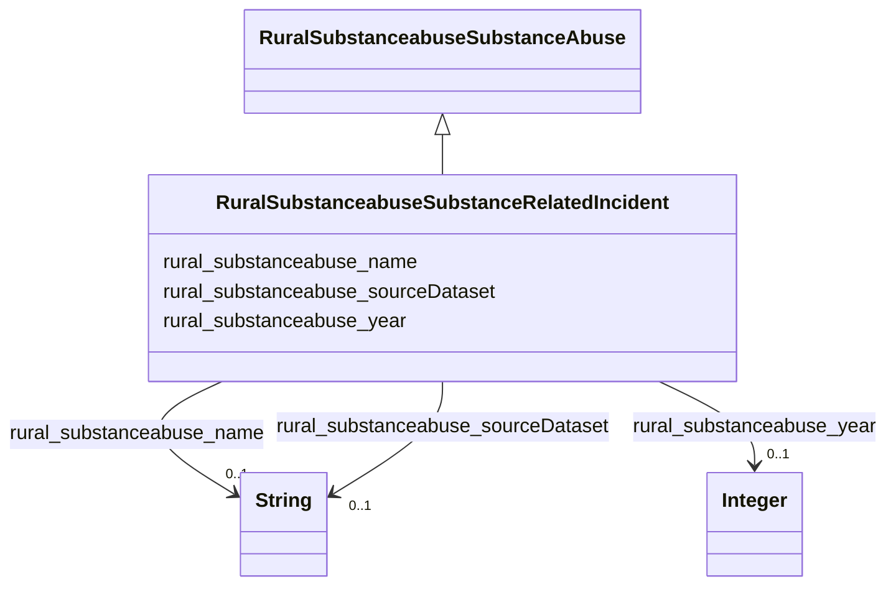

# Class: TODO -- what's a good name for what this class (type) describes? (rural_substanceabuse_SubstanceRelatedIncident)


_Types of incidents related to substance abuse._


URI: [rural:substanceabuse/SubstanceRelatedIncident](http://sail.ua.edu/ruralkg/substanceabuse/SubstanceRelatedIncident)





## Inheritance
* [RuralSubstanceabuseSubstanceAbuse](../classes/RuralSubstanceabuseSubstanceAbuse.md)
    * **RuralSubstanceabuseSubstanceRelatedIncident**


## Slots

| Name | Cardinality and Range | Description | Inheritance |
| ---  | --- | --- | --- |
| [rural_substanceabuse_name](../slots/rural_substanceabuse_name.md) | 0..1 <br/> [xsd:string](http://www.w3.org/2001/XMLSchema#string) | No slot description provided <br/> 25 occurrences with subject type rural_substanceabuse_Substance and object type string.<br/>17 occurrences with subject type rural_substanceabuse_SubstanceRelatedIncident and object type string. | direct |
| [rural_substanceabuse_sourceDataset](../slots/rural_substanceabuse_sourceDataset.md) | 0..1 <br/> [xsd:string](http://www.w3.org/2001/XMLSchema#string) | No slot description provided <br/> 17 occurrences with subject type rural_substanceabuse_SubstanceRelatedIncident and object type string.<br/>25 occurrences with subject type rural_substanceabuse_Substance and object type string. | direct |
| [rural_substanceabuse_year](../slots/rural_substanceabuse_year.md) | 0..1 <br/> [xsd:integer](http://www.w3.org/2001/XMLSchema#integer) | No slot description provided <br/> 25 occurrences with subject type rural_substanceabuse_Substance and object type integer.<br/>17 occurrences with subject type rural_substanceabuse_SubstanceRelatedIncident and object type integer. | direct |


## Examples

| Value |
| --- |
| rural:substanceabuse/SIT_14 |


## TODOs

* TODO -- Todos for this class go here
* or you can delete the todos
* if you think the class is perfect.

## Identifier and Mapping Information


### Schema Source


* from schema: rural-kg


## Mappings

| Mapping Type | Mapped Value |
| ---  | ---  |
| self | rural:substanceabuse/SubstanceRelatedIncident |
| native | rural-kg/:RuralSubstanceabuseSubstanceRelatedIncident |


## LinkML Source

<!-- TODO: investigate https://stackoverflow.com/questions/37606292/how-to-create-tabbed-code-blocks-in-mkdocs-or-sphinx -->

### Direct

<details>
```yaml
name: rural_substanceabuse_SubstanceRelatedIncident
description: Types of incidents related to substance abuse.
title: TODO -- what's a good name for what this class (type) describes?
todos:
- TODO -- Todos for this class go here
- or you can delete the todos
- if you think the class is perfect.
notes:
- There are 17 instances of this class.
examples:
- value: rural:substanceabuse/SIT_14
from_schema: rural-kg
rank: 1000
is_a: rural_substanceabuse_SubstanceAbuse
slots:
- rural_substanceabuse_name
- rural_substanceabuse_sourceDataset
- rural_substanceabuse_year
class_uri: rural:substanceabuse/SubstanceRelatedIncident

```
</details>

### Induced

<details>
```yaml
name: rural_substanceabuse_SubstanceRelatedIncident
description: Types of incidents related to substance abuse.
title: TODO -- what's a good name for what this class (type) describes?
todos:
- TODO -- Todos for this class go here
- or you can delete the todos
- if you think the class is perfect.
notes:
- There are 17 instances of this class.
examples:
- value: rural:substanceabuse/SIT_14
from_schema: rural-kg
rank: 1000
is_a: rural_substanceabuse_SubstanceAbuse
attributes:
  rural_substanceabuse_name:
    name: rural_substanceabuse_name
    description: No slot description provided
    todos:
    - TODO -- Todos for this slot go here
    - or you can delete the todos
    - if you think the class is perfect.
    comments:
    - 25 occurrences with subject type rural_substanceabuse_Substance and object type
      string.
    - 17 occurrences with subject type rural_substanceabuse_SubstanceRelatedIncident
      and object type string.
    examples:
    - value: rural:substanceabuse/Substance_16 rural:substanceabuse/name pcp
    - value: rural:substanceabuse/SIT_13 rural:substanceabuse/name On Parole
    from_schema: rural-kg
    rank: 1000
    slot_uri: rural:substanceabuse/name
    alias: rural_substanceabuse_name
    owner: rural_substanceabuse_SubstanceRelatedIncident
    domain_of:
    - rural_substanceabuse_Substance
    - rural_substanceabuse_SubstanceRelatedIncident
    range: string
  rural_substanceabuse_sourceDataset:
    name: rural_substanceabuse_sourceDataset
    description: No slot description provided
    todos:
    - TODO -- Todos for this slot go here
    - or you can delete the todos
    - if you think the class is perfect.
    comments:
    - 17 occurrences with subject type rural_substanceabuse_SubstanceRelatedIncident
      and object type string.
    - 25 occurrences with subject type rural_substanceabuse_Substance and object type
      string.
    examples:
    - value: rural:substanceabuse/SIT_4 rural:substanceabuse/sourceDataset NSDUH
    - value: rural:substanceabuse/Substance_2 rural:substanceabuse/sourceDataset NSDUH
    from_schema: rural-kg
    rank: 1000
    slot_uri: rural:substanceabuse/sourceDataset
    alias: rural_substanceabuse_sourceDataset
    owner: rural_substanceabuse_SubstanceRelatedIncident
    domain_of:
    - rural_substanceabuse_Substance
    - rural_substanceabuse_SubstanceRelatedIncident
    range: string
  rural_substanceabuse_year:
    name: rural_substanceabuse_year
    description: No slot description provided
    todos:
    - TODO -- Todos for this slot go here
    - or you can delete the todos
    - if you think the class is perfect.
    comments:
    - 25 occurrences with subject type rural_substanceabuse_Substance and object type
      integer.
    - 17 occurrences with subject type rural_substanceabuse_SubstanceRelatedIncident
      and object type integer.
    examples:
    - value: rural:substanceabuse/Substance_13 rural:substanceabuse/year 2022
    - value: rural:substanceabuse/SIT_4 rural:substanceabuse/year 2022
    from_schema: rural-kg
    rank: 1000
    slot_uri: rural:substanceabuse/year
    alias: rural_substanceabuse_year
    owner: rural_substanceabuse_SubstanceRelatedIncident
    domain_of:
    - rural_substanceabuse_Substance
    - rural_substanceabuse_SubstanceRelatedIncident
    range: integer
class_uri: rural:substanceabuse/SubstanceRelatedIncident

```
</details>