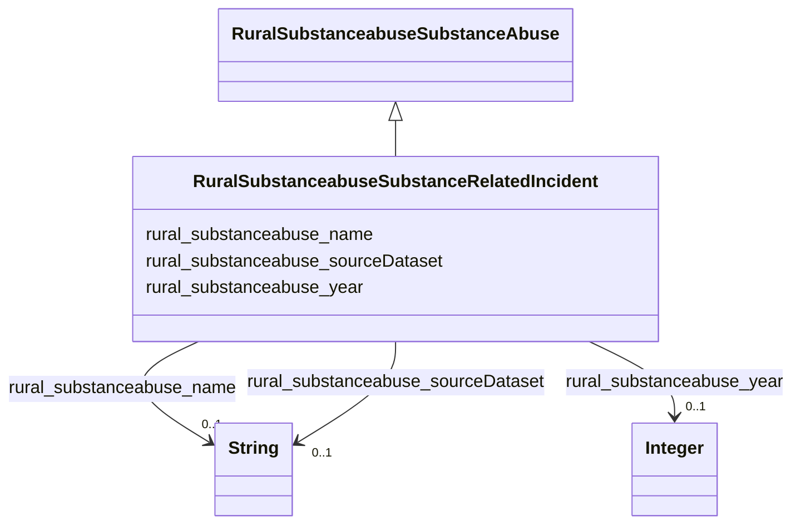

# Class: No class (type) name specified (rural_substanceabuse_SubstanceRelatedIncident)


_No class (type) description specified_


URI: [rural:substanceabuse/SubstanceRelatedIncident](http://sail.ua.edu/ruralkg/substanceabuse/SubstanceRelatedIncident)





## Inheritance
* [RuralSubstanceabuseSubstanceAbuse](../classes/RuralSubstanceabuseSubstanceAbuse.md)
    * **RuralSubstanceabuseSubstanceRelatedIncident**


## Slots

| Name | Cardinality and Range | Description | Inheritance |
| ---  | --- | --- | --- |
| [rural_substanceabuse_sourceDataset](../slots/rural_substanceabuse_sourceDataset.md) | 0..1 <br/> [xsd:string](xsd:string) | No slot (predicate) description specified <br/> 17 occurrences with subject type rural_substanceabuse_SubstanceRelatedIncident and object type string.<br/>25 occurrences with subject type rural_substanceabuse_Substance and object type string. | direct |
| [rural_substanceabuse_year](../slots/rural_substanceabuse_year.md) | 0..1 <br/> [xsd:integer](xsd:integer) | No slot (predicate) description specified <br/> 17 occurrences with subject type rural_substanceabuse_SubstanceRelatedIncident and object type integer.<br/>25 occurrences with subject type rural_substanceabuse_Substance and object type integer. | direct |
| [rural_substanceabuse_name](../slots/rural_substanceabuse_name.md) | 0..1 <br/> [xsd:string](xsd:string) | No slot (predicate) description specified <br/> 17 occurrences with subject type rural_substanceabuse_SubstanceRelatedIncident and object type string.<br/>25 occurrences with subject type rural_substanceabuse_Substance and object type string. | direct |


## Comments

* Types of incidents related to substance abuse.

## Identifier and Mapping Information


### Schema Source


* from schema: rural-kg


## Mappings

| Mapping Type | Mapped Value |
| ---  | ---  |
| self | rural:substanceabuse/SubstanceRelatedIncident |
| native | rural-kg/:RuralSubstanceabuseSubstanceRelatedIncident |


## LinkML Source

<!-- TODO: investigate https://stackoverflow.com/questions/37606292/how-to-create-tabbed-code-blocks-in-mkdocs-or-sphinx -->

### Direct

<details>
```yaml
name: rural_substanceabuse_SubstanceRelatedIncident
conforms_to: No schema conformance document specified
description: No class (type) description specified
title: No class (type) name specified
notes:
- Class with 17 occurrences.
comments:
- Types of incidents related to substance abuse.
from_schema: rural-kg
rank: 1000
is_a: rural_substanceabuse_SubstanceAbuse
slots:
- rural_substanceabuse_sourceDataset
- rural_substanceabuse_year
- rural_substanceabuse_name
class_uri: rural:substanceabuse/SubstanceRelatedIncident

```
</details>

### Induced

<details>
```yaml
name: rural_substanceabuse_SubstanceRelatedIncident
conforms_to: No schema conformance document specified
description: No class (type) description specified
title: No class (type) name specified
notes:
- Class with 17 occurrences.
comments:
- Types of incidents related to substance abuse.
from_schema: rural-kg
rank: 1000
is_a: rural_substanceabuse_SubstanceAbuse
attributes:
  rural_substanceabuse_sourceDataset:
    name: rural_substanceabuse_sourceDataset
    description: No slot (predicate) description specified
    comments:
    - 17 occurrences with subject type rural_substanceabuse_SubstanceRelatedIncident
      and object type string.
    - 25 occurrences with subject type rural_substanceabuse_Substance and object type
      string.
    examples:
    - description: rural_substanceabuse_SubstanceRelatedIncident → string
      object:
        example_object: NSDUH
        example_predicate: rural:substanceabuse/sourceDataset
        example_subject: rural:substanceabuse/SIT_1
    - description: rural_substanceabuse_Substance → string
      object:
        example_object: NSDUH
        example_predicate: rural:substanceabuse/sourceDataset
        example_subject: rural:substanceabuse/Substance_1
    from_schema: rural-kg
    rank: 1000
    slot_uri: rural:substanceabuse/sourceDataset
    alias: rural_substanceabuse_sourceDataset
    owner: rural_substanceabuse_SubstanceRelatedIncident
    domain_of:
    - rural_substanceabuse_Substance
    - rural_substanceabuse_SubstanceRelatedIncident
    range: string
  rural_substanceabuse_year:
    name: rural_substanceabuse_year
    description: No slot (predicate) description specified
    comments:
    - 17 occurrences with subject type rural_substanceabuse_SubstanceRelatedIncident
      and object type integer.
    - 25 occurrences with subject type rural_substanceabuse_Substance and object type
      integer.
    examples:
    - description: rural_substanceabuse_SubstanceRelatedIncident → integer
      object:
        example_object: '2022'
        example_predicate: rural:substanceabuse/year
        example_subject: rural:substanceabuse/SIT_1
    - description: rural_substanceabuse_Substance → integer
      object:
        example_object: '2022'
        example_predicate: rural:substanceabuse/year
        example_subject: rural:substanceabuse/Substance_1
    from_schema: rural-kg
    rank: 1000
    slot_uri: rural:substanceabuse/year
    alias: rural_substanceabuse_year
    owner: rural_substanceabuse_SubstanceRelatedIncident
    domain_of:
    - rural_substanceabuse_Substance
    - rural_substanceabuse_SubstanceRelatedIncident
    range: integer
  rural_substanceabuse_name:
    name: rural_substanceabuse_name
    description: No slot (predicate) description specified
    comments:
    - 17 occurrences with subject type rural_substanceabuse_SubstanceRelatedIncident
      and object type string.
    - 25 occurrences with subject type rural_substanceabuse_Substance and object type
      string.
    examples:
    - description: rural_substanceabuse_SubstanceRelatedIncident → string
      object:
        example_object: Drive Under Influence
        example_predicate: rural:substanceabuse/name
        example_subject: rural:substanceabuse/SIT_1
    - description: rural_substanceabuse_Substance → string
      object:
        example_object: nicotine
        example_predicate: rural:substanceabuse/name
        example_subject: rural:substanceabuse/Substance_1
    from_schema: rural-kg
    rank: 1000
    slot_uri: rural:substanceabuse/name
    alias: rural_substanceabuse_name
    owner: rural_substanceabuse_SubstanceRelatedIncident
    domain_of:
    - rural_substanceabuse_Substance
    - rural_substanceabuse_SubstanceRelatedIncident
    range: string
class_uri: rural:substanceabuse/SubstanceRelatedIncident

```
</details>