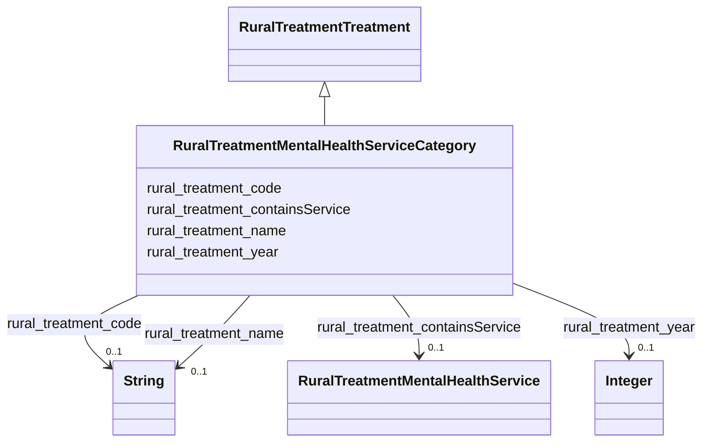

# Class: RuralTreatmentMentalHealthServiceCategory


_Categories of mental health services._


This class occurs 21 times.


URI: [rural:treatment/MentalHealthServiceCategory](http://sail.ua.edu/ruralkg/treatment/MentalHealthServiceCategory)





## Inheritance
* [RuralTreatmentTreatment](../classes/RuralTreatmentTreatment.md)
    * **RuralTreatmentMentalHealthServiceCategory**


## Slots

| Name | Cardinality and Range | Description | Inheritance | Occurrences |
| ---  | --- | --- | --- | --- |
| [rural_treatment_year](../slots/rural_treatment_year.md) | 0..1 <br/> [xsd:integer](xsd:integer) |  <br/>  | direct | 21 |
| [rural_treatment_code](../slots/rural_treatment_code.md) | 0..1 <br/> [xsd:string](xsd:string) |  <br/>  | direct | 21 |
| [rural_treatment_containsService](../slots/rural_treatment_containsService.md) | 0..1 <br/> [RuralTreatmentMentalHealthService](../classes/RuralTreatmentMentalHealthService.md) |  <br/>  | direct | 176 |
| [rural_treatment_name](../slots/rural_treatment_name.md) | 0..1 <br/> [xsd:string](xsd:string) |  <br/>  | direct | 21 |


## LinkML Source

<!-- TODO: investigate https://stackoverflow.com/questions/37606292/how-to-create-tabbed-code-blocks-in-mkdocs-or-sphinx -->

### Direct

<details>

```yaml
name: rural_treatment_MentalHealthServiceCategory
description: Categories of mental health services.
from_schema: okns:rural-kg
rank: 1000
is_a: rural_treatment_Treatment
slots:
- rural_treatment_year
- rural_treatment_code
- rural_treatment_containsService
- rural_treatment_name
class_uri: rural:treatment/MentalHealthServiceCategory

```
</details>

### Induced

<details>

```yaml
name: rural_treatment_MentalHealthServiceCategory
description: Categories of mental health services.
from_schema: okns:rural-kg
rank: 1000
is_a: rural_treatment_Treatment
attributes:
  rural_treatment_year:
    name: rural_treatment_year
    from_schema: okns:rural-kg
    rank: 1000
    slot_uri: rural:treatment/year
    alias: rural_treatment_year
    owner: rural_treatment_MentalHealthServiceCategory
    domain_of:
    - rural_treatment_MentalHealthService
    - rural_treatment_MentalHealthServiceCategory
    range: integer
  rural_treatment_code:
    name: rural_treatment_code
    from_schema: okns:rural-kg
    rank: 1000
    slot_uri: rural:treatment/code
    alias: rural_treatment_code
    owner: rural_treatment_MentalHealthServiceCategory
    domain_of:
    - rural_treatment_MentalHealthService
    - rural_treatment_MentalHealthServiceCategory
    range: string
  rural_treatment_containsService:
    name: rural_treatment_containsService
    from_schema: okns:rural-kg
    rank: 1000
    slot_uri: rural:treatment/containsService
    alias: rural_treatment_containsService
    owner: rural_treatment_MentalHealthServiceCategory
    domain_of:
    - rural_treatment_MentalHealthServiceCategory
    range: rural_treatment_MentalHealthService
  rural_treatment_name:
    name: rural_treatment_name
    from_schema: okns:rural-kg
    rank: 1000
    slot_uri: rural:treatment/name
    alias: rural_treatment_name
    owner: rural_treatment_MentalHealthServiceCategory
    domain_of:
    - rural_treatment_MentalHealthService
    - rural_treatment_MentalHealthServiceCategory
    - rural_treatment_TreatmentProvider
    range: string
class_uri: rural:treatment/MentalHealthServiceCategory

```
</details>