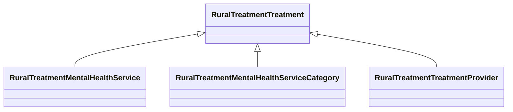

# Class: Treatment (rural_treatment_Treatment)


_Mental health services and treatment providers, sourcing from National Directory Of Mental Health Treatment Facilities._


URI: [rural:treatment/Treatment](http://sail.ua.edu/ruralkg/treatment/Treatment)





## Inheritance
* **RuralTreatmentTreatment**
    * [RuralTreatmentMentalHealthService](../classes/RuralTreatmentMentalHealthService.md)
    * [RuralTreatmentMentalHealthServiceCategory](../classes/RuralTreatmentMentalHealthServiceCategory.md)
    * [RuralTreatmentTreatmentProvider](../classes/RuralTreatmentTreatmentProvider.md)


## Slots

| Name | Cardinality and Range | Description | Inheritance | Occurrences |
| ---  | --- | --- | --- | --- |


## LinkML Source

<!-- TODO: investigate https://stackoverflow.com/questions/37606292/how-to-create-tabbed-code-blocks-in-mkdocs-or-sphinx -->

### Direct

<details>

```yaml
name: rural_treatment_Treatment
description: Mental health services and treatment providers, sourcing from National
  Directory Of Mental Health Treatment Facilities.
title: Treatment
from_schema: okns:rural-kg
source: http://sail.ua.edu/ruralkg/ontology
rank: 1000
class_uri: rural:treatment/Treatment

```
</details>

### Induced

<details>

```yaml
name: rural_treatment_Treatment
description: Mental health services and treatment providers, sourcing from National
  Directory Of Mental Health Treatment Facilities.
title: Treatment
from_schema: okns:rural-kg
source: http://sail.ua.edu/ruralkg/ontology
rank: 1000
class_uri: rural:treatment/Treatment

```
</details>