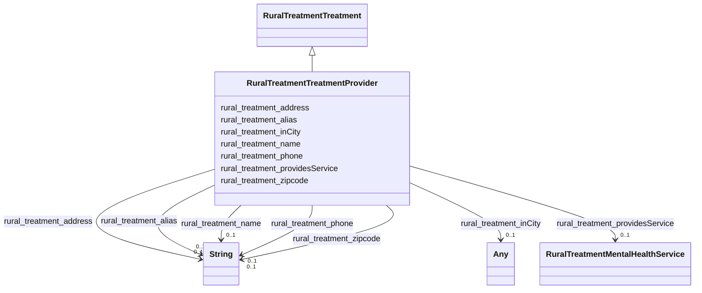

# Class: RuralTreatmentTreatmentProvider


_Entities that provide treatment services._


This class occurs 9037 times.


URI: [rural:treatment/TreatmentProvider](http://sail.ua.edu/ruralkg/treatment/TreatmentProvider)





## Inheritance
* [RuralTreatmentTreatment](../classes/RuralTreatmentTreatment.md)
    * **RuralTreatmentTreatmentProvider**


## Slots

| Name | Cardinality and Range | Description | Inheritance | Occurrences |
| ---  | --- | --- | --- | --- |
| [rural_treatment_alias](../slots/rural_treatment_alias.md) | 0..1 <br/> [xsd:string](xsd:string) |  <br/>  | direct | 9037 |
| [rural_treatment_zipcode](../slots/rural_treatment_zipcode.md) | 0..1 <br/> [xsd:string](xsd:string) |  <br/>  | direct | 9037 |
| [rural_treatment_providesService](../slots/rural_treatment_providesService.md) | 0..1 <br/> [RuralTreatmentMentalHealthService](../classes/RuralTreatmentMentalHealthService.md) |  <br/>  | direct | 442841 |
| [rural_treatment_inCity](../slots/rural_treatment_inCity.md) | 0..1 <br/> [xsd:anyURI](xsd:anyURI)&nbsp;or&nbsp;<br />[RuralAdministrativeareaCity](../classes/RuralAdministrativeareaCity.md) |  <br/>  | direct | 9037 |
| [rural_treatment_name](../slots/rural_treatment_name.md) | 0..1 <br/> [xsd:string](xsd:string) |  <br/>  | direct | 9037 |
| [rural_treatment_phone](../slots/rural_treatment_phone.md) | 0..1 <br/> [xsd:string](xsd:string) |  <br/>  | direct | 9037 |
| [rural_treatment_address](../slots/rural_treatment_address.md) | 0..1 <br/> [xsd:string](xsd:string) |  <br/>  | direct | 9037 |


## LinkML Source

<!-- TODO: investigate https://stackoverflow.com/questions/37606292/how-to-create-tabbed-code-blocks-in-mkdocs-or-sphinx -->

### Direct

<details>

```yaml
name: rural_treatment_TreatmentProvider
description: Entities that provide treatment services.
from_schema: okns:rural-kg
rank: 1000
is_a: rural_treatment_Treatment
slots:
- rural_treatment_alias
- rural_treatment_zipcode
- rural_treatment_providesService
- rural_treatment_inCity
- rural_treatment_name
- rural_treatment_phone
- rural_treatment_address
class_uri: rural:treatment/TreatmentProvider

```
</details>

### Induced

<details>

```yaml
name: rural_treatment_TreatmentProvider
description: Entities that provide treatment services.
from_schema: okns:rural-kg
rank: 1000
is_a: rural_treatment_Treatment
attributes:
  rural_treatment_alias:
    name: rural_treatment_alias
    from_schema: okns:rural-kg
    rank: 1000
    slot_uri: rural:treatment/alias
    alias: rural_treatment_alias
    owner: rural_treatment_TreatmentProvider
    domain_of:
    - rural_treatment_TreatmentProvider
    range: string
  rural_treatment_zipcode:
    name: rural_treatment_zipcode
    from_schema: okns:rural-kg
    rank: 1000
    slot_uri: rural:treatment/zipcode
    alias: rural_treatment_zipcode
    owner: rural_treatment_TreatmentProvider
    domain_of:
    - rural_treatment_TreatmentProvider
    range: string
  rural_treatment_providesService:
    name: rural_treatment_providesService
    from_schema: okns:rural-kg
    rank: 1000
    slot_uri: rural:treatment/providesService
    alias: rural_treatment_providesService
    owner: rural_treatment_TreatmentProvider
    domain_of:
    - rural_treatment_TreatmentProvider
    range: rural_treatment_MentalHealthService
  rural_treatment_inCity:
    name: rural_treatment_inCity
    from_schema: okns:rural-kg
    rank: 1000
    slot_uri: rural:treatment/inCity
    alias: rural_treatment_inCity
    owner: rural_treatment_TreatmentProvider
    domain_of:
    - rural_treatment_TreatmentProvider
    range: Any
    any_of:
    - range: uri
    - range: rural_administrativearea_City
  rural_treatment_name:
    name: rural_treatment_name
    from_schema: okns:rural-kg
    rank: 1000
    slot_uri: rural:treatment/name
    alias: rural_treatment_name
    owner: rural_treatment_TreatmentProvider
    domain_of:
    - rural_treatment_MentalHealthService
    - rural_treatment_MentalHealthServiceCategory
    - rural_treatment_TreatmentProvider
    range: string
  rural_treatment_phone:
    name: rural_treatment_phone
    from_schema: okns:rural-kg
    rank: 1000
    slot_uri: rural:treatment/phone
    alias: rural_treatment_phone
    owner: rural_treatment_TreatmentProvider
    domain_of:
    - rural_treatment_TreatmentProvider
    range: string
  rural_treatment_address:
    name: rural_treatment_address
    from_schema: okns:rural-kg
    rank: 1000
    slot_uri: rural:treatment/address
    alias: rural_treatment_address
    owner: rural_treatment_TreatmentProvider
    domain_of:
    - rural_treatment_TreatmentProvider
    range: string
class_uri: rural:treatment/TreatmentProvider

```
</details>