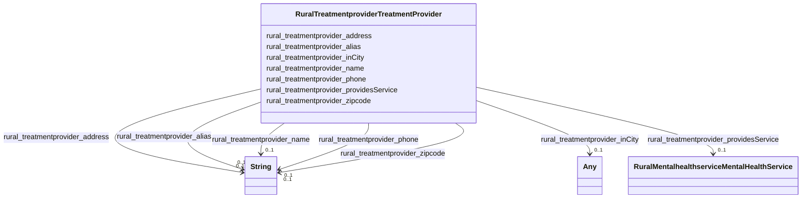

# Class: Treatment Provider (rural_treatmentprovider_TreatmentProvider)


_No class (type) description specified_


URI: [rural:treatmentprovider/TreatmentProvider](http://sail.ua.edu/ruralkg/treatmentprovider/TreatmentProvider)





<!-- no inheritance hierarchy -->


## Slots

| Name | Cardinality and Range | Description | Inheritance |
| ---  | --- | --- | --- |
| [rural_treatmentprovider_phone](../slots/rural_treatmentprovider_phone.md) | 0..1 <br/> [xsd:string](xsd:string) | No slot (predicate) description specified <br/> 9037 occurrences with subject type rural_treatmentprovider_TreatmentProvider and object type string. | direct |
| [rural_treatmentprovider_providesService](../slots/rural_treatmentprovider_providesService.md) | 0..1 <br/> [RuralMentalhealthserviceMentalHealthService](../classes/RuralMentalhealthserviceMentalHealthService.md) | No slot (predicate) description specified <br/> 442841 occurrences with subject type rural_treatmentprovider_TreatmentProvider and object type rural_mentalhealthservice_MentalHealthService. | direct |
| [rural_treatmentprovider_alias](../slots/rural_treatmentprovider_alias.md) | 0..1 <br/> [xsd:string](xsd:string) | No slot (predicate) description specified <br/> 9037 occurrences with subject type rural_treatmentprovider_TreatmentProvider and object type string. | direct |
| [rural_treatmentprovider_zipcode](../slots/rural_treatmentprovider_zipcode.md) | 0..1 <br/> [xsd:string](xsd:string) | No slot (predicate) description specified <br/> 9037 occurrences with subject type rural_treatmentprovider_TreatmentProvider and object type string. | direct |
| [rural_treatmentprovider_inCity](../slots/rural_treatmentprovider_inCity.md) | 0..1 <br/> [xsd:anyURI](xsd:anyURI)&nbsp;or&nbsp;<br />[RuralAdministrativeareaCity](../classes/RuralAdministrativeareaCity.md) | No slot (predicate) description specified <br/> 8117 occurrences with subject type rural_treatmentprovider_TreatmentProvider and object type rural_administrativearea_City.<br/>920 occurrences with subject type rural_treatmentprovider_TreatmentProvider and object type uri. | direct |
| [rural_treatmentprovider_name](../slots/rural_treatmentprovider_name.md) | 0..1 <br/> [xsd:string](xsd:string) | No slot (predicate) description specified <br/> 9037 occurrences with subject type rural_treatmentprovider_TreatmentProvider and object type string. | direct |
| [rural_treatmentprovider_address](../slots/rural_treatmentprovider_address.md) | 0..1 <br/> [xsd:string](xsd:string) | No slot (predicate) description specified <br/> 9037 occurrences with subject type rural_treatmentprovider_TreatmentProvider and object type string. | direct |


## Comments

* Entities that provide treatment services, sourcing from National Directory Of Mental Health Treatment Facilities.

## Identifier and Mapping Information


### Schema Source


* from schema: rural-kg


## Mappings

| Mapping Type | Mapped Value |
| ---  | ---  |
| self | rural:treatmentprovider/TreatmentProvider |
| native | rural-kg/:RuralTreatmentproviderTreatmentProvider |


## LinkML Source

<!-- TODO: investigate https://stackoverflow.com/questions/37606292/how-to-create-tabbed-code-blocks-in-mkdocs-or-sphinx -->

### Direct

<details>
```yaml
name: rural_treatmentprovider_TreatmentProvider
conforms_to: No schema conformance document specified
description: No class (type) description specified
title: Treatment Provider
notes:
- Class with 9037 occurrences.
comments:
- Entities that provide treatment services, sourcing from National Directory Of Mental
  Health Treatment Facilities.
from_schema: rural-kg
source: http://sail.ua.edu/ruralkg/ontology
rank: 1000
slots:
- rural_treatmentprovider_phone
- rural_treatmentprovider_providesService
- rural_treatmentprovider_alias
- rural_treatmentprovider_zipcode
- rural_treatmentprovider_inCity
- rural_treatmentprovider_name
- rural_treatmentprovider_address
class_uri: rural:treatmentprovider/TreatmentProvider

```
</details>

### Induced

<details>
```yaml
name: rural_treatmentprovider_TreatmentProvider
conforms_to: No schema conformance document specified
description: No class (type) description specified
title: Treatment Provider
notes:
- Class with 9037 occurrences.
comments:
- Entities that provide treatment services, sourcing from National Directory Of Mental
  Health Treatment Facilities.
from_schema: rural-kg
source: http://sail.ua.edu/ruralkg/ontology
rank: 1000
attributes:
  rural_treatmentprovider_phone:
    name: rural_treatmentprovider_phone
    description: No slot (predicate) description specified
    comments:
    - 9037 occurrences with subject type rural_treatmentprovider_TreatmentProvider
      and object type string.
    examples:
    - description: rural_treatmentprovider_TreatmentProvider → string
      object:
        example_object: 800-951-4357
        example_predicate: rural:treatmentprovider/phone
        example_subject: rural:treatmentprovider/TP_1
    from_schema: rural-kg
    rank: 1000
    slot_uri: rural:treatmentprovider/phone
    alias: rural_treatmentprovider_phone
    owner: rural_treatmentprovider_TreatmentProvider
    domain_of:
    - rural_treatmentprovider_TreatmentProvider
    range: string
  rural_treatmentprovider_providesService:
    name: rural_treatmentprovider_providesService
    description: No slot (predicate) description specified
    comments:
    - 442841 occurrences with subject type rural_treatmentprovider_TreatmentProvider
      and object type rural_mentalhealthservice_MentalHealthService.
    examples:
    - description: rural_treatmentprovider_TreatmentProvider → rural_mentalhealthservice_MentalHealthService
      object:
        example_object: rural:mentalhealthservice/MHS_YAD
        example_predicate: rural:treatmentprovider/providesService
        example_subject: rural:treatmentprovider/TP_999
    from_schema: rural-kg
    rank: 1000
    slot_uri: rural:treatmentprovider/providesService
    alias: rural_treatmentprovider_providesService
    owner: rural_treatmentprovider_TreatmentProvider
    domain_of:
    - rural_treatmentprovider_TreatmentProvider
    range: rural_mentalhealthservice_MentalHealthService
  rural_treatmentprovider_alias:
    name: rural_treatmentprovider_alias
    description: No slot (predicate) description specified
    comments:
    - 9037 occurrences with subject type rural_treatmentprovider_TreatmentProvider
      and object type string.
    examples:
    - description: rural_treatmentprovider_TreatmentProvider → string
      object:
        example_object: Henry County Clinic
        example_predicate: rural:treatmentprovider/alias
        example_subject: rural:treatmentprovider/TP_1
    from_schema: rural-kg
    rank: 1000
    slot_uri: rural:treatmentprovider/alias
    alias: rural_treatmentprovider_alias
    owner: rural_treatmentprovider_TreatmentProvider
    domain_of:
    - rural_treatmentprovider_TreatmentProvider
    range: string
  rural_treatmentprovider_zipcode:
    name: rural_treatmentprovider_zipcode
    description: No slot (predicate) description specified
    comments:
    - 9037 occurrences with subject type rural_treatmentprovider_TreatmentProvider
      and object type string.
    examples:
    - description: rural_treatmentprovider_TreatmentProvider → string
      object:
        example_object: '36310'
        example_predicate: rural:treatmentprovider/zipcode
        example_subject: rural:treatmentprovider/TP_1
    from_schema: rural-kg
    rank: 1000
    slot_uri: rural:treatmentprovider/zipcode
    alias: rural_treatmentprovider_zipcode
    owner: rural_treatmentprovider_TreatmentProvider
    domain_of:
    - rural_treatmentprovider_TreatmentProvider
    range: string
  rural_treatmentprovider_inCity:
    name: rural_treatmentprovider_inCity
    description: No slot (predicate) description specified
    comments:
    - 8117 occurrences with subject type rural_treatmentprovider_TreatmentProvider
      and object type rural_administrativearea_City.
    - 920 occurrences with subject type rural_treatmentprovider_TreatmentProvider
      and object type uri.
    examples:
    - description: rural_treatmentprovider_TreatmentProvider → rural_administrativearea_City
      object:
        example_object: rural:administrativearea/City_1840020296
        example_predicate: rural:treatmentprovider/inCity
        example_subject: rural:treatmentprovider/TP_999
    - description: rural_treatmentprovider_TreatmentProvider → uri
      object:
        example_object: rural:administrativearea/City_None
        example_predicate: rural:treatmentprovider/inCity
        example_subject: rural:treatmentprovider/TP_1107
    from_schema: rural-kg
    rank: 1000
    slot_uri: rural:treatmentprovider/inCity
    alias: rural_treatmentprovider_inCity
    owner: rural_treatmentprovider_TreatmentProvider
    domain_of:
    - rural_treatmentprovider_TreatmentProvider
    range: Any
    any_of:
    - range: uri
    - range: rural_administrativearea_City
  rural_treatmentprovider_name:
    name: rural_treatmentprovider_name
    description: No slot (predicate) description specified
    comments:
    - 9037 occurrences with subject type rural_treatmentprovider_TreatmentProvider
      and object type string.
    examples:
    - description: rural_treatmentprovider_TreatmentProvider → string
      object:
        example_object: SpectraCare Health Systems
        example_predicate: rural:treatmentprovider/name
        example_subject: rural:treatmentprovider/TP_1
    from_schema: rural-kg
    rank: 1000
    slot_uri: rural:treatmentprovider/name
    alias: rural_treatmentprovider_name
    owner: rural_treatmentprovider_TreatmentProvider
    domain_of:
    - rural_treatmentprovider_TreatmentProvider
    range: string
  rural_treatmentprovider_address:
    name: rural_treatmentprovider_address
    description: No slot (predicate) description specified
    comments:
    - 9037 occurrences with subject type rural_treatmentprovider_TreatmentProvider
      and object type string.
    examples:
    - description: rural_treatmentprovider_TreatmentProvider → string
      object:
        example_object: 219 Dothan Road, NaN
        example_predicate: rural:treatmentprovider/address
        example_subject: rural:treatmentprovider/TP_1
    from_schema: rural-kg
    rank: 1000
    slot_uri: rural:treatmentprovider/address
    alias: rural_treatmentprovider_address
    owner: rural_treatmentprovider_TreatmentProvider
    domain_of:
    - rural_treatmentprovider_TreatmentProvider
    range: string
class_uri: rural:treatmentprovider/TreatmentProvider

```
</details>