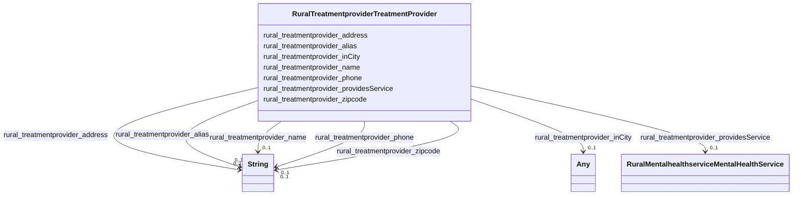

# Class: TODO -- what's a good name for what this class (type) describes? (rural_treatmentprovider_TreatmentProvider)


_TODO -- tell the world what this class (type) describes._


URI: [rural:treatmentprovider/TreatmentProvider](http://sail.ua.edu/ruralkg/treatmentprovider/TreatmentProvider)





<!-- no inheritance hierarchy -->


## Slots

| Name | Cardinality and Range | Description | Inheritance |
| ---  | --- | --- | --- |
| [rural_treatmentprovider_providesService](../slots/rural_treatmentprovider_providesService.md) | 0..1 <br/> [RuralMentalhealthserviceMentalHealthService](../classes/RuralMentalhealthserviceMentalHealthService.md) | TODO -- tell the world what this slot (predicate) describes | direct |
| [rural_treatmentprovider_inCity](../slots/rural_treatmentprovider_inCity.md) | 0..1 <br/> [Any](../classes/Any.md)&nbsp;or&nbsp;<br />[RuralAdministrativeareaCity](../classes/RuralAdministrativeareaCity.md)&nbsp;or&nbsp;<br />[xsd:anyURI](http://www.w3.org/2001/XMLSchema#anyURI) | TODO -- tell the world what this slot (predicate) describes | direct |
| [rural_treatmentprovider_name](../slots/rural_treatmentprovider_name.md) | 0..1 <br/> [xsd:string](http://www.w3.org/2001/XMLSchema#string) | TODO -- tell the world what this slot (predicate) describes | direct |
| [rural_treatmentprovider_alias](../slots/rural_treatmentprovider_alias.md) | 0..1 <br/> [xsd:string](http://www.w3.org/2001/XMLSchema#string) | TODO -- tell the world what this slot (predicate) describes | direct |
| [rural_treatmentprovider_address](../slots/rural_treatmentprovider_address.md) | 0..1 <br/> [xsd:string](http://www.w3.org/2001/XMLSchema#string) | TODO -- tell the world what this slot (predicate) describes | direct |
| [rural_treatmentprovider_zipcode](../slots/rural_treatmentprovider_zipcode.md) | 0..1 <br/> [xsd:string](http://www.w3.org/2001/XMLSchema#string) | TODO -- tell the world what this slot (predicate) describes | direct |
| [rural_treatmentprovider_phone](../slots/rural_treatmentprovider_phone.md) | 0..1 <br/> [xsd:string](http://www.w3.org/2001/XMLSchema#string) | TODO -- tell the world what this slot (predicate) describes | direct |


## Examples

| Value |
| --- |
| rural:treatmentprovider/TP_5650 |

## TODOs

* TODO -- Todos for this class go here
* or you can delete the todos
* if you think the class is perfect.

## Identifier and Mapping Information


### Schema Source


* from schema: rural-kg


## Mappings

| Mapping Type | Mapped Value |
| ---  | ---  |
| self | rural:treatmentprovider/TreatmentProvider |
| native | rural-kg/:RuralTreatmentproviderTreatmentProvider |


## LinkML Source

<!-- TODO: investigate https://stackoverflow.com/questions/37606292/how-to-create-tabbed-code-blocks-in-mkdocs-or-sphinx -->

### Direct

<details>
```yaml
name: rural_treatmentprovider_TreatmentProvider
description: TODO -- tell the world what this class (type) describes.
title: TODO -- what's a good name for what this class (type) describes?
todos:
- TODO -- Todos for this class go here
- or you can delete the todos
- if you think the class is perfect.
notes:
- There are 9037 instances of this class.
examples:
- value: rural:treatmentprovider/TP_5650
from_schema: rural-kg
slots:
- rural_treatmentprovider_providesService
- rural_treatmentprovider_inCity
- rural_treatmentprovider_name
- rural_treatmentprovider_alias
- rural_treatmentprovider_address
- rural_treatmentprovider_zipcode
- rural_treatmentprovider_phone
class_uri: rural:treatmentprovider/TreatmentProvider

```
</details>

### Induced

<details>
```yaml
name: rural_treatmentprovider_TreatmentProvider
description: TODO -- tell the world what this class (type) describes.
title: TODO -- what's a good name for what this class (type) describes?
todos:
- TODO -- Todos for this class go here
- or you can delete the todos
- if you think the class is perfect.
notes:
- There are 9037 instances of this class.
examples:
- value: rural:treatmentprovider/TP_5650
from_schema: rural-kg
attributes:
  rural_treatmentprovider_providesService:
    name: rural_treatmentprovider_providesService
    description: TODO -- tell the world what this slot (predicate) describes.
    todos:
    - TODO -- Todos for this slot go here
    - or you can delete the todos
    - if you think the class is perfect.
    comments:
    - 442841 occurrences with subject type rural_treatmentprovider_TreatmentProvider
      and object type rural_mentalhealthservice_MentalHealthService.
    examples:
    - value: rural:treatmentprovider/TP_8936 rural:treatmentprovider/providesService
        rural:mentalhealthservice/MHS_SED
    from_schema: rural-kg
    rank: 1000
    slot_uri: rural:treatmentprovider/providesService
    alias: rural_treatmentprovider_providesService
    owner: rural_treatmentprovider_TreatmentProvider
    domain_of:
    - rural_treatmentprovider_TreatmentProvider
    range: rural_mentalhealthservice_MentalHealthService
  rural_treatmentprovider_inCity:
    name: rural_treatmentprovider_inCity
    description: TODO -- tell the world what this slot (predicate) describes.
    todos:
    - TODO -- Todos for this slot go here
    - or you can delete the todos
    - if you think the class is perfect.
    comments:
    - 8117 occurrences with subject type rural_treatmentprovider_TreatmentProvider
      and object type rural_administrativearea_City.
    - 920 occurrences with subject type rural_treatmentprovider_TreatmentProvider
      and object type uri.
    examples:
    - value: rural:treatmentprovider/TP_5424 rural:treatmentprovider/inCity rural:administrativearea/City_1840034030
    - value: rural:treatmentprovider/TP_8417 rural:treatmentprovider/inCity rural:administrativearea/City_None
    from_schema: rural-kg
    rank: 1000
    slot_uri: rural:treatmentprovider/inCity
    alias: rural_treatmentprovider_inCity
    owner: rural_treatmentprovider_TreatmentProvider
    domain_of:
    - rural_treatmentprovider_TreatmentProvider
    range: Any
    any_of:
    - range: rural_administrativearea_City
    - range: uri
  rural_treatmentprovider_name:
    name: rural_treatmentprovider_name
    description: TODO -- tell the world what this slot (predicate) describes.
    todos:
    - TODO -- Todos for this slot go here
    - or you can delete the todos
    - if you think the class is perfect.
    comments:
    - 9037 occurrences with subject type rural_treatmentprovider_TreatmentProvider
      and object type string.
    examples:
    - value: rural:treatmentprovider/TP_6853 rural:treatmentprovider/name Lifeways
        Inc
    from_schema: rural-kg
    rank: 1000
    slot_uri: rural:treatmentprovider/name
    alias: rural_treatmentprovider_name
    owner: rural_treatmentprovider_TreatmentProvider
    domain_of:
    - rural_treatmentprovider_TreatmentProvider
    range: string
  rural_treatmentprovider_alias:
    name: rural_treatmentprovider_alias
    description: TODO -- tell the world what this slot (predicate) describes.
    todos:
    - TODO -- Todos for this slot go here
    - or you can delete the todos
    - if you think the class is perfect.
    comments:
    - 9037 occurrences with subject type rural_treatmentprovider_TreatmentProvider
      and object type string.
    examples:
    - value: rural:treatmentprovider/TP_3675 rural:treatmentprovider/alias NaN
    from_schema: rural-kg
    rank: 1000
    slot_uri: rural:treatmentprovider/alias
    alias: rural_treatmentprovider_alias
    owner: rural_treatmentprovider_TreatmentProvider
    domain_of:
    - rural_treatmentprovider_TreatmentProvider
    range: string
  rural_treatmentprovider_address:
    name: rural_treatmentprovider_address
    description: TODO -- tell the world what this slot (predicate) describes.
    todos:
    - TODO -- Todos for this slot go here
    - or you can delete the todos
    - if you think the class is perfect.
    comments:
    - 9037 occurrences with subject type rural_treatmentprovider_TreatmentProvider
      and object type string.
    examples:
    - value: rural:treatmentprovider/TP_3342 rural:treatmentprovider/address 1705
        Felicia Avenue, NaN
    from_schema: rural-kg
    rank: 1000
    slot_uri: rural:treatmentprovider/address
    alias: rural_treatmentprovider_address
    owner: rural_treatmentprovider_TreatmentProvider
    domain_of:
    - rural_treatmentprovider_TreatmentProvider
    range: string
  rural_treatmentprovider_zipcode:
    name: rural_treatmentprovider_zipcode
    description: TODO -- tell the world what this slot (predicate) describes.
    todos:
    - TODO -- Todos for this slot go here
    - or you can delete the todos
    - if you think the class is perfect.
    comments:
    - 9037 occurrences with subject type rural_treatmentprovider_TreatmentProvider
      and object type string.
    examples:
    - value: rural:treatmentprovider/TP_6412 rural:treatmentprovider/zipcode 44131
    from_schema: rural-kg
    rank: 1000
    slot_uri: rural:treatmentprovider/zipcode
    alias: rural_treatmentprovider_zipcode
    owner: rural_treatmentprovider_TreatmentProvider
    domain_of:
    - rural_treatmentprovider_TreatmentProvider
    range: string
  rural_treatmentprovider_phone:
    name: rural_treatmentprovider_phone
    description: TODO -- tell the world what this slot (predicate) describes.
    todos:
    - TODO -- Todos for this slot go here
    - or you can delete the todos
    - if you think the class is perfect.
    comments:
    - 9037 occurrences with subject type rural_treatmentprovider_TreatmentProvider
      and object type string.
    examples:
    - value: rural:treatmentprovider/TP_5431 rural:treatmentprovider/phone 718-946-2600
    from_schema: rural-kg
    rank: 1000
    slot_uri: rural:treatmentprovider/phone
    alias: rural_treatmentprovider_phone
    owner: rural_treatmentprovider_TreatmentProvider
    domain_of:
    - rural_treatmentprovider_TreatmentProvider
    range: string
class_uri: rural:treatmentprovider/TreatmentProvider

```
</details>