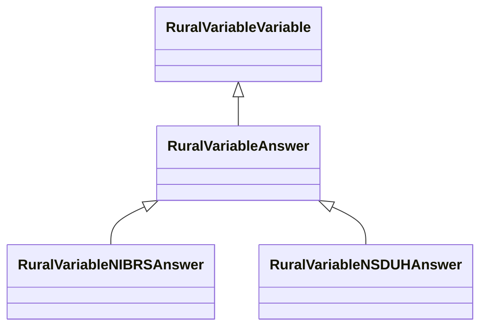

# Class: RuralVariableAnswer


_Answer options for survey variables._


URI: [rural:variable/Answer](http://sail.ua.edu/ruralkg/variable/Answer)





## Inheritance
* [RuralVariableVariable](../classes/RuralVariableVariable.md)
    * **RuralVariableAnswer**
        * [RuralVariableNIBRSAnswer](../classes/RuralVariableNIBRSAnswer.md)
        * [RuralVariableNSDUHAnswer](../classes/RuralVariableNSDUHAnswer.md)


## Slots

| Name | Cardinality and Range | Description | Inheritance | Occurrences |
| ---  | --- | --- | --- | --- |


## LinkML Source

<!-- TODO: investigate https://stackoverflow.com/questions/37606292/how-to-create-tabbed-code-blocks-in-mkdocs-or-sphinx -->

### Direct

<details>

```yaml
name: rural_variable_Answer
description: Answer options for survey variables.
from_schema: okns:rural-kg
rank: 1000
is_a: rural_variable_Variable
class_uri: rural:variable/Answer

```
</details>

### Induced

<details>

```yaml
name: rural_variable_Answer
description: Answer options for survey variables.
from_schema: okns:rural-kg
rank: 1000
is_a: rural_variable_Variable
class_uri: rural:variable/Answer

```
</details>