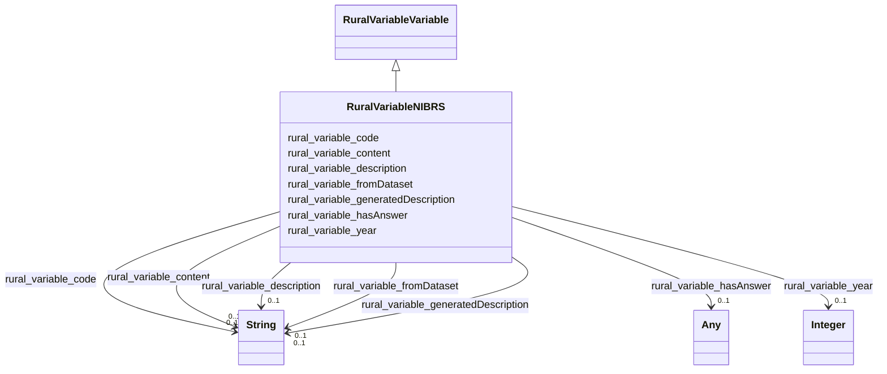

# Class: RuralVariableNIBRS


_Variables from the National Incident-Based Reporting System dataset._


This class occurs 469 times.


URI: [rural:variable/NIBRS](http://sail.ua.edu/ruralkg/variable/NIBRS)





## Inheritance
* [RuralVariableVariable](../classes/RuralVariableVariable.md)
    * **RuralVariableNIBRS**


## Slots

| Name | Cardinality and Range | Description | Inheritance | Occurrences |
| ---  | --- | --- | --- | --- |
| [rural_variable_generatedDescription](../slots/rural_variable_generatedDescription.md) | 0..1 <br/> [xsd:string](xsd:string) |  <br/>  | direct | 469 |
| [rural_variable_description](../slots/rural_variable_description.md) | 0..1 <br/> [xsd:string](xsd:string) |  <br/>  | direct | 469 |
| [rural_variable_code](../slots/rural_variable_code.md) | 0..1 <br/> [xsd:string](xsd:string) |  <br/>  | direct | 469 |
| [rural_variable_content](../slots/rural_variable_content.md) | 0..1 <br/> [xsd:string](xsd:string) |  <br/>  | direct | 469 |
| [rural_variable_hasAnswer](../slots/rural_variable_hasAnswer.md) | 0..1 <br/> [RuralVariableNSDUHAnswer](../classes/RuralVariableNSDUHAnswer.md)&nbsp;or&nbsp;<br />[RuralVariableNIBRSAnswer](../classes/RuralVariableNIBRSAnswer.md) |  <br/>  | direct | 2258 |
| [rural_variable_fromDataset](../slots/rural_variable_fromDataset.md) | 0..1 <br/> [xsd:string](xsd:string) |  <br/>  | direct | 469 |
| [rural_variable_year](../slots/rural_variable_year.md) | 0..1 <br/> [xsd:integer](xsd:integer) |  <br/>  | direct | 469 |


## LinkML Source

<!-- TODO: investigate https://stackoverflow.com/questions/37606292/how-to-create-tabbed-code-blocks-in-mkdocs-or-sphinx -->

### Direct

<details>

```yaml
name: rural_variable_NIBRS
description: Variables from the National Incident-Based Reporting System dataset.
from_schema: okns:rural-kg
rank: 1000
is_a: rural_variable_Variable
slots:
- rural_variable_generatedDescription
- rural_variable_description
- rural_variable_code
- rural_variable_content
- rural_variable_hasAnswer
- rural_variable_fromDataset
- rural_variable_year
class_uri: rural:variable/NIBRS

```
</details>

### Induced

<details>

```yaml
name: rural_variable_NIBRS
description: Variables from the National Incident-Based Reporting System dataset.
from_schema: okns:rural-kg
rank: 1000
is_a: rural_variable_Variable
attributes:
  rural_variable_generatedDescription:
    name: rural_variable_generatedDescription
    from_schema: okns:rural-kg
    rank: 1000
    slot_uri: rural:variable/generatedDescription
    alias: rural_variable_generatedDescription
    owner: rural_variable_NIBRS
    domain_of:
    - rural_variable_NIBRS
    - rural_variable_NSDUH
    range: string
  rural_variable_description:
    name: rural_variable_description
    from_schema: okns:rural-kg
    rank: 1000
    slot_uri: rural:variable/description
    alias: rural_variable_description
    owner: rural_variable_NIBRS
    domain_of:
    - rural_variable_NIBRS
    - rural_variable_NSDUH
    range: string
  rural_variable_code:
    name: rural_variable_code
    from_schema: okns:rural-kg
    rank: 1000
    slot_uri: rural:variable/code
    alias: rural_variable_code
    owner: rural_variable_NIBRS
    domain_of:
    - rural_variable_NIBRS
    - rural_variable_NSDUH
    range: string
  rural_variable_content:
    name: rural_variable_content
    from_schema: okns:rural-kg
    rank: 1000
    slot_uri: rural:variable/content
    alias: rural_variable_content
    owner: rural_variable_NIBRS
    domain_of:
    - rural_variable_NIBRS
    - rural_variable_NSDUH
    range: string
  rural_variable_hasAnswer:
    name: rural_variable_hasAnswer
    from_schema: okns:rural-kg
    rank: 1000
    slot_uri: rural:variable/hasAnswer
    alias: rural_variable_hasAnswer
    owner: rural_variable_NIBRS
    domain_of:
    - rural_variable_NIBRS
    - rural_variable_NSDUH
    range: Any
    any_of:
    - range: rural_variable_NSDUHAnswer
    - range: rural_variable_NIBRSAnswer
  rural_variable_fromDataset:
    name: rural_variable_fromDataset
    from_schema: okns:rural-kg
    rank: 1000
    slot_uri: rural:variable/fromDataset
    alias: rural_variable_fromDataset
    owner: rural_variable_NIBRS
    domain_of:
    - rural_variable_NIBRS
    - rural_variable_NSDUH
    range: string
  rural_variable_year:
    name: rural_variable_year
    from_schema: okns:rural-kg
    rank: 1000
    slot_uri: rural:variable/year
    alias: rural_variable_year
    owner: rural_variable_NIBRS
    domain_of:
    - rural_variable_NIBRS
    - rural_variable_NSDUH
    range: integer
class_uri: rural:variable/NIBRS

```
</details>