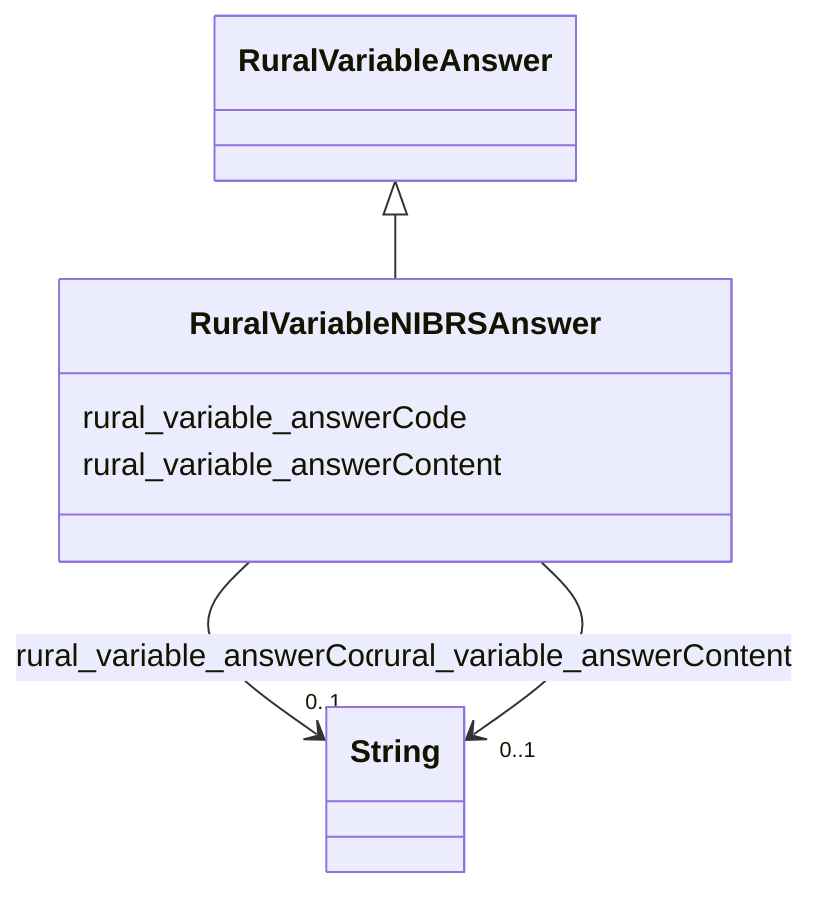

# Class: RuralVariableNIBRSAnswer


_Answer options for NIBRS variables._


This class occurs 2258 times.


URI: [rural:variable/NIBRSAnswer](http://sail.ua.edu/ruralkg/variable/NIBRSAnswer)





## Inheritance
* [RuralVariableVariable](../classes/RuralVariableVariable.md)
    * [RuralVariableAnswer](../classes/RuralVariableAnswer.md)
        * **RuralVariableNIBRSAnswer**


## Slots

| Name | Cardinality and Range | Description | Inheritance | Occurrences |
| ---  | --- | --- | --- | --- |
| [rural_variable_answerCode](../slots/rural_variable_answerCode.md) | 0..1 <br/> [xsd:string](xsd:string) |  <br/>  | direct | 2258 |
| [rural_variable_answerContent](../slots/rural_variable_answerContent.md) | 0..1 <br/> [xsd:string](xsd:string) |  <br/>  | direct | 2258 |


## Usages

| used by | used in | type | used |
| ---  | --- | --- | --- |
| [RuralVariableNIBRS](../classes/RuralVariableNIBRS.md) | [rural_variable_hasAnswer](../slots/rural_variable_hasAnswer.md) | any_of[range] | [RuralVariableNIBRSAnswer](../classes/RuralVariableNIBRSAnswer.md) |
| [RuralVariableNSDUH](../classes/RuralVariableNSDUH.md) | [rural_variable_hasAnswer](../slots/rural_variable_hasAnswer.md) | any_of[range] | [RuralVariableNIBRSAnswer](../classes/RuralVariableNIBRSAnswer.md) |


## LinkML Source

<!-- TODO: investigate https://stackoverflow.com/questions/37606292/how-to-create-tabbed-code-blocks-in-mkdocs-or-sphinx -->

### Direct

<details>

```yaml
name: rural_variable_NIBRSAnswer
description: Answer options for NIBRS variables.
from_schema: okns:rural-kg
rank: 1000
is_a: rural_variable_Answer
slots:
- rural_variable_answerCode
- rural_variable_answerContent
class_uri: rural:variable/NIBRSAnswer

```
</details>

### Induced

<details>

```yaml
name: rural_variable_NIBRSAnswer
description: Answer options for NIBRS variables.
from_schema: okns:rural-kg
rank: 1000
is_a: rural_variable_Answer
attributes:
  rural_variable_answerCode:
    name: rural_variable_answerCode
    from_schema: okns:rural-kg
    rank: 1000
    slot_uri: rural:variable/answerCode
    alias: rural_variable_answerCode
    owner: rural_variable_NIBRSAnswer
    domain_of:
    - rural_variable_NIBRSAnswer
    - rural_variable_NSDUHAnswer
    range: string
  rural_variable_answerContent:
    name: rural_variable_answerContent
    from_schema: okns:rural-kg
    rank: 1000
    slot_uri: rural:variable/answerContent
    alias: rural_variable_answerContent
    owner: rural_variable_NIBRSAnswer
    domain_of:
    - rural_variable_NIBRSAnswer
    - rural_variable_NSDUHAnswer
    range: string
class_uri: rural:variable/NIBRSAnswer

```
</details>