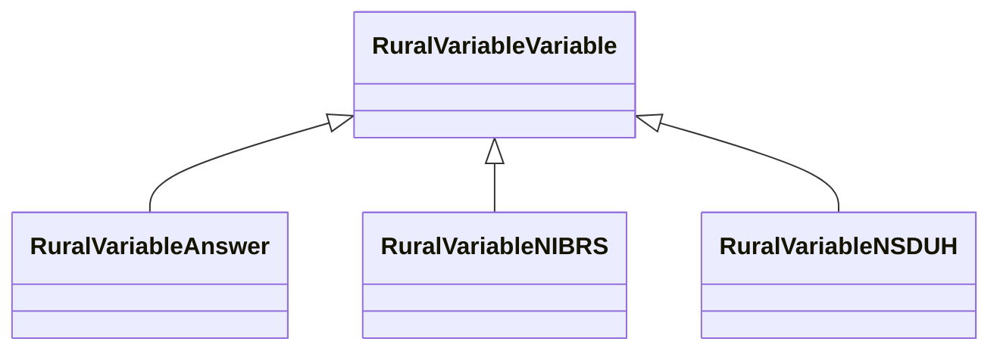

# Class: Variable (rural_variable_Variable)


_Survey variables and their associated answer options from NSDUH and NIBRS datasets._


URI: [rural:variable/Variable](http://sail.ua.edu/ruralkg/variable/Variable)





## Inheritance
* **RuralVariableVariable**
    * [RuralVariableAnswer](../classes/RuralVariableAnswer.md)
    * [RuralVariableNIBRS](../classes/RuralVariableNIBRS.md)
    * [RuralVariableNSDUH](../classes/RuralVariableNSDUH.md)


## Slots

| Name | Cardinality and Range | Description | Inheritance | Occurrences |
| ---  | --- | --- | --- | --- |


## LinkML Source

<!-- TODO: investigate https://stackoverflow.com/questions/37606292/how-to-create-tabbed-code-blocks-in-mkdocs-or-sphinx -->

### Direct

<details>

```yaml
name: rural_variable_Variable
description: Survey variables and their associated answer options from NSDUH and NIBRS
  datasets.
title: Variable
from_schema: okns:rural-kg
source: http://sail.ua.edu/ruralkg/ontology
rank: 1000
class_uri: rural:variable/Variable

```
</details>

### Induced

<details>

```yaml
name: rural_variable_Variable
description: Survey variables and their associated answer options from NSDUH and NIBRS
  datasets.
title: Variable
from_schema: okns:rural-kg
source: http://sail.ua.edu/ruralkg/ontology
rank: 1000
class_uri: rural:variable/Variable

```
</details>