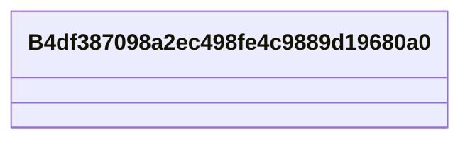

# Class: No class (entity type) name specified (__B4df387098a2ec498fe4c9889d19680a0)


_No class (type) description specified_


URI: [_:B4df387098a2ec498fe4c9889d19680a0](_:B4df387098a2ec498fe4c9889d19680a0)





<!-- no inheritance hierarchy -->


## Slots

| Name | Cardinality and Range | Description | Inheritance | Occurrences |
| ---  | --- | --- | --- | --- |


## Usages

| used by | used in | type | used |
| ---  | --- | --- | --- |
| [MeEgadEGAD-PFAS-Observation](../classes/MeEgadEGAD-PFAS-Observation.md) | [coso_ofSubstance](../slots/coso_ofSubstance.md) | any_of[range] | [B4df387098a2ec498fe4c9889d19680a0](../classes/B4df387098a2ec498fe4c9889d19680a0.md) |


## LinkML Source

<!-- TODO: investigate https://stackoverflow.com/questions/37606292/how-to-create-tabbed-code-blocks-in-mkdocs-or-sphinx -->

### Direct

<details>

```yaml
name: __B4df387098a2ec498fe4c9889d19680a0
conforms_to: No schema conformance document specified
description: No class (type) description specified
title: No class (entity type) name specified
from_schema: sawgraph-kg
rank: 1000
class_uri: _:B4df387098a2ec498fe4c9889d19680a0

```
</details>

### Induced

<details>

```yaml
name: __B4df387098a2ec498fe4c9889d19680a0
conforms_to: No schema conformance document specified
description: No class (type) description specified
title: No class (entity type) name specified
from_schema: sawgraph-kg
rank: 1000
class_uri: _:B4df387098a2ec498fe4c9889d19680a0

```
</details>