# Class: No class (entity type) name specified (__B54e27a7ad0f2a017400bf40f12905ea7)


_No class (type) description specified_


This class occurs 1 times.


URI: [_:B54e27a7ad0f2a017400bf40f12905ea7](_:B54e27a7ad0f2a017400bf40f12905ea7)

```mermaid
 classDiagram
    class B54e27a7ad0f2a017400bf40f12905ea7
    click B54e27a7ad0f2a017400bf40f12905ea7 href "../B54e27a7ad0f2a017400bf40f12905ea7"
      OwlThing <|-- B54e27a7ad0f2a017400bf40f12905ea7
        click OwlThing href "../OwlThing"
      
      B54e27a7ad0f2a017400bf40f12905ea7 : coso_analysisMethod
        
          
    
    
    B54e27a7ad0f2a017400bf40f12905ea7 --> "0..1" Any : coso_analysisMethod
    click Any href "../Any"

        
      B54e27a7ad0f2a017400bf40f12905ea7 : coso_analyzedSample
        
          
    
    
    B54e27a7ad0f2a017400bf40f12905ea7 --> "0..1" Any : coso_analyzedSample
    click Any href "../Any"

        
      B54e27a7ad0f2a017400bf40f12905ea7 : coso_casNumber
        
          
    
    
    B54e27a7ad0f2a017400bf40f12905ea7 --> "0..1" String : coso_casNumber
    click String href "../String"

        
      B54e27a7ad0f2a017400bf40f12905ea7 : coso_fromSamplePoint
        
          
    
    
    B54e27a7ad0f2a017400bf40f12905ea7 --> "0..1" Any : coso_fromSamplePoint
    click Any href "../Any"

        
      B54e27a7ad0f2a017400bf40f12905ea7 : coso_hasAnyFeatureOfInterest
        
          
    
    
    B54e27a7ad0f2a017400bf40f12905ea7 --> "0..1" Any : coso_hasAnyFeatureOfInterest
    click Any href "../Any"

        
      B54e27a7ad0f2a017400bf40f12905ea7 : coso_hasFeatureOfInterest
        
          
    
    
    B54e27a7ad0f2a017400bf40f12905ea7 --> "0..1" Any : coso_hasFeatureOfInterest
    click Any href "../Any"

        
      B54e27a7ad0f2a017400bf40f12905ea7 : coso_hasResult
        
          
    
    
    B54e27a7ad0f2a017400bf40f12905ea7 --> "0..1" Any : coso_hasResult
    click Any href "../Any"

        
      B54e27a7ad0f2a017400bf40f12905ea7 : coso_measurementUnit
        
          
    
    
    B54e27a7ad0f2a017400bf40f12905ea7 --> "0..1" Any : coso_measurementUnit
    click Any href "../Any"

        
      B54e27a7ad0f2a017400bf40f12905ea7 : coso_measurementValue
        
          
    
    
    B54e27a7ad0f2a017400bf40f12905ea7 --> "0..1" Any : coso_measurementValue
    click Any href "../Any"

        
      B54e27a7ad0f2a017400bf40f12905ea7 : coso_observationAnnotation
        
          
    
    
    B54e27a7ad0f2a017400bf40f12905ea7 --> "0..1" Any : coso_observationAnnotation
    click Any href "../Any"

        
      B54e27a7ad0f2a017400bf40f12905ea7 : coso_observedAtPoint
        
          
    
    
    B54e27a7ad0f2a017400bf40f12905ea7 --> "0..1" Any : coso_observedAtPoint
    click Any href "../Any"

        
      B54e27a7ad0f2a017400bf40f12905ea7 : coso_observedAtSamplePoint
        
          
    
    
    B54e27a7ad0f2a017400bf40f12905ea7 --> "0..1" Any : coso_observedAtSamplePoint
    click Any href "../Any"

        
      B54e27a7ad0f2a017400bf40f12905ea7 : coso_observedTime
        
          
    
    
    B54e27a7ad0f2a017400bf40f12905ea7 --> "0..1" Date : coso_observedTime
    click Date href "../Date"

        
      B54e27a7ad0f2a017400bf40f12905ea7 : coso_ofSubstance
        
          
    
    
    B54e27a7ad0f2a017400bf40f12905ea7 --> "0..1" Any : coso_ofSubstance
    click Any href "../Any"

        
      B54e27a7ad0f2a017400bf40f12905ea7 : coso_pointFromFeature
        
          
    
    
    B54e27a7ad0f2a017400bf40f12905ea7 --> "0..1" Any : coso_pointFromFeature
    click Any href "../Any"

        
      B54e27a7ad0f2a017400bf40f12905ea7 : coso_resultAnnotation
        
          
    
    
    B54e27a7ad0f2a017400bf40f12905ea7 --> "0..1" Any : coso_resultAnnotation
    click Any href "../Any"

        
      B54e27a7ad0f2a017400bf40f12905ea7 : coso_sampleAnnotation
        
          
    
    
    B54e27a7ad0f2a017400bf40f12905ea7 --> "0..1" Any : coso_sampleAnnotation
    click Any href "../Any"

        
      B54e27a7ad0f2a017400bf40f12905ea7 : coso_sampleOfMaterialType
        
          
    
    
    B54e27a7ad0f2a017400bf40f12905ea7 --> "0..1" Any : coso_sampleOfMaterialType
    click Any href "../Any"

        
      B54e27a7ad0f2a017400bf40f12905ea7 : coso_substanceID
        
          
    
    
    B54e27a7ad0f2a017400bf40f12905ea7 --> "0..1" String : coso_substanceID
    click String href "../String"

        
      B54e27a7ad0f2a017400bf40f12905ea7 : dct_description
        
          
    
    
    B54e27a7ad0f2a017400bf40f12905ea7 --> "0..1" Any : dct_description
    click Any href "../Any"

        
      B54e27a7ad0f2a017400bf40f12905ea7 : dct_identifier
        
          
    
    
    B54e27a7ad0f2a017400bf40f12905ea7 --> "0..1" Any : dct_identifier
    click Any href "../Any"

        
      B54e27a7ad0f2a017400bf40f12905ea7 : geo_asWKT
        
      B54e27a7ad0f2a017400bf40f12905ea7 : geo_hasDefaultGeometry
        
          
    
    
    B54e27a7ad0f2a017400bf40f12905ea7 --> "0..1" Any : geo_hasDefaultGeometry
    click Any href "../Any"

        
      B54e27a7ad0f2a017400bf40f12905ea7 : geo_hasGeometry
        
          
    
    
    B54e27a7ad0f2a017400bf40f12905ea7 --> "0..1" Any : geo_hasGeometry
    click Any href "../Any"

        
      B54e27a7ad0f2a017400bf40f12905ea7 : kwgo_sfContains
        
          
    
    
    B54e27a7ad0f2a017400bf40f12905ea7 --> "0..1" Any : kwgo_sfContains
    click Any href "../Any"

        
      B54e27a7ad0f2a017400bf40f12905ea7 : kwgo_sfWithin
        
          
    
    
    B54e27a7ad0f2a017400bf40f12905ea7 --> "0..1" Any : kwgo_sfWithin
    click Any href "../Any"

        
      B54e27a7ad0f2a017400bf40f12905ea7 : kwgo_spatialRelation
        
          
    
    
    B54e27a7ad0f2a017400bf40f12905ea7 --> "0..1" Any : kwgo_spatialRelation
    click Any href "../Any"

        
      B54e27a7ad0f2a017400bf40f12905ea7 : me_egad_associatedSite
        
          
    
    
    B54e27a7ad0f2a017400bf40f12905ea7 --> "0..1" Any : me_egad_associatedSite
    click Any href "../Any"

        
      B54e27a7ad0f2a017400bf40f12905ea7 : me_egad_dep_chemicalID
        
          
    
    
    B54e27a7ad0f2a017400bf40f12905ea7 --> "0..1" String : me_egad_dep_chemicalID
    click String href "../String"

        
      B54e27a7ad0f2a017400bf40f12905ea7 : me_egad_labQualifier
        
          
    
    
    B54e27a7ad0f2a017400bf40f12905ea7 --> "0..1" Any : me_egad_labQualifier
    click Any href "../Any"

        
      B54e27a7ad0f2a017400bf40f12905ea7 : me_egad_methodDetectionLimit
        
          
    
    
    B54e27a7ad0f2a017400bf40f12905ea7 --> "0..1" Any : me_egad_methodDetectionLimit
    click Any href "../Any"

        
      B54e27a7ad0f2a017400bf40f12905ea7 : me_egad_reportingLimit
        
          
    
    
    B54e27a7ad0f2a017400bf40f12905ea7 --> "0..1" Any : me_egad_reportingLimit
    click Any href "../Any"

        
      B54e27a7ad0f2a017400bf40f12905ea7 : me_egad_resultType
        
          
    
    
    B54e27a7ad0f2a017400bf40f12905ea7 --> "0..1" Any : me_egad_resultType
    click Any href "../Any"

        
      B54e27a7ad0f2a017400bf40f12905ea7 : me_egad_sampleCollectionLocation
        
          
    
    
    B54e27a7ad0f2a017400bf40f12905ea7 --> "0..1" Any : me_egad_sampleCollectionLocation
    click Any href "../Any"

        
      B54e27a7ad0f2a017400bf40f12905ea7 : me_egad_sampleCollectionMethod
        
          
    
    
    B54e27a7ad0f2a017400bf40f12905ea7 --> "0..1" Any : me_egad_sampleCollectionMethod
    click Any href "../Any"

        
      B54e27a7ad0f2a017400bf40f12905ea7 : me_egad_sampledFeatureType
        
          
    
    
    B54e27a7ad0f2a017400bf40f12905ea7 --> "0..1" Any : me_egad_sampledFeatureType
    click Any href "../Any"

        
      B54e27a7ad0f2a017400bf40f12905ea7 : me_egad_samplePointType
        
          
    
    
    B54e27a7ad0f2a017400bf40f12905ea7 --> "0..1" Any : me_egad_samplePointType
    click Any href "../Any"

        
      B54e27a7ad0f2a017400bf40f12905ea7 : me_egad_sampleTreatmentStatus
        
          
    
    
    B54e27a7ad0f2a017400bf40f12905ea7 --> "0..1" Any : me_egad_sampleTreatmentStatus
    click Any href "../Any"

        
      B54e27a7ad0f2a017400bf40f12905ea7 : me_egad_siteNumber
        
          
    
    
    B54e27a7ad0f2a017400bf40f12905ea7 --> "0..1" Integer : me_egad_siteNumber
    click Integer href "../Integer"

        
      B54e27a7ad0f2a017400bf40f12905ea7 : me_egad_siteType
        
          
    
    
    B54e27a7ad0f2a017400bf40f12905ea7 --> "0..1" Any : me_egad_siteType
    click Any href "../Any"

        
      B54e27a7ad0f2a017400bf40f12905ea7 : me_egad_validationLevel
        
          
    
    
    B54e27a7ad0f2a017400bf40f12905ea7 --> "0..1" Any : me_egad_validationLevel
    click Any href "../Any"

        
      B54e27a7ad0f2a017400bf40f12905ea7 : me_egad_validationQualifier
        
          
    
    
    B54e27a7ad0f2a017400bf40f12905ea7 --> "0..1" Any : me_egad_validationQualifier
    click Any href "../Any"

        
      B54e27a7ad0f2a017400bf40f12905ea7 : owl_sameAs
        
          
    
    
    B54e27a7ad0f2a017400bf40f12905ea7 --> "0..1" Any : owl_sameAs
    click Any href "../Any"

        
      B54e27a7ad0f2a017400bf40f12905ea7 : prov_wasAttributedTo
        
          
    
    
    B54e27a7ad0f2a017400bf40f12905ea7 --> "0..1" Any : prov_wasAttributedTo
    click Any href "../Any"

        
      B54e27a7ad0f2a017400bf40f12905ea7 : qudt_abbreviation
        
          
    
    
    B54e27a7ad0f2a017400bf40f12905ea7 --> "0..1" Any : qudt_abbreviation
    click Any href "../Any"

        
      B54e27a7ad0f2a017400bf40f12905ea7 : qudt_applicableSystem
        
          
    
    
    B54e27a7ad0f2a017400bf40f12905ea7 --> "0..1" OwlThing : qudt_applicableSystem
    click OwlThing href "../OwlThing"

        
      B54e27a7ad0f2a017400bf40f12905ea7 : qudt_conversionMultiplier
        
          
    
    
    B54e27a7ad0f2a017400bf40f12905ea7 --> "0..1" Decimal : qudt_conversionMultiplier
    click Decimal href "../Decimal"

        
      B54e27a7ad0f2a017400bf40f12905ea7 : qudt_conversionMultiplierSN
        
          
    
    
    B54e27a7ad0f2a017400bf40f12905ea7 --> "0..1" Double : qudt_conversionMultiplierSN
    click Double href "../Double"

        
      B54e27a7ad0f2a017400bf40f12905ea7 : qudt_enumeratedValue
        
          
    
    
    B54e27a7ad0f2a017400bf40f12905ea7 --> "0..1" Any : qudt_enumeratedValue
    click Any href "../Any"

        
      B54e27a7ad0f2a017400bf40f12905ea7 : qudt_hasDimensionVector
        
          
    
    
    B54e27a7ad0f2a017400bf40f12905ea7 --> "0..1" OwlThing : qudt_hasDimensionVector
    click OwlThing href "../OwlThing"

        
      B54e27a7ad0f2a017400bf40f12905ea7 : qudt_hasQuantityKind
        
          
    
    
    B54e27a7ad0f2a017400bf40f12905ea7 --> "0..1" Any : qudt_hasQuantityKind
    click Any href "../Any"

        
      B54e27a7ad0f2a017400bf40f12905ea7 : qudt_hasUnit
        
          
    
    
    B54e27a7ad0f2a017400bf40f12905ea7 --> "0..1" Any : qudt_hasUnit
    click Any href "../Any"

        
      B54e27a7ad0f2a017400bf40f12905ea7 : qudt_iec61360Code
        
          
    
    
    B54e27a7ad0f2a017400bf40f12905ea7 --> "0..1" String : qudt_iec61360Code
    click String href "../String"

        
      B54e27a7ad0f2a017400bf40f12905ea7 : qudt_numericValue
        
          
    
    
    B54e27a7ad0f2a017400bf40f12905ea7 --> "0..1" Any : qudt_numericValue
    click Any href "../Any"

        
      B54e27a7ad0f2a017400bf40f12905ea7 : qudt_plainTextDescription
        
          
    
    
    B54e27a7ad0f2a017400bf40f12905ea7 --> "0..1" String : qudt_plainTextDescription
    click String href "../String"

        
      B54e27a7ad0f2a017400bf40f12905ea7 : qudt_qkdvDenominator
        
          
    
    
    B54e27a7ad0f2a017400bf40f12905ea7 --> "0..1" OwlThing : qudt_qkdvDenominator
    click OwlThing href "../OwlThing"

        
      B54e27a7ad0f2a017400bf40f12905ea7 : qudt_qkdvNumerator
        
          
    
    
    B54e27a7ad0f2a017400bf40f12905ea7 --> "0..1" OwlThing : qudt_qkdvNumerator
    click OwlThing href "../OwlThing"

        
      B54e27a7ad0f2a017400bf40f12905ea7 : qudt_quantityValue
        
          
    
    
    B54e27a7ad0f2a017400bf40f12905ea7 --> "0..1" Any : qudt_quantityValue
    click Any href "../Any"

        
      B54e27a7ad0f2a017400bf40f12905ea7 : qudt_symbol
        
          
    
    
    B54e27a7ad0f2a017400bf40f12905ea7 --> "0..1" String : qudt_symbol
    click String href "../String"

        
      B54e27a7ad0f2a017400bf40f12905ea7 : qudt_ucumCode
        
      B54e27a7ad0f2a017400bf40f12905ea7 : qudt_uneceCommonCode
        
          
    
    
    B54e27a7ad0f2a017400bf40f12905ea7 --> "0..1" String : qudt_uneceCommonCode
    click String href "../String"

        
      B54e27a7ad0f2a017400bf40f12905ea7 : qudt_valueQuantity
        
          
    
    
    B54e27a7ad0f2a017400bf40f12905ea7 --> "0..1" Any : qudt_valueQuantity
    click Any href "../Any"

        
      B54e27a7ad0f2a017400bf40f12905ea7 : rdfs_isDefinedBy
        
          
    
    
    B54e27a7ad0f2a017400bf40f12905ea7 --> "0..1" Any : rdfs_isDefinedBy
    click Any href "../Any"

        
      B54e27a7ad0f2a017400bf40f12905ea7 : rdfs_label
        
          
    
    
    B54e27a7ad0f2a017400bf40f12905ea7 --> "0..1" Any : rdfs_label
    click Any href "../Any"

        
      B54e27a7ad0f2a017400bf40f12905ea7 : rdfs_seeAlso
        
          
    
    
    B54e27a7ad0f2a017400bf40f12905ea7 --> "0..1" Any : rdfs_seeAlso
    click Any href "../Any"

        
      B54e27a7ad0f2a017400bf40f12905ea7 : skos_altLabel
        
          
    
    
    B54e27a7ad0f2a017400bf40f12905ea7 --> "0..1" String : skos_altLabel
    click String href "../String"

        
      B54e27a7ad0f2a017400bf40f12905ea7 : skos_definition
        
          
    
    
    B54e27a7ad0f2a017400bf40f12905ea7 --> "0..1" String : skos_definition
    click String href "../String"

        
      B54e27a7ad0f2a017400bf40f12905ea7 : sosa_hasResult
        
          
    
    
    B54e27a7ad0f2a017400bf40f12905ea7 --> "0..1" Any : sosa_hasResult
    click Any href "../Any"

        
      B54e27a7ad0f2a017400bf40f12905ea7 : sosa_resultTime
        
          
    
    
    B54e27a7ad0f2a017400bf40f12905ea7 --> "0..1" Date : sosa_resultTime
    click Date href "../Date"

        
      B54e27a7ad0f2a017400bf40f12905ea7 : spatial_connectedTo
        
          
    
    
    B54e27a7ad0f2a017400bf40f12905ea7 --> "0..1" Any : spatial_connectedTo
    click Any href "../Any"

        
      B54e27a7ad0f2a017400bf40f12905ea7 : spatial_spatiallyRelatedTo
        
          
    
    
    B54e27a7ad0f2a017400bf40f12905ea7 --> "0..1" Any : spatial_spatiallyRelatedTo
    click Any href "../Any"

        
      B54e27a7ad0f2a017400bf40f12905ea7 : us_sdwis_hasPWSID
        
          
    
    
    B54e27a7ad0f2a017400bf40f12905ea7 --> "0..1" String : us_sdwis_hasPWSID
    click String href "../String"

        
      
```





## Inheritance
* [OwlThing](../classes/OwlThing.md)
    * **B54e27a7ad0f2a017400bf40f12905ea7**


## Slots

| Name | Cardinality and Range | Description | Inheritance | Occurrences |
| ---  | --- | --- | --- | --- |
| [owl_sameAs](../slots/owl_sameAs.md) | 0..1 <br/> [MeEgadEGAD-PFAS-ParameterName](../classes/MeEgadEGAD-PFAS-ParameterName.md)&nbsp;or&nbsp;<br />[SosaProcedure](../classes/SosaProcedure.md)&nbsp;or&nbsp;<br />[CosoQuantityValue](../classes/CosoQuantityValue.md)&nbsp;or&nbsp;<br />[B33a4bff87e63dbebb7e68ae4f6624bed](../classes/B33a4bff87e63dbebb7e68ae4f6624bed.md)&nbsp;or&nbsp;<br />[MeEgadEGAD-ConcentrationQualifier](../classes/MeEgadEGAD-ConcentrationQualifier.md)&nbsp;or&nbsp;<br />[B759a060b1552f5afbc0077c0116a05d8](../classes/B759a060b1552f5afbc0077c0116a05d8.md)&nbsp;or&nbsp;<br />[MeEgadEGAD-ReportingLimit](../classes/MeEgadEGAD-ReportingLimit.md)&nbsp;or&nbsp;<br />[B1ec2fb807fea9c1bd025ce9f9a44be32](../classes/B1ec2fb807fea9c1bd025ce9f9a44be32.md)&nbsp;or&nbsp;<br />[QudtQuantity](../classes/QudtQuantity.md)&nbsp;or&nbsp;<br />[StadQuantity](../classes/StadQuantity.md)&nbsp;or&nbsp;<br />[KwgoAdministrativeRegion2](../classes/KwgoAdministrativeRegion2.md)&nbsp;or&nbsp;<br />[B91d76961c9f8ddbd60f889ceeaa2b40e](../classes/B91d76961c9f8ddbd60f889ceeaa2b40e.md)&nbsp;or&nbsp;<br />[Bd4c82b4e72756dd07838e3ed64fc01d3](../classes/Bd4c82b4e72756dd07838e3ed64fc01d3.md)&nbsp;or&nbsp;<br />[MeEgadEGAD-AnalysisMethod](../classes/MeEgadEGAD-AnalysisMethod.md)&nbsp;or&nbsp;<br />[Baee1e1036c9c300a20d18c9a77ed4baa](../classes/Baee1e1036c9c300a20d18c9a77ed4baa.md)&nbsp;or&nbsp;<br />[CosoSingleContaminantMeasurement](../classes/CosoSingleContaminantMeasurement.md)&nbsp;or&nbsp;<br />[CosoAggregateContaminantMeasurement](../classes/CosoAggregateContaminantMeasurement.md)&nbsp;or&nbsp;<br />[B0ec50ed72490f52ac3672a1e7857f5bc](../classes/B0ec50ed72490f52ac3672a1e7857f5bc.md)&nbsp;or&nbsp;<br />[StadDatapoint](../classes/StadDatapoint.md)&nbsp;or&nbsp;<br />[B5a8009d185c57bf4c45da4a0fdd16bd9](../classes/B5a8009d185c57bf4c45da4a0fdd16bd9.md)&nbsp;or&nbsp;<br />[Bc2ad66c8645d30f8bc2834eab721cb6b](../classes/Bc2ad66c8645d30f8bc2834eab721cb6b.md)&nbsp;or&nbsp;<br />[ProvAgent](../classes/ProvAgent.md)&nbsp;or&nbsp;<br />[CosoPoint](../classes/CosoPoint.md)&nbsp;or&nbsp;<br />[B52937cc8dbb22057fb5a128068caae3e](../classes/B52937cc8dbb22057fb5a128068caae3e.md)&nbsp;or&nbsp;<br />[CosoFeature](../classes/CosoFeature.md)&nbsp;or&nbsp;<br />[Badedf2d5daa6297871dc3e5a2fe50510](../classes/Badedf2d5daa6297871dc3e5a2fe50510.md)&nbsp;or&nbsp;<br />[QudtEnumeration](../classes/QudtEnumeration.md)&nbsp;or&nbsp;<br />[MeEgadEGAD-Site](../classes/MeEgadEGAD-Site.md)&nbsp;or&nbsp;<br />[B62f4ca32bee89335c5f2cde8750f0952](../classes/B62f4ca32bee89335c5f2cde8750f0952.md)&nbsp;or&nbsp;<br />[StadStatisticalAggregateData](../classes/StadStatisticalAggregateData.md)&nbsp;or&nbsp;<br />[CosoAnalysisMethod](../classes/CosoAnalysisMethod.md)&nbsp;or&nbsp;<br />[MeEgadEGAD-ValidationLevel](../classes/MeEgadEGAD-ValidationLevel.md)&nbsp;or&nbsp;<br />[MeEgadEGAD-PFAS-Observation](../classes/MeEgadEGAD-PFAS-Observation.md)&nbsp;or&nbsp;<br />[CosoQuantitationLimit](../classes/CosoQuantitationLimit.md)&nbsp;or&nbsp;<br />[QudtVerifiable](../classes/QudtVerifiable.md)&nbsp;or&nbsp;<br />[StadDataValue](../classes/StadDataValue.md)&nbsp;or&nbsp;<br />[KwgoS2Cell](../classes/KwgoS2Cell.md)&nbsp;or&nbsp;<br />[B56a2cea6d406b97b5706b7dded4290e9](../classes/B56a2cea6d406b97b5706b7dded4290e9.md)&nbsp;or&nbsp;<br />[QudtQuantityValue](../classes/QudtQuantityValue.md)&nbsp;or&nbsp;<br />[CosoContaminantAbsoluteQuantityKind](../classes/CosoContaminantAbsoluteQuantityKind.md)&nbsp;or&nbsp;<br />[KwgoAdministrativeRegion](../classes/KwgoAdministrativeRegion.md)&nbsp;or&nbsp;<br />[OwlThing](../classes/OwlThing.md)&nbsp;or&nbsp;<br />[CosoResultQualifier](../classes/CosoResultQualifier.md)&nbsp;or&nbsp;<br />[CosoSubstanceCollection](../classes/CosoSubstanceCollection.md)&nbsp;or&nbsp;<br />[StadStatisticalQuantityKind](../classes/StadStatisticalQuantityKind.md)&nbsp;or&nbsp;<br />[CosoContaminantConcentrationQuantityKind](../classes/CosoContaminantConcentrationQuantityKind.md)&nbsp;or&nbsp;<br />[CosoNonDetectQuantityValue](../classes/CosoNonDetectQuantityValue.md)&nbsp;or&nbsp;<br />[B67799f02f12f9e598057cf6c5606db0d](../classes/B67799f02f12f9e598057cf6c5606db0d.md)&nbsp;or&nbsp;<br />[B9416863afef47838f397f708f628e129](../classes/B9416863afef47838f397f708f628e129.md)&nbsp;or&nbsp;<br />[MeEgadEGAD-ResultType](../classes/MeEgadEGAD-ResultType.md)&nbsp;or&nbsp;<br />[B9647143c38c2eb22c9764bae62e0e1bf](../classes/B9647143c38c2eb22c9764bae62e0e1bf.md)&nbsp;or&nbsp;<br />[CosoContaminantObservation](../classes/CosoContaminantObservation.md)&nbsp;or&nbsp;<br />[Be77f95b3df7489ec3a00781058957f6e](../classes/Be77f95b3df7489ec3a00781058957f6e.md)&nbsp;or&nbsp;<br />[KwgoRegion](../classes/KwgoRegion.md)&nbsp;or&nbsp;<br />[B1f076b6912d64fb8de40fd5bf49bf226](../classes/B1f076b6912d64fb8de40fd5bf49bf226.md)&nbsp;or&nbsp;<br />[B7f743940eb366fa70db0e72f92c486ae](../classes/B7f743940eb366fa70db0e72f92c486ae.md)&nbsp;or&nbsp;<br />[MeEgadEGAD-SamplePoint](../classes/MeEgadEGAD-SamplePoint.md)&nbsp;or&nbsp;<br />[Be49fab2c67d8cc380d54a6132f08f932](../classes/Be49fab2c67d8cc380d54a6132f08f932.md)&nbsp;or&nbsp;<br />[GeoGeometry](../classes/GeoGeometry.md)&nbsp;or&nbsp;<br />[QudtEnumeratedValue](../classes/QudtEnumeratedValue.md)&nbsp;or&nbsp;<br />[GeoSpatialObject](../classes/GeoSpatialObject.md)&nbsp;or&nbsp;<br />[CosoContaminantMeasurement](../classes/CosoContaminantMeasurement.md)&nbsp;or&nbsp;<br />[MeEgadEGAD-SamplePointType](../classes/MeEgadEGAD-SamplePointType.md)&nbsp;or&nbsp;<br />[B09aad887077f56524a134d1a40bd7caa](../classes/B09aad887077f56524a134d1a40bd7caa.md)&nbsp;or&nbsp;<br />[B3996198628e8debde20be7d2bfd72451](../classes/B3996198628e8debde20be7d2bfd72451.md)&nbsp;or&nbsp;<br />[MeEgadEGAD-AggregatePFAS-Concentration](../classes/MeEgadEGAD-AggregatePFAS-Concentration.md)&nbsp;or&nbsp;<br />[SosaProperty](../classes/SosaProperty.md)&nbsp;or&nbsp;<br />[MeEgadEGAD-SampleCollectionMethod](../classes/MeEgadEGAD-SampleCollectionMethod.md)&nbsp;or&nbsp;<br />[B54e27a7ad0f2a017400bf40f12905ea7](../classes/B54e27a7ad0f2a017400bf40f12905ea7.md)&nbsp;or&nbsp;<br />[RdfList](../classes/RdfList.md)&nbsp;or&nbsp;<br />[CosoContaminantRelativeMeasurement](../classes/CosoContaminantRelativeMeasurement.md)&nbsp;or&nbsp;<br />[Bc61095527952bb22dc6c72bcea5e2015](../classes/Bc61095527952bb22dc6c72bcea5e2015.md)&nbsp;or&nbsp;<br />[MeEgadEGAD-Sample](../classes/MeEgadEGAD-Sample.md)&nbsp;or&nbsp;<br />[SosaResult](../classes/SosaResult.md)&nbsp;or&nbsp;<br />[CosoSampleAnnotation](../classes/CosoSampleAnnotation.md)&nbsp;or&nbsp;<br />[MeEgadEGAD-PFAS-Site](../classes/MeEgadEGAD-PFAS-Site.md)&nbsp;or&nbsp;<br />[B05e44ef0dae70e2dd72c89f36a1473fe](../classes/B05e44ef0dae70e2dd72c89f36a1473fe.md)&nbsp;or&nbsp;<br />[CosoContaminantVolumeQuantityKind](../classes/CosoContaminantVolumeQuantityKind.md)&nbsp;or&nbsp;<br />[QudtConcept](../classes/QudtConcept.md)&nbsp;or&nbsp;<br />[MeEgadEGAD-SinglePFAS-Concentration](../classes/MeEgadEGAD-SinglePFAS-Concentration.md)&nbsp;or&nbsp;<br />[CosoMaterialSample](../classes/CosoMaterialSample.md)&nbsp;or&nbsp;<br />[CosoSampledFeature](../classes/CosoSampledFeature.md)&nbsp;or&nbsp;<br />[KwgoS2CellLevel13](../classes/KwgoS2CellLevel13.md)&nbsp;or&nbsp;<br />[Ba265b6e5375ebb0aadae09c47f43d655](../classes/Ba265b6e5375ebb0aadae09c47f43d655.md)&nbsp;or&nbsp;<br />[CosoContaminantSampleObservation](../classes/CosoContaminantSampleObservation.md)&nbsp;or&nbsp;<br />[Bf18cfef7abd2b808d3e5a50da0b1bde7](../classes/Bf18cfef7abd2b808d3e5a50da0b1bde7.md)&nbsp;or&nbsp;<br />[CosoDetectionLimit](../classes/CosoDetectionLimit.md)&nbsp;or&nbsp;<br />[SosaSample](../classes/SosaSample.md)&nbsp;or&nbsp;<br />[MeEgadEGAD-MethodDetectionLimit](../classes/MeEgadEGAD-MethodDetectionLimit.md)&nbsp;or&nbsp;<br />[B06945e371c65d137066f33e51a15fc88](../classes/B06945e371c65d137066f33e51a15fc88.md)&nbsp;or&nbsp;<br />[MeEgadEGAD-SiteType](../classes/MeEgadEGAD-SiteType.md)&nbsp;or&nbsp;<br />[CosoContaminantRelativeQuantityKind](../classes/CosoContaminantRelativeQuantityKind.md)&nbsp;or&nbsp;<br />[CosoSamplePoint](../classes/CosoSamplePoint.md)&nbsp;or&nbsp;<br />[KwgoAdministrativeRegion3](../classes/KwgoAdministrativeRegion3.md)&nbsp;or&nbsp;<br />[SosaFeatureOfInterest](../classes/SosaFeatureOfInterest.md)&nbsp;or&nbsp;<br />[B4988d800b6a457b8e9d23239a25a722c](../classes/B4988d800b6a457b8e9d23239a25a722c.md)&nbsp;or&nbsp;<br />[CosoContaminationProperty](../classes/CosoContaminationProperty.md)&nbsp;or&nbsp;<br />[MeEgadEGAD-SampledFeature](../classes/MeEgadEGAD-SampledFeature.md)&nbsp;or&nbsp;<br />[B7562df68ecb21c16369015b4829049e8](../classes/B7562df68ecb21c16369015b4829049e8.md)&nbsp;or&nbsp;<br />[Bc61726e4df6d53655e7a7348513c3069](../classes/Bc61726e4df6d53655e7a7348513c3069.md)&nbsp;or&nbsp;<br />[MeEgadEGAD-SampleTreatmentStatus](../classes/MeEgadEGAD-SampleTreatmentStatus.md)&nbsp;or&nbsp;<br />[StadSingleData](../classes/StadSingleData.md)&nbsp;or&nbsp;<br />[MeEgadEGAD-SampleMaterialType](../classes/MeEgadEGAD-SampleMaterialType.md)&nbsp;or&nbsp;<br />[B83cd416c76244b666544da84186161ee](../classes/B83cd416c76244b666544da84186161ee.md)&nbsp;or&nbsp;<br />[ProvOrganization](../classes/ProvOrganization.md)&nbsp;or&nbsp;<br />[CosoObservationAnnotation](../classes/CosoObservationAnnotation.md)&nbsp;or&nbsp;<br />[CosoSubstance](../classes/CosoSubstance.md)&nbsp;or&nbsp;<br />[CosoDetectQuantityValue](../classes/CosoDetectQuantityValue.md)&nbsp;or&nbsp;<br />[B4f0e79d63147e2e6dacf649c0ae23375](../classes/B4f0e79d63147e2e6dacf649c0ae23375.md)&nbsp;or&nbsp;<br />[CosoSampleMaterialType](../classes/CosoSampleMaterialType.md)&nbsp;or&nbsp;<br />[QudtQuantifiable](../classes/QudtQuantifiable.md)&nbsp;or&nbsp;<br />[OwlNamedIndividual](../classes/OwlNamedIndividual.md)&nbsp;or&nbsp;<br />[SosaObservation](../classes/SosaObservation.md)&nbsp;or&nbsp;<br />[KwgoCell](../classes/KwgoCell.md)&nbsp;or&nbsp;<br />[QudtUnit](../classes/QudtUnit.md)&nbsp;or&nbsp;<br />[GeoFeature](../classes/GeoFeature.md)&nbsp;or&nbsp;<br />[KwgoAdministrativeRegion1](../classes/KwgoAdministrativeRegion1.md)&nbsp;or&nbsp;<br />[Bb3b966a83ead8099fc1d9350e1c85c2d](../classes/Bb3b966a83ead8099fc1d9350e1c85c2d.md)&nbsp;or&nbsp;<br />[Bd82d59dfe322d0239d857ed8bdb33e3f](../classes/Bd82d59dfe322d0239d857ed8bdb33e3f.md)&nbsp;or&nbsp;<br />[Bd2cb89944394492862955024a10bc9b2](../classes/Bd2cb89944394492862955024a10bc9b2.md)&nbsp;or&nbsp;<br />[Sf#Point](../classes/Sf#Point.md)&nbsp;or&nbsp;<br />[StadQualityKind](../classes/StadQualityKind.md)&nbsp;or&nbsp;<br />[B35dd872c46bbac02f1b1999558dc2e7a](../classes/B35dd872c46bbac02f1b1999558dc2e7a.md)&nbsp;or&nbsp;<br />[Bd7ac0dbb4a69dd5b498c4fd86dffe2cc](../classes/Bd7ac0dbb4a69dd5b498c4fd86dffe2cc.md)&nbsp;or&nbsp;<br />[MeEgadEGAD-SampleDetailedLocation](../classes/MeEgadEGAD-SampleDetailedLocation.md)&nbsp;or&nbsp;<br />[MeEgadEGAD-SampleMaterialTypeQualifier](../classes/MeEgadEGAD-SampleMaterialTypeQualifier.md)&nbsp;or&nbsp;<br />[QudtQuantityKind](../classes/QudtQuantityKind.md)&nbsp;or&nbsp;<br />[Be2c88f2a392c478b7dd00ad2fe5624e0](../classes/Be2c88f2a392c478b7dd00ad2fe5624e0.md) | No slot (predicate) description specified <br/>  | direct | 8 |
| [qudt_abbreviation](../slots/qudt_abbreviation.md) | 0..1 <br/> [xsd:string](http://www.w3.org/2001/XMLSchema#string)&nbsp;or&nbsp;<br />[RdfsLiteral](../classes/RdfsLiteral.md) | An abbreviation for a unit is a short ASCII string that is used in place of t... <br/>  | direct |  |
| [rdfs_label](../slots/rdfs_label.md) | 0..1 <br/> [xsd:string](http://www.w3.org/2001/XMLSchema#string)&nbsp;or&nbsp;<br />[RdfsLiteral](../classes/RdfsLiteral.md) | No slot (predicate) description specified <br/>  | direct |  |
| [dct_description](../slots/dct_description.md) | 0..1 <br/> [xsd:string](http://www.w3.org/2001/XMLSchema#string)&nbsp;or&nbsp;<br />[RdfHTML](../types/RdfHTML.md) | No slot (predicate) description specified <br/>  | direct |  |
| [me_egad_sampleCollectionLocation](../slots/me_egad_sampleCollectionLocation.md) | 0..1 <br/> [QudtConcept](../classes/QudtConcept.md)&nbsp;or&nbsp;<br />[CosoSampleAnnotation](../classes/CosoSampleAnnotation.md)&nbsp;or&nbsp;<br />[B35dd872c46bbac02f1b1999558dc2e7a](../classes/B35dd872c46bbac02f1b1999558dc2e7a.md)&nbsp;or&nbsp;<br />[OwlThing](../classes/OwlThing.md)&nbsp;or&nbsp;<br />[OwlNamedIndividual](../classes/OwlNamedIndividual.md)&nbsp;or&nbsp;<br />[B67799f02f12f9e598057cf6c5606db0d](../classes/B67799f02f12f9e598057cf6c5606db0d.md)&nbsp;or&nbsp;<br />[B9416863afef47838f397f708f628e129](../classes/B9416863afef47838f397f708f628e129.md)&nbsp;or&nbsp;<br />[MeEgadEGAD-SampleDetailedLocation](../classes/MeEgadEGAD-SampleDetailedLocation.md)&nbsp;or&nbsp;<br />[B56a2cea6d406b97b5706b7dded4290e9](../classes/B56a2cea6d406b97b5706b7dded4290e9.md)&nbsp;or&nbsp;<br />[B4f0e79d63147e2e6dacf649c0ae23375](../classes/B4f0e79d63147e2e6dacf649c0ae23375.md)&nbsp;or&nbsp;<br />[QudtEnumeration](../classes/QudtEnumeration.md) | No slot (predicate) description specified | [OwlThing](../classes/OwlThing.md) |  |
| [prov_wasAttributedTo](../slots/prov_wasAttributedTo.md) | 0..1 <br/> [ProvAgent](../classes/ProvAgent.md)&nbsp;or&nbsp;<br />[OwlThing](../classes/OwlThing.md)&nbsp;or&nbsp;<br />[ProvOrganization](../classes/ProvOrganization.md) | No slot (predicate) description specified | [OwlThing](../classes/OwlThing.md) |  |
| [qudt_qkdvDenominator](../slots/qudt_qkdvDenominator.md) | 0..1 <br/> [OwlThing](../classes/OwlThing.md) | No slot (predicate) description specified | [OwlThing](../classes/OwlThing.md) |  |
| [qudt_conversionMultiplierSN](../slots/qudt_conversionMultiplierSN.md) | 0..1 <br/> [xsd:double](http://www.w3.org/2001/XMLSchema#double) | No slot (predicate) description specified | [OwlThing](../classes/OwlThing.md) |  |
| [coso_substanceID](../slots/coso_substanceID.md) | 0..1 <br/> [xsd:string](http://www.w3.org/2001/XMLSchema#string) | No slot (predicate) description specified | [OwlThing](../classes/OwlThing.md) |  |
| [kwgo_sfContains](../slots/kwgo_sfContains.md) | 0..1 <br/> [MeEgadEGAD-Site](../classes/MeEgadEGAD-Site.md)&nbsp;or&nbsp;<br />[OwlThing](../classes/OwlThing.md)&nbsp;or&nbsp;<br />[GeoFeature](../classes/GeoFeature.md)&nbsp;or&nbsp;<br />[MeEgadEGAD-SamplePoint](../classes/MeEgadEGAD-SamplePoint.md)&nbsp;or&nbsp;<br />[MeEgadEGAD-PFAS-Site](../classes/MeEgadEGAD-PFAS-Site.md)&nbsp;or&nbsp;<br />[GeoSpatialObject](../classes/GeoSpatialObject.md)&nbsp;or&nbsp;<br />[CosoSamplePoint](../classes/CosoSamplePoint.md)&nbsp;or&nbsp;<br />[SosaFeatureOfInterest](../classes/SosaFeatureOfInterest.md)&nbsp;or&nbsp;<br />[CosoPoint](../classes/CosoPoint.md)&nbsp;or&nbsp;<br />[CosoFeature](../classes/CosoFeature.md) | No slot (predicate) description specified | [OwlThing](../classes/OwlThing.md) |  |
| [qudt_applicableSystem](../slots/qudt_applicableSystem.md) | 0..1 <br/> [OwlThing](../classes/OwlThing.md) | No slot (predicate) description specified | [OwlThing](../classes/OwlThing.md) |  |
| [qudt_symbol](../slots/qudt_symbol.md) | 0..1 <br/> [xsd:string](http://www.w3.org/2001/XMLSchema#string) | No slot (predicate) description specified | [OwlThing](../classes/OwlThing.md) |  |
| [qudt_ucumCode](../slots/qudt_ucumCode.md) | 0..1 <br/> [QudtUCUMcs](../types/QudtUCUMcs.md) | No slot (predicate) description specified | [OwlThing](../classes/OwlThing.md) |  |
| [rdfs_seeAlso](../slots/rdfs_seeAlso.md) | 0..1 <br/> [OwlThing](../classes/OwlThing.md)&nbsp;or&nbsp;<br />[RdfsResource](../classes/RdfsResource.md)&nbsp;or&nbsp;<br />[OwlOntology](../classes/OwlOntology.md) | No slot (predicate) description specified | [OwlThing](../classes/OwlThing.md) |  |
| [me_egad_labQualifier](../slots/me_egad_labQualifier.md) | 0..1 <br/> [QudtConcept](../classes/QudtConcept.md)&nbsp;or&nbsp;<br />[B35dd872c46bbac02f1b1999558dc2e7a](../classes/B35dd872c46bbac02f1b1999558dc2e7a.md)&nbsp;or&nbsp;<br />[MeEgadEGAD-ConcentrationQualifier](../classes/MeEgadEGAD-ConcentrationQualifier.md)&nbsp;or&nbsp;<br />[CosoResultQualifier](../classes/CosoResultQualifier.md)&nbsp;or&nbsp;<br />[OwlNamedIndividual](../classes/OwlNamedIndividual.md)&nbsp;or&nbsp;<br />[B67799f02f12f9e598057cf6c5606db0d](../classes/B67799f02f12f9e598057cf6c5606db0d.md)&nbsp;or&nbsp;<br />[B9416863afef47838f397f708f628e129](../classes/B9416863afef47838f397f708f628e129.md)&nbsp;or&nbsp;<br />[OwlThing](../classes/OwlThing.md)&nbsp;or&nbsp;<br />[B56a2cea6d406b97b5706b7dded4290e9](../classes/B56a2cea6d406b97b5706b7dded4290e9.md)&nbsp;or&nbsp;<br />[B4f0e79d63147e2e6dacf649c0ae23375](../classes/B4f0e79d63147e2e6dacf649c0ae23375.md)&nbsp;or&nbsp;<br />[QudtEnumeration](../classes/QudtEnumeration.md) | No slot (predicate) description specified | [OwlThing](../classes/OwlThing.md) |  |
| [skos_definition](../slots/skos_definition.md) | 0..1 <br/> [xsd:string](http://www.w3.org/2001/XMLSchema#string) | No slot (predicate) description specified | [OwlThing](../classes/OwlThing.md) |  |
| [kwgo_spatialRelation](../slots/kwgo_spatialRelation.md) | 0..1 <br/> [MeEgadEGAD-Site](../classes/MeEgadEGAD-Site.md)&nbsp;or&nbsp;<br />[KwgoRegion](../classes/KwgoRegion.md)&nbsp;or&nbsp;<br />[KwgoAdministrativeRegion](../classes/KwgoAdministrativeRegion.md)&nbsp;or&nbsp;<br />[OwlThing](../classes/OwlThing.md)&nbsp;or&nbsp;<br />[GeoFeature](../classes/GeoFeature.md)&nbsp;or&nbsp;<br />[MeEgadEGAD-SamplePoint](../classes/MeEgadEGAD-SamplePoint.md)&nbsp;or&nbsp;<br />[KwgoS2Cell](../classes/KwgoS2Cell.md)&nbsp;or&nbsp;<br />[KwgoS2CellLevel13](../classes/KwgoS2CellLevel13.md)&nbsp;or&nbsp;<br />[MeEgadEGAD-PFAS-Site](../classes/MeEgadEGAD-PFAS-Site.md)&nbsp;or&nbsp;<br />[GeoSpatialObject](../classes/GeoSpatialObject.md)&nbsp;or&nbsp;<br />[KwgoAdministrativeRegion3](../classes/KwgoAdministrativeRegion3.md)&nbsp;or&nbsp;<br />[CosoSamplePoint](../classes/CosoSamplePoint.md)&nbsp;or&nbsp;<br />[SosaFeatureOfInterest](../classes/SosaFeatureOfInterest.md)&nbsp;or&nbsp;<br />[KwgoCell](../classes/KwgoCell.md)&nbsp;or&nbsp;<br />[CosoPoint](../classes/CosoPoint.md)&nbsp;or&nbsp;<br />[CosoFeature](../classes/CosoFeature.md) | No slot (predicate) description specified | [OwlThing](../classes/OwlThing.md) |  |
| [sosa_hasResult](../slots/sosa_hasResult.md) | 0..1 <br/> [OwlThing](../classes/OwlThing.md)&nbsp;or&nbsp;<br />[StadQuantity](../classes/StadQuantity.md)&nbsp;or&nbsp;<br />[QudtQuantity](../classes/QudtQuantity.md)&nbsp;or&nbsp;<br />[Bd4c82b4e72756dd07838e3ed64fc01d3](../classes/Bd4c82b4e72756dd07838e3ed64fc01d3.md)&nbsp;or&nbsp;<br />[QudtConcept](../classes/QudtConcept.md)&nbsp;or&nbsp;<br />[MeEgadEGAD-SinglePFAS-Concentration](../classes/MeEgadEGAD-SinglePFAS-Concentration.md)&nbsp;or&nbsp;<br />[QudtQuantifiable](../classes/QudtQuantifiable.md)&nbsp;or&nbsp;<br />[CosoSingleContaminantMeasurement](../classes/CosoSingleContaminantMeasurement.md)&nbsp;or&nbsp;<br />[CosoAggregateContaminantMeasurement](../classes/CosoAggregateContaminantMeasurement.md)&nbsp;or&nbsp;<br />[B0ec50ed72490f52ac3672a1e7857f5bc](../classes/B0ec50ed72490f52ac3672a1e7857f5bc.md)&nbsp;or&nbsp;<br />[StadDatapoint](../classes/StadDatapoint.md)&nbsp;or&nbsp;<br />[StadStatisticalAggregateData](../classes/StadStatisticalAggregateData.md)&nbsp;or&nbsp;<br />[CosoContaminantMeasurement](../classes/CosoContaminantMeasurement.md)&nbsp;or&nbsp;<br />[Bb3b966a83ead8099fc1d9350e1c85c2d](../classes/Bb3b966a83ead8099fc1d9350e1c85c2d.md)&nbsp;or&nbsp;<br />[Bd82d59dfe322d0239d857ed8bdb33e3f](../classes/Bd82d59dfe322d0239d857ed8bdb33e3f.md)&nbsp;or&nbsp;<br />[MeEgadEGAD-AggregatePFAS-Concentration](../classes/MeEgadEGAD-AggregatePFAS-Concentration.md)&nbsp;or&nbsp;<br />[CosoContaminantRelativeMeasurement](../classes/CosoContaminantRelativeMeasurement.md)&nbsp;or&nbsp;<br />[Bc61095527952bb22dc6c72bcea5e2015](../classes/Bc61095527952bb22dc6c72bcea5e2015.md)&nbsp;or&nbsp;<br />[SosaResult](../classes/SosaResult.md)&nbsp;or&nbsp;<br />[StadSingleData](../classes/StadSingleData.md) | No slot (predicate) description specified | [OwlThing](../classes/OwlThing.md) |  |
| [coso_observationAnnotation](../slots/coso_observationAnnotation.md) | 0..1 <br/> [QudtConcept](../classes/QudtConcept.md)&nbsp;or&nbsp;<br />[B35dd872c46bbac02f1b1999558dc2e7a](../classes/B35dd872c46bbac02f1b1999558dc2e7a.md)&nbsp;or&nbsp;<br />[OwlThing](../classes/OwlThing.md)&nbsp;or&nbsp;<br />[OwlNamedIndividual](../classes/OwlNamedIndividual.md)&nbsp;or&nbsp;<br />[B67799f02f12f9e598057cf6c5606db0d](../classes/B67799f02f12f9e598057cf6c5606db0d.md)&nbsp;or&nbsp;<br />[B9416863afef47838f397f708f628e129](../classes/B9416863afef47838f397f708f628e129.md)&nbsp;or&nbsp;<br />[MeEgadEGAD-ResultType](../classes/MeEgadEGAD-ResultType.md)&nbsp;or&nbsp;<br />[CosoObservationAnnotation](../classes/CosoObservationAnnotation.md)&nbsp;or&nbsp;<br />[B56a2cea6d406b97b5706b7dded4290e9](../classes/B56a2cea6d406b97b5706b7dded4290e9.md)&nbsp;or&nbsp;<br />[B4f0e79d63147e2e6dacf649c0ae23375](../classes/B4f0e79d63147e2e6dacf649c0ae23375.md)&nbsp;or&nbsp;<br />[QudtEnumeration](../classes/QudtEnumeration.md) | No slot (predicate) description specified | [OwlThing](../classes/OwlThing.md) |  |
| [geo_asWKT](../slots/geo_asWKT.md) | 0..1 <br/> [GeoWktLiteral](../types/GeoWktLiteral.md) | No slot (predicate) description specified | [OwlThing](../classes/OwlThing.md) |  |
| [coso_sampleOfMaterialType](../slots/coso_sampleOfMaterialType.md) | 0..1 <br/> [QudtConcept](../classes/QudtConcept.md)&nbsp;or&nbsp;<br />[CosoSampleMaterialType](../classes/CosoSampleMaterialType.md)&nbsp;or&nbsp;<br />[OwlThing](../classes/OwlThing.md)&nbsp;or&nbsp;<br />[B35dd872c46bbac02f1b1999558dc2e7a](../classes/B35dd872c46bbac02f1b1999558dc2e7a.md)&nbsp;or&nbsp;<br />[OwlNamedIndividual](../classes/OwlNamedIndividual.md)&nbsp;or&nbsp;<br />[B67799f02f12f9e598057cf6c5606db0d](../classes/B67799f02f12f9e598057cf6c5606db0d.md)&nbsp;or&nbsp;<br />[B9416863afef47838f397f708f628e129](../classes/B9416863afef47838f397f708f628e129.md)&nbsp;or&nbsp;<br />[MeEgadEGAD-SampleMaterialTypeQualifier](../classes/MeEgadEGAD-SampleMaterialTypeQualifier.md)&nbsp;or&nbsp;<br />[B56a2cea6d406b97b5706b7dded4290e9](../classes/B56a2cea6d406b97b5706b7dded4290e9.md)&nbsp;or&nbsp;<br />[B4f0e79d63147e2e6dacf649c0ae23375](../classes/B4f0e79d63147e2e6dacf649c0ae23375.md)&nbsp;or&nbsp;<br />[MeEgadEGAD-SampleMaterialType](../classes/MeEgadEGAD-SampleMaterialType.md)&nbsp;or&nbsp;<br />[QudtEnumeration](../classes/QudtEnumeration.md) | A relation between a material sample and the type of material | [OwlThing](../classes/OwlThing.md) |  |
| [qudt_enumeratedValue](../slots/qudt_enumeratedValue.md) | 0..1 <br/> [QudtConcept](../classes/QudtConcept.md)&nbsp;or&nbsp;<br />[QudtVerifiable](../classes/QudtVerifiable.md)&nbsp;or&nbsp;<br />[B54e27a7ad0f2a017400bf40f12905ea7](../classes/B54e27a7ad0f2a017400bf40f12905ea7.md)&nbsp;or&nbsp;<br />[OwlThing](../classes/OwlThing.md)&nbsp;or&nbsp;<br />[Be49fab2c67d8cc380d54a6132f08f932](../classes/Be49fab2c67d8cc380d54a6132f08f932.md)&nbsp;or&nbsp;<br />[QudtEnumeratedValue](../classes/QudtEnumeratedValue.md)&nbsp;or&nbsp;<br />[Bc2ad66c8645d30f8bc2834eab721cb6b](../classes/Bc2ad66c8645d30f8bc2834eab721cb6b.md)&nbsp;or&nbsp;<br />[Bd2cb89944394492862955024a10bc9b2](../classes/Bd2cb89944394492862955024a10bc9b2.md) | No slot (predicate) description specified | [OwlThing](../classes/OwlThing.md) |  |
| [rdfs_isDefinedBy](../slots/rdfs_isDefinedBy.md) | 0..1 <br/> [OwlThing](../classes/OwlThing.md)&nbsp;or&nbsp;<br />[RdfsResource](../classes/RdfsResource.md)&nbsp;or&nbsp;<br />[OwlOntology](../classes/OwlOntology.md) | No slot (predicate) description specified | [OwlThing](../classes/OwlThing.md) |  |
| [me_egad_resultType](../slots/me_egad_resultType.md) | 0..1 <br/> [QudtConcept](../classes/QudtConcept.md)&nbsp;or&nbsp;<br />[B35dd872c46bbac02f1b1999558dc2e7a](../classes/B35dd872c46bbac02f1b1999558dc2e7a.md)&nbsp;or&nbsp;<br />[OwlThing](../classes/OwlThing.md)&nbsp;or&nbsp;<br />[OwlNamedIndividual](../classes/OwlNamedIndividual.md)&nbsp;or&nbsp;<br />[B67799f02f12f9e598057cf6c5606db0d](../classes/B67799f02f12f9e598057cf6c5606db0d.md)&nbsp;or&nbsp;<br />[CosoObservationAnnotation](../classes/CosoObservationAnnotation.md)&nbsp;or&nbsp;<br />[B9416863afef47838f397f708f628e129](../classes/B9416863afef47838f397f708f628e129.md)&nbsp;or&nbsp;<br />[MeEgadEGAD-ResultType](../classes/MeEgadEGAD-ResultType.md)&nbsp;or&nbsp;<br />[B56a2cea6d406b97b5706b7dded4290e9](../classes/B56a2cea6d406b97b5706b7dded4290e9.md)&nbsp;or&nbsp;<br />[B4f0e79d63147e2e6dacf649c0ae23375](../classes/B4f0e79d63147e2e6dacf649c0ae23375.md)&nbsp;or&nbsp;<br />[QudtEnumeration](../classes/QudtEnumeration.md) | No slot (predicate) description specified | [OwlThing](../classes/OwlThing.md) |  |
| [coso_hasAnyFeatureOfInterest](../slots/coso_hasAnyFeatureOfInterest.md) | 0..1 <br/> [SosaSample](../classes/SosaSample.md)&nbsp;or&nbsp;<br />[CosoMaterialSample](../classes/CosoMaterialSample.md)&nbsp;or&nbsp;<br />[OwlThing](../classes/OwlThing.md)&nbsp;or&nbsp;<br />[GeoFeature](../classes/GeoFeature.md)&nbsp;or&nbsp;<br />[MeEgadEGAD-SamplePoint](../classes/MeEgadEGAD-SamplePoint.md)&nbsp;or&nbsp;<br />[MeEgadEGAD-SampledFeature](../classes/MeEgadEGAD-SampledFeature.md)&nbsp;or&nbsp;<br />[CosoSampledFeature](../classes/CosoSampledFeature.md)&nbsp;or&nbsp;<br />[CosoSamplePoint](../classes/CosoSamplePoint.md)&nbsp;or&nbsp;<br />[GeoSpatialObject](../classes/GeoSpatialObject.md)&nbsp;or&nbsp;<br />[SosaFeatureOfInterest](../classes/SosaFeatureOfInterest.md)&nbsp;or&nbsp;<br />[MeEgadEGAD-Sample](../classes/MeEgadEGAD-Sample.md)&nbsp;or&nbsp;<br />[CosoPoint](../classes/CosoPoint.md)&nbsp;or&nbsp;<br />[CosoFeature](../classes/CosoFeature.md) | No slot (predicate) description specified | [OwlThing](../classes/OwlThing.md) |  |
| [coso_measurementValue](../slots/coso_measurementValue.md) | 0..1 <br/> [QudtConcept](../classes/QudtConcept.md)&nbsp;or&nbsp;<br />[QudtVerifiable](../classes/QudtVerifiable.md)&nbsp;or&nbsp;<br />[B54e27a7ad0f2a017400bf40f12905ea7](../classes/B54e27a7ad0f2a017400bf40f12905ea7.md)&nbsp;or&nbsp;<br />[OwlThing](../classes/OwlThing.md)&nbsp;or&nbsp;<br />[xsd:decimal](http://www.w3.org/2001/XMLSchema#decimal)&nbsp;or&nbsp;<br />[Be49fab2c67d8cc380d54a6132f08f932](../classes/Be49fab2c67d8cc380d54a6132f08f932.md)&nbsp;or&nbsp;<br />[QudtEnumeratedValue](../classes/QudtEnumeratedValue.md)&nbsp;or&nbsp;<br />[xsd:double](http://www.w3.org/2001/XMLSchema#double)&nbsp;or&nbsp;<br />[Bc2ad66c8645d30f8bc2834eab721cb6b](../classes/Bc2ad66c8645d30f8bc2834eab721cb6b.md)&nbsp;or&nbsp;<br />[Bd2cb89944394492862955024a10bc9b2](../classes/Bd2cb89944394492862955024a10bc9b2.md) | The numeric value or enumerated value that quantifies or qualifies the result | [OwlThing](../classes/OwlThing.md) |  |
| [geo_hasGeometry](../slots/geo_hasGeometry.md) | 0..1 <br/> [OwlThing](../classes/OwlThing.md)&nbsp;or&nbsp;<br />[GeoSpatialObject](../classes/GeoSpatialObject.md)&nbsp;or&nbsp;<br />[Sf#Point](../classes/Sf#Point.md)&nbsp;or&nbsp;<br />[GeoGeometry](../classes/GeoGeometry.md) | No slot (predicate) description specified | [OwlThing](../classes/OwlThing.md) |  |
| [qudt_valueQuantity](../slots/qudt_valueQuantity.md) | 0..1 <br/> [OwlThing](../classes/OwlThing.md)&nbsp;or&nbsp;<br />[StadQuantity](../classes/StadQuantity.md)&nbsp;or&nbsp;<br />[QudtQuantity](../classes/QudtQuantity.md)&nbsp;or&nbsp;<br />[Bd4c82b4e72756dd07838e3ed64fc01d3](../classes/Bd4c82b4e72756dd07838e3ed64fc01d3.md)&nbsp;or&nbsp;<br />[QudtConcept](../classes/QudtConcept.md)&nbsp;or&nbsp;<br />[MeEgadEGAD-SinglePFAS-Concentration](../classes/MeEgadEGAD-SinglePFAS-Concentration.md)&nbsp;or&nbsp;<br />[QudtQuantifiable](../classes/QudtQuantifiable.md)&nbsp;or&nbsp;<br />[CosoSingleContaminantMeasurement](../classes/CosoSingleContaminantMeasurement.md)&nbsp;or&nbsp;<br />[CosoAggregateContaminantMeasurement](../classes/CosoAggregateContaminantMeasurement.md)&nbsp;or&nbsp;<br />[B0ec50ed72490f52ac3672a1e7857f5bc](../classes/B0ec50ed72490f52ac3672a1e7857f5bc.md)&nbsp;or&nbsp;<br />[StadDatapoint](../classes/StadDatapoint.md)&nbsp;or&nbsp;<br />[StadStatisticalAggregateData](../classes/StadStatisticalAggregateData.md)&nbsp;or&nbsp;<br />[CosoContaminantMeasurement](../classes/CosoContaminantMeasurement.md)&nbsp;or&nbsp;<br />[Bb3b966a83ead8099fc1d9350e1c85c2d](../classes/Bb3b966a83ead8099fc1d9350e1c85c2d.md)&nbsp;or&nbsp;<br />[Bd82d59dfe322d0239d857ed8bdb33e3f](../classes/Bd82d59dfe322d0239d857ed8bdb33e3f.md)&nbsp;or&nbsp;<br />[MeEgadEGAD-AggregatePFAS-Concentration](../classes/MeEgadEGAD-AggregatePFAS-Concentration.md)&nbsp;or&nbsp;<br />[CosoContaminantRelativeMeasurement](../classes/CosoContaminantRelativeMeasurement.md)&nbsp;or&nbsp;<br />[Bc61095527952bb22dc6c72bcea5e2015](../classes/Bc61095527952bb22dc6c72bcea5e2015.md)&nbsp;or&nbsp;<br />[SosaResult](../classes/SosaResult.md)&nbsp;or&nbsp;<br />[StadSingleData](../classes/StadSingleData.md) | No slot (predicate) description specified | [OwlThing](../classes/OwlThing.md) |  |
| [qudt_hasUnit](../slots/qudt_hasUnit.md) | 0..1 <br/> [QudtConcept](../classes/QudtConcept.md)&nbsp;or&nbsp;<br />[B62f4ca32bee89335c5f2cde8750f0952](../classes/B62f4ca32bee89335c5f2cde8750f0952.md)&nbsp;or&nbsp;<br />[QudtVerifiable](../classes/QudtVerifiable.md)&nbsp;or&nbsp;<br />[B7f743940eb366fa70db0e72f92c486ae](../classes/B7f743940eb366fa70db0e72f92c486ae.md)&nbsp;or&nbsp;<br />[OwlThing](../classes/OwlThing.md)&nbsp;or&nbsp;<br />[B3996198628e8debde20be7d2bfd72451](../classes/B3996198628e8debde20be7d2bfd72451.md)&nbsp;or&nbsp;<br />[B83cd416c76244b666544da84186161ee](../classes/B83cd416c76244b666544da84186161ee.md)&nbsp;or&nbsp;<br />[Ba265b6e5375ebb0aadae09c47f43d655](../classes/Ba265b6e5375ebb0aadae09c47f43d655.md)&nbsp;or&nbsp;<br />[QudtUnit](../classes/QudtUnit.md)&nbsp;or&nbsp;<br />[B52937cc8dbb22057fb5a128068caae3e](../classes/B52937cc8dbb22057fb5a128068caae3e.md) | This property relates a system of units with a unit of measure that is either... | [OwlThing](../classes/OwlThing.md) |  |
| [coso_ofSubstance](../slots/coso_ofSubstance.md) | 0..1 <br/> [B53dc870c7f452a8846b022ab7f8ddf8a](../classes/B53dc870c7f452a8846b022ab7f8ddf8a.md)&nbsp;or&nbsp;<br />[OwlThing](../classes/OwlThing.md)&nbsp;or&nbsp;<br />[B05e44ef0dae70e2dd72c89f36a1473fe](../classes/B05e44ef0dae70e2dd72c89f36a1473fe.md) | A relation between an observation of a contaminant and the substance or subst... | [OwlThing](../classes/OwlThing.md) |  |
| [kwgo_sfWithin](../slots/kwgo_sfWithin.md) | 0..1 <br/> [KwgoRegion](../classes/KwgoRegion.md)&nbsp;or&nbsp;<br />[KwgoAdministrativeRegion](../classes/KwgoAdministrativeRegion.md)&nbsp;or&nbsp;<br />[OwlThing](../classes/OwlThing.md)&nbsp;or&nbsp;<br />[GeoFeature](../classes/GeoFeature.md)&nbsp;or&nbsp;<br />[KwgoS2Cell](../classes/KwgoS2Cell.md)&nbsp;or&nbsp;<br />[KwgoS2CellLevel13](../classes/KwgoS2CellLevel13.md)&nbsp;or&nbsp;<br />[GeoSpatialObject](../classes/GeoSpatialObject.md)&nbsp;or&nbsp;<br />[KwgoAdministrativeRegion3](../classes/KwgoAdministrativeRegion3.md)&nbsp;or&nbsp;<br />[KwgoCell](../classes/KwgoCell.md) | No slot (predicate) description specified | [OwlThing](../classes/OwlThing.md) |  |
| [qudt_plainTextDescription](../slots/qudt_plainTextDescription.md) | 0..1 <br/> [xsd:string](http://www.w3.org/2001/XMLSchema#string) | No slot (predicate) description specified | [OwlThing](../classes/OwlThing.md) |  |
| [qudt_numericValue](../slots/qudt_numericValue.md) | 0..1 <br/> [xsd:double](http://www.w3.org/2001/XMLSchema#double)&nbsp;or&nbsp;<br />[xsd:decimal](http://www.w3.org/2001/XMLSchema#decimal)&nbsp;or&nbsp;<br />[QudtNumericUnion](../classes/QudtNumericUnion.md) | No slot (predicate) description specified | [OwlThing](../classes/OwlThing.md) |  |
| [coso_analyzedSample](../slots/coso_analyzedSample.md) | 0..1 <br/> [SosaSample](../classes/SosaSample.md)&nbsp;or&nbsp;<br />[CosoMaterialSample](../classes/CosoMaterialSample.md)&nbsp;or&nbsp;<br />[OwlThing](../classes/OwlThing.md)&nbsp;or&nbsp;<br />[SosaFeatureOfInterest](../classes/SosaFeatureOfInterest.md)&nbsp;or&nbsp;<br />[MeEgadEGAD-Sample](../classes/MeEgadEGAD-Sample.md) | A relation between an observation of a contaminant and the sample that was an... | [OwlThing](../classes/OwlThing.md) |  |
| [coso_observedAtSamplePoint](../slots/coso_observedAtSamplePoint.md) | 0..1 <br/> [OwlThing](../classes/OwlThing.md)&nbsp;or&nbsp;<br />[GeoFeature](../classes/GeoFeature.md)&nbsp;or&nbsp;<br />[MeEgadEGAD-SamplePoint](../classes/MeEgadEGAD-SamplePoint.md)&nbsp;or&nbsp;<br />[CosoSamplePoint](../classes/CosoSamplePoint.md)&nbsp;or&nbsp;<br />[GeoSpatialObject](../classes/GeoSpatialObject.md)&nbsp;or&nbsp;<br />[SosaFeatureOfInterest](../classes/SosaFeatureOfInterest.md)&nbsp;or&nbsp;<br />[CosoPoint](../classes/CosoPoint.md) | A relation between an observation of a contaminant from a material sample and... | [OwlThing](../classes/OwlThing.md) |  |
| [coso_analysisMethod](../slots/coso_analysisMethod.md) | 0..1 <br/> [QudtConcept](../classes/QudtConcept.md)&nbsp;or&nbsp;<br />[MeEgadEGAD-AnalysisMethod](../classes/MeEgadEGAD-AnalysisMethod.md)&nbsp;or&nbsp;<br />[SosaProcedure](../classes/SosaProcedure.md)&nbsp;or&nbsp;<br />[B35dd872c46bbac02f1b1999558dc2e7a](../classes/B35dd872c46bbac02f1b1999558dc2e7a.md)&nbsp;or&nbsp;<br />[OwlThing](../classes/OwlThing.md)&nbsp;or&nbsp;<br />[B4f0e79d63147e2e6dacf649c0ae23375](../classes/B4f0e79d63147e2e6dacf649c0ae23375.md)&nbsp;or&nbsp;<br />[OwlNamedIndividual](../classes/OwlNamedIndividual.md)&nbsp;or&nbsp;<br />[B67799f02f12f9e598057cf6c5606db0d](../classes/B67799f02f12f9e598057cf6c5606db0d.md)&nbsp;or&nbsp;<br />[B9416863afef47838f397f708f628e129](../classes/B9416863afef47838f397f708f628e129.md)&nbsp;or&nbsp;<br />[B56a2cea6d406b97b5706b7dded4290e9](../classes/B56a2cea6d406b97b5706b7dded4290e9.md)&nbsp;or&nbsp;<br />[CosoAnalysisMethod](../classes/CosoAnalysisMethod.md)&nbsp;or&nbsp;<br />[QudtEnumeration](../classes/QudtEnumeration.md) | No slot (predicate) description specified | [OwlThing](../classes/OwlThing.md) |  |
| [me_egad_validationLevel](../slots/me_egad_validationLevel.md) | 0..1 <br/> [QudtConcept](../classes/QudtConcept.md)&nbsp;or&nbsp;<br />[B35dd872c46bbac02f1b1999558dc2e7a](../classes/B35dd872c46bbac02f1b1999558dc2e7a.md)&nbsp;or&nbsp;<br />[CosoResultQualifier](../classes/CosoResultQualifier.md)&nbsp;or&nbsp;<br />[OwlThing](../classes/OwlThing.md)&nbsp;or&nbsp;<br />[OwlNamedIndividual](../classes/OwlNamedIndividual.md)&nbsp;or&nbsp;<br />[B67799f02f12f9e598057cf6c5606db0d](../classes/B67799f02f12f9e598057cf6c5606db0d.md)&nbsp;or&nbsp;<br />[B9416863afef47838f397f708f628e129](../classes/B9416863afef47838f397f708f628e129.md)&nbsp;or&nbsp;<br />[B56a2cea6d406b97b5706b7dded4290e9](../classes/B56a2cea6d406b97b5706b7dded4290e9.md)&nbsp;or&nbsp;<br />[B4f0e79d63147e2e6dacf649c0ae23375](../classes/B4f0e79d63147e2e6dacf649c0ae23375.md)&nbsp;or&nbsp;<br />[MeEgadEGAD-ValidationLevel](../classes/MeEgadEGAD-ValidationLevel.md)&nbsp;or&nbsp;<br />[QudtEnumeration](../classes/QudtEnumeration.md) | No slot (predicate) description specified | [OwlThing](../classes/OwlThing.md) |  |
| [me_egad_sampledFeatureType](../slots/me_egad_sampledFeatureType.md) | 0..1 <br/> [QudtConcept](../classes/QudtConcept.md)&nbsp;or&nbsp;<br />[B35dd872c46bbac02f1b1999558dc2e7a](../classes/B35dd872c46bbac02f1b1999558dc2e7a.md)&nbsp;or&nbsp;<br />[OwlThing](../classes/OwlThing.md)&nbsp;or&nbsp;<br />[OwlNamedIndividual](../classes/OwlNamedIndividual.md)&nbsp;or&nbsp;<br />[B67799f02f12f9e598057cf6c5606db0d](../classes/B67799f02f12f9e598057cf6c5606db0d.md)&nbsp;or&nbsp;<br />[B9416863afef47838f397f708f628e129](../classes/B9416863afef47838f397f708f628e129.md)&nbsp;or&nbsp;<br />[B56a2cea6d406b97b5706b7dded4290e9](../classes/B56a2cea6d406b97b5706b7dded4290e9.md)&nbsp;or&nbsp;<br />[MeEgadEGAD-SamplePointType](../classes/MeEgadEGAD-SamplePointType.md)&nbsp;or&nbsp;<br />[B4f0e79d63147e2e6dacf649c0ae23375](../classes/B4f0e79d63147e2e6dacf649c0ae23375.md)&nbsp;or&nbsp;<br />[QudtEnumeration](../classes/QudtEnumeration.md) | No slot (predicate) description specified | [OwlThing](../classes/OwlThing.md) |  |
| [qudt_hasQuantityKind](../slots/qudt_hasQuantityKind.md) | 0..1 <br/> [B33a4bff87e63dbebb7e68ae4f6624bed](../classes/B33a4bff87e63dbebb7e68ae4f6624bed.md)&nbsp;or&nbsp;<br />[OwlThing](../classes/OwlThing.md)&nbsp;or&nbsp;<br />[B1ec2fb807fea9c1bd025ce9f9a44be32](../classes/B1ec2fb807fea9c1bd025ce9f9a44be32.md)&nbsp;or&nbsp;<br />[B91d76961c9f8ddbd60f889ceeaa2b40e](../classes/B91d76961c9f8ddbd60f889ceeaa2b40e.md)&nbsp;or&nbsp;<br />[CosoContaminantConcentrationQuantityKind](../classes/CosoContaminantConcentrationQuantityKind.md)&nbsp;or&nbsp;<br />[Baee1e1036c9c300a20d18c9a77ed4baa](../classes/Baee1e1036c9c300a20d18c9a77ed4baa.md)&nbsp;or&nbsp;<br />[OwlNamedIndividual](../classes/OwlNamedIndividual.md)&nbsp;or&nbsp;<br />[B5a8009d185c57bf4c45da4a0fdd16bd9](../classes/B5a8009d185c57bf4c45da4a0fdd16bd9.md)&nbsp;or&nbsp;<br />[B9647143c38c2eb22c9764bae62e0e1bf](../classes/B9647143c38c2eb22c9764bae62e0e1bf.md)&nbsp;or&nbsp;<br />[Badedf2d5daa6297871dc3e5a2fe50510](../classes/Badedf2d5daa6297871dc3e5a2fe50510.md)&nbsp;or&nbsp;<br />[B1f076b6912d64fb8de40fd5bf49bf226](../classes/B1f076b6912d64fb8de40fd5bf49bf226.md)&nbsp;or&nbsp;<br />[B06945e371c65d137066f33e51a15fc88](../classes/B06945e371c65d137066f33e51a15fc88.md)&nbsp;or&nbsp;<br />[CosoContaminantRelativeQuantityKind](../classes/CosoContaminantRelativeQuantityKind.md)&nbsp;or&nbsp;<br />[B09aad887077f56524a134d1a40bd7caa](../classes/B09aad887077f56524a134d1a40bd7caa.md)&nbsp;or&nbsp;<br />[SosaProperty](../classes/SosaProperty.md)&nbsp;or&nbsp;<br />[B4988d800b6a457b8e9d23239a25a722c](../classes/B4988d800b6a457b8e9d23239a25a722c.md)&nbsp;or&nbsp;<br />[CosoContaminationProperty](../classes/CosoContaminationProperty.md)&nbsp;or&nbsp;<br />[StadQualityKind](../classes/StadQualityKind.md)&nbsp;or&nbsp;<br />[Bd7ac0dbb4a69dd5b498c4fd86dffe2cc](../classes/Bd7ac0dbb4a69dd5b498c4fd86dffe2cc.md)&nbsp;or&nbsp;<br />[B7562df68ecb21c16369015b4829049e8](../classes/B7562df68ecb21c16369015b4829049e8.md)&nbsp;or&nbsp;<br />[Bc61726e4df6d53655e7a7348513c3069](../classes/Bc61726e4df6d53655e7a7348513c3069.md)&nbsp;or&nbsp;<br />[QudtQuantityKind](../classes/QudtQuantityKind.md)&nbsp;or&nbsp;<br />[Be2c88f2a392c478b7dd00ad2fe5624e0](../classes/Be2c88f2a392c478b7dd00ad2fe5624e0.md) | No slot (predicate) description specified | [OwlThing](../classes/OwlThing.md) |  |
| [coso_measurementUnit](../slots/coso_measurementUnit.md) | 0..1 <br/> [QudtConcept](../classes/QudtConcept.md)&nbsp;or&nbsp;<br />[B62f4ca32bee89335c5f2cde8750f0952](../classes/B62f4ca32bee89335c5f2cde8750f0952.md)&nbsp;or&nbsp;<br />[QudtVerifiable](../classes/QudtVerifiable.md)&nbsp;or&nbsp;<br />[B7f743940eb366fa70db0e72f92c486ae](../classes/B7f743940eb366fa70db0e72f92c486ae.md)&nbsp;or&nbsp;<br />[OwlThing](../classes/OwlThing.md)&nbsp;or&nbsp;<br />[B3996198628e8debde20be7d2bfd72451](../classes/B3996198628e8debde20be7d2bfd72451.md)&nbsp;or&nbsp;<br />[B83cd416c76244b666544da84186161ee](../classes/B83cd416c76244b666544da84186161ee.md)&nbsp;or&nbsp;<br />[Ba265b6e5375ebb0aadae09c47f43d655](../classes/Ba265b6e5375ebb0aadae09c47f43d655.md)&nbsp;or&nbsp;<br />[QudtUnit](../classes/QudtUnit.md)&nbsp;or&nbsp;<br />[B52937cc8dbb22057fb5a128068caae3e](../classes/B52937cc8dbb22057fb5a128068caae3e.md) | The unit of measurement the describes the result | [OwlThing](../classes/OwlThing.md) |  |
| [coso_pointFromFeature](../slots/coso_pointFromFeature.md) | 0..1 <br/> [OwlThing](../classes/OwlThing.md)&nbsp;or&nbsp;<br />[GeoFeature](../classes/GeoFeature.md)&nbsp;or&nbsp;<br />[MeEgadEGAD-SampledFeature](../classes/MeEgadEGAD-SampledFeature.md)&nbsp;or&nbsp;<br />[CosoSampledFeature](../classes/CosoSampledFeature.md)&nbsp;or&nbsp;<br />[GeoSpatialObject](../classes/GeoSpatialObject.md)&nbsp;or&nbsp;<br />[SosaFeatureOfInterest](../classes/SosaFeatureOfInterest.md)&nbsp;or&nbsp;<br />[CosoFeature](../classes/CosoFeature.md) | A relation between a point location and the larger geospatial feature it is a... | [OwlThing](../classes/OwlThing.md) |  |
| [qudt_uneceCommonCode](../slots/qudt_uneceCommonCode.md) | 0..1 <br/> [xsd:string](http://www.w3.org/2001/XMLSchema#string) | No slot (predicate) description specified | [OwlThing](../classes/OwlThing.md) |  |
| [qudt_conversionMultiplier](../slots/qudt_conversionMultiplier.md) | 0..1 <br/> [xsd:decimal](http://www.w3.org/2001/XMLSchema#decimal) | No slot (predicate) description specified | [OwlThing](../classes/OwlThing.md) |  |
| [dct_identifier](../slots/dct_identifier.md) | 0..1 <br/> [xsd:string](http://www.w3.org/2001/XMLSchema#string)&nbsp;or&nbsp;<br />[xsd:integer](http://www.w3.org/2001/XMLSchema#integer) | No slot (predicate) description specified | [OwlThing](../classes/OwlThing.md) |  |
| [spatial_connectedTo](../slots/spatial_connectedTo.md) | 0..1 <br/> [MeEgadEGAD-Site](../classes/MeEgadEGAD-Site.md)&nbsp;or&nbsp;<br />[KwgoRegion](../classes/KwgoRegion.md)&nbsp;or&nbsp;<br />[KwgoAdministrativeRegion](../classes/KwgoAdministrativeRegion.md)&nbsp;or&nbsp;<br />[OwlThing](../classes/OwlThing.md)&nbsp;or&nbsp;<br />[GeoFeature](../classes/GeoFeature.md)&nbsp;or&nbsp;<br />[MeEgadEGAD-SamplePoint](../classes/MeEgadEGAD-SamplePoint.md)&nbsp;or&nbsp;<br />[KwgoS2Cell](../classes/KwgoS2Cell.md)&nbsp;or&nbsp;<br />[KwgoS2CellLevel13](../classes/KwgoS2CellLevel13.md)&nbsp;or&nbsp;<br />[MeEgadEGAD-PFAS-Site](../classes/MeEgadEGAD-PFAS-Site.md)&nbsp;or&nbsp;<br />[GeoSpatialObject](../classes/GeoSpatialObject.md)&nbsp;or&nbsp;<br />[KwgoAdministrativeRegion3](../classes/KwgoAdministrativeRegion3.md)&nbsp;or&nbsp;<br />[CosoSamplePoint](../classes/CosoSamplePoint.md)&nbsp;or&nbsp;<br />[SosaFeatureOfInterest](../classes/SosaFeatureOfInterest.md)&nbsp;or&nbsp;<br />[KwgoCell](../classes/KwgoCell.md)&nbsp;or&nbsp;<br />[CosoPoint](../classes/CosoPoint.md)&nbsp;or&nbsp;<br />[CosoFeature](../classes/CosoFeature.md) | No slot (predicate) description specified | [OwlThing](../classes/OwlThing.md) |  |
| [me_egad_validationQualifier](../slots/me_egad_validationQualifier.md) | 0..1 <br/> [QudtConcept](../classes/QudtConcept.md)&nbsp;or&nbsp;<br />[B35dd872c46bbac02f1b1999558dc2e7a](../classes/B35dd872c46bbac02f1b1999558dc2e7a.md)&nbsp;or&nbsp;<br />[MeEgadEGAD-ConcentrationQualifier](../classes/MeEgadEGAD-ConcentrationQualifier.md)&nbsp;or&nbsp;<br />[CosoResultQualifier](../classes/CosoResultQualifier.md)&nbsp;or&nbsp;<br />[OwlNamedIndividual](../classes/OwlNamedIndividual.md)&nbsp;or&nbsp;<br />[B67799f02f12f9e598057cf6c5606db0d](../classes/B67799f02f12f9e598057cf6c5606db0d.md)&nbsp;or&nbsp;<br />[B9416863afef47838f397f708f628e129](../classes/B9416863afef47838f397f708f628e129.md)&nbsp;or&nbsp;<br />[OwlThing](../classes/OwlThing.md)&nbsp;or&nbsp;<br />[B56a2cea6d406b97b5706b7dded4290e9](../classes/B56a2cea6d406b97b5706b7dded4290e9.md)&nbsp;or&nbsp;<br />[B4f0e79d63147e2e6dacf649c0ae23375](../classes/B4f0e79d63147e2e6dacf649c0ae23375.md)&nbsp;or&nbsp;<br />[QudtEnumeration](../classes/QudtEnumeration.md) | No slot (predicate) description specified | [OwlThing](../classes/OwlThing.md) |  |
| [me_egad_associatedSite](../slots/me_egad_associatedSite.md) | 0..1 <br/> [MeEgadEGAD-Site](../classes/MeEgadEGAD-Site.md)&nbsp;or&nbsp;<br />[OwlThing](../classes/OwlThing.md)&nbsp;or&nbsp;<br />[GeoFeature](../classes/GeoFeature.md)&nbsp;or&nbsp;<br />[MeEgadEGAD-PFAS-Site](../classes/MeEgadEGAD-PFAS-Site.md)&nbsp;or&nbsp;<br />[GeoSpatialObject](../classes/GeoSpatialObject.md)&nbsp;or&nbsp;<br />[SosaFeatureOfInterest](../classes/SosaFeatureOfInterest.md)&nbsp;or&nbsp;<br />[CosoFeature](../classes/CosoFeature.md) | No slot (predicate) description specified | [OwlThing](../classes/OwlThing.md) |  |
| [qudt_qkdvNumerator](../slots/qudt_qkdvNumerator.md) | 0..1 <br/> [OwlThing](../classes/OwlThing.md) | No slot (predicate) description specified | [OwlThing](../classes/OwlThing.md) |  |
| [me_egad_dep_chemicalID](../slots/me_egad_dep_chemicalID.md) | 0..1 <br/> [xsd:string](http://www.w3.org/2001/XMLSchema#string) | No slot (predicate) description specified | [OwlThing](../classes/OwlThing.md) |  |
| [me_egad_reportingLimit](../slots/me_egad_reportingLimit.md) | 0..1 <br/> [QudtConcept](../classes/QudtConcept.md)&nbsp;or&nbsp;<br />[CosoQuantitationLimit](../classes/CosoQuantitationLimit.md)&nbsp;or&nbsp;<br />[MeEgadEGAD-ReportingLimit](../classes/MeEgadEGAD-ReportingLimit.md)&nbsp;or&nbsp;<br />[QudtQuantifiable](../classes/QudtQuantifiable.md)&nbsp;or&nbsp;<br />[CosoResultQualifier](../classes/CosoResultQualifier.md)&nbsp;or&nbsp;<br />[OwlThing](../classes/OwlThing.md)&nbsp;or&nbsp;<br />[QudtQuantity](../classes/QudtQuantity.md)&nbsp;or&nbsp;<br />[B0ec50ed72490f52ac3672a1e7857f5bc](../classes/B0ec50ed72490f52ac3672a1e7857f5bc.md)&nbsp;or&nbsp;<br />[StadDatapoint](../classes/StadDatapoint.md)&nbsp;or&nbsp;<br />[Bd4c82b4e72756dd07838e3ed64fc01d3](../classes/Bd4c82b4e72756dd07838e3ed64fc01d3.md)&nbsp;or&nbsp;<br />[Bc61095527952bb22dc6c72bcea5e2015](../classes/Bc61095527952bb22dc6c72bcea5e2015.md)&nbsp;or&nbsp;<br />[Bb3b966a83ead8099fc1d9350e1c85c2d](../classes/Bb3b966a83ead8099fc1d9350e1c85c2d.md) | No slot (predicate) description specified | [OwlThing](../classes/OwlThing.md) |  |
| [me_egad_samplePointType](../slots/me_egad_samplePointType.md) | 0..1 <br/> [QudtConcept](../classes/QudtConcept.md)&nbsp;or&nbsp;<br />[B35dd872c46bbac02f1b1999558dc2e7a](../classes/B35dd872c46bbac02f1b1999558dc2e7a.md)&nbsp;or&nbsp;<br />[OwlThing](../classes/OwlThing.md)&nbsp;or&nbsp;<br />[OwlNamedIndividual](../classes/OwlNamedIndividual.md)&nbsp;or&nbsp;<br />[B67799f02f12f9e598057cf6c5606db0d](../classes/B67799f02f12f9e598057cf6c5606db0d.md)&nbsp;or&nbsp;<br />[B9416863afef47838f397f708f628e129](../classes/B9416863afef47838f397f708f628e129.md)&nbsp;or&nbsp;<br />[B56a2cea6d406b97b5706b7dded4290e9](../classes/B56a2cea6d406b97b5706b7dded4290e9.md)&nbsp;or&nbsp;<br />[MeEgadEGAD-SamplePointType](../classes/MeEgadEGAD-SamplePointType.md)&nbsp;or&nbsp;<br />[B4f0e79d63147e2e6dacf649c0ae23375](../classes/B4f0e79d63147e2e6dacf649c0ae23375.md)&nbsp;or&nbsp;<br />[QudtEnumeration](../classes/QudtEnumeration.md) | No slot (predicate) description specified | [OwlThing](../classes/OwlThing.md) |  |
| [qudt_iec61360Code](../slots/qudt_iec61360Code.md) | 0..1 <br/> [xsd:string](http://www.w3.org/2001/XMLSchema#string) | No slot (predicate) description specified | [OwlThing](../classes/OwlThing.md) |  |
| [coso_sampleAnnotation](../slots/coso_sampleAnnotation.md) | 0..1 <br/> [QudtConcept](../classes/QudtConcept.md)&nbsp;or&nbsp;<br />[MeEgadEGAD-SampleCollectionMethod](../classes/MeEgadEGAD-SampleCollectionMethod.md)&nbsp;or&nbsp;<br />[CosoSampleAnnotation](../classes/CosoSampleAnnotation.md)&nbsp;or&nbsp;<br />[B35dd872c46bbac02f1b1999558dc2e7a](../classes/B35dd872c46bbac02f1b1999558dc2e7a.md)&nbsp;or&nbsp;<br />[OwlThing](../classes/OwlThing.md)&nbsp;or&nbsp;<br />[OwlNamedIndividual](../classes/OwlNamedIndividual.md)&nbsp;or&nbsp;<br />[B67799f02f12f9e598057cf6c5606db0d](../classes/B67799f02f12f9e598057cf6c5606db0d.md)&nbsp;or&nbsp;<br />[B9416863afef47838f397f708f628e129](../classes/B9416863afef47838f397f708f628e129.md)&nbsp;or&nbsp;<br />[MeEgadEGAD-SampleDetailedLocation](../classes/MeEgadEGAD-SampleDetailedLocation.md)&nbsp;or&nbsp;<br />[B56a2cea6d406b97b5706b7dded4290e9](../classes/B56a2cea6d406b97b5706b7dded4290e9.md)&nbsp;or&nbsp;<br />[MeEgadEGAD-SampleTreatmentStatus](../classes/MeEgadEGAD-SampleTreatmentStatus.md)&nbsp;or&nbsp;<br />[B4f0e79d63147e2e6dacf649c0ae23375](../classes/B4f0e79d63147e2e6dacf649c0ae23375.md)&nbsp;or&nbsp;<br />[QudtEnumeration](../classes/QudtEnumeration.md) | No slot (predicate) description specified | [OwlThing](../classes/OwlThing.md) |  |
| [coso_fromSamplePoint](../slots/coso_fromSamplePoint.md) | 0..1 <br/> [OwlThing](../classes/OwlThing.md)&nbsp;or&nbsp;<br />[GeoFeature](../classes/GeoFeature.md)&nbsp;or&nbsp;<br />[MeEgadEGAD-SamplePoint](../classes/MeEgadEGAD-SamplePoint.md)&nbsp;or&nbsp;<br />[CosoSamplePoint](../classes/CosoSamplePoint.md)&nbsp;or&nbsp;<br />[GeoSpatialObject](../classes/GeoSpatialObject.md)&nbsp;or&nbsp;<br />[SosaFeatureOfInterest](../classes/SosaFeatureOfInterest.md)&nbsp;or&nbsp;<br />[CosoPoint](../classes/CosoPoint.md) | A relation between a physical material sample and the location where the samp... | [OwlThing](../classes/OwlThing.md) |  |
| [coso_casNumber](../slots/coso_casNumber.md) | 0..1 <br/> [xsd:string](http://www.w3.org/2001/XMLSchema#string) | The cas number of the substance | [OwlThing](../classes/OwlThing.md) |  |
| [sosa_resultTime](../slots/sosa_resultTime.md) | 0..1 <br/> [xsd:date](http://www.w3.org/2001/XMLSchema#date) | No slot (predicate) description specified | [OwlThing](../classes/OwlThing.md) |  |
| [skos_altLabel](../slots/skos_altLabel.md) | 0..1 <br/> [xsd:string](http://www.w3.org/2001/XMLSchema#string) | No slot (predicate) description specified | [OwlThing](../classes/OwlThing.md) |  |
| [coso_observedAtPoint](../slots/coso_observedAtPoint.md) | 0..1 <br/> [OwlThing](../classes/OwlThing.md)&nbsp;or&nbsp;<br />[GeoFeature](../classes/GeoFeature.md)&nbsp;or&nbsp;<br />[MeEgadEGAD-SamplePoint](../classes/MeEgadEGAD-SamplePoint.md)&nbsp;or&nbsp;<br />[GeoSpatialObject](../classes/GeoSpatialObject.md)&nbsp;or&nbsp;<br />[CosoSamplePoint](../classes/CosoSamplePoint.md)&nbsp;or&nbsp;<br />[SosaFeatureOfInterest](../classes/SosaFeatureOfInterest.md)&nbsp;or&nbsp;<br />[CosoPoint](../classes/CosoPoint.md) | A relation between an observation of a contaminant and the point that the obs... | [OwlThing](../classes/OwlThing.md) |  |
| [me_egad_sampleTreatmentStatus](../slots/me_egad_sampleTreatmentStatus.md) | 0..1 <br/> [MeEgadEGAD-SampleTreatmentStatus](../classes/MeEgadEGAD-SampleTreatmentStatus.md)&nbsp;or&nbsp;<br />[OwlThing](../classes/OwlThing.md)&nbsp;or&nbsp;<br />[OwlNamedIndividual](../classes/OwlNamedIndividual.md)&nbsp;or&nbsp;<br />[CosoSampleAnnotation](../classes/CosoSampleAnnotation.md) | No slot (predicate) description specified | [OwlThing](../classes/OwlThing.md) |  |
| [coso_hasFeatureOfInterest](../slots/coso_hasFeatureOfInterest.md) | 0..1 <br/> [OwlThing](../classes/OwlThing.md)&nbsp;or&nbsp;<br />[GeoFeature](../classes/GeoFeature.md)&nbsp;or&nbsp;<br />[MeEgadEGAD-SampledFeature](../classes/MeEgadEGAD-SampledFeature.md)&nbsp;or&nbsp;<br />[CosoSampledFeature](../classes/CosoSampledFeature.md)&nbsp;or&nbsp;<br />[GeoSpatialObject](../classes/GeoSpatialObject.md)&nbsp;or&nbsp;<br />[SosaFeatureOfInterest](../classes/SosaFeatureOfInterest.md)&nbsp;or&nbsp;<br />[CosoFeature](../classes/CosoFeature.md) | A relation between an observation of a contaminant and a feature it is the su... | [OwlThing](../classes/OwlThing.md) |  |
| [spatial_spatiallyRelatedTo](../slots/spatial_spatiallyRelatedTo.md) | 0..1 <br/> [MeEgadEGAD-Site](../classes/MeEgadEGAD-Site.md)&nbsp;or&nbsp;<br />[KwgoRegion](../classes/KwgoRegion.md)&nbsp;or&nbsp;<br />[KwgoAdministrativeRegion](../classes/KwgoAdministrativeRegion.md)&nbsp;or&nbsp;<br />[OwlThing](../classes/OwlThing.md)&nbsp;or&nbsp;<br />[GeoFeature](../classes/GeoFeature.md)&nbsp;or&nbsp;<br />[MeEgadEGAD-SamplePoint](../classes/MeEgadEGAD-SamplePoint.md)&nbsp;or&nbsp;<br />[KwgoS2Cell](../classes/KwgoS2Cell.md)&nbsp;or&nbsp;<br />[KwgoS2CellLevel13](../classes/KwgoS2CellLevel13.md)&nbsp;or&nbsp;<br />[MeEgadEGAD-PFAS-Site](../classes/MeEgadEGAD-PFAS-Site.md)&nbsp;or&nbsp;<br />[GeoSpatialObject](../classes/GeoSpatialObject.md)&nbsp;or&nbsp;<br />[KwgoAdministrativeRegion3](../classes/KwgoAdministrativeRegion3.md)&nbsp;or&nbsp;<br />[CosoSamplePoint](../classes/CosoSamplePoint.md)&nbsp;or&nbsp;<br />[SosaFeatureOfInterest](../classes/SosaFeatureOfInterest.md)&nbsp;or&nbsp;<br />[KwgoCell](../classes/KwgoCell.md)&nbsp;or&nbsp;<br />[CosoPoint](../classes/CosoPoint.md)&nbsp;or&nbsp;<br />[CosoFeature](../classes/CosoFeature.md) | No slot (predicate) description specified | [OwlThing](../classes/OwlThing.md) |  |
| [us_sdwis_hasPWSID](../slots/us_sdwis_hasPWSID.md) | 0..1 <br/> [xsd:string](http://www.w3.org/2001/XMLSchema#string) | No slot (predicate) description specified | [OwlThing](../classes/OwlThing.md) |  |
| [geo_hasDefaultGeometry](../slots/geo_hasDefaultGeometry.md) | 0..1 <br/> [OwlThing](../classes/OwlThing.md)&nbsp;or&nbsp;<br />[GeoSpatialObject](../classes/GeoSpatialObject.md)&nbsp;or&nbsp;<br />[Sf#Point](../classes/Sf#Point.md)&nbsp;or&nbsp;<br />[GeoGeometry](../classes/GeoGeometry.md) | No slot (predicate) description specified | [OwlThing](../classes/OwlThing.md) |  |
| [me_egad_methodDetectionLimit](../slots/me_egad_methodDetectionLimit.md) | 0..1 <br/> [QudtConcept](../classes/QudtConcept.md)&nbsp;or&nbsp;<br />[MeEgadEGAD-MethodDetectionLimit](../classes/MeEgadEGAD-MethodDetectionLimit.md)&nbsp;or&nbsp;<br />[QudtQuantifiable](../classes/QudtQuantifiable.md)&nbsp;or&nbsp;<br />[CosoResultQualifier](../classes/CosoResultQualifier.md)&nbsp;or&nbsp;<br />[OwlThing](../classes/OwlThing.md)&nbsp;or&nbsp;<br />[QudtQuantity](../classes/QudtQuantity.md)&nbsp;or&nbsp;<br />[B0ec50ed72490f52ac3672a1e7857f5bc](../classes/B0ec50ed72490f52ac3672a1e7857f5bc.md)&nbsp;or&nbsp;<br />[StadDatapoint](../classes/StadDatapoint.md)&nbsp;or&nbsp;<br />[CosoDetectionLimit](../classes/CosoDetectionLimit.md)&nbsp;or&nbsp;<br />[Bd4c82b4e72756dd07838e3ed64fc01d3](../classes/Bd4c82b4e72756dd07838e3ed64fc01d3.md)&nbsp;or&nbsp;<br />[Bc61095527952bb22dc6c72bcea5e2015](../classes/Bc61095527952bb22dc6c72bcea5e2015.md)&nbsp;or&nbsp;<br />[Bb3b966a83ead8099fc1d9350e1c85c2d](../classes/Bb3b966a83ead8099fc1d9350e1c85c2d.md) | No slot (predicate) description specified | [OwlThing](../classes/OwlThing.md) |  |
| [coso_observedTime](../slots/coso_observedTime.md) | 0..1 <br/> [xsd:date](http://www.w3.org/2001/XMLSchema#date) | The time at which the contaminant was observed in the environment | [OwlThing](../classes/OwlThing.md) |  |
| [me_egad_sampleCollectionMethod](../slots/me_egad_sampleCollectionMethod.md) | 0..1 <br/> [QudtConcept](../classes/QudtConcept.md)&nbsp;or&nbsp;<br />[MeEgadEGAD-SampleCollectionMethod](../classes/MeEgadEGAD-SampleCollectionMethod.md)&nbsp;or&nbsp;<br />[CosoSampleAnnotation](../classes/CosoSampleAnnotation.md)&nbsp;or&nbsp;<br />[B35dd872c46bbac02f1b1999558dc2e7a](../classes/B35dd872c46bbac02f1b1999558dc2e7a.md)&nbsp;or&nbsp;<br />[OwlThing](../classes/OwlThing.md)&nbsp;or&nbsp;<br />[OwlNamedIndividual](../classes/OwlNamedIndividual.md)&nbsp;or&nbsp;<br />[B67799f02f12f9e598057cf6c5606db0d](../classes/B67799f02f12f9e598057cf6c5606db0d.md)&nbsp;or&nbsp;<br />[B9416863afef47838f397f708f628e129](../classes/B9416863afef47838f397f708f628e129.md)&nbsp;or&nbsp;<br />[B56a2cea6d406b97b5706b7dded4290e9](../classes/B56a2cea6d406b97b5706b7dded4290e9.md)&nbsp;or&nbsp;<br />[B4f0e79d63147e2e6dacf649c0ae23375](../classes/B4f0e79d63147e2e6dacf649c0ae23375.md)&nbsp;or&nbsp;<br />[QudtEnumeration](../classes/QudtEnumeration.md) | No slot (predicate) description specified | [OwlThing](../classes/OwlThing.md) |  |
| [qudt_quantityValue](../slots/qudt_quantityValue.md) | 0..1 <br/> [QudtConcept](../classes/QudtConcept.md)&nbsp;or&nbsp;<br />[Be77f95b3df7489ec3a00781058957f6e](../classes/Be77f95b3df7489ec3a00781058957f6e.md)&nbsp;or&nbsp;<br />[CosoQuantityValue](../classes/CosoQuantityValue.md)&nbsp;or&nbsp;<br />[CosoNonDetectQuantityValue](../classes/CosoNonDetectQuantityValue.md)&nbsp;or&nbsp;<br />[QudtQuantifiable](../classes/QudtQuantifiable.md)&nbsp;or&nbsp;<br />[OwlThing](../classes/OwlThing.md)&nbsp;or&nbsp;<br />[StadDataValue](../classes/StadDataValue.md)&nbsp;or&nbsp;<br />[CosoDetectQuantityValue](../classes/CosoDetectQuantityValue.md)&nbsp;or&nbsp;<br />[Bf18cfef7abd2b808d3e5a50da0b1bde7](../classes/Bf18cfef7abd2b808d3e5a50da0b1bde7.md)&nbsp;or&nbsp;<br />[QudtQuantityValue](../classes/QudtQuantityValue.md) | No slot (predicate) description specified | [OwlThing](../classes/OwlThing.md) |  |
| [me_egad_siteType](../slots/me_egad_siteType.md) | 0..1 <br/> [QudtConcept](../classes/QudtConcept.md)&nbsp;or&nbsp;<br />[B35dd872c46bbac02f1b1999558dc2e7a](../classes/B35dd872c46bbac02f1b1999558dc2e7a.md)&nbsp;or&nbsp;<br />[OwlThing](../classes/OwlThing.md)&nbsp;or&nbsp;<br />[OwlNamedIndividual](../classes/OwlNamedIndividual.md)&nbsp;or&nbsp;<br />[B67799f02f12f9e598057cf6c5606db0d](../classes/B67799f02f12f9e598057cf6c5606db0d.md)&nbsp;or&nbsp;<br />[B9416863afef47838f397f708f628e129](../classes/B9416863afef47838f397f708f628e129.md)&nbsp;or&nbsp;<br />[MeEgadEGAD-SiteType](../classes/MeEgadEGAD-SiteType.md)&nbsp;or&nbsp;<br />[B56a2cea6d406b97b5706b7dded4290e9](../classes/B56a2cea6d406b97b5706b7dded4290e9.md)&nbsp;or&nbsp;<br />[B4f0e79d63147e2e6dacf649c0ae23375](../classes/B4f0e79d63147e2e6dacf649c0ae23375.md)&nbsp;or&nbsp;<br />[QudtEnumeration](../classes/QudtEnumeration.md) | No slot (predicate) description specified | [OwlThing](../classes/OwlThing.md) |  |
| [me_egad_siteNumber](../slots/me_egad_siteNumber.md) | 0..1 <br/> [xsd:integer](http://www.w3.org/2001/XMLSchema#integer) | Site number in the EGAD dataset from the state of Maine | [OwlThing](../classes/OwlThing.md) |  |
| [coso_hasResult](../slots/coso_hasResult.md) | 0..1 <br/> [OwlThing](../classes/OwlThing.md)&nbsp;or&nbsp;<br />[StadQuantity](../classes/StadQuantity.md)&nbsp;or&nbsp;<br />[QudtQuantity](../classes/QudtQuantity.md)&nbsp;or&nbsp;<br />[Bd4c82b4e72756dd07838e3ed64fc01d3](../classes/Bd4c82b4e72756dd07838e3ed64fc01d3.md)&nbsp;or&nbsp;<br />[QudtConcept](../classes/QudtConcept.md)&nbsp;or&nbsp;<br />[MeEgadEGAD-SinglePFAS-Concentration](../classes/MeEgadEGAD-SinglePFAS-Concentration.md)&nbsp;or&nbsp;<br />[QudtQuantifiable](../classes/QudtQuantifiable.md)&nbsp;or&nbsp;<br />[CosoSingleContaminantMeasurement](../classes/CosoSingleContaminantMeasurement.md)&nbsp;or&nbsp;<br />[CosoAggregateContaminantMeasurement](../classes/CosoAggregateContaminantMeasurement.md)&nbsp;or&nbsp;<br />[B0ec50ed72490f52ac3672a1e7857f5bc](../classes/B0ec50ed72490f52ac3672a1e7857f5bc.md)&nbsp;or&nbsp;<br />[StadDatapoint](../classes/StadDatapoint.md)&nbsp;or&nbsp;<br />[StadStatisticalAggregateData](../classes/StadStatisticalAggregateData.md)&nbsp;or&nbsp;<br />[CosoContaminantMeasurement](../classes/CosoContaminantMeasurement.md)&nbsp;or&nbsp;<br />[Bb3b966a83ead8099fc1d9350e1c85c2d](../classes/Bb3b966a83ead8099fc1d9350e1c85c2d.md)&nbsp;or&nbsp;<br />[Bd82d59dfe322d0239d857ed8bdb33e3f](../classes/Bd82d59dfe322d0239d857ed8bdb33e3f.md)&nbsp;or&nbsp;<br />[MeEgadEGAD-AggregatePFAS-Concentration](../classes/MeEgadEGAD-AggregatePFAS-Concentration.md)&nbsp;or&nbsp;<br />[CosoContaminantRelativeMeasurement](../classes/CosoContaminantRelativeMeasurement.md)&nbsp;or&nbsp;<br />[Bc61095527952bb22dc6c72bcea5e2015](../classes/Bc61095527952bb22dc6c72bcea5e2015.md)&nbsp;or&nbsp;<br />[SosaResult](../classes/SosaResult.md)&nbsp;or&nbsp;<br />[StadSingleData](../classes/StadSingleData.md) | A relation between an observation of a contaminant and the measurement that i... | [OwlThing](../classes/OwlThing.md) |  |
| [coso_resultAnnotation](../slots/coso_resultAnnotation.md) | 0..1 <br/> [MeEgadEGAD-ReportingLimit](../classes/MeEgadEGAD-ReportingLimit.md)&nbsp;or&nbsp;<br />[MeEgadEGAD-ConcentrationQualifier](../classes/MeEgadEGAD-ConcentrationQualifier.md)&nbsp;or&nbsp;<br />[CosoResultQualifier](../classes/CosoResultQualifier.md)&nbsp;or&nbsp;<br />[OwlThing](../classes/OwlThing.md)&nbsp;or&nbsp;<br />[QudtQuantity](../classes/QudtQuantity.md)&nbsp;or&nbsp;<br />[Bd4c82b4e72756dd07838e3ed64fc01d3](../classes/Bd4c82b4e72756dd07838e3ed64fc01d3.md)&nbsp;or&nbsp;<br />[B4f0e79d63147e2e6dacf649c0ae23375](../classes/B4f0e79d63147e2e6dacf649c0ae23375.md)&nbsp;or&nbsp;<br />[QudtConcept](../classes/QudtConcept.md)&nbsp;or&nbsp;<br />[QudtQuantifiable](../classes/QudtQuantifiable.md)&nbsp;or&nbsp;<br />[OwlNamedIndividual](../classes/OwlNamedIndividual.md)&nbsp;or&nbsp;<br />[B67799f02f12f9e598057cf6c5606db0d](../classes/B67799f02f12f9e598057cf6c5606db0d.md)&nbsp;or&nbsp;<br />[B9416863afef47838f397f708f628e129](../classes/B9416863afef47838f397f708f628e129.md)&nbsp;or&nbsp;<br />[B0ec50ed72490f52ac3672a1e7857f5bc](../classes/B0ec50ed72490f52ac3672a1e7857f5bc.md)&nbsp;or&nbsp;<br />[StadDatapoint](../classes/StadDatapoint.md)&nbsp;or&nbsp;<br />[CosoDetectionLimit](../classes/CosoDetectionLimit.md)&nbsp;or&nbsp;<br />[QudtEnumeration](../classes/QudtEnumeration.md)&nbsp;or&nbsp;<br />[MeEgadEGAD-MethodDetectionLimit](../classes/MeEgadEGAD-MethodDetectionLimit.md)&nbsp;or&nbsp;<br />[Bb3b966a83ead8099fc1d9350e1c85c2d](../classes/Bb3b966a83ead8099fc1d9350e1c85c2d.md)&nbsp;or&nbsp;<br />[MeEgadEGAD-ValidationLevel](../classes/MeEgadEGAD-ValidationLevel.md)&nbsp;or&nbsp;<br />[CosoQuantitationLimit](../classes/CosoQuantitationLimit.md)&nbsp;or&nbsp;<br />[B35dd872c46bbac02f1b1999558dc2e7a](../classes/B35dd872c46bbac02f1b1999558dc2e7a.md)&nbsp;or&nbsp;<br />[Bc61095527952bb22dc6c72bcea5e2015](../classes/Bc61095527952bb22dc6c72bcea5e2015.md)&nbsp;or&nbsp;<br />[B56a2cea6d406b97b5706b7dded4290e9](../classes/B56a2cea6d406b97b5706b7dded4290e9.md) | No slot (predicate) description specified | [OwlThing](../classes/OwlThing.md) |  |
| [qudt_hasDimensionVector](../slots/qudt_hasDimensionVector.md) | 0..1 <br/> [OwlThing](../classes/OwlThing.md) | No slot (predicate) description specified | [OwlThing](../classes/OwlThing.md) |  |


## Usages

| used by | used in | type | used |
| ---  | --- | --- | --- |
| [OwlNamedIndividual](../classes/OwlNamedIndividual.md) | [owl_sameAs](../slots/owl_sameAs.md) | any_of[range] | [B54e27a7ad0f2a017400bf40f12905ea7](../classes/B54e27a7ad0f2a017400bf40f12905ea7.md) |
| [OwlNamedIndividual](../classes/OwlNamedIndividual.md) | [qudt_enumeratedValue](../slots/qudt_enumeratedValue.md) | any_of[range] | [B54e27a7ad0f2a017400bf40f12905ea7](../classes/B54e27a7ad0f2a017400bf40f12905ea7.md) |
| [OwlNamedIndividual](../classes/OwlNamedIndividual.md) | [coso_measurementValue](../slots/coso_measurementValue.md) | any_of[range] | [B54e27a7ad0f2a017400bf40f12905ea7](../classes/B54e27a7ad0f2a017400bf40f12905ea7.md) |
| [OwlNothing](../classes/OwlNothing.md) | [owl_sameAs](../slots/owl_sameAs.md) | any_of[range] | [B54e27a7ad0f2a017400bf40f12905ea7](../classes/B54e27a7ad0f2a017400bf40f12905ea7.md) |
| [OwlThing](../classes/OwlThing.md) | [qudt_enumeratedValue](../slots/qudt_enumeratedValue.md) | any_of[range] | [B54e27a7ad0f2a017400bf40f12905ea7](../classes/B54e27a7ad0f2a017400bf40f12905ea7.md) |
| [OwlThing](../classes/OwlThing.md) | [coso_measurementValue](../slots/coso_measurementValue.md) | any_of[range] | [B54e27a7ad0f2a017400bf40f12905ea7](../classes/B54e27a7ad0f2a017400bf40f12905ea7.md) |
| [OwlThing](../classes/OwlThing.md) | [owl_sameAs](../slots/owl_sameAs.md) | any_of[range] | [B54e27a7ad0f2a017400bf40f12905ea7](../classes/B54e27a7ad0f2a017400bf40f12905ea7.md) |
| [RdfList](../classes/RdfList.md) | [owl_sameAs](../slots/owl_sameAs.md) | any_of[range] | [B54e27a7ad0f2a017400bf40f12905ea7](../classes/B54e27a7ad0f2a017400bf40f12905ea7.md) |
| [QudtConcept](../classes/QudtConcept.md) | [qudt_enumeratedValue](../slots/qudt_enumeratedValue.md) | any_of[range] | [B54e27a7ad0f2a017400bf40f12905ea7](../classes/B54e27a7ad0f2a017400bf40f12905ea7.md) |
| [QudtConcept](../classes/QudtConcept.md) | [coso_measurementValue](../slots/coso_measurementValue.md) | any_of[range] | [B54e27a7ad0f2a017400bf40f12905ea7](../classes/B54e27a7ad0f2a017400bf40f12905ea7.md) |
| [QudtConcept](../classes/QudtConcept.md) | [owl_sameAs](../slots/owl_sameAs.md) | any_of[range] | [B54e27a7ad0f2a017400bf40f12905ea7](../classes/B54e27a7ad0f2a017400bf40f12905ea7.md) |
| [QudtDatatype](../classes/QudtDatatype.md) | [qudt_enumeratedValue](../slots/qudt_enumeratedValue.md) | any_of[range] | [B54e27a7ad0f2a017400bf40f12905ea7](../classes/B54e27a7ad0f2a017400bf40f12905ea7.md) |
| [QudtDatatype](../classes/QudtDatatype.md) | [coso_measurementValue](../slots/coso_measurementValue.md) | any_of[range] | [B54e27a7ad0f2a017400bf40f12905ea7](../classes/B54e27a7ad0f2a017400bf40f12905ea7.md) |
| [QudtDatatype](../classes/QudtDatatype.md) | [owl_sameAs](../slots/owl_sameAs.md) | any_of[range] | [B54e27a7ad0f2a017400bf40f12905ea7](../classes/B54e27a7ad0f2a017400bf40f12905ea7.md) |
| [QudtDerivedUnit](../classes/QudtDerivedUnit.md) | [owl_sameAs](../slots/owl_sameAs.md) | any_of[range] | [B54e27a7ad0f2a017400bf40f12905ea7](../classes/B54e27a7ad0f2a017400bf40f12905ea7.md) |
| [QudtDerivedUnit](../classes/QudtDerivedUnit.md) | [qudt_enumeratedValue](../slots/qudt_enumeratedValue.md) | any_of[range] | [B54e27a7ad0f2a017400bf40f12905ea7](../classes/B54e27a7ad0f2a017400bf40f12905ea7.md) |
| [QudtDerivedUnit](../classes/QudtDerivedUnit.md) | [coso_measurementValue](../slots/coso_measurementValue.md) | any_of[range] | [B54e27a7ad0f2a017400bf40f12905ea7](../classes/B54e27a7ad0f2a017400bf40f12905ea7.md) |
| [QudtDiscipline](../classes/QudtDiscipline.md) | [qudt_enumeratedValue](../slots/qudt_enumeratedValue.md) | any_of[range] | [B54e27a7ad0f2a017400bf40f12905ea7](../classes/B54e27a7ad0f2a017400bf40f12905ea7.md) |
| [QudtDiscipline](../classes/QudtDiscipline.md) | [coso_measurementValue](../slots/coso_measurementValue.md) | any_of[range] | [B54e27a7ad0f2a017400bf40f12905ea7](../classes/B54e27a7ad0f2a017400bf40f12905ea7.md) |
| [QudtDiscipline](../classes/QudtDiscipline.md) | [owl_sameAs](../slots/owl_sameAs.md) | any_of[range] | [B54e27a7ad0f2a017400bf40f12905ea7](../classes/B54e27a7ad0f2a017400bf40f12905ea7.md) |
| [QudtEndianType](../classes/QudtEndianType.md) | [owl_sameAs](../slots/owl_sameAs.md) | any_of[range] | [B54e27a7ad0f2a017400bf40f12905ea7](../classes/B54e27a7ad0f2a017400bf40f12905ea7.md) |
| [QudtEndianType](../classes/QudtEndianType.md) | [qudt_enumeratedValue](../slots/qudt_enumeratedValue.md) | any_of[range] | [B54e27a7ad0f2a017400bf40f12905ea7](../classes/B54e27a7ad0f2a017400bf40f12905ea7.md) |
| [QudtEndianType](../classes/QudtEndianType.md) | [coso_measurementValue](../slots/coso_measurementValue.md) | any_of[range] | [B54e27a7ad0f2a017400bf40f12905ea7](../classes/B54e27a7ad0f2a017400bf40f12905ea7.md) |
| [QudtEnumeratedValue](../classes/QudtEnumeratedValue.md) | [owl_sameAs](../slots/owl_sameAs.md) | any_of[range] | [B54e27a7ad0f2a017400bf40f12905ea7](../classes/B54e27a7ad0f2a017400bf40f12905ea7.md) |
| [QudtEnumeratedValue](../classes/QudtEnumeratedValue.md) | [qudt_enumeratedValue](../slots/qudt_enumeratedValue.md) | any_of[range] | [B54e27a7ad0f2a017400bf40f12905ea7](../classes/B54e27a7ad0f2a017400bf40f12905ea7.md) |
| [QudtEnumeratedValue](../classes/QudtEnumeratedValue.md) | [coso_measurementValue](../slots/coso_measurementValue.md) | any_of[range] | [B54e27a7ad0f2a017400bf40f12905ea7](../classes/B54e27a7ad0f2a017400bf40f12905ea7.md) |
| [QudtEnumeration](../classes/QudtEnumeration.md) | [owl_sameAs](../slots/owl_sameAs.md) | any_of[range] | [B54e27a7ad0f2a017400bf40f12905ea7](../classes/B54e27a7ad0f2a017400bf40f12905ea7.md) |
| [QudtEnumeration](../classes/QudtEnumeration.md) | [qudt_enumeratedValue](../slots/qudt_enumeratedValue.md) | any_of[range] | [B54e27a7ad0f2a017400bf40f12905ea7](../classes/B54e27a7ad0f2a017400bf40f12905ea7.md) |
| [QudtEnumeration](../classes/QudtEnumeration.md) | [coso_measurementValue](../slots/coso_measurementValue.md) | any_of[range] | [B54e27a7ad0f2a017400bf40f12905ea7](../classes/B54e27a7ad0f2a017400bf40f12905ea7.md) |
| [QudtMathsFunctionType](../classes/QudtMathsFunctionType.md) | [qudt_enumeratedValue](../slots/qudt_enumeratedValue.md) | any_of[range] | [B54e27a7ad0f2a017400bf40f12905ea7](../classes/B54e27a7ad0f2a017400bf40f12905ea7.md) |
| [QudtMathsFunctionType](../classes/QudtMathsFunctionType.md) | [coso_measurementValue](../slots/coso_measurementValue.md) | any_of[range] | [B54e27a7ad0f2a017400bf40f12905ea7](../classes/B54e27a7ad0f2a017400bf40f12905ea7.md) |
| [QudtMathsFunctionType](../classes/QudtMathsFunctionType.md) | [owl_sameAs](../slots/owl_sameAs.md) | any_of[range] | [B54e27a7ad0f2a017400bf40f12905ea7](../classes/B54e27a7ad0f2a017400bf40f12905ea7.md) |
| [QudtQuantifiable](../classes/QudtQuantifiable.md) | [owl_sameAs](../slots/owl_sameAs.md) | any_of[range] | [B54e27a7ad0f2a017400bf40f12905ea7](../classes/B54e27a7ad0f2a017400bf40f12905ea7.md) |
| [QudtQuantifiable](../classes/QudtQuantifiable.md) | [qudt_enumeratedValue](../slots/qudt_enumeratedValue.md) | any_of[range] | [B54e27a7ad0f2a017400bf40f12905ea7](../classes/B54e27a7ad0f2a017400bf40f12905ea7.md) |
| [QudtQuantifiable](../classes/QudtQuantifiable.md) | [coso_measurementValue](../slots/coso_measurementValue.md) | any_of[range] | [B54e27a7ad0f2a017400bf40f12905ea7](../classes/B54e27a7ad0f2a017400bf40f12905ea7.md) |
| [QudtQuantity](../classes/QudtQuantity.md) | [owl_sameAs](../slots/owl_sameAs.md) | any_of[range] | [B54e27a7ad0f2a017400bf40f12905ea7](../classes/B54e27a7ad0f2a017400bf40f12905ea7.md) |
| [QudtQuantity](../classes/QudtQuantity.md) | [coso_measurementValue](../slots/coso_measurementValue.md) | any_of[range] | [B54e27a7ad0f2a017400bf40f12905ea7](../classes/B54e27a7ad0f2a017400bf40f12905ea7.md) |
| [QudtQuantity](../classes/QudtQuantity.md) | [qudt_enumeratedValue](../slots/qudt_enumeratedValue.md) | any_of[range] | [B54e27a7ad0f2a017400bf40f12905ea7](../classes/B54e27a7ad0f2a017400bf40f12905ea7.md) |
| [QudtQuantityKind](../classes/QudtQuantityKind.md) | [owl_sameAs](../slots/owl_sameAs.md) | any_of[range] | [B54e27a7ad0f2a017400bf40f12905ea7](../classes/B54e27a7ad0f2a017400bf40f12905ea7.md) |
| [QudtQuantityKind](../classes/QudtQuantityKind.md) | [qudt_enumeratedValue](../slots/qudt_enumeratedValue.md) | any_of[range] | [B54e27a7ad0f2a017400bf40f12905ea7](../classes/B54e27a7ad0f2a017400bf40f12905ea7.md) |
| [QudtQuantityKind](../classes/QudtQuantityKind.md) | [coso_measurementValue](../slots/coso_measurementValue.md) | any_of[range] | [B54e27a7ad0f2a017400bf40f12905ea7](../classes/B54e27a7ad0f2a017400bf40f12905ea7.md) |
| [QudtQuantityValue](../classes/QudtQuantityValue.md) | [owl_sameAs](../slots/owl_sameAs.md) | any_of[range] | [B54e27a7ad0f2a017400bf40f12905ea7](../classes/B54e27a7ad0f2a017400bf40f12905ea7.md) |
| [QudtQuantityValue](../classes/QudtQuantityValue.md) | [qudt_enumeratedValue](../slots/qudt_enumeratedValue.md) | any_of[range] | [B54e27a7ad0f2a017400bf40f12905ea7](../classes/B54e27a7ad0f2a017400bf40f12905ea7.md) |
| [QudtQuantityValue](../classes/QudtQuantityValue.md) | [coso_measurementValue](../slots/coso_measurementValue.md) | any_of[range] | [B54e27a7ad0f2a017400bf40f12905ea7](../classes/B54e27a7ad0f2a017400bf40f12905ea7.md) |
| [QudtRuleType](../classes/QudtRuleType.md) | [owl_sameAs](../slots/owl_sameAs.md) | any_of[range] | [B54e27a7ad0f2a017400bf40f12905ea7](../classes/B54e27a7ad0f2a017400bf40f12905ea7.md) |
| [QudtRuleType](../classes/QudtRuleType.md) | [qudt_enumeratedValue](../slots/qudt_enumeratedValue.md) | any_of[range] | [B54e27a7ad0f2a017400bf40f12905ea7](../classes/B54e27a7ad0f2a017400bf40f12905ea7.md) |
| [QudtRuleType](../classes/QudtRuleType.md) | [coso_measurementValue](../slots/coso_measurementValue.md) | any_of[range] | [B54e27a7ad0f2a017400bf40f12905ea7](../classes/B54e27a7ad0f2a017400bf40f12905ea7.md) |
| [QudtSymbol](../classes/QudtSymbol.md) | [qudt_enumeratedValue](../slots/qudt_enumeratedValue.md) | any_of[range] | [B54e27a7ad0f2a017400bf40f12905ea7](../classes/B54e27a7ad0f2a017400bf40f12905ea7.md) |
| [QudtSymbol](../classes/QudtSymbol.md) | [coso_measurementValue](../slots/coso_measurementValue.md) | any_of[range] | [B54e27a7ad0f2a017400bf40f12905ea7](../classes/B54e27a7ad0f2a017400bf40f12905ea7.md) |
| [QudtSymbol](../classes/QudtSymbol.md) | [owl_sameAs](../slots/owl_sameAs.md) | any_of[range] | [B54e27a7ad0f2a017400bf40f12905ea7](../classes/B54e27a7ad0f2a017400bf40f12905ea7.md) |
| [QudtTransformType](../classes/QudtTransformType.md) | [owl_sameAs](../slots/owl_sameAs.md) | any_of[range] | [B54e27a7ad0f2a017400bf40f12905ea7](../classes/B54e27a7ad0f2a017400bf40f12905ea7.md) |
| [QudtTransformType](../classes/QudtTransformType.md) | [qudt_enumeratedValue](../slots/qudt_enumeratedValue.md) | any_of[range] | [B54e27a7ad0f2a017400bf40f12905ea7](../classes/B54e27a7ad0f2a017400bf40f12905ea7.md) |
| [QudtTransformType](../classes/QudtTransformType.md) | [coso_measurementValue](../slots/coso_measurementValue.md) | any_of[range] | [B54e27a7ad0f2a017400bf40f12905ea7](../classes/B54e27a7ad0f2a017400bf40f12905ea7.md) |
| [QudtUnit](../classes/QudtUnit.md) | [owl_sameAs](../slots/owl_sameAs.md) | any_of[range] | [B54e27a7ad0f2a017400bf40f12905ea7](../classes/B54e27a7ad0f2a017400bf40f12905ea7.md) |
| [QudtUnit](../classes/QudtUnit.md) | [qudt_enumeratedValue](../slots/qudt_enumeratedValue.md) | any_of[range] | [B54e27a7ad0f2a017400bf40f12905ea7](../classes/B54e27a7ad0f2a017400bf40f12905ea7.md) |
| [QudtUnit](../classes/QudtUnit.md) | [coso_measurementValue](../slots/coso_measurementValue.md) | any_of[range] | [B54e27a7ad0f2a017400bf40f12905ea7](../classes/B54e27a7ad0f2a017400bf40f12905ea7.md) |
| [QudtVerifiable](../classes/QudtVerifiable.md) | [owl_sameAs](../slots/owl_sameAs.md) | any_of[range] | [B54e27a7ad0f2a017400bf40f12905ea7](../classes/B54e27a7ad0f2a017400bf40f12905ea7.md) |
| [B006560071c8e13d0cfb224acef80b7d5](../classes/B006560071c8e13d0cfb224acef80b7d5.md) | [qudt_enumeratedValue](../slots/qudt_enumeratedValue.md) | any_of[range] | [B54e27a7ad0f2a017400bf40f12905ea7](../classes/B54e27a7ad0f2a017400bf40f12905ea7.md) |
| [B006560071c8e13d0cfb224acef80b7d5](../classes/B006560071c8e13d0cfb224acef80b7d5.md) | [coso_measurementValue](../slots/coso_measurementValue.md) | any_of[range] | [B54e27a7ad0f2a017400bf40f12905ea7](../classes/B54e27a7ad0f2a017400bf40f12905ea7.md) |
| [B006560071c8e13d0cfb224acef80b7d5](../classes/B006560071c8e13d0cfb224acef80b7d5.md) | [owl_sameAs](../slots/owl_sameAs.md) | any_of[range] | [B54e27a7ad0f2a017400bf40f12905ea7](../classes/B54e27a7ad0f2a017400bf40f12905ea7.md) |
| [B031f4709082b8fd395b0a7a42ca24e0e](../classes/B031f4709082b8fd395b0a7a42ca24e0e.md) | [qudt_enumeratedValue](../slots/qudt_enumeratedValue.md) | any_of[range] | [B54e27a7ad0f2a017400bf40f12905ea7](../classes/B54e27a7ad0f2a017400bf40f12905ea7.md) |
| [B031f4709082b8fd395b0a7a42ca24e0e](../classes/B031f4709082b8fd395b0a7a42ca24e0e.md) | [coso_measurementValue](../slots/coso_measurementValue.md) | any_of[range] | [B54e27a7ad0f2a017400bf40f12905ea7](../classes/B54e27a7ad0f2a017400bf40f12905ea7.md) |
| [B031f4709082b8fd395b0a7a42ca24e0e](../classes/B031f4709082b8fd395b0a7a42ca24e0e.md) | [owl_sameAs](../slots/owl_sameAs.md) | any_of[range] | [B54e27a7ad0f2a017400bf40f12905ea7](../classes/B54e27a7ad0f2a017400bf40f12905ea7.md) |
| [B05e44ef0dae70e2dd72c89f36a1473fe](../classes/B05e44ef0dae70e2dd72c89f36a1473fe.md) | [owl_sameAs](../slots/owl_sameAs.md) | any_of[range] | [B54e27a7ad0f2a017400bf40f12905ea7](../classes/B54e27a7ad0f2a017400bf40f12905ea7.md) |
| [B05e44ef0dae70e2dd72c89f36a1473fe](../classes/B05e44ef0dae70e2dd72c89f36a1473fe.md) | [qudt_enumeratedValue](../slots/qudt_enumeratedValue.md) | any_of[range] | [B54e27a7ad0f2a017400bf40f12905ea7](../classes/B54e27a7ad0f2a017400bf40f12905ea7.md) |
| [B05e44ef0dae70e2dd72c89f36a1473fe](../classes/B05e44ef0dae70e2dd72c89f36a1473fe.md) | [coso_measurementValue](../slots/coso_measurementValue.md) | any_of[range] | [B54e27a7ad0f2a017400bf40f12905ea7](../classes/B54e27a7ad0f2a017400bf40f12905ea7.md) |
| [B06945e371c65d137066f33e51a15fc88](../classes/B06945e371c65d137066f33e51a15fc88.md) | [owl_sameAs](../slots/owl_sameAs.md) | any_of[range] | [B54e27a7ad0f2a017400bf40f12905ea7](../classes/B54e27a7ad0f2a017400bf40f12905ea7.md) |
| [B06945e371c65d137066f33e51a15fc88](../classes/B06945e371c65d137066f33e51a15fc88.md) | [qudt_enumeratedValue](../slots/qudt_enumeratedValue.md) | any_of[range] | [B54e27a7ad0f2a017400bf40f12905ea7](../classes/B54e27a7ad0f2a017400bf40f12905ea7.md) |
| [B06945e371c65d137066f33e51a15fc88](../classes/B06945e371c65d137066f33e51a15fc88.md) | [coso_measurementValue](../slots/coso_measurementValue.md) | any_of[range] | [B54e27a7ad0f2a017400bf40f12905ea7](../classes/B54e27a7ad0f2a017400bf40f12905ea7.md) |
| [B09aad887077f56524a134d1a40bd7caa](../classes/B09aad887077f56524a134d1a40bd7caa.md) | [owl_sameAs](../slots/owl_sameAs.md) | any_of[range] | [B54e27a7ad0f2a017400bf40f12905ea7](../classes/B54e27a7ad0f2a017400bf40f12905ea7.md) |
| [B09aad887077f56524a134d1a40bd7caa](../classes/B09aad887077f56524a134d1a40bd7caa.md) | [qudt_enumeratedValue](../slots/qudt_enumeratedValue.md) | any_of[range] | [B54e27a7ad0f2a017400bf40f12905ea7](../classes/B54e27a7ad0f2a017400bf40f12905ea7.md) |
| [B09aad887077f56524a134d1a40bd7caa](../classes/B09aad887077f56524a134d1a40bd7caa.md) | [coso_measurementValue](../slots/coso_measurementValue.md) | any_of[range] | [B54e27a7ad0f2a017400bf40f12905ea7](../classes/B54e27a7ad0f2a017400bf40f12905ea7.md) |
| [B0a84b9bdeb47e945c269cf50f7ab964d](../classes/B0a84b9bdeb47e945c269cf50f7ab964d.md) | [qudt_enumeratedValue](../slots/qudt_enumeratedValue.md) | any_of[range] | [B54e27a7ad0f2a017400bf40f12905ea7](../classes/B54e27a7ad0f2a017400bf40f12905ea7.md) |
| [B0a84b9bdeb47e945c269cf50f7ab964d](../classes/B0a84b9bdeb47e945c269cf50f7ab964d.md) | [coso_measurementValue](../slots/coso_measurementValue.md) | any_of[range] | [B54e27a7ad0f2a017400bf40f12905ea7](../classes/B54e27a7ad0f2a017400bf40f12905ea7.md) |
| [B0a84b9bdeb47e945c269cf50f7ab964d](../classes/B0a84b9bdeb47e945c269cf50f7ab964d.md) | [owl_sameAs](../slots/owl_sameAs.md) | any_of[range] | [B54e27a7ad0f2a017400bf40f12905ea7](../classes/B54e27a7ad0f2a017400bf40f12905ea7.md) |
| [B0ec50ed72490f52ac3672a1e7857f5bc](../classes/B0ec50ed72490f52ac3672a1e7857f5bc.md) | [owl_sameAs](../slots/owl_sameAs.md) | any_of[range] | [B54e27a7ad0f2a017400bf40f12905ea7](../classes/B54e27a7ad0f2a017400bf40f12905ea7.md) |
| [B0ec50ed72490f52ac3672a1e7857f5bc](../classes/B0ec50ed72490f52ac3672a1e7857f5bc.md) | [coso_measurementValue](../slots/coso_measurementValue.md) | any_of[range] | [B54e27a7ad0f2a017400bf40f12905ea7](../classes/B54e27a7ad0f2a017400bf40f12905ea7.md) |
| [B0ec50ed72490f52ac3672a1e7857f5bc](../classes/B0ec50ed72490f52ac3672a1e7857f5bc.md) | [qudt_enumeratedValue](../slots/qudt_enumeratedValue.md) | any_of[range] | [B54e27a7ad0f2a017400bf40f12905ea7](../classes/B54e27a7ad0f2a017400bf40f12905ea7.md) |
| [B1ec2fb807fea9c1bd025ce9f9a44be32](../classes/B1ec2fb807fea9c1bd025ce9f9a44be32.md) | [owl_sameAs](../slots/owl_sameAs.md) | any_of[range] | [B54e27a7ad0f2a017400bf40f12905ea7](../classes/B54e27a7ad0f2a017400bf40f12905ea7.md) |
| [B1ec2fb807fea9c1bd025ce9f9a44be32](../classes/B1ec2fb807fea9c1bd025ce9f9a44be32.md) | [qudt_enumeratedValue](../slots/qudt_enumeratedValue.md) | any_of[range] | [B54e27a7ad0f2a017400bf40f12905ea7](../classes/B54e27a7ad0f2a017400bf40f12905ea7.md) |
| [B1ec2fb807fea9c1bd025ce9f9a44be32](../classes/B1ec2fb807fea9c1bd025ce9f9a44be32.md) | [coso_measurementValue](../slots/coso_measurementValue.md) | any_of[range] | [B54e27a7ad0f2a017400bf40f12905ea7](../classes/B54e27a7ad0f2a017400bf40f12905ea7.md) |
| [B1f076b6912d64fb8de40fd5bf49bf226](../classes/B1f076b6912d64fb8de40fd5bf49bf226.md) | [owl_sameAs](../slots/owl_sameAs.md) | any_of[range] | [B54e27a7ad0f2a017400bf40f12905ea7](../classes/B54e27a7ad0f2a017400bf40f12905ea7.md) |
| [B1f076b6912d64fb8de40fd5bf49bf226](../classes/B1f076b6912d64fb8de40fd5bf49bf226.md) | [qudt_enumeratedValue](../slots/qudt_enumeratedValue.md) | any_of[range] | [B54e27a7ad0f2a017400bf40f12905ea7](../classes/B54e27a7ad0f2a017400bf40f12905ea7.md) |
| [B1f076b6912d64fb8de40fd5bf49bf226](../classes/B1f076b6912d64fb8de40fd5bf49bf226.md) | [coso_measurementValue](../slots/coso_measurementValue.md) | any_of[range] | [B54e27a7ad0f2a017400bf40f12905ea7](../classes/B54e27a7ad0f2a017400bf40f12905ea7.md) |
| [B208cce2958b0b6528c5e5d8145c6578d](../classes/B208cce2958b0b6528c5e5d8145c6578d.md) | [qudt_enumeratedValue](../slots/qudt_enumeratedValue.md) | any_of[range] | [B54e27a7ad0f2a017400bf40f12905ea7](../classes/B54e27a7ad0f2a017400bf40f12905ea7.md) |
| [B208cce2958b0b6528c5e5d8145c6578d](../classes/B208cce2958b0b6528c5e5d8145c6578d.md) | [coso_measurementValue](../slots/coso_measurementValue.md) | any_of[range] | [B54e27a7ad0f2a017400bf40f12905ea7](../classes/B54e27a7ad0f2a017400bf40f12905ea7.md) |
| [B208cce2958b0b6528c5e5d8145c6578d](../classes/B208cce2958b0b6528c5e5d8145c6578d.md) | [owl_sameAs](../slots/owl_sameAs.md) | any_of[range] | [B54e27a7ad0f2a017400bf40f12905ea7](../classes/B54e27a7ad0f2a017400bf40f12905ea7.md) |
| [B23b71ba786a9087768d90a9895a157fb](../classes/B23b71ba786a9087768d90a9895a157fb.md) | [qudt_enumeratedValue](../slots/qudt_enumeratedValue.md) | any_of[range] | [B54e27a7ad0f2a017400bf40f12905ea7](../classes/B54e27a7ad0f2a017400bf40f12905ea7.md) |
| [B23b71ba786a9087768d90a9895a157fb](../classes/B23b71ba786a9087768d90a9895a157fb.md) | [coso_measurementValue](../slots/coso_measurementValue.md) | any_of[range] | [B54e27a7ad0f2a017400bf40f12905ea7](../classes/B54e27a7ad0f2a017400bf40f12905ea7.md) |
| [B23b71ba786a9087768d90a9895a157fb](../classes/B23b71ba786a9087768d90a9895a157fb.md) | [owl_sameAs](../slots/owl_sameAs.md) | any_of[range] | [B54e27a7ad0f2a017400bf40f12905ea7](../classes/B54e27a7ad0f2a017400bf40f12905ea7.md) |
| [B2e82ec95fdc5573f9d05e591a4644e03](../classes/B2e82ec95fdc5573f9d05e591a4644e03.md) | [qudt_enumeratedValue](../slots/qudt_enumeratedValue.md) | any_of[range] | [B54e27a7ad0f2a017400bf40f12905ea7](../classes/B54e27a7ad0f2a017400bf40f12905ea7.md) |
| [B2e82ec95fdc5573f9d05e591a4644e03](../classes/B2e82ec95fdc5573f9d05e591a4644e03.md) | [coso_measurementValue](../slots/coso_measurementValue.md) | any_of[range] | [B54e27a7ad0f2a017400bf40f12905ea7](../classes/B54e27a7ad0f2a017400bf40f12905ea7.md) |
| [B2e82ec95fdc5573f9d05e591a4644e03](../classes/B2e82ec95fdc5573f9d05e591a4644e03.md) | [owl_sameAs](../slots/owl_sameAs.md) | any_of[range] | [B54e27a7ad0f2a017400bf40f12905ea7](../classes/B54e27a7ad0f2a017400bf40f12905ea7.md) |
| [B33a4bff87e63dbebb7e68ae4f6624bed](../classes/B33a4bff87e63dbebb7e68ae4f6624bed.md) | [owl_sameAs](../slots/owl_sameAs.md) | any_of[range] | [B54e27a7ad0f2a017400bf40f12905ea7](../classes/B54e27a7ad0f2a017400bf40f12905ea7.md) |
| [B33a4bff87e63dbebb7e68ae4f6624bed](../classes/B33a4bff87e63dbebb7e68ae4f6624bed.md) | [qudt_enumeratedValue](../slots/qudt_enumeratedValue.md) | any_of[range] | [B54e27a7ad0f2a017400bf40f12905ea7](../classes/B54e27a7ad0f2a017400bf40f12905ea7.md) |
| [B33a4bff87e63dbebb7e68ae4f6624bed](../classes/B33a4bff87e63dbebb7e68ae4f6624bed.md) | [coso_measurementValue](../slots/coso_measurementValue.md) | any_of[range] | [B54e27a7ad0f2a017400bf40f12905ea7](../classes/B54e27a7ad0f2a017400bf40f12905ea7.md) |
| [B350ea24db131fe436ada5793055ac224](../classes/B350ea24db131fe436ada5793055ac224.md) | [qudt_enumeratedValue](../slots/qudt_enumeratedValue.md) | any_of[range] | [B54e27a7ad0f2a017400bf40f12905ea7](../classes/B54e27a7ad0f2a017400bf40f12905ea7.md) |
| [B350ea24db131fe436ada5793055ac224](../classes/B350ea24db131fe436ada5793055ac224.md) | [coso_measurementValue](../slots/coso_measurementValue.md) | any_of[range] | [B54e27a7ad0f2a017400bf40f12905ea7](../classes/B54e27a7ad0f2a017400bf40f12905ea7.md) |
| [B350ea24db131fe436ada5793055ac224](../classes/B350ea24db131fe436ada5793055ac224.md) | [owl_sameAs](../slots/owl_sameAs.md) | any_of[range] | [B54e27a7ad0f2a017400bf40f12905ea7](../classes/B54e27a7ad0f2a017400bf40f12905ea7.md) |
| [B35dd872c46bbac02f1b1999558dc2e7a](../classes/B35dd872c46bbac02f1b1999558dc2e7a.md) | [owl_sameAs](../slots/owl_sameAs.md) | any_of[range] | [B54e27a7ad0f2a017400bf40f12905ea7](../classes/B54e27a7ad0f2a017400bf40f12905ea7.md) |
| [B35dd872c46bbac02f1b1999558dc2e7a](../classes/B35dd872c46bbac02f1b1999558dc2e7a.md) | [qudt_enumeratedValue](../slots/qudt_enumeratedValue.md) | any_of[range] | [B54e27a7ad0f2a017400bf40f12905ea7](../classes/B54e27a7ad0f2a017400bf40f12905ea7.md) |
| [B35dd872c46bbac02f1b1999558dc2e7a](../classes/B35dd872c46bbac02f1b1999558dc2e7a.md) | [coso_measurementValue](../slots/coso_measurementValue.md) | any_of[range] | [B54e27a7ad0f2a017400bf40f12905ea7](../classes/B54e27a7ad0f2a017400bf40f12905ea7.md) |
| [B3996198628e8debde20be7d2bfd72451](../classes/B3996198628e8debde20be7d2bfd72451.md) | [owl_sameAs](../slots/owl_sameAs.md) | any_of[range] | [B54e27a7ad0f2a017400bf40f12905ea7](../classes/B54e27a7ad0f2a017400bf40f12905ea7.md) |
| [B3996198628e8debde20be7d2bfd72451](../classes/B3996198628e8debde20be7d2bfd72451.md) | [qudt_enumeratedValue](../slots/qudt_enumeratedValue.md) | any_of[range] | [B54e27a7ad0f2a017400bf40f12905ea7](../classes/B54e27a7ad0f2a017400bf40f12905ea7.md) |
| [B3996198628e8debde20be7d2bfd72451](../classes/B3996198628e8debde20be7d2bfd72451.md) | [coso_measurementValue](../slots/coso_measurementValue.md) | any_of[range] | [B54e27a7ad0f2a017400bf40f12905ea7](../classes/B54e27a7ad0f2a017400bf40f12905ea7.md) |
| [B4988d800b6a457b8e9d23239a25a722c](../classes/B4988d800b6a457b8e9d23239a25a722c.md) | [owl_sameAs](../slots/owl_sameAs.md) | any_of[range] | [B54e27a7ad0f2a017400bf40f12905ea7](../classes/B54e27a7ad0f2a017400bf40f12905ea7.md) |
| [B4988d800b6a457b8e9d23239a25a722c](../classes/B4988d800b6a457b8e9d23239a25a722c.md) | [qudt_enumeratedValue](../slots/qudt_enumeratedValue.md) | any_of[range] | [B54e27a7ad0f2a017400bf40f12905ea7](../classes/B54e27a7ad0f2a017400bf40f12905ea7.md) |
| [B4988d800b6a457b8e9d23239a25a722c](../classes/B4988d800b6a457b8e9d23239a25a722c.md) | [coso_measurementValue](../slots/coso_measurementValue.md) | any_of[range] | [B54e27a7ad0f2a017400bf40f12905ea7](../classes/B54e27a7ad0f2a017400bf40f12905ea7.md) |
| [B4e073dc105a18a558c067923597f0dcf](../classes/B4e073dc105a18a558c067923597f0dcf.md) | [qudt_enumeratedValue](../slots/qudt_enumeratedValue.md) | any_of[range] | [B54e27a7ad0f2a017400bf40f12905ea7](../classes/B54e27a7ad0f2a017400bf40f12905ea7.md) |
| [B4e073dc105a18a558c067923597f0dcf](../classes/B4e073dc105a18a558c067923597f0dcf.md) | [coso_measurementValue](../slots/coso_measurementValue.md) | any_of[range] | [B54e27a7ad0f2a017400bf40f12905ea7](../classes/B54e27a7ad0f2a017400bf40f12905ea7.md) |
| [B4e073dc105a18a558c067923597f0dcf](../classes/B4e073dc105a18a558c067923597f0dcf.md) | [owl_sameAs](../slots/owl_sameAs.md) | any_of[range] | [B54e27a7ad0f2a017400bf40f12905ea7](../classes/B54e27a7ad0f2a017400bf40f12905ea7.md) |
| [B4f0e79d63147e2e6dacf649c0ae23375](../classes/B4f0e79d63147e2e6dacf649c0ae23375.md) | [owl_sameAs](../slots/owl_sameAs.md) | any_of[range] | [B54e27a7ad0f2a017400bf40f12905ea7](../classes/B54e27a7ad0f2a017400bf40f12905ea7.md) |
| [B4f0e79d63147e2e6dacf649c0ae23375](../classes/B4f0e79d63147e2e6dacf649c0ae23375.md) | [qudt_enumeratedValue](../slots/qudt_enumeratedValue.md) | any_of[range] | [B54e27a7ad0f2a017400bf40f12905ea7](../classes/B54e27a7ad0f2a017400bf40f12905ea7.md) |
| [B4f0e79d63147e2e6dacf649c0ae23375](../classes/B4f0e79d63147e2e6dacf649c0ae23375.md) | [coso_measurementValue](../slots/coso_measurementValue.md) | any_of[range] | [B54e27a7ad0f2a017400bf40f12905ea7](../classes/B54e27a7ad0f2a017400bf40f12905ea7.md) |
| [B52937cc8dbb22057fb5a128068caae3e](../classes/B52937cc8dbb22057fb5a128068caae3e.md) | [owl_sameAs](../slots/owl_sameAs.md) | any_of[range] | [B54e27a7ad0f2a017400bf40f12905ea7](../classes/B54e27a7ad0f2a017400bf40f12905ea7.md) |
| [B52937cc8dbb22057fb5a128068caae3e](../classes/B52937cc8dbb22057fb5a128068caae3e.md) | [qudt_enumeratedValue](../slots/qudt_enumeratedValue.md) | any_of[range] | [B54e27a7ad0f2a017400bf40f12905ea7](../classes/B54e27a7ad0f2a017400bf40f12905ea7.md) |
| [B52937cc8dbb22057fb5a128068caae3e](../classes/B52937cc8dbb22057fb5a128068caae3e.md) | [coso_measurementValue](../slots/coso_measurementValue.md) | any_of[range] | [B54e27a7ad0f2a017400bf40f12905ea7](../classes/B54e27a7ad0f2a017400bf40f12905ea7.md) |
| [B54e27a7ad0f2a017400bf40f12905ea7](../classes/B54e27a7ad0f2a017400bf40f12905ea7.md) | [owl_sameAs](../slots/owl_sameAs.md) | any_of[range] | [B54e27a7ad0f2a017400bf40f12905ea7](../classes/B54e27a7ad0f2a017400bf40f12905ea7.md) |
| [B54e27a7ad0f2a017400bf40f12905ea7](../classes/B54e27a7ad0f2a017400bf40f12905ea7.md) | [qudt_enumeratedValue](../slots/qudt_enumeratedValue.md) | any_of[range] | [B54e27a7ad0f2a017400bf40f12905ea7](../classes/B54e27a7ad0f2a017400bf40f12905ea7.md) |
| [B54e27a7ad0f2a017400bf40f12905ea7](../classes/B54e27a7ad0f2a017400bf40f12905ea7.md) | [coso_measurementValue](../slots/coso_measurementValue.md) | any_of[range] | [B54e27a7ad0f2a017400bf40f12905ea7](../classes/B54e27a7ad0f2a017400bf40f12905ea7.md) |
| [B56a2cea6d406b97b5706b7dded4290e9](../classes/B56a2cea6d406b97b5706b7dded4290e9.md) | [owl_sameAs](../slots/owl_sameAs.md) | any_of[range] | [B54e27a7ad0f2a017400bf40f12905ea7](../classes/B54e27a7ad0f2a017400bf40f12905ea7.md) |
| [B56a2cea6d406b97b5706b7dded4290e9](../classes/B56a2cea6d406b97b5706b7dded4290e9.md) | [qudt_enumeratedValue](../slots/qudt_enumeratedValue.md) | any_of[range] | [B54e27a7ad0f2a017400bf40f12905ea7](../classes/B54e27a7ad0f2a017400bf40f12905ea7.md) |
| [B56a2cea6d406b97b5706b7dded4290e9](../classes/B56a2cea6d406b97b5706b7dded4290e9.md) | [coso_measurementValue](../slots/coso_measurementValue.md) | any_of[range] | [B54e27a7ad0f2a017400bf40f12905ea7](../classes/B54e27a7ad0f2a017400bf40f12905ea7.md) |
| [B5a8009d185c57bf4c45da4a0fdd16bd9](../classes/B5a8009d185c57bf4c45da4a0fdd16bd9.md) | [owl_sameAs](../slots/owl_sameAs.md) | any_of[range] | [B54e27a7ad0f2a017400bf40f12905ea7](../classes/B54e27a7ad0f2a017400bf40f12905ea7.md) |
| [B5a8009d185c57bf4c45da4a0fdd16bd9](../classes/B5a8009d185c57bf4c45da4a0fdd16bd9.md) | [qudt_enumeratedValue](../slots/qudt_enumeratedValue.md) | any_of[range] | [B54e27a7ad0f2a017400bf40f12905ea7](../classes/B54e27a7ad0f2a017400bf40f12905ea7.md) |
| [B5a8009d185c57bf4c45da4a0fdd16bd9](../classes/B5a8009d185c57bf4c45da4a0fdd16bd9.md) | [coso_measurementValue](../slots/coso_measurementValue.md) | any_of[range] | [B54e27a7ad0f2a017400bf40f12905ea7](../classes/B54e27a7ad0f2a017400bf40f12905ea7.md) |
| [B5afd40c6b94aba1f13de2c658f11378a](../classes/B5afd40c6b94aba1f13de2c658f11378a.md) | [qudt_enumeratedValue](../slots/qudt_enumeratedValue.md) | any_of[range] | [B54e27a7ad0f2a017400bf40f12905ea7](../classes/B54e27a7ad0f2a017400bf40f12905ea7.md) |
| [B5afd40c6b94aba1f13de2c658f11378a](../classes/B5afd40c6b94aba1f13de2c658f11378a.md) | [coso_measurementValue](../slots/coso_measurementValue.md) | any_of[range] | [B54e27a7ad0f2a017400bf40f12905ea7](../classes/B54e27a7ad0f2a017400bf40f12905ea7.md) |
| [B5afd40c6b94aba1f13de2c658f11378a](../classes/B5afd40c6b94aba1f13de2c658f11378a.md) | [owl_sameAs](../slots/owl_sameAs.md) | any_of[range] | [B54e27a7ad0f2a017400bf40f12905ea7](../classes/B54e27a7ad0f2a017400bf40f12905ea7.md) |
| [B62a33823d247298450a38812782f97f5](../classes/B62a33823d247298450a38812782f97f5.md) | [qudt_enumeratedValue](../slots/qudt_enumeratedValue.md) | any_of[range] | [B54e27a7ad0f2a017400bf40f12905ea7](../classes/B54e27a7ad0f2a017400bf40f12905ea7.md) |
| [B62a33823d247298450a38812782f97f5](../classes/B62a33823d247298450a38812782f97f5.md) | [coso_measurementValue](../slots/coso_measurementValue.md) | any_of[range] | [B54e27a7ad0f2a017400bf40f12905ea7](../classes/B54e27a7ad0f2a017400bf40f12905ea7.md) |
| [B62a33823d247298450a38812782f97f5](../classes/B62a33823d247298450a38812782f97f5.md) | [owl_sameAs](../slots/owl_sameAs.md) | any_of[range] | [B54e27a7ad0f2a017400bf40f12905ea7](../classes/B54e27a7ad0f2a017400bf40f12905ea7.md) |
| [B62f4ca32bee89335c5f2cde8750f0952](../classes/B62f4ca32bee89335c5f2cde8750f0952.md) | [owl_sameAs](../slots/owl_sameAs.md) | any_of[range] | [B54e27a7ad0f2a017400bf40f12905ea7](../classes/B54e27a7ad0f2a017400bf40f12905ea7.md) |
| [B62f4ca32bee89335c5f2cde8750f0952](../classes/B62f4ca32bee89335c5f2cde8750f0952.md) | [qudt_enumeratedValue](../slots/qudt_enumeratedValue.md) | any_of[range] | [B54e27a7ad0f2a017400bf40f12905ea7](../classes/B54e27a7ad0f2a017400bf40f12905ea7.md) |
| [B62f4ca32bee89335c5f2cde8750f0952](../classes/B62f4ca32bee89335c5f2cde8750f0952.md) | [coso_measurementValue](../slots/coso_measurementValue.md) | any_of[range] | [B54e27a7ad0f2a017400bf40f12905ea7](../classes/B54e27a7ad0f2a017400bf40f12905ea7.md) |
| [B67799f02f12f9e598057cf6c5606db0d](../classes/B67799f02f12f9e598057cf6c5606db0d.md) | [owl_sameAs](../slots/owl_sameAs.md) | any_of[range] | [B54e27a7ad0f2a017400bf40f12905ea7](../classes/B54e27a7ad0f2a017400bf40f12905ea7.md) |
| [B67799f02f12f9e598057cf6c5606db0d](../classes/B67799f02f12f9e598057cf6c5606db0d.md) | [qudt_enumeratedValue](../slots/qudt_enumeratedValue.md) | any_of[range] | [B54e27a7ad0f2a017400bf40f12905ea7](../classes/B54e27a7ad0f2a017400bf40f12905ea7.md) |
| [B67799f02f12f9e598057cf6c5606db0d](../classes/B67799f02f12f9e598057cf6c5606db0d.md) | [coso_measurementValue](../slots/coso_measurementValue.md) | any_of[range] | [B54e27a7ad0f2a017400bf40f12905ea7](../classes/B54e27a7ad0f2a017400bf40f12905ea7.md) |
| [B68e17206ad4607f0f881044840c41c4f](../classes/B68e17206ad4607f0f881044840c41c4f.md) | [qudt_enumeratedValue](../slots/qudt_enumeratedValue.md) | any_of[range] | [B54e27a7ad0f2a017400bf40f12905ea7](../classes/B54e27a7ad0f2a017400bf40f12905ea7.md) |
| [B68e17206ad4607f0f881044840c41c4f](../classes/B68e17206ad4607f0f881044840c41c4f.md) | [coso_measurementValue](../slots/coso_measurementValue.md) | any_of[range] | [B54e27a7ad0f2a017400bf40f12905ea7](../classes/B54e27a7ad0f2a017400bf40f12905ea7.md) |
| [B68e17206ad4607f0f881044840c41c4f](../classes/B68e17206ad4607f0f881044840c41c4f.md) | [owl_sameAs](../slots/owl_sameAs.md) | any_of[range] | [B54e27a7ad0f2a017400bf40f12905ea7](../classes/B54e27a7ad0f2a017400bf40f12905ea7.md) |
| [B6a083ad1e13123eed8aa0ae4938403b6](../classes/B6a083ad1e13123eed8aa0ae4938403b6.md) | [qudt_enumeratedValue](../slots/qudt_enumeratedValue.md) | any_of[range] | [B54e27a7ad0f2a017400bf40f12905ea7](../classes/B54e27a7ad0f2a017400bf40f12905ea7.md) |
| [B6a083ad1e13123eed8aa0ae4938403b6](../classes/B6a083ad1e13123eed8aa0ae4938403b6.md) | [coso_measurementValue](../slots/coso_measurementValue.md) | any_of[range] | [B54e27a7ad0f2a017400bf40f12905ea7](../classes/B54e27a7ad0f2a017400bf40f12905ea7.md) |
| [B6a083ad1e13123eed8aa0ae4938403b6](../classes/B6a083ad1e13123eed8aa0ae4938403b6.md) | [owl_sameAs](../slots/owl_sameAs.md) | any_of[range] | [B54e27a7ad0f2a017400bf40f12905ea7](../classes/B54e27a7ad0f2a017400bf40f12905ea7.md) |
| [B7562df68ecb21c16369015b4829049e8](../classes/B7562df68ecb21c16369015b4829049e8.md) | [owl_sameAs](../slots/owl_sameAs.md) | any_of[range] | [B54e27a7ad0f2a017400bf40f12905ea7](../classes/B54e27a7ad0f2a017400bf40f12905ea7.md) |
| [B7562df68ecb21c16369015b4829049e8](../classes/B7562df68ecb21c16369015b4829049e8.md) | [qudt_enumeratedValue](../slots/qudt_enumeratedValue.md) | any_of[range] | [B54e27a7ad0f2a017400bf40f12905ea7](../classes/B54e27a7ad0f2a017400bf40f12905ea7.md) |
| [B7562df68ecb21c16369015b4829049e8](../classes/B7562df68ecb21c16369015b4829049e8.md) | [coso_measurementValue](../slots/coso_measurementValue.md) | any_of[range] | [B54e27a7ad0f2a017400bf40f12905ea7](../classes/B54e27a7ad0f2a017400bf40f12905ea7.md) |
| [B759a060b1552f5afbc0077c0116a05d8](../classes/B759a060b1552f5afbc0077c0116a05d8.md) | [owl_sameAs](../slots/owl_sameAs.md) | any_of[range] | [B54e27a7ad0f2a017400bf40f12905ea7](../classes/B54e27a7ad0f2a017400bf40f12905ea7.md) |
| [B759a060b1552f5afbc0077c0116a05d8](../classes/B759a060b1552f5afbc0077c0116a05d8.md) | [qudt_enumeratedValue](../slots/qudt_enumeratedValue.md) | any_of[range] | [B54e27a7ad0f2a017400bf40f12905ea7](../classes/B54e27a7ad0f2a017400bf40f12905ea7.md) |
| [B759a060b1552f5afbc0077c0116a05d8](../classes/B759a060b1552f5afbc0077c0116a05d8.md) | [coso_measurementValue](../slots/coso_measurementValue.md) | any_of[range] | [B54e27a7ad0f2a017400bf40f12905ea7](../classes/B54e27a7ad0f2a017400bf40f12905ea7.md) |
| [B7f743940eb366fa70db0e72f92c486ae](../classes/B7f743940eb366fa70db0e72f92c486ae.md) | [owl_sameAs](../slots/owl_sameAs.md) | any_of[range] | [B54e27a7ad0f2a017400bf40f12905ea7](../classes/B54e27a7ad0f2a017400bf40f12905ea7.md) |
| [B7f743940eb366fa70db0e72f92c486ae](../classes/B7f743940eb366fa70db0e72f92c486ae.md) | [qudt_enumeratedValue](../slots/qudt_enumeratedValue.md) | any_of[range] | [B54e27a7ad0f2a017400bf40f12905ea7](../classes/B54e27a7ad0f2a017400bf40f12905ea7.md) |
| [B7f743940eb366fa70db0e72f92c486ae](../classes/B7f743940eb366fa70db0e72f92c486ae.md) | [coso_measurementValue](../slots/coso_measurementValue.md) | any_of[range] | [B54e27a7ad0f2a017400bf40f12905ea7](../classes/B54e27a7ad0f2a017400bf40f12905ea7.md) |
| [B83cd416c76244b666544da84186161ee](../classes/B83cd416c76244b666544da84186161ee.md) | [owl_sameAs](../slots/owl_sameAs.md) | any_of[range] | [B54e27a7ad0f2a017400bf40f12905ea7](../classes/B54e27a7ad0f2a017400bf40f12905ea7.md) |
| [B83cd416c76244b666544da84186161ee](../classes/B83cd416c76244b666544da84186161ee.md) | [qudt_enumeratedValue](../slots/qudt_enumeratedValue.md) | any_of[range] | [B54e27a7ad0f2a017400bf40f12905ea7](../classes/B54e27a7ad0f2a017400bf40f12905ea7.md) |
| [B83cd416c76244b666544da84186161ee](../classes/B83cd416c76244b666544da84186161ee.md) | [coso_measurementValue](../slots/coso_measurementValue.md) | any_of[range] | [B54e27a7ad0f2a017400bf40f12905ea7](../classes/B54e27a7ad0f2a017400bf40f12905ea7.md) |
| [B83d4a0eeef762831e26378a7377f71e7](../classes/B83d4a0eeef762831e26378a7377f71e7.md) | [qudt_enumeratedValue](../slots/qudt_enumeratedValue.md) | any_of[range] | [B54e27a7ad0f2a017400bf40f12905ea7](../classes/B54e27a7ad0f2a017400bf40f12905ea7.md) |
| [B83d4a0eeef762831e26378a7377f71e7](../classes/B83d4a0eeef762831e26378a7377f71e7.md) | [coso_measurementValue](../slots/coso_measurementValue.md) | any_of[range] | [B54e27a7ad0f2a017400bf40f12905ea7](../classes/B54e27a7ad0f2a017400bf40f12905ea7.md) |
| [B83d4a0eeef762831e26378a7377f71e7](../classes/B83d4a0eeef762831e26378a7377f71e7.md) | [owl_sameAs](../slots/owl_sameAs.md) | any_of[range] | [B54e27a7ad0f2a017400bf40f12905ea7](../classes/B54e27a7ad0f2a017400bf40f12905ea7.md) |
| [B840c556fd61bcb53542ea2197ac60aa9](../classes/B840c556fd61bcb53542ea2197ac60aa9.md) | [qudt_enumeratedValue](../slots/qudt_enumeratedValue.md) | any_of[range] | [B54e27a7ad0f2a017400bf40f12905ea7](../classes/B54e27a7ad0f2a017400bf40f12905ea7.md) |
| [B840c556fd61bcb53542ea2197ac60aa9](../classes/B840c556fd61bcb53542ea2197ac60aa9.md) | [coso_measurementValue](../slots/coso_measurementValue.md) | any_of[range] | [B54e27a7ad0f2a017400bf40f12905ea7](../classes/B54e27a7ad0f2a017400bf40f12905ea7.md) |
| [B840c556fd61bcb53542ea2197ac60aa9](../classes/B840c556fd61bcb53542ea2197ac60aa9.md) | [owl_sameAs](../slots/owl_sameAs.md) | any_of[range] | [B54e27a7ad0f2a017400bf40f12905ea7](../classes/B54e27a7ad0f2a017400bf40f12905ea7.md) |
| [B91d76961c9f8ddbd60f889ceeaa2b40e](../classes/B91d76961c9f8ddbd60f889ceeaa2b40e.md) | [owl_sameAs](../slots/owl_sameAs.md) | any_of[range] | [B54e27a7ad0f2a017400bf40f12905ea7](../classes/B54e27a7ad0f2a017400bf40f12905ea7.md) |
| [B91d76961c9f8ddbd60f889ceeaa2b40e](../classes/B91d76961c9f8ddbd60f889ceeaa2b40e.md) | [qudt_enumeratedValue](../slots/qudt_enumeratedValue.md) | any_of[range] | [B54e27a7ad0f2a017400bf40f12905ea7](../classes/B54e27a7ad0f2a017400bf40f12905ea7.md) |
| [B91d76961c9f8ddbd60f889ceeaa2b40e](../classes/B91d76961c9f8ddbd60f889ceeaa2b40e.md) | [coso_measurementValue](../slots/coso_measurementValue.md) | any_of[range] | [B54e27a7ad0f2a017400bf40f12905ea7](../classes/B54e27a7ad0f2a017400bf40f12905ea7.md) |
| [B9416863afef47838f397f708f628e129](../classes/B9416863afef47838f397f708f628e129.md) | [owl_sameAs](../slots/owl_sameAs.md) | any_of[range] | [B54e27a7ad0f2a017400bf40f12905ea7](../classes/B54e27a7ad0f2a017400bf40f12905ea7.md) |
| [B9416863afef47838f397f708f628e129](../classes/B9416863afef47838f397f708f628e129.md) | [qudt_enumeratedValue](../slots/qudt_enumeratedValue.md) | any_of[range] | [B54e27a7ad0f2a017400bf40f12905ea7](../classes/B54e27a7ad0f2a017400bf40f12905ea7.md) |
| [B9416863afef47838f397f708f628e129](../classes/B9416863afef47838f397f708f628e129.md) | [coso_measurementValue](../slots/coso_measurementValue.md) | any_of[range] | [B54e27a7ad0f2a017400bf40f12905ea7](../classes/B54e27a7ad0f2a017400bf40f12905ea7.md) |
| [B9647143c38c2eb22c9764bae62e0e1bf](../classes/B9647143c38c2eb22c9764bae62e0e1bf.md) | [owl_sameAs](../slots/owl_sameAs.md) | any_of[range] | [B54e27a7ad0f2a017400bf40f12905ea7](../classes/B54e27a7ad0f2a017400bf40f12905ea7.md) |
| [B9647143c38c2eb22c9764bae62e0e1bf](../classes/B9647143c38c2eb22c9764bae62e0e1bf.md) | [qudt_enumeratedValue](../slots/qudt_enumeratedValue.md) | any_of[range] | [B54e27a7ad0f2a017400bf40f12905ea7](../classes/B54e27a7ad0f2a017400bf40f12905ea7.md) |
| [B9647143c38c2eb22c9764bae62e0e1bf](../classes/B9647143c38c2eb22c9764bae62e0e1bf.md) | [coso_measurementValue](../slots/coso_measurementValue.md) | any_of[range] | [B54e27a7ad0f2a017400bf40f12905ea7](../classes/B54e27a7ad0f2a017400bf40f12905ea7.md) |
| [Ba265b6e5375ebb0aadae09c47f43d655](../classes/Ba265b6e5375ebb0aadae09c47f43d655.md) | [owl_sameAs](../slots/owl_sameAs.md) | any_of[range] | [B54e27a7ad0f2a017400bf40f12905ea7](../classes/B54e27a7ad0f2a017400bf40f12905ea7.md) |
| [Ba265b6e5375ebb0aadae09c47f43d655](../classes/Ba265b6e5375ebb0aadae09c47f43d655.md) | [qudt_enumeratedValue](../slots/qudt_enumeratedValue.md) | any_of[range] | [B54e27a7ad0f2a017400bf40f12905ea7](../classes/B54e27a7ad0f2a017400bf40f12905ea7.md) |
| [Ba265b6e5375ebb0aadae09c47f43d655](../classes/Ba265b6e5375ebb0aadae09c47f43d655.md) | [coso_measurementValue](../slots/coso_measurementValue.md) | any_of[range] | [B54e27a7ad0f2a017400bf40f12905ea7](../classes/B54e27a7ad0f2a017400bf40f12905ea7.md) |
| [Ba696c0237fbf24c0b1bf71a1c42f57dd](../classes/Ba696c0237fbf24c0b1bf71a1c42f57dd.md) | [qudt_enumeratedValue](../slots/qudt_enumeratedValue.md) | any_of[range] | [B54e27a7ad0f2a017400bf40f12905ea7](../classes/B54e27a7ad0f2a017400bf40f12905ea7.md) |
| [Ba696c0237fbf24c0b1bf71a1c42f57dd](../classes/Ba696c0237fbf24c0b1bf71a1c42f57dd.md) | [coso_measurementValue](../slots/coso_measurementValue.md) | any_of[range] | [B54e27a7ad0f2a017400bf40f12905ea7](../classes/B54e27a7ad0f2a017400bf40f12905ea7.md) |
| [Ba696c0237fbf24c0b1bf71a1c42f57dd](../classes/Ba696c0237fbf24c0b1bf71a1c42f57dd.md) | [owl_sameAs](../slots/owl_sameAs.md) | any_of[range] | [B54e27a7ad0f2a017400bf40f12905ea7](../classes/B54e27a7ad0f2a017400bf40f12905ea7.md) |
| [Badedf2d5daa6297871dc3e5a2fe50510](../classes/Badedf2d5daa6297871dc3e5a2fe50510.md) | [owl_sameAs](../slots/owl_sameAs.md) | any_of[range] | [B54e27a7ad0f2a017400bf40f12905ea7](../classes/B54e27a7ad0f2a017400bf40f12905ea7.md) |
| [Badedf2d5daa6297871dc3e5a2fe50510](../classes/Badedf2d5daa6297871dc3e5a2fe50510.md) | [qudt_enumeratedValue](../slots/qudt_enumeratedValue.md) | any_of[range] | [B54e27a7ad0f2a017400bf40f12905ea7](../classes/B54e27a7ad0f2a017400bf40f12905ea7.md) |
| [Badedf2d5daa6297871dc3e5a2fe50510](../classes/Badedf2d5daa6297871dc3e5a2fe50510.md) | [coso_measurementValue](../slots/coso_measurementValue.md) | any_of[range] | [B54e27a7ad0f2a017400bf40f12905ea7](../classes/B54e27a7ad0f2a017400bf40f12905ea7.md) |
| [Baee1e1036c9c300a20d18c9a77ed4baa](../classes/Baee1e1036c9c300a20d18c9a77ed4baa.md) | [owl_sameAs](../slots/owl_sameAs.md) | any_of[range] | [B54e27a7ad0f2a017400bf40f12905ea7](../classes/B54e27a7ad0f2a017400bf40f12905ea7.md) |
| [Baee1e1036c9c300a20d18c9a77ed4baa](../classes/Baee1e1036c9c300a20d18c9a77ed4baa.md) | [qudt_enumeratedValue](../slots/qudt_enumeratedValue.md) | any_of[range] | [B54e27a7ad0f2a017400bf40f12905ea7](../classes/B54e27a7ad0f2a017400bf40f12905ea7.md) |
| [Baee1e1036c9c300a20d18c9a77ed4baa](../classes/Baee1e1036c9c300a20d18c9a77ed4baa.md) | [coso_measurementValue](../slots/coso_measurementValue.md) | any_of[range] | [B54e27a7ad0f2a017400bf40f12905ea7](../classes/B54e27a7ad0f2a017400bf40f12905ea7.md) |
| [Bb3b966a83ead8099fc1d9350e1c85c2d](../classes/Bb3b966a83ead8099fc1d9350e1c85c2d.md) | [owl_sameAs](../slots/owl_sameAs.md) | any_of[range] | [B54e27a7ad0f2a017400bf40f12905ea7](../classes/B54e27a7ad0f2a017400bf40f12905ea7.md) |
| [Bb3b966a83ead8099fc1d9350e1c85c2d](../classes/Bb3b966a83ead8099fc1d9350e1c85c2d.md) | [coso_measurementValue](../slots/coso_measurementValue.md) | any_of[range] | [B54e27a7ad0f2a017400bf40f12905ea7](../classes/B54e27a7ad0f2a017400bf40f12905ea7.md) |
| [Bb3b966a83ead8099fc1d9350e1c85c2d](../classes/Bb3b966a83ead8099fc1d9350e1c85c2d.md) | [qudt_enumeratedValue](../slots/qudt_enumeratedValue.md) | any_of[range] | [B54e27a7ad0f2a017400bf40f12905ea7](../classes/B54e27a7ad0f2a017400bf40f12905ea7.md) |
| [Bb9e7c7534aa5d13f4067c5278593fc34](../classes/Bb9e7c7534aa5d13f4067c5278593fc34.md) | [qudt_enumeratedValue](../slots/qudt_enumeratedValue.md) | any_of[range] | [B54e27a7ad0f2a017400bf40f12905ea7](../classes/B54e27a7ad0f2a017400bf40f12905ea7.md) |
| [Bb9e7c7534aa5d13f4067c5278593fc34](../classes/Bb9e7c7534aa5d13f4067c5278593fc34.md) | [coso_measurementValue](../slots/coso_measurementValue.md) | any_of[range] | [B54e27a7ad0f2a017400bf40f12905ea7](../classes/B54e27a7ad0f2a017400bf40f12905ea7.md) |
| [Bb9e7c7534aa5d13f4067c5278593fc34](../classes/Bb9e7c7534aa5d13f4067c5278593fc34.md) | [owl_sameAs](../slots/owl_sameAs.md) | any_of[range] | [B54e27a7ad0f2a017400bf40f12905ea7](../classes/B54e27a7ad0f2a017400bf40f12905ea7.md) |
| [Bc2ad66c8645d30f8bc2834eab721cb6b](../classes/Bc2ad66c8645d30f8bc2834eab721cb6b.md) | [owl_sameAs](../slots/owl_sameAs.md) | any_of[range] | [B54e27a7ad0f2a017400bf40f12905ea7](../classes/B54e27a7ad0f2a017400bf40f12905ea7.md) |
| [Bc2ad66c8645d30f8bc2834eab721cb6b](../classes/Bc2ad66c8645d30f8bc2834eab721cb6b.md) | [qudt_enumeratedValue](../slots/qudt_enumeratedValue.md) | any_of[range] | [B54e27a7ad0f2a017400bf40f12905ea7](../classes/B54e27a7ad0f2a017400bf40f12905ea7.md) |
| [Bc2ad66c8645d30f8bc2834eab721cb6b](../classes/Bc2ad66c8645d30f8bc2834eab721cb6b.md) | [coso_measurementValue](../slots/coso_measurementValue.md) | any_of[range] | [B54e27a7ad0f2a017400bf40f12905ea7](../classes/B54e27a7ad0f2a017400bf40f12905ea7.md) |
| [Bc61095527952bb22dc6c72bcea5e2015](../classes/Bc61095527952bb22dc6c72bcea5e2015.md) | [owl_sameAs](../slots/owl_sameAs.md) | any_of[range] | [B54e27a7ad0f2a017400bf40f12905ea7](../classes/B54e27a7ad0f2a017400bf40f12905ea7.md) |
| [Bc61095527952bb22dc6c72bcea5e2015](../classes/Bc61095527952bb22dc6c72bcea5e2015.md) | [coso_measurementValue](../slots/coso_measurementValue.md) | any_of[range] | [B54e27a7ad0f2a017400bf40f12905ea7](../classes/B54e27a7ad0f2a017400bf40f12905ea7.md) |
| [Bc61095527952bb22dc6c72bcea5e2015](../classes/Bc61095527952bb22dc6c72bcea5e2015.md) | [qudt_enumeratedValue](../slots/qudt_enumeratedValue.md) | any_of[range] | [B54e27a7ad0f2a017400bf40f12905ea7](../classes/B54e27a7ad0f2a017400bf40f12905ea7.md) |
| [Bc61726e4df6d53655e7a7348513c3069](../classes/Bc61726e4df6d53655e7a7348513c3069.md) | [owl_sameAs](../slots/owl_sameAs.md) | any_of[range] | [B54e27a7ad0f2a017400bf40f12905ea7](../classes/B54e27a7ad0f2a017400bf40f12905ea7.md) |
| [Bc61726e4df6d53655e7a7348513c3069](../classes/Bc61726e4df6d53655e7a7348513c3069.md) | [qudt_enumeratedValue](../slots/qudt_enumeratedValue.md) | any_of[range] | [B54e27a7ad0f2a017400bf40f12905ea7](../classes/B54e27a7ad0f2a017400bf40f12905ea7.md) |
| [Bc61726e4df6d53655e7a7348513c3069](../classes/Bc61726e4df6d53655e7a7348513c3069.md) | [coso_measurementValue](../slots/coso_measurementValue.md) | any_of[range] | [B54e27a7ad0f2a017400bf40f12905ea7](../classes/B54e27a7ad0f2a017400bf40f12905ea7.md) |
| [Bc7ae4ff7a896ebd1b9bbd0a982032af7](../classes/Bc7ae4ff7a896ebd1b9bbd0a982032af7.md) | [qudt_enumeratedValue](../slots/qudt_enumeratedValue.md) | any_of[range] | [B54e27a7ad0f2a017400bf40f12905ea7](../classes/B54e27a7ad0f2a017400bf40f12905ea7.md) |
| [Bc7ae4ff7a896ebd1b9bbd0a982032af7](../classes/Bc7ae4ff7a896ebd1b9bbd0a982032af7.md) | [coso_measurementValue](../slots/coso_measurementValue.md) | any_of[range] | [B54e27a7ad0f2a017400bf40f12905ea7](../classes/B54e27a7ad0f2a017400bf40f12905ea7.md) |
| [Bc7ae4ff7a896ebd1b9bbd0a982032af7](../classes/Bc7ae4ff7a896ebd1b9bbd0a982032af7.md) | [owl_sameAs](../slots/owl_sameAs.md) | any_of[range] | [B54e27a7ad0f2a017400bf40f12905ea7](../classes/B54e27a7ad0f2a017400bf40f12905ea7.md) |
| [Bcc8ed61f20db00dad98ecb1f45323a36](../classes/Bcc8ed61f20db00dad98ecb1f45323a36.md) | [qudt_enumeratedValue](../slots/qudt_enumeratedValue.md) | any_of[range] | [B54e27a7ad0f2a017400bf40f12905ea7](../classes/B54e27a7ad0f2a017400bf40f12905ea7.md) |
| [Bcc8ed61f20db00dad98ecb1f45323a36](../classes/Bcc8ed61f20db00dad98ecb1f45323a36.md) | [coso_measurementValue](../slots/coso_measurementValue.md) | any_of[range] | [B54e27a7ad0f2a017400bf40f12905ea7](../classes/B54e27a7ad0f2a017400bf40f12905ea7.md) |
| [Bcc8ed61f20db00dad98ecb1f45323a36](../classes/Bcc8ed61f20db00dad98ecb1f45323a36.md) | [owl_sameAs](../slots/owl_sameAs.md) | any_of[range] | [B54e27a7ad0f2a017400bf40f12905ea7](../classes/B54e27a7ad0f2a017400bf40f12905ea7.md) |
| [Bcdf33b4fe74cf5bd488c01b88536fbc4](../classes/Bcdf33b4fe74cf5bd488c01b88536fbc4.md) | [qudt_enumeratedValue](../slots/qudt_enumeratedValue.md) | any_of[range] | [B54e27a7ad0f2a017400bf40f12905ea7](../classes/B54e27a7ad0f2a017400bf40f12905ea7.md) |
| [Bcdf33b4fe74cf5bd488c01b88536fbc4](../classes/Bcdf33b4fe74cf5bd488c01b88536fbc4.md) | [coso_measurementValue](../slots/coso_measurementValue.md) | any_of[range] | [B54e27a7ad0f2a017400bf40f12905ea7](../classes/B54e27a7ad0f2a017400bf40f12905ea7.md) |
| [Bcdf33b4fe74cf5bd488c01b88536fbc4](../classes/Bcdf33b4fe74cf5bd488c01b88536fbc4.md) | [owl_sameAs](../slots/owl_sameAs.md) | any_of[range] | [B54e27a7ad0f2a017400bf40f12905ea7](../classes/B54e27a7ad0f2a017400bf40f12905ea7.md) |
| [Bd2cb89944394492862955024a10bc9b2](../classes/Bd2cb89944394492862955024a10bc9b2.md) | [owl_sameAs](../slots/owl_sameAs.md) | any_of[range] | [B54e27a7ad0f2a017400bf40f12905ea7](../classes/B54e27a7ad0f2a017400bf40f12905ea7.md) |
| [Bd2cb89944394492862955024a10bc9b2](../classes/Bd2cb89944394492862955024a10bc9b2.md) | [qudt_enumeratedValue](../slots/qudt_enumeratedValue.md) | any_of[range] | [B54e27a7ad0f2a017400bf40f12905ea7](../classes/B54e27a7ad0f2a017400bf40f12905ea7.md) |
| [Bd2cb89944394492862955024a10bc9b2](../classes/Bd2cb89944394492862955024a10bc9b2.md) | [coso_measurementValue](../slots/coso_measurementValue.md) | any_of[range] | [B54e27a7ad0f2a017400bf40f12905ea7](../classes/B54e27a7ad0f2a017400bf40f12905ea7.md) |
| [Bd4c82b4e72756dd07838e3ed64fc01d3](../classes/Bd4c82b4e72756dd07838e3ed64fc01d3.md) | [owl_sameAs](../slots/owl_sameAs.md) | any_of[range] | [B54e27a7ad0f2a017400bf40f12905ea7](../classes/B54e27a7ad0f2a017400bf40f12905ea7.md) |
| [Bd4c82b4e72756dd07838e3ed64fc01d3](../classes/Bd4c82b4e72756dd07838e3ed64fc01d3.md) | [coso_measurementValue](../slots/coso_measurementValue.md) | any_of[range] | [B54e27a7ad0f2a017400bf40f12905ea7](../classes/B54e27a7ad0f2a017400bf40f12905ea7.md) |
| [Bd4c82b4e72756dd07838e3ed64fc01d3](../classes/Bd4c82b4e72756dd07838e3ed64fc01d3.md) | [qudt_enumeratedValue](../slots/qudt_enumeratedValue.md) | any_of[range] | [B54e27a7ad0f2a017400bf40f12905ea7](../classes/B54e27a7ad0f2a017400bf40f12905ea7.md) |
| [Bd7ac0dbb4a69dd5b498c4fd86dffe2cc](../classes/Bd7ac0dbb4a69dd5b498c4fd86dffe2cc.md) | [owl_sameAs](../slots/owl_sameAs.md) | any_of[range] | [B54e27a7ad0f2a017400bf40f12905ea7](../classes/B54e27a7ad0f2a017400bf40f12905ea7.md) |
| [Bd7ac0dbb4a69dd5b498c4fd86dffe2cc](../classes/Bd7ac0dbb4a69dd5b498c4fd86dffe2cc.md) | [qudt_enumeratedValue](../slots/qudt_enumeratedValue.md) | any_of[range] | [B54e27a7ad0f2a017400bf40f12905ea7](../classes/B54e27a7ad0f2a017400bf40f12905ea7.md) |
| [Bd7ac0dbb4a69dd5b498c4fd86dffe2cc](../classes/Bd7ac0dbb4a69dd5b498c4fd86dffe2cc.md) | [coso_measurementValue](../slots/coso_measurementValue.md) | any_of[range] | [B54e27a7ad0f2a017400bf40f12905ea7](../classes/B54e27a7ad0f2a017400bf40f12905ea7.md) |
| [Bd82d59dfe322d0239d857ed8bdb33e3f](../classes/Bd82d59dfe322d0239d857ed8bdb33e3f.md) | [owl_sameAs](../slots/owl_sameAs.md) | any_of[range] | [B54e27a7ad0f2a017400bf40f12905ea7](../classes/B54e27a7ad0f2a017400bf40f12905ea7.md) |
| [Bd82d59dfe322d0239d857ed8bdb33e3f](../classes/Bd82d59dfe322d0239d857ed8bdb33e3f.md) | [coso_measurementValue](../slots/coso_measurementValue.md) | any_of[range] | [B54e27a7ad0f2a017400bf40f12905ea7](../classes/B54e27a7ad0f2a017400bf40f12905ea7.md) |
| [Bd82d59dfe322d0239d857ed8bdb33e3f](../classes/Bd82d59dfe322d0239d857ed8bdb33e3f.md) | [qudt_enumeratedValue](../slots/qudt_enumeratedValue.md) | any_of[range] | [B54e27a7ad0f2a017400bf40f12905ea7](../classes/B54e27a7ad0f2a017400bf40f12905ea7.md) |
| [Bdb6944567f83d61b12154bb798e56a73](../classes/Bdb6944567f83d61b12154bb798e56a73.md) | [qudt_enumeratedValue](../slots/qudt_enumeratedValue.md) | any_of[range] | [B54e27a7ad0f2a017400bf40f12905ea7](../classes/B54e27a7ad0f2a017400bf40f12905ea7.md) |
| [Bdb6944567f83d61b12154bb798e56a73](../classes/Bdb6944567f83d61b12154bb798e56a73.md) | [coso_measurementValue](../slots/coso_measurementValue.md) | any_of[range] | [B54e27a7ad0f2a017400bf40f12905ea7](../classes/B54e27a7ad0f2a017400bf40f12905ea7.md) |
| [Bdb6944567f83d61b12154bb798e56a73](../classes/Bdb6944567f83d61b12154bb798e56a73.md) | [owl_sameAs](../slots/owl_sameAs.md) | any_of[range] | [B54e27a7ad0f2a017400bf40f12905ea7](../classes/B54e27a7ad0f2a017400bf40f12905ea7.md) |
| [Bdd4fc09703ba7068bd657def8b28558d](../classes/Bdd4fc09703ba7068bd657def8b28558d.md) | [qudt_enumeratedValue](../slots/qudt_enumeratedValue.md) | any_of[range] | [B54e27a7ad0f2a017400bf40f12905ea7](../classes/B54e27a7ad0f2a017400bf40f12905ea7.md) |
| [Bdd4fc09703ba7068bd657def8b28558d](../classes/Bdd4fc09703ba7068bd657def8b28558d.md) | [coso_measurementValue](../slots/coso_measurementValue.md) | any_of[range] | [B54e27a7ad0f2a017400bf40f12905ea7](../classes/B54e27a7ad0f2a017400bf40f12905ea7.md) |
| [Bdd4fc09703ba7068bd657def8b28558d](../classes/Bdd4fc09703ba7068bd657def8b28558d.md) | [owl_sameAs](../slots/owl_sameAs.md) | any_of[range] | [B54e27a7ad0f2a017400bf40f12905ea7](../classes/B54e27a7ad0f2a017400bf40f12905ea7.md) |
| [Be27c59ce83ee86d507f22cbe2cfb2312](../classes/Be27c59ce83ee86d507f22cbe2cfb2312.md) | [qudt_enumeratedValue](../slots/qudt_enumeratedValue.md) | any_of[range] | [B54e27a7ad0f2a017400bf40f12905ea7](../classes/B54e27a7ad0f2a017400bf40f12905ea7.md) |
| [Be27c59ce83ee86d507f22cbe2cfb2312](../classes/Be27c59ce83ee86d507f22cbe2cfb2312.md) | [coso_measurementValue](../slots/coso_measurementValue.md) | any_of[range] | [B54e27a7ad0f2a017400bf40f12905ea7](../classes/B54e27a7ad0f2a017400bf40f12905ea7.md) |
| [Be27c59ce83ee86d507f22cbe2cfb2312](../classes/Be27c59ce83ee86d507f22cbe2cfb2312.md) | [owl_sameAs](../slots/owl_sameAs.md) | any_of[range] | [B54e27a7ad0f2a017400bf40f12905ea7](../classes/B54e27a7ad0f2a017400bf40f12905ea7.md) |
| [Be2c88f2a392c478b7dd00ad2fe5624e0](../classes/Be2c88f2a392c478b7dd00ad2fe5624e0.md) | [owl_sameAs](../slots/owl_sameAs.md) | any_of[range] | [B54e27a7ad0f2a017400bf40f12905ea7](../classes/B54e27a7ad0f2a017400bf40f12905ea7.md) |
| [Be2c88f2a392c478b7dd00ad2fe5624e0](../classes/Be2c88f2a392c478b7dd00ad2fe5624e0.md) | [qudt_enumeratedValue](../slots/qudt_enumeratedValue.md) | any_of[range] | [B54e27a7ad0f2a017400bf40f12905ea7](../classes/B54e27a7ad0f2a017400bf40f12905ea7.md) |
| [Be2c88f2a392c478b7dd00ad2fe5624e0](../classes/Be2c88f2a392c478b7dd00ad2fe5624e0.md) | [coso_measurementValue](../slots/coso_measurementValue.md) | any_of[range] | [B54e27a7ad0f2a017400bf40f12905ea7](../classes/B54e27a7ad0f2a017400bf40f12905ea7.md) |
| [Be49fab2c67d8cc380d54a6132f08f932](../classes/Be49fab2c67d8cc380d54a6132f08f932.md) | [owl_sameAs](../slots/owl_sameAs.md) | any_of[range] | [B54e27a7ad0f2a017400bf40f12905ea7](../classes/B54e27a7ad0f2a017400bf40f12905ea7.md) |
| [Be49fab2c67d8cc380d54a6132f08f932](../classes/Be49fab2c67d8cc380d54a6132f08f932.md) | [qudt_enumeratedValue](../slots/qudt_enumeratedValue.md) | any_of[range] | [B54e27a7ad0f2a017400bf40f12905ea7](../classes/B54e27a7ad0f2a017400bf40f12905ea7.md) |
| [Be49fab2c67d8cc380d54a6132f08f932](../classes/Be49fab2c67d8cc380d54a6132f08f932.md) | [coso_measurementValue](../slots/coso_measurementValue.md) | any_of[range] | [B54e27a7ad0f2a017400bf40f12905ea7](../classes/B54e27a7ad0f2a017400bf40f12905ea7.md) |
| [Be77f95b3df7489ec3a00781058957f6e](../classes/Be77f95b3df7489ec3a00781058957f6e.md) | [owl_sameAs](../slots/owl_sameAs.md) | any_of[range] | [B54e27a7ad0f2a017400bf40f12905ea7](../classes/B54e27a7ad0f2a017400bf40f12905ea7.md) |
| [Be77f95b3df7489ec3a00781058957f6e](../classes/Be77f95b3df7489ec3a00781058957f6e.md) | [qudt_enumeratedValue](../slots/qudt_enumeratedValue.md) | any_of[range] | [B54e27a7ad0f2a017400bf40f12905ea7](../classes/B54e27a7ad0f2a017400bf40f12905ea7.md) |
| [Be77f95b3df7489ec3a00781058957f6e](../classes/Be77f95b3df7489ec3a00781058957f6e.md) | [coso_measurementValue](../slots/coso_measurementValue.md) | any_of[range] | [B54e27a7ad0f2a017400bf40f12905ea7](../classes/B54e27a7ad0f2a017400bf40f12905ea7.md) |
| [Bec4199b5ebcddd742b4aaf5f25e4e0bf](../classes/Bec4199b5ebcddd742b4aaf5f25e4e0bf.md) | [qudt_enumeratedValue](../slots/qudt_enumeratedValue.md) | any_of[range] | [B54e27a7ad0f2a017400bf40f12905ea7](../classes/B54e27a7ad0f2a017400bf40f12905ea7.md) |
| [Bec4199b5ebcddd742b4aaf5f25e4e0bf](../classes/Bec4199b5ebcddd742b4aaf5f25e4e0bf.md) | [coso_measurementValue](../slots/coso_measurementValue.md) | any_of[range] | [B54e27a7ad0f2a017400bf40f12905ea7](../classes/B54e27a7ad0f2a017400bf40f12905ea7.md) |
| [Bec4199b5ebcddd742b4aaf5f25e4e0bf](../classes/Bec4199b5ebcddd742b4aaf5f25e4e0bf.md) | [owl_sameAs](../slots/owl_sameAs.md) | any_of[range] | [B54e27a7ad0f2a017400bf40f12905ea7](../classes/B54e27a7ad0f2a017400bf40f12905ea7.md) |
| [Bf18cfef7abd2b808d3e5a50da0b1bde7](../classes/Bf18cfef7abd2b808d3e5a50da0b1bde7.md) | [owl_sameAs](../slots/owl_sameAs.md) | any_of[range] | [B54e27a7ad0f2a017400bf40f12905ea7](../classes/B54e27a7ad0f2a017400bf40f12905ea7.md) |
| [Bf18cfef7abd2b808d3e5a50da0b1bde7](../classes/Bf18cfef7abd2b808d3e5a50da0b1bde7.md) | [qudt_enumeratedValue](../slots/qudt_enumeratedValue.md) | any_of[range] | [B54e27a7ad0f2a017400bf40f12905ea7](../classes/B54e27a7ad0f2a017400bf40f12905ea7.md) |
| [Bf18cfef7abd2b808d3e5a50da0b1bde7](../classes/Bf18cfef7abd2b808d3e5a50da0b1bde7.md) | [coso_measurementValue](../slots/coso_measurementValue.md) | any_of[range] | [B54e27a7ad0f2a017400bf40f12905ea7](../classes/B54e27a7ad0f2a017400bf40f12905ea7.md) |
| [Bf26292944c6ab4d33d63f6b9bafd777c](../classes/Bf26292944c6ab4d33d63f6b9bafd777c.md) | [qudt_enumeratedValue](../slots/qudt_enumeratedValue.md) | any_of[range] | [B54e27a7ad0f2a017400bf40f12905ea7](../classes/B54e27a7ad0f2a017400bf40f12905ea7.md) |
| [Bf26292944c6ab4d33d63f6b9bafd777c](../classes/Bf26292944c6ab4d33d63f6b9bafd777c.md) | [coso_measurementValue](../slots/coso_measurementValue.md) | any_of[range] | [B54e27a7ad0f2a017400bf40f12905ea7](../classes/B54e27a7ad0f2a017400bf40f12905ea7.md) |
| [Bf26292944c6ab4d33d63f6b9bafd777c](../classes/Bf26292944c6ab4d33d63f6b9bafd777c.md) | [owl_sameAs](../slots/owl_sameAs.md) | any_of[range] | [B54e27a7ad0f2a017400bf40f12905ea7](../classes/B54e27a7ad0f2a017400bf40f12905ea7.md) |
| [CosoAggregateContaminantMeasurement](../classes/CosoAggregateContaminantMeasurement.md) | [owl_sameAs](../slots/owl_sameAs.md) | any_of[range] | [B54e27a7ad0f2a017400bf40f12905ea7](../classes/B54e27a7ad0f2a017400bf40f12905ea7.md) |
| [CosoAggregateContaminantMeasurement](../classes/CosoAggregateContaminantMeasurement.md) | [coso_measurementValue](../slots/coso_measurementValue.md) | any_of[range] | [B54e27a7ad0f2a017400bf40f12905ea7](../classes/B54e27a7ad0f2a017400bf40f12905ea7.md) |
| [CosoAnalysisMethod](../classes/CosoAnalysisMethod.md) | [owl_sameAs](../slots/owl_sameAs.md) | any_of[range] | [B54e27a7ad0f2a017400bf40f12905ea7](../classes/B54e27a7ad0f2a017400bf40f12905ea7.md) |
| [CosoContaminantAbsoluteMeasurement](../classes/CosoContaminantAbsoluteMeasurement.md) | [owl_sameAs](../slots/owl_sameAs.md) | any_of[range] | [B54e27a7ad0f2a017400bf40f12905ea7](../classes/B54e27a7ad0f2a017400bf40f12905ea7.md) |
| [CosoContaminantAbsoluteMeasurement](../classes/CosoContaminantAbsoluteMeasurement.md) | [coso_measurementValue](../slots/coso_measurementValue.md) | any_of[range] | [B54e27a7ad0f2a017400bf40f12905ea7](../classes/B54e27a7ad0f2a017400bf40f12905ea7.md) |
| [CosoContaminantAbsoluteQuantityKind](../classes/CosoContaminantAbsoluteQuantityKind.md) | [owl_sameAs](../slots/owl_sameAs.md) | any_of[range] | [B54e27a7ad0f2a017400bf40f12905ea7](../classes/B54e27a7ad0f2a017400bf40f12905ea7.md) |
| [CosoContaminantConcentrationQuantityKind](../classes/CosoContaminantConcentrationQuantityKind.md) | [owl_sameAs](../slots/owl_sameAs.md) | any_of[range] | [B54e27a7ad0f2a017400bf40f12905ea7](../classes/B54e27a7ad0f2a017400bf40f12905ea7.md) |
| [CosoContaminantMassQuantityKind](../classes/CosoContaminantMassQuantityKind.md) | [owl_sameAs](../slots/owl_sameAs.md) | any_of[range] | [B54e27a7ad0f2a017400bf40f12905ea7](../classes/B54e27a7ad0f2a017400bf40f12905ea7.md) |
| [CosoContaminantMeasurement](../classes/CosoContaminantMeasurement.md) | [owl_sameAs](../slots/owl_sameAs.md) | any_of[range] | [B54e27a7ad0f2a017400bf40f12905ea7](../classes/B54e27a7ad0f2a017400bf40f12905ea7.md) |
| [CosoContaminantMeasurement](../classes/CosoContaminantMeasurement.md) | [coso_measurementValue](../slots/coso_measurementValue.md) | any_of[range] | [B54e27a7ad0f2a017400bf40f12905ea7](../classes/B54e27a7ad0f2a017400bf40f12905ea7.md) |
| [CosoContaminantObservation](../classes/CosoContaminantObservation.md) | [owl_sameAs](../slots/owl_sameAs.md) | any_of[range] | [B54e27a7ad0f2a017400bf40f12905ea7](../classes/B54e27a7ad0f2a017400bf40f12905ea7.md) |
| [CosoContaminantRelativeMeasurement](../classes/CosoContaminantRelativeMeasurement.md) | [owl_sameAs](../slots/owl_sameAs.md) | any_of[range] | [B54e27a7ad0f2a017400bf40f12905ea7](../classes/B54e27a7ad0f2a017400bf40f12905ea7.md) |
| [CosoContaminantRelativeMeasurement](../classes/CosoContaminantRelativeMeasurement.md) | [coso_measurementValue](../slots/coso_measurementValue.md) | any_of[range] | [B54e27a7ad0f2a017400bf40f12905ea7](../classes/B54e27a7ad0f2a017400bf40f12905ea7.md) |
| [CosoContaminantRelativeQuantityKind](../classes/CosoContaminantRelativeQuantityKind.md) | [owl_sameAs](../slots/owl_sameAs.md) | any_of[range] | [B54e27a7ad0f2a017400bf40f12905ea7](../classes/B54e27a7ad0f2a017400bf40f12905ea7.md) |
| [CosoContaminantReleaseObservation](../classes/CosoContaminantReleaseObservation.md) | [owl_sameAs](../slots/owl_sameAs.md) | any_of[range] | [B54e27a7ad0f2a017400bf40f12905ea7](../classes/B54e27a7ad0f2a017400bf40f12905ea7.md) |
| [CosoContaminantSampleObservation](../classes/CosoContaminantSampleObservation.md) | [owl_sameAs](../slots/owl_sameAs.md) | any_of[range] | [B54e27a7ad0f2a017400bf40f12905ea7](../classes/B54e27a7ad0f2a017400bf40f12905ea7.md) |
| [CosoContaminantVolumeQuantityKind](../classes/CosoContaminantVolumeQuantityKind.md) | [owl_sameAs](../slots/owl_sameAs.md) | any_of[range] | [B54e27a7ad0f2a017400bf40f12905ea7](../classes/B54e27a7ad0f2a017400bf40f12905ea7.md) |
| [CosoContaminationProperty](../classes/CosoContaminationProperty.md) | [owl_sameAs](../slots/owl_sameAs.md) | any_of[range] | [B54e27a7ad0f2a017400bf40f12905ea7](../classes/B54e27a7ad0f2a017400bf40f12905ea7.md) |
| [CosoDetectQuantityValue](../classes/CosoDetectQuantityValue.md) | [owl_sameAs](../slots/owl_sameAs.md) | any_of[range] | [B54e27a7ad0f2a017400bf40f12905ea7](../classes/B54e27a7ad0f2a017400bf40f12905ea7.md) |
| [CosoDetectQuantityValue](../classes/CosoDetectQuantityValue.md) | [qudt_enumeratedValue](../slots/qudt_enumeratedValue.md) | any_of[range] | [B54e27a7ad0f2a017400bf40f12905ea7](../classes/B54e27a7ad0f2a017400bf40f12905ea7.md) |
| [CosoDetectQuantityValue](../classes/CosoDetectQuantityValue.md) | [coso_measurementValue](../slots/coso_measurementValue.md) | any_of[range] | [B54e27a7ad0f2a017400bf40f12905ea7](../classes/B54e27a7ad0f2a017400bf40f12905ea7.md) |
| [CosoDetectionLimit](../classes/CosoDetectionLimit.md) | [owl_sameAs](../slots/owl_sameAs.md) | any_of[range] | [B54e27a7ad0f2a017400bf40f12905ea7](../classes/B54e27a7ad0f2a017400bf40f12905ea7.md) |
| [CosoFeature](../classes/CosoFeature.md) | [owl_sameAs](../slots/owl_sameAs.md) | any_of[range] | [B54e27a7ad0f2a017400bf40f12905ea7](../classes/B54e27a7ad0f2a017400bf40f12905ea7.md) |
| [CosoMaterialSample](../classes/CosoMaterialSample.md) | [owl_sameAs](../slots/owl_sameAs.md) | any_of[range] | [B54e27a7ad0f2a017400bf40f12905ea7](../classes/B54e27a7ad0f2a017400bf40f12905ea7.md) |
| [CosoMonitoredFeature](../classes/CosoMonitoredFeature.md) | [owl_sameAs](../slots/owl_sameAs.md) | any_of[range] | [B54e27a7ad0f2a017400bf40f12905ea7](../classes/B54e27a7ad0f2a017400bf40f12905ea7.md) |
| [CosoNonDetectQuantityValue](../classes/CosoNonDetectQuantityValue.md) | [owl_sameAs](../slots/owl_sameAs.md) | any_of[range] | [B54e27a7ad0f2a017400bf40f12905ea7](../classes/B54e27a7ad0f2a017400bf40f12905ea7.md) |
| [CosoNonDetectQuantityValue](../classes/CosoNonDetectQuantityValue.md) | [qudt_enumeratedValue](../slots/qudt_enumeratedValue.md) | any_of[range] | [B54e27a7ad0f2a017400bf40f12905ea7](../classes/B54e27a7ad0f2a017400bf40f12905ea7.md) |
| [CosoNonDetectQuantityValue](../classes/CosoNonDetectQuantityValue.md) | [coso_measurementValue](../slots/coso_measurementValue.md) | any_of[range] | [B54e27a7ad0f2a017400bf40f12905ea7](../classes/B54e27a7ad0f2a017400bf40f12905ea7.md) |
| [CosoObservationAnnotation](../classes/CosoObservationAnnotation.md) | [owl_sameAs](../slots/owl_sameAs.md) | any_of[range] | [B54e27a7ad0f2a017400bf40f12905ea7](../classes/B54e27a7ad0f2a017400bf40f12905ea7.md) |
| [CosoPoint](../classes/CosoPoint.md) | [owl_sameAs](../slots/owl_sameAs.md) | any_of[range] | [B54e27a7ad0f2a017400bf40f12905ea7](../classes/B54e27a7ad0f2a017400bf40f12905ea7.md) |
| [CosoQuantitationLimit](../classes/CosoQuantitationLimit.md) | [owl_sameAs](../slots/owl_sameAs.md) | any_of[range] | [B54e27a7ad0f2a017400bf40f12905ea7](../classes/B54e27a7ad0f2a017400bf40f12905ea7.md) |
| [CosoQuantityValue](../classes/CosoQuantityValue.md) | [owl_sameAs](../slots/owl_sameAs.md) | any_of[range] | [B54e27a7ad0f2a017400bf40f12905ea7](../classes/B54e27a7ad0f2a017400bf40f12905ea7.md) |
| [CosoQuantityValue](../classes/CosoQuantityValue.md) | [qudt_enumeratedValue](../slots/qudt_enumeratedValue.md) | any_of[range] | [B54e27a7ad0f2a017400bf40f12905ea7](../classes/B54e27a7ad0f2a017400bf40f12905ea7.md) |
| [CosoReleasePoint](../classes/CosoReleasePoint.md) | [owl_sameAs](../slots/owl_sameAs.md) | any_of[range] | [B54e27a7ad0f2a017400bf40f12905ea7](../classes/B54e27a7ad0f2a017400bf40f12905ea7.md) |
| [CosoResultQualifier](../classes/CosoResultQualifier.md) | [owl_sameAs](../slots/owl_sameAs.md) | any_of[range] | [B54e27a7ad0f2a017400bf40f12905ea7](../classes/B54e27a7ad0f2a017400bf40f12905ea7.md) |
| [CosoSampleAnnotation](../classes/CosoSampleAnnotation.md) | [owl_sameAs](../slots/owl_sameAs.md) | any_of[range] | [B54e27a7ad0f2a017400bf40f12905ea7](../classes/B54e27a7ad0f2a017400bf40f12905ea7.md) |
| [CosoSampleMaterialType](../classes/CosoSampleMaterialType.md) | [owl_sameAs](../slots/owl_sameAs.md) | any_of[range] | [B54e27a7ad0f2a017400bf40f12905ea7](../classes/B54e27a7ad0f2a017400bf40f12905ea7.md) |
| [CosoSamplePoint](../classes/CosoSamplePoint.md) | [owl_sameAs](../slots/owl_sameAs.md) | any_of[range] | [B54e27a7ad0f2a017400bf40f12905ea7](../classes/B54e27a7ad0f2a017400bf40f12905ea7.md) |
| [CosoSampledFeature](../classes/CosoSampledFeature.md) | [owl_sameAs](../slots/owl_sameAs.md) | any_of[range] | [B54e27a7ad0f2a017400bf40f12905ea7](../classes/B54e27a7ad0f2a017400bf40f12905ea7.md) |
| [CosoSingleContaminantMeasurement](../classes/CosoSingleContaminantMeasurement.md) | [owl_sameAs](../slots/owl_sameAs.md) | any_of[range] | [B54e27a7ad0f2a017400bf40f12905ea7](../classes/B54e27a7ad0f2a017400bf40f12905ea7.md) |
| [CosoSingleContaminantMeasurement](../classes/CosoSingleContaminantMeasurement.md) | [coso_measurementValue](../slots/coso_measurementValue.md) | any_of[range] | [B54e27a7ad0f2a017400bf40f12905ea7](../classes/B54e27a7ad0f2a017400bf40f12905ea7.md) |
| [CosoSubstance](../classes/CosoSubstance.md) | [owl_sameAs](../slots/owl_sameAs.md) | any_of[range] | [B54e27a7ad0f2a017400bf40f12905ea7](../classes/B54e27a7ad0f2a017400bf40f12905ea7.md) |
| [CosoSubstanceCollection](../classes/CosoSubstanceCollection.md) | [owl_sameAs](../slots/owl_sameAs.md) | any_of[range] | [B54e27a7ad0f2a017400bf40f12905ea7](../classes/B54e27a7ad0f2a017400bf40f12905ea7.md) |
| [CosoSubstanceCollection](../classes/CosoSubstanceCollection.md) | [qudt_enumeratedValue](../slots/qudt_enumeratedValue.md) | any_of[range] | [B54e27a7ad0f2a017400bf40f12905ea7](../classes/B54e27a7ad0f2a017400bf40f12905ea7.md) |
| [CosoSubstanceCollection](../classes/CosoSubstanceCollection.md) | [coso_measurementValue](../slots/coso_measurementValue.md) | any_of[range] | [B54e27a7ad0f2a017400bf40f12905ea7](../classes/B54e27a7ad0f2a017400bf40f12905ea7.md) |
| [GeoFeature](../classes/GeoFeature.md) | [owl_sameAs](../slots/owl_sameAs.md) | any_of[range] | [B54e27a7ad0f2a017400bf40f12905ea7](../classes/B54e27a7ad0f2a017400bf40f12905ea7.md) |
| [GeoGeometry](../classes/GeoGeometry.md) | [owl_sameAs](../slots/owl_sameAs.md) | any_of[range] | [B54e27a7ad0f2a017400bf40f12905ea7](../classes/B54e27a7ad0f2a017400bf40f12905ea7.md) |
| [GeoGeometry](../classes/GeoGeometry.md) | [qudt_enumeratedValue](../slots/qudt_enumeratedValue.md) | any_of[range] | [B54e27a7ad0f2a017400bf40f12905ea7](../classes/B54e27a7ad0f2a017400bf40f12905ea7.md) |
| [GeoGeometry](../classes/GeoGeometry.md) | [coso_measurementValue](../slots/coso_measurementValue.md) | any_of[range] | [B54e27a7ad0f2a017400bf40f12905ea7](../classes/B54e27a7ad0f2a017400bf40f12905ea7.md) |
| [GeoSpatialObject](../classes/GeoSpatialObject.md) | [owl_sameAs](../slots/owl_sameAs.md) | any_of[range] | [B54e27a7ad0f2a017400bf40f12905ea7](../classes/B54e27a7ad0f2a017400bf40f12905ea7.md) |
| [KwgoAdministrativeRegion](../classes/KwgoAdministrativeRegion.md) | [owl_sameAs](../slots/owl_sameAs.md) | any_of[range] | [B54e27a7ad0f2a017400bf40f12905ea7](../classes/B54e27a7ad0f2a017400bf40f12905ea7.md) |
| [KwgoAdministrativeRegion](../classes/KwgoAdministrativeRegion.md) | [qudt_enumeratedValue](../slots/qudt_enumeratedValue.md) | any_of[range] | [B54e27a7ad0f2a017400bf40f12905ea7](../classes/B54e27a7ad0f2a017400bf40f12905ea7.md) |
| [KwgoAdministrativeRegion](../classes/KwgoAdministrativeRegion.md) | [coso_measurementValue](../slots/coso_measurementValue.md) | any_of[range] | [B54e27a7ad0f2a017400bf40f12905ea7](../classes/B54e27a7ad0f2a017400bf40f12905ea7.md) |
| [KwgoAdministrativeRegion0](../classes/KwgoAdministrativeRegion0.md) | [qudt_enumeratedValue](../slots/qudt_enumeratedValue.md) | any_of[range] | [B54e27a7ad0f2a017400bf40f12905ea7](../classes/B54e27a7ad0f2a017400bf40f12905ea7.md) |
| [KwgoAdministrativeRegion0](../classes/KwgoAdministrativeRegion0.md) | [coso_measurementValue](../slots/coso_measurementValue.md) | any_of[range] | [B54e27a7ad0f2a017400bf40f12905ea7](../classes/B54e27a7ad0f2a017400bf40f12905ea7.md) |
| [KwgoAdministrativeRegion0](../classes/KwgoAdministrativeRegion0.md) | [owl_sameAs](../slots/owl_sameAs.md) | any_of[range] | [B54e27a7ad0f2a017400bf40f12905ea7](../classes/B54e27a7ad0f2a017400bf40f12905ea7.md) |
| [KwgoAdministrativeRegion1](../classes/KwgoAdministrativeRegion1.md) | [owl_sameAs](../slots/owl_sameAs.md) | any_of[range] | [B54e27a7ad0f2a017400bf40f12905ea7](../classes/B54e27a7ad0f2a017400bf40f12905ea7.md) |
| [KwgoAdministrativeRegion1](../classes/KwgoAdministrativeRegion1.md) | [qudt_enumeratedValue](../slots/qudt_enumeratedValue.md) | any_of[range] | [B54e27a7ad0f2a017400bf40f12905ea7](../classes/B54e27a7ad0f2a017400bf40f12905ea7.md) |
| [KwgoAdministrativeRegion1](../classes/KwgoAdministrativeRegion1.md) | [coso_measurementValue](../slots/coso_measurementValue.md) | any_of[range] | [B54e27a7ad0f2a017400bf40f12905ea7](../classes/B54e27a7ad0f2a017400bf40f12905ea7.md) |
| [KwgoAdministrativeRegion2](../classes/KwgoAdministrativeRegion2.md) | [owl_sameAs](../slots/owl_sameAs.md) | any_of[range] | [B54e27a7ad0f2a017400bf40f12905ea7](../classes/B54e27a7ad0f2a017400bf40f12905ea7.md) |
| [KwgoAdministrativeRegion2](../classes/KwgoAdministrativeRegion2.md) | [qudt_enumeratedValue](../slots/qudt_enumeratedValue.md) | any_of[range] | [B54e27a7ad0f2a017400bf40f12905ea7](../classes/B54e27a7ad0f2a017400bf40f12905ea7.md) |
| [KwgoAdministrativeRegion2](../classes/KwgoAdministrativeRegion2.md) | [coso_measurementValue](../slots/coso_measurementValue.md) | any_of[range] | [B54e27a7ad0f2a017400bf40f12905ea7](../classes/B54e27a7ad0f2a017400bf40f12905ea7.md) |
| [KwgoAdministrativeRegion3](../classes/KwgoAdministrativeRegion3.md) | [owl_sameAs](../slots/owl_sameAs.md) | any_of[range] | [B54e27a7ad0f2a017400bf40f12905ea7](../classes/B54e27a7ad0f2a017400bf40f12905ea7.md) |
| [KwgoAdministrativeRegion3](../classes/KwgoAdministrativeRegion3.md) | [qudt_enumeratedValue](../slots/qudt_enumeratedValue.md) | any_of[range] | [B54e27a7ad0f2a017400bf40f12905ea7](../classes/B54e27a7ad0f2a017400bf40f12905ea7.md) |
| [KwgoAdministrativeRegion3](../classes/KwgoAdministrativeRegion3.md) | [coso_measurementValue](../slots/coso_measurementValue.md) | any_of[range] | [B54e27a7ad0f2a017400bf40f12905ea7](../classes/B54e27a7ad0f2a017400bf40f12905ea7.md) |
| [KwgoAdministrativeRegion4](../classes/KwgoAdministrativeRegion4.md) | [qudt_enumeratedValue](../slots/qudt_enumeratedValue.md) | any_of[range] | [B54e27a7ad0f2a017400bf40f12905ea7](../classes/B54e27a7ad0f2a017400bf40f12905ea7.md) |
| [KwgoAdministrativeRegion4](../classes/KwgoAdministrativeRegion4.md) | [coso_measurementValue](../slots/coso_measurementValue.md) | any_of[range] | [B54e27a7ad0f2a017400bf40f12905ea7](../classes/B54e27a7ad0f2a017400bf40f12905ea7.md) |
| [KwgoAdministrativeRegion4](../classes/KwgoAdministrativeRegion4.md) | [owl_sameAs](../slots/owl_sameAs.md) | any_of[range] | [B54e27a7ad0f2a017400bf40f12905ea7](../classes/B54e27a7ad0f2a017400bf40f12905ea7.md) |
| [KwgoAdministrativeRegion5](../classes/KwgoAdministrativeRegion5.md) | [qudt_enumeratedValue](../slots/qudt_enumeratedValue.md) | any_of[range] | [B54e27a7ad0f2a017400bf40f12905ea7](../classes/B54e27a7ad0f2a017400bf40f12905ea7.md) |
| [KwgoAdministrativeRegion5](../classes/KwgoAdministrativeRegion5.md) | [coso_measurementValue](../slots/coso_measurementValue.md) | any_of[range] | [B54e27a7ad0f2a017400bf40f12905ea7](../classes/B54e27a7ad0f2a017400bf40f12905ea7.md) |
| [KwgoAdministrativeRegion5](../classes/KwgoAdministrativeRegion5.md) | [owl_sameAs](../slots/owl_sameAs.md) | any_of[range] | [B54e27a7ad0f2a017400bf40f12905ea7](../classes/B54e27a7ad0f2a017400bf40f12905ea7.md) |
| [KwgoAdministrativeRegion6](../classes/KwgoAdministrativeRegion6.md) | [qudt_enumeratedValue](../slots/qudt_enumeratedValue.md) | any_of[range] | [B54e27a7ad0f2a017400bf40f12905ea7](../classes/B54e27a7ad0f2a017400bf40f12905ea7.md) |
| [KwgoAdministrativeRegion6](../classes/KwgoAdministrativeRegion6.md) | [coso_measurementValue](../slots/coso_measurementValue.md) | any_of[range] | [B54e27a7ad0f2a017400bf40f12905ea7](../classes/B54e27a7ad0f2a017400bf40f12905ea7.md) |
| [KwgoAdministrativeRegion6](../classes/KwgoAdministrativeRegion6.md) | [owl_sameAs](../slots/owl_sameAs.md) | any_of[range] | [B54e27a7ad0f2a017400bf40f12905ea7](../classes/B54e27a7ad0f2a017400bf40f12905ea7.md) |
| [KwgoCell](../classes/KwgoCell.md) | [owl_sameAs](../slots/owl_sameAs.md) | any_of[range] | [B54e27a7ad0f2a017400bf40f12905ea7](../classes/B54e27a7ad0f2a017400bf40f12905ea7.md) |
| [KwgoCell](../classes/KwgoCell.md) | [qudt_enumeratedValue](../slots/qudt_enumeratedValue.md) | any_of[range] | [B54e27a7ad0f2a017400bf40f12905ea7](../classes/B54e27a7ad0f2a017400bf40f12905ea7.md) |
| [KwgoCell](../classes/KwgoCell.md) | [coso_measurementValue](../slots/coso_measurementValue.md) | any_of[range] | [B54e27a7ad0f2a017400bf40f12905ea7](../classes/B54e27a7ad0f2a017400bf40f12905ea7.md) |
| [KwgoRegion](../classes/KwgoRegion.md) | [owl_sameAs](../slots/owl_sameAs.md) | any_of[range] | [B54e27a7ad0f2a017400bf40f12905ea7](../classes/B54e27a7ad0f2a017400bf40f12905ea7.md) |
| [KwgoRoadSegment](../classes/KwgoRoadSegment.md) | [qudt_enumeratedValue](../slots/qudt_enumeratedValue.md) | any_of[range] | [B54e27a7ad0f2a017400bf40f12905ea7](../classes/B54e27a7ad0f2a017400bf40f12905ea7.md) |
| [KwgoRoadSegment](../classes/KwgoRoadSegment.md) | [coso_measurementValue](../slots/coso_measurementValue.md) | any_of[range] | [B54e27a7ad0f2a017400bf40f12905ea7](../classes/B54e27a7ad0f2a017400bf40f12905ea7.md) |
| [KwgoRoadSegment](../classes/KwgoRoadSegment.md) | [owl_sameAs](../slots/owl_sameAs.md) | any_of[range] | [B54e27a7ad0f2a017400bf40f12905ea7](../classes/B54e27a7ad0f2a017400bf40f12905ea7.md) |
| [KwgoS2Cell](../classes/KwgoS2Cell.md) | [owl_sameAs](../slots/owl_sameAs.md) | any_of[range] | [B54e27a7ad0f2a017400bf40f12905ea7](../classes/B54e27a7ad0f2a017400bf40f12905ea7.md) |
| [KwgoS2Cell](../classes/KwgoS2Cell.md) | [qudt_enumeratedValue](../slots/qudt_enumeratedValue.md) | any_of[range] | [B54e27a7ad0f2a017400bf40f12905ea7](../classes/B54e27a7ad0f2a017400bf40f12905ea7.md) |
| [KwgoS2Cell](../classes/KwgoS2Cell.md) | [coso_measurementValue](../slots/coso_measurementValue.md) | any_of[range] | [B54e27a7ad0f2a017400bf40f12905ea7](../classes/B54e27a7ad0f2a017400bf40f12905ea7.md) |
| [KwgoS2CellLevel13](../classes/KwgoS2CellLevel13.md) | [owl_sameAs](../slots/owl_sameAs.md) | any_of[range] | [B54e27a7ad0f2a017400bf40f12905ea7](../classes/B54e27a7ad0f2a017400bf40f12905ea7.md) |
| [KwgoS2CellLevel13](../classes/KwgoS2CellLevel13.md) | [qudt_enumeratedValue](../slots/qudt_enumeratedValue.md) | any_of[range] | [B54e27a7ad0f2a017400bf40f12905ea7](../classes/B54e27a7ad0f2a017400bf40f12905ea7.md) |
| [KwgoS2CellLevel13](../classes/KwgoS2CellLevel13.md) | [coso_measurementValue](../slots/coso_measurementValue.md) | any_of[range] | [B54e27a7ad0f2a017400bf40f12905ea7](../classes/B54e27a7ad0f2a017400bf40f12905ea7.md) |
| [KwgoStatisticalArea](../classes/KwgoStatisticalArea.md) | [qudt_enumeratedValue](../slots/qudt_enumeratedValue.md) | any_of[range] | [B54e27a7ad0f2a017400bf40f12905ea7](../classes/B54e27a7ad0f2a017400bf40f12905ea7.md) |
| [KwgoStatisticalArea](../classes/KwgoStatisticalArea.md) | [coso_measurementValue](../slots/coso_measurementValue.md) | any_of[range] | [B54e27a7ad0f2a017400bf40f12905ea7](../classes/B54e27a7ad0f2a017400bf40f12905ea7.md) |
| [KwgoStatisticalArea](../classes/KwgoStatisticalArea.md) | [owl_sameAs](../slots/owl_sameAs.md) | any_of[range] | [B54e27a7ad0f2a017400bf40f12905ea7](../classes/B54e27a7ad0f2a017400bf40f12905ea7.md) |
| [KwgoZipCodeArea](../classes/KwgoZipCodeArea.md) | [qudt_enumeratedValue](../slots/qudt_enumeratedValue.md) | any_of[range] | [B54e27a7ad0f2a017400bf40f12905ea7](../classes/B54e27a7ad0f2a017400bf40f12905ea7.md) |
| [KwgoZipCodeArea](../classes/KwgoZipCodeArea.md) | [coso_measurementValue](../slots/coso_measurementValue.md) | any_of[range] | [B54e27a7ad0f2a017400bf40f12905ea7](../classes/B54e27a7ad0f2a017400bf40f12905ea7.md) |
| [KwgoZipCodeArea](../classes/KwgoZipCodeArea.md) | [owl_sameAs](../slots/owl_sameAs.md) | any_of[range] | [B54e27a7ad0f2a017400bf40f12905ea7](../classes/B54e27a7ad0f2a017400bf40f12905ea7.md) |
| [MeEgadEGAD-AggregatePFAS-Concentration](../classes/MeEgadEGAD-AggregatePFAS-Concentration.md) | [owl_sameAs](../slots/owl_sameAs.md) | any_of[range] | [B54e27a7ad0f2a017400bf40f12905ea7](../classes/B54e27a7ad0f2a017400bf40f12905ea7.md) |
| [MeEgadEGAD-AggregatePFAS-Concentration](../classes/MeEgadEGAD-AggregatePFAS-Concentration.md) | [coso_measurementValue](../slots/coso_measurementValue.md) | any_of[range] | [B54e27a7ad0f2a017400bf40f12905ea7](../classes/B54e27a7ad0f2a017400bf40f12905ea7.md) |
| [MeEgadEGAD-AnalysisMethod](../classes/MeEgadEGAD-AnalysisMethod.md) | [owl_sameAs](../slots/owl_sameAs.md) | any_of[range] | [B54e27a7ad0f2a017400bf40f12905ea7](../classes/B54e27a7ad0f2a017400bf40f12905ea7.md) |
| [MeEgadEGAD-ConcentrationQualifier](../classes/MeEgadEGAD-ConcentrationQualifier.md) | [owl_sameAs](../slots/owl_sameAs.md) | any_of[range] | [B54e27a7ad0f2a017400bf40f12905ea7](../classes/B54e27a7ad0f2a017400bf40f12905ea7.md) |
| [MeEgadEGAD-ConcentrationQualifier](../classes/MeEgadEGAD-ConcentrationQualifier.md) | [qudt_enumeratedValue](../slots/qudt_enumeratedValue.md) | any_of[range] | [B54e27a7ad0f2a017400bf40f12905ea7](../classes/B54e27a7ad0f2a017400bf40f12905ea7.md) |
| [MeEgadEGAD-ConcentrationQualifier](../classes/MeEgadEGAD-ConcentrationQualifier.md) | [coso_measurementValue](../slots/coso_measurementValue.md) | any_of[range] | [B54e27a7ad0f2a017400bf40f12905ea7](../classes/B54e27a7ad0f2a017400bf40f12905ea7.md) |
| [MeEgadEGAD-MethodDetectionLimit](../classes/MeEgadEGAD-MethodDetectionLimit.md) | [owl_sameAs](../slots/owl_sameAs.md) | any_of[range] | [B54e27a7ad0f2a017400bf40f12905ea7](../classes/B54e27a7ad0f2a017400bf40f12905ea7.md) |
| [MeEgadEGAD-MethodDetectionLimit](../classes/MeEgadEGAD-MethodDetectionLimit.md) | [qudt_enumeratedValue](../slots/qudt_enumeratedValue.md) | any_of[range] | [B54e27a7ad0f2a017400bf40f12905ea7](../classes/B54e27a7ad0f2a017400bf40f12905ea7.md) |
| [MeEgadEGAD-MethodDetectionLimit](../classes/MeEgadEGAD-MethodDetectionLimit.md) | [coso_measurementValue](../slots/coso_measurementValue.md) | any_of[range] | [B54e27a7ad0f2a017400bf40f12905ea7](../classes/B54e27a7ad0f2a017400bf40f12905ea7.md) |
| [MeEgadEGAD-PFAS-Observation](../classes/MeEgadEGAD-PFAS-Observation.md) | [owl_sameAs](../slots/owl_sameAs.md) | any_of[range] | [B54e27a7ad0f2a017400bf40f12905ea7](../classes/B54e27a7ad0f2a017400bf40f12905ea7.md) |
| [MeEgadEGAD-PFAS-ParameterName](../classes/MeEgadEGAD-PFAS-ParameterName.md) | [owl_sameAs](../slots/owl_sameAs.md) | any_of[range] | [B54e27a7ad0f2a017400bf40f12905ea7](../classes/B54e27a7ad0f2a017400bf40f12905ea7.md) |
| [MeEgadEGAD-PFAS-ParameterName](../classes/MeEgadEGAD-PFAS-ParameterName.md) | [qudt_enumeratedValue](../slots/qudt_enumeratedValue.md) | any_of[range] | [B54e27a7ad0f2a017400bf40f12905ea7](../classes/B54e27a7ad0f2a017400bf40f12905ea7.md) |
| [MeEgadEGAD-PFAS-ParameterName](../classes/MeEgadEGAD-PFAS-ParameterName.md) | [coso_measurementValue](../slots/coso_measurementValue.md) | any_of[range] | [B54e27a7ad0f2a017400bf40f12905ea7](../classes/B54e27a7ad0f2a017400bf40f12905ea7.md) |
| [MeEgadEGAD-PFAS-Site](../classes/MeEgadEGAD-PFAS-Site.md) | [owl_sameAs](../slots/owl_sameAs.md) | any_of[range] | [B54e27a7ad0f2a017400bf40f12905ea7](../classes/B54e27a7ad0f2a017400bf40f12905ea7.md) |
| [MeEgadEGAD-ReportingLimit](../classes/MeEgadEGAD-ReportingLimit.md) | [owl_sameAs](../slots/owl_sameAs.md) | any_of[range] | [B54e27a7ad0f2a017400bf40f12905ea7](../classes/B54e27a7ad0f2a017400bf40f12905ea7.md) |
| [MeEgadEGAD-ReportingLimit](../classes/MeEgadEGAD-ReportingLimit.md) | [qudt_enumeratedValue](../slots/qudt_enumeratedValue.md) | any_of[range] | [B54e27a7ad0f2a017400bf40f12905ea7](../classes/B54e27a7ad0f2a017400bf40f12905ea7.md) |
| [MeEgadEGAD-ReportingLimit](../classes/MeEgadEGAD-ReportingLimit.md) | [coso_measurementValue](../slots/coso_measurementValue.md) | any_of[range] | [B54e27a7ad0f2a017400bf40f12905ea7](../classes/B54e27a7ad0f2a017400bf40f12905ea7.md) |
| [MeEgadEGAD-ResultType](../classes/MeEgadEGAD-ResultType.md) | [owl_sameAs](../slots/owl_sameAs.md) | any_of[range] | [B54e27a7ad0f2a017400bf40f12905ea7](../classes/B54e27a7ad0f2a017400bf40f12905ea7.md) |
| [MeEgadEGAD-ResultType](../classes/MeEgadEGAD-ResultType.md) | [qudt_enumeratedValue](../slots/qudt_enumeratedValue.md) | any_of[range] | [B54e27a7ad0f2a017400bf40f12905ea7](../classes/B54e27a7ad0f2a017400bf40f12905ea7.md) |
| [MeEgadEGAD-ResultType](../classes/MeEgadEGAD-ResultType.md) | [coso_measurementValue](../slots/coso_measurementValue.md) | any_of[range] | [B54e27a7ad0f2a017400bf40f12905ea7](../classes/B54e27a7ad0f2a017400bf40f12905ea7.md) |
| [MeEgadEGAD-Sample](../classes/MeEgadEGAD-Sample.md) | [owl_sameAs](../slots/owl_sameAs.md) | any_of[range] | [B54e27a7ad0f2a017400bf40f12905ea7](../classes/B54e27a7ad0f2a017400bf40f12905ea7.md) |
| [MeEgadEGAD-SampleCollectionMethod](../classes/MeEgadEGAD-SampleCollectionMethod.md) | [owl_sameAs](../slots/owl_sameAs.md) | any_of[range] | [B54e27a7ad0f2a017400bf40f12905ea7](../classes/B54e27a7ad0f2a017400bf40f12905ea7.md) |
| [MeEgadEGAD-SampleCollectionMethod](../classes/MeEgadEGAD-SampleCollectionMethod.md) | [qudt_enumeratedValue](../slots/qudt_enumeratedValue.md) | any_of[range] | [B54e27a7ad0f2a017400bf40f12905ea7](../classes/B54e27a7ad0f2a017400bf40f12905ea7.md) |
| [MeEgadEGAD-SampleCollectionMethod](../classes/MeEgadEGAD-SampleCollectionMethod.md) | [coso_measurementValue](../slots/coso_measurementValue.md) | any_of[range] | [B54e27a7ad0f2a017400bf40f12905ea7](../classes/B54e27a7ad0f2a017400bf40f12905ea7.md) |
| [MeEgadEGAD-SampleDetailedLocation](../classes/MeEgadEGAD-SampleDetailedLocation.md) | [owl_sameAs](../slots/owl_sameAs.md) | any_of[range] | [B54e27a7ad0f2a017400bf40f12905ea7](../classes/B54e27a7ad0f2a017400bf40f12905ea7.md) |
| [MeEgadEGAD-SampleDetailedLocation](../classes/MeEgadEGAD-SampleDetailedLocation.md) | [qudt_enumeratedValue](../slots/qudt_enumeratedValue.md) | any_of[range] | [B54e27a7ad0f2a017400bf40f12905ea7](../classes/B54e27a7ad0f2a017400bf40f12905ea7.md) |
| [MeEgadEGAD-SampleDetailedLocation](../classes/MeEgadEGAD-SampleDetailedLocation.md) | [coso_measurementValue](../slots/coso_measurementValue.md) | any_of[range] | [B54e27a7ad0f2a017400bf40f12905ea7](../classes/B54e27a7ad0f2a017400bf40f12905ea7.md) |
| [MeEgadEGAD-SampleMaterialType](../classes/MeEgadEGAD-SampleMaterialType.md) | [owl_sameAs](../slots/owl_sameAs.md) | any_of[range] | [B54e27a7ad0f2a017400bf40f12905ea7](../classes/B54e27a7ad0f2a017400bf40f12905ea7.md) |
| [MeEgadEGAD-SampleMaterialType](../classes/MeEgadEGAD-SampleMaterialType.md) | [qudt_enumeratedValue](../slots/qudt_enumeratedValue.md) | any_of[range] | [B54e27a7ad0f2a017400bf40f12905ea7](../classes/B54e27a7ad0f2a017400bf40f12905ea7.md) |
| [MeEgadEGAD-SampleMaterialType](../classes/MeEgadEGAD-SampleMaterialType.md) | [coso_measurementValue](../slots/coso_measurementValue.md) | any_of[range] | [B54e27a7ad0f2a017400bf40f12905ea7](../classes/B54e27a7ad0f2a017400bf40f12905ea7.md) |
| [MeEgadEGAD-SampleMaterialTypeQualifier](../classes/MeEgadEGAD-SampleMaterialTypeQualifier.md) | [owl_sameAs](../slots/owl_sameAs.md) | any_of[range] | [B54e27a7ad0f2a017400bf40f12905ea7](../classes/B54e27a7ad0f2a017400bf40f12905ea7.md) |
| [MeEgadEGAD-SampleMaterialTypeQualifier](../classes/MeEgadEGAD-SampleMaterialTypeQualifier.md) | [qudt_enumeratedValue](../slots/qudt_enumeratedValue.md) | any_of[range] | [B54e27a7ad0f2a017400bf40f12905ea7](../classes/B54e27a7ad0f2a017400bf40f12905ea7.md) |
| [MeEgadEGAD-SampleMaterialTypeQualifier](../classes/MeEgadEGAD-SampleMaterialTypeQualifier.md) | [coso_measurementValue](../slots/coso_measurementValue.md) | any_of[range] | [B54e27a7ad0f2a017400bf40f12905ea7](../classes/B54e27a7ad0f2a017400bf40f12905ea7.md) |
| [MeEgadEGAD-SamplePoint](../classes/MeEgadEGAD-SamplePoint.md) | [owl_sameAs](../slots/owl_sameAs.md) | any_of[range] | [B54e27a7ad0f2a017400bf40f12905ea7](../classes/B54e27a7ad0f2a017400bf40f12905ea7.md) |
| [MeEgadEGAD-SamplePointType](../classes/MeEgadEGAD-SamplePointType.md) | [owl_sameAs](../slots/owl_sameAs.md) | any_of[range] | [B54e27a7ad0f2a017400bf40f12905ea7](../classes/B54e27a7ad0f2a017400bf40f12905ea7.md) |
| [MeEgadEGAD-SamplePointType](../classes/MeEgadEGAD-SamplePointType.md) | [qudt_enumeratedValue](../slots/qudt_enumeratedValue.md) | any_of[range] | [B54e27a7ad0f2a017400bf40f12905ea7](../classes/B54e27a7ad0f2a017400bf40f12905ea7.md) |
| [MeEgadEGAD-SamplePointType](../classes/MeEgadEGAD-SamplePointType.md) | [coso_measurementValue](../slots/coso_measurementValue.md) | any_of[range] | [B54e27a7ad0f2a017400bf40f12905ea7](../classes/B54e27a7ad0f2a017400bf40f12905ea7.md) |
| [MeEgadEGAD-SampleTreatmentStatus](../classes/MeEgadEGAD-SampleTreatmentStatus.md) | [owl_sameAs](../slots/owl_sameAs.md) | any_of[range] | [B54e27a7ad0f2a017400bf40f12905ea7](../classes/B54e27a7ad0f2a017400bf40f12905ea7.md) |
| [MeEgadEGAD-SampleTreatmentStatus](../classes/MeEgadEGAD-SampleTreatmentStatus.md) | [qudt_enumeratedValue](../slots/qudt_enumeratedValue.md) | any_of[range] | [B54e27a7ad0f2a017400bf40f12905ea7](../classes/B54e27a7ad0f2a017400bf40f12905ea7.md) |
| [MeEgadEGAD-SampleTreatmentStatus](../classes/MeEgadEGAD-SampleTreatmentStatus.md) | [coso_measurementValue](../slots/coso_measurementValue.md) | any_of[range] | [B54e27a7ad0f2a017400bf40f12905ea7](../classes/B54e27a7ad0f2a017400bf40f12905ea7.md) |
| [MeEgadEGAD-SampledFeature](../classes/MeEgadEGAD-SampledFeature.md) | [owl_sameAs](../slots/owl_sameAs.md) | any_of[range] | [B54e27a7ad0f2a017400bf40f12905ea7](../classes/B54e27a7ad0f2a017400bf40f12905ea7.md) |
| [MeEgadEGAD-SinglePFAS-Concentration](../classes/MeEgadEGAD-SinglePFAS-Concentration.md) | [owl_sameAs](../slots/owl_sameAs.md) | any_of[range] | [B54e27a7ad0f2a017400bf40f12905ea7](../classes/B54e27a7ad0f2a017400bf40f12905ea7.md) |
| [MeEgadEGAD-SinglePFAS-Concentration](../classes/MeEgadEGAD-SinglePFAS-Concentration.md) | [coso_measurementValue](../slots/coso_measurementValue.md) | any_of[range] | [B54e27a7ad0f2a017400bf40f12905ea7](../classes/B54e27a7ad0f2a017400bf40f12905ea7.md) |
| [MeEgadEGAD-Site](../classes/MeEgadEGAD-Site.md) | [owl_sameAs](../slots/owl_sameAs.md) | any_of[range] | [B54e27a7ad0f2a017400bf40f12905ea7](../classes/B54e27a7ad0f2a017400bf40f12905ea7.md) |
| [MeEgadEGAD-SiteType](../classes/MeEgadEGAD-SiteType.md) | [owl_sameAs](../slots/owl_sameAs.md) | any_of[range] | [B54e27a7ad0f2a017400bf40f12905ea7](../classes/B54e27a7ad0f2a017400bf40f12905ea7.md) |
| [MeEgadEGAD-SiteType](../classes/MeEgadEGAD-SiteType.md) | [qudt_enumeratedValue](../slots/qudt_enumeratedValue.md) | any_of[range] | [B54e27a7ad0f2a017400bf40f12905ea7](../classes/B54e27a7ad0f2a017400bf40f12905ea7.md) |
| [MeEgadEGAD-SiteType](../classes/MeEgadEGAD-SiteType.md) | [coso_measurementValue](../slots/coso_measurementValue.md) | any_of[range] | [B54e27a7ad0f2a017400bf40f12905ea7](../classes/B54e27a7ad0f2a017400bf40f12905ea7.md) |
| [MeEgadEGAD-ValidationLevel](../classes/MeEgadEGAD-ValidationLevel.md) | [owl_sameAs](../slots/owl_sameAs.md) | any_of[range] | [B54e27a7ad0f2a017400bf40f12905ea7](../classes/B54e27a7ad0f2a017400bf40f12905ea7.md) |
| [MeEgadEGAD-ValidationLevel](../classes/MeEgadEGAD-ValidationLevel.md) | [qudt_enumeratedValue](../slots/qudt_enumeratedValue.md) | any_of[range] | [B54e27a7ad0f2a017400bf40f12905ea7](../classes/B54e27a7ad0f2a017400bf40f12905ea7.md) |
| [MeEgadEGAD-ValidationLevel](../classes/MeEgadEGAD-ValidationLevel.md) | [coso_measurementValue](../slots/coso_measurementValue.md) | any_of[range] | [B54e27a7ad0f2a017400bf40f12905ea7](../classes/B54e27a7ad0f2a017400bf40f12905ea7.md) |
| [ProvAgent](../classes/ProvAgent.md) | [owl_sameAs](../slots/owl_sameAs.md) | any_of[range] | [B54e27a7ad0f2a017400bf40f12905ea7](../classes/B54e27a7ad0f2a017400bf40f12905ea7.md) |
| [ProvOrganization](../classes/ProvOrganization.md) | [owl_sameAs](../slots/owl_sameAs.md) | any_of[range] | [B54e27a7ad0f2a017400bf40f12905ea7](../classes/B54e27a7ad0f2a017400bf40f12905ea7.md) |
| [QudtEnumeratedQuantity](../classes/QudtEnumeratedQuantity.md) | [qudt_enumeratedValue](../slots/qudt_enumeratedValue.md) | any_of[range] | [B54e27a7ad0f2a017400bf40f12905ea7](../classes/B54e27a7ad0f2a017400bf40f12905ea7.md) |
| [QudtEnumeratedQuantity](../classes/QudtEnumeratedQuantity.md) | [coso_measurementValue](../slots/coso_measurementValue.md) | any_of[range] | [B54e27a7ad0f2a017400bf40f12905ea7](../classes/B54e27a7ad0f2a017400bf40f12905ea7.md) |
| [QudtEnumeratedQuantity](../classes/QudtEnumeratedQuantity.md) | [owl_sameAs](../slots/owl_sameAs.md) | any_of[range] | [B54e27a7ad0f2a017400bf40f12905ea7](../classes/B54e27a7ad0f2a017400bf40f12905ea7.md) |
| [Sf#Point](../classes/Sf#Point.md) | [owl_sameAs](../slots/owl_sameAs.md) | any_of[range] | [B54e27a7ad0f2a017400bf40f12905ea7](../classes/B54e27a7ad0f2a017400bf40f12905ea7.md) |
| [SosaFeatureOfInterest](../classes/SosaFeatureOfInterest.md) | [owl_sameAs](../slots/owl_sameAs.md) | any_of[range] | [B54e27a7ad0f2a017400bf40f12905ea7](../classes/B54e27a7ad0f2a017400bf40f12905ea7.md) |
| [SosaObservation](../classes/SosaObservation.md) | [owl_sameAs](../slots/owl_sameAs.md) | any_of[range] | [B54e27a7ad0f2a017400bf40f12905ea7](../classes/B54e27a7ad0f2a017400bf40f12905ea7.md) |
| [SosaProcedure](../classes/SosaProcedure.md) | [owl_sameAs](../slots/owl_sameAs.md) | any_of[range] | [B54e27a7ad0f2a017400bf40f12905ea7](../classes/B54e27a7ad0f2a017400bf40f12905ea7.md) |
| [SosaProperty](../classes/SosaProperty.md) | [owl_sameAs](../slots/owl_sameAs.md) | any_of[range] | [B54e27a7ad0f2a017400bf40f12905ea7](../classes/B54e27a7ad0f2a017400bf40f12905ea7.md) |
| [SosaResult](../classes/SosaResult.md) | [owl_sameAs](../slots/owl_sameAs.md) | any_of[range] | [B54e27a7ad0f2a017400bf40f12905ea7](../classes/B54e27a7ad0f2a017400bf40f12905ea7.md) |
| [SosaResult](../classes/SosaResult.md) | [coso_measurementValue](../slots/coso_measurementValue.md) | any_of[range] | [B54e27a7ad0f2a017400bf40f12905ea7](../classes/B54e27a7ad0f2a017400bf40f12905ea7.md) |
| [SosaSample](../classes/SosaSample.md) | [owl_sameAs](../slots/owl_sameAs.md) | any_of[range] | [B54e27a7ad0f2a017400bf40f12905ea7](../classes/B54e27a7ad0f2a017400bf40f12905ea7.md) |
| [StadDataValue](../classes/StadDataValue.md) | [owl_sameAs](../slots/owl_sameAs.md) | any_of[range] | [B54e27a7ad0f2a017400bf40f12905ea7](../classes/B54e27a7ad0f2a017400bf40f12905ea7.md) |
| [StadDataValue](../classes/StadDataValue.md) | [qudt_enumeratedValue](../slots/qudt_enumeratedValue.md) | any_of[range] | [B54e27a7ad0f2a017400bf40f12905ea7](../classes/B54e27a7ad0f2a017400bf40f12905ea7.md) |
| [StadDatapoint](../classes/StadDatapoint.md) | [owl_sameAs](../slots/owl_sameAs.md) | any_of[range] | [B54e27a7ad0f2a017400bf40f12905ea7](../classes/B54e27a7ad0f2a017400bf40f12905ea7.md) |
| [StadDatapoint](../classes/StadDatapoint.md) | [coso_measurementValue](../slots/coso_measurementValue.md) | any_of[range] | [B54e27a7ad0f2a017400bf40f12905ea7](../classes/B54e27a7ad0f2a017400bf40f12905ea7.md) |
| [StadQualityKind](../classes/StadQualityKind.md) | [owl_sameAs](../slots/owl_sameAs.md) | any_of[range] | [B54e27a7ad0f2a017400bf40f12905ea7](../classes/B54e27a7ad0f2a017400bf40f12905ea7.md) |
| [StadQualityKind](../classes/StadQualityKind.md) | [qudt_enumeratedValue](../slots/qudt_enumeratedValue.md) | any_of[range] | [B54e27a7ad0f2a017400bf40f12905ea7](../classes/B54e27a7ad0f2a017400bf40f12905ea7.md) |
| [StadQualityKind](../classes/StadQualityKind.md) | [coso_measurementValue](../slots/coso_measurementValue.md) | any_of[range] | [B54e27a7ad0f2a017400bf40f12905ea7](../classes/B54e27a7ad0f2a017400bf40f12905ea7.md) |
| [StadQuantity](../classes/StadQuantity.md) | [owl_sameAs](../slots/owl_sameAs.md) | any_of[range] | [B54e27a7ad0f2a017400bf40f12905ea7](../classes/B54e27a7ad0f2a017400bf40f12905ea7.md) |
| [StadQuantity](../classes/StadQuantity.md) | [coso_measurementValue](../slots/coso_measurementValue.md) | any_of[range] | [B54e27a7ad0f2a017400bf40f12905ea7](../classes/B54e27a7ad0f2a017400bf40f12905ea7.md) |
| [StadQuantity](../classes/StadQuantity.md) | [qudt_enumeratedValue](../slots/qudt_enumeratedValue.md) | any_of[range] | [B54e27a7ad0f2a017400bf40f12905ea7](../classes/B54e27a7ad0f2a017400bf40f12905ea7.md) |
| [StadSingleData](../classes/StadSingleData.md) | [owl_sameAs](../slots/owl_sameAs.md) | any_of[range] | [B54e27a7ad0f2a017400bf40f12905ea7](../classes/B54e27a7ad0f2a017400bf40f12905ea7.md) |
| [StadSingleData](../classes/StadSingleData.md) | [coso_measurementValue](../slots/coso_measurementValue.md) | any_of[range] | [B54e27a7ad0f2a017400bf40f12905ea7](../classes/B54e27a7ad0f2a017400bf40f12905ea7.md) |
| [StadSingleData](../classes/StadSingleData.md) | [qudt_enumeratedValue](../slots/qudt_enumeratedValue.md) | any_of[range] | [B54e27a7ad0f2a017400bf40f12905ea7](../classes/B54e27a7ad0f2a017400bf40f12905ea7.md) |
| [StadStatisticalAggregateData](../classes/StadStatisticalAggregateData.md) | [owl_sameAs](../slots/owl_sameAs.md) | any_of[range] | [B54e27a7ad0f2a017400bf40f12905ea7](../classes/B54e27a7ad0f2a017400bf40f12905ea7.md) |
| [StadStatisticalAggregateData](../classes/StadStatisticalAggregateData.md) | [coso_measurementValue](../slots/coso_measurementValue.md) | any_of[range] | [B54e27a7ad0f2a017400bf40f12905ea7](../classes/B54e27a7ad0f2a017400bf40f12905ea7.md) |
| [StadStatisticalAggregateData](../classes/StadStatisticalAggregateData.md) | [qudt_enumeratedValue](../slots/qudt_enumeratedValue.md) | any_of[range] | [B54e27a7ad0f2a017400bf40f12905ea7](../classes/B54e27a7ad0f2a017400bf40f12905ea7.md) |
| [StadStatisticalQuantityKind](../classes/StadStatisticalQuantityKind.md) | [owl_sameAs](../slots/owl_sameAs.md) | any_of[range] | [B54e27a7ad0f2a017400bf40f12905ea7](../classes/B54e27a7ad0f2a017400bf40f12905ea7.md) |
| [StadStatisticalQuantityKind](../classes/StadStatisticalQuantityKind.md) | [qudt_enumeratedValue](../slots/qudt_enumeratedValue.md) | any_of[range] | [B54e27a7ad0f2a017400bf40f12905ea7](../classes/B54e27a7ad0f2a017400bf40f12905ea7.md) |
| [StadStatisticalQuantityKind](../classes/StadStatisticalQuantityKind.md) | [coso_measurementValue](../slots/coso_measurementValue.md) | any_of[range] | [B54e27a7ad0f2a017400bf40f12905ea7](../classes/B54e27a7ad0f2a017400bf40f12905ea7.md) |


## LinkML Source

<!-- TODO: investigate https://stackoverflow.com/questions/37606292/how-to-create-tabbed-code-blocks-in-mkdocs-or-sphinx -->

### Direct

<details>

```yaml
name: __B54e27a7ad0f2a017400bf40f12905ea7
conforms_to: No schema conformance document specified
annotations:
  count:
    tag: count
    value: 1
description: No class (type) description specified
title: No class (entity type) name specified
from_schema: sawgraph-kg
rank: 1000
is_a: owl_Thing
slots:
- owl_sameAs
- qudt_abbreviation
- rdfs_label
- dct_description
slot_usage:
  owl_sameAs:
    name: owl_sameAs
    annotations:
      __B54e27a7ad0f2a017400bf40f12905ea7:
        tag: __B54e27a7ad0f2a017400bf40f12905ea7
        value: 1
      __Bc2ad66c8645d30f8bc2834eab721cb6b:
        tag: __Bc2ad66c8645d30f8bc2834eab721cb6b
        value: 1
      __Bd2cb89944394492862955024a10bc9b2:
        tag: __Bd2cb89944394492862955024a10bc9b2
        value: 1
      __Be49fab2c67d8cc380d54a6132f08f932:
        tag: __Be49fab2c67d8cc380d54a6132f08f932
        value: 1
      owl_Thing:
        tag: owl_Thing
        value: 1
      qudt_Concept:
        tag: qudt_Concept
        value: 1
      qudt_EnumeratedValue:
        tag: qudt_EnumeratedValue
        value: 1
      qudt_Verifiable:
        tag: qudt_Verifiable
        value: 1
class_uri: _:B54e27a7ad0f2a017400bf40f12905ea7

```
</details>

### Induced

<details>

```yaml
name: __B54e27a7ad0f2a017400bf40f12905ea7
conforms_to: No schema conformance document specified
annotations:
  count:
    tag: count
    value: 1
description: No class (type) description specified
title: No class (entity type) name specified
from_schema: sawgraph-kg
rank: 1000
is_a: owl_Thing
slot_usage:
  owl_sameAs:
    name: owl_sameAs
    annotations:
      __B54e27a7ad0f2a017400bf40f12905ea7:
        tag: __B54e27a7ad0f2a017400bf40f12905ea7
        value: 1
      __Bc2ad66c8645d30f8bc2834eab721cb6b:
        tag: __Bc2ad66c8645d30f8bc2834eab721cb6b
        value: 1
      __Bd2cb89944394492862955024a10bc9b2:
        tag: __Bd2cb89944394492862955024a10bc9b2
        value: 1
      __Be49fab2c67d8cc380d54a6132f08f932:
        tag: __Be49fab2c67d8cc380d54a6132f08f932
        value: 1
      owl_Thing:
        tag: owl_Thing
        value: 1
      qudt_Concept:
        tag: qudt_Concept
        value: 1
      qudt_EnumeratedValue:
        tag: qudt_EnumeratedValue
        value: 1
      qudt_Verifiable:
        tag: qudt_Verifiable
        value: 1
attributes:
  owl_sameAs:
    name: owl_sameAs
    annotations:
      __B54e27a7ad0f2a017400bf40f12905ea7:
        tag: __B54e27a7ad0f2a017400bf40f12905ea7
        value: 1
      __Bc2ad66c8645d30f8bc2834eab721cb6b:
        tag: __Bc2ad66c8645d30f8bc2834eab721cb6b
        value: 1
      __Bd2cb89944394492862955024a10bc9b2:
        tag: __Bd2cb89944394492862955024a10bc9b2
        value: 1
      __Be49fab2c67d8cc380d54a6132f08f932:
        tag: __Be49fab2c67d8cc380d54a6132f08f932
        value: 1
      owl_Thing:
        tag: owl_Thing
        value: 1
      qudt_Concept:
        tag: qudt_Concept
        value: 1
      qudt_EnumeratedValue:
        tag: qudt_EnumeratedValue
        value: 1
      qudt_Verifiable:
        tag: qudt_Verifiable
        value: 1
    description: No slot (predicate) description specified
    title: No slot (predicate) name specified
    examples:
    - object:
        example_object: _:B05c2991d7d2fb69a67e8c891da21c904
        example_object_type: owl_Thing
        example_predicate: owl:sameAs
        example_subject: _:B05c2991d7d2fb69a67e8c891da21c904
        example_subject_type: owl_Thing
    - object:
        example_object: _:B05c2991d7d2fb69a67e8c891da21c904
        example_object_type: rdf_List
        example_predicate: owl:sameAs
        example_subject: _:B05c2991d7d2fb69a67e8c891da21c904
        example_subject_type: owl_Thing
    - object:
        example_object: _:B05c2991d7d2fb69a67e8c891da21c904
        example_object_type: owl_Thing
        example_predicate: owl:sameAs
        example_subject: _:B05c2991d7d2fb69a67e8c891da21c904
        example_subject_type: rdf_List
    - object:
        example_object: _:B05c2991d7d2fb69a67e8c891da21c904
        example_object_type: rdf_List
        example_predicate: owl:sameAs
        example_subject: _:B05c2991d7d2fb69a67e8c891da21c904
        example_subject_type: rdf_List
    - object:
        example_object: http://geoconnex.us/ref/pws/ME0000147
        example_object_type: me_egad_EGAD-Site
        example_predicate: owl:sameAs
        example_subject: http://geoconnex.us/ref/pws/ME0000147
        example_subject_type: me_egad_EGAD-Site
    - object:
        example_object: http://geoconnex.us/ref/pws/ME0000147
        example_object_type: owl_Thing
        example_predicate: owl:sameAs
        example_subject: http://geoconnex.us/ref/pws/ME0000147
        example_subject_type: me_egad_EGAD-Site
    - object:
        example_object: http://geoconnex.us/ref/pws/ME0000147
        example_object_type: geo_Feature
        example_predicate: owl:sameAs
        example_subject: http://geoconnex.us/ref/pws/ME0000147
        example_subject_type: me_egad_EGAD-Site
    - object:
        example_object: http://geoconnex.us/ref/pws/ME0000147
        example_object_type: me_egad_EGAD-PFAS-Site
        example_predicate: owl:sameAs
        example_subject: http://geoconnex.us/ref/pws/ME0000147
        example_subject_type: me_egad_EGAD-Site
    - object:
        example_object: http://geoconnex.us/ref/pws/ME0000147
        example_object_type: geo_SpatialObject
        example_predicate: owl:sameAs
        example_subject: http://geoconnex.us/ref/pws/ME0000147
        example_subject_type: me_egad_EGAD-Site
    - object:
        example_object: http://geoconnex.us/ref/pws/ME0000147
        example_object_type: sosa_FeatureOfInterest
        example_predicate: owl:sameAs
        example_subject: http://geoconnex.us/ref/pws/ME0000147
        example_subject_type: me_egad_EGAD-Site
    - object:
        example_object: http://geoconnex.us/ref/pws/ME0000147
        example_object_type: coso_Feature
        example_predicate: owl:sameAs
        example_subject: http://geoconnex.us/ref/pws/ME0000147
        example_subject_type: me_egad_EGAD-Site
    - object:
        example_object: http://geoconnex.us/ref/pws/ME0000147
        example_object_type: me_egad_EGAD-Site
        example_predicate: owl:sameAs
        example_subject: http://geoconnex.us/ref/pws/ME0000147
        example_subject_type: owl_Thing
    - object:
        example_object: http://geoconnex.us/ref/pws/ME0000147
        example_object_type: geo_Feature
        example_predicate: owl:sameAs
        example_subject: http://geoconnex.us/ref/pws/ME0000147
        example_subject_type: owl_Thing
    - object:
        example_object: http://geoconnex.us/ref/pws/ME0000147
        example_object_type: me_egad_EGAD-PFAS-Site
        example_predicate: owl:sameAs
        example_subject: http://geoconnex.us/ref/pws/ME0000147
        example_subject_type: owl_Thing
    - object:
        example_object: http://geoconnex.us/ref/pws/ME0000147
        example_object_type: geo_SpatialObject
        example_predicate: owl:sameAs
        example_subject: http://geoconnex.us/ref/pws/ME0000147
        example_subject_type: owl_Thing
    - object:
        example_object: http://geoconnex.us/ref/pws/ME0000147
        example_object_type: sosa_FeatureOfInterest
        example_predicate: owl:sameAs
        example_subject: http://geoconnex.us/ref/pws/ME0000147
        example_subject_type: owl_Thing
    - object:
        example_object: http://geoconnex.us/ref/pws/ME0000147
        example_object_type: coso_Feature
        example_predicate: owl:sameAs
        example_subject: http://geoconnex.us/ref/pws/ME0000147
        example_subject_type: owl_Thing
    - object:
        example_object: http://geoconnex.us/ref/pws/ME0000147
        example_object_type: me_egad_EGAD-Site
        example_predicate: owl:sameAs
        example_subject: http://geoconnex.us/ref/pws/ME0000147
        example_subject_type: geo_Feature
    - object:
        example_object: http://geoconnex.us/ref/pws/ME0000147
        example_object_type: owl_Thing
        example_predicate: owl:sameAs
        example_subject: http://geoconnex.us/ref/pws/ME0000147
        example_subject_type: geo_Feature
    - object:
        example_object: http://geoconnex.us/ref/pws/ME0000147
        example_object_type: geo_Feature
        example_predicate: owl:sameAs
        example_subject: http://geoconnex.us/ref/pws/ME0000147
        example_subject_type: geo_Feature
    - object:
        example_object: http://geoconnex.us/ref/pws/ME0000147
        example_object_type: me_egad_EGAD-PFAS-Site
        example_predicate: owl:sameAs
        example_subject: http://geoconnex.us/ref/pws/ME0000147
        example_subject_type: geo_Feature
    - object:
        example_object: http://geoconnex.us/ref/pws/ME0000147
        example_object_type: geo_SpatialObject
        example_predicate: owl:sameAs
        example_subject: http://geoconnex.us/ref/pws/ME0000147
        example_subject_type: geo_Feature
    - object:
        example_object: http://geoconnex.us/ref/pws/ME0000147
        example_object_type: sosa_FeatureOfInterest
        example_predicate: owl:sameAs
        example_subject: http://geoconnex.us/ref/pws/ME0000147
        example_subject_type: geo_Feature
    - object:
        example_object: http://geoconnex.us/ref/pws/ME0000147
        example_object_type: coso_Feature
        example_predicate: owl:sameAs
        example_subject: http://geoconnex.us/ref/pws/ME0000147
        example_subject_type: geo_Feature
    - object:
        example_object: http://geoconnex.us/ref/pws/ME0000147
        example_object_type: me_egad_EGAD-Site
        example_predicate: owl:sameAs
        example_subject: http://geoconnex.us/ref/pws/ME0000147
        example_subject_type: me_egad_EGAD-PFAS-Site
    - object:
        example_object: http://geoconnex.us/ref/pws/ME0000147
        example_object_type: owl_Thing
        example_predicate: owl:sameAs
        example_subject: http://geoconnex.us/ref/pws/ME0000147
        example_subject_type: me_egad_EGAD-PFAS-Site
    - object:
        example_object: http://geoconnex.us/ref/pws/ME0000147
        example_object_type: geo_Feature
        example_predicate: owl:sameAs
        example_subject: http://geoconnex.us/ref/pws/ME0000147
        example_subject_type: me_egad_EGAD-PFAS-Site
    - object:
        example_object: http://geoconnex.us/ref/pws/ME0000147
        example_object_type: me_egad_EGAD-PFAS-Site
        example_predicate: owl:sameAs
        example_subject: http://geoconnex.us/ref/pws/ME0000147
        example_subject_type: me_egad_EGAD-PFAS-Site
    - object:
        example_object: http://geoconnex.us/ref/pws/ME0000147
        example_object_type: geo_SpatialObject
        example_predicate: owl:sameAs
        example_subject: http://geoconnex.us/ref/pws/ME0000147
        example_subject_type: me_egad_EGAD-PFAS-Site
    - object:
        example_object: http://geoconnex.us/ref/pws/ME0000147
        example_object_type: sosa_FeatureOfInterest
        example_predicate: owl:sameAs
        example_subject: http://geoconnex.us/ref/pws/ME0000147
        example_subject_type: me_egad_EGAD-PFAS-Site
    - object:
        example_object: http://geoconnex.us/ref/pws/ME0000147
        example_object_type: coso_Feature
        example_predicate: owl:sameAs
        example_subject: http://geoconnex.us/ref/pws/ME0000147
        example_subject_type: me_egad_EGAD-PFAS-Site
    - object:
        example_object: http://geoconnex.us/ref/pws/ME0000147
        example_object_type: me_egad_EGAD-Site
        example_predicate: owl:sameAs
        example_subject: http://geoconnex.us/ref/pws/ME0000147
        example_subject_type: geo_SpatialObject
    - object:
        example_object: http://geoconnex.us/ref/pws/ME0000147
        example_object_type: owl_Thing
        example_predicate: owl:sameAs
        example_subject: http://geoconnex.us/ref/pws/ME0000147
        example_subject_type: geo_SpatialObject
    - object:
        example_object: http://geoconnex.us/ref/pws/ME0000147
        example_object_type: geo_Feature
        example_predicate: owl:sameAs
        example_subject: http://geoconnex.us/ref/pws/ME0000147
        example_subject_type: geo_SpatialObject
    - object:
        example_object: http://geoconnex.us/ref/pws/ME0000147
        example_object_type: me_egad_EGAD-PFAS-Site
        example_predicate: owl:sameAs
        example_subject: http://geoconnex.us/ref/pws/ME0000147
        example_subject_type: geo_SpatialObject
    - object:
        example_object: http://geoconnex.us/ref/pws/ME0000147
        example_object_type: geo_SpatialObject
        example_predicate: owl:sameAs
        example_subject: http://geoconnex.us/ref/pws/ME0000147
        example_subject_type: geo_SpatialObject
    - object:
        example_object: http://geoconnex.us/ref/pws/ME0000147
        example_object_type: sosa_FeatureOfInterest
        example_predicate: owl:sameAs
        example_subject: http://geoconnex.us/ref/pws/ME0000147
        example_subject_type: geo_SpatialObject
    - object:
        example_object: http://geoconnex.us/ref/pws/ME0000147
        example_object_type: coso_Feature
        example_predicate: owl:sameAs
        example_subject: http://geoconnex.us/ref/pws/ME0000147
        example_subject_type: geo_SpatialObject
    - object:
        example_object: http://geoconnex.us/ref/pws/ME0000147
        example_object_type: me_egad_EGAD-Site
        example_predicate: owl:sameAs
        example_subject: http://geoconnex.us/ref/pws/ME0000147
        example_subject_type: sosa_FeatureOfInterest
    - object:
        example_object: http://geoconnex.us/ref/pws/ME0000147
        example_object_type: owl_Thing
        example_predicate: owl:sameAs
        example_subject: http://geoconnex.us/ref/pws/ME0000147
        example_subject_type: sosa_FeatureOfInterest
    - object:
        example_object: http://geoconnex.us/ref/pws/ME0000147
        example_object_type: geo_Feature
        example_predicate: owl:sameAs
        example_subject: http://geoconnex.us/ref/pws/ME0000147
        example_subject_type: sosa_FeatureOfInterest
    - object:
        example_object: http://geoconnex.us/ref/pws/ME0000147
        example_object_type: me_egad_EGAD-PFAS-Site
        example_predicate: owl:sameAs
        example_subject: http://geoconnex.us/ref/pws/ME0000147
        example_subject_type: sosa_FeatureOfInterest
    - object:
        example_object: http://geoconnex.us/ref/pws/ME0000147
        example_object_type: geo_SpatialObject
        example_predicate: owl:sameAs
        example_subject: http://geoconnex.us/ref/pws/ME0000147
        example_subject_type: sosa_FeatureOfInterest
    - object:
        example_object: http://geoconnex.us/ref/pws/ME0000147
        example_object_type: sosa_FeatureOfInterest
        example_predicate: owl:sameAs
        example_subject: http://geoconnex.us/ref/pws/ME0000147
        example_subject_type: sosa_FeatureOfInterest
    - object:
        example_object: http://geoconnex.us/ref/pws/ME0000147
        example_object_type: coso_Feature
        example_predicate: owl:sameAs
        example_subject: http://geoconnex.us/ref/pws/ME0000147
        example_subject_type: sosa_FeatureOfInterest
    - object:
        example_object: http://geoconnex.us/ref/pws/ME0000147
        example_object_type: me_egad_EGAD-Site
        example_predicate: owl:sameAs
        example_subject: http://geoconnex.us/ref/pws/ME0000147
        example_subject_type: coso_Feature
    - object:
        example_object: http://geoconnex.us/ref/pws/ME0000147
        example_object_type: owl_Thing
        example_predicate: owl:sameAs
        example_subject: http://geoconnex.us/ref/pws/ME0000147
        example_subject_type: coso_Feature
    - object:
        example_object: http://geoconnex.us/ref/pws/ME0000147
        example_object_type: geo_Feature
        example_predicate: owl:sameAs
        example_subject: http://geoconnex.us/ref/pws/ME0000147
        example_subject_type: coso_Feature
    - object:
        example_object: http://geoconnex.us/ref/pws/ME0000147
        example_object_type: me_egad_EGAD-PFAS-Site
        example_predicate: owl:sameAs
        example_subject: http://geoconnex.us/ref/pws/ME0000147
        example_subject_type: coso_Feature
    - object:
        example_object: http://geoconnex.us/ref/pws/ME0000147
        example_object_type: geo_SpatialObject
        example_predicate: owl:sameAs
        example_subject: http://geoconnex.us/ref/pws/ME0000147
        example_subject_type: coso_Feature
    - object:
        example_object: http://geoconnex.us/ref/pws/ME0000147
        example_object_type: sosa_FeatureOfInterest
        example_predicate: owl:sameAs
        example_subject: http://geoconnex.us/ref/pws/ME0000147
        example_subject_type: coso_Feature
    - object:
        example_object: http://geoconnex.us/ref/pws/ME0000147
        example_object_type: coso_Feature
        example_predicate: owl:sameAs
        example_subject: http://geoconnex.us/ref/pws/ME0000147
        example_subject_type: coso_Feature
    - object:
        example_object: http://qudt.org/vocab/quantitykind/Density
        example_object_type: __Badedf2d5daa6297871dc3e5a2fe50510
        example_predicate: owl:sameAs
        example_subject: http://qudt.org/vocab/quantitykind/Density
        example_subject_type: __Badedf2d5daa6297871dc3e5a2fe50510
    - object:
        example_object: http://qudt.org/vocab/quantitykind/Density
        example_object_type: stad_QualityKind
        example_predicate: owl:sameAs
        example_subject: http://qudt.org/vocab/quantitykind/Density
        example_subject_type: __Badedf2d5daa6297871dc3e5a2fe50510
    - object:
        example_object: http://qudt.org/vocab/quantitykind/Density
        example_object_type: __Baee1e1036c9c300a20d18c9a77ed4baa
        example_predicate: owl:sameAs
        example_subject: http://qudt.org/vocab/quantitykind/Density
        example_subject_type: __Badedf2d5daa6297871dc3e5a2fe50510
    - object:
        example_object: http://qudt.org/vocab/quantitykind/Density
        example_object_type: __B33a4bff87e63dbebb7e68ae4f6624bed
        example_predicate: owl:sameAs
        example_subject: http://qudt.org/vocab/quantitykind/Density
        example_subject_type: __Badedf2d5daa6297871dc3e5a2fe50510
    - object:
        example_object: http://qudt.org/vocab/quantitykind/Density
        example_object_type: __B1f076b6912d64fb8de40fd5bf49bf226
        example_predicate: owl:sameAs
        example_subject: http://qudt.org/vocab/quantitykind/Density
        example_subject_type: __Badedf2d5daa6297871dc3e5a2fe50510
    - object:
        example_object: http://qudt.org/vocab/quantitykind/Density
        example_object_type: __Bd7ac0dbb4a69dd5b498c4fd86dffe2cc
        example_predicate: owl:sameAs
        example_subject: http://qudt.org/vocab/quantitykind/Density
        example_subject_type: __Badedf2d5daa6297871dc3e5a2fe50510
    - object:
        example_object: http://qudt.org/vocab/quantitykind/Density
        example_object_type: __B06945e371c65d137066f33e51a15fc88
        example_predicate: owl:sameAs
        example_subject: http://qudt.org/vocab/quantitykind/Density
        example_subject_type: __Badedf2d5daa6297871dc3e5a2fe50510
    - object:
        example_object: http://qudt.org/vocab/quantitykind/Density
        example_object_type: __B1ec2fb807fea9c1bd025ce9f9a44be32
        example_predicate: owl:sameAs
        example_subject: http://qudt.org/vocab/quantitykind/Density
        example_subject_type: __Badedf2d5daa6297871dc3e5a2fe50510
    - object:
        example_object: http://qudt.org/vocab/quantitykind/Density
        example_object_type: owl_Thing
        example_predicate: owl:sameAs
        example_subject: http://qudt.org/vocab/quantitykind/Density
        example_subject_type: __Badedf2d5daa6297871dc3e5a2fe50510
    - object:
        example_object: http://qudt.org/vocab/quantitykind/Density
        example_object_type: __B7562df68ecb21c16369015b4829049e8
        example_predicate: owl:sameAs
        example_subject: http://qudt.org/vocab/quantitykind/Density
        example_subject_type: __Badedf2d5daa6297871dc3e5a2fe50510
    - object:
        example_object: http://qudt.org/vocab/quantitykind/Density
        example_object_type: __B91d76961c9f8ddbd60f889ceeaa2b40e
        example_predicate: owl:sameAs
        example_subject: http://qudt.org/vocab/quantitykind/Density
        example_subject_type: __Badedf2d5daa6297871dc3e5a2fe50510
    - object:
        example_object: http://qudt.org/vocab/quantitykind/Density
        example_object_type: __B5a8009d185c57bf4c45da4a0fdd16bd9
        example_predicate: owl:sameAs
        example_subject: http://qudt.org/vocab/quantitykind/Density
        example_subject_type: __Badedf2d5daa6297871dc3e5a2fe50510
    - object:
        example_object: http://qudt.org/vocab/quantitykind/Density
        example_object_type: __B9647143c38c2eb22c9764bae62e0e1bf
        example_predicate: owl:sameAs
        example_subject: http://qudt.org/vocab/quantitykind/Density
        example_subject_type: __Badedf2d5daa6297871dc3e5a2fe50510
    - object:
        example_object: http://qudt.org/vocab/quantitykind/Density
        example_object_type: __Bc61726e4df6d53655e7a7348513c3069
        example_predicate: owl:sameAs
        example_subject: http://qudt.org/vocab/quantitykind/Density
        example_subject_type: __Badedf2d5daa6297871dc3e5a2fe50510
    - object:
        example_object: http://qudt.org/vocab/quantitykind/Density
        example_object_type: __B09aad887077f56524a134d1a40bd7caa
        example_predicate: owl:sameAs
        example_subject: http://qudt.org/vocab/quantitykind/Density
        example_subject_type: __Badedf2d5daa6297871dc3e5a2fe50510
    - object:
        example_object: http://qudt.org/vocab/quantitykind/Density
        example_object_type: qudt_QuantityKind
        example_predicate: owl:sameAs
        example_subject: http://qudt.org/vocab/quantitykind/Density
        example_subject_type: __Badedf2d5daa6297871dc3e5a2fe50510
    - object:
        example_object: http://qudt.org/vocab/quantitykind/Density
        example_object_type: __Be2c88f2a392c478b7dd00ad2fe5624e0
        example_predicate: owl:sameAs
        example_subject: http://qudt.org/vocab/quantitykind/Density
        example_subject_type: __Badedf2d5daa6297871dc3e5a2fe50510
    - object:
        example_object: http://qudt.org/vocab/quantitykind/Density
        example_object_type: __B4988d800b6a457b8e9d23239a25a722c
        example_predicate: owl:sameAs
        example_subject: http://qudt.org/vocab/quantitykind/Density
        example_subject_type: __Badedf2d5daa6297871dc3e5a2fe50510
    - object:
        example_object: http://qudt.org/vocab/quantitykind/Density
        example_object_type: __Badedf2d5daa6297871dc3e5a2fe50510
        example_predicate: owl:sameAs
        example_subject: http://qudt.org/vocab/quantitykind/Density
        example_subject_type: stad_QualityKind
    - object:
        example_object: http://qudt.org/vocab/quantitykind/Density
        example_object_type: stad_QualityKind
        example_predicate: owl:sameAs
        example_subject: http://qudt.org/vocab/quantitykind/Density
        example_subject_type: stad_QualityKind
    - object:
        example_object: http://qudt.org/vocab/quantitykind/Density
        example_object_type: __Baee1e1036c9c300a20d18c9a77ed4baa
        example_predicate: owl:sameAs
        example_subject: http://qudt.org/vocab/quantitykind/Density
        example_subject_type: stad_QualityKind
    - object:
        example_object: http://qudt.org/vocab/quantitykind/Density
        example_object_type: __B33a4bff87e63dbebb7e68ae4f6624bed
        example_predicate: owl:sameAs
        example_subject: http://qudt.org/vocab/quantitykind/Density
        example_subject_type: stad_QualityKind
    - object:
        example_object: http://qudt.org/vocab/quantitykind/Density
        example_object_type: __B1f076b6912d64fb8de40fd5bf49bf226
        example_predicate: owl:sameAs
        example_subject: http://qudt.org/vocab/quantitykind/Density
        example_subject_type: stad_QualityKind
    - object:
        example_object: http://qudt.org/vocab/quantitykind/Density
        example_object_type: __Bd7ac0dbb4a69dd5b498c4fd86dffe2cc
        example_predicate: owl:sameAs
        example_subject: http://qudt.org/vocab/quantitykind/Density
        example_subject_type: stad_QualityKind
    - object:
        example_object: http://qudt.org/vocab/quantitykind/Density
        example_object_type: __B06945e371c65d137066f33e51a15fc88
        example_predicate: owl:sameAs
        example_subject: http://qudt.org/vocab/quantitykind/Density
        example_subject_type: stad_QualityKind
    - object:
        example_object: http://qudt.org/vocab/quantitykind/Density
        example_object_type: __B1ec2fb807fea9c1bd025ce9f9a44be32
        example_predicate: owl:sameAs
        example_subject: http://qudt.org/vocab/quantitykind/Density
        example_subject_type: stad_QualityKind
    - object:
        example_object: http://qudt.org/vocab/quantitykind/Density
        example_object_type: owl_Thing
        example_predicate: owl:sameAs
        example_subject: http://qudt.org/vocab/quantitykind/Density
        example_subject_type: stad_QualityKind
    - object:
        example_object: http://qudt.org/vocab/quantitykind/Density
        example_object_type: __B7562df68ecb21c16369015b4829049e8
        example_predicate: owl:sameAs
        example_subject: http://qudt.org/vocab/quantitykind/Density
        example_subject_type: stad_QualityKind
    - object:
        example_object: http://qudt.org/vocab/quantitykind/Density
        example_object_type: __B91d76961c9f8ddbd60f889ceeaa2b40e
        example_predicate: owl:sameAs
        example_subject: http://qudt.org/vocab/quantitykind/Density
        example_subject_type: stad_QualityKind
    - object:
        example_object: http://qudt.org/vocab/quantitykind/Density
        example_object_type: __B5a8009d185c57bf4c45da4a0fdd16bd9
        example_predicate: owl:sameAs
        example_subject: http://qudt.org/vocab/quantitykind/Density
        example_subject_type: stad_QualityKind
    - object:
        example_object: http://qudt.org/vocab/quantitykind/Density
        example_object_type: __B9647143c38c2eb22c9764bae62e0e1bf
        example_predicate: owl:sameAs
        example_subject: http://qudt.org/vocab/quantitykind/Density
        example_subject_type: stad_QualityKind
    - object:
        example_object: http://qudt.org/vocab/quantitykind/Density
        example_object_type: __Bc61726e4df6d53655e7a7348513c3069
        example_predicate: owl:sameAs
        example_subject: http://qudt.org/vocab/quantitykind/Density
        example_subject_type: stad_QualityKind
    - object:
        example_object: http://qudt.org/vocab/quantitykind/Density
        example_object_type: __B09aad887077f56524a134d1a40bd7caa
        example_predicate: owl:sameAs
        example_subject: http://qudt.org/vocab/quantitykind/Density
        example_subject_type: stad_QualityKind
    - object:
        example_object: http://qudt.org/vocab/quantitykind/Density
        example_object_type: qudt_QuantityKind
        example_predicate: owl:sameAs
        example_subject: http://qudt.org/vocab/quantitykind/Density
        example_subject_type: stad_QualityKind
    - object:
        example_object: http://qudt.org/vocab/quantitykind/Density
        example_object_type: __Be2c88f2a392c478b7dd00ad2fe5624e0
        example_predicate: owl:sameAs
        example_subject: http://qudt.org/vocab/quantitykind/Density
        example_subject_type: stad_QualityKind
    - object:
        example_object: http://qudt.org/vocab/quantitykind/Density
        example_object_type: __B4988d800b6a457b8e9d23239a25a722c
        example_predicate: owl:sameAs
        example_subject: http://qudt.org/vocab/quantitykind/Density
        example_subject_type: stad_QualityKind
    - object:
        example_object: http://qudt.org/vocab/quantitykind/Density
        example_object_type: __Badedf2d5daa6297871dc3e5a2fe50510
        example_predicate: owl:sameAs
        example_subject: http://qudt.org/vocab/quantitykind/Density
        example_subject_type: __Baee1e1036c9c300a20d18c9a77ed4baa
    - object:
        example_object: http://qudt.org/vocab/quantitykind/Density
        example_object_type: stad_QualityKind
        example_predicate: owl:sameAs
        example_subject: http://qudt.org/vocab/quantitykind/Density
        example_subject_type: __Baee1e1036c9c300a20d18c9a77ed4baa
    - object:
        example_object: http://qudt.org/vocab/quantitykind/Density
        example_object_type: __Baee1e1036c9c300a20d18c9a77ed4baa
        example_predicate: owl:sameAs
        example_subject: http://qudt.org/vocab/quantitykind/Density
        example_subject_type: __Baee1e1036c9c300a20d18c9a77ed4baa
    - object:
        example_object: http://qudt.org/vocab/quantitykind/Density
        example_object_type: __B33a4bff87e63dbebb7e68ae4f6624bed
        example_predicate: owl:sameAs
        example_subject: http://qudt.org/vocab/quantitykind/Density
        example_subject_type: __Baee1e1036c9c300a20d18c9a77ed4baa
    - object:
        example_object: http://qudt.org/vocab/quantitykind/Density
        example_object_type: __B1f076b6912d64fb8de40fd5bf49bf226
        example_predicate: owl:sameAs
        example_subject: http://qudt.org/vocab/quantitykind/Density
        example_subject_type: __Baee1e1036c9c300a20d18c9a77ed4baa
    - object:
        example_object: http://qudt.org/vocab/quantitykind/Density
        example_object_type: __Bd7ac0dbb4a69dd5b498c4fd86dffe2cc
        example_predicate: owl:sameAs
        example_subject: http://qudt.org/vocab/quantitykind/Density
        example_subject_type: __Baee1e1036c9c300a20d18c9a77ed4baa
    - object:
        example_object: http://qudt.org/vocab/quantitykind/Density
        example_object_type: __B06945e371c65d137066f33e51a15fc88
        example_predicate: owl:sameAs
        example_subject: http://qudt.org/vocab/quantitykind/Density
        example_subject_type: __Baee1e1036c9c300a20d18c9a77ed4baa
    - object:
        example_object: http://qudt.org/vocab/quantitykind/Density
        example_object_type: __B1ec2fb807fea9c1bd025ce9f9a44be32
        example_predicate: owl:sameAs
        example_subject: http://qudt.org/vocab/quantitykind/Density
        example_subject_type: __Baee1e1036c9c300a20d18c9a77ed4baa
    - object:
        example_object: http://qudt.org/vocab/quantitykind/Density
        example_object_type: owl_Thing
        example_predicate: owl:sameAs
        example_subject: http://qudt.org/vocab/quantitykind/Density
        example_subject_type: __Baee1e1036c9c300a20d18c9a77ed4baa
    - object:
        example_object: http://qudt.org/vocab/quantitykind/Density
        example_object_type: __B7562df68ecb21c16369015b4829049e8
        example_predicate: owl:sameAs
        example_subject: http://qudt.org/vocab/quantitykind/Density
        example_subject_type: __Baee1e1036c9c300a20d18c9a77ed4baa
    - object:
        example_object: http://qudt.org/vocab/quantitykind/Density
        example_object_type: __B91d76961c9f8ddbd60f889ceeaa2b40e
        example_predicate: owl:sameAs
        example_subject: http://qudt.org/vocab/quantitykind/Density
        example_subject_type: __Baee1e1036c9c300a20d18c9a77ed4baa
    - object:
        example_object: http://qudt.org/vocab/quantitykind/Density
        example_object_type: __B5a8009d185c57bf4c45da4a0fdd16bd9
        example_predicate: owl:sameAs
        example_subject: http://qudt.org/vocab/quantitykind/Density
        example_subject_type: __Baee1e1036c9c300a20d18c9a77ed4baa
    - object:
        example_object: http://qudt.org/vocab/quantitykind/Density
        example_object_type: __B9647143c38c2eb22c9764bae62e0e1bf
        example_predicate: owl:sameAs
        example_subject: http://qudt.org/vocab/quantitykind/Density
        example_subject_type: __Baee1e1036c9c300a20d18c9a77ed4baa
    - object:
        example_object: http://qudt.org/vocab/quantitykind/Density
        example_object_type: __Bc61726e4df6d53655e7a7348513c3069
        example_predicate: owl:sameAs
        example_subject: http://qudt.org/vocab/quantitykind/Density
        example_subject_type: __Baee1e1036c9c300a20d18c9a77ed4baa
    - object:
        example_object: http://qudt.org/vocab/quantitykind/Density
        example_object_type: __B09aad887077f56524a134d1a40bd7caa
        example_predicate: owl:sameAs
        example_subject: http://qudt.org/vocab/quantitykind/Density
        example_subject_type: __Baee1e1036c9c300a20d18c9a77ed4baa
    - object:
        example_object: http://qudt.org/vocab/quantitykind/Density
        example_object_type: qudt_QuantityKind
        example_predicate: owl:sameAs
        example_subject: http://qudt.org/vocab/quantitykind/Density
        example_subject_type: __Baee1e1036c9c300a20d18c9a77ed4baa
    - object:
        example_object: http://qudt.org/vocab/quantitykind/Density
        example_object_type: __Be2c88f2a392c478b7dd00ad2fe5624e0
        example_predicate: owl:sameAs
        example_subject: http://qudt.org/vocab/quantitykind/Density
        example_subject_type: __Baee1e1036c9c300a20d18c9a77ed4baa
    - object:
        example_object: http://qudt.org/vocab/quantitykind/Density
        example_object_type: __B4988d800b6a457b8e9d23239a25a722c
        example_predicate: owl:sameAs
        example_subject: http://qudt.org/vocab/quantitykind/Density
        example_subject_type: __Baee1e1036c9c300a20d18c9a77ed4baa
    - object:
        example_object: http://qudt.org/vocab/quantitykind/Density
        example_object_type: __Badedf2d5daa6297871dc3e5a2fe50510
        example_predicate: owl:sameAs
        example_subject: http://qudt.org/vocab/quantitykind/Density
        example_subject_type: __B33a4bff87e63dbebb7e68ae4f6624bed
    - object:
        example_object: http://qudt.org/vocab/quantitykind/Density
        example_object_type: stad_QualityKind
        example_predicate: owl:sameAs
        example_subject: http://qudt.org/vocab/quantitykind/Density
        example_subject_type: __B33a4bff87e63dbebb7e68ae4f6624bed
    - object:
        example_object: http://qudt.org/vocab/quantitykind/Density
        example_object_type: __Baee1e1036c9c300a20d18c9a77ed4baa
        example_predicate: owl:sameAs
        example_subject: http://qudt.org/vocab/quantitykind/Density
        example_subject_type: __B33a4bff87e63dbebb7e68ae4f6624bed
    - object:
        example_object: http://qudt.org/vocab/quantitykind/Density
        example_object_type: __B33a4bff87e63dbebb7e68ae4f6624bed
        example_predicate: owl:sameAs
        example_subject: http://qudt.org/vocab/quantitykind/Density
        example_subject_type: __B33a4bff87e63dbebb7e68ae4f6624bed
    - object:
        example_object: http://qudt.org/vocab/quantitykind/Density
        example_object_type: __B1f076b6912d64fb8de40fd5bf49bf226
        example_predicate: owl:sameAs
        example_subject: http://qudt.org/vocab/quantitykind/Density
        example_subject_type: __B33a4bff87e63dbebb7e68ae4f6624bed
    - object:
        example_object: http://qudt.org/vocab/quantitykind/Density
        example_object_type: __Bd7ac0dbb4a69dd5b498c4fd86dffe2cc
        example_predicate: owl:sameAs
        example_subject: http://qudt.org/vocab/quantitykind/Density
        example_subject_type: __B33a4bff87e63dbebb7e68ae4f6624bed
    - object:
        example_object: http://qudt.org/vocab/quantitykind/Density
        example_object_type: __B06945e371c65d137066f33e51a15fc88
        example_predicate: owl:sameAs
        example_subject: http://qudt.org/vocab/quantitykind/Density
        example_subject_type: __B33a4bff87e63dbebb7e68ae4f6624bed
    - object:
        example_object: http://qudt.org/vocab/quantitykind/Density
        example_object_type: __B1ec2fb807fea9c1bd025ce9f9a44be32
        example_predicate: owl:sameAs
        example_subject: http://qudt.org/vocab/quantitykind/Density
        example_subject_type: __B33a4bff87e63dbebb7e68ae4f6624bed
    - object:
        example_object: http://qudt.org/vocab/quantitykind/Density
        example_object_type: owl_Thing
        example_predicate: owl:sameAs
        example_subject: http://qudt.org/vocab/quantitykind/Density
        example_subject_type: __B33a4bff87e63dbebb7e68ae4f6624bed
    - object:
        example_object: http://qudt.org/vocab/quantitykind/Density
        example_object_type: __B7562df68ecb21c16369015b4829049e8
        example_predicate: owl:sameAs
        example_subject: http://qudt.org/vocab/quantitykind/Density
        example_subject_type: __B33a4bff87e63dbebb7e68ae4f6624bed
    - object:
        example_object: http://qudt.org/vocab/quantitykind/Density
        example_object_type: __B91d76961c9f8ddbd60f889ceeaa2b40e
        example_predicate: owl:sameAs
        example_subject: http://qudt.org/vocab/quantitykind/Density
        example_subject_type: __B33a4bff87e63dbebb7e68ae4f6624bed
    - object:
        example_object: http://qudt.org/vocab/quantitykind/Density
        example_object_type: __B5a8009d185c57bf4c45da4a0fdd16bd9
        example_predicate: owl:sameAs
        example_subject: http://qudt.org/vocab/quantitykind/Density
        example_subject_type: __B33a4bff87e63dbebb7e68ae4f6624bed
    - object:
        example_object: http://qudt.org/vocab/quantitykind/Density
        example_object_type: __B9647143c38c2eb22c9764bae62e0e1bf
        example_predicate: owl:sameAs
        example_subject: http://qudt.org/vocab/quantitykind/Density
        example_subject_type: __B33a4bff87e63dbebb7e68ae4f6624bed
    - object:
        example_object: http://qudt.org/vocab/quantitykind/Density
        example_object_type: __Bc61726e4df6d53655e7a7348513c3069
        example_predicate: owl:sameAs
        example_subject: http://qudt.org/vocab/quantitykind/Density
        example_subject_type: __B33a4bff87e63dbebb7e68ae4f6624bed
    - object:
        example_object: http://qudt.org/vocab/quantitykind/Density
        example_object_type: __B09aad887077f56524a134d1a40bd7caa
        example_predicate: owl:sameAs
        example_subject: http://qudt.org/vocab/quantitykind/Density
        example_subject_type: __B33a4bff87e63dbebb7e68ae4f6624bed
    - object:
        example_object: http://qudt.org/vocab/quantitykind/Density
        example_object_type: qudt_QuantityKind
        example_predicate: owl:sameAs
        example_subject: http://qudt.org/vocab/quantitykind/Density
        example_subject_type: __B33a4bff87e63dbebb7e68ae4f6624bed
    - object:
        example_object: http://qudt.org/vocab/quantitykind/Density
        example_object_type: __Be2c88f2a392c478b7dd00ad2fe5624e0
        example_predicate: owl:sameAs
        example_subject: http://qudt.org/vocab/quantitykind/Density
        example_subject_type: __B33a4bff87e63dbebb7e68ae4f6624bed
    - object:
        example_object: http://qudt.org/vocab/quantitykind/Density
        example_object_type: __B4988d800b6a457b8e9d23239a25a722c
        example_predicate: owl:sameAs
        example_subject: http://qudt.org/vocab/quantitykind/Density
        example_subject_type: __B33a4bff87e63dbebb7e68ae4f6624bed
    - object:
        example_object: http://qudt.org/vocab/quantitykind/Density
        example_object_type: __Badedf2d5daa6297871dc3e5a2fe50510
        example_predicate: owl:sameAs
        example_subject: http://qudt.org/vocab/quantitykind/Density
        example_subject_type: __B1f076b6912d64fb8de40fd5bf49bf226
    - object:
        example_object: http://qudt.org/vocab/quantitykind/Density
        example_object_type: stad_QualityKind
        example_predicate: owl:sameAs
        example_subject: http://qudt.org/vocab/quantitykind/Density
        example_subject_type: __B1f076b6912d64fb8de40fd5bf49bf226
    - object:
        example_object: http://qudt.org/vocab/quantitykind/Density
        example_object_type: __Baee1e1036c9c300a20d18c9a77ed4baa
        example_predicate: owl:sameAs
        example_subject: http://qudt.org/vocab/quantitykind/Density
        example_subject_type: __B1f076b6912d64fb8de40fd5bf49bf226
    - object:
        example_object: http://qudt.org/vocab/quantitykind/Density
        example_object_type: __B33a4bff87e63dbebb7e68ae4f6624bed
        example_predicate: owl:sameAs
        example_subject: http://qudt.org/vocab/quantitykind/Density
        example_subject_type: __B1f076b6912d64fb8de40fd5bf49bf226
    - object:
        example_object: http://qudt.org/vocab/quantitykind/Density
        example_object_type: __B1f076b6912d64fb8de40fd5bf49bf226
        example_predicate: owl:sameAs
        example_subject: http://qudt.org/vocab/quantitykind/Density
        example_subject_type: __B1f076b6912d64fb8de40fd5bf49bf226
    - object:
        example_object: http://qudt.org/vocab/quantitykind/Density
        example_object_type: __Bd7ac0dbb4a69dd5b498c4fd86dffe2cc
        example_predicate: owl:sameAs
        example_subject: http://qudt.org/vocab/quantitykind/Density
        example_subject_type: __B1f076b6912d64fb8de40fd5bf49bf226
    - object:
        example_object: http://qudt.org/vocab/quantitykind/Density
        example_object_type: __B06945e371c65d137066f33e51a15fc88
        example_predicate: owl:sameAs
        example_subject: http://qudt.org/vocab/quantitykind/Density
        example_subject_type: __B1f076b6912d64fb8de40fd5bf49bf226
    - object:
        example_object: http://qudt.org/vocab/quantitykind/Density
        example_object_type: __B1ec2fb807fea9c1bd025ce9f9a44be32
        example_predicate: owl:sameAs
        example_subject: http://qudt.org/vocab/quantitykind/Density
        example_subject_type: __B1f076b6912d64fb8de40fd5bf49bf226
    - object:
        example_object: http://qudt.org/vocab/quantitykind/Density
        example_object_type: owl_Thing
        example_predicate: owl:sameAs
        example_subject: http://qudt.org/vocab/quantitykind/Density
        example_subject_type: __B1f076b6912d64fb8de40fd5bf49bf226
    - object:
        example_object: http://qudt.org/vocab/quantitykind/Density
        example_object_type: __B7562df68ecb21c16369015b4829049e8
        example_predicate: owl:sameAs
        example_subject: http://qudt.org/vocab/quantitykind/Density
        example_subject_type: __B1f076b6912d64fb8de40fd5bf49bf226
    - object:
        example_object: http://qudt.org/vocab/quantitykind/Density
        example_object_type: __B91d76961c9f8ddbd60f889ceeaa2b40e
        example_predicate: owl:sameAs
        example_subject: http://qudt.org/vocab/quantitykind/Density
        example_subject_type: __B1f076b6912d64fb8de40fd5bf49bf226
    - object:
        example_object: http://qudt.org/vocab/quantitykind/Density
        example_object_type: __B5a8009d185c57bf4c45da4a0fdd16bd9
        example_predicate: owl:sameAs
        example_subject: http://qudt.org/vocab/quantitykind/Density
        example_subject_type: __B1f076b6912d64fb8de40fd5bf49bf226
    - object:
        example_object: http://qudt.org/vocab/quantitykind/Density
        example_object_type: __B9647143c38c2eb22c9764bae62e0e1bf
        example_predicate: owl:sameAs
        example_subject: http://qudt.org/vocab/quantitykind/Density
        example_subject_type: __B1f076b6912d64fb8de40fd5bf49bf226
    - object:
        example_object: http://qudt.org/vocab/quantitykind/Density
        example_object_type: __Bc61726e4df6d53655e7a7348513c3069
        example_predicate: owl:sameAs
        example_subject: http://qudt.org/vocab/quantitykind/Density
        example_subject_type: __B1f076b6912d64fb8de40fd5bf49bf226
    - object:
        example_object: http://qudt.org/vocab/quantitykind/Density
        example_object_type: __B09aad887077f56524a134d1a40bd7caa
        example_predicate: owl:sameAs
        example_subject: http://qudt.org/vocab/quantitykind/Density
        example_subject_type: __B1f076b6912d64fb8de40fd5bf49bf226
    - object:
        example_object: http://qudt.org/vocab/quantitykind/Density
        example_object_type: qudt_QuantityKind
        example_predicate: owl:sameAs
        example_subject: http://qudt.org/vocab/quantitykind/Density
        example_subject_type: __B1f076b6912d64fb8de40fd5bf49bf226
    - object:
        example_object: http://qudt.org/vocab/quantitykind/Density
        example_object_type: __Be2c88f2a392c478b7dd00ad2fe5624e0
        example_predicate: owl:sameAs
        example_subject: http://qudt.org/vocab/quantitykind/Density
        example_subject_type: __B1f076b6912d64fb8de40fd5bf49bf226
    - object:
        example_object: http://qudt.org/vocab/quantitykind/Density
        example_object_type: __B4988d800b6a457b8e9d23239a25a722c
        example_predicate: owl:sameAs
        example_subject: http://qudt.org/vocab/quantitykind/Density
        example_subject_type: __B1f076b6912d64fb8de40fd5bf49bf226
    - object:
        example_object: http://qudt.org/vocab/quantitykind/Density
        example_object_type: __Badedf2d5daa6297871dc3e5a2fe50510
        example_predicate: owl:sameAs
        example_subject: http://qudt.org/vocab/quantitykind/Density
        example_subject_type: __Bd7ac0dbb4a69dd5b498c4fd86dffe2cc
    - object:
        example_object: http://qudt.org/vocab/quantitykind/Density
        example_object_type: stad_QualityKind
        example_predicate: owl:sameAs
        example_subject: http://qudt.org/vocab/quantitykind/Density
        example_subject_type: __Bd7ac0dbb4a69dd5b498c4fd86dffe2cc
    - object:
        example_object: http://qudt.org/vocab/quantitykind/Density
        example_object_type: __Baee1e1036c9c300a20d18c9a77ed4baa
        example_predicate: owl:sameAs
        example_subject: http://qudt.org/vocab/quantitykind/Density
        example_subject_type: __Bd7ac0dbb4a69dd5b498c4fd86dffe2cc
    - object:
        example_object: http://qudt.org/vocab/quantitykind/Density
        example_object_type: __B33a4bff87e63dbebb7e68ae4f6624bed
        example_predicate: owl:sameAs
        example_subject: http://qudt.org/vocab/quantitykind/Density
        example_subject_type: __Bd7ac0dbb4a69dd5b498c4fd86dffe2cc
    - object:
        example_object: http://qudt.org/vocab/quantitykind/Density
        example_object_type: __B1f076b6912d64fb8de40fd5bf49bf226
        example_predicate: owl:sameAs
        example_subject: http://qudt.org/vocab/quantitykind/Density
        example_subject_type: __Bd7ac0dbb4a69dd5b498c4fd86dffe2cc
    - object:
        example_object: http://qudt.org/vocab/quantitykind/Density
        example_object_type: __Bd7ac0dbb4a69dd5b498c4fd86dffe2cc
        example_predicate: owl:sameAs
        example_subject: http://qudt.org/vocab/quantitykind/Density
        example_subject_type: __Bd7ac0dbb4a69dd5b498c4fd86dffe2cc
    - object:
        example_object: http://qudt.org/vocab/quantitykind/Density
        example_object_type: __B06945e371c65d137066f33e51a15fc88
        example_predicate: owl:sameAs
        example_subject: http://qudt.org/vocab/quantitykind/Density
        example_subject_type: __Bd7ac0dbb4a69dd5b498c4fd86dffe2cc
    - object:
        example_object: http://qudt.org/vocab/quantitykind/Density
        example_object_type: __B1ec2fb807fea9c1bd025ce9f9a44be32
        example_predicate: owl:sameAs
        example_subject: http://qudt.org/vocab/quantitykind/Density
        example_subject_type: __Bd7ac0dbb4a69dd5b498c4fd86dffe2cc
    - object:
        example_object: http://qudt.org/vocab/quantitykind/Density
        example_object_type: owl_Thing
        example_predicate: owl:sameAs
        example_subject: http://qudt.org/vocab/quantitykind/Density
        example_subject_type: __Bd7ac0dbb4a69dd5b498c4fd86dffe2cc
    - object:
        example_object: http://qudt.org/vocab/quantitykind/Density
        example_object_type: __B7562df68ecb21c16369015b4829049e8
        example_predicate: owl:sameAs
        example_subject: http://qudt.org/vocab/quantitykind/Density
        example_subject_type: __Bd7ac0dbb4a69dd5b498c4fd86dffe2cc
    - object:
        example_object: http://qudt.org/vocab/quantitykind/Density
        example_object_type: __B91d76961c9f8ddbd60f889ceeaa2b40e
        example_predicate: owl:sameAs
        example_subject: http://qudt.org/vocab/quantitykind/Density
        example_subject_type: __Bd7ac0dbb4a69dd5b498c4fd86dffe2cc
    - object:
        example_object: http://qudt.org/vocab/quantitykind/Density
        example_object_type: __B5a8009d185c57bf4c45da4a0fdd16bd9
        example_predicate: owl:sameAs
        example_subject: http://qudt.org/vocab/quantitykind/Density
        example_subject_type: __Bd7ac0dbb4a69dd5b498c4fd86dffe2cc
    - object:
        example_object: http://qudt.org/vocab/quantitykind/Density
        example_object_type: __B9647143c38c2eb22c9764bae62e0e1bf
        example_predicate: owl:sameAs
        example_subject: http://qudt.org/vocab/quantitykind/Density
        example_subject_type: __Bd7ac0dbb4a69dd5b498c4fd86dffe2cc
    - object:
        example_object: http://qudt.org/vocab/quantitykind/Density
        example_object_type: __Bc61726e4df6d53655e7a7348513c3069
        example_predicate: owl:sameAs
        example_subject: http://qudt.org/vocab/quantitykind/Density
        example_subject_type: __Bd7ac0dbb4a69dd5b498c4fd86dffe2cc
    - object:
        example_object: http://qudt.org/vocab/quantitykind/Density
        example_object_type: __B09aad887077f56524a134d1a40bd7caa
        example_predicate: owl:sameAs
        example_subject: http://qudt.org/vocab/quantitykind/Density
        example_subject_type: __Bd7ac0dbb4a69dd5b498c4fd86dffe2cc
    - object:
        example_object: http://qudt.org/vocab/quantitykind/Density
        example_object_type: qudt_QuantityKind
        example_predicate: owl:sameAs
        example_subject: http://qudt.org/vocab/quantitykind/Density
        example_subject_type: __Bd7ac0dbb4a69dd5b498c4fd86dffe2cc
    - object:
        example_object: http://qudt.org/vocab/quantitykind/Density
        example_object_type: __Be2c88f2a392c478b7dd00ad2fe5624e0
        example_predicate: owl:sameAs
        example_subject: http://qudt.org/vocab/quantitykind/Density
        example_subject_type: __Bd7ac0dbb4a69dd5b498c4fd86dffe2cc
    - object:
        example_object: http://qudt.org/vocab/quantitykind/Density
        example_object_type: __B4988d800b6a457b8e9d23239a25a722c
        example_predicate: owl:sameAs
        example_subject: http://qudt.org/vocab/quantitykind/Density
        example_subject_type: __Bd7ac0dbb4a69dd5b498c4fd86dffe2cc
    - object:
        example_object: http://qudt.org/vocab/quantitykind/Density
        example_object_type: __Badedf2d5daa6297871dc3e5a2fe50510
        example_predicate: owl:sameAs
        example_subject: http://qudt.org/vocab/quantitykind/Density
        example_subject_type: __B06945e371c65d137066f33e51a15fc88
    - object:
        example_object: http://qudt.org/vocab/quantitykind/Density
        example_object_type: stad_QualityKind
        example_predicate: owl:sameAs
        example_subject: http://qudt.org/vocab/quantitykind/Density
        example_subject_type: __B06945e371c65d137066f33e51a15fc88
    - object:
        example_object: http://qudt.org/vocab/quantitykind/Density
        example_object_type: __Baee1e1036c9c300a20d18c9a77ed4baa
        example_predicate: owl:sameAs
        example_subject: http://qudt.org/vocab/quantitykind/Density
        example_subject_type: __B06945e371c65d137066f33e51a15fc88
    - object:
        example_object: http://qudt.org/vocab/quantitykind/Density
        example_object_type: __B33a4bff87e63dbebb7e68ae4f6624bed
        example_predicate: owl:sameAs
        example_subject: http://qudt.org/vocab/quantitykind/Density
        example_subject_type: __B06945e371c65d137066f33e51a15fc88
    - object:
        example_object: http://qudt.org/vocab/quantitykind/Density
        example_object_type: __B1f076b6912d64fb8de40fd5bf49bf226
        example_predicate: owl:sameAs
        example_subject: http://qudt.org/vocab/quantitykind/Density
        example_subject_type: __B06945e371c65d137066f33e51a15fc88
    - object:
        example_object: http://qudt.org/vocab/quantitykind/Density
        example_object_type: __Bd7ac0dbb4a69dd5b498c4fd86dffe2cc
        example_predicate: owl:sameAs
        example_subject: http://qudt.org/vocab/quantitykind/Density
        example_subject_type: __B06945e371c65d137066f33e51a15fc88
    - object:
        example_object: http://qudt.org/vocab/quantitykind/Density
        example_object_type: __B06945e371c65d137066f33e51a15fc88
        example_predicate: owl:sameAs
        example_subject: http://qudt.org/vocab/quantitykind/Density
        example_subject_type: __B06945e371c65d137066f33e51a15fc88
    - object:
        example_object: http://qudt.org/vocab/quantitykind/Density
        example_object_type: __B1ec2fb807fea9c1bd025ce9f9a44be32
        example_predicate: owl:sameAs
        example_subject: http://qudt.org/vocab/quantitykind/Density
        example_subject_type: __B06945e371c65d137066f33e51a15fc88
    - object:
        example_object: http://qudt.org/vocab/quantitykind/Density
        example_object_type: owl_Thing
        example_predicate: owl:sameAs
        example_subject: http://qudt.org/vocab/quantitykind/Density
        example_subject_type: __B06945e371c65d137066f33e51a15fc88
    - object:
        example_object: http://qudt.org/vocab/quantitykind/Density
        example_object_type: __B7562df68ecb21c16369015b4829049e8
        example_predicate: owl:sameAs
        example_subject: http://qudt.org/vocab/quantitykind/Density
        example_subject_type: __B06945e371c65d137066f33e51a15fc88
    - object:
        example_object: http://qudt.org/vocab/quantitykind/Density
        example_object_type: __B91d76961c9f8ddbd60f889ceeaa2b40e
        example_predicate: owl:sameAs
        example_subject: http://qudt.org/vocab/quantitykind/Density
        example_subject_type: __B06945e371c65d137066f33e51a15fc88
    - object:
        example_object: http://qudt.org/vocab/quantitykind/Density
        example_object_type: __B5a8009d185c57bf4c45da4a0fdd16bd9
        example_predicate: owl:sameAs
        example_subject: http://qudt.org/vocab/quantitykind/Density
        example_subject_type: __B06945e371c65d137066f33e51a15fc88
    - object:
        example_object: http://qudt.org/vocab/quantitykind/Density
        example_object_type: __B9647143c38c2eb22c9764bae62e0e1bf
        example_predicate: owl:sameAs
        example_subject: http://qudt.org/vocab/quantitykind/Density
        example_subject_type: __B06945e371c65d137066f33e51a15fc88
    - object:
        example_object: http://qudt.org/vocab/quantitykind/Density
        example_object_type: __Bc61726e4df6d53655e7a7348513c3069
        example_predicate: owl:sameAs
        example_subject: http://qudt.org/vocab/quantitykind/Density
        example_subject_type: __B06945e371c65d137066f33e51a15fc88
    - object:
        example_object: http://qudt.org/vocab/quantitykind/Density
        example_object_type: __B09aad887077f56524a134d1a40bd7caa
        example_predicate: owl:sameAs
        example_subject: http://qudt.org/vocab/quantitykind/Density
        example_subject_type: __B06945e371c65d137066f33e51a15fc88
    - object:
        example_object: http://qudt.org/vocab/quantitykind/Density
        example_object_type: qudt_QuantityKind
        example_predicate: owl:sameAs
        example_subject: http://qudt.org/vocab/quantitykind/Density
        example_subject_type: __B06945e371c65d137066f33e51a15fc88
    - object:
        example_object: http://qudt.org/vocab/quantitykind/Density
        example_object_type: __Be2c88f2a392c478b7dd00ad2fe5624e0
        example_predicate: owl:sameAs
        example_subject: http://qudt.org/vocab/quantitykind/Density
        example_subject_type: __B06945e371c65d137066f33e51a15fc88
    - object:
        example_object: http://qudt.org/vocab/quantitykind/Density
        example_object_type: __B4988d800b6a457b8e9d23239a25a722c
        example_predicate: owl:sameAs
        example_subject: http://qudt.org/vocab/quantitykind/Density
        example_subject_type: __B06945e371c65d137066f33e51a15fc88
    - object:
        example_object: http://qudt.org/vocab/quantitykind/Density
        example_object_type: __Badedf2d5daa6297871dc3e5a2fe50510
        example_predicate: owl:sameAs
        example_subject: http://qudt.org/vocab/quantitykind/Density
        example_subject_type: __B1ec2fb807fea9c1bd025ce9f9a44be32
    - object:
        example_object: http://qudt.org/vocab/quantitykind/Density
        example_object_type: stad_QualityKind
        example_predicate: owl:sameAs
        example_subject: http://qudt.org/vocab/quantitykind/Density
        example_subject_type: __B1ec2fb807fea9c1bd025ce9f9a44be32
    - object:
        example_object: http://qudt.org/vocab/quantitykind/Density
        example_object_type: __Baee1e1036c9c300a20d18c9a77ed4baa
        example_predicate: owl:sameAs
        example_subject: http://qudt.org/vocab/quantitykind/Density
        example_subject_type: __B1ec2fb807fea9c1bd025ce9f9a44be32
    - object:
        example_object: http://qudt.org/vocab/quantitykind/Density
        example_object_type: __B33a4bff87e63dbebb7e68ae4f6624bed
        example_predicate: owl:sameAs
        example_subject: http://qudt.org/vocab/quantitykind/Density
        example_subject_type: __B1ec2fb807fea9c1bd025ce9f9a44be32
    - object:
        example_object: http://qudt.org/vocab/quantitykind/Density
        example_object_type: __B1f076b6912d64fb8de40fd5bf49bf226
        example_predicate: owl:sameAs
        example_subject: http://qudt.org/vocab/quantitykind/Density
        example_subject_type: __B1ec2fb807fea9c1bd025ce9f9a44be32
    - object:
        example_object: http://qudt.org/vocab/quantitykind/Density
        example_object_type: __Bd7ac0dbb4a69dd5b498c4fd86dffe2cc
        example_predicate: owl:sameAs
        example_subject: http://qudt.org/vocab/quantitykind/Density
        example_subject_type: __B1ec2fb807fea9c1bd025ce9f9a44be32
    - object:
        example_object: http://qudt.org/vocab/quantitykind/Density
        example_object_type: __B06945e371c65d137066f33e51a15fc88
        example_predicate: owl:sameAs
        example_subject: http://qudt.org/vocab/quantitykind/Density
        example_subject_type: __B1ec2fb807fea9c1bd025ce9f9a44be32
    - object:
        example_object: http://qudt.org/vocab/quantitykind/Density
        example_object_type: __B1ec2fb807fea9c1bd025ce9f9a44be32
        example_predicate: owl:sameAs
        example_subject: http://qudt.org/vocab/quantitykind/Density
        example_subject_type: __B1ec2fb807fea9c1bd025ce9f9a44be32
    - object:
        example_object: http://qudt.org/vocab/quantitykind/Density
        example_object_type: owl_Thing
        example_predicate: owl:sameAs
        example_subject: http://qudt.org/vocab/quantitykind/Density
        example_subject_type: __B1ec2fb807fea9c1bd025ce9f9a44be32
    - object:
        example_object: http://qudt.org/vocab/quantitykind/Density
        example_object_type: __B7562df68ecb21c16369015b4829049e8
        example_predicate: owl:sameAs
        example_subject: http://qudt.org/vocab/quantitykind/Density
        example_subject_type: __B1ec2fb807fea9c1bd025ce9f9a44be32
    - object:
        example_object: http://qudt.org/vocab/quantitykind/Density
        example_object_type: __B91d76961c9f8ddbd60f889ceeaa2b40e
        example_predicate: owl:sameAs
        example_subject: http://qudt.org/vocab/quantitykind/Density
        example_subject_type: __B1ec2fb807fea9c1bd025ce9f9a44be32
    - object:
        example_object: http://qudt.org/vocab/quantitykind/Density
        example_object_type: __B5a8009d185c57bf4c45da4a0fdd16bd9
        example_predicate: owl:sameAs
        example_subject: http://qudt.org/vocab/quantitykind/Density
        example_subject_type: __B1ec2fb807fea9c1bd025ce9f9a44be32
    - object:
        example_object: http://qudt.org/vocab/quantitykind/Density
        example_object_type: __B9647143c38c2eb22c9764bae62e0e1bf
        example_predicate: owl:sameAs
        example_subject: http://qudt.org/vocab/quantitykind/Density
        example_subject_type: __B1ec2fb807fea9c1bd025ce9f9a44be32
    - object:
        example_object: http://qudt.org/vocab/quantitykind/Density
        example_object_type: __Bc61726e4df6d53655e7a7348513c3069
        example_predicate: owl:sameAs
        example_subject: http://qudt.org/vocab/quantitykind/Density
        example_subject_type: __B1ec2fb807fea9c1bd025ce9f9a44be32
    - object:
        example_object: http://qudt.org/vocab/quantitykind/Density
        example_object_type: __B09aad887077f56524a134d1a40bd7caa
        example_predicate: owl:sameAs
        example_subject: http://qudt.org/vocab/quantitykind/Density
        example_subject_type: __B1ec2fb807fea9c1bd025ce9f9a44be32
    - object:
        example_object: http://qudt.org/vocab/quantitykind/Density
        example_object_type: qudt_QuantityKind
        example_predicate: owl:sameAs
        example_subject: http://qudt.org/vocab/quantitykind/Density
        example_subject_type: __B1ec2fb807fea9c1bd025ce9f9a44be32
    - object:
        example_object: http://qudt.org/vocab/quantitykind/Density
        example_object_type: __Be2c88f2a392c478b7dd00ad2fe5624e0
        example_predicate: owl:sameAs
        example_subject: http://qudt.org/vocab/quantitykind/Density
        example_subject_type: __B1ec2fb807fea9c1bd025ce9f9a44be32
    - object:
        example_object: http://qudt.org/vocab/quantitykind/Density
        example_object_type: __B4988d800b6a457b8e9d23239a25a722c
        example_predicate: owl:sameAs
        example_subject: http://qudt.org/vocab/quantitykind/Density
        example_subject_type: __B1ec2fb807fea9c1bd025ce9f9a44be32
    - object:
        example_object: http://qudt.org/vocab/quantitykind/Density
        example_object_type: __Badedf2d5daa6297871dc3e5a2fe50510
        example_predicate: owl:sameAs
        example_subject: http://qudt.org/vocab/quantitykind/Density
        example_subject_type: owl_Thing
    - object:
        example_object: http://qudt.org/vocab/quantitykind/Density
        example_object_type: stad_QualityKind
        example_predicate: owl:sameAs
        example_subject: http://qudt.org/vocab/quantitykind/Density
        example_subject_type: owl_Thing
    - object:
        example_object: http://qudt.org/vocab/quantitykind/Density
        example_object_type: __Baee1e1036c9c300a20d18c9a77ed4baa
        example_predicate: owl:sameAs
        example_subject: http://qudt.org/vocab/quantitykind/Density
        example_subject_type: owl_Thing
    - object:
        example_object: http://qudt.org/vocab/quantitykind/Density
        example_object_type: __B33a4bff87e63dbebb7e68ae4f6624bed
        example_predicate: owl:sameAs
        example_subject: http://qudt.org/vocab/quantitykind/Density
        example_subject_type: owl_Thing
    - object:
        example_object: http://qudt.org/vocab/quantitykind/Density
        example_object_type: __B1f076b6912d64fb8de40fd5bf49bf226
        example_predicate: owl:sameAs
        example_subject: http://qudt.org/vocab/quantitykind/Density
        example_subject_type: owl_Thing
    - object:
        example_object: http://qudt.org/vocab/quantitykind/Density
        example_object_type: __Bd7ac0dbb4a69dd5b498c4fd86dffe2cc
        example_predicate: owl:sameAs
        example_subject: http://qudt.org/vocab/quantitykind/Density
        example_subject_type: owl_Thing
    - object:
        example_object: http://qudt.org/vocab/quantitykind/Density
        example_object_type: __B06945e371c65d137066f33e51a15fc88
        example_predicate: owl:sameAs
        example_subject: http://qudt.org/vocab/quantitykind/Density
        example_subject_type: owl_Thing
    - object:
        example_object: http://qudt.org/vocab/quantitykind/Density
        example_object_type: __B1ec2fb807fea9c1bd025ce9f9a44be32
        example_predicate: owl:sameAs
        example_subject: http://qudt.org/vocab/quantitykind/Density
        example_subject_type: owl_Thing
    - object:
        example_object: http://qudt.org/vocab/quantitykind/Density
        example_object_type: __B7562df68ecb21c16369015b4829049e8
        example_predicate: owl:sameAs
        example_subject: http://qudt.org/vocab/quantitykind/Density
        example_subject_type: owl_Thing
    - object:
        example_object: http://qudt.org/vocab/quantitykind/Density
        example_object_type: __B91d76961c9f8ddbd60f889ceeaa2b40e
        example_predicate: owl:sameAs
        example_subject: http://qudt.org/vocab/quantitykind/Density
        example_subject_type: owl_Thing
    - object:
        example_object: http://qudt.org/vocab/quantitykind/Density
        example_object_type: __B5a8009d185c57bf4c45da4a0fdd16bd9
        example_predicate: owl:sameAs
        example_subject: http://qudt.org/vocab/quantitykind/Density
        example_subject_type: owl_Thing
    - object:
        example_object: http://qudt.org/vocab/quantitykind/Density
        example_object_type: __B9647143c38c2eb22c9764bae62e0e1bf
        example_predicate: owl:sameAs
        example_subject: http://qudt.org/vocab/quantitykind/Density
        example_subject_type: owl_Thing
    - object:
        example_object: http://qudt.org/vocab/quantitykind/Density
        example_object_type: __Bc61726e4df6d53655e7a7348513c3069
        example_predicate: owl:sameAs
        example_subject: http://qudt.org/vocab/quantitykind/Density
        example_subject_type: owl_Thing
    - object:
        example_object: http://qudt.org/vocab/quantitykind/Density
        example_object_type: __B09aad887077f56524a134d1a40bd7caa
        example_predicate: owl:sameAs
        example_subject: http://qudt.org/vocab/quantitykind/Density
        example_subject_type: owl_Thing
    - object:
        example_object: http://qudt.org/vocab/quantitykind/Density
        example_object_type: qudt_QuantityKind
        example_predicate: owl:sameAs
        example_subject: http://qudt.org/vocab/quantitykind/Density
        example_subject_type: owl_Thing
    - object:
        example_object: http://qudt.org/vocab/quantitykind/Density
        example_object_type: __Be2c88f2a392c478b7dd00ad2fe5624e0
        example_predicate: owl:sameAs
        example_subject: http://qudt.org/vocab/quantitykind/Density
        example_subject_type: owl_Thing
    - object:
        example_object: http://qudt.org/vocab/quantitykind/Density
        example_object_type: __B4988d800b6a457b8e9d23239a25a722c
        example_predicate: owl:sameAs
        example_subject: http://qudt.org/vocab/quantitykind/Density
        example_subject_type: owl_Thing
    - object:
        example_object: http://qudt.org/vocab/quantitykind/Density
        example_object_type: __Badedf2d5daa6297871dc3e5a2fe50510
        example_predicate: owl:sameAs
        example_subject: http://qudt.org/vocab/quantitykind/Density
        example_subject_type: __B7562df68ecb21c16369015b4829049e8
    - object:
        example_object: http://qudt.org/vocab/quantitykind/Density
        example_object_type: stad_QualityKind
        example_predicate: owl:sameAs
        example_subject: http://qudt.org/vocab/quantitykind/Density
        example_subject_type: __B7562df68ecb21c16369015b4829049e8
    - object:
        example_object: http://qudt.org/vocab/quantitykind/Density
        example_object_type: __Baee1e1036c9c300a20d18c9a77ed4baa
        example_predicate: owl:sameAs
        example_subject: http://qudt.org/vocab/quantitykind/Density
        example_subject_type: __B7562df68ecb21c16369015b4829049e8
    - object:
        example_object: http://qudt.org/vocab/quantitykind/Density
        example_object_type: __B33a4bff87e63dbebb7e68ae4f6624bed
        example_predicate: owl:sameAs
        example_subject: http://qudt.org/vocab/quantitykind/Density
        example_subject_type: __B7562df68ecb21c16369015b4829049e8
    - object:
        example_object: http://qudt.org/vocab/quantitykind/Density
        example_object_type: __B1f076b6912d64fb8de40fd5bf49bf226
        example_predicate: owl:sameAs
        example_subject: http://qudt.org/vocab/quantitykind/Density
        example_subject_type: __B7562df68ecb21c16369015b4829049e8
    - object:
        example_object: http://qudt.org/vocab/quantitykind/Density
        example_object_type: __Bd7ac0dbb4a69dd5b498c4fd86dffe2cc
        example_predicate: owl:sameAs
        example_subject: http://qudt.org/vocab/quantitykind/Density
        example_subject_type: __B7562df68ecb21c16369015b4829049e8
    - object:
        example_object: http://qudt.org/vocab/quantitykind/Density
        example_object_type: __B06945e371c65d137066f33e51a15fc88
        example_predicate: owl:sameAs
        example_subject: http://qudt.org/vocab/quantitykind/Density
        example_subject_type: __B7562df68ecb21c16369015b4829049e8
    - object:
        example_object: http://qudt.org/vocab/quantitykind/Density
        example_object_type: __B1ec2fb807fea9c1bd025ce9f9a44be32
        example_predicate: owl:sameAs
        example_subject: http://qudt.org/vocab/quantitykind/Density
        example_subject_type: __B7562df68ecb21c16369015b4829049e8
    - object:
        example_object: http://qudt.org/vocab/quantitykind/Density
        example_object_type: owl_Thing
        example_predicate: owl:sameAs
        example_subject: http://qudt.org/vocab/quantitykind/Density
        example_subject_type: __B7562df68ecb21c16369015b4829049e8
    - object:
        example_object: http://qudt.org/vocab/quantitykind/Density
        example_object_type: __B7562df68ecb21c16369015b4829049e8
        example_predicate: owl:sameAs
        example_subject: http://qudt.org/vocab/quantitykind/Density
        example_subject_type: __B7562df68ecb21c16369015b4829049e8
    - object:
        example_object: http://qudt.org/vocab/quantitykind/Density
        example_object_type: __B91d76961c9f8ddbd60f889ceeaa2b40e
        example_predicate: owl:sameAs
        example_subject: http://qudt.org/vocab/quantitykind/Density
        example_subject_type: __B7562df68ecb21c16369015b4829049e8
    - object:
        example_object: http://qudt.org/vocab/quantitykind/Density
        example_object_type: __B5a8009d185c57bf4c45da4a0fdd16bd9
        example_predicate: owl:sameAs
        example_subject: http://qudt.org/vocab/quantitykind/Density
        example_subject_type: __B7562df68ecb21c16369015b4829049e8
    - object:
        example_object: http://qudt.org/vocab/quantitykind/Density
        example_object_type: __B9647143c38c2eb22c9764bae62e0e1bf
        example_predicate: owl:sameAs
        example_subject: http://qudt.org/vocab/quantitykind/Density
        example_subject_type: __B7562df68ecb21c16369015b4829049e8
    - object:
        example_object: http://qudt.org/vocab/quantitykind/Density
        example_object_type: __Bc61726e4df6d53655e7a7348513c3069
        example_predicate: owl:sameAs
        example_subject: http://qudt.org/vocab/quantitykind/Density
        example_subject_type: __B7562df68ecb21c16369015b4829049e8
    - object:
        example_object: http://qudt.org/vocab/quantitykind/Density
        example_object_type: __B09aad887077f56524a134d1a40bd7caa
        example_predicate: owl:sameAs
        example_subject: http://qudt.org/vocab/quantitykind/Density
        example_subject_type: __B7562df68ecb21c16369015b4829049e8
    - object:
        example_object: http://qudt.org/vocab/quantitykind/Density
        example_object_type: qudt_QuantityKind
        example_predicate: owl:sameAs
        example_subject: http://qudt.org/vocab/quantitykind/Density
        example_subject_type: __B7562df68ecb21c16369015b4829049e8
    - object:
        example_object: http://qudt.org/vocab/quantitykind/Density
        example_object_type: __Be2c88f2a392c478b7dd00ad2fe5624e0
        example_predicate: owl:sameAs
        example_subject: http://qudt.org/vocab/quantitykind/Density
        example_subject_type: __B7562df68ecb21c16369015b4829049e8
    - object:
        example_object: http://qudt.org/vocab/quantitykind/Density
        example_object_type: __B4988d800b6a457b8e9d23239a25a722c
        example_predicate: owl:sameAs
        example_subject: http://qudt.org/vocab/quantitykind/Density
        example_subject_type: __B7562df68ecb21c16369015b4829049e8
    - object:
        example_object: http://qudt.org/vocab/quantitykind/Density
        example_object_type: __Badedf2d5daa6297871dc3e5a2fe50510
        example_predicate: owl:sameAs
        example_subject: http://qudt.org/vocab/quantitykind/Density
        example_subject_type: __B91d76961c9f8ddbd60f889ceeaa2b40e
    - object:
        example_object: http://qudt.org/vocab/quantitykind/Density
        example_object_type: stad_QualityKind
        example_predicate: owl:sameAs
        example_subject: http://qudt.org/vocab/quantitykind/Density
        example_subject_type: __B91d76961c9f8ddbd60f889ceeaa2b40e
    - object:
        example_object: http://qudt.org/vocab/quantitykind/Density
        example_object_type: __Baee1e1036c9c300a20d18c9a77ed4baa
        example_predicate: owl:sameAs
        example_subject: http://qudt.org/vocab/quantitykind/Density
        example_subject_type: __B91d76961c9f8ddbd60f889ceeaa2b40e
    - object:
        example_object: http://qudt.org/vocab/quantitykind/Density
        example_object_type: __B33a4bff87e63dbebb7e68ae4f6624bed
        example_predicate: owl:sameAs
        example_subject: http://qudt.org/vocab/quantitykind/Density
        example_subject_type: __B91d76961c9f8ddbd60f889ceeaa2b40e
    - object:
        example_object: http://qudt.org/vocab/quantitykind/Density
        example_object_type: __B1f076b6912d64fb8de40fd5bf49bf226
        example_predicate: owl:sameAs
        example_subject: http://qudt.org/vocab/quantitykind/Density
        example_subject_type: __B91d76961c9f8ddbd60f889ceeaa2b40e
    - object:
        example_object: http://qudt.org/vocab/quantitykind/Density
        example_object_type: __Bd7ac0dbb4a69dd5b498c4fd86dffe2cc
        example_predicate: owl:sameAs
        example_subject: http://qudt.org/vocab/quantitykind/Density
        example_subject_type: __B91d76961c9f8ddbd60f889ceeaa2b40e
    - object:
        example_object: http://qudt.org/vocab/quantitykind/Density
        example_object_type: __B06945e371c65d137066f33e51a15fc88
        example_predicate: owl:sameAs
        example_subject: http://qudt.org/vocab/quantitykind/Density
        example_subject_type: __B91d76961c9f8ddbd60f889ceeaa2b40e
    - object:
        example_object: http://qudt.org/vocab/quantitykind/Density
        example_object_type: __B1ec2fb807fea9c1bd025ce9f9a44be32
        example_predicate: owl:sameAs
        example_subject: http://qudt.org/vocab/quantitykind/Density
        example_subject_type: __B91d76961c9f8ddbd60f889ceeaa2b40e
    - object:
        example_object: http://qudt.org/vocab/quantitykind/Density
        example_object_type: owl_Thing
        example_predicate: owl:sameAs
        example_subject: http://qudt.org/vocab/quantitykind/Density
        example_subject_type: __B91d76961c9f8ddbd60f889ceeaa2b40e
    - object:
        example_object: http://qudt.org/vocab/quantitykind/Density
        example_object_type: __B7562df68ecb21c16369015b4829049e8
        example_predicate: owl:sameAs
        example_subject: http://qudt.org/vocab/quantitykind/Density
        example_subject_type: __B91d76961c9f8ddbd60f889ceeaa2b40e
    - object:
        example_object: http://qudt.org/vocab/quantitykind/Density
        example_object_type: __B91d76961c9f8ddbd60f889ceeaa2b40e
        example_predicate: owl:sameAs
        example_subject: http://qudt.org/vocab/quantitykind/Density
        example_subject_type: __B91d76961c9f8ddbd60f889ceeaa2b40e
    - object:
        example_object: http://qudt.org/vocab/quantitykind/Density
        example_object_type: __B5a8009d185c57bf4c45da4a0fdd16bd9
        example_predicate: owl:sameAs
        example_subject: http://qudt.org/vocab/quantitykind/Density
        example_subject_type: __B91d76961c9f8ddbd60f889ceeaa2b40e
    - object:
        example_object: http://qudt.org/vocab/quantitykind/Density
        example_object_type: __B9647143c38c2eb22c9764bae62e0e1bf
        example_predicate: owl:sameAs
        example_subject: http://qudt.org/vocab/quantitykind/Density
        example_subject_type: __B91d76961c9f8ddbd60f889ceeaa2b40e
    - object:
        example_object: http://qudt.org/vocab/quantitykind/Density
        example_object_type: __Bc61726e4df6d53655e7a7348513c3069
        example_predicate: owl:sameAs
        example_subject: http://qudt.org/vocab/quantitykind/Density
        example_subject_type: __B91d76961c9f8ddbd60f889ceeaa2b40e
    - object:
        example_object: http://qudt.org/vocab/quantitykind/Density
        example_object_type: __B09aad887077f56524a134d1a40bd7caa
        example_predicate: owl:sameAs
        example_subject: http://qudt.org/vocab/quantitykind/Density
        example_subject_type: __B91d76961c9f8ddbd60f889ceeaa2b40e
    - object:
        example_object: http://qudt.org/vocab/quantitykind/Density
        example_object_type: qudt_QuantityKind
        example_predicate: owl:sameAs
        example_subject: http://qudt.org/vocab/quantitykind/Density
        example_subject_type: __B91d76961c9f8ddbd60f889ceeaa2b40e
    - object:
        example_object: http://qudt.org/vocab/quantitykind/Density
        example_object_type: __Be2c88f2a392c478b7dd00ad2fe5624e0
        example_predicate: owl:sameAs
        example_subject: http://qudt.org/vocab/quantitykind/Density
        example_subject_type: __B91d76961c9f8ddbd60f889ceeaa2b40e
    - object:
        example_object: http://qudt.org/vocab/quantitykind/Density
        example_object_type: __B4988d800b6a457b8e9d23239a25a722c
        example_predicate: owl:sameAs
        example_subject: http://qudt.org/vocab/quantitykind/Density
        example_subject_type: __B91d76961c9f8ddbd60f889ceeaa2b40e
    - object:
        example_object: http://qudt.org/vocab/quantitykind/Density
        example_object_type: __Badedf2d5daa6297871dc3e5a2fe50510
        example_predicate: owl:sameAs
        example_subject: http://qudt.org/vocab/quantitykind/Density
        example_subject_type: __B5a8009d185c57bf4c45da4a0fdd16bd9
    - object:
        example_object: http://qudt.org/vocab/quantitykind/Density
        example_object_type: stad_QualityKind
        example_predicate: owl:sameAs
        example_subject: http://qudt.org/vocab/quantitykind/Density
        example_subject_type: __B5a8009d185c57bf4c45da4a0fdd16bd9
    - object:
        example_object: http://qudt.org/vocab/quantitykind/Density
        example_object_type: __Baee1e1036c9c300a20d18c9a77ed4baa
        example_predicate: owl:sameAs
        example_subject: http://qudt.org/vocab/quantitykind/Density
        example_subject_type: __B5a8009d185c57bf4c45da4a0fdd16bd9
    - object:
        example_object: http://qudt.org/vocab/quantitykind/Density
        example_object_type: __B33a4bff87e63dbebb7e68ae4f6624bed
        example_predicate: owl:sameAs
        example_subject: http://qudt.org/vocab/quantitykind/Density
        example_subject_type: __B5a8009d185c57bf4c45da4a0fdd16bd9
    - object:
        example_object: http://qudt.org/vocab/quantitykind/Density
        example_object_type: __B1f076b6912d64fb8de40fd5bf49bf226
        example_predicate: owl:sameAs
        example_subject: http://qudt.org/vocab/quantitykind/Density
        example_subject_type: __B5a8009d185c57bf4c45da4a0fdd16bd9
    - object:
        example_object: http://qudt.org/vocab/quantitykind/Density
        example_object_type: __Bd7ac0dbb4a69dd5b498c4fd86dffe2cc
        example_predicate: owl:sameAs
        example_subject: http://qudt.org/vocab/quantitykind/Density
        example_subject_type: __B5a8009d185c57bf4c45da4a0fdd16bd9
    - object:
        example_object: http://qudt.org/vocab/quantitykind/Density
        example_object_type: __B06945e371c65d137066f33e51a15fc88
        example_predicate: owl:sameAs
        example_subject: http://qudt.org/vocab/quantitykind/Density
        example_subject_type: __B5a8009d185c57bf4c45da4a0fdd16bd9
    - object:
        example_object: http://qudt.org/vocab/quantitykind/Density
        example_object_type: __B1ec2fb807fea9c1bd025ce9f9a44be32
        example_predicate: owl:sameAs
        example_subject: http://qudt.org/vocab/quantitykind/Density
        example_subject_type: __B5a8009d185c57bf4c45da4a0fdd16bd9
    - object:
        example_object: http://qudt.org/vocab/quantitykind/Density
        example_object_type: owl_Thing
        example_predicate: owl:sameAs
        example_subject: http://qudt.org/vocab/quantitykind/Density
        example_subject_type: __B5a8009d185c57bf4c45da4a0fdd16bd9
    - object:
        example_object: http://qudt.org/vocab/quantitykind/Density
        example_object_type: __B7562df68ecb21c16369015b4829049e8
        example_predicate: owl:sameAs
        example_subject: http://qudt.org/vocab/quantitykind/Density
        example_subject_type: __B5a8009d185c57bf4c45da4a0fdd16bd9
    - object:
        example_object: http://qudt.org/vocab/quantitykind/Density
        example_object_type: __B91d76961c9f8ddbd60f889ceeaa2b40e
        example_predicate: owl:sameAs
        example_subject: http://qudt.org/vocab/quantitykind/Density
        example_subject_type: __B5a8009d185c57bf4c45da4a0fdd16bd9
    - object:
        example_object: http://qudt.org/vocab/quantitykind/Density
        example_object_type: __B5a8009d185c57bf4c45da4a0fdd16bd9
        example_predicate: owl:sameAs
        example_subject: http://qudt.org/vocab/quantitykind/Density
        example_subject_type: __B5a8009d185c57bf4c45da4a0fdd16bd9
    - object:
        example_object: http://qudt.org/vocab/quantitykind/Density
        example_object_type: __B9647143c38c2eb22c9764bae62e0e1bf
        example_predicate: owl:sameAs
        example_subject: http://qudt.org/vocab/quantitykind/Density
        example_subject_type: __B5a8009d185c57bf4c45da4a0fdd16bd9
    - object:
        example_object: http://qudt.org/vocab/quantitykind/Density
        example_object_type: __Bc61726e4df6d53655e7a7348513c3069
        example_predicate: owl:sameAs
        example_subject: http://qudt.org/vocab/quantitykind/Density
        example_subject_type: __B5a8009d185c57bf4c45da4a0fdd16bd9
    - object:
        example_object: http://qudt.org/vocab/quantitykind/Density
        example_object_type: __B09aad887077f56524a134d1a40bd7caa
        example_predicate: owl:sameAs
        example_subject: http://qudt.org/vocab/quantitykind/Density
        example_subject_type: __B5a8009d185c57bf4c45da4a0fdd16bd9
    - object:
        example_object: http://qudt.org/vocab/quantitykind/Density
        example_object_type: qudt_QuantityKind
        example_predicate: owl:sameAs
        example_subject: http://qudt.org/vocab/quantitykind/Density
        example_subject_type: __B5a8009d185c57bf4c45da4a0fdd16bd9
    - object:
        example_object: http://qudt.org/vocab/quantitykind/Density
        example_object_type: __Be2c88f2a392c478b7dd00ad2fe5624e0
        example_predicate: owl:sameAs
        example_subject: http://qudt.org/vocab/quantitykind/Density
        example_subject_type: __B5a8009d185c57bf4c45da4a0fdd16bd9
    - object:
        example_object: http://qudt.org/vocab/quantitykind/Density
        example_object_type: __B4988d800b6a457b8e9d23239a25a722c
        example_predicate: owl:sameAs
        example_subject: http://qudt.org/vocab/quantitykind/Density
        example_subject_type: __B5a8009d185c57bf4c45da4a0fdd16bd9
    - object:
        example_object: http://qudt.org/vocab/quantitykind/Density
        example_object_type: __Badedf2d5daa6297871dc3e5a2fe50510
        example_predicate: owl:sameAs
        example_subject: http://qudt.org/vocab/quantitykind/Density
        example_subject_type: __B9647143c38c2eb22c9764bae62e0e1bf
    - object:
        example_object: http://qudt.org/vocab/quantitykind/Density
        example_object_type: stad_QualityKind
        example_predicate: owl:sameAs
        example_subject: http://qudt.org/vocab/quantitykind/Density
        example_subject_type: __B9647143c38c2eb22c9764bae62e0e1bf
    - object:
        example_object: http://qudt.org/vocab/quantitykind/Density
        example_object_type: __Baee1e1036c9c300a20d18c9a77ed4baa
        example_predicate: owl:sameAs
        example_subject: http://qudt.org/vocab/quantitykind/Density
        example_subject_type: __B9647143c38c2eb22c9764bae62e0e1bf
    - object:
        example_object: http://qudt.org/vocab/quantitykind/Density
        example_object_type: __B33a4bff87e63dbebb7e68ae4f6624bed
        example_predicate: owl:sameAs
        example_subject: http://qudt.org/vocab/quantitykind/Density
        example_subject_type: __B9647143c38c2eb22c9764bae62e0e1bf
    - object:
        example_object: http://qudt.org/vocab/quantitykind/Density
        example_object_type: __B1f076b6912d64fb8de40fd5bf49bf226
        example_predicate: owl:sameAs
        example_subject: http://qudt.org/vocab/quantitykind/Density
        example_subject_type: __B9647143c38c2eb22c9764bae62e0e1bf
    - object:
        example_object: http://qudt.org/vocab/quantitykind/Density
        example_object_type: __Bd7ac0dbb4a69dd5b498c4fd86dffe2cc
        example_predicate: owl:sameAs
        example_subject: http://qudt.org/vocab/quantitykind/Density
        example_subject_type: __B9647143c38c2eb22c9764bae62e0e1bf
    - object:
        example_object: http://qudt.org/vocab/quantitykind/Density
        example_object_type: __B06945e371c65d137066f33e51a15fc88
        example_predicate: owl:sameAs
        example_subject: http://qudt.org/vocab/quantitykind/Density
        example_subject_type: __B9647143c38c2eb22c9764bae62e0e1bf
    - object:
        example_object: http://qudt.org/vocab/quantitykind/Density
        example_object_type: __B1ec2fb807fea9c1bd025ce9f9a44be32
        example_predicate: owl:sameAs
        example_subject: http://qudt.org/vocab/quantitykind/Density
        example_subject_type: __B9647143c38c2eb22c9764bae62e0e1bf
    - object:
        example_object: http://qudt.org/vocab/quantitykind/Density
        example_object_type: owl_Thing
        example_predicate: owl:sameAs
        example_subject: http://qudt.org/vocab/quantitykind/Density
        example_subject_type: __B9647143c38c2eb22c9764bae62e0e1bf
    - object:
        example_object: http://qudt.org/vocab/quantitykind/Density
        example_object_type: __B7562df68ecb21c16369015b4829049e8
        example_predicate: owl:sameAs
        example_subject: http://qudt.org/vocab/quantitykind/Density
        example_subject_type: __B9647143c38c2eb22c9764bae62e0e1bf
    - object:
        example_object: http://qudt.org/vocab/quantitykind/Density
        example_object_type: __B91d76961c9f8ddbd60f889ceeaa2b40e
        example_predicate: owl:sameAs
        example_subject: http://qudt.org/vocab/quantitykind/Density
        example_subject_type: __B9647143c38c2eb22c9764bae62e0e1bf
    - object:
        example_object: http://qudt.org/vocab/quantitykind/Density
        example_object_type: __B5a8009d185c57bf4c45da4a0fdd16bd9
        example_predicate: owl:sameAs
        example_subject: http://qudt.org/vocab/quantitykind/Density
        example_subject_type: __B9647143c38c2eb22c9764bae62e0e1bf
    - object:
        example_object: http://qudt.org/vocab/quantitykind/Density
        example_object_type: __B9647143c38c2eb22c9764bae62e0e1bf
        example_predicate: owl:sameAs
        example_subject: http://qudt.org/vocab/quantitykind/Density
        example_subject_type: __B9647143c38c2eb22c9764bae62e0e1bf
    - object:
        example_object: http://qudt.org/vocab/quantitykind/Density
        example_object_type: __Bc61726e4df6d53655e7a7348513c3069
        example_predicate: owl:sameAs
        example_subject: http://qudt.org/vocab/quantitykind/Density
        example_subject_type: __B9647143c38c2eb22c9764bae62e0e1bf
    - object:
        example_object: http://qudt.org/vocab/quantitykind/Density
        example_object_type: __B09aad887077f56524a134d1a40bd7caa
        example_predicate: owl:sameAs
        example_subject: http://qudt.org/vocab/quantitykind/Density
        example_subject_type: __B9647143c38c2eb22c9764bae62e0e1bf
    - object:
        example_object: http://qudt.org/vocab/quantitykind/Density
        example_object_type: qudt_QuantityKind
        example_predicate: owl:sameAs
        example_subject: http://qudt.org/vocab/quantitykind/Density
        example_subject_type: __B9647143c38c2eb22c9764bae62e0e1bf
    - object:
        example_object: http://qudt.org/vocab/quantitykind/Density
        example_object_type: __Be2c88f2a392c478b7dd00ad2fe5624e0
        example_predicate: owl:sameAs
        example_subject: http://qudt.org/vocab/quantitykind/Density
        example_subject_type: __B9647143c38c2eb22c9764bae62e0e1bf
    - object:
        example_object: http://qudt.org/vocab/quantitykind/Density
        example_object_type: __B4988d800b6a457b8e9d23239a25a722c
        example_predicate: owl:sameAs
        example_subject: http://qudt.org/vocab/quantitykind/Density
        example_subject_type: __B9647143c38c2eb22c9764bae62e0e1bf
    - object:
        example_object: http://qudt.org/vocab/quantitykind/Density
        example_object_type: __Badedf2d5daa6297871dc3e5a2fe50510
        example_predicate: owl:sameAs
        example_subject: http://qudt.org/vocab/quantitykind/Density
        example_subject_type: __Bc61726e4df6d53655e7a7348513c3069
    - object:
        example_object: http://qudt.org/vocab/quantitykind/Density
        example_object_type: stad_QualityKind
        example_predicate: owl:sameAs
        example_subject: http://qudt.org/vocab/quantitykind/Density
        example_subject_type: __Bc61726e4df6d53655e7a7348513c3069
    - object:
        example_object: http://qudt.org/vocab/quantitykind/Density
        example_object_type: __Baee1e1036c9c300a20d18c9a77ed4baa
        example_predicate: owl:sameAs
        example_subject: http://qudt.org/vocab/quantitykind/Density
        example_subject_type: __Bc61726e4df6d53655e7a7348513c3069
    - object:
        example_object: http://qudt.org/vocab/quantitykind/Density
        example_object_type: __B33a4bff87e63dbebb7e68ae4f6624bed
        example_predicate: owl:sameAs
        example_subject: http://qudt.org/vocab/quantitykind/Density
        example_subject_type: __Bc61726e4df6d53655e7a7348513c3069
    - object:
        example_object: http://qudt.org/vocab/quantitykind/Density
        example_object_type: __B1f076b6912d64fb8de40fd5bf49bf226
        example_predicate: owl:sameAs
        example_subject: http://qudt.org/vocab/quantitykind/Density
        example_subject_type: __Bc61726e4df6d53655e7a7348513c3069
    - object:
        example_object: http://qudt.org/vocab/quantitykind/Density
        example_object_type: __Bd7ac0dbb4a69dd5b498c4fd86dffe2cc
        example_predicate: owl:sameAs
        example_subject: http://qudt.org/vocab/quantitykind/Density
        example_subject_type: __Bc61726e4df6d53655e7a7348513c3069
    - object:
        example_object: http://qudt.org/vocab/quantitykind/Density
        example_object_type: __B06945e371c65d137066f33e51a15fc88
        example_predicate: owl:sameAs
        example_subject: http://qudt.org/vocab/quantitykind/Density
        example_subject_type: __Bc61726e4df6d53655e7a7348513c3069
    - object:
        example_object: http://qudt.org/vocab/quantitykind/Density
        example_object_type: __B1ec2fb807fea9c1bd025ce9f9a44be32
        example_predicate: owl:sameAs
        example_subject: http://qudt.org/vocab/quantitykind/Density
        example_subject_type: __Bc61726e4df6d53655e7a7348513c3069
    - object:
        example_object: http://qudt.org/vocab/quantitykind/Density
        example_object_type: owl_Thing
        example_predicate: owl:sameAs
        example_subject: http://qudt.org/vocab/quantitykind/Density
        example_subject_type: __Bc61726e4df6d53655e7a7348513c3069
    - object:
        example_object: http://qudt.org/vocab/quantitykind/Density
        example_object_type: __B7562df68ecb21c16369015b4829049e8
        example_predicate: owl:sameAs
        example_subject: http://qudt.org/vocab/quantitykind/Density
        example_subject_type: __Bc61726e4df6d53655e7a7348513c3069
    - object:
        example_object: http://qudt.org/vocab/quantitykind/Density
        example_object_type: __B91d76961c9f8ddbd60f889ceeaa2b40e
        example_predicate: owl:sameAs
        example_subject: http://qudt.org/vocab/quantitykind/Density
        example_subject_type: __Bc61726e4df6d53655e7a7348513c3069
    - object:
        example_object: http://qudt.org/vocab/quantitykind/Density
        example_object_type: __B5a8009d185c57bf4c45da4a0fdd16bd9
        example_predicate: owl:sameAs
        example_subject: http://qudt.org/vocab/quantitykind/Density
        example_subject_type: __Bc61726e4df6d53655e7a7348513c3069
    - object:
        example_object: http://qudt.org/vocab/quantitykind/Density
        example_object_type: __B9647143c38c2eb22c9764bae62e0e1bf
        example_predicate: owl:sameAs
        example_subject: http://qudt.org/vocab/quantitykind/Density
        example_subject_type: __Bc61726e4df6d53655e7a7348513c3069
    - object:
        example_object: http://qudt.org/vocab/quantitykind/Density
        example_object_type: __Bc61726e4df6d53655e7a7348513c3069
        example_predicate: owl:sameAs
        example_subject: http://qudt.org/vocab/quantitykind/Density
        example_subject_type: __Bc61726e4df6d53655e7a7348513c3069
    - object:
        example_object: http://qudt.org/vocab/quantitykind/Density
        example_object_type: __B09aad887077f56524a134d1a40bd7caa
        example_predicate: owl:sameAs
        example_subject: http://qudt.org/vocab/quantitykind/Density
        example_subject_type: __Bc61726e4df6d53655e7a7348513c3069
    - object:
        example_object: http://qudt.org/vocab/quantitykind/Density
        example_object_type: qudt_QuantityKind
        example_predicate: owl:sameAs
        example_subject: http://qudt.org/vocab/quantitykind/Density
        example_subject_type: __Bc61726e4df6d53655e7a7348513c3069
    - object:
        example_object: http://qudt.org/vocab/quantitykind/Density
        example_object_type: __Be2c88f2a392c478b7dd00ad2fe5624e0
        example_predicate: owl:sameAs
        example_subject: http://qudt.org/vocab/quantitykind/Density
        example_subject_type: __Bc61726e4df6d53655e7a7348513c3069
    - object:
        example_object: http://qudt.org/vocab/quantitykind/Density
        example_object_type: __B4988d800b6a457b8e9d23239a25a722c
        example_predicate: owl:sameAs
        example_subject: http://qudt.org/vocab/quantitykind/Density
        example_subject_type: __Bc61726e4df6d53655e7a7348513c3069
    - object:
        example_object: http://qudt.org/vocab/quantitykind/Density
        example_object_type: __Badedf2d5daa6297871dc3e5a2fe50510
        example_predicate: owl:sameAs
        example_subject: http://qudt.org/vocab/quantitykind/Density
        example_subject_type: __B09aad887077f56524a134d1a40bd7caa
    - object:
        example_object: http://qudt.org/vocab/quantitykind/Density
        example_object_type: stad_QualityKind
        example_predicate: owl:sameAs
        example_subject: http://qudt.org/vocab/quantitykind/Density
        example_subject_type: __B09aad887077f56524a134d1a40bd7caa
    - object:
        example_object: http://qudt.org/vocab/quantitykind/Density
        example_object_type: __Baee1e1036c9c300a20d18c9a77ed4baa
        example_predicate: owl:sameAs
        example_subject: http://qudt.org/vocab/quantitykind/Density
        example_subject_type: __B09aad887077f56524a134d1a40bd7caa
    - object:
        example_object: http://qudt.org/vocab/quantitykind/Density
        example_object_type: __B33a4bff87e63dbebb7e68ae4f6624bed
        example_predicate: owl:sameAs
        example_subject: http://qudt.org/vocab/quantitykind/Density
        example_subject_type: __B09aad887077f56524a134d1a40bd7caa
    - object:
        example_object: http://qudt.org/vocab/quantitykind/Density
        example_object_type: __B1f076b6912d64fb8de40fd5bf49bf226
        example_predicate: owl:sameAs
        example_subject: http://qudt.org/vocab/quantitykind/Density
        example_subject_type: __B09aad887077f56524a134d1a40bd7caa
    - object:
        example_object: http://qudt.org/vocab/quantitykind/Density
        example_object_type: __Bd7ac0dbb4a69dd5b498c4fd86dffe2cc
        example_predicate: owl:sameAs
        example_subject: http://qudt.org/vocab/quantitykind/Density
        example_subject_type: __B09aad887077f56524a134d1a40bd7caa
    - object:
        example_object: http://qudt.org/vocab/quantitykind/Density
        example_object_type: __B06945e371c65d137066f33e51a15fc88
        example_predicate: owl:sameAs
        example_subject: http://qudt.org/vocab/quantitykind/Density
        example_subject_type: __B09aad887077f56524a134d1a40bd7caa
    - object:
        example_object: http://qudt.org/vocab/quantitykind/Density
        example_object_type: __B1ec2fb807fea9c1bd025ce9f9a44be32
        example_predicate: owl:sameAs
        example_subject: http://qudt.org/vocab/quantitykind/Density
        example_subject_type: __B09aad887077f56524a134d1a40bd7caa
    - object:
        example_object: http://qudt.org/vocab/quantitykind/Density
        example_object_type: owl_Thing
        example_predicate: owl:sameAs
        example_subject: http://qudt.org/vocab/quantitykind/Density
        example_subject_type: __B09aad887077f56524a134d1a40bd7caa
    - object:
        example_object: http://qudt.org/vocab/quantitykind/Density
        example_object_type: __B7562df68ecb21c16369015b4829049e8
        example_predicate: owl:sameAs
        example_subject: http://qudt.org/vocab/quantitykind/Density
        example_subject_type: __B09aad887077f56524a134d1a40bd7caa
    - object:
        example_object: http://qudt.org/vocab/quantitykind/Density
        example_object_type: __B91d76961c9f8ddbd60f889ceeaa2b40e
        example_predicate: owl:sameAs
        example_subject: http://qudt.org/vocab/quantitykind/Density
        example_subject_type: __B09aad887077f56524a134d1a40bd7caa
    - object:
        example_object: http://qudt.org/vocab/quantitykind/Density
        example_object_type: __B5a8009d185c57bf4c45da4a0fdd16bd9
        example_predicate: owl:sameAs
        example_subject: http://qudt.org/vocab/quantitykind/Density
        example_subject_type: __B09aad887077f56524a134d1a40bd7caa
    - object:
        example_object: http://qudt.org/vocab/quantitykind/Density
        example_object_type: __B9647143c38c2eb22c9764bae62e0e1bf
        example_predicate: owl:sameAs
        example_subject: http://qudt.org/vocab/quantitykind/Density
        example_subject_type: __B09aad887077f56524a134d1a40bd7caa
    - object:
        example_object: http://qudt.org/vocab/quantitykind/Density
        example_object_type: __Bc61726e4df6d53655e7a7348513c3069
        example_predicate: owl:sameAs
        example_subject: http://qudt.org/vocab/quantitykind/Density
        example_subject_type: __B09aad887077f56524a134d1a40bd7caa
    - object:
        example_object: http://qudt.org/vocab/quantitykind/Density
        example_object_type: __B09aad887077f56524a134d1a40bd7caa
        example_predicate: owl:sameAs
        example_subject: http://qudt.org/vocab/quantitykind/Density
        example_subject_type: __B09aad887077f56524a134d1a40bd7caa
    - object:
        example_object: http://qudt.org/vocab/quantitykind/Density
        example_object_type: qudt_QuantityKind
        example_predicate: owl:sameAs
        example_subject: http://qudt.org/vocab/quantitykind/Density
        example_subject_type: __B09aad887077f56524a134d1a40bd7caa
    - object:
        example_object: http://qudt.org/vocab/quantitykind/Density
        example_object_type: __Be2c88f2a392c478b7dd00ad2fe5624e0
        example_predicate: owl:sameAs
        example_subject: http://qudt.org/vocab/quantitykind/Density
        example_subject_type: __B09aad887077f56524a134d1a40bd7caa
    - object:
        example_object: http://qudt.org/vocab/quantitykind/Density
        example_object_type: __B4988d800b6a457b8e9d23239a25a722c
        example_predicate: owl:sameAs
        example_subject: http://qudt.org/vocab/quantitykind/Density
        example_subject_type: __B09aad887077f56524a134d1a40bd7caa
    - object:
        example_object: http://qudt.org/vocab/quantitykind/Density
        example_object_type: __Badedf2d5daa6297871dc3e5a2fe50510
        example_predicate: owl:sameAs
        example_subject: http://qudt.org/vocab/quantitykind/Density
        example_subject_type: qudt_QuantityKind
    - object:
        example_object: http://qudt.org/vocab/quantitykind/Density
        example_object_type: stad_QualityKind
        example_predicate: owl:sameAs
        example_subject: http://qudt.org/vocab/quantitykind/Density
        example_subject_type: qudt_QuantityKind
    - object:
        example_object: http://qudt.org/vocab/quantitykind/Density
        example_object_type: __Baee1e1036c9c300a20d18c9a77ed4baa
        example_predicate: owl:sameAs
        example_subject: http://qudt.org/vocab/quantitykind/Density
        example_subject_type: qudt_QuantityKind
    - object:
        example_object: http://qudt.org/vocab/quantitykind/Density
        example_object_type: __B33a4bff87e63dbebb7e68ae4f6624bed
        example_predicate: owl:sameAs
        example_subject: http://qudt.org/vocab/quantitykind/Density
        example_subject_type: qudt_QuantityKind
    - object:
        example_object: http://qudt.org/vocab/quantitykind/Density
        example_object_type: __B1f076b6912d64fb8de40fd5bf49bf226
        example_predicate: owl:sameAs
        example_subject: http://qudt.org/vocab/quantitykind/Density
        example_subject_type: qudt_QuantityKind
    - object:
        example_object: http://qudt.org/vocab/quantitykind/Density
        example_object_type: __Bd7ac0dbb4a69dd5b498c4fd86dffe2cc
        example_predicate: owl:sameAs
        example_subject: http://qudt.org/vocab/quantitykind/Density
        example_subject_type: qudt_QuantityKind
    - object:
        example_object: http://qudt.org/vocab/quantitykind/Density
        example_object_type: __B06945e371c65d137066f33e51a15fc88
        example_predicate: owl:sameAs
        example_subject: http://qudt.org/vocab/quantitykind/Density
        example_subject_type: qudt_QuantityKind
    - object:
        example_object: http://qudt.org/vocab/quantitykind/Density
        example_object_type: __B1ec2fb807fea9c1bd025ce9f9a44be32
        example_predicate: owl:sameAs
        example_subject: http://qudt.org/vocab/quantitykind/Density
        example_subject_type: qudt_QuantityKind
    - object:
        example_object: http://qudt.org/vocab/quantitykind/Density
        example_object_type: owl_Thing
        example_predicate: owl:sameAs
        example_subject: http://qudt.org/vocab/quantitykind/Density
        example_subject_type: qudt_QuantityKind
    - object:
        example_object: http://qudt.org/vocab/quantitykind/Density
        example_object_type: __B7562df68ecb21c16369015b4829049e8
        example_predicate: owl:sameAs
        example_subject: http://qudt.org/vocab/quantitykind/Density
        example_subject_type: qudt_QuantityKind
    - object:
        example_object: http://qudt.org/vocab/quantitykind/Density
        example_object_type: __B91d76961c9f8ddbd60f889ceeaa2b40e
        example_predicate: owl:sameAs
        example_subject: http://qudt.org/vocab/quantitykind/Density
        example_subject_type: qudt_QuantityKind
    - object:
        example_object: http://qudt.org/vocab/quantitykind/Density
        example_object_type: __B5a8009d185c57bf4c45da4a0fdd16bd9
        example_predicate: owl:sameAs
        example_subject: http://qudt.org/vocab/quantitykind/Density
        example_subject_type: qudt_QuantityKind
    - object:
        example_object: http://qudt.org/vocab/quantitykind/Density
        example_object_type: __B9647143c38c2eb22c9764bae62e0e1bf
        example_predicate: owl:sameAs
        example_subject: http://qudt.org/vocab/quantitykind/Density
        example_subject_type: qudt_QuantityKind
    - object:
        example_object: http://qudt.org/vocab/quantitykind/Density
        example_object_type: __Bc61726e4df6d53655e7a7348513c3069
        example_predicate: owl:sameAs
        example_subject: http://qudt.org/vocab/quantitykind/Density
        example_subject_type: qudt_QuantityKind
    - object:
        example_object: http://qudt.org/vocab/quantitykind/Density
        example_object_type: __B09aad887077f56524a134d1a40bd7caa
        example_predicate: owl:sameAs
        example_subject: http://qudt.org/vocab/quantitykind/Density
        example_subject_type: qudt_QuantityKind
    - object:
        example_object: http://qudt.org/vocab/quantitykind/Density
        example_object_type: qudt_QuantityKind
        example_predicate: owl:sameAs
        example_subject: http://qudt.org/vocab/quantitykind/Density
        example_subject_type: qudt_QuantityKind
    - object:
        example_object: http://qudt.org/vocab/quantitykind/Density
        example_object_type: __Be2c88f2a392c478b7dd00ad2fe5624e0
        example_predicate: owl:sameAs
        example_subject: http://qudt.org/vocab/quantitykind/Density
        example_subject_type: qudt_QuantityKind
    - object:
        example_object: http://qudt.org/vocab/quantitykind/Density
        example_object_type: __B4988d800b6a457b8e9d23239a25a722c
        example_predicate: owl:sameAs
        example_subject: http://qudt.org/vocab/quantitykind/Density
        example_subject_type: qudt_QuantityKind
    - object:
        example_object: http://qudt.org/vocab/quantitykind/Density
        example_object_type: __Badedf2d5daa6297871dc3e5a2fe50510
        example_predicate: owl:sameAs
        example_subject: http://qudt.org/vocab/quantitykind/Density
        example_subject_type: __Be2c88f2a392c478b7dd00ad2fe5624e0
    - object:
        example_object: http://qudt.org/vocab/quantitykind/Density
        example_object_type: stad_QualityKind
        example_predicate: owl:sameAs
        example_subject: http://qudt.org/vocab/quantitykind/Density
        example_subject_type: __Be2c88f2a392c478b7dd00ad2fe5624e0
    - object:
        example_object: http://qudt.org/vocab/quantitykind/Density
        example_object_type: __Baee1e1036c9c300a20d18c9a77ed4baa
        example_predicate: owl:sameAs
        example_subject: http://qudt.org/vocab/quantitykind/Density
        example_subject_type: __Be2c88f2a392c478b7dd00ad2fe5624e0
    - object:
        example_object: http://qudt.org/vocab/quantitykind/Density
        example_object_type: __B33a4bff87e63dbebb7e68ae4f6624bed
        example_predicate: owl:sameAs
        example_subject: http://qudt.org/vocab/quantitykind/Density
        example_subject_type: __Be2c88f2a392c478b7dd00ad2fe5624e0
    - object:
        example_object: http://qudt.org/vocab/quantitykind/Density
        example_object_type: __B1f076b6912d64fb8de40fd5bf49bf226
        example_predicate: owl:sameAs
        example_subject: http://qudt.org/vocab/quantitykind/Density
        example_subject_type: __Be2c88f2a392c478b7dd00ad2fe5624e0
    - object:
        example_object: http://qudt.org/vocab/quantitykind/Density
        example_object_type: __Bd7ac0dbb4a69dd5b498c4fd86dffe2cc
        example_predicate: owl:sameAs
        example_subject: http://qudt.org/vocab/quantitykind/Density
        example_subject_type: __Be2c88f2a392c478b7dd00ad2fe5624e0
    - object:
        example_object: http://qudt.org/vocab/quantitykind/Density
        example_object_type: __B06945e371c65d137066f33e51a15fc88
        example_predicate: owl:sameAs
        example_subject: http://qudt.org/vocab/quantitykind/Density
        example_subject_type: __Be2c88f2a392c478b7dd00ad2fe5624e0
    - object:
        example_object: http://qudt.org/vocab/quantitykind/Density
        example_object_type: __B1ec2fb807fea9c1bd025ce9f9a44be32
        example_predicate: owl:sameAs
        example_subject: http://qudt.org/vocab/quantitykind/Density
        example_subject_type: __Be2c88f2a392c478b7dd00ad2fe5624e0
    - object:
        example_object: http://qudt.org/vocab/quantitykind/Density
        example_object_type: owl_Thing
        example_predicate: owl:sameAs
        example_subject: http://qudt.org/vocab/quantitykind/Density
        example_subject_type: __Be2c88f2a392c478b7dd00ad2fe5624e0
    - object:
        example_object: http://qudt.org/vocab/quantitykind/Density
        example_object_type: __B7562df68ecb21c16369015b4829049e8
        example_predicate: owl:sameAs
        example_subject: http://qudt.org/vocab/quantitykind/Density
        example_subject_type: __Be2c88f2a392c478b7dd00ad2fe5624e0
    - object:
        example_object: http://qudt.org/vocab/quantitykind/Density
        example_object_type: __B91d76961c9f8ddbd60f889ceeaa2b40e
        example_predicate: owl:sameAs
        example_subject: http://qudt.org/vocab/quantitykind/Density
        example_subject_type: __Be2c88f2a392c478b7dd00ad2fe5624e0
    - object:
        example_object: http://qudt.org/vocab/quantitykind/Density
        example_object_type: __B5a8009d185c57bf4c45da4a0fdd16bd9
        example_predicate: owl:sameAs
        example_subject: http://qudt.org/vocab/quantitykind/Density
        example_subject_type: __Be2c88f2a392c478b7dd00ad2fe5624e0
    - object:
        example_object: http://qudt.org/vocab/quantitykind/Density
        example_object_type: __B9647143c38c2eb22c9764bae62e0e1bf
        example_predicate: owl:sameAs
        example_subject: http://qudt.org/vocab/quantitykind/Density
        example_subject_type: __Be2c88f2a392c478b7dd00ad2fe5624e0
    - object:
        example_object: http://qudt.org/vocab/quantitykind/Density
        example_object_type: __Bc61726e4df6d53655e7a7348513c3069
        example_predicate: owl:sameAs
        example_subject: http://qudt.org/vocab/quantitykind/Density
        example_subject_type: __Be2c88f2a392c478b7dd00ad2fe5624e0
    - object:
        example_object: http://qudt.org/vocab/quantitykind/Density
        example_object_type: __B09aad887077f56524a134d1a40bd7caa
        example_predicate: owl:sameAs
        example_subject: http://qudt.org/vocab/quantitykind/Density
        example_subject_type: __Be2c88f2a392c478b7dd00ad2fe5624e0
    - object:
        example_object: http://qudt.org/vocab/quantitykind/Density
        example_object_type: qudt_QuantityKind
        example_predicate: owl:sameAs
        example_subject: http://qudt.org/vocab/quantitykind/Density
        example_subject_type: __Be2c88f2a392c478b7dd00ad2fe5624e0
    - object:
        example_object: http://qudt.org/vocab/quantitykind/Density
        example_object_type: __Be2c88f2a392c478b7dd00ad2fe5624e0
        example_predicate: owl:sameAs
        example_subject: http://qudt.org/vocab/quantitykind/Density
        example_subject_type: __Be2c88f2a392c478b7dd00ad2fe5624e0
    - object:
        example_object: http://qudt.org/vocab/quantitykind/Density
        example_object_type: __B4988d800b6a457b8e9d23239a25a722c
        example_predicate: owl:sameAs
        example_subject: http://qudt.org/vocab/quantitykind/Density
        example_subject_type: __Be2c88f2a392c478b7dd00ad2fe5624e0
    - object:
        example_object: http://qudt.org/vocab/quantitykind/Density
        example_object_type: __Badedf2d5daa6297871dc3e5a2fe50510
        example_predicate: owl:sameAs
        example_subject: http://qudt.org/vocab/quantitykind/Density
        example_subject_type: __B4988d800b6a457b8e9d23239a25a722c
    - object:
        example_object: http://qudt.org/vocab/quantitykind/Density
        example_object_type: stad_QualityKind
        example_predicate: owl:sameAs
        example_subject: http://qudt.org/vocab/quantitykind/Density
        example_subject_type: __B4988d800b6a457b8e9d23239a25a722c
    - object:
        example_object: http://qudt.org/vocab/quantitykind/Density
        example_object_type: __Baee1e1036c9c300a20d18c9a77ed4baa
        example_predicate: owl:sameAs
        example_subject: http://qudt.org/vocab/quantitykind/Density
        example_subject_type: __B4988d800b6a457b8e9d23239a25a722c
    - object:
        example_object: http://qudt.org/vocab/quantitykind/Density
        example_object_type: __B33a4bff87e63dbebb7e68ae4f6624bed
        example_predicate: owl:sameAs
        example_subject: http://qudt.org/vocab/quantitykind/Density
        example_subject_type: __B4988d800b6a457b8e9d23239a25a722c
    - object:
        example_object: http://qudt.org/vocab/quantitykind/Density
        example_object_type: __B1f076b6912d64fb8de40fd5bf49bf226
        example_predicate: owl:sameAs
        example_subject: http://qudt.org/vocab/quantitykind/Density
        example_subject_type: __B4988d800b6a457b8e9d23239a25a722c
    - object:
        example_object: http://qudt.org/vocab/quantitykind/Density
        example_object_type: __Bd7ac0dbb4a69dd5b498c4fd86dffe2cc
        example_predicate: owl:sameAs
        example_subject: http://qudt.org/vocab/quantitykind/Density
        example_subject_type: __B4988d800b6a457b8e9d23239a25a722c
    - object:
        example_object: http://qudt.org/vocab/quantitykind/Density
        example_object_type: __B06945e371c65d137066f33e51a15fc88
        example_predicate: owl:sameAs
        example_subject: http://qudt.org/vocab/quantitykind/Density
        example_subject_type: __B4988d800b6a457b8e9d23239a25a722c
    - object:
        example_object: http://qudt.org/vocab/quantitykind/Density
        example_object_type: __B1ec2fb807fea9c1bd025ce9f9a44be32
        example_predicate: owl:sameAs
        example_subject: http://qudt.org/vocab/quantitykind/Density
        example_subject_type: __B4988d800b6a457b8e9d23239a25a722c
    - object:
        example_object: http://qudt.org/vocab/quantitykind/Density
        example_object_type: owl_Thing
        example_predicate: owl:sameAs
        example_subject: http://qudt.org/vocab/quantitykind/Density
        example_subject_type: __B4988d800b6a457b8e9d23239a25a722c
    - object:
        example_object: http://qudt.org/vocab/quantitykind/Density
        example_object_type: __B7562df68ecb21c16369015b4829049e8
        example_predicate: owl:sameAs
        example_subject: http://qudt.org/vocab/quantitykind/Density
        example_subject_type: __B4988d800b6a457b8e9d23239a25a722c
    - object:
        example_object: http://qudt.org/vocab/quantitykind/Density
        example_object_type: __B91d76961c9f8ddbd60f889ceeaa2b40e
        example_predicate: owl:sameAs
        example_subject: http://qudt.org/vocab/quantitykind/Density
        example_subject_type: __B4988d800b6a457b8e9d23239a25a722c
    - object:
        example_object: http://qudt.org/vocab/quantitykind/Density
        example_object_type: __B5a8009d185c57bf4c45da4a0fdd16bd9
        example_predicate: owl:sameAs
        example_subject: http://qudt.org/vocab/quantitykind/Density
        example_subject_type: __B4988d800b6a457b8e9d23239a25a722c
    - object:
        example_object: http://qudt.org/vocab/quantitykind/Density
        example_object_type: __B9647143c38c2eb22c9764bae62e0e1bf
        example_predicate: owl:sameAs
        example_subject: http://qudt.org/vocab/quantitykind/Density
        example_subject_type: __B4988d800b6a457b8e9d23239a25a722c
    - object:
        example_object: http://qudt.org/vocab/quantitykind/Density
        example_object_type: __Bc61726e4df6d53655e7a7348513c3069
        example_predicate: owl:sameAs
        example_subject: http://qudt.org/vocab/quantitykind/Density
        example_subject_type: __B4988d800b6a457b8e9d23239a25a722c
    - object:
        example_object: http://qudt.org/vocab/quantitykind/Density
        example_object_type: __B09aad887077f56524a134d1a40bd7caa
        example_predicate: owl:sameAs
        example_subject: http://qudt.org/vocab/quantitykind/Density
        example_subject_type: __B4988d800b6a457b8e9d23239a25a722c
    - object:
        example_object: http://qudt.org/vocab/quantitykind/Density
        example_object_type: qudt_QuantityKind
        example_predicate: owl:sameAs
        example_subject: http://qudt.org/vocab/quantitykind/Density
        example_subject_type: __B4988d800b6a457b8e9d23239a25a722c
    - object:
        example_object: http://qudt.org/vocab/quantitykind/Density
        example_object_type: __Be2c88f2a392c478b7dd00ad2fe5624e0
        example_predicate: owl:sameAs
        example_subject: http://qudt.org/vocab/quantitykind/Density
        example_subject_type: __B4988d800b6a457b8e9d23239a25a722c
    - object:
        example_object: http://qudt.org/vocab/quantitykind/Density
        example_object_type: __B4988d800b6a457b8e9d23239a25a722c
        example_predicate: owl:sameAs
        example_subject: http://qudt.org/vocab/quantitykind/Density
        example_subject_type: __B4988d800b6a457b8e9d23239a25a722c
    - object:
        example_object: http://qudt.org/vocab/unit/MicroGM-PER-KiloGM
        example_object_type: qudt_Concept
        example_predicate: owl:sameAs
        example_subject: http://qudt.org/vocab/unit/MicroGM-PER-KiloGM
        example_subject_type: qudt_Concept
    - object:
        example_object: http://qudt.org/vocab/unit/MicroGM-PER-KiloGM
        example_object_type: __B62f4ca32bee89335c5f2cde8750f0952
        example_predicate: owl:sameAs
        example_subject: http://qudt.org/vocab/unit/MicroGM-PER-KiloGM
        example_subject_type: qudt_Concept
    - object:
        example_object: http://qudt.org/vocab/unit/MicroGM-PER-KiloGM
        example_object_type: qudt_Verifiable
        example_predicate: owl:sameAs
        example_subject: http://qudt.org/vocab/unit/MicroGM-PER-KiloGM
        example_subject_type: qudt_Concept
    - object:
        example_object: http://qudt.org/vocab/unit/MicroGM-PER-KiloGM
        example_object_type: __B7f743940eb366fa70db0e72f92c486ae
        example_predicate: owl:sameAs
        example_subject: http://qudt.org/vocab/unit/MicroGM-PER-KiloGM
        example_subject_type: qudt_Concept
    - object:
        example_object: http://qudt.org/vocab/unit/MicroGM-PER-KiloGM
        example_object_type: owl_Thing
        example_predicate: owl:sameAs
        example_subject: http://qudt.org/vocab/unit/MicroGM-PER-KiloGM
        example_subject_type: qudt_Concept
    - object:
        example_object: http://qudt.org/vocab/unit/MicroGM-PER-KiloGM
        example_object_type: __B83cd416c76244b666544da84186161ee
        example_predicate: owl:sameAs
        example_subject: http://qudt.org/vocab/unit/MicroGM-PER-KiloGM
        example_subject_type: qudt_Concept
    - object:
        example_object: http://qudt.org/vocab/unit/MicroGM-PER-KiloGM
        example_object_type: qudt_Unit
        example_predicate: owl:sameAs
        example_subject: http://qudt.org/vocab/unit/MicroGM-PER-KiloGM
        example_subject_type: qudt_Concept
    - object:
        example_object: http://qudt.org/vocab/unit/MicroGM-PER-KiloGM
        example_object_type: __Ba265b6e5375ebb0aadae09c47f43d655
        example_predicate: owl:sameAs
        example_subject: http://qudt.org/vocab/unit/MicroGM-PER-KiloGM
        example_subject_type: qudt_Concept
    - object:
        example_object: http://qudt.org/vocab/unit/MicroGM-PER-KiloGM
        example_object_type: __B3996198628e8debde20be7d2bfd72451
        example_predicate: owl:sameAs
        example_subject: http://qudt.org/vocab/unit/MicroGM-PER-KiloGM
        example_subject_type: qudt_Concept
    - object:
        example_object: http://qudt.org/vocab/unit/MicroGM-PER-KiloGM
        example_object_type: __B52937cc8dbb22057fb5a128068caae3e
        example_predicate: owl:sameAs
        example_subject: http://qudt.org/vocab/unit/MicroGM-PER-KiloGM
        example_subject_type: qudt_Concept
    - object:
        example_object: http://qudt.org/vocab/unit/MicroGM-PER-KiloGM
        example_object_type: qudt_Concept
        example_predicate: owl:sameAs
        example_subject: http://qudt.org/vocab/unit/MicroGM-PER-KiloGM
        example_subject_type: __B62f4ca32bee89335c5f2cde8750f0952
    - object:
        example_object: http://qudt.org/vocab/unit/MicroGM-PER-KiloGM
        example_object_type: __B62f4ca32bee89335c5f2cde8750f0952
        example_predicate: owl:sameAs
        example_subject: http://qudt.org/vocab/unit/MicroGM-PER-KiloGM
        example_subject_type: __B62f4ca32bee89335c5f2cde8750f0952
    - object:
        example_object: http://qudt.org/vocab/unit/MicroGM-PER-KiloGM
        example_object_type: qudt_Verifiable
        example_predicate: owl:sameAs
        example_subject: http://qudt.org/vocab/unit/MicroGM-PER-KiloGM
        example_subject_type: __B62f4ca32bee89335c5f2cde8750f0952
    - object:
        example_object: http://qudt.org/vocab/unit/MicroGM-PER-KiloGM
        example_object_type: __B7f743940eb366fa70db0e72f92c486ae
        example_predicate: owl:sameAs
        example_subject: http://qudt.org/vocab/unit/MicroGM-PER-KiloGM
        example_subject_type: __B62f4ca32bee89335c5f2cde8750f0952
    - object:
        example_object: http://qudt.org/vocab/unit/MicroGM-PER-KiloGM
        example_object_type: owl_Thing
        example_predicate: owl:sameAs
        example_subject: http://qudt.org/vocab/unit/MicroGM-PER-KiloGM
        example_subject_type: __B62f4ca32bee89335c5f2cde8750f0952
    - object:
        example_object: http://qudt.org/vocab/unit/MicroGM-PER-KiloGM
        example_object_type: __B83cd416c76244b666544da84186161ee
        example_predicate: owl:sameAs
        example_subject: http://qudt.org/vocab/unit/MicroGM-PER-KiloGM
        example_subject_type: __B62f4ca32bee89335c5f2cde8750f0952
    - object:
        example_object: http://qudt.org/vocab/unit/MicroGM-PER-KiloGM
        example_object_type: qudt_Unit
        example_predicate: owl:sameAs
        example_subject: http://qudt.org/vocab/unit/MicroGM-PER-KiloGM
        example_subject_type: __B62f4ca32bee89335c5f2cde8750f0952
    - object:
        example_object: http://qudt.org/vocab/unit/MicroGM-PER-KiloGM
        example_object_type: __Ba265b6e5375ebb0aadae09c47f43d655
        example_predicate: owl:sameAs
        example_subject: http://qudt.org/vocab/unit/MicroGM-PER-KiloGM
        example_subject_type: __B62f4ca32bee89335c5f2cde8750f0952
    - object:
        example_object: http://qudt.org/vocab/unit/MicroGM-PER-KiloGM
        example_object_type: __B3996198628e8debde20be7d2bfd72451
        example_predicate: owl:sameAs
        example_subject: http://qudt.org/vocab/unit/MicroGM-PER-KiloGM
        example_subject_type: __B62f4ca32bee89335c5f2cde8750f0952
    - object:
        example_object: http://qudt.org/vocab/unit/MicroGM-PER-KiloGM
        example_object_type: __B52937cc8dbb22057fb5a128068caae3e
        example_predicate: owl:sameAs
        example_subject: http://qudt.org/vocab/unit/MicroGM-PER-KiloGM
        example_subject_type: __B62f4ca32bee89335c5f2cde8750f0952
    - object:
        example_object: http://qudt.org/vocab/unit/MicroGM-PER-KiloGM
        example_object_type: qudt_Concept
        example_predicate: owl:sameAs
        example_subject: http://qudt.org/vocab/unit/MicroGM-PER-KiloGM
        example_subject_type: qudt_Verifiable
    - object:
        example_object: http://qudt.org/vocab/unit/MicroGM-PER-KiloGM
        example_object_type: __B62f4ca32bee89335c5f2cde8750f0952
        example_predicate: owl:sameAs
        example_subject: http://qudt.org/vocab/unit/MicroGM-PER-KiloGM
        example_subject_type: qudt_Verifiable
    - object:
        example_object: http://qudt.org/vocab/unit/MicroGM-PER-KiloGM
        example_object_type: qudt_Verifiable
        example_predicate: owl:sameAs
        example_subject: http://qudt.org/vocab/unit/MicroGM-PER-KiloGM
        example_subject_type: qudt_Verifiable
    - object:
        example_object: http://qudt.org/vocab/unit/MicroGM-PER-KiloGM
        example_object_type: __B7f743940eb366fa70db0e72f92c486ae
        example_predicate: owl:sameAs
        example_subject: http://qudt.org/vocab/unit/MicroGM-PER-KiloGM
        example_subject_type: qudt_Verifiable
    - object:
        example_object: http://qudt.org/vocab/unit/MicroGM-PER-KiloGM
        example_object_type: owl_Thing
        example_predicate: owl:sameAs
        example_subject: http://qudt.org/vocab/unit/MicroGM-PER-KiloGM
        example_subject_type: qudt_Verifiable
    - object:
        example_object: http://qudt.org/vocab/unit/MicroGM-PER-KiloGM
        example_object_type: __B83cd416c76244b666544da84186161ee
        example_predicate: owl:sameAs
        example_subject: http://qudt.org/vocab/unit/MicroGM-PER-KiloGM
        example_subject_type: qudt_Verifiable
    - object:
        example_object: http://qudt.org/vocab/unit/MicroGM-PER-KiloGM
        example_object_type: qudt_Unit
        example_predicate: owl:sameAs
        example_subject: http://qudt.org/vocab/unit/MicroGM-PER-KiloGM
        example_subject_type: qudt_Verifiable
    - object:
        example_object: http://qudt.org/vocab/unit/MicroGM-PER-KiloGM
        example_object_type: __Ba265b6e5375ebb0aadae09c47f43d655
        example_predicate: owl:sameAs
        example_subject: http://qudt.org/vocab/unit/MicroGM-PER-KiloGM
        example_subject_type: qudt_Verifiable
    - object:
        example_object: http://qudt.org/vocab/unit/MicroGM-PER-KiloGM
        example_object_type: __B3996198628e8debde20be7d2bfd72451
        example_predicate: owl:sameAs
        example_subject: http://qudt.org/vocab/unit/MicroGM-PER-KiloGM
        example_subject_type: qudt_Verifiable
    - object:
        example_object: http://qudt.org/vocab/unit/MicroGM-PER-KiloGM
        example_object_type: __B52937cc8dbb22057fb5a128068caae3e
        example_predicate: owl:sameAs
        example_subject: http://qudt.org/vocab/unit/MicroGM-PER-KiloGM
        example_subject_type: qudt_Verifiable
    - object:
        example_object: http://qudt.org/vocab/unit/MicroGM-PER-KiloGM
        example_object_type: qudt_Concept
        example_predicate: owl:sameAs
        example_subject: http://qudt.org/vocab/unit/MicroGM-PER-KiloGM
        example_subject_type: __B7f743940eb366fa70db0e72f92c486ae
    - object:
        example_object: http://qudt.org/vocab/unit/MicroGM-PER-KiloGM
        example_object_type: __B62f4ca32bee89335c5f2cde8750f0952
        example_predicate: owl:sameAs
        example_subject: http://qudt.org/vocab/unit/MicroGM-PER-KiloGM
        example_subject_type: __B7f743940eb366fa70db0e72f92c486ae
    - object:
        example_object: http://qudt.org/vocab/unit/MicroGM-PER-KiloGM
        example_object_type: qudt_Verifiable
        example_predicate: owl:sameAs
        example_subject: http://qudt.org/vocab/unit/MicroGM-PER-KiloGM
        example_subject_type: __B7f743940eb366fa70db0e72f92c486ae
    - object:
        example_object: http://qudt.org/vocab/unit/MicroGM-PER-KiloGM
        example_object_type: __B7f743940eb366fa70db0e72f92c486ae
        example_predicate: owl:sameAs
        example_subject: http://qudt.org/vocab/unit/MicroGM-PER-KiloGM
        example_subject_type: __B7f743940eb366fa70db0e72f92c486ae
    - object:
        example_object: http://qudt.org/vocab/unit/MicroGM-PER-KiloGM
        example_object_type: owl_Thing
        example_predicate: owl:sameAs
        example_subject: http://qudt.org/vocab/unit/MicroGM-PER-KiloGM
        example_subject_type: __B7f743940eb366fa70db0e72f92c486ae
    - object:
        example_object: http://qudt.org/vocab/unit/MicroGM-PER-KiloGM
        example_object_type: __B83cd416c76244b666544da84186161ee
        example_predicate: owl:sameAs
        example_subject: http://qudt.org/vocab/unit/MicroGM-PER-KiloGM
        example_subject_type: __B7f743940eb366fa70db0e72f92c486ae
    - object:
        example_object: http://qudt.org/vocab/unit/MicroGM-PER-KiloGM
        example_object_type: qudt_Unit
        example_predicate: owl:sameAs
        example_subject: http://qudt.org/vocab/unit/MicroGM-PER-KiloGM
        example_subject_type: __B7f743940eb366fa70db0e72f92c486ae
    - object:
        example_object: http://qudt.org/vocab/unit/MicroGM-PER-KiloGM
        example_object_type: __Ba265b6e5375ebb0aadae09c47f43d655
        example_predicate: owl:sameAs
        example_subject: http://qudt.org/vocab/unit/MicroGM-PER-KiloGM
        example_subject_type: __B7f743940eb366fa70db0e72f92c486ae
    - object:
        example_object: http://qudt.org/vocab/unit/MicroGM-PER-KiloGM
        example_object_type: __B3996198628e8debde20be7d2bfd72451
        example_predicate: owl:sameAs
        example_subject: http://qudt.org/vocab/unit/MicroGM-PER-KiloGM
        example_subject_type: __B7f743940eb366fa70db0e72f92c486ae
    - object:
        example_object: http://qudt.org/vocab/unit/MicroGM-PER-KiloGM
        example_object_type: __B52937cc8dbb22057fb5a128068caae3e
        example_predicate: owl:sameAs
        example_subject: http://qudt.org/vocab/unit/MicroGM-PER-KiloGM
        example_subject_type: __B7f743940eb366fa70db0e72f92c486ae
    - object:
        example_object: http://qudt.org/vocab/unit/MicroGM-PER-KiloGM
        example_object_type: qudt_Concept
        example_predicate: owl:sameAs
        example_subject: http://qudt.org/vocab/unit/MicroGM-PER-KiloGM
        example_subject_type: owl_Thing
    - object:
        example_object: http://qudt.org/vocab/unit/MicroGM-PER-KiloGM
        example_object_type: __B62f4ca32bee89335c5f2cde8750f0952
        example_predicate: owl:sameAs
        example_subject: http://qudt.org/vocab/unit/MicroGM-PER-KiloGM
        example_subject_type: owl_Thing
    - object:
        example_object: http://qudt.org/vocab/unit/MicroGM-PER-KiloGM
        example_object_type: qudt_Verifiable
        example_predicate: owl:sameAs
        example_subject: http://qudt.org/vocab/unit/MicroGM-PER-KiloGM
        example_subject_type: owl_Thing
    - object:
        example_object: http://qudt.org/vocab/unit/MicroGM-PER-KiloGM
        example_object_type: __B7f743940eb366fa70db0e72f92c486ae
        example_predicate: owl:sameAs
        example_subject: http://qudt.org/vocab/unit/MicroGM-PER-KiloGM
        example_subject_type: owl_Thing
    - object:
        example_object: http://qudt.org/vocab/unit/MicroGM-PER-KiloGM
        example_object_type: __B83cd416c76244b666544da84186161ee
        example_predicate: owl:sameAs
        example_subject: http://qudt.org/vocab/unit/MicroGM-PER-KiloGM
        example_subject_type: owl_Thing
    - object:
        example_object: http://qudt.org/vocab/unit/MicroGM-PER-KiloGM
        example_object_type: qudt_Unit
        example_predicate: owl:sameAs
        example_subject: http://qudt.org/vocab/unit/MicroGM-PER-KiloGM
        example_subject_type: owl_Thing
    - object:
        example_object: http://qudt.org/vocab/unit/MicroGM-PER-KiloGM
        example_object_type: __Ba265b6e5375ebb0aadae09c47f43d655
        example_predicate: owl:sameAs
        example_subject: http://qudt.org/vocab/unit/MicroGM-PER-KiloGM
        example_subject_type: owl_Thing
    - object:
        example_object: http://qudt.org/vocab/unit/MicroGM-PER-KiloGM
        example_object_type: __B3996198628e8debde20be7d2bfd72451
        example_predicate: owl:sameAs
        example_subject: http://qudt.org/vocab/unit/MicroGM-PER-KiloGM
        example_subject_type: owl_Thing
    - object:
        example_object: http://qudt.org/vocab/unit/MicroGM-PER-KiloGM
        example_object_type: __B52937cc8dbb22057fb5a128068caae3e
        example_predicate: owl:sameAs
        example_subject: http://qudt.org/vocab/unit/MicroGM-PER-KiloGM
        example_subject_type: owl_Thing
    - object:
        example_object: http://qudt.org/vocab/unit/MicroGM-PER-KiloGM
        example_object_type: qudt_Concept
        example_predicate: owl:sameAs
        example_subject: http://qudt.org/vocab/unit/MicroGM-PER-KiloGM
        example_subject_type: __B83cd416c76244b666544da84186161ee
    - object:
        example_object: http://qudt.org/vocab/unit/MicroGM-PER-KiloGM
        example_object_type: __B62f4ca32bee89335c5f2cde8750f0952
        example_predicate: owl:sameAs
        example_subject: http://qudt.org/vocab/unit/MicroGM-PER-KiloGM
        example_subject_type: __B83cd416c76244b666544da84186161ee
    - object:
        example_object: http://qudt.org/vocab/unit/MicroGM-PER-KiloGM
        example_object_type: qudt_Verifiable
        example_predicate: owl:sameAs
        example_subject: http://qudt.org/vocab/unit/MicroGM-PER-KiloGM
        example_subject_type: __B83cd416c76244b666544da84186161ee
    - object:
        example_object: http://qudt.org/vocab/unit/MicroGM-PER-KiloGM
        example_object_type: __B7f743940eb366fa70db0e72f92c486ae
        example_predicate: owl:sameAs
        example_subject: http://qudt.org/vocab/unit/MicroGM-PER-KiloGM
        example_subject_type: __B83cd416c76244b666544da84186161ee
    - object:
        example_object: http://qudt.org/vocab/unit/MicroGM-PER-KiloGM
        example_object_type: owl_Thing
        example_predicate: owl:sameAs
        example_subject: http://qudt.org/vocab/unit/MicroGM-PER-KiloGM
        example_subject_type: __B83cd416c76244b666544da84186161ee
    - object:
        example_object: http://qudt.org/vocab/unit/MicroGM-PER-KiloGM
        example_object_type: __B83cd416c76244b666544da84186161ee
        example_predicate: owl:sameAs
        example_subject: http://qudt.org/vocab/unit/MicroGM-PER-KiloGM
        example_subject_type: __B83cd416c76244b666544da84186161ee
    - object:
        example_object: http://qudt.org/vocab/unit/MicroGM-PER-KiloGM
        example_object_type: qudt_Unit
        example_predicate: owl:sameAs
        example_subject: http://qudt.org/vocab/unit/MicroGM-PER-KiloGM
        example_subject_type: __B83cd416c76244b666544da84186161ee
    - object:
        example_object: http://qudt.org/vocab/unit/MicroGM-PER-KiloGM
        example_object_type: __Ba265b6e5375ebb0aadae09c47f43d655
        example_predicate: owl:sameAs
        example_subject: http://qudt.org/vocab/unit/MicroGM-PER-KiloGM
        example_subject_type: __B83cd416c76244b666544da84186161ee
    - object:
        example_object: http://qudt.org/vocab/unit/MicroGM-PER-KiloGM
        example_object_type: __B3996198628e8debde20be7d2bfd72451
        example_predicate: owl:sameAs
        example_subject: http://qudt.org/vocab/unit/MicroGM-PER-KiloGM
        example_subject_type: __B83cd416c76244b666544da84186161ee
    - object:
        example_object: http://qudt.org/vocab/unit/MicroGM-PER-KiloGM
        example_object_type: __B52937cc8dbb22057fb5a128068caae3e
        example_predicate: owl:sameAs
        example_subject: http://qudt.org/vocab/unit/MicroGM-PER-KiloGM
        example_subject_type: __B83cd416c76244b666544da84186161ee
    - object:
        example_object: http://qudt.org/vocab/unit/MicroGM-PER-KiloGM
        example_object_type: qudt_Concept
        example_predicate: owl:sameAs
        example_subject: http://qudt.org/vocab/unit/MicroGM-PER-KiloGM
        example_subject_type: qudt_Unit
    - object:
        example_object: http://qudt.org/vocab/unit/MicroGM-PER-KiloGM
        example_object_type: __B62f4ca32bee89335c5f2cde8750f0952
        example_predicate: owl:sameAs
        example_subject: http://qudt.org/vocab/unit/MicroGM-PER-KiloGM
        example_subject_type: qudt_Unit
    - object:
        example_object: http://qudt.org/vocab/unit/MicroGM-PER-KiloGM
        example_object_type: qudt_Verifiable
        example_predicate: owl:sameAs
        example_subject: http://qudt.org/vocab/unit/MicroGM-PER-KiloGM
        example_subject_type: qudt_Unit
    - object:
        example_object: http://qudt.org/vocab/unit/MicroGM-PER-KiloGM
        example_object_type: __B7f743940eb366fa70db0e72f92c486ae
        example_predicate: owl:sameAs
        example_subject: http://qudt.org/vocab/unit/MicroGM-PER-KiloGM
        example_subject_type: qudt_Unit
    - object:
        example_object: http://qudt.org/vocab/unit/MicroGM-PER-KiloGM
        example_object_type: owl_Thing
        example_predicate: owl:sameAs
        example_subject: http://qudt.org/vocab/unit/MicroGM-PER-KiloGM
        example_subject_type: qudt_Unit
    - object:
        example_object: http://qudt.org/vocab/unit/MicroGM-PER-KiloGM
        example_object_type: __B83cd416c76244b666544da84186161ee
        example_predicate: owl:sameAs
        example_subject: http://qudt.org/vocab/unit/MicroGM-PER-KiloGM
        example_subject_type: qudt_Unit
    - object:
        example_object: http://qudt.org/vocab/unit/MicroGM-PER-KiloGM
        example_object_type: qudt_Unit
        example_predicate: owl:sameAs
        example_subject: http://qudt.org/vocab/unit/MicroGM-PER-KiloGM
        example_subject_type: qudt_Unit
    - object:
        example_object: http://qudt.org/vocab/unit/MicroGM-PER-KiloGM
        example_object_type: __Ba265b6e5375ebb0aadae09c47f43d655
        example_predicate: owl:sameAs
        example_subject: http://qudt.org/vocab/unit/MicroGM-PER-KiloGM
        example_subject_type: qudt_Unit
    - object:
        example_object: http://qudt.org/vocab/unit/MicroGM-PER-KiloGM
        example_object_type: __B3996198628e8debde20be7d2bfd72451
        example_predicate: owl:sameAs
        example_subject: http://qudt.org/vocab/unit/MicroGM-PER-KiloGM
        example_subject_type: qudt_Unit
    - object:
        example_object: http://qudt.org/vocab/unit/MicroGM-PER-KiloGM
        example_object_type: __B52937cc8dbb22057fb5a128068caae3e
        example_predicate: owl:sameAs
        example_subject: http://qudt.org/vocab/unit/MicroGM-PER-KiloGM
        example_subject_type: qudt_Unit
    - object:
        example_object: http://qudt.org/vocab/unit/MicroGM-PER-KiloGM
        example_object_type: qudt_Concept
        example_predicate: owl:sameAs
        example_subject: http://qudt.org/vocab/unit/MicroGM-PER-KiloGM
        example_subject_type: __Ba265b6e5375ebb0aadae09c47f43d655
    - object:
        example_object: http://qudt.org/vocab/unit/MicroGM-PER-KiloGM
        example_object_type: __B62f4ca32bee89335c5f2cde8750f0952
        example_predicate: owl:sameAs
        example_subject: http://qudt.org/vocab/unit/MicroGM-PER-KiloGM
        example_subject_type: __Ba265b6e5375ebb0aadae09c47f43d655
    - object:
        example_object: http://qudt.org/vocab/unit/MicroGM-PER-KiloGM
        example_object_type: qudt_Verifiable
        example_predicate: owl:sameAs
        example_subject: http://qudt.org/vocab/unit/MicroGM-PER-KiloGM
        example_subject_type: __Ba265b6e5375ebb0aadae09c47f43d655
    - object:
        example_object: http://qudt.org/vocab/unit/MicroGM-PER-KiloGM
        example_object_type: __B7f743940eb366fa70db0e72f92c486ae
        example_predicate: owl:sameAs
        example_subject: http://qudt.org/vocab/unit/MicroGM-PER-KiloGM
        example_subject_type: __Ba265b6e5375ebb0aadae09c47f43d655
    - object:
        example_object: http://qudt.org/vocab/unit/MicroGM-PER-KiloGM
        example_object_type: owl_Thing
        example_predicate: owl:sameAs
        example_subject: http://qudt.org/vocab/unit/MicroGM-PER-KiloGM
        example_subject_type: __Ba265b6e5375ebb0aadae09c47f43d655
    - object:
        example_object: http://qudt.org/vocab/unit/MicroGM-PER-KiloGM
        example_object_type: __B83cd416c76244b666544da84186161ee
        example_predicate: owl:sameAs
        example_subject: http://qudt.org/vocab/unit/MicroGM-PER-KiloGM
        example_subject_type: __Ba265b6e5375ebb0aadae09c47f43d655
    - object:
        example_object: http://qudt.org/vocab/unit/MicroGM-PER-KiloGM
        example_object_type: qudt_Unit
        example_predicate: owl:sameAs
        example_subject: http://qudt.org/vocab/unit/MicroGM-PER-KiloGM
        example_subject_type: __Ba265b6e5375ebb0aadae09c47f43d655
    - object:
        example_object: http://qudt.org/vocab/unit/MicroGM-PER-KiloGM
        example_object_type: __Ba265b6e5375ebb0aadae09c47f43d655
        example_predicate: owl:sameAs
        example_subject: http://qudt.org/vocab/unit/MicroGM-PER-KiloGM
        example_subject_type: __Ba265b6e5375ebb0aadae09c47f43d655
    - object:
        example_object: http://qudt.org/vocab/unit/MicroGM-PER-KiloGM
        example_object_type: __B3996198628e8debde20be7d2bfd72451
        example_predicate: owl:sameAs
        example_subject: http://qudt.org/vocab/unit/MicroGM-PER-KiloGM
        example_subject_type: __Ba265b6e5375ebb0aadae09c47f43d655
    - object:
        example_object: http://qudt.org/vocab/unit/MicroGM-PER-KiloGM
        example_object_type: __B52937cc8dbb22057fb5a128068caae3e
        example_predicate: owl:sameAs
        example_subject: http://qudt.org/vocab/unit/MicroGM-PER-KiloGM
        example_subject_type: __Ba265b6e5375ebb0aadae09c47f43d655
    - object:
        example_object: http://qudt.org/vocab/unit/MicroGM-PER-KiloGM
        example_object_type: qudt_Concept
        example_predicate: owl:sameAs
        example_subject: http://qudt.org/vocab/unit/MicroGM-PER-KiloGM
        example_subject_type: __B3996198628e8debde20be7d2bfd72451
    - object:
        example_object: http://qudt.org/vocab/unit/MicroGM-PER-KiloGM
        example_object_type: __B62f4ca32bee89335c5f2cde8750f0952
        example_predicate: owl:sameAs
        example_subject: http://qudt.org/vocab/unit/MicroGM-PER-KiloGM
        example_subject_type: __B3996198628e8debde20be7d2bfd72451
    - object:
        example_object: http://qudt.org/vocab/unit/MicroGM-PER-KiloGM
        example_object_type: qudt_Verifiable
        example_predicate: owl:sameAs
        example_subject: http://qudt.org/vocab/unit/MicroGM-PER-KiloGM
        example_subject_type: __B3996198628e8debde20be7d2bfd72451
    - object:
        example_object: http://qudt.org/vocab/unit/MicroGM-PER-KiloGM
        example_object_type: __B7f743940eb366fa70db0e72f92c486ae
        example_predicate: owl:sameAs
        example_subject: http://qudt.org/vocab/unit/MicroGM-PER-KiloGM
        example_subject_type: __B3996198628e8debde20be7d2bfd72451
    - object:
        example_object: http://qudt.org/vocab/unit/MicroGM-PER-KiloGM
        example_object_type: owl_Thing
        example_predicate: owl:sameAs
        example_subject: http://qudt.org/vocab/unit/MicroGM-PER-KiloGM
        example_subject_type: __B3996198628e8debde20be7d2bfd72451
    - object:
        example_object: http://qudt.org/vocab/unit/MicroGM-PER-KiloGM
        example_object_type: __B83cd416c76244b666544da84186161ee
        example_predicate: owl:sameAs
        example_subject: http://qudt.org/vocab/unit/MicroGM-PER-KiloGM
        example_subject_type: __B3996198628e8debde20be7d2bfd72451
    - object:
        example_object: http://qudt.org/vocab/unit/MicroGM-PER-KiloGM
        example_object_type: qudt_Unit
        example_predicate: owl:sameAs
        example_subject: http://qudt.org/vocab/unit/MicroGM-PER-KiloGM
        example_subject_type: __B3996198628e8debde20be7d2bfd72451
    - object:
        example_object: http://qudt.org/vocab/unit/MicroGM-PER-KiloGM
        example_object_type: __Ba265b6e5375ebb0aadae09c47f43d655
        example_predicate: owl:sameAs
        example_subject: http://qudt.org/vocab/unit/MicroGM-PER-KiloGM
        example_subject_type: __B3996198628e8debde20be7d2bfd72451
    - object:
        example_object: http://qudt.org/vocab/unit/MicroGM-PER-KiloGM
        example_object_type: __B3996198628e8debde20be7d2bfd72451
        example_predicate: owl:sameAs
        example_subject: http://qudt.org/vocab/unit/MicroGM-PER-KiloGM
        example_subject_type: __B3996198628e8debde20be7d2bfd72451
    - object:
        example_object: http://qudt.org/vocab/unit/MicroGM-PER-KiloGM
        example_object_type: __B52937cc8dbb22057fb5a128068caae3e
        example_predicate: owl:sameAs
        example_subject: http://qudt.org/vocab/unit/MicroGM-PER-KiloGM
        example_subject_type: __B3996198628e8debde20be7d2bfd72451
    - object:
        example_object: http://qudt.org/vocab/unit/MicroGM-PER-KiloGM
        example_object_type: qudt_Concept
        example_predicate: owl:sameAs
        example_subject: http://qudt.org/vocab/unit/MicroGM-PER-KiloGM
        example_subject_type: __B52937cc8dbb22057fb5a128068caae3e
    - object:
        example_object: http://qudt.org/vocab/unit/MicroGM-PER-KiloGM
        example_object_type: __B62f4ca32bee89335c5f2cde8750f0952
        example_predicate: owl:sameAs
        example_subject: http://qudt.org/vocab/unit/MicroGM-PER-KiloGM
        example_subject_type: __B52937cc8dbb22057fb5a128068caae3e
    - object:
        example_object: http://qudt.org/vocab/unit/MicroGM-PER-KiloGM
        example_object_type: qudt_Verifiable
        example_predicate: owl:sameAs
        example_subject: http://qudt.org/vocab/unit/MicroGM-PER-KiloGM
        example_subject_type: __B52937cc8dbb22057fb5a128068caae3e
    - object:
        example_object: http://qudt.org/vocab/unit/MicroGM-PER-KiloGM
        example_object_type: __B7f743940eb366fa70db0e72f92c486ae
        example_predicate: owl:sameAs
        example_subject: http://qudt.org/vocab/unit/MicroGM-PER-KiloGM
        example_subject_type: __B52937cc8dbb22057fb5a128068caae3e
    - object:
        example_object: http://qudt.org/vocab/unit/MicroGM-PER-KiloGM
        example_object_type: owl_Thing
        example_predicate: owl:sameAs
        example_subject: http://qudt.org/vocab/unit/MicroGM-PER-KiloGM
        example_subject_type: __B52937cc8dbb22057fb5a128068caae3e
    - object:
        example_object: http://qudt.org/vocab/unit/MicroGM-PER-KiloGM
        example_object_type: __B83cd416c76244b666544da84186161ee
        example_predicate: owl:sameAs
        example_subject: http://qudt.org/vocab/unit/MicroGM-PER-KiloGM
        example_subject_type: __B52937cc8dbb22057fb5a128068caae3e
    - object:
        example_object: http://qudt.org/vocab/unit/MicroGM-PER-KiloGM
        example_object_type: qudt_Unit
        example_predicate: owl:sameAs
        example_subject: http://qudt.org/vocab/unit/MicroGM-PER-KiloGM
        example_subject_type: __B52937cc8dbb22057fb5a128068caae3e
    - object:
        example_object: http://qudt.org/vocab/unit/MicroGM-PER-KiloGM
        example_object_type: __Ba265b6e5375ebb0aadae09c47f43d655
        example_predicate: owl:sameAs
        example_subject: http://qudt.org/vocab/unit/MicroGM-PER-KiloGM
        example_subject_type: __B52937cc8dbb22057fb5a128068caae3e
    - object:
        example_object: http://qudt.org/vocab/unit/MicroGM-PER-KiloGM
        example_object_type: __B3996198628e8debde20be7d2bfd72451
        example_predicate: owl:sameAs
        example_subject: http://qudt.org/vocab/unit/MicroGM-PER-KiloGM
        example_subject_type: __B52937cc8dbb22057fb5a128068caae3e
    - object:
        example_object: http://qudt.org/vocab/unit/MicroGM-PER-KiloGM
        example_object_type: __B52937cc8dbb22057fb5a128068caae3e
        example_predicate: owl:sameAs
        example_subject: http://qudt.org/vocab/unit/MicroGM-PER-KiloGM
        example_subject_type: __B52937cc8dbb22057fb5a128068caae3e
    - object:
        example_object: me_egad:parameter.10-2_FTS_A
        example_object_type: __B05e44ef0dae70e2dd72c89f36a1473fe
        example_predicate: owl:sameAs
        example_subject: me_egad:parameter.10-2_FTS_A
        example_subject_type: owl_Thing
    - object:
        example_object: me_egad:parameter.10-2_FTS_A
        example_object_type: owl_Thing
        example_predicate: owl:sameAs
        example_subject: me_egad:parameter.10-2_FTS_A
        example_subject_type: __B05e44ef0dae70e2dd72c89f36a1473fe
    - object:
        example_object: me_egad:parameter.10-2_FTS_A
        example_object_type: __B05e44ef0dae70e2dd72c89f36a1473fe
        example_predicate: owl:sameAs
        example_subject: me_egad:parameter.10-2_FTS_A
        example_subject_type: __B05e44ef0dae70e2dd72c89f36a1473fe
    - object:
        example_object: me_egad_data:AB
        example_object_type: prov_Agent
        example_predicate: owl:sameAs
        example_subject: me_egad_data:AB
        example_subject_type: prov_Agent
    - object:
        example_object: me_egad_data:AB
        example_object_type: owl_Thing
        example_predicate: owl:sameAs
        example_subject: me_egad_data:AB
        example_subject_type: prov_Agent
    - object:
        example_object: me_egad_data:AB
        example_object_type: prov_Agent
        example_predicate: owl:sameAs
        example_subject: me_egad_data:AB
        example_subject_type: owl_Thing
    - object:
        example_object: me_egad_data:concentrationQualifier.B
        example_object_type: __B35dd872c46bbac02f1b1999558dc2e7a
        example_predicate: owl:sameAs
        example_subject: me_egad_data:concentrationQualifier.B
        example_subject_type: qudt_Concept
    - object:
        example_object: me_egad_data:concentrationQualifier.B
        example_object_type: me_egad_EGAD-ConcentrationQualifier
        example_predicate: owl:sameAs
        example_subject: me_egad_data:concentrationQualifier.B
        example_subject_type: qudt_Concept
    - object:
        example_object: me_egad_data:concentrationQualifier.B
        example_object_type: coso_ResultQualifier
        example_predicate: owl:sameAs
        example_subject: me_egad_data:concentrationQualifier.B
        example_subject_type: qudt_Concept
    - object:
        example_object: me_egad_data:concentrationQualifier.B
        example_object_type: owl_NamedIndividual
        example_predicate: owl:sameAs
        example_subject: me_egad_data:concentrationQualifier.B
        example_subject_type: qudt_Concept
    - object:
        example_object: me_egad_data:concentrationQualifier.B
        example_object_type: __B67799f02f12f9e598057cf6c5606db0d
        example_predicate: owl:sameAs
        example_subject: me_egad_data:concentrationQualifier.B
        example_subject_type: qudt_Concept
    - object:
        example_object: me_egad_data:concentrationQualifier.B
        example_object_type: __B9416863afef47838f397f708f628e129
        example_predicate: owl:sameAs
        example_subject: me_egad_data:concentrationQualifier.B
        example_subject_type: qudt_Concept
    - object:
        example_object: me_egad_data:concentrationQualifier.B
        example_object_type: __B56a2cea6d406b97b5706b7dded4290e9
        example_predicate: owl:sameAs
        example_subject: me_egad_data:concentrationQualifier.B
        example_subject_type: qudt_Concept
    - object:
        example_object: me_egad_data:concentrationQualifier.B
        example_object_type: __B4f0e79d63147e2e6dacf649c0ae23375
        example_predicate: owl:sameAs
        example_subject: me_egad_data:concentrationQualifier.B
        example_subject_type: qudt_Concept
    - object:
        example_object: me_egad_data:concentrationQualifier.B
        example_object_type: qudt_Enumeration
        example_predicate: owl:sameAs
        example_subject: me_egad_data:concentrationQualifier.B
        example_subject_type: qudt_Concept
    - object:
        example_object: me_egad_data:concentrationQualifier.B
        example_object_type: qudt_Concept
        example_predicate: owl:sameAs
        example_subject: me_egad_data:concentrationQualifier.B
        example_subject_type: __B35dd872c46bbac02f1b1999558dc2e7a
    - object:
        example_object: me_egad_data:concentrationQualifier.B
        example_object_type: __B35dd872c46bbac02f1b1999558dc2e7a
        example_predicate: owl:sameAs
        example_subject: me_egad_data:concentrationQualifier.B
        example_subject_type: __B35dd872c46bbac02f1b1999558dc2e7a
    - object:
        example_object: me_egad_data:concentrationQualifier.B
        example_object_type: me_egad_EGAD-ConcentrationQualifier
        example_predicate: owl:sameAs
        example_subject: me_egad_data:concentrationQualifier.B
        example_subject_type: __B35dd872c46bbac02f1b1999558dc2e7a
    - object:
        example_object: me_egad_data:concentrationQualifier.B
        example_object_type: coso_ResultQualifier
        example_predicate: owl:sameAs
        example_subject: me_egad_data:concentrationQualifier.B
        example_subject_type: __B35dd872c46bbac02f1b1999558dc2e7a
    - object:
        example_object: me_egad_data:concentrationQualifier.B
        example_object_type: owl_NamedIndividual
        example_predicate: owl:sameAs
        example_subject: me_egad_data:concentrationQualifier.B
        example_subject_type: __B35dd872c46bbac02f1b1999558dc2e7a
    - object:
        example_object: me_egad_data:concentrationQualifier.B
        example_object_type: __B67799f02f12f9e598057cf6c5606db0d
        example_predicate: owl:sameAs
        example_subject: me_egad_data:concentrationQualifier.B
        example_subject_type: __B35dd872c46bbac02f1b1999558dc2e7a
    - object:
        example_object: me_egad_data:concentrationQualifier.B
        example_object_type: __B9416863afef47838f397f708f628e129
        example_predicate: owl:sameAs
        example_subject: me_egad_data:concentrationQualifier.B
        example_subject_type: __B35dd872c46bbac02f1b1999558dc2e7a
    - object:
        example_object: me_egad_data:concentrationQualifier.B
        example_object_type: owl_Thing
        example_predicate: owl:sameAs
        example_subject: me_egad_data:concentrationQualifier.B
        example_subject_type: __B35dd872c46bbac02f1b1999558dc2e7a
    - object:
        example_object: me_egad_data:concentrationQualifier.B
        example_object_type: __B56a2cea6d406b97b5706b7dded4290e9
        example_predicate: owl:sameAs
        example_subject: me_egad_data:concentrationQualifier.B
        example_subject_type: __B35dd872c46bbac02f1b1999558dc2e7a
    - object:
        example_object: me_egad_data:concentrationQualifier.B
        example_object_type: __B4f0e79d63147e2e6dacf649c0ae23375
        example_predicate: owl:sameAs
        example_subject: me_egad_data:concentrationQualifier.B
        example_subject_type: __B35dd872c46bbac02f1b1999558dc2e7a
    - object:
        example_object: me_egad_data:concentrationQualifier.B
        example_object_type: qudt_Enumeration
        example_predicate: owl:sameAs
        example_subject: me_egad_data:concentrationQualifier.B
        example_subject_type: __B35dd872c46bbac02f1b1999558dc2e7a
    - object:
        example_object: me_egad_data:concentrationQualifier.B
        example_object_type: qudt_Concept
        example_predicate: owl:sameAs
        example_subject: me_egad_data:concentrationQualifier.B
        example_subject_type: coso_ResultQualifier
    - object:
        example_object: me_egad_data:concentrationQualifier.B
        example_object_type: __B35dd872c46bbac02f1b1999558dc2e7a
        example_predicate: owl:sameAs
        example_subject: me_egad_data:concentrationQualifier.B
        example_subject_type: coso_ResultQualifier
    - object:
        example_object: me_egad_data:concentrationQualifier.B
        example_object_type: me_egad_EGAD-ConcentrationQualifier
        example_predicate: owl:sameAs
        example_subject: me_egad_data:concentrationQualifier.B
        example_subject_type: coso_ResultQualifier
    - object:
        example_object: me_egad_data:concentrationQualifier.B
        example_object_type: coso_ResultQualifier
        example_predicate: owl:sameAs
        example_subject: me_egad_data:concentrationQualifier.B
        example_subject_type: coso_ResultQualifier
    - object:
        example_object: me_egad_data:concentrationQualifier.B
        example_object_type: owl_NamedIndividual
        example_predicate: owl:sameAs
        example_subject: me_egad_data:concentrationQualifier.B
        example_subject_type: coso_ResultQualifier
    - object:
        example_object: me_egad_data:concentrationQualifier.B
        example_object_type: __B67799f02f12f9e598057cf6c5606db0d
        example_predicate: owl:sameAs
        example_subject: me_egad_data:concentrationQualifier.B
        example_subject_type: coso_ResultQualifier
    - object:
        example_object: me_egad_data:concentrationQualifier.B
        example_object_type: __B9416863afef47838f397f708f628e129
        example_predicate: owl:sameAs
        example_subject: me_egad_data:concentrationQualifier.B
        example_subject_type: coso_ResultQualifier
    - object:
        example_object: me_egad_data:concentrationQualifier.B
        example_object_type: owl_Thing
        example_predicate: owl:sameAs
        example_subject: me_egad_data:concentrationQualifier.B
        example_subject_type: coso_ResultQualifier
    - object:
        example_object: me_egad_data:concentrationQualifier.B
        example_object_type: __B56a2cea6d406b97b5706b7dded4290e9
        example_predicate: owl:sameAs
        example_subject: me_egad_data:concentrationQualifier.B
        example_subject_type: coso_ResultQualifier
    - object:
        example_object: me_egad_data:concentrationQualifier.B
        example_object_type: __B4f0e79d63147e2e6dacf649c0ae23375
        example_predicate: owl:sameAs
        example_subject: me_egad_data:concentrationQualifier.B
        example_subject_type: coso_ResultQualifier
    - object:
        example_object: me_egad_data:concentrationQualifier.B
        example_object_type: qudt_Enumeration
        example_predicate: owl:sameAs
        example_subject: me_egad_data:concentrationQualifier.B
        example_subject_type: coso_ResultQualifier
    - object:
        example_object: me_egad_data:concentrationQualifier.B
        example_object_type: qudt_Concept
        example_predicate: owl:sameAs
        example_subject: me_egad_data:concentrationQualifier.B
        example_subject_type: me_egad_EGAD-ConcentrationQualifier
    - object:
        example_object: me_egad_data:concentrationQualifier.B
        example_object_type: __B35dd872c46bbac02f1b1999558dc2e7a
        example_predicate: owl:sameAs
        example_subject: me_egad_data:concentrationQualifier.B
        example_subject_type: me_egad_EGAD-ConcentrationQualifier
    - object:
        example_object: me_egad_data:concentrationQualifier.B
        example_object_type: me_egad_EGAD-ConcentrationQualifier
        example_predicate: owl:sameAs
        example_subject: me_egad_data:concentrationQualifier.B
        example_subject_type: me_egad_EGAD-ConcentrationQualifier
    - object:
        example_object: me_egad_data:concentrationQualifier.B
        example_object_type: coso_ResultQualifier
        example_predicate: owl:sameAs
        example_subject: me_egad_data:concentrationQualifier.B
        example_subject_type: me_egad_EGAD-ConcentrationQualifier
    - object:
        example_object: me_egad_data:concentrationQualifier.B
        example_object_type: owl_NamedIndividual
        example_predicate: owl:sameAs
        example_subject: me_egad_data:concentrationQualifier.B
        example_subject_type: me_egad_EGAD-ConcentrationQualifier
    - object:
        example_object: me_egad_data:concentrationQualifier.B
        example_object_type: __B67799f02f12f9e598057cf6c5606db0d
        example_predicate: owl:sameAs
        example_subject: me_egad_data:concentrationQualifier.B
        example_subject_type: me_egad_EGAD-ConcentrationQualifier
    - object:
        example_object: me_egad_data:concentrationQualifier.B
        example_object_type: __B9416863afef47838f397f708f628e129
        example_predicate: owl:sameAs
        example_subject: me_egad_data:concentrationQualifier.B
        example_subject_type: me_egad_EGAD-ConcentrationQualifier
    - object:
        example_object: me_egad_data:concentrationQualifier.B
        example_object_type: owl_Thing
        example_predicate: owl:sameAs
        example_subject: me_egad_data:concentrationQualifier.B
        example_subject_type: me_egad_EGAD-ConcentrationQualifier
    - object:
        example_object: me_egad_data:concentrationQualifier.B
        example_object_type: __B56a2cea6d406b97b5706b7dded4290e9
        example_predicate: owl:sameAs
        example_subject: me_egad_data:concentrationQualifier.B
        example_subject_type: me_egad_EGAD-ConcentrationQualifier
    - object:
        example_object: me_egad_data:concentrationQualifier.B
        example_object_type: __B4f0e79d63147e2e6dacf649c0ae23375
        example_predicate: owl:sameAs
        example_subject: me_egad_data:concentrationQualifier.B
        example_subject_type: me_egad_EGAD-ConcentrationQualifier
    - object:
        example_object: me_egad_data:concentrationQualifier.B
        example_object_type: qudt_Enumeration
        example_predicate: owl:sameAs
        example_subject: me_egad_data:concentrationQualifier.B
        example_subject_type: me_egad_EGAD-ConcentrationQualifier
    - object:
        example_object: me_egad_data:concentrationQualifier.B
        example_object_type: __B35dd872c46bbac02f1b1999558dc2e7a
        example_predicate: owl:sameAs
        example_subject: me_egad_data:concentrationQualifier.B
        example_subject_type: owl_Thing
    - object:
        example_object: me_egad_data:concentrationQualifier.B
        example_object_type: me_egad_EGAD-ConcentrationQualifier
        example_predicate: owl:sameAs
        example_subject: me_egad_data:concentrationQualifier.B
        example_subject_type: owl_Thing
    - object:
        example_object: me_egad_data:concentrationQualifier.B
        example_object_type: coso_ResultQualifier
        example_predicate: owl:sameAs
        example_subject: me_egad_data:concentrationQualifier.B
        example_subject_type: owl_Thing
    - object:
        example_object: me_egad_data:concentrationQualifier.B
        example_object_type: owl_NamedIndividual
        example_predicate: owl:sameAs
        example_subject: me_egad_data:concentrationQualifier.B
        example_subject_type: owl_Thing
    - object:
        example_object: me_egad_data:concentrationQualifier.B
        example_object_type: __B67799f02f12f9e598057cf6c5606db0d
        example_predicate: owl:sameAs
        example_subject: me_egad_data:concentrationQualifier.B
        example_subject_type: owl_Thing
    - object:
        example_object: me_egad_data:concentrationQualifier.B
        example_object_type: __B9416863afef47838f397f708f628e129
        example_predicate: owl:sameAs
        example_subject: me_egad_data:concentrationQualifier.B
        example_subject_type: owl_Thing
    - object:
        example_object: me_egad_data:concentrationQualifier.B
        example_object_type: __B56a2cea6d406b97b5706b7dded4290e9
        example_predicate: owl:sameAs
        example_subject: me_egad_data:concentrationQualifier.B
        example_subject_type: owl_Thing
    - object:
        example_object: me_egad_data:concentrationQualifier.B
        example_object_type: __B4f0e79d63147e2e6dacf649c0ae23375
        example_predicate: owl:sameAs
        example_subject: me_egad_data:concentrationQualifier.B
        example_subject_type: owl_Thing
    - object:
        example_object: me_egad_data:concentrationQualifier.B
        example_object_type: qudt_Enumeration
        example_predicate: owl:sameAs
        example_subject: me_egad_data:concentrationQualifier.B
        example_subject_type: owl_Thing
    - object:
        example_object: me_egad_data:concentrationQualifier.B
        example_object_type: qudt_Concept
        example_predicate: owl:sameAs
        example_subject: me_egad_data:concentrationQualifier.B
        example_subject_type: __B67799f02f12f9e598057cf6c5606db0d
    - object:
        example_object: me_egad_data:concentrationQualifier.B
        example_object_type: __B35dd872c46bbac02f1b1999558dc2e7a
        example_predicate: owl:sameAs
        example_subject: me_egad_data:concentrationQualifier.B
        example_subject_type: __B67799f02f12f9e598057cf6c5606db0d
    - object:
        example_object: me_egad_data:concentrationQualifier.B
        example_object_type: me_egad_EGAD-ConcentrationQualifier
        example_predicate: owl:sameAs
        example_subject: me_egad_data:concentrationQualifier.B
        example_subject_type: __B67799f02f12f9e598057cf6c5606db0d
    - object:
        example_object: me_egad_data:concentrationQualifier.B
        example_object_type: coso_ResultQualifier
        example_predicate: owl:sameAs
        example_subject: me_egad_data:concentrationQualifier.B
        example_subject_type: __B67799f02f12f9e598057cf6c5606db0d
    - object:
        example_object: me_egad_data:concentrationQualifier.B
        example_object_type: owl_NamedIndividual
        example_predicate: owl:sameAs
        example_subject: me_egad_data:concentrationQualifier.B
        example_subject_type: __B67799f02f12f9e598057cf6c5606db0d
    - object:
        example_object: me_egad_data:concentrationQualifier.B
        example_object_type: __B67799f02f12f9e598057cf6c5606db0d
        example_predicate: owl:sameAs
        example_subject: me_egad_data:concentrationQualifier.B
        example_subject_type: __B67799f02f12f9e598057cf6c5606db0d
    - object:
        example_object: me_egad_data:concentrationQualifier.B
        example_object_type: __B9416863afef47838f397f708f628e129
        example_predicate: owl:sameAs
        example_subject: me_egad_data:concentrationQualifier.B
        example_subject_type: __B67799f02f12f9e598057cf6c5606db0d
    - object:
        example_object: me_egad_data:concentrationQualifier.B
        example_object_type: owl_Thing
        example_predicate: owl:sameAs
        example_subject: me_egad_data:concentrationQualifier.B
        example_subject_type: __B67799f02f12f9e598057cf6c5606db0d
    - object:
        example_object: me_egad_data:concentrationQualifier.B
        example_object_type: __B56a2cea6d406b97b5706b7dded4290e9
        example_predicate: owl:sameAs
        example_subject: me_egad_data:concentrationQualifier.B
        example_subject_type: __B67799f02f12f9e598057cf6c5606db0d
    - object:
        example_object: me_egad_data:concentrationQualifier.B
        example_object_type: __B4f0e79d63147e2e6dacf649c0ae23375
        example_predicate: owl:sameAs
        example_subject: me_egad_data:concentrationQualifier.B
        example_subject_type: __B67799f02f12f9e598057cf6c5606db0d
    - object:
        example_object: me_egad_data:concentrationQualifier.B
        example_object_type: qudt_Enumeration
        example_predicate: owl:sameAs
        example_subject: me_egad_data:concentrationQualifier.B
        example_subject_type: __B67799f02f12f9e598057cf6c5606db0d
    - object:
        example_object: me_egad_data:concentrationQualifier.B
        example_object_type: qudt_Concept
        example_predicate: owl:sameAs
        example_subject: me_egad_data:concentrationQualifier.B
        example_subject_type: __B9416863afef47838f397f708f628e129
    - object:
        example_object: me_egad_data:concentrationQualifier.B
        example_object_type: __B35dd872c46bbac02f1b1999558dc2e7a
        example_predicate: owl:sameAs
        example_subject: me_egad_data:concentrationQualifier.B
        example_subject_type: __B9416863afef47838f397f708f628e129
    - object:
        example_object: me_egad_data:concentrationQualifier.B
        example_object_type: me_egad_EGAD-ConcentrationQualifier
        example_predicate: owl:sameAs
        example_subject: me_egad_data:concentrationQualifier.B
        example_subject_type: __B9416863afef47838f397f708f628e129
    - object:
        example_object: me_egad_data:concentrationQualifier.B
        example_object_type: coso_ResultQualifier
        example_predicate: owl:sameAs
        example_subject: me_egad_data:concentrationQualifier.B
        example_subject_type: __B9416863afef47838f397f708f628e129
    - object:
        example_object: me_egad_data:concentrationQualifier.B
        example_object_type: owl_NamedIndividual
        example_predicate: owl:sameAs
        example_subject: me_egad_data:concentrationQualifier.B
        example_subject_type: __B9416863afef47838f397f708f628e129
    - object:
        example_object: me_egad_data:concentrationQualifier.B
        example_object_type: __B67799f02f12f9e598057cf6c5606db0d
        example_predicate: owl:sameAs
        example_subject: me_egad_data:concentrationQualifier.B
        example_subject_type: __B9416863afef47838f397f708f628e129
    - object:
        example_object: me_egad_data:concentrationQualifier.B
        example_object_type: __B9416863afef47838f397f708f628e129
        example_predicate: owl:sameAs
        example_subject: me_egad_data:concentrationQualifier.B
        example_subject_type: __B9416863afef47838f397f708f628e129
    - object:
        example_object: me_egad_data:concentrationQualifier.B
        example_object_type: owl_Thing
        example_predicate: owl:sameAs
        example_subject: me_egad_data:concentrationQualifier.B
        example_subject_type: __B9416863afef47838f397f708f628e129
    - object:
        example_object: me_egad_data:concentrationQualifier.B
        example_object_type: __B56a2cea6d406b97b5706b7dded4290e9
        example_predicate: owl:sameAs
        example_subject: me_egad_data:concentrationQualifier.B
        example_subject_type: __B9416863afef47838f397f708f628e129
    - object:
        example_object: me_egad_data:concentrationQualifier.B
        example_object_type: __B4f0e79d63147e2e6dacf649c0ae23375
        example_predicate: owl:sameAs
        example_subject: me_egad_data:concentrationQualifier.B
        example_subject_type: __B9416863afef47838f397f708f628e129
    - object:
        example_object: me_egad_data:concentrationQualifier.B
        example_object_type: qudt_Enumeration
        example_predicate: owl:sameAs
        example_subject: me_egad_data:concentrationQualifier.B
        example_subject_type: __B9416863afef47838f397f708f628e129
    - object:
        example_object: me_egad_data:concentrationQualifier.B
        example_object_type: qudt_Concept
        example_predicate: owl:sameAs
        example_subject: me_egad_data:concentrationQualifier.B
        example_subject_type: owl_NamedIndividual
    - object:
        example_object: me_egad_data:concentrationQualifier.B
        example_object_type: __B35dd872c46bbac02f1b1999558dc2e7a
        example_predicate: owl:sameAs
        example_subject: me_egad_data:concentrationQualifier.B
        example_subject_type: owl_NamedIndividual
    - object:
        example_object: me_egad_data:concentrationQualifier.B
        example_object_type: me_egad_EGAD-ConcentrationQualifier
        example_predicate: owl:sameAs
        example_subject: me_egad_data:concentrationQualifier.B
        example_subject_type: owl_NamedIndividual
    - object:
        example_object: me_egad_data:concentrationQualifier.B
        example_object_type: coso_ResultQualifier
        example_predicate: owl:sameAs
        example_subject: me_egad_data:concentrationQualifier.B
        example_subject_type: owl_NamedIndividual
    - object:
        example_object: me_egad_data:concentrationQualifier.B
        example_object_type: owl_NamedIndividual
        example_predicate: owl:sameAs
        example_subject: me_egad_data:concentrationQualifier.B
        example_subject_type: owl_NamedIndividual
    - object:
        example_object: me_egad_data:concentrationQualifier.B
        example_object_type: __B67799f02f12f9e598057cf6c5606db0d
        example_predicate: owl:sameAs
        example_subject: me_egad_data:concentrationQualifier.B
        example_subject_type: owl_NamedIndividual
    - object:
        example_object: me_egad_data:concentrationQualifier.B
        example_object_type: __B9416863afef47838f397f708f628e129
        example_predicate: owl:sameAs
        example_subject: me_egad_data:concentrationQualifier.B
        example_subject_type: owl_NamedIndividual
    - object:
        example_object: me_egad_data:concentrationQualifier.B
        example_object_type: owl_Thing
        example_predicate: owl:sameAs
        example_subject: me_egad_data:concentrationQualifier.B
        example_subject_type: owl_NamedIndividual
    - object:
        example_object: me_egad_data:concentrationQualifier.B
        example_object_type: __B56a2cea6d406b97b5706b7dded4290e9
        example_predicate: owl:sameAs
        example_subject: me_egad_data:concentrationQualifier.B
        example_subject_type: owl_NamedIndividual
    - object:
        example_object: me_egad_data:concentrationQualifier.B
        example_object_type: __B4f0e79d63147e2e6dacf649c0ae23375
        example_predicate: owl:sameAs
        example_subject: me_egad_data:concentrationQualifier.B
        example_subject_type: owl_NamedIndividual
    - object:
        example_object: me_egad_data:concentrationQualifier.B
        example_object_type: qudt_Enumeration
        example_predicate: owl:sameAs
        example_subject: me_egad_data:concentrationQualifier.B
        example_subject_type: owl_NamedIndividual
    - object:
        example_object: me_egad_data:concentrationQualifier.B
        example_object_type: qudt_Concept
        example_predicate: owl:sameAs
        example_subject: me_egad_data:concentrationQualifier.B
        example_subject_type: __B56a2cea6d406b97b5706b7dded4290e9
    - object:
        example_object: me_egad_data:concentrationQualifier.B
        example_object_type: __B35dd872c46bbac02f1b1999558dc2e7a
        example_predicate: owl:sameAs
        example_subject: me_egad_data:concentrationQualifier.B
        example_subject_type: __B56a2cea6d406b97b5706b7dded4290e9
    - object:
        example_object: me_egad_data:concentrationQualifier.B
        example_object_type: me_egad_EGAD-ConcentrationQualifier
        example_predicate: owl:sameAs
        example_subject: me_egad_data:concentrationQualifier.B
        example_subject_type: __B56a2cea6d406b97b5706b7dded4290e9
    - object:
        example_object: me_egad_data:concentrationQualifier.B
        example_object_type: coso_ResultQualifier
        example_predicate: owl:sameAs
        example_subject: me_egad_data:concentrationQualifier.B
        example_subject_type: __B56a2cea6d406b97b5706b7dded4290e9
    - object:
        example_object: me_egad_data:concentrationQualifier.B
        example_object_type: owl_NamedIndividual
        example_predicate: owl:sameAs
        example_subject: me_egad_data:concentrationQualifier.B
        example_subject_type: __B56a2cea6d406b97b5706b7dded4290e9
    - object:
        example_object: me_egad_data:concentrationQualifier.B
        example_object_type: __B67799f02f12f9e598057cf6c5606db0d
        example_predicate: owl:sameAs
        example_subject: me_egad_data:concentrationQualifier.B
        example_subject_type: __B56a2cea6d406b97b5706b7dded4290e9
    - object:
        example_object: me_egad_data:concentrationQualifier.B
        example_object_type: __B9416863afef47838f397f708f628e129
        example_predicate: owl:sameAs
        example_subject: me_egad_data:concentrationQualifier.B
        example_subject_type: __B56a2cea6d406b97b5706b7dded4290e9
    - object:
        example_object: me_egad_data:concentrationQualifier.B
        example_object_type: owl_Thing
        example_predicate: owl:sameAs
        example_subject: me_egad_data:concentrationQualifier.B
        example_subject_type: __B56a2cea6d406b97b5706b7dded4290e9
    - object:
        example_object: me_egad_data:concentrationQualifier.B
        example_object_type: __B56a2cea6d406b97b5706b7dded4290e9
        example_predicate: owl:sameAs
        example_subject: me_egad_data:concentrationQualifier.B
        example_subject_type: __B56a2cea6d406b97b5706b7dded4290e9
    - object:
        example_object: me_egad_data:concentrationQualifier.B
        example_object_type: __B4f0e79d63147e2e6dacf649c0ae23375
        example_predicate: owl:sameAs
        example_subject: me_egad_data:concentrationQualifier.B
        example_subject_type: __B56a2cea6d406b97b5706b7dded4290e9
    - object:
        example_object: me_egad_data:concentrationQualifier.B
        example_object_type: qudt_Enumeration
        example_predicate: owl:sameAs
        example_subject: me_egad_data:concentrationQualifier.B
        example_subject_type: __B56a2cea6d406b97b5706b7dded4290e9
    - object:
        example_object: me_egad_data:concentrationQualifier.B
        example_object_type: qudt_Concept
        example_predicate: owl:sameAs
        example_subject: me_egad_data:concentrationQualifier.B
        example_subject_type: __B4f0e79d63147e2e6dacf649c0ae23375
    - object:
        example_object: me_egad_data:concentrationQualifier.B
        example_object_type: __B35dd872c46bbac02f1b1999558dc2e7a
        example_predicate: owl:sameAs
        example_subject: me_egad_data:concentrationQualifier.B
        example_subject_type: __B4f0e79d63147e2e6dacf649c0ae23375
    - object:
        example_object: me_egad_data:concentrationQualifier.B
        example_object_type: me_egad_EGAD-ConcentrationQualifier
        example_predicate: owl:sameAs
        example_subject: me_egad_data:concentrationQualifier.B
        example_subject_type: __B4f0e79d63147e2e6dacf649c0ae23375
    - object:
        example_object: me_egad_data:concentrationQualifier.B
        example_object_type: coso_ResultQualifier
        example_predicate: owl:sameAs
        example_subject: me_egad_data:concentrationQualifier.B
        example_subject_type: __B4f0e79d63147e2e6dacf649c0ae23375
    - object:
        example_object: me_egad_data:concentrationQualifier.B
        example_object_type: owl_NamedIndividual
        example_predicate: owl:sameAs
        example_subject: me_egad_data:concentrationQualifier.B
        example_subject_type: __B4f0e79d63147e2e6dacf649c0ae23375
    - object:
        example_object: me_egad_data:concentrationQualifier.B
        example_object_type: __B67799f02f12f9e598057cf6c5606db0d
        example_predicate: owl:sameAs
        example_subject: me_egad_data:concentrationQualifier.B
        example_subject_type: __B4f0e79d63147e2e6dacf649c0ae23375
    - object:
        example_object: me_egad_data:concentrationQualifier.B
        example_object_type: __B9416863afef47838f397f708f628e129
        example_predicate: owl:sameAs
        example_subject: me_egad_data:concentrationQualifier.B
        example_subject_type: __B4f0e79d63147e2e6dacf649c0ae23375
    - object:
        example_object: me_egad_data:concentrationQualifier.B
        example_object_type: owl_Thing
        example_predicate: owl:sameAs
        example_subject: me_egad_data:concentrationQualifier.B
        example_subject_type: __B4f0e79d63147e2e6dacf649c0ae23375
    - object:
        example_object: me_egad_data:concentrationQualifier.B
        example_object_type: __B56a2cea6d406b97b5706b7dded4290e9
        example_predicate: owl:sameAs
        example_subject: me_egad_data:concentrationQualifier.B
        example_subject_type: __B4f0e79d63147e2e6dacf649c0ae23375
    - object:
        example_object: me_egad_data:concentrationQualifier.B
        example_object_type: __B4f0e79d63147e2e6dacf649c0ae23375
        example_predicate: owl:sameAs
        example_subject: me_egad_data:concentrationQualifier.B
        example_subject_type: __B4f0e79d63147e2e6dacf649c0ae23375
    - object:
        example_object: me_egad_data:concentrationQualifier.B
        example_object_type: qudt_Enumeration
        example_predicate: owl:sameAs
        example_subject: me_egad_data:concentrationQualifier.B
        example_subject_type: __B4f0e79d63147e2e6dacf649c0ae23375
    - object:
        example_object: me_egad_data:concentrationQualifier.B
        example_object_type: qudt_Concept
        example_predicate: owl:sameAs
        example_subject: me_egad_data:concentrationQualifier.B
        example_subject_type: qudt_Enumeration
    - object:
        example_object: me_egad_data:concentrationQualifier.B
        example_object_type: __B35dd872c46bbac02f1b1999558dc2e7a
        example_predicate: owl:sameAs
        example_subject: me_egad_data:concentrationQualifier.B
        example_subject_type: qudt_Enumeration
    - object:
        example_object: me_egad_data:concentrationQualifier.B
        example_object_type: me_egad_EGAD-ConcentrationQualifier
        example_predicate: owl:sameAs
        example_subject: me_egad_data:concentrationQualifier.B
        example_subject_type: qudt_Enumeration
    - object:
        example_object: me_egad_data:concentrationQualifier.B
        example_object_type: coso_ResultQualifier
        example_predicate: owl:sameAs
        example_subject: me_egad_data:concentrationQualifier.B
        example_subject_type: qudt_Enumeration
    - object:
        example_object: me_egad_data:concentrationQualifier.B
        example_object_type: owl_NamedIndividual
        example_predicate: owl:sameAs
        example_subject: me_egad_data:concentrationQualifier.B
        example_subject_type: qudt_Enumeration
    - object:
        example_object: me_egad_data:concentrationQualifier.B
        example_object_type: __B67799f02f12f9e598057cf6c5606db0d
        example_predicate: owl:sameAs
        example_subject: me_egad_data:concentrationQualifier.B
        example_subject_type: qudt_Enumeration
    - object:
        example_object: me_egad_data:concentrationQualifier.B
        example_object_type: __B9416863afef47838f397f708f628e129
        example_predicate: owl:sameAs
        example_subject: me_egad_data:concentrationQualifier.B
        example_subject_type: qudt_Enumeration
    - object:
        example_object: me_egad_data:concentrationQualifier.B
        example_object_type: owl_Thing
        example_predicate: owl:sameAs
        example_subject: me_egad_data:concentrationQualifier.B
        example_subject_type: qudt_Enumeration
    - object:
        example_object: me_egad_data:concentrationQualifier.B
        example_object_type: __B56a2cea6d406b97b5706b7dded4290e9
        example_predicate: owl:sameAs
        example_subject: me_egad_data:concentrationQualifier.B
        example_subject_type: qudt_Enumeration
    - object:
        example_object: me_egad_data:concentrationQualifier.B
        example_object_type: __B4f0e79d63147e2e6dacf649c0ae23375
        example_predicate: owl:sameAs
        example_subject: me_egad_data:concentrationQualifier.B
        example_subject_type: qudt_Enumeration
    - object:
        example_object: me_egad_data:concentrationQualifier.B
        example_object_type: qudt_Enumeration
        example_predicate: owl:sameAs
        example_subject: me_egad_data:concentrationQualifier.B
        example_subject_type: qudt_Enumeration
    - object:
        example_object: me_egad_data:egad.site.geometry.100843
        example_object_type: sf_#Point
        example_predicate: owl:sameAs
        example_subject: me_egad_data:egad.site.geometry.100843
        example_subject_type: owl_Thing
    - object:
        example_object: me_egad_data:egad.site.geometry.100843
        example_object_type: geo_Geometry
        example_predicate: owl:sameAs
        example_subject: me_egad_data:egad.site.geometry.100843
        example_subject_type: owl_Thing
    - object:
        example_object: me_egad_data:egad.site.geometry.100843
        example_object_type: sf_#Point
        example_predicate: owl:sameAs
        example_subject: me_egad_data:egad.site.geometry.100843
        example_subject_type: geo_SpatialObject
    - object:
        example_object: me_egad_data:egad.site.geometry.100843
        example_object_type: geo_Geometry
        example_predicate: owl:sameAs
        example_subject: me_egad_data:egad.site.geometry.100843
        example_subject_type: geo_SpatialObject
    - object:
        example_object: me_egad_data:egad.site.geometry.100843
        example_object_type: owl_Thing
        example_predicate: owl:sameAs
        example_subject: me_egad_data:egad.site.geometry.100843
        example_subject_type: sf_#Point
    - object:
        example_object: me_egad_data:egad.site.geometry.100843
        example_object_type: geo_SpatialObject
        example_predicate: owl:sameAs
        example_subject: me_egad_data:egad.site.geometry.100843
        example_subject_type: sf_#Point
    - object:
        example_object: me_egad_data:egad.site.geometry.100843
        example_object_type: sf_#Point
        example_predicate: owl:sameAs
        example_subject: me_egad_data:egad.site.geometry.100843
        example_subject_type: sf_#Point
    - object:
        example_object: me_egad_data:egad.site.geometry.100843
        example_object_type: geo_Geometry
        example_predicate: owl:sameAs
        example_subject: me_egad_data:egad.site.geometry.100843
        example_subject_type: sf_#Point
    - object:
        example_object: me_egad_data:egad.site.geometry.100843
        example_object_type: owl_Thing
        example_predicate: owl:sameAs
        example_subject: me_egad_data:egad.site.geometry.100843
        example_subject_type: geo_Geometry
    - object:
        example_object: me_egad_data:egad.site.geometry.100843
        example_object_type: geo_SpatialObject
        example_predicate: owl:sameAs
        example_subject: me_egad_data:egad.site.geometry.100843
        example_subject_type: geo_Geometry
    - object:
        example_object: me_egad_data:egad.site.geometry.100843
        example_object_type: sf_#Point
        example_predicate: owl:sameAs
        example_subject: me_egad_data:egad.site.geometry.100843
        example_subject_type: geo_Geometry
    - object:
        example_object: me_egad_data:egad.site.geometry.100843
        example_object_type: geo_Geometry
        example_predicate: owl:sameAs
        example_subject: me_egad_data:egad.site.geometry.100843
        example_subject_type: geo_Geometry
    - object:
        example_object: me_egad_data:featureType.AST
        example_object_type: me_egad_EGAD-SamplePointType
        example_predicate: owl:sameAs
        example_subject: me_egad_data:featureType.AST
        example_subject_type: qudt_Concept
    - object:
        example_object: me_egad_data:featureType.AST
        example_object_type: me_egad_EGAD-SamplePointType
        example_predicate: owl:sameAs
        example_subject: me_egad_data:featureType.AST
        example_subject_type: __B35dd872c46bbac02f1b1999558dc2e7a
    - object:
        example_object: me_egad_data:featureType.AST
        example_object_type: me_egad_EGAD-SamplePointType
        example_predicate: owl:sameAs
        example_subject: me_egad_data:featureType.AST
        example_subject_type: owl_Thing
    - object:
        example_object: me_egad_data:featureType.AST
        example_object_type: me_egad_EGAD-SamplePointType
        example_predicate: owl:sameAs
        example_subject: me_egad_data:featureType.AST
        example_subject_type: owl_NamedIndividual
    - object:
        example_object: me_egad_data:featureType.AST
        example_object_type: me_egad_EGAD-SamplePointType
        example_predicate: owl:sameAs
        example_subject: me_egad_data:featureType.AST
        example_subject_type: __B67799f02f12f9e598057cf6c5606db0d
    - object:
        example_object: me_egad_data:featureType.AST
        example_object_type: me_egad_EGAD-SamplePointType
        example_predicate: owl:sameAs
        example_subject: me_egad_data:featureType.AST
        example_subject_type: __B9416863afef47838f397f708f628e129
    - object:
        example_object: me_egad_data:featureType.AST
        example_object_type: me_egad_EGAD-SamplePointType
        example_predicate: owl:sameAs
        example_subject: me_egad_data:featureType.AST
        example_subject_type: __B56a2cea6d406b97b5706b7dded4290e9
    - object:
        example_object: me_egad_data:featureType.AST
        example_object_type: qudt_Concept
        example_predicate: owl:sameAs
        example_subject: me_egad_data:featureType.AST
        example_subject_type: me_egad_EGAD-SamplePointType
    - object:
        example_object: me_egad_data:featureType.AST
        example_object_type: __B35dd872c46bbac02f1b1999558dc2e7a
        example_predicate: owl:sameAs
        example_subject: me_egad_data:featureType.AST
        example_subject_type: me_egad_EGAD-SamplePointType
    - object:
        example_object: me_egad_data:featureType.AST
        example_object_type: owl_Thing
        example_predicate: owl:sameAs
        example_subject: me_egad_data:featureType.AST
        example_subject_type: me_egad_EGAD-SamplePointType
    - object:
        example_object: me_egad_data:featureType.AST
        example_object_type: owl_NamedIndividual
        example_predicate: owl:sameAs
        example_subject: me_egad_data:featureType.AST
        example_subject_type: me_egad_EGAD-SamplePointType
    - object:
        example_object: me_egad_data:featureType.AST
        example_object_type: __B67799f02f12f9e598057cf6c5606db0d
        example_predicate: owl:sameAs
        example_subject: me_egad_data:featureType.AST
        example_subject_type: me_egad_EGAD-SamplePointType
    - object:
        example_object: me_egad_data:featureType.AST
        example_object_type: __B9416863afef47838f397f708f628e129
        example_predicate: owl:sameAs
        example_subject: me_egad_data:featureType.AST
        example_subject_type: me_egad_EGAD-SamplePointType
    - object:
        example_object: me_egad_data:featureType.AST
        example_object_type: __B56a2cea6d406b97b5706b7dded4290e9
        example_predicate: owl:sameAs
        example_subject: me_egad_data:featureType.AST
        example_subject_type: me_egad_EGAD-SamplePointType
    - object:
        example_object: me_egad_data:featureType.AST
        example_object_type: me_egad_EGAD-SamplePointType
        example_predicate: owl:sameAs
        example_subject: me_egad_data:featureType.AST
        example_subject_type: me_egad_EGAD-SamplePointType
    - object:
        example_object: me_egad_data:featureType.AST
        example_object_type: __B4f0e79d63147e2e6dacf649c0ae23375
        example_predicate: owl:sameAs
        example_subject: me_egad_data:featureType.AST
        example_subject_type: me_egad_EGAD-SamplePointType
    - object:
        example_object: me_egad_data:featureType.AST
        example_object_type: qudt_Enumeration
        example_predicate: owl:sameAs
        example_subject: me_egad_data:featureType.AST
        example_subject_type: me_egad_EGAD-SamplePointType
    - object:
        example_object: me_egad_data:featureType.AST
        example_object_type: me_egad_EGAD-SamplePointType
        example_predicate: owl:sameAs
        example_subject: me_egad_data:featureType.AST
        example_subject_type: __B4f0e79d63147e2e6dacf649c0ae23375
    - object:
        example_object: me_egad_data:featureType.AST
        example_object_type: me_egad_EGAD-SamplePointType
        example_predicate: owl:sameAs
        example_subject: me_egad_data:featureType.AST
        example_subject_type: qudt_Enumeration
    - object:
        example_object: me_egad_data:mdl.0.0.NG/L
        example_object_type: me_egad_EGAD-MethodDetectionLimit
        example_predicate: owl:sameAs
        example_subject: me_egad_data:mdl.0.0.NG/L
        example_subject_type: qudt_Concept
    - object:
        example_object: me_egad_data:mdl.0.0.NG/L
        example_object_type: qudt_Quantifiable
        example_predicate: owl:sameAs
        example_subject: me_egad_data:mdl.0.0.NG/L
        example_subject_type: qudt_Concept
    - object:
        example_object: me_egad_data:mdl.0.0.NG/L
        example_object_type: qudt_Quantity
        example_predicate: owl:sameAs
        example_subject: me_egad_data:mdl.0.0.NG/L
        example_subject_type: qudt_Concept
    - object:
        example_object: me_egad_data:mdl.0.0.NG/L
        example_object_type: __B0ec50ed72490f52ac3672a1e7857f5bc
        example_predicate: owl:sameAs
        example_subject: me_egad_data:mdl.0.0.NG/L
        example_subject_type: qudt_Concept
    - object:
        example_object: me_egad_data:mdl.0.0.NG/L
        example_object_type: stad_Datapoint
        example_predicate: owl:sameAs
        example_subject: me_egad_data:mdl.0.0.NG/L
        example_subject_type: qudt_Concept
    - object:
        example_object: me_egad_data:mdl.0.0.NG/L
        example_object_type: coso_DetectionLimit
        example_predicate: owl:sameAs
        example_subject: me_egad_data:mdl.0.0.NG/L
        example_subject_type: qudt_Concept
    - object:
        example_object: me_egad_data:mdl.0.0.NG/L
        example_object_type: __Bd4c82b4e72756dd07838e3ed64fc01d3
        example_predicate: owl:sameAs
        example_subject: me_egad_data:mdl.0.0.NG/L
        example_subject_type: qudt_Concept
    - object:
        example_object: me_egad_data:mdl.0.0.NG/L
        example_object_type: __Bc61095527952bb22dc6c72bcea5e2015
        example_predicate: owl:sameAs
        example_subject: me_egad_data:mdl.0.0.NG/L
        example_subject_type: qudt_Concept
    - object:
        example_object: me_egad_data:mdl.0.0.NG/L
        example_object_type: __Bb3b966a83ead8099fc1d9350e1c85c2d
        example_predicate: owl:sameAs
        example_subject: me_egad_data:mdl.0.0.NG/L
        example_subject_type: qudt_Concept
    - object:
        example_object: me_egad_data:mdl.0.0.NG/L
        example_object_type: qudt_Concept
        example_predicate: owl:sameAs
        example_subject: me_egad_data:mdl.0.0.NG/L
        example_subject_type: me_egad_EGAD-MethodDetectionLimit
    - object:
        example_object: me_egad_data:mdl.0.0.NG/L
        example_object_type: me_egad_EGAD-MethodDetectionLimit
        example_predicate: owl:sameAs
        example_subject: me_egad_data:mdl.0.0.NG/L
        example_subject_type: me_egad_EGAD-MethodDetectionLimit
    - object:
        example_object: me_egad_data:mdl.0.0.NG/L
        example_object_type: qudt_Quantifiable
        example_predicate: owl:sameAs
        example_subject: me_egad_data:mdl.0.0.NG/L
        example_subject_type: me_egad_EGAD-MethodDetectionLimit
    - object:
        example_object: me_egad_data:mdl.0.0.NG/L
        example_object_type: coso_ResultQualifier
        example_predicate: owl:sameAs
        example_subject: me_egad_data:mdl.0.0.NG/L
        example_subject_type: me_egad_EGAD-MethodDetectionLimit
    - object:
        example_object: me_egad_data:mdl.0.0.NG/L
        example_object_type: owl_Thing
        example_predicate: owl:sameAs
        example_subject: me_egad_data:mdl.0.0.NG/L
        example_subject_type: me_egad_EGAD-MethodDetectionLimit
    - object:
        example_object: me_egad_data:mdl.0.0.NG/L
        example_object_type: qudt_Quantity
        example_predicate: owl:sameAs
        example_subject: me_egad_data:mdl.0.0.NG/L
        example_subject_type: me_egad_EGAD-MethodDetectionLimit
    - object:
        example_object: me_egad_data:mdl.0.0.NG/L
        example_object_type: __B0ec50ed72490f52ac3672a1e7857f5bc
        example_predicate: owl:sameAs
        example_subject: me_egad_data:mdl.0.0.NG/L
        example_subject_type: me_egad_EGAD-MethodDetectionLimit
    - object:
        example_object: me_egad_data:mdl.0.0.NG/L
        example_object_type: stad_Datapoint
        example_predicate: owl:sameAs
        example_subject: me_egad_data:mdl.0.0.NG/L
        example_subject_type: me_egad_EGAD-MethodDetectionLimit
    - object:
        example_object: me_egad_data:mdl.0.0.NG/L
        example_object_type: coso_DetectionLimit
        example_predicate: owl:sameAs
        example_subject: me_egad_data:mdl.0.0.NG/L
        example_subject_type: me_egad_EGAD-MethodDetectionLimit
    - object:
        example_object: me_egad_data:mdl.0.0.NG/L
        example_object_type: __Bd4c82b4e72756dd07838e3ed64fc01d3
        example_predicate: owl:sameAs
        example_subject: me_egad_data:mdl.0.0.NG/L
        example_subject_type: me_egad_EGAD-MethodDetectionLimit
    - object:
        example_object: me_egad_data:mdl.0.0.NG/L
        example_object_type: __Bc61095527952bb22dc6c72bcea5e2015
        example_predicate: owl:sameAs
        example_subject: me_egad_data:mdl.0.0.NG/L
        example_subject_type: me_egad_EGAD-MethodDetectionLimit
    - object:
        example_object: me_egad_data:mdl.0.0.NG/L
        example_object_type: __Bb3b966a83ead8099fc1d9350e1c85c2d
        example_predicate: owl:sameAs
        example_subject: me_egad_data:mdl.0.0.NG/L
        example_subject_type: me_egad_EGAD-MethodDetectionLimit
    - object:
        example_object: me_egad_data:mdl.0.0.NG/L
        example_object_type: qudt_Concept
        example_predicate: owl:sameAs
        example_subject: me_egad_data:mdl.0.0.NG/L
        example_subject_type: qudt_Quantifiable
    - object:
        example_object: me_egad_data:mdl.0.0.NG/L
        example_object_type: me_egad_EGAD-MethodDetectionLimit
        example_predicate: owl:sameAs
        example_subject: me_egad_data:mdl.0.0.NG/L
        example_subject_type: qudt_Quantifiable
    - object:
        example_object: me_egad_data:mdl.0.0.NG/L
        example_object_type: qudt_Quantifiable
        example_predicate: owl:sameAs
        example_subject: me_egad_data:mdl.0.0.NG/L
        example_subject_type: qudt_Quantifiable
    - object:
        example_object: me_egad_data:mdl.0.0.NG/L
        example_object_type: coso_ResultQualifier
        example_predicate: owl:sameAs
        example_subject: me_egad_data:mdl.0.0.NG/L
        example_subject_type: qudt_Quantifiable
    - object:
        example_object: me_egad_data:mdl.0.0.NG/L
        example_object_type: owl_Thing
        example_predicate: owl:sameAs
        example_subject: me_egad_data:mdl.0.0.NG/L
        example_subject_type: qudt_Quantifiable
    - object:
        example_object: me_egad_data:mdl.0.0.NG/L
        example_object_type: qudt_Quantity
        example_predicate: owl:sameAs
        example_subject: me_egad_data:mdl.0.0.NG/L
        example_subject_type: qudt_Quantifiable
    - object:
        example_object: me_egad_data:mdl.0.0.NG/L
        example_object_type: __B0ec50ed72490f52ac3672a1e7857f5bc
        example_predicate: owl:sameAs
        example_subject: me_egad_data:mdl.0.0.NG/L
        example_subject_type: qudt_Quantifiable
    - object:
        example_object: me_egad_data:mdl.0.0.NG/L
        example_object_type: stad_Datapoint
        example_predicate: owl:sameAs
        example_subject: me_egad_data:mdl.0.0.NG/L
        example_subject_type: qudt_Quantifiable
    - object:
        example_object: me_egad_data:mdl.0.0.NG/L
        example_object_type: coso_DetectionLimit
        example_predicate: owl:sameAs
        example_subject: me_egad_data:mdl.0.0.NG/L
        example_subject_type: qudt_Quantifiable
    - object:
        example_object: me_egad_data:mdl.0.0.NG/L
        example_object_type: __Bd4c82b4e72756dd07838e3ed64fc01d3
        example_predicate: owl:sameAs
        example_subject: me_egad_data:mdl.0.0.NG/L
        example_subject_type: qudt_Quantifiable
    - object:
        example_object: me_egad_data:mdl.0.0.NG/L
        example_object_type: __Bc61095527952bb22dc6c72bcea5e2015
        example_predicate: owl:sameAs
        example_subject: me_egad_data:mdl.0.0.NG/L
        example_subject_type: qudt_Quantifiable
    - object:
        example_object: me_egad_data:mdl.0.0.NG/L
        example_object_type: __Bb3b966a83ead8099fc1d9350e1c85c2d
        example_predicate: owl:sameAs
        example_subject: me_egad_data:mdl.0.0.NG/L
        example_subject_type: qudt_Quantifiable
    - object:
        example_object: me_egad_data:mdl.0.0.NG/L
        example_object_type: me_egad_EGAD-MethodDetectionLimit
        example_predicate: owl:sameAs
        example_subject: me_egad_data:mdl.0.0.NG/L
        example_subject_type: coso_ResultQualifier
    - object:
        example_object: me_egad_data:mdl.0.0.NG/L
        example_object_type: qudt_Quantifiable
        example_predicate: owl:sameAs
        example_subject: me_egad_data:mdl.0.0.NG/L
        example_subject_type: coso_ResultQualifier
    - object:
        example_object: me_egad_data:mdl.0.0.NG/L
        example_object_type: qudt_Quantity
        example_predicate: owl:sameAs
        example_subject: me_egad_data:mdl.0.0.NG/L
        example_subject_type: coso_ResultQualifier
    - object:
        example_object: me_egad_data:mdl.0.0.NG/L
        example_object_type: __B0ec50ed72490f52ac3672a1e7857f5bc
        example_predicate: owl:sameAs
        example_subject: me_egad_data:mdl.0.0.NG/L
        example_subject_type: coso_ResultQualifier
    - object:
        example_object: me_egad_data:mdl.0.0.NG/L
        example_object_type: stad_Datapoint
        example_predicate: owl:sameAs
        example_subject: me_egad_data:mdl.0.0.NG/L
        example_subject_type: coso_ResultQualifier
    - object:
        example_object: me_egad_data:mdl.0.0.NG/L
        example_object_type: coso_DetectionLimit
        example_predicate: owl:sameAs
        example_subject: me_egad_data:mdl.0.0.NG/L
        example_subject_type: coso_ResultQualifier
    - object:
        example_object: me_egad_data:mdl.0.0.NG/L
        example_object_type: __Bd4c82b4e72756dd07838e3ed64fc01d3
        example_predicate: owl:sameAs
        example_subject: me_egad_data:mdl.0.0.NG/L
        example_subject_type: coso_ResultQualifier
    - object:
        example_object: me_egad_data:mdl.0.0.NG/L
        example_object_type: __Bc61095527952bb22dc6c72bcea5e2015
        example_predicate: owl:sameAs
        example_subject: me_egad_data:mdl.0.0.NG/L
        example_subject_type: coso_ResultQualifier
    - object:
        example_object: me_egad_data:mdl.0.0.NG/L
        example_object_type: __Bb3b966a83ead8099fc1d9350e1c85c2d
        example_predicate: owl:sameAs
        example_subject: me_egad_data:mdl.0.0.NG/L
        example_subject_type: coso_ResultQualifier
    - object:
        example_object: me_egad_data:mdl.0.0.NG/L
        example_object_type: me_egad_EGAD-MethodDetectionLimit
        example_predicate: owl:sameAs
        example_subject: me_egad_data:mdl.0.0.NG/L
        example_subject_type: owl_Thing
    - object:
        example_object: me_egad_data:mdl.0.0.NG/L
        example_object_type: qudt_Quantifiable
        example_predicate: owl:sameAs
        example_subject: me_egad_data:mdl.0.0.NG/L
        example_subject_type: owl_Thing
    - object:
        example_object: me_egad_data:mdl.0.0.NG/L
        example_object_type: qudt_Quantity
        example_predicate: owl:sameAs
        example_subject: me_egad_data:mdl.0.0.NG/L
        example_subject_type: owl_Thing
    - object:
        example_object: me_egad_data:mdl.0.0.NG/L
        example_object_type: __B0ec50ed72490f52ac3672a1e7857f5bc
        example_predicate: owl:sameAs
        example_subject: me_egad_data:mdl.0.0.NG/L
        example_subject_type: owl_Thing
    - object:
        example_object: me_egad_data:mdl.0.0.NG/L
        example_object_type: stad_Datapoint
        example_predicate: owl:sameAs
        example_subject: me_egad_data:mdl.0.0.NG/L
        example_subject_type: owl_Thing
    - object:
        example_object: me_egad_data:mdl.0.0.NG/L
        example_object_type: coso_DetectionLimit
        example_predicate: owl:sameAs
        example_subject: me_egad_data:mdl.0.0.NG/L
        example_subject_type: owl_Thing
    - object:
        example_object: me_egad_data:mdl.0.0.NG/L
        example_object_type: __Bd4c82b4e72756dd07838e3ed64fc01d3
        example_predicate: owl:sameAs
        example_subject: me_egad_data:mdl.0.0.NG/L
        example_subject_type: owl_Thing
    - object:
        example_object: me_egad_data:mdl.0.0.NG/L
        example_object_type: __Bc61095527952bb22dc6c72bcea5e2015
        example_predicate: owl:sameAs
        example_subject: me_egad_data:mdl.0.0.NG/L
        example_subject_type: owl_Thing
    - object:
        example_object: me_egad_data:mdl.0.0.NG/L
        example_object_type: __Bb3b966a83ead8099fc1d9350e1c85c2d
        example_predicate: owl:sameAs
        example_subject: me_egad_data:mdl.0.0.NG/L
        example_subject_type: owl_Thing
    - object:
        example_object: me_egad_data:mdl.0.0.NG/L
        example_object_type: qudt_Concept
        example_predicate: owl:sameAs
        example_subject: me_egad_data:mdl.0.0.NG/L
        example_subject_type: qudt_Quantity
    - object:
        example_object: me_egad_data:mdl.0.0.NG/L
        example_object_type: me_egad_EGAD-MethodDetectionLimit
        example_predicate: owl:sameAs
        example_subject: me_egad_data:mdl.0.0.NG/L
        example_subject_type: qudt_Quantity
    - object:
        example_object: me_egad_data:mdl.0.0.NG/L
        example_object_type: qudt_Quantifiable
        example_predicate: owl:sameAs
        example_subject: me_egad_data:mdl.0.0.NG/L
        example_subject_type: qudt_Quantity
    - object:
        example_object: me_egad_data:mdl.0.0.NG/L
        example_object_type: coso_ResultQualifier
        example_predicate: owl:sameAs
        example_subject: me_egad_data:mdl.0.0.NG/L
        example_subject_type: qudt_Quantity
    - object:
        example_object: me_egad_data:mdl.0.0.NG/L
        example_object_type: owl_Thing
        example_predicate: owl:sameAs
        example_subject: me_egad_data:mdl.0.0.NG/L
        example_subject_type: qudt_Quantity
    - object:
        example_object: me_egad_data:mdl.0.0.NG/L
        example_object_type: qudt_Quantity
        example_predicate: owl:sameAs
        example_subject: me_egad_data:mdl.0.0.NG/L
        example_subject_type: qudt_Quantity
    - object:
        example_object: me_egad_data:mdl.0.0.NG/L
        example_object_type: __B0ec50ed72490f52ac3672a1e7857f5bc
        example_predicate: owl:sameAs
        example_subject: me_egad_data:mdl.0.0.NG/L
        example_subject_type: qudt_Quantity
    - object:
        example_object: me_egad_data:mdl.0.0.NG/L
        example_object_type: stad_Datapoint
        example_predicate: owl:sameAs
        example_subject: me_egad_data:mdl.0.0.NG/L
        example_subject_type: qudt_Quantity
    - object:
        example_object: me_egad_data:mdl.0.0.NG/L
        example_object_type: coso_DetectionLimit
        example_predicate: owl:sameAs
        example_subject: me_egad_data:mdl.0.0.NG/L
        example_subject_type: qudt_Quantity
    - object:
        example_object: me_egad_data:mdl.0.0.NG/L
        example_object_type: __Bd4c82b4e72756dd07838e3ed64fc01d3
        example_predicate: owl:sameAs
        example_subject: me_egad_data:mdl.0.0.NG/L
        example_subject_type: qudt_Quantity
    - object:
        example_object: me_egad_data:mdl.0.0.NG/L
        example_object_type: __Bc61095527952bb22dc6c72bcea5e2015
        example_predicate: owl:sameAs
        example_subject: me_egad_data:mdl.0.0.NG/L
        example_subject_type: qudt_Quantity
    - object:
        example_object: me_egad_data:mdl.0.0.NG/L
        example_object_type: __Bb3b966a83ead8099fc1d9350e1c85c2d
        example_predicate: owl:sameAs
        example_subject: me_egad_data:mdl.0.0.NG/L
        example_subject_type: qudt_Quantity
    - object:
        example_object: me_egad_data:mdl.0.0.NG/L
        example_object_type: qudt_Concept
        example_predicate: owl:sameAs
        example_subject: me_egad_data:mdl.0.0.NG/L
        example_subject_type: __B0ec50ed72490f52ac3672a1e7857f5bc
    - object:
        example_object: me_egad_data:mdl.0.0.NG/L
        example_object_type: me_egad_EGAD-MethodDetectionLimit
        example_predicate: owl:sameAs
        example_subject: me_egad_data:mdl.0.0.NG/L
        example_subject_type: __B0ec50ed72490f52ac3672a1e7857f5bc
    - object:
        example_object: me_egad_data:mdl.0.0.NG/L
        example_object_type: qudt_Quantifiable
        example_predicate: owl:sameAs
        example_subject: me_egad_data:mdl.0.0.NG/L
        example_subject_type: __B0ec50ed72490f52ac3672a1e7857f5bc
    - object:
        example_object: me_egad_data:mdl.0.0.NG/L
        example_object_type: coso_ResultQualifier
        example_predicate: owl:sameAs
        example_subject: me_egad_data:mdl.0.0.NG/L
        example_subject_type: __B0ec50ed72490f52ac3672a1e7857f5bc
    - object:
        example_object: me_egad_data:mdl.0.0.NG/L
        example_object_type: owl_Thing
        example_predicate: owl:sameAs
        example_subject: me_egad_data:mdl.0.0.NG/L
        example_subject_type: __B0ec50ed72490f52ac3672a1e7857f5bc
    - object:
        example_object: me_egad_data:mdl.0.0.NG/L
        example_object_type: qudt_Quantity
        example_predicate: owl:sameAs
        example_subject: me_egad_data:mdl.0.0.NG/L
        example_subject_type: __B0ec50ed72490f52ac3672a1e7857f5bc
    - object:
        example_object: me_egad_data:mdl.0.0.NG/L
        example_object_type: __B0ec50ed72490f52ac3672a1e7857f5bc
        example_predicate: owl:sameAs
        example_subject: me_egad_data:mdl.0.0.NG/L
        example_subject_type: __B0ec50ed72490f52ac3672a1e7857f5bc
    - object:
        example_object: me_egad_data:mdl.0.0.NG/L
        example_object_type: stad_Datapoint
        example_predicate: owl:sameAs
        example_subject: me_egad_data:mdl.0.0.NG/L
        example_subject_type: __B0ec50ed72490f52ac3672a1e7857f5bc
    - object:
        example_object: me_egad_data:mdl.0.0.NG/L
        example_object_type: coso_DetectionLimit
        example_predicate: owl:sameAs
        example_subject: me_egad_data:mdl.0.0.NG/L
        example_subject_type: __B0ec50ed72490f52ac3672a1e7857f5bc
    - object:
        example_object: me_egad_data:mdl.0.0.NG/L
        example_object_type: __Bd4c82b4e72756dd07838e3ed64fc01d3
        example_predicate: owl:sameAs
        example_subject: me_egad_data:mdl.0.0.NG/L
        example_subject_type: __B0ec50ed72490f52ac3672a1e7857f5bc
    - object:
        example_object: me_egad_data:mdl.0.0.NG/L
        example_object_type: __Bc61095527952bb22dc6c72bcea5e2015
        example_predicate: owl:sameAs
        example_subject: me_egad_data:mdl.0.0.NG/L
        example_subject_type: __B0ec50ed72490f52ac3672a1e7857f5bc
    - object:
        example_object: me_egad_data:mdl.0.0.NG/L
        example_object_type: __Bb3b966a83ead8099fc1d9350e1c85c2d
        example_predicate: owl:sameAs
        example_subject: me_egad_data:mdl.0.0.NG/L
        example_subject_type: __B0ec50ed72490f52ac3672a1e7857f5bc
    - object:
        example_object: me_egad_data:mdl.0.0.NG/L
        example_object_type: qudt_Concept
        example_predicate: owl:sameAs
        example_subject: me_egad_data:mdl.0.0.NG/L
        example_subject_type: stad_Datapoint
    - object:
        example_object: me_egad_data:mdl.0.0.NG/L
        example_object_type: me_egad_EGAD-MethodDetectionLimit
        example_predicate: owl:sameAs
        example_subject: me_egad_data:mdl.0.0.NG/L
        example_subject_type: stad_Datapoint
    - object:
        example_object: me_egad_data:mdl.0.0.NG/L
        example_object_type: qudt_Quantifiable
        example_predicate: owl:sameAs
        example_subject: me_egad_data:mdl.0.0.NG/L
        example_subject_type: stad_Datapoint
    - object:
        example_object: me_egad_data:mdl.0.0.NG/L
        example_object_type: coso_ResultQualifier
        example_predicate: owl:sameAs
        example_subject: me_egad_data:mdl.0.0.NG/L
        example_subject_type: stad_Datapoint
    - object:
        example_object: me_egad_data:mdl.0.0.NG/L
        example_object_type: owl_Thing
        example_predicate: owl:sameAs
        example_subject: me_egad_data:mdl.0.0.NG/L
        example_subject_type: stad_Datapoint
    - object:
        example_object: me_egad_data:mdl.0.0.NG/L
        example_object_type: qudt_Quantity
        example_predicate: owl:sameAs
        example_subject: me_egad_data:mdl.0.0.NG/L
        example_subject_type: stad_Datapoint
    - object:
        example_object: me_egad_data:mdl.0.0.NG/L
        example_object_type: __B0ec50ed72490f52ac3672a1e7857f5bc
        example_predicate: owl:sameAs
        example_subject: me_egad_data:mdl.0.0.NG/L
        example_subject_type: stad_Datapoint
    - object:
        example_object: me_egad_data:mdl.0.0.NG/L
        example_object_type: stad_Datapoint
        example_predicate: owl:sameAs
        example_subject: me_egad_data:mdl.0.0.NG/L
        example_subject_type: stad_Datapoint
    - object:
        example_object: me_egad_data:mdl.0.0.NG/L
        example_object_type: coso_DetectionLimit
        example_predicate: owl:sameAs
        example_subject: me_egad_data:mdl.0.0.NG/L
        example_subject_type: stad_Datapoint
    - object:
        example_object: me_egad_data:mdl.0.0.NG/L
        example_object_type: __Bd4c82b4e72756dd07838e3ed64fc01d3
        example_predicate: owl:sameAs
        example_subject: me_egad_data:mdl.0.0.NG/L
        example_subject_type: stad_Datapoint
    - object:
        example_object: me_egad_data:mdl.0.0.NG/L
        example_object_type: __Bc61095527952bb22dc6c72bcea5e2015
        example_predicate: owl:sameAs
        example_subject: me_egad_data:mdl.0.0.NG/L
        example_subject_type: stad_Datapoint
    - object:
        example_object: me_egad_data:mdl.0.0.NG/L
        example_object_type: __Bb3b966a83ead8099fc1d9350e1c85c2d
        example_predicate: owl:sameAs
        example_subject: me_egad_data:mdl.0.0.NG/L
        example_subject_type: stad_Datapoint
    - object:
        example_object: me_egad_data:mdl.0.0.NG/L
        example_object_type: qudt_Concept
        example_predicate: owl:sameAs
        example_subject: me_egad_data:mdl.0.0.NG/L
        example_subject_type: coso_DetectionLimit
    - object:
        example_object: me_egad_data:mdl.0.0.NG/L
        example_object_type: me_egad_EGAD-MethodDetectionLimit
        example_predicate: owl:sameAs
        example_subject: me_egad_data:mdl.0.0.NG/L
        example_subject_type: coso_DetectionLimit
    - object:
        example_object: me_egad_data:mdl.0.0.NG/L
        example_object_type: qudt_Quantifiable
        example_predicate: owl:sameAs
        example_subject: me_egad_data:mdl.0.0.NG/L
        example_subject_type: coso_DetectionLimit
    - object:
        example_object: me_egad_data:mdl.0.0.NG/L
        example_object_type: coso_ResultQualifier
        example_predicate: owl:sameAs
        example_subject: me_egad_data:mdl.0.0.NG/L
        example_subject_type: coso_DetectionLimit
    - object:
        example_object: me_egad_data:mdl.0.0.NG/L
        example_object_type: owl_Thing
        example_predicate: owl:sameAs
        example_subject: me_egad_data:mdl.0.0.NG/L
        example_subject_type: coso_DetectionLimit
    - object:
        example_object: me_egad_data:mdl.0.0.NG/L
        example_object_type: qudt_Quantity
        example_predicate: owl:sameAs
        example_subject: me_egad_data:mdl.0.0.NG/L
        example_subject_type: coso_DetectionLimit
    - object:
        example_object: me_egad_data:mdl.0.0.NG/L
        example_object_type: __B0ec50ed72490f52ac3672a1e7857f5bc
        example_predicate: owl:sameAs
        example_subject: me_egad_data:mdl.0.0.NG/L
        example_subject_type: coso_DetectionLimit
    - object:
        example_object: me_egad_data:mdl.0.0.NG/L
        example_object_type: stad_Datapoint
        example_predicate: owl:sameAs
        example_subject: me_egad_data:mdl.0.0.NG/L
        example_subject_type: coso_DetectionLimit
    - object:
        example_object: me_egad_data:mdl.0.0.NG/L
        example_object_type: coso_DetectionLimit
        example_predicate: owl:sameAs
        example_subject: me_egad_data:mdl.0.0.NG/L
        example_subject_type: coso_DetectionLimit
    - object:
        example_object: me_egad_data:mdl.0.0.NG/L
        example_object_type: __Bd4c82b4e72756dd07838e3ed64fc01d3
        example_predicate: owl:sameAs
        example_subject: me_egad_data:mdl.0.0.NG/L
        example_subject_type: coso_DetectionLimit
    - object:
        example_object: me_egad_data:mdl.0.0.NG/L
        example_object_type: __Bc61095527952bb22dc6c72bcea5e2015
        example_predicate: owl:sameAs
        example_subject: me_egad_data:mdl.0.0.NG/L
        example_subject_type: coso_DetectionLimit
    - object:
        example_object: me_egad_data:mdl.0.0.NG/L
        example_object_type: __Bb3b966a83ead8099fc1d9350e1c85c2d
        example_predicate: owl:sameAs
        example_subject: me_egad_data:mdl.0.0.NG/L
        example_subject_type: coso_DetectionLimit
    - object:
        example_object: me_egad_data:mdl.0.0.NG/L
        example_object_type: qudt_Concept
        example_predicate: owl:sameAs
        example_subject: me_egad_data:mdl.0.0.NG/L
        example_subject_type: __Bd4c82b4e72756dd07838e3ed64fc01d3
    - object:
        example_object: me_egad_data:mdl.0.0.NG/L
        example_object_type: me_egad_EGAD-MethodDetectionLimit
        example_predicate: owl:sameAs
        example_subject: me_egad_data:mdl.0.0.NG/L
        example_subject_type: __Bd4c82b4e72756dd07838e3ed64fc01d3
    - object:
        example_object: me_egad_data:mdl.0.0.NG/L
        example_object_type: qudt_Quantifiable
        example_predicate: owl:sameAs
        example_subject: me_egad_data:mdl.0.0.NG/L
        example_subject_type: __Bd4c82b4e72756dd07838e3ed64fc01d3
    - object:
        example_object: me_egad_data:mdl.0.0.NG/L
        example_object_type: coso_ResultQualifier
        example_predicate: owl:sameAs
        example_subject: me_egad_data:mdl.0.0.NG/L
        example_subject_type: __Bd4c82b4e72756dd07838e3ed64fc01d3
    - object:
        example_object: me_egad_data:mdl.0.0.NG/L
        example_object_type: owl_Thing
        example_predicate: owl:sameAs
        example_subject: me_egad_data:mdl.0.0.NG/L
        example_subject_type: __Bd4c82b4e72756dd07838e3ed64fc01d3
    - object:
        example_object: me_egad_data:mdl.0.0.NG/L
        example_object_type: qudt_Quantity
        example_predicate: owl:sameAs
        example_subject: me_egad_data:mdl.0.0.NG/L
        example_subject_type: __Bd4c82b4e72756dd07838e3ed64fc01d3
    - object:
        example_object: me_egad_data:mdl.0.0.NG/L
        example_object_type: __B0ec50ed72490f52ac3672a1e7857f5bc
        example_predicate: owl:sameAs
        example_subject: me_egad_data:mdl.0.0.NG/L
        example_subject_type: __Bd4c82b4e72756dd07838e3ed64fc01d3
    - object:
        example_object: me_egad_data:mdl.0.0.NG/L
        example_object_type: stad_Datapoint
        example_predicate: owl:sameAs
        example_subject: me_egad_data:mdl.0.0.NG/L
        example_subject_type: __Bd4c82b4e72756dd07838e3ed64fc01d3
    - object:
        example_object: me_egad_data:mdl.0.0.NG/L
        example_object_type: coso_DetectionLimit
        example_predicate: owl:sameAs
        example_subject: me_egad_data:mdl.0.0.NG/L
        example_subject_type: __Bd4c82b4e72756dd07838e3ed64fc01d3
    - object:
        example_object: me_egad_data:mdl.0.0.NG/L
        example_object_type: __Bd4c82b4e72756dd07838e3ed64fc01d3
        example_predicate: owl:sameAs
        example_subject: me_egad_data:mdl.0.0.NG/L
        example_subject_type: __Bd4c82b4e72756dd07838e3ed64fc01d3
    - object:
        example_object: me_egad_data:mdl.0.0.NG/L
        example_object_type: __Bc61095527952bb22dc6c72bcea5e2015
        example_predicate: owl:sameAs
        example_subject: me_egad_data:mdl.0.0.NG/L
        example_subject_type: __Bd4c82b4e72756dd07838e3ed64fc01d3
    - object:
        example_object: me_egad_data:mdl.0.0.NG/L
        example_object_type: __Bb3b966a83ead8099fc1d9350e1c85c2d
        example_predicate: owl:sameAs
        example_subject: me_egad_data:mdl.0.0.NG/L
        example_subject_type: __Bd4c82b4e72756dd07838e3ed64fc01d3
    - object:
        example_object: me_egad_data:mdl.0.0.NG/L
        example_object_type: qudt_Concept
        example_predicate: owl:sameAs
        example_subject: me_egad_data:mdl.0.0.NG/L
        example_subject_type: __Bc61095527952bb22dc6c72bcea5e2015
    - object:
        example_object: me_egad_data:mdl.0.0.NG/L
        example_object_type: me_egad_EGAD-MethodDetectionLimit
        example_predicate: owl:sameAs
        example_subject: me_egad_data:mdl.0.0.NG/L
        example_subject_type: __Bc61095527952bb22dc6c72bcea5e2015
    - object:
        example_object: me_egad_data:mdl.0.0.NG/L
        example_object_type: qudt_Quantifiable
        example_predicate: owl:sameAs
        example_subject: me_egad_data:mdl.0.0.NG/L
        example_subject_type: __Bc61095527952bb22dc6c72bcea5e2015
    - object:
        example_object: me_egad_data:mdl.0.0.NG/L
        example_object_type: coso_ResultQualifier
        example_predicate: owl:sameAs
        example_subject: me_egad_data:mdl.0.0.NG/L
        example_subject_type: __Bc61095527952bb22dc6c72bcea5e2015
    - object:
        example_object: me_egad_data:mdl.0.0.NG/L
        example_object_type: owl_Thing
        example_predicate: owl:sameAs
        example_subject: me_egad_data:mdl.0.0.NG/L
        example_subject_type: __Bc61095527952bb22dc6c72bcea5e2015
    - object:
        example_object: me_egad_data:mdl.0.0.NG/L
        example_object_type: qudt_Quantity
        example_predicate: owl:sameAs
        example_subject: me_egad_data:mdl.0.0.NG/L
        example_subject_type: __Bc61095527952bb22dc6c72bcea5e2015
    - object:
        example_object: me_egad_data:mdl.0.0.NG/L
        example_object_type: __B0ec50ed72490f52ac3672a1e7857f5bc
        example_predicate: owl:sameAs
        example_subject: me_egad_data:mdl.0.0.NG/L
        example_subject_type: __Bc61095527952bb22dc6c72bcea5e2015
    - object:
        example_object: me_egad_data:mdl.0.0.NG/L
        example_object_type: stad_Datapoint
        example_predicate: owl:sameAs
        example_subject: me_egad_data:mdl.0.0.NG/L
        example_subject_type: __Bc61095527952bb22dc6c72bcea5e2015
    - object:
        example_object: me_egad_data:mdl.0.0.NG/L
        example_object_type: coso_DetectionLimit
        example_predicate: owl:sameAs
        example_subject: me_egad_data:mdl.0.0.NG/L
        example_subject_type: __Bc61095527952bb22dc6c72bcea5e2015
    - object:
        example_object: me_egad_data:mdl.0.0.NG/L
        example_object_type: __Bd4c82b4e72756dd07838e3ed64fc01d3
        example_predicate: owl:sameAs
        example_subject: me_egad_data:mdl.0.0.NG/L
        example_subject_type: __Bc61095527952bb22dc6c72bcea5e2015
    - object:
        example_object: me_egad_data:mdl.0.0.NG/L
        example_object_type: __Bc61095527952bb22dc6c72bcea5e2015
        example_predicate: owl:sameAs
        example_subject: me_egad_data:mdl.0.0.NG/L
        example_subject_type: __Bc61095527952bb22dc6c72bcea5e2015
    - object:
        example_object: me_egad_data:mdl.0.0.NG/L
        example_object_type: __Bb3b966a83ead8099fc1d9350e1c85c2d
        example_predicate: owl:sameAs
        example_subject: me_egad_data:mdl.0.0.NG/L
        example_subject_type: __Bc61095527952bb22dc6c72bcea5e2015
    - object:
        example_object: me_egad_data:mdl.0.0.NG/L
        example_object_type: qudt_Concept
        example_predicate: owl:sameAs
        example_subject: me_egad_data:mdl.0.0.NG/L
        example_subject_type: __Bb3b966a83ead8099fc1d9350e1c85c2d
    - object:
        example_object: me_egad_data:mdl.0.0.NG/L
        example_object_type: me_egad_EGAD-MethodDetectionLimit
        example_predicate: owl:sameAs
        example_subject: me_egad_data:mdl.0.0.NG/L
        example_subject_type: __Bb3b966a83ead8099fc1d9350e1c85c2d
    - object:
        example_object: me_egad_data:mdl.0.0.NG/L
        example_object_type: qudt_Quantifiable
        example_predicate: owl:sameAs
        example_subject: me_egad_data:mdl.0.0.NG/L
        example_subject_type: __Bb3b966a83ead8099fc1d9350e1c85c2d
    - object:
        example_object: me_egad_data:mdl.0.0.NG/L
        example_object_type: coso_ResultQualifier
        example_predicate: owl:sameAs
        example_subject: me_egad_data:mdl.0.0.NG/L
        example_subject_type: __Bb3b966a83ead8099fc1d9350e1c85c2d
    - object:
        example_object: me_egad_data:mdl.0.0.NG/L
        example_object_type: owl_Thing
        example_predicate: owl:sameAs
        example_subject: me_egad_data:mdl.0.0.NG/L
        example_subject_type: __Bb3b966a83ead8099fc1d9350e1c85c2d
    - object:
        example_object: me_egad_data:mdl.0.0.NG/L
        example_object_type: qudt_Quantity
        example_predicate: owl:sameAs
        example_subject: me_egad_data:mdl.0.0.NG/L
        example_subject_type: __Bb3b966a83ead8099fc1d9350e1c85c2d
    - object:
        example_object: me_egad_data:mdl.0.0.NG/L
        example_object_type: __B0ec50ed72490f52ac3672a1e7857f5bc
        example_predicate: owl:sameAs
        example_subject: me_egad_data:mdl.0.0.NG/L
        example_subject_type: __Bb3b966a83ead8099fc1d9350e1c85c2d
    - object:
        example_object: me_egad_data:mdl.0.0.NG/L
        example_object_type: stad_Datapoint
        example_predicate: owl:sameAs
        example_subject: me_egad_data:mdl.0.0.NG/L
        example_subject_type: __Bb3b966a83ead8099fc1d9350e1c85c2d
    - object:
        example_object: me_egad_data:mdl.0.0.NG/L
        example_object_type: coso_DetectionLimit
        example_predicate: owl:sameAs
        example_subject: me_egad_data:mdl.0.0.NG/L
        example_subject_type: __Bb3b966a83ead8099fc1d9350e1c85c2d
    - object:
        example_object: me_egad_data:mdl.0.0.NG/L
        example_object_type: __Bd4c82b4e72756dd07838e3ed64fc01d3
        example_predicate: owl:sameAs
        example_subject: me_egad_data:mdl.0.0.NG/L
        example_subject_type: __Bb3b966a83ead8099fc1d9350e1c85c2d
    - object:
        example_object: me_egad_data:mdl.0.0.NG/L
        example_object_type: __Bc61095527952bb22dc6c72bcea5e2015
        example_predicate: owl:sameAs
        example_subject: me_egad_data:mdl.0.0.NG/L
        example_subject_type: __Bb3b966a83ead8099fc1d9350e1c85c2d
    - object:
        example_object: me_egad_data:mdl.0.0.NG/L
        example_object_type: __Bb3b966a83ead8099fc1d9350e1c85c2d
        example_predicate: owl:sameAs
        example_subject: me_egad_data:mdl.0.0.NG/L
        example_subject_type: __Bb3b966a83ead8099fc1d9350e1c85c2d
    - object:
        example_object: me_egad_data:observation.AAL210144001R.20210112.1763231
        example_object_type: me_egad_EGAD-PFAS-Observation
        example_predicate: owl:sameAs
        example_subject: me_egad_data:observation.AAL210144001R.20210112.1763231
        example_subject_type: me_egad_EGAD-PFAS-Observation
    - object:
        example_object: me_egad_data:observation.AAL210144001R.20210112.1763231
        example_object_type: owl_Thing
        example_predicate: owl:sameAs
        example_subject: me_egad_data:observation.AAL210144001R.20210112.1763231
        example_subject_type: me_egad_EGAD-PFAS-Observation
    - object:
        example_object: me_egad_data:observation.AAL210144001R.20210112.1763231
        example_object_type: sosa_Observation
        example_predicate: owl:sameAs
        example_subject: me_egad_data:observation.AAL210144001R.20210112.1763231
        example_subject_type: me_egad_EGAD-PFAS-Observation
    - object:
        example_object: me_egad_data:observation.AAL210144001R.20210112.1763231
        example_object_type: coso_ContaminantSampleObservation
        example_predicate: owl:sameAs
        example_subject: me_egad_data:observation.AAL210144001R.20210112.1763231
        example_subject_type: me_egad_EGAD-PFAS-Observation
    - object:
        example_object: me_egad_data:observation.AAL210144001R.20210112.1763231
        example_object_type: coso_ContaminantObservation
        example_predicate: owl:sameAs
        example_subject: me_egad_data:observation.AAL210144001R.20210112.1763231
        example_subject_type: me_egad_EGAD-PFAS-Observation
    - object:
        example_object: me_egad_data:observation.AAL210144001R.20210112.1763231
        example_object_type: me_egad_EGAD-PFAS-Observation
        example_predicate: owl:sameAs
        example_subject: me_egad_data:observation.AAL210144001R.20210112.1763231
        example_subject_type: owl_Thing
    - object:
        example_object: me_egad_data:observation.AAL210144001R.20210112.1763231
        example_object_type: sosa_Observation
        example_predicate: owl:sameAs
        example_subject: me_egad_data:observation.AAL210144001R.20210112.1763231
        example_subject_type: owl_Thing
    - object:
        example_object: me_egad_data:observation.AAL210144001R.20210112.1763231
        example_object_type: coso_ContaminantSampleObservation
        example_predicate: owl:sameAs
        example_subject: me_egad_data:observation.AAL210144001R.20210112.1763231
        example_subject_type: owl_Thing
    - object:
        example_object: me_egad_data:observation.AAL210144001R.20210112.1763231
        example_object_type: coso_ContaminantObservation
        example_predicate: owl:sameAs
        example_subject: me_egad_data:observation.AAL210144001R.20210112.1763231
        example_subject_type: owl_Thing
    - object:
        example_object: me_egad_data:observation.AAL210144001R.20210112.1763231
        example_object_type: me_egad_EGAD-PFAS-Observation
        example_predicate: owl:sameAs
        example_subject: me_egad_data:observation.AAL210144001R.20210112.1763231
        example_subject_type: sosa_Observation
    - object:
        example_object: me_egad_data:observation.AAL210144001R.20210112.1763231
        example_object_type: owl_Thing
        example_predicate: owl:sameAs
        example_subject: me_egad_data:observation.AAL210144001R.20210112.1763231
        example_subject_type: sosa_Observation
    - object:
        example_object: me_egad_data:observation.AAL210144001R.20210112.1763231
        example_object_type: sosa_Observation
        example_predicate: owl:sameAs
        example_subject: me_egad_data:observation.AAL210144001R.20210112.1763231
        example_subject_type: sosa_Observation
    - object:
        example_object: me_egad_data:observation.AAL210144001R.20210112.1763231
        example_object_type: coso_ContaminantSampleObservation
        example_predicate: owl:sameAs
        example_subject: me_egad_data:observation.AAL210144001R.20210112.1763231
        example_subject_type: sosa_Observation
    - object:
        example_object: me_egad_data:observation.AAL210144001R.20210112.1763231
        example_object_type: coso_ContaminantObservation
        example_predicate: owl:sameAs
        example_subject: me_egad_data:observation.AAL210144001R.20210112.1763231
        example_subject_type: sosa_Observation
    - object:
        example_object: me_egad_data:observation.AAL210144001R.20210112.1763231
        example_object_type: me_egad_EGAD-PFAS-Observation
        example_predicate: owl:sameAs
        example_subject: me_egad_data:observation.AAL210144001R.20210112.1763231
        example_subject_type: coso_ContaminantSampleObservation
    - object:
        example_object: me_egad_data:observation.AAL210144001R.20210112.1763231
        example_object_type: owl_Thing
        example_predicate: owl:sameAs
        example_subject: me_egad_data:observation.AAL210144001R.20210112.1763231
        example_subject_type: coso_ContaminantSampleObservation
    - object:
        example_object: me_egad_data:observation.AAL210144001R.20210112.1763231
        example_object_type: sosa_Observation
        example_predicate: owl:sameAs
        example_subject: me_egad_data:observation.AAL210144001R.20210112.1763231
        example_subject_type: coso_ContaminantSampleObservation
    - object:
        example_object: me_egad_data:observation.AAL210144001R.20210112.1763231
        example_object_type: coso_ContaminantSampleObservation
        example_predicate: owl:sameAs
        example_subject: me_egad_data:observation.AAL210144001R.20210112.1763231
        example_subject_type: coso_ContaminantSampleObservation
    - object:
        example_object: me_egad_data:observation.AAL210144001R.20210112.1763231
        example_object_type: coso_ContaminantObservation
        example_predicate: owl:sameAs
        example_subject: me_egad_data:observation.AAL210144001R.20210112.1763231
        example_subject_type: coso_ContaminantSampleObservation
    - object:
        example_object: me_egad_data:observation.AAL210144001R.20210112.1763231
        example_object_type: me_egad_EGAD-PFAS-Observation
        example_predicate: owl:sameAs
        example_subject: me_egad_data:observation.AAL210144001R.20210112.1763231
        example_subject_type: coso_ContaminantObservation
    - object:
        example_object: me_egad_data:observation.AAL210144001R.20210112.1763231
        example_object_type: owl_Thing
        example_predicate: owl:sameAs
        example_subject: me_egad_data:observation.AAL210144001R.20210112.1763231
        example_subject_type: coso_ContaminantObservation
    - object:
        example_object: me_egad_data:observation.AAL210144001R.20210112.1763231
        example_object_type: sosa_Observation
        example_predicate: owl:sameAs
        example_subject: me_egad_data:observation.AAL210144001R.20210112.1763231
        example_subject_type: coso_ContaminantObservation
    - object:
        example_object: me_egad_data:observation.AAL210144001R.20210112.1763231
        example_object_type: coso_ContaminantSampleObservation
        example_predicate: owl:sameAs
        example_subject: me_egad_data:observation.AAL210144001R.20210112.1763231
        example_subject_type: coso_ContaminantObservation
    - object:
        example_object: me_egad_data:observation.AAL210144001R.20210112.1763231
        example_object_type: coso_ContaminantObservation
        example_predicate: owl:sameAs
        example_subject: me_egad_data:observation.AAL210144001R.20210112.1763231
        example_subject_type: coso_ContaminantObservation
    - object:
        example_object: me_egad_data:organization.lab.AA
        example_object_type: prov_Organization
        example_predicate: owl:sameAs
        example_subject: me_egad_data:organization.lab.AA
        example_subject_type: owl_Thing
    - object:
        example_object: me_egad_data:organization.lab.AA
        example_object_type: owl_Thing
        example_predicate: owl:sameAs
        example_subject: me_egad_data:organization.lab.AA
        example_subject_type: prov_Organization
    - object:
        example_object: me_egad_data:organization.lab.AA
        example_object_type: prov_Organization
        example_predicate: owl:sameAs
        example_subject: me_egad_data:organization.lab.AA
        example_subject_type: prov_Organization
    - object:
        example_object: me_egad_data:parameter.10-2_FTS_A
        example_object_type: me_egad_EGAD-PFAS-ParameterName
        example_predicate: owl:sameAs
        example_subject: me_egad_data:parameter.10-2_FTS_A
        example_subject_type: qudt_Concept
    - object:
        example_object: me_egad_data:parameter.10-2_FTS_A
        example_object_type: coso_Substance
        example_predicate: owl:sameAs
        example_subject: me_egad_data:parameter.10-2_FTS_A
        example_subject_type: qudt_Concept
    - object:
        example_object: me_egad_data:parameter.10-2_FTS_A
        example_object_type: __B05e44ef0dae70e2dd72c89f36a1473fe
        example_predicate: owl:sameAs
        example_subject: me_egad_data:parameter.10-2_FTS_A
        example_subject_type: qudt_Concept
    - object:
        example_object: me_egad_data:parameter.10-2_FTS_A
        example_object_type: qudt_Concept
        example_predicate: owl:sameAs
        example_subject: me_egad_data:parameter.10-2_FTS_A
        example_subject_type: me_egad_EGAD-PFAS-ParameterName
    - object:
        example_object: me_egad_data:parameter.10-2_FTS_A
        example_object_type: me_egad_EGAD-PFAS-ParameterName
        example_predicate: owl:sameAs
        example_subject: me_egad_data:parameter.10-2_FTS_A
        example_subject_type: me_egad_EGAD-PFAS-ParameterName
    - object:
        example_object: me_egad_data:parameter.10-2_FTS_A
        example_object_type: __B35dd872c46bbac02f1b1999558dc2e7a
        example_predicate: owl:sameAs
        example_subject: me_egad_data:parameter.10-2_FTS_A
        example_subject_type: me_egad_EGAD-PFAS-ParameterName
    - object:
        example_object: me_egad_data:parameter.10-2_FTS_A
        example_object_type: owl_Thing
        example_predicate: owl:sameAs
        example_subject: me_egad_data:parameter.10-2_FTS_A
        example_subject_type: me_egad_EGAD-PFAS-ParameterName
    - object:
        example_object: me_egad_data:parameter.10-2_FTS_A
        example_object_type: owl_NamedIndividual
        example_predicate: owl:sameAs
        example_subject: me_egad_data:parameter.10-2_FTS_A
        example_subject_type: me_egad_EGAD-PFAS-ParameterName
    - object:
        example_object: me_egad_data:parameter.10-2_FTS_A
        example_object_type: __B67799f02f12f9e598057cf6c5606db0d
        example_predicate: owl:sameAs
        example_subject: me_egad_data:parameter.10-2_FTS_A
        example_subject_type: me_egad_EGAD-PFAS-ParameterName
    - object:
        example_object: me_egad_data:parameter.10-2_FTS_A
        example_object_type: __B9416863afef47838f397f708f628e129
        example_predicate: owl:sameAs
        example_subject: me_egad_data:parameter.10-2_FTS_A
        example_subject_type: me_egad_EGAD-PFAS-ParameterName
    - object:
        example_object: me_egad_data:parameter.10-2_FTS_A
        example_object_type: coso_Substance
        example_predicate: owl:sameAs
        example_subject: me_egad_data:parameter.10-2_FTS_A
        example_subject_type: me_egad_EGAD-PFAS-ParameterName
    - object:
        example_object: me_egad_data:parameter.10-2_FTS_A
        example_object_type: __B05e44ef0dae70e2dd72c89f36a1473fe
        example_predicate: owl:sameAs
        example_subject: me_egad_data:parameter.10-2_FTS_A
        example_subject_type: me_egad_EGAD-PFAS-ParameterName
    - object:
        example_object: me_egad_data:parameter.10-2_FTS_A
        example_object_type: __B56a2cea6d406b97b5706b7dded4290e9
        example_predicate: owl:sameAs
        example_subject: me_egad_data:parameter.10-2_FTS_A
        example_subject_type: me_egad_EGAD-PFAS-ParameterName
    - object:
        example_object: me_egad_data:parameter.10-2_FTS_A
        example_object_type: __B4f0e79d63147e2e6dacf649c0ae23375
        example_predicate: owl:sameAs
        example_subject: me_egad_data:parameter.10-2_FTS_A
        example_subject_type: me_egad_EGAD-PFAS-ParameterName
    - object:
        example_object: me_egad_data:parameter.10-2_FTS_A
        example_object_type: qudt_Enumeration
        example_predicate: owl:sameAs
        example_subject: me_egad_data:parameter.10-2_FTS_A
        example_subject_type: me_egad_EGAD-PFAS-ParameterName
    - object:
        example_object: me_egad_data:parameter.10-2_FTS_A
        example_object_type: me_egad_EGAD-PFAS-ParameterName
        example_predicate: owl:sameAs
        example_subject: me_egad_data:parameter.10-2_FTS_A
        example_subject_type: __B35dd872c46bbac02f1b1999558dc2e7a
    - object:
        example_object: me_egad_data:parameter.10-2_FTS_A
        example_object_type: coso_Substance
        example_predicate: owl:sameAs
        example_subject: me_egad_data:parameter.10-2_FTS_A
        example_subject_type: __B35dd872c46bbac02f1b1999558dc2e7a
    - object:
        example_object: me_egad_data:parameter.10-2_FTS_A
        example_object_type: __B05e44ef0dae70e2dd72c89f36a1473fe
        example_predicate: owl:sameAs
        example_subject: me_egad_data:parameter.10-2_FTS_A
        example_subject_type: __B35dd872c46bbac02f1b1999558dc2e7a
    - object:
        example_object: me_egad_data:parameter.10-2_FTS_A
        example_object_type: me_egad_EGAD-PFAS-ParameterName
        example_predicate: owl:sameAs
        example_subject: me_egad_data:parameter.10-2_FTS_A
        example_subject_type: owl_Thing
    - object:
        example_object: me_egad_data:parameter.10-2_FTS_A
        example_object_type: coso_Substance
        example_predicate: owl:sameAs
        example_subject: me_egad_data:parameter.10-2_FTS_A
        example_subject_type: owl_Thing
    - object:
        example_object: me_egad_data:parameter.10-2_FTS_A
        example_object_type: me_egad_EGAD-PFAS-ParameterName
        example_predicate: owl:sameAs
        example_subject: me_egad_data:parameter.10-2_FTS_A
        example_subject_type: owl_NamedIndividual
    - object:
        example_object: me_egad_data:parameter.10-2_FTS_A
        example_object_type: coso_Substance
        example_predicate: owl:sameAs
        example_subject: me_egad_data:parameter.10-2_FTS_A
        example_subject_type: owl_NamedIndividual
    - object:
        example_object: me_egad_data:parameter.10-2_FTS_A
        example_object_type: __B05e44ef0dae70e2dd72c89f36a1473fe
        example_predicate: owl:sameAs
        example_subject: me_egad_data:parameter.10-2_FTS_A
        example_subject_type: owl_NamedIndividual
    - object:
        example_object: me_egad_data:parameter.10-2_FTS_A
        example_object_type: me_egad_EGAD-PFAS-ParameterName
        example_predicate: owl:sameAs
        example_subject: me_egad_data:parameter.10-2_FTS_A
        example_subject_type: __B67799f02f12f9e598057cf6c5606db0d
    - object:
        example_object: me_egad_data:parameter.10-2_FTS_A
        example_object_type: coso_Substance
        example_predicate: owl:sameAs
        example_subject: me_egad_data:parameter.10-2_FTS_A
        example_subject_type: __B67799f02f12f9e598057cf6c5606db0d
    - object:
        example_object: me_egad_data:parameter.10-2_FTS_A
        example_object_type: __B05e44ef0dae70e2dd72c89f36a1473fe
        example_predicate: owl:sameAs
        example_subject: me_egad_data:parameter.10-2_FTS_A
        example_subject_type: __B67799f02f12f9e598057cf6c5606db0d
    - object:
        example_object: me_egad_data:parameter.10-2_FTS_A
        example_object_type: me_egad_EGAD-PFAS-ParameterName
        example_predicate: owl:sameAs
        example_subject: me_egad_data:parameter.10-2_FTS_A
        example_subject_type: __B9416863afef47838f397f708f628e129
    - object:
        example_object: me_egad_data:parameter.10-2_FTS_A
        example_object_type: coso_Substance
        example_predicate: owl:sameAs
        example_subject: me_egad_data:parameter.10-2_FTS_A
        example_subject_type: __B9416863afef47838f397f708f628e129
    - object:
        example_object: me_egad_data:parameter.10-2_FTS_A
        example_object_type: __B05e44ef0dae70e2dd72c89f36a1473fe
        example_predicate: owl:sameAs
        example_subject: me_egad_data:parameter.10-2_FTS_A
        example_subject_type: __B9416863afef47838f397f708f628e129
    - object:
        example_object: me_egad_data:parameter.10-2_FTS_A
        example_object_type: qudt_Concept
        example_predicate: owl:sameAs
        example_subject: me_egad_data:parameter.10-2_FTS_A
        example_subject_type: coso_Substance
    - object:
        example_object: me_egad_data:parameter.10-2_FTS_A
        example_object_type: me_egad_EGAD-PFAS-ParameterName
        example_predicate: owl:sameAs
        example_subject: me_egad_data:parameter.10-2_FTS_A
        example_subject_type: coso_Substance
    - object:
        example_object: me_egad_data:parameter.10-2_FTS_A
        example_object_type: __B35dd872c46bbac02f1b1999558dc2e7a
        example_predicate: owl:sameAs
        example_subject: me_egad_data:parameter.10-2_FTS_A
        example_subject_type: coso_Substance
    - object:
        example_object: me_egad_data:parameter.10-2_FTS_A
        example_object_type: owl_Thing
        example_predicate: owl:sameAs
        example_subject: me_egad_data:parameter.10-2_FTS_A
        example_subject_type: coso_Substance
    - object:
        example_object: me_egad_data:parameter.10-2_FTS_A
        example_object_type: owl_NamedIndividual
        example_predicate: owl:sameAs
        example_subject: me_egad_data:parameter.10-2_FTS_A
        example_subject_type: coso_Substance
    - object:
        example_object: me_egad_data:parameter.10-2_FTS_A
        example_object_type: __B67799f02f12f9e598057cf6c5606db0d
        example_predicate: owl:sameAs
        example_subject: me_egad_data:parameter.10-2_FTS_A
        example_subject_type: coso_Substance
    - object:
        example_object: me_egad_data:parameter.10-2_FTS_A
        example_object_type: __B9416863afef47838f397f708f628e129
        example_predicate: owl:sameAs
        example_subject: me_egad_data:parameter.10-2_FTS_A
        example_subject_type: coso_Substance
    - object:
        example_object: me_egad_data:parameter.10-2_FTS_A
        example_object_type: coso_Substance
        example_predicate: owl:sameAs
        example_subject: me_egad_data:parameter.10-2_FTS_A
        example_subject_type: coso_Substance
    - object:
        example_object: me_egad_data:parameter.10-2_FTS_A
        example_object_type: __B05e44ef0dae70e2dd72c89f36a1473fe
        example_predicate: owl:sameAs
        example_subject: me_egad_data:parameter.10-2_FTS_A
        example_subject_type: coso_Substance
    - object:
        example_object: me_egad_data:parameter.10-2_FTS_A
        example_object_type: __B56a2cea6d406b97b5706b7dded4290e9
        example_predicate: owl:sameAs
        example_subject: me_egad_data:parameter.10-2_FTS_A
        example_subject_type: coso_Substance
    - object:
        example_object: me_egad_data:parameter.10-2_FTS_A
        example_object_type: __B4f0e79d63147e2e6dacf649c0ae23375
        example_predicate: owl:sameAs
        example_subject: me_egad_data:parameter.10-2_FTS_A
        example_subject_type: coso_Substance
    - object:
        example_object: me_egad_data:parameter.10-2_FTS_A
        example_object_type: qudt_Enumeration
        example_predicate: owl:sameAs
        example_subject: me_egad_data:parameter.10-2_FTS_A
        example_subject_type: coso_Substance
    - object:
        example_object: me_egad_data:parameter.10-2_FTS_A
        example_object_type: qudt_Concept
        example_predicate: owl:sameAs
        example_subject: me_egad_data:parameter.10-2_FTS_A
        example_subject_type: __B05e44ef0dae70e2dd72c89f36a1473fe
    - object:
        example_object: me_egad_data:parameter.10-2_FTS_A
        example_object_type: me_egad_EGAD-PFAS-ParameterName
        example_predicate: owl:sameAs
        example_subject: me_egad_data:parameter.10-2_FTS_A
        example_subject_type: __B05e44ef0dae70e2dd72c89f36a1473fe
    - object:
        example_object: me_egad_data:parameter.10-2_FTS_A
        example_object_type: __B35dd872c46bbac02f1b1999558dc2e7a
        example_predicate: owl:sameAs
        example_subject: me_egad_data:parameter.10-2_FTS_A
        example_subject_type: __B05e44ef0dae70e2dd72c89f36a1473fe
    - object:
        example_object: me_egad_data:parameter.10-2_FTS_A
        example_object_type: owl_NamedIndividual
        example_predicate: owl:sameAs
        example_subject: me_egad_data:parameter.10-2_FTS_A
        example_subject_type: __B05e44ef0dae70e2dd72c89f36a1473fe
    - object:
        example_object: me_egad_data:parameter.10-2_FTS_A
        example_object_type: __B67799f02f12f9e598057cf6c5606db0d
        example_predicate: owl:sameAs
        example_subject: me_egad_data:parameter.10-2_FTS_A
        example_subject_type: __B05e44ef0dae70e2dd72c89f36a1473fe
    - object:
        example_object: me_egad_data:parameter.10-2_FTS_A
        example_object_type: __B9416863afef47838f397f708f628e129
        example_predicate: owl:sameAs
        example_subject: me_egad_data:parameter.10-2_FTS_A
        example_subject_type: __B05e44ef0dae70e2dd72c89f36a1473fe
    - object:
        example_object: me_egad_data:parameter.10-2_FTS_A
        example_object_type: coso_Substance
        example_predicate: owl:sameAs
        example_subject: me_egad_data:parameter.10-2_FTS_A
        example_subject_type: __B05e44ef0dae70e2dd72c89f36a1473fe
    - object:
        example_object: me_egad_data:parameter.10-2_FTS_A
        example_object_type: __B56a2cea6d406b97b5706b7dded4290e9
        example_predicate: owl:sameAs
        example_subject: me_egad_data:parameter.10-2_FTS_A
        example_subject_type: __B05e44ef0dae70e2dd72c89f36a1473fe
    - object:
        example_object: me_egad_data:parameter.10-2_FTS_A
        example_object_type: __B4f0e79d63147e2e6dacf649c0ae23375
        example_predicate: owl:sameAs
        example_subject: me_egad_data:parameter.10-2_FTS_A
        example_subject_type: __B05e44ef0dae70e2dd72c89f36a1473fe
    - object:
        example_object: me_egad_data:parameter.10-2_FTS_A
        example_object_type: qudt_Enumeration
        example_predicate: owl:sameAs
        example_subject: me_egad_data:parameter.10-2_FTS_A
        example_subject_type: __B05e44ef0dae70e2dd72c89f36a1473fe
    - object:
        example_object: me_egad_data:parameter.10-2_FTS_A
        example_object_type: me_egad_EGAD-PFAS-ParameterName
        example_predicate: owl:sameAs
        example_subject: me_egad_data:parameter.10-2_FTS_A
        example_subject_type: __B56a2cea6d406b97b5706b7dded4290e9
    - object:
        example_object: me_egad_data:parameter.10-2_FTS_A
        example_object_type: coso_Substance
        example_predicate: owl:sameAs
        example_subject: me_egad_data:parameter.10-2_FTS_A
        example_subject_type: __B56a2cea6d406b97b5706b7dded4290e9
    - object:
        example_object: me_egad_data:parameter.10-2_FTS_A
        example_object_type: __B05e44ef0dae70e2dd72c89f36a1473fe
        example_predicate: owl:sameAs
        example_subject: me_egad_data:parameter.10-2_FTS_A
        example_subject_type: __B56a2cea6d406b97b5706b7dded4290e9
    - object:
        example_object: me_egad_data:parameter.10-2_FTS_A
        example_object_type: me_egad_EGAD-PFAS-ParameterName
        example_predicate: owl:sameAs
        example_subject: me_egad_data:parameter.10-2_FTS_A
        example_subject_type: __B4f0e79d63147e2e6dacf649c0ae23375
    - object:
        example_object: me_egad_data:parameter.10-2_FTS_A
        example_object_type: coso_Substance
        example_predicate: owl:sameAs
        example_subject: me_egad_data:parameter.10-2_FTS_A
        example_subject_type: __B4f0e79d63147e2e6dacf649c0ae23375
    - object:
        example_object: me_egad_data:parameter.10-2_FTS_A
        example_object_type: __B05e44ef0dae70e2dd72c89f36a1473fe
        example_predicate: owl:sameAs
        example_subject: me_egad_data:parameter.10-2_FTS_A
        example_subject_type: __B4f0e79d63147e2e6dacf649c0ae23375
    - object:
        example_object: me_egad_data:parameter.10-2_FTS_A
        example_object_type: me_egad_EGAD-PFAS-ParameterName
        example_predicate: owl:sameAs
        example_subject: me_egad_data:parameter.10-2_FTS_A
        example_subject_type: qudt_Enumeration
    - object:
        example_object: me_egad_data:parameter.10-2_FTS_A
        example_object_type: coso_Substance
        example_predicate: owl:sameAs
        example_subject: me_egad_data:parameter.10-2_FTS_A
        example_subject_type: qudt_Enumeration
    - object:
        example_object: me_egad_data:parameter.10-2_FTS_A
        example_object_type: __B05e44ef0dae70e2dd72c89f36a1473fe
        example_predicate: owl:sameAs
        example_subject: me_egad_data:parameter.10-2_FTS_A
        example_subject_type: qudt_Enumeration
    - object:
        example_object: me_egad_data:parameter.SUM_OF_5_PFAS
        example_object_type: __B759a060b1552f5afbc0077c0116a05d8
        example_predicate: owl:sameAs
        example_subject: me_egad_data:parameter.SUM_OF_5_PFAS
        example_subject_type: qudt_Concept
    - object:
        example_object: me_egad_data:parameter.SUM_OF_5_PFAS
        example_object_type: coso_SubstanceCollection
        example_predicate: owl:sameAs
        example_subject: me_egad_data:parameter.SUM_OF_5_PFAS
        example_subject_type: qudt_Concept
    - object:
        example_object: me_egad_data:parameter.SUM_OF_5_PFAS
        example_object_type: __B759a060b1552f5afbc0077c0116a05d8
        example_predicate: owl:sameAs
        example_subject: me_egad_data:parameter.SUM_OF_5_PFAS
        example_subject_type: me_egad_EGAD-PFAS-ParameterName
    - object:
        example_object: me_egad_data:parameter.SUM_OF_5_PFAS
        example_object_type: coso_SubstanceCollection
        example_predicate: owl:sameAs
        example_subject: me_egad_data:parameter.SUM_OF_5_PFAS
        example_subject_type: me_egad_EGAD-PFAS-ParameterName
    - object:
        example_object: me_egad_data:parameter.SUM_OF_5_PFAS
        example_object_type: qudt_Concept
        example_predicate: owl:sameAs
        example_subject: me_egad_data:parameter.SUM_OF_5_PFAS
        example_subject_type: __B759a060b1552f5afbc0077c0116a05d8
    - object:
        example_object: me_egad_data:parameter.SUM_OF_5_PFAS
        example_object_type: me_egad_EGAD-PFAS-ParameterName
        example_predicate: owl:sameAs
        example_subject: me_egad_data:parameter.SUM_OF_5_PFAS
        example_subject_type: __B759a060b1552f5afbc0077c0116a05d8
    - object:
        example_object: me_egad_data:parameter.SUM_OF_5_PFAS
        example_object_type: __B759a060b1552f5afbc0077c0116a05d8
        example_predicate: owl:sameAs
        example_subject: me_egad_data:parameter.SUM_OF_5_PFAS
        example_subject_type: __B759a060b1552f5afbc0077c0116a05d8
    - object:
        example_object: me_egad_data:parameter.SUM_OF_5_PFAS
        example_object_type: __B35dd872c46bbac02f1b1999558dc2e7a
        example_predicate: owl:sameAs
        example_subject: me_egad_data:parameter.SUM_OF_5_PFAS
        example_subject_type: __B759a060b1552f5afbc0077c0116a05d8
    - object:
        example_object: me_egad_data:parameter.SUM_OF_5_PFAS
        example_object_type: owl_Thing
        example_predicate: owl:sameAs
        example_subject: me_egad_data:parameter.SUM_OF_5_PFAS
        example_subject_type: __B759a060b1552f5afbc0077c0116a05d8
    - object:
        example_object: me_egad_data:parameter.SUM_OF_5_PFAS
        example_object_type: owl_NamedIndividual
        example_predicate: owl:sameAs
        example_subject: me_egad_data:parameter.SUM_OF_5_PFAS
        example_subject_type: __B759a060b1552f5afbc0077c0116a05d8
    - object:
        example_object: me_egad_data:parameter.SUM_OF_5_PFAS
        example_object_type: __B67799f02f12f9e598057cf6c5606db0d
        example_predicate: owl:sameAs
        example_subject: me_egad_data:parameter.SUM_OF_5_PFAS
        example_subject_type: __B759a060b1552f5afbc0077c0116a05d8
    - object:
        example_object: me_egad_data:parameter.SUM_OF_5_PFAS
        example_object_type: __B9416863afef47838f397f708f628e129
        example_predicate: owl:sameAs
        example_subject: me_egad_data:parameter.SUM_OF_5_PFAS
        example_subject_type: __B759a060b1552f5afbc0077c0116a05d8
    - object:
        example_object: me_egad_data:parameter.SUM_OF_5_PFAS
        example_object_type: coso_SubstanceCollection
        example_predicate: owl:sameAs
        example_subject: me_egad_data:parameter.SUM_OF_5_PFAS
        example_subject_type: __B759a060b1552f5afbc0077c0116a05d8
    - object:
        example_object: me_egad_data:parameter.SUM_OF_5_PFAS
        example_object_type: coso_Substance
        example_predicate: owl:sameAs
        example_subject: me_egad_data:parameter.SUM_OF_5_PFAS
        example_subject_type: __B759a060b1552f5afbc0077c0116a05d8
    - object:
        example_object: me_egad_data:parameter.SUM_OF_5_PFAS
        example_object_type: __B05e44ef0dae70e2dd72c89f36a1473fe
        example_predicate: owl:sameAs
        example_subject: me_egad_data:parameter.SUM_OF_5_PFAS
        example_subject_type: __B759a060b1552f5afbc0077c0116a05d8
    - object:
        example_object: me_egad_data:parameter.SUM_OF_5_PFAS
        example_object_type: __B56a2cea6d406b97b5706b7dded4290e9
        example_predicate: owl:sameAs
        example_subject: me_egad_data:parameter.SUM_OF_5_PFAS
        example_subject_type: __B759a060b1552f5afbc0077c0116a05d8
    - object:
        example_object: me_egad_data:parameter.SUM_OF_5_PFAS
        example_object_type: __B4f0e79d63147e2e6dacf649c0ae23375
        example_predicate: owl:sameAs
        example_subject: me_egad_data:parameter.SUM_OF_5_PFAS
        example_subject_type: __B759a060b1552f5afbc0077c0116a05d8
    - object:
        example_object: me_egad_data:parameter.SUM_OF_5_PFAS
        example_object_type: qudt_Enumeration
        example_predicate: owl:sameAs
        example_subject: me_egad_data:parameter.SUM_OF_5_PFAS
        example_subject_type: __B759a060b1552f5afbc0077c0116a05d8
    - object:
        example_object: me_egad_data:parameter.SUM_OF_5_PFAS
        example_object_type: __B759a060b1552f5afbc0077c0116a05d8
        example_predicate: owl:sameAs
        example_subject: me_egad_data:parameter.SUM_OF_5_PFAS
        example_subject_type: __B35dd872c46bbac02f1b1999558dc2e7a
    - object:
        example_object: me_egad_data:parameter.SUM_OF_5_PFAS
        example_object_type: coso_SubstanceCollection
        example_predicate: owl:sameAs
        example_subject: me_egad_data:parameter.SUM_OF_5_PFAS
        example_subject_type: __B35dd872c46bbac02f1b1999558dc2e7a
    - object:
        example_object: me_egad_data:parameter.SUM_OF_5_PFAS
        example_object_type: __B759a060b1552f5afbc0077c0116a05d8
        example_predicate: owl:sameAs
        example_subject: me_egad_data:parameter.SUM_OF_5_PFAS
        example_subject_type: owl_Thing
    - object:
        example_object: me_egad_data:parameter.SUM_OF_5_PFAS
        example_object_type: coso_SubstanceCollection
        example_predicate: owl:sameAs
        example_subject: me_egad_data:parameter.SUM_OF_5_PFAS
        example_subject_type: owl_Thing
    - object:
        example_object: me_egad_data:parameter.SUM_OF_5_PFAS
        example_object_type: __B759a060b1552f5afbc0077c0116a05d8
        example_predicate: owl:sameAs
        example_subject: me_egad_data:parameter.SUM_OF_5_PFAS
        example_subject_type: owl_NamedIndividual
    - object:
        example_object: me_egad_data:parameter.SUM_OF_5_PFAS
        example_object_type: coso_SubstanceCollection
        example_predicate: owl:sameAs
        example_subject: me_egad_data:parameter.SUM_OF_5_PFAS
        example_subject_type: owl_NamedIndividual
    - object:
        example_object: me_egad_data:parameter.SUM_OF_5_PFAS
        example_object_type: __B759a060b1552f5afbc0077c0116a05d8
        example_predicate: owl:sameAs
        example_subject: me_egad_data:parameter.SUM_OF_5_PFAS
        example_subject_type: __B67799f02f12f9e598057cf6c5606db0d
    - object:
        example_object: me_egad_data:parameter.SUM_OF_5_PFAS
        example_object_type: coso_SubstanceCollection
        example_predicate: owl:sameAs
        example_subject: me_egad_data:parameter.SUM_OF_5_PFAS
        example_subject_type: __B67799f02f12f9e598057cf6c5606db0d
    - object:
        example_object: me_egad_data:parameter.SUM_OF_5_PFAS
        example_object_type: __B759a060b1552f5afbc0077c0116a05d8
        example_predicate: owl:sameAs
        example_subject: me_egad_data:parameter.SUM_OF_5_PFAS
        example_subject_type: __B9416863afef47838f397f708f628e129
    - object:
        example_object: me_egad_data:parameter.SUM_OF_5_PFAS
        example_object_type: coso_SubstanceCollection
        example_predicate: owl:sameAs
        example_subject: me_egad_data:parameter.SUM_OF_5_PFAS
        example_subject_type: __B9416863afef47838f397f708f628e129
    - object:
        example_object: me_egad_data:parameter.SUM_OF_5_PFAS
        example_object_type: qudt_Concept
        example_predicate: owl:sameAs
        example_subject: me_egad_data:parameter.SUM_OF_5_PFAS
        example_subject_type: coso_SubstanceCollection
    - object:
        example_object: me_egad_data:parameter.SUM_OF_5_PFAS
        example_object_type: me_egad_EGAD-PFAS-ParameterName
        example_predicate: owl:sameAs
        example_subject: me_egad_data:parameter.SUM_OF_5_PFAS
        example_subject_type: coso_SubstanceCollection
    - object:
        example_object: me_egad_data:parameter.SUM_OF_5_PFAS
        example_object_type: __B759a060b1552f5afbc0077c0116a05d8
        example_predicate: owl:sameAs
        example_subject: me_egad_data:parameter.SUM_OF_5_PFAS
        example_subject_type: coso_SubstanceCollection
    - object:
        example_object: me_egad_data:parameter.SUM_OF_5_PFAS
        example_object_type: __B35dd872c46bbac02f1b1999558dc2e7a
        example_predicate: owl:sameAs
        example_subject: me_egad_data:parameter.SUM_OF_5_PFAS
        example_subject_type: coso_SubstanceCollection
    - object:
        example_object: me_egad_data:parameter.SUM_OF_5_PFAS
        example_object_type: owl_Thing
        example_predicate: owl:sameAs
        example_subject: me_egad_data:parameter.SUM_OF_5_PFAS
        example_subject_type: coso_SubstanceCollection
    - object:
        example_object: me_egad_data:parameter.SUM_OF_5_PFAS
        example_object_type: owl_NamedIndividual
        example_predicate: owl:sameAs
        example_subject: me_egad_data:parameter.SUM_OF_5_PFAS
        example_subject_type: coso_SubstanceCollection
    - object:
        example_object: me_egad_data:parameter.SUM_OF_5_PFAS
        example_object_type: __B67799f02f12f9e598057cf6c5606db0d
        example_predicate: owl:sameAs
        example_subject: me_egad_data:parameter.SUM_OF_5_PFAS
        example_subject_type: coso_SubstanceCollection
    - object:
        example_object: me_egad_data:parameter.SUM_OF_5_PFAS
        example_object_type: __B9416863afef47838f397f708f628e129
        example_predicate: owl:sameAs
        example_subject: me_egad_data:parameter.SUM_OF_5_PFAS
        example_subject_type: coso_SubstanceCollection
    - object:
        example_object: me_egad_data:parameter.SUM_OF_5_PFAS
        example_object_type: coso_SubstanceCollection
        example_predicate: owl:sameAs
        example_subject: me_egad_data:parameter.SUM_OF_5_PFAS
        example_subject_type: coso_SubstanceCollection
    - object:
        example_object: me_egad_data:parameter.SUM_OF_5_PFAS
        example_object_type: coso_Substance
        example_predicate: owl:sameAs
        example_subject: me_egad_data:parameter.SUM_OF_5_PFAS
        example_subject_type: coso_SubstanceCollection
    - object:
        example_object: me_egad_data:parameter.SUM_OF_5_PFAS
        example_object_type: __B05e44ef0dae70e2dd72c89f36a1473fe
        example_predicate: owl:sameAs
        example_subject: me_egad_data:parameter.SUM_OF_5_PFAS
        example_subject_type: coso_SubstanceCollection
    - object:
        example_object: me_egad_data:parameter.SUM_OF_5_PFAS
        example_object_type: __B56a2cea6d406b97b5706b7dded4290e9
        example_predicate: owl:sameAs
        example_subject: me_egad_data:parameter.SUM_OF_5_PFAS
        example_subject_type: coso_SubstanceCollection
    - object:
        example_object: me_egad_data:parameter.SUM_OF_5_PFAS
        example_object_type: __B4f0e79d63147e2e6dacf649c0ae23375
        example_predicate: owl:sameAs
        example_subject: me_egad_data:parameter.SUM_OF_5_PFAS
        example_subject_type: coso_SubstanceCollection
    - object:
        example_object: me_egad_data:parameter.SUM_OF_5_PFAS
        example_object_type: qudt_Enumeration
        example_predicate: owl:sameAs
        example_subject: me_egad_data:parameter.SUM_OF_5_PFAS
        example_subject_type: coso_SubstanceCollection
    - object:
        example_object: me_egad_data:parameter.SUM_OF_5_PFAS
        example_object_type: __B759a060b1552f5afbc0077c0116a05d8
        example_predicate: owl:sameAs
        example_subject: me_egad_data:parameter.SUM_OF_5_PFAS
        example_subject_type: coso_Substance
    - object:
        example_object: me_egad_data:parameter.SUM_OF_5_PFAS
        example_object_type: coso_SubstanceCollection
        example_predicate: owl:sameAs
        example_subject: me_egad_data:parameter.SUM_OF_5_PFAS
        example_subject_type: coso_Substance
    - object:
        example_object: me_egad_data:parameter.SUM_OF_5_PFAS
        example_object_type: __B759a060b1552f5afbc0077c0116a05d8
        example_predicate: owl:sameAs
        example_subject: me_egad_data:parameter.SUM_OF_5_PFAS
        example_subject_type: __B05e44ef0dae70e2dd72c89f36a1473fe
    - object:
        example_object: me_egad_data:parameter.SUM_OF_5_PFAS
        example_object_type: coso_SubstanceCollection
        example_predicate: owl:sameAs
        example_subject: me_egad_data:parameter.SUM_OF_5_PFAS
        example_subject_type: __B05e44ef0dae70e2dd72c89f36a1473fe
    - object:
        example_object: me_egad_data:parameter.SUM_OF_5_PFAS
        example_object_type: __B759a060b1552f5afbc0077c0116a05d8
        example_predicate: owl:sameAs
        example_subject: me_egad_data:parameter.SUM_OF_5_PFAS
        example_subject_type: __B56a2cea6d406b97b5706b7dded4290e9
    - object:
        example_object: me_egad_data:parameter.SUM_OF_5_PFAS
        example_object_type: coso_SubstanceCollection
        example_predicate: owl:sameAs
        example_subject: me_egad_data:parameter.SUM_OF_5_PFAS
        example_subject_type: __B56a2cea6d406b97b5706b7dded4290e9
    - object:
        example_object: me_egad_data:parameter.SUM_OF_5_PFAS
        example_object_type: __B759a060b1552f5afbc0077c0116a05d8
        example_predicate: owl:sameAs
        example_subject: me_egad_data:parameter.SUM_OF_5_PFAS
        example_subject_type: __B4f0e79d63147e2e6dacf649c0ae23375
    - object:
        example_object: me_egad_data:parameter.SUM_OF_5_PFAS
        example_object_type: coso_SubstanceCollection
        example_predicate: owl:sameAs
        example_subject: me_egad_data:parameter.SUM_OF_5_PFAS
        example_subject_type: __B4f0e79d63147e2e6dacf649c0ae23375
    - object:
        example_object: me_egad_data:parameter.SUM_OF_5_PFAS
        example_object_type: __B759a060b1552f5afbc0077c0116a05d8
        example_predicate: owl:sameAs
        example_subject: me_egad_data:parameter.SUM_OF_5_PFAS
        example_subject_type: qudt_Enumeration
    - object:
        example_object: me_egad_data:parameter.SUM_OF_5_PFAS
        example_object_type: coso_SubstanceCollection
        example_predicate: owl:sameAs
        example_subject: me_egad_data:parameter.SUM_OF_5_PFAS
        example_subject_type: qudt_Enumeration
    - object:
        example_object: me_egad_data:quantityValue.101365P.NA.20130507.1763231
        example_object_type: __Be77f95b3df7489ec3a00781058957f6e
        example_predicate: owl:sameAs
        example_subject: me_egad_data:quantityValue.101365P.NA.20130507.1763231
        example_subject_type: qudt_Concept
    - object:
        example_object: me_egad_data:quantityValue.101365P.NA.20130507.1763231
        example_object_type: coso_QuantityValue
        example_predicate: owl:sameAs
        example_subject: me_egad_data:quantityValue.101365P.NA.20130507.1763231
        example_subject_type: qudt_Concept
    - object:
        example_object: me_egad_data:quantityValue.101365P.NA.20130507.1763231
        example_object_type: coso_NonDetectQuantityValue
        example_predicate: owl:sameAs
        example_subject: me_egad_data:quantityValue.101365P.NA.20130507.1763231
        example_subject_type: qudt_Concept
    - object:
        example_object: me_egad_data:quantityValue.101365P.NA.20130507.1763231
        example_object_type: stad_DataValue
        example_predicate: owl:sameAs
        example_subject: me_egad_data:quantityValue.101365P.NA.20130507.1763231
        example_subject_type: qudt_Concept
    - object:
        example_object: me_egad_data:quantityValue.101365P.NA.20130507.1763231
        example_object_type: __Bf18cfef7abd2b808d3e5a50da0b1bde7
        example_predicate: owl:sameAs
        example_subject: me_egad_data:quantityValue.101365P.NA.20130507.1763231
        example_subject_type: qudt_Concept
    - object:
        example_object: me_egad_data:quantityValue.101365P.NA.20130507.1763231
        example_object_type: qudt_QuantityValue
        example_predicate: owl:sameAs
        example_subject: me_egad_data:quantityValue.101365P.NA.20130507.1763231
        example_subject_type: qudt_Concept
    - object:
        example_object: me_egad_data:quantityValue.101365P.NA.20130507.1763231
        example_object_type: qudt_Concept
        example_predicate: owl:sameAs
        example_subject: me_egad_data:quantityValue.101365P.NA.20130507.1763231
        example_subject_type: __Be77f95b3df7489ec3a00781058957f6e
    - object:
        example_object: me_egad_data:quantityValue.101365P.NA.20130507.1763231
        example_object_type: __Be77f95b3df7489ec3a00781058957f6e
        example_predicate: owl:sameAs
        example_subject: me_egad_data:quantityValue.101365P.NA.20130507.1763231
        example_subject_type: __Be77f95b3df7489ec3a00781058957f6e
    - object:
        example_object: me_egad_data:quantityValue.101365P.NA.20130507.1763231
        example_object_type: coso_QuantityValue
        example_predicate: owl:sameAs
        example_subject: me_egad_data:quantityValue.101365P.NA.20130507.1763231
        example_subject_type: __Be77f95b3df7489ec3a00781058957f6e
    - object:
        example_object: me_egad_data:quantityValue.101365P.NA.20130507.1763231
        example_object_type: coso_NonDetectQuantityValue
        example_predicate: owl:sameAs
        example_subject: me_egad_data:quantityValue.101365P.NA.20130507.1763231
        example_subject_type: __Be77f95b3df7489ec3a00781058957f6e
    - object:
        example_object: me_egad_data:quantityValue.101365P.NA.20130507.1763231
        example_object_type: qudt_Quantifiable
        example_predicate: owl:sameAs
        example_subject: me_egad_data:quantityValue.101365P.NA.20130507.1763231
        example_subject_type: __Be77f95b3df7489ec3a00781058957f6e
    - object:
        example_object: me_egad_data:quantityValue.101365P.NA.20130507.1763231
        example_object_type: owl_Thing
        example_predicate: owl:sameAs
        example_subject: me_egad_data:quantityValue.101365P.NA.20130507.1763231
        example_subject_type: __Be77f95b3df7489ec3a00781058957f6e
    - object:
        example_object: me_egad_data:quantityValue.101365P.NA.20130507.1763231
        example_object_type: stad_DataValue
        example_predicate: owl:sameAs
        example_subject: me_egad_data:quantityValue.101365P.NA.20130507.1763231
        example_subject_type: __Be77f95b3df7489ec3a00781058957f6e
    - object:
        example_object: me_egad_data:quantityValue.101365P.NA.20130507.1763231
        example_object_type: __Bf18cfef7abd2b808d3e5a50da0b1bde7
        example_predicate: owl:sameAs
        example_subject: me_egad_data:quantityValue.101365P.NA.20130507.1763231
        example_subject_type: __Be77f95b3df7489ec3a00781058957f6e
    - object:
        example_object: me_egad_data:quantityValue.101365P.NA.20130507.1763231
        example_object_type: qudt_QuantityValue
        example_predicate: owl:sameAs
        example_subject: me_egad_data:quantityValue.101365P.NA.20130507.1763231
        example_subject_type: __Be77f95b3df7489ec3a00781058957f6e
    - object:
        example_object: me_egad_data:quantityValue.101365P.NA.20130507.1763231
        example_object_type: qudt_Concept
        example_predicate: owl:sameAs
        example_subject: me_egad_data:quantityValue.101365P.NA.20130507.1763231
        example_subject_type: coso_QuantityValue
    - object:
        example_object: me_egad_data:quantityValue.101365P.NA.20130507.1763231
        example_object_type: __Be77f95b3df7489ec3a00781058957f6e
        example_predicate: owl:sameAs
        example_subject: me_egad_data:quantityValue.101365P.NA.20130507.1763231
        example_subject_type: coso_QuantityValue
    - object:
        example_object: me_egad_data:quantityValue.101365P.NA.20130507.1763231
        example_object_type: coso_QuantityValue
        example_predicate: owl:sameAs
        example_subject: me_egad_data:quantityValue.101365P.NA.20130507.1763231
        example_subject_type: coso_QuantityValue
    - object:
        example_object: me_egad_data:quantityValue.101365P.NA.20130507.1763231
        example_object_type: coso_NonDetectQuantityValue
        example_predicate: owl:sameAs
        example_subject: me_egad_data:quantityValue.101365P.NA.20130507.1763231
        example_subject_type: coso_QuantityValue
    - object:
        example_object: me_egad_data:quantityValue.101365P.NA.20130507.1763231
        example_object_type: qudt_Quantifiable
        example_predicate: owl:sameAs
        example_subject: me_egad_data:quantityValue.101365P.NA.20130507.1763231
        example_subject_type: coso_QuantityValue
    - object:
        example_object: me_egad_data:quantityValue.101365P.NA.20130507.1763231
        example_object_type: owl_Thing
        example_predicate: owl:sameAs
        example_subject: me_egad_data:quantityValue.101365P.NA.20130507.1763231
        example_subject_type: coso_QuantityValue
    - object:
        example_object: me_egad_data:quantityValue.101365P.NA.20130507.1763231
        example_object_type: stad_DataValue
        example_predicate: owl:sameAs
        example_subject: me_egad_data:quantityValue.101365P.NA.20130507.1763231
        example_subject_type: coso_QuantityValue
    - object:
        example_object: me_egad_data:quantityValue.101365P.NA.20130507.1763231
        example_object_type: __Bf18cfef7abd2b808d3e5a50da0b1bde7
        example_predicate: owl:sameAs
        example_subject: me_egad_data:quantityValue.101365P.NA.20130507.1763231
        example_subject_type: coso_QuantityValue
    - object:
        example_object: me_egad_data:quantityValue.101365P.NA.20130507.1763231
        example_object_type: qudt_QuantityValue
        example_predicate: owl:sameAs
        example_subject: me_egad_data:quantityValue.101365P.NA.20130507.1763231
        example_subject_type: coso_QuantityValue
    - object:
        example_object: me_egad_data:quantityValue.101365P.NA.20130507.1763231
        example_object_type: qudt_Concept
        example_predicate: owl:sameAs
        example_subject: me_egad_data:quantityValue.101365P.NA.20130507.1763231
        example_subject_type: coso_NonDetectQuantityValue
    - object:
        example_object: me_egad_data:quantityValue.101365P.NA.20130507.1763231
        example_object_type: __Be77f95b3df7489ec3a00781058957f6e
        example_predicate: owl:sameAs
        example_subject: me_egad_data:quantityValue.101365P.NA.20130507.1763231
        example_subject_type: coso_NonDetectQuantityValue
    - object:
        example_object: me_egad_data:quantityValue.101365P.NA.20130507.1763231
        example_object_type: coso_QuantityValue
        example_predicate: owl:sameAs
        example_subject: me_egad_data:quantityValue.101365P.NA.20130507.1763231
        example_subject_type: coso_NonDetectQuantityValue
    - object:
        example_object: me_egad_data:quantityValue.101365P.NA.20130507.1763231
        example_object_type: coso_NonDetectQuantityValue
        example_predicate: owl:sameAs
        example_subject: me_egad_data:quantityValue.101365P.NA.20130507.1763231
        example_subject_type: coso_NonDetectQuantityValue
    - object:
        example_object: me_egad_data:quantityValue.101365P.NA.20130507.1763231
        example_object_type: qudt_Quantifiable
        example_predicate: owl:sameAs
        example_subject: me_egad_data:quantityValue.101365P.NA.20130507.1763231
        example_subject_type: coso_NonDetectQuantityValue
    - object:
        example_object: me_egad_data:quantityValue.101365P.NA.20130507.1763231
        example_object_type: owl_Thing
        example_predicate: owl:sameAs
        example_subject: me_egad_data:quantityValue.101365P.NA.20130507.1763231
        example_subject_type: coso_NonDetectQuantityValue
    - object:
        example_object: me_egad_data:quantityValue.101365P.NA.20130507.1763231
        example_object_type: stad_DataValue
        example_predicate: owl:sameAs
        example_subject: me_egad_data:quantityValue.101365P.NA.20130507.1763231
        example_subject_type: coso_NonDetectQuantityValue
    - object:
        example_object: me_egad_data:quantityValue.101365P.NA.20130507.1763231
        example_object_type: __Bf18cfef7abd2b808d3e5a50da0b1bde7
        example_predicate: owl:sameAs
        example_subject: me_egad_data:quantityValue.101365P.NA.20130507.1763231
        example_subject_type: coso_NonDetectQuantityValue
    - object:
        example_object: me_egad_data:quantityValue.101365P.NA.20130507.1763231
        example_object_type: qudt_QuantityValue
        example_predicate: owl:sameAs
        example_subject: me_egad_data:quantityValue.101365P.NA.20130507.1763231
        example_subject_type: coso_NonDetectQuantityValue
    - object:
        example_object: me_egad_data:quantityValue.101365P.NA.20130507.1763231
        example_object_type: __Be77f95b3df7489ec3a00781058957f6e
        example_predicate: owl:sameAs
        example_subject: me_egad_data:quantityValue.101365P.NA.20130507.1763231
        example_subject_type: qudt_Quantifiable
    - object:
        example_object: me_egad_data:quantityValue.101365P.NA.20130507.1763231
        example_object_type: coso_QuantityValue
        example_predicate: owl:sameAs
        example_subject: me_egad_data:quantityValue.101365P.NA.20130507.1763231
        example_subject_type: qudt_Quantifiable
    - object:
        example_object: me_egad_data:quantityValue.101365P.NA.20130507.1763231
        example_object_type: coso_NonDetectQuantityValue
        example_predicate: owl:sameAs
        example_subject: me_egad_data:quantityValue.101365P.NA.20130507.1763231
        example_subject_type: qudt_Quantifiable
    - object:
        example_object: me_egad_data:quantityValue.101365P.NA.20130507.1763231
        example_object_type: stad_DataValue
        example_predicate: owl:sameAs
        example_subject: me_egad_data:quantityValue.101365P.NA.20130507.1763231
        example_subject_type: qudt_Quantifiable
    - object:
        example_object: me_egad_data:quantityValue.101365P.NA.20130507.1763231
        example_object_type: __Bf18cfef7abd2b808d3e5a50da0b1bde7
        example_predicate: owl:sameAs
        example_subject: me_egad_data:quantityValue.101365P.NA.20130507.1763231
        example_subject_type: qudt_Quantifiable
    - object:
        example_object: me_egad_data:quantityValue.101365P.NA.20130507.1763231
        example_object_type: qudt_QuantityValue
        example_predicate: owl:sameAs
        example_subject: me_egad_data:quantityValue.101365P.NA.20130507.1763231
        example_subject_type: qudt_Quantifiable
    - object:
        example_object: me_egad_data:quantityValue.101365P.NA.20130507.1763231
        example_object_type: __Be77f95b3df7489ec3a00781058957f6e
        example_predicate: owl:sameAs
        example_subject: me_egad_data:quantityValue.101365P.NA.20130507.1763231
        example_subject_type: owl_Thing
    - object:
        example_object: me_egad_data:quantityValue.101365P.NA.20130507.1763231
        example_object_type: coso_QuantityValue
        example_predicate: owl:sameAs
        example_subject: me_egad_data:quantityValue.101365P.NA.20130507.1763231
        example_subject_type: owl_Thing
    - object:
        example_object: me_egad_data:quantityValue.101365P.NA.20130507.1763231
        example_object_type: coso_NonDetectQuantityValue
        example_predicate: owl:sameAs
        example_subject: me_egad_data:quantityValue.101365P.NA.20130507.1763231
        example_subject_type: owl_Thing
    - object:
        example_object: me_egad_data:quantityValue.101365P.NA.20130507.1763231
        example_object_type: stad_DataValue
        example_predicate: owl:sameAs
        example_subject: me_egad_data:quantityValue.101365P.NA.20130507.1763231
        example_subject_type: owl_Thing
    - object:
        example_object: me_egad_data:quantityValue.101365P.NA.20130507.1763231
        example_object_type: __Bf18cfef7abd2b808d3e5a50da0b1bde7
        example_predicate: owl:sameAs
        example_subject: me_egad_data:quantityValue.101365P.NA.20130507.1763231
        example_subject_type: owl_Thing
    - object:
        example_object: me_egad_data:quantityValue.101365P.NA.20130507.1763231
        example_object_type: qudt_QuantityValue
        example_predicate: owl:sameAs
        example_subject: me_egad_data:quantityValue.101365P.NA.20130507.1763231
        example_subject_type: owl_Thing
    - object:
        example_object: me_egad_data:quantityValue.101365P.NA.20130507.1763231
        example_object_type: qudt_Concept
        example_predicate: owl:sameAs
        example_subject: me_egad_data:quantityValue.101365P.NA.20130507.1763231
        example_subject_type: stad_DataValue
    - object:
        example_object: me_egad_data:quantityValue.101365P.NA.20130507.1763231
        example_object_type: __Be77f95b3df7489ec3a00781058957f6e
        example_predicate: owl:sameAs
        example_subject: me_egad_data:quantityValue.101365P.NA.20130507.1763231
        example_subject_type: stad_DataValue
    - object:
        example_object: me_egad_data:quantityValue.101365P.NA.20130507.1763231
        example_object_type: coso_QuantityValue
        example_predicate: owl:sameAs
        example_subject: me_egad_data:quantityValue.101365P.NA.20130507.1763231
        example_subject_type: stad_DataValue
    - object:
        example_object: me_egad_data:quantityValue.101365P.NA.20130507.1763231
        example_object_type: coso_NonDetectQuantityValue
        example_predicate: owl:sameAs
        example_subject: me_egad_data:quantityValue.101365P.NA.20130507.1763231
        example_subject_type: stad_DataValue
    - object:
        example_object: me_egad_data:quantityValue.101365P.NA.20130507.1763231
        example_object_type: qudt_Quantifiable
        example_predicate: owl:sameAs
        example_subject: me_egad_data:quantityValue.101365P.NA.20130507.1763231
        example_subject_type: stad_DataValue
    - object:
        example_object: me_egad_data:quantityValue.101365P.NA.20130507.1763231
        example_object_type: owl_Thing
        example_predicate: owl:sameAs
        example_subject: me_egad_data:quantityValue.101365P.NA.20130507.1763231
        example_subject_type: stad_DataValue
    - object:
        example_object: me_egad_data:quantityValue.101365P.NA.20130507.1763231
        example_object_type: stad_DataValue
        example_predicate: owl:sameAs
        example_subject: me_egad_data:quantityValue.101365P.NA.20130507.1763231
        example_subject_type: stad_DataValue
    - object:
        example_object: me_egad_data:quantityValue.101365P.NA.20130507.1763231
        example_object_type: __Bf18cfef7abd2b808d3e5a50da0b1bde7
        example_predicate: owl:sameAs
        example_subject: me_egad_data:quantityValue.101365P.NA.20130507.1763231
        example_subject_type: stad_DataValue
    - object:
        example_object: me_egad_data:quantityValue.101365P.NA.20130507.1763231
        example_object_type: qudt_QuantityValue
        example_predicate: owl:sameAs
        example_subject: me_egad_data:quantityValue.101365P.NA.20130507.1763231
        example_subject_type: stad_DataValue
    - object:
        example_object: me_egad_data:quantityValue.101365P.NA.20130507.1763231
        example_object_type: qudt_Concept
        example_predicate: owl:sameAs
        example_subject: me_egad_data:quantityValue.101365P.NA.20130507.1763231
        example_subject_type: __Bf18cfef7abd2b808d3e5a50da0b1bde7
    - object:
        example_object: me_egad_data:quantityValue.101365P.NA.20130507.1763231
        example_object_type: __Be77f95b3df7489ec3a00781058957f6e
        example_predicate: owl:sameAs
        example_subject: me_egad_data:quantityValue.101365P.NA.20130507.1763231
        example_subject_type: __Bf18cfef7abd2b808d3e5a50da0b1bde7
    - object:
        example_object: me_egad_data:quantityValue.101365P.NA.20130507.1763231
        example_object_type: coso_QuantityValue
        example_predicate: owl:sameAs
        example_subject: me_egad_data:quantityValue.101365P.NA.20130507.1763231
        example_subject_type: __Bf18cfef7abd2b808d3e5a50da0b1bde7
    - object:
        example_object: me_egad_data:quantityValue.101365P.NA.20130507.1763231
        example_object_type: coso_NonDetectQuantityValue
        example_predicate: owl:sameAs
        example_subject: me_egad_data:quantityValue.101365P.NA.20130507.1763231
        example_subject_type: __Bf18cfef7abd2b808d3e5a50da0b1bde7
    - object:
        example_object: me_egad_data:quantityValue.101365P.NA.20130507.1763231
        example_object_type: qudt_Quantifiable
        example_predicate: owl:sameAs
        example_subject: me_egad_data:quantityValue.101365P.NA.20130507.1763231
        example_subject_type: __Bf18cfef7abd2b808d3e5a50da0b1bde7
    - object:
        example_object: me_egad_data:quantityValue.101365P.NA.20130507.1763231
        example_object_type: owl_Thing
        example_predicate: owl:sameAs
        example_subject: me_egad_data:quantityValue.101365P.NA.20130507.1763231
        example_subject_type: __Bf18cfef7abd2b808d3e5a50da0b1bde7
    - object:
        example_object: me_egad_data:quantityValue.101365P.NA.20130507.1763231
        example_object_type: stad_DataValue
        example_predicate: owl:sameAs
        example_subject: me_egad_data:quantityValue.101365P.NA.20130507.1763231
        example_subject_type: __Bf18cfef7abd2b808d3e5a50da0b1bde7
    - object:
        example_object: me_egad_data:quantityValue.101365P.NA.20130507.1763231
        example_object_type: __Bf18cfef7abd2b808d3e5a50da0b1bde7
        example_predicate: owl:sameAs
        example_subject: me_egad_data:quantityValue.101365P.NA.20130507.1763231
        example_subject_type: __Bf18cfef7abd2b808d3e5a50da0b1bde7
    - object:
        example_object: me_egad_data:quantityValue.101365P.NA.20130507.1763231
        example_object_type: qudt_QuantityValue
        example_predicate: owl:sameAs
        example_subject: me_egad_data:quantityValue.101365P.NA.20130507.1763231
        example_subject_type: __Bf18cfef7abd2b808d3e5a50da0b1bde7
    - object:
        example_object: me_egad_data:quantityValue.101365P.NA.20130507.1763231
        example_object_type: qudt_Concept
        example_predicate: owl:sameAs
        example_subject: me_egad_data:quantityValue.101365P.NA.20130507.1763231
        example_subject_type: qudt_QuantityValue
    - object:
        example_object: me_egad_data:quantityValue.101365P.NA.20130507.1763231
        example_object_type: __Be77f95b3df7489ec3a00781058957f6e
        example_predicate: owl:sameAs
        example_subject: me_egad_data:quantityValue.101365P.NA.20130507.1763231
        example_subject_type: qudt_QuantityValue
    - object:
        example_object: me_egad_data:quantityValue.101365P.NA.20130507.1763231
        example_object_type: coso_QuantityValue
        example_predicate: owl:sameAs
        example_subject: me_egad_data:quantityValue.101365P.NA.20130507.1763231
        example_subject_type: qudt_QuantityValue
    - object:
        example_object: me_egad_data:quantityValue.101365P.NA.20130507.1763231
        example_object_type: coso_NonDetectQuantityValue
        example_predicate: owl:sameAs
        example_subject: me_egad_data:quantityValue.101365P.NA.20130507.1763231
        example_subject_type: qudt_QuantityValue
    - object:
        example_object: me_egad_data:quantityValue.101365P.NA.20130507.1763231
        example_object_type: qudt_Quantifiable
        example_predicate: owl:sameAs
        example_subject: me_egad_data:quantityValue.101365P.NA.20130507.1763231
        example_subject_type: qudt_QuantityValue
    - object:
        example_object: me_egad_data:quantityValue.101365P.NA.20130507.1763231
        example_object_type: owl_Thing
        example_predicate: owl:sameAs
        example_subject: me_egad_data:quantityValue.101365P.NA.20130507.1763231
        example_subject_type: qudt_QuantityValue
    - object:
        example_object: me_egad_data:quantityValue.101365P.NA.20130507.1763231
        example_object_type: stad_DataValue
        example_predicate: owl:sameAs
        example_subject: me_egad_data:quantityValue.101365P.NA.20130507.1763231
        example_subject_type: qudt_QuantityValue
    - object:
        example_object: me_egad_data:quantityValue.101365P.NA.20130507.1763231
        example_object_type: __Bf18cfef7abd2b808d3e5a50da0b1bde7
        example_predicate: owl:sameAs
        example_subject: me_egad_data:quantityValue.101365P.NA.20130507.1763231
        example_subject_type: qudt_QuantityValue
    - object:
        example_object: me_egad_data:quantityValue.101365P.NA.20130507.1763231
        example_object_type: qudt_QuantityValue
        example_predicate: owl:sameAs
        example_subject: me_egad_data:quantityValue.101365P.NA.20130507.1763231
        example_subject_type: qudt_QuantityValue
    - object:
        example_object: me_egad_data:quantityValue.1028303.ELL.20190405.45298906
        example_object_type: coso_DetectQuantityValue
        example_predicate: owl:sameAs
        example_subject: me_egad_data:quantityValue.1028303.ELL.20190405.45298906
        example_subject_type: qudt_Concept
    - object:
        example_object: me_egad_data:quantityValue.1028303.ELL.20190405.45298906
        example_object_type: coso_DetectQuantityValue
        example_predicate: owl:sameAs
        example_subject: me_egad_data:quantityValue.1028303.ELL.20190405.45298906
        example_subject_type: __Be77f95b3df7489ec3a00781058957f6e
    - object:
        example_object: me_egad_data:quantityValue.1028303.ELL.20190405.45298906
        example_object_type: coso_DetectQuantityValue
        example_predicate: owl:sameAs
        example_subject: me_egad_data:quantityValue.1028303.ELL.20190405.45298906
        example_subject_type: coso_QuantityValue
    - object:
        example_object: me_egad_data:quantityValue.1028303.ELL.20190405.45298906
        example_object_type: coso_DetectQuantityValue
        example_predicate: owl:sameAs
        example_subject: me_egad_data:quantityValue.1028303.ELL.20190405.45298906
        example_subject_type: qudt_Quantifiable
    - object:
        example_object: me_egad_data:quantityValue.1028303.ELL.20190405.45298906
        example_object_type: coso_DetectQuantityValue
        example_predicate: owl:sameAs
        example_subject: me_egad_data:quantityValue.1028303.ELL.20190405.45298906
        example_subject_type: owl_Thing
    - object:
        example_object: me_egad_data:quantityValue.1028303.ELL.20190405.45298906
        example_object_type: coso_DetectQuantityValue
        example_predicate: owl:sameAs
        example_subject: me_egad_data:quantityValue.1028303.ELL.20190405.45298906
        example_subject_type: stad_DataValue
    - object:
        example_object: me_egad_data:quantityValue.1028303.ELL.20190405.45298906
        example_object_type: qudt_Concept
        example_predicate: owl:sameAs
        example_subject: me_egad_data:quantityValue.1028303.ELL.20190405.45298906
        example_subject_type: coso_DetectQuantityValue
    - object:
        example_object: me_egad_data:quantityValue.1028303.ELL.20190405.45298906
        example_object_type: __Be77f95b3df7489ec3a00781058957f6e
        example_predicate: owl:sameAs
        example_subject: me_egad_data:quantityValue.1028303.ELL.20190405.45298906
        example_subject_type: coso_DetectQuantityValue
    - object:
        example_object: me_egad_data:quantityValue.1028303.ELL.20190405.45298906
        example_object_type: coso_QuantityValue
        example_predicate: owl:sameAs
        example_subject: me_egad_data:quantityValue.1028303.ELL.20190405.45298906
        example_subject_type: coso_DetectQuantityValue
    - object:
        example_object: me_egad_data:quantityValue.1028303.ELL.20190405.45298906
        example_object_type: qudt_Quantifiable
        example_predicate: owl:sameAs
        example_subject: me_egad_data:quantityValue.1028303.ELL.20190405.45298906
        example_subject_type: coso_DetectQuantityValue
    - object:
        example_object: me_egad_data:quantityValue.1028303.ELL.20190405.45298906
        example_object_type: owl_Thing
        example_predicate: owl:sameAs
        example_subject: me_egad_data:quantityValue.1028303.ELL.20190405.45298906
        example_subject_type: coso_DetectQuantityValue
    - object:
        example_object: me_egad_data:quantityValue.1028303.ELL.20190405.45298906
        example_object_type: stad_DataValue
        example_predicate: owl:sameAs
        example_subject: me_egad_data:quantityValue.1028303.ELL.20190405.45298906
        example_subject_type: coso_DetectQuantityValue
    - object:
        example_object: me_egad_data:quantityValue.1028303.ELL.20190405.45298906
        example_object_type: coso_DetectQuantityValue
        example_predicate: owl:sameAs
        example_subject: me_egad_data:quantityValue.1028303.ELL.20190405.45298906
        example_subject_type: coso_DetectQuantityValue
    - object:
        example_object: me_egad_data:quantityValue.1028303.ELL.20190405.45298906
        example_object_type: __Bf18cfef7abd2b808d3e5a50da0b1bde7
        example_predicate: owl:sameAs
        example_subject: me_egad_data:quantityValue.1028303.ELL.20190405.45298906
        example_subject_type: coso_DetectQuantityValue
    - object:
        example_object: me_egad_data:quantityValue.1028303.ELL.20190405.45298906
        example_object_type: qudt_QuantityValue
        example_predicate: owl:sameAs
        example_subject: me_egad_data:quantityValue.1028303.ELL.20190405.45298906
        example_subject_type: coso_DetectQuantityValue
    - object:
        example_object: me_egad_data:quantityValue.1028303.ELL.20190405.45298906
        example_object_type: coso_DetectQuantityValue
        example_predicate: owl:sameAs
        example_subject: me_egad_data:quantityValue.1028303.ELL.20190405.45298906
        example_subject_type: __Bf18cfef7abd2b808d3e5a50da0b1bde7
    - object:
        example_object: me_egad_data:quantityValue.1028303.ELL.20190405.45298906
        example_object_type: coso_DetectQuantityValue
        example_predicate: owl:sameAs
        example_subject: me_egad_data:quantityValue.1028303.ELL.20190405.45298906
        example_subject_type: qudt_QuantityValue
    - object:
        example_object: me_egad_data:quantityValue.1095743.ELL.20190627.2706903
        example_object_type: coso_DetectQuantityValue
        example_predicate: owl:sameAs
        example_subject: me_egad_data:quantityValue.1095743.ELL.20190627.2706903
        example_subject_type: coso_NonDetectQuantityValue
    - object:
        example_object: me_egad_data:quantityValue.1095743.ELL.20190627.2706903
        example_object_type: coso_NonDetectQuantityValue
        example_predicate: owl:sameAs
        example_subject: me_egad_data:quantityValue.1095743.ELL.20190627.2706903
        example_subject_type: coso_DetectQuantityValue
    - object:
        example_object: me_egad_data:result.101365P.NA.20130507.1763231
        example_object_type: me_egad_EGAD-SinglePFAS-Concentration
        example_predicate: owl:sameAs
        example_subject: me_egad_data:result.101365P.NA.20130507.1763231
        example_subject_type: qudt_Concept
    - object:
        example_object: me_egad_data:result.101365P.NA.20130507.1763231
        example_object_type: coso_SingleContaminantMeasurement
        example_predicate: owl:sameAs
        example_subject: me_egad_data:result.101365P.NA.20130507.1763231
        example_subject_type: qudt_Concept
    - object:
        example_object: me_egad_data:result.101365P.NA.20130507.1763231
        example_object_type: stad_Quantity
        example_predicate: owl:sameAs
        example_subject: me_egad_data:result.101365P.NA.20130507.1763231
        example_subject_type: qudt_Concept
    - object:
        example_object: me_egad_data:result.101365P.NA.20130507.1763231
        example_object_type: coso_ContaminantMeasurement
        example_predicate: owl:sameAs
        example_subject: me_egad_data:result.101365P.NA.20130507.1763231
        example_subject_type: qudt_Concept
    - object:
        example_object: me_egad_data:result.101365P.NA.20130507.1763231
        example_object_type: coso_ContaminantRelativeMeasurement
        example_predicate: owl:sameAs
        example_subject: me_egad_data:result.101365P.NA.20130507.1763231
        example_subject_type: qudt_Concept
    - object:
        example_object: me_egad_data:result.101365P.NA.20130507.1763231
        example_object_type: sosa_Result
        example_predicate: owl:sameAs
        example_subject: me_egad_data:result.101365P.NA.20130507.1763231
        example_subject_type: qudt_Concept
    - object:
        example_object: me_egad_data:result.101365P.NA.20130507.1763231
        example_object_type: __Bd82d59dfe322d0239d857ed8bdb33e3f
        example_predicate: owl:sameAs
        example_subject: me_egad_data:result.101365P.NA.20130507.1763231
        example_subject_type: qudt_Concept
    - object:
        example_object: me_egad_data:result.101365P.NA.20130507.1763231
        example_object_type: stad_SingleData
        example_predicate: owl:sameAs
        example_subject: me_egad_data:result.101365P.NA.20130507.1763231
        example_subject_type: qudt_Concept
    - object:
        example_object: me_egad_data:result.101365P.NA.20130507.1763231
        example_object_type: qudt_Concept
        example_predicate: owl:sameAs
        example_subject: me_egad_data:result.101365P.NA.20130507.1763231
        example_subject_type: me_egad_EGAD-SinglePFAS-Concentration
    - object:
        example_object: me_egad_data:result.101365P.NA.20130507.1763231
        example_object_type: me_egad_EGAD-SinglePFAS-Concentration
        example_predicate: owl:sameAs
        example_subject: me_egad_data:result.101365P.NA.20130507.1763231
        example_subject_type: me_egad_EGAD-SinglePFAS-Concentration
    - object:
        example_object: me_egad_data:result.101365P.NA.20130507.1763231
        example_object_type: qudt_Quantifiable
        example_predicate: owl:sameAs
        example_subject: me_egad_data:result.101365P.NA.20130507.1763231
        example_subject_type: me_egad_EGAD-SinglePFAS-Concentration
    - object:
        example_object: me_egad_data:result.101365P.NA.20130507.1763231
        example_object_type: coso_SingleContaminantMeasurement
        example_predicate: owl:sameAs
        example_subject: me_egad_data:result.101365P.NA.20130507.1763231
        example_subject_type: me_egad_EGAD-SinglePFAS-Concentration
    - object:
        example_object: me_egad_data:result.101365P.NA.20130507.1763231
        example_object_type: stad_Quantity
        example_predicate: owl:sameAs
        example_subject: me_egad_data:result.101365P.NA.20130507.1763231
        example_subject_type: me_egad_EGAD-SinglePFAS-Concentration
    - object:
        example_object: me_egad_data:result.101365P.NA.20130507.1763231
        example_object_type: qudt_Quantity
        example_predicate: owl:sameAs
        example_subject: me_egad_data:result.101365P.NA.20130507.1763231
        example_subject_type: me_egad_EGAD-SinglePFAS-Concentration
    - object:
        example_object: me_egad_data:result.101365P.NA.20130507.1763231
        example_object_type: __B0ec50ed72490f52ac3672a1e7857f5bc
        example_predicate: owl:sameAs
        example_subject: me_egad_data:result.101365P.NA.20130507.1763231
        example_subject_type: me_egad_EGAD-SinglePFAS-Concentration
    - object:
        example_object: me_egad_data:result.101365P.NA.20130507.1763231
        example_object_type: owl_Thing
        example_predicate: owl:sameAs
        example_subject: me_egad_data:result.101365P.NA.20130507.1763231
        example_subject_type: me_egad_EGAD-SinglePFAS-Concentration
    - object:
        example_object: me_egad_data:result.101365P.NA.20130507.1763231
        example_object_type: stad_Datapoint
        example_predicate: owl:sameAs
        example_subject: me_egad_data:result.101365P.NA.20130507.1763231
        example_subject_type: me_egad_EGAD-SinglePFAS-Concentration
    - object:
        example_object: me_egad_data:result.101365P.NA.20130507.1763231
        example_object_type: coso_ContaminantMeasurement
        example_predicate: owl:sameAs
        example_subject: me_egad_data:result.101365P.NA.20130507.1763231
        example_subject_type: me_egad_EGAD-SinglePFAS-Concentration
    - object:
        example_object: me_egad_data:result.101365P.NA.20130507.1763231
        example_object_type: __Bd4c82b4e72756dd07838e3ed64fc01d3
        example_predicate: owl:sameAs
        example_subject: me_egad_data:result.101365P.NA.20130507.1763231
        example_subject_type: me_egad_EGAD-SinglePFAS-Concentration
    - object:
        example_object: me_egad_data:result.101365P.NA.20130507.1763231
        example_object_type: coso_ContaminantRelativeMeasurement
        example_predicate: owl:sameAs
        example_subject: me_egad_data:result.101365P.NA.20130507.1763231
        example_subject_type: me_egad_EGAD-SinglePFAS-Concentration
    - object:
        example_object: me_egad_data:result.101365P.NA.20130507.1763231
        example_object_type: __Bc61095527952bb22dc6c72bcea5e2015
        example_predicate: owl:sameAs
        example_subject: me_egad_data:result.101365P.NA.20130507.1763231
        example_subject_type: me_egad_EGAD-SinglePFAS-Concentration
    - object:
        example_object: me_egad_data:result.101365P.NA.20130507.1763231
        example_object_type: sosa_Result
        example_predicate: owl:sameAs
        example_subject: me_egad_data:result.101365P.NA.20130507.1763231
        example_subject_type: me_egad_EGAD-SinglePFAS-Concentration
    - object:
        example_object: me_egad_data:result.101365P.NA.20130507.1763231
        example_object_type: __Bb3b966a83ead8099fc1d9350e1c85c2d
        example_predicate: owl:sameAs
        example_subject: me_egad_data:result.101365P.NA.20130507.1763231
        example_subject_type: me_egad_EGAD-SinglePFAS-Concentration
    - object:
        example_object: me_egad_data:result.101365P.NA.20130507.1763231
        example_object_type: __Bd82d59dfe322d0239d857ed8bdb33e3f
        example_predicate: owl:sameAs
        example_subject: me_egad_data:result.101365P.NA.20130507.1763231
        example_subject_type: me_egad_EGAD-SinglePFAS-Concentration
    - object:
        example_object: me_egad_data:result.101365P.NA.20130507.1763231
        example_object_type: stad_SingleData
        example_predicate: owl:sameAs
        example_subject: me_egad_data:result.101365P.NA.20130507.1763231
        example_subject_type: me_egad_EGAD-SinglePFAS-Concentration
    - object:
        example_object: me_egad_data:result.101365P.NA.20130507.1763231
        example_object_type: me_egad_EGAD-SinglePFAS-Concentration
        example_predicate: owl:sameAs
        example_subject: me_egad_data:result.101365P.NA.20130507.1763231
        example_subject_type: qudt_Quantifiable
    - object:
        example_object: me_egad_data:result.101365P.NA.20130507.1763231
        example_object_type: coso_SingleContaminantMeasurement
        example_predicate: owl:sameAs
        example_subject: me_egad_data:result.101365P.NA.20130507.1763231
        example_subject_type: qudt_Quantifiable
    - object:
        example_object: me_egad_data:result.101365P.NA.20130507.1763231
        example_object_type: stad_Quantity
        example_predicate: owl:sameAs
        example_subject: me_egad_data:result.101365P.NA.20130507.1763231
        example_subject_type: qudt_Quantifiable
    - object:
        example_object: me_egad_data:result.101365P.NA.20130507.1763231
        example_object_type: coso_ContaminantMeasurement
        example_predicate: owl:sameAs
        example_subject: me_egad_data:result.101365P.NA.20130507.1763231
        example_subject_type: qudt_Quantifiable
    - object:
        example_object: me_egad_data:result.101365P.NA.20130507.1763231
        example_object_type: coso_ContaminantRelativeMeasurement
        example_predicate: owl:sameAs
        example_subject: me_egad_data:result.101365P.NA.20130507.1763231
        example_subject_type: qudt_Quantifiable
    - object:
        example_object: me_egad_data:result.101365P.NA.20130507.1763231
        example_object_type: sosa_Result
        example_predicate: owl:sameAs
        example_subject: me_egad_data:result.101365P.NA.20130507.1763231
        example_subject_type: qudt_Quantifiable
    - object:
        example_object: me_egad_data:result.101365P.NA.20130507.1763231
        example_object_type: __Bd82d59dfe322d0239d857ed8bdb33e3f
        example_predicate: owl:sameAs
        example_subject: me_egad_data:result.101365P.NA.20130507.1763231
        example_subject_type: qudt_Quantifiable
    - object:
        example_object: me_egad_data:result.101365P.NA.20130507.1763231
        example_object_type: stad_SingleData
        example_predicate: owl:sameAs
        example_subject: me_egad_data:result.101365P.NA.20130507.1763231
        example_subject_type: qudt_Quantifiable
    - object:
        example_object: me_egad_data:result.101365P.NA.20130507.1763231
        example_object_type: qudt_Concept
        example_predicate: owl:sameAs
        example_subject: me_egad_data:result.101365P.NA.20130507.1763231
        example_subject_type: coso_SingleContaminantMeasurement
    - object:
        example_object: me_egad_data:result.101365P.NA.20130507.1763231
        example_object_type: me_egad_EGAD-SinglePFAS-Concentration
        example_predicate: owl:sameAs
        example_subject: me_egad_data:result.101365P.NA.20130507.1763231
        example_subject_type: coso_SingleContaminantMeasurement
    - object:
        example_object: me_egad_data:result.101365P.NA.20130507.1763231
        example_object_type: qudt_Quantifiable
        example_predicate: owl:sameAs
        example_subject: me_egad_data:result.101365P.NA.20130507.1763231
        example_subject_type: coso_SingleContaminantMeasurement
    - object:
        example_object: me_egad_data:result.101365P.NA.20130507.1763231
        example_object_type: coso_SingleContaminantMeasurement
        example_predicate: owl:sameAs
        example_subject: me_egad_data:result.101365P.NA.20130507.1763231
        example_subject_type: coso_SingleContaminantMeasurement
    - object:
        example_object: me_egad_data:result.101365P.NA.20130507.1763231
        example_object_type: stad_Quantity
        example_predicate: owl:sameAs
        example_subject: me_egad_data:result.101365P.NA.20130507.1763231
        example_subject_type: coso_SingleContaminantMeasurement
    - object:
        example_object: me_egad_data:result.101365P.NA.20130507.1763231
        example_object_type: qudt_Quantity
        example_predicate: owl:sameAs
        example_subject: me_egad_data:result.101365P.NA.20130507.1763231
        example_subject_type: coso_SingleContaminantMeasurement
    - object:
        example_object: me_egad_data:result.101365P.NA.20130507.1763231
        example_object_type: __B0ec50ed72490f52ac3672a1e7857f5bc
        example_predicate: owl:sameAs
        example_subject: me_egad_data:result.101365P.NA.20130507.1763231
        example_subject_type: coso_SingleContaminantMeasurement
    - object:
        example_object: me_egad_data:result.101365P.NA.20130507.1763231
        example_object_type: owl_Thing
        example_predicate: owl:sameAs
        example_subject: me_egad_data:result.101365P.NA.20130507.1763231
        example_subject_type: coso_SingleContaminantMeasurement
    - object:
        example_object: me_egad_data:result.101365P.NA.20130507.1763231
        example_object_type: stad_Datapoint
        example_predicate: owl:sameAs
        example_subject: me_egad_data:result.101365P.NA.20130507.1763231
        example_subject_type: coso_SingleContaminantMeasurement
    - object:
        example_object: me_egad_data:result.101365P.NA.20130507.1763231
        example_object_type: coso_ContaminantMeasurement
        example_predicate: owl:sameAs
        example_subject: me_egad_data:result.101365P.NA.20130507.1763231
        example_subject_type: coso_SingleContaminantMeasurement
    - object:
        example_object: me_egad_data:result.101365P.NA.20130507.1763231
        example_object_type: __Bd4c82b4e72756dd07838e3ed64fc01d3
        example_predicate: owl:sameAs
        example_subject: me_egad_data:result.101365P.NA.20130507.1763231
        example_subject_type: coso_SingleContaminantMeasurement
    - object:
        example_object: me_egad_data:result.101365P.NA.20130507.1763231
        example_object_type: coso_ContaminantRelativeMeasurement
        example_predicate: owl:sameAs
        example_subject: me_egad_data:result.101365P.NA.20130507.1763231
        example_subject_type: coso_SingleContaminantMeasurement
    - object:
        example_object: me_egad_data:result.101365P.NA.20130507.1763231
        example_object_type: __Bc61095527952bb22dc6c72bcea5e2015
        example_predicate: owl:sameAs
        example_subject: me_egad_data:result.101365P.NA.20130507.1763231
        example_subject_type: coso_SingleContaminantMeasurement
    - object:
        example_object: me_egad_data:result.101365P.NA.20130507.1763231
        example_object_type: sosa_Result
        example_predicate: owl:sameAs
        example_subject: me_egad_data:result.101365P.NA.20130507.1763231
        example_subject_type: coso_SingleContaminantMeasurement
    - object:
        example_object: me_egad_data:result.101365P.NA.20130507.1763231
        example_object_type: __Bb3b966a83ead8099fc1d9350e1c85c2d
        example_predicate: owl:sameAs
        example_subject: me_egad_data:result.101365P.NA.20130507.1763231
        example_subject_type: coso_SingleContaminantMeasurement
    - object:
        example_object: me_egad_data:result.101365P.NA.20130507.1763231
        example_object_type: __Bd82d59dfe322d0239d857ed8bdb33e3f
        example_predicate: owl:sameAs
        example_subject: me_egad_data:result.101365P.NA.20130507.1763231
        example_subject_type: coso_SingleContaminantMeasurement
    - object:
        example_object: me_egad_data:result.101365P.NA.20130507.1763231
        example_object_type: stad_SingleData
        example_predicate: owl:sameAs
        example_subject: me_egad_data:result.101365P.NA.20130507.1763231
        example_subject_type: coso_SingleContaminantMeasurement
    - object:
        example_object: me_egad_data:result.101365P.NA.20130507.1763231
        example_object_type: qudt_Concept
        example_predicate: owl:sameAs
        example_subject: me_egad_data:result.101365P.NA.20130507.1763231
        example_subject_type: stad_Quantity
    - object:
        example_object: me_egad_data:result.101365P.NA.20130507.1763231
        example_object_type: me_egad_EGAD-SinglePFAS-Concentration
        example_predicate: owl:sameAs
        example_subject: me_egad_data:result.101365P.NA.20130507.1763231
        example_subject_type: stad_Quantity
    - object:
        example_object: me_egad_data:result.101365P.NA.20130507.1763231
        example_object_type: qudt_Quantifiable
        example_predicate: owl:sameAs
        example_subject: me_egad_data:result.101365P.NA.20130507.1763231
        example_subject_type: stad_Quantity
    - object:
        example_object: me_egad_data:result.101365P.NA.20130507.1763231
        example_object_type: coso_SingleContaminantMeasurement
        example_predicate: owl:sameAs
        example_subject: me_egad_data:result.101365P.NA.20130507.1763231
        example_subject_type: stad_Quantity
    - object:
        example_object: me_egad_data:result.101365P.NA.20130507.1763231
        example_object_type: stad_Quantity
        example_predicate: owl:sameAs
        example_subject: me_egad_data:result.101365P.NA.20130507.1763231
        example_subject_type: stad_Quantity
    - object:
        example_object: me_egad_data:result.101365P.NA.20130507.1763231
        example_object_type: qudt_Quantity
        example_predicate: owl:sameAs
        example_subject: me_egad_data:result.101365P.NA.20130507.1763231
        example_subject_type: stad_Quantity
    - object:
        example_object: me_egad_data:result.101365P.NA.20130507.1763231
        example_object_type: __B0ec50ed72490f52ac3672a1e7857f5bc
        example_predicate: owl:sameAs
        example_subject: me_egad_data:result.101365P.NA.20130507.1763231
        example_subject_type: stad_Quantity
    - object:
        example_object: me_egad_data:result.101365P.NA.20130507.1763231
        example_object_type: owl_Thing
        example_predicate: owl:sameAs
        example_subject: me_egad_data:result.101365P.NA.20130507.1763231
        example_subject_type: stad_Quantity
    - object:
        example_object: me_egad_data:result.101365P.NA.20130507.1763231
        example_object_type: stad_Datapoint
        example_predicate: owl:sameAs
        example_subject: me_egad_data:result.101365P.NA.20130507.1763231
        example_subject_type: stad_Quantity
    - object:
        example_object: me_egad_data:result.101365P.NA.20130507.1763231
        example_object_type: coso_ContaminantMeasurement
        example_predicate: owl:sameAs
        example_subject: me_egad_data:result.101365P.NA.20130507.1763231
        example_subject_type: stad_Quantity
    - object:
        example_object: me_egad_data:result.101365P.NA.20130507.1763231
        example_object_type: __Bd4c82b4e72756dd07838e3ed64fc01d3
        example_predicate: owl:sameAs
        example_subject: me_egad_data:result.101365P.NA.20130507.1763231
        example_subject_type: stad_Quantity
    - object:
        example_object: me_egad_data:result.101365P.NA.20130507.1763231
        example_object_type: coso_ContaminantRelativeMeasurement
        example_predicate: owl:sameAs
        example_subject: me_egad_data:result.101365P.NA.20130507.1763231
        example_subject_type: stad_Quantity
    - object:
        example_object: me_egad_data:result.101365P.NA.20130507.1763231
        example_object_type: __Bc61095527952bb22dc6c72bcea5e2015
        example_predicate: owl:sameAs
        example_subject: me_egad_data:result.101365P.NA.20130507.1763231
        example_subject_type: stad_Quantity
    - object:
        example_object: me_egad_data:result.101365P.NA.20130507.1763231
        example_object_type: sosa_Result
        example_predicate: owl:sameAs
        example_subject: me_egad_data:result.101365P.NA.20130507.1763231
        example_subject_type: stad_Quantity
    - object:
        example_object: me_egad_data:result.101365P.NA.20130507.1763231
        example_object_type: __Bb3b966a83ead8099fc1d9350e1c85c2d
        example_predicate: owl:sameAs
        example_subject: me_egad_data:result.101365P.NA.20130507.1763231
        example_subject_type: stad_Quantity
    - object:
        example_object: me_egad_data:result.101365P.NA.20130507.1763231
        example_object_type: __Bd82d59dfe322d0239d857ed8bdb33e3f
        example_predicate: owl:sameAs
        example_subject: me_egad_data:result.101365P.NA.20130507.1763231
        example_subject_type: stad_Quantity
    - object:
        example_object: me_egad_data:result.101365P.NA.20130507.1763231
        example_object_type: stad_SingleData
        example_predicate: owl:sameAs
        example_subject: me_egad_data:result.101365P.NA.20130507.1763231
        example_subject_type: stad_Quantity
    - object:
        example_object: me_egad_data:result.101365P.NA.20130507.1763231
        example_object_type: me_egad_EGAD-SinglePFAS-Concentration
        example_predicate: owl:sameAs
        example_subject: me_egad_data:result.101365P.NA.20130507.1763231
        example_subject_type: owl_Thing
    - object:
        example_object: me_egad_data:result.101365P.NA.20130507.1763231
        example_object_type: coso_SingleContaminantMeasurement
        example_predicate: owl:sameAs
        example_subject: me_egad_data:result.101365P.NA.20130507.1763231
        example_subject_type: owl_Thing
    - object:
        example_object: me_egad_data:result.101365P.NA.20130507.1763231
        example_object_type: stad_Quantity
        example_predicate: owl:sameAs
        example_subject: me_egad_data:result.101365P.NA.20130507.1763231
        example_subject_type: owl_Thing
    - object:
        example_object: me_egad_data:result.101365P.NA.20130507.1763231
        example_object_type: coso_ContaminantMeasurement
        example_predicate: owl:sameAs
        example_subject: me_egad_data:result.101365P.NA.20130507.1763231
        example_subject_type: owl_Thing
    - object:
        example_object: me_egad_data:result.101365P.NA.20130507.1763231
        example_object_type: coso_ContaminantRelativeMeasurement
        example_predicate: owl:sameAs
        example_subject: me_egad_data:result.101365P.NA.20130507.1763231
        example_subject_type: owl_Thing
    - object:
        example_object: me_egad_data:result.101365P.NA.20130507.1763231
        example_object_type: sosa_Result
        example_predicate: owl:sameAs
        example_subject: me_egad_data:result.101365P.NA.20130507.1763231
        example_subject_type: owl_Thing
    - object:
        example_object: me_egad_data:result.101365P.NA.20130507.1763231
        example_object_type: __Bd82d59dfe322d0239d857ed8bdb33e3f
        example_predicate: owl:sameAs
        example_subject: me_egad_data:result.101365P.NA.20130507.1763231
        example_subject_type: owl_Thing
    - object:
        example_object: me_egad_data:result.101365P.NA.20130507.1763231
        example_object_type: stad_SingleData
        example_predicate: owl:sameAs
        example_subject: me_egad_data:result.101365P.NA.20130507.1763231
        example_subject_type: owl_Thing
    - object:
        example_object: me_egad_data:result.101365P.NA.20130507.1763231
        example_object_type: me_egad_EGAD-SinglePFAS-Concentration
        example_predicate: owl:sameAs
        example_subject: me_egad_data:result.101365P.NA.20130507.1763231
        example_subject_type: __B0ec50ed72490f52ac3672a1e7857f5bc
    - object:
        example_object: me_egad_data:result.101365P.NA.20130507.1763231
        example_object_type: coso_SingleContaminantMeasurement
        example_predicate: owl:sameAs
        example_subject: me_egad_data:result.101365P.NA.20130507.1763231
        example_subject_type: __B0ec50ed72490f52ac3672a1e7857f5bc
    - object:
        example_object: me_egad_data:result.101365P.NA.20130507.1763231
        example_object_type: stad_Quantity
        example_predicate: owl:sameAs
        example_subject: me_egad_data:result.101365P.NA.20130507.1763231
        example_subject_type: __B0ec50ed72490f52ac3672a1e7857f5bc
    - object:
        example_object: me_egad_data:result.101365P.NA.20130507.1763231
        example_object_type: coso_ContaminantMeasurement
        example_predicate: owl:sameAs
        example_subject: me_egad_data:result.101365P.NA.20130507.1763231
        example_subject_type: __B0ec50ed72490f52ac3672a1e7857f5bc
    - object:
        example_object: me_egad_data:result.101365P.NA.20130507.1763231
        example_object_type: coso_ContaminantRelativeMeasurement
        example_predicate: owl:sameAs
        example_subject: me_egad_data:result.101365P.NA.20130507.1763231
        example_subject_type: __B0ec50ed72490f52ac3672a1e7857f5bc
    - object:
        example_object: me_egad_data:result.101365P.NA.20130507.1763231
        example_object_type: sosa_Result
        example_predicate: owl:sameAs
        example_subject: me_egad_data:result.101365P.NA.20130507.1763231
        example_subject_type: __B0ec50ed72490f52ac3672a1e7857f5bc
    - object:
        example_object: me_egad_data:result.101365P.NA.20130507.1763231
        example_object_type: __Bd82d59dfe322d0239d857ed8bdb33e3f
        example_predicate: owl:sameAs
        example_subject: me_egad_data:result.101365P.NA.20130507.1763231
        example_subject_type: __B0ec50ed72490f52ac3672a1e7857f5bc
    - object:
        example_object: me_egad_data:result.101365P.NA.20130507.1763231
        example_object_type: stad_SingleData
        example_predicate: owl:sameAs
        example_subject: me_egad_data:result.101365P.NA.20130507.1763231
        example_subject_type: __B0ec50ed72490f52ac3672a1e7857f5bc
    - object:
        example_object: me_egad_data:result.101365P.NA.20130507.1763231
        example_object_type: me_egad_EGAD-SinglePFAS-Concentration
        example_predicate: owl:sameAs
        example_subject: me_egad_data:result.101365P.NA.20130507.1763231
        example_subject_type: qudt_Quantity
    - object:
        example_object: me_egad_data:result.101365P.NA.20130507.1763231
        example_object_type: coso_SingleContaminantMeasurement
        example_predicate: owl:sameAs
        example_subject: me_egad_data:result.101365P.NA.20130507.1763231
        example_subject_type: qudt_Quantity
    - object:
        example_object: me_egad_data:result.101365P.NA.20130507.1763231
        example_object_type: stad_Quantity
        example_predicate: owl:sameAs
        example_subject: me_egad_data:result.101365P.NA.20130507.1763231
        example_subject_type: qudt_Quantity
    - object:
        example_object: me_egad_data:result.101365P.NA.20130507.1763231
        example_object_type: coso_ContaminantMeasurement
        example_predicate: owl:sameAs
        example_subject: me_egad_data:result.101365P.NA.20130507.1763231
        example_subject_type: qudt_Quantity
    - object:
        example_object: me_egad_data:result.101365P.NA.20130507.1763231
        example_object_type: coso_ContaminantRelativeMeasurement
        example_predicate: owl:sameAs
        example_subject: me_egad_data:result.101365P.NA.20130507.1763231
        example_subject_type: qudt_Quantity
    - object:
        example_object: me_egad_data:result.101365P.NA.20130507.1763231
        example_object_type: sosa_Result
        example_predicate: owl:sameAs
        example_subject: me_egad_data:result.101365P.NA.20130507.1763231
        example_subject_type: qudt_Quantity
    - object:
        example_object: me_egad_data:result.101365P.NA.20130507.1763231
        example_object_type: __Bd82d59dfe322d0239d857ed8bdb33e3f
        example_predicate: owl:sameAs
        example_subject: me_egad_data:result.101365P.NA.20130507.1763231
        example_subject_type: qudt_Quantity
    - object:
        example_object: me_egad_data:result.101365P.NA.20130507.1763231
        example_object_type: stad_SingleData
        example_predicate: owl:sameAs
        example_subject: me_egad_data:result.101365P.NA.20130507.1763231
        example_subject_type: qudt_Quantity
    - object:
        example_object: me_egad_data:result.101365P.NA.20130507.1763231
        example_object_type: me_egad_EGAD-SinglePFAS-Concentration
        example_predicate: owl:sameAs
        example_subject: me_egad_data:result.101365P.NA.20130507.1763231
        example_subject_type: stad_Datapoint
    - object:
        example_object: me_egad_data:result.101365P.NA.20130507.1763231
        example_object_type: coso_SingleContaminantMeasurement
        example_predicate: owl:sameAs
        example_subject: me_egad_data:result.101365P.NA.20130507.1763231
        example_subject_type: stad_Datapoint
    - object:
        example_object: me_egad_data:result.101365P.NA.20130507.1763231
        example_object_type: stad_Quantity
        example_predicate: owl:sameAs
        example_subject: me_egad_data:result.101365P.NA.20130507.1763231
        example_subject_type: stad_Datapoint
    - object:
        example_object: me_egad_data:result.101365P.NA.20130507.1763231
        example_object_type: coso_ContaminantMeasurement
        example_predicate: owl:sameAs
        example_subject: me_egad_data:result.101365P.NA.20130507.1763231
        example_subject_type: stad_Datapoint
    - object:
        example_object: me_egad_data:result.101365P.NA.20130507.1763231
        example_object_type: coso_ContaminantRelativeMeasurement
        example_predicate: owl:sameAs
        example_subject: me_egad_data:result.101365P.NA.20130507.1763231
        example_subject_type: stad_Datapoint
    - object:
        example_object: me_egad_data:result.101365P.NA.20130507.1763231
        example_object_type: sosa_Result
        example_predicate: owl:sameAs
        example_subject: me_egad_data:result.101365P.NA.20130507.1763231
        example_subject_type: stad_Datapoint
    - object:
        example_object: me_egad_data:result.101365P.NA.20130507.1763231
        example_object_type: __Bd82d59dfe322d0239d857ed8bdb33e3f
        example_predicate: owl:sameAs
        example_subject: me_egad_data:result.101365P.NA.20130507.1763231
        example_subject_type: stad_Datapoint
    - object:
        example_object: me_egad_data:result.101365P.NA.20130507.1763231
        example_object_type: stad_SingleData
        example_predicate: owl:sameAs
        example_subject: me_egad_data:result.101365P.NA.20130507.1763231
        example_subject_type: stad_Datapoint
    - object:
        example_object: me_egad_data:result.101365P.NA.20130507.1763231
        example_object_type: qudt_Concept
        example_predicate: owl:sameAs
        example_subject: me_egad_data:result.101365P.NA.20130507.1763231
        example_subject_type: coso_ContaminantMeasurement
    - object:
        example_object: me_egad_data:result.101365P.NA.20130507.1763231
        example_object_type: me_egad_EGAD-SinglePFAS-Concentration
        example_predicate: owl:sameAs
        example_subject: me_egad_data:result.101365P.NA.20130507.1763231
        example_subject_type: coso_ContaminantMeasurement
    - object:
        example_object: me_egad_data:result.101365P.NA.20130507.1763231
        example_object_type: qudt_Quantifiable
        example_predicate: owl:sameAs
        example_subject: me_egad_data:result.101365P.NA.20130507.1763231
        example_subject_type: coso_ContaminantMeasurement
    - object:
        example_object: me_egad_data:result.101365P.NA.20130507.1763231
        example_object_type: coso_SingleContaminantMeasurement
        example_predicate: owl:sameAs
        example_subject: me_egad_data:result.101365P.NA.20130507.1763231
        example_subject_type: coso_ContaminantMeasurement
    - object:
        example_object: me_egad_data:result.101365P.NA.20130507.1763231
        example_object_type: stad_Quantity
        example_predicate: owl:sameAs
        example_subject: me_egad_data:result.101365P.NA.20130507.1763231
        example_subject_type: coso_ContaminantMeasurement
    - object:
        example_object: me_egad_data:result.101365P.NA.20130507.1763231
        example_object_type: qudt_Quantity
        example_predicate: owl:sameAs
        example_subject: me_egad_data:result.101365P.NA.20130507.1763231
        example_subject_type: coso_ContaminantMeasurement
    - object:
        example_object: me_egad_data:result.101365P.NA.20130507.1763231
        example_object_type: __B0ec50ed72490f52ac3672a1e7857f5bc
        example_predicate: owl:sameAs
        example_subject: me_egad_data:result.101365P.NA.20130507.1763231
        example_subject_type: coso_ContaminantMeasurement
    - object:
        example_object: me_egad_data:result.101365P.NA.20130507.1763231
        example_object_type: owl_Thing
        example_predicate: owl:sameAs
        example_subject: me_egad_data:result.101365P.NA.20130507.1763231
        example_subject_type: coso_ContaminantMeasurement
    - object:
        example_object: me_egad_data:result.101365P.NA.20130507.1763231
        example_object_type: stad_Datapoint
        example_predicate: owl:sameAs
        example_subject: me_egad_data:result.101365P.NA.20130507.1763231
        example_subject_type: coso_ContaminantMeasurement
    - object:
        example_object: me_egad_data:result.101365P.NA.20130507.1763231
        example_object_type: coso_ContaminantMeasurement
        example_predicate: owl:sameAs
        example_subject: me_egad_data:result.101365P.NA.20130507.1763231
        example_subject_type: coso_ContaminantMeasurement
    - object:
        example_object: me_egad_data:result.101365P.NA.20130507.1763231
        example_object_type: __Bd4c82b4e72756dd07838e3ed64fc01d3
        example_predicate: owl:sameAs
        example_subject: me_egad_data:result.101365P.NA.20130507.1763231
        example_subject_type: coso_ContaminantMeasurement
    - object:
        example_object: me_egad_data:result.101365P.NA.20130507.1763231
        example_object_type: coso_ContaminantRelativeMeasurement
        example_predicate: owl:sameAs
        example_subject: me_egad_data:result.101365P.NA.20130507.1763231
        example_subject_type: coso_ContaminantMeasurement
    - object:
        example_object: me_egad_data:result.101365P.NA.20130507.1763231
        example_object_type: __Bc61095527952bb22dc6c72bcea5e2015
        example_predicate: owl:sameAs
        example_subject: me_egad_data:result.101365P.NA.20130507.1763231
        example_subject_type: coso_ContaminantMeasurement
    - object:
        example_object: me_egad_data:result.101365P.NA.20130507.1763231
        example_object_type: sosa_Result
        example_predicate: owl:sameAs
        example_subject: me_egad_data:result.101365P.NA.20130507.1763231
        example_subject_type: coso_ContaminantMeasurement
    - object:
        example_object: me_egad_data:result.101365P.NA.20130507.1763231
        example_object_type: __Bb3b966a83ead8099fc1d9350e1c85c2d
        example_predicate: owl:sameAs
        example_subject: me_egad_data:result.101365P.NA.20130507.1763231
        example_subject_type: coso_ContaminantMeasurement
    - object:
        example_object: me_egad_data:result.101365P.NA.20130507.1763231
        example_object_type: __Bd82d59dfe322d0239d857ed8bdb33e3f
        example_predicate: owl:sameAs
        example_subject: me_egad_data:result.101365P.NA.20130507.1763231
        example_subject_type: coso_ContaminantMeasurement
    - object:
        example_object: me_egad_data:result.101365P.NA.20130507.1763231
        example_object_type: stad_SingleData
        example_predicate: owl:sameAs
        example_subject: me_egad_data:result.101365P.NA.20130507.1763231
        example_subject_type: coso_ContaminantMeasurement
    - object:
        example_object: me_egad_data:result.101365P.NA.20130507.1763231
        example_object_type: me_egad_EGAD-SinglePFAS-Concentration
        example_predicate: owl:sameAs
        example_subject: me_egad_data:result.101365P.NA.20130507.1763231
        example_subject_type: __Bd4c82b4e72756dd07838e3ed64fc01d3
    - object:
        example_object: me_egad_data:result.101365P.NA.20130507.1763231
        example_object_type: coso_SingleContaminantMeasurement
        example_predicate: owl:sameAs
        example_subject: me_egad_data:result.101365P.NA.20130507.1763231
        example_subject_type: __Bd4c82b4e72756dd07838e3ed64fc01d3
    - object:
        example_object: me_egad_data:result.101365P.NA.20130507.1763231
        example_object_type: stad_Quantity
        example_predicate: owl:sameAs
        example_subject: me_egad_data:result.101365P.NA.20130507.1763231
        example_subject_type: __Bd4c82b4e72756dd07838e3ed64fc01d3
    - object:
        example_object: me_egad_data:result.101365P.NA.20130507.1763231
        example_object_type: coso_ContaminantMeasurement
        example_predicate: owl:sameAs
        example_subject: me_egad_data:result.101365P.NA.20130507.1763231
        example_subject_type: __Bd4c82b4e72756dd07838e3ed64fc01d3
    - object:
        example_object: me_egad_data:result.101365P.NA.20130507.1763231
        example_object_type: coso_ContaminantRelativeMeasurement
        example_predicate: owl:sameAs
        example_subject: me_egad_data:result.101365P.NA.20130507.1763231
        example_subject_type: __Bd4c82b4e72756dd07838e3ed64fc01d3
    - object:
        example_object: me_egad_data:result.101365P.NA.20130507.1763231
        example_object_type: sosa_Result
        example_predicate: owl:sameAs
        example_subject: me_egad_data:result.101365P.NA.20130507.1763231
        example_subject_type: __Bd4c82b4e72756dd07838e3ed64fc01d3
    - object:
        example_object: me_egad_data:result.101365P.NA.20130507.1763231
        example_object_type: __Bd82d59dfe322d0239d857ed8bdb33e3f
        example_predicate: owl:sameAs
        example_subject: me_egad_data:result.101365P.NA.20130507.1763231
        example_subject_type: __Bd4c82b4e72756dd07838e3ed64fc01d3
    - object:
        example_object: me_egad_data:result.101365P.NA.20130507.1763231
        example_object_type: stad_SingleData
        example_predicate: owl:sameAs
        example_subject: me_egad_data:result.101365P.NA.20130507.1763231
        example_subject_type: __Bd4c82b4e72756dd07838e3ed64fc01d3
    - object:
        example_object: me_egad_data:result.101365P.NA.20130507.1763231
        example_object_type: qudt_Concept
        example_predicate: owl:sameAs
        example_subject: me_egad_data:result.101365P.NA.20130507.1763231
        example_subject_type: coso_ContaminantRelativeMeasurement
    - object:
        example_object: me_egad_data:result.101365P.NA.20130507.1763231
        example_object_type: me_egad_EGAD-SinglePFAS-Concentration
        example_predicate: owl:sameAs
        example_subject: me_egad_data:result.101365P.NA.20130507.1763231
        example_subject_type: coso_ContaminantRelativeMeasurement
    - object:
        example_object: me_egad_data:result.101365P.NA.20130507.1763231
        example_object_type: qudt_Quantifiable
        example_predicate: owl:sameAs
        example_subject: me_egad_data:result.101365P.NA.20130507.1763231
        example_subject_type: coso_ContaminantRelativeMeasurement
    - object:
        example_object: me_egad_data:result.101365P.NA.20130507.1763231
        example_object_type: coso_SingleContaminantMeasurement
        example_predicate: owl:sameAs
        example_subject: me_egad_data:result.101365P.NA.20130507.1763231
        example_subject_type: coso_ContaminantRelativeMeasurement
    - object:
        example_object: me_egad_data:result.101365P.NA.20130507.1763231
        example_object_type: stad_Quantity
        example_predicate: owl:sameAs
        example_subject: me_egad_data:result.101365P.NA.20130507.1763231
        example_subject_type: coso_ContaminantRelativeMeasurement
    - object:
        example_object: me_egad_data:result.101365P.NA.20130507.1763231
        example_object_type: qudt_Quantity
        example_predicate: owl:sameAs
        example_subject: me_egad_data:result.101365P.NA.20130507.1763231
        example_subject_type: coso_ContaminantRelativeMeasurement
    - object:
        example_object: me_egad_data:result.101365P.NA.20130507.1763231
        example_object_type: __B0ec50ed72490f52ac3672a1e7857f5bc
        example_predicate: owl:sameAs
        example_subject: me_egad_data:result.101365P.NA.20130507.1763231
        example_subject_type: coso_ContaminantRelativeMeasurement
    - object:
        example_object: me_egad_data:result.101365P.NA.20130507.1763231
        example_object_type: owl_Thing
        example_predicate: owl:sameAs
        example_subject: me_egad_data:result.101365P.NA.20130507.1763231
        example_subject_type: coso_ContaminantRelativeMeasurement
    - object:
        example_object: me_egad_data:result.101365P.NA.20130507.1763231
        example_object_type: stad_Datapoint
        example_predicate: owl:sameAs
        example_subject: me_egad_data:result.101365P.NA.20130507.1763231
        example_subject_type: coso_ContaminantRelativeMeasurement
    - object:
        example_object: me_egad_data:result.101365P.NA.20130507.1763231
        example_object_type: coso_ContaminantMeasurement
        example_predicate: owl:sameAs
        example_subject: me_egad_data:result.101365P.NA.20130507.1763231
        example_subject_type: coso_ContaminantRelativeMeasurement
    - object:
        example_object: me_egad_data:result.101365P.NA.20130507.1763231
        example_object_type: __Bd4c82b4e72756dd07838e3ed64fc01d3
        example_predicate: owl:sameAs
        example_subject: me_egad_data:result.101365P.NA.20130507.1763231
        example_subject_type: coso_ContaminantRelativeMeasurement
    - object:
        example_object: me_egad_data:result.101365P.NA.20130507.1763231
        example_object_type: coso_ContaminantRelativeMeasurement
        example_predicate: owl:sameAs
        example_subject: me_egad_data:result.101365P.NA.20130507.1763231
        example_subject_type: coso_ContaminantRelativeMeasurement
    - object:
        example_object: me_egad_data:result.101365P.NA.20130507.1763231
        example_object_type: __Bc61095527952bb22dc6c72bcea5e2015
        example_predicate: owl:sameAs
        example_subject: me_egad_data:result.101365P.NA.20130507.1763231
        example_subject_type: coso_ContaminantRelativeMeasurement
    - object:
        example_object: me_egad_data:result.101365P.NA.20130507.1763231
        example_object_type: sosa_Result
        example_predicate: owl:sameAs
        example_subject: me_egad_data:result.101365P.NA.20130507.1763231
        example_subject_type: coso_ContaminantRelativeMeasurement
    - object:
        example_object: me_egad_data:result.101365P.NA.20130507.1763231
        example_object_type: __Bb3b966a83ead8099fc1d9350e1c85c2d
        example_predicate: owl:sameAs
        example_subject: me_egad_data:result.101365P.NA.20130507.1763231
        example_subject_type: coso_ContaminantRelativeMeasurement
    - object:
        example_object: me_egad_data:result.101365P.NA.20130507.1763231
        example_object_type: __Bd82d59dfe322d0239d857ed8bdb33e3f
        example_predicate: owl:sameAs
        example_subject: me_egad_data:result.101365P.NA.20130507.1763231
        example_subject_type: coso_ContaminantRelativeMeasurement
    - object:
        example_object: me_egad_data:result.101365P.NA.20130507.1763231
        example_object_type: stad_SingleData
        example_predicate: owl:sameAs
        example_subject: me_egad_data:result.101365P.NA.20130507.1763231
        example_subject_type: coso_ContaminantRelativeMeasurement
    - object:
        example_object: me_egad_data:result.101365P.NA.20130507.1763231
        example_object_type: me_egad_EGAD-SinglePFAS-Concentration
        example_predicate: owl:sameAs
        example_subject: me_egad_data:result.101365P.NA.20130507.1763231
        example_subject_type: __Bc61095527952bb22dc6c72bcea5e2015
    - object:
        example_object: me_egad_data:result.101365P.NA.20130507.1763231
        example_object_type: coso_SingleContaminantMeasurement
        example_predicate: owl:sameAs
        example_subject: me_egad_data:result.101365P.NA.20130507.1763231
        example_subject_type: __Bc61095527952bb22dc6c72bcea5e2015
    - object:
        example_object: me_egad_data:result.101365P.NA.20130507.1763231
        example_object_type: stad_Quantity
        example_predicate: owl:sameAs
        example_subject: me_egad_data:result.101365P.NA.20130507.1763231
        example_subject_type: __Bc61095527952bb22dc6c72bcea5e2015
    - object:
        example_object: me_egad_data:result.101365P.NA.20130507.1763231
        example_object_type: coso_ContaminantMeasurement
        example_predicate: owl:sameAs
        example_subject: me_egad_data:result.101365P.NA.20130507.1763231
        example_subject_type: __Bc61095527952bb22dc6c72bcea5e2015
    - object:
        example_object: me_egad_data:result.101365P.NA.20130507.1763231
        example_object_type: coso_ContaminantRelativeMeasurement
        example_predicate: owl:sameAs
        example_subject: me_egad_data:result.101365P.NA.20130507.1763231
        example_subject_type: __Bc61095527952bb22dc6c72bcea5e2015
    - object:
        example_object: me_egad_data:result.101365P.NA.20130507.1763231
        example_object_type: sosa_Result
        example_predicate: owl:sameAs
        example_subject: me_egad_data:result.101365P.NA.20130507.1763231
        example_subject_type: __Bc61095527952bb22dc6c72bcea5e2015
    - object:
        example_object: me_egad_data:result.101365P.NA.20130507.1763231
        example_object_type: __Bd82d59dfe322d0239d857ed8bdb33e3f
        example_predicate: owl:sameAs
        example_subject: me_egad_data:result.101365P.NA.20130507.1763231
        example_subject_type: __Bc61095527952bb22dc6c72bcea5e2015
    - object:
        example_object: me_egad_data:result.101365P.NA.20130507.1763231
        example_object_type: stad_SingleData
        example_predicate: owl:sameAs
        example_subject: me_egad_data:result.101365P.NA.20130507.1763231
        example_subject_type: __Bc61095527952bb22dc6c72bcea5e2015
    - object:
        example_object: me_egad_data:result.101365P.NA.20130507.1763231
        example_object_type: me_egad_EGAD-SinglePFAS-Concentration
        example_predicate: owl:sameAs
        example_subject: me_egad_data:result.101365P.NA.20130507.1763231
        example_subject_type: __Bb3b966a83ead8099fc1d9350e1c85c2d
    - object:
        example_object: me_egad_data:result.101365P.NA.20130507.1763231
        example_object_type: coso_SingleContaminantMeasurement
        example_predicate: owl:sameAs
        example_subject: me_egad_data:result.101365P.NA.20130507.1763231
        example_subject_type: __Bb3b966a83ead8099fc1d9350e1c85c2d
    - object:
        example_object: me_egad_data:result.101365P.NA.20130507.1763231
        example_object_type: stad_Quantity
        example_predicate: owl:sameAs
        example_subject: me_egad_data:result.101365P.NA.20130507.1763231
        example_subject_type: __Bb3b966a83ead8099fc1d9350e1c85c2d
    - object:
        example_object: me_egad_data:result.101365P.NA.20130507.1763231
        example_object_type: coso_ContaminantMeasurement
        example_predicate: owl:sameAs
        example_subject: me_egad_data:result.101365P.NA.20130507.1763231
        example_subject_type: __Bb3b966a83ead8099fc1d9350e1c85c2d
    - object:
        example_object: me_egad_data:result.101365P.NA.20130507.1763231
        example_object_type: coso_ContaminantRelativeMeasurement
        example_predicate: owl:sameAs
        example_subject: me_egad_data:result.101365P.NA.20130507.1763231
        example_subject_type: __Bb3b966a83ead8099fc1d9350e1c85c2d
    - object:
        example_object: me_egad_data:result.101365P.NA.20130507.1763231
        example_object_type: sosa_Result
        example_predicate: owl:sameAs
        example_subject: me_egad_data:result.101365P.NA.20130507.1763231
        example_subject_type: __Bb3b966a83ead8099fc1d9350e1c85c2d
    - object:
        example_object: me_egad_data:result.101365P.NA.20130507.1763231
        example_object_type: __Bd82d59dfe322d0239d857ed8bdb33e3f
        example_predicate: owl:sameAs
        example_subject: me_egad_data:result.101365P.NA.20130507.1763231
        example_subject_type: __Bb3b966a83ead8099fc1d9350e1c85c2d
    - object:
        example_object: me_egad_data:result.101365P.NA.20130507.1763231
        example_object_type: stad_SingleData
        example_predicate: owl:sameAs
        example_subject: me_egad_data:result.101365P.NA.20130507.1763231
        example_subject_type: __Bb3b966a83ead8099fc1d9350e1c85c2d
    - object:
        example_object: me_egad_data:result.101365P.NA.20130507.1763231
        example_object_type: qudt_Concept
        example_predicate: owl:sameAs
        example_subject: me_egad_data:result.101365P.NA.20130507.1763231
        example_subject_type: sosa_Result
    - object:
        example_object: me_egad_data:result.101365P.NA.20130507.1763231
        example_object_type: me_egad_EGAD-SinglePFAS-Concentration
        example_predicate: owl:sameAs
        example_subject: me_egad_data:result.101365P.NA.20130507.1763231
        example_subject_type: sosa_Result
    - object:
        example_object: me_egad_data:result.101365P.NA.20130507.1763231
        example_object_type: qudt_Quantifiable
        example_predicate: owl:sameAs
        example_subject: me_egad_data:result.101365P.NA.20130507.1763231
        example_subject_type: sosa_Result
    - object:
        example_object: me_egad_data:result.101365P.NA.20130507.1763231
        example_object_type: coso_SingleContaminantMeasurement
        example_predicate: owl:sameAs
        example_subject: me_egad_data:result.101365P.NA.20130507.1763231
        example_subject_type: sosa_Result
    - object:
        example_object: me_egad_data:result.101365P.NA.20130507.1763231
        example_object_type: stad_Quantity
        example_predicate: owl:sameAs
        example_subject: me_egad_data:result.101365P.NA.20130507.1763231
        example_subject_type: sosa_Result
    - object:
        example_object: me_egad_data:result.101365P.NA.20130507.1763231
        example_object_type: qudt_Quantity
        example_predicate: owl:sameAs
        example_subject: me_egad_data:result.101365P.NA.20130507.1763231
        example_subject_type: sosa_Result
    - object:
        example_object: me_egad_data:result.101365P.NA.20130507.1763231
        example_object_type: __B0ec50ed72490f52ac3672a1e7857f5bc
        example_predicate: owl:sameAs
        example_subject: me_egad_data:result.101365P.NA.20130507.1763231
        example_subject_type: sosa_Result
    - object:
        example_object: me_egad_data:result.101365P.NA.20130507.1763231
        example_object_type: owl_Thing
        example_predicate: owl:sameAs
        example_subject: me_egad_data:result.101365P.NA.20130507.1763231
        example_subject_type: sosa_Result
    - object:
        example_object: me_egad_data:result.101365P.NA.20130507.1763231
        example_object_type: stad_Datapoint
        example_predicate: owl:sameAs
        example_subject: me_egad_data:result.101365P.NA.20130507.1763231
        example_subject_type: sosa_Result
    - object:
        example_object: me_egad_data:result.101365P.NA.20130507.1763231
        example_object_type: coso_ContaminantMeasurement
        example_predicate: owl:sameAs
        example_subject: me_egad_data:result.101365P.NA.20130507.1763231
        example_subject_type: sosa_Result
    - object:
        example_object: me_egad_data:result.101365P.NA.20130507.1763231
        example_object_type: __Bd4c82b4e72756dd07838e3ed64fc01d3
        example_predicate: owl:sameAs
        example_subject: me_egad_data:result.101365P.NA.20130507.1763231
        example_subject_type: sosa_Result
    - object:
        example_object: me_egad_data:result.101365P.NA.20130507.1763231
        example_object_type: coso_ContaminantRelativeMeasurement
        example_predicate: owl:sameAs
        example_subject: me_egad_data:result.101365P.NA.20130507.1763231
        example_subject_type: sosa_Result
    - object:
        example_object: me_egad_data:result.101365P.NA.20130507.1763231
        example_object_type: __Bc61095527952bb22dc6c72bcea5e2015
        example_predicate: owl:sameAs
        example_subject: me_egad_data:result.101365P.NA.20130507.1763231
        example_subject_type: sosa_Result
    - object:
        example_object: me_egad_data:result.101365P.NA.20130507.1763231
        example_object_type: sosa_Result
        example_predicate: owl:sameAs
        example_subject: me_egad_data:result.101365P.NA.20130507.1763231
        example_subject_type: sosa_Result
    - object:
        example_object: me_egad_data:result.101365P.NA.20130507.1763231
        example_object_type: __Bb3b966a83ead8099fc1d9350e1c85c2d
        example_predicate: owl:sameAs
        example_subject: me_egad_data:result.101365P.NA.20130507.1763231
        example_subject_type: sosa_Result
    - object:
        example_object: me_egad_data:result.101365P.NA.20130507.1763231
        example_object_type: __Bd82d59dfe322d0239d857ed8bdb33e3f
        example_predicate: owl:sameAs
        example_subject: me_egad_data:result.101365P.NA.20130507.1763231
        example_subject_type: sosa_Result
    - object:
        example_object: me_egad_data:result.101365P.NA.20130507.1763231
        example_object_type: stad_SingleData
        example_predicate: owl:sameAs
        example_subject: me_egad_data:result.101365P.NA.20130507.1763231
        example_subject_type: sosa_Result
    - object:
        example_object: me_egad_data:result.101365P.NA.20130507.1763231
        example_object_type: qudt_Concept
        example_predicate: owl:sameAs
        example_subject: me_egad_data:result.101365P.NA.20130507.1763231
        example_subject_type: stad_SingleData
    - object:
        example_object: me_egad_data:result.101365P.NA.20130507.1763231
        example_object_type: me_egad_EGAD-SinglePFAS-Concentration
        example_predicate: owl:sameAs
        example_subject: me_egad_data:result.101365P.NA.20130507.1763231
        example_subject_type: stad_SingleData
    - object:
        example_object: me_egad_data:result.101365P.NA.20130507.1763231
        example_object_type: qudt_Quantifiable
        example_predicate: owl:sameAs
        example_subject: me_egad_data:result.101365P.NA.20130507.1763231
        example_subject_type: stad_SingleData
    - object:
        example_object: me_egad_data:result.101365P.NA.20130507.1763231
        example_object_type: coso_SingleContaminantMeasurement
        example_predicate: owl:sameAs
        example_subject: me_egad_data:result.101365P.NA.20130507.1763231
        example_subject_type: stad_SingleData
    - object:
        example_object: me_egad_data:result.101365P.NA.20130507.1763231
        example_object_type: stad_Quantity
        example_predicate: owl:sameAs
        example_subject: me_egad_data:result.101365P.NA.20130507.1763231
        example_subject_type: stad_SingleData
    - object:
        example_object: me_egad_data:result.101365P.NA.20130507.1763231
        example_object_type: qudt_Quantity
        example_predicate: owl:sameAs
        example_subject: me_egad_data:result.101365P.NA.20130507.1763231
        example_subject_type: stad_SingleData
    - object:
        example_object: me_egad_data:result.101365P.NA.20130507.1763231
        example_object_type: __B0ec50ed72490f52ac3672a1e7857f5bc
        example_predicate: owl:sameAs
        example_subject: me_egad_data:result.101365P.NA.20130507.1763231
        example_subject_type: stad_SingleData
    - object:
        example_object: me_egad_data:result.101365P.NA.20130507.1763231
        example_object_type: owl_Thing
        example_predicate: owl:sameAs
        example_subject: me_egad_data:result.101365P.NA.20130507.1763231
        example_subject_type: stad_SingleData
    - object:
        example_object: me_egad_data:result.101365P.NA.20130507.1763231
        example_object_type: stad_Datapoint
        example_predicate: owl:sameAs
        example_subject: me_egad_data:result.101365P.NA.20130507.1763231
        example_subject_type: stad_SingleData
    - object:
        example_object: me_egad_data:result.101365P.NA.20130507.1763231
        example_object_type: coso_ContaminantMeasurement
        example_predicate: owl:sameAs
        example_subject: me_egad_data:result.101365P.NA.20130507.1763231
        example_subject_type: stad_SingleData
    - object:
        example_object: me_egad_data:result.101365P.NA.20130507.1763231
        example_object_type: __Bd4c82b4e72756dd07838e3ed64fc01d3
        example_predicate: owl:sameAs
        example_subject: me_egad_data:result.101365P.NA.20130507.1763231
        example_subject_type: stad_SingleData
    - object:
        example_object: me_egad_data:result.101365P.NA.20130507.1763231
        example_object_type: coso_ContaminantRelativeMeasurement
        example_predicate: owl:sameAs
        example_subject: me_egad_data:result.101365P.NA.20130507.1763231
        example_subject_type: stad_SingleData
    - object:
        example_object: me_egad_data:result.101365P.NA.20130507.1763231
        example_object_type: __Bc61095527952bb22dc6c72bcea5e2015
        example_predicate: owl:sameAs
        example_subject: me_egad_data:result.101365P.NA.20130507.1763231
        example_subject_type: stad_SingleData
    - object:
        example_object: me_egad_data:result.101365P.NA.20130507.1763231
        example_object_type: sosa_Result
        example_predicate: owl:sameAs
        example_subject: me_egad_data:result.101365P.NA.20130507.1763231
        example_subject_type: stad_SingleData
    - object:
        example_object: me_egad_data:result.101365P.NA.20130507.1763231
        example_object_type: __Bb3b966a83ead8099fc1d9350e1c85c2d
        example_predicate: owl:sameAs
        example_subject: me_egad_data:result.101365P.NA.20130507.1763231
        example_subject_type: stad_SingleData
    - object:
        example_object: me_egad_data:result.101365P.NA.20130507.1763231
        example_object_type: __Bd82d59dfe322d0239d857ed8bdb33e3f
        example_predicate: owl:sameAs
        example_subject: me_egad_data:result.101365P.NA.20130507.1763231
        example_subject_type: stad_SingleData
    - object:
        example_object: me_egad_data:result.101365P.NA.20130507.1763231
        example_object_type: stad_SingleData
        example_predicate: owl:sameAs
        example_subject: me_egad_data:result.101365P.NA.20130507.1763231
        example_subject_type: stad_SingleData
    - object:
        example_object: me_egad_data:result.101365P.NA.20130507.1763231
        example_object_type: qudt_Concept
        example_predicate: owl:sameAs
        example_subject: me_egad_data:result.101365P.NA.20130507.1763231
        example_subject_type: __Bd82d59dfe322d0239d857ed8bdb33e3f
    - object:
        example_object: me_egad_data:result.101365P.NA.20130507.1763231
        example_object_type: me_egad_EGAD-SinglePFAS-Concentration
        example_predicate: owl:sameAs
        example_subject: me_egad_data:result.101365P.NA.20130507.1763231
        example_subject_type: __Bd82d59dfe322d0239d857ed8bdb33e3f
    - object:
        example_object: me_egad_data:result.101365P.NA.20130507.1763231
        example_object_type: qudt_Quantifiable
        example_predicate: owl:sameAs
        example_subject: me_egad_data:result.101365P.NA.20130507.1763231
        example_subject_type: __Bd82d59dfe322d0239d857ed8bdb33e3f
    - object:
        example_object: me_egad_data:result.101365P.NA.20130507.1763231
        example_object_type: coso_SingleContaminantMeasurement
        example_predicate: owl:sameAs
        example_subject: me_egad_data:result.101365P.NA.20130507.1763231
        example_subject_type: __Bd82d59dfe322d0239d857ed8bdb33e3f
    - object:
        example_object: me_egad_data:result.101365P.NA.20130507.1763231
        example_object_type: stad_Quantity
        example_predicate: owl:sameAs
        example_subject: me_egad_data:result.101365P.NA.20130507.1763231
        example_subject_type: __Bd82d59dfe322d0239d857ed8bdb33e3f
    - object:
        example_object: me_egad_data:result.101365P.NA.20130507.1763231
        example_object_type: qudt_Quantity
        example_predicate: owl:sameAs
        example_subject: me_egad_data:result.101365P.NA.20130507.1763231
        example_subject_type: __Bd82d59dfe322d0239d857ed8bdb33e3f
    - object:
        example_object: me_egad_data:result.101365P.NA.20130507.1763231
        example_object_type: __B0ec50ed72490f52ac3672a1e7857f5bc
        example_predicate: owl:sameAs
        example_subject: me_egad_data:result.101365P.NA.20130507.1763231
        example_subject_type: __Bd82d59dfe322d0239d857ed8bdb33e3f
    - object:
        example_object: me_egad_data:result.101365P.NA.20130507.1763231
        example_object_type: owl_Thing
        example_predicate: owl:sameAs
        example_subject: me_egad_data:result.101365P.NA.20130507.1763231
        example_subject_type: __Bd82d59dfe322d0239d857ed8bdb33e3f
    - object:
        example_object: me_egad_data:result.101365P.NA.20130507.1763231
        example_object_type: stad_Datapoint
        example_predicate: owl:sameAs
        example_subject: me_egad_data:result.101365P.NA.20130507.1763231
        example_subject_type: __Bd82d59dfe322d0239d857ed8bdb33e3f
    - object:
        example_object: me_egad_data:result.101365P.NA.20130507.1763231
        example_object_type: coso_ContaminantMeasurement
        example_predicate: owl:sameAs
        example_subject: me_egad_data:result.101365P.NA.20130507.1763231
        example_subject_type: __Bd82d59dfe322d0239d857ed8bdb33e3f
    - object:
        example_object: me_egad_data:result.101365P.NA.20130507.1763231
        example_object_type: __Bd4c82b4e72756dd07838e3ed64fc01d3
        example_predicate: owl:sameAs
        example_subject: me_egad_data:result.101365P.NA.20130507.1763231
        example_subject_type: __Bd82d59dfe322d0239d857ed8bdb33e3f
    - object:
        example_object: me_egad_data:result.101365P.NA.20130507.1763231
        example_object_type: coso_ContaminantRelativeMeasurement
        example_predicate: owl:sameAs
        example_subject: me_egad_data:result.101365P.NA.20130507.1763231
        example_subject_type: __Bd82d59dfe322d0239d857ed8bdb33e3f
    - object:
        example_object: me_egad_data:result.101365P.NA.20130507.1763231
        example_object_type: __Bc61095527952bb22dc6c72bcea5e2015
        example_predicate: owl:sameAs
        example_subject: me_egad_data:result.101365P.NA.20130507.1763231
        example_subject_type: __Bd82d59dfe322d0239d857ed8bdb33e3f
    - object:
        example_object: me_egad_data:result.101365P.NA.20130507.1763231
        example_object_type: sosa_Result
        example_predicate: owl:sameAs
        example_subject: me_egad_data:result.101365P.NA.20130507.1763231
        example_subject_type: __Bd82d59dfe322d0239d857ed8bdb33e3f
    - object:
        example_object: me_egad_data:result.101365P.NA.20130507.1763231
        example_object_type: __Bb3b966a83ead8099fc1d9350e1c85c2d
        example_predicate: owl:sameAs
        example_subject: me_egad_data:result.101365P.NA.20130507.1763231
        example_subject_type: __Bd82d59dfe322d0239d857ed8bdb33e3f
    - object:
        example_object: me_egad_data:result.101365P.NA.20130507.1763231
        example_object_type: __Bd82d59dfe322d0239d857ed8bdb33e3f
        example_predicate: owl:sameAs
        example_subject: me_egad_data:result.101365P.NA.20130507.1763231
        example_subject_type: __Bd82d59dfe322d0239d857ed8bdb33e3f
    - object:
        example_object: me_egad_data:result.101365P.NA.20130507.1763231
        example_object_type: stad_SingleData
        example_predicate: owl:sameAs
        example_subject: me_egad_data:result.101365P.NA.20130507.1763231
        example_subject_type: __Bd82d59dfe322d0239d857ed8bdb33e3f
    - object:
        example_object: me_egad_data:result.101365P.NA.20130507.DEP18010
        example_object_type: stad_StatisticalAggregateData
        example_predicate: owl:sameAs
        example_subject: me_egad_data:result.101365P.NA.20130507.DEP18010
        example_subject_type: qudt_Concept
    - object:
        example_object: me_egad_data:result.101365P.NA.20130507.DEP18010
        example_object_type: coso_AggregateContaminantMeasurement
        example_predicate: owl:sameAs
        example_subject: me_egad_data:result.101365P.NA.20130507.DEP18010
        example_subject_type: qudt_Concept
    - object:
        example_object: me_egad_data:result.101365P.NA.20130507.DEP18010
        example_object_type: me_egad_EGAD-AggregatePFAS-Concentration
        example_predicate: owl:sameAs
        example_subject: me_egad_data:result.101365P.NA.20130507.DEP18010
        example_subject_type: qudt_Concept
    - object:
        example_object: me_egad_data:result.101365P.NA.20130507.DEP18010
        example_object_type: stad_StatisticalAggregateData
        example_predicate: owl:sameAs
        example_subject: me_egad_data:result.101365P.NA.20130507.DEP18010
        example_subject_type: qudt_Quantifiable
    - object:
        example_object: me_egad_data:result.101365P.NA.20130507.DEP18010
        example_object_type: coso_AggregateContaminantMeasurement
        example_predicate: owl:sameAs
        example_subject: me_egad_data:result.101365P.NA.20130507.DEP18010
        example_subject_type: qudt_Quantifiable
    - object:
        example_object: me_egad_data:result.101365P.NA.20130507.DEP18010
        example_object_type: me_egad_EGAD-AggregatePFAS-Concentration
        example_predicate: owl:sameAs
        example_subject: me_egad_data:result.101365P.NA.20130507.DEP18010
        example_subject_type: qudt_Quantifiable
    - object:
        example_object: me_egad_data:result.101365P.NA.20130507.DEP18010
        example_object_type: stad_StatisticalAggregateData
        example_predicate: owl:sameAs
        example_subject: me_egad_data:result.101365P.NA.20130507.DEP18010
        example_subject_type: owl_Thing
    - object:
        example_object: me_egad_data:result.101365P.NA.20130507.DEP18010
        example_object_type: coso_AggregateContaminantMeasurement
        example_predicate: owl:sameAs
        example_subject: me_egad_data:result.101365P.NA.20130507.DEP18010
        example_subject_type: owl_Thing
    - object:
        example_object: me_egad_data:result.101365P.NA.20130507.DEP18010
        example_object_type: me_egad_EGAD-AggregatePFAS-Concentration
        example_predicate: owl:sameAs
        example_subject: me_egad_data:result.101365P.NA.20130507.DEP18010
        example_subject_type: owl_Thing
    - object:
        example_object: me_egad_data:result.101365P.NA.20130507.DEP18010
        example_object_type: stad_StatisticalAggregateData
        example_predicate: owl:sameAs
        example_subject: me_egad_data:result.101365P.NA.20130507.DEP18010
        example_subject_type: stad_Quantity
    - object:
        example_object: me_egad_data:result.101365P.NA.20130507.DEP18010
        example_object_type: coso_AggregateContaminantMeasurement
        example_predicate: owl:sameAs
        example_subject: me_egad_data:result.101365P.NA.20130507.DEP18010
        example_subject_type: stad_Quantity
    - object:
        example_object: me_egad_data:result.101365P.NA.20130507.DEP18010
        example_object_type: me_egad_EGAD-AggregatePFAS-Concentration
        example_predicate: owl:sameAs
        example_subject: me_egad_data:result.101365P.NA.20130507.DEP18010
        example_subject_type: stad_Quantity
    - object:
        example_object: me_egad_data:result.101365P.NA.20130507.DEP18010
        example_object_type: qudt_Concept
        example_predicate: owl:sameAs
        example_subject: me_egad_data:result.101365P.NA.20130507.DEP18010
        example_subject_type: coso_AggregateContaminantMeasurement
    - object:
        example_object: me_egad_data:result.101365P.NA.20130507.DEP18010
        example_object_type: qudt_Quantifiable
        example_predicate: owl:sameAs
        example_subject: me_egad_data:result.101365P.NA.20130507.DEP18010
        example_subject_type: coso_AggregateContaminantMeasurement
    - object:
        example_object: me_egad_data:result.101365P.NA.20130507.DEP18010
        example_object_type: stad_StatisticalAggregateData
        example_predicate: owl:sameAs
        example_subject: me_egad_data:result.101365P.NA.20130507.DEP18010
        example_subject_type: coso_AggregateContaminantMeasurement
    - object:
        example_object: me_egad_data:result.101365P.NA.20130507.DEP18010
        example_object_type: stad_Quantity
        example_predicate: owl:sameAs
        example_subject: me_egad_data:result.101365P.NA.20130507.DEP18010
        example_subject_type: coso_AggregateContaminantMeasurement
    - object:
        example_object: me_egad_data:result.101365P.NA.20130507.DEP18010
        example_object_type: qudt_Quantity
        example_predicate: owl:sameAs
        example_subject: me_egad_data:result.101365P.NA.20130507.DEP18010
        example_subject_type: coso_AggregateContaminantMeasurement
    - object:
        example_object: me_egad_data:result.101365P.NA.20130507.DEP18010
        example_object_type: __B0ec50ed72490f52ac3672a1e7857f5bc
        example_predicate: owl:sameAs
        example_subject: me_egad_data:result.101365P.NA.20130507.DEP18010
        example_subject_type: coso_AggregateContaminantMeasurement
    - object:
        example_object: me_egad_data:result.101365P.NA.20130507.DEP18010
        example_object_type: coso_AggregateContaminantMeasurement
        example_predicate: owl:sameAs
        example_subject: me_egad_data:result.101365P.NA.20130507.DEP18010
        example_subject_type: coso_AggregateContaminantMeasurement
    - object:
        example_object: me_egad_data:result.101365P.NA.20130507.DEP18010
        example_object_type: stad_Datapoint
        example_predicate: owl:sameAs
        example_subject: me_egad_data:result.101365P.NA.20130507.DEP18010
        example_subject_type: coso_AggregateContaminantMeasurement
    - object:
        example_object: me_egad_data:result.101365P.NA.20130507.DEP18010
        example_object_type: owl_Thing
        example_predicate: owl:sameAs
        example_subject: me_egad_data:result.101365P.NA.20130507.DEP18010
        example_subject_type: coso_AggregateContaminantMeasurement
    - object:
        example_object: me_egad_data:result.101365P.NA.20130507.DEP18010
        example_object_type: coso_ContaminantMeasurement
        example_predicate: owl:sameAs
        example_subject: me_egad_data:result.101365P.NA.20130507.DEP18010
        example_subject_type: coso_AggregateContaminantMeasurement
    - object:
        example_object: me_egad_data:result.101365P.NA.20130507.DEP18010
        example_object_type: __Bd4c82b4e72756dd07838e3ed64fc01d3
        example_predicate: owl:sameAs
        example_subject: me_egad_data:result.101365P.NA.20130507.DEP18010
        example_subject_type: coso_AggregateContaminantMeasurement
    - object:
        example_object: me_egad_data:result.101365P.NA.20130507.DEP18010
        example_object_type: me_egad_EGAD-AggregatePFAS-Concentration
        example_predicate: owl:sameAs
        example_subject: me_egad_data:result.101365P.NA.20130507.DEP18010
        example_subject_type: coso_AggregateContaminantMeasurement
    - object:
        example_object: me_egad_data:result.101365P.NA.20130507.DEP18010
        example_object_type: __Bc61095527952bb22dc6c72bcea5e2015
        example_predicate: owl:sameAs
        example_subject: me_egad_data:result.101365P.NA.20130507.DEP18010
        example_subject_type: coso_AggregateContaminantMeasurement
    - object:
        example_object: me_egad_data:result.101365P.NA.20130507.DEP18010
        example_object_type: coso_ContaminantRelativeMeasurement
        example_predicate: owl:sameAs
        example_subject: me_egad_data:result.101365P.NA.20130507.DEP18010
        example_subject_type: coso_AggregateContaminantMeasurement
    - object:
        example_object: me_egad_data:result.101365P.NA.20130507.DEP18010
        example_object_type: __Bb3b966a83ead8099fc1d9350e1c85c2d
        example_predicate: owl:sameAs
        example_subject: me_egad_data:result.101365P.NA.20130507.DEP18010
        example_subject_type: coso_AggregateContaminantMeasurement
    - object:
        example_object: me_egad_data:result.101365P.NA.20130507.DEP18010
        example_object_type: __Bd82d59dfe322d0239d857ed8bdb33e3f
        example_predicate: owl:sameAs
        example_subject: me_egad_data:result.101365P.NA.20130507.DEP18010
        example_subject_type: coso_AggregateContaminantMeasurement
    - object:
        example_object: me_egad_data:result.101365P.NA.20130507.DEP18010
        example_object_type: sosa_Result
        example_predicate: owl:sameAs
        example_subject: me_egad_data:result.101365P.NA.20130507.DEP18010
        example_subject_type: coso_AggregateContaminantMeasurement
    - object:
        example_object: me_egad_data:result.101365P.NA.20130507.DEP18010
        example_object_type: stad_StatisticalAggregateData
        example_predicate: owl:sameAs
        example_subject: me_egad_data:result.101365P.NA.20130507.DEP18010
        example_subject_type: __B0ec50ed72490f52ac3672a1e7857f5bc
    - object:
        example_object: me_egad_data:result.101365P.NA.20130507.DEP18010
        example_object_type: coso_AggregateContaminantMeasurement
        example_predicate: owl:sameAs
        example_subject: me_egad_data:result.101365P.NA.20130507.DEP18010
        example_subject_type: __B0ec50ed72490f52ac3672a1e7857f5bc
    - object:
        example_object: me_egad_data:result.101365P.NA.20130507.DEP18010
        example_object_type: me_egad_EGAD-AggregatePFAS-Concentration
        example_predicate: owl:sameAs
        example_subject: me_egad_data:result.101365P.NA.20130507.DEP18010
        example_subject_type: __B0ec50ed72490f52ac3672a1e7857f5bc
    - object:
        example_object: me_egad_data:result.101365P.NA.20130507.DEP18010
        example_object_type: qudt_Concept
        example_predicate: owl:sameAs
        example_subject: me_egad_data:result.101365P.NA.20130507.DEP18010
        example_subject_type: stad_StatisticalAggregateData
    - object:
        example_object: me_egad_data:result.101365P.NA.20130507.DEP18010
        example_object_type: qudt_Quantifiable
        example_predicate: owl:sameAs
        example_subject: me_egad_data:result.101365P.NA.20130507.DEP18010
        example_subject_type: stad_StatisticalAggregateData
    - object:
        example_object: me_egad_data:result.101365P.NA.20130507.DEP18010
        example_object_type: stad_StatisticalAggregateData
        example_predicate: owl:sameAs
        example_subject: me_egad_data:result.101365P.NA.20130507.DEP18010
        example_subject_type: stad_StatisticalAggregateData
    - object:
        example_object: me_egad_data:result.101365P.NA.20130507.DEP18010
        example_object_type: stad_Quantity
        example_predicate: owl:sameAs
        example_subject: me_egad_data:result.101365P.NA.20130507.DEP18010
        example_subject_type: stad_StatisticalAggregateData
    - object:
        example_object: me_egad_data:result.101365P.NA.20130507.DEP18010
        example_object_type: qudt_Quantity
        example_predicate: owl:sameAs
        example_subject: me_egad_data:result.101365P.NA.20130507.DEP18010
        example_subject_type: stad_StatisticalAggregateData
    - object:
        example_object: me_egad_data:result.101365P.NA.20130507.DEP18010
        example_object_type: __B0ec50ed72490f52ac3672a1e7857f5bc
        example_predicate: owl:sameAs
        example_subject: me_egad_data:result.101365P.NA.20130507.DEP18010
        example_subject_type: stad_StatisticalAggregateData
    - object:
        example_object: me_egad_data:result.101365P.NA.20130507.DEP18010
        example_object_type: coso_AggregateContaminantMeasurement
        example_predicate: owl:sameAs
        example_subject: me_egad_data:result.101365P.NA.20130507.DEP18010
        example_subject_type: stad_StatisticalAggregateData
    - object:
        example_object: me_egad_data:result.101365P.NA.20130507.DEP18010
        example_object_type: stad_Datapoint
        example_predicate: owl:sameAs
        example_subject: me_egad_data:result.101365P.NA.20130507.DEP18010
        example_subject_type: stad_StatisticalAggregateData
    - object:
        example_object: me_egad_data:result.101365P.NA.20130507.DEP18010
        example_object_type: owl_Thing
        example_predicate: owl:sameAs
        example_subject: me_egad_data:result.101365P.NA.20130507.DEP18010
        example_subject_type: stad_StatisticalAggregateData
    - object:
        example_object: me_egad_data:result.101365P.NA.20130507.DEP18010
        example_object_type: coso_ContaminantMeasurement
        example_predicate: owl:sameAs
        example_subject: me_egad_data:result.101365P.NA.20130507.DEP18010
        example_subject_type: stad_StatisticalAggregateData
    - object:
        example_object: me_egad_data:result.101365P.NA.20130507.DEP18010
        example_object_type: __Bd4c82b4e72756dd07838e3ed64fc01d3
        example_predicate: owl:sameAs
        example_subject: me_egad_data:result.101365P.NA.20130507.DEP18010
        example_subject_type: stad_StatisticalAggregateData
    - object:
        example_object: me_egad_data:result.101365P.NA.20130507.DEP18010
        example_object_type: me_egad_EGAD-AggregatePFAS-Concentration
        example_predicate: owl:sameAs
        example_subject: me_egad_data:result.101365P.NA.20130507.DEP18010
        example_subject_type: stad_StatisticalAggregateData
    - object:
        example_object: me_egad_data:result.101365P.NA.20130507.DEP18010
        example_object_type: __Bc61095527952bb22dc6c72bcea5e2015
        example_predicate: owl:sameAs
        example_subject: me_egad_data:result.101365P.NA.20130507.DEP18010
        example_subject_type: stad_StatisticalAggregateData
    - object:
        example_object: me_egad_data:result.101365P.NA.20130507.DEP18010
        example_object_type: coso_ContaminantRelativeMeasurement
        example_predicate: owl:sameAs
        example_subject: me_egad_data:result.101365P.NA.20130507.DEP18010
        example_subject_type: stad_StatisticalAggregateData
    - object:
        example_object: me_egad_data:result.101365P.NA.20130507.DEP18010
        example_object_type: __Bb3b966a83ead8099fc1d9350e1c85c2d
        example_predicate: owl:sameAs
        example_subject: me_egad_data:result.101365P.NA.20130507.DEP18010
        example_subject_type: stad_StatisticalAggregateData
    - object:
        example_object: me_egad_data:result.101365P.NA.20130507.DEP18010
        example_object_type: __Bd82d59dfe322d0239d857ed8bdb33e3f
        example_predicate: owl:sameAs
        example_subject: me_egad_data:result.101365P.NA.20130507.DEP18010
        example_subject_type: stad_StatisticalAggregateData
    - object:
        example_object: me_egad_data:result.101365P.NA.20130507.DEP18010
        example_object_type: sosa_Result
        example_predicate: owl:sameAs
        example_subject: me_egad_data:result.101365P.NA.20130507.DEP18010
        example_subject_type: stad_StatisticalAggregateData
    - object:
        example_object: me_egad_data:result.101365P.NA.20130507.DEP18010
        example_object_type: stad_StatisticalAggregateData
        example_predicate: owl:sameAs
        example_subject: me_egad_data:result.101365P.NA.20130507.DEP18010
        example_subject_type: stad_Datapoint
    - object:
        example_object: me_egad_data:result.101365P.NA.20130507.DEP18010
        example_object_type: coso_AggregateContaminantMeasurement
        example_predicate: owl:sameAs
        example_subject: me_egad_data:result.101365P.NA.20130507.DEP18010
        example_subject_type: stad_Datapoint
    - object:
        example_object: me_egad_data:result.101365P.NA.20130507.DEP18010
        example_object_type: me_egad_EGAD-AggregatePFAS-Concentration
        example_predicate: owl:sameAs
        example_subject: me_egad_data:result.101365P.NA.20130507.DEP18010
        example_subject_type: stad_Datapoint
    - object:
        example_object: me_egad_data:result.101365P.NA.20130507.DEP18010
        example_object_type: stad_StatisticalAggregateData
        example_predicate: owl:sameAs
        example_subject: me_egad_data:result.101365P.NA.20130507.DEP18010
        example_subject_type: qudt_Quantity
    - object:
        example_object: me_egad_data:result.101365P.NA.20130507.DEP18010
        example_object_type: coso_AggregateContaminantMeasurement
        example_predicate: owl:sameAs
        example_subject: me_egad_data:result.101365P.NA.20130507.DEP18010
        example_subject_type: qudt_Quantity
    - object:
        example_object: me_egad_data:result.101365P.NA.20130507.DEP18010
        example_object_type: me_egad_EGAD-AggregatePFAS-Concentration
        example_predicate: owl:sameAs
        example_subject: me_egad_data:result.101365P.NA.20130507.DEP18010
        example_subject_type: qudt_Quantity
    - object:
        example_object: me_egad_data:result.101365P.NA.20130507.DEP18010
        example_object_type: stad_StatisticalAggregateData
        example_predicate: owl:sameAs
        example_subject: me_egad_data:result.101365P.NA.20130507.DEP18010
        example_subject_type: coso_ContaminantMeasurement
    - object:
        example_object: me_egad_data:result.101365P.NA.20130507.DEP18010
        example_object_type: coso_AggregateContaminantMeasurement
        example_predicate: owl:sameAs
        example_subject: me_egad_data:result.101365P.NA.20130507.DEP18010
        example_subject_type: coso_ContaminantMeasurement
    - object:
        example_object: me_egad_data:result.101365P.NA.20130507.DEP18010
        example_object_type: me_egad_EGAD-AggregatePFAS-Concentration
        example_predicate: owl:sameAs
        example_subject: me_egad_data:result.101365P.NA.20130507.DEP18010
        example_subject_type: coso_ContaminantMeasurement
    - object:
        example_object: me_egad_data:result.101365P.NA.20130507.DEP18010
        example_object_type: stad_StatisticalAggregateData
        example_predicate: owl:sameAs
        example_subject: me_egad_data:result.101365P.NA.20130507.DEP18010
        example_subject_type: __Bd4c82b4e72756dd07838e3ed64fc01d3
    - object:
        example_object: me_egad_data:result.101365P.NA.20130507.DEP18010
        example_object_type: coso_AggregateContaminantMeasurement
        example_predicate: owl:sameAs
        example_subject: me_egad_data:result.101365P.NA.20130507.DEP18010
        example_subject_type: __Bd4c82b4e72756dd07838e3ed64fc01d3
    - object:
        example_object: me_egad_data:result.101365P.NA.20130507.DEP18010
        example_object_type: me_egad_EGAD-AggregatePFAS-Concentration
        example_predicate: owl:sameAs
        example_subject: me_egad_data:result.101365P.NA.20130507.DEP18010
        example_subject_type: __Bd4c82b4e72756dd07838e3ed64fc01d3
    - object:
        example_object: me_egad_data:result.101365P.NA.20130507.DEP18010
        example_object_type: stad_StatisticalAggregateData
        example_predicate: owl:sameAs
        example_subject: me_egad_data:result.101365P.NA.20130507.DEP18010
        example_subject_type: coso_ContaminantRelativeMeasurement
    - object:
        example_object: me_egad_data:result.101365P.NA.20130507.DEP18010
        example_object_type: coso_AggregateContaminantMeasurement
        example_predicate: owl:sameAs
        example_subject: me_egad_data:result.101365P.NA.20130507.DEP18010
        example_subject_type: coso_ContaminantRelativeMeasurement
    - object:
        example_object: me_egad_data:result.101365P.NA.20130507.DEP18010
        example_object_type: me_egad_EGAD-AggregatePFAS-Concentration
        example_predicate: owl:sameAs
        example_subject: me_egad_data:result.101365P.NA.20130507.DEP18010
        example_subject_type: coso_ContaminantRelativeMeasurement
    - object:
        example_object: me_egad_data:result.101365P.NA.20130507.DEP18010
        example_object_type: stad_StatisticalAggregateData
        example_predicate: owl:sameAs
        example_subject: me_egad_data:result.101365P.NA.20130507.DEP18010
        example_subject_type: sosa_Result
    - object:
        example_object: me_egad_data:result.101365P.NA.20130507.DEP18010
        example_object_type: coso_AggregateContaminantMeasurement
        example_predicate: owl:sameAs
        example_subject: me_egad_data:result.101365P.NA.20130507.DEP18010
        example_subject_type: sosa_Result
    - object:
        example_object: me_egad_data:result.101365P.NA.20130507.DEP18010
        example_object_type: me_egad_EGAD-AggregatePFAS-Concentration
        example_predicate: owl:sameAs
        example_subject: me_egad_data:result.101365P.NA.20130507.DEP18010
        example_subject_type: sosa_Result
    - object:
        example_object: me_egad_data:result.101365P.NA.20130507.DEP18010
        example_object_type: stad_StatisticalAggregateData
        example_predicate: owl:sameAs
        example_subject: me_egad_data:result.101365P.NA.20130507.DEP18010
        example_subject_type: __Bc61095527952bb22dc6c72bcea5e2015
    - object:
        example_object: me_egad_data:result.101365P.NA.20130507.DEP18010
        example_object_type: coso_AggregateContaminantMeasurement
        example_predicate: owl:sameAs
        example_subject: me_egad_data:result.101365P.NA.20130507.DEP18010
        example_subject_type: __Bc61095527952bb22dc6c72bcea5e2015
    - object:
        example_object: me_egad_data:result.101365P.NA.20130507.DEP18010
        example_object_type: me_egad_EGAD-AggregatePFAS-Concentration
        example_predicate: owl:sameAs
        example_subject: me_egad_data:result.101365P.NA.20130507.DEP18010
        example_subject_type: __Bc61095527952bb22dc6c72bcea5e2015
    - object:
        example_object: me_egad_data:result.101365P.NA.20130507.DEP18010
        example_object_type: stad_StatisticalAggregateData
        example_predicate: owl:sameAs
        example_subject: me_egad_data:result.101365P.NA.20130507.DEP18010
        example_subject_type: __Bb3b966a83ead8099fc1d9350e1c85c2d
    - object:
        example_object: me_egad_data:result.101365P.NA.20130507.DEP18010
        example_object_type: coso_AggregateContaminantMeasurement
        example_predicate: owl:sameAs
        example_subject: me_egad_data:result.101365P.NA.20130507.DEP18010
        example_subject_type: __Bb3b966a83ead8099fc1d9350e1c85c2d
    - object:
        example_object: me_egad_data:result.101365P.NA.20130507.DEP18010
        example_object_type: me_egad_EGAD-AggregatePFAS-Concentration
        example_predicate: owl:sameAs
        example_subject: me_egad_data:result.101365P.NA.20130507.DEP18010
        example_subject_type: __Bb3b966a83ead8099fc1d9350e1c85c2d
    - object:
        example_object: me_egad_data:result.101365P.NA.20130507.DEP18010
        example_object_type: qudt_Concept
        example_predicate: owl:sameAs
        example_subject: me_egad_data:result.101365P.NA.20130507.DEP18010
        example_subject_type: me_egad_EGAD-AggregatePFAS-Concentration
    - object:
        example_object: me_egad_data:result.101365P.NA.20130507.DEP18010
        example_object_type: qudt_Quantifiable
        example_predicate: owl:sameAs
        example_subject: me_egad_data:result.101365P.NA.20130507.DEP18010
        example_subject_type: me_egad_EGAD-AggregatePFAS-Concentration
    - object:
        example_object: me_egad_data:result.101365P.NA.20130507.DEP18010
        example_object_type: stad_StatisticalAggregateData
        example_predicate: owl:sameAs
        example_subject: me_egad_data:result.101365P.NA.20130507.DEP18010
        example_subject_type: me_egad_EGAD-AggregatePFAS-Concentration
    - object:
        example_object: me_egad_data:result.101365P.NA.20130507.DEP18010
        example_object_type: stad_Quantity
        example_predicate: owl:sameAs
        example_subject: me_egad_data:result.101365P.NA.20130507.DEP18010
        example_subject_type: me_egad_EGAD-AggregatePFAS-Concentration
    - object:
        example_object: me_egad_data:result.101365P.NA.20130507.DEP18010
        example_object_type: qudt_Quantity
        example_predicate: owl:sameAs
        example_subject: me_egad_data:result.101365P.NA.20130507.DEP18010
        example_subject_type: me_egad_EGAD-AggregatePFAS-Concentration
    - object:
        example_object: me_egad_data:result.101365P.NA.20130507.DEP18010
        example_object_type: __B0ec50ed72490f52ac3672a1e7857f5bc
        example_predicate: owl:sameAs
        example_subject: me_egad_data:result.101365P.NA.20130507.DEP18010
        example_subject_type: me_egad_EGAD-AggregatePFAS-Concentration
    - object:
        example_object: me_egad_data:result.101365P.NA.20130507.DEP18010
        example_object_type: coso_AggregateContaminantMeasurement
        example_predicate: owl:sameAs
        example_subject: me_egad_data:result.101365P.NA.20130507.DEP18010
        example_subject_type: me_egad_EGAD-AggregatePFAS-Concentration
    - object:
        example_object: me_egad_data:result.101365P.NA.20130507.DEP18010
        example_object_type: stad_Datapoint
        example_predicate: owl:sameAs
        example_subject: me_egad_data:result.101365P.NA.20130507.DEP18010
        example_subject_type: me_egad_EGAD-AggregatePFAS-Concentration
    - object:
        example_object: me_egad_data:result.101365P.NA.20130507.DEP18010
        example_object_type: owl_Thing
        example_predicate: owl:sameAs
        example_subject: me_egad_data:result.101365P.NA.20130507.DEP18010
        example_subject_type: me_egad_EGAD-AggregatePFAS-Concentration
    - object:
        example_object: me_egad_data:result.101365P.NA.20130507.DEP18010
        example_object_type: coso_ContaminantMeasurement
        example_predicate: owl:sameAs
        example_subject: me_egad_data:result.101365P.NA.20130507.DEP18010
        example_subject_type: me_egad_EGAD-AggregatePFAS-Concentration
    - object:
        example_object: me_egad_data:result.101365P.NA.20130507.DEP18010
        example_object_type: __Bd4c82b4e72756dd07838e3ed64fc01d3
        example_predicate: owl:sameAs
        example_subject: me_egad_data:result.101365P.NA.20130507.DEP18010
        example_subject_type: me_egad_EGAD-AggregatePFAS-Concentration
    - object:
        example_object: me_egad_data:result.101365P.NA.20130507.DEP18010
        example_object_type: me_egad_EGAD-AggregatePFAS-Concentration
        example_predicate: owl:sameAs
        example_subject: me_egad_data:result.101365P.NA.20130507.DEP18010
        example_subject_type: me_egad_EGAD-AggregatePFAS-Concentration
    - object:
        example_object: me_egad_data:result.101365P.NA.20130507.DEP18010
        example_object_type: __Bc61095527952bb22dc6c72bcea5e2015
        example_predicate: owl:sameAs
        example_subject: me_egad_data:result.101365P.NA.20130507.DEP18010
        example_subject_type: me_egad_EGAD-AggregatePFAS-Concentration
    - object:
        example_object: me_egad_data:result.101365P.NA.20130507.DEP18010
        example_object_type: coso_ContaminantRelativeMeasurement
        example_predicate: owl:sameAs
        example_subject: me_egad_data:result.101365P.NA.20130507.DEP18010
        example_subject_type: me_egad_EGAD-AggregatePFAS-Concentration
    - object:
        example_object: me_egad_data:result.101365P.NA.20130507.DEP18010
        example_object_type: __Bb3b966a83ead8099fc1d9350e1c85c2d
        example_predicate: owl:sameAs
        example_subject: me_egad_data:result.101365P.NA.20130507.DEP18010
        example_subject_type: me_egad_EGAD-AggregatePFAS-Concentration
    - object:
        example_object: me_egad_data:result.101365P.NA.20130507.DEP18010
        example_object_type: __Bd82d59dfe322d0239d857ed8bdb33e3f
        example_predicate: owl:sameAs
        example_subject: me_egad_data:result.101365P.NA.20130507.DEP18010
        example_subject_type: me_egad_EGAD-AggregatePFAS-Concentration
    - object:
        example_object: me_egad_data:result.101365P.NA.20130507.DEP18010
        example_object_type: sosa_Result
        example_predicate: owl:sameAs
        example_subject: me_egad_data:result.101365P.NA.20130507.DEP18010
        example_subject_type: me_egad_EGAD-AggregatePFAS-Concentration
    - object:
        example_object: me_egad_data:result.101365P.NA.20130507.DEP18010
        example_object_type: stad_StatisticalAggregateData
        example_predicate: owl:sameAs
        example_subject: me_egad_data:result.101365P.NA.20130507.DEP18010
        example_subject_type: __Bd82d59dfe322d0239d857ed8bdb33e3f
    - object:
        example_object: me_egad_data:result.101365P.NA.20130507.DEP18010
        example_object_type: coso_AggregateContaminantMeasurement
        example_predicate: owl:sameAs
        example_subject: me_egad_data:result.101365P.NA.20130507.DEP18010
        example_subject_type: __Bd82d59dfe322d0239d857ed8bdb33e3f
    - object:
        example_object: me_egad_data:result.101365P.NA.20130507.DEP18010
        example_object_type: me_egad_EGAD-AggregatePFAS-Concentration
        example_predicate: owl:sameAs
        example_subject: me_egad_data:result.101365P.NA.20130507.DEP18010
        example_subject_type: __Bd82d59dfe322d0239d857ed8bdb33e3f
    - object:
        example_object: me_egad_data:resultType.TRG
        example_object_type: me_egad_EGAD-ResultType
        example_predicate: owl:sameAs
        example_subject: me_egad_data:resultType.TRG
        example_subject_type: qudt_Concept
    - object:
        example_object: me_egad_data:resultType.TRG
        example_object_type: coso_ObservationAnnotation
        example_predicate: owl:sameAs
        example_subject: me_egad_data:resultType.TRG
        example_subject_type: qudt_Concept
    - object:
        example_object: me_egad_data:resultType.TRG
        example_object_type: me_egad_EGAD-ResultType
        example_predicate: owl:sameAs
        example_subject: me_egad_data:resultType.TRG
        example_subject_type: __B35dd872c46bbac02f1b1999558dc2e7a
    - object:
        example_object: me_egad_data:resultType.TRG
        example_object_type: coso_ObservationAnnotation
        example_predicate: owl:sameAs
        example_subject: me_egad_data:resultType.TRG
        example_subject_type: __B35dd872c46bbac02f1b1999558dc2e7a
    - object:
        example_object: me_egad_data:resultType.TRG
        example_object_type: me_egad_EGAD-ResultType
        example_predicate: owl:sameAs
        example_subject: me_egad_data:resultType.TRG
        example_subject_type: owl_Thing
    - object:
        example_object: me_egad_data:resultType.TRG
        example_object_type: coso_ObservationAnnotation
        example_predicate: owl:sameAs
        example_subject: me_egad_data:resultType.TRG
        example_subject_type: owl_Thing
    - object:
        example_object: me_egad_data:resultType.TRG
        example_object_type: me_egad_EGAD-ResultType
        example_predicate: owl:sameAs
        example_subject: me_egad_data:resultType.TRG
        example_subject_type: owl_NamedIndividual
    - object:
        example_object: me_egad_data:resultType.TRG
        example_object_type: coso_ObservationAnnotation
        example_predicate: owl:sameAs
        example_subject: me_egad_data:resultType.TRG
        example_subject_type: owl_NamedIndividual
    - object:
        example_object: me_egad_data:resultType.TRG
        example_object_type: me_egad_EGAD-ResultType
        example_predicate: owl:sameAs
        example_subject: me_egad_data:resultType.TRG
        example_subject_type: __B67799f02f12f9e598057cf6c5606db0d
    - object:
        example_object: me_egad_data:resultType.TRG
        example_object_type: coso_ObservationAnnotation
        example_predicate: owl:sameAs
        example_subject: me_egad_data:resultType.TRG
        example_subject_type: __B67799f02f12f9e598057cf6c5606db0d
    - object:
        example_object: me_egad_data:resultType.TRG
        example_object_type: me_egad_EGAD-ResultType
        example_predicate: owl:sameAs
        example_subject: me_egad_data:resultType.TRG
        example_subject_type: __B9416863afef47838f397f708f628e129
    - object:
        example_object: me_egad_data:resultType.TRG
        example_object_type: coso_ObservationAnnotation
        example_predicate: owl:sameAs
        example_subject: me_egad_data:resultType.TRG
        example_subject_type: __B9416863afef47838f397f708f628e129
    - object:
        example_object: me_egad_data:resultType.TRG
        example_object_type: qudt_Concept
        example_predicate: owl:sameAs
        example_subject: me_egad_data:resultType.TRG
        example_subject_type: me_egad_EGAD-ResultType
    - object:
        example_object: me_egad_data:resultType.TRG
        example_object_type: __B35dd872c46bbac02f1b1999558dc2e7a
        example_predicate: owl:sameAs
        example_subject: me_egad_data:resultType.TRG
        example_subject_type: me_egad_EGAD-ResultType
    - object:
        example_object: me_egad_data:resultType.TRG
        example_object_type: owl_Thing
        example_predicate: owl:sameAs
        example_subject: me_egad_data:resultType.TRG
        example_subject_type: me_egad_EGAD-ResultType
    - object:
        example_object: me_egad_data:resultType.TRG
        example_object_type: owl_NamedIndividual
        example_predicate: owl:sameAs
        example_subject: me_egad_data:resultType.TRG
        example_subject_type: me_egad_EGAD-ResultType
    - object:
        example_object: me_egad_data:resultType.TRG
        example_object_type: __B67799f02f12f9e598057cf6c5606db0d
        example_predicate: owl:sameAs
        example_subject: me_egad_data:resultType.TRG
        example_subject_type: me_egad_EGAD-ResultType
    - object:
        example_object: me_egad_data:resultType.TRG
        example_object_type: __B9416863afef47838f397f708f628e129
        example_predicate: owl:sameAs
        example_subject: me_egad_data:resultType.TRG
        example_subject_type: me_egad_EGAD-ResultType
    - object:
        example_object: me_egad_data:resultType.TRG
        example_object_type: me_egad_EGAD-ResultType
        example_predicate: owl:sameAs
        example_subject: me_egad_data:resultType.TRG
        example_subject_type: me_egad_EGAD-ResultType
    - object:
        example_object: me_egad_data:resultType.TRG
        example_object_type: coso_ObservationAnnotation
        example_predicate: owl:sameAs
        example_subject: me_egad_data:resultType.TRG
        example_subject_type: me_egad_EGAD-ResultType
    - object:
        example_object: me_egad_data:resultType.TRG
        example_object_type: __B56a2cea6d406b97b5706b7dded4290e9
        example_predicate: owl:sameAs
        example_subject: me_egad_data:resultType.TRG
        example_subject_type: me_egad_EGAD-ResultType
    - object:
        example_object: me_egad_data:resultType.TRG
        example_object_type: __B4f0e79d63147e2e6dacf649c0ae23375
        example_predicate: owl:sameAs
        example_subject: me_egad_data:resultType.TRG
        example_subject_type: me_egad_EGAD-ResultType
    - object:
        example_object: me_egad_data:resultType.TRG
        example_object_type: qudt_Enumeration
        example_predicate: owl:sameAs
        example_subject: me_egad_data:resultType.TRG
        example_subject_type: me_egad_EGAD-ResultType
    - object:
        example_object: me_egad_data:resultType.TRG
        example_object_type: qudt_Concept
        example_predicate: owl:sameAs
        example_subject: me_egad_data:resultType.TRG
        example_subject_type: coso_ObservationAnnotation
    - object:
        example_object: me_egad_data:resultType.TRG
        example_object_type: __B35dd872c46bbac02f1b1999558dc2e7a
        example_predicate: owl:sameAs
        example_subject: me_egad_data:resultType.TRG
        example_subject_type: coso_ObservationAnnotation
    - object:
        example_object: me_egad_data:resultType.TRG
        example_object_type: owl_Thing
        example_predicate: owl:sameAs
        example_subject: me_egad_data:resultType.TRG
        example_subject_type: coso_ObservationAnnotation
    - object:
        example_object: me_egad_data:resultType.TRG
        example_object_type: owl_NamedIndividual
        example_predicate: owl:sameAs
        example_subject: me_egad_data:resultType.TRG
        example_subject_type: coso_ObservationAnnotation
    - object:
        example_object: me_egad_data:resultType.TRG
        example_object_type: __B67799f02f12f9e598057cf6c5606db0d
        example_predicate: owl:sameAs
        example_subject: me_egad_data:resultType.TRG
        example_subject_type: coso_ObservationAnnotation
    - object:
        example_object: me_egad_data:resultType.TRG
        example_object_type: __B9416863afef47838f397f708f628e129
        example_predicate: owl:sameAs
        example_subject: me_egad_data:resultType.TRG
        example_subject_type: coso_ObservationAnnotation
    - object:
        example_object: me_egad_data:resultType.TRG
        example_object_type: me_egad_EGAD-ResultType
        example_predicate: owl:sameAs
        example_subject: me_egad_data:resultType.TRG
        example_subject_type: coso_ObservationAnnotation
    - object:
        example_object: me_egad_data:resultType.TRG
        example_object_type: coso_ObservationAnnotation
        example_predicate: owl:sameAs
        example_subject: me_egad_data:resultType.TRG
        example_subject_type: coso_ObservationAnnotation
    - object:
        example_object: me_egad_data:resultType.TRG
        example_object_type: __B56a2cea6d406b97b5706b7dded4290e9
        example_predicate: owl:sameAs
        example_subject: me_egad_data:resultType.TRG
        example_subject_type: coso_ObservationAnnotation
    - object:
        example_object: me_egad_data:resultType.TRG
        example_object_type: __B4f0e79d63147e2e6dacf649c0ae23375
        example_predicate: owl:sameAs
        example_subject: me_egad_data:resultType.TRG
        example_subject_type: coso_ObservationAnnotation
    - object:
        example_object: me_egad_data:resultType.TRG
        example_object_type: qudt_Enumeration
        example_predicate: owl:sameAs
        example_subject: me_egad_data:resultType.TRG
        example_subject_type: coso_ObservationAnnotation
    - object:
        example_object: me_egad_data:resultType.TRG
        example_object_type: me_egad_EGAD-ResultType
        example_predicate: owl:sameAs
        example_subject: me_egad_data:resultType.TRG
        example_subject_type: __B56a2cea6d406b97b5706b7dded4290e9
    - object:
        example_object: me_egad_data:resultType.TRG
        example_object_type: coso_ObservationAnnotation
        example_predicate: owl:sameAs
        example_subject: me_egad_data:resultType.TRG
        example_subject_type: __B56a2cea6d406b97b5706b7dded4290e9
    - object:
        example_object: me_egad_data:resultType.TRG
        example_object_type: me_egad_EGAD-ResultType
        example_predicate: owl:sameAs
        example_subject: me_egad_data:resultType.TRG
        example_subject_type: __B4f0e79d63147e2e6dacf649c0ae23375
    - object:
        example_object: me_egad_data:resultType.TRG
        example_object_type: coso_ObservationAnnotation
        example_predicate: owl:sameAs
        example_subject: me_egad_data:resultType.TRG
        example_subject_type: __B4f0e79d63147e2e6dacf649c0ae23375
    - object:
        example_object: me_egad_data:resultType.TRG
        example_object_type: me_egad_EGAD-ResultType
        example_predicate: owl:sameAs
        example_subject: me_egad_data:resultType.TRG
        example_subject_type: qudt_Enumeration
    - object:
        example_object: me_egad_data:resultType.TRG
        example_object_type: coso_ObservationAnnotation
        example_predicate: owl:sameAs
        example_subject: me_egad_data:resultType.TRG
        example_subject_type: qudt_Enumeration
    - object:
        example_object: me_egad_data:rl.0.00021.MG/KG
        example_object_type: coso_QuantitationLimit
        example_predicate: owl:sameAs
        example_subject: me_egad_data:rl.0.00021.MG/KG
        example_subject_type: qudt_Concept
    - object:
        example_object: me_egad_data:rl.0.00021.MG/KG
        example_object_type: me_egad_EGAD-ReportingLimit
        example_predicate: owl:sameAs
        example_subject: me_egad_data:rl.0.00021.MG/KG
        example_subject_type: qudt_Concept
    - object:
        example_object: me_egad_data:rl.0.00021.MG/KG
        example_object_type: qudt_Concept
        example_predicate: owl:sameAs
        example_subject: me_egad_data:rl.0.00021.MG/KG
        example_subject_type: coso_QuantitationLimit
    - object:
        example_object: me_egad_data:rl.0.00021.MG/KG
        example_object_type: coso_QuantitationLimit
        example_predicate: owl:sameAs
        example_subject: me_egad_data:rl.0.00021.MG/KG
        example_subject_type: coso_QuantitationLimit
    - object:
        example_object: me_egad_data:rl.0.00021.MG/KG
        example_object_type: me_egad_EGAD-ReportingLimit
        example_predicate: owl:sameAs
        example_subject: me_egad_data:rl.0.00021.MG/KG
        example_subject_type: coso_QuantitationLimit
    - object:
        example_object: me_egad_data:rl.0.00021.MG/KG
        example_object_type: qudt_Quantifiable
        example_predicate: owl:sameAs
        example_subject: me_egad_data:rl.0.00021.MG/KG
        example_subject_type: coso_QuantitationLimit
    - object:
        example_object: me_egad_data:rl.0.00021.MG/KG
        example_object_type: coso_ResultQualifier
        example_predicate: owl:sameAs
        example_subject: me_egad_data:rl.0.00021.MG/KG
        example_subject_type: coso_QuantitationLimit
    - object:
        example_object: me_egad_data:rl.0.00021.MG/KG
        example_object_type: owl_Thing
        example_predicate: owl:sameAs
        example_subject: me_egad_data:rl.0.00021.MG/KG
        example_subject_type: coso_QuantitationLimit
    - object:
        example_object: me_egad_data:rl.0.00021.MG/KG
        example_object_type: qudt_Quantity
        example_predicate: owl:sameAs
        example_subject: me_egad_data:rl.0.00021.MG/KG
        example_subject_type: coso_QuantitationLimit
    - object:
        example_object: me_egad_data:rl.0.00021.MG/KG
        example_object_type: __B0ec50ed72490f52ac3672a1e7857f5bc
        example_predicate: owl:sameAs
        example_subject: me_egad_data:rl.0.00021.MG/KG
        example_subject_type: coso_QuantitationLimit
    - object:
        example_object: me_egad_data:rl.0.00021.MG/KG
        example_object_type: stad_Datapoint
        example_predicate: owl:sameAs
        example_subject: me_egad_data:rl.0.00021.MG/KG
        example_subject_type: coso_QuantitationLimit
    - object:
        example_object: me_egad_data:rl.0.00021.MG/KG
        example_object_type: __Bd4c82b4e72756dd07838e3ed64fc01d3
        example_predicate: owl:sameAs
        example_subject: me_egad_data:rl.0.00021.MG/KG
        example_subject_type: coso_QuantitationLimit
    - object:
        example_object: me_egad_data:rl.0.00021.MG/KG
        example_object_type: __Bc61095527952bb22dc6c72bcea5e2015
        example_predicate: owl:sameAs
        example_subject: me_egad_data:rl.0.00021.MG/KG
        example_subject_type: coso_QuantitationLimit
    - object:
        example_object: me_egad_data:rl.0.00021.MG/KG
        example_object_type: __Bb3b966a83ead8099fc1d9350e1c85c2d
        example_predicate: owl:sameAs
        example_subject: me_egad_data:rl.0.00021.MG/KG
        example_subject_type: coso_QuantitationLimit
    - object:
        example_object: me_egad_data:rl.0.00021.MG/KG
        example_object_type: qudt_Concept
        example_predicate: owl:sameAs
        example_subject: me_egad_data:rl.0.00021.MG/KG
        example_subject_type: me_egad_EGAD-ReportingLimit
    - object:
        example_object: me_egad_data:rl.0.00021.MG/KG
        example_object_type: coso_QuantitationLimit
        example_predicate: owl:sameAs
        example_subject: me_egad_data:rl.0.00021.MG/KG
        example_subject_type: me_egad_EGAD-ReportingLimit
    - object:
        example_object: me_egad_data:rl.0.00021.MG/KG
        example_object_type: me_egad_EGAD-ReportingLimit
        example_predicate: owl:sameAs
        example_subject: me_egad_data:rl.0.00021.MG/KG
        example_subject_type: me_egad_EGAD-ReportingLimit
    - object:
        example_object: me_egad_data:rl.0.00021.MG/KG
        example_object_type: qudt_Quantifiable
        example_predicate: owl:sameAs
        example_subject: me_egad_data:rl.0.00021.MG/KG
        example_subject_type: me_egad_EGAD-ReportingLimit
    - object:
        example_object: me_egad_data:rl.0.00021.MG/KG
        example_object_type: coso_ResultQualifier
        example_predicate: owl:sameAs
        example_subject: me_egad_data:rl.0.00021.MG/KG
        example_subject_type: me_egad_EGAD-ReportingLimit
    - object:
        example_object: me_egad_data:rl.0.00021.MG/KG
        example_object_type: owl_Thing
        example_predicate: owl:sameAs
        example_subject: me_egad_data:rl.0.00021.MG/KG
        example_subject_type: me_egad_EGAD-ReportingLimit
    - object:
        example_object: me_egad_data:rl.0.00021.MG/KG
        example_object_type: qudt_Quantity
        example_predicate: owl:sameAs
        example_subject: me_egad_data:rl.0.00021.MG/KG
        example_subject_type: me_egad_EGAD-ReportingLimit
    - object:
        example_object: me_egad_data:rl.0.00021.MG/KG
        example_object_type: __B0ec50ed72490f52ac3672a1e7857f5bc
        example_predicate: owl:sameAs
        example_subject: me_egad_data:rl.0.00021.MG/KG
        example_subject_type: me_egad_EGAD-ReportingLimit
    - object:
        example_object: me_egad_data:rl.0.00021.MG/KG
        example_object_type: stad_Datapoint
        example_predicate: owl:sameAs
        example_subject: me_egad_data:rl.0.00021.MG/KG
        example_subject_type: me_egad_EGAD-ReportingLimit
    - object:
        example_object: me_egad_data:rl.0.00021.MG/KG
        example_object_type: __Bd4c82b4e72756dd07838e3ed64fc01d3
        example_predicate: owl:sameAs
        example_subject: me_egad_data:rl.0.00021.MG/KG
        example_subject_type: me_egad_EGAD-ReportingLimit
    - object:
        example_object: me_egad_data:rl.0.00021.MG/KG
        example_object_type: __Bc61095527952bb22dc6c72bcea5e2015
        example_predicate: owl:sameAs
        example_subject: me_egad_data:rl.0.00021.MG/KG
        example_subject_type: me_egad_EGAD-ReportingLimit
    - object:
        example_object: me_egad_data:rl.0.00021.MG/KG
        example_object_type: __Bb3b966a83ead8099fc1d9350e1c85c2d
        example_predicate: owl:sameAs
        example_subject: me_egad_data:rl.0.00021.MG/KG
        example_subject_type: me_egad_EGAD-ReportingLimit
    - object:
        example_object: me_egad_data:rl.0.00021.MG/KG
        example_object_type: coso_QuantitationLimit
        example_predicate: owl:sameAs
        example_subject: me_egad_data:rl.0.00021.MG/KG
        example_subject_type: qudt_Quantifiable
    - object:
        example_object: me_egad_data:rl.0.00021.MG/KG
        example_object_type: me_egad_EGAD-ReportingLimit
        example_predicate: owl:sameAs
        example_subject: me_egad_data:rl.0.00021.MG/KG
        example_subject_type: qudt_Quantifiable
    - object:
        example_object: me_egad_data:rl.0.00021.MG/KG
        example_object_type: coso_QuantitationLimit
        example_predicate: owl:sameAs
        example_subject: me_egad_data:rl.0.00021.MG/KG
        example_subject_type: coso_ResultQualifier
    - object:
        example_object: me_egad_data:rl.0.00021.MG/KG
        example_object_type: me_egad_EGAD-ReportingLimit
        example_predicate: owl:sameAs
        example_subject: me_egad_data:rl.0.00021.MG/KG
        example_subject_type: coso_ResultQualifier
    - object:
        example_object: me_egad_data:rl.0.00021.MG/KG
        example_object_type: coso_QuantitationLimit
        example_predicate: owl:sameAs
        example_subject: me_egad_data:rl.0.00021.MG/KG
        example_subject_type: owl_Thing
    - object:
        example_object: me_egad_data:rl.0.00021.MG/KG
        example_object_type: me_egad_EGAD-ReportingLimit
        example_predicate: owl:sameAs
        example_subject: me_egad_data:rl.0.00021.MG/KG
        example_subject_type: owl_Thing
    - object:
        example_object: me_egad_data:rl.0.00021.MG/KG
        example_object_type: coso_QuantitationLimit
        example_predicate: owl:sameAs
        example_subject: me_egad_data:rl.0.00021.MG/KG
        example_subject_type: qudt_Quantity
    - object:
        example_object: me_egad_data:rl.0.00021.MG/KG
        example_object_type: me_egad_EGAD-ReportingLimit
        example_predicate: owl:sameAs
        example_subject: me_egad_data:rl.0.00021.MG/KG
        example_subject_type: qudt_Quantity
    - object:
        example_object: me_egad_data:rl.0.00021.MG/KG
        example_object_type: coso_QuantitationLimit
        example_predicate: owl:sameAs
        example_subject: me_egad_data:rl.0.00021.MG/KG
        example_subject_type: __B0ec50ed72490f52ac3672a1e7857f5bc
    - object:
        example_object: me_egad_data:rl.0.00021.MG/KG
        example_object_type: me_egad_EGAD-ReportingLimit
        example_predicate: owl:sameAs
        example_subject: me_egad_data:rl.0.00021.MG/KG
        example_subject_type: __B0ec50ed72490f52ac3672a1e7857f5bc
    - object:
        example_object: me_egad_data:rl.0.00021.MG/KG
        example_object_type: coso_QuantitationLimit
        example_predicate: owl:sameAs
        example_subject: me_egad_data:rl.0.00021.MG/KG
        example_subject_type: stad_Datapoint
    - object:
        example_object: me_egad_data:rl.0.00021.MG/KG
        example_object_type: me_egad_EGAD-ReportingLimit
        example_predicate: owl:sameAs
        example_subject: me_egad_data:rl.0.00021.MG/KG
        example_subject_type: stad_Datapoint
    - object:
        example_object: me_egad_data:rl.0.00021.MG/KG
        example_object_type: coso_QuantitationLimit
        example_predicate: owl:sameAs
        example_subject: me_egad_data:rl.0.00021.MG/KG
        example_subject_type: __Bd4c82b4e72756dd07838e3ed64fc01d3
    - object:
        example_object: me_egad_data:rl.0.00021.MG/KG
        example_object_type: me_egad_EGAD-ReportingLimit
        example_predicate: owl:sameAs
        example_subject: me_egad_data:rl.0.00021.MG/KG
        example_subject_type: __Bd4c82b4e72756dd07838e3ed64fc01d3
    - object:
        example_object: me_egad_data:rl.0.00021.MG/KG
        example_object_type: coso_QuantitationLimit
        example_predicate: owl:sameAs
        example_subject: me_egad_data:rl.0.00021.MG/KG
        example_subject_type: __Bc61095527952bb22dc6c72bcea5e2015
    - object:
        example_object: me_egad_data:rl.0.00021.MG/KG
        example_object_type: me_egad_EGAD-ReportingLimit
        example_predicate: owl:sameAs
        example_subject: me_egad_data:rl.0.00021.MG/KG
        example_subject_type: __Bc61095527952bb22dc6c72bcea5e2015
    - object:
        example_object: me_egad_data:rl.0.00021.MG/KG
        example_object_type: coso_QuantitationLimit
        example_predicate: owl:sameAs
        example_subject: me_egad_data:rl.0.00021.MG/KG
        example_subject_type: __Bb3b966a83ead8099fc1d9350e1c85c2d
    - object:
        example_object: me_egad_data:rl.0.00021.MG/KG
        example_object_type: me_egad_EGAD-ReportingLimit
        example_predicate: owl:sameAs
        example_subject: me_egad_data:rl.0.00021.MG/KG
        example_subject_type: __Bb3b966a83ead8099fc1d9350e1c85c2d
    - object:
        example_object: me_egad_data:sample.AAL210144001R.20210112
        example_object_type: sosa_Sample
        example_predicate: owl:sameAs
        example_subject: me_egad_data:sample.AAL210144001R.20210112
        example_subject_type: sosa_Sample
    - object:
        example_object: me_egad_data:sample.AAL210144001R.20210112
        example_object_type: coso_MaterialSample
        example_predicate: owl:sameAs
        example_subject: me_egad_data:sample.AAL210144001R.20210112
        example_subject_type: sosa_Sample
    - object:
        example_object: me_egad_data:sample.AAL210144001R.20210112
        example_object_type: owl_Thing
        example_predicate: owl:sameAs
        example_subject: me_egad_data:sample.AAL210144001R.20210112
        example_subject_type: sosa_Sample
    - object:
        example_object: me_egad_data:sample.AAL210144001R.20210112
        example_object_type: sosa_FeatureOfInterest
        example_predicate: owl:sameAs
        example_subject: me_egad_data:sample.AAL210144001R.20210112
        example_subject_type: sosa_Sample
    - object:
        example_object: me_egad_data:sample.AAL210144001R.20210112
        example_object_type: me_egad_EGAD-Sample
        example_predicate: owl:sameAs
        example_subject: me_egad_data:sample.AAL210144001R.20210112
        example_subject_type: sosa_Sample
    - object:
        example_object: me_egad_data:sample.AAL210144001R.20210112
        example_object_type: sosa_Sample
        example_predicate: owl:sameAs
        example_subject: me_egad_data:sample.AAL210144001R.20210112
        example_subject_type: coso_MaterialSample
    - object:
        example_object: me_egad_data:sample.AAL210144001R.20210112
        example_object_type: coso_MaterialSample
        example_predicate: owl:sameAs
        example_subject: me_egad_data:sample.AAL210144001R.20210112
        example_subject_type: coso_MaterialSample
    - object:
        example_object: me_egad_data:sample.AAL210144001R.20210112
        example_object_type: owl_Thing
        example_predicate: owl:sameAs
        example_subject: me_egad_data:sample.AAL210144001R.20210112
        example_subject_type: coso_MaterialSample
    - object:
        example_object: me_egad_data:sample.AAL210144001R.20210112
        example_object_type: sosa_FeatureOfInterest
        example_predicate: owl:sameAs
        example_subject: me_egad_data:sample.AAL210144001R.20210112
        example_subject_type: coso_MaterialSample
    - object:
        example_object: me_egad_data:sample.AAL210144001R.20210112
        example_object_type: me_egad_EGAD-Sample
        example_predicate: owl:sameAs
        example_subject: me_egad_data:sample.AAL210144001R.20210112
        example_subject_type: coso_MaterialSample
    - object:
        example_object: me_egad_data:sample.AAL210144001R.20210112
        example_object_type: sosa_Sample
        example_predicate: owl:sameAs
        example_subject: me_egad_data:sample.AAL210144001R.20210112
        example_subject_type: owl_Thing
    - object:
        example_object: me_egad_data:sample.AAL210144001R.20210112
        example_object_type: coso_MaterialSample
        example_predicate: owl:sameAs
        example_subject: me_egad_data:sample.AAL210144001R.20210112
        example_subject_type: owl_Thing
    - object:
        example_object: me_egad_data:sample.AAL210144001R.20210112
        example_object_type: me_egad_EGAD-Sample
        example_predicate: owl:sameAs
        example_subject: me_egad_data:sample.AAL210144001R.20210112
        example_subject_type: owl_Thing
    - object:
        example_object: me_egad_data:sample.AAL210144001R.20210112
        example_object_type: sosa_Sample
        example_predicate: owl:sameAs
        example_subject: me_egad_data:sample.AAL210144001R.20210112
        example_subject_type: sosa_FeatureOfInterest
    - object:
        example_object: me_egad_data:sample.AAL210144001R.20210112
        example_object_type: coso_MaterialSample
        example_predicate: owl:sameAs
        example_subject: me_egad_data:sample.AAL210144001R.20210112
        example_subject_type: sosa_FeatureOfInterest
    - object:
        example_object: me_egad_data:sample.AAL210144001R.20210112
        example_object_type: me_egad_EGAD-Sample
        example_predicate: owl:sameAs
        example_subject: me_egad_data:sample.AAL210144001R.20210112
        example_subject_type: sosa_FeatureOfInterest
    - object:
        example_object: me_egad_data:sample.AAL210144001R.20210112
        example_object_type: sosa_Sample
        example_predicate: owl:sameAs
        example_subject: me_egad_data:sample.AAL210144001R.20210112
        example_subject_type: me_egad_EGAD-Sample
    - object:
        example_object: me_egad_data:sample.AAL210144001R.20210112
        example_object_type: coso_MaterialSample
        example_predicate: owl:sameAs
        example_subject: me_egad_data:sample.AAL210144001R.20210112
        example_subject_type: me_egad_EGAD-Sample
    - object:
        example_object: me_egad_data:sample.AAL210144001R.20210112
        example_object_type: owl_Thing
        example_predicate: owl:sameAs
        example_subject: me_egad_data:sample.AAL210144001R.20210112
        example_subject_type: me_egad_EGAD-Sample
    - object:
        example_object: me_egad_data:sample.AAL210144001R.20210112
        example_object_type: sosa_FeatureOfInterest
        example_predicate: owl:sameAs
        example_subject: me_egad_data:sample.AAL210144001R.20210112
        example_subject_type: me_egad_EGAD-Sample
    - object:
        example_object: me_egad_data:sample.AAL210144001R.20210112
        example_object_type: me_egad_EGAD-Sample
        example_predicate: owl:sameAs
        example_subject: me_egad_data:sample.AAL210144001R.20210112
        example_subject_type: me_egad_EGAD-Sample
    - object:
        example_object: me_egad_data:sampleLocation.AF
        example_object_type: coso_SampleAnnotation
        example_predicate: owl:sameAs
        example_subject: me_egad_data:sampleLocation.AF
        example_subject_type: qudt_Concept
    - object:
        example_object: me_egad_data:sampleLocation.AF
        example_object_type: me_egad_EGAD-SampleDetailedLocation
        example_predicate: owl:sameAs
        example_subject: me_egad_data:sampleLocation.AF
        example_subject_type: qudt_Concept
    - object:
        example_object: me_egad_data:sampleLocation.AF
        example_object_type: qudt_Concept
        example_predicate: owl:sameAs
        example_subject: me_egad_data:sampleLocation.AF
        example_subject_type: coso_SampleAnnotation
    - object:
        example_object: me_egad_data:sampleLocation.AF
        example_object_type: coso_SampleAnnotation
        example_predicate: owl:sameAs
        example_subject: me_egad_data:sampleLocation.AF
        example_subject_type: coso_SampleAnnotation
    - object:
        example_object: me_egad_data:sampleLocation.AF
        example_object_type: __B35dd872c46bbac02f1b1999558dc2e7a
        example_predicate: owl:sameAs
        example_subject: me_egad_data:sampleLocation.AF
        example_subject_type: coso_SampleAnnotation
    - object:
        example_object: me_egad_data:sampleLocation.AF
        example_object_type: owl_Thing
        example_predicate: owl:sameAs
        example_subject: me_egad_data:sampleLocation.AF
        example_subject_type: coso_SampleAnnotation
    - object:
        example_object: me_egad_data:sampleLocation.AF
        example_object_type: owl_NamedIndividual
        example_predicate: owl:sameAs
        example_subject: me_egad_data:sampleLocation.AF
        example_subject_type: coso_SampleAnnotation
    - object:
        example_object: me_egad_data:sampleLocation.AF
        example_object_type: __B67799f02f12f9e598057cf6c5606db0d
        example_predicate: owl:sameAs
        example_subject: me_egad_data:sampleLocation.AF
        example_subject_type: coso_SampleAnnotation
    - object:
        example_object: me_egad_data:sampleLocation.AF
        example_object_type: __B9416863afef47838f397f708f628e129
        example_predicate: owl:sameAs
        example_subject: me_egad_data:sampleLocation.AF
        example_subject_type: coso_SampleAnnotation
    - object:
        example_object: me_egad_data:sampleLocation.AF
        example_object_type: me_egad_EGAD-SampleDetailedLocation
        example_predicate: owl:sameAs
        example_subject: me_egad_data:sampleLocation.AF
        example_subject_type: coso_SampleAnnotation
    - object:
        example_object: me_egad_data:sampleLocation.AF
        example_object_type: __B56a2cea6d406b97b5706b7dded4290e9
        example_predicate: owl:sameAs
        example_subject: me_egad_data:sampleLocation.AF
        example_subject_type: coso_SampleAnnotation
    - object:
        example_object: me_egad_data:sampleLocation.AF
        example_object_type: __B4f0e79d63147e2e6dacf649c0ae23375
        example_predicate: owl:sameAs
        example_subject: me_egad_data:sampleLocation.AF
        example_subject_type: coso_SampleAnnotation
    - object:
        example_object: me_egad_data:sampleLocation.AF
        example_object_type: qudt_Enumeration
        example_predicate: owl:sameAs
        example_subject: me_egad_data:sampleLocation.AF
        example_subject_type: coso_SampleAnnotation
    - object:
        example_object: me_egad_data:sampleLocation.AF
        example_object_type: coso_SampleAnnotation
        example_predicate: owl:sameAs
        example_subject: me_egad_data:sampleLocation.AF
        example_subject_type: __B35dd872c46bbac02f1b1999558dc2e7a
    - object:
        example_object: me_egad_data:sampleLocation.AF
        example_object_type: me_egad_EGAD-SampleDetailedLocation
        example_predicate: owl:sameAs
        example_subject: me_egad_data:sampleLocation.AF
        example_subject_type: __B35dd872c46bbac02f1b1999558dc2e7a
    - object:
        example_object: me_egad_data:sampleLocation.AF
        example_object_type: coso_SampleAnnotation
        example_predicate: owl:sameAs
        example_subject: me_egad_data:sampleLocation.AF
        example_subject_type: owl_Thing
    - object:
        example_object: me_egad_data:sampleLocation.AF
        example_object_type: me_egad_EGAD-SampleDetailedLocation
        example_predicate: owl:sameAs
        example_subject: me_egad_data:sampleLocation.AF
        example_subject_type: owl_Thing
    - object:
        example_object: me_egad_data:sampleLocation.AF
        example_object_type: coso_SampleAnnotation
        example_predicate: owl:sameAs
        example_subject: me_egad_data:sampleLocation.AF
        example_subject_type: owl_NamedIndividual
    - object:
        example_object: me_egad_data:sampleLocation.AF
        example_object_type: me_egad_EGAD-SampleDetailedLocation
        example_predicate: owl:sameAs
        example_subject: me_egad_data:sampleLocation.AF
        example_subject_type: owl_NamedIndividual
    - object:
        example_object: me_egad_data:sampleLocation.AF
        example_object_type: coso_SampleAnnotation
        example_predicate: owl:sameAs
        example_subject: me_egad_data:sampleLocation.AF
        example_subject_type: __B67799f02f12f9e598057cf6c5606db0d
    - object:
        example_object: me_egad_data:sampleLocation.AF
        example_object_type: me_egad_EGAD-SampleDetailedLocation
        example_predicate: owl:sameAs
        example_subject: me_egad_data:sampleLocation.AF
        example_subject_type: __B67799f02f12f9e598057cf6c5606db0d
    - object:
        example_object: me_egad_data:sampleLocation.AF
        example_object_type: coso_SampleAnnotation
        example_predicate: owl:sameAs
        example_subject: me_egad_data:sampleLocation.AF
        example_subject_type: __B9416863afef47838f397f708f628e129
    - object:
        example_object: me_egad_data:sampleLocation.AF
        example_object_type: me_egad_EGAD-SampleDetailedLocation
        example_predicate: owl:sameAs
        example_subject: me_egad_data:sampleLocation.AF
        example_subject_type: __B9416863afef47838f397f708f628e129
    - object:
        example_object: me_egad_data:sampleLocation.AF
        example_object_type: qudt_Concept
        example_predicate: owl:sameAs
        example_subject: me_egad_data:sampleLocation.AF
        example_subject_type: me_egad_EGAD-SampleDetailedLocation
    - object:
        example_object: me_egad_data:sampleLocation.AF
        example_object_type: coso_SampleAnnotation
        example_predicate: owl:sameAs
        example_subject: me_egad_data:sampleLocation.AF
        example_subject_type: me_egad_EGAD-SampleDetailedLocation
    - object:
        example_object: me_egad_data:sampleLocation.AF
        example_object_type: __B35dd872c46bbac02f1b1999558dc2e7a
        example_predicate: owl:sameAs
        example_subject: me_egad_data:sampleLocation.AF
        example_subject_type: me_egad_EGAD-SampleDetailedLocation
    - object:
        example_object: me_egad_data:sampleLocation.AF
        example_object_type: owl_Thing
        example_predicate: owl:sameAs
        example_subject: me_egad_data:sampleLocation.AF
        example_subject_type: me_egad_EGAD-SampleDetailedLocation
    - object:
        example_object: me_egad_data:sampleLocation.AF
        example_object_type: owl_NamedIndividual
        example_predicate: owl:sameAs
        example_subject: me_egad_data:sampleLocation.AF
        example_subject_type: me_egad_EGAD-SampleDetailedLocation
    - object:
        example_object: me_egad_data:sampleLocation.AF
        example_object_type: __B67799f02f12f9e598057cf6c5606db0d
        example_predicate: owl:sameAs
        example_subject: me_egad_data:sampleLocation.AF
        example_subject_type: me_egad_EGAD-SampleDetailedLocation
    - object:
        example_object: me_egad_data:sampleLocation.AF
        example_object_type: __B9416863afef47838f397f708f628e129
        example_predicate: owl:sameAs
        example_subject: me_egad_data:sampleLocation.AF
        example_subject_type: me_egad_EGAD-SampleDetailedLocation
    - object:
        example_object: me_egad_data:sampleLocation.AF
        example_object_type: me_egad_EGAD-SampleDetailedLocation
        example_predicate: owl:sameAs
        example_subject: me_egad_data:sampleLocation.AF
        example_subject_type: me_egad_EGAD-SampleDetailedLocation
    - object:
        example_object: me_egad_data:sampleLocation.AF
        example_object_type: __B56a2cea6d406b97b5706b7dded4290e9
        example_predicate: owl:sameAs
        example_subject: me_egad_data:sampleLocation.AF
        example_subject_type: me_egad_EGAD-SampleDetailedLocation
    - object:
        example_object: me_egad_data:sampleLocation.AF
        example_object_type: __B4f0e79d63147e2e6dacf649c0ae23375
        example_predicate: owl:sameAs
        example_subject: me_egad_data:sampleLocation.AF
        example_subject_type: me_egad_EGAD-SampleDetailedLocation
    - object:
        example_object: me_egad_data:sampleLocation.AF
        example_object_type: qudt_Enumeration
        example_predicate: owl:sameAs
        example_subject: me_egad_data:sampleLocation.AF
        example_subject_type: me_egad_EGAD-SampleDetailedLocation
    - object:
        example_object: me_egad_data:sampleLocation.AF
        example_object_type: coso_SampleAnnotation
        example_predicate: owl:sameAs
        example_subject: me_egad_data:sampleLocation.AF
        example_subject_type: __B56a2cea6d406b97b5706b7dded4290e9
    - object:
        example_object: me_egad_data:sampleLocation.AF
        example_object_type: me_egad_EGAD-SampleDetailedLocation
        example_predicate: owl:sameAs
        example_subject: me_egad_data:sampleLocation.AF
        example_subject_type: __B56a2cea6d406b97b5706b7dded4290e9
    - object:
        example_object: me_egad_data:sampleLocation.AF
        example_object_type: coso_SampleAnnotation
        example_predicate: owl:sameAs
        example_subject: me_egad_data:sampleLocation.AF
        example_subject_type: __B4f0e79d63147e2e6dacf649c0ae23375
    - object:
        example_object: me_egad_data:sampleLocation.AF
        example_object_type: me_egad_EGAD-SampleDetailedLocation
        example_predicate: owl:sameAs
        example_subject: me_egad_data:sampleLocation.AF
        example_subject_type: __B4f0e79d63147e2e6dacf649c0ae23375
    - object:
        example_object: me_egad_data:sampleLocation.AF
        example_object_type: coso_SampleAnnotation
        example_predicate: owl:sameAs
        example_subject: me_egad_data:sampleLocation.AF
        example_subject_type: qudt_Enumeration
    - object:
        example_object: me_egad_data:sampleLocation.AF
        example_object_type: me_egad_EGAD-SampleDetailedLocation
        example_predicate: owl:sameAs
        example_subject: me_egad_data:sampleLocation.AF
        example_subject_type: qudt_Enumeration
    - object:
        example_object: me_egad_data:sampleMaterialType.AS
        example_object_type: coso_SampleMaterialType
        example_predicate: owl:sameAs
        example_subject: me_egad_data:sampleMaterialType.AS
        example_subject_type: qudt_Concept
    - object:
        example_object: me_egad_data:sampleMaterialType.AS
        example_object_type: me_egad_EGAD-SampleMaterialType
        example_predicate: owl:sameAs
        example_subject: me_egad_data:sampleMaterialType.AS
        example_subject_type: qudt_Concept
    - object:
        example_object: me_egad_data:sampleMaterialType.AS
        example_object_type: coso_SampleMaterialType
        example_predicate: owl:sameAs
        example_subject: me_egad_data:sampleMaterialType.AS
        example_subject_type: __B35dd872c46bbac02f1b1999558dc2e7a
    - object:
        example_object: me_egad_data:sampleMaterialType.AS
        example_object_type: me_egad_EGAD-SampleMaterialType
        example_predicate: owl:sameAs
        example_subject: me_egad_data:sampleMaterialType.AS
        example_subject_type: __B35dd872c46bbac02f1b1999558dc2e7a
    - object:
        example_object: me_egad_data:sampleMaterialType.AS
        example_object_type: qudt_Concept
        example_predicate: owl:sameAs
        example_subject: me_egad_data:sampleMaterialType.AS
        example_subject_type: coso_SampleMaterialType
    - object:
        example_object: me_egad_data:sampleMaterialType.AS
        example_object_type: __B35dd872c46bbac02f1b1999558dc2e7a
        example_predicate: owl:sameAs
        example_subject: me_egad_data:sampleMaterialType.AS
        example_subject_type: coso_SampleMaterialType
    - object:
        example_object: me_egad_data:sampleMaterialType.AS
        example_object_type: coso_SampleMaterialType
        example_predicate: owl:sameAs
        example_subject: me_egad_data:sampleMaterialType.AS
        example_subject_type: coso_SampleMaterialType
    - object:
        example_object: me_egad_data:sampleMaterialType.AS
        example_object_type: owl_Thing
        example_predicate: owl:sameAs
        example_subject: me_egad_data:sampleMaterialType.AS
        example_subject_type: coso_SampleMaterialType
    - object:
        example_object: me_egad_data:sampleMaterialType.AS
        example_object_type: owl_NamedIndividual
        example_predicate: owl:sameAs
        example_subject: me_egad_data:sampleMaterialType.AS
        example_subject_type: coso_SampleMaterialType
    - object:
        example_object: me_egad_data:sampleMaterialType.AS
        example_object_type: __B67799f02f12f9e598057cf6c5606db0d
        example_predicate: owl:sameAs
        example_subject: me_egad_data:sampleMaterialType.AS
        example_subject_type: coso_SampleMaterialType
    - object:
        example_object: me_egad_data:sampleMaterialType.AS
        example_object_type: __B9416863afef47838f397f708f628e129
        example_predicate: owl:sameAs
        example_subject: me_egad_data:sampleMaterialType.AS
        example_subject_type: coso_SampleMaterialType
    - object:
        example_object: me_egad_data:sampleMaterialType.AS
        example_object_type: __B56a2cea6d406b97b5706b7dded4290e9
        example_predicate: owl:sameAs
        example_subject: me_egad_data:sampleMaterialType.AS
        example_subject_type: coso_SampleMaterialType
    - object:
        example_object: me_egad_data:sampleMaterialType.AS
        example_object_type: __B4f0e79d63147e2e6dacf649c0ae23375
        example_predicate: owl:sameAs
        example_subject: me_egad_data:sampleMaterialType.AS
        example_subject_type: coso_SampleMaterialType
    - object:
        example_object: me_egad_data:sampleMaterialType.AS
        example_object_type: me_egad_EGAD-SampleMaterialType
        example_predicate: owl:sameAs
        example_subject: me_egad_data:sampleMaterialType.AS
        example_subject_type: coso_SampleMaterialType
    - object:
        example_object: me_egad_data:sampleMaterialType.AS
        example_object_type: qudt_Enumeration
        example_predicate: owl:sameAs
        example_subject: me_egad_data:sampleMaterialType.AS
        example_subject_type: coso_SampleMaterialType
    - object:
        example_object: me_egad_data:sampleMaterialType.AS
        example_object_type: coso_SampleMaterialType
        example_predicate: owl:sameAs
        example_subject: me_egad_data:sampleMaterialType.AS
        example_subject_type: owl_Thing
    - object:
        example_object: me_egad_data:sampleMaterialType.AS
        example_object_type: me_egad_EGAD-SampleMaterialType
        example_predicate: owl:sameAs
        example_subject: me_egad_data:sampleMaterialType.AS
        example_subject_type: owl_Thing
    - object:
        example_object: me_egad_data:sampleMaterialType.AS
        example_object_type: coso_SampleMaterialType
        example_predicate: owl:sameAs
        example_subject: me_egad_data:sampleMaterialType.AS
        example_subject_type: owl_NamedIndividual
    - object:
        example_object: me_egad_data:sampleMaterialType.AS
        example_object_type: me_egad_EGAD-SampleMaterialType
        example_predicate: owl:sameAs
        example_subject: me_egad_data:sampleMaterialType.AS
        example_subject_type: owl_NamedIndividual
    - object:
        example_object: me_egad_data:sampleMaterialType.AS
        example_object_type: coso_SampleMaterialType
        example_predicate: owl:sameAs
        example_subject: me_egad_data:sampleMaterialType.AS
        example_subject_type: __B67799f02f12f9e598057cf6c5606db0d
    - object:
        example_object: me_egad_data:sampleMaterialType.AS
        example_object_type: me_egad_EGAD-SampleMaterialType
        example_predicate: owl:sameAs
        example_subject: me_egad_data:sampleMaterialType.AS
        example_subject_type: __B67799f02f12f9e598057cf6c5606db0d
    - object:
        example_object: me_egad_data:sampleMaterialType.AS
        example_object_type: coso_SampleMaterialType
        example_predicate: owl:sameAs
        example_subject: me_egad_data:sampleMaterialType.AS
        example_subject_type: __B9416863afef47838f397f708f628e129
    - object:
        example_object: me_egad_data:sampleMaterialType.AS
        example_object_type: me_egad_EGAD-SampleMaterialType
        example_predicate: owl:sameAs
        example_subject: me_egad_data:sampleMaterialType.AS
        example_subject_type: __B9416863afef47838f397f708f628e129
    - object:
        example_object: me_egad_data:sampleMaterialType.AS
        example_object_type: coso_SampleMaterialType
        example_predicate: owl:sameAs
        example_subject: me_egad_data:sampleMaterialType.AS
        example_subject_type: __B56a2cea6d406b97b5706b7dded4290e9
    - object:
        example_object: me_egad_data:sampleMaterialType.AS
        example_object_type: me_egad_EGAD-SampleMaterialType
        example_predicate: owl:sameAs
        example_subject: me_egad_data:sampleMaterialType.AS
        example_subject_type: __B56a2cea6d406b97b5706b7dded4290e9
    - object:
        example_object: me_egad_data:sampleMaterialType.AS
        example_object_type: coso_SampleMaterialType
        example_predicate: owl:sameAs
        example_subject: me_egad_data:sampleMaterialType.AS
        example_subject_type: __B4f0e79d63147e2e6dacf649c0ae23375
    - object:
        example_object: me_egad_data:sampleMaterialType.AS
        example_object_type: me_egad_EGAD-SampleMaterialType
        example_predicate: owl:sameAs
        example_subject: me_egad_data:sampleMaterialType.AS
        example_subject_type: __B4f0e79d63147e2e6dacf649c0ae23375
    - object:
        example_object: me_egad_data:sampleMaterialType.AS
        example_object_type: qudt_Concept
        example_predicate: owl:sameAs
        example_subject: me_egad_data:sampleMaterialType.AS
        example_subject_type: me_egad_EGAD-SampleMaterialType
    - object:
        example_object: me_egad_data:sampleMaterialType.AS
        example_object_type: __B35dd872c46bbac02f1b1999558dc2e7a
        example_predicate: owl:sameAs
        example_subject: me_egad_data:sampleMaterialType.AS
        example_subject_type: me_egad_EGAD-SampleMaterialType
    - object:
        example_object: me_egad_data:sampleMaterialType.AS
        example_object_type: coso_SampleMaterialType
        example_predicate: owl:sameAs
        example_subject: me_egad_data:sampleMaterialType.AS
        example_subject_type: me_egad_EGAD-SampleMaterialType
    - object:
        example_object: me_egad_data:sampleMaterialType.AS
        example_object_type: owl_Thing
        example_predicate: owl:sameAs
        example_subject: me_egad_data:sampleMaterialType.AS
        example_subject_type: me_egad_EGAD-SampleMaterialType
    - object:
        example_object: me_egad_data:sampleMaterialType.AS
        example_object_type: owl_NamedIndividual
        example_predicate: owl:sameAs
        example_subject: me_egad_data:sampleMaterialType.AS
        example_subject_type: me_egad_EGAD-SampleMaterialType
    - object:
        example_object: me_egad_data:sampleMaterialType.AS
        example_object_type: __B67799f02f12f9e598057cf6c5606db0d
        example_predicate: owl:sameAs
        example_subject: me_egad_data:sampleMaterialType.AS
        example_subject_type: me_egad_EGAD-SampleMaterialType
    - object:
        example_object: me_egad_data:sampleMaterialType.AS
        example_object_type: __B9416863afef47838f397f708f628e129
        example_predicate: owl:sameAs
        example_subject: me_egad_data:sampleMaterialType.AS
        example_subject_type: me_egad_EGAD-SampleMaterialType
    - object:
        example_object: me_egad_data:sampleMaterialType.AS
        example_object_type: __B56a2cea6d406b97b5706b7dded4290e9
        example_predicate: owl:sameAs
        example_subject: me_egad_data:sampleMaterialType.AS
        example_subject_type: me_egad_EGAD-SampleMaterialType
    - object:
        example_object: me_egad_data:sampleMaterialType.AS
        example_object_type: __B4f0e79d63147e2e6dacf649c0ae23375
        example_predicate: owl:sameAs
        example_subject: me_egad_data:sampleMaterialType.AS
        example_subject_type: me_egad_EGAD-SampleMaterialType
    - object:
        example_object: me_egad_data:sampleMaterialType.AS
        example_object_type: me_egad_EGAD-SampleMaterialType
        example_predicate: owl:sameAs
        example_subject: me_egad_data:sampleMaterialType.AS
        example_subject_type: me_egad_EGAD-SampleMaterialType
    - object:
        example_object: me_egad_data:sampleMaterialType.AS
        example_object_type: qudt_Enumeration
        example_predicate: owl:sameAs
        example_subject: me_egad_data:sampleMaterialType.AS
        example_subject_type: me_egad_EGAD-SampleMaterialType
    - object:
        example_object: me_egad_data:sampleMaterialType.AS
        example_object_type: coso_SampleMaterialType
        example_predicate: owl:sameAs
        example_subject: me_egad_data:sampleMaterialType.AS
        example_subject_type: qudt_Enumeration
    - object:
        example_object: me_egad_data:sampleMaterialType.AS
        example_object_type: me_egad_EGAD-SampleMaterialType
        example_predicate: owl:sameAs
        example_subject: me_egad_data:sampleMaterialType.AS
        example_subject_type: qudt_Enumeration
    - object:
        example_object: me_egad_data:sampleMaterialTypeQualifier.AR
        example_object_type: me_egad_EGAD-SampleMaterialTypeQualifier
        example_predicate: owl:sameAs
        example_subject: me_egad_data:sampleMaterialTypeQualifier.AR
        example_subject_type: qudt_Concept
    - object:
        example_object: me_egad_data:sampleMaterialTypeQualifier.AR
        example_object_type: me_egad_EGAD-SampleMaterialTypeQualifier
        example_predicate: owl:sameAs
        example_subject: me_egad_data:sampleMaterialTypeQualifier.AR
        example_subject_type: __B35dd872c46bbac02f1b1999558dc2e7a
    - object:
        example_object: me_egad_data:sampleMaterialTypeQualifier.AR
        example_object_type: me_egad_EGAD-SampleMaterialTypeQualifier
        example_predicate: owl:sameAs
        example_subject: me_egad_data:sampleMaterialTypeQualifier.AR
        example_subject_type: coso_SampleMaterialType
    - object:
        example_object: me_egad_data:sampleMaterialTypeQualifier.AR
        example_object_type: me_egad_EGAD-SampleMaterialTypeQualifier
        example_predicate: owl:sameAs
        example_subject: me_egad_data:sampleMaterialTypeQualifier.AR
        example_subject_type: owl_Thing
    - object:
        example_object: me_egad_data:sampleMaterialTypeQualifier.AR
        example_object_type: me_egad_EGAD-SampleMaterialTypeQualifier
        example_predicate: owl:sameAs
        example_subject: me_egad_data:sampleMaterialTypeQualifier.AR
        example_subject_type: owl_NamedIndividual
    - object:
        example_object: me_egad_data:sampleMaterialTypeQualifier.AR
        example_object_type: me_egad_EGAD-SampleMaterialTypeQualifier
        example_predicate: owl:sameAs
        example_subject: me_egad_data:sampleMaterialTypeQualifier.AR
        example_subject_type: __B67799f02f12f9e598057cf6c5606db0d
    - object:
        example_object: me_egad_data:sampleMaterialTypeQualifier.AR
        example_object_type: me_egad_EGAD-SampleMaterialTypeQualifier
        example_predicate: owl:sameAs
        example_subject: me_egad_data:sampleMaterialTypeQualifier.AR
        example_subject_type: __B9416863afef47838f397f708f628e129
    - object:
        example_object: me_egad_data:sampleMaterialTypeQualifier.AR
        example_object_type: qudt_Concept
        example_predicate: owl:sameAs
        example_subject: me_egad_data:sampleMaterialTypeQualifier.AR
        example_subject_type: me_egad_EGAD-SampleMaterialTypeQualifier
    - object:
        example_object: me_egad_data:sampleMaterialTypeQualifier.AR
        example_object_type: __B35dd872c46bbac02f1b1999558dc2e7a
        example_predicate: owl:sameAs
        example_subject: me_egad_data:sampleMaterialTypeQualifier.AR
        example_subject_type: me_egad_EGAD-SampleMaterialTypeQualifier
    - object:
        example_object: me_egad_data:sampleMaterialTypeQualifier.AR
        example_object_type: coso_SampleMaterialType
        example_predicate: owl:sameAs
        example_subject: me_egad_data:sampleMaterialTypeQualifier.AR
        example_subject_type: me_egad_EGAD-SampleMaterialTypeQualifier
    - object:
        example_object: me_egad_data:sampleMaterialTypeQualifier.AR
        example_object_type: owl_Thing
        example_predicate: owl:sameAs
        example_subject: me_egad_data:sampleMaterialTypeQualifier.AR
        example_subject_type: me_egad_EGAD-SampleMaterialTypeQualifier
    - object:
        example_object: me_egad_data:sampleMaterialTypeQualifier.AR
        example_object_type: owl_NamedIndividual
        example_predicate: owl:sameAs
        example_subject: me_egad_data:sampleMaterialTypeQualifier.AR
        example_subject_type: me_egad_EGAD-SampleMaterialTypeQualifier
    - object:
        example_object: me_egad_data:sampleMaterialTypeQualifier.AR
        example_object_type: __B67799f02f12f9e598057cf6c5606db0d
        example_predicate: owl:sameAs
        example_subject: me_egad_data:sampleMaterialTypeQualifier.AR
        example_subject_type: me_egad_EGAD-SampleMaterialTypeQualifier
    - object:
        example_object: me_egad_data:sampleMaterialTypeQualifier.AR
        example_object_type: __B9416863afef47838f397f708f628e129
        example_predicate: owl:sameAs
        example_subject: me_egad_data:sampleMaterialTypeQualifier.AR
        example_subject_type: me_egad_EGAD-SampleMaterialTypeQualifier
    - object:
        example_object: me_egad_data:sampleMaterialTypeQualifier.AR
        example_object_type: me_egad_EGAD-SampleMaterialTypeQualifier
        example_predicate: owl:sameAs
        example_subject: me_egad_data:sampleMaterialTypeQualifier.AR
        example_subject_type: me_egad_EGAD-SampleMaterialTypeQualifier
    - object:
        example_object: me_egad_data:sampleMaterialTypeQualifier.AR
        example_object_type: __B56a2cea6d406b97b5706b7dded4290e9
        example_predicate: owl:sameAs
        example_subject: me_egad_data:sampleMaterialTypeQualifier.AR
        example_subject_type: me_egad_EGAD-SampleMaterialTypeQualifier
    - object:
        example_object: me_egad_data:sampleMaterialTypeQualifier.AR
        example_object_type: __B4f0e79d63147e2e6dacf649c0ae23375
        example_predicate: owl:sameAs
        example_subject: me_egad_data:sampleMaterialTypeQualifier.AR
        example_subject_type: me_egad_EGAD-SampleMaterialTypeQualifier
    - object:
        example_object: me_egad_data:sampleMaterialTypeQualifier.AR
        example_object_type: qudt_Enumeration
        example_predicate: owl:sameAs
        example_subject: me_egad_data:sampleMaterialTypeQualifier.AR
        example_subject_type: me_egad_EGAD-SampleMaterialTypeQualifier
    - object:
        example_object: me_egad_data:sampleMaterialTypeQualifier.AR
        example_object_type: me_egad_EGAD-SampleMaterialTypeQualifier
        example_predicate: owl:sameAs
        example_subject: me_egad_data:sampleMaterialTypeQualifier.AR
        example_subject_type: __B56a2cea6d406b97b5706b7dded4290e9
    - object:
        example_object: me_egad_data:sampleMaterialTypeQualifier.AR
        example_object_type: me_egad_EGAD-SampleMaterialTypeQualifier
        example_predicate: owl:sameAs
        example_subject: me_egad_data:sampleMaterialTypeQualifier.AR
        example_subject_type: __B4f0e79d63147e2e6dacf649c0ae23375
    - object:
        example_object: me_egad_data:sampleMaterialTypeQualifier.AR
        example_object_type: me_egad_EGAD-SampleMaterialTypeQualifier
        example_predicate: owl:sameAs
        example_subject: me_egad_data:sampleMaterialTypeQualifier.AR
        example_subject_type: qudt_Enumeration
    - object:
        example_object: me_egad_data:samplePoint.100410
        example_object_type: me_egad_EGAD-SamplePoint
        example_predicate: owl:sameAs
        example_subject: me_egad_data:samplePoint.100410
        example_subject_type: owl_Thing
    - object:
        example_object: me_egad_data:samplePoint.100410
        example_object_type: coso_SamplePoint
        example_predicate: owl:sameAs
        example_subject: me_egad_data:samplePoint.100410
        example_subject_type: owl_Thing
    - object:
        example_object: me_egad_data:samplePoint.100410
        example_object_type: coso_Point
        example_predicate: owl:sameAs
        example_subject: me_egad_data:samplePoint.100410
        example_subject_type: owl_Thing
    - object:
        example_object: me_egad_data:samplePoint.100410
        example_object_type: me_egad_EGAD-SamplePoint
        example_predicate: owl:sameAs
        example_subject: me_egad_data:samplePoint.100410
        example_subject_type: geo_Feature
    - object:
        example_object: me_egad_data:samplePoint.100410
        example_object_type: coso_SamplePoint
        example_predicate: owl:sameAs
        example_subject: me_egad_data:samplePoint.100410
        example_subject_type: geo_Feature
    - object:
        example_object: me_egad_data:samplePoint.100410
        example_object_type: coso_Point
        example_predicate: owl:sameAs
        example_subject: me_egad_data:samplePoint.100410
        example_subject_type: geo_Feature
    - object:
        example_object: me_egad_data:samplePoint.100410
        example_object_type: owl_Thing
        example_predicate: owl:sameAs
        example_subject: me_egad_data:samplePoint.100410
        example_subject_type: me_egad_EGAD-SamplePoint
    - object:
        example_object: me_egad_data:samplePoint.100410
        example_object_type: geo_Feature
        example_predicate: owl:sameAs
        example_subject: me_egad_data:samplePoint.100410
        example_subject_type: me_egad_EGAD-SamplePoint
    - object:
        example_object: me_egad_data:samplePoint.100410
        example_object_type: me_egad_EGAD-SamplePoint
        example_predicate: owl:sameAs
        example_subject: me_egad_data:samplePoint.100410
        example_subject_type: me_egad_EGAD-SamplePoint
    - object:
        example_object: me_egad_data:samplePoint.100410
        example_object_type: coso_SamplePoint
        example_predicate: owl:sameAs
        example_subject: me_egad_data:samplePoint.100410
        example_subject_type: me_egad_EGAD-SamplePoint
    - object:
        example_object: me_egad_data:samplePoint.100410
        example_object_type: geo_SpatialObject
        example_predicate: owl:sameAs
        example_subject: me_egad_data:samplePoint.100410
        example_subject_type: me_egad_EGAD-SamplePoint
    - object:
        example_object: me_egad_data:samplePoint.100410
        example_object_type: sosa_FeatureOfInterest
        example_predicate: owl:sameAs
        example_subject: me_egad_data:samplePoint.100410
        example_subject_type: me_egad_EGAD-SamplePoint
    - object:
        example_object: me_egad_data:samplePoint.100410
        example_object_type: coso_Point
        example_predicate: owl:sameAs
        example_subject: me_egad_data:samplePoint.100410
        example_subject_type: me_egad_EGAD-SamplePoint
    - object:
        example_object: me_egad_data:samplePoint.100410
        example_object_type: owl_Thing
        example_predicate: owl:sameAs
        example_subject: me_egad_data:samplePoint.100410
        example_subject_type: coso_SamplePoint
    - object:
        example_object: me_egad_data:samplePoint.100410
        example_object_type: geo_Feature
        example_predicate: owl:sameAs
        example_subject: me_egad_data:samplePoint.100410
        example_subject_type: coso_SamplePoint
    - object:
        example_object: me_egad_data:samplePoint.100410
        example_object_type: me_egad_EGAD-SamplePoint
        example_predicate: owl:sameAs
        example_subject: me_egad_data:samplePoint.100410
        example_subject_type: coso_SamplePoint
    - object:
        example_object: me_egad_data:samplePoint.100410
        example_object_type: coso_SamplePoint
        example_predicate: owl:sameAs
        example_subject: me_egad_data:samplePoint.100410
        example_subject_type: coso_SamplePoint
    - object:
        example_object: me_egad_data:samplePoint.100410
        example_object_type: geo_SpatialObject
        example_predicate: owl:sameAs
        example_subject: me_egad_data:samplePoint.100410
        example_subject_type: coso_SamplePoint
    - object:
        example_object: me_egad_data:samplePoint.100410
        example_object_type: sosa_FeatureOfInterest
        example_predicate: owl:sameAs
        example_subject: me_egad_data:samplePoint.100410
        example_subject_type: coso_SamplePoint
    - object:
        example_object: me_egad_data:samplePoint.100410
        example_object_type: coso_Point
        example_predicate: owl:sameAs
        example_subject: me_egad_data:samplePoint.100410
        example_subject_type: coso_SamplePoint
    - object:
        example_object: me_egad_data:samplePoint.100410
        example_object_type: me_egad_EGAD-SamplePoint
        example_predicate: owl:sameAs
        example_subject: me_egad_data:samplePoint.100410
        example_subject_type: geo_SpatialObject
    - object:
        example_object: me_egad_data:samplePoint.100410
        example_object_type: coso_SamplePoint
        example_predicate: owl:sameAs
        example_subject: me_egad_data:samplePoint.100410
        example_subject_type: geo_SpatialObject
    - object:
        example_object: me_egad_data:samplePoint.100410
        example_object_type: coso_Point
        example_predicate: owl:sameAs
        example_subject: me_egad_data:samplePoint.100410
        example_subject_type: geo_SpatialObject
    - object:
        example_object: me_egad_data:samplePoint.100410
        example_object_type: me_egad_EGAD-SamplePoint
        example_predicate: owl:sameAs
        example_subject: me_egad_data:samplePoint.100410
        example_subject_type: sosa_FeatureOfInterest
    - object:
        example_object: me_egad_data:samplePoint.100410
        example_object_type: coso_SamplePoint
        example_predicate: owl:sameAs
        example_subject: me_egad_data:samplePoint.100410
        example_subject_type: sosa_FeatureOfInterest
    - object:
        example_object: me_egad_data:samplePoint.100410
        example_object_type: coso_Point
        example_predicate: owl:sameAs
        example_subject: me_egad_data:samplePoint.100410
        example_subject_type: sosa_FeatureOfInterest
    - object:
        example_object: me_egad_data:samplePoint.100410
        example_object_type: owl_Thing
        example_predicate: owl:sameAs
        example_subject: me_egad_data:samplePoint.100410
        example_subject_type: coso_Point
    - object:
        example_object: me_egad_data:samplePoint.100410
        example_object_type: geo_Feature
        example_predicate: owl:sameAs
        example_subject: me_egad_data:samplePoint.100410
        example_subject_type: coso_Point
    - object:
        example_object: me_egad_data:samplePoint.100410
        example_object_type: me_egad_EGAD-SamplePoint
        example_predicate: owl:sameAs
        example_subject: me_egad_data:samplePoint.100410
        example_subject_type: coso_Point
    - object:
        example_object: me_egad_data:samplePoint.100410
        example_object_type: coso_SamplePoint
        example_predicate: owl:sameAs
        example_subject: me_egad_data:samplePoint.100410
        example_subject_type: coso_Point
    - object:
        example_object: me_egad_data:samplePoint.100410
        example_object_type: geo_SpatialObject
        example_predicate: owl:sameAs
        example_subject: me_egad_data:samplePoint.100410
        example_subject_type: coso_Point
    - object:
        example_object: me_egad_data:samplePoint.100410
        example_object_type: sosa_FeatureOfInterest
        example_predicate: owl:sameAs
        example_subject: me_egad_data:samplePoint.100410
        example_subject_type: coso_Point
    - object:
        example_object: me_egad_data:samplePoint.100410
        example_object_type: coso_Point
        example_predicate: owl:sameAs
        example_subject: me_egad_data:samplePoint.100410
        example_subject_type: coso_Point
    - object:
        example_object: me_egad_data:sampledFeature.100410
        example_object_type: me_egad_EGAD-SampledFeature
        example_predicate: owl:sameAs
        example_subject: me_egad_data:sampledFeature.100410
        example_subject_type: owl_Thing
    - object:
        example_object: me_egad_data:sampledFeature.100410
        example_object_type: coso_SampledFeature
        example_predicate: owl:sameAs
        example_subject: me_egad_data:sampledFeature.100410
        example_subject_type: owl_Thing
    - object:
        example_object: me_egad_data:sampledFeature.100410
        example_object_type: me_egad_EGAD-SampledFeature
        example_predicate: owl:sameAs
        example_subject: me_egad_data:sampledFeature.100410
        example_subject_type: geo_Feature
    - object:
        example_object: me_egad_data:sampledFeature.100410
        example_object_type: coso_SampledFeature
        example_predicate: owl:sameAs
        example_subject: me_egad_data:sampledFeature.100410
        example_subject_type: geo_Feature
    - object:
        example_object: me_egad_data:sampledFeature.100410
        example_object_type: owl_Thing
        example_predicate: owl:sameAs
        example_subject: me_egad_data:sampledFeature.100410
        example_subject_type: me_egad_EGAD-SampledFeature
    - object:
        example_object: me_egad_data:sampledFeature.100410
        example_object_type: geo_Feature
        example_predicate: owl:sameAs
        example_subject: me_egad_data:sampledFeature.100410
        example_subject_type: me_egad_EGAD-SampledFeature
    - object:
        example_object: me_egad_data:sampledFeature.100410
        example_object_type: me_egad_EGAD-SampledFeature
        example_predicate: owl:sameAs
        example_subject: me_egad_data:sampledFeature.100410
        example_subject_type: me_egad_EGAD-SampledFeature
    - object:
        example_object: me_egad_data:sampledFeature.100410
        example_object_type: coso_SampledFeature
        example_predicate: owl:sameAs
        example_subject: me_egad_data:sampledFeature.100410
        example_subject_type: me_egad_EGAD-SampledFeature
    - object:
        example_object: me_egad_data:sampledFeature.100410
        example_object_type: geo_SpatialObject
        example_predicate: owl:sameAs
        example_subject: me_egad_data:sampledFeature.100410
        example_subject_type: me_egad_EGAD-SampledFeature
    - object:
        example_object: me_egad_data:sampledFeature.100410
        example_object_type: sosa_FeatureOfInterest
        example_predicate: owl:sameAs
        example_subject: me_egad_data:sampledFeature.100410
        example_subject_type: me_egad_EGAD-SampledFeature
    - object:
        example_object: me_egad_data:sampledFeature.100410
        example_object_type: coso_Feature
        example_predicate: owl:sameAs
        example_subject: me_egad_data:sampledFeature.100410
        example_subject_type: me_egad_EGAD-SampledFeature
    - object:
        example_object: me_egad_data:sampledFeature.100410
        example_object_type: owl_Thing
        example_predicate: owl:sameAs
        example_subject: me_egad_data:sampledFeature.100410
        example_subject_type: coso_SampledFeature
    - object:
        example_object: me_egad_data:sampledFeature.100410
        example_object_type: geo_Feature
        example_predicate: owl:sameAs
        example_subject: me_egad_data:sampledFeature.100410
        example_subject_type: coso_SampledFeature
    - object:
        example_object: me_egad_data:sampledFeature.100410
        example_object_type: me_egad_EGAD-SampledFeature
        example_predicate: owl:sameAs
        example_subject: me_egad_data:sampledFeature.100410
        example_subject_type: coso_SampledFeature
    - object:
        example_object: me_egad_data:sampledFeature.100410
        example_object_type: coso_SampledFeature
        example_predicate: owl:sameAs
        example_subject: me_egad_data:sampledFeature.100410
        example_subject_type: coso_SampledFeature
    - object:
        example_object: me_egad_data:sampledFeature.100410
        example_object_type: geo_SpatialObject
        example_predicate: owl:sameAs
        example_subject: me_egad_data:sampledFeature.100410
        example_subject_type: coso_SampledFeature
    - object:
        example_object: me_egad_data:sampledFeature.100410
        example_object_type: sosa_FeatureOfInterest
        example_predicate: owl:sameAs
        example_subject: me_egad_data:sampledFeature.100410
        example_subject_type: coso_SampledFeature
    - object:
        example_object: me_egad_data:sampledFeature.100410
        example_object_type: coso_Feature
        example_predicate: owl:sameAs
        example_subject: me_egad_data:sampledFeature.100410
        example_subject_type: coso_SampledFeature
    - object:
        example_object: me_egad_data:sampledFeature.100410
        example_object_type: me_egad_EGAD-SampledFeature
        example_predicate: owl:sameAs
        example_subject: me_egad_data:sampledFeature.100410
        example_subject_type: geo_SpatialObject
    - object:
        example_object: me_egad_data:sampledFeature.100410
        example_object_type: coso_SampledFeature
        example_predicate: owl:sameAs
        example_subject: me_egad_data:sampledFeature.100410
        example_subject_type: geo_SpatialObject
    - object:
        example_object: me_egad_data:sampledFeature.100410
        example_object_type: me_egad_EGAD-SampledFeature
        example_predicate: owl:sameAs
        example_subject: me_egad_data:sampledFeature.100410
        example_subject_type: sosa_FeatureOfInterest
    - object:
        example_object: me_egad_data:sampledFeature.100410
        example_object_type: coso_SampledFeature
        example_predicate: owl:sameAs
        example_subject: me_egad_data:sampledFeature.100410
        example_subject_type: sosa_FeatureOfInterest
    - object:
        example_object: me_egad_data:sampledFeature.100410
        example_object_type: me_egad_EGAD-SampledFeature
        example_predicate: owl:sameAs
        example_subject: me_egad_data:sampledFeature.100410
        example_subject_type: coso_Feature
    - object:
        example_object: me_egad_data:sampledFeature.100410
        example_object_type: coso_SampledFeature
        example_predicate: owl:sameAs
        example_subject: me_egad_data:sampledFeature.100410
        example_subject_type: coso_Feature
    - object:
        example_object: me_egad_data:samplingMethod.ANG
        example_object_type: me_egad_EGAD-SampleCollectionMethod
        example_predicate: owl:sameAs
        example_subject: me_egad_data:samplingMethod.ANG
        example_subject_type: qudt_Concept
    - object:
        example_object: me_egad_data:samplingMethod.ANG
        example_object_type: qudt_Concept
        example_predicate: owl:sameAs
        example_subject: me_egad_data:samplingMethod.ANG
        example_subject_type: me_egad_EGAD-SampleCollectionMethod
    - object:
        example_object: me_egad_data:samplingMethod.ANG
        example_object_type: me_egad_EGAD-SampleCollectionMethod
        example_predicate: owl:sameAs
        example_subject: me_egad_data:samplingMethod.ANG
        example_subject_type: me_egad_EGAD-SampleCollectionMethod
    - object:
        example_object: me_egad_data:samplingMethod.ANG
        example_object_type: coso_SampleAnnotation
        example_predicate: owl:sameAs
        example_subject: me_egad_data:samplingMethod.ANG
        example_subject_type: me_egad_EGAD-SampleCollectionMethod
    - object:
        example_object: me_egad_data:samplingMethod.ANG
        example_object_type: __B35dd872c46bbac02f1b1999558dc2e7a
        example_predicate: owl:sameAs
        example_subject: me_egad_data:samplingMethod.ANG
        example_subject_type: me_egad_EGAD-SampleCollectionMethod
    - object:
        example_object: me_egad_data:samplingMethod.ANG
        example_object_type: owl_Thing
        example_predicate: owl:sameAs
        example_subject: me_egad_data:samplingMethod.ANG
        example_subject_type: me_egad_EGAD-SampleCollectionMethod
    - object:
        example_object: me_egad_data:samplingMethod.ANG
        example_object_type: owl_NamedIndividual
        example_predicate: owl:sameAs
        example_subject: me_egad_data:samplingMethod.ANG
        example_subject_type: me_egad_EGAD-SampleCollectionMethod
    - object:
        example_object: me_egad_data:samplingMethod.ANG
        example_object_type: __B67799f02f12f9e598057cf6c5606db0d
        example_predicate: owl:sameAs
        example_subject: me_egad_data:samplingMethod.ANG
        example_subject_type: me_egad_EGAD-SampleCollectionMethod
    - object:
        example_object: me_egad_data:samplingMethod.ANG
        example_object_type: __B9416863afef47838f397f708f628e129
        example_predicate: owl:sameAs
        example_subject: me_egad_data:samplingMethod.ANG
        example_subject_type: me_egad_EGAD-SampleCollectionMethod
    - object:
        example_object: me_egad_data:samplingMethod.ANG
        example_object_type: __B56a2cea6d406b97b5706b7dded4290e9
        example_predicate: owl:sameAs
        example_subject: me_egad_data:samplingMethod.ANG
        example_subject_type: me_egad_EGAD-SampleCollectionMethod
    - object:
        example_object: me_egad_data:samplingMethod.ANG
        example_object_type: __B4f0e79d63147e2e6dacf649c0ae23375
        example_predicate: owl:sameAs
        example_subject: me_egad_data:samplingMethod.ANG
        example_subject_type: me_egad_EGAD-SampleCollectionMethod
    - object:
        example_object: me_egad_data:samplingMethod.ANG
        example_object_type: qudt_Enumeration
        example_predicate: owl:sameAs
        example_subject: me_egad_data:samplingMethod.ANG
        example_subject_type: me_egad_EGAD-SampleCollectionMethod
    - object:
        example_object: me_egad_data:samplingMethod.ANG
        example_object_type: me_egad_EGAD-SampleCollectionMethod
        example_predicate: owl:sameAs
        example_subject: me_egad_data:samplingMethod.ANG
        example_subject_type: coso_SampleAnnotation
    - object:
        example_object: me_egad_data:samplingMethod.ANG
        example_object_type: me_egad_EGAD-SampleCollectionMethod
        example_predicate: owl:sameAs
        example_subject: me_egad_data:samplingMethod.ANG
        example_subject_type: __B35dd872c46bbac02f1b1999558dc2e7a
    - object:
        example_object: me_egad_data:samplingMethod.ANG
        example_object_type: me_egad_EGAD-SampleCollectionMethod
        example_predicate: owl:sameAs
        example_subject: me_egad_data:samplingMethod.ANG
        example_subject_type: owl_Thing
    - object:
        example_object: me_egad_data:samplingMethod.ANG
        example_object_type: me_egad_EGAD-SampleCollectionMethod
        example_predicate: owl:sameAs
        example_subject: me_egad_data:samplingMethod.ANG
        example_subject_type: owl_NamedIndividual
    - object:
        example_object: me_egad_data:samplingMethod.ANG
        example_object_type: me_egad_EGAD-SampleCollectionMethod
        example_predicate: owl:sameAs
        example_subject: me_egad_data:samplingMethod.ANG
        example_subject_type: __B67799f02f12f9e598057cf6c5606db0d
    - object:
        example_object: me_egad_data:samplingMethod.ANG
        example_object_type: me_egad_EGAD-SampleCollectionMethod
        example_predicate: owl:sameAs
        example_subject: me_egad_data:samplingMethod.ANG
        example_subject_type: __B9416863afef47838f397f708f628e129
    - object:
        example_object: me_egad_data:samplingMethod.ANG
        example_object_type: me_egad_EGAD-SampleCollectionMethod
        example_predicate: owl:sameAs
        example_subject: me_egad_data:samplingMethod.ANG
        example_subject_type: __B56a2cea6d406b97b5706b7dded4290e9
    - object:
        example_object: me_egad_data:samplingMethod.ANG
        example_object_type: me_egad_EGAD-SampleCollectionMethod
        example_predicate: owl:sameAs
        example_subject: me_egad_data:samplingMethod.ANG
        example_subject_type: __B4f0e79d63147e2e6dacf649c0ae23375
    - object:
        example_object: me_egad_data:samplingMethod.ANG
        example_object_type: me_egad_EGAD-SampleCollectionMethod
        example_predicate: owl:sameAs
        example_subject: me_egad_data:samplingMethod.ANG
        example_subject_type: qudt_Enumeration
    - object:
        example_object: me_egad_data:siteType.AGRICCHEM
        example_object_type: me_egad_EGAD-SiteType
        example_predicate: owl:sameAs
        example_subject: me_egad_data:siteType.AGRICCHEM
        example_subject_type: qudt_Concept
    - object:
        example_object: me_egad_data:siteType.AGRICCHEM
        example_object_type: me_egad_EGAD-SiteType
        example_predicate: owl:sameAs
        example_subject: me_egad_data:siteType.AGRICCHEM
        example_subject_type: __B35dd872c46bbac02f1b1999558dc2e7a
    - object:
        example_object: me_egad_data:siteType.AGRICCHEM
        example_object_type: me_egad_EGAD-SiteType
        example_predicate: owl:sameAs
        example_subject: me_egad_data:siteType.AGRICCHEM
        example_subject_type: owl_Thing
    - object:
        example_object: me_egad_data:siteType.AGRICCHEM
        example_object_type: me_egad_EGAD-SiteType
        example_predicate: owl:sameAs
        example_subject: me_egad_data:siteType.AGRICCHEM
        example_subject_type: owl_NamedIndividual
    - object:
        example_object: me_egad_data:siteType.AGRICCHEM
        example_object_type: me_egad_EGAD-SiteType
        example_predicate: owl:sameAs
        example_subject: me_egad_data:siteType.AGRICCHEM
        example_subject_type: __B67799f02f12f9e598057cf6c5606db0d
    - object:
        example_object: me_egad_data:siteType.AGRICCHEM
        example_object_type: me_egad_EGAD-SiteType
        example_predicate: owl:sameAs
        example_subject: me_egad_data:siteType.AGRICCHEM
        example_subject_type: __B9416863afef47838f397f708f628e129
    - object:
        example_object: me_egad_data:siteType.AGRICCHEM
        example_object_type: qudt_Concept
        example_predicate: owl:sameAs
        example_subject: me_egad_data:siteType.AGRICCHEM
        example_subject_type: me_egad_EGAD-SiteType
    - object:
        example_object: me_egad_data:siteType.AGRICCHEM
        example_object_type: __B35dd872c46bbac02f1b1999558dc2e7a
        example_predicate: owl:sameAs
        example_subject: me_egad_data:siteType.AGRICCHEM
        example_subject_type: me_egad_EGAD-SiteType
    - object:
        example_object: me_egad_data:siteType.AGRICCHEM
        example_object_type: owl_Thing
        example_predicate: owl:sameAs
        example_subject: me_egad_data:siteType.AGRICCHEM
        example_subject_type: me_egad_EGAD-SiteType
    - object:
        example_object: me_egad_data:siteType.AGRICCHEM
        example_object_type: owl_NamedIndividual
        example_predicate: owl:sameAs
        example_subject: me_egad_data:siteType.AGRICCHEM
        example_subject_type: me_egad_EGAD-SiteType
    - object:
        example_object: me_egad_data:siteType.AGRICCHEM
        example_object_type: __B67799f02f12f9e598057cf6c5606db0d
        example_predicate: owl:sameAs
        example_subject: me_egad_data:siteType.AGRICCHEM
        example_subject_type: me_egad_EGAD-SiteType
    - object:
        example_object: me_egad_data:siteType.AGRICCHEM
        example_object_type: __B9416863afef47838f397f708f628e129
        example_predicate: owl:sameAs
        example_subject: me_egad_data:siteType.AGRICCHEM
        example_subject_type: me_egad_EGAD-SiteType
    - object:
        example_object: me_egad_data:siteType.AGRICCHEM
        example_object_type: me_egad_EGAD-SiteType
        example_predicate: owl:sameAs
        example_subject: me_egad_data:siteType.AGRICCHEM
        example_subject_type: me_egad_EGAD-SiteType
    - object:
        example_object: me_egad_data:siteType.AGRICCHEM
        example_object_type: __B56a2cea6d406b97b5706b7dded4290e9
        example_predicate: owl:sameAs
        example_subject: me_egad_data:siteType.AGRICCHEM
        example_subject_type: me_egad_EGAD-SiteType
    - object:
        example_object: me_egad_data:siteType.AGRICCHEM
        example_object_type: __B4f0e79d63147e2e6dacf649c0ae23375
        example_predicate: owl:sameAs
        example_subject: me_egad_data:siteType.AGRICCHEM
        example_subject_type: me_egad_EGAD-SiteType
    - object:
        example_object: me_egad_data:siteType.AGRICCHEM
        example_object_type: qudt_Enumeration
        example_predicate: owl:sameAs
        example_subject: me_egad_data:siteType.AGRICCHEM
        example_subject_type: me_egad_EGAD-SiteType
    - object:
        example_object: me_egad_data:siteType.AGRICCHEM
        example_object_type: me_egad_EGAD-SiteType
        example_predicate: owl:sameAs
        example_subject: me_egad_data:siteType.AGRICCHEM
        example_subject_type: __B56a2cea6d406b97b5706b7dded4290e9
    - object:
        example_object: me_egad_data:siteType.AGRICCHEM
        example_object_type: me_egad_EGAD-SiteType
        example_predicate: owl:sameAs
        example_subject: me_egad_data:siteType.AGRICCHEM
        example_subject_type: __B4f0e79d63147e2e6dacf649c0ae23375
    - object:
        example_object: me_egad_data:siteType.AGRICCHEM
        example_object_type: me_egad_EGAD-SiteType
        example_predicate: owl:sameAs
        example_subject: me_egad_data:siteType.AGRICCHEM
        example_subject_type: qudt_Enumeration
    - object:
        example_object: me_egad_data:testMethod.CALCULATED
        example_object_type: coso_AnalysisMethod
        example_predicate: owl:sameAs
        example_subject: me_egad_data:testMethod.CALCULATED
        example_subject_type: me_egad_EGAD-AnalysisMethod
    - object:
        example_object: me_egad_data:testMethod.CALCULATED
        example_object_type: qudt_Concept
        example_predicate: owl:sameAs
        example_subject: me_egad_data:testMethod.CALCULATED
        example_subject_type: me_egad_EGAD-AnalysisMethod
    - object:
        example_object: me_egad_data:testMethod.CALCULATED
        example_object_type: me_egad_EGAD-AnalysisMethod
        example_predicate: owl:sameAs
        example_subject: me_egad_data:testMethod.CALCULATED
        example_subject_type: me_egad_EGAD-AnalysisMethod
    - object:
        example_object: me_egad_data:testMethod.CALCULATED
        example_object_type: sosa_Procedure
        example_predicate: owl:sameAs
        example_subject: me_egad_data:testMethod.CALCULATED
        example_subject_type: me_egad_EGAD-AnalysisMethod
    - object:
        example_object: me_egad_data:testMethod.CALCULATED
        example_object_type: __B35dd872c46bbac02f1b1999558dc2e7a
        example_predicate: owl:sameAs
        example_subject: me_egad_data:testMethod.CALCULATED
        example_subject_type: me_egad_EGAD-AnalysisMethod
    - object:
        example_object: me_egad_data:testMethod.CALCULATED
        example_object_type: owl_Thing
        example_predicate: owl:sameAs
        example_subject: me_egad_data:testMethod.CALCULATED
        example_subject_type: me_egad_EGAD-AnalysisMethod
    - object:
        example_object: me_egad_data:testMethod.CALCULATED
        example_object_type: owl_NamedIndividual
        example_predicate: owl:sameAs
        example_subject: me_egad_data:testMethod.CALCULATED
        example_subject_type: me_egad_EGAD-AnalysisMethod
    - object:
        example_object: me_egad_data:testMethod.CALCULATED
        example_object_type: __B67799f02f12f9e598057cf6c5606db0d
        example_predicate: owl:sameAs
        example_subject: me_egad_data:testMethod.CALCULATED
        example_subject_type: me_egad_EGAD-AnalysisMethod
    - object:
        example_object: me_egad_data:testMethod.CALCULATED
        example_object_type: __B9416863afef47838f397f708f628e129
        example_predicate: owl:sameAs
        example_subject: me_egad_data:testMethod.CALCULATED
        example_subject_type: me_egad_EGAD-AnalysisMethod
    - object:
        example_object: me_egad_data:testMethod.CALCULATED
        example_object_type: __B56a2cea6d406b97b5706b7dded4290e9
        example_predicate: owl:sameAs
        example_subject: me_egad_data:testMethod.CALCULATED
        example_subject_type: me_egad_EGAD-AnalysisMethod
    - object:
        example_object: me_egad_data:testMethod.CALCULATED
        example_object_type: __B4f0e79d63147e2e6dacf649c0ae23375
        example_predicate: owl:sameAs
        example_subject: me_egad_data:testMethod.CALCULATED
        example_subject_type: me_egad_EGAD-AnalysisMethod
    - object:
        example_object: me_egad_data:testMethod.CALCULATED
        example_object_type: qudt_Enumeration
        example_predicate: owl:sameAs
        example_subject: me_egad_data:testMethod.CALCULATED
        example_subject_type: me_egad_EGAD-AnalysisMethod
    - object:
        example_object: me_egad_data:testMethod.CALCULATED
        example_object_type: coso_AnalysisMethod
        example_predicate: owl:sameAs
        example_subject: me_egad_data:testMethod.CALCULATED
        example_subject_type: qudt_Concept
    - object:
        example_object: me_egad_data:testMethod.CALCULATED
        example_object_type: me_egad_EGAD-AnalysisMethod
        example_predicate: owl:sameAs
        example_subject: me_egad_data:testMethod.CALCULATED
        example_subject_type: qudt_Concept
    - object:
        example_object: me_egad_data:testMethod.CALCULATED
        example_object_type: sosa_Procedure
        example_predicate: owl:sameAs
        example_subject: me_egad_data:testMethod.CALCULATED
        example_subject_type: qudt_Concept
    - object:
        example_object: me_egad_data:testMethod.CALCULATED
        example_object_type: coso_AnalysisMethod
        example_predicate: owl:sameAs
        example_subject: me_egad_data:testMethod.CALCULATED
        example_subject_type: sosa_Procedure
    - object:
        example_object: me_egad_data:testMethod.CALCULATED
        example_object_type: qudt_Concept
        example_predicate: owl:sameAs
        example_subject: me_egad_data:testMethod.CALCULATED
        example_subject_type: sosa_Procedure
    - object:
        example_object: me_egad_data:testMethod.CALCULATED
        example_object_type: me_egad_EGAD-AnalysisMethod
        example_predicate: owl:sameAs
        example_subject: me_egad_data:testMethod.CALCULATED
        example_subject_type: sosa_Procedure
    - object:
        example_object: me_egad_data:testMethod.CALCULATED
        example_object_type: sosa_Procedure
        example_predicate: owl:sameAs
        example_subject: me_egad_data:testMethod.CALCULATED
        example_subject_type: sosa_Procedure
    - object:
        example_object: me_egad_data:testMethod.CALCULATED
        example_object_type: __B35dd872c46bbac02f1b1999558dc2e7a
        example_predicate: owl:sameAs
        example_subject: me_egad_data:testMethod.CALCULATED
        example_subject_type: sosa_Procedure
    - object:
        example_object: me_egad_data:testMethod.CALCULATED
        example_object_type: owl_Thing
        example_predicate: owl:sameAs
        example_subject: me_egad_data:testMethod.CALCULATED
        example_subject_type: sosa_Procedure
    - object:
        example_object: me_egad_data:testMethod.CALCULATED
        example_object_type: owl_NamedIndividual
        example_predicate: owl:sameAs
        example_subject: me_egad_data:testMethod.CALCULATED
        example_subject_type: sosa_Procedure
    - object:
        example_object: me_egad_data:testMethod.CALCULATED
        example_object_type: __B67799f02f12f9e598057cf6c5606db0d
        example_predicate: owl:sameAs
        example_subject: me_egad_data:testMethod.CALCULATED
        example_subject_type: sosa_Procedure
    - object:
        example_object: me_egad_data:testMethod.CALCULATED
        example_object_type: __B9416863afef47838f397f708f628e129
        example_predicate: owl:sameAs
        example_subject: me_egad_data:testMethod.CALCULATED
        example_subject_type: sosa_Procedure
    - object:
        example_object: me_egad_data:testMethod.CALCULATED
        example_object_type: __B56a2cea6d406b97b5706b7dded4290e9
        example_predicate: owl:sameAs
        example_subject: me_egad_data:testMethod.CALCULATED
        example_subject_type: sosa_Procedure
    - object:
        example_object: me_egad_data:testMethod.CALCULATED
        example_object_type: __B4f0e79d63147e2e6dacf649c0ae23375
        example_predicate: owl:sameAs
        example_subject: me_egad_data:testMethod.CALCULATED
        example_subject_type: sosa_Procedure
    - object:
        example_object: me_egad_data:testMethod.CALCULATED
        example_object_type: qudt_Enumeration
        example_predicate: owl:sameAs
        example_subject: me_egad_data:testMethod.CALCULATED
        example_subject_type: sosa_Procedure
    - object:
        example_object: me_egad_data:testMethod.CALCULATED
        example_object_type: coso_AnalysisMethod
        example_predicate: owl:sameAs
        example_subject: me_egad_data:testMethod.CALCULATED
        example_subject_type: __B35dd872c46bbac02f1b1999558dc2e7a
    - object:
        example_object: me_egad_data:testMethod.CALCULATED
        example_object_type: me_egad_EGAD-AnalysisMethod
        example_predicate: owl:sameAs
        example_subject: me_egad_data:testMethod.CALCULATED
        example_subject_type: __B35dd872c46bbac02f1b1999558dc2e7a
    - object:
        example_object: me_egad_data:testMethod.CALCULATED
        example_object_type: sosa_Procedure
        example_predicate: owl:sameAs
        example_subject: me_egad_data:testMethod.CALCULATED
        example_subject_type: __B35dd872c46bbac02f1b1999558dc2e7a
    - object:
        example_object: me_egad_data:testMethod.CALCULATED
        example_object_type: coso_AnalysisMethod
        example_predicate: owl:sameAs
        example_subject: me_egad_data:testMethod.CALCULATED
        example_subject_type: owl_Thing
    - object:
        example_object: me_egad_data:testMethod.CALCULATED
        example_object_type: me_egad_EGAD-AnalysisMethod
        example_predicate: owl:sameAs
        example_subject: me_egad_data:testMethod.CALCULATED
        example_subject_type: owl_Thing
    - object:
        example_object: me_egad_data:testMethod.CALCULATED
        example_object_type: sosa_Procedure
        example_predicate: owl:sameAs
        example_subject: me_egad_data:testMethod.CALCULATED
        example_subject_type: owl_Thing
    - object:
        example_object: me_egad_data:testMethod.CALCULATED
        example_object_type: coso_AnalysisMethod
        example_predicate: owl:sameAs
        example_subject: me_egad_data:testMethod.CALCULATED
        example_subject_type: __B4f0e79d63147e2e6dacf649c0ae23375
    - object:
        example_object: me_egad_data:testMethod.CALCULATED
        example_object_type: me_egad_EGAD-AnalysisMethod
        example_predicate: owl:sameAs
        example_subject: me_egad_data:testMethod.CALCULATED
        example_subject_type: __B4f0e79d63147e2e6dacf649c0ae23375
    - object:
        example_object: me_egad_data:testMethod.CALCULATED
        example_object_type: sosa_Procedure
        example_predicate: owl:sameAs
        example_subject: me_egad_data:testMethod.CALCULATED
        example_subject_type: __B4f0e79d63147e2e6dacf649c0ae23375
    - object:
        example_object: me_egad_data:testMethod.CALCULATED
        example_object_type: coso_AnalysisMethod
        example_predicate: owl:sameAs
        example_subject: me_egad_data:testMethod.CALCULATED
        example_subject_type: owl_NamedIndividual
    - object:
        example_object: me_egad_data:testMethod.CALCULATED
        example_object_type: me_egad_EGAD-AnalysisMethod
        example_predicate: owl:sameAs
        example_subject: me_egad_data:testMethod.CALCULATED
        example_subject_type: owl_NamedIndividual
    - object:
        example_object: me_egad_data:testMethod.CALCULATED
        example_object_type: sosa_Procedure
        example_predicate: owl:sameAs
        example_subject: me_egad_data:testMethod.CALCULATED
        example_subject_type: owl_NamedIndividual
    - object:
        example_object: me_egad_data:testMethod.CALCULATED
        example_object_type: coso_AnalysisMethod
        example_predicate: owl:sameAs
        example_subject: me_egad_data:testMethod.CALCULATED
        example_subject_type: __B67799f02f12f9e598057cf6c5606db0d
    - object:
        example_object: me_egad_data:testMethod.CALCULATED
        example_object_type: me_egad_EGAD-AnalysisMethod
        example_predicate: owl:sameAs
        example_subject: me_egad_data:testMethod.CALCULATED
        example_subject_type: __B67799f02f12f9e598057cf6c5606db0d
    - object:
        example_object: me_egad_data:testMethod.CALCULATED
        example_object_type: sosa_Procedure
        example_predicate: owl:sameAs
        example_subject: me_egad_data:testMethod.CALCULATED
        example_subject_type: __B67799f02f12f9e598057cf6c5606db0d
    - object:
        example_object: me_egad_data:testMethod.CALCULATED
        example_object_type: coso_AnalysisMethod
        example_predicate: owl:sameAs
        example_subject: me_egad_data:testMethod.CALCULATED
        example_subject_type: __B9416863afef47838f397f708f628e129
    - object:
        example_object: me_egad_data:testMethod.CALCULATED
        example_object_type: me_egad_EGAD-AnalysisMethod
        example_predicate: owl:sameAs
        example_subject: me_egad_data:testMethod.CALCULATED
        example_subject_type: __B9416863afef47838f397f708f628e129
    - object:
        example_object: me_egad_data:testMethod.CALCULATED
        example_object_type: sosa_Procedure
        example_predicate: owl:sameAs
        example_subject: me_egad_data:testMethod.CALCULATED
        example_subject_type: __B9416863afef47838f397f708f628e129
    - object:
        example_object: me_egad_data:testMethod.CALCULATED
        example_object_type: coso_AnalysisMethod
        example_predicate: owl:sameAs
        example_subject: me_egad_data:testMethod.CALCULATED
        example_subject_type: __B56a2cea6d406b97b5706b7dded4290e9
    - object:
        example_object: me_egad_data:testMethod.CALCULATED
        example_object_type: me_egad_EGAD-AnalysisMethod
        example_predicate: owl:sameAs
        example_subject: me_egad_data:testMethod.CALCULATED
        example_subject_type: __B56a2cea6d406b97b5706b7dded4290e9
    - object:
        example_object: me_egad_data:testMethod.CALCULATED
        example_object_type: sosa_Procedure
        example_predicate: owl:sameAs
        example_subject: me_egad_data:testMethod.CALCULATED
        example_subject_type: __B56a2cea6d406b97b5706b7dded4290e9
    - object:
        example_object: me_egad_data:testMethod.CALCULATED
        example_object_type: coso_AnalysisMethod
        example_predicate: owl:sameAs
        example_subject: me_egad_data:testMethod.CALCULATED
        example_subject_type: coso_AnalysisMethod
    - object:
        example_object: me_egad_data:testMethod.CALCULATED
        example_object_type: qudt_Concept
        example_predicate: owl:sameAs
        example_subject: me_egad_data:testMethod.CALCULATED
        example_subject_type: coso_AnalysisMethod
    - object:
        example_object: me_egad_data:testMethod.CALCULATED
        example_object_type: me_egad_EGAD-AnalysisMethod
        example_predicate: owl:sameAs
        example_subject: me_egad_data:testMethod.CALCULATED
        example_subject_type: coso_AnalysisMethod
    - object:
        example_object: me_egad_data:testMethod.CALCULATED
        example_object_type: sosa_Procedure
        example_predicate: owl:sameAs
        example_subject: me_egad_data:testMethod.CALCULATED
        example_subject_type: coso_AnalysisMethod
    - object:
        example_object: me_egad_data:testMethod.CALCULATED
        example_object_type: __B35dd872c46bbac02f1b1999558dc2e7a
        example_predicate: owl:sameAs
        example_subject: me_egad_data:testMethod.CALCULATED
        example_subject_type: coso_AnalysisMethod
    - object:
        example_object: me_egad_data:testMethod.CALCULATED
        example_object_type: owl_Thing
        example_predicate: owl:sameAs
        example_subject: me_egad_data:testMethod.CALCULATED
        example_subject_type: coso_AnalysisMethod
    - object:
        example_object: me_egad_data:testMethod.CALCULATED
        example_object_type: owl_NamedIndividual
        example_predicate: owl:sameAs
        example_subject: me_egad_data:testMethod.CALCULATED
        example_subject_type: coso_AnalysisMethod
    - object:
        example_object: me_egad_data:testMethod.CALCULATED
        example_object_type: __B67799f02f12f9e598057cf6c5606db0d
        example_predicate: owl:sameAs
        example_subject: me_egad_data:testMethod.CALCULATED
        example_subject_type: coso_AnalysisMethod
    - object:
        example_object: me_egad_data:testMethod.CALCULATED
        example_object_type: __B9416863afef47838f397f708f628e129
        example_predicate: owl:sameAs
        example_subject: me_egad_data:testMethod.CALCULATED
        example_subject_type: coso_AnalysisMethod
    - object:
        example_object: me_egad_data:testMethod.CALCULATED
        example_object_type: __B56a2cea6d406b97b5706b7dded4290e9
        example_predicate: owl:sameAs
        example_subject: me_egad_data:testMethod.CALCULATED
        example_subject_type: coso_AnalysisMethod
    - object:
        example_object: me_egad_data:testMethod.CALCULATED
        example_object_type: __B4f0e79d63147e2e6dacf649c0ae23375
        example_predicate: owl:sameAs
        example_subject: me_egad_data:testMethod.CALCULATED
        example_subject_type: coso_AnalysisMethod
    - object:
        example_object: me_egad_data:testMethod.CALCULATED
        example_object_type: qudt_Enumeration
        example_predicate: owl:sameAs
        example_subject: me_egad_data:testMethod.CALCULATED
        example_subject_type: coso_AnalysisMethod
    - object:
        example_object: me_egad_data:testMethod.CALCULATED
        example_object_type: coso_AnalysisMethod
        example_predicate: owl:sameAs
        example_subject: me_egad_data:testMethod.CALCULATED
        example_subject_type: qudt_Enumeration
    - object:
        example_object: me_egad_data:testMethod.CALCULATED
        example_object_type: me_egad_EGAD-AnalysisMethod
        example_predicate: owl:sameAs
        example_subject: me_egad_data:testMethod.CALCULATED
        example_subject_type: qudt_Enumeration
    - object:
        example_object: me_egad_data:testMethod.CALCULATED
        example_object_type: sosa_Procedure
        example_predicate: owl:sameAs
        example_subject: me_egad_data:testMethod.CALCULATED
        example_subject_type: qudt_Enumeration
    - object:
        example_object: me_egad_data:treatmentStatus.N
        example_object_type: me_egad_EGAD-SampleTreatmentStatus
        example_predicate: owl:sameAs
        example_subject: me_egad_data:treatmentStatus.N
        example_subject_type: me_egad_EGAD-SampleTreatmentStatus
    - object:
        example_object: me_egad_data:treatmentStatus.N
        example_object_type: owl_Thing
        example_predicate: owl:sameAs
        example_subject: me_egad_data:treatmentStatus.N
        example_subject_type: me_egad_EGAD-SampleTreatmentStatus
    - object:
        example_object: me_egad_data:treatmentStatus.N
        example_object_type: owl_NamedIndividual
        example_predicate: owl:sameAs
        example_subject: me_egad_data:treatmentStatus.N
        example_subject_type: me_egad_EGAD-SampleTreatmentStatus
    - object:
        example_object: me_egad_data:treatmentStatus.N
        example_object_type: coso_SampleAnnotation
        example_predicate: owl:sameAs
        example_subject: me_egad_data:treatmentStatus.N
        example_subject_type: me_egad_EGAD-SampleTreatmentStatus
    - object:
        example_object: me_egad_data:treatmentStatus.N
        example_object_type: me_egad_EGAD-SampleTreatmentStatus
        example_predicate: owl:sameAs
        example_subject: me_egad_data:treatmentStatus.N
        example_subject_type: owl_Thing
    - object:
        example_object: me_egad_data:treatmentStatus.N
        example_object_type: me_egad_EGAD-SampleTreatmentStatus
        example_predicate: owl:sameAs
        example_subject: me_egad_data:treatmentStatus.N
        example_subject_type: owl_NamedIndividual
    - object:
        example_object: me_egad_data:treatmentStatus.N
        example_object_type: me_egad_EGAD-SampleTreatmentStatus
        example_predicate: owl:sameAs
        example_subject: me_egad_data:treatmentStatus.N
        example_subject_type: coso_SampleAnnotation
    - object:
        example_object: me_egad_data:validationLevel.DEP
        example_object_type: me_egad_EGAD-ValidationLevel
        example_predicate: owl:sameAs
        example_subject: me_egad_data:validationLevel.DEP
        example_subject_type: qudt_Concept
    - object:
        example_object: me_egad_data:validationLevel.DEP
        example_object_type: me_egad_EGAD-ValidationLevel
        example_predicate: owl:sameAs
        example_subject: me_egad_data:validationLevel.DEP
        example_subject_type: __B35dd872c46bbac02f1b1999558dc2e7a
    - object:
        example_object: me_egad_data:validationLevel.DEP
        example_object_type: me_egad_EGAD-ValidationLevel
        example_predicate: owl:sameAs
        example_subject: me_egad_data:validationLevel.DEP
        example_subject_type: coso_ResultQualifier
    - object:
        example_object: me_egad_data:validationLevel.DEP
        example_object_type: me_egad_EGAD-ValidationLevel
        example_predicate: owl:sameAs
        example_subject: me_egad_data:validationLevel.DEP
        example_subject_type: owl_Thing
    - object:
        example_object: me_egad_data:validationLevel.DEP
        example_object_type: me_egad_EGAD-ValidationLevel
        example_predicate: owl:sameAs
        example_subject: me_egad_data:validationLevel.DEP
        example_subject_type: owl_NamedIndividual
    - object:
        example_object: me_egad_data:validationLevel.DEP
        example_object_type: me_egad_EGAD-ValidationLevel
        example_predicate: owl:sameAs
        example_subject: me_egad_data:validationLevel.DEP
        example_subject_type: __B67799f02f12f9e598057cf6c5606db0d
    - object:
        example_object: me_egad_data:validationLevel.DEP
        example_object_type: me_egad_EGAD-ValidationLevel
        example_predicate: owl:sameAs
        example_subject: me_egad_data:validationLevel.DEP
        example_subject_type: __B9416863afef47838f397f708f628e129
    - object:
        example_object: me_egad_data:validationLevel.DEP
        example_object_type: me_egad_EGAD-ValidationLevel
        example_predicate: owl:sameAs
        example_subject: me_egad_data:validationLevel.DEP
        example_subject_type: __B56a2cea6d406b97b5706b7dded4290e9
    - object:
        example_object: me_egad_data:validationLevel.DEP
        example_object_type: me_egad_EGAD-ValidationLevel
        example_predicate: owl:sameAs
        example_subject: me_egad_data:validationLevel.DEP
        example_subject_type: __B4f0e79d63147e2e6dacf649c0ae23375
    - object:
        example_object: me_egad_data:validationLevel.DEP
        example_object_type: qudt_Concept
        example_predicate: owl:sameAs
        example_subject: me_egad_data:validationLevel.DEP
        example_subject_type: me_egad_EGAD-ValidationLevel
    - object:
        example_object: me_egad_data:validationLevel.DEP
        example_object_type: __B35dd872c46bbac02f1b1999558dc2e7a
        example_predicate: owl:sameAs
        example_subject: me_egad_data:validationLevel.DEP
        example_subject_type: me_egad_EGAD-ValidationLevel
    - object:
        example_object: me_egad_data:validationLevel.DEP
        example_object_type: coso_ResultQualifier
        example_predicate: owl:sameAs
        example_subject: me_egad_data:validationLevel.DEP
        example_subject_type: me_egad_EGAD-ValidationLevel
    - object:
        example_object: me_egad_data:validationLevel.DEP
        example_object_type: owl_Thing
        example_predicate: owl:sameAs
        example_subject: me_egad_data:validationLevel.DEP
        example_subject_type: me_egad_EGAD-ValidationLevel
    - object:
        example_object: me_egad_data:validationLevel.DEP
        example_object_type: owl_NamedIndividual
        example_predicate: owl:sameAs
        example_subject: me_egad_data:validationLevel.DEP
        example_subject_type: me_egad_EGAD-ValidationLevel
    - object:
        example_object: me_egad_data:validationLevel.DEP
        example_object_type: __B67799f02f12f9e598057cf6c5606db0d
        example_predicate: owl:sameAs
        example_subject: me_egad_data:validationLevel.DEP
        example_subject_type: me_egad_EGAD-ValidationLevel
    - object:
        example_object: me_egad_data:validationLevel.DEP
        example_object_type: __B9416863afef47838f397f708f628e129
        example_predicate: owl:sameAs
        example_subject: me_egad_data:validationLevel.DEP
        example_subject_type: me_egad_EGAD-ValidationLevel
    - object:
        example_object: me_egad_data:validationLevel.DEP
        example_object_type: __B56a2cea6d406b97b5706b7dded4290e9
        example_predicate: owl:sameAs
        example_subject: me_egad_data:validationLevel.DEP
        example_subject_type: me_egad_EGAD-ValidationLevel
    - object:
        example_object: me_egad_data:validationLevel.DEP
        example_object_type: __B4f0e79d63147e2e6dacf649c0ae23375
        example_predicate: owl:sameAs
        example_subject: me_egad_data:validationLevel.DEP
        example_subject_type: me_egad_EGAD-ValidationLevel
    - object:
        example_object: me_egad_data:validationLevel.DEP
        example_object_type: me_egad_EGAD-ValidationLevel
        example_predicate: owl:sameAs
        example_subject: me_egad_data:validationLevel.DEP
        example_subject_type: me_egad_EGAD-ValidationLevel
    - object:
        example_object: me_egad_data:validationLevel.DEP
        example_object_type: qudt_Enumeration
        example_predicate: owl:sameAs
        example_subject: me_egad_data:validationLevel.DEP
        example_subject_type: me_egad_EGAD-ValidationLevel
    - object:
        example_object: me_egad_data:validationLevel.DEP
        example_object_type: me_egad_EGAD-ValidationLevel
        example_predicate: owl:sameAs
        example_subject: me_egad_data:validationLevel.DEP
        example_subject_type: qudt_Enumeration
    - object:
        example_object: kwgr:administrativeRegion.USA.23
        example_object_type: kwgo_Region
        example_predicate: owl:sameAs
        example_subject: kwgr:administrativeRegion.USA.23
        example_subject_type: kwgo_Region
    - object:
        example_object: kwgr:administrativeRegion.USA.23
        example_object_type: kwgo_AdministrativeRegion
        example_predicate: owl:sameAs
        example_subject: kwgr:administrativeRegion.USA.23
        example_subject_type: kwgo_Region
    - object:
        example_object: kwgr:administrativeRegion.USA.23
        example_object_type: owl_Thing
        example_predicate: owl:sameAs
        example_subject: kwgr:administrativeRegion.USA.23
        example_subject_type: kwgo_Region
    - object:
        example_object: kwgr:administrativeRegion.USA.23
        example_object_type: geo_Feature
        example_predicate: owl:sameAs
        example_subject: kwgr:administrativeRegion.USA.23
        example_subject_type: kwgo_Region
    - object:
        example_object: kwgr:administrativeRegion.USA.23
        example_object_type: kwgo_AdministrativeRegion_1
        example_predicate: owl:sameAs
        example_subject: kwgr:administrativeRegion.USA.23
        example_subject_type: kwgo_Region
    - object:
        example_object: kwgr:administrativeRegion.USA.23
        example_object_type: geo_SpatialObject
        example_predicate: owl:sameAs
        example_subject: kwgr:administrativeRegion.USA.23
        example_subject_type: kwgo_Region
    - object:
        example_object: kwgr:administrativeRegion.USA.23
        example_object_type: kwgo_Region
        example_predicate: owl:sameAs
        example_subject: kwgr:administrativeRegion.USA.23
        example_subject_type: kwgo_AdministrativeRegion
    - object:
        example_object: kwgr:administrativeRegion.USA.23
        example_object_type: kwgo_AdministrativeRegion
        example_predicate: owl:sameAs
        example_subject: kwgr:administrativeRegion.USA.23
        example_subject_type: kwgo_AdministrativeRegion
    - object:
        example_object: kwgr:administrativeRegion.USA.23
        example_object_type: owl_Thing
        example_predicate: owl:sameAs
        example_subject: kwgr:administrativeRegion.USA.23
        example_subject_type: kwgo_AdministrativeRegion
    - object:
        example_object: kwgr:administrativeRegion.USA.23
        example_object_type: geo_Feature
        example_predicate: owl:sameAs
        example_subject: kwgr:administrativeRegion.USA.23
        example_subject_type: kwgo_AdministrativeRegion
    - object:
        example_object: kwgr:administrativeRegion.USA.23
        example_object_type: kwgo_AdministrativeRegion_1
        example_predicate: owl:sameAs
        example_subject: kwgr:administrativeRegion.USA.23
        example_subject_type: kwgo_AdministrativeRegion
    - object:
        example_object: kwgr:administrativeRegion.USA.23
        example_object_type: geo_SpatialObject
        example_predicate: owl:sameAs
        example_subject: kwgr:administrativeRegion.USA.23
        example_subject_type: kwgo_AdministrativeRegion
    - object:
        example_object: kwgr:administrativeRegion.USA.23
        example_object_type: kwgo_Region
        example_predicate: owl:sameAs
        example_subject: kwgr:administrativeRegion.USA.23
        example_subject_type: owl_Thing
    - object:
        example_object: kwgr:administrativeRegion.USA.23
        example_object_type: kwgo_AdministrativeRegion
        example_predicate: owl:sameAs
        example_subject: kwgr:administrativeRegion.USA.23
        example_subject_type: owl_Thing
    - object:
        example_object: kwgr:administrativeRegion.USA.23
        example_object_type: kwgo_AdministrativeRegion_1
        example_predicate: owl:sameAs
        example_subject: kwgr:administrativeRegion.USA.23
        example_subject_type: owl_Thing
    - object:
        example_object: kwgr:administrativeRegion.USA.23
        example_object_type: kwgo_Region
        example_predicate: owl:sameAs
        example_subject: kwgr:administrativeRegion.USA.23
        example_subject_type: kwgo_AdministrativeRegion_1
    - object:
        example_object: kwgr:administrativeRegion.USA.23
        example_object_type: kwgo_AdministrativeRegion
        example_predicate: owl:sameAs
        example_subject: kwgr:administrativeRegion.USA.23
        example_subject_type: kwgo_AdministrativeRegion_1
    - object:
        example_object: kwgr:administrativeRegion.USA.23
        example_object_type: owl_Thing
        example_predicate: owl:sameAs
        example_subject: kwgr:administrativeRegion.USA.23
        example_subject_type: kwgo_AdministrativeRegion_1
    - object:
        example_object: kwgr:administrativeRegion.USA.23
        example_object_type: geo_Feature
        example_predicate: owl:sameAs
        example_subject: kwgr:administrativeRegion.USA.23
        example_subject_type: kwgo_AdministrativeRegion_1
    - object:
        example_object: kwgr:administrativeRegion.USA.23
        example_object_type: kwgo_AdministrativeRegion_1
        example_predicate: owl:sameAs
        example_subject: kwgr:administrativeRegion.USA.23
        example_subject_type: kwgo_AdministrativeRegion_1
    - object:
        example_object: kwgr:administrativeRegion.USA.23
        example_object_type: geo_SpatialObject
        example_predicate: owl:sameAs
        example_subject: kwgr:administrativeRegion.USA.23
        example_subject_type: kwgo_AdministrativeRegion_1
    - object:
        example_object: kwgr:administrativeRegion.USA.23
        example_object_type: kwgo_Region
        example_predicate: owl:sameAs
        example_subject: kwgr:administrativeRegion.USA.23
        example_subject_type: geo_Feature
    - object:
        example_object: kwgr:administrativeRegion.USA.23
        example_object_type: kwgo_AdministrativeRegion
        example_predicate: owl:sameAs
        example_subject: kwgr:administrativeRegion.USA.23
        example_subject_type: geo_Feature
    - object:
        example_object: kwgr:administrativeRegion.USA.23
        example_object_type: kwgo_AdministrativeRegion_1
        example_predicate: owl:sameAs
        example_subject: kwgr:administrativeRegion.USA.23
        example_subject_type: geo_Feature
    - object:
        example_object: kwgr:administrativeRegion.USA.23
        example_object_type: kwgo_Region
        example_predicate: owl:sameAs
        example_subject: kwgr:administrativeRegion.USA.23
        example_subject_type: geo_SpatialObject
    - object:
        example_object: kwgr:administrativeRegion.USA.23
        example_object_type: kwgo_AdministrativeRegion
        example_predicate: owl:sameAs
        example_subject: kwgr:administrativeRegion.USA.23
        example_subject_type: geo_SpatialObject
    - object:
        example_object: kwgr:administrativeRegion.USA.23
        example_object_type: kwgo_AdministrativeRegion_1
        example_predicate: owl:sameAs
        example_subject: kwgr:administrativeRegion.USA.23
        example_subject_type: geo_SpatialObject
    - object:
        example_object: kwgr:administrativeRegion.USA.23001
        example_object_type: kwgo_AdministrativeRegion_2
        example_predicate: owl:sameAs
        example_subject: kwgr:administrativeRegion.USA.23001
        example_subject_type: kwgo_Region
    - object:
        example_object: kwgr:administrativeRegion.USA.23001
        example_object_type: kwgo_AdministrativeRegion_2
        example_predicate: owl:sameAs
        example_subject: kwgr:administrativeRegion.USA.23001
        example_subject_type: kwgo_AdministrativeRegion
    - object:
        example_object: kwgr:administrativeRegion.USA.23001
        example_object_type: kwgo_AdministrativeRegion_2
        example_predicate: owl:sameAs
        example_subject: kwgr:administrativeRegion.USA.23001
        example_subject_type: owl_Thing
    - object:
        example_object: kwgr:administrativeRegion.USA.23001
        example_object_type: kwgo_AdministrativeRegion_2
        example_predicate: owl:sameAs
        example_subject: kwgr:administrativeRegion.USA.23001
        example_subject_type: geo_Feature
    - object:
        example_object: kwgr:administrativeRegion.USA.23001
        example_object_type: kwgo_Region
        example_predicate: owl:sameAs
        example_subject: kwgr:administrativeRegion.USA.23001
        example_subject_type: kwgo_AdministrativeRegion_2
    - object:
        example_object: kwgr:administrativeRegion.USA.23001
        example_object_type: kwgo_AdministrativeRegion
        example_predicate: owl:sameAs
        example_subject: kwgr:administrativeRegion.USA.23001
        example_subject_type: kwgo_AdministrativeRegion_2
    - object:
        example_object: kwgr:administrativeRegion.USA.23001
        example_object_type: kwgo_AdministrativeRegion_2
        example_predicate: owl:sameAs
        example_subject: kwgr:administrativeRegion.USA.23001
        example_subject_type: kwgo_AdministrativeRegion_2
    - object:
        example_object: kwgr:administrativeRegion.USA.23001
        example_object_type: geo_Feature
        example_predicate: owl:sameAs
        example_subject: kwgr:administrativeRegion.USA.23001
        example_subject_type: kwgo_AdministrativeRegion_2
    - object:
        example_object: kwgr:administrativeRegion.USA.23001
        example_object_type: owl_Thing
        example_predicate: owl:sameAs
        example_subject: kwgr:administrativeRegion.USA.23001
        example_subject_type: kwgo_AdministrativeRegion_2
    - object:
        example_object: kwgr:administrativeRegion.USA.23001
        example_object_type: geo_SpatialObject
        example_predicate: owl:sameAs
        example_subject: kwgr:administrativeRegion.USA.23001
        example_subject_type: kwgo_AdministrativeRegion_2
    - object:
        example_object: kwgr:administrativeRegion.USA.23001
        example_object_type: kwgo_AdministrativeRegion_2
        example_predicate: owl:sameAs
        example_subject: kwgr:administrativeRegion.USA.23001
        example_subject_type: geo_SpatialObject
    - object:
        example_object: kwgr:s2.level13.5522341869704445952
        example_object_type: kwgo_S2Cell
        example_predicate: owl:sameAs
        example_subject: kwgr:s2.level13.5522341869704445952
        example_subject_type: kwgo_Region
    - object:
        example_object: kwgr:s2.level13.5522341869704445952
        example_object_type: kwgo_S2Cell_Level13
        example_predicate: owl:sameAs
        example_subject: kwgr:s2.level13.5522341869704445952
        example_subject_type: kwgo_Region
    - object:
        example_object: kwgr:s2.level13.5522341869704445952
        example_object_type: kwgo_Cell
        example_predicate: owl:sameAs
        example_subject: kwgr:s2.level13.5522341869704445952
        example_subject_type: kwgo_Region
    - object:
        example_object: kwgr:s2.level13.5522341869704445952
        example_object_type: kwgo_S2Cell
        example_predicate: owl:sameAs
        example_subject: kwgr:s2.level13.5522341869704445952
        example_subject_type: owl_Thing
    - object:
        example_object: kwgr:s2.level13.5522341869704445952
        example_object_type: kwgo_S2Cell_Level13
        example_predicate: owl:sameAs
        example_subject: kwgr:s2.level13.5522341869704445952
        example_subject_type: owl_Thing
    - object:
        example_object: kwgr:s2.level13.5522341869704445952
        example_object_type: kwgo_Cell
        example_predicate: owl:sameAs
        example_subject: kwgr:s2.level13.5522341869704445952
        example_subject_type: owl_Thing
    - object:
        example_object: kwgr:s2.level13.5522341869704445952
        example_object_type: kwgo_S2Cell
        example_predicate: owl:sameAs
        example_subject: kwgr:s2.level13.5522341869704445952
        example_subject_type: geo_Feature
    - object:
        example_object: kwgr:s2.level13.5522341869704445952
        example_object_type: kwgo_S2Cell_Level13
        example_predicate: owl:sameAs
        example_subject: kwgr:s2.level13.5522341869704445952
        example_subject_type: geo_Feature
    - object:
        example_object: kwgr:s2.level13.5522341869704445952
        example_object_type: kwgo_Cell
        example_predicate: owl:sameAs
        example_subject: kwgr:s2.level13.5522341869704445952
        example_subject_type: geo_Feature
    - object:
        example_object: kwgr:s2.level13.5522341869704445952
        example_object_type: kwgo_Region
        example_predicate: owl:sameAs
        example_subject: kwgr:s2.level13.5522341869704445952
        example_subject_type: kwgo_S2Cell
    - object:
        example_object: kwgr:s2.level13.5522341869704445952
        example_object_type: owl_Thing
        example_predicate: owl:sameAs
        example_subject: kwgr:s2.level13.5522341869704445952
        example_subject_type: kwgo_S2Cell
    - object:
        example_object: kwgr:s2.level13.5522341869704445952
        example_object_type: geo_Feature
        example_predicate: owl:sameAs
        example_subject: kwgr:s2.level13.5522341869704445952
        example_subject_type: kwgo_S2Cell
    - object:
        example_object: kwgr:s2.level13.5522341869704445952
        example_object_type: kwgo_S2Cell
        example_predicate: owl:sameAs
        example_subject: kwgr:s2.level13.5522341869704445952
        example_subject_type: kwgo_S2Cell
    - object:
        example_object: kwgr:s2.level13.5522341869704445952
        example_object_type: kwgo_S2Cell_Level13
        example_predicate: owl:sameAs
        example_subject: kwgr:s2.level13.5522341869704445952
        example_subject_type: kwgo_S2Cell
    - object:
        example_object: kwgr:s2.level13.5522341869704445952
        example_object_type: geo_SpatialObject
        example_predicate: owl:sameAs
        example_subject: kwgr:s2.level13.5522341869704445952
        example_subject_type: kwgo_S2Cell
    - object:
        example_object: kwgr:s2.level13.5522341869704445952
        example_object_type: kwgo_Cell
        example_predicate: owl:sameAs
        example_subject: kwgr:s2.level13.5522341869704445952
        example_subject_type: kwgo_S2Cell
    - object:
        example_object: kwgr:s2.level13.5522341869704445952
        example_object_type: kwgo_Region
        example_predicate: owl:sameAs
        example_subject: kwgr:s2.level13.5522341869704445952
        example_subject_type: kwgo_S2Cell_Level13
    - object:
        example_object: kwgr:s2.level13.5522341869704445952
        example_object_type: owl_Thing
        example_predicate: owl:sameAs
        example_subject: kwgr:s2.level13.5522341869704445952
        example_subject_type: kwgo_S2Cell_Level13
    - object:
        example_object: kwgr:s2.level13.5522341869704445952
        example_object_type: geo_Feature
        example_predicate: owl:sameAs
        example_subject: kwgr:s2.level13.5522341869704445952
        example_subject_type: kwgo_S2Cell_Level13
    - object:
        example_object: kwgr:s2.level13.5522341869704445952
        example_object_type: kwgo_S2Cell
        example_predicate: owl:sameAs
        example_subject: kwgr:s2.level13.5522341869704445952
        example_subject_type: kwgo_S2Cell_Level13
    - object:
        example_object: kwgr:s2.level13.5522341869704445952
        example_object_type: kwgo_S2Cell_Level13
        example_predicate: owl:sameAs
        example_subject: kwgr:s2.level13.5522341869704445952
        example_subject_type: kwgo_S2Cell_Level13
    - object:
        example_object: kwgr:s2.level13.5522341869704445952
        example_object_type: geo_SpatialObject
        example_predicate: owl:sameAs
        example_subject: kwgr:s2.level13.5522341869704445952
        example_subject_type: kwgo_S2Cell_Level13
    - object:
        example_object: kwgr:s2.level13.5522341869704445952
        example_object_type: kwgo_Cell
        example_predicate: owl:sameAs
        example_subject: kwgr:s2.level13.5522341869704445952
        example_subject_type: kwgo_S2Cell_Level13
    - object:
        example_object: kwgr:s2.level13.5522341869704445952
        example_object_type: kwgo_S2Cell
        example_predicate: owl:sameAs
        example_subject: kwgr:s2.level13.5522341869704445952
        example_subject_type: geo_SpatialObject
    - object:
        example_object: kwgr:s2.level13.5522341869704445952
        example_object_type: kwgo_S2Cell_Level13
        example_predicate: owl:sameAs
        example_subject: kwgr:s2.level13.5522341869704445952
        example_subject_type: geo_SpatialObject
    - object:
        example_object: kwgr:s2.level13.5522341869704445952
        example_object_type: kwgo_Cell
        example_predicate: owl:sameAs
        example_subject: kwgr:s2.level13.5522341869704445952
        example_subject_type: geo_SpatialObject
    - object:
        example_object: kwgr:s2.level13.5522341869704445952
        example_object_type: kwgo_Region
        example_predicate: owl:sameAs
        example_subject: kwgr:s2.level13.5522341869704445952
        example_subject_type: kwgo_Cell
    - object:
        example_object: kwgr:s2.level13.5522341869704445952
        example_object_type: owl_Thing
        example_predicate: owl:sameAs
        example_subject: kwgr:s2.level13.5522341869704445952
        example_subject_type: kwgo_Cell
    - object:
        example_object: kwgr:s2.level13.5522341869704445952
        example_object_type: geo_Feature
        example_predicate: owl:sameAs
        example_subject: kwgr:s2.level13.5522341869704445952
        example_subject_type: kwgo_Cell
    - object:
        example_object: kwgr:s2.level13.5522341869704445952
        example_object_type: kwgo_S2Cell
        example_predicate: owl:sameAs
        example_subject: kwgr:s2.level13.5522341869704445952
        example_subject_type: kwgo_Cell
    - object:
        example_object: kwgr:s2.level13.5522341869704445952
        example_object_type: kwgo_S2Cell_Level13
        example_predicate: owl:sameAs
        example_subject: kwgr:s2.level13.5522341869704445952
        example_subject_type: kwgo_Cell
    - object:
        example_object: kwgr:s2.level13.5522341869704445952
        example_object_type: geo_SpatialObject
        example_predicate: owl:sameAs
        example_subject: kwgr:s2.level13.5522341869704445952
        example_subject_type: kwgo_Cell
    - object:
        example_object: kwgr:s2.level13.5522341869704445952
        example_object_type: kwgo_Cell
        example_predicate: owl:sameAs
        example_subject: kwgr:s2.level13.5522341869704445952
        example_subject_type: kwgo_Cell
    - object:
        example_object: coso:MaximumContaminantConcentrationQuantityKind
        example_object_type: coso_ContaminantConcentrationQuantityKind
        example_predicate: owl:sameAs
        example_subject: coso:MaximumContaminantConcentrationQuantityKind
        example_subject_type: __B33a4bff87e63dbebb7e68ae4f6624bed
    - object:
        example_object: coso:MaximumContaminantConcentrationQuantityKind
        example_object_type: owl_NamedIndividual
        example_predicate: owl:sameAs
        example_subject: coso:MaximumContaminantConcentrationQuantityKind
        example_subject_type: __B33a4bff87e63dbebb7e68ae4f6624bed
    - object:
        example_object: coso:MaximumContaminantConcentrationQuantityKind
        example_object_type: coso_ContaminantRelativeQuantityKind
        example_predicate: owl:sameAs
        example_subject: coso:MaximumContaminantConcentrationQuantityKind
        example_subject_type: __B33a4bff87e63dbebb7e68ae4f6624bed
    - object:
        example_object: coso:MaximumContaminantConcentrationQuantityKind
        example_object_type: sosa_Property
        example_predicate: owl:sameAs
        example_subject: coso:MaximumContaminantConcentrationQuantityKind
        example_subject_type: __B33a4bff87e63dbebb7e68ae4f6624bed
    - object:
        example_object: coso:MaximumContaminantConcentrationQuantityKind
        example_object_type: coso_ContaminationProperty
        example_predicate: owl:sameAs
        example_subject: coso:MaximumContaminantConcentrationQuantityKind
        example_subject_type: __B33a4bff87e63dbebb7e68ae4f6624bed
    - object:
        example_object: coso:MaximumContaminantConcentrationQuantityKind
        example_object_type: coso_ContaminantConcentrationQuantityKind
        example_predicate: owl:sameAs
        example_subject: coso:MaximumContaminantConcentrationQuantityKind
        example_subject_type: owl_Thing
    - object:
        example_object: coso:MaximumContaminantConcentrationQuantityKind
        example_object_type: coso_ContaminantRelativeQuantityKind
        example_predicate: owl:sameAs
        example_subject: coso:MaximumContaminantConcentrationQuantityKind
        example_subject_type: owl_Thing
    - object:
        example_object: coso:MaximumContaminantConcentrationQuantityKind
        example_object_type: sosa_Property
        example_predicate: owl:sameAs
        example_subject: coso:MaximumContaminantConcentrationQuantityKind
        example_subject_type: owl_Thing
    - object:
        example_object: coso:MaximumContaminantConcentrationQuantityKind
        example_object_type: coso_ContaminationProperty
        example_predicate: owl:sameAs
        example_subject: coso:MaximumContaminantConcentrationQuantityKind
        example_subject_type: owl_Thing
    - object:
        example_object: coso:MaximumContaminantConcentrationQuantityKind
        example_object_type: coso_ContaminantConcentrationQuantityKind
        example_predicate: owl:sameAs
        example_subject: coso:MaximumContaminantConcentrationQuantityKind
        example_subject_type: __B1ec2fb807fea9c1bd025ce9f9a44be32
    - object:
        example_object: coso:MaximumContaminantConcentrationQuantityKind
        example_object_type: owl_NamedIndividual
        example_predicate: owl:sameAs
        example_subject: coso:MaximumContaminantConcentrationQuantityKind
        example_subject_type: __B1ec2fb807fea9c1bd025ce9f9a44be32
    - object:
        example_object: coso:MaximumContaminantConcentrationQuantityKind
        example_object_type: coso_ContaminantRelativeQuantityKind
        example_predicate: owl:sameAs
        example_subject: coso:MaximumContaminantConcentrationQuantityKind
        example_subject_type: __B1ec2fb807fea9c1bd025ce9f9a44be32
    - object:
        example_object: coso:MaximumContaminantConcentrationQuantityKind
        example_object_type: sosa_Property
        example_predicate: owl:sameAs
        example_subject: coso:MaximumContaminantConcentrationQuantityKind
        example_subject_type: __B1ec2fb807fea9c1bd025ce9f9a44be32
    - object:
        example_object: coso:MaximumContaminantConcentrationQuantityKind
        example_object_type: coso_ContaminationProperty
        example_predicate: owl:sameAs
        example_subject: coso:MaximumContaminantConcentrationQuantityKind
        example_subject_type: __B1ec2fb807fea9c1bd025ce9f9a44be32
    - object:
        example_object: coso:MaximumContaminantConcentrationQuantityKind
        example_object_type: coso_ContaminantConcentrationQuantityKind
        example_predicate: owl:sameAs
        example_subject: coso:MaximumContaminantConcentrationQuantityKind
        example_subject_type: __B91d76961c9f8ddbd60f889ceeaa2b40e
    - object:
        example_object: coso:MaximumContaminantConcentrationQuantityKind
        example_object_type: owl_NamedIndividual
        example_predicate: owl:sameAs
        example_subject: coso:MaximumContaminantConcentrationQuantityKind
        example_subject_type: __B91d76961c9f8ddbd60f889ceeaa2b40e
    - object:
        example_object: coso:MaximumContaminantConcentrationQuantityKind
        example_object_type: coso_ContaminantRelativeQuantityKind
        example_predicate: owl:sameAs
        example_subject: coso:MaximumContaminantConcentrationQuantityKind
        example_subject_type: __B91d76961c9f8ddbd60f889ceeaa2b40e
    - object:
        example_object: coso:MaximumContaminantConcentrationQuantityKind
        example_object_type: sosa_Property
        example_predicate: owl:sameAs
        example_subject: coso:MaximumContaminantConcentrationQuantityKind
        example_subject_type: __B91d76961c9f8ddbd60f889ceeaa2b40e
    - object:
        example_object: coso:MaximumContaminantConcentrationQuantityKind
        example_object_type: coso_ContaminationProperty
        example_predicate: owl:sameAs
        example_subject: coso:MaximumContaminantConcentrationQuantityKind
        example_subject_type: __B91d76961c9f8ddbd60f889ceeaa2b40e
    - object:
        example_object: coso:MaximumContaminantConcentrationQuantityKind
        example_object_type: __B33a4bff87e63dbebb7e68ae4f6624bed
        example_predicate: owl:sameAs
        example_subject: coso:MaximumContaminantConcentrationQuantityKind
        example_subject_type: coso_ContaminantConcentrationQuantityKind
    - object:
        example_object: coso:MaximumContaminantConcentrationQuantityKind
        example_object_type: owl_Thing
        example_predicate: owl:sameAs
        example_subject: coso:MaximumContaminantConcentrationQuantityKind
        example_subject_type: coso_ContaminantConcentrationQuantityKind
    - object:
        example_object: coso:MaximumContaminantConcentrationQuantityKind
        example_object_type: __B1ec2fb807fea9c1bd025ce9f9a44be32
        example_predicate: owl:sameAs
        example_subject: coso:MaximumContaminantConcentrationQuantityKind
        example_subject_type: coso_ContaminantConcentrationQuantityKind
    - object:
        example_object: coso:MaximumContaminantConcentrationQuantityKind
        example_object_type: __B91d76961c9f8ddbd60f889ceeaa2b40e
        example_predicate: owl:sameAs
        example_subject: coso:MaximumContaminantConcentrationQuantityKind
        example_subject_type: coso_ContaminantConcentrationQuantityKind
    - object:
        example_object: coso:MaximumContaminantConcentrationQuantityKind
        example_object_type: coso_ContaminantConcentrationQuantityKind
        example_predicate: owl:sameAs
        example_subject: coso:MaximumContaminantConcentrationQuantityKind
        example_subject_type: coso_ContaminantConcentrationQuantityKind
    - object:
        example_object: coso:MaximumContaminantConcentrationQuantityKind
        example_object_type: __Baee1e1036c9c300a20d18c9a77ed4baa
        example_predicate: owl:sameAs
        example_subject: coso:MaximumContaminantConcentrationQuantityKind
        example_subject_type: coso_ContaminantConcentrationQuantityKind
    - object:
        example_object: coso:MaximumContaminantConcentrationQuantityKind
        example_object_type: owl_NamedIndividual
        example_predicate: owl:sameAs
        example_subject: coso:MaximumContaminantConcentrationQuantityKind
        example_subject_type: coso_ContaminantConcentrationQuantityKind
    - object:
        example_object: coso:MaximumContaminantConcentrationQuantityKind
        example_object_type: __B5a8009d185c57bf4c45da4a0fdd16bd9
        example_predicate: owl:sameAs
        example_subject: coso:MaximumContaminantConcentrationQuantityKind
        example_subject_type: coso_ContaminantConcentrationQuantityKind
    - object:
        example_object: coso:MaximumContaminantConcentrationQuantityKind
        example_object_type: __B9647143c38c2eb22c9764bae62e0e1bf
        example_predicate: owl:sameAs
        example_subject: coso:MaximumContaminantConcentrationQuantityKind
        example_subject_type: coso_ContaminantConcentrationQuantityKind
    - object:
        example_object: coso:MaximumContaminantConcentrationQuantityKind
        example_object_type: __Badedf2d5daa6297871dc3e5a2fe50510
        example_predicate: owl:sameAs
        example_subject: coso:MaximumContaminantConcentrationQuantityKind
        example_subject_type: coso_ContaminantConcentrationQuantityKind
    - object:
        example_object: coso:MaximumContaminantConcentrationQuantityKind
        example_object_type: __B1f076b6912d64fb8de40fd5bf49bf226
        example_predicate: owl:sameAs
        example_subject: coso:MaximumContaminantConcentrationQuantityKind
        example_subject_type: coso_ContaminantConcentrationQuantityKind
    - object:
        example_object: coso:MaximumContaminantConcentrationQuantityKind
        example_object_type: __B06945e371c65d137066f33e51a15fc88
        example_predicate: owl:sameAs
        example_subject: coso:MaximumContaminantConcentrationQuantityKind
        example_subject_type: coso_ContaminantConcentrationQuantityKind
    - object:
        example_object: coso:MaximumContaminantConcentrationQuantityKind
        example_object_type: coso_ContaminantRelativeQuantityKind
        example_predicate: owl:sameAs
        example_subject: coso:MaximumContaminantConcentrationQuantityKind
        example_subject_type: coso_ContaminantConcentrationQuantityKind
    - object:
        example_object: coso:MaximumContaminantConcentrationQuantityKind
        example_object_type: __B09aad887077f56524a134d1a40bd7caa
        example_predicate: owl:sameAs
        example_subject: coso:MaximumContaminantConcentrationQuantityKind
        example_subject_type: coso_ContaminantConcentrationQuantityKind
    - object:
        example_object: coso:MaximumContaminantConcentrationQuantityKind
        example_object_type: sosa_Property
        example_predicate: owl:sameAs
        example_subject: coso:MaximumContaminantConcentrationQuantityKind
        example_subject_type: coso_ContaminantConcentrationQuantityKind
    - object:
        example_object: coso:MaximumContaminantConcentrationQuantityKind
        example_object_type: __B4988d800b6a457b8e9d23239a25a722c
        example_predicate: owl:sameAs
        example_subject: coso:MaximumContaminantConcentrationQuantityKind
        example_subject_type: coso_ContaminantConcentrationQuantityKind
    - object:
        example_object: coso:MaximumContaminantConcentrationQuantityKind
        example_object_type: coso_ContaminationProperty
        example_predicate: owl:sameAs
        example_subject: coso:MaximumContaminantConcentrationQuantityKind
        example_subject_type: coso_ContaminantConcentrationQuantityKind
    - object:
        example_object: coso:MaximumContaminantConcentrationQuantityKind
        example_object_type: stad_QualityKind
        example_predicate: owl:sameAs
        example_subject: coso:MaximumContaminantConcentrationQuantityKind
        example_subject_type: coso_ContaminantConcentrationQuantityKind
    - object:
        example_object: coso:MaximumContaminantConcentrationQuantityKind
        example_object_type: __Bd7ac0dbb4a69dd5b498c4fd86dffe2cc
        example_predicate: owl:sameAs
        example_subject: coso:MaximumContaminantConcentrationQuantityKind
        example_subject_type: coso_ContaminantConcentrationQuantityKind
    - object:
        example_object: coso:MaximumContaminantConcentrationQuantityKind
        example_object_type: __B7562df68ecb21c16369015b4829049e8
        example_predicate: owl:sameAs
        example_subject: coso:MaximumContaminantConcentrationQuantityKind
        example_subject_type: coso_ContaminantConcentrationQuantityKind
    - object:
        example_object: coso:MaximumContaminantConcentrationQuantityKind
        example_object_type: __Bc61726e4df6d53655e7a7348513c3069
        example_predicate: owl:sameAs
        example_subject: coso:MaximumContaminantConcentrationQuantityKind
        example_subject_type: coso_ContaminantConcentrationQuantityKind
    - object:
        example_object: coso:MaximumContaminantConcentrationQuantityKind
        example_object_type: qudt_QuantityKind
        example_predicate: owl:sameAs
        example_subject: coso:MaximumContaminantConcentrationQuantityKind
        example_subject_type: coso_ContaminantConcentrationQuantityKind
    - object:
        example_object: coso:MaximumContaminantConcentrationQuantityKind
        example_object_type: __Be2c88f2a392c478b7dd00ad2fe5624e0
        example_predicate: owl:sameAs
        example_subject: coso:MaximumContaminantConcentrationQuantityKind
        example_subject_type: coso_ContaminantConcentrationQuantityKind
    - object:
        example_object: coso:MaximumContaminantConcentrationQuantityKind
        example_object_type: coso_ContaminantConcentrationQuantityKind
        example_predicate: owl:sameAs
        example_subject: coso:MaximumContaminantConcentrationQuantityKind
        example_subject_type: __Baee1e1036c9c300a20d18c9a77ed4baa
    - object:
        example_object: coso:MaximumContaminantConcentrationQuantityKind
        example_object_type: owl_NamedIndividual
        example_predicate: owl:sameAs
        example_subject: coso:MaximumContaminantConcentrationQuantityKind
        example_subject_type: __Baee1e1036c9c300a20d18c9a77ed4baa
    - object:
        example_object: coso:MaximumContaminantConcentrationQuantityKind
        example_object_type: coso_ContaminantRelativeQuantityKind
        example_predicate: owl:sameAs
        example_subject: coso:MaximumContaminantConcentrationQuantityKind
        example_subject_type: __Baee1e1036c9c300a20d18c9a77ed4baa
    - object:
        example_object: coso:MaximumContaminantConcentrationQuantityKind
        example_object_type: sosa_Property
        example_predicate: owl:sameAs
        example_subject: coso:MaximumContaminantConcentrationQuantityKind
        example_subject_type: __Baee1e1036c9c300a20d18c9a77ed4baa
    - object:
        example_object: coso:MaximumContaminantConcentrationQuantityKind
        example_object_type: coso_ContaminationProperty
        example_predicate: owl:sameAs
        example_subject: coso:MaximumContaminantConcentrationQuantityKind
        example_subject_type: __Baee1e1036c9c300a20d18c9a77ed4baa
    - object:
        example_object: coso:MaximumContaminantConcentrationQuantityKind
        example_object_type: __B33a4bff87e63dbebb7e68ae4f6624bed
        example_predicate: owl:sameAs
        example_subject: coso:MaximumContaminantConcentrationQuantityKind
        example_subject_type: owl_NamedIndividual
    - object:
        example_object: coso:MaximumContaminantConcentrationQuantityKind
        example_object_type: __B1ec2fb807fea9c1bd025ce9f9a44be32
        example_predicate: owl:sameAs
        example_subject: coso:MaximumContaminantConcentrationQuantityKind
        example_subject_type: owl_NamedIndividual
    - object:
        example_object: coso:MaximumContaminantConcentrationQuantityKind
        example_object_type: __B91d76961c9f8ddbd60f889ceeaa2b40e
        example_predicate: owl:sameAs
        example_subject: coso:MaximumContaminantConcentrationQuantityKind
        example_subject_type: owl_NamedIndividual
    - object:
        example_object: coso:MaximumContaminantConcentrationQuantityKind
        example_object_type: coso_ContaminantConcentrationQuantityKind
        example_predicate: owl:sameAs
        example_subject: coso:MaximumContaminantConcentrationQuantityKind
        example_subject_type: owl_NamedIndividual
    - object:
        example_object: coso:MaximumContaminantConcentrationQuantityKind
        example_object_type: __Baee1e1036c9c300a20d18c9a77ed4baa
        example_predicate: owl:sameAs
        example_subject: coso:MaximumContaminantConcentrationQuantityKind
        example_subject_type: owl_NamedIndividual
    - object:
        example_object: coso:MaximumContaminantConcentrationQuantityKind
        example_object_type: __B5a8009d185c57bf4c45da4a0fdd16bd9
        example_predicate: owl:sameAs
        example_subject: coso:MaximumContaminantConcentrationQuantityKind
        example_subject_type: owl_NamedIndividual
    - object:
        example_object: coso:MaximumContaminantConcentrationQuantityKind
        example_object_type: __B9647143c38c2eb22c9764bae62e0e1bf
        example_predicate: owl:sameAs
        example_subject: coso:MaximumContaminantConcentrationQuantityKind
        example_subject_type: owl_NamedIndividual
    - object:
        example_object: coso:MaximumContaminantConcentrationQuantityKind
        example_object_type: __Badedf2d5daa6297871dc3e5a2fe50510
        example_predicate: owl:sameAs
        example_subject: coso:MaximumContaminantConcentrationQuantityKind
        example_subject_type: owl_NamedIndividual
    - object:
        example_object: coso:MaximumContaminantConcentrationQuantityKind
        example_object_type: __B1f076b6912d64fb8de40fd5bf49bf226
        example_predicate: owl:sameAs
        example_subject: coso:MaximumContaminantConcentrationQuantityKind
        example_subject_type: owl_NamedIndividual
    - object:
        example_object: coso:MaximumContaminantConcentrationQuantityKind
        example_object_type: __B06945e371c65d137066f33e51a15fc88
        example_predicate: owl:sameAs
        example_subject: coso:MaximumContaminantConcentrationQuantityKind
        example_subject_type: owl_NamedIndividual
    - object:
        example_object: coso:MaximumContaminantConcentrationQuantityKind
        example_object_type: coso_ContaminantRelativeQuantityKind
        example_predicate: owl:sameAs
        example_subject: coso:MaximumContaminantConcentrationQuantityKind
        example_subject_type: owl_NamedIndividual
    - object:
        example_object: coso:MaximumContaminantConcentrationQuantityKind
        example_object_type: __B09aad887077f56524a134d1a40bd7caa
        example_predicate: owl:sameAs
        example_subject: coso:MaximumContaminantConcentrationQuantityKind
        example_subject_type: owl_NamedIndividual
    - object:
        example_object: coso:MaximumContaminantConcentrationQuantityKind
        example_object_type: sosa_Property
        example_predicate: owl:sameAs
        example_subject: coso:MaximumContaminantConcentrationQuantityKind
        example_subject_type: owl_NamedIndividual
    - object:
        example_object: coso:MaximumContaminantConcentrationQuantityKind
        example_object_type: __B4988d800b6a457b8e9d23239a25a722c
        example_predicate: owl:sameAs
        example_subject: coso:MaximumContaminantConcentrationQuantityKind
        example_subject_type: owl_NamedIndividual
    - object:
        example_object: coso:MaximumContaminantConcentrationQuantityKind
        example_object_type: coso_ContaminationProperty
        example_predicate: owl:sameAs
        example_subject: coso:MaximumContaminantConcentrationQuantityKind
        example_subject_type: owl_NamedIndividual
    - object:
        example_object: coso:MaximumContaminantConcentrationQuantityKind
        example_object_type: stad_QualityKind
        example_predicate: owl:sameAs
        example_subject: coso:MaximumContaminantConcentrationQuantityKind
        example_subject_type: owl_NamedIndividual
    - object:
        example_object: coso:MaximumContaminantConcentrationQuantityKind
        example_object_type: __Bd7ac0dbb4a69dd5b498c4fd86dffe2cc
        example_predicate: owl:sameAs
        example_subject: coso:MaximumContaminantConcentrationQuantityKind
        example_subject_type: owl_NamedIndividual
    - object:
        example_object: coso:MaximumContaminantConcentrationQuantityKind
        example_object_type: __B7562df68ecb21c16369015b4829049e8
        example_predicate: owl:sameAs
        example_subject: coso:MaximumContaminantConcentrationQuantityKind
        example_subject_type: owl_NamedIndividual
    - object:
        example_object: coso:MaximumContaminantConcentrationQuantityKind
        example_object_type: __Bc61726e4df6d53655e7a7348513c3069
        example_predicate: owl:sameAs
        example_subject: coso:MaximumContaminantConcentrationQuantityKind
        example_subject_type: owl_NamedIndividual
    - object:
        example_object: coso:MaximumContaminantConcentrationQuantityKind
        example_object_type: qudt_QuantityKind
        example_predicate: owl:sameAs
        example_subject: coso:MaximumContaminantConcentrationQuantityKind
        example_subject_type: owl_NamedIndividual
    - object:
        example_object: coso:MaximumContaminantConcentrationQuantityKind
        example_object_type: __Be2c88f2a392c478b7dd00ad2fe5624e0
        example_predicate: owl:sameAs
        example_subject: coso:MaximumContaminantConcentrationQuantityKind
        example_subject_type: owl_NamedIndividual
    - object:
        example_object: coso:MaximumContaminantConcentrationQuantityKind
        example_object_type: coso_ContaminantConcentrationQuantityKind
        example_predicate: owl:sameAs
        example_subject: coso:MaximumContaminantConcentrationQuantityKind
        example_subject_type: __B5a8009d185c57bf4c45da4a0fdd16bd9
    - object:
        example_object: coso:MaximumContaminantConcentrationQuantityKind
        example_object_type: owl_NamedIndividual
        example_predicate: owl:sameAs
        example_subject: coso:MaximumContaminantConcentrationQuantityKind
        example_subject_type: __B5a8009d185c57bf4c45da4a0fdd16bd9
    - object:
        example_object: coso:MaximumContaminantConcentrationQuantityKind
        example_object_type: coso_ContaminantRelativeQuantityKind
        example_predicate: owl:sameAs
        example_subject: coso:MaximumContaminantConcentrationQuantityKind
        example_subject_type: __B5a8009d185c57bf4c45da4a0fdd16bd9
    - object:
        example_object: coso:MaximumContaminantConcentrationQuantityKind
        example_object_type: sosa_Property
        example_predicate: owl:sameAs
        example_subject: coso:MaximumContaminantConcentrationQuantityKind
        example_subject_type: __B5a8009d185c57bf4c45da4a0fdd16bd9
    - object:
        example_object: coso:MaximumContaminantConcentrationQuantityKind
        example_object_type: coso_ContaminationProperty
        example_predicate: owl:sameAs
        example_subject: coso:MaximumContaminantConcentrationQuantityKind
        example_subject_type: __B5a8009d185c57bf4c45da4a0fdd16bd9
    - object:
        example_object: coso:MaximumContaminantConcentrationQuantityKind
        example_object_type: coso_ContaminantConcentrationQuantityKind
        example_predicate: owl:sameAs
        example_subject: coso:MaximumContaminantConcentrationQuantityKind
        example_subject_type: __B9647143c38c2eb22c9764bae62e0e1bf
    - object:
        example_object: coso:MaximumContaminantConcentrationQuantityKind
        example_object_type: owl_NamedIndividual
        example_predicate: owl:sameAs
        example_subject: coso:MaximumContaminantConcentrationQuantityKind
        example_subject_type: __B9647143c38c2eb22c9764bae62e0e1bf
    - object:
        example_object: coso:MaximumContaminantConcentrationQuantityKind
        example_object_type: coso_ContaminantRelativeQuantityKind
        example_predicate: owl:sameAs
        example_subject: coso:MaximumContaminantConcentrationQuantityKind
        example_subject_type: __B9647143c38c2eb22c9764bae62e0e1bf
    - object:
        example_object: coso:MaximumContaminantConcentrationQuantityKind
        example_object_type: sosa_Property
        example_predicate: owl:sameAs
        example_subject: coso:MaximumContaminantConcentrationQuantityKind
        example_subject_type: __B9647143c38c2eb22c9764bae62e0e1bf
    - object:
        example_object: coso:MaximumContaminantConcentrationQuantityKind
        example_object_type: coso_ContaminationProperty
        example_predicate: owl:sameAs
        example_subject: coso:MaximumContaminantConcentrationQuantityKind
        example_subject_type: __B9647143c38c2eb22c9764bae62e0e1bf
    - object:
        example_object: coso:MaximumContaminantConcentrationQuantityKind
        example_object_type: coso_ContaminantConcentrationQuantityKind
        example_predicate: owl:sameAs
        example_subject: coso:MaximumContaminantConcentrationQuantityKind
        example_subject_type: __Badedf2d5daa6297871dc3e5a2fe50510
    - object:
        example_object: coso:MaximumContaminantConcentrationQuantityKind
        example_object_type: owl_NamedIndividual
        example_predicate: owl:sameAs
        example_subject: coso:MaximumContaminantConcentrationQuantityKind
        example_subject_type: __Badedf2d5daa6297871dc3e5a2fe50510
    - object:
        example_object: coso:MaximumContaminantConcentrationQuantityKind
        example_object_type: coso_ContaminantRelativeQuantityKind
        example_predicate: owl:sameAs
        example_subject: coso:MaximumContaminantConcentrationQuantityKind
        example_subject_type: __Badedf2d5daa6297871dc3e5a2fe50510
    - object:
        example_object: coso:MaximumContaminantConcentrationQuantityKind
        example_object_type: sosa_Property
        example_predicate: owl:sameAs
        example_subject: coso:MaximumContaminantConcentrationQuantityKind
        example_subject_type: __Badedf2d5daa6297871dc3e5a2fe50510
    - object:
        example_object: coso:MaximumContaminantConcentrationQuantityKind
        example_object_type: coso_ContaminationProperty
        example_predicate: owl:sameAs
        example_subject: coso:MaximumContaminantConcentrationQuantityKind
        example_subject_type: __Badedf2d5daa6297871dc3e5a2fe50510
    - object:
        example_object: coso:MaximumContaminantConcentrationQuantityKind
        example_object_type: coso_ContaminantConcentrationQuantityKind
        example_predicate: owl:sameAs
        example_subject: coso:MaximumContaminantConcentrationQuantityKind
        example_subject_type: __B1f076b6912d64fb8de40fd5bf49bf226
    - object:
        example_object: coso:MaximumContaminantConcentrationQuantityKind
        example_object_type: owl_NamedIndividual
        example_predicate: owl:sameAs
        example_subject: coso:MaximumContaminantConcentrationQuantityKind
        example_subject_type: __B1f076b6912d64fb8de40fd5bf49bf226
    - object:
        example_object: coso:MaximumContaminantConcentrationQuantityKind
        example_object_type: coso_ContaminantRelativeQuantityKind
        example_predicate: owl:sameAs
        example_subject: coso:MaximumContaminantConcentrationQuantityKind
        example_subject_type: __B1f076b6912d64fb8de40fd5bf49bf226
    - object:
        example_object: coso:MaximumContaminantConcentrationQuantityKind
        example_object_type: sosa_Property
        example_predicate: owl:sameAs
        example_subject: coso:MaximumContaminantConcentrationQuantityKind
        example_subject_type: __B1f076b6912d64fb8de40fd5bf49bf226
    - object:
        example_object: coso:MaximumContaminantConcentrationQuantityKind
        example_object_type: coso_ContaminationProperty
        example_predicate: owl:sameAs
        example_subject: coso:MaximumContaminantConcentrationQuantityKind
        example_subject_type: __B1f076b6912d64fb8de40fd5bf49bf226
    - object:
        example_object: coso:MaximumContaminantConcentrationQuantityKind
        example_object_type: coso_ContaminantConcentrationQuantityKind
        example_predicate: owl:sameAs
        example_subject: coso:MaximumContaminantConcentrationQuantityKind
        example_subject_type: __B06945e371c65d137066f33e51a15fc88
    - object:
        example_object: coso:MaximumContaminantConcentrationQuantityKind
        example_object_type: owl_NamedIndividual
        example_predicate: owl:sameAs
        example_subject: coso:MaximumContaminantConcentrationQuantityKind
        example_subject_type: __B06945e371c65d137066f33e51a15fc88
    - object:
        example_object: coso:MaximumContaminantConcentrationQuantityKind
        example_object_type: coso_ContaminantRelativeQuantityKind
        example_predicate: owl:sameAs
        example_subject: coso:MaximumContaminantConcentrationQuantityKind
        example_subject_type: __B06945e371c65d137066f33e51a15fc88
    - object:
        example_object: coso:MaximumContaminantConcentrationQuantityKind
        example_object_type: sosa_Property
        example_predicate: owl:sameAs
        example_subject: coso:MaximumContaminantConcentrationQuantityKind
        example_subject_type: __B06945e371c65d137066f33e51a15fc88
    - object:
        example_object: coso:MaximumContaminantConcentrationQuantityKind
        example_object_type: coso_ContaminationProperty
        example_predicate: owl:sameAs
        example_subject: coso:MaximumContaminantConcentrationQuantityKind
        example_subject_type: __B06945e371c65d137066f33e51a15fc88
    - object:
        example_object: coso:MaximumContaminantConcentrationQuantityKind
        example_object_type: __B33a4bff87e63dbebb7e68ae4f6624bed
        example_predicate: owl:sameAs
        example_subject: coso:MaximumContaminantConcentrationQuantityKind
        example_subject_type: coso_ContaminantRelativeQuantityKind
    - object:
        example_object: coso:MaximumContaminantConcentrationQuantityKind
        example_object_type: owl_Thing
        example_predicate: owl:sameAs
        example_subject: coso:MaximumContaminantConcentrationQuantityKind
        example_subject_type: coso_ContaminantRelativeQuantityKind
    - object:
        example_object: coso:MaximumContaminantConcentrationQuantityKind
        example_object_type: __B1ec2fb807fea9c1bd025ce9f9a44be32
        example_predicate: owl:sameAs
        example_subject: coso:MaximumContaminantConcentrationQuantityKind
        example_subject_type: coso_ContaminantRelativeQuantityKind
    - object:
        example_object: coso:MaximumContaminantConcentrationQuantityKind
        example_object_type: __B91d76961c9f8ddbd60f889ceeaa2b40e
        example_predicate: owl:sameAs
        example_subject: coso:MaximumContaminantConcentrationQuantityKind
        example_subject_type: coso_ContaminantRelativeQuantityKind
    - object:
        example_object: coso:MaximumContaminantConcentrationQuantityKind
        example_object_type: coso_ContaminantConcentrationQuantityKind
        example_predicate: owl:sameAs
        example_subject: coso:MaximumContaminantConcentrationQuantityKind
        example_subject_type: coso_ContaminantRelativeQuantityKind
    - object:
        example_object: coso:MaximumContaminantConcentrationQuantityKind
        example_object_type: __Baee1e1036c9c300a20d18c9a77ed4baa
        example_predicate: owl:sameAs
        example_subject: coso:MaximumContaminantConcentrationQuantityKind
        example_subject_type: coso_ContaminantRelativeQuantityKind
    - object:
        example_object: coso:MaximumContaminantConcentrationQuantityKind
        example_object_type: owl_NamedIndividual
        example_predicate: owl:sameAs
        example_subject: coso:MaximumContaminantConcentrationQuantityKind
        example_subject_type: coso_ContaminantRelativeQuantityKind
    - object:
        example_object: coso:MaximumContaminantConcentrationQuantityKind
        example_object_type: __B5a8009d185c57bf4c45da4a0fdd16bd9
        example_predicate: owl:sameAs
        example_subject: coso:MaximumContaminantConcentrationQuantityKind
        example_subject_type: coso_ContaminantRelativeQuantityKind
    - object:
        example_object: coso:MaximumContaminantConcentrationQuantityKind
        example_object_type: __B9647143c38c2eb22c9764bae62e0e1bf
        example_predicate: owl:sameAs
        example_subject: coso:MaximumContaminantConcentrationQuantityKind
        example_subject_type: coso_ContaminantRelativeQuantityKind
    - object:
        example_object: coso:MaximumContaminantConcentrationQuantityKind
        example_object_type: __Badedf2d5daa6297871dc3e5a2fe50510
        example_predicate: owl:sameAs
        example_subject: coso:MaximumContaminantConcentrationQuantityKind
        example_subject_type: coso_ContaminantRelativeQuantityKind
    - object:
        example_object: coso:MaximumContaminantConcentrationQuantityKind
        example_object_type: __B1f076b6912d64fb8de40fd5bf49bf226
        example_predicate: owl:sameAs
        example_subject: coso:MaximumContaminantConcentrationQuantityKind
        example_subject_type: coso_ContaminantRelativeQuantityKind
    - object:
        example_object: coso:MaximumContaminantConcentrationQuantityKind
        example_object_type: __B06945e371c65d137066f33e51a15fc88
        example_predicate: owl:sameAs
        example_subject: coso:MaximumContaminantConcentrationQuantityKind
        example_subject_type: coso_ContaminantRelativeQuantityKind
    - object:
        example_object: coso:MaximumContaminantConcentrationQuantityKind
        example_object_type: coso_ContaminantRelativeQuantityKind
        example_predicate: owl:sameAs
        example_subject: coso:MaximumContaminantConcentrationQuantityKind
        example_subject_type: coso_ContaminantRelativeQuantityKind
    - object:
        example_object: coso:MaximumContaminantConcentrationQuantityKind
        example_object_type: __B09aad887077f56524a134d1a40bd7caa
        example_predicate: owl:sameAs
        example_subject: coso:MaximumContaminantConcentrationQuantityKind
        example_subject_type: coso_ContaminantRelativeQuantityKind
    - object:
        example_object: coso:MaximumContaminantConcentrationQuantityKind
        example_object_type: sosa_Property
        example_predicate: owl:sameAs
        example_subject: coso:MaximumContaminantConcentrationQuantityKind
        example_subject_type: coso_ContaminantRelativeQuantityKind
    - object:
        example_object: coso:MaximumContaminantConcentrationQuantityKind
        example_object_type: __B4988d800b6a457b8e9d23239a25a722c
        example_predicate: owl:sameAs
        example_subject: coso:MaximumContaminantConcentrationQuantityKind
        example_subject_type: coso_ContaminantRelativeQuantityKind
    - object:
        example_object: coso:MaximumContaminantConcentrationQuantityKind
        example_object_type: coso_ContaminationProperty
        example_predicate: owl:sameAs
        example_subject: coso:MaximumContaminantConcentrationQuantityKind
        example_subject_type: coso_ContaminantRelativeQuantityKind
    - object:
        example_object: coso:MaximumContaminantConcentrationQuantityKind
        example_object_type: stad_QualityKind
        example_predicate: owl:sameAs
        example_subject: coso:MaximumContaminantConcentrationQuantityKind
        example_subject_type: coso_ContaminantRelativeQuantityKind
    - object:
        example_object: coso:MaximumContaminantConcentrationQuantityKind
        example_object_type: __Bd7ac0dbb4a69dd5b498c4fd86dffe2cc
        example_predicate: owl:sameAs
        example_subject: coso:MaximumContaminantConcentrationQuantityKind
        example_subject_type: coso_ContaminantRelativeQuantityKind
    - object:
        example_object: coso:MaximumContaminantConcentrationQuantityKind
        example_object_type: __B7562df68ecb21c16369015b4829049e8
        example_predicate: owl:sameAs
        example_subject: coso:MaximumContaminantConcentrationQuantityKind
        example_subject_type: coso_ContaminantRelativeQuantityKind
    - object:
        example_object: coso:MaximumContaminantConcentrationQuantityKind
        example_object_type: __Bc61726e4df6d53655e7a7348513c3069
        example_predicate: owl:sameAs
        example_subject: coso:MaximumContaminantConcentrationQuantityKind
        example_subject_type: coso_ContaminantRelativeQuantityKind
    - object:
        example_object: coso:MaximumContaminantConcentrationQuantityKind
        example_object_type: qudt_QuantityKind
        example_predicate: owl:sameAs
        example_subject: coso:MaximumContaminantConcentrationQuantityKind
        example_subject_type: coso_ContaminantRelativeQuantityKind
    - object:
        example_object: coso:MaximumContaminantConcentrationQuantityKind
        example_object_type: __Be2c88f2a392c478b7dd00ad2fe5624e0
        example_predicate: owl:sameAs
        example_subject: coso:MaximumContaminantConcentrationQuantityKind
        example_subject_type: coso_ContaminantRelativeQuantityKind
    - object:
        example_object: coso:MaximumContaminantConcentrationQuantityKind
        example_object_type: __B33a4bff87e63dbebb7e68ae4f6624bed
        example_predicate: owl:sameAs
        example_subject: coso:MaximumContaminantConcentrationQuantityKind
        example_subject_type: sosa_Property
    - object:
        example_object: coso:MaximumContaminantConcentrationQuantityKind
        example_object_type: owl_Thing
        example_predicate: owl:sameAs
        example_subject: coso:MaximumContaminantConcentrationQuantityKind
        example_subject_type: sosa_Property
    - object:
        example_object: coso:MaximumContaminantConcentrationQuantityKind
        example_object_type: __B1ec2fb807fea9c1bd025ce9f9a44be32
        example_predicate: owl:sameAs
        example_subject: coso:MaximumContaminantConcentrationQuantityKind
        example_subject_type: sosa_Property
    - object:
        example_object: coso:MaximumContaminantConcentrationQuantityKind
        example_object_type: __B91d76961c9f8ddbd60f889ceeaa2b40e
        example_predicate: owl:sameAs
        example_subject: coso:MaximumContaminantConcentrationQuantityKind
        example_subject_type: sosa_Property
    - object:
        example_object: coso:MaximumContaminantConcentrationQuantityKind
        example_object_type: coso_ContaminantConcentrationQuantityKind
        example_predicate: owl:sameAs
        example_subject: coso:MaximumContaminantConcentrationQuantityKind
        example_subject_type: sosa_Property
    - object:
        example_object: coso:MaximumContaminantConcentrationQuantityKind
        example_object_type: __Baee1e1036c9c300a20d18c9a77ed4baa
        example_predicate: owl:sameAs
        example_subject: coso:MaximumContaminantConcentrationQuantityKind
        example_subject_type: sosa_Property
    - object:
        example_object: coso:MaximumContaminantConcentrationQuantityKind
        example_object_type: owl_NamedIndividual
        example_predicate: owl:sameAs
        example_subject: coso:MaximumContaminantConcentrationQuantityKind
        example_subject_type: sosa_Property
    - object:
        example_object: coso:MaximumContaminantConcentrationQuantityKind
        example_object_type: __B5a8009d185c57bf4c45da4a0fdd16bd9
        example_predicate: owl:sameAs
        example_subject: coso:MaximumContaminantConcentrationQuantityKind
        example_subject_type: sosa_Property
    - object:
        example_object: coso:MaximumContaminantConcentrationQuantityKind
        example_object_type: __B9647143c38c2eb22c9764bae62e0e1bf
        example_predicate: owl:sameAs
        example_subject: coso:MaximumContaminantConcentrationQuantityKind
        example_subject_type: sosa_Property
    - object:
        example_object: coso:MaximumContaminantConcentrationQuantityKind
        example_object_type: __Badedf2d5daa6297871dc3e5a2fe50510
        example_predicate: owl:sameAs
        example_subject: coso:MaximumContaminantConcentrationQuantityKind
        example_subject_type: sosa_Property
    - object:
        example_object: coso:MaximumContaminantConcentrationQuantityKind
        example_object_type: __B1f076b6912d64fb8de40fd5bf49bf226
        example_predicate: owl:sameAs
        example_subject: coso:MaximumContaminantConcentrationQuantityKind
        example_subject_type: sosa_Property
    - object:
        example_object: coso:MaximumContaminantConcentrationQuantityKind
        example_object_type: __B06945e371c65d137066f33e51a15fc88
        example_predicate: owl:sameAs
        example_subject: coso:MaximumContaminantConcentrationQuantityKind
        example_subject_type: sosa_Property
    - object:
        example_object: coso:MaximumContaminantConcentrationQuantityKind
        example_object_type: coso_ContaminantRelativeQuantityKind
        example_predicate: owl:sameAs
        example_subject: coso:MaximumContaminantConcentrationQuantityKind
        example_subject_type: sosa_Property
    - object:
        example_object: coso:MaximumContaminantConcentrationQuantityKind
        example_object_type: __B09aad887077f56524a134d1a40bd7caa
        example_predicate: owl:sameAs
        example_subject: coso:MaximumContaminantConcentrationQuantityKind
        example_subject_type: sosa_Property
    - object:
        example_object: coso:MaximumContaminantConcentrationQuantityKind
        example_object_type: sosa_Property
        example_predicate: owl:sameAs
        example_subject: coso:MaximumContaminantConcentrationQuantityKind
        example_subject_type: sosa_Property
    - object:
        example_object: coso:MaximumContaminantConcentrationQuantityKind
        example_object_type: __B4988d800b6a457b8e9d23239a25a722c
        example_predicate: owl:sameAs
        example_subject: coso:MaximumContaminantConcentrationQuantityKind
        example_subject_type: sosa_Property
    - object:
        example_object: coso:MaximumContaminantConcentrationQuantityKind
        example_object_type: coso_ContaminationProperty
        example_predicate: owl:sameAs
        example_subject: coso:MaximumContaminantConcentrationQuantityKind
        example_subject_type: sosa_Property
    - object:
        example_object: coso:MaximumContaminantConcentrationQuantityKind
        example_object_type: stad_QualityKind
        example_predicate: owl:sameAs
        example_subject: coso:MaximumContaminantConcentrationQuantityKind
        example_subject_type: sosa_Property
    - object:
        example_object: coso:MaximumContaminantConcentrationQuantityKind
        example_object_type: __Bd7ac0dbb4a69dd5b498c4fd86dffe2cc
        example_predicate: owl:sameAs
        example_subject: coso:MaximumContaminantConcentrationQuantityKind
        example_subject_type: sosa_Property
    - object:
        example_object: coso:MaximumContaminantConcentrationQuantityKind
        example_object_type: __B7562df68ecb21c16369015b4829049e8
        example_predicate: owl:sameAs
        example_subject: coso:MaximumContaminantConcentrationQuantityKind
        example_subject_type: sosa_Property
    - object:
        example_object: coso:MaximumContaminantConcentrationQuantityKind
        example_object_type: __Bc61726e4df6d53655e7a7348513c3069
        example_predicate: owl:sameAs
        example_subject: coso:MaximumContaminantConcentrationQuantityKind
        example_subject_type: sosa_Property
    - object:
        example_object: coso:MaximumContaminantConcentrationQuantityKind
        example_object_type: qudt_QuantityKind
        example_predicate: owl:sameAs
        example_subject: coso:MaximumContaminantConcentrationQuantityKind
        example_subject_type: sosa_Property
    - object:
        example_object: coso:MaximumContaminantConcentrationQuantityKind
        example_object_type: __Be2c88f2a392c478b7dd00ad2fe5624e0
        example_predicate: owl:sameAs
        example_subject: coso:MaximumContaminantConcentrationQuantityKind
        example_subject_type: sosa_Property
    - object:
        example_object: coso:MaximumContaminantConcentrationQuantityKind
        example_object_type: coso_ContaminantConcentrationQuantityKind
        example_predicate: owl:sameAs
        example_subject: coso:MaximumContaminantConcentrationQuantityKind
        example_subject_type: __B09aad887077f56524a134d1a40bd7caa
    - object:
        example_object: coso:MaximumContaminantConcentrationQuantityKind
        example_object_type: owl_NamedIndividual
        example_predicate: owl:sameAs
        example_subject: coso:MaximumContaminantConcentrationQuantityKind
        example_subject_type: __B09aad887077f56524a134d1a40bd7caa
    - object:
        example_object: coso:MaximumContaminantConcentrationQuantityKind
        example_object_type: coso_ContaminantRelativeQuantityKind
        example_predicate: owl:sameAs
        example_subject: coso:MaximumContaminantConcentrationQuantityKind
        example_subject_type: __B09aad887077f56524a134d1a40bd7caa
    - object:
        example_object: coso:MaximumContaminantConcentrationQuantityKind
        example_object_type: sosa_Property
        example_predicate: owl:sameAs
        example_subject: coso:MaximumContaminantConcentrationQuantityKind
        example_subject_type: __B09aad887077f56524a134d1a40bd7caa
    - object:
        example_object: coso:MaximumContaminantConcentrationQuantityKind
        example_object_type: coso_ContaminationProperty
        example_predicate: owl:sameAs
        example_subject: coso:MaximumContaminantConcentrationQuantityKind
        example_subject_type: __B09aad887077f56524a134d1a40bd7caa
    - object:
        example_object: coso:MaximumContaminantConcentrationQuantityKind
        example_object_type: coso_ContaminantConcentrationQuantityKind
        example_predicate: owl:sameAs
        example_subject: coso:MaximumContaminantConcentrationQuantityKind
        example_subject_type: __B4988d800b6a457b8e9d23239a25a722c
    - object:
        example_object: coso:MaximumContaminantConcentrationQuantityKind
        example_object_type: owl_NamedIndividual
        example_predicate: owl:sameAs
        example_subject: coso:MaximumContaminantConcentrationQuantityKind
        example_subject_type: __B4988d800b6a457b8e9d23239a25a722c
    - object:
        example_object: coso:MaximumContaminantConcentrationQuantityKind
        example_object_type: coso_ContaminantRelativeQuantityKind
        example_predicate: owl:sameAs
        example_subject: coso:MaximumContaminantConcentrationQuantityKind
        example_subject_type: __B4988d800b6a457b8e9d23239a25a722c
    - object:
        example_object: coso:MaximumContaminantConcentrationQuantityKind
        example_object_type: sosa_Property
        example_predicate: owl:sameAs
        example_subject: coso:MaximumContaminantConcentrationQuantityKind
        example_subject_type: __B4988d800b6a457b8e9d23239a25a722c
    - object:
        example_object: coso:MaximumContaminantConcentrationQuantityKind
        example_object_type: coso_ContaminationProperty
        example_predicate: owl:sameAs
        example_subject: coso:MaximumContaminantConcentrationQuantityKind
        example_subject_type: __B4988d800b6a457b8e9d23239a25a722c
    - object:
        example_object: coso:MaximumContaminantConcentrationQuantityKind
        example_object_type: __B33a4bff87e63dbebb7e68ae4f6624bed
        example_predicate: owl:sameAs
        example_subject: coso:MaximumContaminantConcentrationQuantityKind
        example_subject_type: coso_ContaminationProperty
    - object:
        example_object: coso:MaximumContaminantConcentrationQuantityKind
        example_object_type: owl_Thing
        example_predicate: owl:sameAs
        example_subject: coso:MaximumContaminantConcentrationQuantityKind
        example_subject_type: coso_ContaminationProperty
    - object:
        example_object: coso:MaximumContaminantConcentrationQuantityKind
        example_object_type: __B1ec2fb807fea9c1bd025ce9f9a44be32
        example_predicate: owl:sameAs
        example_subject: coso:MaximumContaminantConcentrationQuantityKind
        example_subject_type: coso_ContaminationProperty
    - object:
        example_object: coso:MaximumContaminantConcentrationQuantityKind
        example_object_type: __B91d76961c9f8ddbd60f889ceeaa2b40e
        example_predicate: owl:sameAs
        example_subject: coso:MaximumContaminantConcentrationQuantityKind
        example_subject_type: coso_ContaminationProperty
    - object:
        example_object: coso:MaximumContaminantConcentrationQuantityKind
        example_object_type: coso_ContaminantConcentrationQuantityKind
        example_predicate: owl:sameAs
        example_subject: coso:MaximumContaminantConcentrationQuantityKind
        example_subject_type: coso_ContaminationProperty
    - object:
        example_object: coso:MaximumContaminantConcentrationQuantityKind
        example_object_type: __Baee1e1036c9c300a20d18c9a77ed4baa
        example_predicate: owl:sameAs
        example_subject: coso:MaximumContaminantConcentrationQuantityKind
        example_subject_type: coso_ContaminationProperty
    - object:
        example_object: coso:MaximumContaminantConcentrationQuantityKind
        example_object_type: owl_NamedIndividual
        example_predicate: owl:sameAs
        example_subject: coso:MaximumContaminantConcentrationQuantityKind
        example_subject_type: coso_ContaminationProperty
    - object:
        example_object: coso:MaximumContaminantConcentrationQuantityKind
        example_object_type: __B5a8009d185c57bf4c45da4a0fdd16bd9
        example_predicate: owl:sameAs
        example_subject: coso:MaximumContaminantConcentrationQuantityKind
        example_subject_type: coso_ContaminationProperty
    - object:
        example_object: coso:MaximumContaminantConcentrationQuantityKind
        example_object_type: __B9647143c38c2eb22c9764bae62e0e1bf
        example_predicate: owl:sameAs
        example_subject: coso:MaximumContaminantConcentrationQuantityKind
        example_subject_type: coso_ContaminationProperty
    - object:
        example_object: coso:MaximumContaminantConcentrationQuantityKind
        example_object_type: __Badedf2d5daa6297871dc3e5a2fe50510
        example_predicate: owl:sameAs
        example_subject: coso:MaximumContaminantConcentrationQuantityKind
        example_subject_type: coso_ContaminationProperty
    - object:
        example_object: coso:MaximumContaminantConcentrationQuantityKind
        example_object_type: __B1f076b6912d64fb8de40fd5bf49bf226
        example_predicate: owl:sameAs
        example_subject: coso:MaximumContaminantConcentrationQuantityKind
        example_subject_type: coso_ContaminationProperty
    - object:
        example_object: coso:MaximumContaminantConcentrationQuantityKind
        example_object_type: __B06945e371c65d137066f33e51a15fc88
        example_predicate: owl:sameAs
        example_subject: coso:MaximumContaminantConcentrationQuantityKind
        example_subject_type: coso_ContaminationProperty
    - object:
        example_object: coso:MaximumContaminantConcentrationQuantityKind
        example_object_type: coso_ContaminantRelativeQuantityKind
        example_predicate: owl:sameAs
        example_subject: coso:MaximumContaminantConcentrationQuantityKind
        example_subject_type: coso_ContaminationProperty
    - object:
        example_object: coso:MaximumContaminantConcentrationQuantityKind
        example_object_type: __B09aad887077f56524a134d1a40bd7caa
        example_predicate: owl:sameAs
        example_subject: coso:MaximumContaminantConcentrationQuantityKind
        example_subject_type: coso_ContaminationProperty
    - object:
        example_object: coso:MaximumContaminantConcentrationQuantityKind
        example_object_type: sosa_Property
        example_predicate: owl:sameAs
        example_subject: coso:MaximumContaminantConcentrationQuantityKind
        example_subject_type: coso_ContaminationProperty
    - object:
        example_object: coso:MaximumContaminantConcentrationQuantityKind
        example_object_type: __B4988d800b6a457b8e9d23239a25a722c
        example_predicate: owl:sameAs
        example_subject: coso:MaximumContaminantConcentrationQuantityKind
        example_subject_type: coso_ContaminationProperty
    - object:
        example_object: coso:MaximumContaminantConcentrationQuantityKind
        example_object_type: coso_ContaminationProperty
        example_predicate: owl:sameAs
        example_subject: coso:MaximumContaminantConcentrationQuantityKind
        example_subject_type: coso_ContaminationProperty
    - object:
        example_object: coso:MaximumContaminantConcentrationQuantityKind
        example_object_type: stad_QualityKind
        example_predicate: owl:sameAs
        example_subject: coso:MaximumContaminantConcentrationQuantityKind
        example_subject_type: coso_ContaminationProperty
    - object:
        example_object: coso:MaximumContaminantConcentrationQuantityKind
        example_object_type: __Bd7ac0dbb4a69dd5b498c4fd86dffe2cc
        example_predicate: owl:sameAs
        example_subject: coso:MaximumContaminantConcentrationQuantityKind
        example_subject_type: coso_ContaminationProperty
    - object:
        example_object: coso:MaximumContaminantConcentrationQuantityKind
        example_object_type: __B7562df68ecb21c16369015b4829049e8
        example_predicate: owl:sameAs
        example_subject: coso:MaximumContaminantConcentrationQuantityKind
        example_subject_type: coso_ContaminationProperty
    - object:
        example_object: coso:MaximumContaminantConcentrationQuantityKind
        example_object_type: __Bc61726e4df6d53655e7a7348513c3069
        example_predicate: owl:sameAs
        example_subject: coso:MaximumContaminantConcentrationQuantityKind
        example_subject_type: coso_ContaminationProperty
    - object:
        example_object: coso:MaximumContaminantConcentrationQuantityKind
        example_object_type: qudt_QuantityKind
        example_predicate: owl:sameAs
        example_subject: coso:MaximumContaminantConcentrationQuantityKind
        example_subject_type: coso_ContaminationProperty
    - object:
        example_object: coso:MaximumContaminantConcentrationQuantityKind
        example_object_type: __Be2c88f2a392c478b7dd00ad2fe5624e0
        example_predicate: owl:sameAs
        example_subject: coso:MaximumContaminantConcentrationQuantityKind
        example_subject_type: coso_ContaminationProperty
    - object:
        example_object: coso:MaximumContaminantConcentrationQuantityKind
        example_object_type: coso_ContaminantConcentrationQuantityKind
        example_predicate: owl:sameAs
        example_subject: coso:MaximumContaminantConcentrationQuantityKind
        example_subject_type: stad_QualityKind
    - object:
        example_object: coso:MaximumContaminantConcentrationQuantityKind
        example_object_type: owl_NamedIndividual
        example_predicate: owl:sameAs
        example_subject: coso:MaximumContaminantConcentrationQuantityKind
        example_subject_type: stad_QualityKind
    - object:
        example_object: coso:MaximumContaminantConcentrationQuantityKind
        example_object_type: coso_ContaminantRelativeQuantityKind
        example_predicate: owl:sameAs
        example_subject: coso:MaximumContaminantConcentrationQuantityKind
        example_subject_type: stad_QualityKind
    - object:
        example_object: coso:MaximumContaminantConcentrationQuantityKind
        example_object_type: sosa_Property
        example_predicate: owl:sameAs
        example_subject: coso:MaximumContaminantConcentrationQuantityKind
        example_subject_type: stad_QualityKind
    - object:
        example_object: coso:MaximumContaminantConcentrationQuantityKind
        example_object_type: coso_ContaminationProperty
        example_predicate: owl:sameAs
        example_subject: coso:MaximumContaminantConcentrationQuantityKind
        example_subject_type: stad_QualityKind
    - object:
        example_object: coso:MaximumContaminantConcentrationQuantityKind
        example_object_type: coso_ContaminantConcentrationQuantityKind
        example_predicate: owl:sameAs
        example_subject: coso:MaximumContaminantConcentrationQuantityKind
        example_subject_type: __Bd7ac0dbb4a69dd5b498c4fd86dffe2cc
    - object:
        example_object: coso:MaximumContaminantConcentrationQuantityKind
        example_object_type: owl_NamedIndividual
        example_predicate: owl:sameAs
        example_subject: coso:MaximumContaminantConcentrationQuantityKind
        example_subject_type: __Bd7ac0dbb4a69dd5b498c4fd86dffe2cc
    - object:
        example_object: coso:MaximumContaminantConcentrationQuantityKind
        example_object_type: coso_ContaminantRelativeQuantityKind
        example_predicate: owl:sameAs
        example_subject: coso:MaximumContaminantConcentrationQuantityKind
        example_subject_type: __Bd7ac0dbb4a69dd5b498c4fd86dffe2cc
    - object:
        example_object: coso:MaximumContaminantConcentrationQuantityKind
        example_object_type: sosa_Property
        example_predicate: owl:sameAs
        example_subject: coso:MaximumContaminantConcentrationQuantityKind
        example_subject_type: __Bd7ac0dbb4a69dd5b498c4fd86dffe2cc
    - object:
        example_object: coso:MaximumContaminantConcentrationQuantityKind
        example_object_type: coso_ContaminationProperty
        example_predicate: owl:sameAs
        example_subject: coso:MaximumContaminantConcentrationQuantityKind
        example_subject_type: __Bd7ac0dbb4a69dd5b498c4fd86dffe2cc
    - object:
        example_object: coso:MaximumContaminantConcentrationQuantityKind
        example_object_type: coso_ContaminantConcentrationQuantityKind
        example_predicate: owl:sameAs
        example_subject: coso:MaximumContaminantConcentrationQuantityKind
        example_subject_type: __B7562df68ecb21c16369015b4829049e8
    - object:
        example_object: coso:MaximumContaminantConcentrationQuantityKind
        example_object_type: owl_NamedIndividual
        example_predicate: owl:sameAs
        example_subject: coso:MaximumContaminantConcentrationQuantityKind
        example_subject_type: __B7562df68ecb21c16369015b4829049e8
    - object:
        example_object: coso:MaximumContaminantConcentrationQuantityKind
        example_object_type: coso_ContaminantRelativeQuantityKind
        example_predicate: owl:sameAs
        example_subject: coso:MaximumContaminantConcentrationQuantityKind
        example_subject_type: __B7562df68ecb21c16369015b4829049e8
    - object:
        example_object: coso:MaximumContaminantConcentrationQuantityKind
        example_object_type: sosa_Property
        example_predicate: owl:sameAs
        example_subject: coso:MaximumContaminantConcentrationQuantityKind
        example_subject_type: __B7562df68ecb21c16369015b4829049e8
    - object:
        example_object: coso:MaximumContaminantConcentrationQuantityKind
        example_object_type: coso_ContaminationProperty
        example_predicate: owl:sameAs
        example_subject: coso:MaximumContaminantConcentrationQuantityKind
        example_subject_type: __B7562df68ecb21c16369015b4829049e8
    - object:
        example_object: coso:MaximumContaminantConcentrationQuantityKind
        example_object_type: coso_ContaminantConcentrationQuantityKind
        example_predicate: owl:sameAs
        example_subject: coso:MaximumContaminantConcentrationQuantityKind
        example_subject_type: __Bc61726e4df6d53655e7a7348513c3069
    - object:
        example_object: coso:MaximumContaminantConcentrationQuantityKind
        example_object_type: owl_NamedIndividual
        example_predicate: owl:sameAs
        example_subject: coso:MaximumContaminantConcentrationQuantityKind
        example_subject_type: __Bc61726e4df6d53655e7a7348513c3069
    - object:
        example_object: coso:MaximumContaminantConcentrationQuantityKind
        example_object_type: coso_ContaminantRelativeQuantityKind
        example_predicate: owl:sameAs
        example_subject: coso:MaximumContaminantConcentrationQuantityKind
        example_subject_type: __Bc61726e4df6d53655e7a7348513c3069
    - object:
        example_object: coso:MaximumContaminantConcentrationQuantityKind
        example_object_type: sosa_Property
        example_predicate: owl:sameAs
        example_subject: coso:MaximumContaminantConcentrationQuantityKind
        example_subject_type: __Bc61726e4df6d53655e7a7348513c3069
    - object:
        example_object: coso:MaximumContaminantConcentrationQuantityKind
        example_object_type: coso_ContaminationProperty
        example_predicate: owl:sameAs
        example_subject: coso:MaximumContaminantConcentrationQuantityKind
        example_subject_type: __Bc61726e4df6d53655e7a7348513c3069
    - object:
        example_object: coso:MaximumContaminantConcentrationQuantityKind
        example_object_type: coso_ContaminantConcentrationQuantityKind
        example_predicate: owl:sameAs
        example_subject: coso:MaximumContaminantConcentrationQuantityKind
        example_subject_type: qudt_QuantityKind
    - object:
        example_object: coso:MaximumContaminantConcentrationQuantityKind
        example_object_type: owl_NamedIndividual
        example_predicate: owl:sameAs
        example_subject: coso:MaximumContaminantConcentrationQuantityKind
        example_subject_type: qudt_QuantityKind
    - object:
        example_object: coso:MaximumContaminantConcentrationQuantityKind
        example_object_type: coso_ContaminantRelativeQuantityKind
        example_predicate: owl:sameAs
        example_subject: coso:MaximumContaminantConcentrationQuantityKind
        example_subject_type: qudt_QuantityKind
    - object:
        example_object: coso:MaximumContaminantConcentrationQuantityKind
        example_object_type: sosa_Property
        example_predicate: owl:sameAs
        example_subject: coso:MaximumContaminantConcentrationQuantityKind
        example_subject_type: qudt_QuantityKind
    - object:
        example_object: coso:MaximumContaminantConcentrationQuantityKind
        example_object_type: coso_ContaminationProperty
        example_predicate: owl:sameAs
        example_subject: coso:MaximumContaminantConcentrationQuantityKind
        example_subject_type: qudt_QuantityKind
    - object:
        example_object: coso:MaximumContaminantConcentrationQuantityKind
        example_object_type: coso_ContaminantConcentrationQuantityKind
        example_predicate: owl:sameAs
        example_subject: coso:MaximumContaminantConcentrationQuantityKind
        example_subject_type: __Be2c88f2a392c478b7dd00ad2fe5624e0
    - object:
        example_object: coso:MaximumContaminantConcentrationQuantityKind
        example_object_type: owl_NamedIndividual
        example_predicate: owl:sameAs
        example_subject: coso:MaximumContaminantConcentrationQuantityKind
        example_subject_type: __Be2c88f2a392c478b7dd00ad2fe5624e0
    - object:
        example_object: coso:MaximumContaminantConcentrationQuantityKind
        example_object_type: coso_ContaminantRelativeQuantityKind
        example_predicate: owl:sameAs
        example_subject: coso:MaximumContaminantConcentrationQuantityKind
        example_subject_type: __Be2c88f2a392c478b7dd00ad2fe5624e0
    - object:
        example_object: coso:MaximumContaminantConcentrationQuantityKind
        example_object_type: sosa_Property
        example_predicate: owl:sameAs
        example_subject: coso:MaximumContaminantConcentrationQuantityKind
        example_subject_type: __Be2c88f2a392c478b7dd00ad2fe5624e0
    - object:
        example_object: coso:MaximumContaminantConcentrationQuantityKind
        example_object_type: coso_ContaminationProperty
        example_predicate: owl:sameAs
        example_subject: coso:MaximumContaminantConcentrationQuantityKind
        example_subject_type: __Be2c88f2a392c478b7dd00ad2fe5624e0
    - object:
        example_object: coso:MaximumContaminationConcentrationQuantity
        example_object_type: stad_StatisticalQuantityKind
        example_predicate: owl:sameAs
        example_subject: coso:MaximumContaminationConcentrationQuantity
        example_subject_type: __B33a4bff87e63dbebb7e68ae4f6624bed
    - object:
        example_object: coso:MaximumContaminationConcentrationQuantity
        example_object_type: stad_StatisticalQuantityKind
        example_predicate: owl:sameAs
        example_subject: coso:MaximumContaminationConcentrationQuantity
        example_subject_type: owl_Thing
    - object:
        example_object: coso:MaximumContaminationConcentrationQuantity
        example_object_type: stad_StatisticalQuantityKind
        example_predicate: owl:sameAs
        example_subject: coso:MaximumContaminationConcentrationQuantity
        example_subject_type: __B1ec2fb807fea9c1bd025ce9f9a44be32
    - object:
        example_object: coso:MaximumContaminationConcentrationQuantity
        example_object_type: stad_StatisticalQuantityKind
        example_predicate: owl:sameAs
        example_subject: coso:MaximumContaminationConcentrationQuantity
        example_subject_type: __B91d76961c9f8ddbd60f889ceeaa2b40e
    - object:
        example_object: coso:MaximumContaminationConcentrationQuantity
        example_object_type: __B33a4bff87e63dbebb7e68ae4f6624bed
        example_predicate: owl:sameAs
        example_subject: coso:MaximumContaminationConcentrationQuantity
        example_subject_type: stad_StatisticalQuantityKind
    - object:
        example_object: coso:MaximumContaminationConcentrationQuantity
        example_object_type: owl_Thing
        example_predicate: owl:sameAs
        example_subject: coso:MaximumContaminationConcentrationQuantity
        example_subject_type: stad_StatisticalQuantityKind
    - object:
        example_object: coso:MaximumContaminationConcentrationQuantity
        example_object_type: __B1ec2fb807fea9c1bd025ce9f9a44be32
        example_predicate: owl:sameAs
        example_subject: coso:MaximumContaminationConcentrationQuantity
        example_subject_type: stad_StatisticalQuantityKind
    - object:
        example_object: coso:MaximumContaminationConcentrationQuantity
        example_object_type: __B91d76961c9f8ddbd60f889ceeaa2b40e
        example_predicate: owl:sameAs
        example_subject: coso:MaximumContaminationConcentrationQuantity
        example_subject_type: stad_StatisticalQuantityKind
    - object:
        example_object: coso:MaximumContaminationConcentrationQuantity
        example_object_type: stad_StatisticalQuantityKind
        example_predicate: owl:sameAs
        example_subject: coso:MaximumContaminationConcentrationQuantity
        example_subject_type: stad_StatisticalQuantityKind
    - object:
        example_object: coso:MaximumContaminationConcentrationQuantity
        example_object_type: coso_ContaminantConcentrationQuantityKind
        example_predicate: owl:sameAs
        example_subject: coso:MaximumContaminationConcentrationQuantity
        example_subject_type: stad_StatisticalQuantityKind
    - object:
        example_object: coso:MaximumContaminationConcentrationQuantity
        example_object_type: __Baee1e1036c9c300a20d18c9a77ed4baa
        example_predicate: owl:sameAs
        example_subject: coso:MaximumContaminationConcentrationQuantity
        example_subject_type: stad_StatisticalQuantityKind
    - object:
        example_object: coso:MaximumContaminationConcentrationQuantity
        example_object_type: owl_NamedIndividual
        example_predicate: owl:sameAs
        example_subject: coso:MaximumContaminationConcentrationQuantity
        example_subject_type: stad_StatisticalQuantityKind
    - object:
        example_object: coso:MaximumContaminationConcentrationQuantity
        example_object_type: __B5a8009d185c57bf4c45da4a0fdd16bd9
        example_predicate: owl:sameAs
        example_subject: coso:MaximumContaminationConcentrationQuantity
        example_subject_type: stad_StatisticalQuantityKind
    - object:
        example_object: coso:MaximumContaminationConcentrationQuantity
        example_object_type: __B9647143c38c2eb22c9764bae62e0e1bf
        example_predicate: owl:sameAs
        example_subject: coso:MaximumContaminationConcentrationQuantity
        example_subject_type: stad_StatisticalQuantityKind
    - object:
        example_object: coso:MaximumContaminationConcentrationQuantity
        example_object_type: __Badedf2d5daa6297871dc3e5a2fe50510
        example_predicate: owl:sameAs
        example_subject: coso:MaximumContaminationConcentrationQuantity
        example_subject_type: stad_StatisticalQuantityKind
    - object:
        example_object: coso:MaximumContaminationConcentrationQuantity
        example_object_type: __B1f076b6912d64fb8de40fd5bf49bf226
        example_predicate: owl:sameAs
        example_subject: coso:MaximumContaminationConcentrationQuantity
        example_subject_type: stad_StatisticalQuantityKind
    - object:
        example_object: coso:MaximumContaminationConcentrationQuantity
        example_object_type: __B06945e371c65d137066f33e51a15fc88
        example_predicate: owl:sameAs
        example_subject: coso:MaximumContaminationConcentrationQuantity
        example_subject_type: stad_StatisticalQuantityKind
    - object:
        example_object: coso:MaximumContaminationConcentrationQuantity
        example_object_type: coso_ContaminantRelativeQuantityKind
        example_predicate: owl:sameAs
        example_subject: coso:MaximumContaminationConcentrationQuantity
        example_subject_type: stad_StatisticalQuantityKind
    - object:
        example_object: coso:MaximumContaminationConcentrationQuantity
        example_object_type: __B09aad887077f56524a134d1a40bd7caa
        example_predicate: owl:sameAs
        example_subject: coso:MaximumContaminationConcentrationQuantity
        example_subject_type: stad_StatisticalQuantityKind
    - object:
        example_object: coso:MaximumContaminationConcentrationQuantity
        example_object_type: sosa_Property
        example_predicate: owl:sameAs
        example_subject: coso:MaximumContaminationConcentrationQuantity
        example_subject_type: stad_StatisticalQuantityKind
    - object:
        example_object: coso:MaximumContaminationConcentrationQuantity
        example_object_type: __B4988d800b6a457b8e9d23239a25a722c
        example_predicate: owl:sameAs
        example_subject: coso:MaximumContaminationConcentrationQuantity
        example_subject_type: stad_StatisticalQuantityKind
    - object:
        example_object: coso:MaximumContaminationConcentrationQuantity
        example_object_type: coso_ContaminationProperty
        example_predicate: owl:sameAs
        example_subject: coso:MaximumContaminationConcentrationQuantity
        example_subject_type: stad_StatisticalQuantityKind
    - object:
        example_object: coso:MaximumContaminationConcentrationQuantity
        example_object_type: stad_QualityKind
        example_predicate: owl:sameAs
        example_subject: coso:MaximumContaminationConcentrationQuantity
        example_subject_type: stad_StatisticalQuantityKind
    - object:
        example_object: coso:MaximumContaminationConcentrationQuantity
        example_object_type: __Bd7ac0dbb4a69dd5b498c4fd86dffe2cc
        example_predicate: owl:sameAs
        example_subject: coso:MaximumContaminationConcentrationQuantity
        example_subject_type: stad_StatisticalQuantityKind
    - object:
        example_object: coso:MaximumContaminationConcentrationQuantity
        example_object_type: __B7562df68ecb21c16369015b4829049e8
        example_predicate: owl:sameAs
        example_subject: coso:MaximumContaminationConcentrationQuantity
        example_subject_type: stad_StatisticalQuantityKind
    - object:
        example_object: coso:MaximumContaminationConcentrationQuantity
        example_object_type: __Bc61726e4df6d53655e7a7348513c3069
        example_predicate: owl:sameAs
        example_subject: coso:MaximumContaminationConcentrationQuantity
        example_subject_type: stad_StatisticalQuantityKind
    - object:
        example_object: coso:MaximumContaminationConcentrationQuantity
        example_object_type: qudt_QuantityKind
        example_predicate: owl:sameAs
        example_subject: coso:MaximumContaminationConcentrationQuantity
        example_subject_type: stad_StatisticalQuantityKind
    - object:
        example_object: coso:MaximumContaminationConcentrationQuantity
        example_object_type: __Be2c88f2a392c478b7dd00ad2fe5624e0
        example_predicate: owl:sameAs
        example_subject: coso:MaximumContaminationConcentrationQuantity
        example_subject_type: stad_StatisticalQuantityKind
    - object:
        example_object: coso:MaximumContaminationConcentrationQuantity
        example_object_type: stad_StatisticalQuantityKind
        example_predicate: owl:sameAs
        example_subject: coso:MaximumContaminationConcentrationQuantity
        example_subject_type: coso_ContaminantConcentrationQuantityKind
    - object:
        example_object: coso:MaximumContaminationConcentrationQuantity
        example_object_type: stad_StatisticalQuantityKind
        example_predicate: owl:sameAs
        example_subject: coso:MaximumContaminationConcentrationQuantity
        example_subject_type: __Baee1e1036c9c300a20d18c9a77ed4baa
    - object:
        example_object: coso:MaximumContaminationConcentrationQuantity
        example_object_type: stad_StatisticalQuantityKind
        example_predicate: owl:sameAs
        example_subject: coso:MaximumContaminationConcentrationQuantity
        example_subject_type: owl_NamedIndividual
    - object:
        example_object: coso:MaximumContaminationConcentrationQuantity
        example_object_type: stad_StatisticalQuantityKind
        example_predicate: owl:sameAs
        example_subject: coso:MaximumContaminationConcentrationQuantity
        example_subject_type: __B5a8009d185c57bf4c45da4a0fdd16bd9
    - object:
        example_object: coso:MaximumContaminationConcentrationQuantity
        example_object_type: stad_StatisticalQuantityKind
        example_predicate: owl:sameAs
        example_subject: coso:MaximumContaminationConcentrationQuantity
        example_subject_type: __B9647143c38c2eb22c9764bae62e0e1bf
    - object:
        example_object: coso:MaximumContaminationConcentrationQuantity
        example_object_type: stad_StatisticalQuantityKind
        example_predicate: owl:sameAs
        example_subject: coso:MaximumContaminationConcentrationQuantity
        example_subject_type: __Badedf2d5daa6297871dc3e5a2fe50510
    - object:
        example_object: coso:MaximumContaminationConcentrationQuantity
        example_object_type: stad_StatisticalQuantityKind
        example_predicate: owl:sameAs
        example_subject: coso:MaximumContaminationConcentrationQuantity
        example_subject_type: __B1f076b6912d64fb8de40fd5bf49bf226
    - object:
        example_object: coso:MaximumContaminationConcentrationQuantity
        example_object_type: stad_StatisticalQuantityKind
        example_predicate: owl:sameAs
        example_subject: coso:MaximumContaminationConcentrationQuantity
        example_subject_type: __B06945e371c65d137066f33e51a15fc88
    - object:
        example_object: coso:MaximumContaminationConcentrationQuantity
        example_object_type: stad_StatisticalQuantityKind
        example_predicate: owl:sameAs
        example_subject: coso:MaximumContaminationConcentrationQuantity
        example_subject_type: coso_ContaminantRelativeQuantityKind
    - object:
        example_object: coso:MaximumContaminationConcentrationQuantity
        example_object_type: stad_StatisticalQuantityKind
        example_predicate: owl:sameAs
        example_subject: coso:MaximumContaminationConcentrationQuantity
        example_subject_type: sosa_Property
    - object:
        example_object: coso:MaximumContaminationConcentrationQuantity
        example_object_type: stad_StatisticalQuantityKind
        example_predicate: owl:sameAs
        example_subject: coso:MaximumContaminationConcentrationQuantity
        example_subject_type: __B09aad887077f56524a134d1a40bd7caa
    - object:
        example_object: coso:MaximumContaminationConcentrationQuantity
        example_object_type: stad_StatisticalQuantityKind
        example_predicate: owl:sameAs
        example_subject: coso:MaximumContaminationConcentrationQuantity
        example_subject_type: __B4988d800b6a457b8e9d23239a25a722c
    - object:
        example_object: coso:MaximumContaminationConcentrationQuantity
        example_object_type: stad_StatisticalQuantityKind
        example_predicate: owl:sameAs
        example_subject: coso:MaximumContaminationConcentrationQuantity
        example_subject_type: coso_ContaminationProperty
    - object:
        example_object: coso:MaximumContaminationConcentrationQuantity
        example_object_type: stad_StatisticalQuantityKind
        example_predicate: owl:sameAs
        example_subject: coso:MaximumContaminationConcentrationQuantity
        example_subject_type: stad_QualityKind
    - object:
        example_object: coso:MaximumContaminationConcentrationQuantity
        example_object_type: stad_StatisticalQuantityKind
        example_predicate: owl:sameAs
        example_subject: coso:MaximumContaminationConcentrationQuantity
        example_subject_type: __Bd7ac0dbb4a69dd5b498c4fd86dffe2cc
    - object:
        example_object: coso:MaximumContaminationConcentrationQuantity
        example_object_type: stad_StatisticalQuantityKind
        example_predicate: owl:sameAs
        example_subject: coso:MaximumContaminationConcentrationQuantity
        example_subject_type: __B7562df68ecb21c16369015b4829049e8
    - object:
        example_object: coso:MaximumContaminationConcentrationQuantity
        example_object_type: stad_StatisticalQuantityKind
        example_predicate: owl:sameAs
        example_subject: coso:MaximumContaminationConcentrationQuantity
        example_subject_type: __Bc61726e4df6d53655e7a7348513c3069
    - object:
        example_object: coso:MaximumContaminationConcentrationQuantity
        example_object_type: stad_StatisticalQuantityKind
        example_predicate: owl:sameAs
        example_subject: coso:MaximumContaminationConcentrationQuantity
        example_subject_type: qudt_QuantityKind
    - object:
        example_object: coso:MaximumContaminationConcentrationQuantity
        example_object_type: stad_StatisticalQuantityKind
        example_predicate: owl:sameAs
        example_subject: coso:MaximumContaminationConcentrationQuantity
        example_subject_type: __Be2c88f2a392c478b7dd00ad2fe5624e0
    - object:
        example_object: coso:SingleContaminantVolumeQuantityKind
        example_object_type: coso_ContaminantAbsoluteQuantityKind
        example_predicate: owl:sameAs
        example_subject: coso:SingleContaminantVolumeQuantityKind
        example_subject_type: coso_ContaminantAbsoluteQuantityKind
    - object:
        example_object: coso:SingleContaminantVolumeQuantityKind
        example_object_type: __B33a4bff87e63dbebb7e68ae4f6624bed
        example_predicate: owl:sameAs
        example_subject: coso:SingleContaminantVolumeQuantityKind
        example_subject_type: coso_ContaminantAbsoluteQuantityKind
    - object:
        example_object: coso:SingleContaminantVolumeQuantityKind
        example_object_type: owl_Thing
        example_predicate: owl:sameAs
        example_subject: coso:SingleContaminantVolumeQuantityKind
        example_subject_type: coso_ContaminantAbsoluteQuantityKind
    - object:
        example_object: coso:SingleContaminantVolumeQuantityKind
        example_object_type: __B1ec2fb807fea9c1bd025ce9f9a44be32
        example_predicate: owl:sameAs
        example_subject: coso:SingleContaminantVolumeQuantityKind
        example_subject_type: coso_ContaminantAbsoluteQuantityKind
    - object:
        example_object: coso:SingleContaminantVolumeQuantityKind
        example_object_type: __B91d76961c9f8ddbd60f889ceeaa2b40e
        example_predicate: owl:sameAs
        example_subject: coso:SingleContaminantVolumeQuantityKind
        example_subject_type: coso_ContaminantAbsoluteQuantityKind
    - object:
        example_object: coso:SingleContaminantVolumeQuantityKind
        example_object_type: coso_ContaminantVolumeQuantityKind
        example_predicate: owl:sameAs
        example_subject: coso:SingleContaminantVolumeQuantityKind
        example_subject_type: coso_ContaminantAbsoluteQuantityKind
    - object:
        example_object: coso:SingleContaminantVolumeQuantityKind
        example_object_type: __Baee1e1036c9c300a20d18c9a77ed4baa
        example_predicate: owl:sameAs
        example_subject: coso:SingleContaminantVolumeQuantityKind
        example_subject_type: coso_ContaminantAbsoluteQuantityKind
    - object:
        example_object: coso:SingleContaminantVolumeQuantityKind
        example_object_type: owl_NamedIndividual
        example_predicate: owl:sameAs
        example_subject: coso:SingleContaminantVolumeQuantityKind
        example_subject_type: coso_ContaminantAbsoluteQuantityKind
    - object:
        example_object: coso:SingleContaminantVolumeQuantityKind
        example_object_type: __B5a8009d185c57bf4c45da4a0fdd16bd9
        example_predicate: owl:sameAs
        example_subject: coso:SingleContaminantVolumeQuantityKind
        example_subject_type: coso_ContaminantAbsoluteQuantityKind
    - object:
        example_object: coso:SingleContaminantVolumeQuantityKind
        example_object_type: __B9647143c38c2eb22c9764bae62e0e1bf
        example_predicate: owl:sameAs
        example_subject: coso:SingleContaminantVolumeQuantityKind
        example_subject_type: coso_ContaminantAbsoluteQuantityKind
    - object:
        example_object: coso:SingleContaminantVolumeQuantityKind
        example_object_type: __Badedf2d5daa6297871dc3e5a2fe50510
        example_predicate: owl:sameAs
        example_subject: coso:SingleContaminantVolumeQuantityKind
        example_subject_type: coso_ContaminantAbsoluteQuantityKind
    - object:
        example_object: coso:SingleContaminantVolumeQuantityKind
        example_object_type: __B1f076b6912d64fb8de40fd5bf49bf226
        example_predicate: owl:sameAs
        example_subject: coso:SingleContaminantVolumeQuantityKind
        example_subject_type: coso_ContaminantAbsoluteQuantityKind
    - object:
        example_object: coso:SingleContaminantVolumeQuantityKind
        example_object_type: __B06945e371c65d137066f33e51a15fc88
        example_predicate: owl:sameAs
        example_subject: coso:SingleContaminantVolumeQuantityKind
        example_subject_type: coso_ContaminantAbsoluteQuantityKind
    - object:
        example_object: coso:SingleContaminantVolumeQuantityKind
        example_object_type: __B09aad887077f56524a134d1a40bd7caa
        example_predicate: owl:sameAs
        example_subject: coso:SingleContaminantVolumeQuantityKind
        example_subject_type: coso_ContaminantAbsoluteQuantityKind
    - object:
        example_object: coso:SingleContaminantVolumeQuantityKind
        example_object_type: sosa_Property
        example_predicate: owl:sameAs
        example_subject: coso:SingleContaminantVolumeQuantityKind
        example_subject_type: coso_ContaminantAbsoluteQuantityKind
    - object:
        example_object: coso:SingleContaminantVolumeQuantityKind
        example_object_type: __B4988d800b6a457b8e9d23239a25a722c
        example_predicate: owl:sameAs
        example_subject: coso:SingleContaminantVolumeQuantityKind
        example_subject_type: coso_ContaminantAbsoluteQuantityKind
    - object:
        example_object: coso:SingleContaminantVolumeQuantityKind
        example_object_type: coso_ContaminationProperty
        example_predicate: owl:sameAs
        example_subject: coso:SingleContaminantVolumeQuantityKind
        example_subject_type: coso_ContaminantAbsoluteQuantityKind
    - object:
        example_object: coso:SingleContaminantVolumeQuantityKind
        example_object_type: stad_QualityKind
        example_predicate: owl:sameAs
        example_subject: coso:SingleContaminantVolumeQuantityKind
        example_subject_type: coso_ContaminantAbsoluteQuantityKind
    - object:
        example_object: coso:SingleContaminantVolumeQuantityKind
        example_object_type: __Bd7ac0dbb4a69dd5b498c4fd86dffe2cc
        example_predicate: owl:sameAs
        example_subject: coso:SingleContaminantVolumeQuantityKind
        example_subject_type: coso_ContaminantAbsoluteQuantityKind
    - object:
        example_object: coso:SingleContaminantVolumeQuantityKind
        example_object_type: __B7562df68ecb21c16369015b4829049e8
        example_predicate: owl:sameAs
        example_subject: coso:SingleContaminantVolumeQuantityKind
        example_subject_type: coso_ContaminantAbsoluteQuantityKind
    - object:
        example_object: coso:SingleContaminantVolumeQuantityKind
        example_object_type: __Bc61726e4df6d53655e7a7348513c3069
        example_predicate: owl:sameAs
        example_subject: coso:SingleContaminantVolumeQuantityKind
        example_subject_type: coso_ContaminantAbsoluteQuantityKind
    - object:
        example_object: coso:SingleContaminantVolumeQuantityKind
        example_object_type: qudt_QuantityKind
        example_predicate: owl:sameAs
        example_subject: coso:SingleContaminantVolumeQuantityKind
        example_subject_type: coso_ContaminantAbsoluteQuantityKind
    - object:
        example_object: coso:SingleContaminantVolumeQuantityKind
        example_object_type: __Be2c88f2a392c478b7dd00ad2fe5624e0
        example_predicate: owl:sameAs
        example_subject: coso:SingleContaminantVolumeQuantityKind
        example_subject_type: coso_ContaminantAbsoluteQuantityKind
    - object:
        example_object: coso:SingleContaminantVolumeQuantityKind
        example_object_type: coso_ContaminantAbsoluteQuantityKind
        example_predicate: owl:sameAs
        example_subject: coso:SingleContaminantVolumeQuantityKind
        example_subject_type: __B33a4bff87e63dbebb7e68ae4f6624bed
    - object:
        example_object: coso:SingleContaminantVolumeQuantityKind
        example_object_type: coso_ContaminantVolumeQuantityKind
        example_predicate: owl:sameAs
        example_subject: coso:SingleContaminantVolumeQuantityKind
        example_subject_type: __B33a4bff87e63dbebb7e68ae4f6624bed
    - object:
        example_object: coso:SingleContaminantVolumeQuantityKind
        example_object_type: coso_ContaminantAbsoluteQuantityKind
        example_predicate: owl:sameAs
        example_subject: coso:SingleContaminantVolumeQuantityKind
        example_subject_type: owl_Thing
    - object:
        example_object: coso:SingleContaminantVolumeQuantityKind
        example_object_type: coso_ContaminantVolumeQuantityKind
        example_predicate: owl:sameAs
        example_subject: coso:SingleContaminantVolumeQuantityKind
        example_subject_type: owl_Thing
    - object:
        example_object: coso:SingleContaminantVolumeQuantityKind
        example_object_type: coso_ContaminantAbsoluteQuantityKind
        example_predicate: owl:sameAs
        example_subject: coso:SingleContaminantVolumeQuantityKind
        example_subject_type: __B1ec2fb807fea9c1bd025ce9f9a44be32
    - object:
        example_object: coso:SingleContaminantVolumeQuantityKind
        example_object_type: coso_ContaminantVolumeQuantityKind
        example_predicate: owl:sameAs
        example_subject: coso:SingleContaminantVolumeQuantityKind
        example_subject_type: __B1ec2fb807fea9c1bd025ce9f9a44be32
    - object:
        example_object: coso:SingleContaminantVolumeQuantityKind
        example_object_type: coso_ContaminantAbsoluteQuantityKind
        example_predicate: owl:sameAs
        example_subject: coso:SingleContaminantVolumeQuantityKind
        example_subject_type: __B91d76961c9f8ddbd60f889ceeaa2b40e
    - object:
        example_object: coso:SingleContaminantVolumeQuantityKind
        example_object_type: coso_ContaminantVolumeQuantityKind
        example_predicate: owl:sameAs
        example_subject: coso:SingleContaminantVolumeQuantityKind
        example_subject_type: __B91d76961c9f8ddbd60f889ceeaa2b40e
    - object:
        example_object: coso:SingleContaminantVolumeQuantityKind
        example_object_type: coso_ContaminantAbsoluteQuantityKind
        example_predicate: owl:sameAs
        example_subject: coso:SingleContaminantVolumeQuantityKind
        example_subject_type: coso_ContaminantVolumeQuantityKind
    - object:
        example_object: coso:SingleContaminantVolumeQuantityKind
        example_object_type: __B33a4bff87e63dbebb7e68ae4f6624bed
        example_predicate: owl:sameAs
        example_subject: coso:SingleContaminantVolumeQuantityKind
        example_subject_type: coso_ContaminantVolumeQuantityKind
    - object:
        example_object: coso:SingleContaminantVolumeQuantityKind
        example_object_type: owl_Thing
        example_predicate: owl:sameAs
        example_subject: coso:SingleContaminantVolumeQuantityKind
        example_subject_type: coso_ContaminantVolumeQuantityKind
    - object:
        example_object: coso:SingleContaminantVolumeQuantityKind
        example_object_type: __B1ec2fb807fea9c1bd025ce9f9a44be32
        example_predicate: owl:sameAs
        example_subject: coso:SingleContaminantVolumeQuantityKind
        example_subject_type: coso_ContaminantVolumeQuantityKind
    - object:
        example_object: coso:SingleContaminantVolumeQuantityKind
        example_object_type: __B91d76961c9f8ddbd60f889ceeaa2b40e
        example_predicate: owl:sameAs
        example_subject: coso:SingleContaminantVolumeQuantityKind
        example_subject_type: coso_ContaminantVolumeQuantityKind
    - object:
        example_object: coso:SingleContaminantVolumeQuantityKind
        example_object_type: coso_ContaminantVolumeQuantityKind
        example_predicate: owl:sameAs
        example_subject: coso:SingleContaminantVolumeQuantityKind
        example_subject_type: coso_ContaminantVolumeQuantityKind
    - object:
        example_object: coso:SingleContaminantVolumeQuantityKind
        example_object_type: __Baee1e1036c9c300a20d18c9a77ed4baa
        example_predicate: owl:sameAs
        example_subject: coso:SingleContaminantVolumeQuantityKind
        example_subject_type: coso_ContaminantVolumeQuantityKind
    - object:
        example_object: coso:SingleContaminantVolumeQuantityKind
        example_object_type: owl_NamedIndividual
        example_predicate: owl:sameAs
        example_subject: coso:SingleContaminantVolumeQuantityKind
        example_subject_type: coso_ContaminantVolumeQuantityKind
    - object:
        example_object: coso:SingleContaminantVolumeQuantityKind
        example_object_type: __B5a8009d185c57bf4c45da4a0fdd16bd9
        example_predicate: owl:sameAs
        example_subject: coso:SingleContaminantVolumeQuantityKind
        example_subject_type: coso_ContaminantVolumeQuantityKind
    - object:
        example_object: coso:SingleContaminantVolumeQuantityKind
        example_object_type: __B9647143c38c2eb22c9764bae62e0e1bf
        example_predicate: owl:sameAs
        example_subject: coso:SingleContaminantVolumeQuantityKind
        example_subject_type: coso_ContaminantVolumeQuantityKind
    - object:
        example_object: coso:SingleContaminantVolumeQuantityKind
        example_object_type: __Badedf2d5daa6297871dc3e5a2fe50510
        example_predicate: owl:sameAs
        example_subject: coso:SingleContaminantVolumeQuantityKind
        example_subject_type: coso_ContaminantVolumeQuantityKind
    - object:
        example_object: coso:SingleContaminantVolumeQuantityKind
        example_object_type: __B1f076b6912d64fb8de40fd5bf49bf226
        example_predicate: owl:sameAs
        example_subject: coso:SingleContaminantVolumeQuantityKind
        example_subject_type: coso_ContaminantVolumeQuantityKind
    - object:
        example_object: coso:SingleContaminantVolumeQuantityKind
        example_object_type: __B06945e371c65d137066f33e51a15fc88
        example_predicate: owl:sameAs
        example_subject: coso:SingleContaminantVolumeQuantityKind
        example_subject_type: coso_ContaminantVolumeQuantityKind
    - object:
        example_object: coso:SingleContaminantVolumeQuantityKind
        example_object_type: __B09aad887077f56524a134d1a40bd7caa
        example_predicate: owl:sameAs
        example_subject: coso:SingleContaminantVolumeQuantityKind
        example_subject_type: coso_ContaminantVolumeQuantityKind
    - object:
        example_object: coso:SingleContaminantVolumeQuantityKind
        example_object_type: sosa_Property
        example_predicate: owl:sameAs
        example_subject: coso:SingleContaminantVolumeQuantityKind
        example_subject_type: coso_ContaminantVolumeQuantityKind
    - object:
        example_object: coso:SingleContaminantVolumeQuantityKind
        example_object_type: __B4988d800b6a457b8e9d23239a25a722c
        example_predicate: owl:sameAs
        example_subject: coso:SingleContaminantVolumeQuantityKind
        example_subject_type: coso_ContaminantVolumeQuantityKind
    - object:
        example_object: coso:SingleContaminantVolumeQuantityKind
        example_object_type: coso_ContaminationProperty
        example_predicate: owl:sameAs
        example_subject: coso:SingleContaminantVolumeQuantityKind
        example_subject_type: coso_ContaminantVolumeQuantityKind
    - object:
        example_object: coso:SingleContaminantVolumeQuantityKind
        example_object_type: stad_QualityKind
        example_predicate: owl:sameAs
        example_subject: coso:SingleContaminantVolumeQuantityKind
        example_subject_type: coso_ContaminantVolumeQuantityKind
    - object:
        example_object: coso:SingleContaminantVolumeQuantityKind
        example_object_type: __Bd7ac0dbb4a69dd5b498c4fd86dffe2cc
        example_predicate: owl:sameAs
        example_subject: coso:SingleContaminantVolumeQuantityKind
        example_subject_type: coso_ContaminantVolumeQuantityKind
    - object:
        example_object: coso:SingleContaminantVolumeQuantityKind
        example_object_type: __B7562df68ecb21c16369015b4829049e8
        example_predicate: owl:sameAs
        example_subject: coso:SingleContaminantVolumeQuantityKind
        example_subject_type: coso_ContaminantVolumeQuantityKind
    - object:
        example_object: coso:SingleContaminantVolumeQuantityKind
        example_object_type: __Bc61726e4df6d53655e7a7348513c3069
        example_predicate: owl:sameAs
        example_subject: coso:SingleContaminantVolumeQuantityKind
        example_subject_type: coso_ContaminantVolumeQuantityKind
    - object:
        example_object: coso:SingleContaminantVolumeQuantityKind
        example_object_type: qudt_QuantityKind
        example_predicate: owl:sameAs
        example_subject: coso:SingleContaminantVolumeQuantityKind
        example_subject_type: coso_ContaminantVolumeQuantityKind
    - object:
        example_object: coso:SingleContaminantVolumeQuantityKind
        example_object_type: __Be2c88f2a392c478b7dd00ad2fe5624e0
        example_predicate: owl:sameAs
        example_subject: coso:SingleContaminantVolumeQuantityKind
        example_subject_type: coso_ContaminantVolumeQuantityKind
    - object:
        example_object: coso:SingleContaminantVolumeQuantityKind
        example_object_type: coso_ContaminantAbsoluteQuantityKind
        example_predicate: owl:sameAs
        example_subject: coso:SingleContaminantVolumeQuantityKind
        example_subject_type: __Baee1e1036c9c300a20d18c9a77ed4baa
    - object:
        example_object: coso:SingleContaminantVolumeQuantityKind
        example_object_type: coso_ContaminantVolumeQuantityKind
        example_predicate: owl:sameAs
        example_subject: coso:SingleContaminantVolumeQuantityKind
        example_subject_type: __Baee1e1036c9c300a20d18c9a77ed4baa
    - object:
        example_object: coso:SingleContaminantVolumeQuantityKind
        example_object_type: coso_ContaminantAbsoluteQuantityKind
        example_predicate: owl:sameAs
        example_subject: coso:SingleContaminantVolumeQuantityKind
        example_subject_type: owl_NamedIndividual
    - object:
        example_object: coso:SingleContaminantVolumeQuantityKind
        example_object_type: coso_ContaminantVolumeQuantityKind
        example_predicate: owl:sameAs
        example_subject: coso:SingleContaminantVolumeQuantityKind
        example_subject_type: owl_NamedIndividual
    - object:
        example_object: coso:SingleContaminantVolumeQuantityKind
        example_object_type: coso_ContaminantAbsoluteQuantityKind
        example_predicate: owl:sameAs
        example_subject: coso:SingleContaminantVolumeQuantityKind
        example_subject_type: __B5a8009d185c57bf4c45da4a0fdd16bd9
    - object:
        example_object: coso:SingleContaminantVolumeQuantityKind
        example_object_type: coso_ContaminantVolumeQuantityKind
        example_predicate: owl:sameAs
        example_subject: coso:SingleContaminantVolumeQuantityKind
        example_subject_type: __B5a8009d185c57bf4c45da4a0fdd16bd9
    - object:
        example_object: coso:SingleContaminantVolumeQuantityKind
        example_object_type: coso_ContaminantAbsoluteQuantityKind
        example_predicate: owl:sameAs
        example_subject: coso:SingleContaminantVolumeQuantityKind
        example_subject_type: __B9647143c38c2eb22c9764bae62e0e1bf
    - object:
        example_object: coso:SingleContaminantVolumeQuantityKind
        example_object_type: coso_ContaminantVolumeQuantityKind
        example_predicate: owl:sameAs
        example_subject: coso:SingleContaminantVolumeQuantityKind
        example_subject_type: __B9647143c38c2eb22c9764bae62e0e1bf
    - object:
        example_object: coso:SingleContaminantVolumeQuantityKind
        example_object_type: coso_ContaminantAbsoluteQuantityKind
        example_predicate: owl:sameAs
        example_subject: coso:SingleContaminantVolumeQuantityKind
        example_subject_type: __Badedf2d5daa6297871dc3e5a2fe50510
    - object:
        example_object: coso:SingleContaminantVolumeQuantityKind
        example_object_type: coso_ContaminantVolumeQuantityKind
        example_predicate: owl:sameAs
        example_subject: coso:SingleContaminantVolumeQuantityKind
        example_subject_type: __Badedf2d5daa6297871dc3e5a2fe50510
    - object:
        example_object: coso:SingleContaminantVolumeQuantityKind
        example_object_type: coso_ContaminantAbsoluteQuantityKind
        example_predicate: owl:sameAs
        example_subject: coso:SingleContaminantVolumeQuantityKind
        example_subject_type: __B1f076b6912d64fb8de40fd5bf49bf226
    - object:
        example_object: coso:SingleContaminantVolumeQuantityKind
        example_object_type: coso_ContaminantVolumeQuantityKind
        example_predicate: owl:sameAs
        example_subject: coso:SingleContaminantVolumeQuantityKind
        example_subject_type: __B1f076b6912d64fb8de40fd5bf49bf226
    - object:
        example_object: coso:SingleContaminantVolumeQuantityKind
        example_object_type: coso_ContaminantAbsoluteQuantityKind
        example_predicate: owl:sameAs
        example_subject: coso:SingleContaminantVolumeQuantityKind
        example_subject_type: __B06945e371c65d137066f33e51a15fc88
    - object:
        example_object: coso:SingleContaminantVolumeQuantityKind
        example_object_type: coso_ContaminantVolumeQuantityKind
        example_predicate: owl:sameAs
        example_subject: coso:SingleContaminantVolumeQuantityKind
        example_subject_type: __B06945e371c65d137066f33e51a15fc88
    - object:
        example_object: coso:SingleContaminantVolumeQuantityKind
        example_object_type: coso_ContaminantAbsoluteQuantityKind
        example_predicate: owl:sameAs
        example_subject: coso:SingleContaminantVolumeQuantityKind
        example_subject_type: sosa_Property
    - object:
        example_object: coso:SingleContaminantVolumeQuantityKind
        example_object_type: coso_ContaminantVolumeQuantityKind
        example_predicate: owl:sameAs
        example_subject: coso:SingleContaminantVolumeQuantityKind
        example_subject_type: sosa_Property
    - object:
        example_object: coso:SingleContaminantVolumeQuantityKind
        example_object_type: coso_ContaminantAbsoluteQuantityKind
        example_predicate: owl:sameAs
        example_subject: coso:SingleContaminantVolumeQuantityKind
        example_subject_type: __B09aad887077f56524a134d1a40bd7caa
    - object:
        example_object: coso:SingleContaminantVolumeQuantityKind
        example_object_type: coso_ContaminantVolumeQuantityKind
        example_predicate: owl:sameAs
        example_subject: coso:SingleContaminantVolumeQuantityKind
        example_subject_type: __B09aad887077f56524a134d1a40bd7caa
    - object:
        example_object: coso:SingleContaminantVolumeQuantityKind
        example_object_type: coso_ContaminantAbsoluteQuantityKind
        example_predicate: owl:sameAs
        example_subject: coso:SingleContaminantVolumeQuantityKind
        example_subject_type: __B4988d800b6a457b8e9d23239a25a722c
    - object:
        example_object: coso:SingleContaminantVolumeQuantityKind
        example_object_type: coso_ContaminantVolumeQuantityKind
        example_predicate: owl:sameAs
        example_subject: coso:SingleContaminantVolumeQuantityKind
        example_subject_type: __B4988d800b6a457b8e9d23239a25a722c
    - object:
        example_object: coso:SingleContaminantVolumeQuantityKind
        example_object_type: coso_ContaminantAbsoluteQuantityKind
        example_predicate: owl:sameAs
        example_subject: coso:SingleContaminantVolumeQuantityKind
        example_subject_type: coso_ContaminationProperty
    - object:
        example_object: coso:SingleContaminantVolumeQuantityKind
        example_object_type: coso_ContaminantVolumeQuantityKind
        example_predicate: owl:sameAs
        example_subject: coso:SingleContaminantVolumeQuantityKind
        example_subject_type: coso_ContaminationProperty
    - object:
        example_object: coso:SingleContaminantVolumeQuantityKind
        example_object_type: coso_ContaminantAbsoluteQuantityKind
        example_predicate: owl:sameAs
        example_subject: coso:SingleContaminantVolumeQuantityKind
        example_subject_type: stad_QualityKind
    - object:
        example_object: coso:SingleContaminantVolumeQuantityKind
        example_object_type: coso_ContaminantVolumeQuantityKind
        example_predicate: owl:sameAs
        example_subject: coso:SingleContaminantVolumeQuantityKind
        example_subject_type: stad_QualityKind
    - object:
        example_object: coso:SingleContaminantVolumeQuantityKind
        example_object_type: coso_ContaminantAbsoluteQuantityKind
        example_predicate: owl:sameAs
        example_subject: coso:SingleContaminantVolumeQuantityKind
        example_subject_type: __Bd7ac0dbb4a69dd5b498c4fd86dffe2cc
    - object:
        example_object: coso:SingleContaminantVolumeQuantityKind
        example_object_type: coso_ContaminantVolumeQuantityKind
        example_predicate: owl:sameAs
        example_subject: coso:SingleContaminantVolumeQuantityKind
        example_subject_type: __Bd7ac0dbb4a69dd5b498c4fd86dffe2cc
    - object:
        example_object: coso:SingleContaminantVolumeQuantityKind
        example_object_type: coso_ContaminantAbsoluteQuantityKind
        example_predicate: owl:sameAs
        example_subject: coso:SingleContaminantVolumeQuantityKind
        example_subject_type: __B7562df68ecb21c16369015b4829049e8
    - object:
        example_object: coso:SingleContaminantVolumeQuantityKind
        example_object_type: coso_ContaminantVolumeQuantityKind
        example_predicate: owl:sameAs
        example_subject: coso:SingleContaminantVolumeQuantityKind
        example_subject_type: __B7562df68ecb21c16369015b4829049e8
    - object:
        example_object: coso:SingleContaminantVolumeQuantityKind
        example_object_type: coso_ContaminantAbsoluteQuantityKind
        example_predicate: owl:sameAs
        example_subject: coso:SingleContaminantVolumeQuantityKind
        example_subject_type: __Bc61726e4df6d53655e7a7348513c3069
    - object:
        example_object: coso:SingleContaminantVolumeQuantityKind
        example_object_type: coso_ContaminantVolumeQuantityKind
        example_predicate: owl:sameAs
        example_subject: coso:SingleContaminantVolumeQuantityKind
        example_subject_type: __Bc61726e4df6d53655e7a7348513c3069
    - object:
        example_object: coso:SingleContaminantVolumeQuantityKind
        example_object_type: coso_ContaminantAbsoluteQuantityKind
        example_predicate: owl:sameAs
        example_subject: coso:SingleContaminantVolumeQuantityKind
        example_subject_type: qudt_QuantityKind
    - object:
        example_object: coso:SingleContaminantVolumeQuantityKind
        example_object_type: coso_ContaminantVolumeQuantityKind
        example_predicate: owl:sameAs
        example_subject: coso:SingleContaminantVolumeQuantityKind
        example_subject_type: qudt_QuantityKind
    - object:
        example_object: coso:SingleContaminantVolumeQuantityKind
        example_object_type: coso_ContaminantAbsoluteQuantityKind
        example_predicate: owl:sameAs
        example_subject: coso:SingleContaminantVolumeQuantityKind
        example_subject_type: __Be2c88f2a392c478b7dd00ad2fe5624e0
    - object:
        example_object: coso:SingleContaminantVolumeQuantityKind
        example_object_type: coso_ContaminantVolumeQuantityKind
        example_predicate: owl:sameAs
        example_subject: coso:SingleContaminantVolumeQuantityKind
        example_subject_type: __Be2c88f2a392c478b7dd00ad2fe5624e0
    - object:
        example_object: coso:non-detect
        example_object_type: __B54e27a7ad0f2a017400bf40f12905ea7
        example_predicate: owl:sameAs
        example_subject: coso:non-detect
        example_subject_type: qudt_Concept
    - object:
        example_object: coso:non-detect
        example_object_type: __Be49fab2c67d8cc380d54a6132f08f932
        example_predicate: owl:sameAs
        example_subject: coso:non-detect
        example_subject_type: qudt_Concept
    - object:
        example_object: coso:non-detect
        example_object_type: qudt_EnumeratedValue
        example_predicate: owl:sameAs
        example_subject: coso:non-detect
        example_subject_type: qudt_Concept
    - object:
        example_object: coso:non-detect
        example_object_type: __Bc2ad66c8645d30f8bc2834eab721cb6b
        example_predicate: owl:sameAs
        example_subject: coso:non-detect
        example_subject_type: qudt_Concept
    - object:
        example_object: coso:non-detect
        example_object_type: __Bd2cb89944394492862955024a10bc9b2
        example_predicate: owl:sameAs
        example_subject: coso:non-detect
        example_subject_type: qudt_Concept
    - object:
        example_object: coso:non-detect
        example_object_type: __B54e27a7ad0f2a017400bf40f12905ea7
        example_predicate: owl:sameAs
        example_subject: coso:non-detect
        example_subject_type: qudt_Verifiable
    - object:
        example_object: coso:non-detect
        example_object_type: __Be49fab2c67d8cc380d54a6132f08f932
        example_predicate: owl:sameAs
        example_subject: coso:non-detect
        example_subject_type: qudt_Verifiable
    - object:
        example_object: coso:non-detect
        example_object_type: qudt_EnumeratedValue
        example_predicate: owl:sameAs
        example_subject: coso:non-detect
        example_subject_type: qudt_Verifiable
    - object:
        example_object: coso:non-detect
        example_object_type: __Bc2ad66c8645d30f8bc2834eab721cb6b
        example_predicate: owl:sameAs
        example_subject: coso:non-detect
        example_subject_type: qudt_Verifiable
    - object:
        example_object: coso:non-detect
        example_object_type: __Bd2cb89944394492862955024a10bc9b2
        example_predicate: owl:sameAs
        example_subject: coso:non-detect
        example_subject_type: qudt_Verifiable
    - object:
        example_object: coso:non-detect
        example_object_type: __B54e27a7ad0f2a017400bf40f12905ea7
        example_predicate: owl:sameAs
        example_subject: coso:non-detect
        example_subject_type: owl_Thing
    - object:
        example_object: coso:non-detect
        example_object_type: __Be49fab2c67d8cc380d54a6132f08f932
        example_predicate: owl:sameAs
        example_subject: coso:non-detect
        example_subject_type: owl_Thing
    - object:
        example_object: coso:non-detect
        example_object_type: qudt_EnumeratedValue
        example_predicate: owl:sameAs
        example_subject: coso:non-detect
        example_subject_type: owl_Thing
    - object:
        example_object: coso:non-detect
        example_object_type: __Bc2ad66c8645d30f8bc2834eab721cb6b
        example_predicate: owl:sameAs
        example_subject: coso:non-detect
        example_subject_type: owl_Thing
    - object:
        example_object: coso:non-detect
        example_object_type: __Bd2cb89944394492862955024a10bc9b2
        example_predicate: owl:sameAs
        example_subject: coso:non-detect
        example_subject_type: owl_Thing
    - object:
        example_object: coso:non-detect
        example_object_type: qudt_Concept
        example_predicate: owl:sameAs
        example_subject: coso:non-detect
        example_subject_type: __B54e27a7ad0f2a017400bf40f12905ea7
    - object:
        example_object: coso:non-detect
        example_object_type: qudt_Verifiable
        example_predicate: owl:sameAs
        example_subject: coso:non-detect
        example_subject_type: __B54e27a7ad0f2a017400bf40f12905ea7
    - object:
        example_object: coso:non-detect
        example_object_type: __B54e27a7ad0f2a017400bf40f12905ea7
        example_predicate: owl:sameAs
        example_subject: coso:non-detect
        example_subject_type: __B54e27a7ad0f2a017400bf40f12905ea7
    - object:
        example_object: coso:non-detect
        example_object_type: owl_Thing
        example_predicate: owl:sameAs
        example_subject: coso:non-detect
        example_subject_type: __B54e27a7ad0f2a017400bf40f12905ea7
    - object:
        example_object: coso:non-detect
        example_object_type: __Be49fab2c67d8cc380d54a6132f08f932
        example_predicate: owl:sameAs
        example_subject: coso:non-detect
        example_subject_type: __B54e27a7ad0f2a017400bf40f12905ea7
    - object:
        example_object: coso:non-detect
        example_object_type: qudt_EnumeratedValue
        example_predicate: owl:sameAs
        example_subject: coso:non-detect
        example_subject_type: __B54e27a7ad0f2a017400bf40f12905ea7
    - object:
        example_object: coso:non-detect
        example_object_type: __Bc2ad66c8645d30f8bc2834eab721cb6b
        example_predicate: owl:sameAs
        example_subject: coso:non-detect
        example_subject_type: __B54e27a7ad0f2a017400bf40f12905ea7
    - object:
        example_object: coso:non-detect
        example_object_type: __Bd2cb89944394492862955024a10bc9b2
        example_predicate: owl:sameAs
        example_subject: coso:non-detect
        example_subject_type: __B54e27a7ad0f2a017400bf40f12905ea7
    - object:
        example_object: coso:non-detect
        example_object_type: qudt_Concept
        example_predicate: owl:sameAs
        example_subject: coso:non-detect
        example_subject_type: __Be49fab2c67d8cc380d54a6132f08f932
    - object:
        example_object: coso:non-detect
        example_object_type: qudt_Verifiable
        example_predicate: owl:sameAs
        example_subject: coso:non-detect
        example_subject_type: __Be49fab2c67d8cc380d54a6132f08f932
    - object:
        example_object: coso:non-detect
        example_object_type: __B54e27a7ad0f2a017400bf40f12905ea7
        example_predicate: owl:sameAs
        example_subject: coso:non-detect
        example_subject_type: __Be49fab2c67d8cc380d54a6132f08f932
    - object:
        example_object: coso:non-detect
        example_object_type: owl_Thing
        example_predicate: owl:sameAs
        example_subject: coso:non-detect
        example_subject_type: __Be49fab2c67d8cc380d54a6132f08f932
    - object:
        example_object: coso:non-detect
        example_object_type: __Be49fab2c67d8cc380d54a6132f08f932
        example_predicate: owl:sameAs
        example_subject: coso:non-detect
        example_subject_type: __Be49fab2c67d8cc380d54a6132f08f932
    - object:
        example_object: coso:non-detect
        example_object_type: qudt_EnumeratedValue
        example_predicate: owl:sameAs
        example_subject: coso:non-detect
        example_subject_type: __Be49fab2c67d8cc380d54a6132f08f932
    - object:
        example_object: coso:non-detect
        example_object_type: __Bc2ad66c8645d30f8bc2834eab721cb6b
        example_predicate: owl:sameAs
        example_subject: coso:non-detect
        example_subject_type: __Be49fab2c67d8cc380d54a6132f08f932
    - object:
        example_object: coso:non-detect
        example_object_type: __Bd2cb89944394492862955024a10bc9b2
        example_predicate: owl:sameAs
        example_subject: coso:non-detect
        example_subject_type: __Be49fab2c67d8cc380d54a6132f08f932
    - object:
        example_object: coso:non-detect
        example_object_type: qudt_Concept
        example_predicate: owl:sameAs
        example_subject: coso:non-detect
        example_subject_type: qudt_EnumeratedValue
    - object:
        example_object: coso:non-detect
        example_object_type: qudt_Verifiable
        example_predicate: owl:sameAs
        example_subject: coso:non-detect
        example_subject_type: qudt_EnumeratedValue
    - object:
        example_object: coso:non-detect
        example_object_type: __B54e27a7ad0f2a017400bf40f12905ea7
        example_predicate: owl:sameAs
        example_subject: coso:non-detect
        example_subject_type: qudt_EnumeratedValue
    - object:
        example_object: coso:non-detect
        example_object_type: owl_Thing
        example_predicate: owl:sameAs
        example_subject: coso:non-detect
        example_subject_type: qudt_EnumeratedValue
    - object:
        example_object: coso:non-detect
        example_object_type: __Be49fab2c67d8cc380d54a6132f08f932
        example_predicate: owl:sameAs
        example_subject: coso:non-detect
        example_subject_type: qudt_EnumeratedValue
    - object:
        example_object: coso:non-detect
        example_object_type: qudt_EnumeratedValue
        example_predicate: owl:sameAs
        example_subject: coso:non-detect
        example_subject_type: qudt_EnumeratedValue
    - object:
        example_object: coso:non-detect
        example_object_type: __Bc2ad66c8645d30f8bc2834eab721cb6b
        example_predicate: owl:sameAs
        example_subject: coso:non-detect
        example_subject_type: qudt_EnumeratedValue
    - object:
        example_object: coso:non-detect
        example_object_type: __Bd2cb89944394492862955024a10bc9b2
        example_predicate: owl:sameAs
        example_subject: coso:non-detect
        example_subject_type: qudt_EnumeratedValue
    - object:
        example_object: coso:non-detect
        example_object_type: qudt_Concept
        example_predicate: owl:sameAs
        example_subject: coso:non-detect
        example_subject_type: __Bc2ad66c8645d30f8bc2834eab721cb6b
    - object:
        example_object: coso:non-detect
        example_object_type: qudt_Verifiable
        example_predicate: owl:sameAs
        example_subject: coso:non-detect
        example_subject_type: __Bc2ad66c8645d30f8bc2834eab721cb6b
    - object:
        example_object: coso:non-detect
        example_object_type: __B54e27a7ad0f2a017400bf40f12905ea7
        example_predicate: owl:sameAs
        example_subject: coso:non-detect
        example_subject_type: __Bc2ad66c8645d30f8bc2834eab721cb6b
    - object:
        example_object: coso:non-detect
        example_object_type: owl_Thing
        example_predicate: owl:sameAs
        example_subject: coso:non-detect
        example_subject_type: __Bc2ad66c8645d30f8bc2834eab721cb6b
    - object:
        example_object: coso:non-detect
        example_object_type: __Be49fab2c67d8cc380d54a6132f08f932
        example_predicate: owl:sameAs
        example_subject: coso:non-detect
        example_subject_type: __Bc2ad66c8645d30f8bc2834eab721cb6b
    - object:
        example_object: coso:non-detect
        example_object_type: qudt_EnumeratedValue
        example_predicate: owl:sameAs
        example_subject: coso:non-detect
        example_subject_type: __Bc2ad66c8645d30f8bc2834eab721cb6b
    - object:
        example_object: coso:non-detect
        example_object_type: __Bc2ad66c8645d30f8bc2834eab721cb6b
        example_predicate: owl:sameAs
        example_subject: coso:non-detect
        example_subject_type: __Bc2ad66c8645d30f8bc2834eab721cb6b
    - object:
        example_object: coso:non-detect
        example_object_type: __Bd2cb89944394492862955024a10bc9b2
        example_predicate: owl:sameAs
        example_subject: coso:non-detect
        example_subject_type: __Bc2ad66c8645d30f8bc2834eab721cb6b
    - object:
        example_object: coso:non-detect
        example_object_type: qudt_Concept
        example_predicate: owl:sameAs
        example_subject: coso:non-detect
        example_subject_type: __Bd2cb89944394492862955024a10bc9b2
    - object:
        example_object: coso:non-detect
        example_object_type: qudt_Verifiable
        example_predicate: owl:sameAs
        example_subject: coso:non-detect
        example_subject_type: __Bd2cb89944394492862955024a10bc9b2
    - object:
        example_object: coso:non-detect
        example_object_type: __B54e27a7ad0f2a017400bf40f12905ea7
        example_predicate: owl:sameAs
        example_subject: coso:non-detect
        example_subject_type: __Bd2cb89944394492862955024a10bc9b2
    - object:
        example_object: coso:non-detect
        example_object_type: owl_Thing
        example_predicate: owl:sameAs
        example_subject: coso:non-detect
        example_subject_type: __Bd2cb89944394492862955024a10bc9b2
    - object:
        example_object: coso:non-detect
        example_object_type: __Be49fab2c67d8cc380d54a6132f08f932
        example_predicate: owl:sameAs
        example_subject: coso:non-detect
        example_subject_type: __Bd2cb89944394492862955024a10bc9b2
    - object:
        example_object: coso:non-detect
        example_object_type: qudt_EnumeratedValue
        example_predicate: owl:sameAs
        example_subject: coso:non-detect
        example_subject_type: __Bd2cb89944394492862955024a10bc9b2
    - object:
        example_object: coso:non-detect
        example_object_type: __Bc2ad66c8645d30f8bc2834eab721cb6b
        example_predicate: owl:sameAs
        example_subject: coso:non-detect
        example_subject_type: __Bd2cb89944394492862955024a10bc9b2
    - object:
        example_object: coso:non-detect
        example_object_type: __Bd2cb89944394492862955024a10bc9b2
        example_predicate: owl:sameAs
        example_subject: coso:non-detect
        example_subject_type: __Bd2cb89944394492862955024a10bc9b2
    - object:
        example_object: dcgeoid:2300102060
        example_object_type: kwgo_AdministrativeRegion_3
        example_predicate: owl:sameAs
        example_subject: dcgeoid:2300102060
        example_subject_type: kwgo_Region
    - object:
        example_object: dcgeoid:2300102060
        example_object_type: kwgo_AdministrativeRegion_3
        example_predicate: owl:sameAs
        example_subject: dcgeoid:2300102060
        example_subject_type: kwgo_AdministrativeRegion
    - object:
        example_object: dcgeoid:2300102060
        example_object_type: kwgo_AdministrativeRegion_3
        example_predicate: owl:sameAs
        example_subject: dcgeoid:2300102060
        example_subject_type: owl_Thing
    - object:
        example_object: dcgeoid:2300102060
        example_object_type: kwgo_AdministrativeRegion_3
        example_predicate: owl:sameAs
        example_subject: dcgeoid:2300102060
        example_subject_type: geo_Feature
    - object:
        example_object: dcgeoid:2300102060
        example_object_type: kwgo_AdministrativeRegion_3
        example_predicate: owl:sameAs
        example_subject: dcgeoid:2300102060
        example_subject_type: geo_SpatialObject
    - object:
        example_object: dcgeoid:2300102060
        example_object_type: kwgo_Region
        example_predicate: owl:sameAs
        example_subject: dcgeoid:2300102060
        example_subject_type: kwgo_AdministrativeRegion_3
    - object:
        example_object: dcgeoid:2300102060
        example_object_type: kwgo_AdministrativeRegion
        example_predicate: owl:sameAs
        example_subject: dcgeoid:2300102060
        example_subject_type: kwgo_AdministrativeRegion_3
    - object:
        example_object: dcgeoid:2300102060
        example_object_type: owl_Thing
        example_predicate: owl:sameAs
        example_subject: dcgeoid:2300102060
        example_subject_type: kwgo_AdministrativeRegion_3
    - object:
        example_object: dcgeoid:2300102060
        example_object_type: geo_Feature
        example_predicate: owl:sameAs
        example_subject: dcgeoid:2300102060
        example_subject_type: kwgo_AdministrativeRegion_3
    - object:
        example_object: dcgeoid:2300102060
        example_object_type: geo_SpatialObject
        example_predicate: owl:sameAs
        example_subject: dcgeoid:2300102060
        example_subject_type: kwgo_AdministrativeRegion_3
    - object:
        example_object: dcgeoid:2300102060
        example_object_type: kwgo_AdministrativeRegion_3
        example_predicate: owl:sameAs
        example_subject: dcgeoid:2300102060
        example_subject_type: kwgo_AdministrativeRegion_3
    from_schema: sawgraph-kg
    rank: 1000
    domain: owl_Thing
    slot_uri: owl:sameAs
    alias: owl_sameAs
    owner: __B54e27a7ad0f2a017400bf40f12905ea7
    domain_of:
    - owl_NamedIndividual
    - owl_Thing
    - rdf_List
    - qudt_Concept
    - qudt_EnumeratedValue
    - qudt_Enumeration
    - qudt_Quantifiable
    - qudt_Quantity
    - qudt_QuantityKind
    - qudt_QuantityValue
    - qudt_Unit
    - qudt_Verifiable
    - __B05e44ef0dae70e2dd72c89f36a1473fe
    - __B06945e371c65d137066f33e51a15fc88
    - __B09aad887077f56524a134d1a40bd7caa
    - __B0ec50ed72490f52ac3672a1e7857f5bc
    - __B1ec2fb807fea9c1bd025ce9f9a44be32
    - __B1f076b6912d64fb8de40fd5bf49bf226
    - __B33a4bff87e63dbebb7e68ae4f6624bed
    - __B35dd872c46bbac02f1b1999558dc2e7a
    - __B3996198628e8debde20be7d2bfd72451
    - __B4988d800b6a457b8e9d23239a25a722c
    - __B4f0e79d63147e2e6dacf649c0ae23375
    - __B52937cc8dbb22057fb5a128068caae3e
    - __B54e27a7ad0f2a017400bf40f12905ea7
    - __B56a2cea6d406b97b5706b7dded4290e9
    - __B5a8009d185c57bf4c45da4a0fdd16bd9
    - __B62f4ca32bee89335c5f2cde8750f0952
    - __B67799f02f12f9e598057cf6c5606db0d
    - __B7562df68ecb21c16369015b4829049e8
    - __B759a060b1552f5afbc0077c0116a05d8
    - __B7f743940eb366fa70db0e72f92c486ae
    - __B83cd416c76244b666544da84186161ee
    - __B91d76961c9f8ddbd60f889ceeaa2b40e
    - __B9416863afef47838f397f708f628e129
    - __B9647143c38c2eb22c9764bae62e0e1bf
    - __Ba265b6e5375ebb0aadae09c47f43d655
    - __Badedf2d5daa6297871dc3e5a2fe50510
    - __Baee1e1036c9c300a20d18c9a77ed4baa
    - __Bb3b966a83ead8099fc1d9350e1c85c2d
    - __Bc2ad66c8645d30f8bc2834eab721cb6b
    - __Bc61095527952bb22dc6c72bcea5e2015
    - __Bc61726e4df6d53655e7a7348513c3069
    - __Bd2cb89944394492862955024a10bc9b2
    - __Bd4c82b4e72756dd07838e3ed64fc01d3
    - __Bd7ac0dbb4a69dd5b498c4fd86dffe2cc
    - __Bd82d59dfe322d0239d857ed8bdb33e3f
    - __Be2c88f2a392c478b7dd00ad2fe5624e0
    - __Be49fab2c67d8cc380d54a6132f08f932
    - __Be77f95b3df7489ec3a00781058957f6e
    - __Bf18cfef7abd2b808d3e5a50da0b1bde7
    - coso_AggregateContaminantMeasurement
    - coso_AnalysisMethod
    - coso_ContaminantAbsoluteQuantityKind
    - coso_ContaminantConcentrationQuantityKind
    - coso_ContaminantMeasurement
    - coso_ContaminantObservation
    - coso_ContaminantRelativeMeasurement
    - coso_ContaminantRelativeQuantityKind
    - coso_ContaminantSampleObservation
    - coso_ContaminantVolumeQuantityKind
    - coso_ContaminationProperty
    - coso_DetectQuantityValue
    - coso_DetectionLimit
    - coso_Feature
    - coso_MaterialSample
    - coso_NonDetectQuantityValue
    - coso_ObservationAnnotation
    - coso_Point
    - coso_QuantitationLimit
    - coso_QuantityValue
    - coso_ResultQualifier
    - coso_SampleAnnotation
    - coso_SampleMaterialType
    - coso_SamplePoint
    - coso_SampledFeature
    - coso_SingleContaminantMeasurement
    - coso_Substance
    - coso_SubstanceCollection
    - geo_Feature
    - geo_Geometry
    - geo_SpatialObject
    - kwgo_AdministrativeRegion
    - kwgo_AdministrativeRegion_1
    - kwgo_AdministrativeRegion_2
    - kwgo_AdministrativeRegion_3
    - kwgo_Cell
    - kwgo_Region
    - kwgo_S2Cell
    - kwgo_S2Cell_Level13
    - me_egad_EGAD-AggregatePFAS-Concentration
    - me_egad_EGAD-AnalysisMethod
    - me_egad_EGAD-ConcentrationQualifier
    - me_egad_EGAD-MethodDetectionLimit
    - me_egad_EGAD-PFAS-Observation
    - me_egad_EGAD-PFAS-ParameterName
    - me_egad_EGAD-PFAS-Site
    - me_egad_EGAD-ReportingLimit
    - me_egad_EGAD-ResultType
    - me_egad_EGAD-Sample
    - me_egad_EGAD-SampleCollectionMethod
    - me_egad_EGAD-SampleDetailedLocation
    - me_egad_EGAD-SampleMaterialType
    - me_egad_EGAD-SampleMaterialTypeQualifier
    - me_egad_EGAD-SamplePoint
    - me_egad_EGAD-SamplePointType
    - me_egad_EGAD-SampleTreatmentStatus
    - me_egad_EGAD-SampledFeature
    - me_egad_EGAD-SinglePFAS-Concentration
    - me_egad_EGAD-Site
    - me_egad_EGAD-SiteType
    - me_egad_EGAD-ValidationLevel
    - prov_Agent
    - prov_Organization
    - sf_#Point
    - sosa_FeatureOfInterest
    - sosa_Observation
    - sosa_Procedure
    - sosa_Property
    - sosa_Result
    - sosa_Sample
    - stad_DataValue
    - stad_Datapoint
    - stad_QualityKind
    - stad_Quantity
    - stad_SingleData
    - stad_StatisticalAggregateData
    - stad_StatisticalQuantityKind
    range: Any
    any_of:
    - range: me_egad_EGAD-PFAS-ParameterName
    - range: sosa_Procedure
    - range: coso_QuantityValue
    - range: __B33a4bff87e63dbebb7e68ae4f6624bed
    - range: me_egad_EGAD-ConcentrationQualifier
    - range: __B759a060b1552f5afbc0077c0116a05d8
    - range: me_egad_EGAD-ReportingLimit
    - range: __B1ec2fb807fea9c1bd025ce9f9a44be32
    - range: qudt_Quantity
    - range: stad_Quantity
    - range: kwgo_AdministrativeRegion_2
    - range: __B91d76961c9f8ddbd60f889ceeaa2b40e
    - range: __Bd4c82b4e72756dd07838e3ed64fc01d3
    - range: me_egad_EGAD-AnalysisMethod
    - range: __Baee1e1036c9c300a20d18c9a77ed4baa
    - range: coso_SingleContaminantMeasurement
    - range: coso_AggregateContaminantMeasurement
    - range: __B0ec50ed72490f52ac3672a1e7857f5bc
    - range: stad_Datapoint
    - range: __B5a8009d185c57bf4c45da4a0fdd16bd9
    - range: __Bc2ad66c8645d30f8bc2834eab721cb6b
    - range: prov_Agent
    - range: coso_Point
    - range: __B52937cc8dbb22057fb5a128068caae3e
    - range: coso_Feature
    - range: __Badedf2d5daa6297871dc3e5a2fe50510
    - range: qudt_Enumeration
    - range: me_egad_EGAD-Site
    - range: __B62f4ca32bee89335c5f2cde8750f0952
    - range: stad_StatisticalAggregateData
    - range: coso_AnalysisMethod
    - range: me_egad_EGAD-ValidationLevel
    - range: me_egad_EGAD-PFAS-Observation
    - range: coso_QuantitationLimit
    - range: qudt_Verifiable
    - range: stad_DataValue
    - range: kwgo_S2Cell
    - range: __B56a2cea6d406b97b5706b7dded4290e9
    - range: qudt_QuantityValue
    - range: coso_ContaminantAbsoluteQuantityKind
    - range: kwgo_AdministrativeRegion
    - range: owl_Thing
    - range: coso_ResultQualifier
    - range: coso_SubstanceCollection
    - range: stad_StatisticalQuantityKind
    - range: coso_ContaminantConcentrationQuantityKind
    - range: coso_NonDetectQuantityValue
    - range: __B67799f02f12f9e598057cf6c5606db0d
    - range: __B9416863afef47838f397f708f628e129
    - range: me_egad_EGAD-ResultType
    - range: __B9647143c38c2eb22c9764bae62e0e1bf
    - range: coso_ContaminantObservation
    - range: __Be77f95b3df7489ec3a00781058957f6e
    - range: kwgo_Region
    - range: __B1f076b6912d64fb8de40fd5bf49bf226
    - range: __B7f743940eb366fa70db0e72f92c486ae
    - range: me_egad_EGAD-SamplePoint
    - range: __Be49fab2c67d8cc380d54a6132f08f932
    - range: geo_Geometry
    - range: qudt_EnumeratedValue
    - range: geo_SpatialObject
    - range: coso_ContaminantMeasurement
    - range: me_egad_EGAD-SamplePointType
    - range: __B09aad887077f56524a134d1a40bd7caa
    - range: __B3996198628e8debde20be7d2bfd72451
    - range: me_egad_EGAD-AggregatePFAS-Concentration
    - range: sosa_Property
    - range: me_egad_EGAD-SampleCollectionMethod
    - range: __B54e27a7ad0f2a017400bf40f12905ea7
    - range: rdf_List
    - range: coso_ContaminantRelativeMeasurement
    - range: __Bc61095527952bb22dc6c72bcea5e2015
    - range: me_egad_EGAD-Sample
    - range: sosa_Result
    - range: coso_SampleAnnotation
    - range: me_egad_EGAD-PFAS-Site
    - range: __B05e44ef0dae70e2dd72c89f36a1473fe
    - range: coso_ContaminantVolumeQuantityKind
    - range: qudt_Concept
    - range: me_egad_EGAD-SinglePFAS-Concentration
    - range: coso_MaterialSample
    - range: coso_SampledFeature
    - range: kwgo_S2Cell_Level13
    - range: __Ba265b6e5375ebb0aadae09c47f43d655
    - range: coso_ContaminantSampleObservation
    - range: __Bf18cfef7abd2b808d3e5a50da0b1bde7
    - range: coso_DetectionLimit
    - range: sosa_Sample
    - range: me_egad_EGAD-MethodDetectionLimit
    - range: __B06945e371c65d137066f33e51a15fc88
    - range: me_egad_EGAD-SiteType
    - range: coso_ContaminantRelativeQuantityKind
    - range: coso_SamplePoint
    - range: kwgo_AdministrativeRegion_3
    - range: sosa_FeatureOfInterest
    - range: __B4988d800b6a457b8e9d23239a25a722c
    - range: coso_ContaminationProperty
    - range: me_egad_EGAD-SampledFeature
    - range: __B7562df68ecb21c16369015b4829049e8
    - range: __Bc61726e4df6d53655e7a7348513c3069
    - range: me_egad_EGAD-SampleTreatmentStatus
    - range: stad_SingleData
    - range: me_egad_EGAD-SampleMaterialType
    - range: __B83cd416c76244b666544da84186161ee
    - range: prov_Organization
    - range: coso_ObservationAnnotation
    - range: coso_Substance
    - range: coso_DetectQuantityValue
    - range: __B4f0e79d63147e2e6dacf649c0ae23375
    - range: coso_SampleMaterialType
    - range: qudt_Quantifiable
    - range: owl_NamedIndividual
    - range: sosa_Observation
    - range: kwgo_Cell
    - range: qudt_Unit
    - range: geo_Feature
    - range: kwgo_AdministrativeRegion_1
    - range: __Bb3b966a83ead8099fc1d9350e1c85c2d
    - range: __Bd82d59dfe322d0239d857ed8bdb33e3f
    - range: __Bd2cb89944394492862955024a10bc9b2
    - range: sf_#Point
    - range: stad_QualityKind
    - range: __B35dd872c46bbac02f1b1999558dc2e7a
    - range: __Bd7ac0dbb4a69dd5b498c4fd86dffe2cc
    - range: me_egad_EGAD-SampleDetailedLocation
    - range: me_egad_EGAD-SampleMaterialTypeQualifier
    - range: qudt_QuantityKind
    - range: __Be2c88f2a392c478b7dd00ad2fe5624e0
  qudt_abbreviation:
    name: qudt_abbreviation
    annotations:
      count:
        tag: count
        value: 1
    description: An abbreviation for a unit is a short ASCII string that is used in
      place of the full name for the unit in contexts where non-ASCII characters would
      be problematic, or where using the abbreviation will enhance readability. When
      a power of abase unit needs to be expressed, such as squares this can be done
      using abbreviations rather than symbols. For example, <em>sq ft</em> means <em>square
      foot</em>, and <em>cu ft</em> means <em>cubic foot</em>.
    title: abbreviation
    examples:
    - object:
        example_object: ND
        example_object_type: string
        example_predicate: qudt:abbreviation
        example_subject: coso:non-detect
        example_subject_type: __Bd2cb89944394492862955024a10bc9b2
    from_schema: sawgraph-kg
    source: http://qudt.org/2.1/schema/qudt
    see_also:
    - http://qudt.org/2.1/schema/qudt
    rank: 1000
    slot_uri: qudt:abbreviation
    alias: qudt_abbreviation
    owner: __B54e27a7ad0f2a017400bf40f12905ea7
    domain_of:
    - owl_Thing
    - qudt_Concept
    - qudt_EnumeratedValue
    - qudt_Verifiable
    - __B54e27a7ad0f2a017400bf40f12905ea7
    - __Bc2ad66c8645d30f8bc2834eab721cb6b
    - __Bd2cb89944394492862955024a10bc9b2
    - __Be49fab2c67d8cc380d54a6132f08f932
    range: Any
    any_of:
    - range: string
    - range: rdfs_Literal
  rdfs_label:
    name: rdfs_label
    annotations:
      string:
        tag: string
        value: 369
    description: No slot (predicate) description specified
    title: No slot (predicate) name specified
    examples:
    - object:
        example_object: BONNY EAGLE HIGH SCHOOL
        example_object_type: string
        example_predicate: rdfs:label
        example_subject: http://geoconnex.us/ref/pws/ME0000147
        example_subject_type: coso_Feature
    - object:
        example_object: Microgram per Kilogram
        example_object_type: string
        example_predicate: rdfs:label
        example_subject: http://qudt.org/vocab/unit/MicroGM-PER-KiloGM
        example_subject_type: __B52937cc8dbb22057fb5a128068caae3e
    - object:
        example_object: AB
        example_object_type: string
        example_predicate: rdfs:label
        example_subject: me_egad_data:AB
        example_subject_type: owl_Thing
    - object:
        example_object: COMPOUND IS FOUND IN THE ASSOCIATED METHOD BLANK (ORGANIC)
          OR THE REPORTED VALUE WAS LESS THAN THE REPORTING LIMIT BUT GREATER THAN
          OR EQUAL TO THE IDL. (INORGANIC)
        example_object_type: string
        example_predicate: rdfs:label
        example_subject: me_egad_data:concentrationQualifier.B
        example_subject_type: qudt_Enumeration
    - object:
        example_object: EGAD PFAS observation for sample BETH WILLIAMS ACF
        example_object_type: string
        example_predicate: rdfs:label
        example_subject: me_egad_data:observation.AAL210144001R.20210112.1763231
        example_subject_type: coso_ContaminantObservation
    - object:
        example_object: ALPHA ANALYTICAL LAB - WESTBOROUGH, MA
        example_object_type: string
        example_predicate: rdfs:label
        example_subject: me_egad_data:organization.lab.AA
        example_subject_type: prov_Organization
    - object:
        example_object: EGAD PFAS measurements for sample EP001
        example_object_type: string
        example_predicate: rdfs:label
        example_subject: me_egad_data:result.101365P.NA.20130507.1763231
        example_subject_type: __Bd82d59dfe322d0239d857ed8bdb33e3f
    - object:
        example_object: EGAD sample BETH WILLIAMS ACF
        example_object_type: string
        example_predicate: rdfs:label
        example_subject: me_egad_data:sample.AAL210144001R.20210112
        example_subject_type: me_egad_EGAD-Sample
    - object:
        example_object: EGAD sample point 100410
        example_object_type: string
        example_predicate: rdfs:label
        example_subject: me_egad_data:samplePoint.100410
        example_subject_type: coso_Point
    - object:
        example_object: NOT TREATED
        example_object_type: string
        example_predicate: rdfs:label
        example_subject: me_egad_data:treatmentStatus.N
        example_subject_type: coso_SampleAnnotation
    - object:
        example_object: Maximum Contaminant Concentration Quantity
        example_object_type: string
        example_predicate: rdfs:label
        example_subject: coso:MaximumContaminantConcentrationQuantityKind
        example_subject_type: __Be2c88f2a392c478b7dd00ad2fe5624e0
    - object:
        example_object: Non-Detect
        example_object_type: string
        example_predicate: rdfs:label
        example_subject: coso:non-detect
        example_subject_type: __Bd2cb89944394492862955024a10bc9b2
    from_schema: sawgraph-kg
    rank: 1000
    slot_uri: rdfs:label
    alias: rdfs_label
    owner: __B54e27a7ad0f2a017400bf40f12905ea7
    domain_of:
    - owl_NamedIndividual
    - owl_Thing
    - qudt_AspectClass
    - qudt_BitEncodingType
    - qudt_BooleanEncodingType
    - qudt_ByteEncodingType
    - qudt_CharEncodingType
    - qudt_Concept
    - qudt_DateTimeStringEncodingType
    - qudt_EndianType
    - qudt_EnumeratedValue
    - qudt_Enumeration
    - qudt_FloatingPointEncodingType
    - qudt_IntegerEncodingType
    - qudt_Quantifiable
    - qudt_Quantity
    - qudt_QuantityKind
    - qudt_SignednessType
    - qudt_Unit
    - qudt_Verifiable
    - vaem_#CatalogEntry
    - vaem_#GraphMetaData
    - vaem_#Party
    - __B05e44ef0dae70e2dd72c89f36a1473fe
    - __B06945e371c65d137066f33e51a15fc88
    - __B09aad887077f56524a134d1a40bd7caa
    - __B0ec50ed72490f52ac3672a1e7857f5bc
    - __B1ec2fb807fea9c1bd025ce9f9a44be32
    - __B1f076b6912d64fb8de40fd5bf49bf226
    - __B33a4bff87e63dbebb7e68ae4f6624bed
    - __B35dd872c46bbac02f1b1999558dc2e7a
    - __B3996198628e8debde20be7d2bfd72451
    - __B4988d800b6a457b8e9d23239a25a722c
    - __B4f0e79d63147e2e6dacf649c0ae23375
    - __B52937cc8dbb22057fb5a128068caae3e
    - __B54e27a7ad0f2a017400bf40f12905ea7
    - __B56a2cea6d406b97b5706b7dded4290e9
    - __B5a8009d185c57bf4c45da4a0fdd16bd9
    - __B62f4ca32bee89335c5f2cde8750f0952
    - __B67799f02f12f9e598057cf6c5606db0d
    - __B7562df68ecb21c16369015b4829049e8
    - __B759a060b1552f5afbc0077c0116a05d8
    - __B7f743940eb366fa70db0e72f92c486ae
    - __B83cd416c76244b666544da84186161ee
    - __B91d76961c9f8ddbd60f889ceeaa2b40e
    - __B9416863afef47838f397f708f628e129
    - __B9647143c38c2eb22c9764bae62e0e1bf
    - __Ba265b6e5375ebb0aadae09c47f43d655
    - __Badedf2d5daa6297871dc3e5a2fe50510
    - __Baee1e1036c9c300a20d18c9a77ed4baa
    - __Bb3b966a83ead8099fc1d9350e1c85c2d
    - __Bc2ad66c8645d30f8bc2834eab721cb6b
    - __Bc61095527952bb22dc6c72bcea5e2015
    - __Bc61726e4df6d53655e7a7348513c3069
    - __Bd2cb89944394492862955024a10bc9b2
    - __Bd4c82b4e72756dd07838e3ed64fc01d3
    - __Bd7ac0dbb4a69dd5b498c4fd86dffe2cc
    - __Bd82d59dfe322d0239d857ed8bdb33e3f
    - __Be2c88f2a392c478b7dd00ad2fe5624e0
    - __Be49fab2c67d8cc380d54a6132f08f932
    - coso_AggregateContaminantMeasurement
    - coso_AnalysisMethod
    - coso_ContaminantAbsoluteQuantityKind
    - coso_ContaminantConcentrationQuantityKind
    - coso_ContaminantMeasurement
    - coso_ContaminantObservation
    - coso_ContaminantRelativeMeasurement
    - coso_ContaminantRelativeQuantityKind
    - coso_ContaminantSampleObservation
    - coso_ContaminantVolumeQuantityKind
    - coso_ContaminationProperty
    - coso_Feature
    - coso_MaterialSample
    - coso_ObservationAnnotation
    - coso_Point
    - coso_ResultQualifier
    - coso_SampleAnnotation
    - coso_SampleMaterialType
    - coso_SamplePoint
    - coso_SampledFeature
    - coso_SingleContaminantMeasurement
    - coso_Substance
    - coso_SubstanceCollection
    - geo_Feature
    - geo_SpatialObject
    - me_egad_EGAD-AggregatePFAS-Concentration
    - me_egad_EGAD-AnalysisMethod
    - me_egad_EGAD-ConcentrationQualifier
    - me_egad_EGAD-PFAS-Observation
    - me_egad_EGAD-PFAS-ParameterName
    - me_egad_EGAD-PFAS-Site
    - me_egad_EGAD-ResultType
    - me_egad_EGAD-Sample
    - me_egad_EGAD-SampleCollectionMethod
    - me_egad_EGAD-SampleDetailedLocation
    - me_egad_EGAD-SampleMaterialType
    - me_egad_EGAD-SampleMaterialTypeQualifier
    - me_egad_EGAD-SamplePoint
    - me_egad_EGAD-SamplePointType
    - me_egad_EGAD-SampleTreatmentStatus
    - me_egad_EGAD-SampledFeature
    - me_egad_EGAD-SinglePFAS-Concentration
    - me_egad_EGAD-Site
    - me_egad_EGAD-SiteType
    - me_egad_EGAD-ValidationLevel
    - prov_Agent
    - prov_Organization
    - sosa_FeatureOfInterest
    - sosa_Observation
    - sosa_Procedure
    - sosa_Property
    - sosa_Result
    - sosa_Sample
    - stad_Datapoint
    - stad_QualityKind
    - stad_Quantity
    - stad_SingleData
    - stad_StatisticalAggregateData
    range: Any
    any_of:
    - range: string
    - range: rdfs_Literal
  dct_description:
    name: dct_description
    annotations:
      count:
        tag: count
        value: 5
    description: No slot (predicate) description specified
    title: No slot (predicate) name specified
    examples:
    - object:
        example_object: mass ratio as 0.000000001-fold of the SI base unit kilogram
          divided by the SI base unit kilogram
        example_object_type: rdf_HTML
        example_predicate: dct:description
        example_subject: http://qudt.org/vocab/unit/MicroGM-PER-KiloGM
        example_subject_type: __B52937cc8dbb22057fb5a128068caae3e
    - object:
        example_object: Non-Detect Value
        example_object_type: string
        example_predicate: dct:description
        example_subject: coso:non-detect
        example_subject_type: __Bd2cb89944394492862955024a10bc9b2
    from_schema: sawgraph-kg
    rank: 1000
    slot_uri: dct:description
    alias: dct_description
    owner: __B54e27a7ad0f2a017400bf40f12905ea7
    domain_of:
    - owl_Thing
    - qudt_Concept
    - qudt_EnumeratedValue
    - qudt_Unit
    - qudt_Verifiable
    - vaem_#GraphMetaData
    - vaem_#Party
    - __B3996198628e8debde20be7d2bfd72451
    - __B52937cc8dbb22057fb5a128068caae3e
    - __B54e27a7ad0f2a017400bf40f12905ea7
    - __B62f4ca32bee89335c5f2cde8750f0952
    - __B7f743940eb366fa70db0e72f92c486ae
    - __B83cd416c76244b666544da84186161ee
    - __Ba265b6e5375ebb0aadae09c47f43d655
    - __Bc2ad66c8645d30f8bc2834eab721cb6b
    - __Bd2cb89944394492862955024a10bc9b2
    - __Be49fab2c67d8cc380d54a6132f08f932
    range: Any
    any_of:
    - range: string
    - range: rdf_HTML
  me_egad_sampleCollectionLocation:
    name: me_egad_sampleCollectionLocation
    annotations:
      __B35dd872c46bbac02f1b1999558dc2e7a:
        tag: __B35dd872c46bbac02f1b1999558dc2e7a
        value: 15556
      __B4f0e79d63147e2e6dacf649c0ae23375:
        tag: __B4f0e79d63147e2e6dacf649c0ae23375
        value: 15556
      __B56a2cea6d406b97b5706b7dded4290e9:
        tag: __B56a2cea6d406b97b5706b7dded4290e9
        value: 15556
      __B67799f02f12f9e598057cf6c5606db0d:
        tag: __B67799f02f12f9e598057cf6c5606db0d
        value: 15556
      __B9416863afef47838f397f708f628e129:
        tag: __B9416863afef47838f397f708f628e129
        value: 15556
      coso_SampleAnnotation:
        tag: coso_SampleAnnotation
        value: 15556
      me_egad_EGAD-SampleDetailedLocation:
        tag: me_egad_EGAD-SampleDetailedLocation
        value: 15556
      owl_NamedIndividual:
        tag: owl_NamedIndividual
        value: 15556
      owl_Thing:
        tag: owl_Thing
        value: 15556
      qudt_Concept:
        tag: qudt_Concept
        value: 15556
      qudt_Enumeration:
        tag: qudt_Enumeration
        value: 15556
    description: No slot (predicate) description specified
    title: egad - sample collection location
    examples:
    - object:
        example_object: me_egad_data:sampleLocation.T
        example_object_type: qudt_Concept
        example_predicate: me_egad:sampleCollectionLocation
        example_subject: me_egad_data:sample.AAL217134101.20211228
        example_subject_type: sosa_Sample
    - object:
        example_object: me_egad_data:sampleLocation.T
        example_object_type: coso_SampleAnnotation
        example_predicate: me_egad:sampleCollectionLocation
        example_subject: me_egad_data:sample.AAL217134101.20211228
        example_subject_type: sosa_Sample
    - object:
        example_object: me_egad_data:sampleLocation.T
        example_object_type: __B35dd872c46bbac02f1b1999558dc2e7a
        example_predicate: me_egad:sampleCollectionLocation
        example_subject: me_egad_data:sample.AAL217134101.20211228
        example_subject_type: sosa_Sample
    - object:
        example_object: me_egad_data:sampleLocation.T
        example_object_type: owl_Thing
        example_predicate: me_egad:sampleCollectionLocation
        example_subject: me_egad_data:sample.AAL217134101.20211228
        example_subject_type: sosa_Sample
    - object:
        example_object: me_egad_data:sampleLocation.T
        example_object_type: owl_NamedIndividual
        example_predicate: me_egad:sampleCollectionLocation
        example_subject: me_egad_data:sample.AAL217134101.20211228
        example_subject_type: sosa_Sample
    - object:
        example_object: me_egad_data:sampleLocation.T
        example_object_type: __B67799f02f12f9e598057cf6c5606db0d
        example_predicate: me_egad:sampleCollectionLocation
        example_subject: me_egad_data:sample.AAL217134101.20211228
        example_subject_type: sosa_Sample
    - object:
        example_object: me_egad_data:sampleLocation.T
        example_object_type: __B9416863afef47838f397f708f628e129
        example_predicate: me_egad:sampleCollectionLocation
        example_subject: me_egad_data:sample.AAL217134101.20211228
        example_subject_type: sosa_Sample
    - object:
        example_object: me_egad_data:sampleLocation.T
        example_object_type: me_egad_EGAD-SampleDetailedLocation
        example_predicate: me_egad:sampleCollectionLocation
        example_subject: me_egad_data:sample.AAL217134101.20211228
        example_subject_type: sosa_Sample
    - object:
        example_object: me_egad_data:sampleLocation.T
        example_object_type: __B56a2cea6d406b97b5706b7dded4290e9
        example_predicate: me_egad:sampleCollectionLocation
        example_subject: me_egad_data:sample.AAL217134101.20211228
        example_subject_type: sosa_Sample
    - object:
        example_object: me_egad_data:sampleLocation.T
        example_object_type: __B4f0e79d63147e2e6dacf649c0ae23375
        example_predicate: me_egad:sampleCollectionLocation
        example_subject: me_egad_data:sample.AAL217134101.20211228
        example_subject_type: sosa_Sample
    - object:
        example_object: me_egad_data:sampleLocation.T
        example_object_type: qudt_Enumeration
        example_predicate: me_egad:sampleCollectionLocation
        example_subject: me_egad_data:sample.AAL217134101.20211228
        example_subject_type: sosa_Sample
    - object:
        example_object: me_egad_data:sampleLocation.T
        example_object_type: qudt_Concept
        example_predicate: me_egad:sampleCollectionLocation
        example_subject: me_egad_data:sample.AAL217134101.20211228
        example_subject_type: coso_MaterialSample
    - object:
        example_object: me_egad_data:sampleLocation.T
        example_object_type: coso_SampleAnnotation
        example_predicate: me_egad:sampleCollectionLocation
        example_subject: me_egad_data:sample.AAL217134101.20211228
        example_subject_type: coso_MaterialSample
    - object:
        example_object: me_egad_data:sampleLocation.T
        example_object_type: __B35dd872c46bbac02f1b1999558dc2e7a
        example_predicate: me_egad:sampleCollectionLocation
        example_subject: me_egad_data:sample.AAL217134101.20211228
        example_subject_type: coso_MaterialSample
    - object:
        example_object: me_egad_data:sampleLocation.T
        example_object_type: owl_Thing
        example_predicate: me_egad:sampleCollectionLocation
        example_subject: me_egad_data:sample.AAL217134101.20211228
        example_subject_type: coso_MaterialSample
    - object:
        example_object: me_egad_data:sampleLocation.T
        example_object_type: owl_NamedIndividual
        example_predicate: me_egad:sampleCollectionLocation
        example_subject: me_egad_data:sample.AAL217134101.20211228
        example_subject_type: coso_MaterialSample
    - object:
        example_object: me_egad_data:sampleLocation.T
        example_object_type: __B67799f02f12f9e598057cf6c5606db0d
        example_predicate: me_egad:sampleCollectionLocation
        example_subject: me_egad_data:sample.AAL217134101.20211228
        example_subject_type: coso_MaterialSample
    - object:
        example_object: me_egad_data:sampleLocation.T
        example_object_type: __B9416863afef47838f397f708f628e129
        example_predicate: me_egad:sampleCollectionLocation
        example_subject: me_egad_data:sample.AAL217134101.20211228
        example_subject_type: coso_MaterialSample
    - object:
        example_object: me_egad_data:sampleLocation.T
        example_object_type: me_egad_EGAD-SampleDetailedLocation
        example_predicate: me_egad:sampleCollectionLocation
        example_subject: me_egad_data:sample.AAL217134101.20211228
        example_subject_type: coso_MaterialSample
    - object:
        example_object: me_egad_data:sampleLocation.T
        example_object_type: __B56a2cea6d406b97b5706b7dded4290e9
        example_predicate: me_egad:sampleCollectionLocation
        example_subject: me_egad_data:sample.AAL217134101.20211228
        example_subject_type: coso_MaterialSample
    - object:
        example_object: me_egad_data:sampleLocation.T
        example_object_type: __B4f0e79d63147e2e6dacf649c0ae23375
        example_predicate: me_egad:sampleCollectionLocation
        example_subject: me_egad_data:sample.AAL217134101.20211228
        example_subject_type: coso_MaterialSample
    - object:
        example_object: me_egad_data:sampleLocation.T
        example_object_type: qudt_Enumeration
        example_predicate: me_egad:sampleCollectionLocation
        example_subject: me_egad_data:sample.AAL217134101.20211228
        example_subject_type: coso_MaterialSample
    - object:
        example_object: me_egad_data:sampleLocation.T
        example_object_type: qudt_Concept
        example_predicate: me_egad:sampleCollectionLocation
        example_subject: me_egad_data:sample.AAL217134101.20211228
        example_subject_type: owl_Thing
    - object:
        example_object: me_egad_data:sampleLocation.T
        example_object_type: coso_SampleAnnotation
        example_predicate: me_egad:sampleCollectionLocation
        example_subject: me_egad_data:sample.AAL217134101.20211228
        example_subject_type: owl_Thing
    - object:
        example_object: me_egad_data:sampleLocation.T
        example_object_type: __B35dd872c46bbac02f1b1999558dc2e7a
        example_predicate: me_egad:sampleCollectionLocation
        example_subject: me_egad_data:sample.AAL217134101.20211228
        example_subject_type: owl_Thing
    - object:
        example_object: me_egad_data:sampleLocation.T
        example_object_type: owl_Thing
        example_predicate: me_egad:sampleCollectionLocation
        example_subject: me_egad_data:sample.AAL217134101.20211228
        example_subject_type: owl_Thing
    - object:
        example_object: me_egad_data:sampleLocation.T
        example_object_type: owl_NamedIndividual
        example_predicate: me_egad:sampleCollectionLocation
        example_subject: me_egad_data:sample.AAL217134101.20211228
        example_subject_type: owl_Thing
    - object:
        example_object: me_egad_data:sampleLocation.T
        example_object_type: __B67799f02f12f9e598057cf6c5606db0d
        example_predicate: me_egad:sampleCollectionLocation
        example_subject: me_egad_data:sample.AAL217134101.20211228
        example_subject_type: owl_Thing
    - object:
        example_object: me_egad_data:sampleLocation.T
        example_object_type: __B9416863afef47838f397f708f628e129
        example_predicate: me_egad:sampleCollectionLocation
        example_subject: me_egad_data:sample.AAL217134101.20211228
        example_subject_type: owl_Thing
    - object:
        example_object: me_egad_data:sampleLocation.T
        example_object_type: me_egad_EGAD-SampleDetailedLocation
        example_predicate: me_egad:sampleCollectionLocation
        example_subject: me_egad_data:sample.AAL217134101.20211228
        example_subject_type: owl_Thing
    - object:
        example_object: me_egad_data:sampleLocation.T
        example_object_type: __B56a2cea6d406b97b5706b7dded4290e9
        example_predicate: me_egad:sampleCollectionLocation
        example_subject: me_egad_data:sample.AAL217134101.20211228
        example_subject_type: owl_Thing
    - object:
        example_object: me_egad_data:sampleLocation.T
        example_object_type: __B4f0e79d63147e2e6dacf649c0ae23375
        example_predicate: me_egad:sampleCollectionLocation
        example_subject: me_egad_data:sample.AAL217134101.20211228
        example_subject_type: owl_Thing
    - object:
        example_object: me_egad_data:sampleLocation.T
        example_object_type: qudt_Enumeration
        example_predicate: me_egad:sampleCollectionLocation
        example_subject: me_egad_data:sample.AAL217134101.20211228
        example_subject_type: owl_Thing
    - object:
        example_object: me_egad_data:sampleLocation.T
        example_object_type: qudt_Concept
        example_predicate: me_egad:sampleCollectionLocation
        example_subject: me_egad_data:sample.AAL217134101.20211228
        example_subject_type: sosa_FeatureOfInterest
    - object:
        example_object: me_egad_data:sampleLocation.T
        example_object_type: coso_SampleAnnotation
        example_predicate: me_egad:sampleCollectionLocation
        example_subject: me_egad_data:sample.AAL217134101.20211228
        example_subject_type: sosa_FeatureOfInterest
    - object:
        example_object: me_egad_data:sampleLocation.T
        example_object_type: __B35dd872c46bbac02f1b1999558dc2e7a
        example_predicate: me_egad:sampleCollectionLocation
        example_subject: me_egad_data:sample.AAL217134101.20211228
        example_subject_type: sosa_FeatureOfInterest
    - object:
        example_object: me_egad_data:sampleLocation.T
        example_object_type: owl_Thing
        example_predicate: me_egad:sampleCollectionLocation
        example_subject: me_egad_data:sample.AAL217134101.20211228
        example_subject_type: sosa_FeatureOfInterest
    - object:
        example_object: me_egad_data:sampleLocation.T
        example_object_type: owl_NamedIndividual
        example_predicate: me_egad:sampleCollectionLocation
        example_subject: me_egad_data:sample.AAL217134101.20211228
        example_subject_type: sosa_FeatureOfInterest
    - object:
        example_object: me_egad_data:sampleLocation.T
        example_object_type: __B67799f02f12f9e598057cf6c5606db0d
        example_predicate: me_egad:sampleCollectionLocation
        example_subject: me_egad_data:sample.AAL217134101.20211228
        example_subject_type: sosa_FeatureOfInterest
    - object:
        example_object: me_egad_data:sampleLocation.T
        example_object_type: __B9416863afef47838f397f708f628e129
        example_predicate: me_egad:sampleCollectionLocation
        example_subject: me_egad_data:sample.AAL217134101.20211228
        example_subject_type: sosa_FeatureOfInterest
    - object:
        example_object: me_egad_data:sampleLocation.T
        example_object_type: me_egad_EGAD-SampleDetailedLocation
        example_predicate: me_egad:sampleCollectionLocation
        example_subject: me_egad_data:sample.AAL217134101.20211228
        example_subject_type: sosa_FeatureOfInterest
    - object:
        example_object: me_egad_data:sampleLocation.T
        example_object_type: __B56a2cea6d406b97b5706b7dded4290e9
        example_predicate: me_egad:sampleCollectionLocation
        example_subject: me_egad_data:sample.AAL217134101.20211228
        example_subject_type: sosa_FeatureOfInterest
    - object:
        example_object: me_egad_data:sampleLocation.T
        example_object_type: __B4f0e79d63147e2e6dacf649c0ae23375
        example_predicate: me_egad:sampleCollectionLocation
        example_subject: me_egad_data:sample.AAL217134101.20211228
        example_subject_type: sosa_FeatureOfInterest
    - object:
        example_object: me_egad_data:sampleLocation.T
        example_object_type: qudt_Enumeration
        example_predicate: me_egad:sampleCollectionLocation
        example_subject: me_egad_data:sample.AAL217134101.20211228
        example_subject_type: sosa_FeatureOfInterest
    - object:
        example_object: me_egad_data:sampleLocation.T
        example_object_type: qudt_Concept
        example_predicate: me_egad:sampleCollectionLocation
        example_subject: me_egad_data:sample.AAL217134101.20211228
        example_subject_type: me_egad_EGAD-Sample
    - object:
        example_object: me_egad_data:sampleLocation.T
        example_object_type: coso_SampleAnnotation
        example_predicate: me_egad:sampleCollectionLocation
        example_subject: me_egad_data:sample.AAL217134101.20211228
        example_subject_type: me_egad_EGAD-Sample
    - object:
        example_object: me_egad_data:sampleLocation.T
        example_object_type: __B35dd872c46bbac02f1b1999558dc2e7a
        example_predicate: me_egad:sampleCollectionLocation
        example_subject: me_egad_data:sample.AAL217134101.20211228
        example_subject_type: me_egad_EGAD-Sample
    - object:
        example_object: me_egad_data:sampleLocation.T
        example_object_type: owl_Thing
        example_predicate: me_egad:sampleCollectionLocation
        example_subject: me_egad_data:sample.AAL217134101.20211228
        example_subject_type: me_egad_EGAD-Sample
    - object:
        example_object: me_egad_data:sampleLocation.T
        example_object_type: owl_NamedIndividual
        example_predicate: me_egad:sampleCollectionLocation
        example_subject: me_egad_data:sample.AAL217134101.20211228
        example_subject_type: me_egad_EGAD-Sample
    - object:
        example_object: me_egad_data:sampleLocation.T
        example_object_type: __B67799f02f12f9e598057cf6c5606db0d
        example_predicate: me_egad:sampleCollectionLocation
        example_subject: me_egad_data:sample.AAL217134101.20211228
        example_subject_type: me_egad_EGAD-Sample
    - object:
        example_object: me_egad_data:sampleLocation.T
        example_object_type: __B9416863afef47838f397f708f628e129
        example_predicate: me_egad:sampleCollectionLocation
        example_subject: me_egad_data:sample.AAL217134101.20211228
        example_subject_type: me_egad_EGAD-Sample
    - object:
        example_object: me_egad_data:sampleLocation.T
        example_object_type: me_egad_EGAD-SampleDetailedLocation
        example_predicate: me_egad:sampleCollectionLocation
        example_subject: me_egad_data:sample.AAL217134101.20211228
        example_subject_type: me_egad_EGAD-Sample
    - object:
        example_object: me_egad_data:sampleLocation.T
        example_object_type: __B56a2cea6d406b97b5706b7dded4290e9
        example_predicate: me_egad:sampleCollectionLocation
        example_subject: me_egad_data:sample.AAL217134101.20211228
        example_subject_type: me_egad_EGAD-Sample
    - object:
        example_object: me_egad_data:sampleLocation.T
        example_object_type: __B4f0e79d63147e2e6dacf649c0ae23375
        example_predicate: me_egad:sampleCollectionLocation
        example_subject: me_egad_data:sample.AAL217134101.20211228
        example_subject_type: me_egad_EGAD-Sample
    - object:
        example_object: me_egad_data:sampleLocation.T
        example_object_type: qudt_Enumeration
        example_predicate: me_egad:sampleCollectionLocation
        example_subject: me_egad_data:sample.AAL217134101.20211228
        example_subject_type: me_egad_EGAD-Sample
    from_schema: sawgraph-kg
    rank: 1000
    slot_uri: me_egad:sampleCollectionLocation
    alias: me_egad_sampleCollectionLocation
    owner: __B54e27a7ad0f2a017400bf40f12905ea7
    domain_of:
    - owl_Thing
    - coso_MaterialSample
    - me_egad_EGAD-Sample
    - sosa_FeatureOfInterest
    - sosa_Sample
    subproperty_of: coso_sampleAnnotation
    union_of:
    - '{''domain'': ''sosa_Sample''}'
    - '{''domain'': ''owl_Thing''}'
    - '{''domain'': ''coso_MaterialSample''}'
    range: Any
    any_of:
    - range: qudt_Concept
    - range: coso_SampleAnnotation
    - range: __B35dd872c46bbac02f1b1999558dc2e7a
    - range: owl_Thing
    - range: owl_NamedIndividual
    - range: __B67799f02f12f9e598057cf6c5606db0d
    - range: __B9416863afef47838f397f708f628e129
    - range: me_egad_EGAD-SampleDetailedLocation
    - range: __B56a2cea6d406b97b5706b7dded4290e9
    - range: __B4f0e79d63147e2e6dacf649c0ae23375
    - range: qudt_Enumeration
  prov_wasAttributedTo:
    name: prov_wasAttributedTo
    annotations:
      owl_Thing:
        tag: owl_Thing
        value: 597589
      prov_Agent:
        tag: prov_Agent
        value: 20826
      prov_Organization:
        tag: prov_Organization
        value: 576127
    description: No slot (predicate) description specified
    title: No slot (predicate) name specified
    examples:
    - object:
        example_object: me_egad_data:organization.lab.AA
        example_object_type: owl_Thing
        example_predicate: prov:wasAttributedTo
        example_subject: me_egad_data:observation.AAL210144001R.20210112.1763231
        example_subject_type: me_egad_EGAD-PFAS-Observation
    - object:
        example_object: me_egad_data:organization.lab.AA
        example_object_type: prov_Organization
        example_predicate: prov:wasAttributedTo
        example_subject: me_egad_data:observation.AAL210144001R.20210112.1763231
        example_subject_type: me_egad_EGAD-PFAS-Observation
    - object:
        example_object: me_egad_data:organization.lab.AA
        example_object_type: owl_Thing
        example_predicate: prov:wasAttributedTo
        example_subject: me_egad_data:observation.AAL210144001R.20210112.1763231
        example_subject_type: owl_Thing
    - object:
        example_object: me_egad_data:organization.lab.AA
        example_object_type: prov_Organization
        example_predicate: prov:wasAttributedTo
        example_subject: me_egad_data:observation.AAL210144001R.20210112.1763231
        example_subject_type: owl_Thing
    - object:
        example_object: me_egad_data:organization.lab.AA
        example_object_type: owl_Thing
        example_predicate: prov:wasAttributedTo
        example_subject: me_egad_data:observation.AAL210144001R.20210112.1763231
        example_subject_type: sosa_Observation
    - object:
        example_object: me_egad_data:organization.lab.AA
        example_object_type: prov_Organization
        example_predicate: prov:wasAttributedTo
        example_subject: me_egad_data:observation.AAL210144001R.20210112.1763231
        example_subject_type: sosa_Observation
    - object:
        example_object: me_egad_data:organization.lab.AA
        example_object_type: owl_Thing
        example_predicate: prov:wasAttributedTo
        example_subject: me_egad_data:observation.AAL210144001R.20210112.1763231
        example_subject_type: coso_ContaminantSampleObservation
    - object:
        example_object: me_egad_data:organization.lab.AA
        example_object_type: prov_Organization
        example_predicate: prov:wasAttributedTo
        example_subject: me_egad_data:observation.AAL210144001R.20210112.1763231
        example_subject_type: coso_ContaminantSampleObservation
    - object:
        example_object: me_egad_data:organization.lab.AA
        example_object_type: owl_Thing
        example_predicate: prov:wasAttributedTo
        example_subject: me_egad_data:observation.AAL210144001R.20210112.1763231
        example_subject_type: coso_ContaminantObservation
    - object:
        example_object: me_egad_data:organization.lab.AA
        example_object_type: prov_Organization
        example_predicate: prov:wasAttributedTo
        example_subject: me_egad_data:observation.AAL210144001R.20210112.1763231
        example_subject_type: coso_ContaminantObservation
    - object:
        example_object: me_egad_data:MEDACF
        example_object_type: prov_Agent
        example_predicate: prov:wasAttributedTo
        example_subject: me_egad_data:sample.AAL210144001R.20210112
        example_subject_type: sosa_Sample
    - object:
        example_object: me_egad_data:MEDACF
        example_object_type: owl_Thing
        example_predicate: prov:wasAttributedTo
        example_subject: me_egad_data:sample.AAL210144001R.20210112
        example_subject_type: sosa_Sample
    - object:
        example_object: me_egad_data:MEDACF
        example_object_type: prov_Agent
        example_predicate: prov:wasAttributedTo
        example_subject: me_egad_data:sample.AAL210144001R.20210112
        example_subject_type: coso_MaterialSample
    - object:
        example_object: me_egad_data:MEDACF
        example_object_type: owl_Thing
        example_predicate: prov:wasAttributedTo
        example_subject: me_egad_data:sample.AAL210144001R.20210112
        example_subject_type: coso_MaterialSample
    - object:
        example_object: me_egad_data:MEDACF
        example_object_type: prov_Agent
        example_predicate: prov:wasAttributedTo
        example_subject: me_egad_data:sample.AAL210144001R.20210112
        example_subject_type: owl_Thing
    - object:
        example_object: me_egad_data:MEDACF
        example_object_type: prov_Agent
        example_predicate: prov:wasAttributedTo
        example_subject: me_egad_data:sample.AAL210144001R.20210112
        example_subject_type: sosa_FeatureOfInterest
    - object:
        example_object: me_egad_data:MEDACF
        example_object_type: owl_Thing
        example_predicate: prov:wasAttributedTo
        example_subject: me_egad_data:sample.AAL210144001R.20210112
        example_subject_type: sosa_FeatureOfInterest
    - object:
        example_object: me_egad_data:MEDACF
        example_object_type: prov_Agent
        example_predicate: prov:wasAttributedTo
        example_subject: me_egad_data:sample.AAL210144001R.20210112
        example_subject_type: me_egad_EGAD-Sample
    - object:
        example_object: me_egad_data:MEDACF
        example_object_type: owl_Thing
        example_predicate: prov:wasAttributedTo
        example_subject: me_egad_data:sample.AAL210144001R.20210112
        example_subject_type: me_egad_EGAD-Sample
    from_schema: sawgraph-kg
    rank: 1000
    slot_uri: prov:wasAttributedTo
    alias: prov_wasAttributedTo
    owner: __B54e27a7ad0f2a017400bf40f12905ea7
    domain_of:
    - owl_Thing
    - coso_ContaminantObservation
    - coso_ContaminantSampleObservation
    - coso_MaterialSample
    - me_egad_EGAD-PFAS-Observation
    - me_egad_EGAD-Sample
    - sosa_FeatureOfInterest
    - sosa_Observation
    - sosa_Sample
    range: Any
    any_of:
    - range: prov_Agent
    - range: owl_Thing
    - range: prov_Organization
  qudt_qkdvDenominator:
    name: qudt_qkdvDenominator
    annotations:
      owl_Thing:
        tag: owl_Thing
        value: 1
    description: No slot (predicate) description specified
    title: No slot (predicate) name specified
    examples:
    - object:
        example_object: http://qudt.org/vocab/dimensionvector/A0E0L0I0M1H0T0D0
        example_object_type: owl_Thing
        example_predicate: qudt:qkdvDenominator
        example_subject: http://qudt.org/vocab/unit/MicroGM-PER-KiloGM
        example_subject_type: qudt_Concept
    - object:
        example_object: http://qudt.org/vocab/dimensionvector/A0E0L0I0M1H0T0D0
        example_object_type: owl_Thing
        example_predicate: qudt:qkdvDenominator
        example_subject: http://qudt.org/vocab/unit/MicroGM-PER-KiloGM
        example_subject_type: __B62f4ca32bee89335c5f2cde8750f0952
    - object:
        example_object: http://qudt.org/vocab/dimensionvector/A0E0L0I0M1H0T0D0
        example_object_type: owl_Thing
        example_predicate: qudt:qkdvDenominator
        example_subject: http://qudt.org/vocab/unit/MicroGM-PER-KiloGM
        example_subject_type: qudt_Verifiable
    - object:
        example_object: http://qudt.org/vocab/dimensionvector/A0E0L0I0M1H0T0D0
        example_object_type: owl_Thing
        example_predicate: qudt:qkdvDenominator
        example_subject: http://qudt.org/vocab/unit/MicroGM-PER-KiloGM
        example_subject_type: __B7f743940eb366fa70db0e72f92c486ae
    - object:
        example_object: http://qudt.org/vocab/dimensionvector/A0E0L0I0M1H0T0D0
        example_object_type: owl_Thing
        example_predicate: qudt:qkdvDenominator
        example_subject: http://qudt.org/vocab/unit/MicroGM-PER-KiloGM
        example_subject_type: owl_Thing
    - object:
        example_object: http://qudt.org/vocab/dimensionvector/A0E0L0I0M1H0T0D0
        example_object_type: owl_Thing
        example_predicate: qudt:qkdvDenominator
        example_subject: http://qudt.org/vocab/unit/MicroGM-PER-KiloGM
        example_subject_type: __B83cd416c76244b666544da84186161ee
    - object:
        example_object: http://qudt.org/vocab/dimensionvector/A0E0L0I0M1H0T0D0
        example_object_type: owl_Thing
        example_predicate: qudt:qkdvDenominator
        example_subject: http://qudt.org/vocab/unit/MicroGM-PER-KiloGM
        example_subject_type: qudt_Unit
    - object:
        example_object: http://qudt.org/vocab/dimensionvector/A0E0L0I0M1H0T0D0
        example_object_type: owl_Thing
        example_predicate: qudt:qkdvDenominator
        example_subject: http://qudt.org/vocab/unit/MicroGM-PER-KiloGM
        example_subject_type: __Ba265b6e5375ebb0aadae09c47f43d655
    - object:
        example_object: http://qudt.org/vocab/dimensionvector/A0E0L0I0M1H0T0D0
        example_object_type: owl_Thing
        example_predicate: qudt:qkdvDenominator
        example_subject: http://qudt.org/vocab/unit/MicroGM-PER-KiloGM
        example_subject_type: __B3996198628e8debde20be7d2bfd72451
    - object:
        example_object: http://qudt.org/vocab/dimensionvector/A0E0L0I0M1H0T0D0
        example_object_type: owl_Thing
        example_predicate: qudt:qkdvDenominator
        example_subject: http://qudt.org/vocab/unit/MicroGM-PER-KiloGM
        example_subject_type: __B52937cc8dbb22057fb5a128068caae3e
    from_schema: sawgraph-kg
    rank: 1000
    slot_uri: qudt:qkdvDenominator
    alias: qudt_qkdvDenominator
    owner: __B54e27a7ad0f2a017400bf40f12905ea7
    domain_of:
    - owl_Thing
    - qudt_Concept
    - qudt_Unit
    - qudt_Verifiable
    - __B3996198628e8debde20be7d2bfd72451
    - __B52937cc8dbb22057fb5a128068caae3e
    - __B62f4ca32bee89335c5f2cde8750f0952
    - __B7f743940eb366fa70db0e72f92c486ae
    - __B83cd416c76244b666544da84186161ee
    - __Ba265b6e5375ebb0aadae09c47f43d655
    range: owl_Thing
  qudt_conversionMultiplierSN:
    name: qudt_conversionMultiplierSN
    annotations:
      count:
        tag: count
        value: 5
    description: No slot (predicate) description specified
    title: No slot (predicate) name specified
    examples:
    - object:
        example_object: 1e-09
        example_object_type: double
        example_predicate: qudt:conversionMultiplierSN
        example_subject: http://qudt.org/vocab/unit/MicroGM-PER-KiloGM
        example_subject_type: __B52937cc8dbb22057fb5a128068caae3e
    from_schema: sawgraph-kg
    rank: 1000
    slot_uri: qudt:conversionMultiplierSN
    alias: qudt_conversionMultiplierSN
    owner: __B54e27a7ad0f2a017400bf40f12905ea7
    domain_of:
    - owl_Thing
    - qudt_Concept
    - qudt_Unit
    - qudt_Verifiable
    - __B3996198628e8debde20be7d2bfd72451
    - __B52937cc8dbb22057fb5a128068caae3e
    - __B62f4ca32bee89335c5f2cde8750f0952
    - __B7f743940eb366fa70db0e72f92c486ae
    - __B83cd416c76244b666544da84186161ee
    - __Ba265b6e5375ebb0aadae09c47f43d655
    range: double
  coso_substanceID:
    name: coso_substanceID
    annotations:
      count:
        tag: count
        value: 97
    description: No slot (predicate) description specified
    title: No slot (predicate) name specified -- this slot is noted as a subproperty
      of another slot in this graph but has not itself been defined.
    examples:
    - object:
        example_object: '120226600'
        example_object_type: string
        example_predicate: coso:substanceID
        example_subject: me_egad:parameter.10-2_FTS_A
        example_subject_type: __B05e44ef0dae70e2dd72c89f36a1473fe
    from_schema: sawgraph-kg
    rank: 1000
    slot_uri: coso:substanceID
    alias: coso_substanceID
    owner: __B54e27a7ad0f2a017400bf40f12905ea7
    domain_of:
    - owl_Thing
    - __B05e44ef0dae70e2dd72c89f36a1473fe
    range: string
  kwgo_sfContains:
    name: kwgo_sfContains
    annotations:
      coso_Feature:
        tag: coso_Feature
        value: 1886
      coso_Point:
        tag: coso_Point
        value: 9011
      coso_SamplePoint:
        tag: coso_SamplePoint
        value: 9011
      geo_Feature:
        tag: geo_Feature
        value: 10897
      geo_SpatialObject:
        tag: geo_SpatialObject
        value: 10897
      me_egad_EGAD-PFAS-Site:
        tag: me_egad_EGAD-PFAS-Site
        value: 1886
      me_egad_EGAD-SamplePoint:
        tag: me_egad_EGAD-SamplePoint
        value: 9011
      me_egad_EGAD-Site:
        tag: me_egad_EGAD-Site
        value: 1886
      owl_Thing:
        tag: owl_Thing
        value: 10897
      sosa_FeatureOfInterest:
        tag: sosa_FeatureOfInterest
        value: 10897
    description: No slot (predicate) description specified
    title: sfContains (kwg)
    examples:
    - object:
        example_object: me_egad_data:samplePoint.148241
        example_object_type: owl_Thing
        example_predicate: kwgo:sfContains
        example_subject: kwgr:s2.level13.5522341972783661056
        example_subject_type: kwgo_Region
    - object:
        example_object: me_egad_data:samplePoint.148241
        example_object_type: geo_Feature
        example_predicate: kwgo:sfContains
        example_subject: kwgr:s2.level13.5522341972783661056
        example_subject_type: kwgo_Region
    - object:
        example_object: me_egad_data:samplePoint.148241
        example_object_type: me_egad_EGAD-SamplePoint
        example_predicate: kwgo:sfContains
        example_subject: kwgr:s2.level13.5522341972783661056
        example_subject_type: kwgo_Region
    - object:
        example_object: me_egad_data:samplePoint.148241
        example_object_type: coso_SamplePoint
        example_predicate: kwgo:sfContains
        example_subject: kwgr:s2.level13.5522341972783661056
        example_subject_type: kwgo_Region
    - object:
        example_object: me_egad_data:samplePoint.148241
        example_object_type: geo_SpatialObject
        example_predicate: kwgo:sfContains
        example_subject: kwgr:s2.level13.5522341972783661056
        example_subject_type: kwgo_Region
    - object:
        example_object: me_egad_data:samplePoint.148241
        example_object_type: sosa_FeatureOfInterest
        example_predicate: kwgo:sfContains
        example_subject: kwgr:s2.level13.5522341972783661056
        example_subject_type: kwgo_Region
    - object:
        example_object: me_egad_data:samplePoint.148241
        example_object_type: coso_Point
        example_predicate: kwgo:sfContains
        example_subject: kwgr:s2.level13.5522341972783661056
        example_subject_type: kwgo_Region
    - object:
        example_object: me_egad_data:samplePoint.148241
        example_object_type: owl_Thing
        example_predicate: kwgo:sfContains
        example_subject: kwgr:s2.level13.5522341972783661056
        example_subject_type: owl_Thing
    - object:
        example_object: me_egad_data:samplePoint.148241
        example_object_type: geo_Feature
        example_predicate: kwgo:sfContains
        example_subject: kwgr:s2.level13.5522341972783661056
        example_subject_type: owl_Thing
    - object:
        example_object: me_egad_data:samplePoint.148241
        example_object_type: me_egad_EGAD-SamplePoint
        example_predicate: kwgo:sfContains
        example_subject: kwgr:s2.level13.5522341972783661056
        example_subject_type: owl_Thing
    - object:
        example_object: me_egad_data:samplePoint.148241
        example_object_type: coso_SamplePoint
        example_predicate: kwgo:sfContains
        example_subject: kwgr:s2.level13.5522341972783661056
        example_subject_type: owl_Thing
    - object:
        example_object: me_egad_data:samplePoint.148241
        example_object_type: geo_SpatialObject
        example_predicate: kwgo:sfContains
        example_subject: kwgr:s2.level13.5522341972783661056
        example_subject_type: owl_Thing
    - object:
        example_object: me_egad_data:samplePoint.148241
        example_object_type: sosa_FeatureOfInterest
        example_predicate: kwgo:sfContains
        example_subject: kwgr:s2.level13.5522341972783661056
        example_subject_type: owl_Thing
    - object:
        example_object: me_egad_data:samplePoint.148241
        example_object_type: coso_Point
        example_predicate: kwgo:sfContains
        example_subject: kwgr:s2.level13.5522341972783661056
        example_subject_type: owl_Thing
    - object:
        example_object: me_egad_data:samplePoint.148241
        example_object_type: owl_Thing
        example_predicate: kwgo:sfContains
        example_subject: kwgr:s2.level13.5522341972783661056
        example_subject_type: geo_Feature
    - object:
        example_object: me_egad_data:samplePoint.148241
        example_object_type: geo_Feature
        example_predicate: kwgo:sfContains
        example_subject: kwgr:s2.level13.5522341972783661056
        example_subject_type: geo_Feature
    - object:
        example_object: me_egad_data:samplePoint.148241
        example_object_type: me_egad_EGAD-SamplePoint
        example_predicate: kwgo:sfContains
        example_subject: kwgr:s2.level13.5522341972783661056
        example_subject_type: geo_Feature
    - object:
        example_object: me_egad_data:samplePoint.148241
        example_object_type: coso_SamplePoint
        example_predicate: kwgo:sfContains
        example_subject: kwgr:s2.level13.5522341972783661056
        example_subject_type: geo_Feature
    - object:
        example_object: me_egad_data:samplePoint.148241
        example_object_type: geo_SpatialObject
        example_predicate: kwgo:sfContains
        example_subject: kwgr:s2.level13.5522341972783661056
        example_subject_type: geo_Feature
    - object:
        example_object: me_egad_data:samplePoint.148241
        example_object_type: sosa_FeatureOfInterest
        example_predicate: kwgo:sfContains
        example_subject: kwgr:s2.level13.5522341972783661056
        example_subject_type: geo_Feature
    - object:
        example_object: me_egad_data:samplePoint.148241
        example_object_type: coso_Point
        example_predicate: kwgo:sfContains
        example_subject: kwgr:s2.level13.5522341972783661056
        example_subject_type: geo_Feature
    - object:
        example_object: me_egad_data:samplePoint.148241
        example_object_type: owl_Thing
        example_predicate: kwgo:sfContains
        example_subject: kwgr:s2.level13.5522341972783661056
        example_subject_type: kwgo_S2Cell
    - object:
        example_object: me_egad_data:samplePoint.148241
        example_object_type: geo_Feature
        example_predicate: kwgo:sfContains
        example_subject: kwgr:s2.level13.5522341972783661056
        example_subject_type: kwgo_S2Cell
    - object:
        example_object: me_egad_data:samplePoint.148241
        example_object_type: me_egad_EGAD-SamplePoint
        example_predicate: kwgo:sfContains
        example_subject: kwgr:s2.level13.5522341972783661056
        example_subject_type: kwgo_S2Cell
    - object:
        example_object: me_egad_data:samplePoint.148241
        example_object_type: coso_SamplePoint
        example_predicate: kwgo:sfContains
        example_subject: kwgr:s2.level13.5522341972783661056
        example_subject_type: kwgo_S2Cell
    - object:
        example_object: me_egad_data:samplePoint.148241
        example_object_type: geo_SpatialObject
        example_predicate: kwgo:sfContains
        example_subject: kwgr:s2.level13.5522341972783661056
        example_subject_type: kwgo_S2Cell
    - object:
        example_object: me_egad_data:samplePoint.148241
        example_object_type: sosa_FeatureOfInterest
        example_predicate: kwgo:sfContains
        example_subject: kwgr:s2.level13.5522341972783661056
        example_subject_type: kwgo_S2Cell
    - object:
        example_object: me_egad_data:samplePoint.148241
        example_object_type: coso_Point
        example_predicate: kwgo:sfContains
        example_subject: kwgr:s2.level13.5522341972783661056
        example_subject_type: kwgo_S2Cell
    - object:
        example_object: me_egad_data:samplePoint.148241
        example_object_type: owl_Thing
        example_predicate: kwgo:sfContains
        example_subject: kwgr:s2.level13.5522341972783661056
        example_subject_type: kwgo_S2Cell_Level13
    - object:
        example_object: me_egad_data:samplePoint.148241
        example_object_type: geo_Feature
        example_predicate: kwgo:sfContains
        example_subject: kwgr:s2.level13.5522341972783661056
        example_subject_type: kwgo_S2Cell_Level13
    - object:
        example_object: me_egad_data:samplePoint.148241
        example_object_type: me_egad_EGAD-SamplePoint
        example_predicate: kwgo:sfContains
        example_subject: kwgr:s2.level13.5522341972783661056
        example_subject_type: kwgo_S2Cell_Level13
    - object:
        example_object: me_egad_data:samplePoint.148241
        example_object_type: coso_SamplePoint
        example_predicate: kwgo:sfContains
        example_subject: kwgr:s2.level13.5522341972783661056
        example_subject_type: kwgo_S2Cell_Level13
    - object:
        example_object: me_egad_data:samplePoint.148241
        example_object_type: geo_SpatialObject
        example_predicate: kwgo:sfContains
        example_subject: kwgr:s2.level13.5522341972783661056
        example_subject_type: kwgo_S2Cell_Level13
    - object:
        example_object: me_egad_data:samplePoint.148241
        example_object_type: sosa_FeatureOfInterest
        example_predicate: kwgo:sfContains
        example_subject: kwgr:s2.level13.5522341972783661056
        example_subject_type: kwgo_S2Cell_Level13
    - object:
        example_object: me_egad_data:samplePoint.148241
        example_object_type: coso_Point
        example_predicate: kwgo:sfContains
        example_subject: kwgr:s2.level13.5522341972783661056
        example_subject_type: kwgo_S2Cell_Level13
    - object:
        example_object: me_egad_data:samplePoint.148241
        example_object_type: owl_Thing
        example_predicate: kwgo:sfContains
        example_subject: kwgr:s2.level13.5522341972783661056
        example_subject_type: geo_SpatialObject
    - object:
        example_object: me_egad_data:samplePoint.148241
        example_object_type: geo_Feature
        example_predicate: kwgo:sfContains
        example_subject: kwgr:s2.level13.5522341972783661056
        example_subject_type: geo_SpatialObject
    - object:
        example_object: me_egad_data:samplePoint.148241
        example_object_type: me_egad_EGAD-SamplePoint
        example_predicate: kwgo:sfContains
        example_subject: kwgr:s2.level13.5522341972783661056
        example_subject_type: geo_SpatialObject
    - object:
        example_object: me_egad_data:samplePoint.148241
        example_object_type: coso_SamplePoint
        example_predicate: kwgo:sfContains
        example_subject: kwgr:s2.level13.5522341972783661056
        example_subject_type: geo_SpatialObject
    - object:
        example_object: me_egad_data:samplePoint.148241
        example_object_type: geo_SpatialObject
        example_predicate: kwgo:sfContains
        example_subject: kwgr:s2.level13.5522341972783661056
        example_subject_type: geo_SpatialObject
    - object:
        example_object: me_egad_data:samplePoint.148241
        example_object_type: sosa_FeatureOfInterest
        example_predicate: kwgo:sfContains
        example_subject: kwgr:s2.level13.5522341972783661056
        example_subject_type: geo_SpatialObject
    - object:
        example_object: me_egad_data:samplePoint.148241
        example_object_type: coso_Point
        example_predicate: kwgo:sfContains
        example_subject: kwgr:s2.level13.5522341972783661056
        example_subject_type: geo_SpatialObject
    - object:
        example_object: me_egad_data:samplePoint.148241
        example_object_type: owl_Thing
        example_predicate: kwgo:sfContains
        example_subject: kwgr:s2.level13.5522341972783661056
        example_subject_type: kwgo_Cell
    - object:
        example_object: me_egad_data:samplePoint.148241
        example_object_type: geo_Feature
        example_predicate: kwgo:sfContains
        example_subject: kwgr:s2.level13.5522341972783661056
        example_subject_type: kwgo_Cell
    - object:
        example_object: me_egad_data:samplePoint.148241
        example_object_type: me_egad_EGAD-SamplePoint
        example_predicate: kwgo:sfContains
        example_subject: kwgr:s2.level13.5522341972783661056
        example_subject_type: kwgo_Cell
    - object:
        example_object: me_egad_data:samplePoint.148241
        example_object_type: coso_SamplePoint
        example_predicate: kwgo:sfContains
        example_subject: kwgr:s2.level13.5522341972783661056
        example_subject_type: kwgo_Cell
    - object:
        example_object: me_egad_data:samplePoint.148241
        example_object_type: geo_SpatialObject
        example_predicate: kwgo:sfContains
        example_subject: kwgr:s2.level13.5522341972783661056
        example_subject_type: kwgo_Cell
    - object:
        example_object: me_egad_data:samplePoint.148241
        example_object_type: sosa_FeatureOfInterest
        example_predicate: kwgo:sfContains
        example_subject: kwgr:s2.level13.5522341972783661056
        example_subject_type: kwgo_Cell
    - object:
        example_object: me_egad_data:samplePoint.148241
        example_object_type: coso_Point
        example_predicate: kwgo:sfContains
        example_subject: kwgr:s2.level13.5522341972783661056
        example_subject_type: kwgo_Cell
    - object:
        example_object: me_egad_data:site.32387
        example_object_type: me_egad_EGAD-Site
        example_predicate: kwgo:sfContains
        example_subject: kwgr:s2.level13.5522342797417381888
        example_subject_type: kwgo_Region
    - object:
        example_object: me_egad_data:site.32387
        example_object_type: me_egad_EGAD-PFAS-Site
        example_predicate: kwgo:sfContains
        example_subject: kwgr:s2.level13.5522342797417381888
        example_subject_type: kwgo_Region
    - object:
        example_object: me_egad_data:site.32387
        example_object_type: coso_Feature
        example_predicate: kwgo:sfContains
        example_subject: kwgr:s2.level13.5522342797417381888
        example_subject_type: kwgo_Region
    - object:
        example_object: me_egad_data:site.32387
        example_object_type: me_egad_EGAD-Site
        example_predicate: kwgo:sfContains
        example_subject: kwgr:s2.level13.5522342797417381888
        example_subject_type: owl_Thing
    - object:
        example_object: me_egad_data:site.32387
        example_object_type: me_egad_EGAD-PFAS-Site
        example_predicate: kwgo:sfContains
        example_subject: kwgr:s2.level13.5522342797417381888
        example_subject_type: owl_Thing
    - object:
        example_object: me_egad_data:site.32387
        example_object_type: coso_Feature
        example_predicate: kwgo:sfContains
        example_subject: kwgr:s2.level13.5522342797417381888
        example_subject_type: owl_Thing
    - object:
        example_object: me_egad_data:site.32387
        example_object_type: me_egad_EGAD-Site
        example_predicate: kwgo:sfContains
        example_subject: kwgr:s2.level13.5522342797417381888
        example_subject_type: geo_Feature
    - object:
        example_object: me_egad_data:site.32387
        example_object_type: me_egad_EGAD-PFAS-Site
        example_predicate: kwgo:sfContains
        example_subject: kwgr:s2.level13.5522342797417381888
        example_subject_type: geo_Feature
    - object:
        example_object: me_egad_data:site.32387
        example_object_type: coso_Feature
        example_predicate: kwgo:sfContains
        example_subject: kwgr:s2.level13.5522342797417381888
        example_subject_type: geo_Feature
    - object:
        example_object: me_egad_data:site.32387
        example_object_type: me_egad_EGAD-Site
        example_predicate: kwgo:sfContains
        example_subject: kwgr:s2.level13.5522342797417381888
        example_subject_type: kwgo_S2Cell
    - object:
        example_object: me_egad_data:site.32387
        example_object_type: me_egad_EGAD-PFAS-Site
        example_predicate: kwgo:sfContains
        example_subject: kwgr:s2.level13.5522342797417381888
        example_subject_type: kwgo_S2Cell
    - object:
        example_object: me_egad_data:site.32387
        example_object_type: coso_Feature
        example_predicate: kwgo:sfContains
        example_subject: kwgr:s2.level13.5522342797417381888
        example_subject_type: kwgo_S2Cell
    - object:
        example_object: me_egad_data:site.32387
        example_object_type: me_egad_EGAD-Site
        example_predicate: kwgo:sfContains
        example_subject: kwgr:s2.level13.5522342797417381888
        example_subject_type: kwgo_S2Cell_Level13
    - object:
        example_object: me_egad_data:site.32387
        example_object_type: me_egad_EGAD-PFAS-Site
        example_predicate: kwgo:sfContains
        example_subject: kwgr:s2.level13.5522342797417381888
        example_subject_type: kwgo_S2Cell_Level13
    - object:
        example_object: me_egad_data:site.32387
        example_object_type: coso_Feature
        example_predicate: kwgo:sfContains
        example_subject: kwgr:s2.level13.5522342797417381888
        example_subject_type: kwgo_S2Cell_Level13
    - object:
        example_object: me_egad_data:site.32387
        example_object_type: me_egad_EGAD-Site
        example_predicate: kwgo:sfContains
        example_subject: kwgr:s2.level13.5522342797417381888
        example_subject_type: geo_SpatialObject
    - object:
        example_object: me_egad_data:site.32387
        example_object_type: me_egad_EGAD-PFAS-Site
        example_predicate: kwgo:sfContains
        example_subject: kwgr:s2.level13.5522342797417381888
        example_subject_type: geo_SpatialObject
    - object:
        example_object: me_egad_data:site.32387
        example_object_type: coso_Feature
        example_predicate: kwgo:sfContains
        example_subject: kwgr:s2.level13.5522342797417381888
        example_subject_type: geo_SpatialObject
    - object:
        example_object: me_egad_data:site.32387
        example_object_type: me_egad_EGAD-Site
        example_predicate: kwgo:sfContains
        example_subject: kwgr:s2.level13.5522342797417381888
        example_subject_type: kwgo_Cell
    - object:
        example_object: me_egad_data:site.32387
        example_object_type: me_egad_EGAD-PFAS-Site
        example_predicate: kwgo:sfContains
        example_subject: kwgr:s2.level13.5522342797417381888
        example_subject_type: kwgo_Cell
    - object:
        example_object: me_egad_data:site.32387
        example_object_type: coso_Feature
        example_predicate: kwgo:sfContains
        example_subject: kwgr:s2.level13.5522342797417381888
        example_subject_type: kwgo_Cell
    - object:
        example_object: http://geoconnex.us/ref/pws/ME0090070
        example_object_type: me_egad_EGAD-Site
        example_predicate: kwgo:sfContains
        example_subject: dcgeoid:2300102060
        example_subject_type: kwgo_AdministrativeRegion
    - object:
        example_object: http://geoconnex.us/ref/pws/ME0090070
        example_object_type: owl_Thing
        example_predicate: kwgo:sfContains
        example_subject: dcgeoid:2300102060
        example_subject_type: kwgo_AdministrativeRegion
    - object:
        example_object: http://geoconnex.us/ref/pws/ME0090070
        example_object_type: geo_Feature
        example_predicate: kwgo:sfContains
        example_subject: dcgeoid:2300102060
        example_subject_type: kwgo_AdministrativeRegion
    - object:
        example_object: http://geoconnex.us/ref/pws/ME0090070
        example_object_type: me_egad_EGAD-PFAS-Site
        example_predicate: kwgo:sfContains
        example_subject: dcgeoid:2300102060
        example_subject_type: kwgo_AdministrativeRegion
    - object:
        example_object: http://geoconnex.us/ref/pws/ME0090070
        example_object_type: geo_SpatialObject
        example_predicate: kwgo:sfContains
        example_subject: dcgeoid:2300102060
        example_subject_type: kwgo_AdministrativeRegion
    - object:
        example_object: http://geoconnex.us/ref/pws/ME0090070
        example_object_type: sosa_FeatureOfInterest
        example_predicate: kwgo:sfContains
        example_subject: dcgeoid:2300102060
        example_subject_type: kwgo_AdministrativeRegion
    - object:
        example_object: http://geoconnex.us/ref/pws/ME0090070
        example_object_type: coso_Feature
        example_predicate: kwgo:sfContains
        example_subject: dcgeoid:2300102060
        example_subject_type: kwgo_AdministrativeRegion
    - object:
        example_object: http://geoconnex.us/ref/pws/ME0090070
        example_object_type: me_egad_EGAD-Site
        example_predicate: kwgo:sfContains
        example_subject: dcgeoid:2300102060
        example_subject_type: kwgo_AdministrativeRegion_3
    - object:
        example_object: http://geoconnex.us/ref/pws/ME0090070
        example_object_type: owl_Thing
        example_predicate: kwgo:sfContains
        example_subject: dcgeoid:2300102060
        example_subject_type: kwgo_AdministrativeRegion_3
    - object:
        example_object: http://geoconnex.us/ref/pws/ME0090070
        example_object_type: geo_Feature
        example_predicate: kwgo:sfContains
        example_subject: dcgeoid:2300102060
        example_subject_type: kwgo_AdministrativeRegion_3
    - object:
        example_object: http://geoconnex.us/ref/pws/ME0090070
        example_object_type: me_egad_EGAD-PFAS-Site
        example_predicate: kwgo:sfContains
        example_subject: dcgeoid:2300102060
        example_subject_type: kwgo_AdministrativeRegion_3
    - object:
        example_object: http://geoconnex.us/ref/pws/ME0090070
        example_object_type: geo_SpatialObject
        example_predicate: kwgo:sfContains
        example_subject: dcgeoid:2300102060
        example_subject_type: kwgo_AdministrativeRegion_3
    - object:
        example_object: http://geoconnex.us/ref/pws/ME0090070
        example_object_type: sosa_FeatureOfInterest
        example_predicate: kwgo:sfContains
        example_subject: dcgeoid:2300102060
        example_subject_type: kwgo_AdministrativeRegion_3
    - object:
        example_object: http://geoconnex.us/ref/pws/ME0090070
        example_object_type: coso_Feature
        example_predicate: kwgo:sfContains
        example_subject: dcgeoid:2300102060
        example_subject_type: kwgo_AdministrativeRegion_3
    - object:
        example_object: me_egad_data:samplePoint.135764
        example_object_type: me_egad_EGAD-SamplePoint
        example_predicate: kwgo:sfContains
        example_subject: dcgeoid:2300102060
        example_subject_type: kwgo_AdministrativeRegion
    - object:
        example_object: me_egad_data:samplePoint.135764
        example_object_type: coso_SamplePoint
        example_predicate: kwgo:sfContains
        example_subject: dcgeoid:2300102060
        example_subject_type: kwgo_AdministrativeRegion
    - object:
        example_object: me_egad_data:samplePoint.135764
        example_object_type: coso_Point
        example_predicate: kwgo:sfContains
        example_subject: dcgeoid:2300102060
        example_subject_type: kwgo_AdministrativeRegion
    - object:
        example_object: me_egad_data:samplePoint.135764
        example_object_type: me_egad_EGAD-SamplePoint
        example_predicate: kwgo:sfContains
        example_subject: dcgeoid:2300102060
        example_subject_type: kwgo_AdministrativeRegion_3
    - object:
        example_object: me_egad_data:samplePoint.135764
        example_object_type: coso_SamplePoint
        example_predicate: kwgo:sfContains
        example_subject: dcgeoid:2300102060
        example_subject_type: kwgo_AdministrativeRegion_3
    - object:
        example_object: me_egad_data:samplePoint.135764
        example_object_type: coso_Point
        example_predicate: kwgo:sfContains
        example_subject: dcgeoid:2300102060
        example_subject_type: kwgo_AdministrativeRegion_3
    from_schema: sawgraph-kg
    rank: 1000
    slot_uri: kwgo:sfContains
    alias: kwgo_sfContains
    owner: __B54e27a7ad0f2a017400bf40f12905ea7
    domain_of:
    - owl_Thing
    - geo_Feature
    - geo_SpatialObject
    - kwgo_AdministrativeRegion
    - kwgo_AdministrativeRegion_3
    - kwgo_Cell
    - kwgo_Region
    - kwgo_S2Cell
    - kwgo_S2Cell_Level13
    subproperty_of: kwgo_spatialRelation
    union_of:
    - '{''domain'': ''owl_Thing''}'
    - '{''domain'': ''geo_SpatialObject''}'
    range: Any
    any_of:
    - range: me_egad_EGAD-Site
    - range: owl_Thing
    - range: geo_Feature
    - range: me_egad_EGAD-SamplePoint
    - range: me_egad_EGAD-PFAS-Site
    - range: geo_SpatialObject
    - range: coso_SamplePoint
    - range: sosa_FeatureOfInterest
    - range: coso_Point
    - range: coso_Feature
  qudt_applicableSystem:
    name: qudt_applicableSystem
    annotations:
      owl_Thing:
        tag: owl_Thing
        value: 20
    description: No slot (predicate) description specified
    title: No slot (predicate) name specified
    examples:
    - object:
        example_object: http://qudt.org/vocab/sou/CGS
        example_object_type: owl_Thing
        example_predicate: qudt:applicableSystem
        example_subject: http://qudt.org/vocab/unit/MicroGM-PER-KiloGM
        example_subject_type: qudt_Concept
    - object:
        example_object: http://qudt.org/vocab/sou/CGS
        example_object_type: owl_Thing
        example_predicate: qudt:applicableSystem
        example_subject: http://qudt.org/vocab/unit/MicroGM-PER-KiloGM
        example_subject_type: __B62f4ca32bee89335c5f2cde8750f0952
    - object:
        example_object: http://qudt.org/vocab/sou/CGS
        example_object_type: owl_Thing
        example_predicate: qudt:applicableSystem
        example_subject: http://qudt.org/vocab/unit/MicroGM-PER-KiloGM
        example_subject_type: qudt_Verifiable
    - object:
        example_object: http://qudt.org/vocab/sou/CGS
        example_object_type: owl_Thing
        example_predicate: qudt:applicableSystem
        example_subject: http://qudt.org/vocab/unit/MicroGM-PER-KiloGM
        example_subject_type: __B7f743940eb366fa70db0e72f92c486ae
    - object:
        example_object: http://qudt.org/vocab/sou/CGS
        example_object_type: owl_Thing
        example_predicate: qudt:applicableSystem
        example_subject: http://qudt.org/vocab/unit/MicroGM-PER-KiloGM
        example_subject_type: owl_Thing
    - object:
        example_object: http://qudt.org/vocab/sou/CGS
        example_object_type: owl_Thing
        example_predicate: qudt:applicableSystem
        example_subject: http://qudt.org/vocab/unit/MicroGM-PER-KiloGM
        example_subject_type: __B83cd416c76244b666544da84186161ee
    - object:
        example_object: http://qudt.org/vocab/sou/CGS
        example_object_type: owl_Thing
        example_predicate: qudt:applicableSystem
        example_subject: http://qudt.org/vocab/unit/MicroGM-PER-KiloGM
        example_subject_type: qudt_Unit
    - object:
        example_object: http://qudt.org/vocab/sou/CGS
        example_object_type: owl_Thing
        example_predicate: qudt:applicableSystem
        example_subject: http://qudt.org/vocab/unit/MicroGM-PER-KiloGM
        example_subject_type: __Ba265b6e5375ebb0aadae09c47f43d655
    - object:
        example_object: http://qudt.org/vocab/sou/CGS
        example_object_type: owl_Thing
        example_predicate: qudt:applicableSystem
        example_subject: http://qudt.org/vocab/unit/MicroGM-PER-KiloGM
        example_subject_type: __B3996198628e8debde20be7d2bfd72451
    - object:
        example_object: http://qudt.org/vocab/sou/CGS
        example_object_type: owl_Thing
        example_predicate: qudt:applicableSystem
        example_subject: http://qudt.org/vocab/unit/MicroGM-PER-KiloGM
        example_subject_type: __B52937cc8dbb22057fb5a128068caae3e
    from_schema: sawgraph-kg
    rank: 1000
    slot_uri: qudt:applicableSystem
    alias: qudt_applicableSystem
    owner: __B54e27a7ad0f2a017400bf40f12905ea7
    domain_of:
    - owl_Thing
    - qudt_Concept
    - qudt_Unit
    - qudt_Verifiable
    - __B3996198628e8debde20be7d2bfd72451
    - __B52937cc8dbb22057fb5a128068caae3e
    - __B62f4ca32bee89335c5f2cde8750f0952
    - __B7f743940eb366fa70db0e72f92c486ae
    - __B83cd416c76244b666544da84186161ee
    - __Ba265b6e5375ebb0aadae09c47f43d655
    range: owl_Thing
  qudt_symbol:
    name: qudt_symbol
    annotations:
      count:
        tag: count
        value: 6
    description: No slot (predicate) description specified
    title: No slot (predicate) name specified
    examples:
    - object:
        example_object: μg/kg
        example_object_type: string
        example_predicate: qudt:symbol
        example_subject: http://qudt.org/vocab/unit/MicroGM-PER-KiloGM
        example_subject_type: __B52937cc8dbb22057fb5a128068caae3e
    from_schema: sawgraph-kg
    rank: 1000
    slot_uri: qudt:symbol
    alias: qudt_symbol
    owner: __B54e27a7ad0f2a017400bf40f12905ea7
    domain_of:
    - owl_Thing
    - qudt_Concept
    - qudt_Unit
    - qudt_Verifiable
    - __B3996198628e8debde20be7d2bfd72451
    - __B52937cc8dbb22057fb5a128068caae3e
    - __B62f4ca32bee89335c5f2cde8750f0952
    - __B7f743940eb366fa70db0e72f92c486ae
    - __B83cd416c76244b666544da84186161ee
    - __Ba265b6e5375ebb0aadae09c47f43d655
    range: string
  qudt_ucumCode:
    name: qudt_ucumCode
    annotations:
      count:
        tag: count
        value: 11
    description: No slot (predicate) description specified
    title: No slot (predicate) name specified
    examples:
    - object:
        example_object: ug.kg-1
        example_object_type: qudt_UCUMcs
        example_predicate: qudt:ucumCode
        example_subject: http://qudt.org/vocab/unit/MicroGM-PER-KiloGM
        example_subject_type: __B52937cc8dbb22057fb5a128068caae3e
    from_schema: sawgraph-kg
    rank: 1000
    slot_uri: qudt:ucumCode
    alias: qudt_ucumCode
    owner: __B54e27a7ad0f2a017400bf40f12905ea7
    domain_of:
    - owl_Thing
    - qudt_Concept
    - qudt_Unit
    - qudt_Verifiable
    - __B3996198628e8debde20be7d2bfd72451
    - __B52937cc8dbb22057fb5a128068caae3e
    - __B62f4ca32bee89335c5f2cde8750f0952
    - __B7f743940eb366fa70db0e72f92c486ae
    - __B83cd416c76244b666544da84186161ee
    - __Ba265b6e5375ebb0aadae09c47f43d655
    range: qudt_UCUMcs
  rdfs_seeAlso:
    name: rdfs_seeAlso
    annotations:
      owl_Ontology:
        tag: owl_Ontology
        value: 2
      owl_Thing:
        tag: owl_Thing
        value: 6
      rdfs_Resource:
        tag: rdfs_Resource
        value: 2
    description: No slot (predicate) description specified
    title: No slot (predicate) name specified -- this slot is noted as a subproperty
      of another slot in this graph but has not itself been defined.
    examples:
    - object:
        example_object: http://qudt.org/vocab/unit
        example_object_type: owl_Thing
        example_predicate: rdfs:seeAlso
        example_subject: http://qudt.org/vocab/unit/MicroGM-PER-KiloGM
        example_subject_type: qudt_Concept
    - object:
        example_object: http://qudt.org/vocab/unit
        example_object_type: owl_Thing
        example_predicate: rdfs:seeAlso
        example_subject: http://qudt.org/vocab/unit/MicroGM-PER-KiloGM
        example_subject_type: __B62f4ca32bee89335c5f2cde8750f0952
    - object:
        example_object: http://qudt.org/vocab/unit
        example_object_type: owl_Thing
        example_predicate: rdfs:seeAlso
        example_subject: http://qudt.org/vocab/unit/MicroGM-PER-KiloGM
        example_subject_type: qudt_Verifiable
    - object:
        example_object: http://qudt.org/vocab/unit
        example_object_type: owl_Thing
        example_predicate: rdfs:seeAlso
        example_subject: http://qudt.org/vocab/unit/MicroGM-PER-KiloGM
        example_subject_type: __B7f743940eb366fa70db0e72f92c486ae
    - object:
        example_object: http://qudt.org/vocab/unit
        example_object_type: owl_Thing
        example_predicate: rdfs:seeAlso
        example_subject: http://qudt.org/vocab/unit/MicroGM-PER-KiloGM
        example_subject_type: owl_Thing
    - object:
        example_object: http://qudt.org/vocab/unit
        example_object_type: owl_Thing
        example_predicate: rdfs:seeAlso
        example_subject: http://qudt.org/vocab/unit/MicroGM-PER-KiloGM
        example_subject_type: __B83cd416c76244b666544da84186161ee
    - object:
        example_object: http://qudt.org/vocab/unit
        example_object_type: owl_Thing
        example_predicate: rdfs:seeAlso
        example_subject: http://qudt.org/vocab/unit/MicroGM-PER-KiloGM
        example_subject_type: qudt_Unit
    - object:
        example_object: http://qudt.org/vocab/unit
        example_object_type: owl_Thing
        example_predicate: rdfs:seeAlso
        example_subject: http://qudt.org/vocab/unit/MicroGM-PER-KiloGM
        example_subject_type: __Ba265b6e5375ebb0aadae09c47f43d655
    - object:
        example_object: http://qudt.org/vocab/unit
        example_object_type: owl_Thing
        example_predicate: rdfs:seeAlso
        example_subject: http://qudt.org/vocab/unit/MicroGM-PER-KiloGM
        example_subject_type: __B3996198628e8debde20be7d2bfd72451
    - object:
        example_object: http://qudt.org/vocab/unit
        example_object_type: owl_Thing
        example_predicate: rdfs:seeAlso
        example_subject: http://qudt.org/vocab/unit/MicroGM-PER-KiloGM
        example_subject_type: __B52937cc8dbb22057fb5a128068caae3e
    - object:
        example_object: http://qudt.org/2.1/vocab/unit
        example_object_type: rdfs_Resource
        example_predicate: rdfs:seeAlso
        example_subject: http://qudt.org/vocab/unit/NanoGM-PER-L
        example_subject_type: qudt_Concept
    - object:
        example_object: http://qudt.org/2.1/vocab/unit
        example_object_type: owl_Ontology
        example_predicate: rdfs:seeAlso
        example_subject: http://qudt.org/vocab/unit/NanoGM-PER-L
        example_subject_type: qudt_Concept
    - object:
        example_object: http://qudt.org/2.1/vocab/unit
        example_object_type: rdfs_Resource
        example_predicate: rdfs:seeAlso
        example_subject: http://qudt.org/vocab/unit/NanoGM-PER-L
        example_subject_type: __B62f4ca32bee89335c5f2cde8750f0952
    - object:
        example_object: http://qudt.org/2.1/vocab/unit
        example_object_type: owl_Ontology
        example_predicate: rdfs:seeAlso
        example_subject: http://qudt.org/vocab/unit/NanoGM-PER-L
        example_subject_type: __B62f4ca32bee89335c5f2cde8750f0952
    - object:
        example_object: http://qudt.org/2.1/vocab/unit
        example_object_type: rdfs_Resource
        example_predicate: rdfs:seeAlso
        example_subject: http://qudt.org/vocab/unit/NanoGM-PER-L
        example_subject_type: qudt_Verifiable
    - object:
        example_object: http://qudt.org/2.1/vocab/unit
        example_object_type: owl_Ontology
        example_predicate: rdfs:seeAlso
        example_subject: http://qudt.org/vocab/unit/NanoGM-PER-L
        example_subject_type: qudt_Verifiable
    - object:
        example_object: http://qudt.org/2.1/vocab/unit
        example_object_type: rdfs_Resource
        example_predicate: rdfs:seeAlso
        example_subject: http://qudt.org/vocab/unit/NanoGM-PER-L
        example_subject_type: __B7f743940eb366fa70db0e72f92c486ae
    - object:
        example_object: http://qudt.org/2.1/vocab/unit
        example_object_type: owl_Ontology
        example_predicate: rdfs:seeAlso
        example_subject: http://qudt.org/vocab/unit/NanoGM-PER-L
        example_subject_type: __B7f743940eb366fa70db0e72f92c486ae
    - object:
        example_object: http://qudt.org/2.1/vocab/unit
        example_object_type: rdfs_Resource
        example_predicate: rdfs:seeAlso
        example_subject: http://qudt.org/vocab/unit/NanoGM-PER-L
        example_subject_type: owl_Thing
    - object:
        example_object: http://qudt.org/2.1/vocab/unit
        example_object_type: owl_Ontology
        example_predicate: rdfs:seeAlso
        example_subject: http://qudt.org/vocab/unit/NanoGM-PER-L
        example_subject_type: owl_Thing
    - object:
        example_object: http://qudt.org/2.1/vocab/unit
        example_object_type: rdfs_Resource
        example_predicate: rdfs:seeAlso
        example_subject: http://qudt.org/vocab/unit/NanoGM-PER-L
        example_subject_type: __B83cd416c76244b666544da84186161ee
    - object:
        example_object: http://qudt.org/2.1/vocab/unit
        example_object_type: owl_Ontology
        example_predicate: rdfs:seeAlso
        example_subject: http://qudt.org/vocab/unit/NanoGM-PER-L
        example_subject_type: __B83cd416c76244b666544da84186161ee
    - object:
        example_object: http://qudt.org/2.1/vocab/unit
        example_object_type: rdfs_Resource
        example_predicate: rdfs:seeAlso
        example_subject: http://qudt.org/vocab/unit/NanoGM-PER-L
        example_subject_type: qudt_Unit
    - object:
        example_object: http://qudt.org/2.1/vocab/unit
        example_object_type: owl_Ontology
        example_predicate: rdfs:seeAlso
        example_subject: http://qudt.org/vocab/unit/NanoGM-PER-L
        example_subject_type: qudt_Unit
    - object:
        example_object: http://qudt.org/2.1/vocab/unit
        example_object_type: rdfs_Resource
        example_predicate: rdfs:seeAlso
        example_subject: http://qudt.org/vocab/unit/NanoGM-PER-L
        example_subject_type: __Ba265b6e5375ebb0aadae09c47f43d655
    - object:
        example_object: http://qudt.org/2.1/vocab/unit
        example_object_type: owl_Ontology
        example_predicate: rdfs:seeAlso
        example_subject: http://qudt.org/vocab/unit/NanoGM-PER-L
        example_subject_type: __Ba265b6e5375ebb0aadae09c47f43d655
    - object:
        example_object: http://qudt.org/2.1/vocab/unit
        example_object_type: rdfs_Resource
        example_predicate: rdfs:seeAlso
        example_subject: http://qudt.org/vocab/unit/NanoGM-PER-L
        example_subject_type: __B3996198628e8debde20be7d2bfd72451
    - object:
        example_object: http://qudt.org/2.1/vocab/unit
        example_object_type: owl_Ontology
        example_predicate: rdfs:seeAlso
        example_subject: http://qudt.org/vocab/unit/NanoGM-PER-L
        example_subject_type: __B3996198628e8debde20be7d2bfd72451
    - object:
        example_object: http://qudt.org/2.1/vocab/unit
        example_object_type: rdfs_Resource
        example_predicate: rdfs:seeAlso
        example_subject: http://qudt.org/vocab/unit/NanoGM-PER-L
        example_subject_type: __B52937cc8dbb22057fb5a128068caae3e
    - object:
        example_object: http://qudt.org/2.1/vocab/unit
        example_object_type: owl_Ontology
        example_predicate: rdfs:seeAlso
        example_subject: http://qudt.org/vocab/unit/NanoGM-PER-L
        example_subject_type: __B52937cc8dbb22057fb5a128068caae3e
    from_schema: sawgraph-kg
    rank: 1000
    slot_uri: rdfs:seeAlso
    alias: rdfs_seeAlso
    owner: __B54e27a7ad0f2a017400bf40f12905ea7
    domain_of:
    - owl_Thing
    - qudt_Concept
    - qudt_Unit
    - qudt_Verifiable
    - __B3996198628e8debde20be7d2bfd72451
    - __B52937cc8dbb22057fb5a128068caae3e
    - __B62f4ca32bee89335c5f2cde8750f0952
    - __B7f743940eb366fa70db0e72f92c486ae
    - __B83cd416c76244b666544da84186161ee
    - __Ba265b6e5375ebb0aadae09c47f43d655
    range: Any
    any_of:
    - range: owl_Thing
    - range: rdfs_Resource
    - range: owl_Ontology
  me_egad_labQualifier:
    name: me_egad_labQualifier
    annotations:
      __B35dd872c46bbac02f1b1999558dc2e7a:
        tag: __B35dd872c46bbac02f1b1999558dc2e7a
        value: 489050
      __B4f0e79d63147e2e6dacf649c0ae23375:
        tag: __B4f0e79d63147e2e6dacf649c0ae23375
        value: 489050
      __B56a2cea6d406b97b5706b7dded4290e9:
        tag: __B56a2cea6d406b97b5706b7dded4290e9
        value: 489050
      __B67799f02f12f9e598057cf6c5606db0d:
        tag: __B67799f02f12f9e598057cf6c5606db0d
        value: 489050
      __B9416863afef47838f397f708f628e129:
        tag: __B9416863afef47838f397f708f628e129
        value: 489050
      coso_ResultQualifier:
        tag: coso_ResultQualifier
        value: 489050
      me_egad_EGAD-ConcentrationQualifier:
        tag: me_egad_EGAD-ConcentrationQualifier
        value: 489050
      owl_NamedIndividual:
        tag: owl_NamedIndividual
        value: 489050
      owl_Thing:
        tag: owl_Thing
        value: 489050
      qudt_Concept:
        tag: qudt_Concept
        value: 489050
      qudt_Enumeration:
        tag: qudt_Enumeration
        value: 489050
    description: No slot (predicate) description specified
    title: egad - lab qualifier
    examples:
    - object:
        example_object: me_egad_data:concentrationQualifier.U
        example_object_type: qudt_Concept
        example_predicate: me_egad:labQualifier
        example_subject: me_egad_data:result.101365P.NA.20130507.1763231
        example_subject_type: qudt_Concept
    - object:
        example_object: me_egad_data:concentrationQualifier.U
        example_object_type: __B35dd872c46bbac02f1b1999558dc2e7a
        example_predicate: me_egad:labQualifier
        example_subject: me_egad_data:result.101365P.NA.20130507.1763231
        example_subject_type: qudt_Concept
    - object:
        example_object: me_egad_data:concentrationQualifier.U
        example_object_type: me_egad_EGAD-ConcentrationQualifier
        example_predicate: me_egad:labQualifier
        example_subject: me_egad_data:result.101365P.NA.20130507.1763231
        example_subject_type: qudt_Concept
    - object:
        example_object: me_egad_data:concentrationQualifier.U
        example_object_type: coso_ResultQualifier
        example_predicate: me_egad:labQualifier
        example_subject: me_egad_data:result.101365P.NA.20130507.1763231
        example_subject_type: qudt_Concept
    - object:
        example_object: me_egad_data:concentrationQualifier.U
        example_object_type: owl_NamedIndividual
        example_predicate: me_egad:labQualifier
        example_subject: me_egad_data:result.101365P.NA.20130507.1763231
        example_subject_type: qudt_Concept
    - object:
        example_object: me_egad_data:concentrationQualifier.U
        example_object_type: __B67799f02f12f9e598057cf6c5606db0d
        example_predicate: me_egad:labQualifier
        example_subject: me_egad_data:result.101365P.NA.20130507.1763231
        example_subject_type: qudt_Concept
    - object:
        example_object: me_egad_data:concentrationQualifier.U
        example_object_type: __B9416863afef47838f397f708f628e129
        example_predicate: me_egad:labQualifier
        example_subject: me_egad_data:result.101365P.NA.20130507.1763231
        example_subject_type: qudt_Concept
    - object:
        example_object: me_egad_data:concentrationQualifier.U
        example_object_type: owl_Thing
        example_predicate: me_egad:labQualifier
        example_subject: me_egad_data:result.101365P.NA.20130507.1763231
        example_subject_type: qudt_Concept
    - object:
        example_object: me_egad_data:concentrationQualifier.U
        example_object_type: __B56a2cea6d406b97b5706b7dded4290e9
        example_predicate: me_egad:labQualifier
        example_subject: me_egad_data:result.101365P.NA.20130507.1763231
        example_subject_type: qudt_Concept
    - object:
        example_object: me_egad_data:concentrationQualifier.U
        example_object_type: __B4f0e79d63147e2e6dacf649c0ae23375
        example_predicate: me_egad:labQualifier
        example_subject: me_egad_data:result.101365P.NA.20130507.1763231
        example_subject_type: qudt_Concept
    - object:
        example_object: me_egad_data:concentrationQualifier.U
        example_object_type: qudt_Enumeration
        example_predicate: me_egad:labQualifier
        example_subject: me_egad_data:result.101365P.NA.20130507.1763231
        example_subject_type: qudt_Concept
    - object:
        example_object: me_egad_data:concentrationQualifier.U
        example_object_type: qudt_Concept
        example_predicate: me_egad:labQualifier
        example_subject: me_egad_data:result.101365P.NA.20130507.1763231
        example_subject_type: me_egad_EGAD-SinglePFAS-Concentration
    - object:
        example_object: me_egad_data:concentrationQualifier.U
        example_object_type: __B35dd872c46bbac02f1b1999558dc2e7a
        example_predicate: me_egad:labQualifier
        example_subject: me_egad_data:result.101365P.NA.20130507.1763231
        example_subject_type: me_egad_EGAD-SinglePFAS-Concentration
    - object:
        example_object: me_egad_data:concentrationQualifier.U
        example_object_type: me_egad_EGAD-ConcentrationQualifier
        example_predicate: me_egad:labQualifier
        example_subject: me_egad_data:result.101365P.NA.20130507.1763231
        example_subject_type: me_egad_EGAD-SinglePFAS-Concentration
    - object:
        example_object: me_egad_data:concentrationQualifier.U
        example_object_type: coso_ResultQualifier
        example_predicate: me_egad:labQualifier
        example_subject: me_egad_data:result.101365P.NA.20130507.1763231
        example_subject_type: me_egad_EGAD-SinglePFAS-Concentration
    - object:
        example_object: me_egad_data:concentrationQualifier.U
        example_object_type: owl_NamedIndividual
        example_predicate: me_egad:labQualifier
        example_subject: me_egad_data:result.101365P.NA.20130507.1763231
        example_subject_type: me_egad_EGAD-SinglePFAS-Concentration
    - object:
        example_object: me_egad_data:concentrationQualifier.U
        example_object_type: __B67799f02f12f9e598057cf6c5606db0d
        example_predicate: me_egad:labQualifier
        example_subject: me_egad_data:result.101365P.NA.20130507.1763231
        example_subject_type: me_egad_EGAD-SinglePFAS-Concentration
    - object:
        example_object: me_egad_data:concentrationQualifier.U
        example_object_type: __B9416863afef47838f397f708f628e129
        example_predicate: me_egad:labQualifier
        example_subject: me_egad_data:result.101365P.NA.20130507.1763231
        example_subject_type: me_egad_EGAD-SinglePFAS-Concentration
    - object:
        example_object: me_egad_data:concentrationQualifier.U
        example_object_type: owl_Thing
        example_predicate: me_egad:labQualifier
        example_subject: me_egad_data:result.101365P.NA.20130507.1763231
        example_subject_type: me_egad_EGAD-SinglePFAS-Concentration
    - object:
        example_object: me_egad_data:concentrationQualifier.U
        example_object_type: __B56a2cea6d406b97b5706b7dded4290e9
        example_predicate: me_egad:labQualifier
        example_subject: me_egad_data:result.101365P.NA.20130507.1763231
        example_subject_type: me_egad_EGAD-SinglePFAS-Concentration
    - object:
        example_object: me_egad_data:concentrationQualifier.U
        example_object_type: __B4f0e79d63147e2e6dacf649c0ae23375
        example_predicate: me_egad:labQualifier
        example_subject: me_egad_data:result.101365P.NA.20130507.1763231
        example_subject_type: me_egad_EGAD-SinglePFAS-Concentration
    - object:
        example_object: me_egad_data:concentrationQualifier.U
        example_object_type: qudt_Enumeration
        example_predicate: me_egad:labQualifier
        example_subject: me_egad_data:result.101365P.NA.20130507.1763231
        example_subject_type: me_egad_EGAD-SinglePFAS-Concentration
    - object:
        example_object: me_egad_data:concentrationQualifier.U
        example_object_type: qudt_Concept
        example_predicate: me_egad:labQualifier
        example_subject: me_egad_data:result.101365P.NA.20130507.1763231
        example_subject_type: qudt_Quantifiable
    - object:
        example_object: me_egad_data:concentrationQualifier.U
        example_object_type: __B35dd872c46bbac02f1b1999558dc2e7a
        example_predicate: me_egad:labQualifier
        example_subject: me_egad_data:result.101365P.NA.20130507.1763231
        example_subject_type: qudt_Quantifiable
    - object:
        example_object: me_egad_data:concentrationQualifier.U
        example_object_type: me_egad_EGAD-ConcentrationQualifier
        example_predicate: me_egad:labQualifier
        example_subject: me_egad_data:result.101365P.NA.20130507.1763231
        example_subject_type: qudt_Quantifiable
    - object:
        example_object: me_egad_data:concentrationQualifier.U
        example_object_type: coso_ResultQualifier
        example_predicate: me_egad:labQualifier
        example_subject: me_egad_data:result.101365P.NA.20130507.1763231
        example_subject_type: qudt_Quantifiable
    - object:
        example_object: me_egad_data:concentrationQualifier.U
        example_object_type: owl_NamedIndividual
        example_predicate: me_egad:labQualifier
        example_subject: me_egad_data:result.101365P.NA.20130507.1763231
        example_subject_type: qudt_Quantifiable
    - object:
        example_object: me_egad_data:concentrationQualifier.U
        example_object_type: __B67799f02f12f9e598057cf6c5606db0d
        example_predicate: me_egad:labQualifier
        example_subject: me_egad_data:result.101365P.NA.20130507.1763231
        example_subject_type: qudt_Quantifiable
    - object:
        example_object: me_egad_data:concentrationQualifier.U
        example_object_type: __B9416863afef47838f397f708f628e129
        example_predicate: me_egad:labQualifier
        example_subject: me_egad_data:result.101365P.NA.20130507.1763231
        example_subject_type: qudt_Quantifiable
    - object:
        example_object: me_egad_data:concentrationQualifier.U
        example_object_type: owl_Thing
        example_predicate: me_egad:labQualifier
        example_subject: me_egad_data:result.101365P.NA.20130507.1763231
        example_subject_type: qudt_Quantifiable
    - object:
        example_object: me_egad_data:concentrationQualifier.U
        example_object_type: __B56a2cea6d406b97b5706b7dded4290e9
        example_predicate: me_egad:labQualifier
        example_subject: me_egad_data:result.101365P.NA.20130507.1763231
        example_subject_type: qudt_Quantifiable
    - object:
        example_object: me_egad_data:concentrationQualifier.U
        example_object_type: __B4f0e79d63147e2e6dacf649c0ae23375
        example_predicate: me_egad:labQualifier
        example_subject: me_egad_data:result.101365P.NA.20130507.1763231
        example_subject_type: qudt_Quantifiable
    - object:
        example_object: me_egad_data:concentrationQualifier.U
        example_object_type: qudt_Enumeration
        example_predicate: me_egad:labQualifier
        example_subject: me_egad_data:result.101365P.NA.20130507.1763231
        example_subject_type: qudt_Quantifiable
    - object:
        example_object: me_egad_data:concentrationQualifier.U
        example_object_type: qudt_Concept
        example_predicate: me_egad:labQualifier
        example_subject: me_egad_data:result.101365P.NA.20130507.1763231
        example_subject_type: coso_SingleContaminantMeasurement
    - object:
        example_object: me_egad_data:concentrationQualifier.U
        example_object_type: __B35dd872c46bbac02f1b1999558dc2e7a
        example_predicate: me_egad:labQualifier
        example_subject: me_egad_data:result.101365P.NA.20130507.1763231
        example_subject_type: coso_SingleContaminantMeasurement
    - object:
        example_object: me_egad_data:concentrationQualifier.U
        example_object_type: me_egad_EGAD-ConcentrationQualifier
        example_predicate: me_egad:labQualifier
        example_subject: me_egad_data:result.101365P.NA.20130507.1763231
        example_subject_type: coso_SingleContaminantMeasurement
    - object:
        example_object: me_egad_data:concentrationQualifier.U
        example_object_type: coso_ResultQualifier
        example_predicate: me_egad:labQualifier
        example_subject: me_egad_data:result.101365P.NA.20130507.1763231
        example_subject_type: coso_SingleContaminantMeasurement
    - object:
        example_object: me_egad_data:concentrationQualifier.U
        example_object_type: owl_NamedIndividual
        example_predicate: me_egad:labQualifier
        example_subject: me_egad_data:result.101365P.NA.20130507.1763231
        example_subject_type: coso_SingleContaminantMeasurement
    - object:
        example_object: me_egad_data:concentrationQualifier.U
        example_object_type: __B67799f02f12f9e598057cf6c5606db0d
        example_predicate: me_egad:labQualifier
        example_subject: me_egad_data:result.101365P.NA.20130507.1763231
        example_subject_type: coso_SingleContaminantMeasurement
    - object:
        example_object: me_egad_data:concentrationQualifier.U
        example_object_type: __B9416863afef47838f397f708f628e129
        example_predicate: me_egad:labQualifier
        example_subject: me_egad_data:result.101365P.NA.20130507.1763231
        example_subject_type: coso_SingleContaminantMeasurement
    - object:
        example_object: me_egad_data:concentrationQualifier.U
        example_object_type: owl_Thing
        example_predicate: me_egad:labQualifier
        example_subject: me_egad_data:result.101365P.NA.20130507.1763231
        example_subject_type: coso_SingleContaminantMeasurement
    - object:
        example_object: me_egad_data:concentrationQualifier.U
        example_object_type: __B56a2cea6d406b97b5706b7dded4290e9
        example_predicate: me_egad:labQualifier
        example_subject: me_egad_data:result.101365P.NA.20130507.1763231
        example_subject_type: coso_SingleContaminantMeasurement
    - object:
        example_object: me_egad_data:concentrationQualifier.U
        example_object_type: __B4f0e79d63147e2e6dacf649c0ae23375
        example_predicate: me_egad:labQualifier
        example_subject: me_egad_data:result.101365P.NA.20130507.1763231
        example_subject_type: coso_SingleContaminantMeasurement
    - object:
        example_object: me_egad_data:concentrationQualifier.U
        example_object_type: qudt_Enumeration
        example_predicate: me_egad:labQualifier
        example_subject: me_egad_data:result.101365P.NA.20130507.1763231
        example_subject_type: coso_SingleContaminantMeasurement
    - object:
        example_object: me_egad_data:concentrationQualifier.U
        example_object_type: qudt_Concept
        example_predicate: me_egad:labQualifier
        example_subject: me_egad_data:result.101365P.NA.20130507.1763231
        example_subject_type: stad_Quantity
    - object:
        example_object: me_egad_data:concentrationQualifier.U
        example_object_type: __B35dd872c46bbac02f1b1999558dc2e7a
        example_predicate: me_egad:labQualifier
        example_subject: me_egad_data:result.101365P.NA.20130507.1763231
        example_subject_type: stad_Quantity
    - object:
        example_object: me_egad_data:concentrationQualifier.U
        example_object_type: me_egad_EGAD-ConcentrationQualifier
        example_predicate: me_egad:labQualifier
        example_subject: me_egad_data:result.101365P.NA.20130507.1763231
        example_subject_type: stad_Quantity
    - object:
        example_object: me_egad_data:concentrationQualifier.U
        example_object_type: coso_ResultQualifier
        example_predicate: me_egad:labQualifier
        example_subject: me_egad_data:result.101365P.NA.20130507.1763231
        example_subject_type: stad_Quantity
    - object:
        example_object: me_egad_data:concentrationQualifier.U
        example_object_type: owl_NamedIndividual
        example_predicate: me_egad:labQualifier
        example_subject: me_egad_data:result.101365P.NA.20130507.1763231
        example_subject_type: stad_Quantity
    - object:
        example_object: me_egad_data:concentrationQualifier.U
        example_object_type: __B67799f02f12f9e598057cf6c5606db0d
        example_predicate: me_egad:labQualifier
        example_subject: me_egad_data:result.101365P.NA.20130507.1763231
        example_subject_type: stad_Quantity
    - object:
        example_object: me_egad_data:concentrationQualifier.U
        example_object_type: __B9416863afef47838f397f708f628e129
        example_predicate: me_egad:labQualifier
        example_subject: me_egad_data:result.101365P.NA.20130507.1763231
        example_subject_type: stad_Quantity
    - object:
        example_object: me_egad_data:concentrationQualifier.U
        example_object_type: owl_Thing
        example_predicate: me_egad:labQualifier
        example_subject: me_egad_data:result.101365P.NA.20130507.1763231
        example_subject_type: stad_Quantity
    - object:
        example_object: me_egad_data:concentrationQualifier.U
        example_object_type: __B56a2cea6d406b97b5706b7dded4290e9
        example_predicate: me_egad:labQualifier
        example_subject: me_egad_data:result.101365P.NA.20130507.1763231
        example_subject_type: stad_Quantity
    - object:
        example_object: me_egad_data:concentrationQualifier.U
        example_object_type: __B4f0e79d63147e2e6dacf649c0ae23375
        example_predicate: me_egad:labQualifier
        example_subject: me_egad_data:result.101365P.NA.20130507.1763231
        example_subject_type: stad_Quantity
    - object:
        example_object: me_egad_data:concentrationQualifier.U
        example_object_type: qudt_Enumeration
        example_predicate: me_egad:labQualifier
        example_subject: me_egad_data:result.101365P.NA.20130507.1763231
        example_subject_type: stad_Quantity
    - object:
        example_object: me_egad_data:concentrationQualifier.U
        example_object_type: qudt_Concept
        example_predicate: me_egad:labQualifier
        example_subject: me_egad_data:result.101365P.NA.20130507.1763231
        example_subject_type: owl_Thing
    - object:
        example_object: me_egad_data:concentrationQualifier.U
        example_object_type: __B35dd872c46bbac02f1b1999558dc2e7a
        example_predicate: me_egad:labQualifier
        example_subject: me_egad_data:result.101365P.NA.20130507.1763231
        example_subject_type: owl_Thing
    - object:
        example_object: me_egad_data:concentrationQualifier.U
        example_object_type: me_egad_EGAD-ConcentrationQualifier
        example_predicate: me_egad:labQualifier
        example_subject: me_egad_data:result.101365P.NA.20130507.1763231
        example_subject_type: owl_Thing
    - object:
        example_object: me_egad_data:concentrationQualifier.U
        example_object_type: coso_ResultQualifier
        example_predicate: me_egad:labQualifier
        example_subject: me_egad_data:result.101365P.NA.20130507.1763231
        example_subject_type: owl_Thing
    - object:
        example_object: me_egad_data:concentrationQualifier.U
        example_object_type: owl_NamedIndividual
        example_predicate: me_egad:labQualifier
        example_subject: me_egad_data:result.101365P.NA.20130507.1763231
        example_subject_type: owl_Thing
    - object:
        example_object: me_egad_data:concentrationQualifier.U
        example_object_type: __B67799f02f12f9e598057cf6c5606db0d
        example_predicate: me_egad:labQualifier
        example_subject: me_egad_data:result.101365P.NA.20130507.1763231
        example_subject_type: owl_Thing
    - object:
        example_object: me_egad_data:concentrationQualifier.U
        example_object_type: __B9416863afef47838f397f708f628e129
        example_predicate: me_egad:labQualifier
        example_subject: me_egad_data:result.101365P.NA.20130507.1763231
        example_subject_type: owl_Thing
    - object:
        example_object: me_egad_data:concentrationQualifier.U
        example_object_type: owl_Thing
        example_predicate: me_egad:labQualifier
        example_subject: me_egad_data:result.101365P.NA.20130507.1763231
        example_subject_type: owl_Thing
    - object:
        example_object: me_egad_data:concentrationQualifier.U
        example_object_type: __B56a2cea6d406b97b5706b7dded4290e9
        example_predicate: me_egad:labQualifier
        example_subject: me_egad_data:result.101365P.NA.20130507.1763231
        example_subject_type: owl_Thing
    - object:
        example_object: me_egad_data:concentrationQualifier.U
        example_object_type: __B4f0e79d63147e2e6dacf649c0ae23375
        example_predicate: me_egad:labQualifier
        example_subject: me_egad_data:result.101365P.NA.20130507.1763231
        example_subject_type: owl_Thing
    - object:
        example_object: me_egad_data:concentrationQualifier.U
        example_object_type: qudt_Enumeration
        example_predicate: me_egad:labQualifier
        example_subject: me_egad_data:result.101365P.NA.20130507.1763231
        example_subject_type: owl_Thing
    - object:
        example_object: me_egad_data:concentrationQualifier.U
        example_object_type: qudt_Concept
        example_predicate: me_egad:labQualifier
        example_subject: me_egad_data:result.101365P.NA.20130507.1763231
        example_subject_type: __B0ec50ed72490f52ac3672a1e7857f5bc
    - object:
        example_object: me_egad_data:concentrationQualifier.U
        example_object_type: __B35dd872c46bbac02f1b1999558dc2e7a
        example_predicate: me_egad:labQualifier
        example_subject: me_egad_data:result.101365P.NA.20130507.1763231
        example_subject_type: __B0ec50ed72490f52ac3672a1e7857f5bc
    - object:
        example_object: me_egad_data:concentrationQualifier.U
        example_object_type: me_egad_EGAD-ConcentrationQualifier
        example_predicate: me_egad:labQualifier
        example_subject: me_egad_data:result.101365P.NA.20130507.1763231
        example_subject_type: __B0ec50ed72490f52ac3672a1e7857f5bc
    - object:
        example_object: me_egad_data:concentrationQualifier.U
        example_object_type: coso_ResultQualifier
        example_predicate: me_egad:labQualifier
        example_subject: me_egad_data:result.101365P.NA.20130507.1763231
        example_subject_type: __B0ec50ed72490f52ac3672a1e7857f5bc
    - object:
        example_object: me_egad_data:concentrationQualifier.U
        example_object_type: owl_NamedIndividual
        example_predicate: me_egad:labQualifier
        example_subject: me_egad_data:result.101365P.NA.20130507.1763231
        example_subject_type: __B0ec50ed72490f52ac3672a1e7857f5bc
    - object:
        example_object: me_egad_data:concentrationQualifier.U
        example_object_type: __B67799f02f12f9e598057cf6c5606db0d
        example_predicate: me_egad:labQualifier
        example_subject: me_egad_data:result.101365P.NA.20130507.1763231
        example_subject_type: __B0ec50ed72490f52ac3672a1e7857f5bc
    - object:
        example_object: me_egad_data:concentrationQualifier.U
        example_object_type: __B9416863afef47838f397f708f628e129
        example_predicate: me_egad:labQualifier
        example_subject: me_egad_data:result.101365P.NA.20130507.1763231
        example_subject_type: __B0ec50ed72490f52ac3672a1e7857f5bc
    - object:
        example_object: me_egad_data:concentrationQualifier.U
        example_object_type: owl_Thing
        example_predicate: me_egad:labQualifier
        example_subject: me_egad_data:result.101365P.NA.20130507.1763231
        example_subject_type: __B0ec50ed72490f52ac3672a1e7857f5bc
    - object:
        example_object: me_egad_data:concentrationQualifier.U
        example_object_type: __B56a2cea6d406b97b5706b7dded4290e9
        example_predicate: me_egad:labQualifier
        example_subject: me_egad_data:result.101365P.NA.20130507.1763231
        example_subject_type: __B0ec50ed72490f52ac3672a1e7857f5bc
    - object:
        example_object: me_egad_data:concentrationQualifier.U
        example_object_type: __B4f0e79d63147e2e6dacf649c0ae23375
        example_predicate: me_egad:labQualifier
        example_subject: me_egad_data:result.101365P.NA.20130507.1763231
        example_subject_type: __B0ec50ed72490f52ac3672a1e7857f5bc
    - object:
        example_object: me_egad_data:concentrationQualifier.U
        example_object_type: qudt_Enumeration
        example_predicate: me_egad:labQualifier
        example_subject: me_egad_data:result.101365P.NA.20130507.1763231
        example_subject_type: __B0ec50ed72490f52ac3672a1e7857f5bc
    - object:
        example_object: me_egad_data:concentrationQualifier.U
        example_object_type: qudt_Concept
        example_predicate: me_egad:labQualifier
        example_subject: me_egad_data:result.101365P.NA.20130507.1763231
        example_subject_type: qudt_Quantity
    - object:
        example_object: me_egad_data:concentrationQualifier.U
        example_object_type: __B35dd872c46bbac02f1b1999558dc2e7a
        example_predicate: me_egad:labQualifier
        example_subject: me_egad_data:result.101365P.NA.20130507.1763231
        example_subject_type: qudt_Quantity
    - object:
        example_object: me_egad_data:concentrationQualifier.U
        example_object_type: me_egad_EGAD-ConcentrationQualifier
        example_predicate: me_egad:labQualifier
        example_subject: me_egad_data:result.101365P.NA.20130507.1763231
        example_subject_type: qudt_Quantity
    - object:
        example_object: me_egad_data:concentrationQualifier.U
        example_object_type: coso_ResultQualifier
        example_predicate: me_egad:labQualifier
        example_subject: me_egad_data:result.101365P.NA.20130507.1763231
        example_subject_type: qudt_Quantity
    - object:
        example_object: me_egad_data:concentrationQualifier.U
        example_object_type: owl_NamedIndividual
        example_predicate: me_egad:labQualifier
        example_subject: me_egad_data:result.101365P.NA.20130507.1763231
        example_subject_type: qudt_Quantity
    - object:
        example_object: me_egad_data:concentrationQualifier.U
        example_object_type: __B67799f02f12f9e598057cf6c5606db0d
        example_predicate: me_egad:labQualifier
        example_subject: me_egad_data:result.101365P.NA.20130507.1763231
        example_subject_type: qudt_Quantity
    - object:
        example_object: me_egad_data:concentrationQualifier.U
        example_object_type: __B9416863afef47838f397f708f628e129
        example_predicate: me_egad:labQualifier
        example_subject: me_egad_data:result.101365P.NA.20130507.1763231
        example_subject_type: qudt_Quantity
    - object:
        example_object: me_egad_data:concentrationQualifier.U
        example_object_type: owl_Thing
        example_predicate: me_egad:labQualifier
        example_subject: me_egad_data:result.101365P.NA.20130507.1763231
        example_subject_type: qudt_Quantity
    - object:
        example_object: me_egad_data:concentrationQualifier.U
        example_object_type: __B56a2cea6d406b97b5706b7dded4290e9
        example_predicate: me_egad:labQualifier
        example_subject: me_egad_data:result.101365P.NA.20130507.1763231
        example_subject_type: qudt_Quantity
    - object:
        example_object: me_egad_data:concentrationQualifier.U
        example_object_type: __B4f0e79d63147e2e6dacf649c0ae23375
        example_predicate: me_egad:labQualifier
        example_subject: me_egad_data:result.101365P.NA.20130507.1763231
        example_subject_type: qudt_Quantity
    - object:
        example_object: me_egad_data:concentrationQualifier.U
        example_object_type: qudt_Enumeration
        example_predicate: me_egad:labQualifier
        example_subject: me_egad_data:result.101365P.NA.20130507.1763231
        example_subject_type: qudt_Quantity
    - object:
        example_object: me_egad_data:concentrationQualifier.U
        example_object_type: qudt_Concept
        example_predicate: me_egad:labQualifier
        example_subject: me_egad_data:result.101365P.NA.20130507.1763231
        example_subject_type: stad_Datapoint
    - object:
        example_object: me_egad_data:concentrationQualifier.U
        example_object_type: __B35dd872c46bbac02f1b1999558dc2e7a
        example_predicate: me_egad:labQualifier
        example_subject: me_egad_data:result.101365P.NA.20130507.1763231
        example_subject_type: stad_Datapoint
    - object:
        example_object: me_egad_data:concentrationQualifier.U
        example_object_type: me_egad_EGAD-ConcentrationQualifier
        example_predicate: me_egad:labQualifier
        example_subject: me_egad_data:result.101365P.NA.20130507.1763231
        example_subject_type: stad_Datapoint
    - object:
        example_object: me_egad_data:concentrationQualifier.U
        example_object_type: coso_ResultQualifier
        example_predicate: me_egad:labQualifier
        example_subject: me_egad_data:result.101365P.NA.20130507.1763231
        example_subject_type: stad_Datapoint
    - object:
        example_object: me_egad_data:concentrationQualifier.U
        example_object_type: owl_NamedIndividual
        example_predicate: me_egad:labQualifier
        example_subject: me_egad_data:result.101365P.NA.20130507.1763231
        example_subject_type: stad_Datapoint
    - object:
        example_object: me_egad_data:concentrationQualifier.U
        example_object_type: __B67799f02f12f9e598057cf6c5606db0d
        example_predicate: me_egad:labQualifier
        example_subject: me_egad_data:result.101365P.NA.20130507.1763231
        example_subject_type: stad_Datapoint
    - object:
        example_object: me_egad_data:concentrationQualifier.U
        example_object_type: __B9416863afef47838f397f708f628e129
        example_predicate: me_egad:labQualifier
        example_subject: me_egad_data:result.101365P.NA.20130507.1763231
        example_subject_type: stad_Datapoint
    - object:
        example_object: me_egad_data:concentrationQualifier.U
        example_object_type: owl_Thing
        example_predicate: me_egad:labQualifier
        example_subject: me_egad_data:result.101365P.NA.20130507.1763231
        example_subject_type: stad_Datapoint
    - object:
        example_object: me_egad_data:concentrationQualifier.U
        example_object_type: __B56a2cea6d406b97b5706b7dded4290e9
        example_predicate: me_egad:labQualifier
        example_subject: me_egad_data:result.101365P.NA.20130507.1763231
        example_subject_type: stad_Datapoint
    - object:
        example_object: me_egad_data:concentrationQualifier.U
        example_object_type: __B4f0e79d63147e2e6dacf649c0ae23375
        example_predicate: me_egad:labQualifier
        example_subject: me_egad_data:result.101365P.NA.20130507.1763231
        example_subject_type: stad_Datapoint
    - object:
        example_object: me_egad_data:concentrationQualifier.U
        example_object_type: qudt_Enumeration
        example_predicate: me_egad:labQualifier
        example_subject: me_egad_data:result.101365P.NA.20130507.1763231
        example_subject_type: stad_Datapoint
    - object:
        example_object: me_egad_data:concentrationQualifier.U
        example_object_type: qudt_Concept
        example_predicate: me_egad:labQualifier
        example_subject: me_egad_data:result.101365P.NA.20130507.1763231
        example_subject_type: coso_ContaminantMeasurement
    - object:
        example_object: me_egad_data:concentrationQualifier.U
        example_object_type: __B35dd872c46bbac02f1b1999558dc2e7a
        example_predicate: me_egad:labQualifier
        example_subject: me_egad_data:result.101365P.NA.20130507.1763231
        example_subject_type: coso_ContaminantMeasurement
    - object:
        example_object: me_egad_data:concentrationQualifier.U
        example_object_type: me_egad_EGAD-ConcentrationQualifier
        example_predicate: me_egad:labQualifier
        example_subject: me_egad_data:result.101365P.NA.20130507.1763231
        example_subject_type: coso_ContaminantMeasurement
    - object:
        example_object: me_egad_data:concentrationQualifier.U
        example_object_type: coso_ResultQualifier
        example_predicate: me_egad:labQualifier
        example_subject: me_egad_data:result.101365P.NA.20130507.1763231
        example_subject_type: coso_ContaminantMeasurement
    - object:
        example_object: me_egad_data:concentrationQualifier.U
        example_object_type: owl_NamedIndividual
        example_predicate: me_egad:labQualifier
        example_subject: me_egad_data:result.101365P.NA.20130507.1763231
        example_subject_type: coso_ContaminantMeasurement
    - object:
        example_object: me_egad_data:concentrationQualifier.U
        example_object_type: __B67799f02f12f9e598057cf6c5606db0d
        example_predicate: me_egad:labQualifier
        example_subject: me_egad_data:result.101365P.NA.20130507.1763231
        example_subject_type: coso_ContaminantMeasurement
    - object:
        example_object: me_egad_data:concentrationQualifier.U
        example_object_type: __B9416863afef47838f397f708f628e129
        example_predicate: me_egad:labQualifier
        example_subject: me_egad_data:result.101365P.NA.20130507.1763231
        example_subject_type: coso_ContaminantMeasurement
    - object:
        example_object: me_egad_data:concentrationQualifier.U
        example_object_type: owl_Thing
        example_predicate: me_egad:labQualifier
        example_subject: me_egad_data:result.101365P.NA.20130507.1763231
        example_subject_type: coso_ContaminantMeasurement
    - object:
        example_object: me_egad_data:concentrationQualifier.U
        example_object_type: __B56a2cea6d406b97b5706b7dded4290e9
        example_predicate: me_egad:labQualifier
        example_subject: me_egad_data:result.101365P.NA.20130507.1763231
        example_subject_type: coso_ContaminantMeasurement
    - object:
        example_object: me_egad_data:concentrationQualifier.U
        example_object_type: __B4f0e79d63147e2e6dacf649c0ae23375
        example_predicate: me_egad:labQualifier
        example_subject: me_egad_data:result.101365P.NA.20130507.1763231
        example_subject_type: coso_ContaminantMeasurement
    - object:
        example_object: me_egad_data:concentrationQualifier.U
        example_object_type: qudt_Enumeration
        example_predicate: me_egad:labQualifier
        example_subject: me_egad_data:result.101365P.NA.20130507.1763231
        example_subject_type: coso_ContaminantMeasurement
    - object:
        example_object: me_egad_data:concentrationQualifier.U
        example_object_type: qudt_Concept
        example_predicate: me_egad:labQualifier
        example_subject: me_egad_data:result.101365P.NA.20130507.1763231
        example_subject_type: __Bd4c82b4e72756dd07838e3ed64fc01d3
    - object:
        example_object: me_egad_data:concentrationQualifier.U
        example_object_type: __B35dd872c46bbac02f1b1999558dc2e7a
        example_predicate: me_egad:labQualifier
        example_subject: me_egad_data:result.101365P.NA.20130507.1763231
        example_subject_type: __Bd4c82b4e72756dd07838e3ed64fc01d3
    - object:
        example_object: me_egad_data:concentrationQualifier.U
        example_object_type: me_egad_EGAD-ConcentrationQualifier
        example_predicate: me_egad:labQualifier
        example_subject: me_egad_data:result.101365P.NA.20130507.1763231
        example_subject_type: __Bd4c82b4e72756dd07838e3ed64fc01d3
    - object:
        example_object: me_egad_data:concentrationQualifier.U
        example_object_type: coso_ResultQualifier
        example_predicate: me_egad:labQualifier
        example_subject: me_egad_data:result.101365P.NA.20130507.1763231
        example_subject_type: __Bd4c82b4e72756dd07838e3ed64fc01d3
    - object:
        example_object: me_egad_data:concentrationQualifier.U
        example_object_type: owl_NamedIndividual
        example_predicate: me_egad:labQualifier
        example_subject: me_egad_data:result.101365P.NA.20130507.1763231
        example_subject_type: __Bd4c82b4e72756dd07838e3ed64fc01d3
    - object:
        example_object: me_egad_data:concentrationQualifier.U
        example_object_type: __B67799f02f12f9e598057cf6c5606db0d
        example_predicate: me_egad:labQualifier
        example_subject: me_egad_data:result.101365P.NA.20130507.1763231
        example_subject_type: __Bd4c82b4e72756dd07838e3ed64fc01d3
    - object:
        example_object: me_egad_data:concentrationQualifier.U
        example_object_type: __B9416863afef47838f397f708f628e129
        example_predicate: me_egad:labQualifier
        example_subject: me_egad_data:result.101365P.NA.20130507.1763231
        example_subject_type: __Bd4c82b4e72756dd07838e3ed64fc01d3
    - object:
        example_object: me_egad_data:concentrationQualifier.U
        example_object_type: owl_Thing
        example_predicate: me_egad:labQualifier
        example_subject: me_egad_data:result.101365P.NA.20130507.1763231
        example_subject_type: __Bd4c82b4e72756dd07838e3ed64fc01d3
    - object:
        example_object: me_egad_data:concentrationQualifier.U
        example_object_type: __B56a2cea6d406b97b5706b7dded4290e9
        example_predicate: me_egad:labQualifier
        example_subject: me_egad_data:result.101365P.NA.20130507.1763231
        example_subject_type: __Bd4c82b4e72756dd07838e3ed64fc01d3
    - object:
        example_object: me_egad_data:concentrationQualifier.U
        example_object_type: __B4f0e79d63147e2e6dacf649c0ae23375
        example_predicate: me_egad:labQualifier
        example_subject: me_egad_data:result.101365P.NA.20130507.1763231
        example_subject_type: __Bd4c82b4e72756dd07838e3ed64fc01d3
    - object:
        example_object: me_egad_data:concentrationQualifier.U
        example_object_type: qudt_Enumeration
        example_predicate: me_egad:labQualifier
        example_subject: me_egad_data:result.101365P.NA.20130507.1763231
        example_subject_type: __Bd4c82b4e72756dd07838e3ed64fc01d3
    - object:
        example_object: me_egad_data:concentrationQualifier.U
        example_object_type: qudt_Concept
        example_predicate: me_egad:labQualifier
        example_subject: me_egad_data:result.101365P.NA.20130507.1763231
        example_subject_type: coso_ContaminantRelativeMeasurement
    - object:
        example_object: me_egad_data:concentrationQualifier.U
        example_object_type: __B35dd872c46bbac02f1b1999558dc2e7a
        example_predicate: me_egad:labQualifier
        example_subject: me_egad_data:result.101365P.NA.20130507.1763231
        example_subject_type: coso_ContaminantRelativeMeasurement
    - object:
        example_object: me_egad_data:concentrationQualifier.U
        example_object_type: me_egad_EGAD-ConcentrationQualifier
        example_predicate: me_egad:labQualifier
        example_subject: me_egad_data:result.101365P.NA.20130507.1763231
        example_subject_type: coso_ContaminantRelativeMeasurement
    - object:
        example_object: me_egad_data:concentrationQualifier.U
        example_object_type: coso_ResultQualifier
        example_predicate: me_egad:labQualifier
        example_subject: me_egad_data:result.101365P.NA.20130507.1763231
        example_subject_type: coso_ContaminantRelativeMeasurement
    - object:
        example_object: me_egad_data:concentrationQualifier.U
        example_object_type: owl_NamedIndividual
        example_predicate: me_egad:labQualifier
        example_subject: me_egad_data:result.101365P.NA.20130507.1763231
        example_subject_type: coso_ContaminantRelativeMeasurement
    - object:
        example_object: me_egad_data:concentrationQualifier.U
        example_object_type: __B67799f02f12f9e598057cf6c5606db0d
        example_predicate: me_egad:labQualifier
        example_subject: me_egad_data:result.101365P.NA.20130507.1763231
        example_subject_type: coso_ContaminantRelativeMeasurement
    - object:
        example_object: me_egad_data:concentrationQualifier.U
        example_object_type: __B9416863afef47838f397f708f628e129
        example_predicate: me_egad:labQualifier
        example_subject: me_egad_data:result.101365P.NA.20130507.1763231
        example_subject_type: coso_ContaminantRelativeMeasurement
    - object:
        example_object: me_egad_data:concentrationQualifier.U
        example_object_type: owl_Thing
        example_predicate: me_egad:labQualifier
        example_subject: me_egad_data:result.101365P.NA.20130507.1763231
        example_subject_type: coso_ContaminantRelativeMeasurement
    - object:
        example_object: me_egad_data:concentrationQualifier.U
        example_object_type: __B56a2cea6d406b97b5706b7dded4290e9
        example_predicate: me_egad:labQualifier
        example_subject: me_egad_data:result.101365P.NA.20130507.1763231
        example_subject_type: coso_ContaminantRelativeMeasurement
    - object:
        example_object: me_egad_data:concentrationQualifier.U
        example_object_type: __B4f0e79d63147e2e6dacf649c0ae23375
        example_predicate: me_egad:labQualifier
        example_subject: me_egad_data:result.101365P.NA.20130507.1763231
        example_subject_type: coso_ContaminantRelativeMeasurement
    - object:
        example_object: me_egad_data:concentrationQualifier.U
        example_object_type: qudt_Enumeration
        example_predicate: me_egad:labQualifier
        example_subject: me_egad_data:result.101365P.NA.20130507.1763231
        example_subject_type: coso_ContaminantRelativeMeasurement
    - object:
        example_object: me_egad_data:concentrationQualifier.U
        example_object_type: qudt_Concept
        example_predicate: me_egad:labQualifier
        example_subject: me_egad_data:result.101365P.NA.20130507.1763231
        example_subject_type: __Bc61095527952bb22dc6c72bcea5e2015
    - object:
        example_object: me_egad_data:concentrationQualifier.U
        example_object_type: __B35dd872c46bbac02f1b1999558dc2e7a
        example_predicate: me_egad:labQualifier
        example_subject: me_egad_data:result.101365P.NA.20130507.1763231
        example_subject_type: __Bc61095527952bb22dc6c72bcea5e2015
    - object:
        example_object: me_egad_data:concentrationQualifier.U
        example_object_type: me_egad_EGAD-ConcentrationQualifier
        example_predicate: me_egad:labQualifier
        example_subject: me_egad_data:result.101365P.NA.20130507.1763231
        example_subject_type: __Bc61095527952bb22dc6c72bcea5e2015
    - object:
        example_object: me_egad_data:concentrationQualifier.U
        example_object_type: coso_ResultQualifier
        example_predicate: me_egad:labQualifier
        example_subject: me_egad_data:result.101365P.NA.20130507.1763231
        example_subject_type: __Bc61095527952bb22dc6c72bcea5e2015
    - object:
        example_object: me_egad_data:concentrationQualifier.U
        example_object_type: owl_NamedIndividual
        example_predicate: me_egad:labQualifier
        example_subject: me_egad_data:result.101365P.NA.20130507.1763231
        example_subject_type: __Bc61095527952bb22dc6c72bcea5e2015
    - object:
        example_object: me_egad_data:concentrationQualifier.U
        example_object_type: __B67799f02f12f9e598057cf6c5606db0d
        example_predicate: me_egad:labQualifier
        example_subject: me_egad_data:result.101365P.NA.20130507.1763231
        example_subject_type: __Bc61095527952bb22dc6c72bcea5e2015
    - object:
        example_object: me_egad_data:concentrationQualifier.U
        example_object_type: __B9416863afef47838f397f708f628e129
        example_predicate: me_egad:labQualifier
        example_subject: me_egad_data:result.101365P.NA.20130507.1763231
        example_subject_type: __Bc61095527952bb22dc6c72bcea5e2015
    - object:
        example_object: me_egad_data:concentrationQualifier.U
        example_object_type: owl_Thing
        example_predicate: me_egad:labQualifier
        example_subject: me_egad_data:result.101365P.NA.20130507.1763231
        example_subject_type: __Bc61095527952bb22dc6c72bcea5e2015
    - object:
        example_object: me_egad_data:concentrationQualifier.U
        example_object_type: __B56a2cea6d406b97b5706b7dded4290e9
        example_predicate: me_egad:labQualifier
        example_subject: me_egad_data:result.101365P.NA.20130507.1763231
        example_subject_type: __Bc61095527952bb22dc6c72bcea5e2015
    - object:
        example_object: me_egad_data:concentrationQualifier.U
        example_object_type: __B4f0e79d63147e2e6dacf649c0ae23375
        example_predicate: me_egad:labQualifier
        example_subject: me_egad_data:result.101365P.NA.20130507.1763231
        example_subject_type: __Bc61095527952bb22dc6c72bcea5e2015
    - object:
        example_object: me_egad_data:concentrationQualifier.U
        example_object_type: qudt_Enumeration
        example_predicate: me_egad:labQualifier
        example_subject: me_egad_data:result.101365P.NA.20130507.1763231
        example_subject_type: __Bc61095527952bb22dc6c72bcea5e2015
    - object:
        example_object: me_egad_data:concentrationQualifier.U
        example_object_type: qudt_Concept
        example_predicate: me_egad:labQualifier
        example_subject: me_egad_data:result.101365P.NA.20130507.1763231
        example_subject_type: __Bb3b966a83ead8099fc1d9350e1c85c2d
    - object:
        example_object: me_egad_data:concentrationQualifier.U
        example_object_type: __B35dd872c46bbac02f1b1999558dc2e7a
        example_predicate: me_egad:labQualifier
        example_subject: me_egad_data:result.101365P.NA.20130507.1763231
        example_subject_type: __Bb3b966a83ead8099fc1d9350e1c85c2d
    - object:
        example_object: me_egad_data:concentrationQualifier.U
        example_object_type: me_egad_EGAD-ConcentrationQualifier
        example_predicate: me_egad:labQualifier
        example_subject: me_egad_data:result.101365P.NA.20130507.1763231
        example_subject_type: __Bb3b966a83ead8099fc1d9350e1c85c2d
    - object:
        example_object: me_egad_data:concentrationQualifier.U
        example_object_type: coso_ResultQualifier
        example_predicate: me_egad:labQualifier
        example_subject: me_egad_data:result.101365P.NA.20130507.1763231
        example_subject_type: __Bb3b966a83ead8099fc1d9350e1c85c2d
    - object:
        example_object: me_egad_data:concentrationQualifier.U
        example_object_type: owl_NamedIndividual
        example_predicate: me_egad:labQualifier
        example_subject: me_egad_data:result.101365P.NA.20130507.1763231
        example_subject_type: __Bb3b966a83ead8099fc1d9350e1c85c2d
    - object:
        example_object: me_egad_data:concentrationQualifier.U
        example_object_type: __B67799f02f12f9e598057cf6c5606db0d
        example_predicate: me_egad:labQualifier
        example_subject: me_egad_data:result.101365P.NA.20130507.1763231
        example_subject_type: __Bb3b966a83ead8099fc1d9350e1c85c2d
    - object:
        example_object: me_egad_data:concentrationQualifier.U
        example_object_type: __B9416863afef47838f397f708f628e129
        example_predicate: me_egad:labQualifier
        example_subject: me_egad_data:result.101365P.NA.20130507.1763231
        example_subject_type: __Bb3b966a83ead8099fc1d9350e1c85c2d
    - object:
        example_object: me_egad_data:concentrationQualifier.U
        example_object_type: owl_Thing
        example_predicate: me_egad:labQualifier
        example_subject: me_egad_data:result.101365P.NA.20130507.1763231
        example_subject_type: __Bb3b966a83ead8099fc1d9350e1c85c2d
    - object:
        example_object: me_egad_data:concentrationQualifier.U
        example_object_type: __B56a2cea6d406b97b5706b7dded4290e9
        example_predicate: me_egad:labQualifier
        example_subject: me_egad_data:result.101365P.NA.20130507.1763231
        example_subject_type: __Bb3b966a83ead8099fc1d9350e1c85c2d
    - object:
        example_object: me_egad_data:concentrationQualifier.U
        example_object_type: __B4f0e79d63147e2e6dacf649c0ae23375
        example_predicate: me_egad:labQualifier
        example_subject: me_egad_data:result.101365P.NA.20130507.1763231
        example_subject_type: __Bb3b966a83ead8099fc1d9350e1c85c2d
    - object:
        example_object: me_egad_data:concentrationQualifier.U
        example_object_type: qudt_Enumeration
        example_predicate: me_egad:labQualifier
        example_subject: me_egad_data:result.101365P.NA.20130507.1763231
        example_subject_type: __Bb3b966a83ead8099fc1d9350e1c85c2d
    - object:
        example_object: me_egad_data:concentrationQualifier.U
        example_object_type: qudt_Concept
        example_predicate: me_egad:labQualifier
        example_subject: me_egad_data:result.101365P.NA.20130507.1763231
        example_subject_type: sosa_Result
    - object:
        example_object: me_egad_data:concentrationQualifier.U
        example_object_type: __B35dd872c46bbac02f1b1999558dc2e7a
        example_predicate: me_egad:labQualifier
        example_subject: me_egad_data:result.101365P.NA.20130507.1763231
        example_subject_type: sosa_Result
    - object:
        example_object: me_egad_data:concentrationQualifier.U
        example_object_type: me_egad_EGAD-ConcentrationQualifier
        example_predicate: me_egad:labQualifier
        example_subject: me_egad_data:result.101365P.NA.20130507.1763231
        example_subject_type: sosa_Result
    - object:
        example_object: me_egad_data:concentrationQualifier.U
        example_object_type: coso_ResultQualifier
        example_predicate: me_egad:labQualifier
        example_subject: me_egad_data:result.101365P.NA.20130507.1763231
        example_subject_type: sosa_Result
    - object:
        example_object: me_egad_data:concentrationQualifier.U
        example_object_type: owl_NamedIndividual
        example_predicate: me_egad:labQualifier
        example_subject: me_egad_data:result.101365P.NA.20130507.1763231
        example_subject_type: sosa_Result
    - object:
        example_object: me_egad_data:concentrationQualifier.U
        example_object_type: __B67799f02f12f9e598057cf6c5606db0d
        example_predicate: me_egad:labQualifier
        example_subject: me_egad_data:result.101365P.NA.20130507.1763231
        example_subject_type: sosa_Result
    - object:
        example_object: me_egad_data:concentrationQualifier.U
        example_object_type: __B9416863afef47838f397f708f628e129
        example_predicate: me_egad:labQualifier
        example_subject: me_egad_data:result.101365P.NA.20130507.1763231
        example_subject_type: sosa_Result
    - object:
        example_object: me_egad_data:concentrationQualifier.U
        example_object_type: owl_Thing
        example_predicate: me_egad:labQualifier
        example_subject: me_egad_data:result.101365P.NA.20130507.1763231
        example_subject_type: sosa_Result
    - object:
        example_object: me_egad_data:concentrationQualifier.U
        example_object_type: __B56a2cea6d406b97b5706b7dded4290e9
        example_predicate: me_egad:labQualifier
        example_subject: me_egad_data:result.101365P.NA.20130507.1763231
        example_subject_type: sosa_Result
    - object:
        example_object: me_egad_data:concentrationQualifier.U
        example_object_type: __B4f0e79d63147e2e6dacf649c0ae23375
        example_predicate: me_egad:labQualifier
        example_subject: me_egad_data:result.101365P.NA.20130507.1763231
        example_subject_type: sosa_Result
    - object:
        example_object: me_egad_data:concentrationQualifier.U
        example_object_type: qudt_Enumeration
        example_predicate: me_egad:labQualifier
        example_subject: me_egad_data:result.101365P.NA.20130507.1763231
        example_subject_type: sosa_Result
    - object:
        example_object: me_egad_data:concentrationQualifier.U
        example_object_type: qudt_Concept
        example_predicate: me_egad:labQualifier
        example_subject: me_egad_data:result.101365P.NA.20130507.1763231
        example_subject_type: stad_SingleData
    - object:
        example_object: me_egad_data:concentrationQualifier.U
        example_object_type: __B35dd872c46bbac02f1b1999558dc2e7a
        example_predicate: me_egad:labQualifier
        example_subject: me_egad_data:result.101365P.NA.20130507.1763231
        example_subject_type: stad_SingleData
    - object:
        example_object: me_egad_data:concentrationQualifier.U
        example_object_type: me_egad_EGAD-ConcentrationQualifier
        example_predicate: me_egad:labQualifier
        example_subject: me_egad_data:result.101365P.NA.20130507.1763231
        example_subject_type: stad_SingleData
    - object:
        example_object: me_egad_data:concentrationQualifier.U
        example_object_type: coso_ResultQualifier
        example_predicate: me_egad:labQualifier
        example_subject: me_egad_data:result.101365P.NA.20130507.1763231
        example_subject_type: stad_SingleData
    - object:
        example_object: me_egad_data:concentrationQualifier.U
        example_object_type: owl_NamedIndividual
        example_predicate: me_egad:labQualifier
        example_subject: me_egad_data:result.101365P.NA.20130507.1763231
        example_subject_type: stad_SingleData
    - object:
        example_object: me_egad_data:concentrationQualifier.U
        example_object_type: __B67799f02f12f9e598057cf6c5606db0d
        example_predicate: me_egad:labQualifier
        example_subject: me_egad_data:result.101365P.NA.20130507.1763231
        example_subject_type: stad_SingleData
    - object:
        example_object: me_egad_data:concentrationQualifier.U
        example_object_type: __B9416863afef47838f397f708f628e129
        example_predicate: me_egad:labQualifier
        example_subject: me_egad_data:result.101365P.NA.20130507.1763231
        example_subject_type: stad_SingleData
    - object:
        example_object: me_egad_data:concentrationQualifier.U
        example_object_type: owl_Thing
        example_predicate: me_egad:labQualifier
        example_subject: me_egad_data:result.101365P.NA.20130507.1763231
        example_subject_type: stad_SingleData
    - object:
        example_object: me_egad_data:concentrationQualifier.U
        example_object_type: __B56a2cea6d406b97b5706b7dded4290e9
        example_predicate: me_egad:labQualifier
        example_subject: me_egad_data:result.101365P.NA.20130507.1763231
        example_subject_type: stad_SingleData
    - object:
        example_object: me_egad_data:concentrationQualifier.U
        example_object_type: __B4f0e79d63147e2e6dacf649c0ae23375
        example_predicate: me_egad:labQualifier
        example_subject: me_egad_data:result.101365P.NA.20130507.1763231
        example_subject_type: stad_SingleData
    - object:
        example_object: me_egad_data:concentrationQualifier.U
        example_object_type: qudt_Enumeration
        example_predicate: me_egad:labQualifier
        example_subject: me_egad_data:result.101365P.NA.20130507.1763231
        example_subject_type: stad_SingleData
    - object:
        example_object: me_egad_data:concentrationQualifier.U
        example_object_type: qudt_Concept
        example_predicate: me_egad:labQualifier
        example_subject: me_egad_data:result.101365P.NA.20130507.1763231
        example_subject_type: __Bd82d59dfe322d0239d857ed8bdb33e3f
    - object:
        example_object: me_egad_data:concentrationQualifier.U
        example_object_type: __B35dd872c46bbac02f1b1999558dc2e7a
        example_predicate: me_egad:labQualifier
        example_subject: me_egad_data:result.101365P.NA.20130507.1763231
        example_subject_type: __Bd82d59dfe322d0239d857ed8bdb33e3f
    - object:
        example_object: me_egad_data:concentrationQualifier.U
        example_object_type: me_egad_EGAD-ConcentrationQualifier
        example_predicate: me_egad:labQualifier
        example_subject: me_egad_data:result.101365P.NA.20130507.1763231
        example_subject_type: __Bd82d59dfe322d0239d857ed8bdb33e3f
    - object:
        example_object: me_egad_data:concentrationQualifier.U
        example_object_type: coso_ResultQualifier
        example_predicate: me_egad:labQualifier
        example_subject: me_egad_data:result.101365P.NA.20130507.1763231
        example_subject_type: __Bd82d59dfe322d0239d857ed8bdb33e3f
    - object:
        example_object: me_egad_data:concentrationQualifier.U
        example_object_type: owl_NamedIndividual
        example_predicate: me_egad:labQualifier
        example_subject: me_egad_data:result.101365P.NA.20130507.1763231
        example_subject_type: __Bd82d59dfe322d0239d857ed8bdb33e3f
    - object:
        example_object: me_egad_data:concentrationQualifier.U
        example_object_type: __B67799f02f12f9e598057cf6c5606db0d
        example_predicate: me_egad:labQualifier
        example_subject: me_egad_data:result.101365P.NA.20130507.1763231
        example_subject_type: __Bd82d59dfe322d0239d857ed8bdb33e3f
    - object:
        example_object: me_egad_data:concentrationQualifier.U
        example_object_type: __B9416863afef47838f397f708f628e129
        example_predicate: me_egad:labQualifier
        example_subject: me_egad_data:result.101365P.NA.20130507.1763231
        example_subject_type: __Bd82d59dfe322d0239d857ed8bdb33e3f
    - object:
        example_object: me_egad_data:concentrationQualifier.U
        example_object_type: owl_Thing
        example_predicate: me_egad:labQualifier
        example_subject: me_egad_data:result.101365P.NA.20130507.1763231
        example_subject_type: __Bd82d59dfe322d0239d857ed8bdb33e3f
    - object:
        example_object: me_egad_data:concentrationQualifier.U
        example_object_type: __B56a2cea6d406b97b5706b7dded4290e9
        example_predicate: me_egad:labQualifier
        example_subject: me_egad_data:result.101365P.NA.20130507.1763231
        example_subject_type: __Bd82d59dfe322d0239d857ed8bdb33e3f
    - object:
        example_object: me_egad_data:concentrationQualifier.U
        example_object_type: __B4f0e79d63147e2e6dacf649c0ae23375
        example_predicate: me_egad:labQualifier
        example_subject: me_egad_data:result.101365P.NA.20130507.1763231
        example_subject_type: __Bd82d59dfe322d0239d857ed8bdb33e3f
    - object:
        example_object: me_egad_data:concentrationQualifier.U
        example_object_type: qudt_Enumeration
        example_predicate: me_egad:labQualifier
        example_subject: me_egad_data:result.101365P.NA.20130507.1763231
        example_subject_type: __Bd82d59dfe322d0239d857ed8bdb33e3f
    - object:
        example_object: me_egad_data:concentrationQualifier.U
        example_object_type: qudt_Concept
        example_predicate: me_egad:labQualifier
        example_subject: me_egad_data:result.101365P.NA.20130507.DEP18010
        example_subject_type: coso_AggregateContaminantMeasurement
    - object:
        example_object: me_egad_data:concentrationQualifier.U
        example_object_type: __B35dd872c46bbac02f1b1999558dc2e7a
        example_predicate: me_egad:labQualifier
        example_subject: me_egad_data:result.101365P.NA.20130507.DEP18010
        example_subject_type: coso_AggregateContaminantMeasurement
    - object:
        example_object: me_egad_data:concentrationQualifier.U
        example_object_type: me_egad_EGAD-ConcentrationQualifier
        example_predicate: me_egad:labQualifier
        example_subject: me_egad_data:result.101365P.NA.20130507.DEP18010
        example_subject_type: coso_AggregateContaminantMeasurement
    - object:
        example_object: me_egad_data:concentrationQualifier.U
        example_object_type: coso_ResultQualifier
        example_predicate: me_egad:labQualifier
        example_subject: me_egad_data:result.101365P.NA.20130507.DEP18010
        example_subject_type: coso_AggregateContaminantMeasurement
    - object:
        example_object: me_egad_data:concentrationQualifier.U
        example_object_type: owl_NamedIndividual
        example_predicate: me_egad:labQualifier
        example_subject: me_egad_data:result.101365P.NA.20130507.DEP18010
        example_subject_type: coso_AggregateContaminantMeasurement
    - object:
        example_object: me_egad_data:concentrationQualifier.U
        example_object_type: __B67799f02f12f9e598057cf6c5606db0d
        example_predicate: me_egad:labQualifier
        example_subject: me_egad_data:result.101365P.NA.20130507.DEP18010
        example_subject_type: coso_AggregateContaminantMeasurement
    - object:
        example_object: me_egad_data:concentrationQualifier.U
        example_object_type: __B9416863afef47838f397f708f628e129
        example_predicate: me_egad:labQualifier
        example_subject: me_egad_data:result.101365P.NA.20130507.DEP18010
        example_subject_type: coso_AggregateContaminantMeasurement
    - object:
        example_object: me_egad_data:concentrationQualifier.U
        example_object_type: owl_Thing
        example_predicate: me_egad:labQualifier
        example_subject: me_egad_data:result.101365P.NA.20130507.DEP18010
        example_subject_type: coso_AggregateContaminantMeasurement
    - object:
        example_object: me_egad_data:concentrationQualifier.U
        example_object_type: __B56a2cea6d406b97b5706b7dded4290e9
        example_predicate: me_egad:labQualifier
        example_subject: me_egad_data:result.101365P.NA.20130507.DEP18010
        example_subject_type: coso_AggregateContaminantMeasurement
    - object:
        example_object: me_egad_data:concentrationQualifier.U
        example_object_type: __B4f0e79d63147e2e6dacf649c0ae23375
        example_predicate: me_egad:labQualifier
        example_subject: me_egad_data:result.101365P.NA.20130507.DEP18010
        example_subject_type: coso_AggregateContaminantMeasurement
    - object:
        example_object: me_egad_data:concentrationQualifier.U
        example_object_type: qudt_Enumeration
        example_predicate: me_egad:labQualifier
        example_subject: me_egad_data:result.101365P.NA.20130507.DEP18010
        example_subject_type: coso_AggregateContaminantMeasurement
    - object:
        example_object: me_egad_data:concentrationQualifier.U
        example_object_type: qudt_Concept
        example_predicate: me_egad:labQualifier
        example_subject: me_egad_data:result.101365P.NA.20130507.DEP18010
        example_subject_type: stad_StatisticalAggregateData
    - object:
        example_object: me_egad_data:concentrationQualifier.U
        example_object_type: __B35dd872c46bbac02f1b1999558dc2e7a
        example_predicate: me_egad:labQualifier
        example_subject: me_egad_data:result.101365P.NA.20130507.DEP18010
        example_subject_type: stad_StatisticalAggregateData
    - object:
        example_object: me_egad_data:concentrationQualifier.U
        example_object_type: me_egad_EGAD-ConcentrationQualifier
        example_predicate: me_egad:labQualifier
        example_subject: me_egad_data:result.101365P.NA.20130507.DEP18010
        example_subject_type: stad_StatisticalAggregateData
    - object:
        example_object: me_egad_data:concentrationQualifier.U
        example_object_type: coso_ResultQualifier
        example_predicate: me_egad:labQualifier
        example_subject: me_egad_data:result.101365P.NA.20130507.DEP18010
        example_subject_type: stad_StatisticalAggregateData
    - object:
        example_object: me_egad_data:concentrationQualifier.U
        example_object_type: owl_NamedIndividual
        example_predicate: me_egad:labQualifier
        example_subject: me_egad_data:result.101365P.NA.20130507.DEP18010
        example_subject_type: stad_StatisticalAggregateData
    - object:
        example_object: me_egad_data:concentrationQualifier.U
        example_object_type: __B67799f02f12f9e598057cf6c5606db0d
        example_predicate: me_egad:labQualifier
        example_subject: me_egad_data:result.101365P.NA.20130507.DEP18010
        example_subject_type: stad_StatisticalAggregateData
    - object:
        example_object: me_egad_data:concentrationQualifier.U
        example_object_type: __B9416863afef47838f397f708f628e129
        example_predicate: me_egad:labQualifier
        example_subject: me_egad_data:result.101365P.NA.20130507.DEP18010
        example_subject_type: stad_StatisticalAggregateData
    - object:
        example_object: me_egad_data:concentrationQualifier.U
        example_object_type: owl_Thing
        example_predicate: me_egad:labQualifier
        example_subject: me_egad_data:result.101365P.NA.20130507.DEP18010
        example_subject_type: stad_StatisticalAggregateData
    - object:
        example_object: me_egad_data:concentrationQualifier.U
        example_object_type: __B56a2cea6d406b97b5706b7dded4290e9
        example_predicate: me_egad:labQualifier
        example_subject: me_egad_data:result.101365P.NA.20130507.DEP18010
        example_subject_type: stad_StatisticalAggregateData
    - object:
        example_object: me_egad_data:concentrationQualifier.U
        example_object_type: __B4f0e79d63147e2e6dacf649c0ae23375
        example_predicate: me_egad:labQualifier
        example_subject: me_egad_data:result.101365P.NA.20130507.DEP18010
        example_subject_type: stad_StatisticalAggregateData
    - object:
        example_object: me_egad_data:concentrationQualifier.U
        example_object_type: qudt_Enumeration
        example_predicate: me_egad:labQualifier
        example_subject: me_egad_data:result.101365P.NA.20130507.DEP18010
        example_subject_type: stad_StatisticalAggregateData
    - object:
        example_object: me_egad_data:concentrationQualifier.U
        example_object_type: qudt_Concept
        example_predicate: me_egad:labQualifier
        example_subject: me_egad_data:result.101365P.NA.20130507.DEP18010
        example_subject_type: me_egad_EGAD-AggregatePFAS-Concentration
    - object:
        example_object: me_egad_data:concentrationQualifier.U
        example_object_type: __B35dd872c46bbac02f1b1999558dc2e7a
        example_predicate: me_egad:labQualifier
        example_subject: me_egad_data:result.101365P.NA.20130507.DEP18010
        example_subject_type: me_egad_EGAD-AggregatePFAS-Concentration
    - object:
        example_object: me_egad_data:concentrationQualifier.U
        example_object_type: me_egad_EGAD-ConcentrationQualifier
        example_predicate: me_egad:labQualifier
        example_subject: me_egad_data:result.101365P.NA.20130507.DEP18010
        example_subject_type: me_egad_EGAD-AggregatePFAS-Concentration
    - object:
        example_object: me_egad_data:concentrationQualifier.U
        example_object_type: coso_ResultQualifier
        example_predicate: me_egad:labQualifier
        example_subject: me_egad_data:result.101365P.NA.20130507.DEP18010
        example_subject_type: me_egad_EGAD-AggregatePFAS-Concentration
    - object:
        example_object: me_egad_data:concentrationQualifier.U
        example_object_type: owl_NamedIndividual
        example_predicate: me_egad:labQualifier
        example_subject: me_egad_data:result.101365P.NA.20130507.DEP18010
        example_subject_type: me_egad_EGAD-AggregatePFAS-Concentration
    - object:
        example_object: me_egad_data:concentrationQualifier.U
        example_object_type: __B67799f02f12f9e598057cf6c5606db0d
        example_predicate: me_egad:labQualifier
        example_subject: me_egad_data:result.101365P.NA.20130507.DEP18010
        example_subject_type: me_egad_EGAD-AggregatePFAS-Concentration
    - object:
        example_object: me_egad_data:concentrationQualifier.U
        example_object_type: __B9416863afef47838f397f708f628e129
        example_predicate: me_egad:labQualifier
        example_subject: me_egad_data:result.101365P.NA.20130507.DEP18010
        example_subject_type: me_egad_EGAD-AggregatePFAS-Concentration
    - object:
        example_object: me_egad_data:concentrationQualifier.U
        example_object_type: owl_Thing
        example_predicate: me_egad:labQualifier
        example_subject: me_egad_data:result.101365P.NA.20130507.DEP18010
        example_subject_type: me_egad_EGAD-AggregatePFAS-Concentration
    - object:
        example_object: me_egad_data:concentrationQualifier.U
        example_object_type: __B56a2cea6d406b97b5706b7dded4290e9
        example_predicate: me_egad:labQualifier
        example_subject: me_egad_data:result.101365P.NA.20130507.DEP18010
        example_subject_type: me_egad_EGAD-AggregatePFAS-Concentration
    - object:
        example_object: me_egad_data:concentrationQualifier.U
        example_object_type: __B4f0e79d63147e2e6dacf649c0ae23375
        example_predicate: me_egad:labQualifier
        example_subject: me_egad_data:result.101365P.NA.20130507.DEP18010
        example_subject_type: me_egad_EGAD-AggregatePFAS-Concentration
    - object:
        example_object: me_egad_data:concentrationQualifier.U
        example_object_type: qudt_Enumeration
        example_predicate: me_egad:labQualifier
        example_subject: me_egad_data:result.101365P.NA.20130507.DEP18010
        example_subject_type: me_egad_EGAD-AggregatePFAS-Concentration
    from_schema: sawgraph-kg
    rank: 1000
    slot_uri: me_egad:labQualifier
    alias: me_egad_labQualifier
    owner: __B54e27a7ad0f2a017400bf40f12905ea7
    domain_of:
    - owl_Thing
    - qudt_Concept
    - qudt_Quantifiable
    - qudt_Quantity
    - __B0ec50ed72490f52ac3672a1e7857f5bc
    - __Bb3b966a83ead8099fc1d9350e1c85c2d
    - __Bc61095527952bb22dc6c72bcea5e2015
    - __Bd4c82b4e72756dd07838e3ed64fc01d3
    - __Bd82d59dfe322d0239d857ed8bdb33e3f
    - coso_AggregateContaminantMeasurement
    - coso_ContaminantMeasurement
    - coso_ContaminantRelativeMeasurement
    - coso_SingleContaminantMeasurement
    - me_egad_EGAD-AggregatePFAS-Concentration
    - me_egad_EGAD-SinglePFAS-Concentration
    - sosa_Result
    - stad_Datapoint
    - stad_Quantity
    - stad_SingleData
    - stad_StatisticalAggregateData
    subproperty_of: coso_resultAnnotation
    range: Any
    any_of:
    - range: qudt_Concept
    - range: __B35dd872c46bbac02f1b1999558dc2e7a
    - range: me_egad_EGAD-ConcentrationQualifier
    - range: coso_ResultQualifier
    - range: owl_NamedIndividual
    - range: __B67799f02f12f9e598057cf6c5606db0d
    - range: __B9416863afef47838f397f708f628e129
    - range: owl_Thing
    - range: __B56a2cea6d406b97b5706b7dded4290e9
    - range: __B4f0e79d63147e2e6dacf649c0ae23375
    - range: qudt_Enumeration
  skos_definition:
    name: skos_definition
    annotations:
      count:
        tag: count
        value: 62
    description: No slot (predicate) description specified
    title: No slot (predicate) name specified
    examples:
    - object:
        example_object: An area of large commercial farming and orchards that appear
          on field inspection to have pesticide use. Evidence includes tractors with
          spray bars, totally weed-free crops, etc. Also includes large farm supply
          stores noted during watershed inspections.
        example_object_type: string
        example_predicate: skos:definition
        example_subject: me_egad_data:siteType.AGRICCHEM
        example_subject_type: qudt_Enumeration
    from_schema: sawgraph-kg
    rank: 1000
    slot_uri: skos:definition
    alias: skos_definition
    owner: __B54e27a7ad0f2a017400bf40f12905ea7
    domain_of:
    - owl_NamedIndividual
    - owl_Thing
    - qudt_Concept
    - qudt_Enumeration
    - __B35dd872c46bbac02f1b1999558dc2e7a
    - __B4f0e79d63147e2e6dacf649c0ae23375
    - __B56a2cea6d406b97b5706b7dded4290e9
    - __B67799f02f12f9e598057cf6c5606db0d
    - __B9416863afef47838f397f708f628e129
    - me_egad_EGAD-SiteType
    range: string
  kwgo_spatialRelation:
    name: kwgo_spatialRelation
    annotations:
      coso_Feature:
        tag: coso_Feature
        value: 1886
      coso_Point:
        tag: coso_Point
        value: 9011
      coso_SamplePoint:
        tag: coso_SamplePoint
        value: 9011
      geo_Feature:
        tag: geo_Feature
        value: 21784
      geo_SpatialObject:
        tag: geo_SpatialObject
        value: 21794
      kwgo_AdministrativeRegion:
        tag: kwgo_AdministrativeRegion
        value: 5444
      kwgo_AdministrativeRegion_3:
        tag: kwgo_AdministrativeRegion_3
        value: 5444
      kwgo_Cell:
        tag: kwgo_Cell
        value: 5443
      kwgo_Region:
        tag: kwgo_Region
        value: 10887
      kwgo_S2Cell:
        tag: kwgo_S2Cell
        value: 5443
      kwgo_S2Cell_Level13:
        tag: kwgo_S2Cell_Level13
        value: 5443
      me_egad_EGAD-PFAS-Site:
        tag: me_egad_EGAD-PFAS-Site
        value: 1886
      me_egad_EGAD-SamplePoint:
        tag: me_egad_EGAD-SamplePoint
        value: 9011
      me_egad_EGAD-Site:
        tag: me_egad_EGAD-Site
        value: 1886
      owl_Thing:
        tag: owl_Thing
        value: 21794
      sosa_FeatureOfInterest:
        tag: sosa_FeatureOfInterest
        value: 10897
    description: No slot (predicate) description specified
    title: No slot (predicate) name specified -- this slot is noted as a subproperty
      of another slot in this graph but has not itself been defined.
    examples:
    - object:
        example_object: kwgr:s2.level13.5526738473106538496
        example_object_type: kwgo_Region
        example_predicate: kwgo:spatialRelation
        example_subject: http://geoconnex.us/ref/pws/ME0000147
        example_subject_type: me_egad_EGAD-Site
    - object:
        example_object: kwgr:s2.level13.5526738473106538496
        example_object_type: owl_Thing
        example_predicate: kwgo:spatialRelation
        example_subject: http://geoconnex.us/ref/pws/ME0000147
        example_subject_type: me_egad_EGAD-Site
    - object:
        example_object: kwgr:s2.level13.5526738473106538496
        example_object_type: geo_Feature
        example_predicate: kwgo:spatialRelation
        example_subject: http://geoconnex.us/ref/pws/ME0000147
        example_subject_type: me_egad_EGAD-Site
    - object:
        example_object: kwgr:s2.level13.5526738473106538496
        example_object_type: kwgo_S2Cell
        example_predicate: kwgo:spatialRelation
        example_subject: http://geoconnex.us/ref/pws/ME0000147
        example_subject_type: me_egad_EGAD-Site
    - object:
        example_object: kwgr:s2.level13.5526738473106538496
        example_object_type: kwgo_S2Cell_Level13
        example_predicate: kwgo:spatialRelation
        example_subject: http://geoconnex.us/ref/pws/ME0000147
        example_subject_type: me_egad_EGAD-Site
    - object:
        example_object: kwgr:s2.level13.5526738473106538496
        example_object_type: geo_SpatialObject
        example_predicate: kwgo:spatialRelation
        example_subject: http://geoconnex.us/ref/pws/ME0000147
        example_subject_type: me_egad_EGAD-Site
    - object:
        example_object: kwgr:s2.level13.5526738473106538496
        example_object_type: kwgo_Cell
        example_predicate: kwgo:spatialRelation
        example_subject: http://geoconnex.us/ref/pws/ME0000147
        example_subject_type: me_egad_EGAD-Site
    - object:
        example_object: kwgr:s2.level13.5526738473106538496
        example_object_type: kwgo_Region
        example_predicate: kwgo:spatialRelation
        example_subject: http://geoconnex.us/ref/pws/ME0000147
        example_subject_type: owl_Thing
    - object:
        example_object: kwgr:s2.level13.5526738473106538496
        example_object_type: owl_Thing
        example_predicate: kwgo:spatialRelation
        example_subject: http://geoconnex.us/ref/pws/ME0000147
        example_subject_type: owl_Thing
    - object:
        example_object: kwgr:s2.level13.5526738473106538496
        example_object_type: geo_Feature
        example_predicate: kwgo:spatialRelation
        example_subject: http://geoconnex.us/ref/pws/ME0000147
        example_subject_type: owl_Thing
    - object:
        example_object: kwgr:s2.level13.5526738473106538496
        example_object_type: kwgo_S2Cell
        example_predicate: kwgo:spatialRelation
        example_subject: http://geoconnex.us/ref/pws/ME0000147
        example_subject_type: owl_Thing
    - object:
        example_object: kwgr:s2.level13.5526738473106538496
        example_object_type: kwgo_S2Cell_Level13
        example_predicate: kwgo:spatialRelation
        example_subject: http://geoconnex.us/ref/pws/ME0000147
        example_subject_type: owl_Thing
    - object:
        example_object: kwgr:s2.level13.5526738473106538496
        example_object_type: geo_SpatialObject
        example_predicate: kwgo:spatialRelation
        example_subject: http://geoconnex.us/ref/pws/ME0000147
        example_subject_type: owl_Thing
    - object:
        example_object: kwgr:s2.level13.5526738473106538496
        example_object_type: kwgo_Cell
        example_predicate: kwgo:spatialRelation
        example_subject: http://geoconnex.us/ref/pws/ME0000147
        example_subject_type: owl_Thing
    - object:
        example_object: kwgr:s2.level13.5526738473106538496
        example_object_type: kwgo_Region
        example_predicate: kwgo:spatialRelation
        example_subject: http://geoconnex.us/ref/pws/ME0000147
        example_subject_type: geo_Feature
    - object:
        example_object: kwgr:s2.level13.5526738473106538496
        example_object_type: owl_Thing
        example_predicate: kwgo:spatialRelation
        example_subject: http://geoconnex.us/ref/pws/ME0000147
        example_subject_type: geo_Feature
    - object:
        example_object: kwgr:s2.level13.5526738473106538496
        example_object_type: geo_Feature
        example_predicate: kwgo:spatialRelation
        example_subject: http://geoconnex.us/ref/pws/ME0000147
        example_subject_type: geo_Feature
    - object:
        example_object: kwgr:s2.level13.5526738473106538496
        example_object_type: kwgo_S2Cell
        example_predicate: kwgo:spatialRelation
        example_subject: http://geoconnex.us/ref/pws/ME0000147
        example_subject_type: geo_Feature
    - object:
        example_object: kwgr:s2.level13.5526738473106538496
        example_object_type: kwgo_S2Cell_Level13
        example_predicate: kwgo:spatialRelation
        example_subject: http://geoconnex.us/ref/pws/ME0000147
        example_subject_type: geo_Feature
    - object:
        example_object: kwgr:s2.level13.5526738473106538496
        example_object_type: geo_SpatialObject
        example_predicate: kwgo:spatialRelation
        example_subject: http://geoconnex.us/ref/pws/ME0000147
        example_subject_type: geo_Feature
    - object:
        example_object: kwgr:s2.level13.5526738473106538496
        example_object_type: kwgo_Cell
        example_predicate: kwgo:spatialRelation
        example_subject: http://geoconnex.us/ref/pws/ME0000147
        example_subject_type: geo_Feature
    - object:
        example_object: kwgr:s2.level13.5526738473106538496
        example_object_type: kwgo_Region
        example_predicate: kwgo:spatialRelation
        example_subject: http://geoconnex.us/ref/pws/ME0000147
        example_subject_type: me_egad_EGAD-PFAS-Site
    - object:
        example_object: kwgr:s2.level13.5526738473106538496
        example_object_type: owl_Thing
        example_predicate: kwgo:spatialRelation
        example_subject: http://geoconnex.us/ref/pws/ME0000147
        example_subject_type: me_egad_EGAD-PFAS-Site
    - object:
        example_object: kwgr:s2.level13.5526738473106538496
        example_object_type: geo_Feature
        example_predicate: kwgo:spatialRelation
        example_subject: http://geoconnex.us/ref/pws/ME0000147
        example_subject_type: me_egad_EGAD-PFAS-Site
    - object:
        example_object: kwgr:s2.level13.5526738473106538496
        example_object_type: kwgo_S2Cell
        example_predicate: kwgo:spatialRelation
        example_subject: http://geoconnex.us/ref/pws/ME0000147
        example_subject_type: me_egad_EGAD-PFAS-Site
    - object:
        example_object: kwgr:s2.level13.5526738473106538496
        example_object_type: kwgo_S2Cell_Level13
        example_predicate: kwgo:spatialRelation
        example_subject: http://geoconnex.us/ref/pws/ME0000147
        example_subject_type: me_egad_EGAD-PFAS-Site
    - object:
        example_object: kwgr:s2.level13.5526738473106538496
        example_object_type: geo_SpatialObject
        example_predicate: kwgo:spatialRelation
        example_subject: http://geoconnex.us/ref/pws/ME0000147
        example_subject_type: me_egad_EGAD-PFAS-Site
    - object:
        example_object: kwgr:s2.level13.5526738473106538496
        example_object_type: kwgo_Cell
        example_predicate: kwgo:spatialRelation
        example_subject: http://geoconnex.us/ref/pws/ME0000147
        example_subject_type: me_egad_EGAD-PFAS-Site
    - object:
        example_object: kwgr:s2.level13.5526738473106538496
        example_object_type: kwgo_Region
        example_predicate: kwgo:spatialRelation
        example_subject: http://geoconnex.us/ref/pws/ME0000147
        example_subject_type: geo_SpatialObject
    - object:
        example_object: kwgr:s2.level13.5526738473106538496
        example_object_type: owl_Thing
        example_predicate: kwgo:spatialRelation
        example_subject: http://geoconnex.us/ref/pws/ME0000147
        example_subject_type: geo_SpatialObject
    - object:
        example_object: kwgr:s2.level13.5526738473106538496
        example_object_type: geo_Feature
        example_predicate: kwgo:spatialRelation
        example_subject: http://geoconnex.us/ref/pws/ME0000147
        example_subject_type: geo_SpatialObject
    - object:
        example_object: kwgr:s2.level13.5526738473106538496
        example_object_type: kwgo_S2Cell
        example_predicate: kwgo:spatialRelation
        example_subject: http://geoconnex.us/ref/pws/ME0000147
        example_subject_type: geo_SpatialObject
    - object:
        example_object: kwgr:s2.level13.5526738473106538496
        example_object_type: kwgo_S2Cell_Level13
        example_predicate: kwgo:spatialRelation
        example_subject: http://geoconnex.us/ref/pws/ME0000147
        example_subject_type: geo_SpatialObject
    - object:
        example_object: kwgr:s2.level13.5526738473106538496
        example_object_type: geo_SpatialObject
        example_predicate: kwgo:spatialRelation
        example_subject: http://geoconnex.us/ref/pws/ME0000147
        example_subject_type: geo_SpatialObject
    - object:
        example_object: kwgr:s2.level13.5526738473106538496
        example_object_type: kwgo_Cell
        example_predicate: kwgo:spatialRelation
        example_subject: http://geoconnex.us/ref/pws/ME0000147
        example_subject_type: geo_SpatialObject
    - object:
        example_object: kwgr:s2.level13.5526738473106538496
        example_object_type: kwgo_Region
        example_predicate: kwgo:spatialRelation
        example_subject: http://geoconnex.us/ref/pws/ME0000147
        example_subject_type: sosa_FeatureOfInterest
    - object:
        example_object: kwgr:s2.level13.5526738473106538496
        example_object_type: owl_Thing
        example_predicate: kwgo:spatialRelation
        example_subject: http://geoconnex.us/ref/pws/ME0000147
        example_subject_type: sosa_FeatureOfInterest
    - object:
        example_object: kwgr:s2.level13.5526738473106538496
        example_object_type: geo_Feature
        example_predicate: kwgo:spatialRelation
        example_subject: http://geoconnex.us/ref/pws/ME0000147
        example_subject_type: sosa_FeatureOfInterest
    - object:
        example_object: kwgr:s2.level13.5526738473106538496
        example_object_type: kwgo_S2Cell
        example_predicate: kwgo:spatialRelation
        example_subject: http://geoconnex.us/ref/pws/ME0000147
        example_subject_type: sosa_FeatureOfInterest
    - object:
        example_object: kwgr:s2.level13.5526738473106538496
        example_object_type: kwgo_S2Cell_Level13
        example_predicate: kwgo:spatialRelation
        example_subject: http://geoconnex.us/ref/pws/ME0000147
        example_subject_type: sosa_FeatureOfInterest
    - object:
        example_object: kwgr:s2.level13.5526738473106538496
        example_object_type: geo_SpatialObject
        example_predicate: kwgo:spatialRelation
        example_subject: http://geoconnex.us/ref/pws/ME0000147
        example_subject_type: sosa_FeatureOfInterest
    - object:
        example_object: kwgr:s2.level13.5526738473106538496
        example_object_type: kwgo_Cell
        example_predicate: kwgo:spatialRelation
        example_subject: http://geoconnex.us/ref/pws/ME0000147
        example_subject_type: sosa_FeatureOfInterest
    - object:
        example_object: kwgr:s2.level13.5526738473106538496
        example_object_type: kwgo_Region
        example_predicate: kwgo:spatialRelation
        example_subject: http://geoconnex.us/ref/pws/ME0000147
        example_subject_type: coso_Feature
    - object:
        example_object: kwgr:s2.level13.5526738473106538496
        example_object_type: owl_Thing
        example_predicate: kwgo:spatialRelation
        example_subject: http://geoconnex.us/ref/pws/ME0000147
        example_subject_type: coso_Feature
    - object:
        example_object: kwgr:s2.level13.5526738473106538496
        example_object_type: geo_Feature
        example_predicate: kwgo:spatialRelation
        example_subject: http://geoconnex.us/ref/pws/ME0000147
        example_subject_type: coso_Feature
    - object:
        example_object: kwgr:s2.level13.5526738473106538496
        example_object_type: kwgo_S2Cell
        example_predicate: kwgo:spatialRelation
        example_subject: http://geoconnex.us/ref/pws/ME0000147
        example_subject_type: coso_Feature
    - object:
        example_object: kwgr:s2.level13.5526738473106538496
        example_object_type: kwgo_S2Cell_Level13
        example_predicate: kwgo:spatialRelation
        example_subject: http://geoconnex.us/ref/pws/ME0000147
        example_subject_type: coso_Feature
    - object:
        example_object: kwgr:s2.level13.5526738473106538496
        example_object_type: geo_SpatialObject
        example_predicate: kwgo:spatialRelation
        example_subject: http://geoconnex.us/ref/pws/ME0000147
        example_subject_type: coso_Feature
    - object:
        example_object: kwgr:s2.level13.5526738473106538496
        example_object_type: kwgo_Cell
        example_predicate: kwgo:spatialRelation
        example_subject: http://geoconnex.us/ref/pws/ME0000147
        example_subject_type: coso_Feature
    - object:
        example_object: dcgeoid:2300573670
        example_object_type: kwgo_AdministrativeRegion
        example_predicate: kwgo:spatialRelation
        example_subject: http://geoconnex.us/ref/pws/ME0000147
        example_subject_type: me_egad_EGAD-Site
    - object:
        example_object: dcgeoid:2300573670
        example_object_type: kwgo_AdministrativeRegion_3
        example_predicate: kwgo:spatialRelation
        example_subject: http://geoconnex.us/ref/pws/ME0000147
        example_subject_type: me_egad_EGAD-Site
    - object:
        example_object: dcgeoid:2300573670
        example_object_type: kwgo_AdministrativeRegion
        example_predicate: kwgo:spatialRelation
        example_subject: http://geoconnex.us/ref/pws/ME0000147
        example_subject_type: owl_Thing
    - object:
        example_object: dcgeoid:2300573670
        example_object_type: kwgo_AdministrativeRegion_3
        example_predicate: kwgo:spatialRelation
        example_subject: http://geoconnex.us/ref/pws/ME0000147
        example_subject_type: owl_Thing
    - object:
        example_object: dcgeoid:2300573670
        example_object_type: kwgo_AdministrativeRegion
        example_predicate: kwgo:spatialRelation
        example_subject: http://geoconnex.us/ref/pws/ME0000147
        example_subject_type: geo_Feature
    - object:
        example_object: dcgeoid:2300573670
        example_object_type: kwgo_AdministrativeRegion_3
        example_predicate: kwgo:spatialRelation
        example_subject: http://geoconnex.us/ref/pws/ME0000147
        example_subject_type: geo_Feature
    - object:
        example_object: dcgeoid:2300573670
        example_object_type: kwgo_AdministrativeRegion
        example_predicate: kwgo:spatialRelation
        example_subject: http://geoconnex.us/ref/pws/ME0000147
        example_subject_type: me_egad_EGAD-PFAS-Site
    - object:
        example_object: dcgeoid:2300573670
        example_object_type: kwgo_AdministrativeRegion_3
        example_predicate: kwgo:spatialRelation
        example_subject: http://geoconnex.us/ref/pws/ME0000147
        example_subject_type: me_egad_EGAD-PFAS-Site
    - object:
        example_object: dcgeoid:2300573670
        example_object_type: kwgo_AdministrativeRegion
        example_predicate: kwgo:spatialRelation
        example_subject: http://geoconnex.us/ref/pws/ME0000147
        example_subject_type: geo_SpatialObject
    - object:
        example_object: dcgeoid:2300573670
        example_object_type: kwgo_AdministrativeRegion_3
        example_predicate: kwgo:spatialRelation
        example_subject: http://geoconnex.us/ref/pws/ME0000147
        example_subject_type: geo_SpatialObject
    - object:
        example_object: dcgeoid:2300573670
        example_object_type: kwgo_AdministrativeRegion
        example_predicate: kwgo:spatialRelation
        example_subject: http://geoconnex.us/ref/pws/ME0000147
        example_subject_type: sosa_FeatureOfInterest
    - object:
        example_object: dcgeoid:2300573670
        example_object_type: kwgo_AdministrativeRegion_3
        example_predicate: kwgo:spatialRelation
        example_subject: http://geoconnex.us/ref/pws/ME0000147
        example_subject_type: sosa_FeatureOfInterest
    - object:
        example_object: dcgeoid:2300573670
        example_object_type: kwgo_AdministrativeRegion
        example_predicate: kwgo:spatialRelation
        example_subject: http://geoconnex.us/ref/pws/ME0000147
        example_subject_type: coso_Feature
    - object:
        example_object: dcgeoid:2300573670
        example_object_type: kwgo_AdministrativeRegion_3
        example_predicate: kwgo:spatialRelation
        example_subject: http://geoconnex.us/ref/pws/ME0000147
        example_subject_type: coso_Feature
    - object:
        example_object: kwgr:s2.level13.5525380644965711872
        example_object_type: kwgo_Region
        example_predicate: kwgo:spatialRelation
        example_subject: me_egad_data:samplePoint.100410
        example_subject_type: me_egad_EGAD-SamplePoint
    - object:
        example_object: kwgr:s2.level13.5525380644965711872
        example_object_type: owl_Thing
        example_predicate: kwgo:spatialRelation
        example_subject: me_egad_data:samplePoint.100410
        example_subject_type: me_egad_EGAD-SamplePoint
    - object:
        example_object: kwgr:s2.level13.5525380644965711872
        example_object_type: geo_Feature
        example_predicate: kwgo:spatialRelation
        example_subject: me_egad_data:samplePoint.100410
        example_subject_type: me_egad_EGAD-SamplePoint
    - object:
        example_object: kwgr:s2.level13.5525380644965711872
        example_object_type: kwgo_S2Cell
        example_predicate: kwgo:spatialRelation
        example_subject: me_egad_data:samplePoint.100410
        example_subject_type: me_egad_EGAD-SamplePoint
    - object:
        example_object: kwgr:s2.level13.5525380644965711872
        example_object_type: kwgo_S2Cell_Level13
        example_predicate: kwgo:spatialRelation
        example_subject: me_egad_data:samplePoint.100410
        example_subject_type: me_egad_EGAD-SamplePoint
    - object:
        example_object: kwgr:s2.level13.5525380644965711872
        example_object_type: geo_SpatialObject
        example_predicate: kwgo:spatialRelation
        example_subject: me_egad_data:samplePoint.100410
        example_subject_type: me_egad_EGAD-SamplePoint
    - object:
        example_object: kwgr:s2.level13.5525380644965711872
        example_object_type: kwgo_Cell
        example_predicate: kwgo:spatialRelation
        example_subject: me_egad_data:samplePoint.100410
        example_subject_type: me_egad_EGAD-SamplePoint
    - object:
        example_object: kwgr:s2.level13.5525380644965711872
        example_object_type: kwgo_Region
        example_predicate: kwgo:spatialRelation
        example_subject: me_egad_data:samplePoint.100410
        example_subject_type: coso_SamplePoint
    - object:
        example_object: kwgr:s2.level13.5525380644965711872
        example_object_type: owl_Thing
        example_predicate: kwgo:spatialRelation
        example_subject: me_egad_data:samplePoint.100410
        example_subject_type: coso_SamplePoint
    - object:
        example_object: kwgr:s2.level13.5525380644965711872
        example_object_type: geo_Feature
        example_predicate: kwgo:spatialRelation
        example_subject: me_egad_data:samplePoint.100410
        example_subject_type: coso_SamplePoint
    - object:
        example_object: kwgr:s2.level13.5525380644965711872
        example_object_type: kwgo_S2Cell
        example_predicate: kwgo:spatialRelation
        example_subject: me_egad_data:samplePoint.100410
        example_subject_type: coso_SamplePoint
    - object:
        example_object: kwgr:s2.level13.5525380644965711872
        example_object_type: kwgo_S2Cell_Level13
        example_predicate: kwgo:spatialRelation
        example_subject: me_egad_data:samplePoint.100410
        example_subject_type: coso_SamplePoint
    - object:
        example_object: kwgr:s2.level13.5525380644965711872
        example_object_type: geo_SpatialObject
        example_predicate: kwgo:spatialRelation
        example_subject: me_egad_data:samplePoint.100410
        example_subject_type: coso_SamplePoint
    - object:
        example_object: kwgr:s2.level13.5525380644965711872
        example_object_type: kwgo_Cell
        example_predicate: kwgo:spatialRelation
        example_subject: me_egad_data:samplePoint.100410
        example_subject_type: coso_SamplePoint
    - object:
        example_object: kwgr:s2.level13.5525380644965711872
        example_object_type: kwgo_Region
        example_predicate: kwgo:spatialRelation
        example_subject: me_egad_data:samplePoint.100410
        example_subject_type: coso_Point
    - object:
        example_object: kwgr:s2.level13.5525380644965711872
        example_object_type: owl_Thing
        example_predicate: kwgo:spatialRelation
        example_subject: me_egad_data:samplePoint.100410
        example_subject_type: coso_Point
    - object:
        example_object: kwgr:s2.level13.5525380644965711872
        example_object_type: geo_Feature
        example_predicate: kwgo:spatialRelation
        example_subject: me_egad_data:samplePoint.100410
        example_subject_type: coso_Point
    - object:
        example_object: kwgr:s2.level13.5525380644965711872
        example_object_type: kwgo_S2Cell
        example_predicate: kwgo:spatialRelation
        example_subject: me_egad_data:samplePoint.100410
        example_subject_type: coso_Point
    - object:
        example_object: kwgr:s2.level13.5525380644965711872
        example_object_type: kwgo_S2Cell_Level13
        example_predicate: kwgo:spatialRelation
        example_subject: me_egad_data:samplePoint.100410
        example_subject_type: coso_Point
    - object:
        example_object: kwgr:s2.level13.5525380644965711872
        example_object_type: geo_SpatialObject
        example_predicate: kwgo:spatialRelation
        example_subject: me_egad_data:samplePoint.100410
        example_subject_type: coso_Point
    - object:
        example_object: kwgr:s2.level13.5525380644965711872
        example_object_type: kwgo_Cell
        example_predicate: kwgo:spatialRelation
        example_subject: me_egad_data:samplePoint.100410
        example_subject_type: coso_Point
    - object:
        example_object: dcgeoid:2302778255
        example_object_type: kwgo_AdministrativeRegion
        example_predicate: kwgo:spatialRelation
        example_subject: me_egad_data:samplePoint.100410
        example_subject_type: me_egad_EGAD-SamplePoint
    - object:
        example_object: dcgeoid:2302778255
        example_object_type: kwgo_AdministrativeRegion_3
        example_predicate: kwgo:spatialRelation
        example_subject: me_egad_data:samplePoint.100410
        example_subject_type: me_egad_EGAD-SamplePoint
    - object:
        example_object: dcgeoid:2302778255
        example_object_type: kwgo_AdministrativeRegion
        example_predicate: kwgo:spatialRelation
        example_subject: me_egad_data:samplePoint.100410
        example_subject_type: coso_SamplePoint
    - object:
        example_object: dcgeoid:2302778255
        example_object_type: kwgo_AdministrativeRegion_3
        example_predicate: kwgo:spatialRelation
        example_subject: me_egad_data:samplePoint.100410
        example_subject_type: coso_SamplePoint
    - object:
        example_object: dcgeoid:2302778255
        example_object_type: kwgo_AdministrativeRegion
        example_predicate: kwgo:spatialRelation
        example_subject: me_egad_data:samplePoint.100410
        example_subject_type: coso_Point
    - object:
        example_object: dcgeoid:2302778255
        example_object_type: kwgo_AdministrativeRegion_3
        example_predicate: kwgo:spatialRelation
        example_subject: me_egad_data:samplePoint.100410
        example_subject_type: coso_Point
    - object:
        example_object: me_egad_data:samplePoint.148241
        example_object_type: owl_Thing
        example_predicate: kwgo:spatialRelation
        example_subject: kwgr:s2.level13.5522341972783661056
        example_subject_type: kwgo_Region
    - object:
        example_object: me_egad_data:samplePoint.148241
        example_object_type: geo_Feature
        example_predicate: kwgo:spatialRelation
        example_subject: kwgr:s2.level13.5522341972783661056
        example_subject_type: kwgo_Region
    - object:
        example_object: me_egad_data:samplePoint.148241
        example_object_type: me_egad_EGAD-SamplePoint
        example_predicate: kwgo:spatialRelation
        example_subject: kwgr:s2.level13.5522341972783661056
        example_subject_type: kwgo_Region
    - object:
        example_object: me_egad_data:samplePoint.148241
        example_object_type: coso_SamplePoint
        example_predicate: kwgo:spatialRelation
        example_subject: kwgr:s2.level13.5522341972783661056
        example_subject_type: kwgo_Region
    - object:
        example_object: me_egad_data:samplePoint.148241
        example_object_type: geo_SpatialObject
        example_predicate: kwgo:spatialRelation
        example_subject: kwgr:s2.level13.5522341972783661056
        example_subject_type: kwgo_Region
    - object:
        example_object: me_egad_data:samplePoint.148241
        example_object_type: sosa_FeatureOfInterest
        example_predicate: kwgo:spatialRelation
        example_subject: kwgr:s2.level13.5522341972783661056
        example_subject_type: kwgo_Region
    - object:
        example_object: me_egad_data:samplePoint.148241
        example_object_type: coso_Point
        example_predicate: kwgo:spatialRelation
        example_subject: kwgr:s2.level13.5522341972783661056
        example_subject_type: kwgo_Region
    - object:
        example_object: me_egad_data:samplePoint.148241
        example_object_type: me_egad_EGAD-SamplePoint
        example_predicate: kwgo:spatialRelation
        example_subject: kwgr:s2.level13.5522341972783661056
        example_subject_type: owl_Thing
    - object:
        example_object: me_egad_data:samplePoint.148241
        example_object_type: coso_SamplePoint
        example_predicate: kwgo:spatialRelation
        example_subject: kwgr:s2.level13.5522341972783661056
        example_subject_type: owl_Thing
    - object:
        example_object: me_egad_data:samplePoint.148241
        example_object_type: sosa_FeatureOfInterest
        example_predicate: kwgo:spatialRelation
        example_subject: kwgr:s2.level13.5522341972783661056
        example_subject_type: owl_Thing
    - object:
        example_object: me_egad_data:samplePoint.148241
        example_object_type: coso_Point
        example_predicate: kwgo:spatialRelation
        example_subject: kwgr:s2.level13.5522341972783661056
        example_subject_type: owl_Thing
    - object:
        example_object: me_egad_data:samplePoint.148241
        example_object_type: me_egad_EGAD-SamplePoint
        example_predicate: kwgo:spatialRelation
        example_subject: kwgr:s2.level13.5522341972783661056
        example_subject_type: geo_Feature
    - object:
        example_object: me_egad_data:samplePoint.148241
        example_object_type: coso_SamplePoint
        example_predicate: kwgo:spatialRelation
        example_subject: kwgr:s2.level13.5522341972783661056
        example_subject_type: geo_Feature
    - object:
        example_object: me_egad_data:samplePoint.148241
        example_object_type: sosa_FeatureOfInterest
        example_predicate: kwgo:spatialRelation
        example_subject: kwgr:s2.level13.5522341972783661056
        example_subject_type: geo_Feature
    - object:
        example_object: me_egad_data:samplePoint.148241
        example_object_type: coso_Point
        example_predicate: kwgo:spatialRelation
        example_subject: kwgr:s2.level13.5522341972783661056
        example_subject_type: geo_Feature
    - object:
        example_object: me_egad_data:samplePoint.148241
        example_object_type: owl_Thing
        example_predicate: kwgo:spatialRelation
        example_subject: kwgr:s2.level13.5522341972783661056
        example_subject_type: kwgo_S2Cell
    - object:
        example_object: me_egad_data:samplePoint.148241
        example_object_type: geo_Feature
        example_predicate: kwgo:spatialRelation
        example_subject: kwgr:s2.level13.5522341972783661056
        example_subject_type: kwgo_S2Cell
    - object:
        example_object: me_egad_data:samplePoint.148241
        example_object_type: me_egad_EGAD-SamplePoint
        example_predicate: kwgo:spatialRelation
        example_subject: kwgr:s2.level13.5522341972783661056
        example_subject_type: kwgo_S2Cell
    - object:
        example_object: me_egad_data:samplePoint.148241
        example_object_type: coso_SamplePoint
        example_predicate: kwgo:spatialRelation
        example_subject: kwgr:s2.level13.5522341972783661056
        example_subject_type: kwgo_S2Cell
    - object:
        example_object: me_egad_data:samplePoint.148241
        example_object_type: geo_SpatialObject
        example_predicate: kwgo:spatialRelation
        example_subject: kwgr:s2.level13.5522341972783661056
        example_subject_type: kwgo_S2Cell
    - object:
        example_object: me_egad_data:samplePoint.148241
        example_object_type: sosa_FeatureOfInterest
        example_predicate: kwgo:spatialRelation
        example_subject: kwgr:s2.level13.5522341972783661056
        example_subject_type: kwgo_S2Cell
    - object:
        example_object: me_egad_data:samplePoint.148241
        example_object_type: coso_Point
        example_predicate: kwgo:spatialRelation
        example_subject: kwgr:s2.level13.5522341972783661056
        example_subject_type: kwgo_S2Cell
    - object:
        example_object: me_egad_data:samplePoint.148241
        example_object_type: owl_Thing
        example_predicate: kwgo:spatialRelation
        example_subject: kwgr:s2.level13.5522341972783661056
        example_subject_type: kwgo_S2Cell_Level13
    - object:
        example_object: me_egad_data:samplePoint.148241
        example_object_type: geo_Feature
        example_predicate: kwgo:spatialRelation
        example_subject: kwgr:s2.level13.5522341972783661056
        example_subject_type: kwgo_S2Cell_Level13
    - object:
        example_object: me_egad_data:samplePoint.148241
        example_object_type: me_egad_EGAD-SamplePoint
        example_predicate: kwgo:spatialRelation
        example_subject: kwgr:s2.level13.5522341972783661056
        example_subject_type: kwgo_S2Cell_Level13
    - object:
        example_object: me_egad_data:samplePoint.148241
        example_object_type: coso_SamplePoint
        example_predicate: kwgo:spatialRelation
        example_subject: kwgr:s2.level13.5522341972783661056
        example_subject_type: kwgo_S2Cell_Level13
    - object:
        example_object: me_egad_data:samplePoint.148241
        example_object_type: geo_SpatialObject
        example_predicate: kwgo:spatialRelation
        example_subject: kwgr:s2.level13.5522341972783661056
        example_subject_type: kwgo_S2Cell_Level13
    - object:
        example_object: me_egad_data:samplePoint.148241
        example_object_type: sosa_FeatureOfInterest
        example_predicate: kwgo:spatialRelation
        example_subject: kwgr:s2.level13.5522341972783661056
        example_subject_type: kwgo_S2Cell_Level13
    - object:
        example_object: me_egad_data:samplePoint.148241
        example_object_type: coso_Point
        example_predicate: kwgo:spatialRelation
        example_subject: kwgr:s2.level13.5522341972783661056
        example_subject_type: kwgo_S2Cell_Level13
    - object:
        example_object: me_egad_data:samplePoint.148241
        example_object_type: me_egad_EGAD-SamplePoint
        example_predicate: kwgo:spatialRelation
        example_subject: kwgr:s2.level13.5522341972783661056
        example_subject_type: geo_SpatialObject
    - object:
        example_object: me_egad_data:samplePoint.148241
        example_object_type: coso_SamplePoint
        example_predicate: kwgo:spatialRelation
        example_subject: kwgr:s2.level13.5522341972783661056
        example_subject_type: geo_SpatialObject
    - object:
        example_object: me_egad_data:samplePoint.148241
        example_object_type: sosa_FeatureOfInterest
        example_predicate: kwgo:spatialRelation
        example_subject: kwgr:s2.level13.5522341972783661056
        example_subject_type: geo_SpatialObject
    - object:
        example_object: me_egad_data:samplePoint.148241
        example_object_type: coso_Point
        example_predicate: kwgo:spatialRelation
        example_subject: kwgr:s2.level13.5522341972783661056
        example_subject_type: geo_SpatialObject
    - object:
        example_object: me_egad_data:samplePoint.148241
        example_object_type: owl_Thing
        example_predicate: kwgo:spatialRelation
        example_subject: kwgr:s2.level13.5522341972783661056
        example_subject_type: kwgo_Cell
    - object:
        example_object: me_egad_data:samplePoint.148241
        example_object_type: geo_Feature
        example_predicate: kwgo:spatialRelation
        example_subject: kwgr:s2.level13.5522341972783661056
        example_subject_type: kwgo_Cell
    - object:
        example_object: me_egad_data:samplePoint.148241
        example_object_type: me_egad_EGAD-SamplePoint
        example_predicate: kwgo:spatialRelation
        example_subject: kwgr:s2.level13.5522341972783661056
        example_subject_type: kwgo_Cell
    - object:
        example_object: me_egad_data:samplePoint.148241
        example_object_type: coso_SamplePoint
        example_predicate: kwgo:spatialRelation
        example_subject: kwgr:s2.level13.5522341972783661056
        example_subject_type: kwgo_Cell
    - object:
        example_object: me_egad_data:samplePoint.148241
        example_object_type: geo_SpatialObject
        example_predicate: kwgo:spatialRelation
        example_subject: kwgr:s2.level13.5522341972783661056
        example_subject_type: kwgo_Cell
    - object:
        example_object: me_egad_data:samplePoint.148241
        example_object_type: sosa_FeatureOfInterest
        example_predicate: kwgo:spatialRelation
        example_subject: kwgr:s2.level13.5522341972783661056
        example_subject_type: kwgo_Cell
    - object:
        example_object: me_egad_data:samplePoint.148241
        example_object_type: coso_Point
        example_predicate: kwgo:spatialRelation
        example_subject: kwgr:s2.level13.5522341972783661056
        example_subject_type: kwgo_Cell
    - object:
        example_object: me_egad_data:site.32387
        example_object_type: me_egad_EGAD-Site
        example_predicate: kwgo:spatialRelation
        example_subject: kwgr:s2.level13.5522342797417381888
        example_subject_type: kwgo_Region
    - object:
        example_object: me_egad_data:site.32387
        example_object_type: me_egad_EGAD-PFAS-Site
        example_predicate: kwgo:spatialRelation
        example_subject: kwgr:s2.level13.5522342797417381888
        example_subject_type: kwgo_Region
    - object:
        example_object: me_egad_data:site.32387
        example_object_type: coso_Feature
        example_predicate: kwgo:spatialRelation
        example_subject: kwgr:s2.level13.5522342797417381888
        example_subject_type: kwgo_Region
    - object:
        example_object: me_egad_data:site.32387
        example_object_type: me_egad_EGAD-Site
        example_predicate: kwgo:spatialRelation
        example_subject: kwgr:s2.level13.5522342797417381888
        example_subject_type: owl_Thing
    - object:
        example_object: me_egad_data:site.32387
        example_object_type: me_egad_EGAD-PFAS-Site
        example_predicate: kwgo:spatialRelation
        example_subject: kwgr:s2.level13.5522342797417381888
        example_subject_type: owl_Thing
    - object:
        example_object: me_egad_data:site.32387
        example_object_type: coso_Feature
        example_predicate: kwgo:spatialRelation
        example_subject: kwgr:s2.level13.5522342797417381888
        example_subject_type: owl_Thing
    - object:
        example_object: me_egad_data:site.32387
        example_object_type: me_egad_EGAD-Site
        example_predicate: kwgo:spatialRelation
        example_subject: kwgr:s2.level13.5522342797417381888
        example_subject_type: geo_Feature
    - object:
        example_object: me_egad_data:site.32387
        example_object_type: me_egad_EGAD-PFAS-Site
        example_predicate: kwgo:spatialRelation
        example_subject: kwgr:s2.level13.5522342797417381888
        example_subject_type: geo_Feature
    - object:
        example_object: me_egad_data:site.32387
        example_object_type: coso_Feature
        example_predicate: kwgo:spatialRelation
        example_subject: kwgr:s2.level13.5522342797417381888
        example_subject_type: geo_Feature
    - object:
        example_object: me_egad_data:site.32387
        example_object_type: me_egad_EGAD-Site
        example_predicate: kwgo:spatialRelation
        example_subject: kwgr:s2.level13.5522342797417381888
        example_subject_type: kwgo_S2Cell
    - object:
        example_object: me_egad_data:site.32387
        example_object_type: me_egad_EGAD-PFAS-Site
        example_predicate: kwgo:spatialRelation
        example_subject: kwgr:s2.level13.5522342797417381888
        example_subject_type: kwgo_S2Cell
    - object:
        example_object: me_egad_data:site.32387
        example_object_type: coso_Feature
        example_predicate: kwgo:spatialRelation
        example_subject: kwgr:s2.level13.5522342797417381888
        example_subject_type: kwgo_S2Cell
    - object:
        example_object: me_egad_data:site.32387
        example_object_type: me_egad_EGAD-Site
        example_predicate: kwgo:spatialRelation
        example_subject: kwgr:s2.level13.5522342797417381888
        example_subject_type: kwgo_S2Cell_Level13
    - object:
        example_object: me_egad_data:site.32387
        example_object_type: me_egad_EGAD-PFAS-Site
        example_predicate: kwgo:spatialRelation
        example_subject: kwgr:s2.level13.5522342797417381888
        example_subject_type: kwgo_S2Cell_Level13
    - object:
        example_object: me_egad_data:site.32387
        example_object_type: coso_Feature
        example_predicate: kwgo:spatialRelation
        example_subject: kwgr:s2.level13.5522342797417381888
        example_subject_type: kwgo_S2Cell_Level13
    - object:
        example_object: me_egad_data:site.32387
        example_object_type: me_egad_EGAD-Site
        example_predicate: kwgo:spatialRelation
        example_subject: kwgr:s2.level13.5522342797417381888
        example_subject_type: geo_SpatialObject
    - object:
        example_object: me_egad_data:site.32387
        example_object_type: me_egad_EGAD-PFAS-Site
        example_predicate: kwgo:spatialRelation
        example_subject: kwgr:s2.level13.5522342797417381888
        example_subject_type: geo_SpatialObject
    - object:
        example_object: me_egad_data:site.32387
        example_object_type: coso_Feature
        example_predicate: kwgo:spatialRelation
        example_subject: kwgr:s2.level13.5522342797417381888
        example_subject_type: geo_SpatialObject
    - object:
        example_object: me_egad_data:site.32387
        example_object_type: me_egad_EGAD-Site
        example_predicate: kwgo:spatialRelation
        example_subject: kwgr:s2.level13.5522342797417381888
        example_subject_type: kwgo_Cell
    - object:
        example_object: me_egad_data:site.32387
        example_object_type: me_egad_EGAD-PFAS-Site
        example_predicate: kwgo:spatialRelation
        example_subject: kwgr:s2.level13.5522342797417381888
        example_subject_type: kwgo_Cell
    - object:
        example_object: me_egad_data:site.32387
        example_object_type: coso_Feature
        example_predicate: kwgo:spatialRelation
        example_subject: kwgr:s2.level13.5522342797417381888
        example_subject_type: kwgo_Cell
    - object:
        example_object: http://geoconnex.us/ref/pws/ME0090070
        example_object_type: me_egad_EGAD-Site
        example_predicate: kwgo:spatialRelation
        example_subject: dcgeoid:2300102060
        example_subject_type: kwgo_AdministrativeRegion
    - object:
        example_object: http://geoconnex.us/ref/pws/ME0090070
        example_object_type: owl_Thing
        example_predicate: kwgo:spatialRelation
        example_subject: dcgeoid:2300102060
        example_subject_type: kwgo_AdministrativeRegion
    - object:
        example_object: http://geoconnex.us/ref/pws/ME0090070
        example_object_type: geo_Feature
        example_predicate: kwgo:spatialRelation
        example_subject: dcgeoid:2300102060
        example_subject_type: kwgo_AdministrativeRegion
    - object:
        example_object: http://geoconnex.us/ref/pws/ME0090070
        example_object_type: me_egad_EGAD-PFAS-Site
        example_predicate: kwgo:spatialRelation
        example_subject: dcgeoid:2300102060
        example_subject_type: kwgo_AdministrativeRegion
    - object:
        example_object: http://geoconnex.us/ref/pws/ME0090070
        example_object_type: geo_SpatialObject
        example_predicate: kwgo:spatialRelation
        example_subject: dcgeoid:2300102060
        example_subject_type: kwgo_AdministrativeRegion
    - object:
        example_object: http://geoconnex.us/ref/pws/ME0090070
        example_object_type: sosa_FeatureOfInterest
        example_predicate: kwgo:spatialRelation
        example_subject: dcgeoid:2300102060
        example_subject_type: kwgo_AdministrativeRegion
    - object:
        example_object: http://geoconnex.us/ref/pws/ME0090070
        example_object_type: coso_Feature
        example_predicate: kwgo:spatialRelation
        example_subject: dcgeoid:2300102060
        example_subject_type: kwgo_AdministrativeRegion
    - object:
        example_object: http://geoconnex.us/ref/pws/ME0090070
        example_object_type: me_egad_EGAD-Site
        example_predicate: kwgo:spatialRelation
        example_subject: dcgeoid:2300102060
        example_subject_type: kwgo_AdministrativeRegion_3
    - object:
        example_object: http://geoconnex.us/ref/pws/ME0090070
        example_object_type: owl_Thing
        example_predicate: kwgo:spatialRelation
        example_subject: dcgeoid:2300102060
        example_subject_type: kwgo_AdministrativeRegion_3
    - object:
        example_object: http://geoconnex.us/ref/pws/ME0090070
        example_object_type: geo_Feature
        example_predicate: kwgo:spatialRelation
        example_subject: dcgeoid:2300102060
        example_subject_type: kwgo_AdministrativeRegion_3
    - object:
        example_object: http://geoconnex.us/ref/pws/ME0090070
        example_object_type: me_egad_EGAD-PFAS-Site
        example_predicate: kwgo:spatialRelation
        example_subject: dcgeoid:2300102060
        example_subject_type: kwgo_AdministrativeRegion_3
    - object:
        example_object: http://geoconnex.us/ref/pws/ME0090070
        example_object_type: geo_SpatialObject
        example_predicate: kwgo:spatialRelation
        example_subject: dcgeoid:2300102060
        example_subject_type: kwgo_AdministrativeRegion_3
    - object:
        example_object: http://geoconnex.us/ref/pws/ME0090070
        example_object_type: sosa_FeatureOfInterest
        example_predicate: kwgo:spatialRelation
        example_subject: dcgeoid:2300102060
        example_subject_type: kwgo_AdministrativeRegion_3
    - object:
        example_object: http://geoconnex.us/ref/pws/ME0090070
        example_object_type: coso_Feature
        example_predicate: kwgo:spatialRelation
        example_subject: dcgeoid:2300102060
        example_subject_type: kwgo_AdministrativeRegion_3
    - object:
        example_object: me_egad_data:samplePoint.135764
        example_object_type: me_egad_EGAD-SamplePoint
        example_predicate: kwgo:spatialRelation
        example_subject: dcgeoid:2300102060
        example_subject_type: kwgo_AdministrativeRegion
    - object:
        example_object: me_egad_data:samplePoint.135764
        example_object_type: coso_SamplePoint
        example_predicate: kwgo:spatialRelation
        example_subject: dcgeoid:2300102060
        example_subject_type: kwgo_AdministrativeRegion
    - object:
        example_object: me_egad_data:samplePoint.135764
        example_object_type: coso_Point
        example_predicate: kwgo:spatialRelation
        example_subject: dcgeoid:2300102060
        example_subject_type: kwgo_AdministrativeRegion
    - object:
        example_object: me_egad_data:samplePoint.135764
        example_object_type: me_egad_EGAD-SamplePoint
        example_predicate: kwgo:spatialRelation
        example_subject: dcgeoid:2300102060
        example_subject_type: kwgo_AdministrativeRegion_3
    - object:
        example_object: me_egad_data:samplePoint.135764
        example_object_type: coso_SamplePoint
        example_predicate: kwgo:spatialRelation
        example_subject: dcgeoid:2300102060
        example_subject_type: kwgo_AdministrativeRegion_3
    - object:
        example_object: me_egad_data:samplePoint.135764
        example_object_type: coso_Point
        example_predicate: kwgo:spatialRelation
        example_subject: dcgeoid:2300102060
        example_subject_type: kwgo_AdministrativeRegion_3
    from_schema: sawgraph-kg
    rank: 1000
    slot_uri: kwgo:spatialRelation
    alias: kwgo_spatialRelation
    owner: __B54e27a7ad0f2a017400bf40f12905ea7
    domain_of:
    - owl_Thing
    - coso_Feature
    - coso_Point
    - coso_SamplePoint
    - geo_Feature
    - geo_SpatialObject
    - kwgo_AdministrativeRegion
    - kwgo_AdministrativeRegion_3
    - kwgo_Cell
    - kwgo_Region
    - kwgo_S2Cell
    - kwgo_S2Cell_Level13
    - me_egad_EGAD-PFAS-Site
    - me_egad_EGAD-SamplePoint
    - me_egad_EGAD-Site
    - sosa_FeatureOfInterest
    range: Any
    any_of:
    - range: me_egad_EGAD-Site
    - range: kwgo_Region
    - range: kwgo_AdministrativeRegion
    - range: owl_Thing
    - range: geo_Feature
    - range: me_egad_EGAD-SamplePoint
    - range: kwgo_S2Cell
    - range: kwgo_S2Cell_Level13
    - range: me_egad_EGAD-PFAS-Site
    - range: geo_SpatialObject
    - range: kwgo_AdministrativeRegion_3
    - range: coso_SamplePoint
    - range: sosa_FeatureOfInterest
    - range: kwgo_Cell
    - range: coso_Point
    - range: coso_Feature
  sosa_hasResult:
    name: sosa_hasResult
    annotations:
      __B0ec50ed72490f52ac3672a1e7857f5bc:
        tag: __B0ec50ed72490f52ac3672a1e7857f5bc
        value: 576763
      __Bb3b966a83ead8099fc1d9350e1c85c2d:
        tag: __Bb3b966a83ead8099fc1d9350e1c85c2d
        value: 576763
      __Bc61095527952bb22dc6c72bcea5e2015:
        tag: __Bc61095527952bb22dc6c72bcea5e2015
        value: 576763
      __Bd4c82b4e72756dd07838e3ed64fc01d3:
        tag: __Bd4c82b4e72756dd07838e3ed64fc01d3
        value: 576763
      __Bd82d59dfe322d0239d857ed8bdb33e3f:
        tag: __Bd82d59dfe322d0239d857ed8bdb33e3f
        value: 576763
      coso_AggregateContaminantMeasurement:
        tag: coso_AggregateContaminantMeasurement
        value: 37677
      coso_ContaminantMeasurement:
        tag: coso_ContaminantMeasurement
        value: 576763
      coso_ContaminantRelativeMeasurement:
        tag: coso_ContaminantRelativeMeasurement
        value: 576763
      coso_SingleContaminantMeasurement:
        tag: coso_SingleContaminantMeasurement
        value: 539086
      me_egad_EGAD-AggregatePFAS-Concentration:
        tag: me_egad_EGAD-AggregatePFAS-Concentration
        value: 37677
      me_egad_EGAD-SinglePFAS-Concentration:
        tag: me_egad_EGAD-SinglePFAS-Concentration
        value: 539086
      owl_Thing:
        tag: owl_Thing
        value: 576763
      qudt_Concept:
        tag: qudt_Concept
        value: 576763
      qudt_Quantifiable:
        tag: qudt_Quantifiable
        value: 576763
      qudt_Quantity:
        tag: qudt_Quantity
        value: 576763
      sosa_Result:
        tag: sosa_Result
        value: 576763
      stad_Datapoint:
        tag: stad_Datapoint
        value: 576763
      stad_Quantity:
        tag: stad_Quantity
        value: 576763
      stad_SingleData:
        tag: stad_SingleData
        value: 539086
      stad_StatisticalAggregateData:
        tag: stad_StatisticalAggregateData
        value: 37677
    description: No slot (predicate) description specified
    title: No slot (predicate) name specified -- this slot is noted as a subproperty
      of another slot in this graph but has not itself been defined.
    examples:
    - object:
        example_object: me_egad_data:result.L210144001R.AA.20210112.1763231
        example_object_type: qudt_Concept
        example_predicate: sosa:hasResult
        example_subject: me_egad_data:observation.AAL210144001R.20210112.1763231
        example_subject_type: me_egad_EGAD-PFAS-Observation
    - object:
        example_object: me_egad_data:result.L210144001R.AA.20210112.1763231
        example_object_type: me_egad_EGAD-SinglePFAS-Concentration
        example_predicate: sosa:hasResult
        example_subject: me_egad_data:observation.AAL210144001R.20210112.1763231
        example_subject_type: me_egad_EGAD-PFAS-Observation
    - object:
        example_object: me_egad_data:result.L210144001R.AA.20210112.1763231
        example_object_type: qudt_Quantifiable
        example_predicate: sosa:hasResult
        example_subject: me_egad_data:observation.AAL210144001R.20210112.1763231
        example_subject_type: me_egad_EGAD-PFAS-Observation
    - object:
        example_object: me_egad_data:result.L210144001R.AA.20210112.1763231
        example_object_type: coso_SingleContaminantMeasurement
        example_predicate: sosa:hasResult
        example_subject: me_egad_data:observation.AAL210144001R.20210112.1763231
        example_subject_type: me_egad_EGAD-PFAS-Observation
    - object:
        example_object: me_egad_data:result.L210144001R.AA.20210112.1763231
        example_object_type: stad_Quantity
        example_predicate: sosa:hasResult
        example_subject: me_egad_data:observation.AAL210144001R.20210112.1763231
        example_subject_type: me_egad_EGAD-PFAS-Observation
    - object:
        example_object: me_egad_data:result.L210144001R.AA.20210112.1763231
        example_object_type: qudt_Quantity
        example_predicate: sosa:hasResult
        example_subject: me_egad_data:observation.AAL210144001R.20210112.1763231
        example_subject_type: me_egad_EGAD-PFAS-Observation
    - object:
        example_object: me_egad_data:result.L210144001R.AA.20210112.1763231
        example_object_type: __B0ec50ed72490f52ac3672a1e7857f5bc
        example_predicate: sosa:hasResult
        example_subject: me_egad_data:observation.AAL210144001R.20210112.1763231
        example_subject_type: me_egad_EGAD-PFAS-Observation
    - object:
        example_object: me_egad_data:result.L210144001R.AA.20210112.1763231
        example_object_type: owl_Thing
        example_predicate: sosa:hasResult
        example_subject: me_egad_data:observation.AAL210144001R.20210112.1763231
        example_subject_type: me_egad_EGAD-PFAS-Observation
    - object:
        example_object: me_egad_data:result.L210144001R.AA.20210112.1763231
        example_object_type: stad_Datapoint
        example_predicate: sosa:hasResult
        example_subject: me_egad_data:observation.AAL210144001R.20210112.1763231
        example_subject_type: me_egad_EGAD-PFAS-Observation
    - object:
        example_object: me_egad_data:result.L210144001R.AA.20210112.1763231
        example_object_type: coso_ContaminantMeasurement
        example_predicate: sosa:hasResult
        example_subject: me_egad_data:observation.AAL210144001R.20210112.1763231
        example_subject_type: me_egad_EGAD-PFAS-Observation
    - object:
        example_object: me_egad_data:result.L210144001R.AA.20210112.1763231
        example_object_type: __Bd4c82b4e72756dd07838e3ed64fc01d3
        example_predicate: sosa:hasResult
        example_subject: me_egad_data:observation.AAL210144001R.20210112.1763231
        example_subject_type: me_egad_EGAD-PFAS-Observation
    - object:
        example_object: me_egad_data:result.L210144001R.AA.20210112.1763231
        example_object_type: coso_ContaminantRelativeMeasurement
        example_predicate: sosa:hasResult
        example_subject: me_egad_data:observation.AAL210144001R.20210112.1763231
        example_subject_type: me_egad_EGAD-PFAS-Observation
    - object:
        example_object: me_egad_data:result.L210144001R.AA.20210112.1763231
        example_object_type: __Bc61095527952bb22dc6c72bcea5e2015
        example_predicate: sosa:hasResult
        example_subject: me_egad_data:observation.AAL210144001R.20210112.1763231
        example_subject_type: me_egad_EGAD-PFAS-Observation
    - object:
        example_object: me_egad_data:result.L210144001R.AA.20210112.1763231
        example_object_type: sosa_Result
        example_predicate: sosa:hasResult
        example_subject: me_egad_data:observation.AAL210144001R.20210112.1763231
        example_subject_type: me_egad_EGAD-PFAS-Observation
    - object:
        example_object: me_egad_data:result.L210144001R.AA.20210112.1763231
        example_object_type: __Bb3b966a83ead8099fc1d9350e1c85c2d
        example_predicate: sosa:hasResult
        example_subject: me_egad_data:observation.AAL210144001R.20210112.1763231
        example_subject_type: me_egad_EGAD-PFAS-Observation
    - object:
        example_object: me_egad_data:result.L210144001R.AA.20210112.1763231
        example_object_type: __Bd82d59dfe322d0239d857ed8bdb33e3f
        example_predicate: sosa:hasResult
        example_subject: me_egad_data:observation.AAL210144001R.20210112.1763231
        example_subject_type: me_egad_EGAD-PFAS-Observation
    - object:
        example_object: me_egad_data:result.L210144001R.AA.20210112.1763231
        example_object_type: stad_SingleData
        example_predicate: sosa:hasResult
        example_subject: me_egad_data:observation.AAL210144001R.20210112.1763231
        example_subject_type: me_egad_EGAD-PFAS-Observation
    - object:
        example_object: me_egad_data:result.L210144001R.AA.20210112.1763231
        example_object_type: qudt_Concept
        example_predicate: sosa:hasResult
        example_subject: me_egad_data:observation.AAL210144001R.20210112.1763231
        example_subject_type: owl_Thing
    - object:
        example_object: me_egad_data:result.L210144001R.AA.20210112.1763231
        example_object_type: me_egad_EGAD-SinglePFAS-Concentration
        example_predicate: sosa:hasResult
        example_subject: me_egad_data:observation.AAL210144001R.20210112.1763231
        example_subject_type: owl_Thing
    - object:
        example_object: me_egad_data:result.L210144001R.AA.20210112.1763231
        example_object_type: qudt_Quantifiable
        example_predicate: sosa:hasResult
        example_subject: me_egad_data:observation.AAL210144001R.20210112.1763231
        example_subject_type: owl_Thing
    - object:
        example_object: me_egad_data:result.L210144001R.AA.20210112.1763231
        example_object_type: coso_SingleContaminantMeasurement
        example_predicate: sosa:hasResult
        example_subject: me_egad_data:observation.AAL210144001R.20210112.1763231
        example_subject_type: owl_Thing
    - object:
        example_object: me_egad_data:result.L210144001R.AA.20210112.1763231
        example_object_type: stad_Quantity
        example_predicate: sosa:hasResult
        example_subject: me_egad_data:observation.AAL210144001R.20210112.1763231
        example_subject_type: owl_Thing
    - object:
        example_object: me_egad_data:result.L210144001R.AA.20210112.1763231
        example_object_type: qudt_Quantity
        example_predicate: sosa:hasResult
        example_subject: me_egad_data:observation.AAL210144001R.20210112.1763231
        example_subject_type: owl_Thing
    - object:
        example_object: me_egad_data:result.L210144001R.AA.20210112.1763231
        example_object_type: __B0ec50ed72490f52ac3672a1e7857f5bc
        example_predicate: sosa:hasResult
        example_subject: me_egad_data:observation.AAL210144001R.20210112.1763231
        example_subject_type: owl_Thing
    - object:
        example_object: me_egad_data:result.L210144001R.AA.20210112.1763231
        example_object_type: owl_Thing
        example_predicate: sosa:hasResult
        example_subject: me_egad_data:observation.AAL210144001R.20210112.1763231
        example_subject_type: owl_Thing
    - object:
        example_object: me_egad_data:result.L210144001R.AA.20210112.1763231
        example_object_type: stad_Datapoint
        example_predicate: sosa:hasResult
        example_subject: me_egad_data:observation.AAL210144001R.20210112.1763231
        example_subject_type: owl_Thing
    - object:
        example_object: me_egad_data:result.L210144001R.AA.20210112.1763231
        example_object_type: coso_ContaminantMeasurement
        example_predicate: sosa:hasResult
        example_subject: me_egad_data:observation.AAL210144001R.20210112.1763231
        example_subject_type: owl_Thing
    - object:
        example_object: me_egad_data:result.L210144001R.AA.20210112.1763231
        example_object_type: __Bd4c82b4e72756dd07838e3ed64fc01d3
        example_predicate: sosa:hasResult
        example_subject: me_egad_data:observation.AAL210144001R.20210112.1763231
        example_subject_type: owl_Thing
    - object:
        example_object: me_egad_data:result.L210144001R.AA.20210112.1763231
        example_object_type: coso_ContaminantRelativeMeasurement
        example_predicate: sosa:hasResult
        example_subject: me_egad_data:observation.AAL210144001R.20210112.1763231
        example_subject_type: owl_Thing
    - object:
        example_object: me_egad_data:result.L210144001R.AA.20210112.1763231
        example_object_type: __Bc61095527952bb22dc6c72bcea5e2015
        example_predicate: sosa:hasResult
        example_subject: me_egad_data:observation.AAL210144001R.20210112.1763231
        example_subject_type: owl_Thing
    - object:
        example_object: me_egad_data:result.L210144001R.AA.20210112.1763231
        example_object_type: sosa_Result
        example_predicate: sosa:hasResult
        example_subject: me_egad_data:observation.AAL210144001R.20210112.1763231
        example_subject_type: owl_Thing
    - object:
        example_object: me_egad_data:result.L210144001R.AA.20210112.1763231
        example_object_type: __Bb3b966a83ead8099fc1d9350e1c85c2d
        example_predicate: sosa:hasResult
        example_subject: me_egad_data:observation.AAL210144001R.20210112.1763231
        example_subject_type: owl_Thing
    - object:
        example_object: me_egad_data:result.L210144001R.AA.20210112.1763231
        example_object_type: __Bd82d59dfe322d0239d857ed8bdb33e3f
        example_predicate: sosa:hasResult
        example_subject: me_egad_data:observation.AAL210144001R.20210112.1763231
        example_subject_type: owl_Thing
    - object:
        example_object: me_egad_data:result.L210144001R.AA.20210112.1763231
        example_object_type: stad_SingleData
        example_predicate: sosa:hasResult
        example_subject: me_egad_data:observation.AAL210144001R.20210112.1763231
        example_subject_type: owl_Thing
    - object:
        example_object: me_egad_data:result.L210144001R.AA.20210112.1763231
        example_object_type: qudt_Concept
        example_predicate: sosa:hasResult
        example_subject: me_egad_data:observation.AAL210144001R.20210112.1763231
        example_subject_type: sosa_Observation
    - object:
        example_object: me_egad_data:result.L210144001R.AA.20210112.1763231
        example_object_type: me_egad_EGAD-SinglePFAS-Concentration
        example_predicate: sosa:hasResult
        example_subject: me_egad_data:observation.AAL210144001R.20210112.1763231
        example_subject_type: sosa_Observation
    - object:
        example_object: me_egad_data:result.L210144001R.AA.20210112.1763231
        example_object_type: qudt_Quantifiable
        example_predicate: sosa:hasResult
        example_subject: me_egad_data:observation.AAL210144001R.20210112.1763231
        example_subject_type: sosa_Observation
    - object:
        example_object: me_egad_data:result.L210144001R.AA.20210112.1763231
        example_object_type: coso_SingleContaminantMeasurement
        example_predicate: sosa:hasResult
        example_subject: me_egad_data:observation.AAL210144001R.20210112.1763231
        example_subject_type: sosa_Observation
    - object:
        example_object: me_egad_data:result.L210144001R.AA.20210112.1763231
        example_object_type: stad_Quantity
        example_predicate: sosa:hasResult
        example_subject: me_egad_data:observation.AAL210144001R.20210112.1763231
        example_subject_type: sosa_Observation
    - object:
        example_object: me_egad_data:result.L210144001R.AA.20210112.1763231
        example_object_type: qudt_Quantity
        example_predicate: sosa:hasResult
        example_subject: me_egad_data:observation.AAL210144001R.20210112.1763231
        example_subject_type: sosa_Observation
    - object:
        example_object: me_egad_data:result.L210144001R.AA.20210112.1763231
        example_object_type: __B0ec50ed72490f52ac3672a1e7857f5bc
        example_predicate: sosa:hasResult
        example_subject: me_egad_data:observation.AAL210144001R.20210112.1763231
        example_subject_type: sosa_Observation
    - object:
        example_object: me_egad_data:result.L210144001R.AA.20210112.1763231
        example_object_type: owl_Thing
        example_predicate: sosa:hasResult
        example_subject: me_egad_data:observation.AAL210144001R.20210112.1763231
        example_subject_type: sosa_Observation
    - object:
        example_object: me_egad_data:result.L210144001R.AA.20210112.1763231
        example_object_type: stad_Datapoint
        example_predicate: sosa:hasResult
        example_subject: me_egad_data:observation.AAL210144001R.20210112.1763231
        example_subject_type: sosa_Observation
    - object:
        example_object: me_egad_data:result.L210144001R.AA.20210112.1763231
        example_object_type: coso_ContaminantMeasurement
        example_predicate: sosa:hasResult
        example_subject: me_egad_data:observation.AAL210144001R.20210112.1763231
        example_subject_type: sosa_Observation
    - object:
        example_object: me_egad_data:result.L210144001R.AA.20210112.1763231
        example_object_type: __Bd4c82b4e72756dd07838e3ed64fc01d3
        example_predicate: sosa:hasResult
        example_subject: me_egad_data:observation.AAL210144001R.20210112.1763231
        example_subject_type: sosa_Observation
    - object:
        example_object: me_egad_data:result.L210144001R.AA.20210112.1763231
        example_object_type: coso_ContaminantRelativeMeasurement
        example_predicate: sosa:hasResult
        example_subject: me_egad_data:observation.AAL210144001R.20210112.1763231
        example_subject_type: sosa_Observation
    - object:
        example_object: me_egad_data:result.L210144001R.AA.20210112.1763231
        example_object_type: __Bc61095527952bb22dc6c72bcea5e2015
        example_predicate: sosa:hasResult
        example_subject: me_egad_data:observation.AAL210144001R.20210112.1763231
        example_subject_type: sosa_Observation
    - object:
        example_object: me_egad_data:result.L210144001R.AA.20210112.1763231
        example_object_type: sosa_Result
        example_predicate: sosa:hasResult
        example_subject: me_egad_data:observation.AAL210144001R.20210112.1763231
        example_subject_type: sosa_Observation
    - object:
        example_object: me_egad_data:result.L210144001R.AA.20210112.1763231
        example_object_type: __Bb3b966a83ead8099fc1d9350e1c85c2d
        example_predicate: sosa:hasResult
        example_subject: me_egad_data:observation.AAL210144001R.20210112.1763231
        example_subject_type: sosa_Observation
    - object:
        example_object: me_egad_data:result.L210144001R.AA.20210112.1763231
        example_object_type: __Bd82d59dfe322d0239d857ed8bdb33e3f
        example_predicate: sosa:hasResult
        example_subject: me_egad_data:observation.AAL210144001R.20210112.1763231
        example_subject_type: sosa_Observation
    - object:
        example_object: me_egad_data:result.L210144001R.AA.20210112.1763231
        example_object_type: stad_SingleData
        example_predicate: sosa:hasResult
        example_subject: me_egad_data:observation.AAL210144001R.20210112.1763231
        example_subject_type: sosa_Observation
    - object:
        example_object: me_egad_data:result.L210144001R.AA.20210112.1763231
        example_object_type: qudt_Concept
        example_predicate: sosa:hasResult
        example_subject: me_egad_data:observation.AAL210144001R.20210112.1763231
        example_subject_type: coso_ContaminantSampleObservation
    - object:
        example_object: me_egad_data:result.L210144001R.AA.20210112.1763231
        example_object_type: me_egad_EGAD-SinglePFAS-Concentration
        example_predicate: sosa:hasResult
        example_subject: me_egad_data:observation.AAL210144001R.20210112.1763231
        example_subject_type: coso_ContaminantSampleObservation
    - object:
        example_object: me_egad_data:result.L210144001R.AA.20210112.1763231
        example_object_type: qudt_Quantifiable
        example_predicate: sosa:hasResult
        example_subject: me_egad_data:observation.AAL210144001R.20210112.1763231
        example_subject_type: coso_ContaminantSampleObservation
    - object:
        example_object: me_egad_data:result.L210144001R.AA.20210112.1763231
        example_object_type: coso_SingleContaminantMeasurement
        example_predicate: sosa:hasResult
        example_subject: me_egad_data:observation.AAL210144001R.20210112.1763231
        example_subject_type: coso_ContaminantSampleObservation
    - object:
        example_object: me_egad_data:result.L210144001R.AA.20210112.1763231
        example_object_type: stad_Quantity
        example_predicate: sosa:hasResult
        example_subject: me_egad_data:observation.AAL210144001R.20210112.1763231
        example_subject_type: coso_ContaminantSampleObservation
    - object:
        example_object: me_egad_data:result.L210144001R.AA.20210112.1763231
        example_object_type: qudt_Quantity
        example_predicate: sosa:hasResult
        example_subject: me_egad_data:observation.AAL210144001R.20210112.1763231
        example_subject_type: coso_ContaminantSampleObservation
    - object:
        example_object: me_egad_data:result.L210144001R.AA.20210112.1763231
        example_object_type: __B0ec50ed72490f52ac3672a1e7857f5bc
        example_predicate: sosa:hasResult
        example_subject: me_egad_data:observation.AAL210144001R.20210112.1763231
        example_subject_type: coso_ContaminantSampleObservation
    - object:
        example_object: me_egad_data:result.L210144001R.AA.20210112.1763231
        example_object_type: owl_Thing
        example_predicate: sosa:hasResult
        example_subject: me_egad_data:observation.AAL210144001R.20210112.1763231
        example_subject_type: coso_ContaminantSampleObservation
    - object:
        example_object: me_egad_data:result.L210144001R.AA.20210112.1763231
        example_object_type: stad_Datapoint
        example_predicate: sosa:hasResult
        example_subject: me_egad_data:observation.AAL210144001R.20210112.1763231
        example_subject_type: coso_ContaminantSampleObservation
    - object:
        example_object: me_egad_data:result.L210144001R.AA.20210112.1763231
        example_object_type: coso_ContaminantMeasurement
        example_predicate: sosa:hasResult
        example_subject: me_egad_data:observation.AAL210144001R.20210112.1763231
        example_subject_type: coso_ContaminantSampleObservation
    - object:
        example_object: me_egad_data:result.L210144001R.AA.20210112.1763231
        example_object_type: __Bd4c82b4e72756dd07838e3ed64fc01d3
        example_predicate: sosa:hasResult
        example_subject: me_egad_data:observation.AAL210144001R.20210112.1763231
        example_subject_type: coso_ContaminantSampleObservation
    - object:
        example_object: me_egad_data:result.L210144001R.AA.20210112.1763231
        example_object_type: coso_ContaminantRelativeMeasurement
        example_predicate: sosa:hasResult
        example_subject: me_egad_data:observation.AAL210144001R.20210112.1763231
        example_subject_type: coso_ContaminantSampleObservation
    - object:
        example_object: me_egad_data:result.L210144001R.AA.20210112.1763231
        example_object_type: __Bc61095527952bb22dc6c72bcea5e2015
        example_predicate: sosa:hasResult
        example_subject: me_egad_data:observation.AAL210144001R.20210112.1763231
        example_subject_type: coso_ContaminantSampleObservation
    - object:
        example_object: me_egad_data:result.L210144001R.AA.20210112.1763231
        example_object_type: sosa_Result
        example_predicate: sosa:hasResult
        example_subject: me_egad_data:observation.AAL210144001R.20210112.1763231
        example_subject_type: coso_ContaminantSampleObservation
    - object:
        example_object: me_egad_data:result.L210144001R.AA.20210112.1763231
        example_object_type: __Bb3b966a83ead8099fc1d9350e1c85c2d
        example_predicate: sosa:hasResult
        example_subject: me_egad_data:observation.AAL210144001R.20210112.1763231
        example_subject_type: coso_ContaminantSampleObservation
    - object:
        example_object: me_egad_data:result.L210144001R.AA.20210112.1763231
        example_object_type: __Bd82d59dfe322d0239d857ed8bdb33e3f
        example_predicate: sosa:hasResult
        example_subject: me_egad_data:observation.AAL210144001R.20210112.1763231
        example_subject_type: coso_ContaminantSampleObservation
    - object:
        example_object: me_egad_data:result.L210144001R.AA.20210112.1763231
        example_object_type: stad_SingleData
        example_predicate: sosa:hasResult
        example_subject: me_egad_data:observation.AAL210144001R.20210112.1763231
        example_subject_type: coso_ContaminantSampleObservation
    - object:
        example_object: me_egad_data:result.L210144001R.AA.20210112.1763231
        example_object_type: qudt_Concept
        example_predicate: sosa:hasResult
        example_subject: me_egad_data:observation.AAL210144001R.20210112.1763231
        example_subject_type: coso_ContaminantObservation
    - object:
        example_object: me_egad_data:result.L210144001R.AA.20210112.1763231
        example_object_type: me_egad_EGAD-SinglePFAS-Concentration
        example_predicate: sosa:hasResult
        example_subject: me_egad_data:observation.AAL210144001R.20210112.1763231
        example_subject_type: coso_ContaminantObservation
    - object:
        example_object: me_egad_data:result.L210144001R.AA.20210112.1763231
        example_object_type: qudt_Quantifiable
        example_predicate: sosa:hasResult
        example_subject: me_egad_data:observation.AAL210144001R.20210112.1763231
        example_subject_type: coso_ContaminantObservation
    - object:
        example_object: me_egad_data:result.L210144001R.AA.20210112.1763231
        example_object_type: coso_SingleContaminantMeasurement
        example_predicate: sosa:hasResult
        example_subject: me_egad_data:observation.AAL210144001R.20210112.1763231
        example_subject_type: coso_ContaminantObservation
    - object:
        example_object: me_egad_data:result.L210144001R.AA.20210112.1763231
        example_object_type: stad_Quantity
        example_predicate: sosa:hasResult
        example_subject: me_egad_data:observation.AAL210144001R.20210112.1763231
        example_subject_type: coso_ContaminantObservation
    - object:
        example_object: me_egad_data:result.L210144001R.AA.20210112.1763231
        example_object_type: qudt_Quantity
        example_predicate: sosa:hasResult
        example_subject: me_egad_data:observation.AAL210144001R.20210112.1763231
        example_subject_type: coso_ContaminantObservation
    - object:
        example_object: me_egad_data:result.L210144001R.AA.20210112.1763231
        example_object_type: __B0ec50ed72490f52ac3672a1e7857f5bc
        example_predicate: sosa:hasResult
        example_subject: me_egad_data:observation.AAL210144001R.20210112.1763231
        example_subject_type: coso_ContaminantObservation
    - object:
        example_object: me_egad_data:result.L210144001R.AA.20210112.1763231
        example_object_type: owl_Thing
        example_predicate: sosa:hasResult
        example_subject: me_egad_data:observation.AAL210144001R.20210112.1763231
        example_subject_type: coso_ContaminantObservation
    - object:
        example_object: me_egad_data:result.L210144001R.AA.20210112.1763231
        example_object_type: stad_Datapoint
        example_predicate: sosa:hasResult
        example_subject: me_egad_data:observation.AAL210144001R.20210112.1763231
        example_subject_type: coso_ContaminantObservation
    - object:
        example_object: me_egad_data:result.L210144001R.AA.20210112.1763231
        example_object_type: coso_ContaminantMeasurement
        example_predicate: sosa:hasResult
        example_subject: me_egad_data:observation.AAL210144001R.20210112.1763231
        example_subject_type: coso_ContaminantObservation
    - object:
        example_object: me_egad_data:result.L210144001R.AA.20210112.1763231
        example_object_type: __Bd4c82b4e72756dd07838e3ed64fc01d3
        example_predicate: sosa:hasResult
        example_subject: me_egad_data:observation.AAL210144001R.20210112.1763231
        example_subject_type: coso_ContaminantObservation
    - object:
        example_object: me_egad_data:result.L210144001R.AA.20210112.1763231
        example_object_type: coso_ContaminantRelativeMeasurement
        example_predicate: sosa:hasResult
        example_subject: me_egad_data:observation.AAL210144001R.20210112.1763231
        example_subject_type: coso_ContaminantObservation
    - object:
        example_object: me_egad_data:result.L210144001R.AA.20210112.1763231
        example_object_type: __Bc61095527952bb22dc6c72bcea5e2015
        example_predicate: sosa:hasResult
        example_subject: me_egad_data:observation.AAL210144001R.20210112.1763231
        example_subject_type: coso_ContaminantObservation
    - object:
        example_object: me_egad_data:result.L210144001R.AA.20210112.1763231
        example_object_type: sosa_Result
        example_predicate: sosa:hasResult
        example_subject: me_egad_data:observation.AAL210144001R.20210112.1763231
        example_subject_type: coso_ContaminantObservation
    - object:
        example_object: me_egad_data:result.L210144001R.AA.20210112.1763231
        example_object_type: __Bb3b966a83ead8099fc1d9350e1c85c2d
        example_predicate: sosa:hasResult
        example_subject: me_egad_data:observation.AAL210144001R.20210112.1763231
        example_subject_type: coso_ContaminantObservation
    - object:
        example_object: me_egad_data:result.L210144001R.AA.20210112.1763231
        example_object_type: __Bd82d59dfe322d0239d857ed8bdb33e3f
        example_predicate: sosa:hasResult
        example_subject: me_egad_data:observation.AAL210144001R.20210112.1763231
        example_subject_type: coso_ContaminantObservation
    - object:
        example_object: me_egad_data:result.L210144001R.AA.20210112.1763231
        example_object_type: stad_SingleData
        example_predicate: sosa:hasResult
        example_subject: me_egad_data:observation.AAL210144001R.20210112.1763231
        example_subject_type: coso_ContaminantObservation
    - object:
        example_object: me_egad_data:result.L210144001R.AA.20210112.DEP18010
        example_object_type: stad_StatisticalAggregateData
        example_predicate: sosa:hasResult
        example_subject: me_egad_data:observation.AAL210144001R.20210112.DEP18010
        example_subject_type: me_egad_EGAD-PFAS-Observation
    - object:
        example_object: me_egad_data:result.L210144001R.AA.20210112.DEP18010
        example_object_type: coso_AggregateContaminantMeasurement
        example_predicate: sosa:hasResult
        example_subject: me_egad_data:observation.AAL210144001R.20210112.DEP18010
        example_subject_type: me_egad_EGAD-PFAS-Observation
    - object:
        example_object: me_egad_data:result.L210144001R.AA.20210112.DEP18010
        example_object_type: me_egad_EGAD-AggregatePFAS-Concentration
        example_predicate: sosa:hasResult
        example_subject: me_egad_data:observation.AAL210144001R.20210112.DEP18010
        example_subject_type: me_egad_EGAD-PFAS-Observation
    - object:
        example_object: me_egad_data:result.L210144001R.AA.20210112.DEP18010
        example_object_type: stad_StatisticalAggregateData
        example_predicate: sosa:hasResult
        example_subject: me_egad_data:observation.AAL210144001R.20210112.DEP18010
        example_subject_type: owl_Thing
    - object:
        example_object: me_egad_data:result.L210144001R.AA.20210112.DEP18010
        example_object_type: coso_AggregateContaminantMeasurement
        example_predicate: sosa:hasResult
        example_subject: me_egad_data:observation.AAL210144001R.20210112.DEP18010
        example_subject_type: owl_Thing
    - object:
        example_object: me_egad_data:result.L210144001R.AA.20210112.DEP18010
        example_object_type: me_egad_EGAD-AggregatePFAS-Concentration
        example_predicate: sosa:hasResult
        example_subject: me_egad_data:observation.AAL210144001R.20210112.DEP18010
        example_subject_type: owl_Thing
    - object:
        example_object: me_egad_data:result.L210144001R.AA.20210112.DEP18010
        example_object_type: stad_StatisticalAggregateData
        example_predicate: sosa:hasResult
        example_subject: me_egad_data:observation.AAL210144001R.20210112.DEP18010
        example_subject_type: sosa_Observation
    - object:
        example_object: me_egad_data:result.L210144001R.AA.20210112.DEP18010
        example_object_type: coso_AggregateContaminantMeasurement
        example_predicate: sosa:hasResult
        example_subject: me_egad_data:observation.AAL210144001R.20210112.DEP18010
        example_subject_type: sosa_Observation
    - object:
        example_object: me_egad_data:result.L210144001R.AA.20210112.DEP18010
        example_object_type: me_egad_EGAD-AggregatePFAS-Concentration
        example_predicate: sosa:hasResult
        example_subject: me_egad_data:observation.AAL210144001R.20210112.DEP18010
        example_subject_type: sosa_Observation
    - object:
        example_object: me_egad_data:result.L210144001R.AA.20210112.DEP18010
        example_object_type: stad_StatisticalAggregateData
        example_predicate: sosa:hasResult
        example_subject: me_egad_data:observation.AAL210144001R.20210112.DEP18010
        example_subject_type: coso_ContaminantSampleObservation
    - object:
        example_object: me_egad_data:result.L210144001R.AA.20210112.DEP18010
        example_object_type: coso_AggregateContaminantMeasurement
        example_predicate: sosa:hasResult
        example_subject: me_egad_data:observation.AAL210144001R.20210112.DEP18010
        example_subject_type: coso_ContaminantSampleObservation
    - object:
        example_object: me_egad_data:result.L210144001R.AA.20210112.DEP18010
        example_object_type: me_egad_EGAD-AggregatePFAS-Concentration
        example_predicate: sosa:hasResult
        example_subject: me_egad_data:observation.AAL210144001R.20210112.DEP18010
        example_subject_type: coso_ContaminantSampleObservation
    - object:
        example_object: me_egad_data:result.L210144001R.AA.20210112.DEP18010
        example_object_type: stad_StatisticalAggregateData
        example_predicate: sosa:hasResult
        example_subject: me_egad_data:observation.AAL210144001R.20210112.DEP18010
        example_subject_type: coso_ContaminantObservation
    - object:
        example_object: me_egad_data:result.L210144001R.AA.20210112.DEP18010
        example_object_type: coso_AggregateContaminantMeasurement
        example_predicate: sosa:hasResult
        example_subject: me_egad_data:observation.AAL210144001R.20210112.DEP18010
        example_subject_type: coso_ContaminantObservation
    - object:
        example_object: me_egad_data:result.L210144001R.AA.20210112.DEP18010
        example_object_type: me_egad_EGAD-AggregatePFAS-Concentration
        example_predicate: sosa:hasResult
        example_subject: me_egad_data:observation.AAL210144001R.20210112.DEP18010
        example_subject_type: coso_ContaminantObservation
    from_schema: sawgraph-kg
    rank: 1000
    slot_uri: sosa:hasResult
    alias: sosa_hasResult
    owner: __B54e27a7ad0f2a017400bf40f12905ea7
    domain_of:
    - owl_Thing
    - coso_ContaminantObservation
    - coso_ContaminantSampleObservation
    - me_egad_EGAD-PFAS-Observation
    - sosa_Observation
    range: Any
    any_of:
    - range: owl_Thing
    - range: stad_Quantity
    - range: qudt_Quantity
    - range: __Bd4c82b4e72756dd07838e3ed64fc01d3
    - range: qudt_Concept
    - range: me_egad_EGAD-SinglePFAS-Concentration
    - range: qudt_Quantifiable
    - range: coso_SingleContaminantMeasurement
    - range: coso_AggregateContaminantMeasurement
    - range: __B0ec50ed72490f52ac3672a1e7857f5bc
    - range: stad_Datapoint
    - range: stad_StatisticalAggregateData
    - range: coso_ContaminantMeasurement
    - range: __Bb3b966a83ead8099fc1d9350e1c85c2d
    - range: __Bd82d59dfe322d0239d857ed8bdb33e3f
    - range: me_egad_EGAD-AggregatePFAS-Concentration
    - range: coso_ContaminantRelativeMeasurement
    - range: __Bc61095527952bb22dc6c72bcea5e2015
    - range: sosa_Result
    - range: stad_SingleData
  coso_observationAnnotation:
    name: coso_observationAnnotation
    annotations:
      __B35dd872c46bbac02f1b1999558dc2e7a:
        tag: __B35dd872c46bbac02f1b1999558dc2e7a
        value: 576763
      __B4f0e79d63147e2e6dacf649c0ae23375:
        tag: __B4f0e79d63147e2e6dacf649c0ae23375
        value: 576763
      __B56a2cea6d406b97b5706b7dded4290e9:
        tag: __B56a2cea6d406b97b5706b7dded4290e9
        value: 576763
      __B67799f02f12f9e598057cf6c5606db0d:
        tag: __B67799f02f12f9e598057cf6c5606db0d
        value: 576763
      __B9416863afef47838f397f708f628e129:
        tag: __B9416863afef47838f397f708f628e129
        value: 576763
      coso_ObservationAnnotation:
        tag: coso_ObservationAnnotation
        value: 576763
      me_egad_EGAD-ResultType:
        tag: me_egad_EGAD-ResultType
        value: 576763
      owl_NamedIndividual:
        tag: owl_NamedIndividual
        value: 576763
      owl_Thing:
        tag: owl_Thing
        value: 576763
      qudt_Concept:
        tag: qudt_Concept
        value: 576763
      qudt_Enumeration:
        tag: qudt_Enumeration
        value: 576763
    description: No slot (predicate) description specified
    title: No slot (predicate) name specified -- this slot is noted as a subproperty
      of another slot in this graph but has not itself been defined.
    examples:
    - object:
        example_object: me_egad_data:resultType.TRG
        example_object_type: qudt_Concept
        example_predicate: coso:observationAnnotation
        example_subject: me_egad_data:observation.AAL210144001R.20210112.1763231
        example_subject_type: me_egad_EGAD-PFAS-Observation
    - object:
        example_object: me_egad_data:resultType.TRG
        example_object_type: __B35dd872c46bbac02f1b1999558dc2e7a
        example_predicate: coso:observationAnnotation
        example_subject: me_egad_data:observation.AAL210144001R.20210112.1763231
        example_subject_type: me_egad_EGAD-PFAS-Observation
    - object:
        example_object: me_egad_data:resultType.TRG
        example_object_type: owl_Thing
        example_predicate: coso:observationAnnotation
        example_subject: me_egad_data:observation.AAL210144001R.20210112.1763231
        example_subject_type: me_egad_EGAD-PFAS-Observation
    - object:
        example_object: me_egad_data:resultType.TRG
        example_object_type: owl_NamedIndividual
        example_predicate: coso:observationAnnotation
        example_subject: me_egad_data:observation.AAL210144001R.20210112.1763231
        example_subject_type: me_egad_EGAD-PFAS-Observation
    - object:
        example_object: me_egad_data:resultType.TRG
        example_object_type: __B67799f02f12f9e598057cf6c5606db0d
        example_predicate: coso:observationAnnotation
        example_subject: me_egad_data:observation.AAL210144001R.20210112.1763231
        example_subject_type: me_egad_EGAD-PFAS-Observation
    - object:
        example_object: me_egad_data:resultType.TRG
        example_object_type: __B9416863afef47838f397f708f628e129
        example_predicate: coso:observationAnnotation
        example_subject: me_egad_data:observation.AAL210144001R.20210112.1763231
        example_subject_type: me_egad_EGAD-PFAS-Observation
    - object:
        example_object: me_egad_data:resultType.TRG
        example_object_type: me_egad_EGAD-ResultType
        example_predicate: coso:observationAnnotation
        example_subject: me_egad_data:observation.AAL210144001R.20210112.1763231
        example_subject_type: me_egad_EGAD-PFAS-Observation
    - object:
        example_object: me_egad_data:resultType.TRG
        example_object_type: coso_ObservationAnnotation
        example_predicate: coso:observationAnnotation
        example_subject: me_egad_data:observation.AAL210144001R.20210112.1763231
        example_subject_type: me_egad_EGAD-PFAS-Observation
    - object:
        example_object: me_egad_data:resultType.TRG
        example_object_type: __B56a2cea6d406b97b5706b7dded4290e9
        example_predicate: coso:observationAnnotation
        example_subject: me_egad_data:observation.AAL210144001R.20210112.1763231
        example_subject_type: me_egad_EGAD-PFAS-Observation
    - object:
        example_object: me_egad_data:resultType.TRG
        example_object_type: __B4f0e79d63147e2e6dacf649c0ae23375
        example_predicate: coso:observationAnnotation
        example_subject: me_egad_data:observation.AAL210144001R.20210112.1763231
        example_subject_type: me_egad_EGAD-PFAS-Observation
    - object:
        example_object: me_egad_data:resultType.TRG
        example_object_type: qudt_Enumeration
        example_predicate: coso:observationAnnotation
        example_subject: me_egad_data:observation.AAL210144001R.20210112.1763231
        example_subject_type: me_egad_EGAD-PFAS-Observation
    - object:
        example_object: me_egad_data:resultType.TRG
        example_object_type: qudt_Concept
        example_predicate: coso:observationAnnotation
        example_subject: me_egad_data:observation.AAL210144001R.20210112.1763231
        example_subject_type: owl_Thing
    - object:
        example_object: me_egad_data:resultType.TRG
        example_object_type: __B35dd872c46bbac02f1b1999558dc2e7a
        example_predicate: coso:observationAnnotation
        example_subject: me_egad_data:observation.AAL210144001R.20210112.1763231
        example_subject_type: owl_Thing
    - object:
        example_object: me_egad_data:resultType.TRG
        example_object_type: owl_Thing
        example_predicate: coso:observationAnnotation
        example_subject: me_egad_data:observation.AAL210144001R.20210112.1763231
        example_subject_type: owl_Thing
    - object:
        example_object: me_egad_data:resultType.TRG
        example_object_type: owl_NamedIndividual
        example_predicate: coso:observationAnnotation
        example_subject: me_egad_data:observation.AAL210144001R.20210112.1763231
        example_subject_type: owl_Thing
    - object:
        example_object: me_egad_data:resultType.TRG
        example_object_type: __B67799f02f12f9e598057cf6c5606db0d
        example_predicate: coso:observationAnnotation
        example_subject: me_egad_data:observation.AAL210144001R.20210112.1763231
        example_subject_type: owl_Thing
    - object:
        example_object: me_egad_data:resultType.TRG
        example_object_type: __B9416863afef47838f397f708f628e129
        example_predicate: coso:observationAnnotation
        example_subject: me_egad_data:observation.AAL210144001R.20210112.1763231
        example_subject_type: owl_Thing
    - object:
        example_object: me_egad_data:resultType.TRG
        example_object_type: me_egad_EGAD-ResultType
        example_predicate: coso:observationAnnotation
        example_subject: me_egad_data:observation.AAL210144001R.20210112.1763231
        example_subject_type: owl_Thing
    - object:
        example_object: me_egad_data:resultType.TRG
        example_object_type: coso_ObservationAnnotation
        example_predicate: coso:observationAnnotation
        example_subject: me_egad_data:observation.AAL210144001R.20210112.1763231
        example_subject_type: owl_Thing
    - object:
        example_object: me_egad_data:resultType.TRG
        example_object_type: __B56a2cea6d406b97b5706b7dded4290e9
        example_predicate: coso:observationAnnotation
        example_subject: me_egad_data:observation.AAL210144001R.20210112.1763231
        example_subject_type: owl_Thing
    - object:
        example_object: me_egad_data:resultType.TRG
        example_object_type: __B4f0e79d63147e2e6dacf649c0ae23375
        example_predicate: coso:observationAnnotation
        example_subject: me_egad_data:observation.AAL210144001R.20210112.1763231
        example_subject_type: owl_Thing
    - object:
        example_object: me_egad_data:resultType.TRG
        example_object_type: qudt_Enumeration
        example_predicate: coso:observationAnnotation
        example_subject: me_egad_data:observation.AAL210144001R.20210112.1763231
        example_subject_type: owl_Thing
    - object:
        example_object: me_egad_data:resultType.TRG
        example_object_type: qudt_Concept
        example_predicate: coso:observationAnnotation
        example_subject: me_egad_data:observation.AAL210144001R.20210112.1763231
        example_subject_type: sosa_Observation
    - object:
        example_object: me_egad_data:resultType.TRG
        example_object_type: __B35dd872c46bbac02f1b1999558dc2e7a
        example_predicate: coso:observationAnnotation
        example_subject: me_egad_data:observation.AAL210144001R.20210112.1763231
        example_subject_type: sosa_Observation
    - object:
        example_object: me_egad_data:resultType.TRG
        example_object_type: owl_Thing
        example_predicate: coso:observationAnnotation
        example_subject: me_egad_data:observation.AAL210144001R.20210112.1763231
        example_subject_type: sosa_Observation
    - object:
        example_object: me_egad_data:resultType.TRG
        example_object_type: owl_NamedIndividual
        example_predicate: coso:observationAnnotation
        example_subject: me_egad_data:observation.AAL210144001R.20210112.1763231
        example_subject_type: sosa_Observation
    - object:
        example_object: me_egad_data:resultType.TRG
        example_object_type: __B67799f02f12f9e598057cf6c5606db0d
        example_predicate: coso:observationAnnotation
        example_subject: me_egad_data:observation.AAL210144001R.20210112.1763231
        example_subject_type: sosa_Observation
    - object:
        example_object: me_egad_data:resultType.TRG
        example_object_type: __B9416863afef47838f397f708f628e129
        example_predicate: coso:observationAnnotation
        example_subject: me_egad_data:observation.AAL210144001R.20210112.1763231
        example_subject_type: sosa_Observation
    - object:
        example_object: me_egad_data:resultType.TRG
        example_object_type: me_egad_EGAD-ResultType
        example_predicate: coso:observationAnnotation
        example_subject: me_egad_data:observation.AAL210144001R.20210112.1763231
        example_subject_type: sosa_Observation
    - object:
        example_object: me_egad_data:resultType.TRG
        example_object_type: coso_ObservationAnnotation
        example_predicate: coso:observationAnnotation
        example_subject: me_egad_data:observation.AAL210144001R.20210112.1763231
        example_subject_type: sosa_Observation
    - object:
        example_object: me_egad_data:resultType.TRG
        example_object_type: __B56a2cea6d406b97b5706b7dded4290e9
        example_predicate: coso:observationAnnotation
        example_subject: me_egad_data:observation.AAL210144001R.20210112.1763231
        example_subject_type: sosa_Observation
    - object:
        example_object: me_egad_data:resultType.TRG
        example_object_type: __B4f0e79d63147e2e6dacf649c0ae23375
        example_predicate: coso:observationAnnotation
        example_subject: me_egad_data:observation.AAL210144001R.20210112.1763231
        example_subject_type: sosa_Observation
    - object:
        example_object: me_egad_data:resultType.TRG
        example_object_type: qudt_Enumeration
        example_predicate: coso:observationAnnotation
        example_subject: me_egad_data:observation.AAL210144001R.20210112.1763231
        example_subject_type: sosa_Observation
    - object:
        example_object: me_egad_data:resultType.TRG
        example_object_type: qudt_Concept
        example_predicate: coso:observationAnnotation
        example_subject: me_egad_data:observation.AAL210144001R.20210112.1763231
        example_subject_type: coso_ContaminantSampleObservation
    - object:
        example_object: me_egad_data:resultType.TRG
        example_object_type: __B35dd872c46bbac02f1b1999558dc2e7a
        example_predicate: coso:observationAnnotation
        example_subject: me_egad_data:observation.AAL210144001R.20210112.1763231
        example_subject_type: coso_ContaminantSampleObservation
    - object:
        example_object: me_egad_data:resultType.TRG
        example_object_type: owl_Thing
        example_predicate: coso:observationAnnotation
        example_subject: me_egad_data:observation.AAL210144001R.20210112.1763231
        example_subject_type: coso_ContaminantSampleObservation
    - object:
        example_object: me_egad_data:resultType.TRG
        example_object_type: owl_NamedIndividual
        example_predicate: coso:observationAnnotation
        example_subject: me_egad_data:observation.AAL210144001R.20210112.1763231
        example_subject_type: coso_ContaminantSampleObservation
    - object:
        example_object: me_egad_data:resultType.TRG
        example_object_type: __B67799f02f12f9e598057cf6c5606db0d
        example_predicate: coso:observationAnnotation
        example_subject: me_egad_data:observation.AAL210144001R.20210112.1763231
        example_subject_type: coso_ContaminantSampleObservation
    - object:
        example_object: me_egad_data:resultType.TRG
        example_object_type: __B9416863afef47838f397f708f628e129
        example_predicate: coso:observationAnnotation
        example_subject: me_egad_data:observation.AAL210144001R.20210112.1763231
        example_subject_type: coso_ContaminantSampleObservation
    - object:
        example_object: me_egad_data:resultType.TRG
        example_object_type: me_egad_EGAD-ResultType
        example_predicate: coso:observationAnnotation
        example_subject: me_egad_data:observation.AAL210144001R.20210112.1763231
        example_subject_type: coso_ContaminantSampleObservation
    - object:
        example_object: me_egad_data:resultType.TRG
        example_object_type: coso_ObservationAnnotation
        example_predicate: coso:observationAnnotation
        example_subject: me_egad_data:observation.AAL210144001R.20210112.1763231
        example_subject_type: coso_ContaminantSampleObservation
    - object:
        example_object: me_egad_data:resultType.TRG
        example_object_type: __B56a2cea6d406b97b5706b7dded4290e9
        example_predicate: coso:observationAnnotation
        example_subject: me_egad_data:observation.AAL210144001R.20210112.1763231
        example_subject_type: coso_ContaminantSampleObservation
    - object:
        example_object: me_egad_data:resultType.TRG
        example_object_type: __B4f0e79d63147e2e6dacf649c0ae23375
        example_predicate: coso:observationAnnotation
        example_subject: me_egad_data:observation.AAL210144001R.20210112.1763231
        example_subject_type: coso_ContaminantSampleObservation
    - object:
        example_object: me_egad_data:resultType.TRG
        example_object_type: qudt_Enumeration
        example_predicate: coso:observationAnnotation
        example_subject: me_egad_data:observation.AAL210144001R.20210112.1763231
        example_subject_type: coso_ContaminantSampleObservation
    - object:
        example_object: me_egad_data:resultType.TRG
        example_object_type: qudt_Concept
        example_predicate: coso:observationAnnotation
        example_subject: me_egad_data:observation.AAL210144001R.20210112.1763231
        example_subject_type: coso_ContaminantObservation
    - object:
        example_object: me_egad_data:resultType.TRG
        example_object_type: __B35dd872c46bbac02f1b1999558dc2e7a
        example_predicate: coso:observationAnnotation
        example_subject: me_egad_data:observation.AAL210144001R.20210112.1763231
        example_subject_type: coso_ContaminantObservation
    - object:
        example_object: me_egad_data:resultType.TRG
        example_object_type: owl_Thing
        example_predicate: coso:observationAnnotation
        example_subject: me_egad_data:observation.AAL210144001R.20210112.1763231
        example_subject_type: coso_ContaminantObservation
    - object:
        example_object: me_egad_data:resultType.TRG
        example_object_type: owl_NamedIndividual
        example_predicate: coso:observationAnnotation
        example_subject: me_egad_data:observation.AAL210144001R.20210112.1763231
        example_subject_type: coso_ContaminantObservation
    - object:
        example_object: me_egad_data:resultType.TRG
        example_object_type: __B67799f02f12f9e598057cf6c5606db0d
        example_predicate: coso:observationAnnotation
        example_subject: me_egad_data:observation.AAL210144001R.20210112.1763231
        example_subject_type: coso_ContaminantObservation
    - object:
        example_object: me_egad_data:resultType.TRG
        example_object_type: __B9416863afef47838f397f708f628e129
        example_predicate: coso:observationAnnotation
        example_subject: me_egad_data:observation.AAL210144001R.20210112.1763231
        example_subject_type: coso_ContaminantObservation
    - object:
        example_object: me_egad_data:resultType.TRG
        example_object_type: me_egad_EGAD-ResultType
        example_predicate: coso:observationAnnotation
        example_subject: me_egad_data:observation.AAL210144001R.20210112.1763231
        example_subject_type: coso_ContaminantObservation
    - object:
        example_object: me_egad_data:resultType.TRG
        example_object_type: coso_ObservationAnnotation
        example_predicate: coso:observationAnnotation
        example_subject: me_egad_data:observation.AAL210144001R.20210112.1763231
        example_subject_type: coso_ContaminantObservation
    - object:
        example_object: me_egad_data:resultType.TRG
        example_object_type: __B56a2cea6d406b97b5706b7dded4290e9
        example_predicate: coso:observationAnnotation
        example_subject: me_egad_data:observation.AAL210144001R.20210112.1763231
        example_subject_type: coso_ContaminantObservation
    - object:
        example_object: me_egad_data:resultType.TRG
        example_object_type: __B4f0e79d63147e2e6dacf649c0ae23375
        example_predicate: coso:observationAnnotation
        example_subject: me_egad_data:observation.AAL210144001R.20210112.1763231
        example_subject_type: coso_ContaminantObservation
    - object:
        example_object: me_egad_data:resultType.TRG
        example_object_type: qudt_Enumeration
        example_predicate: coso:observationAnnotation
        example_subject: me_egad_data:observation.AAL210144001R.20210112.1763231
        example_subject_type: coso_ContaminantObservation
    from_schema: sawgraph-kg
    rank: 1000
    slot_uri: coso:observationAnnotation
    alias: coso_observationAnnotation
    owner: __B54e27a7ad0f2a017400bf40f12905ea7
    domain_of:
    - owl_Thing
    - coso_ContaminantObservation
    - coso_ContaminantSampleObservation
    - me_egad_EGAD-PFAS-Observation
    - sosa_Observation
    range: Any
    any_of:
    - range: qudt_Concept
    - range: __B35dd872c46bbac02f1b1999558dc2e7a
    - range: owl_Thing
    - range: owl_NamedIndividual
    - range: __B67799f02f12f9e598057cf6c5606db0d
    - range: __B9416863afef47838f397f708f628e129
    - range: me_egad_EGAD-ResultType
    - range: coso_ObservationAnnotation
    - range: __B56a2cea6d406b97b5706b7dded4290e9
    - range: __B4f0e79d63147e2e6dacf649c0ae23375
    - range: qudt_Enumeration
  geo_asWKT:
    name: geo_asWKT
    annotations:
      count:
        tag: count
        value: 6236
    description: No slot (predicate) description specified
    title: No slot (predicate) name specified
    examples:
    - object:
        example_object: POINT (-68.83827616 44.79828519)
        example_object_type: geo_wktLiteral
        example_predicate: geo:asWKT
        example_subject: me_egad_data:egad.site.geometry.100843
        example_subject_type: geo_Geometry
    from_schema: sawgraph-kg
    rank: 1000
    slot_uri: geo:asWKT
    alias: geo_asWKT
    owner: __B54e27a7ad0f2a017400bf40f12905ea7
    domain_of:
    - owl_Thing
    - geo_Geometry
    - geo_SpatialObject
    - sf_#Point
    range: geo_wktLiteral
  coso_sampleOfMaterialType:
    name: coso_sampleOfMaterialType
    annotations:
      __B35dd872c46bbac02f1b1999558dc2e7a:
        tag: __B35dd872c46bbac02f1b1999558dc2e7a
        value: 24273
      __B4f0e79d63147e2e6dacf649c0ae23375:
        tag: __B4f0e79d63147e2e6dacf649c0ae23375
        value: 24273
      __B56a2cea6d406b97b5706b7dded4290e9:
        tag: __B56a2cea6d406b97b5706b7dded4290e9
        value: 24273
      __B67799f02f12f9e598057cf6c5606db0d:
        tag: __B67799f02f12f9e598057cf6c5606db0d
        value: 24273
      __B9416863afef47838f397f708f628e129:
        tag: __B9416863afef47838f397f708f628e129
        value: 24273
      coso_SampleMaterialType:
        tag: coso_SampleMaterialType
        value: 24273
      me_egad_EGAD-SampleMaterialType:
        tag: me_egad_EGAD-SampleMaterialType
        value: 23004
      me_egad_EGAD-SampleMaterialTypeQualifier:
        tag: me_egad_EGAD-SampleMaterialTypeQualifier
        value: 1269
      owl_NamedIndividual:
        tag: owl_NamedIndividual
        value: 24273
      owl_Thing:
        tag: owl_Thing
        value: 24273
      qudt_Concept:
        tag: qudt_Concept
        value: 24273
      qudt_Enumeration:
        tag: qudt_Enumeration
        value: 24273
    description: A relation between a material sample and the type of material.
    title: sample of material type
    examples:
    - object:
        example_object: me_egad_data:sampleMaterialType.MLK
        example_object_type: qudt_Concept
        example_predicate: coso:sampleOfMaterialType
        example_subject: me_egad_data:sample.AAL210144001R.20210112
        example_subject_type: sosa_Sample
    - object:
        example_object: me_egad_data:sampleMaterialType.MLK
        example_object_type: __B35dd872c46bbac02f1b1999558dc2e7a
        example_predicate: coso:sampleOfMaterialType
        example_subject: me_egad_data:sample.AAL210144001R.20210112
        example_subject_type: sosa_Sample
    - object:
        example_object: me_egad_data:sampleMaterialType.MLK
        example_object_type: coso_SampleMaterialType
        example_predicate: coso:sampleOfMaterialType
        example_subject: me_egad_data:sample.AAL210144001R.20210112
        example_subject_type: sosa_Sample
    - object:
        example_object: me_egad_data:sampleMaterialType.MLK
        example_object_type: owl_Thing
        example_predicate: coso:sampleOfMaterialType
        example_subject: me_egad_data:sample.AAL210144001R.20210112
        example_subject_type: sosa_Sample
    - object:
        example_object: me_egad_data:sampleMaterialType.MLK
        example_object_type: owl_NamedIndividual
        example_predicate: coso:sampleOfMaterialType
        example_subject: me_egad_data:sample.AAL210144001R.20210112
        example_subject_type: sosa_Sample
    - object:
        example_object: me_egad_data:sampleMaterialType.MLK
        example_object_type: __B67799f02f12f9e598057cf6c5606db0d
        example_predicate: coso:sampleOfMaterialType
        example_subject: me_egad_data:sample.AAL210144001R.20210112
        example_subject_type: sosa_Sample
    - object:
        example_object: me_egad_data:sampleMaterialType.MLK
        example_object_type: __B9416863afef47838f397f708f628e129
        example_predicate: coso:sampleOfMaterialType
        example_subject: me_egad_data:sample.AAL210144001R.20210112
        example_subject_type: sosa_Sample
    - object:
        example_object: me_egad_data:sampleMaterialType.MLK
        example_object_type: __B56a2cea6d406b97b5706b7dded4290e9
        example_predicate: coso:sampleOfMaterialType
        example_subject: me_egad_data:sample.AAL210144001R.20210112
        example_subject_type: sosa_Sample
    - object:
        example_object: me_egad_data:sampleMaterialType.MLK
        example_object_type: __B4f0e79d63147e2e6dacf649c0ae23375
        example_predicate: coso:sampleOfMaterialType
        example_subject: me_egad_data:sample.AAL210144001R.20210112
        example_subject_type: sosa_Sample
    - object:
        example_object: me_egad_data:sampleMaterialType.MLK
        example_object_type: me_egad_EGAD-SampleMaterialType
        example_predicate: coso:sampleOfMaterialType
        example_subject: me_egad_data:sample.AAL210144001R.20210112
        example_subject_type: sosa_Sample
    - object:
        example_object: me_egad_data:sampleMaterialType.MLK
        example_object_type: qudt_Enumeration
        example_predicate: coso:sampleOfMaterialType
        example_subject: me_egad_data:sample.AAL210144001R.20210112
        example_subject_type: sosa_Sample
    - object:
        example_object: me_egad_data:sampleMaterialType.MLK
        example_object_type: qudt_Concept
        example_predicate: coso:sampleOfMaterialType
        example_subject: me_egad_data:sample.AAL210144001R.20210112
        example_subject_type: coso_MaterialSample
    - object:
        example_object: me_egad_data:sampleMaterialType.MLK
        example_object_type: __B35dd872c46bbac02f1b1999558dc2e7a
        example_predicate: coso:sampleOfMaterialType
        example_subject: me_egad_data:sample.AAL210144001R.20210112
        example_subject_type: coso_MaterialSample
    - object:
        example_object: me_egad_data:sampleMaterialType.MLK
        example_object_type: coso_SampleMaterialType
        example_predicate: coso:sampleOfMaterialType
        example_subject: me_egad_data:sample.AAL210144001R.20210112
        example_subject_type: coso_MaterialSample
    - object:
        example_object: me_egad_data:sampleMaterialType.MLK
        example_object_type: owl_Thing
        example_predicate: coso:sampleOfMaterialType
        example_subject: me_egad_data:sample.AAL210144001R.20210112
        example_subject_type: coso_MaterialSample
    - object:
        example_object: me_egad_data:sampleMaterialType.MLK
        example_object_type: owl_NamedIndividual
        example_predicate: coso:sampleOfMaterialType
        example_subject: me_egad_data:sample.AAL210144001R.20210112
        example_subject_type: coso_MaterialSample
    - object:
        example_object: me_egad_data:sampleMaterialType.MLK
        example_object_type: __B67799f02f12f9e598057cf6c5606db0d
        example_predicate: coso:sampleOfMaterialType
        example_subject: me_egad_data:sample.AAL210144001R.20210112
        example_subject_type: coso_MaterialSample
    - object:
        example_object: me_egad_data:sampleMaterialType.MLK
        example_object_type: __B9416863afef47838f397f708f628e129
        example_predicate: coso:sampleOfMaterialType
        example_subject: me_egad_data:sample.AAL210144001R.20210112
        example_subject_type: coso_MaterialSample
    - object:
        example_object: me_egad_data:sampleMaterialType.MLK
        example_object_type: __B56a2cea6d406b97b5706b7dded4290e9
        example_predicate: coso:sampleOfMaterialType
        example_subject: me_egad_data:sample.AAL210144001R.20210112
        example_subject_type: coso_MaterialSample
    - object:
        example_object: me_egad_data:sampleMaterialType.MLK
        example_object_type: __B4f0e79d63147e2e6dacf649c0ae23375
        example_predicate: coso:sampleOfMaterialType
        example_subject: me_egad_data:sample.AAL210144001R.20210112
        example_subject_type: coso_MaterialSample
    - object:
        example_object: me_egad_data:sampleMaterialType.MLK
        example_object_type: me_egad_EGAD-SampleMaterialType
        example_predicate: coso:sampleOfMaterialType
        example_subject: me_egad_data:sample.AAL210144001R.20210112
        example_subject_type: coso_MaterialSample
    - object:
        example_object: me_egad_data:sampleMaterialType.MLK
        example_object_type: qudt_Enumeration
        example_predicate: coso:sampleOfMaterialType
        example_subject: me_egad_data:sample.AAL210144001R.20210112
        example_subject_type: coso_MaterialSample
    - object:
        example_object: me_egad_data:sampleMaterialType.MLK
        example_object_type: qudt_Concept
        example_predicate: coso:sampleOfMaterialType
        example_subject: me_egad_data:sample.AAL210144001R.20210112
        example_subject_type: owl_Thing
    - object:
        example_object: me_egad_data:sampleMaterialType.MLK
        example_object_type: __B35dd872c46bbac02f1b1999558dc2e7a
        example_predicate: coso:sampleOfMaterialType
        example_subject: me_egad_data:sample.AAL210144001R.20210112
        example_subject_type: owl_Thing
    - object:
        example_object: me_egad_data:sampleMaterialType.MLK
        example_object_type: coso_SampleMaterialType
        example_predicate: coso:sampleOfMaterialType
        example_subject: me_egad_data:sample.AAL210144001R.20210112
        example_subject_type: owl_Thing
    - object:
        example_object: me_egad_data:sampleMaterialType.MLK
        example_object_type: owl_Thing
        example_predicate: coso:sampleOfMaterialType
        example_subject: me_egad_data:sample.AAL210144001R.20210112
        example_subject_type: owl_Thing
    - object:
        example_object: me_egad_data:sampleMaterialType.MLK
        example_object_type: owl_NamedIndividual
        example_predicate: coso:sampleOfMaterialType
        example_subject: me_egad_data:sample.AAL210144001R.20210112
        example_subject_type: owl_Thing
    - object:
        example_object: me_egad_data:sampleMaterialType.MLK
        example_object_type: __B67799f02f12f9e598057cf6c5606db0d
        example_predicate: coso:sampleOfMaterialType
        example_subject: me_egad_data:sample.AAL210144001R.20210112
        example_subject_type: owl_Thing
    - object:
        example_object: me_egad_data:sampleMaterialType.MLK
        example_object_type: __B9416863afef47838f397f708f628e129
        example_predicate: coso:sampleOfMaterialType
        example_subject: me_egad_data:sample.AAL210144001R.20210112
        example_subject_type: owl_Thing
    - object:
        example_object: me_egad_data:sampleMaterialType.MLK
        example_object_type: __B56a2cea6d406b97b5706b7dded4290e9
        example_predicate: coso:sampleOfMaterialType
        example_subject: me_egad_data:sample.AAL210144001R.20210112
        example_subject_type: owl_Thing
    - object:
        example_object: me_egad_data:sampleMaterialType.MLK
        example_object_type: __B4f0e79d63147e2e6dacf649c0ae23375
        example_predicate: coso:sampleOfMaterialType
        example_subject: me_egad_data:sample.AAL210144001R.20210112
        example_subject_type: owl_Thing
    - object:
        example_object: me_egad_data:sampleMaterialType.MLK
        example_object_type: me_egad_EGAD-SampleMaterialType
        example_predicate: coso:sampleOfMaterialType
        example_subject: me_egad_data:sample.AAL210144001R.20210112
        example_subject_type: owl_Thing
    - object:
        example_object: me_egad_data:sampleMaterialType.MLK
        example_object_type: qudt_Enumeration
        example_predicate: coso:sampleOfMaterialType
        example_subject: me_egad_data:sample.AAL210144001R.20210112
        example_subject_type: owl_Thing
    - object:
        example_object: me_egad_data:sampleMaterialType.MLK
        example_object_type: qudt_Concept
        example_predicate: coso:sampleOfMaterialType
        example_subject: me_egad_data:sample.AAL210144001R.20210112
        example_subject_type: sosa_FeatureOfInterest
    - object:
        example_object: me_egad_data:sampleMaterialType.MLK
        example_object_type: __B35dd872c46bbac02f1b1999558dc2e7a
        example_predicate: coso:sampleOfMaterialType
        example_subject: me_egad_data:sample.AAL210144001R.20210112
        example_subject_type: sosa_FeatureOfInterest
    - object:
        example_object: me_egad_data:sampleMaterialType.MLK
        example_object_type: coso_SampleMaterialType
        example_predicate: coso:sampleOfMaterialType
        example_subject: me_egad_data:sample.AAL210144001R.20210112
        example_subject_type: sosa_FeatureOfInterest
    - object:
        example_object: me_egad_data:sampleMaterialType.MLK
        example_object_type: owl_Thing
        example_predicate: coso:sampleOfMaterialType
        example_subject: me_egad_data:sample.AAL210144001R.20210112
        example_subject_type: sosa_FeatureOfInterest
    - object:
        example_object: me_egad_data:sampleMaterialType.MLK
        example_object_type: owl_NamedIndividual
        example_predicate: coso:sampleOfMaterialType
        example_subject: me_egad_data:sample.AAL210144001R.20210112
        example_subject_type: sosa_FeatureOfInterest
    - object:
        example_object: me_egad_data:sampleMaterialType.MLK
        example_object_type: __B67799f02f12f9e598057cf6c5606db0d
        example_predicate: coso:sampleOfMaterialType
        example_subject: me_egad_data:sample.AAL210144001R.20210112
        example_subject_type: sosa_FeatureOfInterest
    - object:
        example_object: me_egad_data:sampleMaterialType.MLK
        example_object_type: __B9416863afef47838f397f708f628e129
        example_predicate: coso:sampleOfMaterialType
        example_subject: me_egad_data:sample.AAL210144001R.20210112
        example_subject_type: sosa_FeatureOfInterest
    - object:
        example_object: me_egad_data:sampleMaterialType.MLK
        example_object_type: __B56a2cea6d406b97b5706b7dded4290e9
        example_predicate: coso:sampleOfMaterialType
        example_subject: me_egad_data:sample.AAL210144001R.20210112
        example_subject_type: sosa_FeatureOfInterest
    - object:
        example_object: me_egad_data:sampleMaterialType.MLK
        example_object_type: __B4f0e79d63147e2e6dacf649c0ae23375
        example_predicate: coso:sampleOfMaterialType
        example_subject: me_egad_data:sample.AAL210144001R.20210112
        example_subject_type: sosa_FeatureOfInterest
    - object:
        example_object: me_egad_data:sampleMaterialType.MLK
        example_object_type: me_egad_EGAD-SampleMaterialType
        example_predicate: coso:sampleOfMaterialType
        example_subject: me_egad_data:sample.AAL210144001R.20210112
        example_subject_type: sosa_FeatureOfInterest
    - object:
        example_object: me_egad_data:sampleMaterialType.MLK
        example_object_type: qudt_Enumeration
        example_predicate: coso:sampleOfMaterialType
        example_subject: me_egad_data:sample.AAL210144001R.20210112
        example_subject_type: sosa_FeatureOfInterest
    - object:
        example_object: me_egad_data:sampleMaterialType.MLK
        example_object_type: qudt_Concept
        example_predicate: coso:sampleOfMaterialType
        example_subject: me_egad_data:sample.AAL210144001R.20210112
        example_subject_type: me_egad_EGAD-Sample
    - object:
        example_object: me_egad_data:sampleMaterialType.MLK
        example_object_type: __B35dd872c46bbac02f1b1999558dc2e7a
        example_predicate: coso:sampleOfMaterialType
        example_subject: me_egad_data:sample.AAL210144001R.20210112
        example_subject_type: me_egad_EGAD-Sample
    - object:
        example_object: me_egad_data:sampleMaterialType.MLK
        example_object_type: coso_SampleMaterialType
        example_predicate: coso:sampleOfMaterialType
        example_subject: me_egad_data:sample.AAL210144001R.20210112
        example_subject_type: me_egad_EGAD-Sample
    - object:
        example_object: me_egad_data:sampleMaterialType.MLK
        example_object_type: owl_Thing
        example_predicate: coso:sampleOfMaterialType
        example_subject: me_egad_data:sample.AAL210144001R.20210112
        example_subject_type: me_egad_EGAD-Sample
    - object:
        example_object: me_egad_data:sampleMaterialType.MLK
        example_object_type: owl_NamedIndividual
        example_predicate: coso:sampleOfMaterialType
        example_subject: me_egad_data:sample.AAL210144001R.20210112
        example_subject_type: me_egad_EGAD-Sample
    - object:
        example_object: me_egad_data:sampleMaterialType.MLK
        example_object_type: __B67799f02f12f9e598057cf6c5606db0d
        example_predicate: coso:sampleOfMaterialType
        example_subject: me_egad_data:sample.AAL210144001R.20210112
        example_subject_type: me_egad_EGAD-Sample
    - object:
        example_object: me_egad_data:sampleMaterialType.MLK
        example_object_type: __B9416863afef47838f397f708f628e129
        example_predicate: coso:sampleOfMaterialType
        example_subject: me_egad_data:sample.AAL210144001R.20210112
        example_subject_type: me_egad_EGAD-Sample
    - object:
        example_object: me_egad_data:sampleMaterialType.MLK
        example_object_type: __B56a2cea6d406b97b5706b7dded4290e9
        example_predicate: coso:sampleOfMaterialType
        example_subject: me_egad_data:sample.AAL210144001R.20210112
        example_subject_type: me_egad_EGAD-Sample
    - object:
        example_object: me_egad_data:sampleMaterialType.MLK
        example_object_type: __B4f0e79d63147e2e6dacf649c0ae23375
        example_predicate: coso:sampleOfMaterialType
        example_subject: me_egad_data:sample.AAL210144001R.20210112
        example_subject_type: me_egad_EGAD-Sample
    - object:
        example_object: me_egad_data:sampleMaterialType.MLK
        example_object_type: me_egad_EGAD-SampleMaterialType
        example_predicate: coso:sampleOfMaterialType
        example_subject: me_egad_data:sample.AAL210144001R.20210112
        example_subject_type: me_egad_EGAD-Sample
    - object:
        example_object: me_egad_data:sampleMaterialType.MLK
        example_object_type: qudt_Enumeration
        example_predicate: coso:sampleOfMaterialType
        example_subject: me_egad_data:sample.AAL210144001R.20210112
        example_subject_type: me_egad_EGAD-Sample
    - object:
        example_object: me_egad_data:sampleMaterialTypeQualifier.TMR
        example_object_type: me_egad_EGAD-SampleMaterialTypeQualifier
        example_predicate: coso:sampleOfMaterialType
        example_subject: me_egad_data:sample.AAL211038502R.20210303
        example_subject_type: sosa_Sample
    - object:
        example_object: me_egad_data:sampleMaterialTypeQualifier.TMR
        example_object_type: me_egad_EGAD-SampleMaterialTypeQualifier
        example_predicate: coso:sampleOfMaterialType
        example_subject: me_egad_data:sample.AAL211038502R.20210303
        example_subject_type: coso_MaterialSample
    - object:
        example_object: me_egad_data:sampleMaterialTypeQualifier.TMR
        example_object_type: me_egad_EGAD-SampleMaterialTypeQualifier
        example_predicate: coso:sampleOfMaterialType
        example_subject: me_egad_data:sample.AAL211038502R.20210303
        example_subject_type: owl_Thing
    - object:
        example_object: me_egad_data:sampleMaterialTypeQualifier.TMR
        example_object_type: me_egad_EGAD-SampleMaterialTypeQualifier
        example_predicate: coso:sampleOfMaterialType
        example_subject: me_egad_data:sample.AAL211038502R.20210303
        example_subject_type: sosa_FeatureOfInterest
    - object:
        example_object: me_egad_data:sampleMaterialTypeQualifier.TMR
        example_object_type: me_egad_EGAD-SampleMaterialTypeQualifier
        example_predicate: coso:sampleOfMaterialType
        example_subject: me_egad_data:sample.AAL211038502R.20210303
        example_subject_type: me_egad_EGAD-Sample
    from_schema: sawgraph-kg
    rank: 1000
    slot_uri: coso:sampleOfMaterialType
    alias: coso_sampleOfMaterialType
    owner: __B54e27a7ad0f2a017400bf40f12905ea7
    domain_of:
    - owl_Thing
    - coso_MaterialSample
    - me_egad_EGAD-Sample
    - sosa_FeatureOfInterest
    - sosa_Sample
    union_of:
    - '{''domain'': ''sosa_Sample''}'
    - '{''domain'': ''owl_Thing''}'
    - '{''domain'': ''coso_MaterialSample''}'
    range: Any
    any_of:
    - range: qudt_Concept
    - range: coso_SampleMaterialType
    - range: owl_Thing
    - range: __B35dd872c46bbac02f1b1999558dc2e7a
    - range: owl_NamedIndividual
    - range: __B67799f02f12f9e598057cf6c5606db0d
    - range: __B9416863afef47838f397f708f628e129
    - range: me_egad_EGAD-SampleMaterialTypeQualifier
    - range: __B56a2cea6d406b97b5706b7dded4290e9
    - range: __B4f0e79d63147e2e6dacf649c0ae23375
    - range: me_egad_EGAD-SampleMaterialType
    - range: qudt_Enumeration
  qudt_enumeratedValue:
    name: qudt_enumeratedValue
    annotations:
      __B54e27a7ad0f2a017400bf40f12905ea7:
        tag: __B54e27a7ad0f2a017400bf40f12905ea7
        value: 435002
      __Bc2ad66c8645d30f8bc2834eab721cb6b:
        tag: __Bc2ad66c8645d30f8bc2834eab721cb6b
        value: 435002
      __Bd2cb89944394492862955024a10bc9b2:
        tag: __Bd2cb89944394492862955024a10bc9b2
        value: 435002
      __Be49fab2c67d8cc380d54a6132f08f932:
        tag: __Be49fab2c67d8cc380d54a6132f08f932
        value: 435002
      owl_Thing:
        tag: owl_Thing
        value: 435002
      qudt_Concept:
        tag: qudt_Concept
        value: 435002
      qudt_EnumeratedValue:
        tag: qudt_EnumeratedValue
        value: 435002
      qudt_Verifiable:
        tag: qudt_Verifiable
        value: 435002
    description: No slot (predicate) description specified
    title: No slot (predicate) name specified
    examples:
    - object:
        example_object: coso:non-detect
        example_object_type: qudt_Concept
        example_predicate: qudt:enumeratedValue
        example_subject: me_egad_data:quantityValue.101365P.NA.20130507.1763231
        example_subject_type: qudt_Concept
    - object:
        example_object: coso:non-detect
        example_object_type: qudt_Verifiable
        example_predicate: qudt:enumeratedValue
        example_subject: me_egad_data:quantityValue.101365P.NA.20130507.1763231
        example_subject_type: qudt_Concept
    - object:
        example_object: coso:non-detect
        example_object_type: __B54e27a7ad0f2a017400bf40f12905ea7
        example_predicate: qudt:enumeratedValue
        example_subject: me_egad_data:quantityValue.101365P.NA.20130507.1763231
        example_subject_type: qudt_Concept
    - object:
        example_object: coso:non-detect
        example_object_type: owl_Thing
        example_predicate: qudt:enumeratedValue
        example_subject: me_egad_data:quantityValue.101365P.NA.20130507.1763231
        example_subject_type: qudt_Concept
    - object:
        example_object: coso:non-detect
        example_object_type: __Be49fab2c67d8cc380d54a6132f08f932
        example_predicate: qudt:enumeratedValue
        example_subject: me_egad_data:quantityValue.101365P.NA.20130507.1763231
        example_subject_type: qudt_Concept
    - object:
        example_object: coso:non-detect
        example_object_type: qudt_EnumeratedValue
        example_predicate: qudt:enumeratedValue
        example_subject: me_egad_data:quantityValue.101365P.NA.20130507.1763231
        example_subject_type: qudt_Concept
    - object:
        example_object: coso:non-detect
        example_object_type: __Bc2ad66c8645d30f8bc2834eab721cb6b
        example_predicate: qudt:enumeratedValue
        example_subject: me_egad_data:quantityValue.101365P.NA.20130507.1763231
        example_subject_type: qudt_Concept
    - object:
        example_object: coso:non-detect
        example_object_type: __Bd2cb89944394492862955024a10bc9b2
        example_predicate: qudt:enumeratedValue
        example_subject: me_egad_data:quantityValue.101365P.NA.20130507.1763231
        example_subject_type: qudt_Concept
    - object:
        example_object: coso:non-detect
        example_object_type: qudt_Concept
        example_predicate: qudt:enumeratedValue
        example_subject: me_egad_data:quantityValue.101365P.NA.20130507.1763231
        example_subject_type: __Be77f95b3df7489ec3a00781058957f6e
    - object:
        example_object: coso:non-detect
        example_object_type: qudt_Verifiable
        example_predicate: qudt:enumeratedValue
        example_subject: me_egad_data:quantityValue.101365P.NA.20130507.1763231
        example_subject_type: __Be77f95b3df7489ec3a00781058957f6e
    - object:
        example_object: coso:non-detect
        example_object_type: __B54e27a7ad0f2a017400bf40f12905ea7
        example_predicate: qudt:enumeratedValue
        example_subject: me_egad_data:quantityValue.101365P.NA.20130507.1763231
        example_subject_type: __Be77f95b3df7489ec3a00781058957f6e
    - object:
        example_object: coso:non-detect
        example_object_type: owl_Thing
        example_predicate: qudt:enumeratedValue
        example_subject: me_egad_data:quantityValue.101365P.NA.20130507.1763231
        example_subject_type: __Be77f95b3df7489ec3a00781058957f6e
    - object:
        example_object: coso:non-detect
        example_object_type: __Be49fab2c67d8cc380d54a6132f08f932
        example_predicate: qudt:enumeratedValue
        example_subject: me_egad_data:quantityValue.101365P.NA.20130507.1763231
        example_subject_type: __Be77f95b3df7489ec3a00781058957f6e
    - object:
        example_object: coso:non-detect
        example_object_type: qudt_EnumeratedValue
        example_predicate: qudt:enumeratedValue
        example_subject: me_egad_data:quantityValue.101365P.NA.20130507.1763231
        example_subject_type: __Be77f95b3df7489ec3a00781058957f6e
    - object:
        example_object: coso:non-detect
        example_object_type: __Bc2ad66c8645d30f8bc2834eab721cb6b
        example_predicate: qudt:enumeratedValue
        example_subject: me_egad_data:quantityValue.101365P.NA.20130507.1763231
        example_subject_type: __Be77f95b3df7489ec3a00781058957f6e
    - object:
        example_object: coso:non-detect
        example_object_type: __Bd2cb89944394492862955024a10bc9b2
        example_predicate: qudt:enumeratedValue
        example_subject: me_egad_data:quantityValue.101365P.NA.20130507.1763231
        example_subject_type: __Be77f95b3df7489ec3a00781058957f6e
    - object:
        example_object: coso:non-detect
        example_object_type: qudt_Concept
        example_predicate: qudt:enumeratedValue
        example_subject: me_egad_data:quantityValue.101365P.NA.20130507.1763231
        example_subject_type: coso_QuantityValue
    - object:
        example_object: coso:non-detect
        example_object_type: qudt_Verifiable
        example_predicate: qudt:enumeratedValue
        example_subject: me_egad_data:quantityValue.101365P.NA.20130507.1763231
        example_subject_type: coso_QuantityValue
    - object:
        example_object: coso:non-detect
        example_object_type: __B54e27a7ad0f2a017400bf40f12905ea7
        example_predicate: qudt:enumeratedValue
        example_subject: me_egad_data:quantityValue.101365P.NA.20130507.1763231
        example_subject_type: coso_QuantityValue
    - object:
        example_object: coso:non-detect
        example_object_type: owl_Thing
        example_predicate: qudt:enumeratedValue
        example_subject: me_egad_data:quantityValue.101365P.NA.20130507.1763231
        example_subject_type: coso_QuantityValue
    - object:
        example_object: coso:non-detect
        example_object_type: __Be49fab2c67d8cc380d54a6132f08f932
        example_predicate: qudt:enumeratedValue
        example_subject: me_egad_data:quantityValue.101365P.NA.20130507.1763231
        example_subject_type: coso_QuantityValue
    - object:
        example_object: coso:non-detect
        example_object_type: qudt_EnumeratedValue
        example_predicate: qudt:enumeratedValue
        example_subject: me_egad_data:quantityValue.101365P.NA.20130507.1763231
        example_subject_type: coso_QuantityValue
    - object:
        example_object: coso:non-detect
        example_object_type: __Bc2ad66c8645d30f8bc2834eab721cb6b
        example_predicate: qudt:enumeratedValue
        example_subject: me_egad_data:quantityValue.101365P.NA.20130507.1763231
        example_subject_type: coso_QuantityValue
    - object:
        example_object: coso:non-detect
        example_object_type: __Bd2cb89944394492862955024a10bc9b2
        example_predicate: qudt:enumeratedValue
        example_subject: me_egad_data:quantityValue.101365P.NA.20130507.1763231
        example_subject_type: coso_QuantityValue
    - object:
        example_object: coso:non-detect
        example_object_type: qudt_Concept
        example_predicate: qudt:enumeratedValue
        example_subject: me_egad_data:quantityValue.101365P.NA.20130507.1763231
        example_subject_type: coso_NonDetectQuantityValue
    - object:
        example_object: coso:non-detect
        example_object_type: qudt_Verifiable
        example_predicate: qudt:enumeratedValue
        example_subject: me_egad_data:quantityValue.101365P.NA.20130507.1763231
        example_subject_type: coso_NonDetectQuantityValue
    - object:
        example_object: coso:non-detect
        example_object_type: __B54e27a7ad0f2a017400bf40f12905ea7
        example_predicate: qudt:enumeratedValue
        example_subject: me_egad_data:quantityValue.101365P.NA.20130507.1763231
        example_subject_type: coso_NonDetectQuantityValue
    - object:
        example_object: coso:non-detect
        example_object_type: owl_Thing
        example_predicate: qudt:enumeratedValue
        example_subject: me_egad_data:quantityValue.101365P.NA.20130507.1763231
        example_subject_type: coso_NonDetectQuantityValue
    - object:
        example_object: coso:non-detect
        example_object_type: __Be49fab2c67d8cc380d54a6132f08f932
        example_predicate: qudt:enumeratedValue
        example_subject: me_egad_data:quantityValue.101365P.NA.20130507.1763231
        example_subject_type: coso_NonDetectQuantityValue
    - object:
        example_object: coso:non-detect
        example_object_type: qudt_EnumeratedValue
        example_predicate: qudt:enumeratedValue
        example_subject: me_egad_data:quantityValue.101365P.NA.20130507.1763231
        example_subject_type: coso_NonDetectQuantityValue
    - object:
        example_object: coso:non-detect
        example_object_type: __Bc2ad66c8645d30f8bc2834eab721cb6b
        example_predicate: qudt:enumeratedValue
        example_subject: me_egad_data:quantityValue.101365P.NA.20130507.1763231
        example_subject_type: coso_NonDetectQuantityValue
    - object:
        example_object: coso:non-detect
        example_object_type: __Bd2cb89944394492862955024a10bc9b2
        example_predicate: qudt:enumeratedValue
        example_subject: me_egad_data:quantityValue.101365P.NA.20130507.1763231
        example_subject_type: coso_NonDetectQuantityValue
    - object:
        example_object: coso:non-detect
        example_object_type: qudt_Concept
        example_predicate: qudt:enumeratedValue
        example_subject: me_egad_data:quantityValue.101365P.NA.20130507.1763231
        example_subject_type: qudt_Quantifiable
    - object:
        example_object: coso:non-detect
        example_object_type: qudt_Verifiable
        example_predicate: qudt:enumeratedValue
        example_subject: me_egad_data:quantityValue.101365P.NA.20130507.1763231
        example_subject_type: qudt_Quantifiable
    - object:
        example_object: coso:non-detect
        example_object_type: __B54e27a7ad0f2a017400bf40f12905ea7
        example_predicate: qudt:enumeratedValue
        example_subject: me_egad_data:quantityValue.101365P.NA.20130507.1763231
        example_subject_type: qudt_Quantifiable
    - object:
        example_object: coso:non-detect
        example_object_type: owl_Thing
        example_predicate: qudt:enumeratedValue
        example_subject: me_egad_data:quantityValue.101365P.NA.20130507.1763231
        example_subject_type: qudt_Quantifiable
    - object:
        example_object: coso:non-detect
        example_object_type: __Be49fab2c67d8cc380d54a6132f08f932
        example_predicate: qudt:enumeratedValue
        example_subject: me_egad_data:quantityValue.101365P.NA.20130507.1763231
        example_subject_type: qudt_Quantifiable
    - object:
        example_object: coso:non-detect
        example_object_type: qudt_EnumeratedValue
        example_predicate: qudt:enumeratedValue
        example_subject: me_egad_data:quantityValue.101365P.NA.20130507.1763231
        example_subject_type: qudt_Quantifiable
    - object:
        example_object: coso:non-detect
        example_object_type: __Bc2ad66c8645d30f8bc2834eab721cb6b
        example_predicate: qudt:enumeratedValue
        example_subject: me_egad_data:quantityValue.101365P.NA.20130507.1763231
        example_subject_type: qudt_Quantifiable
    - object:
        example_object: coso:non-detect
        example_object_type: __Bd2cb89944394492862955024a10bc9b2
        example_predicate: qudt:enumeratedValue
        example_subject: me_egad_data:quantityValue.101365P.NA.20130507.1763231
        example_subject_type: qudt_Quantifiable
    - object:
        example_object: coso:non-detect
        example_object_type: qudt_Concept
        example_predicate: qudt:enumeratedValue
        example_subject: me_egad_data:quantityValue.101365P.NA.20130507.1763231
        example_subject_type: owl_Thing
    - object:
        example_object: coso:non-detect
        example_object_type: qudt_Verifiable
        example_predicate: qudt:enumeratedValue
        example_subject: me_egad_data:quantityValue.101365P.NA.20130507.1763231
        example_subject_type: owl_Thing
    - object:
        example_object: coso:non-detect
        example_object_type: __B54e27a7ad0f2a017400bf40f12905ea7
        example_predicate: qudt:enumeratedValue
        example_subject: me_egad_data:quantityValue.101365P.NA.20130507.1763231
        example_subject_type: owl_Thing
    - object:
        example_object: coso:non-detect
        example_object_type: owl_Thing
        example_predicate: qudt:enumeratedValue
        example_subject: me_egad_data:quantityValue.101365P.NA.20130507.1763231
        example_subject_type: owl_Thing
    - object:
        example_object: coso:non-detect
        example_object_type: __Be49fab2c67d8cc380d54a6132f08f932
        example_predicate: qudt:enumeratedValue
        example_subject: me_egad_data:quantityValue.101365P.NA.20130507.1763231
        example_subject_type: owl_Thing
    - object:
        example_object: coso:non-detect
        example_object_type: qudt_EnumeratedValue
        example_predicate: qudt:enumeratedValue
        example_subject: me_egad_data:quantityValue.101365P.NA.20130507.1763231
        example_subject_type: owl_Thing
    - object:
        example_object: coso:non-detect
        example_object_type: __Bc2ad66c8645d30f8bc2834eab721cb6b
        example_predicate: qudt:enumeratedValue
        example_subject: me_egad_data:quantityValue.101365P.NA.20130507.1763231
        example_subject_type: owl_Thing
    - object:
        example_object: coso:non-detect
        example_object_type: __Bd2cb89944394492862955024a10bc9b2
        example_predicate: qudt:enumeratedValue
        example_subject: me_egad_data:quantityValue.101365P.NA.20130507.1763231
        example_subject_type: owl_Thing
    - object:
        example_object: coso:non-detect
        example_object_type: qudt_Concept
        example_predicate: qudt:enumeratedValue
        example_subject: me_egad_data:quantityValue.101365P.NA.20130507.1763231
        example_subject_type: stad_DataValue
    - object:
        example_object: coso:non-detect
        example_object_type: qudt_Verifiable
        example_predicate: qudt:enumeratedValue
        example_subject: me_egad_data:quantityValue.101365P.NA.20130507.1763231
        example_subject_type: stad_DataValue
    - object:
        example_object: coso:non-detect
        example_object_type: __B54e27a7ad0f2a017400bf40f12905ea7
        example_predicate: qudt:enumeratedValue
        example_subject: me_egad_data:quantityValue.101365P.NA.20130507.1763231
        example_subject_type: stad_DataValue
    - object:
        example_object: coso:non-detect
        example_object_type: owl_Thing
        example_predicate: qudt:enumeratedValue
        example_subject: me_egad_data:quantityValue.101365P.NA.20130507.1763231
        example_subject_type: stad_DataValue
    - object:
        example_object: coso:non-detect
        example_object_type: __Be49fab2c67d8cc380d54a6132f08f932
        example_predicate: qudt:enumeratedValue
        example_subject: me_egad_data:quantityValue.101365P.NA.20130507.1763231
        example_subject_type: stad_DataValue
    - object:
        example_object: coso:non-detect
        example_object_type: qudt_EnumeratedValue
        example_predicate: qudt:enumeratedValue
        example_subject: me_egad_data:quantityValue.101365P.NA.20130507.1763231
        example_subject_type: stad_DataValue
    - object:
        example_object: coso:non-detect
        example_object_type: __Bc2ad66c8645d30f8bc2834eab721cb6b
        example_predicate: qudt:enumeratedValue
        example_subject: me_egad_data:quantityValue.101365P.NA.20130507.1763231
        example_subject_type: stad_DataValue
    - object:
        example_object: coso:non-detect
        example_object_type: __Bd2cb89944394492862955024a10bc9b2
        example_predicate: qudt:enumeratedValue
        example_subject: me_egad_data:quantityValue.101365P.NA.20130507.1763231
        example_subject_type: stad_DataValue
    - object:
        example_object: coso:non-detect
        example_object_type: qudt_Concept
        example_predicate: qudt:enumeratedValue
        example_subject: me_egad_data:quantityValue.101365P.NA.20130507.1763231
        example_subject_type: __Bf18cfef7abd2b808d3e5a50da0b1bde7
    - object:
        example_object: coso:non-detect
        example_object_type: qudt_Verifiable
        example_predicate: qudt:enumeratedValue
        example_subject: me_egad_data:quantityValue.101365P.NA.20130507.1763231
        example_subject_type: __Bf18cfef7abd2b808d3e5a50da0b1bde7
    - object:
        example_object: coso:non-detect
        example_object_type: __B54e27a7ad0f2a017400bf40f12905ea7
        example_predicate: qudt:enumeratedValue
        example_subject: me_egad_data:quantityValue.101365P.NA.20130507.1763231
        example_subject_type: __Bf18cfef7abd2b808d3e5a50da0b1bde7
    - object:
        example_object: coso:non-detect
        example_object_type: owl_Thing
        example_predicate: qudt:enumeratedValue
        example_subject: me_egad_data:quantityValue.101365P.NA.20130507.1763231
        example_subject_type: __Bf18cfef7abd2b808d3e5a50da0b1bde7
    - object:
        example_object: coso:non-detect
        example_object_type: __Be49fab2c67d8cc380d54a6132f08f932
        example_predicate: qudt:enumeratedValue
        example_subject: me_egad_data:quantityValue.101365P.NA.20130507.1763231
        example_subject_type: __Bf18cfef7abd2b808d3e5a50da0b1bde7
    - object:
        example_object: coso:non-detect
        example_object_type: qudt_EnumeratedValue
        example_predicate: qudt:enumeratedValue
        example_subject: me_egad_data:quantityValue.101365P.NA.20130507.1763231
        example_subject_type: __Bf18cfef7abd2b808d3e5a50da0b1bde7
    - object:
        example_object: coso:non-detect
        example_object_type: __Bc2ad66c8645d30f8bc2834eab721cb6b
        example_predicate: qudt:enumeratedValue
        example_subject: me_egad_data:quantityValue.101365P.NA.20130507.1763231
        example_subject_type: __Bf18cfef7abd2b808d3e5a50da0b1bde7
    - object:
        example_object: coso:non-detect
        example_object_type: __Bd2cb89944394492862955024a10bc9b2
        example_predicate: qudt:enumeratedValue
        example_subject: me_egad_data:quantityValue.101365P.NA.20130507.1763231
        example_subject_type: __Bf18cfef7abd2b808d3e5a50da0b1bde7
    - object:
        example_object: coso:non-detect
        example_object_type: qudt_Concept
        example_predicate: qudt:enumeratedValue
        example_subject: me_egad_data:quantityValue.101365P.NA.20130507.1763231
        example_subject_type: qudt_QuantityValue
    - object:
        example_object: coso:non-detect
        example_object_type: qudt_Verifiable
        example_predicate: qudt:enumeratedValue
        example_subject: me_egad_data:quantityValue.101365P.NA.20130507.1763231
        example_subject_type: qudt_QuantityValue
    - object:
        example_object: coso:non-detect
        example_object_type: __B54e27a7ad0f2a017400bf40f12905ea7
        example_predicate: qudt:enumeratedValue
        example_subject: me_egad_data:quantityValue.101365P.NA.20130507.1763231
        example_subject_type: qudt_QuantityValue
    - object:
        example_object: coso:non-detect
        example_object_type: owl_Thing
        example_predicate: qudt:enumeratedValue
        example_subject: me_egad_data:quantityValue.101365P.NA.20130507.1763231
        example_subject_type: qudt_QuantityValue
    - object:
        example_object: coso:non-detect
        example_object_type: __Be49fab2c67d8cc380d54a6132f08f932
        example_predicate: qudt:enumeratedValue
        example_subject: me_egad_data:quantityValue.101365P.NA.20130507.1763231
        example_subject_type: qudt_QuantityValue
    - object:
        example_object: coso:non-detect
        example_object_type: qudt_EnumeratedValue
        example_predicate: qudt:enumeratedValue
        example_subject: me_egad_data:quantityValue.101365P.NA.20130507.1763231
        example_subject_type: qudt_QuantityValue
    - object:
        example_object: coso:non-detect
        example_object_type: __Bc2ad66c8645d30f8bc2834eab721cb6b
        example_predicate: qudt:enumeratedValue
        example_subject: me_egad_data:quantityValue.101365P.NA.20130507.1763231
        example_subject_type: qudt_QuantityValue
    - object:
        example_object: coso:non-detect
        example_object_type: __Bd2cb89944394492862955024a10bc9b2
        example_predicate: qudt:enumeratedValue
        example_subject: me_egad_data:quantityValue.101365P.NA.20130507.1763231
        example_subject_type: qudt_QuantityValue
    - object:
        example_object: coso:non-detect
        example_object_type: qudt_Concept
        example_predicate: qudt:enumeratedValue
        example_subject: me_egad_data:quantityValue.1095743.ELL.20190627.2706903
        example_subject_type: coso_DetectQuantityValue
    - object:
        example_object: coso:non-detect
        example_object_type: qudt_Verifiable
        example_predicate: qudt:enumeratedValue
        example_subject: me_egad_data:quantityValue.1095743.ELL.20190627.2706903
        example_subject_type: coso_DetectQuantityValue
    - object:
        example_object: coso:non-detect
        example_object_type: __B54e27a7ad0f2a017400bf40f12905ea7
        example_predicate: qudt:enumeratedValue
        example_subject: me_egad_data:quantityValue.1095743.ELL.20190627.2706903
        example_subject_type: coso_DetectQuantityValue
    - object:
        example_object: coso:non-detect
        example_object_type: owl_Thing
        example_predicate: qudt:enumeratedValue
        example_subject: me_egad_data:quantityValue.1095743.ELL.20190627.2706903
        example_subject_type: coso_DetectQuantityValue
    - object:
        example_object: coso:non-detect
        example_object_type: __Be49fab2c67d8cc380d54a6132f08f932
        example_predicate: qudt:enumeratedValue
        example_subject: me_egad_data:quantityValue.1095743.ELL.20190627.2706903
        example_subject_type: coso_DetectQuantityValue
    - object:
        example_object: coso:non-detect
        example_object_type: qudt_EnumeratedValue
        example_predicate: qudt:enumeratedValue
        example_subject: me_egad_data:quantityValue.1095743.ELL.20190627.2706903
        example_subject_type: coso_DetectQuantityValue
    - object:
        example_object: coso:non-detect
        example_object_type: __Bc2ad66c8645d30f8bc2834eab721cb6b
        example_predicate: qudt:enumeratedValue
        example_subject: me_egad_data:quantityValue.1095743.ELL.20190627.2706903
        example_subject_type: coso_DetectQuantityValue
    - object:
        example_object: coso:non-detect
        example_object_type: __Bd2cb89944394492862955024a10bc9b2
        example_predicate: qudt:enumeratedValue
        example_subject: me_egad_data:quantityValue.1095743.ELL.20190627.2706903
        example_subject_type: coso_DetectQuantityValue
    from_schema: sawgraph-kg
    rank: 1000
    slot_uri: qudt:enumeratedValue
    alias: qudt_enumeratedValue
    owner: __B54e27a7ad0f2a017400bf40f12905ea7
    domain_of:
    - owl_Thing
    - qudt_Concept
    - qudt_Quantifiable
    - qudt_QuantityValue
    - __Be77f95b3df7489ec3a00781058957f6e
    - __Bf18cfef7abd2b808d3e5a50da0b1bde7
    - coso_DetectQuantityValue
    - coso_NonDetectQuantityValue
    - coso_QuantityValue
    - stad_DataValue
    range: Any
    any_of:
    - range: qudt_Concept
    - range: qudt_Verifiable
    - range: __B54e27a7ad0f2a017400bf40f12905ea7
    - range: owl_Thing
    - range: __Be49fab2c67d8cc380d54a6132f08f932
    - range: qudt_EnumeratedValue
    - range: __Bc2ad66c8645d30f8bc2834eab721cb6b
    - range: __Bd2cb89944394492862955024a10bc9b2
  rdfs_isDefinedBy:
    name: rdfs_isDefinedBy
    annotations:
      owl_Ontology:
        tag: owl_Ontology
        value: 2
      owl_Thing:
        tag: owl_Thing
        value: 6
      rdfs_Resource:
        tag: rdfs_Resource
        value: 2
    description: No slot (predicate) description specified
    title: No slot (predicate) name specified
    examples:
    - object:
        example_object: http://qudt.org/vocab/unit
        example_object_type: owl_Thing
        example_predicate: rdfs:isDefinedBy
        example_subject: http://qudt.org/vocab/unit/MicroGM-PER-KiloGM
        example_subject_type: qudt_Concept
    - object:
        example_object: http://qudt.org/vocab/unit
        example_object_type: owl_Thing
        example_predicate: rdfs:isDefinedBy
        example_subject: http://qudt.org/vocab/unit/MicroGM-PER-KiloGM
        example_subject_type: __B62f4ca32bee89335c5f2cde8750f0952
    - object:
        example_object: http://qudt.org/vocab/unit
        example_object_type: owl_Thing
        example_predicate: rdfs:isDefinedBy
        example_subject: http://qudt.org/vocab/unit/MicroGM-PER-KiloGM
        example_subject_type: qudt_Verifiable
    - object:
        example_object: http://qudt.org/vocab/unit
        example_object_type: owl_Thing
        example_predicate: rdfs:isDefinedBy
        example_subject: http://qudt.org/vocab/unit/MicroGM-PER-KiloGM
        example_subject_type: __B7f743940eb366fa70db0e72f92c486ae
    - object:
        example_object: http://qudt.org/vocab/unit
        example_object_type: owl_Thing
        example_predicate: rdfs:isDefinedBy
        example_subject: http://qudt.org/vocab/unit/MicroGM-PER-KiloGM
        example_subject_type: owl_Thing
    - object:
        example_object: http://qudt.org/vocab/unit
        example_object_type: owl_Thing
        example_predicate: rdfs:isDefinedBy
        example_subject: http://qudt.org/vocab/unit/MicroGM-PER-KiloGM
        example_subject_type: __B83cd416c76244b666544da84186161ee
    - object:
        example_object: http://qudt.org/vocab/unit
        example_object_type: owl_Thing
        example_predicate: rdfs:isDefinedBy
        example_subject: http://qudt.org/vocab/unit/MicroGM-PER-KiloGM
        example_subject_type: qudt_Unit
    - object:
        example_object: http://qudt.org/vocab/unit
        example_object_type: owl_Thing
        example_predicate: rdfs:isDefinedBy
        example_subject: http://qudt.org/vocab/unit/MicroGM-PER-KiloGM
        example_subject_type: __Ba265b6e5375ebb0aadae09c47f43d655
    - object:
        example_object: http://qudt.org/vocab/unit
        example_object_type: owl_Thing
        example_predicate: rdfs:isDefinedBy
        example_subject: http://qudt.org/vocab/unit/MicroGM-PER-KiloGM
        example_subject_type: __B3996198628e8debde20be7d2bfd72451
    - object:
        example_object: http://qudt.org/vocab/unit
        example_object_type: owl_Thing
        example_predicate: rdfs:isDefinedBy
        example_subject: http://qudt.org/vocab/unit/MicroGM-PER-KiloGM
        example_subject_type: __B52937cc8dbb22057fb5a128068caae3e
    - object:
        example_object: http://qudt.org/2.1/vocab/unit
        example_object_type: rdfs_Resource
        example_predicate: rdfs:isDefinedBy
        example_subject: http://qudt.org/vocab/unit/NanoGM-PER-L
        example_subject_type: qudt_Concept
    - object:
        example_object: http://qudt.org/2.1/vocab/unit
        example_object_type: owl_Ontology
        example_predicate: rdfs:isDefinedBy
        example_subject: http://qudt.org/vocab/unit/NanoGM-PER-L
        example_subject_type: qudt_Concept
    - object:
        example_object: http://qudt.org/2.1/vocab/unit
        example_object_type: rdfs_Resource
        example_predicate: rdfs:isDefinedBy
        example_subject: http://qudt.org/vocab/unit/NanoGM-PER-L
        example_subject_type: __B62f4ca32bee89335c5f2cde8750f0952
    - object:
        example_object: http://qudt.org/2.1/vocab/unit
        example_object_type: owl_Ontology
        example_predicate: rdfs:isDefinedBy
        example_subject: http://qudt.org/vocab/unit/NanoGM-PER-L
        example_subject_type: __B62f4ca32bee89335c5f2cde8750f0952
    - object:
        example_object: http://qudt.org/2.1/vocab/unit
        example_object_type: rdfs_Resource
        example_predicate: rdfs:isDefinedBy
        example_subject: http://qudt.org/vocab/unit/NanoGM-PER-L
        example_subject_type: qudt_Verifiable
    - object:
        example_object: http://qudt.org/2.1/vocab/unit
        example_object_type: owl_Ontology
        example_predicate: rdfs:isDefinedBy
        example_subject: http://qudt.org/vocab/unit/NanoGM-PER-L
        example_subject_type: qudt_Verifiable
    - object:
        example_object: http://qudt.org/2.1/vocab/unit
        example_object_type: rdfs_Resource
        example_predicate: rdfs:isDefinedBy
        example_subject: http://qudt.org/vocab/unit/NanoGM-PER-L
        example_subject_type: __B7f743940eb366fa70db0e72f92c486ae
    - object:
        example_object: http://qudt.org/2.1/vocab/unit
        example_object_type: owl_Ontology
        example_predicate: rdfs:isDefinedBy
        example_subject: http://qudt.org/vocab/unit/NanoGM-PER-L
        example_subject_type: __B7f743940eb366fa70db0e72f92c486ae
    - object:
        example_object: http://qudt.org/2.1/vocab/unit
        example_object_type: rdfs_Resource
        example_predicate: rdfs:isDefinedBy
        example_subject: http://qudt.org/vocab/unit/NanoGM-PER-L
        example_subject_type: owl_Thing
    - object:
        example_object: http://qudt.org/2.1/vocab/unit
        example_object_type: owl_Ontology
        example_predicate: rdfs:isDefinedBy
        example_subject: http://qudt.org/vocab/unit/NanoGM-PER-L
        example_subject_type: owl_Thing
    - object:
        example_object: http://qudt.org/2.1/vocab/unit
        example_object_type: rdfs_Resource
        example_predicate: rdfs:isDefinedBy
        example_subject: http://qudt.org/vocab/unit/NanoGM-PER-L
        example_subject_type: __B83cd416c76244b666544da84186161ee
    - object:
        example_object: http://qudt.org/2.1/vocab/unit
        example_object_type: owl_Ontology
        example_predicate: rdfs:isDefinedBy
        example_subject: http://qudt.org/vocab/unit/NanoGM-PER-L
        example_subject_type: __B83cd416c76244b666544da84186161ee
    - object:
        example_object: http://qudt.org/2.1/vocab/unit
        example_object_type: rdfs_Resource
        example_predicate: rdfs:isDefinedBy
        example_subject: http://qudt.org/vocab/unit/NanoGM-PER-L
        example_subject_type: qudt_Unit
    - object:
        example_object: http://qudt.org/2.1/vocab/unit
        example_object_type: owl_Ontology
        example_predicate: rdfs:isDefinedBy
        example_subject: http://qudt.org/vocab/unit/NanoGM-PER-L
        example_subject_type: qudt_Unit
    - object:
        example_object: http://qudt.org/2.1/vocab/unit
        example_object_type: rdfs_Resource
        example_predicate: rdfs:isDefinedBy
        example_subject: http://qudt.org/vocab/unit/NanoGM-PER-L
        example_subject_type: __Ba265b6e5375ebb0aadae09c47f43d655
    - object:
        example_object: http://qudt.org/2.1/vocab/unit
        example_object_type: owl_Ontology
        example_predicate: rdfs:isDefinedBy
        example_subject: http://qudt.org/vocab/unit/NanoGM-PER-L
        example_subject_type: __Ba265b6e5375ebb0aadae09c47f43d655
    - object:
        example_object: http://qudt.org/2.1/vocab/unit
        example_object_type: rdfs_Resource
        example_predicate: rdfs:isDefinedBy
        example_subject: http://qudt.org/vocab/unit/NanoGM-PER-L
        example_subject_type: __B3996198628e8debde20be7d2bfd72451
    - object:
        example_object: http://qudt.org/2.1/vocab/unit
        example_object_type: owl_Ontology
        example_predicate: rdfs:isDefinedBy
        example_subject: http://qudt.org/vocab/unit/NanoGM-PER-L
        example_subject_type: __B3996198628e8debde20be7d2bfd72451
    - object:
        example_object: http://qudt.org/2.1/vocab/unit
        example_object_type: rdfs_Resource
        example_predicate: rdfs:isDefinedBy
        example_subject: http://qudt.org/vocab/unit/NanoGM-PER-L
        example_subject_type: __B52937cc8dbb22057fb5a128068caae3e
    - object:
        example_object: http://qudt.org/2.1/vocab/unit
        example_object_type: owl_Ontology
        example_predicate: rdfs:isDefinedBy
        example_subject: http://qudt.org/vocab/unit/NanoGM-PER-L
        example_subject_type: __B52937cc8dbb22057fb5a128068caae3e
    from_schema: sawgraph-kg
    rank: 1000
    slot_uri: rdfs:isDefinedBy
    alias: rdfs_isDefinedBy
    owner: __B54e27a7ad0f2a017400bf40f12905ea7
    domain_of:
    - owl_Thing
    - qudt_AspectClass
    - qudt_BitEncodingType
    - qudt_BooleanEncodingType
    - qudt_ByteEncodingType
    - qudt_CharEncodingType
    - qudt_Concept
    - qudt_DateTimeStringEncodingType
    - qudt_EndianType
    - qudt_FloatingPointEncodingType
    - qudt_IntegerEncodingType
    - qudt_SignednessType
    - qudt_Unit
    - qudt_Verifiable
    - vaem_#CatalogEntry
    - vaem_#GraphMetaData
    - vaem_#Party
    - __B3996198628e8debde20be7d2bfd72451
    - __B52937cc8dbb22057fb5a128068caae3e
    - __B62f4ca32bee89335c5f2cde8750f0952
    - __B7f743940eb366fa70db0e72f92c486ae
    - __B83cd416c76244b666544da84186161ee
    - __Ba265b6e5375ebb0aadae09c47f43d655
    subproperty_of: rdfs_seeAlso
    range: Any
    any_of:
    - range: owl_Thing
    - range: rdfs_Resource
    - range: owl_Ontology
  me_egad_resultType:
    name: me_egad_resultType
    annotations:
      __B35dd872c46bbac02f1b1999558dc2e7a:
        tag: __B35dd872c46bbac02f1b1999558dc2e7a
        value: 576763
      __B4f0e79d63147e2e6dacf649c0ae23375:
        tag: __B4f0e79d63147e2e6dacf649c0ae23375
        value: 576763
      __B56a2cea6d406b97b5706b7dded4290e9:
        tag: __B56a2cea6d406b97b5706b7dded4290e9
        value: 576763
      __B67799f02f12f9e598057cf6c5606db0d:
        tag: __B67799f02f12f9e598057cf6c5606db0d
        value: 576763
      __B9416863afef47838f397f708f628e129:
        tag: __B9416863afef47838f397f708f628e129
        value: 576763
      coso_ObservationAnnotation:
        tag: coso_ObservationAnnotation
        value: 576763
      me_egad_EGAD-ResultType:
        tag: me_egad_EGAD-ResultType
        value: 576763
      owl_NamedIndividual:
        tag: owl_NamedIndividual
        value: 576763
      owl_Thing:
        tag: owl_Thing
        value: 576763
      qudt_Concept:
        tag: qudt_Concept
        value: 576763
      qudt_Enumeration:
        tag: qudt_Enumeration
        value: 576763
    description: No slot (predicate) description specified
    title: egad - result type
    examples:
    - object:
        example_object: me_egad_data:resultType.TRG
        example_object_type: qudt_Concept
        example_predicate: me_egad:resultType
        example_subject: me_egad_data:observation.AAL210144001R.20210112.1763231
        example_subject_type: me_egad_EGAD-PFAS-Observation
    - object:
        example_object: me_egad_data:resultType.TRG
        example_object_type: __B35dd872c46bbac02f1b1999558dc2e7a
        example_predicate: me_egad:resultType
        example_subject: me_egad_data:observation.AAL210144001R.20210112.1763231
        example_subject_type: me_egad_EGAD-PFAS-Observation
    - object:
        example_object: me_egad_data:resultType.TRG
        example_object_type: owl_Thing
        example_predicate: me_egad:resultType
        example_subject: me_egad_data:observation.AAL210144001R.20210112.1763231
        example_subject_type: me_egad_EGAD-PFAS-Observation
    - object:
        example_object: me_egad_data:resultType.TRG
        example_object_type: owl_NamedIndividual
        example_predicate: me_egad:resultType
        example_subject: me_egad_data:observation.AAL210144001R.20210112.1763231
        example_subject_type: me_egad_EGAD-PFAS-Observation
    - object:
        example_object: me_egad_data:resultType.TRG
        example_object_type: __B67799f02f12f9e598057cf6c5606db0d
        example_predicate: me_egad:resultType
        example_subject: me_egad_data:observation.AAL210144001R.20210112.1763231
        example_subject_type: me_egad_EGAD-PFAS-Observation
    - object:
        example_object: me_egad_data:resultType.TRG
        example_object_type: __B9416863afef47838f397f708f628e129
        example_predicate: me_egad:resultType
        example_subject: me_egad_data:observation.AAL210144001R.20210112.1763231
        example_subject_type: me_egad_EGAD-PFAS-Observation
    - object:
        example_object: me_egad_data:resultType.TRG
        example_object_type: me_egad_EGAD-ResultType
        example_predicate: me_egad:resultType
        example_subject: me_egad_data:observation.AAL210144001R.20210112.1763231
        example_subject_type: me_egad_EGAD-PFAS-Observation
    - object:
        example_object: me_egad_data:resultType.TRG
        example_object_type: coso_ObservationAnnotation
        example_predicate: me_egad:resultType
        example_subject: me_egad_data:observation.AAL210144001R.20210112.1763231
        example_subject_type: me_egad_EGAD-PFAS-Observation
    - object:
        example_object: me_egad_data:resultType.TRG
        example_object_type: __B56a2cea6d406b97b5706b7dded4290e9
        example_predicate: me_egad:resultType
        example_subject: me_egad_data:observation.AAL210144001R.20210112.1763231
        example_subject_type: me_egad_EGAD-PFAS-Observation
    - object:
        example_object: me_egad_data:resultType.TRG
        example_object_type: __B4f0e79d63147e2e6dacf649c0ae23375
        example_predicate: me_egad:resultType
        example_subject: me_egad_data:observation.AAL210144001R.20210112.1763231
        example_subject_type: me_egad_EGAD-PFAS-Observation
    - object:
        example_object: me_egad_data:resultType.TRG
        example_object_type: qudt_Enumeration
        example_predicate: me_egad:resultType
        example_subject: me_egad_data:observation.AAL210144001R.20210112.1763231
        example_subject_type: me_egad_EGAD-PFAS-Observation
    - object:
        example_object: me_egad_data:resultType.TRG
        example_object_type: qudt_Concept
        example_predicate: me_egad:resultType
        example_subject: me_egad_data:observation.AAL210144001R.20210112.1763231
        example_subject_type: owl_Thing
    - object:
        example_object: me_egad_data:resultType.TRG
        example_object_type: __B35dd872c46bbac02f1b1999558dc2e7a
        example_predicate: me_egad:resultType
        example_subject: me_egad_data:observation.AAL210144001R.20210112.1763231
        example_subject_type: owl_Thing
    - object:
        example_object: me_egad_data:resultType.TRG
        example_object_type: owl_Thing
        example_predicate: me_egad:resultType
        example_subject: me_egad_data:observation.AAL210144001R.20210112.1763231
        example_subject_type: owl_Thing
    - object:
        example_object: me_egad_data:resultType.TRG
        example_object_type: owl_NamedIndividual
        example_predicate: me_egad:resultType
        example_subject: me_egad_data:observation.AAL210144001R.20210112.1763231
        example_subject_type: owl_Thing
    - object:
        example_object: me_egad_data:resultType.TRG
        example_object_type: __B67799f02f12f9e598057cf6c5606db0d
        example_predicate: me_egad:resultType
        example_subject: me_egad_data:observation.AAL210144001R.20210112.1763231
        example_subject_type: owl_Thing
    - object:
        example_object: me_egad_data:resultType.TRG
        example_object_type: __B9416863afef47838f397f708f628e129
        example_predicate: me_egad:resultType
        example_subject: me_egad_data:observation.AAL210144001R.20210112.1763231
        example_subject_type: owl_Thing
    - object:
        example_object: me_egad_data:resultType.TRG
        example_object_type: me_egad_EGAD-ResultType
        example_predicate: me_egad:resultType
        example_subject: me_egad_data:observation.AAL210144001R.20210112.1763231
        example_subject_type: owl_Thing
    - object:
        example_object: me_egad_data:resultType.TRG
        example_object_type: coso_ObservationAnnotation
        example_predicate: me_egad:resultType
        example_subject: me_egad_data:observation.AAL210144001R.20210112.1763231
        example_subject_type: owl_Thing
    - object:
        example_object: me_egad_data:resultType.TRG
        example_object_type: __B56a2cea6d406b97b5706b7dded4290e9
        example_predicate: me_egad:resultType
        example_subject: me_egad_data:observation.AAL210144001R.20210112.1763231
        example_subject_type: owl_Thing
    - object:
        example_object: me_egad_data:resultType.TRG
        example_object_type: __B4f0e79d63147e2e6dacf649c0ae23375
        example_predicate: me_egad:resultType
        example_subject: me_egad_data:observation.AAL210144001R.20210112.1763231
        example_subject_type: owl_Thing
    - object:
        example_object: me_egad_data:resultType.TRG
        example_object_type: qudt_Enumeration
        example_predicate: me_egad:resultType
        example_subject: me_egad_data:observation.AAL210144001R.20210112.1763231
        example_subject_type: owl_Thing
    - object:
        example_object: me_egad_data:resultType.TRG
        example_object_type: qudt_Concept
        example_predicate: me_egad:resultType
        example_subject: me_egad_data:observation.AAL210144001R.20210112.1763231
        example_subject_type: sosa_Observation
    - object:
        example_object: me_egad_data:resultType.TRG
        example_object_type: __B35dd872c46bbac02f1b1999558dc2e7a
        example_predicate: me_egad:resultType
        example_subject: me_egad_data:observation.AAL210144001R.20210112.1763231
        example_subject_type: sosa_Observation
    - object:
        example_object: me_egad_data:resultType.TRG
        example_object_type: owl_Thing
        example_predicate: me_egad:resultType
        example_subject: me_egad_data:observation.AAL210144001R.20210112.1763231
        example_subject_type: sosa_Observation
    - object:
        example_object: me_egad_data:resultType.TRG
        example_object_type: owl_NamedIndividual
        example_predicate: me_egad:resultType
        example_subject: me_egad_data:observation.AAL210144001R.20210112.1763231
        example_subject_type: sosa_Observation
    - object:
        example_object: me_egad_data:resultType.TRG
        example_object_type: __B67799f02f12f9e598057cf6c5606db0d
        example_predicate: me_egad:resultType
        example_subject: me_egad_data:observation.AAL210144001R.20210112.1763231
        example_subject_type: sosa_Observation
    - object:
        example_object: me_egad_data:resultType.TRG
        example_object_type: __B9416863afef47838f397f708f628e129
        example_predicate: me_egad:resultType
        example_subject: me_egad_data:observation.AAL210144001R.20210112.1763231
        example_subject_type: sosa_Observation
    - object:
        example_object: me_egad_data:resultType.TRG
        example_object_type: me_egad_EGAD-ResultType
        example_predicate: me_egad:resultType
        example_subject: me_egad_data:observation.AAL210144001R.20210112.1763231
        example_subject_type: sosa_Observation
    - object:
        example_object: me_egad_data:resultType.TRG
        example_object_type: coso_ObservationAnnotation
        example_predicate: me_egad:resultType
        example_subject: me_egad_data:observation.AAL210144001R.20210112.1763231
        example_subject_type: sosa_Observation
    - object:
        example_object: me_egad_data:resultType.TRG
        example_object_type: __B56a2cea6d406b97b5706b7dded4290e9
        example_predicate: me_egad:resultType
        example_subject: me_egad_data:observation.AAL210144001R.20210112.1763231
        example_subject_type: sosa_Observation
    - object:
        example_object: me_egad_data:resultType.TRG
        example_object_type: __B4f0e79d63147e2e6dacf649c0ae23375
        example_predicate: me_egad:resultType
        example_subject: me_egad_data:observation.AAL210144001R.20210112.1763231
        example_subject_type: sosa_Observation
    - object:
        example_object: me_egad_data:resultType.TRG
        example_object_type: qudt_Enumeration
        example_predicate: me_egad:resultType
        example_subject: me_egad_data:observation.AAL210144001R.20210112.1763231
        example_subject_type: sosa_Observation
    - object:
        example_object: me_egad_data:resultType.TRG
        example_object_type: qudt_Concept
        example_predicate: me_egad:resultType
        example_subject: me_egad_data:observation.AAL210144001R.20210112.1763231
        example_subject_type: coso_ContaminantSampleObservation
    - object:
        example_object: me_egad_data:resultType.TRG
        example_object_type: __B35dd872c46bbac02f1b1999558dc2e7a
        example_predicate: me_egad:resultType
        example_subject: me_egad_data:observation.AAL210144001R.20210112.1763231
        example_subject_type: coso_ContaminantSampleObservation
    - object:
        example_object: me_egad_data:resultType.TRG
        example_object_type: owl_Thing
        example_predicate: me_egad:resultType
        example_subject: me_egad_data:observation.AAL210144001R.20210112.1763231
        example_subject_type: coso_ContaminantSampleObservation
    - object:
        example_object: me_egad_data:resultType.TRG
        example_object_type: owl_NamedIndividual
        example_predicate: me_egad:resultType
        example_subject: me_egad_data:observation.AAL210144001R.20210112.1763231
        example_subject_type: coso_ContaminantSampleObservation
    - object:
        example_object: me_egad_data:resultType.TRG
        example_object_type: __B67799f02f12f9e598057cf6c5606db0d
        example_predicate: me_egad:resultType
        example_subject: me_egad_data:observation.AAL210144001R.20210112.1763231
        example_subject_type: coso_ContaminantSampleObservation
    - object:
        example_object: me_egad_data:resultType.TRG
        example_object_type: __B9416863afef47838f397f708f628e129
        example_predicate: me_egad:resultType
        example_subject: me_egad_data:observation.AAL210144001R.20210112.1763231
        example_subject_type: coso_ContaminantSampleObservation
    - object:
        example_object: me_egad_data:resultType.TRG
        example_object_type: me_egad_EGAD-ResultType
        example_predicate: me_egad:resultType
        example_subject: me_egad_data:observation.AAL210144001R.20210112.1763231
        example_subject_type: coso_ContaminantSampleObservation
    - object:
        example_object: me_egad_data:resultType.TRG
        example_object_type: coso_ObservationAnnotation
        example_predicate: me_egad:resultType
        example_subject: me_egad_data:observation.AAL210144001R.20210112.1763231
        example_subject_type: coso_ContaminantSampleObservation
    - object:
        example_object: me_egad_data:resultType.TRG
        example_object_type: __B56a2cea6d406b97b5706b7dded4290e9
        example_predicate: me_egad:resultType
        example_subject: me_egad_data:observation.AAL210144001R.20210112.1763231
        example_subject_type: coso_ContaminantSampleObservation
    - object:
        example_object: me_egad_data:resultType.TRG
        example_object_type: __B4f0e79d63147e2e6dacf649c0ae23375
        example_predicate: me_egad:resultType
        example_subject: me_egad_data:observation.AAL210144001R.20210112.1763231
        example_subject_type: coso_ContaminantSampleObservation
    - object:
        example_object: me_egad_data:resultType.TRG
        example_object_type: qudt_Enumeration
        example_predicate: me_egad:resultType
        example_subject: me_egad_data:observation.AAL210144001R.20210112.1763231
        example_subject_type: coso_ContaminantSampleObservation
    - object:
        example_object: me_egad_data:resultType.TRG
        example_object_type: qudt_Concept
        example_predicate: me_egad:resultType
        example_subject: me_egad_data:observation.AAL210144001R.20210112.1763231
        example_subject_type: coso_ContaminantObservation
    - object:
        example_object: me_egad_data:resultType.TRG
        example_object_type: __B35dd872c46bbac02f1b1999558dc2e7a
        example_predicate: me_egad:resultType
        example_subject: me_egad_data:observation.AAL210144001R.20210112.1763231
        example_subject_type: coso_ContaminantObservation
    - object:
        example_object: me_egad_data:resultType.TRG
        example_object_type: owl_Thing
        example_predicate: me_egad:resultType
        example_subject: me_egad_data:observation.AAL210144001R.20210112.1763231
        example_subject_type: coso_ContaminantObservation
    - object:
        example_object: me_egad_data:resultType.TRG
        example_object_type: owl_NamedIndividual
        example_predicate: me_egad:resultType
        example_subject: me_egad_data:observation.AAL210144001R.20210112.1763231
        example_subject_type: coso_ContaminantObservation
    - object:
        example_object: me_egad_data:resultType.TRG
        example_object_type: __B67799f02f12f9e598057cf6c5606db0d
        example_predicate: me_egad:resultType
        example_subject: me_egad_data:observation.AAL210144001R.20210112.1763231
        example_subject_type: coso_ContaminantObservation
    - object:
        example_object: me_egad_data:resultType.TRG
        example_object_type: __B9416863afef47838f397f708f628e129
        example_predicate: me_egad:resultType
        example_subject: me_egad_data:observation.AAL210144001R.20210112.1763231
        example_subject_type: coso_ContaminantObservation
    - object:
        example_object: me_egad_data:resultType.TRG
        example_object_type: me_egad_EGAD-ResultType
        example_predicate: me_egad:resultType
        example_subject: me_egad_data:observation.AAL210144001R.20210112.1763231
        example_subject_type: coso_ContaminantObservation
    - object:
        example_object: me_egad_data:resultType.TRG
        example_object_type: coso_ObservationAnnotation
        example_predicate: me_egad:resultType
        example_subject: me_egad_data:observation.AAL210144001R.20210112.1763231
        example_subject_type: coso_ContaminantObservation
    - object:
        example_object: me_egad_data:resultType.TRG
        example_object_type: __B56a2cea6d406b97b5706b7dded4290e9
        example_predicate: me_egad:resultType
        example_subject: me_egad_data:observation.AAL210144001R.20210112.1763231
        example_subject_type: coso_ContaminantObservation
    - object:
        example_object: me_egad_data:resultType.TRG
        example_object_type: __B4f0e79d63147e2e6dacf649c0ae23375
        example_predicate: me_egad:resultType
        example_subject: me_egad_data:observation.AAL210144001R.20210112.1763231
        example_subject_type: coso_ContaminantObservation
    - object:
        example_object: me_egad_data:resultType.TRG
        example_object_type: qudt_Enumeration
        example_predicate: me_egad:resultType
        example_subject: me_egad_data:observation.AAL210144001R.20210112.1763231
        example_subject_type: coso_ContaminantObservation
    from_schema: sawgraph-kg
    rank: 1000
    slot_uri: me_egad:resultType
    alias: me_egad_resultType
    owner: __B54e27a7ad0f2a017400bf40f12905ea7
    domain_of:
    - owl_Thing
    - coso_ContaminantObservation
    - coso_ContaminantSampleObservation
    - me_egad_EGAD-PFAS-Observation
    - sosa_Observation
    subproperty_of: coso_observationAnnotation
    union_of:
    - '{''domain'': ''owl_Thing''}'
    - '{''domain'': ''sosa_Observation''}'
    - '{''domain'': ''coso_ContaminantObservation''}'
    range: Any
    any_of:
    - range: qudt_Concept
    - range: __B35dd872c46bbac02f1b1999558dc2e7a
    - range: owl_Thing
    - range: owl_NamedIndividual
    - range: __B67799f02f12f9e598057cf6c5606db0d
    - range: coso_ObservationAnnotation
    - range: __B9416863afef47838f397f708f628e129
    - range: me_egad_EGAD-ResultType
    - range: __B56a2cea6d406b97b5706b7dded4290e9
    - range: __B4f0e79d63147e2e6dacf649c0ae23375
    - range: qudt_Enumeration
  coso_hasAnyFeatureOfInterest:
    name: coso_hasAnyFeatureOfInterest
    annotations:
      coso_Feature:
        tag: coso_Feature
        value: 577112
      coso_MaterialSample:
        tag: coso_MaterialSample
        value: 576763
      coso_Point:
        tag: coso_Point
        value: 577114
      coso_SamplePoint:
        tag: coso_SamplePoint
        value: 577114
      coso_SampledFeature:
        tag: coso_SampledFeature
        value: 577112
      geo_Feature:
        tag: geo_Feature
        value: 1154226
      geo_SpatialObject:
        tag: geo_SpatialObject
        value: 1154226
      me_egad_EGAD-Sample:
        tag: me_egad_EGAD-Sample
        value: 576763
      me_egad_EGAD-SamplePoint:
        tag: me_egad_EGAD-SamplePoint
        value: 577114
      me_egad_EGAD-SampledFeature:
        tag: me_egad_EGAD-SampledFeature
        value: 577112
      owl_Thing:
        tag: owl_Thing
        value: 1730989
      sosa_FeatureOfInterest:
        tag: sosa_FeatureOfInterest
        value: 1730989
      sosa_Sample:
        tag: sosa_Sample
        value: 576763
    description: No slot (predicate) description specified
    title: No slot (predicate) name specified -- this slot is noted as a subproperty
      of another slot in this graph but has not itself been defined.
    examples:
    - object:
        example_object: me_egad_data:sample.AAL210144001R.20210112
        example_object_type: sosa_Sample
        example_predicate: coso:hasAnyFeatureOfInterest
        example_subject: me_egad_data:observation.AAL210144001R.20210112.1763231
        example_subject_type: me_egad_EGAD-PFAS-Observation
    - object:
        example_object: me_egad_data:sample.AAL210144001R.20210112
        example_object_type: coso_MaterialSample
        example_predicate: coso:hasAnyFeatureOfInterest
        example_subject: me_egad_data:observation.AAL210144001R.20210112.1763231
        example_subject_type: me_egad_EGAD-PFAS-Observation
    - object:
        example_object: me_egad_data:sample.AAL210144001R.20210112
        example_object_type: owl_Thing
        example_predicate: coso:hasAnyFeatureOfInterest
        example_subject: me_egad_data:observation.AAL210144001R.20210112.1763231
        example_subject_type: me_egad_EGAD-PFAS-Observation
    - object:
        example_object: me_egad_data:sample.AAL210144001R.20210112
        example_object_type: sosa_FeatureOfInterest
        example_predicate: coso:hasAnyFeatureOfInterest
        example_subject: me_egad_data:observation.AAL210144001R.20210112.1763231
        example_subject_type: me_egad_EGAD-PFAS-Observation
    - object:
        example_object: me_egad_data:sample.AAL210144001R.20210112
        example_object_type: me_egad_EGAD-Sample
        example_predicate: coso:hasAnyFeatureOfInterest
        example_subject: me_egad_data:observation.AAL210144001R.20210112.1763231
        example_subject_type: me_egad_EGAD-PFAS-Observation
    - object:
        example_object: me_egad_data:sample.AAL210144001R.20210112
        example_object_type: sosa_Sample
        example_predicate: coso:hasAnyFeatureOfInterest
        example_subject: me_egad_data:observation.AAL210144001R.20210112.1763231
        example_subject_type: owl_Thing
    - object:
        example_object: me_egad_data:sample.AAL210144001R.20210112
        example_object_type: coso_MaterialSample
        example_predicate: coso:hasAnyFeatureOfInterest
        example_subject: me_egad_data:observation.AAL210144001R.20210112.1763231
        example_subject_type: owl_Thing
    - object:
        example_object: me_egad_data:sample.AAL210144001R.20210112
        example_object_type: owl_Thing
        example_predicate: coso:hasAnyFeatureOfInterest
        example_subject: me_egad_data:observation.AAL210144001R.20210112.1763231
        example_subject_type: owl_Thing
    - object:
        example_object: me_egad_data:sample.AAL210144001R.20210112
        example_object_type: sosa_FeatureOfInterest
        example_predicate: coso:hasAnyFeatureOfInterest
        example_subject: me_egad_data:observation.AAL210144001R.20210112.1763231
        example_subject_type: owl_Thing
    - object:
        example_object: me_egad_data:sample.AAL210144001R.20210112
        example_object_type: me_egad_EGAD-Sample
        example_predicate: coso:hasAnyFeatureOfInterest
        example_subject: me_egad_data:observation.AAL210144001R.20210112.1763231
        example_subject_type: owl_Thing
    - object:
        example_object: me_egad_data:sample.AAL210144001R.20210112
        example_object_type: sosa_Sample
        example_predicate: coso:hasAnyFeatureOfInterest
        example_subject: me_egad_data:observation.AAL210144001R.20210112.1763231
        example_subject_type: sosa_Observation
    - object:
        example_object: me_egad_data:sample.AAL210144001R.20210112
        example_object_type: coso_MaterialSample
        example_predicate: coso:hasAnyFeatureOfInterest
        example_subject: me_egad_data:observation.AAL210144001R.20210112.1763231
        example_subject_type: sosa_Observation
    - object:
        example_object: me_egad_data:sample.AAL210144001R.20210112
        example_object_type: owl_Thing
        example_predicate: coso:hasAnyFeatureOfInterest
        example_subject: me_egad_data:observation.AAL210144001R.20210112.1763231
        example_subject_type: sosa_Observation
    - object:
        example_object: me_egad_data:sample.AAL210144001R.20210112
        example_object_type: sosa_FeatureOfInterest
        example_predicate: coso:hasAnyFeatureOfInterest
        example_subject: me_egad_data:observation.AAL210144001R.20210112.1763231
        example_subject_type: sosa_Observation
    - object:
        example_object: me_egad_data:sample.AAL210144001R.20210112
        example_object_type: me_egad_EGAD-Sample
        example_predicate: coso:hasAnyFeatureOfInterest
        example_subject: me_egad_data:observation.AAL210144001R.20210112.1763231
        example_subject_type: sosa_Observation
    - object:
        example_object: me_egad_data:sample.AAL210144001R.20210112
        example_object_type: sosa_Sample
        example_predicate: coso:hasAnyFeatureOfInterest
        example_subject: me_egad_data:observation.AAL210144001R.20210112.1763231
        example_subject_type: coso_ContaminantSampleObservation
    - object:
        example_object: me_egad_data:sample.AAL210144001R.20210112
        example_object_type: coso_MaterialSample
        example_predicate: coso:hasAnyFeatureOfInterest
        example_subject: me_egad_data:observation.AAL210144001R.20210112.1763231
        example_subject_type: coso_ContaminantSampleObservation
    - object:
        example_object: me_egad_data:sample.AAL210144001R.20210112
        example_object_type: owl_Thing
        example_predicate: coso:hasAnyFeatureOfInterest
        example_subject: me_egad_data:observation.AAL210144001R.20210112.1763231
        example_subject_type: coso_ContaminantSampleObservation
    - object:
        example_object: me_egad_data:sample.AAL210144001R.20210112
        example_object_type: sosa_FeatureOfInterest
        example_predicate: coso:hasAnyFeatureOfInterest
        example_subject: me_egad_data:observation.AAL210144001R.20210112.1763231
        example_subject_type: coso_ContaminantSampleObservation
    - object:
        example_object: me_egad_data:sample.AAL210144001R.20210112
        example_object_type: me_egad_EGAD-Sample
        example_predicate: coso:hasAnyFeatureOfInterest
        example_subject: me_egad_data:observation.AAL210144001R.20210112.1763231
        example_subject_type: coso_ContaminantSampleObservation
    - object:
        example_object: me_egad_data:sample.AAL210144001R.20210112
        example_object_type: sosa_Sample
        example_predicate: coso:hasAnyFeatureOfInterest
        example_subject: me_egad_data:observation.AAL210144001R.20210112.1763231
        example_subject_type: coso_ContaminantObservation
    - object:
        example_object: me_egad_data:sample.AAL210144001R.20210112
        example_object_type: coso_MaterialSample
        example_predicate: coso:hasAnyFeatureOfInterest
        example_subject: me_egad_data:observation.AAL210144001R.20210112.1763231
        example_subject_type: coso_ContaminantObservation
    - object:
        example_object: me_egad_data:sample.AAL210144001R.20210112
        example_object_type: owl_Thing
        example_predicate: coso:hasAnyFeatureOfInterest
        example_subject: me_egad_data:observation.AAL210144001R.20210112.1763231
        example_subject_type: coso_ContaminantObservation
    - object:
        example_object: me_egad_data:sample.AAL210144001R.20210112
        example_object_type: sosa_FeatureOfInterest
        example_predicate: coso:hasAnyFeatureOfInterest
        example_subject: me_egad_data:observation.AAL210144001R.20210112.1763231
        example_subject_type: coso_ContaminantObservation
    - object:
        example_object: me_egad_data:sample.AAL210144001R.20210112
        example_object_type: me_egad_EGAD-Sample
        example_predicate: coso:hasAnyFeatureOfInterest
        example_subject: me_egad_data:observation.AAL210144001R.20210112.1763231
        example_subject_type: coso_ContaminantObservation
    - object:
        example_object: me_egad_data:samplePoint.146496
        example_object_type: geo_Feature
        example_predicate: coso:hasAnyFeatureOfInterest
        example_subject: me_egad_data:observation.AAL210144001R.20210112.1763231
        example_subject_type: me_egad_EGAD-PFAS-Observation
    - object:
        example_object: me_egad_data:samplePoint.146496
        example_object_type: me_egad_EGAD-SamplePoint
        example_predicate: coso:hasAnyFeatureOfInterest
        example_subject: me_egad_data:observation.AAL210144001R.20210112.1763231
        example_subject_type: me_egad_EGAD-PFAS-Observation
    - object:
        example_object: me_egad_data:samplePoint.146496
        example_object_type: coso_SamplePoint
        example_predicate: coso:hasAnyFeatureOfInterest
        example_subject: me_egad_data:observation.AAL210144001R.20210112.1763231
        example_subject_type: me_egad_EGAD-PFAS-Observation
    - object:
        example_object: me_egad_data:samplePoint.146496
        example_object_type: geo_SpatialObject
        example_predicate: coso:hasAnyFeatureOfInterest
        example_subject: me_egad_data:observation.AAL210144001R.20210112.1763231
        example_subject_type: me_egad_EGAD-PFAS-Observation
    - object:
        example_object: me_egad_data:samplePoint.146496
        example_object_type: coso_Point
        example_predicate: coso:hasAnyFeatureOfInterest
        example_subject: me_egad_data:observation.AAL210144001R.20210112.1763231
        example_subject_type: me_egad_EGAD-PFAS-Observation
    - object:
        example_object: me_egad_data:samplePoint.146496
        example_object_type: geo_Feature
        example_predicate: coso:hasAnyFeatureOfInterest
        example_subject: me_egad_data:observation.AAL210144001R.20210112.1763231
        example_subject_type: owl_Thing
    - object:
        example_object: me_egad_data:samplePoint.146496
        example_object_type: me_egad_EGAD-SamplePoint
        example_predicate: coso:hasAnyFeatureOfInterest
        example_subject: me_egad_data:observation.AAL210144001R.20210112.1763231
        example_subject_type: owl_Thing
    - object:
        example_object: me_egad_data:samplePoint.146496
        example_object_type: coso_SamplePoint
        example_predicate: coso:hasAnyFeatureOfInterest
        example_subject: me_egad_data:observation.AAL210144001R.20210112.1763231
        example_subject_type: owl_Thing
    - object:
        example_object: me_egad_data:samplePoint.146496
        example_object_type: geo_SpatialObject
        example_predicate: coso:hasAnyFeatureOfInterest
        example_subject: me_egad_data:observation.AAL210144001R.20210112.1763231
        example_subject_type: owl_Thing
    - object:
        example_object: me_egad_data:samplePoint.146496
        example_object_type: coso_Point
        example_predicate: coso:hasAnyFeatureOfInterest
        example_subject: me_egad_data:observation.AAL210144001R.20210112.1763231
        example_subject_type: owl_Thing
    - object:
        example_object: me_egad_data:samplePoint.146496
        example_object_type: geo_Feature
        example_predicate: coso:hasAnyFeatureOfInterest
        example_subject: me_egad_data:observation.AAL210144001R.20210112.1763231
        example_subject_type: sosa_Observation
    - object:
        example_object: me_egad_data:samplePoint.146496
        example_object_type: me_egad_EGAD-SamplePoint
        example_predicate: coso:hasAnyFeatureOfInterest
        example_subject: me_egad_data:observation.AAL210144001R.20210112.1763231
        example_subject_type: sosa_Observation
    - object:
        example_object: me_egad_data:samplePoint.146496
        example_object_type: coso_SamplePoint
        example_predicate: coso:hasAnyFeatureOfInterest
        example_subject: me_egad_data:observation.AAL210144001R.20210112.1763231
        example_subject_type: sosa_Observation
    - object:
        example_object: me_egad_data:samplePoint.146496
        example_object_type: geo_SpatialObject
        example_predicate: coso:hasAnyFeatureOfInterest
        example_subject: me_egad_data:observation.AAL210144001R.20210112.1763231
        example_subject_type: sosa_Observation
    - object:
        example_object: me_egad_data:samplePoint.146496
        example_object_type: coso_Point
        example_predicate: coso:hasAnyFeatureOfInterest
        example_subject: me_egad_data:observation.AAL210144001R.20210112.1763231
        example_subject_type: sosa_Observation
    - object:
        example_object: me_egad_data:samplePoint.146496
        example_object_type: geo_Feature
        example_predicate: coso:hasAnyFeatureOfInterest
        example_subject: me_egad_data:observation.AAL210144001R.20210112.1763231
        example_subject_type: coso_ContaminantSampleObservation
    - object:
        example_object: me_egad_data:samplePoint.146496
        example_object_type: me_egad_EGAD-SamplePoint
        example_predicate: coso:hasAnyFeatureOfInterest
        example_subject: me_egad_data:observation.AAL210144001R.20210112.1763231
        example_subject_type: coso_ContaminantSampleObservation
    - object:
        example_object: me_egad_data:samplePoint.146496
        example_object_type: coso_SamplePoint
        example_predicate: coso:hasAnyFeatureOfInterest
        example_subject: me_egad_data:observation.AAL210144001R.20210112.1763231
        example_subject_type: coso_ContaminantSampleObservation
    - object:
        example_object: me_egad_data:samplePoint.146496
        example_object_type: geo_SpatialObject
        example_predicate: coso:hasAnyFeatureOfInterest
        example_subject: me_egad_data:observation.AAL210144001R.20210112.1763231
        example_subject_type: coso_ContaminantSampleObservation
    - object:
        example_object: me_egad_data:samplePoint.146496
        example_object_type: coso_Point
        example_predicate: coso:hasAnyFeatureOfInterest
        example_subject: me_egad_data:observation.AAL210144001R.20210112.1763231
        example_subject_type: coso_ContaminantSampleObservation
    - object:
        example_object: me_egad_data:samplePoint.146496
        example_object_type: geo_Feature
        example_predicate: coso:hasAnyFeatureOfInterest
        example_subject: me_egad_data:observation.AAL210144001R.20210112.1763231
        example_subject_type: coso_ContaminantObservation
    - object:
        example_object: me_egad_data:samplePoint.146496
        example_object_type: me_egad_EGAD-SamplePoint
        example_predicate: coso:hasAnyFeatureOfInterest
        example_subject: me_egad_data:observation.AAL210144001R.20210112.1763231
        example_subject_type: coso_ContaminantObservation
    - object:
        example_object: me_egad_data:samplePoint.146496
        example_object_type: coso_SamplePoint
        example_predicate: coso:hasAnyFeatureOfInterest
        example_subject: me_egad_data:observation.AAL210144001R.20210112.1763231
        example_subject_type: coso_ContaminantObservation
    - object:
        example_object: me_egad_data:samplePoint.146496
        example_object_type: geo_SpatialObject
        example_predicate: coso:hasAnyFeatureOfInterest
        example_subject: me_egad_data:observation.AAL210144001R.20210112.1763231
        example_subject_type: coso_ContaminantObservation
    - object:
        example_object: me_egad_data:samplePoint.146496
        example_object_type: coso_Point
        example_predicate: coso:hasAnyFeatureOfInterest
        example_subject: me_egad_data:observation.AAL210144001R.20210112.1763231
        example_subject_type: coso_ContaminantObservation
    - object:
        example_object: me_egad_data:sampledFeature.146496
        example_object_type: me_egad_EGAD-SampledFeature
        example_predicate: coso:hasAnyFeatureOfInterest
        example_subject: me_egad_data:observation.AAL210144001R.20210112.1763231
        example_subject_type: me_egad_EGAD-PFAS-Observation
    - object:
        example_object: me_egad_data:sampledFeature.146496
        example_object_type: coso_SampledFeature
        example_predicate: coso:hasAnyFeatureOfInterest
        example_subject: me_egad_data:observation.AAL210144001R.20210112.1763231
        example_subject_type: me_egad_EGAD-PFAS-Observation
    - object:
        example_object: me_egad_data:sampledFeature.146496
        example_object_type: coso_Feature
        example_predicate: coso:hasAnyFeatureOfInterest
        example_subject: me_egad_data:observation.AAL210144001R.20210112.1763231
        example_subject_type: me_egad_EGAD-PFAS-Observation
    - object:
        example_object: me_egad_data:sampledFeature.146496
        example_object_type: me_egad_EGAD-SampledFeature
        example_predicate: coso:hasAnyFeatureOfInterest
        example_subject: me_egad_data:observation.AAL210144001R.20210112.1763231
        example_subject_type: owl_Thing
    - object:
        example_object: me_egad_data:sampledFeature.146496
        example_object_type: coso_SampledFeature
        example_predicate: coso:hasAnyFeatureOfInterest
        example_subject: me_egad_data:observation.AAL210144001R.20210112.1763231
        example_subject_type: owl_Thing
    - object:
        example_object: me_egad_data:sampledFeature.146496
        example_object_type: coso_Feature
        example_predicate: coso:hasAnyFeatureOfInterest
        example_subject: me_egad_data:observation.AAL210144001R.20210112.1763231
        example_subject_type: owl_Thing
    - object:
        example_object: me_egad_data:sampledFeature.146496
        example_object_type: me_egad_EGAD-SampledFeature
        example_predicate: coso:hasAnyFeatureOfInterest
        example_subject: me_egad_data:observation.AAL210144001R.20210112.1763231
        example_subject_type: sosa_Observation
    - object:
        example_object: me_egad_data:sampledFeature.146496
        example_object_type: coso_SampledFeature
        example_predicate: coso:hasAnyFeatureOfInterest
        example_subject: me_egad_data:observation.AAL210144001R.20210112.1763231
        example_subject_type: sosa_Observation
    - object:
        example_object: me_egad_data:sampledFeature.146496
        example_object_type: coso_Feature
        example_predicate: coso:hasAnyFeatureOfInterest
        example_subject: me_egad_data:observation.AAL210144001R.20210112.1763231
        example_subject_type: sosa_Observation
    - object:
        example_object: me_egad_data:sampledFeature.146496
        example_object_type: me_egad_EGAD-SampledFeature
        example_predicate: coso:hasAnyFeatureOfInterest
        example_subject: me_egad_data:observation.AAL210144001R.20210112.1763231
        example_subject_type: coso_ContaminantSampleObservation
    - object:
        example_object: me_egad_data:sampledFeature.146496
        example_object_type: coso_SampledFeature
        example_predicate: coso:hasAnyFeatureOfInterest
        example_subject: me_egad_data:observation.AAL210144001R.20210112.1763231
        example_subject_type: coso_ContaminantSampleObservation
    - object:
        example_object: me_egad_data:sampledFeature.146496
        example_object_type: coso_Feature
        example_predicate: coso:hasAnyFeatureOfInterest
        example_subject: me_egad_data:observation.AAL210144001R.20210112.1763231
        example_subject_type: coso_ContaminantSampleObservation
    - object:
        example_object: me_egad_data:sampledFeature.146496
        example_object_type: me_egad_EGAD-SampledFeature
        example_predicate: coso:hasAnyFeatureOfInterest
        example_subject: me_egad_data:observation.AAL210144001R.20210112.1763231
        example_subject_type: coso_ContaminantObservation
    - object:
        example_object: me_egad_data:sampledFeature.146496
        example_object_type: coso_SampledFeature
        example_predicate: coso:hasAnyFeatureOfInterest
        example_subject: me_egad_data:observation.AAL210144001R.20210112.1763231
        example_subject_type: coso_ContaminantObservation
    - object:
        example_object: me_egad_data:sampledFeature.146496
        example_object_type: coso_Feature
        example_predicate: coso:hasAnyFeatureOfInterest
        example_subject: me_egad_data:observation.AAL210144001R.20210112.1763231
        example_subject_type: coso_ContaminantObservation
    from_schema: sawgraph-kg
    rank: 1000
    slot_uri: coso:hasAnyFeatureOfInterest
    alias: coso_hasAnyFeatureOfInterest
    owner: __B54e27a7ad0f2a017400bf40f12905ea7
    domain_of:
    - owl_Thing
    - coso_ContaminantObservation
    - coso_ContaminantSampleObservation
    - me_egad_EGAD-PFAS-Observation
    - sosa_Observation
    range: Any
    any_of:
    - range: sosa_Sample
    - range: coso_MaterialSample
    - range: owl_Thing
    - range: geo_Feature
    - range: me_egad_EGAD-SamplePoint
    - range: me_egad_EGAD-SampledFeature
    - range: coso_SampledFeature
    - range: coso_SamplePoint
    - range: geo_SpatialObject
    - range: sosa_FeatureOfInterest
    - range: me_egad_EGAD-Sample
    - range: coso_Point
    - range: coso_Feature
  coso_measurementValue:
    name: coso_measurementValue
    annotations:
      __B54e27a7ad0f2a017400bf40f12905ea7:
        tag: __B54e27a7ad0f2a017400bf40f12905ea7
        value: 435002
      __Bc2ad66c8645d30f8bc2834eab721cb6b:
        tag: __Bc2ad66c8645d30f8bc2834eab721cb6b
        value: 435002
      __Bd2cb89944394492862955024a10bc9b2:
        tag: __Bd2cb89944394492862955024a10bc9b2
        value: 435002
      __Be49fab2c67d8cc380d54a6132f08f932:
        tag: __Be49fab2c67d8cc380d54a6132f08f932
        value: 435002
      owl_Thing:
        tag: owl_Thing
        value: 435002
      qudt_Concept:
        tag: qudt_Concept
        value: 435002
      qudt_EnumeratedValue:
        tag: qudt_EnumeratedValue
        value: 435002
      qudt_Verifiable:
        tag: qudt_Verifiable
        value: 435002
    description: The numeric value or enumerated value that quantifies or qualifies
      the result.
    title: measurement value
    examples:
    - object:
        example_object: coso:non-detect
        example_object_type: qudt_Concept
        example_predicate: coso:measurementValue
        example_subject: me_egad_data:result.101365P.NA.20130507.1763231
        example_subject_type: qudt_Concept
    - object:
        example_object: coso:non-detect
        example_object_type: qudt_Verifiable
        example_predicate: coso:measurementValue
        example_subject: me_egad_data:result.101365P.NA.20130507.1763231
        example_subject_type: qudt_Concept
    - object:
        example_object: coso:non-detect
        example_object_type: __B54e27a7ad0f2a017400bf40f12905ea7
        example_predicate: coso:measurementValue
        example_subject: me_egad_data:result.101365P.NA.20130507.1763231
        example_subject_type: qudt_Concept
    - object:
        example_object: coso:non-detect
        example_object_type: owl_Thing
        example_predicate: coso:measurementValue
        example_subject: me_egad_data:result.101365P.NA.20130507.1763231
        example_subject_type: qudt_Concept
    - object:
        example_object: coso:non-detect
        example_object_type: __Be49fab2c67d8cc380d54a6132f08f932
        example_predicate: coso:measurementValue
        example_subject: me_egad_data:result.101365P.NA.20130507.1763231
        example_subject_type: qudt_Concept
    - object:
        example_object: coso:non-detect
        example_object_type: qudt_EnumeratedValue
        example_predicate: coso:measurementValue
        example_subject: me_egad_data:result.101365P.NA.20130507.1763231
        example_subject_type: qudt_Concept
    - object:
        example_object: coso:non-detect
        example_object_type: __Bc2ad66c8645d30f8bc2834eab721cb6b
        example_predicate: coso:measurementValue
        example_subject: me_egad_data:result.101365P.NA.20130507.1763231
        example_subject_type: qudt_Concept
    - object:
        example_object: coso:non-detect
        example_object_type: __Bd2cb89944394492862955024a10bc9b2
        example_predicate: coso:measurementValue
        example_subject: me_egad_data:result.101365P.NA.20130507.1763231
        example_subject_type: qudt_Concept
    - object:
        example_object: coso:non-detect
        example_object_type: qudt_Concept
        example_predicate: coso:measurementValue
        example_subject: me_egad_data:result.101365P.NA.20130507.1763231
        example_subject_type: me_egad_EGAD-SinglePFAS-Concentration
    - object:
        example_object: coso:non-detect
        example_object_type: qudt_Verifiable
        example_predicate: coso:measurementValue
        example_subject: me_egad_data:result.101365P.NA.20130507.1763231
        example_subject_type: me_egad_EGAD-SinglePFAS-Concentration
    - object:
        example_object: coso:non-detect
        example_object_type: __B54e27a7ad0f2a017400bf40f12905ea7
        example_predicate: coso:measurementValue
        example_subject: me_egad_data:result.101365P.NA.20130507.1763231
        example_subject_type: me_egad_EGAD-SinglePFAS-Concentration
    - object:
        example_object: coso:non-detect
        example_object_type: owl_Thing
        example_predicate: coso:measurementValue
        example_subject: me_egad_data:result.101365P.NA.20130507.1763231
        example_subject_type: me_egad_EGAD-SinglePFAS-Concentration
    - object:
        example_object: coso:non-detect
        example_object_type: __Be49fab2c67d8cc380d54a6132f08f932
        example_predicate: coso:measurementValue
        example_subject: me_egad_data:result.101365P.NA.20130507.1763231
        example_subject_type: me_egad_EGAD-SinglePFAS-Concentration
    - object:
        example_object: coso:non-detect
        example_object_type: qudt_EnumeratedValue
        example_predicate: coso:measurementValue
        example_subject: me_egad_data:result.101365P.NA.20130507.1763231
        example_subject_type: me_egad_EGAD-SinglePFAS-Concentration
    - object:
        example_object: coso:non-detect
        example_object_type: __Bc2ad66c8645d30f8bc2834eab721cb6b
        example_predicate: coso:measurementValue
        example_subject: me_egad_data:result.101365P.NA.20130507.1763231
        example_subject_type: me_egad_EGAD-SinglePFAS-Concentration
    - object:
        example_object: coso:non-detect
        example_object_type: __Bd2cb89944394492862955024a10bc9b2
        example_predicate: coso:measurementValue
        example_subject: me_egad_data:result.101365P.NA.20130507.1763231
        example_subject_type: me_egad_EGAD-SinglePFAS-Concentration
    - object:
        example_object: coso:non-detect
        example_object_type: qudt_Concept
        example_predicate: coso:measurementValue
        example_subject: me_egad_data:result.101365P.NA.20130507.1763231
        example_subject_type: qudt_Quantifiable
    - object:
        example_object: coso:non-detect
        example_object_type: qudt_Verifiable
        example_predicate: coso:measurementValue
        example_subject: me_egad_data:result.101365P.NA.20130507.1763231
        example_subject_type: qudt_Quantifiable
    - object:
        example_object: coso:non-detect
        example_object_type: __B54e27a7ad0f2a017400bf40f12905ea7
        example_predicate: coso:measurementValue
        example_subject: me_egad_data:result.101365P.NA.20130507.1763231
        example_subject_type: qudt_Quantifiable
    - object:
        example_object: coso:non-detect
        example_object_type: owl_Thing
        example_predicate: coso:measurementValue
        example_subject: me_egad_data:result.101365P.NA.20130507.1763231
        example_subject_type: qudt_Quantifiable
    - object:
        example_object: coso:non-detect
        example_object_type: __Be49fab2c67d8cc380d54a6132f08f932
        example_predicate: coso:measurementValue
        example_subject: me_egad_data:result.101365P.NA.20130507.1763231
        example_subject_type: qudt_Quantifiable
    - object:
        example_object: coso:non-detect
        example_object_type: qudt_EnumeratedValue
        example_predicate: coso:measurementValue
        example_subject: me_egad_data:result.101365P.NA.20130507.1763231
        example_subject_type: qudt_Quantifiable
    - object:
        example_object: coso:non-detect
        example_object_type: __Bc2ad66c8645d30f8bc2834eab721cb6b
        example_predicate: coso:measurementValue
        example_subject: me_egad_data:result.101365P.NA.20130507.1763231
        example_subject_type: qudt_Quantifiable
    - object:
        example_object: coso:non-detect
        example_object_type: __Bd2cb89944394492862955024a10bc9b2
        example_predicate: coso:measurementValue
        example_subject: me_egad_data:result.101365P.NA.20130507.1763231
        example_subject_type: qudt_Quantifiable
    - object:
        example_object: coso:non-detect
        example_object_type: qudt_Concept
        example_predicate: coso:measurementValue
        example_subject: me_egad_data:result.101365P.NA.20130507.1763231
        example_subject_type: coso_SingleContaminantMeasurement
    - object:
        example_object: coso:non-detect
        example_object_type: qudt_Verifiable
        example_predicate: coso:measurementValue
        example_subject: me_egad_data:result.101365P.NA.20130507.1763231
        example_subject_type: coso_SingleContaminantMeasurement
    - object:
        example_object: coso:non-detect
        example_object_type: __B54e27a7ad0f2a017400bf40f12905ea7
        example_predicate: coso:measurementValue
        example_subject: me_egad_data:result.101365P.NA.20130507.1763231
        example_subject_type: coso_SingleContaminantMeasurement
    - object:
        example_object: coso:non-detect
        example_object_type: owl_Thing
        example_predicate: coso:measurementValue
        example_subject: me_egad_data:result.101365P.NA.20130507.1763231
        example_subject_type: coso_SingleContaminantMeasurement
    - object:
        example_object: coso:non-detect
        example_object_type: __Be49fab2c67d8cc380d54a6132f08f932
        example_predicate: coso:measurementValue
        example_subject: me_egad_data:result.101365P.NA.20130507.1763231
        example_subject_type: coso_SingleContaminantMeasurement
    - object:
        example_object: coso:non-detect
        example_object_type: qudt_EnumeratedValue
        example_predicate: coso:measurementValue
        example_subject: me_egad_data:result.101365P.NA.20130507.1763231
        example_subject_type: coso_SingleContaminantMeasurement
    - object:
        example_object: coso:non-detect
        example_object_type: __Bc2ad66c8645d30f8bc2834eab721cb6b
        example_predicate: coso:measurementValue
        example_subject: me_egad_data:result.101365P.NA.20130507.1763231
        example_subject_type: coso_SingleContaminantMeasurement
    - object:
        example_object: coso:non-detect
        example_object_type: __Bd2cb89944394492862955024a10bc9b2
        example_predicate: coso:measurementValue
        example_subject: me_egad_data:result.101365P.NA.20130507.1763231
        example_subject_type: coso_SingleContaminantMeasurement
    - object:
        example_object: coso:non-detect
        example_object_type: qudt_Concept
        example_predicate: coso:measurementValue
        example_subject: me_egad_data:result.101365P.NA.20130507.1763231
        example_subject_type: stad_Quantity
    - object:
        example_object: coso:non-detect
        example_object_type: qudt_Verifiable
        example_predicate: coso:measurementValue
        example_subject: me_egad_data:result.101365P.NA.20130507.1763231
        example_subject_type: stad_Quantity
    - object:
        example_object: coso:non-detect
        example_object_type: __B54e27a7ad0f2a017400bf40f12905ea7
        example_predicate: coso:measurementValue
        example_subject: me_egad_data:result.101365P.NA.20130507.1763231
        example_subject_type: stad_Quantity
    - object:
        example_object: coso:non-detect
        example_object_type: owl_Thing
        example_predicate: coso:measurementValue
        example_subject: me_egad_data:result.101365P.NA.20130507.1763231
        example_subject_type: stad_Quantity
    - object:
        example_object: coso:non-detect
        example_object_type: __Be49fab2c67d8cc380d54a6132f08f932
        example_predicate: coso:measurementValue
        example_subject: me_egad_data:result.101365P.NA.20130507.1763231
        example_subject_type: stad_Quantity
    - object:
        example_object: coso:non-detect
        example_object_type: qudt_EnumeratedValue
        example_predicate: coso:measurementValue
        example_subject: me_egad_data:result.101365P.NA.20130507.1763231
        example_subject_type: stad_Quantity
    - object:
        example_object: coso:non-detect
        example_object_type: __Bc2ad66c8645d30f8bc2834eab721cb6b
        example_predicate: coso:measurementValue
        example_subject: me_egad_data:result.101365P.NA.20130507.1763231
        example_subject_type: stad_Quantity
    - object:
        example_object: coso:non-detect
        example_object_type: __Bd2cb89944394492862955024a10bc9b2
        example_predicate: coso:measurementValue
        example_subject: me_egad_data:result.101365P.NA.20130507.1763231
        example_subject_type: stad_Quantity
    - object:
        example_object: coso:non-detect
        example_object_type: qudt_Concept
        example_predicate: coso:measurementValue
        example_subject: me_egad_data:result.101365P.NA.20130507.1763231
        example_subject_type: owl_Thing
    - object:
        example_object: coso:non-detect
        example_object_type: qudt_Verifiable
        example_predicate: coso:measurementValue
        example_subject: me_egad_data:result.101365P.NA.20130507.1763231
        example_subject_type: owl_Thing
    - object:
        example_object: coso:non-detect
        example_object_type: __B54e27a7ad0f2a017400bf40f12905ea7
        example_predicate: coso:measurementValue
        example_subject: me_egad_data:result.101365P.NA.20130507.1763231
        example_subject_type: owl_Thing
    - object:
        example_object: coso:non-detect
        example_object_type: owl_Thing
        example_predicate: coso:measurementValue
        example_subject: me_egad_data:result.101365P.NA.20130507.1763231
        example_subject_type: owl_Thing
    - object:
        example_object: coso:non-detect
        example_object_type: __Be49fab2c67d8cc380d54a6132f08f932
        example_predicate: coso:measurementValue
        example_subject: me_egad_data:result.101365P.NA.20130507.1763231
        example_subject_type: owl_Thing
    - object:
        example_object: coso:non-detect
        example_object_type: qudt_EnumeratedValue
        example_predicate: coso:measurementValue
        example_subject: me_egad_data:result.101365P.NA.20130507.1763231
        example_subject_type: owl_Thing
    - object:
        example_object: coso:non-detect
        example_object_type: __Bc2ad66c8645d30f8bc2834eab721cb6b
        example_predicate: coso:measurementValue
        example_subject: me_egad_data:result.101365P.NA.20130507.1763231
        example_subject_type: owl_Thing
    - object:
        example_object: coso:non-detect
        example_object_type: __Bd2cb89944394492862955024a10bc9b2
        example_predicate: coso:measurementValue
        example_subject: me_egad_data:result.101365P.NA.20130507.1763231
        example_subject_type: owl_Thing
    - object:
        example_object: coso:non-detect
        example_object_type: qudt_Concept
        example_predicate: coso:measurementValue
        example_subject: me_egad_data:result.101365P.NA.20130507.1763231
        example_subject_type: __B0ec50ed72490f52ac3672a1e7857f5bc
    - object:
        example_object: coso:non-detect
        example_object_type: qudt_Verifiable
        example_predicate: coso:measurementValue
        example_subject: me_egad_data:result.101365P.NA.20130507.1763231
        example_subject_type: __B0ec50ed72490f52ac3672a1e7857f5bc
    - object:
        example_object: coso:non-detect
        example_object_type: __B54e27a7ad0f2a017400bf40f12905ea7
        example_predicate: coso:measurementValue
        example_subject: me_egad_data:result.101365P.NA.20130507.1763231
        example_subject_type: __B0ec50ed72490f52ac3672a1e7857f5bc
    - object:
        example_object: coso:non-detect
        example_object_type: owl_Thing
        example_predicate: coso:measurementValue
        example_subject: me_egad_data:result.101365P.NA.20130507.1763231
        example_subject_type: __B0ec50ed72490f52ac3672a1e7857f5bc
    - object:
        example_object: coso:non-detect
        example_object_type: __Be49fab2c67d8cc380d54a6132f08f932
        example_predicate: coso:measurementValue
        example_subject: me_egad_data:result.101365P.NA.20130507.1763231
        example_subject_type: __B0ec50ed72490f52ac3672a1e7857f5bc
    - object:
        example_object: coso:non-detect
        example_object_type: qudt_EnumeratedValue
        example_predicate: coso:measurementValue
        example_subject: me_egad_data:result.101365P.NA.20130507.1763231
        example_subject_type: __B0ec50ed72490f52ac3672a1e7857f5bc
    - object:
        example_object: coso:non-detect
        example_object_type: __Bc2ad66c8645d30f8bc2834eab721cb6b
        example_predicate: coso:measurementValue
        example_subject: me_egad_data:result.101365P.NA.20130507.1763231
        example_subject_type: __B0ec50ed72490f52ac3672a1e7857f5bc
    - object:
        example_object: coso:non-detect
        example_object_type: __Bd2cb89944394492862955024a10bc9b2
        example_predicate: coso:measurementValue
        example_subject: me_egad_data:result.101365P.NA.20130507.1763231
        example_subject_type: __B0ec50ed72490f52ac3672a1e7857f5bc
    - object:
        example_object: coso:non-detect
        example_object_type: qudt_Concept
        example_predicate: coso:measurementValue
        example_subject: me_egad_data:result.101365P.NA.20130507.1763231
        example_subject_type: qudt_Quantity
    - object:
        example_object: coso:non-detect
        example_object_type: qudt_Verifiable
        example_predicate: coso:measurementValue
        example_subject: me_egad_data:result.101365P.NA.20130507.1763231
        example_subject_type: qudt_Quantity
    - object:
        example_object: coso:non-detect
        example_object_type: __B54e27a7ad0f2a017400bf40f12905ea7
        example_predicate: coso:measurementValue
        example_subject: me_egad_data:result.101365P.NA.20130507.1763231
        example_subject_type: qudt_Quantity
    - object:
        example_object: coso:non-detect
        example_object_type: owl_Thing
        example_predicate: coso:measurementValue
        example_subject: me_egad_data:result.101365P.NA.20130507.1763231
        example_subject_type: qudt_Quantity
    - object:
        example_object: coso:non-detect
        example_object_type: __Be49fab2c67d8cc380d54a6132f08f932
        example_predicate: coso:measurementValue
        example_subject: me_egad_data:result.101365P.NA.20130507.1763231
        example_subject_type: qudt_Quantity
    - object:
        example_object: coso:non-detect
        example_object_type: qudt_EnumeratedValue
        example_predicate: coso:measurementValue
        example_subject: me_egad_data:result.101365P.NA.20130507.1763231
        example_subject_type: qudt_Quantity
    - object:
        example_object: coso:non-detect
        example_object_type: __Bc2ad66c8645d30f8bc2834eab721cb6b
        example_predicate: coso:measurementValue
        example_subject: me_egad_data:result.101365P.NA.20130507.1763231
        example_subject_type: qudt_Quantity
    - object:
        example_object: coso:non-detect
        example_object_type: __Bd2cb89944394492862955024a10bc9b2
        example_predicate: coso:measurementValue
        example_subject: me_egad_data:result.101365P.NA.20130507.1763231
        example_subject_type: qudt_Quantity
    - object:
        example_object: coso:non-detect
        example_object_type: qudt_Concept
        example_predicate: coso:measurementValue
        example_subject: me_egad_data:result.101365P.NA.20130507.1763231
        example_subject_type: stad_Datapoint
    - object:
        example_object: coso:non-detect
        example_object_type: qudt_Verifiable
        example_predicate: coso:measurementValue
        example_subject: me_egad_data:result.101365P.NA.20130507.1763231
        example_subject_type: stad_Datapoint
    - object:
        example_object: coso:non-detect
        example_object_type: __B54e27a7ad0f2a017400bf40f12905ea7
        example_predicate: coso:measurementValue
        example_subject: me_egad_data:result.101365P.NA.20130507.1763231
        example_subject_type: stad_Datapoint
    - object:
        example_object: coso:non-detect
        example_object_type: owl_Thing
        example_predicate: coso:measurementValue
        example_subject: me_egad_data:result.101365P.NA.20130507.1763231
        example_subject_type: stad_Datapoint
    - object:
        example_object: coso:non-detect
        example_object_type: __Be49fab2c67d8cc380d54a6132f08f932
        example_predicate: coso:measurementValue
        example_subject: me_egad_data:result.101365P.NA.20130507.1763231
        example_subject_type: stad_Datapoint
    - object:
        example_object: coso:non-detect
        example_object_type: qudt_EnumeratedValue
        example_predicate: coso:measurementValue
        example_subject: me_egad_data:result.101365P.NA.20130507.1763231
        example_subject_type: stad_Datapoint
    - object:
        example_object: coso:non-detect
        example_object_type: __Bc2ad66c8645d30f8bc2834eab721cb6b
        example_predicate: coso:measurementValue
        example_subject: me_egad_data:result.101365P.NA.20130507.1763231
        example_subject_type: stad_Datapoint
    - object:
        example_object: coso:non-detect
        example_object_type: __Bd2cb89944394492862955024a10bc9b2
        example_predicate: coso:measurementValue
        example_subject: me_egad_data:result.101365P.NA.20130507.1763231
        example_subject_type: stad_Datapoint
    - object:
        example_object: coso:non-detect
        example_object_type: qudt_Concept
        example_predicate: coso:measurementValue
        example_subject: me_egad_data:result.101365P.NA.20130507.1763231
        example_subject_type: coso_ContaminantMeasurement
    - object:
        example_object: coso:non-detect
        example_object_type: qudt_Verifiable
        example_predicate: coso:measurementValue
        example_subject: me_egad_data:result.101365P.NA.20130507.1763231
        example_subject_type: coso_ContaminantMeasurement
    - object:
        example_object: coso:non-detect
        example_object_type: __B54e27a7ad0f2a017400bf40f12905ea7
        example_predicate: coso:measurementValue
        example_subject: me_egad_data:result.101365P.NA.20130507.1763231
        example_subject_type: coso_ContaminantMeasurement
    - object:
        example_object: coso:non-detect
        example_object_type: owl_Thing
        example_predicate: coso:measurementValue
        example_subject: me_egad_data:result.101365P.NA.20130507.1763231
        example_subject_type: coso_ContaminantMeasurement
    - object:
        example_object: coso:non-detect
        example_object_type: __Be49fab2c67d8cc380d54a6132f08f932
        example_predicate: coso:measurementValue
        example_subject: me_egad_data:result.101365P.NA.20130507.1763231
        example_subject_type: coso_ContaminantMeasurement
    - object:
        example_object: coso:non-detect
        example_object_type: qudt_EnumeratedValue
        example_predicate: coso:measurementValue
        example_subject: me_egad_data:result.101365P.NA.20130507.1763231
        example_subject_type: coso_ContaminantMeasurement
    - object:
        example_object: coso:non-detect
        example_object_type: __Bc2ad66c8645d30f8bc2834eab721cb6b
        example_predicate: coso:measurementValue
        example_subject: me_egad_data:result.101365P.NA.20130507.1763231
        example_subject_type: coso_ContaminantMeasurement
    - object:
        example_object: coso:non-detect
        example_object_type: __Bd2cb89944394492862955024a10bc9b2
        example_predicate: coso:measurementValue
        example_subject: me_egad_data:result.101365P.NA.20130507.1763231
        example_subject_type: coso_ContaminantMeasurement
    - object:
        example_object: coso:non-detect
        example_object_type: qudt_Concept
        example_predicate: coso:measurementValue
        example_subject: me_egad_data:result.101365P.NA.20130507.1763231
        example_subject_type: __Bd4c82b4e72756dd07838e3ed64fc01d3
    - object:
        example_object: coso:non-detect
        example_object_type: qudt_Verifiable
        example_predicate: coso:measurementValue
        example_subject: me_egad_data:result.101365P.NA.20130507.1763231
        example_subject_type: __Bd4c82b4e72756dd07838e3ed64fc01d3
    - object:
        example_object: coso:non-detect
        example_object_type: __B54e27a7ad0f2a017400bf40f12905ea7
        example_predicate: coso:measurementValue
        example_subject: me_egad_data:result.101365P.NA.20130507.1763231
        example_subject_type: __Bd4c82b4e72756dd07838e3ed64fc01d3
    - object:
        example_object: coso:non-detect
        example_object_type: owl_Thing
        example_predicate: coso:measurementValue
        example_subject: me_egad_data:result.101365P.NA.20130507.1763231
        example_subject_type: __Bd4c82b4e72756dd07838e3ed64fc01d3
    - object:
        example_object: coso:non-detect
        example_object_type: __Be49fab2c67d8cc380d54a6132f08f932
        example_predicate: coso:measurementValue
        example_subject: me_egad_data:result.101365P.NA.20130507.1763231
        example_subject_type: __Bd4c82b4e72756dd07838e3ed64fc01d3
    - object:
        example_object: coso:non-detect
        example_object_type: qudt_EnumeratedValue
        example_predicate: coso:measurementValue
        example_subject: me_egad_data:result.101365P.NA.20130507.1763231
        example_subject_type: __Bd4c82b4e72756dd07838e3ed64fc01d3
    - object:
        example_object: coso:non-detect
        example_object_type: __Bc2ad66c8645d30f8bc2834eab721cb6b
        example_predicate: coso:measurementValue
        example_subject: me_egad_data:result.101365P.NA.20130507.1763231
        example_subject_type: __Bd4c82b4e72756dd07838e3ed64fc01d3
    - object:
        example_object: coso:non-detect
        example_object_type: __Bd2cb89944394492862955024a10bc9b2
        example_predicate: coso:measurementValue
        example_subject: me_egad_data:result.101365P.NA.20130507.1763231
        example_subject_type: __Bd4c82b4e72756dd07838e3ed64fc01d3
    - object:
        example_object: coso:non-detect
        example_object_type: qudt_Concept
        example_predicate: coso:measurementValue
        example_subject: me_egad_data:result.101365P.NA.20130507.1763231
        example_subject_type: coso_ContaminantRelativeMeasurement
    - object:
        example_object: coso:non-detect
        example_object_type: qudt_Verifiable
        example_predicate: coso:measurementValue
        example_subject: me_egad_data:result.101365P.NA.20130507.1763231
        example_subject_type: coso_ContaminantRelativeMeasurement
    - object:
        example_object: coso:non-detect
        example_object_type: __B54e27a7ad0f2a017400bf40f12905ea7
        example_predicate: coso:measurementValue
        example_subject: me_egad_data:result.101365P.NA.20130507.1763231
        example_subject_type: coso_ContaminantRelativeMeasurement
    - object:
        example_object: coso:non-detect
        example_object_type: owl_Thing
        example_predicate: coso:measurementValue
        example_subject: me_egad_data:result.101365P.NA.20130507.1763231
        example_subject_type: coso_ContaminantRelativeMeasurement
    - object:
        example_object: coso:non-detect
        example_object_type: __Be49fab2c67d8cc380d54a6132f08f932
        example_predicate: coso:measurementValue
        example_subject: me_egad_data:result.101365P.NA.20130507.1763231
        example_subject_type: coso_ContaminantRelativeMeasurement
    - object:
        example_object: coso:non-detect
        example_object_type: qudt_EnumeratedValue
        example_predicate: coso:measurementValue
        example_subject: me_egad_data:result.101365P.NA.20130507.1763231
        example_subject_type: coso_ContaminantRelativeMeasurement
    - object:
        example_object: coso:non-detect
        example_object_type: __Bc2ad66c8645d30f8bc2834eab721cb6b
        example_predicate: coso:measurementValue
        example_subject: me_egad_data:result.101365P.NA.20130507.1763231
        example_subject_type: coso_ContaminantRelativeMeasurement
    - object:
        example_object: coso:non-detect
        example_object_type: __Bd2cb89944394492862955024a10bc9b2
        example_predicate: coso:measurementValue
        example_subject: me_egad_data:result.101365P.NA.20130507.1763231
        example_subject_type: coso_ContaminantRelativeMeasurement
    - object:
        example_object: coso:non-detect
        example_object_type: qudt_Concept
        example_predicate: coso:measurementValue
        example_subject: me_egad_data:result.101365P.NA.20130507.1763231
        example_subject_type: __Bc61095527952bb22dc6c72bcea5e2015
    - object:
        example_object: coso:non-detect
        example_object_type: qudt_Verifiable
        example_predicate: coso:measurementValue
        example_subject: me_egad_data:result.101365P.NA.20130507.1763231
        example_subject_type: __Bc61095527952bb22dc6c72bcea5e2015
    - object:
        example_object: coso:non-detect
        example_object_type: __B54e27a7ad0f2a017400bf40f12905ea7
        example_predicate: coso:measurementValue
        example_subject: me_egad_data:result.101365P.NA.20130507.1763231
        example_subject_type: __Bc61095527952bb22dc6c72bcea5e2015
    - object:
        example_object: coso:non-detect
        example_object_type: owl_Thing
        example_predicate: coso:measurementValue
        example_subject: me_egad_data:result.101365P.NA.20130507.1763231
        example_subject_type: __Bc61095527952bb22dc6c72bcea5e2015
    - object:
        example_object: coso:non-detect
        example_object_type: __Be49fab2c67d8cc380d54a6132f08f932
        example_predicate: coso:measurementValue
        example_subject: me_egad_data:result.101365P.NA.20130507.1763231
        example_subject_type: __Bc61095527952bb22dc6c72bcea5e2015
    - object:
        example_object: coso:non-detect
        example_object_type: qudt_EnumeratedValue
        example_predicate: coso:measurementValue
        example_subject: me_egad_data:result.101365P.NA.20130507.1763231
        example_subject_type: __Bc61095527952bb22dc6c72bcea5e2015
    - object:
        example_object: coso:non-detect
        example_object_type: __Bc2ad66c8645d30f8bc2834eab721cb6b
        example_predicate: coso:measurementValue
        example_subject: me_egad_data:result.101365P.NA.20130507.1763231
        example_subject_type: __Bc61095527952bb22dc6c72bcea5e2015
    - object:
        example_object: coso:non-detect
        example_object_type: __Bd2cb89944394492862955024a10bc9b2
        example_predicate: coso:measurementValue
        example_subject: me_egad_data:result.101365P.NA.20130507.1763231
        example_subject_type: __Bc61095527952bb22dc6c72bcea5e2015
    - object:
        example_object: coso:non-detect
        example_object_type: qudt_Concept
        example_predicate: coso:measurementValue
        example_subject: me_egad_data:result.101365P.NA.20130507.1763231
        example_subject_type: __Bb3b966a83ead8099fc1d9350e1c85c2d
    - object:
        example_object: coso:non-detect
        example_object_type: qudt_Verifiable
        example_predicate: coso:measurementValue
        example_subject: me_egad_data:result.101365P.NA.20130507.1763231
        example_subject_type: __Bb3b966a83ead8099fc1d9350e1c85c2d
    - object:
        example_object: coso:non-detect
        example_object_type: __B54e27a7ad0f2a017400bf40f12905ea7
        example_predicate: coso:measurementValue
        example_subject: me_egad_data:result.101365P.NA.20130507.1763231
        example_subject_type: __Bb3b966a83ead8099fc1d9350e1c85c2d
    - object:
        example_object: coso:non-detect
        example_object_type: owl_Thing
        example_predicate: coso:measurementValue
        example_subject: me_egad_data:result.101365P.NA.20130507.1763231
        example_subject_type: __Bb3b966a83ead8099fc1d9350e1c85c2d
    - object:
        example_object: coso:non-detect
        example_object_type: __Be49fab2c67d8cc380d54a6132f08f932
        example_predicate: coso:measurementValue
        example_subject: me_egad_data:result.101365P.NA.20130507.1763231
        example_subject_type: __Bb3b966a83ead8099fc1d9350e1c85c2d
    - object:
        example_object: coso:non-detect
        example_object_type: qudt_EnumeratedValue
        example_predicate: coso:measurementValue
        example_subject: me_egad_data:result.101365P.NA.20130507.1763231
        example_subject_type: __Bb3b966a83ead8099fc1d9350e1c85c2d
    - object:
        example_object: coso:non-detect
        example_object_type: __Bc2ad66c8645d30f8bc2834eab721cb6b
        example_predicate: coso:measurementValue
        example_subject: me_egad_data:result.101365P.NA.20130507.1763231
        example_subject_type: __Bb3b966a83ead8099fc1d9350e1c85c2d
    - object:
        example_object: coso:non-detect
        example_object_type: __Bd2cb89944394492862955024a10bc9b2
        example_predicate: coso:measurementValue
        example_subject: me_egad_data:result.101365P.NA.20130507.1763231
        example_subject_type: __Bb3b966a83ead8099fc1d9350e1c85c2d
    - object:
        example_object: coso:non-detect
        example_object_type: qudt_Concept
        example_predicate: coso:measurementValue
        example_subject: me_egad_data:result.101365P.NA.20130507.1763231
        example_subject_type: sosa_Result
    - object:
        example_object: coso:non-detect
        example_object_type: qudt_Verifiable
        example_predicate: coso:measurementValue
        example_subject: me_egad_data:result.101365P.NA.20130507.1763231
        example_subject_type: sosa_Result
    - object:
        example_object: coso:non-detect
        example_object_type: __B54e27a7ad0f2a017400bf40f12905ea7
        example_predicate: coso:measurementValue
        example_subject: me_egad_data:result.101365P.NA.20130507.1763231
        example_subject_type: sosa_Result
    - object:
        example_object: coso:non-detect
        example_object_type: owl_Thing
        example_predicate: coso:measurementValue
        example_subject: me_egad_data:result.101365P.NA.20130507.1763231
        example_subject_type: sosa_Result
    - object:
        example_object: coso:non-detect
        example_object_type: __Be49fab2c67d8cc380d54a6132f08f932
        example_predicate: coso:measurementValue
        example_subject: me_egad_data:result.101365P.NA.20130507.1763231
        example_subject_type: sosa_Result
    - object:
        example_object: coso:non-detect
        example_object_type: qudt_EnumeratedValue
        example_predicate: coso:measurementValue
        example_subject: me_egad_data:result.101365P.NA.20130507.1763231
        example_subject_type: sosa_Result
    - object:
        example_object: coso:non-detect
        example_object_type: __Bc2ad66c8645d30f8bc2834eab721cb6b
        example_predicate: coso:measurementValue
        example_subject: me_egad_data:result.101365P.NA.20130507.1763231
        example_subject_type: sosa_Result
    - object:
        example_object: coso:non-detect
        example_object_type: __Bd2cb89944394492862955024a10bc9b2
        example_predicate: coso:measurementValue
        example_subject: me_egad_data:result.101365P.NA.20130507.1763231
        example_subject_type: sosa_Result
    - object:
        example_object: coso:non-detect
        example_object_type: qudt_Concept
        example_predicate: coso:measurementValue
        example_subject: me_egad_data:result.101365P.NA.20130507.1763231
        example_subject_type: stad_SingleData
    - object:
        example_object: coso:non-detect
        example_object_type: qudt_Verifiable
        example_predicate: coso:measurementValue
        example_subject: me_egad_data:result.101365P.NA.20130507.1763231
        example_subject_type: stad_SingleData
    - object:
        example_object: coso:non-detect
        example_object_type: __B54e27a7ad0f2a017400bf40f12905ea7
        example_predicate: coso:measurementValue
        example_subject: me_egad_data:result.101365P.NA.20130507.1763231
        example_subject_type: stad_SingleData
    - object:
        example_object: coso:non-detect
        example_object_type: owl_Thing
        example_predicate: coso:measurementValue
        example_subject: me_egad_data:result.101365P.NA.20130507.1763231
        example_subject_type: stad_SingleData
    - object:
        example_object: coso:non-detect
        example_object_type: __Be49fab2c67d8cc380d54a6132f08f932
        example_predicate: coso:measurementValue
        example_subject: me_egad_data:result.101365P.NA.20130507.1763231
        example_subject_type: stad_SingleData
    - object:
        example_object: coso:non-detect
        example_object_type: qudt_EnumeratedValue
        example_predicate: coso:measurementValue
        example_subject: me_egad_data:result.101365P.NA.20130507.1763231
        example_subject_type: stad_SingleData
    - object:
        example_object: coso:non-detect
        example_object_type: __Bc2ad66c8645d30f8bc2834eab721cb6b
        example_predicate: coso:measurementValue
        example_subject: me_egad_data:result.101365P.NA.20130507.1763231
        example_subject_type: stad_SingleData
    - object:
        example_object: coso:non-detect
        example_object_type: __Bd2cb89944394492862955024a10bc9b2
        example_predicate: coso:measurementValue
        example_subject: me_egad_data:result.101365P.NA.20130507.1763231
        example_subject_type: stad_SingleData
    - object:
        example_object: coso:non-detect
        example_object_type: qudt_Concept
        example_predicate: coso:measurementValue
        example_subject: me_egad_data:result.101365P.NA.20130507.1763231
        example_subject_type: __Bd82d59dfe322d0239d857ed8bdb33e3f
    - object:
        example_object: coso:non-detect
        example_object_type: qudt_Verifiable
        example_predicate: coso:measurementValue
        example_subject: me_egad_data:result.101365P.NA.20130507.1763231
        example_subject_type: __Bd82d59dfe322d0239d857ed8bdb33e3f
    - object:
        example_object: coso:non-detect
        example_object_type: __B54e27a7ad0f2a017400bf40f12905ea7
        example_predicate: coso:measurementValue
        example_subject: me_egad_data:result.101365P.NA.20130507.1763231
        example_subject_type: __Bd82d59dfe322d0239d857ed8bdb33e3f
    - object:
        example_object: coso:non-detect
        example_object_type: owl_Thing
        example_predicate: coso:measurementValue
        example_subject: me_egad_data:result.101365P.NA.20130507.1763231
        example_subject_type: __Bd82d59dfe322d0239d857ed8bdb33e3f
    - object:
        example_object: coso:non-detect
        example_object_type: __Be49fab2c67d8cc380d54a6132f08f932
        example_predicate: coso:measurementValue
        example_subject: me_egad_data:result.101365P.NA.20130507.1763231
        example_subject_type: __Bd82d59dfe322d0239d857ed8bdb33e3f
    - object:
        example_object: coso:non-detect
        example_object_type: qudt_EnumeratedValue
        example_predicate: coso:measurementValue
        example_subject: me_egad_data:result.101365P.NA.20130507.1763231
        example_subject_type: __Bd82d59dfe322d0239d857ed8bdb33e3f
    - object:
        example_object: coso:non-detect
        example_object_type: __Bc2ad66c8645d30f8bc2834eab721cb6b
        example_predicate: coso:measurementValue
        example_subject: me_egad_data:result.101365P.NA.20130507.1763231
        example_subject_type: __Bd82d59dfe322d0239d857ed8bdb33e3f
    - object:
        example_object: coso:non-detect
        example_object_type: __Bd2cb89944394492862955024a10bc9b2
        example_predicate: coso:measurementValue
        example_subject: me_egad_data:result.101365P.NA.20130507.1763231
        example_subject_type: __Bd82d59dfe322d0239d857ed8bdb33e3f
    - object:
        example_object: coso:non-detect
        example_object_type: qudt_Concept
        example_predicate: coso:measurementValue
        example_subject: me_egad_data:result.101365P.NA.20130507.DEP18010
        example_subject_type: coso_AggregateContaminantMeasurement
    - object:
        example_object: coso:non-detect
        example_object_type: qudt_Verifiable
        example_predicate: coso:measurementValue
        example_subject: me_egad_data:result.101365P.NA.20130507.DEP18010
        example_subject_type: coso_AggregateContaminantMeasurement
    - object:
        example_object: coso:non-detect
        example_object_type: __B54e27a7ad0f2a017400bf40f12905ea7
        example_predicate: coso:measurementValue
        example_subject: me_egad_data:result.101365P.NA.20130507.DEP18010
        example_subject_type: coso_AggregateContaminantMeasurement
    - object:
        example_object: coso:non-detect
        example_object_type: owl_Thing
        example_predicate: coso:measurementValue
        example_subject: me_egad_data:result.101365P.NA.20130507.DEP18010
        example_subject_type: coso_AggregateContaminantMeasurement
    - object:
        example_object: coso:non-detect
        example_object_type: __Be49fab2c67d8cc380d54a6132f08f932
        example_predicate: coso:measurementValue
        example_subject: me_egad_data:result.101365P.NA.20130507.DEP18010
        example_subject_type: coso_AggregateContaminantMeasurement
    - object:
        example_object: coso:non-detect
        example_object_type: qudt_EnumeratedValue
        example_predicate: coso:measurementValue
        example_subject: me_egad_data:result.101365P.NA.20130507.DEP18010
        example_subject_type: coso_AggregateContaminantMeasurement
    - object:
        example_object: coso:non-detect
        example_object_type: __Bc2ad66c8645d30f8bc2834eab721cb6b
        example_predicate: coso:measurementValue
        example_subject: me_egad_data:result.101365P.NA.20130507.DEP18010
        example_subject_type: coso_AggregateContaminantMeasurement
    - object:
        example_object: coso:non-detect
        example_object_type: __Bd2cb89944394492862955024a10bc9b2
        example_predicate: coso:measurementValue
        example_subject: me_egad_data:result.101365P.NA.20130507.DEP18010
        example_subject_type: coso_AggregateContaminantMeasurement
    - object:
        example_object: coso:non-detect
        example_object_type: qudt_Concept
        example_predicate: coso:measurementValue
        example_subject: me_egad_data:result.101365P.NA.20130507.DEP18010
        example_subject_type: stad_StatisticalAggregateData
    - object:
        example_object: coso:non-detect
        example_object_type: qudt_Verifiable
        example_predicate: coso:measurementValue
        example_subject: me_egad_data:result.101365P.NA.20130507.DEP18010
        example_subject_type: stad_StatisticalAggregateData
    - object:
        example_object: coso:non-detect
        example_object_type: __B54e27a7ad0f2a017400bf40f12905ea7
        example_predicate: coso:measurementValue
        example_subject: me_egad_data:result.101365P.NA.20130507.DEP18010
        example_subject_type: stad_StatisticalAggregateData
    - object:
        example_object: coso:non-detect
        example_object_type: owl_Thing
        example_predicate: coso:measurementValue
        example_subject: me_egad_data:result.101365P.NA.20130507.DEP18010
        example_subject_type: stad_StatisticalAggregateData
    - object:
        example_object: coso:non-detect
        example_object_type: __Be49fab2c67d8cc380d54a6132f08f932
        example_predicate: coso:measurementValue
        example_subject: me_egad_data:result.101365P.NA.20130507.DEP18010
        example_subject_type: stad_StatisticalAggregateData
    - object:
        example_object: coso:non-detect
        example_object_type: qudt_EnumeratedValue
        example_predicate: coso:measurementValue
        example_subject: me_egad_data:result.101365P.NA.20130507.DEP18010
        example_subject_type: stad_StatisticalAggregateData
    - object:
        example_object: coso:non-detect
        example_object_type: __Bc2ad66c8645d30f8bc2834eab721cb6b
        example_predicate: coso:measurementValue
        example_subject: me_egad_data:result.101365P.NA.20130507.DEP18010
        example_subject_type: stad_StatisticalAggregateData
    - object:
        example_object: coso:non-detect
        example_object_type: __Bd2cb89944394492862955024a10bc9b2
        example_predicate: coso:measurementValue
        example_subject: me_egad_data:result.101365P.NA.20130507.DEP18010
        example_subject_type: stad_StatisticalAggregateData
    - object:
        example_object: coso:non-detect
        example_object_type: qudt_Concept
        example_predicate: coso:measurementValue
        example_subject: me_egad_data:result.101365P.NA.20130507.DEP18010
        example_subject_type: me_egad_EGAD-AggregatePFAS-Concentration
    - object:
        example_object: coso:non-detect
        example_object_type: qudt_Verifiable
        example_predicate: coso:measurementValue
        example_subject: me_egad_data:result.101365P.NA.20130507.DEP18010
        example_subject_type: me_egad_EGAD-AggregatePFAS-Concentration
    - object:
        example_object: coso:non-detect
        example_object_type: __B54e27a7ad0f2a017400bf40f12905ea7
        example_predicate: coso:measurementValue
        example_subject: me_egad_data:result.101365P.NA.20130507.DEP18010
        example_subject_type: me_egad_EGAD-AggregatePFAS-Concentration
    - object:
        example_object: coso:non-detect
        example_object_type: owl_Thing
        example_predicate: coso:measurementValue
        example_subject: me_egad_data:result.101365P.NA.20130507.DEP18010
        example_subject_type: me_egad_EGAD-AggregatePFAS-Concentration
    - object:
        example_object: coso:non-detect
        example_object_type: __Be49fab2c67d8cc380d54a6132f08f932
        example_predicate: coso:measurementValue
        example_subject: me_egad_data:result.101365P.NA.20130507.DEP18010
        example_subject_type: me_egad_EGAD-AggregatePFAS-Concentration
    - object:
        example_object: coso:non-detect
        example_object_type: qudt_EnumeratedValue
        example_predicate: coso:measurementValue
        example_subject: me_egad_data:result.101365P.NA.20130507.DEP18010
        example_subject_type: me_egad_EGAD-AggregatePFAS-Concentration
    - object:
        example_object: coso:non-detect
        example_object_type: __Bc2ad66c8645d30f8bc2834eab721cb6b
        example_predicate: coso:measurementValue
        example_subject: me_egad_data:result.101365P.NA.20130507.DEP18010
        example_subject_type: me_egad_EGAD-AggregatePFAS-Concentration
    - object:
        example_object: coso:non-detect
        example_object_type: __Bd2cb89944394492862955024a10bc9b2
        example_predicate: coso:measurementValue
        example_subject: me_egad_data:result.101365P.NA.20130507.DEP18010
        example_subject_type: me_egad_EGAD-AggregatePFAS-Concentration
    - object:
        example_object: '14.0'
        example_object_type: decimal
        example_predicate: coso:measurementValue
        example_subject: me_egad_data:result.1028303.ELL.20190405.45298906
        example_subject_type: __Bd82d59dfe322d0239d857ed8bdb33e3f
    - object:
        example_object: '2.8e-05'
        example_object_type: double
        example_predicate: coso:measurementValue
        example_subject: me_egad_data:result.L195312201.AAWH.20191107.375735
        example_subject_type: __Bd82d59dfe322d0239d857ed8bdb33e3f
    from_schema: sawgraph-kg
    rank: 1000
    slot_uri: coso:measurementValue
    alias: coso_measurementValue
    owner: __B54e27a7ad0f2a017400bf40f12905ea7
    domain_of:
    - owl_Thing
    - qudt_Concept
    - qudt_Quantifiable
    - qudt_Quantity
    - __B0ec50ed72490f52ac3672a1e7857f5bc
    - __Bb3b966a83ead8099fc1d9350e1c85c2d
    - __Bc61095527952bb22dc6c72bcea5e2015
    - __Bd4c82b4e72756dd07838e3ed64fc01d3
    - __Bd82d59dfe322d0239d857ed8bdb33e3f
    - coso_AggregateContaminantMeasurement
    - coso_ContaminantMeasurement
    - coso_ContaminantRelativeMeasurement
    - coso_SingleContaminantMeasurement
    - me_egad_EGAD-AggregatePFAS-Concentration
    - me_egad_EGAD-SinglePFAS-Concentration
    - sosa_Result
    - stad_Datapoint
    - stad_Quantity
    - stad_SingleData
    - stad_StatisticalAggregateData
    union_of:
    - '{''domain'': ''qudt_Concept''}'
    - '{''domain'': ''qudt_Quantifiable''}'
    - '{''domain'': ''owl_Thing''}'
    - '{''domain'': ''qudt_Quantity''}'
    - '{''domain'': ''__B0ec50ed72490f52ac3672a1e7857f5bc''}'
    - '{''domain'': ''stad_Datapoint''}'
    - '{''domain'': ''coso_ContaminantMeasurement''}'
    - '{''domain'': ''__Bd4c82b4e72756dd07838e3ed64fc01d3''}'
    - '{''domain'': ''__Bc61095527952bb22dc6c72bcea5e2015''}'
    - '{''domain'': ''__Bb3b966a83ead8099fc1d9350e1c85c2d''}'
    - '{''domain'': ''sosa_Result''}'
    range: Any
    any_of:
    - range: qudt_Concept
    - range: qudt_Verifiable
    - range: __B54e27a7ad0f2a017400bf40f12905ea7
    - range: owl_Thing
    - range: decimal
    - range: __Be49fab2c67d8cc380d54a6132f08f932
    - range: qudt_EnumeratedValue
    - range: double
    - range: __Bc2ad66c8645d30f8bc2834eab721cb6b
    - range: __Bd2cb89944394492862955024a10bc9b2
  geo_hasGeometry:
    name: geo_hasGeometry
    annotations:
      geo_Geometry:
        tag: geo_Geometry
        value: 6359
      geo_SpatialObject:
        tag: geo_SpatialObject
        value: 6359
      owl_Thing:
        tag: owl_Thing
        value: 6359
      sf_#Point:
        tag: sf_#Point
        value: 6359
    description: No slot (predicate) description specified
    title: No slot (predicate) name specified -- this slot is noted as a subproperty
      of another slot in this graph but has not itself been defined.
    examples:
    - object:
        example_object: me_egad_data:egad.site.geometry.148678
        example_object_type: owl_Thing
        example_predicate: geo:hasGeometry
        example_subject: http://geoconnex.us/ref/pws/ME0000147
        example_subject_type: me_egad_EGAD-Site
    - object:
        example_object: me_egad_data:egad.site.geometry.148678
        example_object_type: geo_SpatialObject
        example_predicate: geo:hasGeometry
        example_subject: http://geoconnex.us/ref/pws/ME0000147
        example_subject_type: me_egad_EGAD-Site
    - object:
        example_object: me_egad_data:egad.site.geometry.148678
        example_object_type: sf_#Point
        example_predicate: geo:hasGeometry
        example_subject: http://geoconnex.us/ref/pws/ME0000147
        example_subject_type: me_egad_EGAD-Site
    - object:
        example_object: me_egad_data:egad.site.geometry.148678
        example_object_type: geo_Geometry
        example_predicate: geo:hasGeometry
        example_subject: http://geoconnex.us/ref/pws/ME0000147
        example_subject_type: me_egad_EGAD-Site
    - object:
        example_object: me_egad_data:egad.site.geometry.148678
        example_object_type: owl_Thing
        example_predicate: geo:hasGeometry
        example_subject: http://geoconnex.us/ref/pws/ME0000147
        example_subject_type: owl_Thing
    - object:
        example_object: me_egad_data:egad.site.geometry.148678
        example_object_type: geo_SpatialObject
        example_predicate: geo:hasGeometry
        example_subject: http://geoconnex.us/ref/pws/ME0000147
        example_subject_type: owl_Thing
    - object:
        example_object: me_egad_data:egad.site.geometry.148678
        example_object_type: sf_#Point
        example_predicate: geo:hasGeometry
        example_subject: http://geoconnex.us/ref/pws/ME0000147
        example_subject_type: owl_Thing
    - object:
        example_object: me_egad_data:egad.site.geometry.148678
        example_object_type: geo_Geometry
        example_predicate: geo:hasGeometry
        example_subject: http://geoconnex.us/ref/pws/ME0000147
        example_subject_type: owl_Thing
    - object:
        example_object: me_egad_data:egad.site.geometry.148678
        example_object_type: owl_Thing
        example_predicate: geo:hasGeometry
        example_subject: http://geoconnex.us/ref/pws/ME0000147
        example_subject_type: geo_Feature
    - object:
        example_object: me_egad_data:egad.site.geometry.148678
        example_object_type: geo_SpatialObject
        example_predicate: geo:hasGeometry
        example_subject: http://geoconnex.us/ref/pws/ME0000147
        example_subject_type: geo_Feature
    - object:
        example_object: me_egad_data:egad.site.geometry.148678
        example_object_type: sf_#Point
        example_predicate: geo:hasGeometry
        example_subject: http://geoconnex.us/ref/pws/ME0000147
        example_subject_type: geo_Feature
    - object:
        example_object: me_egad_data:egad.site.geometry.148678
        example_object_type: geo_Geometry
        example_predicate: geo:hasGeometry
        example_subject: http://geoconnex.us/ref/pws/ME0000147
        example_subject_type: geo_Feature
    - object:
        example_object: me_egad_data:egad.site.geometry.148678
        example_object_type: owl_Thing
        example_predicate: geo:hasGeometry
        example_subject: http://geoconnex.us/ref/pws/ME0000147
        example_subject_type: me_egad_EGAD-PFAS-Site
    - object:
        example_object: me_egad_data:egad.site.geometry.148678
        example_object_type: geo_SpatialObject
        example_predicate: geo:hasGeometry
        example_subject: http://geoconnex.us/ref/pws/ME0000147
        example_subject_type: me_egad_EGAD-PFAS-Site
    - object:
        example_object: me_egad_data:egad.site.geometry.148678
        example_object_type: sf_#Point
        example_predicate: geo:hasGeometry
        example_subject: http://geoconnex.us/ref/pws/ME0000147
        example_subject_type: me_egad_EGAD-PFAS-Site
    - object:
        example_object: me_egad_data:egad.site.geometry.148678
        example_object_type: geo_Geometry
        example_predicate: geo:hasGeometry
        example_subject: http://geoconnex.us/ref/pws/ME0000147
        example_subject_type: me_egad_EGAD-PFAS-Site
    - object:
        example_object: me_egad_data:egad.site.geometry.148678
        example_object_type: owl_Thing
        example_predicate: geo:hasGeometry
        example_subject: http://geoconnex.us/ref/pws/ME0000147
        example_subject_type: geo_SpatialObject
    - object:
        example_object: me_egad_data:egad.site.geometry.148678
        example_object_type: geo_SpatialObject
        example_predicate: geo:hasGeometry
        example_subject: http://geoconnex.us/ref/pws/ME0000147
        example_subject_type: geo_SpatialObject
    - object:
        example_object: me_egad_data:egad.site.geometry.148678
        example_object_type: sf_#Point
        example_predicate: geo:hasGeometry
        example_subject: http://geoconnex.us/ref/pws/ME0000147
        example_subject_type: geo_SpatialObject
    - object:
        example_object: me_egad_data:egad.site.geometry.148678
        example_object_type: geo_Geometry
        example_predicate: geo:hasGeometry
        example_subject: http://geoconnex.us/ref/pws/ME0000147
        example_subject_type: geo_SpatialObject
    - object:
        example_object: me_egad_data:egad.site.geometry.148678
        example_object_type: owl_Thing
        example_predicate: geo:hasGeometry
        example_subject: http://geoconnex.us/ref/pws/ME0000147
        example_subject_type: sosa_FeatureOfInterest
    - object:
        example_object: me_egad_data:egad.site.geometry.148678
        example_object_type: geo_SpatialObject
        example_predicate: geo:hasGeometry
        example_subject: http://geoconnex.us/ref/pws/ME0000147
        example_subject_type: sosa_FeatureOfInterest
    - object:
        example_object: me_egad_data:egad.site.geometry.148678
        example_object_type: sf_#Point
        example_predicate: geo:hasGeometry
        example_subject: http://geoconnex.us/ref/pws/ME0000147
        example_subject_type: sosa_FeatureOfInterest
    - object:
        example_object: me_egad_data:egad.site.geometry.148678
        example_object_type: geo_Geometry
        example_predicate: geo:hasGeometry
        example_subject: http://geoconnex.us/ref/pws/ME0000147
        example_subject_type: sosa_FeatureOfInterest
    - object:
        example_object: me_egad_data:egad.site.geometry.148678
        example_object_type: owl_Thing
        example_predicate: geo:hasGeometry
        example_subject: http://geoconnex.us/ref/pws/ME0000147
        example_subject_type: coso_Feature
    - object:
        example_object: me_egad_data:egad.site.geometry.148678
        example_object_type: geo_SpatialObject
        example_predicate: geo:hasGeometry
        example_subject: http://geoconnex.us/ref/pws/ME0000147
        example_subject_type: coso_Feature
    - object:
        example_object: me_egad_data:egad.site.geometry.148678
        example_object_type: sf_#Point
        example_predicate: geo:hasGeometry
        example_subject: http://geoconnex.us/ref/pws/ME0000147
        example_subject_type: coso_Feature
    - object:
        example_object: me_egad_data:egad.site.geometry.148678
        example_object_type: geo_Geometry
        example_predicate: geo:hasGeometry
        example_subject: http://geoconnex.us/ref/pws/ME0000147
        example_subject_type: coso_Feature
    - object:
        example_object: me_egad_data:samplePoint.geometry.100410
        example_object_type: owl_Thing
        example_predicate: geo:hasGeometry
        example_subject: me_egad_data:samplePoint.100410
        example_subject_type: me_egad_EGAD-SamplePoint
    - object:
        example_object: me_egad_data:samplePoint.geometry.100410
        example_object_type: geo_SpatialObject
        example_predicate: geo:hasGeometry
        example_subject: me_egad_data:samplePoint.100410
        example_subject_type: me_egad_EGAD-SamplePoint
    - object:
        example_object: me_egad_data:samplePoint.geometry.100410
        example_object_type: sf_#Point
        example_predicate: geo:hasGeometry
        example_subject: me_egad_data:samplePoint.100410
        example_subject_type: me_egad_EGAD-SamplePoint
    - object:
        example_object: me_egad_data:samplePoint.geometry.100410
        example_object_type: geo_Geometry
        example_predicate: geo:hasGeometry
        example_subject: me_egad_data:samplePoint.100410
        example_subject_type: me_egad_EGAD-SamplePoint
    - object:
        example_object: me_egad_data:samplePoint.geometry.100410
        example_object_type: owl_Thing
        example_predicate: geo:hasGeometry
        example_subject: me_egad_data:samplePoint.100410
        example_subject_type: coso_SamplePoint
    - object:
        example_object: me_egad_data:samplePoint.geometry.100410
        example_object_type: geo_SpatialObject
        example_predicate: geo:hasGeometry
        example_subject: me_egad_data:samplePoint.100410
        example_subject_type: coso_SamplePoint
    - object:
        example_object: me_egad_data:samplePoint.geometry.100410
        example_object_type: sf_#Point
        example_predicate: geo:hasGeometry
        example_subject: me_egad_data:samplePoint.100410
        example_subject_type: coso_SamplePoint
    - object:
        example_object: me_egad_data:samplePoint.geometry.100410
        example_object_type: geo_Geometry
        example_predicate: geo:hasGeometry
        example_subject: me_egad_data:samplePoint.100410
        example_subject_type: coso_SamplePoint
    - object:
        example_object: me_egad_data:samplePoint.geometry.100410
        example_object_type: owl_Thing
        example_predicate: geo:hasGeometry
        example_subject: me_egad_data:samplePoint.100410
        example_subject_type: coso_Point
    - object:
        example_object: me_egad_data:samplePoint.geometry.100410
        example_object_type: geo_SpatialObject
        example_predicate: geo:hasGeometry
        example_subject: me_egad_data:samplePoint.100410
        example_subject_type: coso_Point
    - object:
        example_object: me_egad_data:samplePoint.geometry.100410
        example_object_type: sf_#Point
        example_predicate: geo:hasGeometry
        example_subject: me_egad_data:samplePoint.100410
        example_subject_type: coso_Point
    - object:
        example_object: me_egad_data:samplePoint.geometry.100410
        example_object_type: geo_Geometry
        example_predicate: geo:hasGeometry
        example_subject: me_egad_data:samplePoint.100410
        example_subject_type: coso_Point
    from_schema: sawgraph-kg
    rank: 1000
    slot_uri: geo:hasGeometry
    alias: geo_hasGeometry
    owner: __B54e27a7ad0f2a017400bf40f12905ea7
    domain_of:
    - owl_Thing
    - coso_Feature
    - coso_Point
    - coso_SamplePoint
    - geo_Feature
    - geo_SpatialObject
    - me_egad_EGAD-PFAS-Site
    - me_egad_EGAD-SamplePoint
    - me_egad_EGAD-Site
    - sosa_FeatureOfInterest
    range: Any
    any_of:
    - range: owl_Thing
    - range: geo_SpatialObject
    - range: sf_#Point
    - range: geo_Geometry
  qudt_valueQuantity:
    name: qudt_valueQuantity
    annotations:
      __B0ec50ed72490f52ac3672a1e7857f5bc:
        tag: __B0ec50ed72490f52ac3672a1e7857f5bc
        value: 576763
      __Bb3b966a83ead8099fc1d9350e1c85c2d:
        tag: __Bb3b966a83ead8099fc1d9350e1c85c2d
        value: 576763
      __Bc61095527952bb22dc6c72bcea5e2015:
        tag: __Bc61095527952bb22dc6c72bcea5e2015
        value: 576763
      __Bd4c82b4e72756dd07838e3ed64fc01d3:
        tag: __Bd4c82b4e72756dd07838e3ed64fc01d3
        value: 576763
      __Bd82d59dfe322d0239d857ed8bdb33e3f:
        tag: __Bd82d59dfe322d0239d857ed8bdb33e3f
        value: 576763
      coso_AggregateContaminantMeasurement:
        tag: coso_AggregateContaminantMeasurement
        value: 37677
      coso_ContaminantMeasurement:
        tag: coso_ContaminantMeasurement
        value: 576763
      coso_ContaminantRelativeMeasurement:
        tag: coso_ContaminantRelativeMeasurement
        value: 576763
      coso_SingleContaminantMeasurement:
        tag: coso_SingleContaminantMeasurement
        value: 539086
      me_egad_EGAD-AggregatePFAS-Concentration:
        tag: me_egad_EGAD-AggregatePFAS-Concentration
        value: 37677
      me_egad_EGAD-SinglePFAS-Concentration:
        tag: me_egad_EGAD-SinglePFAS-Concentration
        value: 539086
      owl_Thing:
        tag: owl_Thing
        value: 576763
      qudt_Concept:
        tag: qudt_Concept
        value: 576763
      qudt_Quantifiable:
        tag: qudt_Quantifiable
        value: 576763
      qudt_Quantity:
        tag: qudt_Quantity
        value: 576763
      sosa_Result:
        tag: sosa_Result
        value: 576763
      stad_Datapoint:
        tag: stad_Datapoint
        value: 576763
      stad_Quantity:
        tag: stad_Quantity
        value: 576763
      stad_SingleData:
        tag: stad_SingleData
        value: 539086
      stad_StatisticalAggregateData:
        tag: stad_StatisticalAggregateData
        value: 37677
    description: No slot (predicate) description specified
    title: value for quantity
    examples:
    - object:
        example_object: me_egad_data:result.101365P.NA.20130507.1763231
        example_object_type: qudt_Concept
        example_predicate: qudt:valueQuantity
        example_subject: me_egad_data:quantityValue.101365P.NA.20130507.1763231
        example_subject_type: qudt_Concept
    - object:
        example_object: me_egad_data:result.101365P.NA.20130507.1763231
        example_object_type: me_egad_EGAD-SinglePFAS-Concentration
        example_predicate: qudt:valueQuantity
        example_subject: me_egad_data:quantityValue.101365P.NA.20130507.1763231
        example_subject_type: qudt_Concept
    - object:
        example_object: me_egad_data:result.101365P.NA.20130507.1763231
        example_object_type: qudt_Quantifiable
        example_predicate: qudt:valueQuantity
        example_subject: me_egad_data:quantityValue.101365P.NA.20130507.1763231
        example_subject_type: qudt_Concept
    - object:
        example_object: me_egad_data:result.101365P.NA.20130507.1763231
        example_object_type: coso_SingleContaminantMeasurement
        example_predicate: qudt:valueQuantity
        example_subject: me_egad_data:quantityValue.101365P.NA.20130507.1763231
        example_subject_type: qudt_Concept
    - object:
        example_object: me_egad_data:result.101365P.NA.20130507.1763231
        example_object_type: stad_Quantity
        example_predicate: qudt:valueQuantity
        example_subject: me_egad_data:quantityValue.101365P.NA.20130507.1763231
        example_subject_type: qudt_Concept
    - object:
        example_object: me_egad_data:result.101365P.NA.20130507.1763231
        example_object_type: qudt_Quantity
        example_predicate: qudt:valueQuantity
        example_subject: me_egad_data:quantityValue.101365P.NA.20130507.1763231
        example_subject_type: qudt_Concept
    - object:
        example_object: me_egad_data:result.101365P.NA.20130507.1763231
        example_object_type: __B0ec50ed72490f52ac3672a1e7857f5bc
        example_predicate: qudt:valueQuantity
        example_subject: me_egad_data:quantityValue.101365P.NA.20130507.1763231
        example_subject_type: qudt_Concept
    - object:
        example_object: me_egad_data:result.101365P.NA.20130507.1763231
        example_object_type: owl_Thing
        example_predicate: qudt:valueQuantity
        example_subject: me_egad_data:quantityValue.101365P.NA.20130507.1763231
        example_subject_type: qudt_Concept
    - object:
        example_object: me_egad_data:result.101365P.NA.20130507.1763231
        example_object_type: stad_Datapoint
        example_predicate: qudt:valueQuantity
        example_subject: me_egad_data:quantityValue.101365P.NA.20130507.1763231
        example_subject_type: qudt_Concept
    - object:
        example_object: me_egad_data:result.101365P.NA.20130507.1763231
        example_object_type: coso_ContaminantMeasurement
        example_predicate: qudt:valueQuantity
        example_subject: me_egad_data:quantityValue.101365P.NA.20130507.1763231
        example_subject_type: qudt_Concept
    - object:
        example_object: me_egad_data:result.101365P.NA.20130507.1763231
        example_object_type: __Bd4c82b4e72756dd07838e3ed64fc01d3
        example_predicate: qudt:valueQuantity
        example_subject: me_egad_data:quantityValue.101365P.NA.20130507.1763231
        example_subject_type: qudt_Concept
    - object:
        example_object: me_egad_data:result.101365P.NA.20130507.1763231
        example_object_type: coso_ContaminantRelativeMeasurement
        example_predicate: qudt:valueQuantity
        example_subject: me_egad_data:quantityValue.101365P.NA.20130507.1763231
        example_subject_type: qudt_Concept
    - object:
        example_object: me_egad_data:result.101365P.NA.20130507.1763231
        example_object_type: __Bc61095527952bb22dc6c72bcea5e2015
        example_predicate: qudt:valueQuantity
        example_subject: me_egad_data:quantityValue.101365P.NA.20130507.1763231
        example_subject_type: qudt_Concept
    - object:
        example_object: me_egad_data:result.101365P.NA.20130507.1763231
        example_object_type: sosa_Result
        example_predicate: qudt:valueQuantity
        example_subject: me_egad_data:quantityValue.101365P.NA.20130507.1763231
        example_subject_type: qudt_Concept
    - object:
        example_object: me_egad_data:result.101365P.NA.20130507.1763231
        example_object_type: __Bb3b966a83ead8099fc1d9350e1c85c2d
        example_predicate: qudt:valueQuantity
        example_subject: me_egad_data:quantityValue.101365P.NA.20130507.1763231
        example_subject_type: qudt_Concept
    - object:
        example_object: me_egad_data:result.101365P.NA.20130507.1763231
        example_object_type: __Bd82d59dfe322d0239d857ed8bdb33e3f
        example_predicate: qudt:valueQuantity
        example_subject: me_egad_data:quantityValue.101365P.NA.20130507.1763231
        example_subject_type: qudt_Concept
    - object:
        example_object: me_egad_data:result.101365P.NA.20130507.1763231
        example_object_type: stad_SingleData
        example_predicate: qudt:valueQuantity
        example_subject: me_egad_data:quantityValue.101365P.NA.20130507.1763231
        example_subject_type: qudt_Concept
    - object:
        example_object: me_egad_data:result.101365P.NA.20130507.1763231
        example_object_type: qudt_Concept
        example_predicate: qudt:valueQuantity
        example_subject: me_egad_data:quantityValue.101365P.NA.20130507.1763231
        example_subject_type: __Be77f95b3df7489ec3a00781058957f6e
    - object:
        example_object: me_egad_data:result.101365P.NA.20130507.1763231
        example_object_type: me_egad_EGAD-SinglePFAS-Concentration
        example_predicate: qudt:valueQuantity
        example_subject: me_egad_data:quantityValue.101365P.NA.20130507.1763231
        example_subject_type: __Be77f95b3df7489ec3a00781058957f6e
    - object:
        example_object: me_egad_data:result.101365P.NA.20130507.1763231
        example_object_type: qudt_Quantifiable
        example_predicate: qudt:valueQuantity
        example_subject: me_egad_data:quantityValue.101365P.NA.20130507.1763231
        example_subject_type: __Be77f95b3df7489ec3a00781058957f6e
    - object:
        example_object: me_egad_data:result.101365P.NA.20130507.1763231
        example_object_type: coso_SingleContaminantMeasurement
        example_predicate: qudt:valueQuantity
        example_subject: me_egad_data:quantityValue.101365P.NA.20130507.1763231
        example_subject_type: __Be77f95b3df7489ec3a00781058957f6e
    - object:
        example_object: me_egad_data:result.101365P.NA.20130507.1763231
        example_object_type: stad_Quantity
        example_predicate: qudt:valueQuantity
        example_subject: me_egad_data:quantityValue.101365P.NA.20130507.1763231
        example_subject_type: __Be77f95b3df7489ec3a00781058957f6e
    - object:
        example_object: me_egad_data:result.101365P.NA.20130507.1763231
        example_object_type: qudt_Quantity
        example_predicate: qudt:valueQuantity
        example_subject: me_egad_data:quantityValue.101365P.NA.20130507.1763231
        example_subject_type: __Be77f95b3df7489ec3a00781058957f6e
    - object:
        example_object: me_egad_data:result.101365P.NA.20130507.1763231
        example_object_type: __B0ec50ed72490f52ac3672a1e7857f5bc
        example_predicate: qudt:valueQuantity
        example_subject: me_egad_data:quantityValue.101365P.NA.20130507.1763231
        example_subject_type: __Be77f95b3df7489ec3a00781058957f6e
    - object:
        example_object: me_egad_data:result.101365P.NA.20130507.1763231
        example_object_type: owl_Thing
        example_predicate: qudt:valueQuantity
        example_subject: me_egad_data:quantityValue.101365P.NA.20130507.1763231
        example_subject_type: __Be77f95b3df7489ec3a00781058957f6e
    - object:
        example_object: me_egad_data:result.101365P.NA.20130507.1763231
        example_object_type: stad_Datapoint
        example_predicate: qudt:valueQuantity
        example_subject: me_egad_data:quantityValue.101365P.NA.20130507.1763231
        example_subject_type: __Be77f95b3df7489ec3a00781058957f6e
    - object:
        example_object: me_egad_data:result.101365P.NA.20130507.1763231
        example_object_type: coso_ContaminantMeasurement
        example_predicate: qudt:valueQuantity
        example_subject: me_egad_data:quantityValue.101365P.NA.20130507.1763231
        example_subject_type: __Be77f95b3df7489ec3a00781058957f6e
    - object:
        example_object: me_egad_data:result.101365P.NA.20130507.1763231
        example_object_type: __Bd4c82b4e72756dd07838e3ed64fc01d3
        example_predicate: qudt:valueQuantity
        example_subject: me_egad_data:quantityValue.101365P.NA.20130507.1763231
        example_subject_type: __Be77f95b3df7489ec3a00781058957f6e
    - object:
        example_object: me_egad_data:result.101365P.NA.20130507.1763231
        example_object_type: coso_ContaminantRelativeMeasurement
        example_predicate: qudt:valueQuantity
        example_subject: me_egad_data:quantityValue.101365P.NA.20130507.1763231
        example_subject_type: __Be77f95b3df7489ec3a00781058957f6e
    - object:
        example_object: me_egad_data:result.101365P.NA.20130507.1763231
        example_object_type: __Bc61095527952bb22dc6c72bcea5e2015
        example_predicate: qudt:valueQuantity
        example_subject: me_egad_data:quantityValue.101365P.NA.20130507.1763231
        example_subject_type: __Be77f95b3df7489ec3a00781058957f6e
    - object:
        example_object: me_egad_data:result.101365P.NA.20130507.1763231
        example_object_type: sosa_Result
        example_predicate: qudt:valueQuantity
        example_subject: me_egad_data:quantityValue.101365P.NA.20130507.1763231
        example_subject_type: __Be77f95b3df7489ec3a00781058957f6e
    - object:
        example_object: me_egad_data:result.101365P.NA.20130507.1763231
        example_object_type: __Bb3b966a83ead8099fc1d9350e1c85c2d
        example_predicate: qudt:valueQuantity
        example_subject: me_egad_data:quantityValue.101365P.NA.20130507.1763231
        example_subject_type: __Be77f95b3df7489ec3a00781058957f6e
    - object:
        example_object: me_egad_data:result.101365P.NA.20130507.1763231
        example_object_type: __Bd82d59dfe322d0239d857ed8bdb33e3f
        example_predicate: qudt:valueQuantity
        example_subject: me_egad_data:quantityValue.101365P.NA.20130507.1763231
        example_subject_type: __Be77f95b3df7489ec3a00781058957f6e
    - object:
        example_object: me_egad_data:result.101365P.NA.20130507.1763231
        example_object_type: stad_SingleData
        example_predicate: qudt:valueQuantity
        example_subject: me_egad_data:quantityValue.101365P.NA.20130507.1763231
        example_subject_type: __Be77f95b3df7489ec3a00781058957f6e
    - object:
        example_object: me_egad_data:result.101365P.NA.20130507.1763231
        example_object_type: qudt_Concept
        example_predicate: qudt:valueQuantity
        example_subject: me_egad_data:quantityValue.101365P.NA.20130507.1763231
        example_subject_type: coso_QuantityValue
    - object:
        example_object: me_egad_data:result.101365P.NA.20130507.1763231
        example_object_type: me_egad_EGAD-SinglePFAS-Concentration
        example_predicate: qudt:valueQuantity
        example_subject: me_egad_data:quantityValue.101365P.NA.20130507.1763231
        example_subject_type: coso_QuantityValue
    - object:
        example_object: me_egad_data:result.101365P.NA.20130507.1763231
        example_object_type: qudt_Quantifiable
        example_predicate: qudt:valueQuantity
        example_subject: me_egad_data:quantityValue.101365P.NA.20130507.1763231
        example_subject_type: coso_QuantityValue
    - object:
        example_object: me_egad_data:result.101365P.NA.20130507.1763231
        example_object_type: coso_SingleContaminantMeasurement
        example_predicate: qudt:valueQuantity
        example_subject: me_egad_data:quantityValue.101365P.NA.20130507.1763231
        example_subject_type: coso_QuantityValue
    - object:
        example_object: me_egad_data:result.101365P.NA.20130507.1763231
        example_object_type: stad_Quantity
        example_predicate: qudt:valueQuantity
        example_subject: me_egad_data:quantityValue.101365P.NA.20130507.1763231
        example_subject_type: coso_QuantityValue
    - object:
        example_object: me_egad_data:result.101365P.NA.20130507.1763231
        example_object_type: qudt_Quantity
        example_predicate: qudt:valueQuantity
        example_subject: me_egad_data:quantityValue.101365P.NA.20130507.1763231
        example_subject_type: coso_QuantityValue
    - object:
        example_object: me_egad_data:result.101365P.NA.20130507.1763231
        example_object_type: __B0ec50ed72490f52ac3672a1e7857f5bc
        example_predicate: qudt:valueQuantity
        example_subject: me_egad_data:quantityValue.101365P.NA.20130507.1763231
        example_subject_type: coso_QuantityValue
    - object:
        example_object: me_egad_data:result.101365P.NA.20130507.1763231
        example_object_type: owl_Thing
        example_predicate: qudt:valueQuantity
        example_subject: me_egad_data:quantityValue.101365P.NA.20130507.1763231
        example_subject_type: coso_QuantityValue
    - object:
        example_object: me_egad_data:result.101365P.NA.20130507.1763231
        example_object_type: stad_Datapoint
        example_predicate: qudt:valueQuantity
        example_subject: me_egad_data:quantityValue.101365P.NA.20130507.1763231
        example_subject_type: coso_QuantityValue
    - object:
        example_object: me_egad_data:result.101365P.NA.20130507.1763231
        example_object_type: coso_ContaminantMeasurement
        example_predicate: qudt:valueQuantity
        example_subject: me_egad_data:quantityValue.101365P.NA.20130507.1763231
        example_subject_type: coso_QuantityValue
    - object:
        example_object: me_egad_data:result.101365P.NA.20130507.1763231
        example_object_type: __Bd4c82b4e72756dd07838e3ed64fc01d3
        example_predicate: qudt:valueQuantity
        example_subject: me_egad_data:quantityValue.101365P.NA.20130507.1763231
        example_subject_type: coso_QuantityValue
    - object:
        example_object: me_egad_data:result.101365P.NA.20130507.1763231
        example_object_type: coso_ContaminantRelativeMeasurement
        example_predicate: qudt:valueQuantity
        example_subject: me_egad_data:quantityValue.101365P.NA.20130507.1763231
        example_subject_type: coso_QuantityValue
    - object:
        example_object: me_egad_data:result.101365P.NA.20130507.1763231
        example_object_type: __Bc61095527952bb22dc6c72bcea5e2015
        example_predicate: qudt:valueQuantity
        example_subject: me_egad_data:quantityValue.101365P.NA.20130507.1763231
        example_subject_type: coso_QuantityValue
    - object:
        example_object: me_egad_data:result.101365P.NA.20130507.1763231
        example_object_type: sosa_Result
        example_predicate: qudt:valueQuantity
        example_subject: me_egad_data:quantityValue.101365P.NA.20130507.1763231
        example_subject_type: coso_QuantityValue
    - object:
        example_object: me_egad_data:result.101365P.NA.20130507.1763231
        example_object_type: __Bb3b966a83ead8099fc1d9350e1c85c2d
        example_predicate: qudt:valueQuantity
        example_subject: me_egad_data:quantityValue.101365P.NA.20130507.1763231
        example_subject_type: coso_QuantityValue
    - object:
        example_object: me_egad_data:result.101365P.NA.20130507.1763231
        example_object_type: __Bd82d59dfe322d0239d857ed8bdb33e3f
        example_predicate: qudt:valueQuantity
        example_subject: me_egad_data:quantityValue.101365P.NA.20130507.1763231
        example_subject_type: coso_QuantityValue
    - object:
        example_object: me_egad_data:result.101365P.NA.20130507.1763231
        example_object_type: stad_SingleData
        example_predicate: qudt:valueQuantity
        example_subject: me_egad_data:quantityValue.101365P.NA.20130507.1763231
        example_subject_type: coso_QuantityValue
    - object:
        example_object: me_egad_data:result.101365P.NA.20130507.1763231
        example_object_type: qudt_Concept
        example_predicate: qudt:valueQuantity
        example_subject: me_egad_data:quantityValue.101365P.NA.20130507.1763231
        example_subject_type: coso_NonDetectQuantityValue
    - object:
        example_object: me_egad_data:result.101365P.NA.20130507.1763231
        example_object_type: me_egad_EGAD-SinglePFAS-Concentration
        example_predicate: qudt:valueQuantity
        example_subject: me_egad_data:quantityValue.101365P.NA.20130507.1763231
        example_subject_type: coso_NonDetectQuantityValue
    - object:
        example_object: me_egad_data:result.101365P.NA.20130507.1763231
        example_object_type: qudt_Quantifiable
        example_predicate: qudt:valueQuantity
        example_subject: me_egad_data:quantityValue.101365P.NA.20130507.1763231
        example_subject_type: coso_NonDetectQuantityValue
    - object:
        example_object: me_egad_data:result.101365P.NA.20130507.1763231
        example_object_type: coso_SingleContaminantMeasurement
        example_predicate: qudt:valueQuantity
        example_subject: me_egad_data:quantityValue.101365P.NA.20130507.1763231
        example_subject_type: coso_NonDetectQuantityValue
    - object:
        example_object: me_egad_data:result.101365P.NA.20130507.1763231
        example_object_type: stad_Quantity
        example_predicate: qudt:valueQuantity
        example_subject: me_egad_data:quantityValue.101365P.NA.20130507.1763231
        example_subject_type: coso_NonDetectQuantityValue
    - object:
        example_object: me_egad_data:result.101365P.NA.20130507.1763231
        example_object_type: qudt_Quantity
        example_predicate: qudt:valueQuantity
        example_subject: me_egad_data:quantityValue.101365P.NA.20130507.1763231
        example_subject_type: coso_NonDetectQuantityValue
    - object:
        example_object: me_egad_data:result.101365P.NA.20130507.1763231
        example_object_type: __B0ec50ed72490f52ac3672a1e7857f5bc
        example_predicate: qudt:valueQuantity
        example_subject: me_egad_data:quantityValue.101365P.NA.20130507.1763231
        example_subject_type: coso_NonDetectQuantityValue
    - object:
        example_object: me_egad_data:result.101365P.NA.20130507.1763231
        example_object_type: owl_Thing
        example_predicate: qudt:valueQuantity
        example_subject: me_egad_data:quantityValue.101365P.NA.20130507.1763231
        example_subject_type: coso_NonDetectQuantityValue
    - object:
        example_object: me_egad_data:result.101365P.NA.20130507.1763231
        example_object_type: stad_Datapoint
        example_predicate: qudt:valueQuantity
        example_subject: me_egad_data:quantityValue.101365P.NA.20130507.1763231
        example_subject_type: coso_NonDetectQuantityValue
    - object:
        example_object: me_egad_data:result.101365P.NA.20130507.1763231
        example_object_type: coso_ContaminantMeasurement
        example_predicate: qudt:valueQuantity
        example_subject: me_egad_data:quantityValue.101365P.NA.20130507.1763231
        example_subject_type: coso_NonDetectQuantityValue
    - object:
        example_object: me_egad_data:result.101365P.NA.20130507.1763231
        example_object_type: __Bd4c82b4e72756dd07838e3ed64fc01d3
        example_predicate: qudt:valueQuantity
        example_subject: me_egad_data:quantityValue.101365P.NA.20130507.1763231
        example_subject_type: coso_NonDetectQuantityValue
    - object:
        example_object: me_egad_data:result.101365P.NA.20130507.1763231
        example_object_type: coso_ContaminantRelativeMeasurement
        example_predicate: qudt:valueQuantity
        example_subject: me_egad_data:quantityValue.101365P.NA.20130507.1763231
        example_subject_type: coso_NonDetectQuantityValue
    - object:
        example_object: me_egad_data:result.101365P.NA.20130507.1763231
        example_object_type: __Bc61095527952bb22dc6c72bcea5e2015
        example_predicate: qudt:valueQuantity
        example_subject: me_egad_data:quantityValue.101365P.NA.20130507.1763231
        example_subject_type: coso_NonDetectQuantityValue
    - object:
        example_object: me_egad_data:result.101365P.NA.20130507.1763231
        example_object_type: sosa_Result
        example_predicate: qudt:valueQuantity
        example_subject: me_egad_data:quantityValue.101365P.NA.20130507.1763231
        example_subject_type: coso_NonDetectQuantityValue
    - object:
        example_object: me_egad_data:result.101365P.NA.20130507.1763231
        example_object_type: __Bb3b966a83ead8099fc1d9350e1c85c2d
        example_predicate: qudt:valueQuantity
        example_subject: me_egad_data:quantityValue.101365P.NA.20130507.1763231
        example_subject_type: coso_NonDetectQuantityValue
    - object:
        example_object: me_egad_data:result.101365P.NA.20130507.1763231
        example_object_type: __Bd82d59dfe322d0239d857ed8bdb33e3f
        example_predicate: qudt:valueQuantity
        example_subject: me_egad_data:quantityValue.101365P.NA.20130507.1763231
        example_subject_type: coso_NonDetectQuantityValue
    - object:
        example_object: me_egad_data:result.101365P.NA.20130507.1763231
        example_object_type: stad_SingleData
        example_predicate: qudt:valueQuantity
        example_subject: me_egad_data:quantityValue.101365P.NA.20130507.1763231
        example_subject_type: coso_NonDetectQuantityValue
    - object:
        example_object: me_egad_data:result.101365P.NA.20130507.1763231
        example_object_type: qudt_Concept
        example_predicate: qudt:valueQuantity
        example_subject: me_egad_data:quantityValue.101365P.NA.20130507.1763231
        example_subject_type: qudt_Quantifiable
    - object:
        example_object: me_egad_data:result.101365P.NA.20130507.1763231
        example_object_type: me_egad_EGAD-SinglePFAS-Concentration
        example_predicate: qudt:valueQuantity
        example_subject: me_egad_data:quantityValue.101365P.NA.20130507.1763231
        example_subject_type: qudt_Quantifiable
    - object:
        example_object: me_egad_data:result.101365P.NA.20130507.1763231
        example_object_type: qudt_Quantifiable
        example_predicate: qudt:valueQuantity
        example_subject: me_egad_data:quantityValue.101365P.NA.20130507.1763231
        example_subject_type: qudt_Quantifiable
    - object:
        example_object: me_egad_data:result.101365P.NA.20130507.1763231
        example_object_type: coso_SingleContaminantMeasurement
        example_predicate: qudt:valueQuantity
        example_subject: me_egad_data:quantityValue.101365P.NA.20130507.1763231
        example_subject_type: qudt_Quantifiable
    - object:
        example_object: me_egad_data:result.101365P.NA.20130507.1763231
        example_object_type: stad_Quantity
        example_predicate: qudt:valueQuantity
        example_subject: me_egad_data:quantityValue.101365P.NA.20130507.1763231
        example_subject_type: qudt_Quantifiable
    - object:
        example_object: me_egad_data:result.101365P.NA.20130507.1763231
        example_object_type: qudt_Quantity
        example_predicate: qudt:valueQuantity
        example_subject: me_egad_data:quantityValue.101365P.NA.20130507.1763231
        example_subject_type: qudt_Quantifiable
    - object:
        example_object: me_egad_data:result.101365P.NA.20130507.1763231
        example_object_type: __B0ec50ed72490f52ac3672a1e7857f5bc
        example_predicate: qudt:valueQuantity
        example_subject: me_egad_data:quantityValue.101365P.NA.20130507.1763231
        example_subject_type: qudt_Quantifiable
    - object:
        example_object: me_egad_data:result.101365P.NA.20130507.1763231
        example_object_type: owl_Thing
        example_predicate: qudt:valueQuantity
        example_subject: me_egad_data:quantityValue.101365P.NA.20130507.1763231
        example_subject_type: qudt_Quantifiable
    - object:
        example_object: me_egad_data:result.101365P.NA.20130507.1763231
        example_object_type: stad_Datapoint
        example_predicate: qudt:valueQuantity
        example_subject: me_egad_data:quantityValue.101365P.NA.20130507.1763231
        example_subject_type: qudt_Quantifiable
    - object:
        example_object: me_egad_data:result.101365P.NA.20130507.1763231
        example_object_type: coso_ContaminantMeasurement
        example_predicate: qudt:valueQuantity
        example_subject: me_egad_data:quantityValue.101365P.NA.20130507.1763231
        example_subject_type: qudt_Quantifiable
    - object:
        example_object: me_egad_data:result.101365P.NA.20130507.1763231
        example_object_type: __Bd4c82b4e72756dd07838e3ed64fc01d3
        example_predicate: qudt:valueQuantity
        example_subject: me_egad_data:quantityValue.101365P.NA.20130507.1763231
        example_subject_type: qudt_Quantifiable
    - object:
        example_object: me_egad_data:result.101365P.NA.20130507.1763231
        example_object_type: coso_ContaminantRelativeMeasurement
        example_predicate: qudt:valueQuantity
        example_subject: me_egad_data:quantityValue.101365P.NA.20130507.1763231
        example_subject_type: qudt_Quantifiable
    - object:
        example_object: me_egad_data:result.101365P.NA.20130507.1763231
        example_object_type: __Bc61095527952bb22dc6c72bcea5e2015
        example_predicate: qudt:valueQuantity
        example_subject: me_egad_data:quantityValue.101365P.NA.20130507.1763231
        example_subject_type: qudt_Quantifiable
    - object:
        example_object: me_egad_data:result.101365P.NA.20130507.1763231
        example_object_type: sosa_Result
        example_predicate: qudt:valueQuantity
        example_subject: me_egad_data:quantityValue.101365P.NA.20130507.1763231
        example_subject_type: qudt_Quantifiable
    - object:
        example_object: me_egad_data:result.101365P.NA.20130507.1763231
        example_object_type: __Bb3b966a83ead8099fc1d9350e1c85c2d
        example_predicate: qudt:valueQuantity
        example_subject: me_egad_data:quantityValue.101365P.NA.20130507.1763231
        example_subject_type: qudt_Quantifiable
    - object:
        example_object: me_egad_data:result.101365P.NA.20130507.1763231
        example_object_type: __Bd82d59dfe322d0239d857ed8bdb33e3f
        example_predicate: qudt:valueQuantity
        example_subject: me_egad_data:quantityValue.101365P.NA.20130507.1763231
        example_subject_type: qudt_Quantifiable
    - object:
        example_object: me_egad_data:result.101365P.NA.20130507.1763231
        example_object_type: stad_SingleData
        example_predicate: qudt:valueQuantity
        example_subject: me_egad_data:quantityValue.101365P.NA.20130507.1763231
        example_subject_type: qudt_Quantifiable
    - object:
        example_object: me_egad_data:result.101365P.NA.20130507.1763231
        example_object_type: qudt_Concept
        example_predicate: qudt:valueQuantity
        example_subject: me_egad_data:quantityValue.101365P.NA.20130507.1763231
        example_subject_type: owl_Thing
    - object:
        example_object: me_egad_data:result.101365P.NA.20130507.1763231
        example_object_type: me_egad_EGAD-SinglePFAS-Concentration
        example_predicate: qudt:valueQuantity
        example_subject: me_egad_data:quantityValue.101365P.NA.20130507.1763231
        example_subject_type: owl_Thing
    - object:
        example_object: me_egad_data:result.101365P.NA.20130507.1763231
        example_object_type: qudt_Quantifiable
        example_predicate: qudt:valueQuantity
        example_subject: me_egad_data:quantityValue.101365P.NA.20130507.1763231
        example_subject_type: owl_Thing
    - object:
        example_object: me_egad_data:result.101365P.NA.20130507.1763231
        example_object_type: coso_SingleContaminantMeasurement
        example_predicate: qudt:valueQuantity
        example_subject: me_egad_data:quantityValue.101365P.NA.20130507.1763231
        example_subject_type: owl_Thing
    - object:
        example_object: me_egad_data:result.101365P.NA.20130507.1763231
        example_object_type: stad_Quantity
        example_predicate: qudt:valueQuantity
        example_subject: me_egad_data:quantityValue.101365P.NA.20130507.1763231
        example_subject_type: owl_Thing
    - object:
        example_object: me_egad_data:result.101365P.NA.20130507.1763231
        example_object_type: qudt_Quantity
        example_predicate: qudt:valueQuantity
        example_subject: me_egad_data:quantityValue.101365P.NA.20130507.1763231
        example_subject_type: owl_Thing
    - object:
        example_object: me_egad_data:result.101365P.NA.20130507.1763231
        example_object_type: __B0ec50ed72490f52ac3672a1e7857f5bc
        example_predicate: qudt:valueQuantity
        example_subject: me_egad_data:quantityValue.101365P.NA.20130507.1763231
        example_subject_type: owl_Thing
    - object:
        example_object: me_egad_data:result.101365P.NA.20130507.1763231
        example_object_type: owl_Thing
        example_predicate: qudt:valueQuantity
        example_subject: me_egad_data:quantityValue.101365P.NA.20130507.1763231
        example_subject_type: owl_Thing
    - object:
        example_object: me_egad_data:result.101365P.NA.20130507.1763231
        example_object_type: stad_Datapoint
        example_predicate: qudt:valueQuantity
        example_subject: me_egad_data:quantityValue.101365P.NA.20130507.1763231
        example_subject_type: owl_Thing
    - object:
        example_object: me_egad_data:result.101365P.NA.20130507.1763231
        example_object_type: coso_ContaminantMeasurement
        example_predicate: qudt:valueQuantity
        example_subject: me_egad_data:quantityValue.101365P.NA.20130507.1763231
        example_subject_type: owl_Thing
    - object:
        example_object: me_egad_data:result.101365P.NA.20130507.1763231
        example_object_type: __Bd4c82b4e72756dd07838e3ed64fc01d3
        example_predicate: qudt:valueQuantity
        example_subject: me_egad_data:quantityValue.101365P.NA.20130507.1763231
        example_subject_type: owl_Thing
    - object:
        example_object: me_egad_data:result.101365P.NA.20130507.1763231
        example_object_type: coso_ContaminantRelativeMeasurement
        example_predicate: qudt:valueQuantity
        example_subject: me_egad_data:quantityValue.101365P.NA.20130507.1763231
        example_subject_type: owl_Thing
    - object:
        example_object: me_egad_data:result.101365P.NA.20130507.1763231
        example_object_type: __Bc61095527952bb22dc6c72bcea5e2015
        example_predicate: qudt:valueQuantity
        example_subject: me_egad_data:quantityValue.101365P.NA.20130507.1763231
        example_subject_type: owl_Thing
    - object:
        example_object: me_egad_data:result.101365P.NA.20130507.1763231
        example_object_type: sosa_Result
        example_predicate: qudt:valueQuantity
        example_subject: me_egad_data:quantityValue.101365P.NA.20130507.1763231
        example_subject_type: owl_Thing
    - object:
        example_object: me_egad_data:result.101365P.NA.20130507.1763231
        example_object_type: __Bb3b966a83ead8099fc1d9350e1c85c2d
        example_predicate: qudt:valueQuantity
        example_subject: me_egad_data:quantityValue.101365P.NA.20130507.1763231
        example_subject_type: owl_Thing
    - object:
        example_object: me_egad_data:result.101365P.NA.20130507.1763231
        example_object_type: __Bd82d59dfe322d0239d857ed8bdb33e3f
        example_predicate: qudt:valueQuantity
        example_subject: me_egad_data:quantityValue.101365P.NA.20130507.1763231
        example_subject_type: owl_Thing
    - object:
        example_object: me_egad_data:result.101365P.NA.20130507.1763231
        example_object_type: stad_SingleData
        example_predicate: qudt:valueQuantity
        example_subject: me_egad_data:quantityValue.101365P.NA.20130507.1763231
        example_subject_type: owl_Thing
    - object:
        example_object: me_egad_data:result.101365P.NA.20130507.1763231
        example_object_type: qudt_Concept
        example_predicate: qudt:valueQuantity
        example_subject: me_egad_data:quantityValue.101365P.NA.20130507.1763231
        example_subject_type: stad_DataValue
    - object:
        example_object: me_egad_data:result.101365P.NA.20130507.1763231
        example_object_type: me_egad_EGAD-SinglePFAS-Concentration
        example_predicate: qudt:valueQuantity
        example_subject: me_egad_data:quantityValue.101365P.NA.20130507.1763231
        example_subject_type: stad_DataValue
    - object:
        example_object: me_egad_data:result.101365P.NA.20130507.1763231
        example_object_type: qudt_Quantifiable
        example_predicate: qudt:valueQuantity
        example_subject: me_egad_data:quantityValue.101365P.NA.20130507.1763231
        example_subject_type: stad_DataValue
    - object:
        example_object: me_egad_data:result.101365P.NA.20130507.1763231
        example_object_type: coso_SingleContaminantMeasurement
        example_predicate: qudt:valueQuantity
        example_subject: me_egad_data:quantityValue.101365P.NA.20130507.1763231
        example_subject_type: stad_DataValue
    - object:
        example_object: me_egad_data:result.101365P.NA.20130507.1763231
        example_object_type: stad_Quantity
        example_predicate: qudt:valueQuantity
        example_subject: me_egad_data:quantityValue.101365P.NA.20130507.1763231
        example_subject_type: stad_DataValue
    - object:
        example_object: me_egad_data:result.101365P.NA.20130507.1763231
        example_object_type: qudt_Quantity
        example_predicate: qudt:valueQuantity
        example_subject: me_egad_data:quantityValue.101365P.NA.20130507.1763231
        example_subject_type: stad_DataValue
    - object:
        example_object: me_egad_data:result.101365P.NA.20130507.1763231
        example_object_type: __B0ec50ed72490f52ac3672a1e7857f5bc
        example_predicate: qudt:valueQuantity
        example_subject: me_egad_data:quantityValue.101365P.NA.20130507.1763231
        example_subject_type: stad_DataValue
    - object:
        example_object: me_egad_data:result.101365P.NA.20130507.1763231
        example_object_type: owl_Thing
        example_predicate: qudt:valueQuantity
        example_subject: me_egad_data:quantityValue.101365P.NA.20130507.1763231
        example_subject_type: stad_DataValue
    - object:
        example_object: me_egad_data:result.101365P.NA.20130507.1763231
        example_object_type: stad_Datapoint
        example_predicate: qudt:valueQuantity
        example_subject: me_egad_data:quantityValue.101365P.NA.20130507.1763231
        example_subject_type: stad_DataValue
    - object:
        example_object: me_egad_data:result.101365P.NA.20130507.1763231
        example_object_type: coso_ContaminantMeasurement
        example_predicate: qudt:valueQuantity
        example_subject: me_egad_data:quantityValue.101365P.NA.20130507.1763231
        example_subject_type: stad_DataValue
    - object:
        example_object: me_egad_data:result.101365P.NA.20130507.1763231
        example_object_type: __Bd4c82b4e72756dd07838e3ed64fc01d3
        example_predicate: qudt:valueQuantity
        example_subject: me_egad_data:quantityValue.101365P.NA.20130507.1763231
        example_subject_type: stad_DataValue
    - object:
        example_object: me_egad_data:result.101365P.NA.20130507.1763231
        example_object_type: coso_ContaminantRelativeMeasurement
        example_predicate: qudt:valueQuantity
        example_subject: me_egad_data:quantityValue.101365P.NA.20130507.1763231
        example_subject_type: stad_DataValue
    - object:
        example_object: me_egad_data:result.101365P.NA.20130507.1763231
        example_object_type: __Bc61095527952bb22dc6c72bcea5e2015
        example_predicate: qudt:valueQuantity
        example_subject: me_egad_data:quantityValue.101365P.NA.20130507.1763231
        example_subject_type: stad_DataValue
    - object:
        example_object: me_egad_data:result.101365P.NA.20130507.1763231
        example_object_type: sosa_Result
        example_predicate: qudt:valueQuantity
        example_subject: me_egad_data:quantityValue.101365P.NA.20130507.1763231
        example_subject_type: stad_DataValue
    - object:
        example_object: me_egad_data:result.101365P.NA.20130507.1763231
        example_object_type: __Bb3b966a83ead8099fc1d9350e1c85c2d
        example_predicate: qudt:valueQuantity
        example_subject: me_egad_data:quantityValue.101365P.NA.20130507.1763231
        example_subject_type: stad_DataValue
    - object:
        example_object: me_egad_data:result.101365P.NA.20130507.1763231
        example_object_type: __Bd82d59dfe322d0239d857ed8bdb33e3f
        example_predicate: qudt:valueQuantity
        example_subject: me_egad_data:quantityValue.101365P.NA.20130507.1763231
        example_subject_type: stad_DataValue
    - object:
        example_object: me_egad_data:result.101365P.NA.20130507.1763231
        example_object_type: stad_SingleData
        example_predicate: qudt:valueQuantity
        example_subject: me_egad_data:quantityValue.101365P.NA.20130507.1763231
        example_subject_type: stad_DataValue
    - object:
        example_object: me_egad_data:result.101365P.NA.20130507.1763231
        example_object_type: qudt_Concept
        example_predicate: qudt:valueQuantity
        example_subject: me_egad_data:quantityValue.101365P.NA.20130507.1763231
        example_subject_type: __Bf18cfef7abd2b808d3e5a50da0b1bde7
    - object:
        example_object: me_egad_data:result.101365P.NA.20130507.1763231
        example_object_type: me_egad_EGAD-SinglePFAS-Concentration
        example_predicate: qudt:valueQuantity
        example_subject: me_egad_data:quantityValue.101365P.NA.20130507.1763231
        example_subject_type: __Bf18cfef7abd2b808d3e5a50da0b1bde7
    - object:
        example_object: me_egad_data:result.101365P.NA.20130507.1763231
        example_object_type: qudt_Quantifiable
        example_predicate: qudt:valueQuantity
        example_subject: me_egad_data:quantityValue.101365P.NA.20130507.1763231
        example_subject_type: __Bf18cfef7abd2b808d3e5a50da0b1bde7
    - object:
        example_object: me_egad_data:result.101365P.NA.20130507.1763231
        example_object_type: coso_SingleContaminantMeasurement
        example_predicate: qudt:valueQuantity
        example_subject: me_egad_data:quantityValue.101365P.NA.20130507.1763231
        example_subject_type: __Bf18cfef7abd2b808d3e5a50da0b1bde7
    - object:
        example_object: me_egad_data:result.101365P.NA.20130507.1763231
        example_object_type: stad_Quantity
        example_predicate: qudt:valueQuantity
        example_subject: me_egad_data:quantityValue.101365P.NA.20130507.1763231
        example_subject_type: __Bf18cfef7abd2b808d3e5a50da0b1bde7
    - object:
        example_object: me_egad_data:result.101365P.NA.20130507.1763231
        example_object_type: qudt_Quantity
        example_predicate: qudt:valueQuantity
        example_subject: me_egad_data:quantityValue.101365P.NA.20130507.1763231
        example_subject_type: __Bf18cfef7abd2b808d3e5a50da0b1bde7
    - object:
        example_object: me_egad_data:result.101365P.NA.20130507.1763231
        example_object_type: __B0ec50ed72490f52ac3672a1e7857f5bc
        example_predicate: qudt:valueQuantity
        example_subject: me_egad_data:quantityValue.101365P.NA.20130507.1763231
        example_subject_type: __Bf18cfef7abd2b808d3e5a50da0b1bde7
    - object:
        example_object: me_egad_data:result.101365P.NA.20130507.1763231
        example_object_type: owl_Thing
        example_predicate: qudt:valueQuantity
        example_subject: me_egad_data:quantityValue.101365P.NA.20130507.1763231
        example_subject_type: __Bf18cfef7abd2b808d3e5a50da0b1bde7
    - object:
        example_object: me_egad_data:result.101365P.NA.20130507.1763231
        example_object_type: stad_Datapoint
        example_predicate: qudt:valueQuantity
        example_subject: me_egad_data:quantityValue.101365P.NA.20130507.1763231
        example_subject_type: __Bf18cfef7abd2b808d3e5a50da0b1bde7
    - object:
        example_object: me_egad_data:result.101365P.NA.20130507.1763231
        example_object_type: coso_ContaminantMeasurement
        example_predicate: qudt:valueQuantity
        example_subject: me_egad_data:quantityValue.101365P.NA.20130507.1763231
        example_subject_type: __Bf18cfef7abd2b808d3e5a50da0b1bde7
    - object:
        example_object: me_egad_data:result.101365P.NA.20130507.1763231
        example_object_type: __Bd4c82b4e72756dd07838e3ed64fc01d3
        example_predicate: qudt:valueQuantity
        example_subject: me_egad_data:quantityValue.101365P.NA.20130507.1763231
        example_subject_type: __Bf18cfef7abd2b808d3e5a50da0b1bde7
    - object:
        example_object: me_egad_data:result.101365P.NA.20130507.1763231
        example_object_type: coso_ContaminantRelativeMeasurement
        example_predicate: qudt:valueQuantity
        example_subject: me_egad_data:quantityValue.101365P.NA.20130507.1763231
        example_subject_type: __Bf18cfef7abd2b808d3e5a50da0b1bde7
    - object:
        example_object: me_egad_data:result.101365P.NA.20130507.1763231
        example_object_type: __Bc61095527952bb22dc6c72bcea5e2015
        example_predicate: qudt:valueQuantity
        example_subject: me_egad_data:quantityValue.101365P.NA.20130507.1763231
        example_subject_type: __Bf18cfef7abd2b808d3e5a50da0b1bde7
    - object:
        example_object: me_egad_data:result.101365P.NA.20130507.1763231
        example_object_type: sosa_Result
        example_predicate: qudt:valueQuantity
        example_subject: me_egad_data:quantityValue.101365P.NA.20130507.1763231
        example_subject_type: __Bf18cfef7abd2b808d3e5a50da0b1bde7
    - object:
        example_object: me_egad_data:result.101365P.NA.20130507.1763231
        example_object_type: __Bb3b966a83ead8099fc1d9350e1c85c2d
        example_predicate: qudt:valueQuantity
        example_subject: me_egad_data:quantityValue.101365P.NA.20130507.1763231
        example_subject_type: __Bf18cfef7abd2b808d3e5a50da0b1bde7
    - object:
        example_object: me_egad_data:result.101365P.NA.20130507.1763231
        example_object_type: __Bd82d59dfe322d0239d857ed8bdb33e3f
        example_predicate: qudt:valueQuantity
        example_subject: me_egad_data:quantityValue.101365P.NA.20130507.1763231
        example_subject_type: __Bf18cfef7abd2b808d3e5a50da0b1bde7
    - object:
        example_object: me_egad_data:result.101365P.NA.20130507.1763231
        example_object_type: stad_SingleData
        example_predicate: qudt:valueQuantity
        example_subject: me_egad_data:quantityValue.101365P.NA.20130507.1763231
        example_subject_type: __Bf18cfef7abd2b808d3e5a50da0b1bde7
    - object:
        example_object: me_egad_data:result.101365P.NA.20130507.1763231
        example_object_type: qudt_Concept
        example_predicate: qudt:valueQuantity
        example_subject: me_egad_data:quantityValue.101365P.NA.20130507.1763231
        example_subject_type: qudt_QuantityValue
    - object:
        example_object: me_egad_data:result.101365P.NA.20130507.1763231
        example_object_type: me_egad_EGAD-SinglePFAS-Concentration
        example_predicate: qudt:valueQuantity
        example_subject: me_egad_data:quantityValue.101365P.NA.20130507.1763231
        example_subject_type: qudt_QuantityValue
    - object:
        example_object: me_egad_data:result.101365P.NA.20130507.1763231
        example_object_type: qudt_Quantifiable
        example_predicate: qudt:valueQuantity
        example_subject: me_egad_data:quantityValue.101365P.NA.20130507.1763231
        example_subject_type: qudt_QuantityValue
    - object:
        example_object: me_egad_data:result.101365P.NA.20130507.1763231
        example_object_type: coso_SingleContaminantMeasurement
        example_predicate: qudt:valueQuantity
        example_subject: me_egad_data:quantityValue.101365P.NA.20130507.1763231
        example_subject_type: qudt_QuantityValue
    - object:
        example_object: me_egad_data:result.101365P.NA.20130507.1763231
        example_object_type: stad_Quantity
        example_predicate: qudt:valueQuantity
        example_subject: me_egad_data:quantityValue.101365P.NA.20130507.1763231
        example_subject_type: qudt_QuantityValue
    - object:
        example_object: me_egad_data:result.101365P.NA.20130507.1763231
        example_object_type: qudt_Quantity
        example_predicate: qudt:valueQuantity
        example_subject: me_egad_data:quantityValue.101365P.NA.20130507.1763231
        example_subject_type: qudt_QuantityValue
    - object:
        example_object: me_egad_data:result.101365P.NA.20130507.1763231
        example_object_type: __B0ec50ed72490f52ac3672a1e7857f5bc
        example_predicate: qudt:valueQuantity
        example_subject: me_egad_data:quantityValue.101365P.NA.20130507.1763231
        example_subject_type: qudt_QuantityValue
    - object:
        example_object: me_egad_data:result.101365P.NA.20130507.1763231
        example_object_type: owl_Thing
        example_predicate: qudt:valueQuantity
        example_subject: me_egad_data:quantityValue.101365P.NA.20130507.1763231
        example_subject_type: qudt_QuantityValue
    - object:
        example_object: me_egad_data:result.101365P.NA.20130507.1763231
        example_object_type: stad_Datapoint
        example_predicate: qudt:valueQuantity
        example_subject: me_egad_data:quantityValue.101365P.NA.20130507.1763231
        example_subject_type: qudt_QuantityValue
    - object:
        example_object: me_egad_data:result.101365P.NA.20130507.1763231
        example_object_type: coso_ContaminantMeasurement
        example_predicate: qudt:valueQuantity
        example_subject: me_egad_data:quantityValue.101365P.NA.20130507.1763231
        example_subject_type: qudt_QuantityValue
    - object:
        example_object: me_egad_data:result.101365P.NA.20130507.1763231
        example_object_type: __Bd4c82b4e72756dd07838e3ed64fc01d3
        example_predicate: qudt:valueQuantity
        example_subject: me_egad_data:quantityValue.101365P.NA.20130507.1763231
        example_subject_type: qudt_QuantityValue
    - object:
        example_object: me_egad_data:result.101365P.NA.20130507.1763231
        example_object_type: coso_ContaminantRelativeMeasurement
        example_predicate: qudt:valueQuantity
        example_subject: me_egad_data:quantityValue.101365P.NA.20130507.1763231
        example_subject_type: qudt_QuantityValue
    - object:
        example_object: me_egad_data:result.101365P.NA.20130507.1763231
        example_object_type: __Bc61095527952bb22dc6c72bcea5e2015
        example_predicate: qudt:valueQuantity
        example_subject: me_egad_data:quantityValue.101365P.NA.20130507.1763231
        example_subject_type: qudt_QuantityValue
    - object:
        example_object: me_egad_data:result.101365P.NA.20130507.1763231
        example_object_type: sosa_Result
        example_predicate: qudt:valueQuantity
        example_subject: me_egad_data:quantityValue.101365P.NA.20130507.1763231
        example_subject_type: qudt_QuantityValue
    - object:
        example_object: me_egad_data:result.101365P.NA.20130507.1763231
        example_object_type: __Bb3b966a83ead8099fc1d9350e1c85c2d
        example_predicate: qudt:valueQuantity
        example_subject: me_egad_data:quantityValue.101365P.NA.20130507.1763231
        example_subject_type: qudt_QuantityValue
    - object:
        example_object: me_egad_data:result.101365P.NA.20130507.1763231
        example_object_type: __Bd82d59dfe322d0239d857ed8bdb33e3f
        example_predicate: qudt:valueQuantity
        example_subject: me_egad_data:quantityValue.101365P.NA.20130507.1763231
        example_subject_type: qudt_QuantityValue
    - object:
        example_object: me_egad_data:result.101365P.NA.20130507.1763231
        example_object_type: stad_SingleData
        example_predicate: qudt:valueQuantity
        example_subject: me_egad_data:quantityValue.101365P.NA.20130507.1763231
        example_subject_type: qudt_QuantityValue
    - object:
        example_object: me_egad_data:result.101365P.NA.20130507.DEP18010
        example_object_type: stad_StatisticalAggregateData
        example_predicate: qudt:valueQuantity
        example_subject: me_egad_data:quantityValue.101365P.NA.20130507.DEP18010
        example_subject_type: qudt_Concept
    - object:
        example_object: me_egad_data:result.101365P.NA.20130507.DEP18010
        example_object_type: coso_AggregateContaminantMeasurement
        example_predicate: qudt:valueQuantity
        example_subject: me_egad_data:quantityValue.101365P.NA.20130507.DEP18010
        example_subject_type: qudt_Concept
    - object:
        example_object: me_egad_data:result.101365P.NA.20130507.DEP18010
        example_object_type: me_egad_EGAD-AggregatePFAS-Concentration
        example_predicate: qudt:valueQuantity
        example_subject: me_egad_data:quantityValue.101365P.NA.20130507.DEP18010
        example_subject_type: qudt_Concept
    - object:
        example_object: me_egad_data:result.101365P.NA.20130507.DEP18010
        example_object_type: stad_StatisticalAggregateData
        example_predicate: qudt:valueQuantity
        example_subject: me_egad_data:quantityValue.101365P.NA.20130507.DEP18010
        example_subject_type: __Be77f95b3df7489ec3a00781058957f6e
    - object:
        example_object: me_egad_data:result.101365P.NA.20130507.DEP18010
        example_object_type: coso_AggregateContaminantMeasurement
        example_predicate: qudt:valueQuantity
        example_subject: me_egad_data:quantityValue.101365P.NA.20130507.DEP18010
        example_subject_type: __Be77f95b3df7489ec3a00781058957f6e
    - object:
        example_object: me_egad_data:result.101365P.NA.20130507.DEP18010
        example_object_type: me_egad_EGAD-AggregatePFAS-Concentration
        example_predicate: qudt:valueQuantity
        example_subject: me_egad_data:quantityValue.101365P.NA.20130507.DEP18010
        example_subject_type: __Be77f95b3df7489ec3a00781058957f6e
    - object:
        example_object: me_egad_data:result.101365P.NA.20130507.DEP18010
        example_object_type: stad_StatisticalAggregateData
        example_predicate: qudt:valueQuantity
        example_subject: me_egad_data:quantityValue.101365P.NA.20130507.DEP18010
        example_subject_type: coso_QuantityValue
    - object:
        example_object: me_egad_data:result.101365P.NA.20130507.DEP18010
        example_object_type: coso_AggregateContaminantMeasurement
        example_predicate: qudt:valueQuantity
        example_subject: me_egad_data:quantityValue.101365P.NA.20130507.DEP18010
        example_subject_type: coso_QuantityValue
    - object:
        example_object: me_egad_data:result.101365P.NA.20130507.DEP18010
        example_object_type: me_egad_EGAD-AggregatePFAS-Concentration
        example_predicate: qudt:valueQuantity
        example_subject: me_egad_data:quantityValue.101365P.NA.20130507.DEP18010
        example_subject_type: coso_QuantityValue
    - object:
        example_object: me_egad_data:result.101365P.NA.20130507.DEP18010
        example_object_type: stad_StatisticalAggregateData
        example_predicate: qudt:valueQuantity
        example_subject: me_egad_data:quantityValue.101365P.NA.20130507.DEP18010
        example_subject_type: coso_NonDetectQuantityValue
    - object:
        example_object: me_egad_data:result.101365P.NA.20130507.DEP18010
        example_object_type: coso_AggregateContaminantMeasurement
        example_predicate: qudt:valueQuantity
        example_subject: me_egad_data:quantityValue.101365P.NA.20130507.DEP18010
        example_subject_type: coso_NonDetectQuantityValue
    - object:
        example_object: me_egad_data:result.101365P.NA.20130507.DEP18010
        example_object_type: me_egad_EGAD-AggregatePFAS-Concentration
        example_predicate: qudt:valueQuantity
        example_subject: me_egad_data:quantityValue.101365P.NA.20130507.DEP18010
        example_subject_type: coso_NonDetectQuantityValue
    - object:
        example_object: me_egad_data:result.101365P.NA.20130507.DEP18010
        example_object_type: stad_StatisticalAggregateData
        example_predicate: qudt:valueQuantity
        example_subject: me_egad_data:quantityValue.101365P.NA.20130507.DEP18010
        example_subject_type: qudt_Quantifiable
    - object:
        example_object: me_egad_data:result.101365P.NA.20130507.DEP18010
        example_object_type: coso_AggregateContaminantMeasurement
        example_predicate: qudt:valueQuantity
        example_subject: me_egad_data:quantityValue.101365P.NA.20130507.DEP18010
        example_subject_type: qudt_Quantifiable
    - object:
        example_object: me_egad_data:result.101365P.NA.20130507.DEP18010
        example_object_type: me_egad_EGAD-AggregatePFAS-Concentration
        example_predicate: qudt:valueQuantity
        example_subject: me_egad_data:quantityValue.101365P.NA.20130507.DEP18010
        example_subject_type: qudt_Quantifiable
    - object:
        example_object: me_egad_data:result.101365P.NA.20130507.DEP18010
        example_object_type: stad_StatisticalAggregateData
        example_predicate: qudt:valueQuantity
        example_subject: me_egad_data:quantityValue.101365P.NA.20130507.DEP18010
        example_subject_type: owl_Thing
    - object:
        example_object: me_egad_data:result.101365P.NA.20130507.DEP18010
        example_object_type: coso_AggregateContaminantMeasurement
        example_predicate: qudt:valueQuantity
        example_subject: me_egad_data:quantityValue.101365P.NA.20130507.DEP18010
        example_subject_type: owl_Thing
    - object:
        example_object: me_egad_data:result.101365P.NA.20130507.DEP18010
        example_object_type: me_egad_EGAD-AggregatePFAS-Concentration
        example_predicate: qudt:valueQuantity
        example_subject: me_egad_data:quantityValue.101365P.NA.20130507.DEP18010
        example_subject_type: owl_Thing
    - object:
        example_object: me_egad_data:result.101365P.NA.20130507.DEP18010
        example_object_type: stad_StatisticalAggregateData
        example_predicate: qudt:valueQuantity
        example_subject: me_egad_data:quantityValue.101365P.NA.20130507.DEP18010
        example_subject_type: stad_DataValue
    - object:
        example_object: me_egad_data:result.101365P.NA.20130507.DEP18010
        example_object_type: coso_AggregateContaminantMeasurement
        example_predicate: qudt:valueQuantity
        example_subject: me_egad_data:quantityValue.101365P.NA.20130507.DEP18010
        example_subject_type: stad_DataValue
    - object:
        example_object: me_egad_data:result.101365P.NA.20130507.DEP18010
        example_object_type: me_egad_EGAD-AggregatePFAS-Concentration
        example_predicate: qudt:valueQuantity
        example_subject: me_egad_data:quantityValue.101365P.NA.20130507.DEP18010
        example_subject_type: stad_DataValue
    - object:
        example_object: me_egad_data:result.101365P.NA.20130507.DEP18010
        example_object_type: stad_StatisticalAggregateData
        example_predicate: qudt:valueQuantity
        example_subject: me_egad_data:quantityValue.101365P.NA.20130507.DEP18010
        example_subject_type: __Bf18cfef7abd2b808d3e5a50da0b1bde7
    - object:
        example_object: me_egad_data:result.101365P.NA.20130507.DEP18010
        example_object_type: coso_AggregateContaminantMeasurement
        example_predicate: qudt:valueQuantity
        example_subject: me_egad_data:quantityValue.101365P.NA.20130507.DEP18010
        example_subject_type: __Bf18cfef7abd2b808d3e5a50da0b1bde7
    - object:
        example_object: me_egad_data:result.101365P.NA.20130507.DEP18010
        example_object_type: me_egad_EGAD-AggregatePFAS-Concentration
        example_predicate: qudt:valueQuantity
        example_subject: me_egad_data:quantityValue.101365P.NA.20130507.DEP18010
        example_subject_type: __Bf18cfef7abd2b808d3e5a50da0b1bde7
    - object:
        example_object: me_egad_data:result.101365P.NA.20130507.DEP18010
        example_object_type: stad_StatisticalAggregateData
        example_predicate: qudt:valueQuantity
        example_subject: me_egad_data:quantityValue.101365P.NA.20130507.DEP18010
        example_subject_type: qudt_QuantityValue
    - object:
        example_object: me_egad_data:result.101365P.NA.20130507.DEP18010
        example_object_type: coso_AggregateContaminantMeasurement
        example_predicate: qudt:valueQuantity
        example_subject: me_egad_data:quantityValue.101365P.NA.20130507.DEP18010
        example_subject_type: qudt_QuantityValue
    - object:
        example_object: me_egad_data:result.101365P.NA.20130507.DEP18010
        example_object_type: me_egad_EGAD-AggregatePFAS-Concentration
        example_predicate: qudt:valueQuantity
        example_subject: me_egad_data:quantityValue.101365P.NA.20130507.DEP18010
        example_subject_type: qudt_QuantityValue
    - object:
        example_object: me_egad_data:result.1028303.ELL.20190405.45298906
        example_object_type: qudt_Concept
        example_predicate: qudt:valueQuantity
        example_subject: me_egad_data:quantityValue.1028303.ELL.20190405.45298906
        example_subject_type: coso_DetectQuantityValue
    - object:
        example_object: me_egad_data:result.1028303.ELL.20190405.45298906
        example_object_type: me_egad_EGAD-SinglePFAS-Concentration
        example_predicate: qudt:valueQuantity
        example_subject: me_egad_data:quantityValue.1028303.ELL.20190405.45298906
        example_subject_type: coso_DetectQuantityValue
    - object:
        example_object: me_egad_data:result.1028303.ELL.20190405.45298906
        example_object_type: qudt_Quantifiable
        example_predicate: qudt:valueQuantity
        example_subject: me_egad_data:quantityValue.1028303.ELL.20190405.45298906
        example_subject_type: coso_DetectQuantityValue
    - object:
        example_object: me_egad_data:result.1028303.ELL.20190405.45298906
        example_object_type: coso_SingleContaminantMeasurement
        example_predicate: qudt:valueQuantity
        example_subject: me_egad_data:quantityValue.1028303.ELL.20190405.45298906
        example_subject_type: coso_DetectQuantityValue
    - object:
        example_object: me_egad_data:result.1028303.ELL.20190405.45298906
        example_object_type: stad_Quantity
        example_predicate: qudt:valueQuantity
        example_subject: me_egad_data:quantityValue.1028303.ELL.20190405.45298906
        example_subject_type: coso_DetectQuantityValue
    - object:
        example_object: me_egad_data:result.1028303.ELL.20190405.45298906
        example_object_type: qudt_Quantity
        example_predicate: qudt:valueQuantity
        example_subject: me_egad_data:quantityValue.1028303.ELL.20190405.45298906
        example_subject_type: coso_DetectQuantityValue
    - object:
        example_object: me_egad_data:result.1028303.ELL.20190405.45298906
        example_object_type: __B0ec50ed72490f52ac3672a1e7857f5bc
        example_predicate: qudt:valueQuantity
        example_subject: me_egad_data:quantityValue.1028303.ELL.20190405.45298906
        example_subject_type: coso_DetectQuantityValue
    - object:
        example_object: me_egad_data:result.1028303.ELL.20190405.45298906
        example_object_type: owl_Thing
        example_predicate: qudt:valueQuantity
        example_subject: me_egad_data:quantityValue.1028303.ELL.20190405.45298906
        example_subject_type: coso_DetectQuantityValue
    - object:
        example_object: me_egad_data:result.1028303.ELL.20190405.45298906
        example_object_type: stad_Datapoint
        example_predicate: qudt:valueQuantity
        example_subject: me_egad_data:quantityValue.1028303.ELL.20190405.45298906
        example_subject_type: coso_DetectQuantityValue
    - object:
        example_object: me_egad_data:result.1028303.ELL.20190405.45298906
        example_object_type: coso_ContaminantMeasurement
        example_predicate: qudt:valueQuantity
        example_subject: me_egad_data:quantityValue.1028303.ELL.20190405.45298906
        example_subject_type: coso_DetectQuantityValue
    - object:
        example_object: me_egad_data:result.1028303.ELL.20190405.45298906
        example_object_type: __Bd4c82b4e72756dd07838e3ed64fc01d3
        example_predicate: qudt:valueQuantity
        example_subject: me_egad_data:quantityValue.1028303.ELL.20190405.45298906
        example_subject_type: coso_DetectQuantityValue
    - object:
        example_object: me_egad_data:result.1028303.ELL.20190405.45298906
        example_object_type: coso_ContaminantRelativeMeasurement
        example_predicate: qudt:valueQuantity
        example_subject: me_egad_data:quantityValue.1028303.ELL.20190405.45298906
        example_subject_type: coso_DetectQuantityValue
    - object:
        example_object: me_egad_data:result.1028303.ELL.20190405.45298906
        example_object_type: __Bc61095527952bb22dc6c72bcea5e2015
        example_predicate: qudt:valueQuantity
        example_subject: me_egad_data:quantityValue.1028303.ELL.20190405.45298906
        example_subject_type: coso_DetectQuantityValue
    - object:
        example_object: me_egad_data:result.1028303.ELL.20190405.45298906
        example_object_type: sosa_Result
        example_predicate: qudt:valueQuantity
        example_subject: me_egad_data:quantityValue.1028303.ELL.20190405.45298906
        example_subject_type: coso_DetectQuantityValue
    - object:
        example_object: me_egad_data:result.1028303.ELL.20190405.45298906
        example_object_type: __Bb3b966a83ead8099fc1d9350e1c85c2d
        example_predicate: qudt:valueQuantity
        example_subject: me_egad_data:quantityValue.1028303.ELL.20190405.45298906
        example_subject_type: coso_DetectQuantityValue
    - object:
        example_object: me_egad_data:result.1028303.ELL.20190405.45298906
        example_object_type: __Bd82d59dfe322d0239d857ed8bdb33e3f
        example_predicate: qudt:valueQuantity
        example_subject: me_egad_data:quantityValue.1028303.ELL.20190405.45298906
        example_subject_type: coso_DetectQuantityValue
    - object:
        example_object: me_egad_data:result.1028303.ELL.20190405.45298906
        example_object_type: stad_SingleData
        example_predicate: qudt:valueQuantity
        example_subject: me_egad_data:quantityValue.1028303.ELL.20190405.45298906
        example_subject_type: coso_DetectQuantityValue
    - object:
        example_object: me_egad_data:result.1028303.ELL.20190405.DEP18010
        example_object_type: stad_StatisticalAggregateData
        example_predicate: qudt:valueQuantity
        example_subject: me_egad_data:quantityValue.1028303.ELL.20190405.DEP18010
        example_subject_type: coso_DetectQuantityValue
    - object:
        example_object: me_egad_data:result.1028303.ELL.20190405.DEP18010
        example_object_type: coso_AggregateContaminantMeasurement
        example_predicate: qudt:valueQuantity
        example_subject: me_egad_data:quantityValue.1028303.ELL.20190405.DEP18010
        example_subject_type: coso_DetectQuantityValue
    - object:
        example_object: me_egad_data:result.1028303.ELL.20190405.DEP18010
        example_object_type: me_egad_EGAD-AggregatePFAS-Concentration
        example_predicate: qudt:valueQuantity
        example_subject: me_egad_data:quantityValue.1028303.ELL.20190405.DEP18010
        example_subject_type: coso_DetectQuantityValue
    from_schema: sawgraph-kg
    source: http://qudt.org/2.1/schema/qudt
    see_also:
    - http://qudt.org/2.1/schema/qudt
    rank: 1000
    slot_uri: qudt:valueQuantity
    alias: qudt_valueQuantity
    owner: __B54e27a7ad0f2a017400bf40f12905ea7
    domain_of:
    - owl_Thing
    - qudt_Concept
    - qudt_Quantifiable
    - qudt_QuantityValue
    - __Be77f95b3df7489ec3a00781058957f6e
    - __Bf18cfef7abd2b808d3e5a50da0b1bde7
    - coso_DetectQuantityValue
    - coso_NonDetectQuantityValue
    - coso_QuantityValue
    - stad_DataValue
    range: Any
    any_of:
    - range: owl_Thing
    - range: stad_Quantity
    - range: qudt_Quantity
    - range: __Bd4c82b4e72756dd07838e3ed64fc01d3
    - range: qudt_Concept
    - range: me_egad_EGAD-SinglePFAS-Concentration
    - range: qudt_Quantifiable
    - range: coso_SingleContaminantMeasurement
    - range: coso_AggregateContaminantMeasurement
    - range: __B0ec50ed72490f52ac3672a1e7857f5bc
    - range: stad_Datapoint
    - range: stad_StatisticalAggregateData
    - range: coso_ContaminantMeasurement
    - range: __Bb3b966a83ead8099fc1d9350e1c85c2d
    - range: __Bd82d59dfe322d0239d857ed8bdb33e3f
    - range: me_egad_EGAD-AggregatePFAS-Concentration
    - range: coso_ContaminantRelativeMeasurement
    - range: __Bc61095527952bb22dc6c72bcea5e2015
    - range: sosa_Result
    - range: stad_SingleData
  qudt_hasUnit:
    name: qudt_hasUnit
    annotations:
      __B3996198628e8debde20be7d2bfd72451:
        tag: __B3996198628e8debde20be7d2bfd72451
        value: 154043
      __B52937cc8dbb22057fb5a128068caae3e:
        tag: __B52937cc8dbb22057fb5a128068caae3e
        value: 154043
      __B62f4ca32bee89335c5f2cde8750f0952:
        tag: __B62f4ca32bee89335c5f2cde8750f0952
        value: 154043
      __B7f743940eb366fa70db0e72f92c486ae:
        tag: __B7f743940eb366fa70db0e72f92c486ae
        value: 154043
      __B83cd416c76244b666544da84186161ee:
        tag: __B83cd416c76244b666544da84186161ee
        value: 154043
      __Ba265b6e5375ebb0aadae09c47f43d655:
        tag: __Ba265b6e5375ebb0aadae09c47f43d655
        value: 154043
      owl_Thing:
        tag: owl_Thing
        value: 154043
      qudt_Concept:
        tag: qudt_Concept
        value: 154043
      qudt_Unit:
        tag: qudt_Unit
        value: 154043
      qudt_Verifiable:
        tag: qudt_Verifiable
        value: 154043
    description: This property relates a system of units with a unit of measure that
      is either a) defined by the system, or b) accepted for use by the system and
      is convertible to a unit of equivalent dimension that is defined by the system.
      Systems of units may distinguish between base and derived units. Base units
      are the units which measure the base quantities for the corresponding system
      of quantities. The base units are used to define units for all other quantities
      as products of powers of the base units. Such units are called derived units
      for the system.
    title: has unit
    examples:
    - object:
        example_object: http://qudt.org/vocab/unit/NanoGM-PER-L
        example_object_type: qudt_Concept
        example_predicate: qudt:hasUnit
        example_subject: me_egad_data:mdl.0.0.NG/L
        example_subject_type: qudt_Concept
    - object:
        example_object: http://qudt.org/vocab/unit/NanoGM-PER-L
        example_object_type: __B62f4ca32bee89335c5f2cde8750f0952
        example_predicate: qudt:hasUnit
        example_subject: me_egad_data:mdl.0.0.NG/L
        example_subject_type: qudt_Concept
    - object:
        example_object: http://qudt.org/vocab/unit/NanoGM-PER-L
        example_object_type: qudt_Verifiable
        example_predicate: qudt:hasUnit
        example_subject: me_egad_data:mdl.0.0.NG/L
        example_subject_type: qudt_Concept
    - object:
        example_object: http://qudt.org/vocab/unit/NanoGM-PER-L
        example_object_type: __B7f743940eb366fa70db0e72f92c486ae
        example_predicate: qudt:hasUnit
        example_subject: me_egad_data:mdl.0.0.NG/L
        example_subject_type: qudt_Concept
    - object:
        example_object: http://qudt.org/vocab/unit/NanoGM-PER-L
        example_object_type: owl_Thing
        example_predicate: qudt:hasUnit
        example_subject: me_egad_data:mdl.0.0.NG/L
        example_subject_type: qudt_Concept
    - object:
        example_object: http://qudt.org/vocab/unit/NanoGM-PER-L
        example_object_type: __B83cd416c76244b666544da84186161ee
        example_predicate: qudt:hasUnit
        example_subject: me_egad_data:mdl.0.0.NG/L
        example_subject_type: qudt_Concept
    - object:
        example_object: http://qudt.org/vocab/unit/NanoGM-PER-L
        example_object_type: qudt_Unit
        example_predicate: qudt:hasUnit
        example_subject: me_egad_data:mdl.0.0.NG/L
        example_subject_type: qudt_Concept
    - object:
        example_object: http://qudt.org/vocab/unit/NanoGM-PER-L
        example_object_type: __Ba265b6e5375ebb0aadae09c47f43d655
        example_predicate: qudt:hasUnit
        example_subject: me_egad_data:mdl.0.0.NG/L
        example_subject_type: qudt_Concept
    - object:
        example_object: http://qudt.org/vocab/unit/NanoGM-PER-L
        example_object_type: __B3996198628e8debde20be7d2bfd72451
        example_predicate: qudt:hasUnit
        example_subject: me_egad_data:mdl.0.0.NG/L
        example_subject_type: qudt_Concept
    - object:
        example_object: http://qudt.org/vocab/unit/NanoGM-PER-L
        example_object_type: __B52937cc8dbb22057fb5a128068caae3e
        example_predicate: qudt:hasUnit
        example_subject: me_egad_data:mdl.0.0.NG/L
        example_subject_type: qudt_Concept
    - object:
        example_object: http://qudt.org/vocab/unit/NanoGM-PER-L
        example_object_type: qudt_Concept
        example_predicate: qudt:hasUnit
        example_subject: me_egad_data:mdl.0.0.NG/L
        example_subject_type: me_egad_EGAD-MethodDetectionLimit
    - object:
        example_object: http://qudt.org/vocab/unit/NanoGM-PER-L
        example_object_type: __B62f4ca32bee89335c5f2cde8750f0952
        example_predicate: qudt:hasUnit
        example_subject: me_egad_data:mdl.0.0.NG/L
        example_subject_type: me_egad_EGAD-MethodDetectionLimit
    - object:
        example_object: http://qudt.org/vocab/unit/NanoGM-PER-L
        example_object_type: qudt_Verifiable
        example_predicate: qudt:hasUnit
        example_subject: me_egad_data:mdl.0.0.NG/L
        example_subject_type: me_egad_EGAD-MethodDetectionLimit
    - object:
        example_object: http://qudt.org/vocab/unit/NanoGM-PER-L
        example_object_type: __B7f743940eb366fa70db0e72f92c486ae
        example_predicate: qudt:hasUnit
        example_subject: me_egad_data:mdl.0.0.NG/L
        example_subject_type: me_egad_EGAD-MethodDetectionLimit
    - object:
        example_object: http://qudt.org/vocab/unit/NanoGM-PER-L
        example_object_type: owl_Thing
        example_predicate: qudt:hasUnit
        example_subject: me_egad_data:mdl.0.0.NG/L
        example_subject_type: me_egad_EGAD-MethodDetectionLimit
    - object:
        example_object: http://qudt.org/vocab/unit/NanoGM-PER-L
        example_object_type: __B83cd416c76244b666544da84186161ee
        example_predicate: qudt:hasUnit
        example_subject: me_egad_data:mdl.0.0.NG/L
        example_subject_type: me_egad_EGAD-MethodDetectionLimit
    - object:
        example_object: http://qudt.org/vocab/unit/NanoGM-PER-L
        example_object_type: qudt_Unit
        example_predicate: qudt:hasUnit
        example_subject: me_egad_data:mdl.0.0.NG/L
        example_subject_type: me_egad_EGAD-MethodDetectionLimit
    - object:
        example_object: http://qudt.org/vocab/unit/NanoGM-PER-L
        example_object_type: __Ba265b6e5375ebb0aadae09c47f43d655
        example_predicate: qudt:hasUnit
        example_subject: me_egad_data:mdl.0.0.NG/L
        example_subject_type: me_egad_EGAD-MethodDetectionLimit
    - object:
        example_object: http://qudt.org/vocab/unit/NanoGM-PER-L
        example_object_type: __B3996198628e8debde20be7d2bfd72451
        example_predicate: qudt:hasUnit
        example_subject: me_egad_data:mdl.0.0.NG/L
        example_subject_type: me_egad_EGAD-MethodDetectionLimit
    - object:
        example_object: http://qudt.org/vocab/unit/NanoGM-PER-L
        example_object_type: __B52937cc8dbb22057fb5a128068caae3e
        example_predicate: qudt:hasUnit
        example_subject: me_egad_data:mdl.0.0.NG/L
        example_subject_type: me_egad_EGAD-MethodDetectionLimit
    - object:
        example_object: http://qudt.org/vocab/unit/NanoGM-PER-L
        example_object_type: qudt_Concept
        example_predicate: qudt:hasUnit
        example_subject: me_egad_data:mdl.0.0.NG/L
        example_subject_type: qudt_Quantifiable
    - object:
        example_object: http://qudt.org/vocab/unit/NanoGM-PER-L
        example_object_type: __B62f4ca32bee89335c5f2cde8750f0952
        example_predicate: qudt:hasUnit
        example_subject: me_egad_data:mdl.0.0.NG/L
        example_subject_type: qudt_Quantifiable
    - object:
        example_object: http://qudt.org/vocab/unit/NanoGM-PER-L
        example_object_type: qudt_Verifiable
        example_predicate: qudt:hasUnit
        example_subject: me_egad_data:mdl.0.0.NG/L
        example_subject_type: qudt_Quantifiable
    - object:
        example_object: http://qudt.org/vocab/unit/NanoGM-PER-L
        example_object_type: __B7f743940eb366fa70db0e72f92c486ae
        example_predicate: qudt:hasUnit
        example_subject: me_egad_data:mdl.0.0.NG/L
        example_subject_type: qudt_Quantifiable
    - object:
        example_object: http://qudt.org/vocab/unit/NanoGM-PER-L
        example_object_type: owl_Thing
        example_predicate: qudt:hasUnit
        example_subject: me_egad_data:mdl.0.0.NG/L
        example_subject_type: qudt_Quantifiable
    - object:
        example_object: http://qudt.org/vocab/unit/NanoGM-PER-L
        example_object_type: __B83cd416c76244b666544da84186161ee
        example_predicate: qudt:hasUnit
        example_subject: me_egad_data:mdl.0.0.NG/L
        example_subject_type: qudt_Quantifiable
    - object:
        example_object: http://qudt.org/vocab/unit/NanoGM-PER-L
        example_object_type: qudt_Unit
        example_predicate: qudt:hasUnit
        example_subject: me_egad_data:mdl.0.0.NG/L
        example_subject_type: qudt_Quantifiable
    - object:
        example_object: http://qudt.org/vocab/unit/NanoGM-PER-L
        example_object_type: __Ba265b6e5375ebb0aadae09c47f43d655
        example_predicate: qudt:hasUnit
        example_subject: me_egad_data:mdl.0.0.NG/L
        example_subject_type: qudt_Quantifiable
    - object:
        example_object: http://qudt.org/vocab/unit/NanoGM-PER-L
        example_object_type: __B3996198628e8debde20be7d2bfd72451
        example_predicate: qudt:hasUnit
        example_subject: me_egad_data:mdl.0.0.NG/L
        example_subject_type: qudt_Quantifiable
    - object:
        example_object: http://qudt.org/vocab/unit/NanoGM-PER-L
        example_object_type: __B52937cc8dbb22057fb5a128068caae3e
        example_predicate: qudt:hasUnit
        example_subject: me_egad_data:mdl.0.0.NG/L
        example_subject_type: qudt_Quantifiable
    - object:
        example_object: http://qudt.org/vocab/unit/NanoGM-PER-L
        example_object_type: qudt_Concept
        example_predicate: qudt:hasUnit
        example_subject: me_egad_data:mdl.0.0.NG/L
        example_subject_type: coso_ResultQualifier
    - object:
        example_object: http://qudt.org/vocab/unit/NanoGM-PER-L
        example_object_type: __B62f4ca32bee89335c5f2cde8750f0952
        example_predicate: qudt:hasUnit
        example_subject: me_egad_data:mdl.0.0.NG/L
        example_subject_type: coso_ResultQualifier
    - object:
        example_object: http://qudt.org/vocab/unit/NanoGM-PER-L
        example_object_type: qudt_Verifiable
        example_predicate: qudt:hasUnit
        example_subject: me_egad_data:mdl.0.0.NG/L
        example_subject_type: coso_ResultQualifier
    - object:
        example_object: http://qudt.org/vocab/unit/NanoGM-PER-L
        example_object_type: __B7f743940eb366fa70db0e72f92c486ae
        example_predicate: qudt:hasUnit
        example_subject: me_egad_data:mdl.0.0.NG/L
        example_subject_type: coso_ResultQualifier
    - object:
        example_object: http://qudt.org/vocab/unit/NanoGM-PER-L
        example_object_type: owl_Thing
        example_predicate: qudt:hasUnit
        example_subject: me_egad_data:mdl.0.0.NG/L
        example_subject_type: coso_ResultQualifier
    - object:
        example_object: http://qudt.org/vocab/unit/NanoGM-PER-L
        example_object_type: __B83cd416c76244b666544da84186161ee
        example_predicate: qudt:hasUnit
        example_subject: me_egad_data:mdl.0.0.NG/L
        example_subject_type: coso_ResultQualifier
    - object:
        example_object: http://qudt.org/vocab/unit/NanoGM-PER-L
        example_object_type: qudt_Unit
        example_predicate: qudt:hasUnit
        example_subject: me_egad_data:mdl.0.0.NG/L
        example_subject_type: coso_ResultQualifier
    - object:
        example_object: http://qudt.org/vocab/unit/NanoGM-PER-L
        example_object_type: __Ba265b6e5375ebb0aadae09c47f43d655
        example_predicate: qudt:hasUnit
        example_subject: me_egad_data:mdl.0.0.NG/L
        example_subject_type: coso_ResultQualifier
    - object:
        example_object: http://qudt.org/vocab/unit/NanoGM-PER-L
        example_object_type: __B3996198628e8debde20be7d2bfd72451
        example_predicate: qudt:hasUnit
        example_subject: me_egad_data:mdl.0.0.NG/L
        example_subject_type: coso_ResultQualifier
    - object:
        example_object: http://qudt.org/vocab/unit/NanoGM-PER-L
        example_object_type: __B52937cc8dbb22057fb5a128068caae3e
        example_predicate: qudt:hasUnit
        example_subject: me_egad_data:mdl.0.0.NG/L
        example_subject_type: coso_ResultQualifier
    - object:
        example_object: http://qudt.org/vocab/unit/NanoGM-PER-L
        example_object_type: qudt_Concept
        example_predicate: qudt:hasUnit
        example_subject: me_egad_data:mdl.0.0.NG/L
        example_subject_type: owl_Thing
    - object:
        example_object: http://qudt.org/vocab/unit/NanoGM-PER-L
        example_object_type: __B62f4ca32bee89335c5f2cde8750f0952
        example_predicate: qudt:hasUnit
        example_subject: me_egad_data:mdl.0.0.NG/L
        example_subject_type: owl_Thing
    - object:
        example_object: http://qudt.org/vocab/unit/NanoGM-PER-L
        example_object_type: qudt_Verifiable
        example_predicate: qudt:hasUnit
        example_subject: me_egad_data:mdl.0.0.NG/L
        example_subject_type: owl_Thing
    - object:
        example_object: http://qudt.org/vocab/unit/NanoGM-PER-L
        example_object_type: __B7f743940eb366fa70db0e72f92c486ae
        example_predicate: qudt:hasUnit
        example_subject: me_egad_data:mdl.0.0.NG/L
        example_subject_type: owl_Thing
    - object:
        example_object: http://qudt.org/vocab/unit/NanoGM-PER-L
        example_object_type: owl_Thing
        example_predicate: qudt:hasUnit
        example_subject: me_egad_data:mdl.0.0.NG/L
        example_subject_type: owl_Thing
    - object:
        example_object: http://qudt.org/vocab/unit/NanoGM-PER-L
        example_object_type: __B83cd416c76244b666544da84186161ee
        example_predicate: qudt:hasUnit
        example_subject: me_egad_data:mdl.0.0.NG/L
        example_subject_type: owl_Thing
    - object:
        example_object: http://qudt.org/vocab/unit/NanoGM-PER-L
        example_object_type: qudt_Unit
        example_predicate: qudt:hasUnit
        example_subject: me_egad_data:mdl.0.0.NG/L
        example_subject_type: owl_Thing
    - object:
        example_object: http://qudt.org/vocab/unit/NanoGM-PER-L
        example_object_type: __Ba265b6e5375ebb0aadae09c47f43d655
        example_predicate: qudt:hasUnit
        example_subject: me_egad_data:mdl.0.0.NG/L
        example_subject_type: owl_Thing
    - object:
        example_object: http://qudt.org/vocab/unit/NanoGM-PER-L
        example_object_type: __B3996198628e8debde20be7d2bfd72451
        example_predicate: qudt:hasUnit
        example_subject: me_egad_data:mdl.0.0.NG/L
        example_subject_type: owl_Thing
    - object:
        example_object: http://qudt.org/vocab/unit/NanoGM-PER-L
        example_object_type: __B52937cc8dbb22057fb5a128068caae3e
        example_predicate: qudt:hasUnit
        example_subject: me_egad_data:mdl.0.0.NG/L
        example_subject_type: owl_Thing
    - object:
        example_object: http://qudt.org/vocab/unit/NanoGM-PER-L
        example_object_type: qudt_Concept
        example_predicate: qudt:hasUnit
        example_subject: me_egad_data:mdl.0.0.NG/L
        example_subject_type: qudt_Quantity
    - object:
        example_object: http://qudt.org/vocab/unit/NanoGM-PER-L
        example_object_type: __B62f4ca32bee89335c5f2cde8750f0952
        example_predicate: qudt:hasUnit
        example_subject: me_egad_data:mdl.0.0.NG/L
        example_subject_type: qudt_Quantity
    - object:
        example_object: http://qudt.org/vocab/unit/NanoGM-PER-L
        example_object_type: qudt_Verifiable
        example_predicate: qudt:hasUnit
        example_subject: me_egad_data:mdl.0.0.NG/L
        example_subject_type: qudt_Quantity
    - object:
        example_object: http://qudt.org/vocab/unit/NanoGM-PER-L
        example_object_type: __B7f743940eb366fa70db0e72f92c486ae
        example_predicate: qudt:hasUnit
        example_subject: me_egad_data:mdl.0.0.NG/L
        example_subject_type: qudt_Quantity
    - object:
        example_object: http://qudt.org/vocab/unit/NanoGM-PER-L
        example_object_type: owl_Thing
        example_predicate: qudt:hasUnit
        example_subject: me_egad_data:mdl.0.0.NG/L
        example_subject_type: qudt_Quantity
    - object:
        example_object: http://qudt.org/vocab/unit/NanoGM-PER-L
        example_object_type: __B83cd416c76244b666544da84186161ee
        example_predicate: qudt:hasUnit
        example_subject: me_egad_data:mdl.0.0.NG/L
        example_subject_type: qudt_Quantity
    - object:
        example_object: http://qudt.org/vocab/unit/NanoGM-PER-L
        example_object_type: qudt_Unit
        example_predicate: qudt:hasUnit
        example_subject: me_egad_data:mdl.0.0.NG/L
        example_subject_type: qudt_Quantity
    - object:
        example_object: http://qudt.org/vocab/unit/NanoGM-PER-L
        example_object_type: __Ba265b6e5375ebb0aadae09c47f43d655
        example_predicate: qudt:hasUnit
        example_subject: me_egad_data:mdl.0.0.NG/L
        example_subject_type: qudt_Quantity
    - object:
        example_object: http://qudt.org/vocab/unit/NanoGM-PER-L
        example_object_type: __B3996198628e8debde20be7d2bfd72451
        example_predicate: qudt:hasUnit
        example_subject: me_egad_data:mdl.0.0.NG/L
        example_subject_type: qudt_Quantity
    - object:
        example_object: http://qudt.org/vocab/unit/NanoGM-PER-L
        example_object_type: __B52937cc8dbb22057fb5a128068caae3e
        example_predicate: qudt:hasUnit
        example_subject: me_egad_data:mdl.0.0.NG/L
        example_subject_type: qudt_Quantity
    - object:
        example_object: http://qudt.org/vocab/unit/NanoGM-PER-L
        example_object_type: qudt_Concept
        example_predicate: qudt:hasUnit
        example_subject: me_egad_data:mdl.0.0.NG/L
        example_subject_type: __B0ec50ed72490f52ac3672a1e7857f5bc
    - object:
        example_object: http://qudt.org/vocab/unit/NanoGM-PER-L
        example_object_type: __B62f4ca32bee89335c5f2cde8750f0952
        example_predicate: qudt:hasUnit
        example_subject: me_egad_data:mdl.0.0.NG/L
        example_subject_type: __B0ec50ed72490f52ac3672a1e7857f5bc
    - object:
        example_object: http://qudt.org/vocab/unit/NanoGM-PER-L
        example_object_type: qudt_Verifiable
        example_predicate: qudt:hasUnit
        example_subject: me_egad_data:mdl.0.0.NG/L
        example_subject_type: __B0ec50ed72490f52ac3672a1e7857f5bc
    - object:
        example_object: http://qudt.org/vocab/unit/NanoGM-PER-L
        example_object_type: __B7f743940eb366fa70db0e72f92c486ae
        example_predicate: qudt:hasUnit
        example_subject: me_egad_data:mdl.0.0.NG/L
        example_subject_type: __B0ec50ed72490f52ac3672a1e7857f5bc
    - object:
        example_object: http://qudt.org/vocab/unit/NanoGM-PER-L
        example_object_type: owl_Thing
        example_predicate: qudt:hasUnit
        example_subject: me_egad_data:mdl.0.0.NG/L
        example_subject_type: __B0ec50ed72490f52ac3672a1e7857f5bc
    - object:
        example_object: http://qudt.org/vocab/unit/NanoGM-PER-L
        example_object_type: __B83cd416c76244b666544da84186161ee
        example_predicate: qudt:hasUnit
        example_subject: me_egad_data:mdl.0.0.NG/L
        example_subject_type: __B0ec50ed72490f52ac3672a1e7857f5bc
    - object:
        example_object: http://qudt.org/vocab/unit/NanoGM-PER-L
        example_object_type: qudt_Unit
        example_predicate: qudt:hasUnit
        example_subject: me_egad_data:mdl.0.0.NG/L
        example_subject_type: __B0ec50ed72490f52ac3672a1e7857f5bc
    - object:
        example_object: http://qudt.org/vocab/unit/NanoGM-PER-L
        example_object_type: __Ba265b6e5375ebb0aadae09c47f43d655
        example_predicate: qudt:hasUnit
        example_subject: me_egad_data:mdl.0.0.NG/L
        example_subject_type: __B0ec50ed72490f52ac3672a1e7857f5bc
    - object:
        example_object: http://qudt.org/vocab/unit/NanoGM-PER-L
        example_object_type: __B3996198628e8debde20be7d2bfd72451
        example_predicate: qudt:hasUnit
        example_subject: me_egad_data:mdl.0.0.NG/L
        example_subject_type: __B0ec50ed72490f52ac3672a1e7857f5bc
    - object:
        example_object: http://qudt.org/vocab/unit/NanoGM-PER-L
        example_object_type: __B52937cc8dbb22057fb5a128068caae3e
        example_predicate: qudt:hasUnit
        example_subject: me_egad_data:mdl.0.0.NG/L
        example_subject_type: __B0ec50ed72490f52ac3672a1e7857f5bc
    - object:
        example_object: http://qudt.org/vocab/unit/NanoGM-PER-L
        example_object_type: qudt_Concept
        example_predicate: qudt:hasUnit
        example_subject: me_egad_data:mdl.0.0.NG/L
        example_subject_type: stad_Datapoint
    - object:
        example_object: http://qudt.org/vocab/unit/NanoGM-PER-L
        example_object_type: __B62f4ca32bee89335c5f2cde8750f0952
        example_predicate: qudt:hasUnit
        example_subject: me_egad_data:mdl.0.0.NG/L
        example_subject_type: stad_Datapoint
    - object:
        example_object: http://qudt.org/vocab/unit/NanoGM-PER-L
        example_object_type: qudt_Verifiable
        example_predicate: qudt:hasUnit
        example_subject: me_egad_data:mdl.0.0.NG/L
        example_subject_type: stad_Datapoint
    - object:
        example_object: http://qudt.org/vocab/unit/NanoGM-PER-L
        example_object_type: __B7f743940eb366fa70db0e72f92c486ae
        example_predicate: qudt:hasUnit
        example_subject: me_egad_data:mdl.0.0.NG/L
        example_subject_type: stad_Datapoint
    - object:
        example_object: http://qudt.org/vocab/unit/NanoGM-PER-L
        example_object_type: owl_Thing
        example_predicate: qudt:hasUnit
        example_subject: me_egad_data:mdl.0.0.NG/L
        example_subject_type: stad_Datapoint
    - object:
        example_object: http://qudt.org/vocab/unit/NanoGM-PER-L
        example_object_type: __B83cd416c76244b666544da84186161ee
        example_predicate: qudt:hasUnit
        example_subject: me_egad_data:mdl.0.0.NG/L
        example_subject_type: stad_Datapoint
    - object:
        example_object: http://qudt.org/vocab/unit/NanoGM-PER-L
        example_object_type: qudt_Unit
        example_predicate: qudt:hasUnit
        example_subject: me_egad_data:mdl.0.0.NG/L
        example_subject_type: stad_Datapoint
    - object:
        example_object: http://qudt.org/vocab/unit/NanoGM-PER-L
        example_object_type: __Ba265b6e5375ebb0aadae09c47f43d655
        example_predicate: qudt:hasUnit
        example_subject: me_egad_data:mdl.0.0.NG/L
        example_subject_type: stad_Datapoint
    - object:
        example_object: http://qudt.org/vocab/unit/NanoGM-PER-L
        example_object_type: __B3996198628e8debde20be7d2bfd72451
        example_predicate: qudt:hasUnit
        example_subject: me_egad_data:mdl.0.0.NG/L
        example_subject_type: stad_Datapoint
    - object:
        example_object: http://qudt.org/vocab/unit/NanoGM-PER-L
        example_object_type: __B52937cc8dbb22057fb5a128068caae3e
        example_predicate: qudt:hasUnit
        example_subject: me_egad_data:mdl.0.0.NG/L
        example_subject_type: stad_Datapoint
    - object:
        example_object: http://qudt.org/vocab/unit/NanoGM-PER-L
        example_object_type: qudt_Concept
        example_predicate: qudt:hasUnit
        example_subject: me_egad_data:mdl.0.0.NG/L
        example_subject_type: coso_DetectionLimit
    - object:
        example_object: http://qudt.org/vocab/unit/NanoGM-PER-L
        example_object_type: __B62f4ca32bee89335c5f2cde8750f0952
        example_predicate: qudt:hasUnit
        example_subject: me_egad_data:mdl.0.0.NG/L
        example_subject_type: coso_DetectionLimit
    - object:
        example_object: http://qudt.org/vocab/unit/NanoGM-PER-L
        example_object_type: qudt_Verifiable
        example_predicate: qudt:hasUnit
        example_subject: me_egad_data:mdl.0.0.NG/L
        example_subject_type: coso_DetectionLimit
    - object:
        example_object: http://qudt.org/vocab/unit/NanoGM-PER-L
        example_object_type: __B7f743940eb366fa70db0e72f92c486ae
        example_predicate: qudt:hasUnit
        example_subject: me_egad_data:mdl.0.0.NG/L
        example_subject_type: coso_DetectionLimit
    - object:
        example_object: http://qudt.org/vocab/unit/NanoGM-PER-L
        example_object_type: owl_Thing
        example_predicate: qudt:hasUnit
        example_subject: me_egad_data:mdl.0.0.NG/L
        example_subject_type: coso_DetectionLimit
    - object:
        example_object: http://qudt.org/vocab/unit/NanoGM-PER-L
        example_object_type: __B83cd416c76244b666544da84186161ee
        example_predicate: qudt:hasUnit
        example_subject: me_egad_data:mdl.0.0.NG/L
        example_subject_type: coso_DetectionLimit
    - object:
        example_object: http://qudt.org/vocab/unit/NanoGM-PER-L
        example_object_type: qudt_Unit
        example_predicate: qudt:hasUnit
        example_subject: me_egad_data:mdl.0.0.NG/L
        example_subject_type: coso_DetectionLimit
    - object:
        example_object: http://qudt.org/vocab/unit/NanoGM-PER-L
        example_object_type: __Ba265b6e5375ebb0aadae09c47f43d655
        example_predicate: qudt:hasUnit
        example_subject: me_egad_data:mdl.0.0.NG/L
        example_subject_type: coso_DetectionLimit
    - object:
        example_object: http://qudt.org/vocab/unit/NanoGM-PER-L
        example_object_type: __B3996198628e8debde20be7d2bfd72451
        example_predicate: qudt:hasUnit
        example_subject: me_egad_data:mdl.0.0.NG/L
        example_subject_type: coso_DetectionLimit
    - object:
        example_object: http://qudt.org/vocab/unit/NanoGM-PER-L
        example_object_type: __B52937cc8dbb22057fb5a128068caae3e
        example_predicate: qudt:hasUnit
        example_subject: me_egad_data:mdl.0.0.NG/L
        example_subject_type: coso_DetectionLimit
    - object:
        example_object: http://qudt.org/vocab/unit/NanoGM-PER-L
        example_object_type: qudt_Concept
        example_predicate: qudt:hasUnit
        example_subject: me_egad_data:mdl.0.0.NG/L
        example_subject_type: __Bd4c82b4e72756dd07838e3ed64fc01d3
    - object:
        example_object: http://qudt.org/vocab/unit/NanoGM-PER-L
        example_object_type: __B62f4ca32bee89335c5f2cde8750f0952
        example_predicate: qudt:hasUnit
        example_subject: me_egad_data:mdl.0.0.NG/L
        example_subject_type: __Bd4c82b4e72756dd07838e3ed64fc01d3
    - object:
        example_object: http://qudt.org/vocab/unit/NanoGM-PER-L
        example_object_type: qudt_Verifiable
        example_predicate: qudt:hasUnit
        example_subject: me_egad_data:mdl.0.0.NG/L
        example_subject_type: __Bd4c82b4e72756dd07838e3ed64fc01d3
    - object:
        example_object: http://qudt.org/vocab/unit/NanoGM-PER-L
        example_object_type: __B7f743940eb366fa70db0e72f92c486ae
        example_predicate: qudt:hasUnit
        example_subject: me_egad_data:mdl.0.0.NG/L
        example_subject_type: __Bd4c82b4e72756dd07838e3ed64fc01d3
    - object:
        example_object: http://qudt.org/vocab/unit/NanoGM-PER-L
        example_object_type: owl_Thing
        example_predicate: qudt:hasUnit
        example_subject: me_egad_data:mdl.0.0.NG/L
        example_subject_type: __Bd4c82b4e72756dd07838e3ed64fc01d3
    - object:
        example_object: http://qudt.org/vocab/unit/NanoGM-PER-L
        example_object_type: __B83cd416c76244b666544da84186161ee
        example_predicate: qudt:hasUnit
        example_subject: me_egad_data:mdl.0.0.NG/L
        example_subject_type: __Bd4c82b4e72756dd07838e3ed64fc01d3
    - object:
        example_object: http://qudt.org/vocab/unit/NanoGM-PER-L
        example_object_type: qudt_Unit
        example_predicate: qudt:hasUnit
        example_subject: me_egad_data:mdl.0.0.NG/L
        example_subject_type: __Bd4c82b4e72756dd07838e3ed64fc01d3
    - object:
        example_object: http://qudt.org/vocab/unit/NanoGM-PER-L
        example_object_type: __Ba265b6e5375ebb0aadae09c47f43d655
        example_predicate: qudt:hasUnit
        example_subject: me_egad_data:mdl.0.0.NG/L
        example_subject_type: __Bd4c82b4e72756dd07838e3ed64fc01d3
    - object:
        example_object: http://qudt.org/vocab/unit/NanoGM-PER-L
        example_object_type: __B3996198628e8debde20be7d2bfd72451
        example_predicate: qudt:hasUnit
        example_subject: me_egad_data:mdl.0.0.NG/L
        example_subject_type: __Bd4c82b4e72756dd07838e3ed64fc01d3
    - object:
        example_object: http://qudt.org/vocab/unit/NanoGM-PER-L
        example_object_type: __B52937cc8dbb22057fb5a128068caae3e
        example_predicate: qudt:hasUnit
        example_subject: me_egad_data:mdl.0.0.NG/L
        example_subject_type: __Bd4c82b4e72756dd07838e3ed64fc01d3
    - object:
        example_object: http://qudt.org/vocab/unit/NanoGM-PER-L
        example_object_type: qudt_Concept
        example_predicate: qudt:hasUnit
        example_subject: me_egad_data:mdl.0.0.NG/L
        example_subject_type: __Bc61095527952bb22dc6c72bcea5e2015
    - object:
        example_object: http://qudt.org/vocab/unit/NanoGM-PER-L
        example_object_type: __B62f4ca32bee89335c5f2cde8750f0952
        example_predicate: qudt:hasUnit
        example_subject: me_egad_data:mdl.0.0.NG/L
        example_subject_type: __Bc61095527952bb22dc6c72bcea5e2015
    - object:
        example_object: http://qudt.org/vocab/unit/NanoGM-PER-L
        example_object_type: qudt_Verifiable
        example_predicate: qudt:hasUnit
        example_subject: me_egad_data:mdl.0.0.NG/L
        example_subject_type: __Bc61095527952bb22dc6c72bcea5e2015
    - object:
        example_object: http://qudt.org/vocab/unit/NanoGM-PER-L
        example_object_type: __B7f743940eb366fa70db0e72f92c486ae
        example_predicate: qudt:hasUnit
        example_subject: me_egad_data:mdl.0.0.NG/L
        example_subject_type: __Bc61095527952bb22dc6c72bcea5e2015
    - object:
        example_object: http://qudt.org/vocab/unit/NanoGM-PER-L
        example_object_type: owl_Thing
        example_predicate: qudt:hasUnit
        example_subject: me_egad_data:mdl.0.0.NG/L
        example_subject_type: __Bc61095527952bb22dc6c72bcea5e2015
    - object:
        example_object: http://qudt.org/vocab/unit/NanoGM-PER-L
        example_object_type: __B83cd416c76244b666544da84186161ee
        example_predicate: qudt:hasUnit
        example_subject: me_egad_data:mdl.0.0.NG/L
        example_subject_type: __Bc61095527952bb22dc6c72bcea5e2015
    - object:
        example_object: http://qudt.org/vocab/unit/NanoGM-PER-L
        example_object_type: qudt_Unit
        example_predicate: qudt:hasUnit
        example_subject: me_egad_data:mdl.0.0.NG/L
        example_subject_type: __Bc61095527952bb22dc6c72bcea5e2015
    - object:
        example_object: http://qudt.org/vocab/unit/NanoGM-PER-L
        example_object_type: __Ba265b6e5375ebb0aadae09c47f43d655
        example_predicate: qudt:hasUnit
        example_subject: me_egad_data:mdl.0.0.NG/L
        example_subject_type: __Bc61095527952bb22dc6c72bcea5e2015
    - object:
        example_object: http://qudt.org/vocab/unit/NanoGM-PER-L
        example_object_type: __B3996198628e8debde20be7d2bfd72451
        example_predicate: qudt:hasUnit
        example_subject: me_egad_data:mdl.0.0.NG/L
        example_subject_type: __Bc61095527952bb22dc6c72bcea5e2015
    - object:
        example_object: http://qudt.org/vocab/unit/NanoGM-PER-L
        example_object_type: __B52937cc8dbb22057fb5a128068caae3e
        example_predicate: qudt:hasUnit
        example_subject: me_egad_data:mdl.0.0.NG/L
        example_subject_type: __Bc61095527952bb22dc6c72bcea5e2015
    - object:
        example_object: http://qudt.org/vocab/unit/NanoGM-PER-L
        example_object_type: qudt_Concept
        example_predicate: qudt:hasUnit
        example_subject: me_egad_data:mdl.0.0.NG/L
        example_subject_type: __Bb3b966a83ead8099fc1d9350e1c85c2d
    - object:
        example_object: http://qudt.org/vocab/unit/NanoGM-PER-L
        example_object_type: __B62f4ca32bee89335c5f2cde8750f0952
        example_predicate: qudt:hasUnit
        example_subject: me_egad_data:mdl.0.0.NG/L
        example_subject_type: __Bb3b966a83ead8099fc1d9350e1c85c2d
    - object:
        example_object: http://qudt.org/vocab/unit/NanoGM-PER-L
        example_object_type: qudt_Verifiable
        example_predicate: qudt:hasUnit
        example_subject: me_egad_data:mdl.0.0.NG/L
        example_subject_type: __Bb3b966a83ead8099fc1d9350e1c85c2d
    - object:
        example_object: http://qudt.org/vocab/unit/NanoGM-PER-L
        example_object_type: __B7f743940eb366fa70db0e72f92c486ae
        example_predicate: qudt:hasUnit
        example_subject: me_egad_data:mdl.0.0.NG/L
        example_subject_type: __Bb3b966a83ead8099fc1d9350e1c85c2d
    - object:
        example_object: http://qudt.org/vocab/unit/NanoGM-PER-L
        example_object_type: owl_Thing
        example_predicate: qudt:hasUnit
        example_subject: me_egad_data:mdl.0.0.NG/L
        example_subject_type: __Bb3b966a83ead8099fc1d9350e1c85c2d
    - object:
        example_object: http://qudt.org/vocab/unit/NanoGM-PER-L
        example_object_type: __B83cd416c76244b666544da84186161ee
        example_predicate: qudt:hasUnit
        example_subject: me_egad_data:mdl.0.0.NG/L
        example_subject_type: __Bb3b966a83ead8099fc1d9350e1c85c2d
    - object:
        example_object: http://qudt.org/vocab/unit/NanoGM-PER-L
        example_object_type: qudt_Unit
        example_predicate: qudt:hasUnit
        example_subject: me_egad_data:mdl.0.0.NG/L
        example_subject_type: __Bb3b966a83ead8099fc1d9350e1c85c2d
    - object:
        example_object: http://qudt.org/vocab/unit/NanoGM-PER-L
        example_object_type: __Ba265b6e5375ebb0aadae09c47f43d655
        example_predicate: qudt:hasUnit
        example_subject: me_egad_data:mdl.0.0.NG/L
        example_subject_type: __Bb3b966a83ead8099fc1d9350e1c85c2d
    - object:
        example_object: http://qudt.org/vocab/unit/NanoGM-PER-L
        example_object_type: __B3996198628e8debde20be7d2bfd72451
        example_predicate: qudt:hasUnit
        example_subject: me_egad_data:mdl.0.0.NG/L
        example_subject_type: __Bb3b966a83ead8099fc1d9350e1c85c2d
    - object:
        example_object: http://qudt.org/vocab/unit/NanoGM-PER-L
        example_object_type: __B52937cc8dbb22057fb5a128068caae3e
        example_predicate: qudt:hasUnit
        example_subject: me_egad_data:mdl.0.0.NG/L
        example_subject_type: __Bb3b966a83ead8099fc1d9350e1c85c2d
    - object:
        example_object: coso:NanoGM-PER-GM
        example_object_type: qudt_Concept
        example_predicate: qudt:hasUnit
        example_subject: me_egad_data:quantityValue.1028303.ELL.20190405.45298906
        example_subject_type: __Be77f95b3df7489ec3a00781058957f6e
    - object:
        example_object: coso:NanoGM-PER-GM
        example_object_type: __B62f4ca32bee89335c5f2cde8750f0952
        example_predicate: qudt:hasUnit
        example_subject: me_egad_data:quantityValue.1028303.ELL.20190405.45298906
        example_subject_type: __Be77f95b3df7489ec3a00781058957f6e
    - object:
        example_object: coso:NanoGM-PER-GM
        example_object_type: qudt_Verifiable
        example_predicate: qudt:hasUnit
        example_subject: me_egad_data:quantityValue.1028303.ELL.20190405.45298906
        example_subject_type: __Be77f95b3df7489ec3a00781058957f6e
    - object:
        example_object: coso:NanoGM-PER-GM
        example_object_type: __B7f743940eb366fa70db0e72f92c486ae
        example_predicate: qudt:hasUnit
        example_subject: me_egad_data:quantityValue.1028303.ELL.20190405.45298906
        example_subject_type: __Be77f95b3df7489ec3a00781058957f6e
    - object:
        example_object: coso:NanoGM-PER-GM
        example_object_type: owl_Thing
        example_predicate: qudt:hasUnit
        example_subject: me_egad_data:quantityValue.1028303.ELL.20190405.45298906
        example_subject_type: __Be77f95b3df7489ec3a00781058957f6e
    - object:
        example_object: coso:NanoGM-PER-GM
        example_object_type: __B83cd416c76244b666544da84186161ee
        example_predicate: qudt:hasUnit
        example_subject: me_egad_data:quantityValue.1028303.ELL.20190405.45298906
        example_subject_type: __Be77f95b3df7489ec3a00781058957f6e
    - object:
        example_object: coso:NanoGM-PER-GM
        example_object_type: qudt_Unit
        example_predicate: qudt:hasUnit
        example_subject: me_egad_data:quantityValue.1028303.ELL.20190405.45298906
        example_subject_type: __Be77f95b3df7489ec3a00781058957f6e
    - object:
        example_object: coso:NanoGM-PER-GM
        example_object_type: __Ba265b6e5375ebb0aadae09c47f43d655
        example_predicate: qudt:hasUnit
        example_subject: me_egad_data:quantityValue.1028303.ELL.20190405.45298906
        example_subject_type: __Be77f95b3df7489ec3a00781058957f6e
    - object:
        example_object: coso:NanoGM-PER-GM
        example_object_type: __B3996198628e8debde20be7d2bfd72451
        example_predicate: qudt:hasUnit
        example_subject: me_egad_data:quantityValue.1028303.ELL.20190405.45298906
        example_subject_type: __Be77f95b3df7489ec3a00781058957f6e
    - object:
        example_object: coso:NanoGM-PER-GM
        example_object_type: __B52937cc8dbb22057fb5a128068caae3e
        example_predicate: qudt:hasUnit
        example_subject: me_egad_data:quantityValue.1028303.ELL.20190405.45298906
        example_subject_type: __Be77f95b3df7489ec3a00781058957f6e
    - object:
        example_object: coso:NanoGM-PER-GM
        example_object_type: qudt_Concept
        example_predicate: qudt:hasUnit
        example_subject: me_egad_data:quantityValue.1028303.ELL.20190405.45298906
        example_subject_type: coso_QuantityValue
    - object:
        example_object: coso:NanoGM-PER-GM
        example_object_type: __B62f4ca32bee89335c5f2cde8750f0952
        example_predicate: qudt:hasUnit
        example_subject: me_egad_data:quantityValue.1028303.ELL.20190405.45298906
        example_subject_type: coso_QuantityValue
    - object:
        example_object: coso:NanoGM-PER-GM
        example_object_type: qudt_Verifiable
        example_predicate: qudt:hasUnit
        example_subject: me_egad_data:quantityValue.1028303.ELL.20190405.45298906
        example_subject_type: coso_QuantityValue
    - object:
        example_object: coso:NanoGM-PER-GM
        example_object_type: __B7f743940eb366fa70db0e72f92c486ae
        example_predicate: qudt:hasUnit
        example_subject: me_egad_data:quantityValue.1028303.ELL.20190405.45298906
        example_subject_type: coso_QuantityValue
    - object:
        example_object: coso:NanoGM-PER-GM
        example_object_type: owl_Thing
        example_predicate: qudt:hasUnit
        example_subject: me_egad_data:quantityValue.1028303.ELL.20190405.45298906
        example_subject_type: coso_QuantityValue
    - object:
        example_object: coso:NanoGM-PER-GM
        example_object_type: __B83cd416c76244b666544da84186161ee
        example_predicate: qudt:hasUnit
        example_subject: me_egad_data:quantityValue.1028303.ELL.20190405.45298906
        example_subject_type: coso_QuantityValue
    - object:
        example_object: coso:NanoGM-PER-GM
        example_object_type: qudt_Unit
        example_predicate: qudt:hasUnit
        example_subject: me_egad_data:quantityValue.1028303.ELL.20190405.45298906
        example_subject_type: coso_QuantityValue
    - object:
        example_object: coso:NanoGM-PER-GM
        example_object_type: __Ba265b6e5375ebb0aadae09c47f43d655
        example_predicate: qudt:hasUnit
        example_subject: me_egad_data:quantityValue.1028303.ELL.20190405.45298906
        example_subject_type: coso_QuantityValue
    - object:
        example_object: coso:NanoGM-PER-GM
        example_object_type: __B3996198628e8debde20be7d2bfd72451
        example_predicate: qudt:hasUnit
        example_subject: me_egad_data:quantityValue.1028303.ELL.20190405.45298906
        example_subject_type: coso_QuantityValue
    - object:
        example_object: coso:NanoGM-PER-GM
        example_object_type: __B52937cc8dbb22057fb5a128068caae3e
        example_predicate: qudt:hasUnit
        example_subject: me_egad_data:quantityValue.1028303.ELL.20190405.45298906
        example_subject_type: coso_QuantityValue
    - object:
        example_object: coso:NanoGM-PER-GM
        example_object_type: qudt_Concept
        example_predicate: qudt:hasUnit
        example_subject: me_egad_data:quantityValue.1028303.ELL.20190405.45298906
        example_subject_type: stad_DataValue
    - object:
        example_object: coso:NanoGM-PER-GM
        example_object_type: __B62f4ca32bee89335c5f2cde8750f0952
        example_predicate: qudt:hasUnit
        example_subject: me_egad_data:quantityValue.1028303.ELL.20190405.45298906
        example_subject_type: stad_DataValue
    - object:
        example_object: coso:NanoGM-PER-GM
        example_object_type: qudt_Verifiable
        example_predicate: qudt:hasUnit
        example_subject: me_egad_data:quantityValue.1028303.ELL.20190405.45298906
        example_subject_type: stad_DataValue
    - object:
        example_object: coso:NanoGM-PER-GM
        example_object_type: __B7f743940eb366fa70db0e72f92c486ae
        example_predicate: qudt:hasUnit
        example_subject: me_egad_data:quantityValue.1028303.ELL.20190405.45298906
        example_subject_type: stad_DataValue
    - object:
        example_object: coso:NanoGM-PER-GM
        example_object_type: owl_Thing
        example_predicate: qudt:hasUnit
        example_subject: me_egad_data:quantityValue.1028303.ELL.20190405.45298906
        example_subject_type: stad_DataValue
    - object:
        example_object: coso:NanoGM-PER-GM
        example_object_type: __B83cd416c76244b666544da84186161ee
        example_predicate: qudt:hasUnit
        example_subject: me_egad_data:quantityValue.1028303.ELL.20190405.45298906
        example_subject_type: stad_DataValue
    - object:
        example_object: coso:NanoGM-PER-GM
        example_object_type: qudt_Unit
        example_predicate: qudt:hasUnit
        example_subject: me_egad_data:quantityValue.1028303.ELL.20190405.45298906
        example_subject_type: stad_DataValue
    - object:
        example_object: coso:NanoGM-PER-GM
        example_object_type: __Ba265b6e5375ebb0aadae09c47f43d655
        example_predicate: qudt:hasUnit
        example_subject: me_egad_data:quantityValue.1028303.ELL.20190405.45298906
        example_subject_type: stad_DataValue
    - object:
        example_object: coso:NanoGM-PER-GM
        example_object_type: __B3996198628e8debde20be7d2bfd72451
        example_predicate: qudt:hasUnit
        example_subject: me_egad_data:quantityValue.1028303.ELL.20190405.45298906
        example_subject_type: stad_DataValue
    - object:
        example_object: coso:NanoGM-PER-GM
        example_object_type: __B52937cc8dbb22057fb5a128068caae3e
        example_predicate: qudt:hasUnit
        example_subject: me_egad_data:quantityValue.1028303.ELL.20190405.45298906
        example_subject_type: stad_DataValue
    - object:
        example_object: coso:NanoGM-PER-GM
        example_object_type: qudt_Concept
        example_predicate: qudt:hasUnit
        example_subject: me_egad_data:quantityValue.1028303.ELL.20190405.45298906
        example_subject_type: coso_DetectQuantityValue
    - object:
        example_object: coso:NanoGM-PER-GM
        example_object_type: __B62f4ca32bee89335c5f2cde8750f0952
        example_predicate: qudt:hasUnit
        example_subject: me_egad_data:quantityValue.1028303.ELL.20190405.45298906
        example_subject_type: coso_DetectQuantityValue
    - object:
        example_object: coso:NanoGM-PER-GM
        example_object_type: qudt_Verifiable
        example_predicate: qudt:hasUnit
        example_subject: me_egad_data:quantityValue.1028303.ELL.20190405.45298906
        example_subject_type: coso_DetectQuantityValue
    - object:
        example_object: coso:NanoGM-PER-GM
        example_object_type: __B7f743940eb366fa70db0e72f92c486ae
        example_predicate: qudt:hasUnit
        example_subject: me_egad_data:quantityValue.1028303.ELL.20190405.45298906
        example_subject_type: coso_DetectQuantityValue
    - object:
        example_object: coso:NanoGM-PER-GM
        example_object_type: owl_Thing
        example_predicate: qudt:hasUnit
        example_subject: me_egad_data:quantityValue.1028303.ELL.20190405.45298906
        example_subject_type: coso_DetectQuantityValue
    - object:
        example_object: coso:NanoGM-PER-GM
        example_object_type: __B83cd416c76244b666544da84186161ee
        example_predicate: qudt:hasUnit
        example_subject: me_egad_data:quantityValue.1028303.ELL.20190405.45298906
        example_subject_type: coso_DetectQuantityValue
    - object:
        example_object: coso:NanoGM-PER-GM
        example_object_type: qudt_Unit
        example_predicate: qudt:hasUnit
        example_subject: me_egad_data:quantityValue.1028303.ELL.20190405.45298906
        example_subject_type: coso_DetectQuantityValue
    - object:
        example_object: coso:NanoGM-PER-GM
        example_object_type: __Ba265b6e5375ebb0aadae09c47f43d655
        example_predicate: qudt:hasUnit
        example_subject: me_egad_data:quantityValue.1028303.ELL.20190405.45298906
        example_subject_type: coso_DetectQuantityValue
    - object:
        example_object: coso:NanoGM-PER-GM
        example_object_type: __B3996198628e8debde20be7d2bfd72451
        example_predicate: qudt:hasUnit
        example_subject: me_egad_data:quantityValue.1028303.ELL.20190405.45298906
        example_subject_type: coso_DetectQuantityValue
    - object:
        example_object: coso:NanoGM-PER-GM
        example_object_type: __B52937cc8dbb22057fb5a128068caae3e
        example_predicate: qudt:hasUnit
        example_subject: me_egad_data:quantityValue.1028303.ELL.20190405.45298906
        example_subject_type: coso_DetectQuantityValue
    - object:
        example_object: coso:NanoGM-PER-GM
        example_object_type: qudt_Concept
        example_predicate: qudt:hasUnit
        example_subject: me_egad_data:quantityValue.1028303.ELL.20190405.45298906
        example_subject_type: __Bf18cfef7abd2b808d3e5a50da0b1bde7
    - object:
        example_object: coso:NanoGM-PER-GM
        example_object_type: __B62f4ca32bee89335c5f2cde8750f0952
        example_predicate: qudt:hasUnit
        example_subject: me_egad_data:quantityValue.1028303.ELL.20190405.45298906
        example_subject_type: __Bf18cfef7abd2b808d3e5a50da0b1bde7
    - object:
        example_object: coso:NanoGM-PER-GM
        example_object_type: qudt_Verifiable
        example_predicate: qudt:hasUnit
        example_subject: me_egad_data:quantityValue.1028303.ELL.20190405.45298906
        example_subject_type: __Bf18cfef7abd2b808d3e5a50da0b1bde7
    - object:
        example_object: coso:NanoGM-PER-GM
        example_object_type: __B7f743940eb366fa70db0e72f92c486ae
        example_predicate: qudt:hasUnit
        example_subject: me_egad_data:quantityValue.1028303.ELL.20190405.45298906
        example_subject_type: __Bf18cfef7abd2b808d3e5a50da0b1bde7
    - object:
        example_object: coso:NanoGM-PER-GM
        example_object_type: owl_Thing
        example_predicate: qudt:hasUnit
        example_subject: me_egad_data:quantityValue.1028303.ELL.20190405.45298906
        example_subject_type: __Bf18cfef7abd2b808d3e5a50da0b1bde7
    - object:
        example_object: coso:NanoGM-PER-GM
        example_object_type: __B83cd416c76244b666544da84186161ee
        example_predicate: qudt:hasUnit
        example_subject: me_egad_data:quantityValue.1028303.ELL.20190405.45298906
        example_subject_type: __Bf18cfef7abd2b808d3e5a50da0b1bde7
    - object:
        example_object: coso:NanoGM-PER-GM
        example_object_type: qudt_Unit
        example_predicate: qudt:hasUnit
        example_subject: me_egad_data:quantityValue.1028303.ELL.20190405.45298906
        example_subject_type: __Bf18cfef7abd2b808d3e5a50da0b1bde7
    - object:
        example_object: coso:NanoGM-PER-GM
        example_object_type: __Ba265b6e5375ebb0aadae09c47f43d655
        example_predicate: qudt:hasUnit
        example_subject: me_egad_data:quantityValue.1028303.ELL.20190405.45298906
        example_subject_type: __Bf18cfef7abd2b808d3e5a50da0b1bde7
    - object:
        example_object: coso:NanoGM-PER-GM
        example_object_type: __B3996198628e8debde20be7d2bfd72451
        example_predicate: qudt:hasUnit
        example_subject: me_egad_data:quantityValue.1028303.ELL.20190405.45298906
        example_subject_type: __Bf18cfef7abd2b808d3e5a50da0b1bde7
    - object:
        example_object: coso:NanoGM-PER-GM
        example_object_type: __B52937cc8dbb22057fb5a128068caae3e
        example_predicate: qudt:hasUnit
        example_subject: me_egad_data:quantityValue.1028303.ELL.20190405.45298906
        example_subject_type: __Bf18cfef7abd2b808d3e5a50da0b1bde7
    - object:
        example_object: coso:NanoGM-PER-GM
        example_object_type: qudt_Concept
        example_predicate: qudt:hasUnit
        example_subject: me_egad_data:quantityValue.1028303.ELL.20190405.45298906
        example_subject_type: qudt_QuantityValue
    - object:
        example_object: coso:NanoGM-PER-GM
        example_object_type: __B62f4ca32bee89335c5f2cde8750f0952
        example_predicate: qudt:hasUnit
        example_subject: me_egad_data:quantityValue.1028303.ELL.20190405.45298906
        example_subject_type: qudt_QuantityValue
    - object:
        example_object: coso:NanoGM-PER-GM
        example_object_type: qudt_Verifiable
        example_predicate: qudt:hasUnit
        example_subject: me_egad_data:quantityValue.1028303.ELL.20190405.45298906
        example_subject_type: qudt_QuantityValue
    - object:
        example_object: coso:NanoGM-PER-GM
        example_object_type: __B7f743940eb366fa70db0e72f92c486ae
        example_predicate: qudt:hasUnit
        example_subject: me_egad_data:quantityValue.1028303.ELL.20190405.45298906
        example_subject_type: qudt_QuantityValue
    - object:
        example_object: coso:NanoGM-PER-GM
        example_object_type: owl_Thing
        example_predicate: qudt:hasUnit
        example_subject: me_egad_data:quantityValue.1028303.ELL.20190405.45298906
        example_subject_type: qudt_QuantityValue
    - object:
        example_object: coso:NanoGM-PER-GM
        example_object_type: __B83cd416c76244b666544da84186161ee
        example_predicate: qudt:hasUnit
        example_subject: me_egad_data:quantityValue.1028303.ELL.20190405.45298906
        example_subject_type: qudt_QuantityValue
    - object:
        example_object: coso:NanoGM-PER-GM
        example_object_type: qudt_Unit
        example_predicate: qudt:hasUnit
        example_subject: me_egad_data:quantityValue.1028303.ELL.20190405.45298906
        example_subject_type: qudt_QuantityValue
    - object:
        example_object: coso:NanoGM-PER-GM
        example_object_type: __Ba265b6e5375ebb0aadae09c47f43d655
        example_predicate: qudt:hasUnit
        example_subject: me_egad_data:quantityValue.1028303.ELL.20190405.45298906
        example_subject_type: qudt_QuantityValue
    - object:
        example_object: coso:NanoGM-PER-GM
        example_object_type: __B3996198628e8debde20be7d2bfd72451
        example_predicate: qudt:hasUnit
        example_subject: me_egad_data:quantityValue.1028303.ELL.20190405.45298906
        example_subject_type: qudt_QuantityValue
    - object:
        example_object: coso:NanoGM-PER-GM
        example_object_type: __B52937cc8dbb22057fb5a128068caae3e
        example_predicate: qudt:hasUnit
        example_subject: me_egad_data:quantityValue.1028303.ELL.20190405.45298906
        example_subject_type: qudt_QuantityValue
    - object:
        example_object: http://qudt.org/vocab/unit/NanoGM-PER-L
        example_object_type: qudt_Concept
        example_predicate: qudt:hasUnit
        example_subject: me_egad_data:quantityValue.1095743.ELL.20190627.2706903
        example_subject_type: coso_NonDetectQuantityValue
    - object:
        example_object: http://qudt.org/vocab/unit/NanoGM-PER-L
        example_object_type: __B62f4ca32bee89335c5f2cde8750f0952
        example_predicate: qudt:hasUnit
        example_subject: me_egad_data:quantityValue.1095743.ELL.20190627.2706903
        example_subject_type: coso_NonDetectQuantityValue
    - object:
        example_object: http://qudt.org/vocab/unit/NanoGM-PER-L
        example_object_type: qudt_Verifiable
        example_predicate: qudt:hasUnit
        example_subject: me_egad_data:quantityValue.1095743.ELL.20190627.2706903
        example_subject_type: coso_NonDetectQuantityValue
    - object:
        example_object: http://qudt.org/vocab/unit/NanoGM-PER-L
        example_object_type: __B7f743940eb366fa70db0e72f92c486ae
        example_predicate: qudt:hasUnit
        example_subject: me_egad_data:quantityValue.1095743.ELL.20190627.2706903
        example_subject_type: coso_NonDetectQuantityValue
    - object:
        example_object: http://qudt.org/vocab/unit/NanoGM-PER-L
        example_object_type: owl_Thing
        example_predicate: qudt:hasUnit
        example_subject: me_egad_data:quantityValue.1095743.ELL.20190627.2706903
        example_subject_type: coso_NonDetectQuantityValue
    - object:
        example_object: http://qudt.org/vocab/unit/NanoGM-PER-L
        example_object_type: __B83cd416c76244b666544da84186161ee
        example_predicate: qudt:hasUnit
        example_subject: me_egad_data:quantityValue.1095743.ELL.20190627.2706903
        example_subject_type: coso_NonDetectQuantityValue
    - object:
        example_object: http://qudt.org/vocab/unit/NanoGM-PER-L
        example_object_type: qudt_Unit
        example_predicate: qudt:hasUnit
        example_subject: me_egad_data:quantityValue.1095743.ELL.20190627.2706903
        example_subject_type: coso_NonDetectQuantityValue
    - object:
        example_object: http://qudt.org/vocab/unit/NanoGM-PER-L
        example_object_type: __Ba265b6e5375ebb0aadae09c47f43d655
        example_predicate: qudt:hasUnit
        example_subject: me_egad_data:quantityValue.1095743.ELL.20190627.2706903
        example_subject_type: coso_NonDetectQuantityValue
    - object:
        example_object: http://qudt.org/vocab/unit/NanoGM-PER-L
        example_object_type: __B3996198628e8debde20be7d2bfd72451
        example_predicate: qudt:hasUnit
        example_subject: me_egad_data:quantityValue.1095743.ELL.20190627.2706903
        example_subject_type: coso_NonDetectQuantityValue
    - object:
        example_object: http://qudt.org/vocab/unit/NanoGM-PER-L
        example_object_type: __B52937cc8dbb22057fb5a128068caae3e
        example_predicate: qudt:hasUnit
        example_subject: me_egad_data:quantityValue.1095743.ELL.20190627.2706903
        example_subject_type: coso_NonDetectQuantityValue
    - object:
        example_object: http://qudt.org/vocab/unit/MilliGM-PER-KiloGM
        example_object_type: qudt_Concept
        example_predicate: qudt:hasUnit
        example_subject: me_egad_data:rl.0.00021.MG/KG
        example_subject_type: coso_QuantitationLimit
    - object:
        example_object: http://qudt.org/vocab/unit/MilliGM-PER-KiloGM
        example_object_type: __B62f4ca32bee89335c5f2cde8750f0952
        example_predicate: qudt:hasUnit
        example_subject: me_egad_data:rl.0.00021.MG/KG
        example_subject_type: coso_QuantitationLimit
    - object:
        example_object: http://qudt.org/vocab/unit/MilliGM-PER-KiloGM
        example_object_type: qudt_Verifiable
        example_predicate: qudt:hasUnit
        example_subject: me_egad_data:rl.0.00021.MG/KG
        example_subject_type: coso_QuantitationLimit
    - object:
        example_object: http://qudt.org/vocab/unit/MilliGM-PER-KiloGM
        example_object_type: __B7f743940eb366fa70db0e72f92c486ae
        example_predicate: qudt:hasUnit
        example_subject: me_egad_data:rl.0.00021.MG/KG
        example_subject_type: coso_QuantitationLimit
    - object:
        example_object: http://qudt.org/vocab/unit/MilliGM-PER-KiloGM
        example_object_type: owl_Thing
        example_predicate: qudt:hasUnit
        example_subject: me_egad_data:rl.0.00021.MG/KG
        example_subject_type: coso_QuantitationLimit
    - object:
        example_object: http://qudt.org/vocab/unit/MilliGM-PER-KiloGM
        example_object_type: __B83cd416c76244b666544da84186161ee
        example_predicate: qudt:hasUnit
        example_subject: me_egad_data:rl.0.00021.MG/KG
        example_subject_type: coso_QuantitationLimit
    - object:
        example_object: http://qudt.org/vocab/unit/MilliGM-PER-KiloGM
        example_object_type: qudt_Unit
        example_predicate: qudt:hasUnit
        example_subject: me_egad_data:rl.0.00021.MG/KG
        example_subject_type: coso_QuantitationLimit
    - object:
        example_object: http://qudt.org/vocab/unit/MilliGM-PER-KiloGM
        example_object_type: __Ba265b6e5375ebb0aadae09c47f43d655
        example_predicate: qudt:hasUnit
        example_subject: me_egad_data:rl.0.00021.MG/KG
        example_subject_type: coso_QuantitationLimit
    - object:
        example_object: http://qudt.org/vocab/unit/MilliGM-PER-KiloGM
        example_object_type: __B3996198628e8debde20be7d2bfd72451
        example_predicate: qudt:hasUnit
        example_subject: me_egad_data:rl.0.00021.MG/KG
        example_subject_type: coso_QuantitationLimit
    - object:
        example_object: http://qudt.org/vocab/unit/MilliGM-PER-KiloGM
        example_object_type: __B52937cc8dbb22057fb5a128068caae3e
        example_predicate: qudt:hasUnit
        example_subject: me_egad_data:rl.0.00021.MG/KG
        example_subject_type: coso_QuantitationLimit
    - object:
        example_object: http://qudt.org/vocab/unit/MilliGM-PER-KiloGM
        example_object_type: qudt_Concept
        example_predicate: qudt:hasUnit
        example_subject: me_egad_data:rl.0.00021.MG/KG
        example_subject_type: me_egad_EGAD-ReportingLimit
    - object:
        example_object: http://qudt.org/vocab/unit/MilliGM-PER-KiloGM
        example_object_type: __B62f4ca32bee89335c5f2cde8750f0952
        example_predicate: qudt:hasUnit
        example_subject: me_egad_data:rl.0.00021.MG/KG
        example_subject_type: me_egad_EGAD-ReportingLimit
    - object:
        example_object: http://qudt.org/vocab/unit/MilliGM-PER-KiloGM
        example_object_type: qudt_Verifiable
        example_predicate: qudt:hasUnit
        example_subject: me_egad_data:rl.0.00021.MG/KG
        example_subject_type: me_egad_EGAD-ReportingLimit
    - object:
        example_object: http://qudt.org/vocab/unit/MilliGM-PER-KiloGM
        example_object_type: __B7f743940eb366fa70db0e72f92c486ae
        example_predicate: qudt:hasUnit
        example_subject: me_egad_data:rl.0.00021.MG/KG
        example_subject_type: me_egad_EGAD-ReportingLimit
    - object:
        example_object: http://qudt.org/vocab/unit/MilliGM-PER-KiloGM
        example_object_type: owl_Thing
        example_predicate: qudt:hasUnit
        example_subject: me_egad_data:rl.0.00021.MG/KG
        example_subject_type: me_egad_EGAD-ReportingLimit
    - object:
        example_object: http://qudt.org/vocab/unit/MilliGM-PER-KiloGM
        example_object_type: __B83cd416c76244b666544da84186161ee
        example_predicate: qudt:hasUnit
        example_subject: me_egad_data:rl.0.00021.MG/KG
        example_subject_type: me_egad_EGAD-ReportingLimit
    - object:
        example_object: http://qudt.org/vocab/unit/MilliGM-PER-KiloGM
        example_object_type: qudt_Unit
        example_predicate: qudt:hasUnit
        example_subject: me_egad_data:rl.0.00021.MG/KG
        example_subject_type: me_egad_EGAD-ReportingLimit
    - object:
        example_object: http://qudt.org/vocab/unit/MilliGM-PER-KiloGM
        example_object_type: __Ba265b6e5375ebb0aadae09c47f43d655
        example_predicate: qudt:hasUnit
        example_subject: me_egad_data:rl.0.00021.MG/KG
        example_subject_type: me_egad_EGAD-ReportingLimit
    - object:
        example_object: http://qudt.org/vocab/unit/MilliGM-PER-KiloGM
        example_object_type: __B3996198628e8debde20be7d2bfd72451
        example_predicate: qudt:hasUnit
        example_subject: me_egad_data:rl.0.00021.MG/KG
        example_subject_type: me_egad_EGAD-ReportingLimit
    - object:
        example_object: http://qudt.org/vocab/unit/MilliGM-PER-KiloGM
        example_object_type: __B52937cc8dbb22057fb5a128068caae3e
        example_predicate: qudt:hasUnit
        example_subject: me_egad_data:rl.0.00021.MG/KG
        example_subject_type: me_egad_EGAD-ReportingLimit
    from_schema: sawgraph-kg
    source: http://qudt.org/2.1/schema/qudt
    see_also:
    - http://qudt.org/2.1/schema/qudt
    rank: 1000
    slot_uri: qudt:hasUnit
    alias: qudt_hasUnit
    owner: __B54e27a7ad0f2a017400bf40f12905ea7
    domain_of:
    - owl_Thing
    - qudt_Concept
    - qudt_Quantifiable
    - qudt_Quantity
    - qudt_QuantityValue
    - __B0ec50ed72490f52ac3672a1e7857f5bc
    - __Bb3b966a83ead8099fc1d9350e1c85c2d
    - __Bc61095527952bb22dc6c72bcea5e2015
    - __Bd4c82b4e72756dd07838e3ed64fc01d3
    - __Be77f95b3df7489ec3a00781058957f6e
    - __Bf18cfef7abd2b808d3e5a50da0b1bde7
    - coso_DetectQuantityValue
    - coso_DetectionLimit
    - coso_NonDetectQuantityValue
    - coso_QuantitationLimit
    - coso_QuantityValue
    - coso_ResultQualifier
    - me_egad_EGAD-MethodDetectionLimit
    - me_egad_EGAD-ReportingLimit
    - stad_DataValue
    - stad_Datapoint
    range: Any
    any_of:
    - range: qudt_Concept
    - range: __B62f4ca32bee89335c5f2cde8750f0952
    - range: qudt_Verifiable
    - range: __B7f743940eb366fa70db0e72f92c486ae
    - range: owl_Thing
    - range: __B3996198628e8debde20be7d2bfd72451
    - range: __B83cd416c76244b666544da84186161ee
    - range: __Ba265b6e5375ebb0aadae09c47f43d655
    - range: qudt_Unit
    - range: __B52937cc8dbb22057fb5a128068caae3e
  coso_ofSubstance:
    name: coso_ofSubstance
    annotations:
      __B05e44ef0dae70e2dd72c89f36a1473fe:
        tag: __B05e44ef0dae70e2dd72c89f36a1473fe
        value: 576763
      owl_Thing:
        tag: owl_Thing
        value: 576763
    description: A relation between an observation of a contaminant and the substance
      or substances being observed.
    title: of substance
    examples:
    - object:
        example_object: me_egad:parameter.PFOS_A
        example_object_type: owl_Thing
        example_predicate: coso:ofSubstance
        example_subject: me_egad_data:observation.AAL210144001R.20210112.1763231
        example_subject_type: me_egad_EGAD-PFAS-Observation
    - object:
        example_object: me_egad:parameter.PFOS_A
        example_object_type: __B05e44ef0dae70e2dd72c89f36a1473fe
        example_predicate: coso:ofSubstance
        example_subject: me_egad_data:observation.AAL210144001R.20210112.1763231
        example_subject_type: me_egad_EGAD-PFAS-Observation
    - object:
        example_object: me_egad:parameter.PFOS_A
        example_object_type: owl_Thing
        example_predicate: coso:ofSubstance
        example_subject: me_egad_data:observation.AAL210144001R.20210112.1763231
        example_subject_type: owl_Thing
    - object:
        example_object: me_egad:parameter.PFOS_A
        example_object_type: __B05e44ef0dae70e2dd72c89f36a1473fe
        example_predicate: coso:ofSubstance
        example_subject: me_egad_data:observation.AAL210144001R.20210112.1763231
        example_subject_type: owl_Thing
    - object:
        example_object: me_egad:parameter.PFOS_A
        example_object_type: owl_Thing
        example_predicate: coso:ofSubstance
        example_subject: me_egad_data:observation.AAL210144001R.20210112.1763231
        example_subject_type: sosa_Observation
    - object:
        example_object: me_egad:parameter.PFOS_A
        example_object_type: __B05e44ef0dae70e2dd72c89f36a1473fe
        example_predicate: coso:ofSubstance
        example_subject: me_egad_data:observation.AAL210144001R.20210112.1763231
        example_subject_type: sosa_Observation
    - object:
        example_object: me_egad:parameter.PFOS_A
        example_object_type: owl_Thing
        example_predicate: coso:ofSubstance
        example_subject: me_egad_data:observation.AAL210144001R.20210112.1763231
        example_subject_type: coso_ContaminantSampleObservation
    - object:
        example_object: me_egad:parameter.PFOS_A
        example_object_type: __B05e44ef0dae70e2dd72c89f36a1473fe
        example_predicate: coso:ofSubstance
        example_subject: me_egad_data:observation.AAL210144001R.20210112.1763231
        example_subject_type: coso_ContaminantSampleObservation
    - object:
        example_object: me_egad:parameter.PFOS_A
        example_object_type: owl_Thing
        example_predicate: coso:ofSubstance
        example_subject: me_egad_data:observation.AAL210144001R.20210112.1763231
        example_subject_type: coso_ContaminantObservation
    - object:
        example_object: me_egad:parameter.PFOS_A
        example_object_type: __B05e44ef0dae70e2dd72c89f36a1473fe
        example_predicate: coso:ofSubstance
        example_subject: me_egad_data:observation.AAL210144001R.20210112.1763231
        example_subject_type: coso_ContaminantObservation
    from_schema: sawgraph-kg
    rank: 1000
    slot_uri: coso:ofSubstance
    alias: coso_ofSubstance
    owner: __B54e27a7ad0f2a017400bf40f12905ea7
    domain_of:
    - owl_Thing
    - coso_ContaminantObservation
    - coso_ContaminantSampleObservation
    - me_egad_EGAD-PFAS-Observation
    - sosa_Observation
    union_of:
    - '{''domain'': ''owl_Thing''}'
    - '{''domain'': ''sosa_Observation''}'
    - '{''domain'': ''coso_ContaminantObservation''}'
    range: Any
    any_of:
    - range: __B53dc870c7f452a8846b022ab7f8ddf8a
    - range: owl_Thing
    - range: __B05e44ef0dae70e2dd72c89f36a1473fe
  kwgo_sfWithin:
    name: kwgo_sfWithin
    annotations:
      geo_Feature:
        tag: geo_Feature
        value: 10887
      geo_SpatialObject:
        tag: geo_SpatialObject
        value: 10897
      kwgo_AdministrativeRegion:
        tag: kwgo_AdministrativeRegion
        value: 5444
      kwgo_AdministrativeRegion_3:
        tag: kwgo_AdministrativeRegion_3
        value: 5444
      kwgo_Cell:
        tag: kwgo_Cell
        value: 5443
      kwgo_Region:
        tag: kwgo_Region
        value: 10887
      kwgo_S2Cell:
        tag: kwgo_S2Cell
        value: 5443
      kwgo_S2Cell_Level13:
        tag: kwgo_S2Cell_Level13
        value: 5443
      owl_Thing:
        tag: owl_Thing
        value: 10897
    description: No slot (predicate) description specified
    title: No slot (predicate) name specified -- this slot is noted as a subproperty
      of another slot in this graph but has not itself been defined.
    examples:
    - object:
        example_object: kwgr:s2.level13.5526738473106538496
        example_object_type: kwgo_Region
        example_predicate: kwgo:sfWithin
        example_subject: http://geoconnex.us/ref/pws/ME0000147
        example_subject_type: me_egad_EGAD-Site
    - object:
        example_object: kwgr:s2.level13.5526738473106538496
        example_object_type: owl_Thing
        example_predicate: kwgo:sfWithin
        example_subject: http://geoconnex.us/ref/pws/ME0000147
        example_subject_type: me_egad_EGAD-Site
    - object:
        example_object: kwgr:s2.level13.5526738473106538496
        example_object_type: geo_Feature
        example_predicate: kwgo:sfWithin
        example_subject: http://geoconnex.us/ref/pws/ME0000147
        example_subject_type: me_egad_EGAD-Site
    - object:
        example_object: kwgr:s2.level13.5526738473106538496
        example_object_type: kwgo_S2Cell
        example_predicate: kwgo:sfWithin
        example_subject: http://geoconnex.us/ref/pws/ME0000147
        example_subject_type: me_egad_EGAD-Site
    - object:
        example_object: kwgr:s2.level13.5526738473106538496
        example_object_type: kwgo_S2Cell_Level13
        example_predicate: kwgo:sfWithin
        example_subject: http://geoconnex.us/ref/pws/ME0000147
        example_subject_type: me_egad_EGAD-Site
    - object:
        example_object: kwgr:s2.level13.5526738473106538496
        example_object_type: geo_SpatialObject
        example_predicate: kwgo:sfWithin
        example_subject: http://geoconnex.us/ref/pws/ME0000147
        example_subject_type: me_egad_EGAD-Site
    - object:
        example_object: kwgr:s2.level13.5526738473106538496
        example_object_type: kwgo_Cell
        example_predicate: kwgo:sfWithin
        example_subject: http://geoconnex.us/ref/pws/ME0000147
        example_subject_type: me_egad_EGAD-Site
    - object:
        example_object: kwgr:s2.level13.5526738473106538496
        example_object_type: kwgo_Region
        example_predicate: kwgo:sfWithin
        example_subject: http://geoconnex.us/ref/pws/ME0000147
        example_subject_type: owl_Thing
    - object:
        example_object: kwgr:s2.level13.5526738473106538496
        example_object_type: owl_Thing
        example_predicate: kwgo:sfWithin
        example_subject: http://geoconnex.us/ref/pws/ME0000147
        example_subject_type: owl_Thing
    - object:
        example_object: kwgr:s2.level13.5526738473106538496
        example_object_type: geo_Feature
        example_predicate: kwgo:sfWithin
        example_subject: http://geoconnex.us/ref/pws/ME0000147
        example_subject_type: owl_Thing
    - object:
        example_object: kwgr:s2.level13.5526738473106538496
        example_object_type: kwgo_S2Cell
        example_predicate: kwgo:sfWithin
        example_subject: http://geoconnex.us/ref/pws/ME0000147
        example_subject_type: owl_Thing
    - object:
        example_object: kwgr:s2.level13.5526738473106538496
        example_object_type: kwgo_S2Cell_Level13
        example_predicate: kwgo:sfWithin
        example_subject: http://geoconnex.us/ref/pws/ME0000147
        example_subject_type: owl_Thing
    - object:
        example_object: kwgr:s2.level13.5526738473106538496
        example_object_type: geo_SpatialObject
        example_predicate: kwgo:sfWithin
        example_subject: http://geoconnex.us/ref/pws/ME0000147
        example_subject_type: owl_Thing
    - object:
        example_object: kwgr:s2.level13.5526738473106538496
        example_object_type: kwgo_Cell
        example_predicate: kwgo:sfWithin
        example_subject: http://geoconnex.us/ref/pws/ME0000147
        example_subject_type: owl_Thing
    - object:
        example_object: kwgr:s2.level13.5526738473106538496
        example_object_type: kwgo_Region
        example_predicate: kwgo:sfWithin
        example_subject: http://geoconnex.us/ref/pws/ME0000147
        example_subject_type: geo_Feature
    - object:
        example_object: kwgr:s2.level13.5526738473106538496
        example_object_type: owl_Thing
        example_predicate: kwgo:sfWithin
        example_subject: http://geoconnex.us/ref/pws/ME0000147
        example_subject_type: geo_Feature
    - object:
        example_object: kwgr:s2.level13.5526738473106538496
        example_object_type: geo_Feature
        example_predicate: kwgo:sfWithin
        example_subject: http://geoconnex.us/ref/pws/ME0000147
        example_subject_type: geo_Feature
    - object:
        example_object: kwgr:s2.level13.5526738473106538496
        example_object_type: kwgo_S2Cell
        example_predicate: kwgo:sfWithin
        example_subject: http://geoconnex.us/ref/pws/ME0000147
        example_subject_type: geo_Feature
    - object:
        example_object: kwgr:s2.level13.5526738473106538496
        example_object_type: kwgo_S2Cell_Level13
        example_predicate: kwgo:sfWithin
        example_subject: http://geoconnex.us/ref/pws/ME0000147
        example_subject_type: geo_Feature
    - object:
        example_object: kwgr:s2.level13.5526738473106538496
        example_object_type: geo_SpatialObject
        example_predicate: kwgo:sfWithin
        example_subject: http://geoconnex.us/ref/pws/ME0000147
        example_subject_type: geo_Feature
    - object:
        example_object: kwgr:s2.level13.5526738473106538496
        example_object_type: kwgo_Cell
        example_predicate: kwgo:sfWithin
        example_subject: http://geoconnex.us/ref/pws/ME0000147
        example_subject_type: geo_Feature
    - object:
        example_object: kwgr:s2.level13.5526738473106538496
        example_object_type: kwgo_Region
        example_predicate: kwgo:sfWithin
        example_subject: http://geoconnex.us/ref/pws/ME0000147
        example_subject_type: me_egad_EGAD-PFAS-Site
    - object:
        example_object: kwgr:s2.level13.5526738473106538496
        example_object_type: owl_Thing
        example_predicate: kwgo:sfWithin
        example_subject: http://geoconnex.us/ref/pws/ME0000147
        example_subject_type: me_egad_EGAD-PFAS-Site
    - object:
        example_object: kwgr:s2.level13.5526738473106538496
        example_object_type: geo_Feature
        example_predicate: kwgo:sfWithin
        example_subject: http://geoconnex.us/ref/pws/ME0000147
        example_subject_type: me_egad_EGAD-PFAS-Site
    - object:
        example_object: kwgr:s2.level13.5526738473106538496
        example_object_type: kwgo_S2Cell
        example_predicate: kwgo:sfWithin
        example_subject: http://geoconnex.us/ref/pws/ME0000147
        example_subject_type: me_egad_EGAD-PFAS-Site
    - object:
        example_object: kwgr:s2.level13.5526738473106538496
        example_object_type: kwgo_S2Cell_Level13
        example_predicate: kwgo:sfWithin
        example_subject: http://geoconnex.us/ref/pws/ME0000147
        example_subject_type: me_egad_EGAD-PFAS-Site
    - object:
        example_object: kwgr:s2.level13.5526738473106538496
        example_object_type: geo_SpatialObject
        example_predicate: kwgo:sfWithin
        example_subject: http://geoconnex.us/ref/pws/ME0000147
        example_subject_type: me_egad_EGAD-PFAS-Site
    - object:
        example_object: kwgr:s2.level13.5526738473106538496
        example_object_type: kwgo_Cell
        example_predicate: kwgo:sfWithin
        example_subject: http://geoconnex.us/ref/pws/ME0000147
        example_subject_type: me_egad_EGAD-PFAS-Site
    - object:
        example_object: kwgr:s2.level13.5526738473106538496
        example_object_type: kwgo_Region
        example_predicate: kwgo:sfWithin
        example_subject: http://geoconnex.us/ref/pws/ME0000147
        example_subject_type: geo_SpatialObject
    - object:
        example_object: kwgr:s2.level13.5526738473106538496
        example_object_type: owl_Thing
        example_predicate: kwgo:sfWithin
        example_subject: http://geoconnex.us/ref/pws/ME0000147
        example_subject_type: geo_SpatialObject
    - object:
        example_object: kwgr:s2.level13.5526738473106538496
        example_object_type: geo_Feature
        example_predicate: kwgo:sfWithin
        example_subject: http://geoconnex.us/ref/pws/ME0000147
        example_subject_type: geo_SpatialObject
    - object:
        example_object: kwgr:s2.level13.5526738473106538496
        example_object_type: kwgo_S2Cell
        example_predicate: kwgo:sfWithin
        example_subject: http://geoconnex.us/ref/pws/ME0000147
        example_subject_type: geo_SpatialObject
    - object:
        example_object: kwgr:s2.level13.5526738473106538496
        example_object_type: kwgo_S2Cell_Level13
        example_predicate: kwgo:sfWithin
        example_subject: http://geoconnex.us/ref/pws/ME0000147
        example_subject_type: geo_SpatialObject
    - object:
        example_object: kwgr:s2.level13.5526738473106538496
        example_object_type: geo_SpatialObject
        example_predicate: kwgo:sfWithin
        example_subject: http://geoconnex.us/ref/pws/ME0000147
        example_subject_type: geo_SpatialObject
    - object:
        example_object: kwgr:s2.level13.5526738473106538496
        example_object_type: kwgo_Cell
        example_predicate: kwgo:sfWithin
        example_subject: http://geoconnex.us/ref/pws/ME0000147
        example_subject_type: geo_SpatialObject
    - object:
        example_object: kwgr:s2.level13.5526738473106538496
        example_object_type: kwgo_Region
        example_predicate: kwgo:sfWithin
        example_subject: http://geoconnex.us/ref/pws/ME0000147
        example_subject_type: sosa_FeatureOfInterest
    - object:
        example_object: kwgr:s2.level13.5526738473106538496
        example_object_type: owl_Thing
        example_predicate: kwgo:sfWithin
        example_subject: http://geoconnex.us/ref/pws/ME0000147
        example_subject_type: sosa_FeatureOfInterest
    - object:
        example_object: kwgr:s2.level13.5526738473106538496
        example_object_type: geo_Feature
        example_predicate: kwgo:sfWithin
        example_subject: http://geoconnex.us/ref/pws/ME0000147
        example_subject_type: sosa_FeatureOfInterest
    - object:
        example_object: kwgr:s2.level13.5526738473106538496
        example_object_type: kwgo_S2Cell
        example_predicate: kwgo:sfWithin
        example_subject: http://geoconnex.us/ref/pws/ME0000147
        example_subject_type: sosa_FeatureOfInterest
    - object:
        example_object: kwgr:s2.level13.5526738473106538496
        example_object_type: kwgo_S2Cell_Level13
        example_predicate: kwgo:sfWithin
        example_subject: http://geoconnex.us/ref/pws/ME0000147
        example_subject_type: sosa_FeatureOfInterest
    - object:
        example_object: kwgr:s2.level13.5526738473106538496
        example_object_type: geo_SpatialObject
        example_predicate: kwgo:sfWithin
        example_subject: http://geoconnex.us/ref/pws/ME0000147
        example_subject_type: sosa_FeatureOfInterest
    - object:
        example_object: kwgr:s2.level13.5526738473106538496
        example_object_type: kwgo_Cell
        example_predicate: kwgo:sfWithin
        example_subject: http://geoconnex.us/ref/pws/ME0000147
        example_subject_type: sosa_FeatureOfInterest
    - object:
        example_object: kwgr:s2.level13.5526738473106538496
        example_object_type: kwgo_Region
        example_predicate: kwgo:sfWithin
        example_subject: http://geoconnex.us/ref/pws/ME0000147
        example_subject_type: coso_Feature
    - object:
        example_object: kwgr:s2.level13.5526738473106538496
        example_object_type: owl_Thing
        example_predicate: kwgo:sfWithin
        example_subject: http://geoconnex.us/ref/pws/ME0000147
        example_subject_type: coso_Feature
    - object:
        example_object: kwgr:s2.level13.5526738473106538496
        example_object_type: geo_Feature
        example_predicate: kwgo:sfWithin
        example_subject: http://geoconnex.us/ref/pws/ME0000147
        example_subject_type: coso_Feature
    - object:
        example_object: kwgr:s2.level13.5526738473106538496
        example_object_type: kwgo_S2Cell
        example_predicate: kwgo:sfWithin
        example_subject: http://geoconnex.us/ref/pws/ME0000147
        example_subject_type: coso_Feature
    - object:
        example_object: kwgr:s2.level13.5526738473106538496
        example_object_type: kwgo_S2Cell_Level13
        example_predicate: kwgo:sfWithin
        example_subject: http://geoconnex.us/ref/pws/ME0000147
        example_subject_type: coso_Feature
    - object:
        example_object: kwgr:s2.level13.5526738473106538496
        example_object_type: geo_SpatialObject
        example_predicate: kwgo:sfWithin
        example_subject: http://geoconnex.us/ref/pws/ME0000147
        example_subject_type: coso_Feature
    - object:
        example_object: kwgr:s2.level13.5526738473106538496
        example_object_type: kwgo_Cell
        example_predicate: kwgo:sfWithin
        example_subject: http://geoconnex.us/ref/pws/ME0000147
        example_subject_type: coso_Feature
    - object:
        example_object: dcgeoid:2300573670
        example_object_type: kwgo_AdministrativeRegion
        example_predicate: kwgo:sfWithin
        example_subject: http://geoconnex.us/ref/pws/ME0000147
        example_subject_type: me_egad_EGAD-Site
    - object:
        example_object: dcgeoid:2300573670
        example_object_type: kwgo_AdministrativeRegion_3
        example_predicate: kwgo:sfWithin
        example_subject: http://geoconnex.us/ref/pws/ME0000147
        example_subject_type: me_egad_EGAD-Site
    - object:
        example_object: dcgeoid:2300573670
        example_object_type: kwgo_AdministrativeRegion
        example_predicate: kwgo:sfWithin
        example_subject: http://geoconnex.us/ref/pws/ME0000147
        example_subject_type: owl_Thing
    - object:
        example_object: dcgeoid:2300573670
        example_object_type: kwgo_AdministrativeRegion_3
        example_predicate: kwgo:sfWithin
        example_subject: http://geoconnex.us/ref/pws/ME0000147
        example_subject_type: owl_Thing
    - object:
        example_object: dcgeoid:2300573670
        example_object_type: kwgo_AdministrativeRegion
        example_predicate: kwgo:sfWithin
        example_subject: http://geoconnex.us/ref/pws/ME0000147
        example_subject_type: geo_Feature
    - object:
        example_object: dcgeoid:2300573670
        example_object_type: kwgo_AdministrativeRegion_3
        example_predicate: kwgo:sfWithin
        example_subject: http://geoconnex.us/ref/pws/ME0000147
        example_subject_type: geo_Feature
    - object:
        example_object: dcgeoid:2300573670
        example_object_type: kwgo_AdministrativeRegion
        example_predicate: kwgo:sfWithin
        example_subject: http://geoconnex.us/ref/pws/ME0000147
        example_subject_type: me_egad_EGAD-PFAS-Site
    - object:
        example_object: dcgeoid:2300573670
        example_object_type: kwgo_AdministrativeRegion_3
        example_predicate: kwgo:sfWithin
        example_subject: http://geoconnex.us/ref/pws/ME0000147
        example_subject_type: me_egad_EGAD-PFAS-Site
    - object:
        example_object: dcgeoid:2300573670
        example_object_type: kwgo_AdministrativeRegion
        example_predicate: kwgo:sfWithin
        example_subject: http://geoconnex.us/ref/pws/ME0000147
        example_subject_type: geo_SpatialObject
    - object:
        example_object: dcgeoid:2300573670
        example_object_type: kwgo_AdministrativeRegion_3
        example_predicate: kwgo:sfWithin
        example_subject: http://geoconnex.us/ref/pws/ME0000147
        example_subject_type: geo_SpatialObject
    - object:
        example_object: dcgeoid:2300573670
        example_object_type: kwgo_AdministrativeRegion
        example_predicate: kwgo:sfWithin
        example_subject: http://geoconnex.us/ref/pws/ME0000147
        example_subject_type: sosa_FeatureOfInterest
    - object:
        example_object: dcgeoid:2300573670
        example_object_type: kwgo_AdministrativeRegion_3
        example_predicate: kwgo:sfWithin
        example_subject: http://geoconnex.us/ref/pws/ME0000147
        example_subject_type: sosa_FeatureOfInterest
    - object:
        example_object: dcgeoid:2300573670
        example_object_type: kwgo_AdministrativeRegion
        example_predicate: kwgo:sfWithin
        example_subject: http://geoconnex.us/ref/pws/ME0000147
        example_subject_type: coso_Feature
    - object:
        example_object: dcgeoid:2300573670
        example_object_type: kwgo_AdministrativeRegion_3
        example_predicate: kwgo:sfWithin
        example_subject: http://geoconnex.us/ref/pws/ME0000147
        example_subject_type: coso_Feature
    - object:
        example_object: kwgr:s2.level13.5525380644965711872
        example_object_type: kwgo_Region
        example_predicate: kwgo:sfWithin
        example_subject: me_egad_data:samplePoint.100410
        example_subject_type: me_egad_EGAD-SamplePoint
    - object:
        example_object: kwgr:s2.level13.5525380644965711872
        example_object_type: owl_Thing
        example_predicate: kwgo:sfWithin
        example_subject: me_egad_data:samplePoint.100410
        example_subject_type: me_egad_EGAD-SamplePoint
    - object:
        example_object: kwgr:s2.level13.5525380644965711872
        example_object_type: geo_Feature
        example_predicate: kwgo:sfWithin
        example_subject: me_egad_data:samplePoint.100410
        example_subject_type: me_egad_EGAD-SamplePoint
    - object:
        example_object: kwgr:s2.level13.5525380644965711872
        example_object_type: kwgo_S2Cell
        example_predicate: kwgo:sfWithin
        example_subject: me_egad_data:samplePoint.100410
        example_subject_type: me_egad_EGAD-SamplePoint
    - object:
        example_object: kwgr:s2.level13.5525380644965711872
        example_object_type: kwgo_S2Cell_Level13
        example_predicate: kwgo:sfWithin
        example_subject: me_egad_data:samplePoint.100410
        example_subject_type: me_egad_EGAD-SamplePoint
    - object:
        example_object: kwgr:s2.level13.5525380644965711872
        example_object_type: geo_SpatialObject
        example_predicate: kwgo:sfWithin
        example_subject: me_egad_data:samplePoint.100410
        example_subject_type: me_egad_EGAD-SamplePoint
    - object:
        example_object: kwgr:s2.level13.5525380644965711872
        example_object_type: kwgo_Cell
        example_predicate: kwgo:sfWithin
        example_subject: me_egad_data:samplePoint.100410
        example_subject_type: me_egad_EGAD-SamplePoint
    - object:
        example_object: kwgr:s2.level13.5525380644965711872
        example_object_type: kwgo_Region
        example_predicate: kwgo:sfWithin
        example_subject: me_egad_data:samplePoint.100410
        example_subject_type: coso_SamplePoint
    - object:
        example_object: kwgr:s2.level13.5525380644965711872
        example_object_type: owl_Thing
        example_predicate: kwgo:sfWithin
        example_subject: me_egad_data:samplePoint.100410
        example_subject_type: coso_SamplePoint
    - object:
        example_object: kwgr:s2.level13.5525380644965711872
        example_object_type: geo_Feature
        example_predicate: kwgo:sfWithin
        example_subject: me_egad_data:samplePoint.100410
        example_subject_type: coso_SamplePoint
    - object:
        example_object: kwgr:s2.level13.5525380644965711872
        example_object_type: kwgo_S2Cell
        example_predicate: kwgo:sfWithin
        example_subject: me_egad_data:samplePoint.100410
        example_subject_type: coso_SamplePoint
    - object:
        example_object: kwgr:s2.level13.5525380644965711872
        example_object_type: kwgo_S2Cell_Level13
        example_predicate: kwgo:sfWithin
        example_subject: me_egad_data:samplePoint.100410
        example_subject_type: coso_SamplePoint
    - object:
        example_object: kwgr:s2.level13.5525380644965711872
        example_object_type: geo_SpatialObject
        example_predicate: kwgo:sfWithin
        example_subject: me_egad_data:samplePoint.100410
        example_subject_type: coso_SamplePoint
    - object:
        example_object: kwgr:s2.level13.5525380644965711872
        example_object_type: kwgo_Cell
        example_predicate: kwgo:sfWithin
        example_subject: me_egad_data:samplePoint.100410
        example_subject_type: coso_SamplePoint
    - object:
        example_object: kwgr:s2.level13.5525380644965711872
        example_object_type: kwgo_Region
        example_predicate: kwgo:sfWithin
        example_subject: me_egad_data:samplePoint.100410
        example_subject_type: coso_Point
    - object:
        example_object: kwgr:s2.level13.5525380644965711872
        example_object_type: owl_Thing
        example_predicate: kwgo:sfWithin
        example_subject: me_egad_data:samplePoint.100410
        example_subject_type: coso_Point
    - object:
        example_object: kwgr:s2.level13.5525380644965711872
        example_object_type: geo_Feature
        example_predicate: kwgo:sfWithin
        example_subject: me_egad_data:samplePoint.100410
        example_subject_type: coso_Point
    - object:
        example_object: kwgr:s2.level13.5525380644965711872
        example_object_type: kwgo_S2Cell
        example_predicate: kwgo:sfWithin
        example_subject: me_egad_data:samplePoint.100410
        example_subject_type: coso_Point
    - object:
        example_object: kwgr:s2.level13.5525380644965711872
        example_object_type: kwgo_S2Cell_Level13
        example_predicate: kwgo:sfWithin
        example_subject: me_egad_data:samplePoint.100410
        example_subject_type: coso_Point
    - object:
        example_object: kwgr:s2.level13.5525380644965711872
        example_object_type: geo_SpatialObject
        example_predicate: kwgo:sfWithin
        example_subject: me_egad_data:samplePoint.100410
        example_subject_type: coso_Point
    - object:
        example_object: kwgr:s2.level13.5525380644965711872
        example_object_type: kwgo_Cell
        example_predicate: kwgo:sfWithin
        example_subject: me_egad_data:samplePoint.100410
        example_subject_type: coso_Point
    - object:
        example_object: dcgeoid:2302778255
        example_object_type: kwgo_AdministrativeRegion
        example_predicate: kwgo:sfWithin
        example_subject: me_egad_data:samplePoint.100410
        example_subject_type: me_egad_EGAD-SamplePoint
    - object:
        example_object: dcgeoid:2302778255
        example_object_type: kwgo_AdministrativeRegion_3
        example_predicate: kwgo:sfWithin
        example_subject: me_egad_data:samplePoint.100410
        example_subject_type: me_egad_EGAD-SamplePoint
    - object:
        example_object: dcgeoid:2302778255
        example_object_type: kwgo_AdministrativeRegion
        example_predicate: kwgo:sfWithin
        example_subject: me_egad_data:samplePoint.100410
        example_subject_type: coso_SamplePoint
    - object:
        example_object: dcgeoid:2302778255
        example_object_type: kwgo_AdministrativeRegion_3
        example_predicate: kwgo:sfWithin
        example_subject: me_egad_data:samplePoint.100410
        example_subject_type: coso_SamplePoint
    - object:
        example_object: dcgeoid:2302778255
        example_object_type: kwgo_AdministrativeRegion
        example_predicate: kwgo:sfWithin
        example_subject: me_egad_data:samplePoint.100410
        example_subject_type: coso_Point
    - object:
        example_object: dcgeoid:2302778255
        example_object_type: kwgo_AdministrativeRegion_3
        example_predicate: kwgo:sfWithin
        example_subject: me_egad_data:samplePoint.100410
        example_subject_type: coso_Point
    from_schema: sawgraph-kg
    rank: 1000
    slot_uri: kwgo:sfWithin
    alias: kwgo_sfWithin
    owner: __B54e27a7ad0f2a017400bf40f12905ea7
    domain_of:
    - owl_Thing
    - coso_Feature
    - coso_Point
    - coso_SamplePoint
    - geo_Feature
    - geo_SpatialObject
    - me_egad_EGAD-PFAS-Site
    - me_egad_EGAD-SamplePoint
    - me_egad_EGAD-Site
    - sosa_FeatureOfInterest
    range: Any
    any_of:
    - range: kwgo_Region
    - range: kwgo_AdministrativeRegion
    - range: owl_Thing
    - range: geo_Feature
    - range: kwgo_S2Cell
    - range: kwgo_S2Cell_Level13
    - range: geo_SpatialObject
    - range: kwgo_AdministrativeRegion_3
    - range: kwgo_Cell
  qudt_plainTextDescription:
    name: qudt_plainTextDescription
    annotations:
      count:
        tag: count
        value: 3
    description: No slot (predicate) description specified
    title: No slot (predicate) name specified
    examples:
    - object:
        example_object: mass ratio as 0.000000001-fold of the SI base unit kilogram
          divided by the SI base unit kilogram
        example_object_type: string
        example_predicate: qudt:plainTextDescription
        example_subject: http://qudt.org/vocab/unit/MicroGM-PER-KiloGM
        example_subject_type: __B52937cc8dbb22057fb5a128068caae3e
    from_schema: sawgraph-kg
    rank: 1000
    slot_uri: qudt:plainTextDescription
    alias: qudt_plainTextDescription
    owner: __B54e27a7ad0f2a017400bf40f12905ea7
    domain_of:
    - owl_Thing
    - qudt_Concept
    - qudt_Unit
    - qudt_Verifiable
    - __B3996198628e8debde20be7d2bfd72451
    - __B52937cc8dbb22057fb5a128068caae3e
    - __B62f4ca32bee89335c5f2cde8750f0952
    - __B7f743940eb366fa70db0e72f92c486ae
    - __B83cd416c76244b666544da84186161ee
    - __Ba265b6e5375ebb0aadae09c47f43d655
    range: string
  qudt_numericValue:
    name: qudt_numericValue
    annotations:
      count:
        tag: count
        value: 154772
    description: No slot (predicate) description specified
    title: numeric value
    examples:
    - object:
        example_object: '0.0'
        example_object_type: decimal
        example_predicate: qudt:numericValue
        example_subject: me_egad_data:mdl.0.0.NG/L
        example_subject_type: __Bb3b966a83ead8099fc1d9350e1c85c2d
    - object:
        example_object: '1.18e-06'
        example_object_type: double
        example_predicate: qudt:numericValue
        example_subject: me_egad_data:mdl.1.18e-06.MG/L
        example_subject_type: __Bb3b966a83ead8099fc1d9350e1c85c2d
    - object:
        example_object: '14.0'
        example_object_type: decimal
        example_predicate: qudt:numericValue
        example_subject: me_egad_data:quantityValue.1028303.ELL.20190405.45298906
        example_subject_type: qudt_QuantityValue
    - object:
        example_object: '2.8e-05'
        example_object_type: double
        example_predicate: qudt:numericValue
        example_subject: me_egad_data:quantityValue.L195312201.AAWH.20191107.375735
        example_subject_type: qudt_QuantityValue
    from_schema: sawgraph-kg
    source: http://qudt.org/2.1/schema/qudt
    see_also:
    - http://qudt.org/2.1/schema/qudt
    rank: 1000
    slot_uri: qudt:numericValue
    alias: qudt_numericValue
    owner: __B54e27a7ad0f2a017400bf40f12905ea7
    domain_of:
    - owl_Thing
    - qudt_Concept
    - qudt_Quantifiable
    - qudt_Quantity
    - qudt_QuantityValue
    - __B0ec50ed72490f52ac3672a1e7857f5bc
    - __Bb3b966a83ead8099fc1d9350e1c85c2d
    - __Bc61095527952bb22dc6c72bcea5e2015
    - __Bd4c82b4e72756dd07838e3ed64fc01d3
    - __Be77f95b3df7489ec3a00781058957f6e
    - __Bf18cfef7abd2b808d3e5a50da0b1bde7
    - coso_DetectQuantityValue
    - coso_DetectionLimit
    - coso_NonDetectQuantityValue
    - coso_QuantitationLimit
    - coso_QuantityValue
    - coso_ResultQualifier
    - me_egad_EGAD-MethodDetectionLimit
    - me_egad_EGAD-ReportingLimit
    - stad_DataValue
    - stad_Datapoint
    range: Any
    any_of:
    - range: double
    - range: decimal
    - range: qudt_NumericUnion
  coso_analyzedSample:
    name: coso_analyzedSample
    annotations:
      coso_MaterialSample:
        tag: coso_MaterialSample
        value: 576763
      me_egad_EGAD-Sample:
        tag: me_egad_EGAD-Sample
        value: 576763
      owl_Thing:
        tag: owl_Thing
        value: 576763
      sosa_FeatureOfInterest:
        tag: sosa_FeatureOfInterest
        value: 576763
      sosa_Sample:
        tag: sosa_Sample
        value: 576763
    description: A relation between an observation of a contaminant and the sample
      that was analyzed.
    title: analyzed sample
    examples:
    - object:
        example_object: me_egad_data:sample.AAL210144001R.20210112
        example_object_type: sosa_Sample
        example_predicate: coso:analyzedSample
        example_subject: me_egad_data:observation.AAL210144001R.20210112.1763231
        example_subject_type: me_egad_EGAD-PFAS-Observation
    - object:
        example_object: me_egad_data:sample.AAL210144001R.20210112
        example_object_type: coso_MaterialSample
        example_predicate: coso:analyzedSample
        example_subject: me_egad_data:observation.AAL210144001R.20210112.1763231
        example_subject_type: me_egad_EGAD-PFAS-Observation
    - object:
        example_object: me_egad_data:sample.AAL210144001R.20210112
        example_object_type: owl_Thing
        example_predicate: coso:analyzedSample
        example_subject: me_egad_data:observation.AAL210144001R.20210112.1763231
        example_subject_type: me_egad_EGAD-PFAS-Observation
    - object:
        example_object: me_egad_data:sample.AAL210144001R.20210112
        example_object_type: sosa_FeatureOfInterest
        example_predicate: coso:analyzedSample
        example_subject: me_egad_data:observation.AAL210144001R.20210112.1763231
        example_subject_type: me_egad_EGAD-PFAS-Observation
    - object:
        example_object: me_egad_data:sample.AAL210144001R.20210112
        example_object_type: me_egad_EGAD-Sample
        example_predicate: coso:analyzedSample
        example_subject: me_egad_data:observation.AAL210144001R.20210112.1763231
        example_subject_type: me_egad_EGAD-PFAS-Observation
    - object:
        example_object: me_egad_data:sample.AAL210144001R.20210112
        example_object_type: sosa_Sample
        example_predicate: coso:analyzedSample
        example_subject: me_egad_data:observation.AAL210144001R.20210112.1763231
        example_subject_type: owl_Thing
    - object:
        example_object: me_egad_data:sample.AAL210144001R.20210112
        example_object_type: coso_MaterialSample
        example_predicate: coso:analyzedSample
        example_subject: me_egad_data:observation.AAL210144001R.20210112.1763231
        example_subject_type: owl_Thing
    - object:
        example_object: me_egad_data:sample.AAL210144001R.20210112
        example_object_type: owl_Thing
        example_predicate: coso:analyzedSample
        example_subject: me_egad_data:observation.AAL210144001R.20210112.1763231
        example_subject_type: owl_Thing
    - object:
        example_object: me_egad_data:sample.AAL210144001R.20210112
        example_object_type: sosa_FeatureOfInterest
        example_predicate: coso:analyzedSample
        example_subject: me_egad_data:observation.AAL210144001R.20210112.1763231
        example_subject_type: owl_Thing
    - object:
        example_object: me_egad_data:sample.AAL210144001R.20210112
        example_object_type: me_egad_EGAD-Sample
        example_predicate: coso:analyzedSample
        example_subject: me_egad_data:observation.AAL210144001R.20210112.1763231
        example_subject_type: owl_Thing
    - object:
        example_object: me_egad_data:sample.AAL210144001R.20210112
        example_object_type: sosa_Sample
        example_predicate: coso:analyzedSample
        example_subject: me_egad_data:observation.AAL210144001R.20210112.1763231
        example_subject_type: sosa_Observation
    - object:
        example_object: me_egad_data:sample.AAL210144001R.20210112
        example_object_type: coso_MaterialSample
        example_predicate: coso:analyzedSample
        example_subject: me_egad_data:observation.AAL210144001R.20210112.1763231
        example_subject_type: sosa_Observation
    - object:
        example_object: me_egad_data:sample.AAL210144001R.20210112
        example_object_type: owl_Thing
        example_predicate: coso:analyzedSample
        example_subject: me_egad_data:observation.AAL210144001R.20210112.1763231
        example_subject_type: sosa_Observation
    - object:
        example_object: me_egad_data:sample.AAL210144001R.20210112
        example_object_type: sosa_FeatureOfInterest
        example_predicate: coso:analyzedSample
        example_subject: me_egad_data:observation.AAL210144001R.20210112.1763231
        example_subject_type: sosa_Observation
    - object:
        example_object: me_egad_data:sample.AAL210144001R.20210112
        example_object_type: me_egad_EGAD-Sample
        example_predicate: coso:analyzedSample
        example_subject: me_egad_data:observation.AAL210144001R.20210112.1763231
        example_subject_type: sosa_Observation
    - object:
        example_object: me_egad_data:sample.AAL210144001R.20210112
        example_object_type: sosa_Sample
        example_predicate: coso:analyzedSample
        example_subject: me_egad_data:observation.AAL210144001R.20210112.1763231
        example_subject_type: coso_ContaminantSampleObservation
    - object:
        example_object: me_egad_data:sample.AAL210144001R.20210112
        example_object_type: coso_MaterialSample
        example_predicate: coso:analyzedSample
        example_subject: me_egad_data:observation.AAL210144001R.20210112.1763231
        example_subject_type: coso_ContaminantSampleObservation
    - object:
        example_object: me_egad_data:sample.AAL210144001R.20210112
        example_object_type: owl_Thing
        example_predicate: coso:analyzedSample
        example_subject: me_egad_data:observation.AAL210144001R.20210112.1763231
        example_subject_type: coso_ContaminantSampleObservation
    - object:
        example_object: me_egad_data:sample.AAL210144001R.20210112
        example_object_type: sosa_FeatureOfInterest
        example_predicate: coso:analyzedSample
        example_subject: me_egad_data:observation.AAL210144001R.20210112.1763231
        example_subject_type: coso_ContaminantSampleObservation
    - object:
        example_object: me_egad_data:sample.AAL210144001R.20210112
        example_object_type: me_egad_EGAD-Sample
        example_predicate: coso:analyzedSample
        example_subject: me_egad_data:observation.AAL210144001R.20210112.1763231
        example_subject_type: coso_ContaminantSampleObservation
    - object:
        example_object: me_egad_data:sample.AAL210144001R.20210112
        example_object_type: sosa_Sample
        example_predicate: coso:analyzedSample
        example_subject: me_egad_data:observation.AAL210144001R.20210112.1763231
        example_subject_type: coso_ContaminantObservation
    - object:
        example_object: me_egad_data:sample.AAL210144001R.20210112
        example_object_type: coso_MaterialSample
        example_predicate: coso:analyzedSample
        example_subject: me_egad_data:observation.AAL210144001R.20210112.1763231
        example_subject_type: coso_ContaminantObservation
    - object:
        example_object: me_egad_data:sample.AAL210144001R.20210112
        example_object_type: owl_Thing
        example_predicate: coso:analyzedSample
        example_subject: me_egad_data:observation.AAL210144001R.20210112.1763231
        example_subject_type: coso_ContaminantObservation
    - object:
        example_object: me_egad_data:sample.AAL210144001R.20210112
        example_object_type: sosa_FeatureOfInterest
        example_predicate: coso:analyzedSample
        example_subject: me_egad_data:observation.AAL210144001R.20210112.1763231
        example_subject_type: coso_ContaminantObservation
    - object:
        example_object: me_egad_data:sample.AAL210144001R.20210112
        example_object_type: me_egad_EGAD-Sample
        example_predicate: coso:analyzedSample
        example_subject: me_egad_data:observation.AAL210144001R.20210112.1763231
        example_subject_type: coso_ContaminantObservation
    from_schema: sawgraph-kg
    rank: 1000
    slot_uri: coso:analyzedSample
    alias: coso_analyzedSample
    owner: __B54e27a7ad0f2a017400bf40f12905ea7
    domain_of:
    - owl_Thing
    - coso_ContaminantObservation
    - coso_ContaminantSampleObservation
    - me_egad_EGAD-PFAS-Observation
    - sosa_Observation
    subproperty_of: coso_hasAnyFeatureOfInterest
    union_of:
    - '{''domain'': ''owl_Thing''}'
    - '{''domain'': ''sosa_Observation''}'
    - '{''domain'': ''coso_ContaminantSampleObservation''}'
    - '{''domain'': ''coso_ContaminantObservation''}'
    range: Any
    any_of:
    - range: sosa_Sample
    - range: coso_MaterialSample
    - range: owl_Thing
    - range: sosa_FeatureOfInterest
    - range: me_egad_EGAD-Sample
  coso_observedAtSamplePoint:
    name: coso_observedAtSamplePoint
    annotations:
      coso_Point:
        tag: coso_Point
        value: 577114
      coso_SamplePoint:
        tag: coso_SamplePoint
        value: 577114
      geo_Feature:
        tag: geo_Feature
        value: 577114
      geo_SpatialObject:
        tag: geo_SpatialObject
        value: 577114
      me_egad_EGAD-SamplePoint:
        tag: me_egad_EGAD-SamplePoint
        value: 577114
      owl_Thing:
        tag: owl_Thing
        value: 577114
      sosa_FeatureOfInterest:
        tag: sosa_FeatureOfInterest
        value: 577114
    description: A relation between an observation of a contaminant from a material
      sample and the point where the sample was taken.
    title: observed at sample point
    examples:
    - object:
        example_object: me_egad_data:samplePoint.146496
        example_object_type: owl_Thing
        example_predicate: coso:observedAtSamplePoint
        example_subject: me_egad_data:observation.AAL210144001R.20210112.1763231
        example_subject_type: me_egad_EGAD-PFAS-Observation
    - object:
        example_object: me_egad_data:samplePoint.146496
        example_object_type: geo_Feature
        example_predicate: coso:observedAtSamplePoint
        example_subject: me_egad_data:observation.AAL210144001R.20210112.1763231
        example_subject_type: me_egad_EGAD-PFAS-Observation
    - object:
        example_object: me_egad_data:samplePoint.146496
        example_object_type: me_egad_EGAD-SamplePoint
        example_predicate: coso:observedAtSamplePoint
        example_subject: me_egad_data:observation.AAL210144001R.20210112.1763231
        example_subject_type: me_egad_EGAD-PFAS-Observation
    - object:
        example_object: me_egad_data:samplePoint.146496
        example_object_type: coso_SamplePoint
        example_predicate: coso:observedAtSamplePoint
        example_subject: me_egad_data:observation.AAL210144001R.20210112.1763231
        example_subject_type: me_egad_EGAD-PFAS-Observation
    - object:
        example_object: me_egad_data:samplePoint.146496
        example_object_type: geo_SpatialObject
        example_predicate: coso:observedAtSamplePoint
        example_subject: me_egad_data:observation.AAL210144001R.20210112.1763231
        example_subject_type: me_egad_EGAD-PFAS-Observation
    - object:
        example_object: me_egad_data:samplePoint.146496
        example_object_type: sosa_FeatureOfInterest
        example_predicate: coso:observedAtSamplePoint
        example_subject: me_egad_data:observation.AAL210144001R.20210112.1763231
        example_subject_type: me_egad_EGAD-PFAS-Observation
    - object:
        example_object: me_egad_data:samplePoint.146496
        example_object_type: coso_Point
        example_predicate: coso:observedAtSamplePoint
        example_subject: me_egad_data:observation.AAL210144001R.20210112.1763231
        example_subject_type: me_egad_EGAD-PFAS-Observation
    - object:
        example_object: me_egad_data:samplePoint.146496
        example_object_type: owl_Thing
        example_predicate: coso:observedAtSamplePoint
        example_subject: me_egad_data:observation.AAL210144001R.20210112.1763231
        example_subject_type: owl_Thing
    - object:
        example_object: me_egad_data:samplePoint.146496
        example_object_type: geo_Feature
        example_predicate: coso:observedAtSamplePoint
        example_subject: me_egad_data:observation.AAL210144001R.20210112.1763231
        example_subject_type: owl_Thing
    - object:
        example_object: me_egad_data:samplePoint.146496
        example_object_type: me_egad_EGAD-SamplePoint
        example_predicate: coso:observedAtSamplePoint
        example_subject: me_egad_data:observation.AAL210144001R.20210112.1763231
        example_subject_type: owl_Thing
    - object:
        example_object: me_egad_data:samplePoint.146496
        example_object_type: coso_SamplePoint
        example_predicate: coso:observedAtSamplePoint
        example_subject: me_egad_data:observation.AAL210144001R.20210112.1763231
        example_subject_type: owl_Thing
    - object:
        example_object: me_egad_data:samplePoint.146496
        example_object_type: geo_SpatialObject
        example_predicate: coso:observedAtSamplePoint
        example_subject: me_egad_data:observation.AAL210144001R.20210112.1763231
        example_subject_type: owl_Thing
    - object:
        example_object: me_egad_data:samplePoint.146496
        example_object_type: sosa_FeatureOfInterest
        example_predicate: coso:observedAtSamplePoint
        example_subject: me_egad_data:observation.AAL210144001R.20210112.1763231
        example_subject_type: owl_Thing
    - object:
        example_object: me_egad_data:samplePoint.146496
        example_object_type: coso_Point
        example_predicate: coso:observedAtSamplePoint
        example_subject: me_egad_data:observation.AAL210144001R.20210112.1763231
        example_subject_type: owl_Thing
    - object:
        example_object: me_egad_data:samplePoint.146496
        example_object_type: owl_Thing
        example_predicate: coso:observedAtSamplePoint
        example_subject: me_egad_data:observation.AAL210144001R.20210112.1763231
        example_subject_type: sosa_Observation
    - object:
        example_object: me_egad_data:samplePoint.146496
        example_object_type: geo_Feature
        example_predicate: coso:observedAtSamplePoint
        example_subject: me_egad_data:observation.AAL210144001R.20210112.1763231
        example_subject_type: sosa_Observation
    - object:
        example_object: me_egad_data:samplePoint.146496
        example_object_type: me_egad_EGAD-SamplePoint
        example_predicate: coso:observedAtSamplePoint
        example_subject: me_egad_data:observation.AAL210144001R.20210112.1763231
        example_subject_type: sosa_Observation
    - object:
        example_object: me_egad_data:samplePoint.146496
        example_object_type: coso_SamplePoint
        example_predicate: coso:observedAtSamplePoint
        example_subject: me_egad_data:observation.AAL210144001R.20210112.1763231
        example_subject_type: sosa_Observation
    - object:
        example_object: me_egad_data:samplePoint.146496
        example_object_type: geo_SpatialObject
        example_predicate: coso:observedAtSamplePoint
        example_subject: me_egad_data:observation.AAL210144001R.20210112.1763231
        example_subject_type: sosa_Observation
    - object:
        example_object: me_egad_data:samplePoint.146496
        example_object_type: sosa_FeatureOfInterest
        example_predicate: coso:observedAtSamplePoint
        example_subject: me_egad_data:observation.AAL210144001R.20210112.1763231
        example_subject_type: sosa_Observation
    - object:
        example_object: me_egad_data:samplePoint.146496
        example_object_type: coso_Point
        example_predicate: coso:observedAtSamplePoint
        example_subject: me_egad_data:observation.AAL210144001R.20210112.1763231
        example_subject_type: sosa_Observation
    - object:
        example_object: me_egad_data:samplePoint.146496
        example_object_type: owl_Thing
        example_predicate: coso:observedAtSamplePoint
        example_subject: me_egad_data:observation.AAL210144001R.20210112.1763231
        example_subject_type: coso_ContaminantSampleObservation
    - object:
        example_object: me_egad_data:samplePoint.146496
        example_object_type: geo_Feature
        example_predicate: coso:observedAtSamplePoint
        example_subject: me_egad_data:observation.AAL210144001R.20210112.1763231
        example_subject_type: coso_ContaminantSampleObservation
    - object:
        example_object: me_egad_data:samplePoint.146496
        example_object_type: me_egad_EGAD-SamplePoint
        example_predicate: coso:observedAtSamplePoint
        example_subject: me_egad_data:observation.AAL210144001R.20210112.1763231
        example_subject_type: coso_ContaminantSampleObservation
    - object:
        example_object: me_egad_data:samplePoint.146496
        example_object_type: coso_SamplePoint
        example_predicate: coso:observedAtSamplePoint
        example_subject: me_egad_data:observation.AAL210144001R.20210112.1763231
        example_subject_type: coso_ContaminantSampleObservation
    - object:
        example_object: me_egad_data:samplePoint.146496
        example_object_type: geo_SpatialObject
        example_predicate: coso:observedAtSamplePoint
        example_subject: me_egad_data:observation.AAL210144001R.20210112.1763231
        example_subject_type: coso_ContaminantSampleObservation
    - object:
        example_object: me_egad_data:samplePoint.146496
        example_object_type: sosa_FeatureOfInterest
        example_predicate: coso:observedAtSamplePoint
        example_subject: me_egad_data:observation.AAL210144001R.20210112.1763231
        example_subject_type: coso_ContaminantSampleObservation
    - object:
        example_object: me_egad_data:samplePoint.146496
        example_object_type: coso_Point
        example_predicate: coso:observedAtSamplePoint
        example_subject: me_egad_data:observation.AAL210144001R.20210112.1763231
        example_subject_type: coso_ContaminantSampleObservation
    - object:
        example_object: me_egad_data:samplePoint.146496
        example_object_type: owl_Thing
        example_predicate: coso:observedAtSamplePoint
        example_subject: me_egad_data:observation.AAL210144001R.20210112.1763231
        example_subject_type: coso_ContaminantObservation
    - object:
        example_object: me_egad_data:samplePoint.146496
        example_object_type: geo_Feature
        example_predicate: coso:observedAtSamplePoint
        example_subject: me_egad_data:observation.AAL210144001R.20210112.1763231
        example_subject_type: coso_ContaminantObservation
    - object:
        example_object: me_egad_data:samplePoint.146496
        example_object_type: me_egad_EGAD-SamplePoint
        example_predicate: coso:observedAtSamplePoint
        example_subject: me_egad_data:observation.AAL210144001R.20210112.1763231
        example_subject_type: coso_ContaminantObservation
    - object:
        example_object: me_egad_data:samplePoint.146496
        example_object_type: coso_SamplePoint
        example_predicate: coso:observedAtSamplePoint
        example_subject: me_egad_data:observation.AAL210144001R.20210112.1763231
        example_subject_type: coso_ContaminantObservation
    - object:
        example_object: me_egad_data:samplePoint.146496
        example_object_type: geo_SpatialObject
        example_predicate: coso:observedAtSamplePoint
        example_subject: me_egad_data:observation.AAL210144001R.20210112.1763231
        example_subject_type: coso_ContaminantObservation
    - object:
        example_object: me_egad_data:samplePoint.146496
        example_object_type: sosa_FeatureOfInterest
        example_predicate: coso:observedAtSamplePoint
        example_subject: me_egad_data:observation.AAL210144001R.20210112.1763231
        example_subject_type: coso_ContaminantObservation
    - object:
        example_object: me_egad_data:samplePoint.146496
        example_object_type: coso_Point
        example_predicate: coso:observedAtSamplePoint
        example_subject: me_egad_data:observation.AAL210144001R.20210112.1763231
        example_subject_type: coso_ContaminantObservation
    from_schema: sawgraph-kg
    rank: 1000
    slot_uri: coso:observedAtSamplePoint
    alias: coso_observedAtSamplePoint
    owner: __B54e27a7ad0f2a017400bf40f12905ea7
    domain_of:
    - owl_Thing
    - coso_ContaminantObservation
    - coso_ContaminantSampleObservation
    - me_egad_EGAD-PFAS-Observation
    - sosa_Observation
    subproperty_of: coso_observedAtPoint
    union_of:
    - '{''domain'': ''owl_Thing''}'
    - '{''domain'': ''sosa_Observation''}'
    - '{''domain'': ''coso_ContaminantSampleObservation''}'
    - '{''domain'': ''coso_ContaminantObservation''}'
    range: Any
    any_of:
    - range: owl_Thing
    - range: geo_Feature
    - range: me_egad_EGAD-SamplePoint
    - range: coso_SamplePoint
    - range: geo_SpatialObject
    - range: sosa_FeatureOfInterest
    - range: coso_Point
  coso_analysisMethod:
    name: coso_analysisMethod
    annotations:
      __B35dd872c46bbac02f1b1999558dc2e7a:
        tag: __B35dd872c46bbac02f1b1999558dc2e7a
        value: 577606
      __B4f0e79d63147e2e6dacf649c0ae23375:
        tag: __B4f0e79d63147e2e6dacf649c0ae23375
        value: 577606
      __B56a2cea6d406b97b5706b7dded4290e9:
        tag: __B56a2cea6d406b97b5706b7dded4290e9
        value: 577606
      __B67799f02f12f9e598057cf6c5606db0d:
        tag: __B67799f02f12f9e598057cf6c5606db0d
        value: 577606
      __B9416863afef47838f397f708f628e129:
        tag: __B9416863afef47838f397f708f628e129
        value: 577606
      coso_AnalysisMethod:
        tag: coso_AnalysisMethod
        value: 577606
      me_egad_EGAD-AnalysisMethod:
        tag: me_egad_EGAD-AnalysisMethod
        value: 577606
      owl_NamedIndividual:
        tag: owl_NamedIndividual
        value: 577606
      owl_Thing:
        tag: owl_Thing
        value: 577606
      qudt_Concept:
        tag: qudt_Concept
        value: 577606
      qudt_Enumeration:
        tag: qudt_Enumeration
        value: 577606
      sosa_Procedure:
        tag: sosa_Procedure
        value: 577606
    description: No slot (predicate) description specified
    title: No slot (predicate) name specified
    examples:
    - object:
        example_object: me_egad_data:testMethod.E537M
        example_object_type: coso_AnalysisMethod
        example_predicate: coso:analysisMethod
        example_subject: me_egad_data:observation.AAL210144001R.20210112.1763231
        example_subject_type: me_egad_EGAD-PFAS-Observation
    - object:
        example_object: me_egad_data:testMethod.E537M
        example_object_type: qudt_Concept
        example_predicate: coso:analysisMethod
        example_subject: me_egad_data:observation.AAL210144001R.20210112.1763231
        example_subject_type: me_egad_EGAD-PFAS-Observation
    - object:
        example_object: me_egad_data:testMethod.E537M
        example_object_type: me_egad_EGAD-AnalysisMethod
        example_predicate: coso:analysisMethod
        example_subject: me_egad_data:observation.AAL210144001R.20210112.1763231
        example_subject_type: me_egad_EGAD-PFAS-Observation
    - object:
        example_object: me_egad_data:testMethod.E537M
        example_object_type: sosa_Procedure
        example_predicate: coso:analysisMethod
        example_subject: me_egad_data:observation.AAL210144001R.20210112.1763231
        example_subject_type: me_egad_EGAD-PFAS-Observation
    - object:
        example_object: me_egad_data:testMethod.E537M
        example_object_type: __B35dd872c46bbac02f1b1999558dc2e7a
        example_predicate: coso:analysisMethod
        example_subject: me_egad_data:observation.AAL210144001R.20210112.1763231
        example_subject_type: me_egad_EGAD-PFAS-Observation
    - object:
        example_object: me_egad_data:testMethod.E537M
        example_object_type: owl_Thing
        example_predicate: coso:analysisMethod
        example_subject: me_egad_data:observation.AAL210144001R.20210112.1763231
        example_subject_type: me_egad_EGAD-PFAS-Observation
    - object:
        example_object: me_egad_data:testMethod.E537M
        example_object_type: owl_NamedIndividual
        example_predicate: coso:analysisMethod
        example_subject: me_egad_data:observation.AAL210144001R.20210112.1763231
        example_subject_type: me_egad_EGAD-PFAS-Observation
    - object:
        example_object: me_egad_data:testMethod.E537M
        example_object_type: __B67799f02f12f9e598057cf6c5606db0d
        example_predicate: coso:analysisMethod
        example_subject: me_egad_data:observation.AAL210144001R.20210112.1763231
        example_subject_type: me_egad_EGAD-PFAS-Observation
    - object:
        example_object: me_egad_data:testMethod.E537M
        example_object_type: __B9416863afef47838f397f708f628e129
        example_predicate: coso:analysisMethod
        example_subject: me_egad_data:observation.AAL210144001R.20210112.1763231
        example_subject_type: me_egad_EGAD-PFAS-Observation
    - object:
        example_object: me_egad_data:testMethod.E537M
        example_object_type: __B56a2cea6d406b97b5706b7dded4290e9
        example_predicate: coso:analysisMethod
        example_subject: me_egad_data:observation.AAL210144001R.20210112.1763231
        example_subject_type: me_egad_EGAD-PFAS-Observation
    - object:
        example_object: me_egad_data:testMethod.E537M
        example_object_type: __B4f0e79d63147e2e6dacf649c0ae23375
        example_predicate: coso:analysisMethod
        example_subject: me_egad_data:observation.AAL210144001R.20210112.1763231
        example_subject_type: me_egad_EGAD-PFAS-Observation
    - object:
        example_object: me_egad_data:testMethod.E537M
        example_object_type: qudt_Enumeration
        example_predicate: coso:analysisMethod
        example_subject: me_egad_data:observation.AAL210144001R.20210112.1763231
        example_subject_type: me_egad_EGAD-PFAS-Observation
    - object:
        example_object: me_egad_data:testMethod.E537M
        example_object_type: coso_AnalysisMethod
        example_predicate: coso:analysisMethod
        example_subject: me_egad_data:observation.AAL210144001R.20210112.1763231
        example_subject_type: owl_Thing
    - object:
        example_object: me_egad_data:testMethod.E537M
        example_object_type: qudt_Concept
        example_predicate: coso:analysisMethod
        example_subject: me_egad_data:observation.AAL210144001R.20210112.1763231
        example_subject_type: owl_Thing
    - object:
        example_object: me_egad_data:testMethod.E537M
        example_object_type: me_egad_EGAD-AnalysisMethod
        example_predicate: coso:analysisMethod
        example_subject: me_egad_data:observation.AAL210144001R.20210112.1763231
        example_subject_type: owl_Thing
    - object:
        example_object: me_egad_data:testMethod.E537M
        example_object_type: sosa_Procedure
        example_predicate: coso:analysisMethod
        example_subject: me_egad_data:observation.AAL210144001R.20210112.1763231
        example_subject_type: owl_Thing
    - object:
        example_object: me_egad_data:testMethod.E537M
        example_object_type: __B35dd872c46bbac02f1b1999558dc2e7a
        example_predicate: coso:analysisMethod
        example_subject: me_egad_data:observation.AAL210144001R.20210112.1763231
        example_subject_type: owl_Thing
    - object:
        example_object: me_egad_data:testMethod.E537M
        example_object_type: owl_Thing
        example_predicate: coso:analysisMethod
        example_subject: me_egad_data:observation.AAL210144001R.20210112.1763231
        example_subject_type: owl_Thing
    - object:
        example_object: me_egad_data:testMethod.E537M
        example_object_type: owl_NamedIndividual
        example_predicate: coso:analysisMethod
        example_subject: me_egad_data:observation.AAL210144001R.20210112.1763231
        example_subject_type: owl_Thing
    - object:
        example_object: me_egad_data:testMethod.E537M
        example_object_type: __B67799f02f12f9e598057cf6c5606db0d
        example_predicate: coso:analysisMethod
        example_subject: me_egad_data:observation.AAL210144001R.20210112.1763231
        example_subject_type: owl_Thing
    - object:
        example_object: me_egad_data:testMethod.E537M
        example_object_type: __B9416863afef47838f397f708f628e129
        example_predicate: coso:analysisMethod
        example_subject: me_egad_data:observation.AAL210144001R.20210112.1763231
        example_subject_type: owl_Thing
    - object:
        example_object: me_egad_data:testMethod.E537M
        example_object_type: __B56a2cea6d406b97b5706b7dded4290e9
        example_predicate: coso:analysisMethod
        example_subject: me_egad_data:observation.AAL210144001R.20210112.1763231
        example_subject_type: owl_Thing
    - object:
        example_object: me_egad_data:testMethod.E537M
        example_object_type: __B4f0e79d63147e2e6dacf649c0ae23375
        example_predicate: coso:analysisMethod
        example_subject: me_egad_data:observation.AAL210144001R.20210112.1763231
        example_subject_type: owl_Thing
    - object:
        example_object: me_egad_data:testMethod.E537M
        example_object_type: qudt_Enumeration
        example_predicate: coso:analysisMethod
        example_subject: me_egad_data:observation.AAL210144001R.20210112.1763231
        example_subject_type: owl_Thing
    - object:
        example_object: me_egad_data:testMethod.E537M
        example_object_type: coso_AnalysisMethod
        example_predicate: coso:analysisMethod
        example_subject: me_egad_data:observation.AAL210144001R.20210112.1763231
        example_subject_type: sosa_Observation
    - object:
        example_object: me_egad_data:testMethod.E537M
        example_object_type: qudt_Concept
        example_predicate: coso:analysisMethod
        example_subject: me_egad_data:observation.AAL210144001R.20210112.1763231
        example_subject_type: sosa_Observation
    - object:
        example_object: me_egad_data:testMethod.E537M
        example_object_type: me_egad_EGAD-AnalysisMethod
        example_predicate: coso:analysisMethod
        example_subject: me_egad_data:observation.AAL210144001R.20210112.1763231
        example_subject_type: sosa_Observation
    - object:
        example_object: me_egad_data:testMethod.E537M
        example_object_type: sosa_Procedure
        example_predicate: coso:analysisMethod
        example_subject: me_egad_data:observation.AAL210144001R.20210112.1763231
        example_subject_type: sosa_Observation
    - object:
        example_object: me_egad_data:testMethod.E537M
        example_object_type: __B35dd872c46bbac02f1b1999558dc2e7a
        example_predicate: coso:analysisMethod
        example_subject: me_egad_data:observation.AAL210144001R.20210112.1763231
        example_subject_type: sosa_Observation
    - object:
        example_object: me_egad_data:testMethod.E537M
        example_object_type: owl_Thing
        example_predicate: coso:analysisMethod
        example_subject: me_egad_data:observation.AAL210144001R.20210112.1763231
        example_subject_type: sosa_Observation
    - object:
        example_object: me_egad_data:testMethod.E537M
        example_object_type: owl_NamedIndividual
        example_predicate: coso:analysisMethod
        example_subject: me_egad_data:observation.AAL210144001R.20210112.1763231
        example_subject_type: sosa_Observation
    - object:
        example_object: me_egad_data:testMethod.E537M
        example_object_type: __B67799f02f12f9e598057cf6c5606db0d
        example_predicate: coso:analysisMethod
        example_subject: me_egad_data:observation.AAL210144001R.20210112.1763231
        example_subject_type: sosa_Observation
    - object:
        example_object: me_egad_data:testMethod.E537M
        example_object_type: __B9416863afef47838f397f708f628e129
        example_predicate: coso:analysisMethod
        example_subject: me_egad_data:observation.AAL210144001R.20210112.1763231
        example_subject_type: sosa_Observation
    - object:
        example_object: me_egad_data:testMethod.E537M
        example_object_type: __B56a2cea6d406b97b5706b7dded4290e9
        example_predicate: coso:analysisMethod
        example_subject: me_egad_data:observation.AAL210144001R.20210112.1763231
        example_subject_type: sosa_Observation
    - object:
        example_object: me_egad_data:testMethod.E537M
        example_object_type: __B4f0e79d63147e2e6dacf649c0ae23375
        example_predicate: coso:analysisMethod
        example_subject: me_egad_data:observation.AAL210144001R.20210112.1763231
        example_subject_type: sosa_Observation
    - object:
        example_object: me_egad_data:testMethod.E537M
        example_object_type: qudt_Enumeration
        example_predicate: coso:analysisMethod
        example_subject: me_egad_data:observation.AAL210144001R.20210112.1763231
        example_subject_type: sosa_Observation
    - object:
        example_object: me_egad_data:testMethod.E537M
        example_object_type: coso_AnalysisMethod
        example_predicate: coso:analysisMethod
        example_subject: me_egad_data:observation.AAL210144001R.20210112.1763231
        example_subject_type: coso_ContaminantSampleObservation
    - object:
        example_object: me_egad_data:testMethod.E537M
        example_object_type: qudt_Concept
        example_predicate: coso:analysisMethod
        example_subject: me_egad_data:observation.AAL210144001R.20210112.1763231
        example_subject_type: coso_ContaminantSampleObservation
    - object:
        example_object: me_egad_data:testMethod.E537M
        example_object_type: me_egad_EGAD-AnalysisMethod
        example_predicate: coso:analysisMethod
        example_subject: me_egad_data:observation.AAL210144001R.20210112.1763231
        example_subject_type: coso_ContaminantSampleObservation
    - object:
        example_object: me_egad_data:testMethod.E537M
        example_object_type: sosa_Procedure
        example_predicate: coso:analysisMethod
        example_subject: me_egad_data:observation.AAL210144001R.20210112.1763231
        example_subject_type: coso_ContaminantSampleObservation
    - object:
        example_object: me_egad_data:testMethod.E537M
        example_object_type: __B35dd872c46bbac02f1b1999558dc2e7a
        example_predicate: coso:analysisMethod
        example_subject: me_egad_data:observation.AAL210144001R.20210112.1763231
        example_subject_type: coso_ContaminantSampleObservation
    - object:
        example_object: me_egad_data:testMethod.E537M
        example_object_type: owl_Thing
        example_predicate: coso:analysisMethod
        example_subject: me_egad_data:observation.AAL210144001R.20210112.1763231
        example_subject_type: coso_ContaminantSampleObservation
    - object:
        example_object: me_egad_data:testMethod.E537M
        example_object_type: owl_NamedIndividual
        example_predicate: coso:analysisMethod
        example_subject: me_egad_data:observation.AAL210144001R.20210112.1763231
        example_subject_type: coso_ContaminantSampleObservation
    - object:
        example_object: me_egad_data:testMethod.E537M
        example_object_type: __B67799f02f12f9e598057cf6c5606db0d
        example_predicate: coso:analysisMethod
        example_subject: me_egad_data:observation.AAL210144001R.20210112.1763231
        example_subject_type: coso_ContaminantSampleObservation
    - object:
        example_object: me_egad_data:testMethod.E537M
        example_object_type: __B9416863afef47838f397f708f628e129
        example_predicate: coso:analysisMethod
        example_subject: me_egad_data:observation.AAL210144001R.20210112.1763231
        example_subject_type: coso_ContaminantSampleObservation
    - object:
        example_object: me_egad_data:testMethod.E537M
        example_object_type: __B56a2cea6d406b97b5706b7dded4290e9
        example_predicate: coso:analysisMethod
        example_subject: me_egad_data:observation.AAL210144001R.20210112.1763231
        example_subject_type: coso_ContaminantSampleObservation
    - object:
        example_object: me_egad_data:testMethod.E537M
        example_object_type: __B4f0e79d63147e2e6dacf649c0ae23375
        example_predicate: coso:analysisMethod
        example_subject: me_egad_data:observation.AAL210144001R.20210112.1763231
        example_subject_type: coso_ContaminantSampleObservation
    - object:
        example_object: me_egad_data:testMethod.E537M
        example_object_type: qudt_Enumeration
        example_predicate: coso:analysisMethod
        example_subject: me_egad_data:observation.AAL210144001R.20210112.1763231
        example_subject_type: coso_ContaminantSampleObservation
    - object:
        example_object: me_egad_data:testMethod.E537M
        example_object_type: coso_AnalysisMethod
        example_predicate: coso:analysisMethod
        example_subject: me_egad_data:observation.AAL210144001R.20210112.1763231
        example_subject_type: coso_ContaminantObservation
    - object:
        example_object: me_egad_data:testMethod.E537M
        example_object_type: qudt_Concept
        example_predicate: coso:analysisMethod
        example_subject: me_egad_data:observation.AAL210144001R.20210112.1763231
        example_subject_type: coso_ContaminantObservation
    - object:
        example_object: me_egad_data:testMethod.E537M
        example_object_type: me_egad_EGAD-AnalysisMethod
        example_predicate: coso:analysisMethod
        example_subject: me_egad_data:observation.AAL210144001R.20210112.1763231
        example_subject_type: coso_ContaminantObservation
    - object:
        example_object: me_egad_data:testMethod.E537M
        example_object_type: sosa_Procedure
        example_predicate: coso:analysisMethod
        example_subject: me_egad_data:observation.AAL210144001R.20210112.1763231
        example_subject_type: coso_ContaminantObservation
    - object:
        example_object: me_egad_data:testMethod.E537M
        example_object_type: __B35dd872c46bbac02f1b1999558dc2e7a
        example_predicate: coso:analysisMethod
        example_subject: me_egad_data:observation.AAL210144001R.20210112.1763231
        example_subject_type: coso_ContaminantObservation
    - object:
        example_object: me_egad_data:testMethod.E537M
        example_object_type: owl_Thing
        example_predicate: coso:analysisMethod
        example_subject: me_egad_data:observation.AAL210144001R.20210112.1763231
        example_subject_type: coso_ContaminantObservation
    - object:
        example_object: me_egad_data:testMethod.E537M
        example_object_type: owl_NamedIndividual
        example_predicate: coso:analysisMethod
        example_subject: me_egad_data:observation.AAL210144001R.20210112.1763231
        example_subject_type: coso_ContaminantObservation
    - object:
        example_object: me_egad_data:testMethod.E537M
        example_object_type: __B67799f02f12f9e598057cf6c5606db0d
        example_predicate: coso:analysisMethod
        example_subject: me_egad_data:observation.AAL210144001R.20210112.1763231
        example_subject_type: coso_ContaminantObservation
    - object:
        example_object: me_egad_data:testMethod.E537M
        example_object_type: __B9416863afef47838f397f708f628e129
        example_predicate: coso:analysisMethod
        example_subject: me_egad_data:observation.AAL210144001R.20210112.1763231
        example_subject_type: coso_ContaminantObservation
    - object:
        example_object: me_egad_data:testMethod.E537M
        example_object_type: __B56a2cea6d406b97b5706b7dded4290e9
        example_predicate: coso:analysisMethod
        example_subject: me_egad_data:observation.AAL210144001R.20210112.1763231
        example_subject_type: coso_ContaminantObservation
    - object:
        example_object: me_egad_data:testMethod.E537M
        example_object_type: __B4f0e79d63147e2e6dacf649c0ae23375
        example_predicate: coso:analysisMethod
        example_subject: me_egad_data:observation.AAL210144001R.20210112.1763231
        example_subject_type: coso_ContaminantObservation
    - object:
        example_object: me_egad_data:testMethod.E537M
        example_object_type: qudt_Enumeration
        example_predicate: coso:analysisMethod
        example_subject: me_egad_data:observation.AAL210144001R.20210112.1763231
        example_subject_type: coso_ContaminantObservation
    from_schema: sawgraph-kg
    rank: 1000
    slot_uri: coso:analysisMethod
    alias: coso_analysisMethod
    owner: __B54e27a7ad0f2a017400bf40f12905ea7
    domain_of:
    - owl_Thing
    - coso_ContaminantObservation
    - coso_ContaminantSampleObservation
    - me_egad_EGAD-PFAS-Observation
    - sosa_Observation
    range: Any
    any_of:
    - range: qudt_Concept
    - range: me_egad_EGAD-AnalysisMethod
    - range: sosa_Procedure
    - range: __B35dd872c46bbac02f1b1999558dc2e7a
    - range: owl_Thing
    - range: __B4f0e79d63147e2e6dacf649c0ae23375
    - range: owl_NamedIndividual
    - range: __B67799f02f12f9e598057cf6c5606db0d
    - range: __B9416863afef47838f397f708f628e129
    - range: __B56a2cea6d406b97b5706b7dded4290e9
    - range: coso_AnalysisMethod
    - range: qudt_Enumeration
  me_egad_validationLevel:
    name: me_egad_validationLevel
    annotations:
      __B35dd872c46bbac02f1b1999558dc2e7a:
        tag: __B35dd872c46bbac02f1b1999558dc2e7a
        value: 566356
      __B4f0e79d63147e2e6dacf649c0ae23375:
        tag: __B4f0e79d63147e2e6dacf649c0ae23375
        value: 566356
      __B56a2cea6d406b97b5706b7dded4290e9:
        tag: __B56a2cea6d406b97b5706b7dded4290e9
        value: 566356
      __B67799f02f12f9e598057cf6c5606db0d:
        tag: __B67799f02f12f9e598057cf6c5606db0d
        value: 566356
      __B9416863afef47838f397f708f628e129:
        tag: __B9416863afef47838f397f708f628e129
        value: 566356
      coso_ResultQualifier:
        tag: coso_ResultQualifier
        value: 566356
      me_egad_EGAD-ValidationLevel:
        tag: me_egad_EGAD-ValidationLevel
        value: 566356
      owl_NamedIndividual:
        tag: owl_NamedIndividual
        value: 566356
      owl_Thing:
        tag: owl_Thing
        value: 567749
      qudt_Concept:
        tag: qudt_Concept
        value: 566356
      qudt_Enumeration:
        tag: qudt_Enumeration
        value: 566356
    description: No slot (predicate) description specified
    title: egad - validation level
    examples:
    - object:
        example_object: me_egad_data:validationLevel.DEP
        example_object_type: qudt_Concept
        example_predicate: me_egad:validationLevel
        example_subject: me_egad_data:result.101365P.NA.20130507.DEP18010
        example_subject_type: qudt_Concept
    - object:
        example_object: me_egad_data:validationLevel.DEP
        example_object_type: __B35dd872c46bbac02f1b1999558dc2e7a
        example_predicate: me_egad:validationLevel
        example_subject: me_egad_data:result.101365P.NA.20130507.DEP18010
        example_subject_type: qudt_Concept
    - object:
        example_object: me_egad_data:validationLevel.DEP
        example_object_type: coso_ResultQualifier
        example_predicate: me_egad:validationLevel
        example_subject: me_egad_data:result.101365P.NA.20130507.DEP18010
        example_subject_type: qudt_Concept
    - object:
        example_object: me_egad_data:validationLevel.DEP
        example_object_type: owl_Thing
        example_predicate: me_egad:validationLevel
        example_subject: me_egad_data:result.101365P.NA.20130507.DEP18010
        example_subject_type: qudt_Concept
    - object:
        example_object: me_egad_data:validationLevel.DEP
        example_object_type: owl_NamedIndividual
        example_predicate: me_egad:validationLevel
        example_subject: me_egad_data:result.101365P.NA.20130507.DEP18010
        example_subject_type: qudt_Concept
    - object:
        example_object: me_egad_data:validationLevel.DEP
        example_object_type: __B67799f02f12f9e598057cf6c5606db0d
        example_predicate: me_egad:validationLevel
        example_subject: me_egad_data:result.101365P.NA.20130507.DEP18010
        example_subject_type: qudt_Concept
    - object:
        example_object: me_egad_data:validationLevel.DEP
        example_object_type: __B9416863afef47838f397f708f628e129
        example_predicate: me_egad:validationLevel
        example_subject: me_egad_data:result.101365P.NA.20130507.DEP18010
        example_subject_type: qudt_Concept
    - object:
        example_object: me_egad_data:validationLevel.DEP
        example_object_type: __B56a2cea6d406b97b5706b7dded4290e9
        example_predicate: me_egad:validationLevel
        example_subject: me_egad_data:result.101365P.NA.20130507.DEP18010
        example_subject_type: qudt_Concept
    - object:
        example_object: me_egad_data:validationLevel.DEP
        example_object_type: __B4f0e79d63147e2e6dacf649c0ae23375
        example_predicate: me_egad:validationLevel
        example_subject: me_egad_data:result.101365P.NA.20130507.DEP18010
        example_subject_type: qudt_Concept
    - object:
        example_object: me_egad_data:validationLevel.DEP
        example_object_type: me_egad_EGAD-ValidationLevel
        example_predicate: me_egad:validationLevel
        example_subject: me_egad_data:result.101365P.NA.20130507.DEP18010
        example_subject_type: qudt_Concept
    - object:
        example_object: me_egad_data:validationLevel.DEP
        example_object_type: qudt_Enumeration
        example_predicate: me_egad:validationLevel
        example_subject: me_egad_data:result.101365P.NA.20130507.DEP18010
        example_subject_type: qudt_Concept
    - object:
        example_object: me_egad_data:validationLevel.DEP
        example_object_type: qudt_Concept
        example_predicate: me_egad:validationLevel
        example_subject: me_egad_data:result.101365P.NA.20130507.DEP18010
        example_subject_type: qudt_Quantifiable
    - object:
        example_object: me_egad_data:validationLevel.DEP
        example_object_type: __B35dd872c46bbac02f1b1999558dc2e7a
        example_predicate: me_egad:validationLevel
        example_subject: me_egad_data:result.101365P.NA.20130507.DEP18010
        example_subject_type: qudt_Quantifiable
    - object:
        example_object: me_egad_data:validationLevel.DEP
        example_object_type: coso_ResultQualifier
        example_predicate: me_egad:validationLevel
        example_subject: me_egad_data:result.101365P.NA.20130507.DEP18010
        example_subject_type: qudt_Quantifiable
    - object:
        example_object: me_egad_data:validationLevel.DEP
        example_object_type: owl_Thing
        example_predicate: me_egad:validationLevel
        example_subject: me_egad_data:result.101365P.NA.20130507.DEP18010
        example_subject_type: qudt_Quantifiable
    - object:
        example_object: me_egad_data:validationLevel.DEP
        example_object_type: owl_NamedIndividual
        example_predicate: me_egad:validationLevel
        example_subject: me_egad_data:result.101365P.NA.20130507.DEP18010
        example_subject_type: qudt_Quantifiable
    - object:
        example_object: me_egad_data:validationLevel.DEP
        example_object_type: __B67799f02f12f9e598057cf6c5606db0d
        example_predicate: me_egad:validationLevel
        example_subject: me_egad_data:result.101365P.NA.20130507.DEP18010
        example_subject_type: qudt_Quantifiable
    - object:
        example_object: me_egad_data:validationLevel.DEP
        example_object_type: __B9416863afef47838f397f708f628e129
        example_predicate: me_egad:validationLevel
        example_subject: me_egad_data:result.101365P.NA.20130507.DEP18010
        example_subject_type: qudt_Quantifiable
    - object:
        example_object: me_egad_data:validationLevel.DEP
        example_object_type: __B56a2cea6d406b97b5706b7dded4290e9
        example_predicate: me_egad:validationLevel
        example_subject: me_egad_data:result.101365P.NA.20130507.DEP18010
        example_subject_type: qudt_Quantifiable
    - object:
        example_object: me_egad_data:validationLevel.DEP
        example_object_type: __B4f0e79d63147e2e6dacf649c0ae23375
        example_predicate: me_egad:validationLevel
        example_subject: me_egad_data:result.101365P.NA.20130507.DEP18010
        example_subject_type: qudt_Quantifiable
    - object:
        example_object: me_egad_data:validationLevel.DEP
        example_object_type: me_egad_EGAD-ValidationLevel
        example_predicate: me_egad:validationLevel
        example_subject: me_egad_data:result.101365P.NA.20130507.DEP18010
        example_subject_type: qudt_Quantifiable
    - object:
        example_object: me_egad_data:validationLevel.DEP
        example_object_type: qudt_Enumeration
        example_predicate: me_egad:validationLevel
        example_subject: me_egad_data:result.101365P.NA.20130507.DEP18010
        example_subject_type: qudt_Quantifiable
    - object:
        example_object: me_egad_data:validationLevel.DEP
        example_object_type: qudt_Concept
        example_predicate: me_egad:validationLevel
        example_subject: me_egad_data:result.101365P.NA.20130507.DEP18010
        example_subject_type: owl_Thing
    - object:
        example_object: me_egad_data:validationLevel.DEP
        example_object_type: __B35dd872c46bbac02f1b1999558dc2e7a
        example_predicate: me_egad:validationLevel
        example_subject: me_egad_data:result.101365P.NA.20130507.DEP18010
        example_subject_type: owl_Thing
    - object:
        example_object: me_egad_data:validationLevel.DEP
        example_object_type: coso_ResultQualifier
        example_predicate: me_egad:validationLevel
        example_subject: me_egad_data:result.101365P.NA.20130507.DEP18010
        example_subject_type: owl_Thing
    - object:
        example_object: me_egad_data:validationLevel.DEP
        example_object_type: owl_Thing
        example_predicate: me_egad:validationLevel
        example_subject: me_egad_data:result.101365P.NA.20130507.DEP18010
        example_subject_type: owl_Thing
    - object:
        example_object: me_egad_data:validationLevel.DEP
        example_object_type: owl_NamedIndividual
        example_predicate: me_egad:validationLevel
        example_subject: me_egad_data:result.101365P.NA.20130507.DEP18010
        example_subject_type: owl_Thing
    - object:
        example_object: me_egad_data:validationLevel.DEP
        example_object_type: __B67799f02f12f9e598057cf6c5606db0d
        example_predicate: me_egad:validationLevel
        example_subject: me_egad_data:result.101365P.NA.20130507.DEP18010
        example_subject_type: owl_Thing
    - object:
        example_object: me_egad_data:validationLevel.DEP
        example_object_type: __B9416863afef47838f397f708f628e129
        example_predicate: me_egad:validationLevel
        example_subject: me_egad_data:result.101365P.NA.20130507.DEP18010
        example_subject_type: owl_Thing
    - object:
        example_object: me_egad_data:validationLevel.DEP
        example_object_type: __B56a2cea6d406b97b5706b7dded4290e9
        example_predicate: me_egad:validationLevel
        example_subject: me_egad_data:result.101365P.NA.20130507.DEP18010
        example_subject_type: owl_Thing
    - object:
        example_object: me_egad_data:validationLevel.DEP
        example_object_type: __B4f0e79d63147e2e6dacf649c0ae23375
        example_predicate: me_egad:validationLevel
        example_subject: me_egad_data:result.101365P.NA.20130507.DEP18010
        example_subject_type: owl_Thing
    - object:
        example_object: me_egad_data:validationLevel.DEP
        example_object_type: me_egad_EGAD-ValidationLevel
        example_predicate: me_egad:validationLevel
        example_subject: me_egad_data:result.101365P.NA.20130507.DEP18010
        example_subject_type: owl_Thing
    - object:
        example_object: me_egad_data:validationLevel.DEP
        example_object_type: qudt_Enumeration
        example_predicate: me_egad:validationLevel
        example_subject: me_egad_data:result.101365P.NA.20130507.DEP18010
        example_subject_type: owl_Thing
    - object:
        example_object: me_egad_data:validationLevel.DEP
        example_object_type: qudt_Concept
        example_predicate: me_egad:validationLevel
        example_subject: me_egad_data:result.101365P.NA.20130507.DEP18010
        example_subject_type: stad_Quantity
    - object:
        example_object: me_egad_data:validationLevel.DEP
        example_object_type: __B35dd872c46bbac02f1b1999558dc2e7a
        example_predicate: me_egad:validationLevel
        example_subject: me_egad_data:result.101365P.NA.20130507.DEP18010
        example_subject_type: stad_Quantity
    - object:
        example_object: me_egad_data:validationLevel.DEP
        example_object_type: coso_ResultQualifier
        example_predicate: me_egad:validationLevel
        example_subject: me_egad_data:result.101365P.NA.20130507.DEP18010
        example_subject_type: stad_Quantity
    - object:
        example_object: me_egad_data:validationLevel.DEP
        example_object_type: owl_Thing
        example_predicate: me_egad:validationLevel
        example_subject: me_egad_data:result.101365P.NA.20130507.DEP18010
        example_subject_type: stad_Quantity
    - object:
        example_object: me_egad_data:validationLevel.DEP
        example_object_type: owl_NamedIndividual
        example_predicate: me_egad:validationLevel
        example_subject: me_egad_data:result.101365P.NA.20130507.DEP18010
        example_subject_type: stad_Quantity
    - object:
        example_object: me_egad_data:validationLevel.DEP
        example_object_type: __B67799f02f12f9e598057cf6c5606db0d
        example_predicate: me_egad:validationLevel
        example_subject: me_egad_data:result.101365P.NA.20130507.DEP18010
        example_subject_type: stad_Quantity
    - object:
        example_object: me_egad_data:validationLevel.DEP
        example_object_type: __B9416863afef47838f397f708f628e129
        example_predicate: me_egad:validationLevel
        example_subject: me_egad_data:result.101365P.NA.20130507.DEP18010
        example_subject_type: stad_Quantity
    - object:
        example_object: me_egad_data:validationLevel.DEP
        example_object_type: __B56a2cea6d406b97b5706b7dded4290e9
        example_predicate: me_egad:validationLevel
        example_subject: me_egad_data:result.101365P.NA.20130507.DEP18010
        example_subject_type: stad_Quantity
    - object:
        example_object: me_egad_data:validationLevel.DEP
        example_object_type: __B4f0e79d63147e2e6dacf649c0ae23375
        example_predicate: me_egad:validationLevel
        example_subject: me_egad_data:result.101365P.NA.20130507.DEP18010
        example_subject_type: stad_Quantity
    - object:
        example_object: me_egad_data:validationLevel.DEP
        example_object_type: me_egad_EGAD-ValidationLevel
        example_predicate: me_egad:validationLevel
        example_subject: me_egad_data:result.101365P.NA.20130507.DEP18010
        example_subject_type: stad_Quantity
    - object:
        example_object: me_egad_data:validationLevel.DEP
        example_object_type: qudt_Enumeration
        example_predicate: me_egad:validationLevel
        example_subject: me_egad_data:result.101365P.NA.20130507.DEP18010
        example_subject_type: stad_Quantity
    - object:
        example_object: me_egad_data:validationLevel.DEP
        example_object_type: qudt_Concept
        example_predicate: me_egad:validationLevel
        example_subject: me_egad_data:result.101365P.NA.20130507.DEP18010
        example_subject_type: coso_AggregateContaminantMeasurement
    - object:
        example_object: me_egad_data:validationLevel.DEP
        example_object_type: __B35dd872c46bbac02f1b1999558dc2e7a
        example_predicate: me_egad:validationLevel
        example_subject: me_egad_data:result.101365P.NA.20130507.DEP18010
        example_subject_type: coso_AggregateContaminantMeasurement
    - object:
        example_object: me_egad_data:validationLevel.DEP
        example_object_type: coso_ResultQualifier
        example_predicate: me_egad:validationLevel
        example_subject: me_egad_data:result.101365P.NA.20130507.DEP18010
        example_subject_type: coso_AggregateContaminantMeasurement
    - object:
        example_object: me_egad_data:validationLevel.DEP
        example_object_type: owl_Thing
        example_predicate: me_egad:validationLevel
        example_subject: me_egad_data:result.101365P.NA.20130507.DEP18010
        example_subject_type: coso_AggregateContaminantMeasurement
    - object:
        example_object: me_egad_data:validationLevel.DEP
        example_object_type: owl_NamedIndividual
        example_predicate: me_egad:validationLevel
        example_subject: me_egad_data:result.101365P.NA.20130507.DEP18010
        example_subject_type: coso_AggregateContaminantMeasurement
    - object:
        example_object: me_egad_data:validationLevel.DEP
        example_object_type: __B67799f02f12f9e598057cf6c5606db0d
        example_predicate: me_egad:validationLevel
        example_subject: me_egad_data:result.101365P.NA.20130507.DEP18010
        example_subject_type: coso_AggregateContaminantMeasurement
    - object:
        example_object: me_egad_data:validationLevel.DEP
        example_object_type: __B9416863afef47838f397f708f628e129
        example_predicate: me_egad:validationLevel
        example_subject: me_egad_data:result.101365P.NA.20130507.DEP18010
        example_subject_type: coso_AggregateContaminantMeasurement
    - object:
        example_object: me_egad_data:validationLevel.DEP
        example_object_type: __B56a2cea6d406b97b5706b7dded4290e9
        example_predicate: me_egad:validationLevel
        example_subject: me_egad_data:result.101365P.NA.20130507.DEP18010
        example_subject_type: coso_AggregateContaminantMeasurement
    - object:
        example_object: me_egad_data:validationLevel.DEP
        example_object_type: __B4f0e79d63147e2e6dacf649c0ae23375
        example_predicate: me_egad:validationLevel
        example_subject: me_egad_data:result.101365P.NA.20130507.DEP18010
        example_subject_type: coso_AggregateContaminantMeasurement
    - object:
        example_object: me_egad_data:validationLevel.DEP
        example_object_type: me_egad_EGAD-ValidationLevel
        example_predicate: me_egad:validationLevel
        example_subject: me_egad_data:result.101365P.NA.20130507.DEP18010
        example_subject_type: coso_AggregateContaminantMeasurement
    - object:
        example_object: me_egad_data:validationLevel.DEP
        example_object_type: qudt_Enumeration
        example_predicate: me_egad:validationLevel
        example_subject: me_egad_data:result.101365P.NA.20130507.DEP18010
        example_subject_type: coso_AggregateContaminantMeasurement
    - object:
        example_object: me_egad_data:validationLevel.DEP
        example_object_type: qudt_Concept
        example_predicate: me_egad:validationLevel
        example_subject: me_egad_data:result.101365P.NA.20130507.DEP18010
        example_subject_type: __B0ec50ed72490f52ac3672a1e7857f5bc
    - object:
        example_object: me_egad_data:validationLevel.DEP
        example_object_type: __B35dd872c46bbac02f1b1999558dc2e7a
        example_predicate: me_egad:validationLevel
        example_subject: me_egad_data:result.101365P.NA.20130507.DEP18010
        example_subject_type: __B0ec50ed72490f52ac3672a1e7857f5bc
    - object:
        example_object: me_egad_data:validationLevel.DEP
        example_object_type: coso_ResultQualifier
        example_predicate: me_egad:validationLevel
        example_subject: me_egad_data:result.101365P.NA.20130507.DEP18010
        example_subject_type: __B0ec50ed72490f52ac3672a1e7857f5bc
    - object:
        example_object: me_egad_data:validationLevel.DEP
        example_object_type: owl_Thing
        example_predicate: me_egad:validationLevel
        example_subject: me_egad_data:result.101365P.NA.20130507.DEP18010
        example_subject_type: __B0ec50ed72490f52ac3672a1e7857f5bc
    - object:
        example_object: me_egad_data:validationLevel.DEP
        example_object_type: owl_NamedIndividual
        example_predicate: me_egad:validationLevel
        example_subject: me_egad_data:result.101365P.NA.20130507.DEP18010
        example_subject_type: __B0ec50ed72490f52ac3672a1e7857f5bc
    - object:
        example_object: me_egad_data:validationLevel.DEP
        example_object_type: __B67799f02f12f9e598057cf6c5606db0d
        example_predicate: me_egad:validationLevel
        example_subject: me_egad_data:result.101365P.NA.20130507.DEP18010
        example_subject_type: __B0ec50ed72490f52ac3672a1e7857f5bc
    - object:
        example_object: me_egad_data:validationLevel.DEP
        example_object_type: __B9416863afef47838f397f708f628e129
        example_predicate: me_egad:validationLevel
        example_subject: me_egad_data:result.101365P.NA.20130507.DEP18010
        example_subject_type: __B0ec50ed72490f52ac3672a1e7857f5bc
    - object:
        example_object: me_egad_data:validationLevel.DEP
        example_object_type: __B56a2cea6d406b97b5706b7dded4290e9
        example_predicate: me_egad:validationLevel
        example_subject: me_egad_data:result.101365P.NA.20130507.DEP18010
        example_subject_type: __B0ec50ed72490f52ac3672a1e7857f5bc
    - object:
        example_object: me_egad_data:validationLevel.DEP
        example_object_type: __B4f0e79d63147e2e6dacf649c0ae23375
        example_predicate: me_egad:validationLevel
        example_subject: me_egad_data:result.101365P.NA.20130507.DEP18010
        example_subject_type: __B0ec50ed72490f52ac3672a1e7857f5bc
    - object:
        example_object: me_egad_data:validationLevel.DEP
        example_object_type: me_egad_EGAD-ValidationLevel
        example_predicate: me_egad:validationLevel
        example_subject: me_egad_data:result.101365P.NA.20130507.DEP18010
        example_subject_type: __B0ec50ed72490f52ac3672a1e7857f5bc
    - object:
        example_object: me_egad_data:validationLevel.DEP
        example_object_type: qudt_Enumeration
        example_predicate: me_egad:validationLevel
        example_subject: me_egad_data:result.101365P.NA.20130507.DEP18010
        example_subject_type: __B0ec50ed72490f52ac3672a1e7857f5bc
    - object:
        example_object: me_egad_data:validationLevel.DEP
        example_object_type: qudt_Concept
        example_predicate: me_egad:validationLevel
        example_subject: me_egad_data:result.101365P.NA.20130507.DEP18010
        example_subject_type: stad_StatisticalAggregateData
    - object:
        example_object: me_egad_data:validationLevel.DEP
        example_object_type: __B35dd872c46bbac02f1b1999558dc2e7a
        example_predicate: me_egad:validationLevel
        example_subject: me_egad_data:result.101365P.NA.20130507.DEP18010
        example_subject_type: stad_StatisticalAggregateData
    - object:
        example_object: me_egad_data:validationLevel.DEP
        example_object_type: coso_ResultQualifier
        example_predicate: me_egad:validationLevel
        example_subject: me_egad_data:result.101365P.NA.20130507.DEP18010
        example_subject_type: stad_StatisticalAggregateData
    - object:
        example_object: me_egad_data:validationLevel.DEP
        example_object_type: owl_Thing
        example_predicate: me_egad:validationLevel
        example_subject: me_egad_data:result.101365P.NA.20130507.DEP18010
        example_subject_type: stad_StatisticalAggregateData
    - object:
        example_object: me_egad_data:validationLevel.DEP
        example_object_type: owl_NamedIndividual
        example_predicate: me_egad:validationLevel
        example_subject: me_egad_data:result.101365P.NA.20130507.DEP18010
        example_subject_type: stad_StatisticalAggregateData
    - object:
        example_object: me_egad_data:validationLevel.DEP
        example_object_type: __B67799f02f12f9e598057cf6c5606db0d
        example_predicate: me_egad:validationLevel
        example_subject: me_egad_data:result.101365P.NA.20130507.DEP18010
        example_subject_type: stad_StatisticalAggregateData
    - object:
        example_object: me_egad_data:validationLevel.DEP
        example_object_type: __B9416863afef47838f397f708f628e129
        example_predicate: me_egad:validationLevel
        example_subject: me_egad_data:result.101365P.NA.20130507.DEP18010
        example_subject_type: stad_StatisticalAggregateData
    - object:
        example_object: me_egad_data:validationLevel.DEP
        example_object_type: __B56a2cea6d406b97b5706b7dded4290e9
        example_predicate: me_egad:validationLevel
        example_subject: me_egad_data:result.101365P.NA.20130507.DEP18010
        example_subject_type: stad_StatisticalAggregateData
    - object:
        example_object: me_egad_data:validationLevel.DEP
        example_object_type: __B4f0e79d63147e2e6dacf649c0ae23375
        example_predicate: me_egad:validationLevel
        example_subject: me_egad_data:result.101365P.NA.20130507.DEP18010
        example_subject_type: stad_StatisticalAggregateData
    - object:
        example_object: me_egad_data:validationLevel.DEP
        example_object_type: me_egad_EGAD-ValidationLevel
        example_predicate: me_egad:validationLevel
        example_subject: me_egad_data:result.101365P.NA.20130507.DEP18010
        example_subject_type: stad_StatisticalAggregateData
    - object:
        example_object: me_egad_data:validationLevel.DEP
        example_object_type: qudt_Enumeration
        example_predicate: me_egad:validationLevel
        example_subject: me_egad_data:result.101365P.NA.20130507.DEP18010
        example_subject_type: stad_StatisticalAggregateData
    - object:
        example_object: me_egad_data:validationLevel.DEP
        example_object_type: qudt_Concept
        example_predicate: me_egad:validationLevel
        example_subject: me_egad_data:result.101365P.NA.20130507.DEP18010
        example_subject_type: stad_Datapoint
    - object:
        example_object: me_egad_data:validationLevel.DEP
        example_object_type: __B35dd872c46bbac02f1b1999558dc2e7a
        example_predicate: me_egad:validationLevel
        example_subject: me_egad_data:result.101365P.NA.20130507.DEP18010
        example_subject_type: stad_Datapoint
    - object:
        example_object: me_egad_data:validationLevel.DEP
        example_object_type: coso_ResultQualifier
        example_predicate: me_egad:validationLevel
        example_subject: me_egad_data:result.101365P.NA.20130507.DEP18010
        example_subject_type: stad_Datapoint
    - object:
        example_object: me_egad_data:validationLevel.DEP
        example_object_type: owl_Thing
        example_predicate: me_egad:validationLevel
        example_subject: me_egad_data:result.101365P.NA.20130507.DEP18010
        example_subject_type: stad_Datapoint
    - object:
        example_object: me_egad_data:validationLevel.DEP
        example_object_type: owl_NamedIndividual
        example_predicate: me_egad:validationLevel
        example_subject: me_egad_data:result.101365P.NA.20130507.DEP18010
        example_subject_type: stad_Datapoint
    - object:
        example_object: me_egad_data:validationLevel.DEP
        example_object_type: __B67799f02f12f9e598057cf6c5606db0d
        example_predicate: me_egad:validationLevel
        example_subject: me_egad_data:result.101365P.NA.20130507.DEP18010
        example_subject_type: stad_Datapoint
    - object:
        example_object: me_egad_data:validationLevel.DEP
        example_object_type: __B9416863afef47838f397f708f628e129
        example_predicate: me_egad:validationLevel
        example_subject: me_egad_data:result.101365P.NA.20130507.DEP18010
        example_subject_type: stad_Datapoint
    - object:
        example_object: me_egad_data:validationLevel.DEP
        example_object_type: __B56a2cea6d406b97b5706b7dded4290e9
        example_predicate: me_egad:validationLevel
        example_subject: me_egad_data:result.101365P.NA.20130507.DEP18010
        example_subject_type: stad_Datapoint
    - object:
        example_object: me_egad_data:validationLevel.DEP
        example_object_type: __B4f0e79d63147e2e6dacf649c0ae23375
        example_predicate: me_egad:validationLevel
        example_subject: me_egad_data:result.101365P.NA.20130507.DEP18010
        example_subject_type: stad_Datapoint
    - object:
        example_object: me_egad_data:validationLevel.DEP
        example_object_type: me_egad_EGAD-ValidationLevel
        example_predicate: me_egad:validationLevel
        example_subject: me_egad_data:result.101365P.NA.20130507.DEP18010
        example_subject_type: stad_Datapoint
    - object:
        example_object: me_egad_data:validationLevel.DEP
        example_object_type: qudt_Enumeration
        example_predicate: me_egad:validationLevel
        example_subject: me_egad_data:result.101365P.NA.20130507.DEP18010
        example_subject_type: stad_Datapoint
    - object:
        example_object: me_egad_data:validationLevel.DEP
        example_object_type: qudt_Concept
        example_predicate: me_egad:validationLevel
        example_subject: me_egad_data:result.101365P.NA.20130507.DEP18010
        example_subject_type: qudt_Quantity
    - object:
        example_object: me_egad_data:validationLevel.DEP
        example_object_type: __B35dd872c46bbac02f1b1999558dc2e7a
        example_predicate: me_egad:validationLevel
        example_subject: me_egad_data:result.101365P.NA.20130507.DEP18010
        example_subject_type: qudt_Quantity
    - object:
        example_object: me_egad_data:validationLevel.DEP
        example_object_type: coso_ResultQualifier
        example_predicate: me_egad:validationLevel
        example_subject: me_egad_data:result.101365P.NA.20130507.DEP18010
        example_subject_type: qudt_Quantity
    - object:
        example_object: me_egad_data:validationLevel.DEP
        example_object_type: owl_Thing
        example_predicate: me_egad:validationLevel
        example_subject: me_egad_data:result.101365P.NA.20130507.DEP18010
        example_subject_type: qudt_Quantity
    - object:
        example_object: me_egad_data:validationLevel.DEP
        example_object_type: owl_NamedIndividual
        example_predicate: me_egad:validationLevel
        example_subject: me_egad_data:result.101365P.NA.20130507.DEP18010
        example_subject_type: qudt_Quantity
    - object:
        example_object: me_egad_data:validationLevel.DEP
        example_object_type: __B67799f02f12f9e598057cf6c5606db0d
        example_predicate: me_egad:validationLevel
        example_subject: me_egad_data:result.101365P.NA.20130507.DEP18010
        example_subject_type: qudt_Quantity
    - object:
        example_object: me_egad_data:validationLevel.DEP
        example_object_type: __B9416863afef47838f397f708f628e129
        example_predicate: me_egad:validationLevel
        example_subject: me_egad_data:result.101365P.NA.20130507.DEP18010
        example_subject_type: qudt_Quantity
    - object:
        example_object: me_egad_data:validationLevel.DEP
        example_object_type: __B56a2cea6d406b97b5706b7dded4290e9
        example_predicate: me_egad:validationLevel
        example_subject: me_egad_data:result.101365P.NA.20130507.DEP18010
        example_subject_type: qudt_Quantity
    - object:
        example_object: me_egad_data:validationLevel.DEP
        example_object_type: __B4f0e79d63147e2e6dacf649c0ae23375
        example_predicate: me_egad:validationLevel
        example_subject: me_egad_data:result.101365P.NA.20130507.DEP18010
        example_subject_type: qudt_Quantity
    - object:
        example_object: me_egad_data:validationLevel.DEP
        example_object_type: me_egad_EGAD-ValidationLevel
        example_predicate: me_egad:validationLevel
        example_subject: me_egad_data:result.101365P.NA.20130507.DEP18010
        example_subject_type: qudt_Quantity
    - object:
        example_object: me_egad_data:validationLevel.DEP
        example_object_type: qudt_Enumeration
        example_predicate: me_egad:validationLevel
        example_subject: me_egad_data:result.101365P.NA.20130507.DEP18010
        example_subject_type: qudt_Quantity
    - object:
        example_object: me_egad_data:validationLevel.DEP
        example_object_type: qudt_Concept
        example_predicate: me_egad:validationLevel
        example_subject: me_egad_data:result.101365P.NA.20130507.DEP18010
        example_subject_type: coso_ContaminantMeasurement
    - object:
        example_object: me_egad_data:validationLevel.DEP
        example_object_type: __B35dd872c46bbac02f1b1999558dc2e7a
        example_predicate: me_egad:validationLevel
        example_subject: me_egad_data:result.101365P.NA.20130507.DEP18010
        example_subject_type: coso_ContaminantMeasurement
    - object:
        example_object: me_egad_data:validationLevel.DEP
        example_object_type: coso_ResultQualifier
        example_predicate: me_egad:validationLevel
        example_subject: me_egad_data:result.101365P.NA.20130507.DEP18010
        example_subject_type: coso_ContaminantMeasurement
    - object:
        example_object: me_egad_data:validationLevel.DEP
        example_object_type: owl_Thing
        example_predicate: me_egad:validationLevel
        example_subject: me_egad_data:result.101365P.NA.20130507.DEP18010
        example_subject_type: coso_ContaminantMeasurement
    - object:
        example_object: me_egad_data:validationLevel.DEP
        example_object_type: owl_NamedIndividual
        example_predicate: me_egad:validationLevel
        example_subject: me_egad_data:result.101365P.NA.20130507.DEP18010
        example_subject_type: coso_ContaminantMeasurement
    - object:
        example_object: me_egad_data:validationLevel.DEP
        example_object_type: __B67799f02f12f9e598057cf6c5606db0d
        example_predicate: me_egad:validationLevel
        example_subject: me_egad_data:result.101365P.NA.20130507.DEP18010
        example_subject_type: coso_ContaminantMeasurement
    - object:
        example_object: me_egad_data:validationLevel.DEP
        example_object_type: __B9416863afef47838f397f708f628e129
        example_predicate: me_egad:validationLevel
        example_subject: me_egad_data:result.101365P.NA.20130507.DEP18010
        example_subject_type: coso_ContaminantMeasurement
    - object:
        example_object: me_egad_data:validationLevel.DEP
        example_object_type: __B56a2cea6d406b97b5706b7dded4290e9
        example_predicate: me_egad:validationLevel
        example_subject: me_egad_data:result.101365P.NA.20130507.DEP18010
        example_subject_type: coso_ContaminantMeasurement
    - object:
        example_object: me_egad_data:validationLevel.DEP
        example_object_type: __B4f0e79d63147e2e6dacf649c0ae23375
        example_predicate: me_egad:validationLevel
        example_subject: me_egad_data:result.101365P.NA.20130507.DEP18010
        example_subject_type: coso_ContaminantMeasurement
    - object:
        example_object: me_egad_data:validationLevel.DEP
        example_object_type: me_egad_EGAD-ValidationLevel
        example_predicate: me_egad:validationLevel
        example_subject: me_egad_data:result.101365P.NA.20130507.DEP18010
        example_subject_type: coso_ContaminantMeasurement
    - object:
        example_object: me_egad_data:validationLevel.DEP
        example_object_type: qudt_Enumeration
        example_predicate: me_egad:validationLevel
        example_subject: me_egad_data:result.101365P.NA.20130507.DEP18010
        example_subject_type: coso_ContaminantMeasurement
    - object:
        example_object: me_egad_data:validationLevel.DEP
        example_object_type: qudt_Concept
        example_predicate: me_egad:validationLevel
        example_subject: me_egad_data:result.101365P.NA.20130507.DEP18010
        example_subject_type: __Bd4c82b4e72756dd07838e3ed64fc01d3
    - object:
        example_object: me_egad_data:validationLevel.DEP
        example_object_type: __B35dd872c46bbac02f1b1999558dc2e7a
        example_predicate: me_egad:validationLevel
        example_subject: me_egad_data:result.101365P.NA.20130507.DEP18010
        example_subject_type: __Bd4c82b4e72756dd07838e3ed64fc01d3
    - object:
        example_object: me_egad_data:validationLevel.DEP
        example_object_type: coso_ResultQualifier
        example_predicate: me_egad:validationLevel
        example_subject: me_egad_data:result.101365P.NA.20130507.DEP18010
        example_subject_type: __Bd4c82b4e72756dd07838e3ed64fc01d3
    - object:
        example_object: me_egad_data:validationLevel.DEP
        example_object_type: owl_Thing
        example_predicate: me_egad:validationLevel
        example_subject: me_egad_data:result.101365P.NA.20130507.DEP18010
        example_subject_type: __Bd4c82b4e72756dd07838e3ed64fc01d3
    - object:
        example_object: me_egad_data:validationLevel.DEP
        example_object_type: owl_NamedIndividual
        example_predicate: me_egad:validationLevel
        example_subject: me_egad_data:result.101365P.NA.20130507.DEP18010
        example_subject_type: __Bd4c82b4e72756dd07838e3ed64fc01d3
    - object:
        example_object: me_egad_data:validationLevel.DEP
        example_object_type: __B67799f02f12f9e598057cf6c5606db0d
        example_predicate: me_egad:validationLevel
        example_subject: me_egad_data:result.101365P.NA.20130507.DEP18010
        example_subject_type: __Bd4c82b4e72756dd07838e3ed64fc01d3
    - object:
        example_object: me_egad_data:validationLevel.DEP
        example_object_type: __B9416863afef47838f397f708f628e129
        example_predicate: me_egad:validationLevel
        example_subject: me_egad_data:result.101365P.NA.20130507.DEP18010
        example_subject_type: __Bd4c82b4e72756dd07838e3ed64fc01d3
    - object:
        example_object: me_egad_data:validationLevel.DEP
        example_object_type: __B56a2cea6d406b97b5706b7dded4290e9
        example_predicate: me_egad:validationLevel
        example_subject: me_egad_data:result.101365P.NA.20130507.DEP18010
        example_subject_type: __Bd4c82b4e72756dd07838e3ed64fc01d3
    - object:
        example_object: me_egad_data:validationLevel.DEP
        example_object_type: __B4f0e79d63147e2e6dacf649c0ae23375
        example_predicate: me_egad:validationLevel
        example_subject: me_egad_data:result.101365P.NA.20130507.DEP18010
        example_subject_type: __Bd4c82b4e72756dd07838e3ed64fc01d3
    - object:
        example_object: me_egad_data:validationLevel.DEP
        example_object_type: me_egad_EGAD-ValidationLevel
        example_predicate: me_egad:validationLevel
        example_subject: me_egad_data:result.101365P.NA.20130507.DEP18010
        example_subject_type: __Bd4c82b4e72756dd07838e3ed64fc01d3
    - object:
        example_object: me_egad_data:validationLevel.DEP
        example_object_type: qudt_Enumeration
        example_predicate: me_egad:validationLevel
        example_subject: me_egad_data:result.101365P.NA.20130507.DEP18010
        example_subject_type: __Bd4c82b4e72756dd07838e3ed64fc01d3
    - object:
        example_object: me_egad_data:validationLevel.DEP
        example_object_type: qudt_Concept
        example_predicate: me_egad:validationLevel
        example_subject: me_egad_data:result.101365P.NA.20130507.DEP18010
        example_subject_type: coso_ContaminantRelativeMeasurement
    - object:
        example_object: me_egad_data:validationLevel.DEP
        example_object_type: __B35dd872c46bbac02f1b1999558dc2e7a
        example_predicate: me_egad:validationLevel
        example_subject: me_egad_data:result.101365P.NA.20130507.DEP18010
        example_subject_type: coso_ContaminantRelativeMeasurement
    - object:
        example_object: me_egad_data:validationLevel.DEP
        example_object_type: coso_ResultQualifier
        example_predicate: me_egad:validationLevel
        example_subject: me_egad_data:result.101365P.NA.20130507.DEP18010
        example_subject_type: coso_ContaminantRelativeMeasurement
    - object:
        example_object: me_egad_data:validationLevel.DEP
        example_object_type: owl_Thing
        example_predicate: me_egad:validationLevel
        example_subject: me_egad_data:result.101365P.NA.20130507.DEP18010
        example_subject_type: coso_ContaminantRelativeMeasurement
    - object:
        example_object: me_egad_data:validationLevel.DEP
        example_object_type: owl_NamedIndividual
        example_predicate: me_egad:validationLevel
        example_subject: me_egad_data:result.101365P.NA.20130507.DEP18010
        example_subject_type: coso_ContaminantRelativeMeasurement
    - object:
        example_object: me_egad_data:validationLevel.DEP
        example_object_type: __B67799f02f12f9e598057cf6c5606db0d
        example_predicate: me_egad:validationLevel
        example_subject: me_egad_data:result.101365P.NA.20130507.DEP18010
        example_subject_type: coso_ContaminantRelativeMeasurement
    - object:
        example_object: me_egad_data:validationLevel.DEP
        example_object_type: __B9416863afef47838f397f708f628e129
        example_predicate: me_egad:validationLevel
        example_subject: me_egad_data:result.101365P.NA.20130507.DEP18010
        example_subject_type: coso_ContaminantRelativeMeasurement
    - object:
        example_object: me_egad_data:validationLevel.DEP
        example_object_type: __B56a2cea6d406b97b5706b7dded4290e9
        example_predicate: me_egad:validationLevel
        example_subject: me_egad_data:result.101365P.NA.20130507.DEP18010
        example_subject_type: coso_ContaminantRelativeMeasurement
    - object:
        example_object: me_egad_data:validationLevel.DEP
        example_object_type: __B4f0e79d63147e2e6dacf649c0ae23375
        example_predicate: me_egad:validationLevel
        example_subject: me_egad_data:result.101365P.NA.20130507.DEP18010
        example_subject_type: coso_ContaminantRelativeMeasurement
    - object:
        example_object: me_egad_data:validationLevel.DEP
        example_object_type: me_egad_EGAD-ValidationLevel
        example_predicate: me_egad:validationLevel
        example_subject: me_egad_data:result.101365P.NA.20130507.DEP18010
        example_subject_type: coso_ContaminantRelativeMeasurement
    - object:
        example_object: me_egad_data:validationLevel.DEP
        example_object_type: qudt_Enumeration
        example_predicate: me_egad:validationLevel
        example_subject: me_egad_data:result.101365P.NA.20130507.DEP18010
        example_subject_type: coso_ContaminantRelativeMeasurement
    - object:
        example_object: me_egad_data:validationLevel.DEP
        example_object_type: qudt_Concept
        example_predicate: me_egad:validationLevel
        example_subject: me_egad_data:result.101365P.NA.20130507.DEP18010
        example_subject_type: sosa_Result
    - object:
        example_object: me_egad_data:validationLevel.DEP
        example_object_type: __B35dd872c46bbac02f1b1999558dc2e7a
        example_predicate: me_egad:validationLevel
        example_subject: me_egad_data:result.101365P.NA.20130507.DEP18010
        example_subject_type: sosa_Result
    - object:
        example_object: me_egad_data:validationLevel.DEP
        example_object_type: coso_ResultQualifier
        example_predicate: me_egad:validationLevel
        example_subject: me_egad_data:result.101365P.NA.20130507.DEP18010
        example_subject_type: sosa_Result
    - object:
        example_object: me_egad_data:validationLevel.DEP
        example_object_type: owl_Thing
        example_predicate: me_egad:validationLevel
        example_subject: me_egad_data:result.101365P.NA.20130507.DEP18010
        example_subject_type: sosa_Result
    - object:
        example_object: me_egad_data:validationLevel.DEP
        example_object_type: owl_NamedIndividual
        example_predicate: me_egad:validationLevel
        example_subject: me_egad_data:result.101365P.NA.20130507.DEP18010
        example_subject_type: sosa_Result
    - object:
        example_object: me_egad_data:validationLevel.DEP
        example_object_type: __B67799f02f12f9e598057cf6c5606db0d
        example_predicate: me_egad:validationLevel
        example_subject: me_egad_data:result.101365P.NA.20130507.DEP18010
        example_subject_type: sosa_Result
    - object:
        example_object: me_egad_data:validationLevel.DEP
        example_object_type: __B9416863afef47838f397f708f628e129
        example_predicate: me_egad:validationLevel
        example_subject: me_egad_data:result.101365P.NA.20130507.DEP18010
        example_subject_type: sosa_Result
    - object:
        example_object: me_egad_data:validationLevel.DEP
        example_object_type: __B56a2cea6d406b97b5706b7dded4290e9
        example_predicate: me_egad:validationLevel
        example_subject: me_egad_data:result.101365P.NA.20130507.DEP18010
        example_subject_type: sosa_Result
    - object:
        example_object: me_egad_data:validationLevel.DEP
        example_object_type: __B4f0e79d63147e2e6dacf649c0ae23375
        example_predicate: me_egad:validationLevel
        example_subject: me_egad_data:result.101365P.NA.20130507.DEP18010
        example_subject_type: sosa_Result
    - object:
        example_object: me_egad_data:validationLevel.DEP
        example_object_type: me_egad_EGAD-ValidationLevel
        example_predicate: me_egad:validationLevel
        example_subject: me_egad_data:result.101365P.NA.20130507.DEP18010
        example_subject_type: sosa_Result
    - object:
        example_object: me_egad_data:validationLevel.DEP
        example_object_type: qudt_Enumeration
        example_predicate: me_egad:validationLevel
        example_subject: me_egad_data:result.101365P.NA.20130507.DEP18010
        example_subject_type: sosa_Result
    - object:
        example_object: me_egad_data:validationLevel.DEP
        example_object_type: qudt_Concept
        example_predicate: me_egad:validationLevel
        example_subject: me_egad_data:result.101365P.NA.20130507.DEP18010
        example_subject_type: __Bc61095527952bb22dc6c72bcea5e2015
    - object:
        example_object: me_egad_data:validationLevel.DEP
        example_object_type: __B35dd872c46bbac02f1b1999558dc2e7a
        example_predicate: me_egad:validationLevel
        example_subject: me_egad_data:result.101365P.NA.20130507.DEP18010
        example_subject_type: __Bc61095527952bb22dc6c72bcea5e2015
    - object:
        example_object: me_egad_data:validationLevel.DEP
        example_object_type: coso_ResultQualifier
        example_predicate: me_egad:validationLevel
        example_subject: me_egad_data:result.101365P.NA.20130507.DEP18010
        example_subject_type: __Bc61095527952bb22dc6c72bcea5e2015
    - object:
        example_object: me_egad_data:validationLevel.DEP
        example_object_type: owl_Thing
        example_predicate: me_egad:validationLevel
        example_subject: me_egad_data:result.101365P.NA.20130507.DEP18010
        example_subject_type: __Bc61095527952bb22dc6c72bcea5e2015
    - object:
        example_object: me_egad_data:validationLevel.DEP
        example_object_type: owl_NamedIndividual
        example_predicate: me_egad:validationLevel
        example_subject: me_egad_data:result.101365P.NA.20130507.DEP18010
        example_subject_type: __Bc61095527952bb22dc6c72bcea5e2015
    - object:
        example_object: me_egad_data:validationLevel.DEP
        example_object_type: __B67799f02f12f9e598057cf6c5606db0d
        example_predicate: me_egad:validationLevel
        example_subject: me_egad_data:result.101365P.NA.20130507.DEP18010
        example_subject_type: __Bc61095527952bb22dc6c72bcea5e2015
    - object:
        example_object: me_egad_data:validationLevel.DEP
        example_object_type: __B9416863afef47838f397f708f628e129
        example_predicate: me_egad:validationLevel
        example_subject: me_egad_data:result.101365P.NA.20130507.DEP18010
        example_subject_type: __Bc61095527952bb22dc6c72bcea5e2015
    - object:
        example_object: me_egad_data:validationLevel.DEP
        example_object_type: __B56a2cea6d406b97b5706b7dded4290e9
        example_predicate: me_egad:validationLevel
        example_subject: me_egad_data:result.101365P.NA.20130507.DEP18010
        example_subject_type: __Bc61095527952bb22dc6c72bcea5e2015
    - object:
        example_object: me_egad_data:validationLevel.DEP
        example_object_type: __B4f0e79d63147e2e6dacf649c0ae23375
        example_predicate: me_egad:validationLevel
        example_subject: me_egad_data:result.101365P.NA.20130507.DEP18010
        example_subject_type: __Bc61095527952bb22dc6c72bcea5e2015
    - object:
        example_object: me_egad_data:validationLevel.DEP
        example_object_type: me_egad_EGAD-ValidationLevel
        example_predicate: me_egad:validationLevel
        example_subject: me_egad_data:result.101365P.NA.20130507.DEP18010
        example_subject_type: __Bc61095527952bb22dc6c72bcea5e2015
    - object:
        example_object: me_egad_data:validationLevel.DEP
        example_object_type: qudt_Enumeration
        example_predicate: me_egad:validationLevel
        example_subject: me_egad_data:result.101365P.NA.20130507.DEP18010
        example_subject_type: __Bc61095527952bb22dc6c72bcea5e2015
    - object:
        example_object: me_egad_data:validationLevel.DEP
        example_object_type: qudt_Concept
        example_predicate: me_egad:validationLevel
        example_subject: me_egad_data:result.101365P.NA.20130507.DEP18010
        example_subject_type: __Bb3b966a83ead8099fc1d9350e1c85c2d
    - object:
        example_object: me_egad_data:validationLevel.DEP
        example_object_type: __B35dd872c46bbac02f1b1999558dc2e7a
        example_predicate: me_egad:validationLevel
        example_subject: me_egad_data:result.101365P.NA.20130507.DEP18010
        example_subject_type: __Bb3b966a83ead8099fc1d9350e1c85c2d
    - object:
        example_object: me_egad_data:validationLevel.DEP
        example_object_type: coso_ResultQualifier
        example_predicate: me_egad:validationLevel
        example_subject: me_egad_data:result.101365P.NA.20130507.DEP18010
        example_subject_type: __Bb3b966a83ead8099fc1d9350e1c85c2d
    - object:
        example_object: me_egad_data:validationLevel.DEP
        example_object_type: owl_Thing
        example_predicate: me_egad:validationLevel
        example_subject: me_egad_data:result.101365P.NA.20130507.DEP18010
        example_subject_type: __Bb3b966a83ead8099fc1d9350e1c85c2d
    - object:
        example_object: me_egad_data:validationLevel.DEP
        example_object_type: owl_NamedIndividual
        example_predicate: me_egad:validationLevel
        example_subject: me_egad_data:result.101365P.NA.20130507.DEP18010
        example_subject_type: __Bb3b966a83ead8099fc1d9350e1c85c2d
    - object:
        example_object: me_egad_data:validationLevel.DEP
        example_object_type: __B67799f02f12f9e598057cf6c5606db0d
        example_predicate: me_egad:validationLevel
        example_subject: me_egad_data:result.101365P.NA.20130507.DEP18010
        example_subject_type: __Bb3b966a83ead8099fc1d9350e1c85c2d
    - object:
        example_object: me_egad_data:validationLevel.DEP
        example_object_type: __B9416863afef47838f397f708f628e129
        example_predicate: me_egad:validationLevel
        example_subject: me_egad_data:result.101365P.NA.20130507.DEP18010
        example_subject_type: __Bb3b966a83ead8099fc1d9350e1c85c2d
    - object:
        example_object: me_egad_data:validationLevel.DEP
        example_object_type: __B56a2cea6d406b97b5706b7dded4290e9
        example_predicate: me_egad:validationLevel
        example_subject: me_egad_data:result.101365P.NA.20130507.DEP18010
        example_subject_type: __Bb3b966a83ead8099fc1d9350e1c85c2d
    - object:
        example_object: me_egad_data:validationLevel.DEP
        example_object_type: __B4f0e79d63147e2e6dacf649c0ae23375
        example_predicate: me_egad:validationLevel
        example_subject: me_egad_data:result.101365P.NA.20130507.DEP18010
        example_subject_type: __Bb3b966a83ead8099fc1d9350e1c85c2d
    - object:
        example_object: me_egad_data:validationLevel.DEP
        example_object_type: me_egad_EGAD-ValidationLevel
        example_predicate: me_egad:validationLevel
        example_subject: me_egad_data:result.101365P.NA.20130507.DEP18010
        example_subject_type: __Bb3b966a83ead8099fc1d9350e1c85c2d
    - object:
        example_object: me_egad_data:validationLevel.DEP
        example_object_type: qudt_Enumeration
        example_predicate: me_egad:validationLevel
        example_subject: me_egad_data:result.101365P.NA.20130507.DEP18010
        example_subject_type: __Bb3b966a83ead8099fc1d9350e1c85c2d
    - object:
        example_object: me_egad_data:validationLevel.DEP
        example_object_type: qudt_Concept
        example_predicate: me_egad:validationLevel
        example_subject: me_egad_data:result.101365P.NA.20130507.DEP18010
        example_subject_type: me_egad_EGAD-AggregatePFAS-Concentration
    - object:
        example_object: me_egad_data:validationLevel.DEP
        example_object_type: __B35dd872c46bbac02f1b1999558dc2e7a
        example_predicate: me_egad:validationLevel
        example_subject: me_egad_data:result.101365P.NA.20130507.DEP18010
        example_subject_type: me_egad_EGAD-AggregatePFAS-Concentration
    - object:
        example_object: me_egad_data:validationLevel.DEP
        example_object_type: coso_ResultQualifier
        example_predicate: me_egad:validationLevel
        example_subject: me_egad_data:result.101365P.NA.20130507.DEP18010
        example_subject_type: me_egad_EGAD-AggregatePFAS-Concentration
    - object:
        example_object: me_egad_data:validationLevel.DEP
        example_object_type: owl_Thing
        example_predicate: me_egad:validationLevel
        example_subject: me_egad_data:result.101365P.NA.20130507.DEP18010
        example_subject_type: me_egad_EGAD-AggregatePFAS-Concentration
    - object:
        example_object: me_egad_data:validationLevel.DEP
        example_object_type: owl_NamedIndividual
        example_predicate: me_egad:validationLevel
        example_subject: me_egad_data:result.101365P.NA.20130507.DEP18010
        example_subject_type: me_egad_EGAD-AggregatePFAS-Concentration
    - object:
        example_object: me_egad_data:validationLevel.DEP
        example_object_type: __B67799f02f12f9e598057cf6c5606db0d
        example_predicate: me_egad:validationLevel
        example_subject: me_egad_data:result.101365P.NA.20130507.DEP18010
        example_subject_type: me_egad_EGAD-AggregatePFAS-Concentration
    - object:
        example_object: me_egad_data:validationLevel.DEP
        example_object_type: __B9416863afef47838f397f708f628e129
        example_predicate: me_egad:validationLevel
        example_subject: me_egad_data:result.101365P.NA.20130507.DEP18010
        example_subject_type: me_egad_EGAD-AggregatePFAS-Concentration
    - object:
        example_object: me_egad_data:validationLevel.DEP
        example_object_type: __B56a2cea6d406b97b5706b7dded4290e9
        example_predicate: me_egad:validationLevel
        example_subject: me_egad_data:result.101365P.NA.20130507.DEP18010
        example_subject_type: me_egad_EGAD-AggregatePFAS-Concentration
    - object:
        example_object: me_egad_data:validationLevel.DEP
        example_object_type: __B4f0e79d63147e2e6dacf649c0ae23375
        example_predicate: me_egad:validationLevel
        example_subject: me_egad_data:result.101365P.NA.20130507.DEP18010
        example_subject_type: me_egad_EGAD-AggregatePFAS-Concentration
    - object:
        example_object: me_egad_data:validationLevel.DEP
        example_object_type: me_egad_EGAD-ValidationLevel
        example_predicate: me_egad:validationLevel
        example_subject: me_egad_data:result.101365P.NA.20130507.DEP18010
        example_subject_type: me_egad_EGAD-AggregatePFAS-Concentration
    - object:
        example_object: me_egad_data:validationLevel.DEP
        example_object_type: qudt_Enumeration
        example_predicate: me_egad:validationLevel
        example_subject: me_egad_data:result.101365P.NA.20130507.DEP18010
        example_subject_type: me_egad_EGAD-AggregatePFAS-Concentration
    - object:
        example_object: me_egad_data:validationLevel.DEP
        example_object_type: qudt_Concept
        example_predicate: me_egad:validationLevel
        example_subject: me_egad_data:result.101365P.NA.20130507.DEP18010
        example_subject_type: __Bd82d59dfe322d0239d857ed8bdb33e3f
    - object:
        example_object: me_egad_data:validationLevel.DEP
        example_object_type: __B35dd872c46bbac02f1b1999558dc2e7a
        example_predicate: me_egad:validationLevel
        example_subject: me_egad_data:result.101365P.NA.20130507.DEP18010
        example_subject_type: __Bd82d59dfe322d0239d857ed8bdb33e3f
    - object:
        example_object: me_egad_data:validationLevel.DEP
        example_object_type: coso_ResultQualifier
        example_predicate: me_egad:validationLevel
        example_subject: me_egad_data:result.101365P.NA.20130507.DEP18010
        example_subject_type: __Bd82d59dfe322d0239d857ed8bdb33e3f
    - object:
        example_object: me_egad_data:validationLevel.DEP
        example_object_type: owl_Thing
        example_predicate: me_egad:validationLevel
        example_subject: me_egad_data:result.101365P.NA.20130507.DEP18010
        example_subject_type: __Bd82d59dfe322d0239d857ed8bdb33e3f
    - object:
        example_object: me_egad_data:validationLevel.DEP
        example_object_type: owl_NamedIndividual
        example_predicate: me_egad:validationLevel
        example_subject: me_egad_data:result.101365P.NA.20130507.DEP18010
        example_subject_type: __Bd82d59dfe322d0239d857ed8bdb33e3f
    - object:
        example_object: me_egad_data:validationLevel.DEP
        example_object_type: __B67799f02f12f9e598057cf6c5606db0d
        example_predicate: me_egad:validationLevel
        example_subject: me_egad_data:result.101365P.NA.20130507.DEP18010
        example_subject_type: __Bd82d59dfe322d0239d857ed8bdb33e3f
    - object:
        example_object: me_egad_data:validationLevel.DEP
        example_object_type: __B9416863afef47838f397f708f628e129
        example_predicate: me_egad:validationLevel
        example_subject: me_egad_data:result.101365P.NA.20130507.DEP18010
        example_subject_type: __Bd82d59dfe322d0239d857ed8bdb33e3f
    - object:
        example_object: me_egad_data:validationLevel.DEP
        example_object_type: __B56a2cea6d406b97b5706b7dded4290e9
        example_predicate: me_egad:validationLevel
        example_subject: me_egad_data:result.101365P.NA.20130507.DEP18010
        example_subject_type: __Bd82d59dfe322d0239d857ed8bdb33e3f
    - object:
        example_object: me_egad_data:validationLevel.DEP
        example_object_type: __B4f0e79d63147e2e6dacf649c0ae23375
        example_predicate: me_egad:validationLevel
        example_subject: me_egad_data:result.101365P.NA.20130507.DEP18010
        example_subject_type: __Bd82d59dfe322d0239d857ed8bdb33e3f
    - object:
        example_object: me_egad_data:validationLevel.DEP
        example_object_type: me_egad_EGAD-ValidationLevel
        example_predicate: me_egad:validationLevel
        example_subject: me_egad_data:result.101365P.NA.20130507.DEP18010
        example_subject_type: __Bd82d59dfe322d0239d857ed8bdb33e3f
    - object:
        example_object: me_egad_data:validationLevel.DEP
        example_object_type: qudt_Enumeration
        example_predicate: me_egad:validationLevel
        example_subject: me_egad_data:result.101365P.NA.20130507.DEP18010
        example_subject_type: __Bd82d59dfe322d0239d857ed8bdb33e3f
    - object:
        example_object: me_egad_data:validationLevel.DEP
        example_object_type: qudt_Concept
        example_predicate: me_egad:validationLevel
        example_subject: me_egad_data:result.1028303.ELL.20190405.335671
        example_subject_type: me_egad_EGAD-SinglePFAS-Concentration
    - object:
        example_object: me_egad_data:validationLevel.DEP
        example_object_type: __B35dd872c46bbac02f1b1999558dc2e7a
        example_predicate: me_egad:validationLevel
        example_subject: me_egad_data:result.1028303.ELL.20190405.335671
        example_subject_type: me_egad_EGAD-SinglePFAS-Concentration
    - object:
        example_object: me_egad_data:validationLevel.DEP
        example_object_type: coso_ResultQualifier
        example_predicate: me_egad:validationLevel
        example_subject: me_egad_data:result.1028303.ELL.20190405.335671
        example_subject_type: me_egad_EGAD-SinglePFAS-Concentration
    - object:
        example_object: me_egad_data:validationLevel.DEP
        example_object_type: owl_Thing
        example_predicate: me_egad:validationLevel
        example_subject: me_egad_data:result.1028303.ELL.20190405.335671
        example_subject_type: me_egad_EGAD-SinglePFAS-Concentration
    - object:
        example_object: me_egad_data:validationLevel.DEP
        example_object_type: owl_NamedIndividual
        example_predicate: me_egad:validationLevel
        example_subject: me_egad_data:result.1028303.ELL.20190405.335671
        example_subject_type: me_egad_EGAD-SinglePFAS-Concentration
    - object:
        example_object: me_egad_data:validationLevel.DEP
        example_object_type: __B67799f02f12f9e598057cf6c5606db0d
        example_predicate: me_egad:validationLevel
        example_subject: me_egad_data:result.1028303.ELL.20190405.335671
        example_subject_type: me_egad_EGAD-SinglePFAS-Concentration
    - object:
        example_object: me_egad_data:validationLevel.DEP
        example_object_type: __B9416863afef47838f397f708f628e129
        example_predicate: me_egad:validationLevel
        example_subject: me_egad_data:result.1028303.ELL.20190405.335671
        example_subject_type: me_egad_EGAD-SinglePFAS-Concentration
    - object:
        example_object: me_egad_data:validationLevel.DEP
        example_object_type: __B56a2cea6d406b97b5706b7dded4290e9
        example_predicate: me_egad:validationLevel
        example_subject: me_egad_data:result.1028303.ELL.20190405.335671
        example_subject_type: me_egad_EGAD-SinglePFAS-Concentration
    - object:
        example_object: me_egad_data:validationLevel.DEP
        example_object_type: __B4f0e79d63147e2e6dacf649c0ae23375
        example_predicate: me_egad:validationLevel
        example_subject: me_egad_data:result.1028303.ELL.20190405.335671
        example_subject_type: me_egad_EGAD-SinglePFAS-Concentration
    - object:
        example_object: me_egad_data:validationLevel.DEP
        example_object_type: me_egad_EGAD-ValidationLevel
        example_predicate: me_egad:validationLevel
        example_subject: me_egad_data:result.1028303.ELL.20190405.335671
        example_subject_type: me_egad_EGAD-SinglePFAS-Concentration
    - object:
        example_object: me_egad_data:validationLevel.DEP
        example_object_type: qudt_Enumeration
        example_predicate: me_egad:validationLevel
        example_subject: me_egad_data:result.1028303.ELL.20190405.335671
        example_subject_type: me_egad_EGAD-SinglePFAS-Concentration
    - object:
        example_object: me_egad_data:validationLevel.DEP
        example_object_type: qudt_Concept
        example_predicate: me_egad:validationLevel
        example_subject: me_egad_data:result.1028303.ELL.20190405.335671
        example_subject_type: coso_SingleContaminantMeasurement
    - object:
        example_object: me_egad_data:validationLevel.DEP
        example_object_type: __B35dd872c46bbac02f1b1999558dc2e7a
        example_predicate: me_egad:validationLevel
        example_subject: me_egad_data:result.1028303.ELL.20190405.335671
        example_subject_type: coso_SingleContaminantMeasurement
    - object:
        example_object: me_egad_data:validationLevel.DEP
        example_object_type: coso_ResultQualifier
        example_predicate: me_egad:validationLevel
        example_subject: me_egad_data:result.1028303.ELL.20190405.335671
        example_subject_type: coso_SingleContaminantMeasurement
    - object:
        example_object: me_egad_data:validationLevel.DEP
        example_object_type: owl_Thing
        example_predicate: me_egad:validationLevel
        example_subject: me_egad_data:result.1028303.ELL.20190405.335671
        example_subject_type: coso_SingleContaminantMeasurement
    - object:
        example_object: me_egad_data:validationLevel.DEP
        example_object_type: owl_NamedIndividual
        example_predicate: me_egad:validationLevel
        example_subject: me_egad_data:result.1028303.ELL.20190405.335671
        example_subject_type: coso_SingleContaminantMeasurement
    - object:
        example_object: me_egad_data:validationLevel.DEP
        example_object_type: __B67799f02f12f9e598057cf6c5606db0d
        example_predicate: me_egad:validationLevel
        example_subject: me_egad_data:result.1028303.ELL.20190405.335671
        example_subject_type: coso_SingleContaminantMeasurement
    - object:
        example_object: me_egad_data:validationLevel.DEP
        example_object_type: __B9416863afef47838f397f708f628e129
        example_predicate: me_egad:validationLevel
        example_subject: me_egad_data:result.1028303.ELL.20190405.335671
        example_subject_type: coso_SingleContaminantMeasurement
    - object:
        example_object: me_egad_data:validationLevel.DEP
        example_object_type: __B56a2cea6d406b97b5706b7dded4290e9
        example_predicate: me_egad:validationLevel
        example_subject: me_egad_data:result.1028303.ELL.20190405.335671
        example_subject_type: coso_SingleContaminantMeasurement
    - object:
        example_object: me_egad_data:validationLevel.DEP
        example_object_type: __B4f0e79d63147e2e6dacf649c0ae23375
        example_predicate: me_egad:validationLevel
        example_subject: me_egad_data:result.1028303.ELL.20190405.335671
        example_subject_type: coso_SingleContaminantMeasurement
    - object:
        example_object: me_egad_data:validationLevel.DEP
        example_object_type: me_egad_EGAD-ValidationLevel
        example_predicate: me_egad:validationLevel
        example_subject: me_egad_data:result.1028303.ELL.20190405.335671
        example_subject_type: coso_SingleContaminantMeasurement
    - object:
        example_object: me_egad_data:validationLevel.DEP
        example_object_type: qudt_Enumeration
        example_predicate: me_egad:validationLevel
        example_subject: me_egad_data:result.1028303.ELL.20190405.335671
        example_subject_type: coso_SingleContaminantMeasurement
    - object:
        example_object: me_egad_data:validationLevel.DEP
        example_object_type: qudt_Concept
        example_predicate: me_egad:validationLevel
        example_subject: me_egad_data:result.1028303.ELL.20190405.335671
        example_subject_type: stad_SingleData
    - object:
        example_object: me_egad_data:validationLevel.DEP
        example_object_type: __B35dd872c46bbac02f1b1999558dc2e7a
        example_predicate: me_egad:validationLevel
        example_subject: me_egad_data:result.1028303.ELL.20190405.335671
        example_subject_type: stad_SingleData
    - object:
        example_object: me_egad_data:validationLevel.DEP
        example_object_type: coso_ResultQualifier
        example_predicate: me_egad:validationLevel
        example_subject: me_egad_data:result.1028303.ELL.20190405.335671
        example_subject_type: stad_SingleData
    - object:
        example_object: me_egad_data:validationLevel.DEP
        example_object_type: owl_Thing
        example_predicate: me_egad:validationLevel
        example_subject: me_egad_data:result.1028303.ELL.20190405.335671
        example_subject_type: stad_SingleData
    - object:
        example_object: me_egad_data:validationLevel.DEP
        example_object_type: owl_NamedIndividual
        example_predicate: me_egad:validationLevel
        example_subject: me_egad_data:result.1028303.ELL.20190405.335671
        example_subject_type: stad_SingleData
    - object:
        example_object: me_egad_data:validationLevel.DEP
        example_object_type: __B67799f02f12f9e598057cf6c5606db0d
        example_predicate: me_egad:validationLevel
        example_subject: me_egad_data:result.1028303.ELL.20190405.335671
        example_subject_type: stad_SingleData
    - object:
        example_object: me_egad_data:validationLevel.DEP
        example_object_type: __B9416863afef47838f397f708f628e129
        example_predicate: me_egad:validationLevel
        example_subject: me_egad_data:result.1028303.ELL.20190405.335671
        example_subject_type: stad_SingleData
    - object:
        example_object: me_egad_data:validationLevel.DEP
        example_object_type: __B56a2cea6d406b97b5706b7dded4290e9
        example_predicate: me_egad:validationLevel
        example_subject: me_egad_data:result.1028303.ELL.20190405.335671
        example_subject_type: stad_SingleData
    - object:
        example_object: me_egad_data:validationLevel.DEP
        example_object_type: __B4f0e79d63147e2e6dacf649c0ae23375
        example_predicate: me_egad:validationLevel
        example_subject: me_egad_data:result.1028303.ELL.20190405.335671
        example_subject_type: stad_SingleData
    - object:
        example_object: me_egad_data:validationLevel.DEP
        example_object_type: me_egad_EGAD-ValidationLevel
        example_predicate: me_egad:validationLevel
        example_subject: me_egad_data:result.1028303.ELL.20190405.335671
        example_subject_type: stad_SingleData
    - object:
        example_object: me_egad_data:validationLevel.DEP
        example_object_type: qudt_Enumeration
        example_predicate: me_egad:validationLevel
        example_subject: me_egad_data:result.1028303.ELL.20190405.335671
        example_subject_type: stad_SingleData
    from_schema: sawgraph-kg
    rank: 1000
    slot_uri: me_egad:validationLevel
    alias: me_egad_validationLevel
    owner: __B54e27a7ad0f2a017400bf40f12905ea7
    domain_of:
    - owl_Thing
    - qudt_Concept
    - qudt_Quantifiable
    - qudt_Quantity
    - __B0ec50ed72490f52ac3672a1e7857f5bc
    - __Bb3b966a83ead8099fc1d9350e1c85c2d
    - __Bc61095527952bb22dc6c72bcea5e2015
    - __Bd4c82b4e72756dd07838e3ed64fc01d3
    - __Bd82d59dfe322d0239d857ed8bdb33e3f
    - coso_AggregateContaminantMeasurement
    - coso_ContaminantMeasurement
    - coso_ContaminantRelativeMeasurement
    - coso_SingleContaminantMeasurement
    - me_egad_EGAD-AggregatePFAS-Concentration
    - me_egad_EGAD-SinglePFAS-Concentration
    - sosa_Result
    - stad_Datapoint
    - stad_Quantity
    - stad_SingleData
    - stad_StatisticalAggregateData
    subproperty_of: coso_resultAnnotation
    range: Any
    any_of:
    - range: qudt_Concept
    - range: __B35dd872c46bbac02f1b1999558dc2e7a
    - range: coso_ResultQualifier
    - range: owl_Thing
    - range: owl_NamedIndividual
    - range: __B67799f02f12f9e598057cf6c5606db0d
    - range: __B9416863afef47838f397f708f628e129
    - range: __B56a2cea6d406b97b5706b7dded4290e9
    - range: __B4f0e79d63147e2e6dacf649c0ae23375
    - range: me_egad_EGAD-ValidationLevel
    - range: qudt_Enumeration
  me_egad_sampledFeatureType:
    name: me_egad_sampledFeatureType
    annotations:
      __B35dd872c46bbac02f1b1999558dc2e7a:
        tag: __B35dd872c46bbac02f1b1999558dc2e7a
        value: 8021
      __B4f0e79d63147e2e6dacf649c0ae23375:
        tag: __B4f0e79d63147e2e6dacf649c0ae23375
        value: 8021
      __B56a2cea6d406b97b5706b7dded4290e9:
        tag: __B56a2cea6d406b97b5706b7dded4290e9
        value: 8021
      __B67799f02f12f9e598057cf6c5606db0d:
        tag: __B67799f02f12f9e598057cf6c5606db0d
        value: 8021
      __B9416863afef47838f397f708f628e129:
        tag: __B9416863afef47838f397f708f628e129
        value: 8021
      me_egad_EGAD-SamplePointType:
        tag: me_egad_EGAD-SamplePointType
        value: 8021
      owl_NamedIndividual:
        tag: owl_NamedIndividual
        value: 8021
      owl_Thing:
        tag: owl_Thing
        value: 8021
      qudt_Concept:
        tag: qudt_Concept
        value: 8021
      qudt_Enumeration:
        tag: qudt_Enumeration
        value: 8021
    description: No slot (predicate) description specified
    title: No slot (predicate) name specified
    examples:
    - object:
        example_object: me_egad_data:featureType.MW
        example_object_type: qudt_Concept
        example_predicate: me_egad:sampledFeatureType
        example_subject: me_egad_data:sampledFeature.100410
        example_subject_type: owl_Thing
    - object:
        example_object: me_egad_data:featureType.MW
        example_object_type: __B35dd872c46bbac02f1b1999558dc2e7a
        example_predicate: me_egad:sampledFeatureType
        example_subject: me_egad_data:sampledFeature.100410
        example_subject_type: owl_Thing
    - object:
        example_object: me_egad_data:featureType.MW
        example_object_type: owl_Thing
        example_predicate: me_egad:sampledFeatureType
        example_subject: me_egad_data:sampledFeature.100410
        example_subject_type: owl_Thing
    - object:
        example_object: me_egad_data:featureType.MW
        example_object_type: owl_NamedIndividual
        example_predicate: me_egad:sampledFeatureType
        example_subject: me_egad_data:sampledFeature.100410
        example_subject_type: owl_Thing
    - object:
        example_object: me_egad_data:featureType.MW
        example_object_type: __B67799f02f12f9e598057cf6c5606db0d
        example_predicate: me_egad:sampledFeatureType
        example_subject: me_egad_data:sampledFeature.100410
        example_subject_type: owl_Thing
    - object:
        example_object: me_egad_data:featureType.MW
        example_object_type: __B9416863afef47838f397f708f628e129
        example_predicate: me_egad:sampledFeatureType
        example_subject: me_egad_data:sampledFeature.100410
        example_subject_type: owl_Thing
    - object:
        example_object: me_egad_data:featureType.MW
        example_object_type: __B56a2cea6d406b97b5706b7dded4290e9
        example_predicate: me_egad:sampledFeatureType
        example_subject: me_egad_data:sampledFeature.100410
        example_subject_type: owl_Thing
    - object:
        example_object: me_egad_data:featureType.MW
        example_object_type: me_egad_EGAD-SamplePointType
        example_predicate: me_egad:sampledFeatureType
        example_subject: me_egad_data:sampledFeature.100410
        example_subject_type: owl_Thing
    - object:
        example_object: me_egad_data:featureType.MW
        example_object_type: __B4f0e79d63147e2e6dacf649c0ae23375
        example_predicate: me_egad:sampledFeatureType
        example_subject: me_egad_data:sampledFeature.100410
        example_subject_type: owl_Thing
    - object:
        example_object: me_egad_data:featureType.MW
        example_object_type: qudt_Enumeration
        example_predicate: me_egad:sampledFeatureType
        example_subject: me_egad_data:sampledFeature.100410
        example_subject_type: owl_Thing
    - object:
        example_object: me_egad_data:featureType.MW
        example_object_type: qudt_Concept
        example_predicate: me_egad:sampledFeatureType
        example_subject: me_egad_data:sampledFeature.100410
        example_subject_type: geo_Feature
    - object:
        example_object: me_egad_data:featureType.MW
        example_object_type: __B35dd872c46bbac02f1b1999558dc2e7a
        example_predicate: me_egad:sampledFeatureType
        example_subject: me_egad_data:sampledFeature.100410
        example_subject_type: geo_Feature
    - object:
        example_object: me_egad_data:featureType.MW
        example_object_type: owl_Thing
        example_predicate: me_egad:sampledFeatureType
        example_subject: me_egad_data:sampledFeature.100410
        example_subject_type: geo_Feature
    - object:
        example_object: me_egad_data:featureType.MW
        example_object_type: owl_NamedIndividual
        example_predicate: me_egad:sampledFeatureType
        example_subject: me_egad_data:sampledFeature.100410
        example_subject_type: geo_Feature
    - object:
        example_object: me_egad_data:featureType.MW
        example_object_type: __B67799f02f12f9e598057cf6c5606db0d
        example_predicate: me_egad:sampledFeatureType
        example_subject: me_egad_data:sampledFeature.100410
        example_subject_type: geo_Feature
    - object:
        example_object: me_egad_data:featureType.MW
        example_object_type: __B9416863afef47838f397f708f628e129
        example_predicate: me_egad:sampledFeatureType
        example_subject: me_egad_data:sampledFeature.100410
        example_subject_type: geo_Feature
    - object:
        example_object: me_egad_data:featureType.MW
        example_object_type: __B56a2cea6d406b97b5706b7dded4290e9
        example_predicate: me_egad:sampledFeatureType
        example_subject: me_egad_data:sampledFeature.100410
        example_subject_type: geo_Feature
    - object:
        example_object: me_egad_data:featureType.MW
        example_object_type: me_egad_EGAD-SamplePointType
        example_predicate: me_egad:sampledFeatureType
        example_subject: me_egad_data:sampledFeature.100410
        example_subject_type: geo_Feature
    - object:
        example_object: me_egad_data:featureType.MW
        example_object_type: __B4f0e79d63147e2e6dacf649c0ae23375
        example_predicate: me_egad:sampledFeatureType
        example_subject: me_egad_data:sampledFeature.100410
        example_subject_type: geo_Feature
    - object:
        example_object: me_egad_data:featureType.MW
        example_object_type: qudt_Enumeration
        example_predicate: me_egad:sampledFeatureType
        example_subject: me_egad_data:sampledFeature.100410
        example_subject_type: geo_Feature
    - object:
        example_object: me_egad_data:featureType.MW
        example_object_type: qudt_Concept
        example_predicate: me_egad:sampledFeatureType
        example_subject: me_egad_data:sampledFeature.100410
        example_subject_type: me_egad_EGAD-SampledFeature
    - object:
        example_object: me_egad_data:featureType.MW
        example_object_type: __B35dd872c46bbac02f1b1999558dc2e7a
        example_predicate: me_egad:sampledFeatureType
        example_subject: me_egad_data:sampledFeature.100410
        example_subject_type: me_egad_EGAD-SampledFeature
    - object:
        example_object: me_egad_data:featureType.MW
        example_object_type: owl_Thing
        example_predicate: me_egad:sampledFeatureType
        example_subject: me_egad_data:sampledFeature.100410
        example_subject_type: me_egad_EGAD-SampledFeature
    - object:
        example_object: me_egad_data:featureType.MW
        example_object_type: owl_NamedIndividual
        example_predicate: me_egad:sampledFeatureType
        example_subject: me_egad_data:sampledFeature.100410
        example_subject_type: me_egad_EGAD-SampledFeature
    - object:
        example_object: me_egad_data:featureType.MW
        example_object_type: __B67799f02f12f9e598057cf6c5606db0d
        example_predicate: me_egad:sampledFeatureType
        example_subject: me_egad_data:sampledFeature.100410
        example_subject_type: me_egad_EGAD-SampledFeature
    - object:
        example_object: me_egad_data:featureType.MW
        example_object_type: __B9416863afef47838f397f708f628e129
        example_predicate: me_egad:sampledFeatureType
        example_subject: me_egad_data:sampledFeature.100410
        example_subject_type: me_egad_EGAD-SampledFeature
    - object:
        example_object: me_egad_data:featureType.MW
        example_object_type: __B56a2cea6d406b97b5706b7dded4290e9
        example_predicate: me_egad:sampledFeatureType
        example_subject: me_egad_data:sampledFeature.100410
        example_subject_type: me_egad_EGAD-SampledFeature
    - object:
        example_object: me_egad_data:featureType.MW
        example_object_type: me_egad_EGAD-SamplePointType
        example_predicate: me_egad:sampledFeatureType
        example_subject: me_egad_data:sampledFeature.100410
        example_subject_type: me_egad_EGAD-SampledFeature
    - object:
        example_object: me_egad_data:featureType.MW
        example_object_type: __B4f0e79d63147e2e6dacf649c0ae23375
        example_predicate: me_egad:sampledFeatureType
        example_subject: me_egad_data:sampledFeature.100410
        example_subject_type: me_egad_EGAD-SampledFeature
    - object:
        example_object: me_egad_data:featureType.MW
        example_object_type: qudt_Enumeration
        example_predicate: me_egad:sampledFeatureType
        example_subject: me_egad_data:sampledFeature.100410
        example_subject_type: me_egad_EGAD-SampledFeature
    - object:
        example_object: me_egad_data:featureType.MW
        example_object_type: qudt_Concept
        example_predicate: me_egad:sampledFeatureType
        example_subject: me_egad_data:sampledFeature.100410
        example_subject_type: coso_SampledFeature
    - object:
        example_object: me_egad_data:featureType.MW
        example_object_type: __B35dd872c46bbac02f1b1999558dc2e7a
        example_predicate: me_egad:sampledFeatureType
        example_subject: me_egad_data:sampledFeature.100410
        example_subject_type: coso_SampledFeature
    - object:
        example_object: me_egad_data:featureType.MW
        example_object_type: owl_Thing
        example_predicate: me_egad:sampledFeatureType
        example_subject: me_egad_data:sampledFeature.100410
        example_subject_type: coso_SampledFeature
    - object:
        example_object: me_egad_data:featureType.MW
        example_object_type: owl_NamedIndividual
        example_predicate: me_egad:sampledFeatureType
        example_subject: me_egad_data:sampledFeature.100410
        example_subject_type: coso_SampledFeature
    - object:
        example_object: me_egad_data:featureType.MW
        example_object_type: __B67799f02f12f9e598057cf6c5606db0d
        example_predicate: me_egad:sampledFeatureType
        example_subject: me_egad_data:sampledFeature.100410
        example_subject_type: coso_SampledFeature
    - object:
        example_object: me_egad_data:featureType.MW
        example_object_type: __B9416863afef47838f397f708f628e129
        example_predicate: me_egad:sampledFeatureType
        example_subject: me_egad_data:sampledFeature.100410
        example_subject_type: coso_SampledFeature
    - object:
        example_object: me_egad_data:featureType.MW
        example_object_type: __B56a2cea6d406b97b5706b7dded4290e9
        example_predicate: me_egad:sampledFeatureType
        example_subject: me_egad_data:sampledFeature.100410
        example_subject_type: coso_SampledFeature
    - object:
        example_object: me_egad_data:featureType.MW
        example_object_type: me_egad_EGAD-SamplePointType
        example_predicate: me_egad:sampledFeatureType
        example_subject: me_egad_data:sampledFeature.100410
        example_subject_type: coso_SampledFeature
    - object:
        example_object: me_egad_data:featureType.MW
        example_object_type: __B4f0e79d63147e2e6dacf649c0ae23375
        example_predicate: me_egad:sampledFeatureType
        example_subject: me_egad_data:sampledFeature.100410
        example_subject_type: coso_SampledFeature
    - object:
        example_object: me_egad_data:featureType.MW
        example_object_type: qudt_Enumeration
        example_predicate: me_egad:sampledFeatureType
        example_subject: me_egad_data:sampledFeature.100410
        example_subject_type: coso_SampledFeature
    - object:
        example_object: me_egad_data:featureType.MW
        example_object_type: qudt_Concept
        example_predicate: me_egad:sampledFeatureType
        example_subject: me_egad_data:sampledFeature.100410
        example_subject_type: geo_SpatialObject
    - object:
        example_object: me_egad_data:featureType.MW
        example_object_type: __B35dd872c46bbac02f1b1999558dc2e7a
        example_predicate: me_egad:sampledFeatureType
        example_subject: me_egad_data:sampledFeature.100410
        example_subject_type: geo_SpatialObject
    - object:
        example_object: me_egad_data:featureType.MW
        example_object_type: owl_Thing
        example_predicate: me_egad:sampledFeatureType
        example_subject: me_egad_data:sampledFeature.100410
        example_subject_type: geo_SpatialObject
    - object:
        example_object: me_egad_data:featureType.MW
        example_object_type: owl_NamedIndividual
        example_predicate: me_egad:sampledFeatureType
        example_subject: me_egad_data:sampledFeature.100410
        example_subject_type: geo_SpatialObject
    - object:
        example_object: me_egad_data:featureType.MW
        example_object_type: __B67799f02f12f9e598057cf6c5606db0d
        example_predicate: me_egad:sampledFeatureType
        example_subject: me_egad_data:sampledFeature.100410
        example_subject_type: geo_SpatialObject
    - object:
        example_object: me_egad_data:featureType.MW
        example_object_type: __B9416863afef47838f397f708f628e129
        example_predicate: me_egad:sampledFeatureType
        example_subject: me_egad_data:sampledFeature.100410
        example_subject_type: geo_SpatialObject
    - object:
        example_object: me_egad_data:featureType.MW
        example_object_type: __B56a2cea6d406b97b5706b7dded4290e9
        example_predicate: me_egad:sampledFeatureType
        example_subject: me_egad_data:sampledFeature.100410
        example_subject_type: geo_SpatialObject
    - object:
        example_object: me_egad_data:featureType.MW
        example_object_type: me_egad_EGAD-SamplePointType
        example_predicate: me_egad:sampledFeatureType
        example_subject: me_egad_data:sampledFeature.100410
        example_subject_type: geo_SpatialObject
    - object:
        example_object: me_egad_data:featureType.MW
        example_object_type: __B4f0e79d63147e2e6dacf649c0ae23375
        example_predicate: me_egad:sampledFeatureType
        example_subject: me_egad_data:sampledFeature.100410
        example_subject_type: geo_SpatialObject
    - object:
        example_object: me_egad_data:featureType.MW
        example_object_type: qudt_Enumeration
        example_predicate: me_egad:sampledFeatureType
        example_subject: me_egad_data:sampledFeature.100410
        example_subject_type: geo_SpatialObject
    - object:
        example_object: me_egad_data:featureType.MW
        example_object_type: qudt_Concept
        example_predicate: me_egad:sampledFeatureType
        example_subject: me_egad_data:sampledFeature.100410
        example_subject_type: sosa_FeatureOfInterest
    - object:
        example_object: me_egad_data:featureType.MW
        example_object_type: __B35dd872c46bbac02f1b1999558dc2e7a
        example_predicate: me_egad:sampledFeatureType
        example_subject: me_egad_data:sampledFeature.100410
        example_subject_type: sosa_FeatureOfInterest
    - object:
        example_object: me_egad_data:featureType.MW
        example_object_type: owl_Thing
        example_predicate: me_egad:sampledFeatureType
        example_subject: me_egad_data:sampledFeature.100410
        example_subject_type: sosa_FeatureOfInterest
    - object:
        example_object: me_egad_data:featureType.MW
        example_object_type: owl_NamedIndividual
        example_predicate: me_egad:sampledFeatureType
        example_subject: me_egad_data:sampledFeature.100410
        example_subject_type: sosa_FeatureOfInterest
    - object:
        example_object: me_egad_data:featureType.MW
        example_object_type: __B67799f02f12f9e598057cf6c5606db0d
        example_predicate: me_egad:sampledFeatureType
        example_subject: me_egad_data:sampledFeature.100410
        example_subject_type: sosa_FeatureOfInterest
    - object:
        example_object: me_egad_data:featureType.MW
        example_object_type: __B9416863afef47838f397f708f628e129
        example_predicate: me_egad:sampledFeatureType
        example_subject: me_egad_data:sampledFeature.100410
        example_subject_type: sosa_FeatureOfInterest
    - object:
        example_object: me_egad_data:featureType.MW
        example_object_type: __B56a2cea6d406b97b5706b7dded4290e9
        example_predicate: me_egad:sampledFeatureType
        example_subject: me_egad_data:sampledFeature.100410
        example_subject_type: sosa_FeatureOfInterest
    - object:
        example_object: me_egad_data:featureType.MW
        example_object_type: me_egad_EGAD-SamplePointType
        example_predicate: me_egad:sampledFeatureType
        example_subject: me_egad_data:sampledFeature.100410
        example_subject_type: sosa_FeatureOfInterest
    - object:
        example_object: me_egad_data:featureType.MW
        example_object_type: __B4f0e79d63147e2e6dacf649c0ae23375
        example_predicate: me_egad:sampledFeatureType
        example_subject: me_egad_data:sampledFeature.100410
        example_subject_type: sosa_FeatureOfInterest
    - object:
        example_object: me_egad_data:featureType.MW
        example_object_type: qudt_Enumeration
        example_predicate: me_egad:sampledFeatureType
        example_subject: me_egad_data:sampledFeature.100410
        example_subject_type: sosa_FeatureOfInterest
    - object:
        example_object: me_egad_data:featureType.MW
        example_object_type: qudt_Concept
        example_predicate: me_egad:sampledFeatureType
        example_subject: me_egad_data:sampledFeature.100410
        example_subject_type: coso_Feature
    - object:
        example_object: me_egad_data:featureType.MW
        example_object_type: __B35dd872c46bbac02f1b1999558dc2e7a
        example_predicate: me_egad:sampledFeatureType
        example_subject: me_egad_data:sampledFeature.100410
        example_subject_type: coso_Feature
    - object:
        example_object: me_egad_data:featureType.MW
        example_object_type: owl_Thing
        example_predicate: me_egad:sampledFeatureType
        example_subject: me_egad_data:sampledFeature.100410
        example_subject_type: coso_Feature
    - object:
        example_object: me_egad_data:featureType.MW
        example_object_type: owl_NamedIndividual
        example_predicate: me_egad:sampledFeatureType
        example_subject: me_egad_data:sampledFeature.100410
        example_subject_type: coso_Feature
    - object:
        example_object: me_egad_data:featureType.MW
        example_object_type: __B67799f02f12f9e598057cf6c5606db0d
        example_predicate: me_egad:sampledFeatureType
        example_subject: me_egad_data:sampledFeature.100410
        example_subject_type: coso_Feature
    - object:
        example_object: me_egad_data:featureType.MW
        example_object_type: __B9416863afef47838f397f708f628e129
        example_predicate: me_egad:sampledFeatureType
        example_subject: me_egad_data:sampledFeature.100410
        example_subject_type: coso_Feature
    - object:
        example_object: me_egad_data:featureType.MW
        example_object_type: __B56a2cea6d406b97b5706b7dded4290e9
        example_predicate: me_egad:sampledFeatureType
        example_subject: me_egad_data:sampledFeature.100410
        example_subject_type: coso_Feature
    - object:
        example_object: me_egad_data:featureType.MW
        example_object_type: me_egad_EGAD-SamplePointType
        example_predicate: me_egad:sampledFeatureType
        example_subject: me_egad_data:sampledFeature.100410
        example_subject_type: coso_Feature
    - object:
        example_object: me_egad_data:featureType.MW
        example_object_type: __B4f0e79d63147e2e6dacf649c0ae23375
        example_predicate: me_egad:sampledFeatureType
        example_subject: me_egad_data:sampledFeature.100410
        example_subject_type: coso_Feature
    - object:
        example_object: me_egad_data:featureType.MW
        example_object_type: qudt_Enumeration
        example_predicate: me_egad:sampledFeatureType
        example_subject: me_egad_data:sampledFeature.100410
        example_subject_type: coso_Feature
    from_schema: sawgraph-kg
    rank: 1000
    slot_uri: me_egad:sampledFeatureType
    alias: me_egad_sampledFeatureType
    owner: __B54e27a7ad0f2a017400bf40f12905ea7
    domain_of:
    - owl_Thing
    - coso_Feature
    - coso_SampledFeature
    - geo_Feature
    - geo_SpatialObject
    - me_egad_EGAD-SampledFeature
    - sosa_FeatureOfInterest
    range: Any
    any_of:
    - range: qudt_Concept
    - range: __B35dd872c46bbac02f1b1999558dc2e7a
    - range: owl_Thing
    - range: owl_NamedIndividual
    - range: __B67799f02f12f9e598057cf6c5606db0d
    - range: __B9416863afef47838f397f708f628e129
    - range: __B56a2cea6d406b97b5706b7dded4290e9
    - range: me_egad_EGAD-SamplePointType
    - range: __B4f0e79d63147e2e6dacf649c0ae23375
    - range: qudt_Enumeration
  qudt_hasQuantityKind:
    name: qudt_hasQuantityKind
    annotations:
      __B06945e371c65d137066f33e51a15fc88:
        tag: __B06945e371c65d137066f33e51a15fc88
        value: 576776
      __B09aad887077f56524a134d1a40bd7caa:
        tag: __B09aad887077f56524a134d1a40bd7caa
        value: 576776
      __B1ec2fb807fea9c1bd025ce9f9a44be32:
        tag: __B1ec2fb807fea9c1bd025ce9f9a44be32
        value: 576776
      __B1f076b6912d64fb8de40fd5bf49bf226:
        tag: __B1f076b6912d64fb8de40fd5bf49bf226
        value: 576776
      __B33a4bff87e63dbebb7e68ae4f6624bed:
        tag: __B33a4bff87e63dbebb7e68ae4f6624bed
        value: 576776
      __B4988d800b6a457b8e9d23239a25a722c:
        tag: __B4988d800b6a457b8e9d23239a25a722c
        value: 576776
      __B5a8009d185c57bf4c45da4a0fdd16bd9:
        tag: __B5a8009d185c57bf4c45da4a0fdd16bd9
        value: 576776
      __B7562df68ecb21c16369015b4829049e8:
        tag: __B7562df68ecb21c16369015b4829049e8
        value: 576776
      __B91d76961c9f8ddbd60f889ceeaa2b40e:
        tag: __B91d76961c9f8ddbd60f889ceeaa2b40e
        value: 576776
      __B9647143c38c2eb22c9764bae62e0e1bf:
        tag: __B9647143c38c2eb22c9764bae62e0e1bf
        value: 576776
      __Badedf2d5daa6297871dc3e5a2fe50510:
        tag: __Badedf2d5daa6297871dc3e5a2fe50510
        value: 576776
      __Baee1e1036c9c300a20d18c9a77ed4baa:
        tag: __Baee1e1036c9c300a20d18c9a77ed4baa
        value: 576776
      __Bc61726e4df6d53655e7a7348513c3069:
        tag: __Bc61726e4df6d53655e7a7348513c3069
        value: 576776
      __Bd7ac0dbb4a69dd5b498c4fd86dffe2cc:
        tag: __Bd7ac0dbb4a69dd5b498c4fd86dffe2cc
        value: 576776
      __Be2c88f2a392c478b7dd00ad2fe5624e0:
        tag: __Be2c88f2a392c478b7dd00ad2fe5624e0
        value: 576776
      coso_ContaminantConcentrationQuantityKind:
        tag: coso_ContaminantConcentrationQuantityKind
        value: 539086
      coso_ContaminantRelativeQuantityKind:
        tag: coso_ContaminantRelativeQuantityKind
        value: 539086
      coso_ContaminationProperty:
        tag: coso_ContaminationProperty
        value: 539086
      owl_NamedIndividual:
        tag: owl_NamedIndividual
        value: 539086
      owl_Thing:
        tag: owl_Thing
        value: 576776
      qudt_QuantityKind:
        tag: qudt_QuantityKind
        value: 576776
      sosa_Property:
        tag: sosa_Property
        value: 539086
      stad_QualityKind:
        tag: stad_QualityKind
        value: 576776
    description: No slot (predicate) description specified
    title: has quantity kind
    examples:
    - object:
        example_object: http://qudt.org/vocab/quantitykind/MassRatio
        example_object_type: __Badedf2d5daa6297871dc3e5a2fe50510
        example_predicate: qudt:hasQuantityKind
        example_subject: http://qudt.org/vocab/unit/MicroGM-PER-KiloGM
        example_subject_type: qudt_Concept
    - object:
        example_object: http://qudt.org/vocab/quantitykind/MassRatio
        example_object_type: stad_QualityKind
        example_predicate: qudt:hasQuantityKind
        example_subject: http://qudt.org/vocab/unit/MicroGM-PER-KiloGM
        example_subject_type: qudt_Concept
    - object:
        example_object: http://qudt.org/vocab/quantitykind/MassRatio
        example_object_type: __Baee1e1036c9c300a20d18c9a77ed4baa
        example_predicate: qudt:hasQuantityKind
        example_subject: http://qudt.org/vocab/unit/MicroGM-PER-KiloGM
        example_subject_type: qudt_Concept
    - object:
        example_object: http://qudt.org/vocab/quantitykind/MassRatio
        example_object_type: __B33a4bff87e63dbebb7e68ae4f6624bed
        example_predicate: qudt:hasQuantityKind
        example_subject: http://qudt.org/vocab/unit/MicroGM-PER-KiloGM
        example_subject_type: qudt_Concept
    - object:
        example_object: http://qudt.org/vocab/quantitykind/MassRatio
        example_object_type: __B1f076b6912d64fb8de40fd5bf49bf226
        example_predicate: qudt:hasQuantityKind
        example_subject: http://qudt.org/vocab/unit/MicroGM-PER-KiloGM
        example_subject_type: qudt_Concept
    - object:
        example_object: http://qudt.org/vocab/quantitykind/MassRatio
        example_object_type: __Bd7ac0dbb4a69dd5b498c4fd86dffe2cc
        example_predicate: qudt:hasQuantityKind
        example_subject: http://qudt.org/vocab/unit/MicroGM-PER-KiloGM
        example_subject_type: qudt_Concept
    - object:
        example_object: http://qudt.org/vocab/quantitykind/MassRatio
        example_object_type: __B06945e371c65d137066f33e51a15fc88
        example_predicate: qudt:hasQuantityKind
        example_subject: http://qudt.org/vocab/unit/MicroGM-PER-KiloGM
        example_subject_type: qudt_Concept
    - object:
        example_object: http://qudt.org/vocab/quantitykind/MassRatio
        example_object_type: __B1ec2fb807fea9c1bd025ce9f9a44be32
        example_predicate: qudt:hasQuantityKind
        example_subject: http://qudt.org/vocab/unit/MicroGM-PER-KiloGM
        example_subject_type: qudt_Concept
    - object:
        example_object: http://qudt.org/vocab/quantitykind/MassRatio
        example_object_type: owl_Thing
        example_predicate: qudt:hasQuantityKind
        example_subject: http://qudt.org/vocab/unit/MicroGM-PER-KiloGM
        example_subject_type: qudt_Concept
    - object:
        example_object: http://qudt.org/vocab/quantitykind/MassRatio
        example_object_type: __B7562df68ecb21c16369015b4829049e8
        example_predicate: qudt:hasQuantityKind
        example_subject: http://qudt.org/vocab/unit/MicroGM-PER-KiloGM
        example_subject_type: qudt_Concept
    - object:
        example_object: http://qudt.org/vocab/quantitykind/MassRatio
        example_object_type: __B91d76961c9f8ddbd60f889ceeaa2b40e
        example_predicate: qudt:hasQuantityKind
        example_subject: http://qudt.org/vocab/unit/MicroGM-PER-KiloGM
        example_subject_type: qudt_Concept
    - object:
        example_object: http://qudt.org/vocab/quantitykind/MassRatio
        example_object_type: __B5a8009d185c57bf4c45da4a0fdd16bd9
        example_predicate: qudt:hasQuantityKind
        example_subject: http://qudt.org/vocab/unit/MicroGM-PER-KiloGM
        example_subject_type: qudt_Concept
    - object:
        example_object: http://qudt.org/vocab/quantitykind/MassRatio
        example_object_type: __B9647143c38c2eb22c9764bae62e0e1bf
        example_predicate: qudt:hasQuantityKind
        example_subject: http://qudt.org/vocab/unit/MicroGM-PER-KiloGM
        example_subject_type: qudt_Concept
    - object:
        example_object: http://qudt.org/vocab/quantitykind/MassRatio
        example_object_type: __Bc61726e4df6d53655e7a7348513c3069
        example_predicate: qudt:hasQuantityKind
        example_subject: http://qudt.org/vocab/unit/MicroGM-PER-KiloGM
        example_subject_type: qudt_Concept
    - object:
        example_object: http://qudt.org/vocab/quantitykind/MassRatio
        example_object_type: __B09aad887077f56524a134d1a40bd7caa
        example_predicate: qudt:hasQuantityKind
        example_subject: http://qudt.org/vocab/unit/MicroGM-PER-KiloGM
        example_subject_type: qudt_Concept
    - object:
        example_object: http://qudt.org/vocab/quantitykind/MassRatio
        example_object_type: qudt_QuantityKind
        example_predicate: qudt:hasQuantityKind
        example_subject: http://qudt.org/vocab/unit/MicroGM-PER-KiloGM
        example_subject_type: qudt_Concept
    - object:
        example_object: http://qudt.org/vocab/quantitykind/MassRatio
        example_object_type: __Be2c88f2a392c478b7dd00ad2fe5624e0
        example_predicate: qudt:hasQuantityKind
        example_subject: http://qudt.org/vocab/unit/MicroGM-PER-KiloGM
        example_subject_type: qudt_Concept
    - object:
        example_object: http://qudt.org/vocab/quantitykind/MassRatio
        example_object_type: __B4988d800b6a457b8e9d23239a25a722c
        example_predicate: qudt:hasQuantityKind
        example_subject: http://qudt.org/vocab/unit/MicroGM-PER-KiloGM
        example_subject_type: qudt_Concept
    - object:
        example_object: http://qudt.org/vocab/quantitykind/MassRatio
        example_object_type: __Badedf2d5daa6297871dc3e5a2fe50510
        example_predicate: qudt:hasQuantityKind
        example_subject: http://qudt.org/vocab/unit/MicroGM-PER-KiloGM
        example_subject_type: __B62f4ca32bee89335c5f2cde8750f0952
    - object:
        example_object: http://qudt.org/vocab/quantitykind/MassRatio
        example_object_type: stad_QualityKind
        example_predicate: qudt:hasQuantityKind
        example_subject: http://qudt.org/vocab/unit/MicroGM-PER-KiloGM
        example_subject_type: __B62f4ca32bee89335c5f2cde8750f0952
    - object:
        example_object: http://qudt.org/vocab/quantitykind/MassRatio
        example_object_type: __Baee1e1036c9c300a20d18c9a77ed4baa
        example_predicate: qudt:hasQuantityKind
        example_subject: http://qudt.org/vocab/unit/MicroGM-PER-KiloGM
        example_subject_type: __B62f4ca32bee89335c5f2cde8750f0952
    - object:
        example_object: http://qudt.org/vocab/quantitykind/MassRatio
        example_object_type: __B33a4bff87e63dbebb7e68ae4f6624bed
        example_predicate: qudt:hasQuantityKind
        example_subject: http://qudt.org/vocab/unit/MicroGM-PER-KiloGM
        example_subject_type: __B62f4ca32bee89335c5f2cde8750f0952
    - object:
        example_object: http://qudt.org/vocab/quantitykind/MassRatio
        example_object_type: __B1f076b6912d64fb8de40fd5bf49bf226
        example_predicate: qudt:hasQuantityKind
        example_subject: http://qudt.org/vocab/unit/MicroGM-PER-KiloGM
        example_subject_type: __B62f4ca32bee89335c5f2cde8750f0952
    - object:
        example_object: http://qudt.org/vocab/quantitykind/MassRatio
        example_object_type: __Bd7ac0dbb4a69dd5b498c4fd86dffe2cc
        example_predicate: qudt:hasQuantityKind
        example_subject: http://qudt.org/vocab/unit/MicroGM-PER-KiloGM
        example_subject_type: __B62f4ca32bee89335c5f2cde8750f0952
    - object:
        example_object: http://qudt.org/vocab/quantitykind/MassRatio
        example_object_type: __B06945e371c65d137066f33e51a15fc88
        example_predicate: qudt:hasQuantityKind
        example_subject: http://qudt.org/vocab/unit/MicroGM-PER-KiloGM
        example_subject_type: __B62f4ca32bee89335c5f2cde8750f0952
    - object:
        example_object: http://qudt.org/vocab/quantitykind/MassRatio
        example_object_type: __B1ec2fb807fea9c1bd025ce9f9a44be32
        example_predicate: qudt:hasQuantityKind
        example_subject: http://qudt.org/vocab/unit/MicroGM-PER-KiloGM
        example_subject_type: __B62f4ca32bee89335c5f2cde8750f0952
    - object:
        example_object: http://qudt.org/vocab/quantitykind/MassRatio
        example_object_type: owl_Thing
        example_predicate: qudt:hasQuantityKind
        example_subject: http://qudt.org/vocab/unit/MicroGM-PER-KiloGM
        example_subject_type: __B62f4ca32bee89335c5f2cde8750f0952
    - object:
        example_object: http://qudt.org/vocab/quantitykind/MassRatio
        example_object_type: __B7562df68ecb21c16369015b4829049e8
        example_predicate: qudt:hasQuantityKind
        example_subject: http://qudt.org/vocab/unit/MicroGM-PER-KiloGM
        example_subject_type: __B62f4ca32bee89335c5f2cde8750f0952
    - object:
        example_object: http://qudt.org/vocab/quantitykind/MassRatio
        example_object_type: __B91d76961c9f8ddbd60f889ceeaa2b40e
        example_predicate: qudt:hasQuantityKind
        example_subject: http://qudt.org/vocab/unit/MicroGM-PER-KiloGM
        example_subject_type: __B62f4ca32bee89335c5f2cde8750f0952
    - object:
        example_object: http://qudt.org/vocab/quantitykind/MassRatio
        example_object_type: __B5a8009d185c57bf4c45da4a0fdd16bd9
        example_predicate: qudt:hasQuantityKind
        example_subject: http://qudt.org/vocab/unit/MicroGM-PER-KiloGM
        example_subject_type: __B62f4ca32bee89335c5f2cde8750f0952
    - object:
        example_object: http://qudt.org/vocab/quantitykind/MassRatio
        example_object_type: __B9647143c38c2eb22c9764bae62e0e1bf
        example_predicate: qudt:hasQuantityKind
        example_subject: http://qudt.org/vocab/unit/MicroGM-PER-KiloGM
        example_subject_type: __B62f4ca32bee89335c5f2cde8750f0952
    - object:
        example_object: http://qudt.org/vocab/quantitykind/MassRatio
        example_object_type: __Bc61726e4df6d53655e7a7348513c3069
        example_predicate: qudt:hasQuantityKind
        example_subject: http://qudt.org/vocab/unit/MicroGM-PER-KiloGM
        example_subject_type: __B62f4ca32bee89335c5f2cde8750f0952
    - object:
        example_object: http://qudt.org/vocab/quantitykind/MassRatio
        example_object_type: __B09aad887077f56524a134d1a40bd7caa
        example_predicate: qudt:hasQuantityKind
        example_subject: http://qudt.org/vocab/unit/MicroGM-PER-KiloGM
        example_subject_type: __B62f4ca32bee89335c5f2cde8750f0952
    - object:
        example_object: http://qudt.org/vocab/quantitykind/MassRatio
        example_object_type: qudt_QuantityKind
        example_predicate: qudt:hasQuantityKind
        example_subject: http://qudt.org/vocab/unit/MicroGM-PER-KiloGM
        example_subject_type: __B62f4ca32bee89335c5f2cde8750f0952
    - object:
        example_object: http://qudt.org/vocab/quantitykind/MassRatio
        example_object_type: __Be2c88f2a392c478b7dd00ad2fe5624e0
        example_predicate: qudt:hasQuantityKind
        example_subject: http://qudt.org/vocab/unit/MicroGM-PER-KiloGM
        example_subject_type: __B62f4ca32bee89335c5f2cde8750f0952
    - object:
        example_object: http://qudt.org/vocab/quantitykind/MassRatio
        example_object_type: __B4988d800b6a457b8e9d23239a25a722c
        example_predicate: qudt:hasQuantityKind
        example_subject: http://qudt.org/vocab/unit/MicroGM-PER-KiloGM
        example_subject_type: __B62f4ca32bee89335c5f2cde8750f0952
    - object:
        example_object: http://qudt.org/vocab/quantitykind/MassRatio
        example_object_type: __Badedf2d5daa6297871dc3e5a2fe50510
        example_predicate: qudt:hasQuantityKind
        example_subject: http://qudt.org/vocab/unit/MicroGM-PER-KiloGM
        example_subject_type: qudt_Verifiable
    - object:
        example_object: http://qudt.org/vocab/quantitykind/MassRatio
        example_object_type: stad_QualityKind
        example_predicate: qudt:hasQuantityKind
        example_subject: http://qudt.org/vocab/unit/MicroGM-PER-KiloGM
        example_subject_type: qudt_Verifiable
    - object:
        example_object: http://qudt.org/vocab/quantitykind/MassRatio
        example_object_type: __Baee1e1036c9c300a20d18c9a77ed4baa
        example_predicate: qudt:hasQuantityKind
        example_subject: http://qudt.org/vocab/unit/MicroGM-PER-KiloGM
        example_subject_type: qudt_Verifiable
    - object:
        example_object: http://qudt.org/vocab/quantitykind/MassRatio
        example_object_type: __B33a4bff87e63dbebb7e68ae4f6624bed
        example_predicate: qudt:hasQuantityKind
        example_subject: http://qudt.org/vocab/unit/MicroGM-PER-KiloGM
        example_subject_type: qudt_Verifiable
    - object:
        example_object: http://qudt.org/vocab/quantitykind/MassRatio
        example_object_type: __B1f076b6912d64fb8de40fd5bf49bf226
        example_predicate: qudt:hasQuantityKind
        example_subject: http://qudt.org/vocab/unit/MicroGM-PER-KiloGM
        example_subject_type: qudt_Verifiable
    - object:
        example_object: http://qudt.org/vocab/quantitykind/MassRatio
        example_object_type: __Bd7ac0dbb4a69dd5b498c4fd86dffe2cc
        example_predicate: qudt:hasQuantityKind
        example_subject: http://qudt.org/vocab/unit/MicroGM-PER-KiloGM
        example_subject_type: qudt_Verifiable
    - object:
        example_object: http://qudt.org/vocab/quantitykind/MassRatio
        example_object_type: __B06945e371c65d137066f33e51a15fc88
        example_predicate: qudt:hasQuantityKind
        example_subject: http://qudt.org/vocab/unit/MicroGM-PER-KiloGM
        example_subject_type: qudt_Verifiable
    - object:
        example_object: http://qudt.org/vocab/quantitykind/MassRatio
        example_object_type: __B1ec2fb807fea9c1bd025ce9f9a44be32
        example_predicate: qudt:hasQuantityKind
        example_subject: http://qudt.org/vocab/unit/MicroGM-PER-KiloGM
        example_subject_type: qudt_Verifiable
    - object:
        example_object: http://qudt.org/vocab/quantitykind/MassRatio
        example_object_type: owl_Thing
        example_predicate: qudt:hasQuantityKind
        example_subject: http://qudt.org/vocab/unit/MicroGM-PER-KiloGM
        example_subject_type: qudt_Verifiable
    - object:
        example_object: http://qudt.org/vocab/quantitykind/MassRatio
        example_object_type: __B7562df68ecb21c16369015b4829049e8
        example_predicate: qudt:hasQuantityKind
        example_subject: http://qudt.org/vocab/unit/MicroGM-PER-KiloGM
        example_subject_type: qudt_Verifiable
    - object:
        example_object: http://qudt.org/vocab/quantitykind/MassRatio
        example_object_type: __B91d76961c9f8ddbd60f889ceeaa2b40e
        example_predicate: qudt:hasQuantityKind
        example_subject: http://qudt.org/vocab/unit/MicroGM-PER-KiloGM
        example_subject_type: qudt_Verifiable
    - object:
        example_object: http://qudt.org/vocab/quantitykind/MassRatio
        example_object_type: __B5a8009d185c57bf4c45da4a0fdd16bd9
        example_predicate: qudt:hasQuantityKind
        example_subject: http://qudt.org/vocab/unit/MicroGM-PER-KiloGM
        example_subject_type: qudt_Verifiable
    - object:
        example_object: http://qudt.org/vocab/quantitykind/MassRatio
        example_object_type: __B9647143c38c2eb22c9764bae62e0e1bf
        example_predicate: qudt:hasQuantityKind
        example_subject: http://qudt.org/vocab/unit/MicroGM-PER-KiloGM
        example_subject_type: qudt_Verifiable
    - object:
        example_object: http://qudt.org/vocab/quantitykind/MassRatio
        example_object_type: __Bc61726e4df6d53655e7a7348513c3069
        example_predicate: qudt:hasQuantityKind
        example_subject: http://qudt.org/vocab/unit/MicroGM-PER-KiloGM
        example_subject_type: qudt_Verifiable
    - object:
        example_object: http://qudt.org/vocab/quantitykind/MassRatio
        example_object_type: __B09aad887077f56524a134d1a40bd7caa
        example_predicate: qudt:hasQuantityKind
        example_subject: http://qudt.org/vocab/unit/MicroGM-PER-KiloGM
        example_subject_type: qudt_Verifiable
    - object:
        example_object: http://qudt.org/vocab/quantitykind/MassRatio
        example_object_type: qudt_QuantityKind
        example_predicate: qudt:hasQuantityKind
        example_subject: http://qudt.org/vocab/unit/MicroGM-PER-KiloGM
        example_subject_type: qudt_Verifiable
    - object:
        example_object: http://qudt.org/vocab/quantitykind/MassRatio
        example_object_type: __Be2c88f2a392c478b7dd00ad2fe5624e0
        example_predicate: qudt:hasQuantityKind
        example_subject: http://qudt.org/vocab/unit/MicroGM-PER-KiloGM
        example_subject_type: qudt_Verifiable
    - object:
        example_object: http://qudt.org/vocab/quantitykind/MassRatio
        example_object_type: __B4988d800b6a457b8e9d23239a25a722c
        example_predicate: qudt:hasQuantityKind
        example_subject: http://qudt.org/vocab/unit/MicroGM-PER-KiloGM
        example_subject_type: qudt_Verifiable
    - object:
        example_object: http://qudt.org/vocab/quantitykind/MassRatio
        example_object_type: __Badedf2d5daa6297871dc3e5a2fe50510
        example_predicate: qudt:hasQuantityKind
        example_subject: http://qudt.org/vocab/unit/MicroGM-PER-KiloGM
        example_subject_type: __B7f743940eb366fa70db0e72f92c486ae
    - object:
        example_object: http://qudt.org/vocab/quantitykind/MassRatio
        example_object_type: stad_QualityKind
        example_predicate: qudt:hasQuantityKind
        example_subject: http://qudt.org/vocab/unit/MicroGM-PER-KiloGM
        example_subject_type: __B7f743940eb366fa70db0e72f92c486ae
    - object:
        example_object: http://qudt.org/vocab/quantitykind/MassRatio
        example_object_type: __Baee1e1036c9c300a20d18c9a77ed4baa
        example_predicate: qudt:hasQuantityKind
        example_subject: http://qudt.org/vocab/unit/MicroGM-PER-KiloGM
        example_subject_type: __B7f743940eb366fa70db0e72f92c486ae
    - object:
        example_object: http://qudt.org/vocab/quantitykind/MassRatio
        example_object_type: __B33a4bff87e63dbebb7e68ae4f6624bed
        example_predicate: qudt:hasQuantityKind
        example_subject: http://qudt.org/vocab/unit/MicroGM-PER-KiloGM
        example_subject_type: __B7f743940eb366fa70db0e72f92c486ae
    - object:
        example_object: http://qudt.org/vocab/quantitykind/MassRatio
        example_object_type: __B1f076b6912d64fb8de40fd5bf49bf226
        example_predicate: qudt:hasQuantityKind
        example_subject: http://qudt.org/vocab/unit/MicroGM-PER-KiloGM
        example_subject_type: __B7f743940eb366fa70db0e72f92c486ae
    - object:
        example_object: http://qudt.org/vocab/quantitykind/MassRatio
        example_object_type: __Bd7ac0dbb4a69dd5b498c4fd86dffe2cc
        example_predicate: qudt:hasQuantityKind
        example_subject: http://qudt.org/vocab/unit/MicroGM-PER-KiloGM
        example_subject_type: __B7f743940eb366fa70db0e72f92c486ae
    - object:
        example_object: http://qudt.org/vocab/quantitykind/MassRatio
        example_object_type: __B06945e371c65d137066f33e51a15fc88
        example_predicate: qudt:hasQuantityKind
        example_subject: http://qudt.org/vocab/unit/MicroGM-PER-KiloGM
        example_subject_type: __B7f743940eb366fa70db0e72f92c486ae
    - object:
        example_object: http://qudt.org/vocab/quantitykind/MassRatio
        example_object_type: __B1ec2fb807fea9c1bd025ce9f9a44be32
        example_predicate: qudt:hasQuantityKind
        example_subject: http://qudt.org/vocab/unit/MicroGM-PER-KiloGM
        example_subject_type: __B7f743940eb366fa70db0e72f92c486ae
    - object:
        example_object: http://qudt.org/vocab/quantitykind/MassRatio
        example_object_type: owl_Thing
        example_predicate: qudt:hasQuantityKind
        example_subject: http://qudt.org/vocab/unit/MicroGM-PER-KiloGM
        example_subject_type: __B7f743940eb366fa70db0e72f92c486ae
    - object:
        example_object: http://qudt.org/vocab/quantitykind/MassRatio
        example_object_type: __B7562df68ecb21c16369015b4829049e8
        example_predicate: qudt:hasQuantityKind
        example_subject: http://qudt.org/vocab/unit/MicroGM-PER-KiloGM
        example_subject_type: __B7f743940eb366fa70db0e72f92c486ae
    - object:
        example_object: http://qudt.org/vocab/quantitykind/MassRatio
        example_object_type: __B91d76961c9f8ddbd60f889ceeaa2b40e
        example_predicate: qudt:hasQuantityKind
        example_subject: http://qudt.org/vocab/unit/MicroGM-PER-KiloGM
        example_subject_type: __B7f743940eb366fa70db0e72f92c486ae
    - object:
        example_object: http://qudt.org/vocab/quantitykind/MassRatio
        example_object_type: __B5a8009d185c57bf4c45da4a0fdd16bd9
        example_predicate: qudt:hasQuantityKind
        example_subject: http://qudt.org/vocab/unit/MicroGM-PER-KiloGM
        example_subject_type: __B7f743940eb366fa70db0e72f92c486ae
    - object:
        example_object: http://qudt.org/vocab/quantitykind/MassRatio
        example_object_type: __B9647143c38c2eb22c9764bae62e0e1bf
        example_predicate: qudt:hasQuantityKind
        example_subject: http://qudt.org/vocab/unit/MicroGM-PER-KiloGM
        example_subject_type: __B7f743940eb366fa70db0e72f92c486ae
    - object:
        example_object: http://qudt.org/vocab/quantitykind/MassRatio
        example_object_type: __Bc61726e4df6d53655e7a7348513c3069
        example_predicate: qudt:hasQuantityKind
        example_subject: http://qudt.org/vocab/unit/MicroGM-PER-KiloGM
        example_subject_type: __B7f743940eb366fa70db0e72f92c486ae
    - object:
        example_object: http://qudt.org/vocab/quantitykind/MassRatio
        example_object_type: __B09aad887077f56524a134d1a40bd7caa
        example_predicate: qudt:hasQuantityKind
        example_subject: http://qudt.org/vocab/unit/MicroGM-PER-KiloGM
        example_subject_type: __B7f743940eb366fa70db0e72f92c486ae
    - object:
        example_object: http://qudt.org/vocab/quantitykind/MassRatio
        example_object_type: qudt_QuantityKind
        example_predicate: qudt:hasQuantityKind
        example_subject: http://qudt.org/vocab/unit/MicroGM-PER-KiloGM
        example_subject_type: __B7f743940eb366fa70db0e72f92c486ae
    - object:
        example_object: http://qudt.org/vocab/quantitykind/MassRatio
        example_object_type: __Be2c88f2a392c478b7dd00ad2fe5624e0
        example_predicate: qudt:hasQuantityKind
        example_subject: http://qudt.org/vocab/unit/MicroGM-PER-KiloGM
        example_subject_type: __B7f743940eb366fa70db0e72f92c486ae
    - object:
        example_object: http://qudt.org/vocab/quantitykind/MassRatio
        example_object_type: __B4988d800b6a457b8e9d23239a25a722c
        example_predicate: qudt:hasQuantityKind
        example_subject: http://qudt.org/vocab/unit/MicroGM-PER-KiloGM
        example_subject_type: __B7f743940eb366fa70db0e72f92c486ae
    - object:
        example_object: http://qudt.org/vocab/quantitykind/MassRatio
        example_object_type: __Badedf2d5daa6297871dc3e5a2fe50510
        example_predicate: qudt:hasQuantityKind
        example_subject: http://qudt.org/vocab/unit/MicroGM-PER-KiloGM
        example_subject_type: owl_Thing
    - object:
        example_object: http://qudt.org/vocab/quantitykind/MassRatio
        example_object_type: stad_QualityKind
        example_predicate: qudt:hasQuantityKind
        example_subject: http://qudt.org/vocab/unit/MicroGM-PER-KiloGM
        example_subject_type: owl_Thing
    - object:
        example_object: http://qudt.org/vocab/quantitykind/MassRatio
        example_object_type: __Baee1e1036c9c300a20d18c9a77ed4baa
        example_predicate: qudt:hasQuantityKind
        example_subject: http://qudt.org/vocab/unit/MicroGM-PER-KiloGM
        example_subject_type: owl_Thing
    - object:
        example_object: http://qudt.org/vocab/quantitykind/MassRatio
        example_object_type: __B33a4bff87e63dbebb7e68ae4f6624bed
        example_predicate: qudt:hasQuantityKind
        example_subject: http://qudt.org/vocab/unit/MicroGM-PER-KiloGM
        example_subject_type: owl_Thing
    - object:
        example_object: http://qudt.org/vocab/quantitykind/MassRatio
        example_object_type: __B1f076b6912d64fb8de40fd5bf49bf226
        example_predicate: qudt:hasQuantityKind
        example_subject: http://qudt.org/vocab/unit/MicroGM-PER-KiloGM
        example_subject_type: owl_Thing
    - object:
        example_object: http://qudt.org/vocab/quantitykind/MassRatio
        example_object_type: __Bd7ac0dbb4a69dd5b498c4fd86dffe2cc
        example_predicate: qudt:hasQuantityKind
        example_subject: http://qudt.org/vocab/unit/MicroGM-PER-KiloGM
        example_subject_type: owl_Thing
    - object:
        example_object: http://qudt.org/vocab/quantitykind/MassRatio
        example_object_type: __B06945e371c65d137066f33e51a15fc88
        example_predicate: qudt:hasQuantityKind
        example_subject: http://qudt.org/vocab/unit/MicroGM-PER-KiloGM
        example_subject_type: owl_Thing
    - object:
        example_object: http://qudt.org/vocab/quantitykind/MassRatio
        example_object_type: __B1ec2fb807fea9c1bd025ce9f9a44be32
        example_predicate: qudt:hasQuantityKind
        example_subject: http://qudt.org/vocab/unit/MicroGM-PER-KiloGM
        example_subject_type: owl_Thing
    - object:
        example_object: http://qudt.org/vocab/quantitykind/MassRatio
        example_object_type: owl_Thing
        example_predicate: qudt:hasQuantityKind
        example_subject: http://qudt.org/vocab/unit/MicroGM-PER-KiloGM
        example_subject_type: owl_Thing
    - object:
        example_object: http://qudt.org/vocab/quantitykind/MassRatio
        example_object_type: __B7562df68ecb21c16369015b4829049e8
        example_predicate: qudt:hasQuantityKind
        example_subject: http://qudt.org/vocab/unit/MicroGM-PER-KiloGM
        example_subject_type: owl_Thing
    - object:
        example_object: http://qudt.org/vocab/quantitykind/MassRatio
        example_object_type: __B91d76961c9f8ddbd60f889ceeaa2b40e
        example_predicate: qudt:hasQuantityKind
        example_subject: http://qudt.org/vocab/unit/MicroGM-PER-KiloGM
        example_subject_type: owl_Thing
    - object:
        example_object: http://qudt.org/vocab/quantitykind/MassRatio
        example_object_type: __B5a8009d185c57bf4c45da4a0fdd16bd9
        example_predicate: qudt:hasQuantityKind
        example_subject: http://qudt.org/vocab/unit/MicroGM-PER-KiloGM
        example_subject_type: owl_Thing
    - object:
        example_object: http://qudt.org/vocab/quantitykind/MassRatio
        example_object_type: __B9647143c38c2eb22c9764bae62e0e1bf
        example_predicate: qudt:hasQuantityKind
        example_subject: http://qudt.org/vocab/unit/MicroGM-PER-KiloGM
        example_subject_type: owl_Thing
    - object:
        example_object: http://qudt.org/vocab/quantitykind/MassRatio
        example_object_type: __Bc61726e4df6d53655e7a7348513c3069
        example_predicate: qudt:hasQuantityKind
        example_subject: http://qudt.org/vocab/unit/MicroGM-PER-KiloGM
        example_subject_type: owl_Thing
    - object:
        example_object: http://qudt.org/vocab/quantitykind/MassRatio
        example_object_type: __B09aad887077f56524a134d1a40bd7caa
        example_predicate: qudt:hasQuantityKind
        example_subject: http://qudt.org/vocab/unit/MicroGM-PER-KiloGM
        example_subject_type: owl_Thing
    - object:
        example_object: http://qudt.org/vocab/quantitykind/MassRatio
        example_object_type: qudt_QuantityKind
        example_predicate: qudt:hasQuantityKind
        example_subject: http://qudt.org/vocab/unit/MicroGM-PER-KiloGM
        example_subject_type: owl_Thing
    - object:
        example_object: http://qudt.org/vocab/quantitykind/MassRatio
        example_object_type: __Be2c88f2a392c478b7dd00ad2fe5624e0
        example_predicate: qudt:hasQuantityKind
        example_subject: http://qudt.org/vocab/unit/MicroGM-PER-KiloGM
        example_subject_type: owl_Thing
    - object:
        example_object: http://qudt.org/vocab/quantitykind/MassRatio
        example_object_type: __B4988d800b6a457b8e9d23239a25a722c
        example_predicate: qudt:hasQuantityKind
        example_subject: http://qudt.org/vocab/unit/MicroGM-PER-KiloGM
        example_subject_type: owl_Thing
    - object:
        example_object: http://qudt.org/vocab/quantitykind/MassRatio
        example_object_type: __Badedf2d5daa6297871dc3e5a2fe50510
        example_predicate: qudt:hasQuantityKind
        example_subject: http://qudt.org/vocab/unit/MicroGM-PER-KiloGM
        example_subject_type: __B83cd416c76244b666544da84186161ee
    - object:
        example_object: http://qudt.org/vocab/quantitykind/MassRatio
        example_object_type: stad_QualityKind
        example_predicate: qudt:hasQuantityKind
        example_subject: http://qudt.org/vocab/unit/MicroGM-PER-KiloGM
        example_subject_type: __B83cd416c76244b666544da84186161ee
    - object:
        example_object: http://qudt.org/vocab/quantitykind/MassRatio
        example_object_type: __Baee1e1036c9c300a20d18c9a77ed4baa
        example_predicate: qudt:hasQuantityKind
        example_subject: http://qudt.org/vocab/unit/MicroGM-PER-KiloGM
        example_subject_type: __B83cd416c76244b666544da84186161ee
    - object:
        example_object: http://qudt.org/vocab/quantitykind/MassRatio
        example_object_type: __B33a4bff87e63dbebb7e68ae4f6624bed
        example_predicate: qudt:hasQuantityKind
        example_subject: http://qudt.org/vocab/unit/MicroGM-PER-KiloGM
        example_subject_type: __B83cd416c76244b666544da84186161ee
    - object:
        example_object: http://qudt.org/vocab/quantitykind/MassRatio
        example_object_type: __B1f076b6912d64fb8de40fd5bf49bf226
        example_predicate: qudt:hasQuantityKind
        example_subject: http://qudt.org/vocab/unit/MicroGM-PER-KiloGM
        example_subject_type: __B83cd416c76244b666544da84186161ee
    - object:
        example_object: http://qudt.org/vocab/quantitykind/MassRatio
        example_object_type: __Bd7ac0dbb4a69dd5b498c4fd86dffe2cc
        example_predicate: qudt:hasQuantityKind
        example_subject: http://qudt.org/vocab/unit/MicroGM-PER-KiloGM
        example_subject_type: __B83cd416c76244b666544da84186161ee
    - object:
        example_object: http://qudt.org/vocab/quantitykind/MassRatio
        example_object_type: __B06945e371c65d137066f33e51a15fc88
        example_predicate: qudt:hasQuantityKind
        example_subject: http://qudt.org/vocab/unit/MicroGM-PER-KiloGM
        example_subject_type: __B83cd416c76244b666544da84186161ee
    - object:
        example_object: http://qudt.org/vocab/quantitykind/MassRatio
        example_object_type: __B1ec2fb807fea9c1bd025ce9f9a44be32
        example_predicate: qudt:hasQuantityKind
        example_subject: http://qudt.org/vocab/unit/MicroGM-PER-KiloGM
        example_subject_type: __B83cd416c76244b666544da84186161ee
    - object:
        example_object: http://qudt.org/vocab/quantitykind/MassRatio
        example_object_type: owl_Thing
        example_predicate: qudt:hasQuantityKind
        example_subject: http://qudt.org/vocab/unit/MicroGM-PER-KiloGM
        example_subject_type: __B83cd416c76244b666544da84186161ee
    - object:
        example_object: http://qudt.org/vocab/quantitykind/MassRatio
        example_object_type: __B7562df68ecb21c16369015b4829049e8
        example_predicate: qudt:hasQuantityKind
        example_subject: http://qudt.org/vocab/unit/MicroGM-PER-KiloGM
        example_subject_type: __B83cd416c76244b666544da84186161ee
    - object:
        example_object: http://qudt.org/vocab/quantitykind/MassRatio
        example_object_type: __B91d76961c9f8ddbd60f889ceeaa2b40e
        example_predicate: qudt:hasQuantityKind
        example_subject: http://qudt.org/vocab/unit/MicroGM-PER-KiloGM
        example_subject_type: __B83cd416c76244b666544da84186161ee
    - object:
        example_object: http://qudt.org/vocab/quantitykind/MassRatio
        example_object_type: __B5a8009d185c57bf4c45da4a0fdd16bd9
        example_predicate: qudt:hasQuantityKind
        example_subject: http://qudt.org/vocab/unit/MicroGM-PER-KiloGM
        example_subject_type: __B83cd416c76244b666544da84186161ee
    - object:
        example_object: http://qudt.org/vocab/quantitykind/MassRatio
        example_object_type: __B9647143c38c2eb22c9764bae62e0e1bf
        example_predicate: qudt:hasQuantityKind
        example_subject: http://qudt.org/vocab/unit/MicroGM-PER-KiloGM
        example_subject_type: __B83cd416c76244b666544da84186161ee
    - object:
        example_object: http://qudt.org/vocab/quantitykind/MassRatio
        example_object_type: __Bc61726e4df6d53655e7a7348513c3069
        example_predicate: qudt:hasQuantityKind
        example_subject: http://qudt.org/vocab/unit/MicroGM-PER-KiloGM
        example_subject_type: __B83cd416c76244b666544da84186161ee
    - object:
        example_object: http://qudt.org/vocab/quantitykind/MassRatio
        example_object_type: __B09aad887077f56524a134d1a40bd7caa
        example_predicate: qudt:hasQuantityKind
        example_subject: http://qudt.org/vocab/unit/MicroGM-PER-KiloGM
        example_subject_type: __B83cd416c76244b666544da84186161ee
    - object:
        example_object: http://qudt.org/vocab/quantitykind/MassRatio
        example_object_type: qudt_QuantityKind
        example_predicate: qudt:hasQuantityKind
        example_subject: http://qudt.org/vocab/unit/MicroGM-PER-KiloGM
        example_subject_type: __B83cd416c76244b666544da84186161ee
    - object:
        example_object: http://qudt.org/vocab/quantitykind/MassRatio
        example_object_type: __Be2c88f2a392c478b7dd00ad2fe5624e0
        example_predicate: qudt:hasQuantityKind
        example_subject: http://qudt.org/vocab/unit/MicroGM-PER-KiloGM
        example_subject_type: __B83cd416c76244b666544da84186161ee
    - object:
        example_object: http://qudt.org/vocab/quantitykind/MassRatio
        example_object_type: __B4988d800b6a457b8e9d23239a25a722c
        example_predicate: qudt:hasQuantityKind
        example_subject: http://qudt.org/vocab/unit/MicroGM-PER-KiloGM
        example_subject_type: __B83cd416c76244b666544da84186161ee
    - object:
        example_object: http://qudt.org/vocab/quantitykind/MassRatio
        example_object_type: __Badedf2d5daa6297871dc3e5a2fe50510
        example_predicate: qudt:hasQuantityKind
        example_subject: http://qudt.org/vocab/unit/MicroGM-PER-KiloGM
        example_subject_type: qudt_Unit
    - object:
        example_object: http://qudt.org/vocab/quantitykind/MassRatio
        example_object_type: stad_QualityKind
        example_predicate: qudt:hasQuantityKind
        example_subject: http://qudt.org/vocab/unit/MicroGM-PER-KiloGM
        example_subject_type: qudt_Unit
    - object:
        example_object: http://qudt.org/vocab/quantitykind/MassRatio
        example_object_type: __Baee1e1036c9c300a20d18c9a77ed4baa
        example_predicate: qudt:hasQuantityKind
        example_subject: http://qudt.org/vocab/unit/MicroGM-PER-KiloGM
        example_subject_type: qudt_Unit
    - object:
        example_object: http://qudt.org/vocab/quantitykind/MassRatio
        example_object_type: __B33a4bff87e63dbebb7e68ae4f6624bed
        example_predicate: qudt:hasQuantityKind
        example_subject: http://qudt.org/vocab/unit/MicroGM-PER-KiloGM
        example_subject_type: qudt_Unit
    - object:
        example_object: http://qudt.org/vocab/quantitykind/MassRatio
        example_object_type: __B1f076b6912d64fb8de40fd5bf49bf226
        example_predicate: qudt:hasQuantityKind
        example_subject: http://qudt.org/vocab/unit/MicroGM-PER-KiloGM
        example_subject_type: qudt_Unit
    - object:
        example_object: http://qudt.org/vocab/quantitykind/MassRatio
        example_object_type: __Bd7ac0dbb4a69dd5b498c4fd86dffe2cc
        example_predicate: qudt:hasQuantityKind
        example_subject: http://qudt.org/vocab/unit/MicroGM-PER-KiloGM
        example_subject_type: qudt_Unit
    - object:
        example_object: http://qudt.org/vocab/quantitykind/MassRatio
        example_object_type: __B06945e371c65d137066f33e51a15fc88
        example_predicate: qudt:hasQuantityKind
        example_subject: http://qudt.org/vocab/unit/MicroGM-PER-KiloGM
        example_subject_type: qudt_Unit
    - object:
        example_object: http://qudt.org/vocab/quantitykind/MassRatio
        example_object_type: __B1ec2fb807fea9c1bd025ce9f9a44be32
        example_predicate: qudt:hasQuantityKind
        example_subject: http://qudt.org/vocab/unit/MicroGM-PER-KiloGM
        example_subject_type: qudt_Unit
    - object:
        example_object: http://qudt.org/vocab/quantitykind/MassRatio
        example_object_type: owl_Thing
        example_predicate: qudt:hasQuantityKind
        example_subject: http://qudt.org/vocab/unit/MicroGM-PER-KiloGM
        example_subject_type: qudt_Unit
    - object:
        example_object: http://qudt.org/vocab/quantitykind/MassRatio
        example_object_type: __B7562df68ecb21c16369015b4829049e8
        example_predicate: qudt:hasQuantityKind
        example_subject: http://qudt.org/vocab/unit/MicroGM-PER-KiloGM
        example_subject_type: qudt_Unit
    - object:
        example_object: http://qudt.org/vocab/quantitykind/MassRatio
        example_object_type: __B91d76961c9f8ddbd60f889ceeaa2b40e
        example_predicate: qudt:hasQuantityKind
        example_subject: http://qudt.org/vocab/unit/MicroGM-PER-KiloGM
        example_subject_type: qudt_Unit
    - object:
        example_object: http://qudt.org/vocab/quantitykind/MassRatio
        example_object_type: __B5a8009d185c57bf4c45da4a0fdd16bd9
        example_predicate: qudt:hasQuantityKind
        example_subject: http://qudt.org/vocab/unit/MicroGM-PER-KiloGM
        example_subject_type: qudt_Unit
    - object:
        example_object: http://qudt.org/vocab/quantitykind/MassRatio
        example_object_type: __B9647143c38c2eb22c9764bae62e0e1bf
        example_predicate: qudt:hasQuantityKind
        example_subject: http://qudt.org/vocab/unit/MicroGM-PER-KiloGM
        example_subject_type: qudt_Unit
    - object:
        example_object: http://qudt.org/vocab/quantitykind/MassRatio
        example_object_type: __Bc61726e4df6d53655e7a7348513c3069
        example_predicate: qudt:hasQuantityKind
        example_subject: http://qudt.org/vocab/unit/MicroGM-PER-KiloGM
        example_subject_type: qudt_Unit
    - object:
        example_object: http://qudt.org/vocab/quantitykind/MassRatio
        example_object_type: __B09aad887077f56524a134d1a40bd7caa
        example_predicate: qudt:hasQuantityKind
        example_subject: http://qudt.org/vocab/unit/MicroGM-PER-KiloGM
        example_subject_type: qudt_Unit
    - object:
        example_object: http://qudt.org/vocab/quantitykind/MassRatio
        example_object_type: qudt_QuantityKind
        example_predicate: qudt:hasQuantityKind
        example_subject: http://qudt.org/vocab/unit/MicroGM-PER-KiloGM
        example_subject_type: qudt_Unit
    - object:
        example_object: http://qudt.org/vocab/quantitykind/MassRatio
        example_object_type: __Be2c88f2a392c478b7dd00ad2fe5624e0
        example_predicate: qudt:hasQuantityKind
        example_subject: http://qudt.org/vocab/unit/MicroGM-PER-KiloGM
        example_subject_type: qudt_Unit
    - object:
        example_object: http://qudt.org/vocab/quantitykind/MassRatio
        example_object_type: __B4988d800b6a457b8e9d23239a25a722c
        example_predicate: qudt:hasQuantityKind
        example_subject: http://qudt.org/vocab/unit/MicroGM-PER-KiloGM
        example_subject_type: qudt_Unit
    - object:
        example_object: http://qudt.org/vocab/quantitykind/MassRatio
        example_object_type: __Badedf2d5daa6297871dc3e5a2fe50510
        example_predicate: qudt:hasQuantityKind
        example_subject: http://qudt.org/vocab/unit/MicroGM-PER-KiloGM
        example_subject_type: __Ba265b6e5375ebb0aadae09c47f43d655
    - object:
        example_object: http://qudt.org/vocab/quantitykind/MassRatio
        example_object_type: stad_QualityKind
        example_predicate: qudt:hasQuantityKind
        example_subject: http://qudt.org/vocab/unit/MicroGM-PER-KiloGM
        example_subject_type: __Ba265b6e5375ebb0aadae09c47f43d655
    - object:
        example_object: http://qudt.org/vocab/quantitykind/MassRatio
        example_object_type: __Baee1e1036c9c300a20d18c9a77ed4baa
        example_predicate: qudt:hasQuantityKind
        example_subject: http://qudt.org/vocab/unit/MicroGM-PER-KiloGM
        example_subject_type: __Ba265b6e5375ebb0aadae09c47f43d655
    - object:
        example_object: http://qudt.org/vocab/quantitykind/MassRatio
        example_object_type: __B33a4bff87e63dbebb7e68ae4f6624bed
        example_predicate: qudt:hasQuantityKind
        example_subject: http://qudt.org/vocab/unit/MicroGM-PER-KiloGM
        example_subject_type: __Ba265b6e5375ebb0aadae09c47f43d655
    - object:
        example_object: http://qudt.org/vocab/quantitykind/MassRatio
        example_object_type: __B1f076b6912d64fb8de40fd5bf49bf226
        example_predicate: qudt:hasQuantityKind
        example_subject: http://qudt.org/vocab/unit/MicroGM-PER-KiloGM
        example_subject_type: __Ba265b6e5375ebb0aadae09c47f43d655
    - object:
        example_object: http://qudt.org/vocab/quantitykind/MassRatio
        example_object_type: __Bd7ac0dbb4a69dd5b498c4fd86dffe2cc
        example_predicate: qudt:hasQuantityKind
        example_subject: http://qudt.org/vocab/unit/MicroGM-PER-KiloGM
        example_subject_type: __Ba265b6e5375ebb0aadae09c47f43d655
    - object:
        example_object: http://qudt.org/vocab/quantitykind/MassRatio
        example_object_type: __B06945e371c65d137066f33e51a15fc88
        example_predicate: qudt:hasQuantityKind
        example_subject: http://qudt.org/vocab/unit/MicroGM-PER-KiloGM
        example_subject_type: __Ba265b6e5375ebb0aadae09c47f43d655
    - object:
        example_object: http://qudt.org/vocab/quantitykind/MassRatio
        example_object_type: __B1ec2fb807fea9c1bd025ce9f9a44be32
        example_predicate: qudt:hasQuantityKind
        example_subject: http://qudt.org/vocab/unit/MicroGM-PER-KiloGM
        example_subject_type: __Ba265b6e5375ebb0aadae09c47f43d655
    - object:
        example_object: http://qudt.org/vocab/quantitykind/MassRatio
        example_object_type: owl_Thing
        example_predicate: qudt:hasQuantityKind
        example_subject: http://qudt.org/vocab/unit/MicroGM-PER-KiloGM
        example_subject_type: __Ba265b6e5375ebb0aadae09c47f43d655
    - object:
        example_object: http://qudt.org/vocab/quantitykind/MassRatio
        example_object_type: __B7562df68ecb21c16369015b4829049e8
        example_predicate: qudt:hasQuantityKind
        example_subject: http://qudt.org/vocab/unit/MicroGM-PER-KiloGM
        example_subject_type: __Ba265b6e5375ebb0aadae09c47f43d655
    - object:
        example_object: http://qudt.org/vocab/quantitykind/MassRatio
        example_object_type: __B91d76961c9f8ddbd60f889ceeaa2b40e
        example_predicate: qudt:hasQuantityKind
        example_subject: http://qudt.org/vocab/unit/MicroGM-PER-KiloGM
        example_subject_type: __Ba265b6e5375ebb0aadae09c47f43d655
    - object:
        example_object: http://qudt.org/vocab/quantitykind/MassRatio
        example_object_type: __B5a8009d185c57bf4c45da4a0fdd16bd9
        example_predicate: qudt:hasQuantityKind
        example_subject: http://qudt.org/vocab/unit/MicroGM-PER-KiloGM
        example_subject_type: __Ba265b6e5375ebb0aadae09c47f43d655
    - object:
        example_object: http://qudt.org/vocab/quantitykind/MassRatio
        example_object_type: __B9647143c38c2eb22c9764bae62e0e1bf
        example_predicate: qudt:hasQuantityKind
        example_subject: http://qudt.org/vocab/unit/MicroGM-PER-KiloGM
        example_subject_type: __Ba265b6e5375ebb0aadae09c47f43d655
    - object:
        example_object: http://qudt.org/vocab/quantitykind/MassRatio
        example_object_type: __Bc61726e4df6d53655e7a7348513c3069
        example_predicate: qudt:hasQuantityKind
        example_subject: http://qudt.org/vocab/unit/MicroGM-PER-KiloGM
        example_subject_type: __Ba265b6e5375ebb0aadae09c47f43d655
    - object:
        example_object: http://qudt.org/vocab/quantitykind/MassRatio
        example_object_type: __B09aad887077f56524a134d1a40bd7caa
        example_predicate: qudt:hasQuantityKind
        example_subject: http://qudt.org/vocab/unit/MicroGM-PER-KiloGM
        example_subject_type: __Ba265b6e5375ebb0aadae09c47f43d655
    - object:
        example_object: http://qudt.org/vocab/quantitykind/MassRatio
        example_object_type: qudt_QuantityKind
        example_predicate: qudt:hasQuantityKind
        example_subject: http://qudt.org/vocab/unit/MicroGM-PER-KiloGM
        example_subject_type: __Ba265b6e5375ebb0aadae09c47f43d655
    - object:
        example_object: http://qudt.org/vocab/quantitykind/MassRatio
        example_object_type: __Be2c88f2a392c478b7dd00ad2fe5624e0
        example_predicate: qudt:hasQuantityKind
        example_subject: http://qudt.org/vocab/unit/MicroGM-PER-KiloGM
        example_subject_type: __Ba265b6e5375ebb0aadae09c47f43d655
    - object:
        example_object: http://qudt.org/vocab/quantitykind/MassRatio
        example_object_type: __B4988d800b6a457b8e9d23239a25a722c
        example_predicate: qudt:hasQuantityKind
        example_subject: http://qudt.org/vocab/unit/MicroGM-PER-KiloGM
        example_subject_type: __Ba265b6e5375ebb0aadae09c47f43d655
    - object:
        example_object: http://qudt.org/vocab/quantitykind/MassRatio
        example_object_type: __Badedf2d5daa6297871dc3e5a2fe50510
        example_predicate: qudt:hasQuantityKind
        example_subject: http://qudt.org/vocab/unit/MicroGM-PER-KiloGM
        example_subject_type: __B3996198628e8debde20be7d2bfd72451
    - object:
        example_object: http://qudt.org/vocab/quantitykind/MassRatio
        example_object_type: stad_QualityKind
        example_predicate: qudt:hasQuantityKind
        example_subject: http://qudt.org/vocab/unit/MicroGM-PER-KiloGM
        example_subject_type: __B3996198628e8debde20be7d2bfd72451
    - object:
        example_object: http://qudt.org/vocab/quantitykind/MassRatio
        example_object_type: __Baee1e1036c9c300a20d18c9a77ed4baa
        example_predicate: qudt:hasQuantityKind
        example_subject: http://qudt.org/vocab/unit/MicroGM-PER-KiloGM
        example_subject_type: __B3996198628e8debde20be7d2bfd72451
    - object:
        example_object: http://qudt.org/vocab/quantitykind/MassRatio
        example_object_type: __B33a4bff87e63dbebb7e68ae4f6624bed
        example_predicate: qudt:hasQuantityKind
        example_subject: http://qudt.org/vocab/unit/MicroGM-PER-KiloGM
        example_subject_type: __B3996198628e8debde20be7d2bfd72451
    - object:
        example_object: http://qudt.org/vocab/quantitykind/MassRatio
        example_object_type: __B1f076b6912d64fb8de40fd5bf49bf226
        example_predicate: qudt:hasQuantityKind
        example_subject: http://qudt.org/vocab/unit/MicroGM-PER-KiloGM
        example_subject_type: __B3996198628e8debde20be7d2bfd72451
    - object:
        example_object: http://qudt.org/vocab/quantitykind/MassRatio
        example_object_type: __Bd7ac0dbb4a69dd5b498c4fd86dffe2cc
        example_predicate: qudt:hasQuantityKind
        example_subject: http://qudt.org/vocab/unit/MicroGM-PER-KiloGM
        example_subject_type: __B3996198628e8debde20be7d2bfd72451
    - object:
        example_object: http://qudt.org/vocab/quantitykind/MassRatio
        example_object_type: __B06945e371c65d137066f33e51a15fc88
        example_predicate: qudt:hasQuantityKind
        example_subject: http://qudt.org/vocab/unit/MicroGM-PER-KiloGM
        example_subject_type: __B3996198628e8debde20be7d2bfd72451
    - object:
        example_object: http://qudt.org/vocab/quantitykind/MassRatio
        example_object_type: __B1ec2fb807fea9c1bd025ce9f9a44be32
        example_predicate: qudt:hasQuantityKind
        example_subject: http://qudt.org/vocab/unit/MicroGM-PER-KiloGM
        example_subject_type: __B3996198628e8debde20be7d2bfd72451
    - object:
        example_object: http://qudt.org/vocab/quantitykind/MassRatio
        example_object_type: owl_Thing
        example_predicate: qudt:hasQuantityKind
        example_subject: http://qudt.org/vocab/unit/MicroGM-PER-KiloGM
        example_subject_type: __B3996198628e8debde20be7d2bfd72451
    - object:
        example_object: http://qudt.org/vocab/quantitykind/MassRatio
        example_object_type: __B7562df68ecb21c16369015b4829049e8
        example_predicate: qudt:hasQuantityKind
        example_subject: http://qudt.org/vocab/unit/MicroGM-PER-KiloGM
        example_subject_type: __B3996198628e8debde20be7d2bfd72451
    - object:
        example_object: http://qudt.org/vocab/quantitykind/MassRatio
        example_object_type: __B91d76961c9f8ddbd60f889ceeaa2b40e
        example_predicate: qudt:hasQuantityKind
        example_subject: http://qudt.org/vocab/unit/MicroGM-PER-KiloGM
        example_subject_type: __B3996198628e8debde20be7d2bfd72451
    - object:
        example_object: http://qudt.org/vocab/quantitykind/MassRatio
        example_object_type: __B5a8009d185c57bf4c45da4a0fdd16bd9
        example_predicate: qudt:hasQuantityKind
        example_subject: http://qudt.org/vocab/unit/MicroGM-PER-KiloGM
        example_subject_type: __B3996198628e8debde20be7d2bfd72451
    - object:
        example_object: http://qudt.org/vocab/quantitykind/MassRatio
        example_object_type: __B9647143c38c2eb22c9764bae62e0e1bf
        example_predicate: qudt:hasQuantityKind
        example_subject: http://qudt.org/vocab/unit/MicroGM-PER-KiloGM
        example_subject_type: __B3996198628e8debde20be7d2bfd72451
    - object:
        example_object: http://qudt.org/vocab/quantitykind/MassRatio
        example_object_type: __Bc61726e4df6d53655e7a7348513c3069
        example_predicate: qudt:hasQuantityKind
        example_subject: http://qudt.org/vocab/unit/MicroGM-PER-KiloGM
        example_subject_type: __B3996198628e8debde20be7d2bfd72451
    - object:
        example_object: http://qudt.org/vocab/quantitykind/MassRatio
        example_object_type: __B09aad887077f56524a134d1a40bd7caa
        example_predicate: qudt:hasQuantityKind
        example_subject: http://qudt.org/vocab/unit/MicroGM-PER-KiloGM
        example_subject_type: __B3996198628e8debde20be7d2bfd72451
    - object:
        example_object: http://qudt.org/vocab/quantitykind/MassRatio
        example_object_type: qudt_QuantityKind
        example_predicate: qudt:hasQuantityKind
        example_subject: http://qudt.org/vocab/unit/MicroGM-PER-KiloGM
        example_subject_type: __B3996198628e8debde20be7d2bfd72451
    - object:
        example_object: http://qudt.org/vocab/quantitykind/MassRatio
        example_object_type: __Be2c88f2a392c478b7dd00ad2fe5624e0
        example_predicate: qudt:hasQuantityKind
        example_subject: http://qudt.org/vocab/unit/MicroGM-PER-KiloGM
        example_subject_type: __B3996198628e8debde20be7d2bfd72451
    - object:
        example_object: http://qudt.org/vocab/quantitykind/MassRatio
        example_object_type: __B4988d800b6a457b8e9d23239a25a722c
        example_predicate: qudt:hasQuantityKind
        example_subject: http://qudt.org/vocab/unit/MicroGM-PER-KiloGM
        example_subject_type: __B3996198628e8debde20be7d2bfd72451
    - object:
        example_object: http://qudt.org/vocab/quantitykind/MassRatio
        example_object_type: __Badedf2d5daa6297871dc3e5a2fe50510
        example_predicate: qudt:hasQuantityKind
        example_subject: http://qudt.org/vocab/unit/MicroGM-PER-KiloGM
        example_subject_type: __B52937cc8dbb22057fb5a128068caae3e
    - object:
        example_object: http://qudt.org/vocab/quantitykind/MassRatio
        example_object_type: stad_QualityKind
        example_predicate: qudt:hasQuantityKind
        example_subject: http://qudt.org/vocab/unit/MicroGM-PER-KiloGM
        example_subject_type: __B52937cc8dbb22057fb5a128068caae3e
    - object:
        example_object: http://qudt.org/vocab/quantitykind/MassRatio
        example_object_type: __Baee1e1036c9c300a20d18c9a77ed4baa
        example_predicate: qudt:hasQuantityKind
        example_subject: http://qudt.org/vocab/unit/MicroGM-PER-KiloGM
        example_subject_type: __B52937cc8dbb22057fb5a128068caae3e
    - object:
        example_object: http://qudt.org/vocab/quantitykind/MassRatio
        example_object_type: __B33a4bff87e63dbebb7e68ae4f6624bed
        example_predicate: qudt:hasQuantityKind
        example_subject: http://qudt.org/vocab/unit/MicroGM-PER-KiloGM
        example_subject_type: __B52937cc8dbb22057fb5a128068caae3e
    - object:
        example_object: http://qudt.org/vocab/quantitykind/MassRatio
        example_object_type: __B1f076b6912d64fb8de40fd5bf49bf226
        example_predicate: qudt:hasQuantityKind
        example_subject: http://qudt.org/vocab/unit/MicroGM-PER-KiloGM
        example_subject_type: __B52937cc8dbb22057fb5a128068caae3e
    - object:
        example_object: http://qudt.org/vocab/quantitykind/MassRatio
        example_object_type: __Bd7ac0dbb4a69dd5b498c4fd86dffe2cc
        example_predicate: qudt:hasQuantityKind
        example_subject: http://qudt.org/vocab/unit/MicroGM-PER-KiloGM
        example_subject_type: __B52937cc8dbb22057fb5a128068caae3e
    - object:
        example_object: http://qudt.org/vocab/quantitykind/MassRatio
        example_object_type: __B06945e371c65d137066f33e51a15fc88
        example_predicate: qudt:hasQuantityKind
        example_subject: http://qudt.org/vocab/unit/MicroGM-PER-KiloGM
        example_subject_type: __B52937cc8dbb22057fb5a128068caae3e
    - object:
        example_object: http://qudt.org/vocab/quantitykind/MassRatio
        example_object_type: __B1ec2fb807fea9c1bd025ce9f9a44be32
        example_predicate: qudt:hasQuantityKind
        example_subject: http://qudt.org/vocab/unit/MicroGM-PER-KiloGM
        example_subject_type: __B52937cc8dbb22057fb5a128068caae3e
    - object:
        example_object: http://qudt.org/vocab/quantitykind/MassRatio
        example_object_type: owl_Thing
        example_predicate: qudt:hasQuantityKind
        example_subject: http://qudt.org/vocab/unit/MicroGM-PER-KiloGM
        example_subject_type: __B52937cc8dbb22057fb5a128068caae3e
    - object:
        example_object: http://qudt.org/vocab/quantitykind/MassRatio
        example_object_type: __B7562df68ecb21c16369015b4829049e8
        example_predicate: qudt:hasQuantityKind
        example_subject: http://qudt.org/vocab/unit/MicroGM-PER-KiloGM
        example_subject_type: __B52937cc8dbb22057fb5a128068caae3e
    - object:
        example_object: http://qudt.org/vocab/quantitykind/MassRatio
        example_object_type: __B91d76961c9f8ddbd60f889ceeaa2b40e
        example_predicate: qudt:hasQuantityKind
        example_subject: http://qudt.org/vocab/unit/MicroGM-PER-KiloGM
        example_subject_type: __B52937cc8dbb22057fb5a128068caae3e
    - object:
        example_object: http://qudt.org/vocab/quantitykind/MassRatio
        example_object_type: __B5a8009d185c57bf4c45da4a0fdd16bd9
        example_predicate: qudt:hasQuantityKind
        example_subject: http://qudt.org/vocab/unit/MicroGM-PER-KiloGM
        example_subject_type: __B52937cc8dbb22057fb5a128068caae3e
    - object:
        example_object: http://qudt.org/vocab/quantitykind/MassRatio
        example_object_type: __B9647143c38c2eb22c9764bae62e0e1bf
        example_predicate: qudt:hasQuantityKind
        example_subject: http://qudt.org/vocab/unit/MicroGM-PER-KiloGM
        example_subject_type: __B52937cc8dbb22057fb5a128068caae3e
    - object:
        example_object: http://qudt.org/vocab/quantitykind/MassRatio
        example_object_type: __Bc61726e4df6d53655e7a7348513c3069
        example_predicate: qudt:hasQuantityKind
        example_subject: http://qudt.org/vocab/unit/MicroGM-PER-KiloGM
        example_subject_type: __B52937cc8dbb22057fb5a128068caae3e
    - object:
        example_object: http://qudt.org/vocab/quantitykind/MassRatio
        example_object_type: __B09aad887077f56524a134d1a40bd7caa
        example_predicate: qudt:hasQuantityKind
        example_subject: http://qudt.org/vocab/unit/MicroGM-PER-KiloGM
        example_subject_type: __B52937cc8dbb22057fb5a128068caae3e
    - object:
        example_object: http://qudt.org/vocab/quantitykind/MassRatio
        example_object_type: qudt_QuantityKind
        example_predicate: qudt:hasQuantityKind
        example_subject: http://qudt.org/vocab/unit/MicroGM-PER-KiloGM
        example_subject_type: __B52937cc8dbb22057fb5a128068caae3e
    - object:
        example_object: http://qudt.org/vocab/quantitykind/MassRatio
        example_object_type: __Be2c88f2a392c478b7dd00ad2fe5624e0
        example_predicate: qudt:hasQuantityKind
        example_subject: http://qudt.org/vocab/unit/MicroGM-PER-KiloGM
        example_subject_type: __B52937cc8dbb22057fb5a128068caae3e
    - object:
        example_object: http://qudt.org/vocab/quantitykind/MassRatio
        example_object_type: __B4988d800b6a457b8e9d23239a25a722c
        example_predicate: qudt:hasQuantityKind
        example_subject: http://qudt.org/vocab/unit/MicroGM-PER-KiloGM
        example_subject_type: __B52937cc8dbb22057fb5a128068caae3e
    - object:
        example_object: coso:SingleContaminantConcentrationQuantityKind
        example_object_type: coso_ContaminantConcentrationQuantityKind
        example_predicate: qudt:hasQuantityKind
        example_subject: me_egad_data:result.101365P.NA.20130507.1763231
        example_subject_type: qudt_Concept
    - object:
        example_object: coso:SingleContaminantConcentrationQuantityKind
        example_object_type: owl_NamedIndividual
        example_predicate: qudt:hasQuantityKind
        example_subject: me_egad_data:result.101365P.NA.20130507.1763231
        example_subject_type: qudt_Concept
    - object:
        example_object: coso:SingleContaminantConcentrationQuantityKind
        example_object_type: coso_ContaminantRelativeQuantityKind
        example_predicate: qudt:hasQuantityKind
        example_subject: me_egad_data:result.101365P.NA.20130507.1763231
        example_subject_type: qudt_Concept
    - object:
        example_object: coso:SingleContaminantConcentrationQuantityKind
        example_object_type: sosa_Property
        example_predicate: qudt:hasQuantityKind
        example_subject: me_egad_data:result.101365P.NA.20130507.1763231
        example_subject_type: qudt_Concept
    - object:
        example_object: coso:SingleContaminantConcentrationQuantityKind
        example_object_type: coso_ContaminationProperty
        example_predicate: qudt:hasQuantityKind
        example_subject: me_egad_data:result.101365P.NA.20130507.1763231
        example_subject_type: qudt_Concept
    - object:
        example_object: coso:SingleContaminantConcentrationQuantityKind
        example_object_type: __B33a4bff87e63dbebb7e68ae4f6624bed
        example_predicate: qudt:hasQuantityKind
        example_subject: me_egad_data:result.101365P.NA.20130507.1763231
        example_subject_type: me_egad_EGAD-SinglePFAS-Concentration
    - object:
        example_object: coso:SingleContaminantConcentrationQuantityKind
        example_object_type: owl_Thing
        example_predicate: qudt:hasQuantityKind
        example_subject: me_egad_data:result.101365P.NA.20130507.1763231
        example_subject_type: me_egad_EGAD-SinglePFAS-Concentration
    - object:
        example_object: coso:SingleContaminantConcentrationQuantityKind
        example_object_type: __B1ec2fb807fea9c1bd025ce9f9a44be32
        example_predicate: qudt:hasQuantityKind
        example_subject: me_egad_data:result.101365P.NA.20130507.1763231
        example_subject_type: me_egad_EGAD-SinglePFAS-Concentration
    - object:
        example_object: coso:SingleContaminantConcentrationQuantityKind
        example_object_type: __B91d76961c9f8ddbd60f889ceeaa2b40e
        example_predicate: qudt:hasQuantityKind
        example_subject: me_egad_data:result.101365P.NA.20130507.1763231
        example_subject_type: me_egad_EGAD-SinglePFAS-Concentration
    - object:
        example_object: coso:SingleContaminantConcentrationQuantityKind
        example_object_type: coso_ContaminantConcentrationQuantityKind
        example_predicate: qudt:hasQuantityKind
        example_subject: me_egad_data:result.101365P.NA.20130507.1763231
        example_subject_type: me_egad_EGAD-SinglePFAS-Concentration
    - object:
        example_object: coso:SingleContaminantConcentrationQuantityKind
        example_object_type: __Baee1e1036c9c300a20d18c9a77ed4baa
        example_predicate: qudt:hasQuantityKind
        example_subject: me_egad_data:result.101365P.NA.20130507.1763231
        example_subject_type: me_egad_EGAD-SinglePFAS-Concentration
    - object:
        example_object: coso:SingleContaminantConcentrationQuantityKind
        example_object_type: owl_NamedIndividual
        example_predicate: qudt:hasQuantityKind
        example_subject: me_egad_data:result.101365P.NA.20130507.1763231
        example_subject_type: me_egad_EGAD-SinglePFAS-Concentration
    - object:
        example_object: coso:SingleContaminantConcentrationQuantityKind
        example_object_type: __B5a8009d185c57bf4c45da4a0fdd16bd9
        example_predicate: qudt:hasQuantityKind
        example_subject: me_egad_data:result.101365P.NA.20130507.1763231
        example_subject_type: me_egad_EGAD-SinglePFAS-Concentration
    - object:
        example_object: coso:SingleContaminantConcentrationQuantityKind
        example_object_type: __B9647143c38c2eb22c9764bae62e0e1bf
        example_predicate: qudt:hasQuantityKind
        example_subject: me_egad_data:result.101365P.NA.20130507.1763231
        example_subject_type: me_egad_EGAD-SinglePFAS-Concentration
    - object:
        example_object: coso:SingleContaminantConcentrationQuantityKind
        example_object_type: __Badedf2d5daa6297871dc3e5a2fe50510
        example_predicate: qudt:hasQuantityKind
        example_subject: me_egad_data:result.101365P.NA.20130507.1763231
        example_subject_type: me_egad_EGAD-SinglePFAS-Concentration
    - object:
        example_object: coso:SingleContaminantConcentrationQuantityKind
        example_object_type: __B1f076b6912d64fb8de40fd5bf49bf226
        example_predicate: qudt:hasQuantityKind
        example_subject: me_egad_data:result.101365P.NA.20130507.1763231
        example_subject_type: me_egad_EGAD-SinglePFAS-Concentration
    - object:
        example_object: coso:SingleContaminantConcentrationQuantityKind
        example_object_type: __B06945e371c65d137066f33e51a15fc88
        example_predicate: qudt:hasQuantityKind
        example_subject: me_egad_data:result.101365P.NA.20130507.1763231
        example_subject_type: me_egad_EGAD-SinglePFAS-Concentration
    - object:
        example_object: coso:SingleContaminantConcentrationQuantityKind
        example_object_type: coso_ContaminantRelativeQuantityKind
        example_predicate: qudt:hasQuantityKind
        example_subject: me_egad_data:result.101365P.NA.20130507.1763231
        example_subject_type: me_egad_EGAD-SinglePFAS-Concentration
    - object:
        example_object: coso:SingleContaminantConcentrationQuantityKind
        example_object_type: __B09aad887077f56524a134d1a40bd7caa
        example_predicate: qudt:hasQuantityKind
        example_subject: me_egad_data:result.101365P.NA.20130507.1763231
        example_subject_type: me_egad_EGAD-SinglePFAS-Concentration
    - object:
        example_object: coso:SingleContaminantConcentrationQuantityKind
        example_object_type: sosa_Property
        example_predicate: qudt:hasQuantityKind
        example_subject: me_egad_data:result.101365P.NA.20130507.1763231
        example_subject_type: me_egad_EGAD-SinglePFAS-Concentration
    - object:
        example_object: coso:SingleContaminantConcentrationQuantityKind
        example_object_type: __B4988d800b6a457b8e9d23239a25a722c
        example_predicate: qudt:hasQuantityKind
        example_subject: me_egad_data:result.101365P.NA.20130507.1763231
        example_subject_type: me_egad_EGAD-SinglePFAS-Concentration
    - object:
        example_object: coso:SingleContaminantConcentrationQuantityKind
        example_object_type: coso_ContaminationProperty
        example_predicate: qudt:hasQuantityKind
        example_subject: me_egad_data:result.101365P.NA.20130507.1763231
        example_subject_type: me_egad_EGAD-SinglePFAS-Concentration
    - object:
        example_object: coso:SingleContaminantConcentrationQuantityKind
        example_object_type: stad_QualityKind
        example_predicate: qudt:hasQuantityKind
        example_subject: me_egad_data:result.101365P.NA.20130507.1763231
        example_subject_type: me_egad_EGAD-SinglePFAS-Concentration
    - object:
        example_object: coso:SingleContaminantConcentrationQuantityKind
        example_object_type: __Bd7ac0dbb4a69dd5b498c4fd86dffe2cc
        example_predicate: qudt:hasQuantityKind
        example_subject: me_egad_data:result.101365P.NA.20130507.1763231
        example_subject_type: me_egad_EGAD-SinglePFAS-Concentration
    - object:
        example_object: coso:SingleContaminantConcentrationQuantityKind
        example_object_type: __B7562df68ecb21c16369015b4829049e8
        example_predicate: qudt:hasQuantityKind
        example_subject: me_egad_data:result.101365P.NA.20130507.1763231
        example_subject_type: me_egad_EGAD-SinglePFAS-Concentration
    - object:
        example_object: coso:SingleContaminantConcentrationQuantityKind
        example_object_type: __Bc61726e4df6d53655e7a7348513c3069
        example_predicate: qudt:hasQuantityKind
        example_subject: me_egad_data:result.101365P.NA.20130507.1763231
        example_subject_type: me_egad_EGAD-SinglePFAS-Concentration
    - object:
        example_object: coso:SingleContaminantConcentrationQuantityKind
        example_object_type: qudt_QuantityKind
        example_predicate: qudt:hasQuantityKind
        example_subject: me_egad_data:result.101365P.NA.20130507.1763231
        example_subject_type: me_egad_EGAD-SinglePFAS-Concentration
    - object:
        example_object: coso:SingleContaminantConcentrationQuantityKind
        example_object_type: __Be2c88f2a392c478b7dd00ad2fe5624e0
        example_predicate: qudt:hasQuantityKind
        example_subject: me_egad_data:result.101365P.NA.20130507.1763231
        example_subject_type: me_egad_EGAD-SinglePFAS-Concentration
    - object:
        example_object: coso:SingleContaminantConcentrationQuantityKind
        example_object_type: __B33a4bff87e63dbebb7e68ae4f6624bed
        example_predicate: qudt:hasQuantityKind
        example_subject: me_egad_data:result.101365P.NA.20130507.1763231
        example_subject_type: qudt_Quantifiable
    - object:
        example_object: coso:SingleContaminantConcentrationQuantityKind
        example_object_type: owl_Thing
        example_predicate: qudt:hasQuantityKind
        example_subject: me_egad_data:result.101365P.NA.20130507.1763231
        example_subject_type: qudt_Quantifiable
    - object:
        example_object: coso:SingleContaminantConcentrationQuantityKind
        example_object_type: __B1ec2fb807fea9c1bd025ce9f9a44be32
        example_predicate: qudt:hasQuantityKind
        example_subject: me_egad_data:result.101365P.NA.20130507.1763231
        example_subject_type: qudt_Quantifiable
    - object:
        example_object: coso:SingleContaminantConcentrationQuantityKind
        example_object_type: __B91d76961c9f8ddbd60f889ceeaa2b40e
        example_predicate: qudt:hasQuantityKind
        example_subject: me_egad_data:result.101365P.NA.20130507.1763231
        example_subject_type: qudt_Quantifiable
    - object:
        example_object: coso:SingleContaminantConcentrationQuantityKind
        example_object_type: coso_ContaminantConcentrationQuantityKind
        example_predicate: qudt:hasQuantityKind
        example_subject: me_egad_data:result.101365P.NA.20130507.1763231
        example_subject_type: qudt_Quantifiable
    - object:
        example_object: coso:SingleContaminantConcentrationQuantityKind
        example_object_type: __Baee1e1036c9c300a20d18c9a77ed4baa
        example_predicate: qudt:hasQuantityKind
        example_subject: me_egad_data:result.101365P.NA.20130507.1763231
        example_subject_type: qudt_Quantifiable
    - object:
        example_object: coso:SingleContaminantConcentrationQuantityKind
        example_object_type: owl_NamedIndividual
        example_predicate: qudt:hasQuantityKind
        example_subject: me_egad_data:result.101365P.NA.20130507.1763231
        example_subject_type: qudt_Quantifiable
    - object:
        example_object: coso:SingleContaminantConcentrationQuantityKind
        example_object_type: __B5a8009d185c57bf4c45da4a0fdd16bd9
        example_predicate: qudt:hasQuantityKind
        example_subject: me_egad_data:result.101365P.NA.20130507.1763231
        example_subject_type: qudt_Quantifiable
    - object:
        example_object: coso:SingleContaminantConcentrationQuantityKind
        example_object_type: __B9647143c38c2eb22c9764bae62e0e1bf
        example_predicate: qudt:hasQuantityKind
        example_subject: me_egad_data:result.101365P.NA.20130507.1763231
        example_subject_type: qudt_Quantifiable
    - object:
        example_object: coso:SingleContaminantConcentrationQuantityKind
        example_object_type: __Badedf2d5daa6297871dc3e5a2fe50510
        example_predicate: qudt:hasQuantityKind
        example_subject: me_egad_data:result.101365P.NA.20130507.1763231
        example_subject_type: qudt_Quantifiable
    - object:
        example_object: coso:SingleContaminantConcentrationQuantityKind
        example_object_type: __B1f076b6912d64fb8de40fd5bf49bf226
        example_predicate: qudt:hasQuantityKind
        example_subject: me_egad_data:result.101365P.NA.20130507.1763231
        example_subject_type: qudt_Quantifiable
    - object:
        example_object: coso:SingleContaminantConcentrationQuantityKind
        example_object_type: __B06945e371c65d137066f33e51a15fc88
        example_predicate: qudt:hasQuantityKind
        example_subject: me_egad_data:result.101365P.NA.20130507.1763231
        example_subject_type: qudt_Quantifiable
    - object:
        example_object: coso:SingleContaminantConcentrationQuantityKind
        example_object_type: coso_ContaminantRelativeQuantityKind
        example_predicate: qudt:hasQuantityKind
        example_subject: me_egad_data:result.101365P.NA.20130507.1763231
        example_subject_type: qudt_Quantifiable
    - object:
        example_object: coso:SingleContaminantConcentrationQuantityKind
        example_object_type: __B09aad887077f56524a134d1a40bd7caa
        example_predicate: qudt:hasQuantityKind
        example_subject: me_egad_data:result.101365P.NA.20130507.1763231
        example_subject_type: qudt_Quantifiable
    - object:
        example_object: coso:SingleContaminantConcentrationQuantityKind
        example_object_type: sosa_Property
        example_predicate: qudt:hasQuantityKind
        example_subject: me_egad_data:result.101365P.NA.20130507.1763231
        example_subject_type: qudt_Quantifiable
    - object:
        example_object: coso:SingleContaminantConcentrationQuantityKind
        example_object_type: __B4988d800b6a457b8e9d23239a25a722c
        example_predicate: qudt:hasQuantityKind
        example_subject: me_egad_data:result.101365P.NA.20130507.1763231
        example_subject_type: qudt_Quantifiable
    - object:
        example_object: coso:SingleContaminantConcentrationQuantityKind
        example_object_type: coso_ContaminationProperty
        example_predicate: qudt:hasQuantityKind
        example_subject: me_egad_data:result.101365P.NA.20130507.1763231
        example_subject_type: qudt_Quantifiable
    - object:
        example_object: coso:SingleContaminantConcentrationQuantityKind
        example_object_type: stad_QualityKind
        example_predicate: qudt:hasQuantityKind
        example_subject: me_egad_data:result.101365P.NA.20130507.1763231
        example_subject_type: qudt_Quantifiable
    - object:
        example_object: coso:SingleContaminantConcentrationQuantityKind
        example_object_type: __Bd7ac0dbb4a69dd5b498c4fd86dffe2cc
        example_predicate: qudt:hasQuantityKind
        example_subject: me_egad_data:result.101365P.NA.20130507.1763231
        example_subject_type: qudt_Quantifiable
    - object:
        example_object: coso:SingleContaminantConcentrationQuantityKind
        example_object_type: __B7562df68ecb21c16369015b4829049e8
        example_predicate: qudt:hasQuantityKind
        example_subject: me_egad_data:result.101365P.NA.20130507.1763231
        example_subject_type: qudt_Quantifiable
    - object:
        example_object: coso:SingleContaminantConcentrationQuantityKind
        example_object_type: __Bc61726e4df6d53655e7a7348513c3069
        example_predicate: qudt:hasQuantityKind
        example_subject: me_egad_data:result.101365P.NA.20130507.1763231
        example_subject_type: qudt_Quantifiable
    - object:
        example_object: coso:SingleContaminantConcentrationQuantityKind
        example_object_type: qudt_QuantityKind
        example_predicate: qudt:hasQuantityKind
        example_subject: me_egad_data:result.101365P.NA.20130507.1763231
        example_subject_type: qudt_Quantifiable
    - object:
        example_object: coso:SingleContaminantConcentrationQuantityKind
        example_object_type: __Be2c88f2a392c478b7dd00ad2fe5624e0
        example_predicate: qudt:hasQuantityKind
        example_subject: me_egad_data:result.101365P.NA.20130507.1763231
        example_subject_type: qudt_Quantifiable
    - object:
        example_object: coso:SingleContaminantConcentrationQuantityKind
        example_object_type: __B33a4bff87e63dbebb7e68ae4f6624bed
        example_predicate: qudt:hasQuantityKind
        example_subject: me_egad_data:result.101365P.NA.20130507.1763231
        example_subject_type: coso_SingleContaminantMeasurement
    - object:
        example_object: coso:SingleContaminantConcentrationQuantityKind
        example_object_type: owl_Thing
        example_predicate: qudt:hasQuantityKind
        example_subject: me_egad_data:result.101365P.NA.20130507.1763231
        example_subject_type: coso_SingleContaminantMeasurement
    - object:
        example_object: coso:SingleContaminantConcentrationQuantityKind
        example_object_type: __B1ec2fb807fea9c1bd025ce9f9a44be32
        example_predicate: qudt:hasQuantityKind
        example_subject: me_egad_data:result.101365P.NA.20130507.1763231
        example_subject_type: coso_SingleContaminantMeasurement
    - object:
        example_object: coso:SingleContaminantConcentrationQuantityKind
        example_object_type: __B91d76961c9f8ddbd60f889ceeaa2b40e
        example_predicate: qudt:hasQuantityKind
        example_subject: me_egad_data:result.101365P.NA.20130507.1763231
        example_subject_type: coso_SingleContaminantMeasurement
    - object:
        example_object: coso:SingleContaminantConcentrationQuantityKind
        example_object_type: coso_ContaminantConcentrationQuantityKind
        example_predicate: qudt:hasQuantityKind
        example_subject: me_egad_data:result.101365P.NA.20130507.1763231
        example_subject_type: coso_SingleContaminantMeasurement
    - object:
        example_object: coso:SingleContaminantConcentrationQuantityKind
        example_object_type: __Baee1e1036c9c300a20d18c9a77ed4baa
        example_predicate: qudt:hasQuantityKind
        example_subject: me_egad_data:result.101365P.NA.20130507.1763231
        example_subject_type: coso_SingleContaminantMeasurement
    - object:
        example_object: coso:SingleContaminantConcentrationQuantityKind
        example_object_type: owl_NamedIndividual
        example_predicate: qudt:hasQuantityKind
        example_subject: me_egad_data:result.101365P.NA.20130507.1763231
        example_subject_type: coso_SingleContaminantMeasurement
    - object:
        example_object: coso:SingleContaminantConcentrationQuantityKind
        example_object_type: __B5a8009d185c57bf4c45da4a0fdd16bd9
        example_predicate: qudt:hasQuantityKind
        example_subject: me_egad_data:result.101365P.NA.20130507.1763231
        example_subject_type: coso_SingleContaminantMeasurement
    - object:
        example_object: coso:SingleContaminantConcentrationQuantityKind
        example_object_type: __B9647143c38c2eb22c9764bae62e0e1bf
        example_predicate: qudt:hasQuantityKind
        example_subject: me_egad_data:result.101365P.NA.20130507.1763231
        example_subject_type: coso_SingleContaminantMeasurement
    - object:
        example_object: coso:SingleContaminantConcentrationQuantityKind
        example_object_type: __Badedf2d5daa6297871dc3e5a2fe50510
        example_predicate: qudt:hasQuantityKind
        example_subject: me_egad_data:result.101365P.NA.20130507.1763231
        example_subject_type: coso_SingleContaminantMeasurement
    - object:
        example_object: coso:SingleContaminantConcentrationQuantityKind
        example_object_type: __B1f076b6912d64fb8de40fd5bf49bf226
        example_predicate: qudt:hasQuantityKind
        example_subject: me_egad_data:result.101365P.NA.20130507.1763231
        example_subject_type: coso_SingleContaminantMeasurement
    - object:
        example_object: coso:SingleContaminantConcentrationQuantityKind
        example_object_type: __B06945e371c65d137066f33e51a15fc88
        example_predicate: qudt:hasQuantityKind
        example_subject: me_egad_data:result.101365P.NA.20130507.1763231
        example_subject_type: coso_SingleContaminantMeasurement
    - object:
        example_object: coso:SingleContaminantConcentrationQuantityKind
        example_object_type: coso_ContaminantRelativeQuantityKind
        example_predicate: qudt:hasQuantityKind
        example_subject: me_egad_data:result.101365P.NA.20130507.1763231
        example_subject_type: coso_SingleContaminantMeasurement
    - object:
        example_object: coso:SingleContaminantConcentrationQuantityKind
        example_object_type: __B09aad887077f56524a134d1a40bd7caa
        example_predicate: qudt:hasQuantityKind
        example_subject: me_egad_data:result.101365P.NA.20130507.1763231
        example_subject_type: coso_SingleContaminantMeasurement
    - object:
        example_object: coso:SingleContaminantConcentrationQuantityKind
        example_object_type: sosa_Property
        example_predicate: qudt:hasQuantityKind
        example_subject: me_egad_data:result.101365P.NA.20130507.1763231
        example_subject_type: coso_SingleContaminantMeasurement
    - object:
        example_object: coso:SingleContaminantConcentrationQuantityKind
        example_object_type: __B4988d800b6a457b8e9d23239a25a722c
        example_predicate: qudt:hasQuantityKind
        example_subject: me_egad_data:result.101365P.NA.20130507.1763231
        example_subject_type: coso_SingleContaminantMeasurement
    - object:
        example_object: coso:SingleContaminantConcentrationQuantityKind
        example_object_type: coso_ContaminationProperty
        example_predicate: qudt:hasQuantityKind
        example_subject: me_egad_data:result.101365P.NA.20130507.1763231
        example_subject_type: coso_SingleContaminantMeasurement
    - object:
        example_object: coso:SingleContaminantConcentrationQuantityKind
        example_object_type: stad_QualityKind
        example_predicate: qudt:hasQuantityKind
        example_subject: me_egad_data:result.101365P.NA.20130507.1763231
        example_subject_type: coso_SingleContaminantMeasurement
    - object:
        example_object: coso:SingleContaminantConcentrationQuantityKind
        example_object_type: __Bd7ac0dbb4a69dd5b498c4fd86dffe2cc
        example_predicate: qudt:hasQuantityKind
        example_subject: me_egad_data:result.101365P.NA.20130507.1763231
        example_subject_type: coso_SingleContaminantMeasurement
    - object:
        example_object: coso:SingleContaminantConcentrationQuantityKind
        example_object_type: __B7562df68ecb21c16369015b4829049e8
        example_predicate: qudt:hasQuantityKind
        example_subject: me_egad_data:result.101365P.NA.20130507.1763231
        example_subject_type: coso_SingleContaminantMeasurement
    - object:
        example_object: coso:SingleContaminantConcentrationQuantityKind
        example_object_type: __Bc61726e4df6d53655e7a7348513c3069
        example_predicate: qudt:hasQuantityKind
        example_subject: me_egad_data:result.101365P.NA.20130507.1763231
        example_subject_type: coso_SingleContaminantMeasurement
    - object:
        example_object: coso:SingleContaminantConcentrationQuantityKind
        example_object_type: qudt_QuantityKind
        example_predicate: qudt:hasQuantityKind
        example_subject: me_egad_data:result.101365P.NA.20130507.1763231
        example_subject_type: coso_SingleContaminantMeasurement
    - object:
        example_object: coso:SingleContaminantConcentrationQuantityKind
        example_object_type: __Be2c88f2a392c478b7dd00ad2fe5624e0
        example_predicate: qudt:hasQuantityKind
        example_subject: me_egad_data:result.101365P.NA.20130507.1763231
        example_subject_type: coso_SingleContaminantMeasurement
    - object:
        example_object: coso:SingleContaminantConcentrationQuantityKind
        example_object_type: __B33a4bff87e63dbebb7e68ae4f6624bed
        example_predicate: qudt:hasQuantityKind
        example_subject: me_egad_data:result.101365P.NA.20130507.1763231
        example_subject_type: stad_Quantity
    - object:
        example_object: coso:SingleContaminantConcentrationQuantityKind
        example_object_type: owl_Thing
        example_predicate: qudt:hasQuantityKind
        example_subject: me_egad_data:result.101365P.NA.20130507.1763231
        example_subject_type: stad_Quantity
    - object:
        example_object: coso:SingleContaminantConcentrationQuantityKind
        example_object_type: __B1ec2fb807fea9c1bd025ce9f9a44be32
        example_predicate: qudt:hasQuantityKind
        example_subject: me_egad_data:result.101365P.NA.20130507.1763231
        example_subject_type: stad_Quantity
    - object:
        example_object: coso:SingleContaminantConcentrationQuantityKind
        example_object_type: __B91d76961c9f8ddbd60f889ceeaa2b40e
        example_predicate: qudt:hasQuantityKind
        example_subject: me_egad_data:result.101365P.NA.20130507.1763231
        example_subject_type: stad_Quantity
    - object:
        example_object: coso:SingleContaminantConcentrationQuantityKind
        example_object_type: coso_ContaminantConcentrationQuantityKind
        example_predicate: qudt:hasQuantityKind
        example_subject: me_egad_data:result.101365P.NA.20130507.1763231
        example_subject_type: stad_Quantity
    - object:
        example_object: coso:SingleContaminantConcentrationQuantityKind
        example_object_type: __Baee1e1036c9c300a20d18c9a77ed4baa
        example_predicate: qudt:hasQuantityKind
        example_subject: me_egad_data:result.101365P.NA.20130507.1763231
        example_subject_type: stad_Quantity
    - object:
        example_object: coso:SingleContaminantConcentrationQuantityKind
        example_object_type: owl_NamedIndividual
        example_predicate: qudt:hasQuantityKind
        example_subject: me_egad_data:result.101365P.NA.20130507.1763231
        example_subject_type: stad_Quantity
    - object:
        example_object: coso:SingleContaminantConcentrationQuantityKind
        example_object_type: __B5a8009d185c57bf4c45da4a0fdd16bd9
        example_predicate: qudt:hasQuantityKind
        example_subject: me_egad_data:result.101365P.NA.20130507.1763231
        example_subject_type: stad_Quantity
    - object:
        example_object: coso:SingleContaminantConcentrationQuantityKind
        example_object_type: __B9647143c38c2eb22c9764bae62e0e1bf
        example_predicate: qudt:hasQuantityKind
        example_subject: me_egad_data:result.101365P.NA.20130507.1763231
        example_subject_type: stad_Quantity
    - object:
        example_object: coso:SingleContaminantConcentrationQuantityKind
        example_object_type: __Badedf2d5daa6297871dc3e5a2fe50510
        example_predicate: qudt:hasQuantityKind
        example_subject: me_egad_data:result.101365P.NA.20130507.1763231
        example_subject_type: stad_Quantity
    - object:
        example_object: coso:SingleContaminantConcentrationQuantityKind
        example_object_type: __B1f076b6912d64fb8de40fd5bf49bf226
        example_predicate: qudt:hasQuantityKind
        example_subject: me_egad_data:result.101365P.NA.20130507.1763231
        example_subject_type: stad_Quantity
    - object:
        example_object: coso:SingleContaminantConcentrationQuantityKind
        example_object_type: __B06945e371c65d137066f33e51a15fc88
        example_predicate: qudt:hasQuantityKind
        example_subject: me_egad_data:result.101365P.NA.20130507.1763231
        example_subject_type: stad_Quantity
    - object:
        example_object: coso:SingleContaminantConcentrationQuantityKind
        example_object_type: coso_ContaminantRelativeQuantityKind
        example_predicate: qudt:hasQuantityKind
        example_subject: me_egad_data:result.101365P.NA.20130507.1763231
        example_subject_type: stad_Quantity
    - object:
        example_object: coso:SingleContaminantConcentrationQuantityKind
        example_object_type: __B09aad887077f56524a134d1a40bd7caa
        example_predicate: qudt:hasQuantityKind
        example_subject: me_egad_data:result.101365P.NA.20130507.1763231
        example_subject_type: stad_Quantity
    - object:
        example_object: coso:SingleContaminantConcentrationQuantityKind
        example_object_type: sosa_Property
        example_predicate: qudt:hasQuantityKind
        example_subject: me_egad_data:result.101365P.NA.20130507.1763231
        example_subject_type: stad_Quantity
    - object:
        example_object: coso:SingleContaminantConcentrationQuantityKind
        example_object_type: __B4988d800b6a457b8e9d23239a25a722c
        example_predicate: qudt:hasQuantityKind
        example_subject: me_egad_data:result.101365P.NA.20130507.1763231
        example_subject_type: stad_Quantity
    - object:
        example_object: coso:SingleContaminantConcentrationQuantityKind
        example_object_type: coso_ContaminationProperty
        example_predicate: qudt:hasQuantityKind
        example_subject: me_egad_data:result.101365P.NA.20130507.1763231
        example_subject_type: stad_Quantity
    - object:
        example_object: coso:SingleContaminantConcentrationQuantityKind
        example_object_type: stad_QualityKind
        example_predicate: qudt:hasQuantityKind
        example_subject: me_egad_data:result.101365P.NA.20130507.1763231
        example_subject_type: stad_Quantity
    - object:
        example_object: coso:SingleContaminantConcentrationQuantityKind
        example_object_type: __Bd7ac0dbb4a69dd5b498c4fd86dffe2cc
        example_predicate: qudt:hasQuantityKind
        example_subject: me_egad_data:result.101365P.NA.20130507.1763231
        example_subject_type: stad_Quantity
    - object:
        example_object: coso:SingleContaminantConcentrationQuantityKind
        example_object_type: __B7562df68ecb21c16369015b4829049e8
        example_predicate: qudt:hasQuantityKind
        example_subject: me_egad_data:result.101365P.NA.20130507.1763231
        example_subject_type: stad_Quantity
    - object:
        example_object: coso:SingleContaminantConcentrationQuantityKind
        example_object_type: __Bc61726e4df6d53655e7a7348513c3069
        example_predicate: qudt:hasQuantityKind
        example_subject: me_egad_data:result.101365P.NA.20130507.1763231
        example_subject_type: stad_Quantity
    - object:
        example_object: coso:SingleContaminantConcentrationQuantityKind
        example_object_type: qudt_QuantityKind
        example_predicate: qudt:hasQuantityKind
        example_subject: me_egad_data:result.101365P.NA.20130507.1763231
        example_subject_type: stad_Quantity
    - object:
        example_object: coso:SingleContaminantConcentrationQuantityKind
        example_object_type: __Be2c88f2a392c478b7dd00ad2fe5624e0
        example_predicate: qudt:hasQuantityKind
        example_subject: me_egad_data:result.101365P.NA.20130507.1763231
        example_subject_type: stad_Quantity
    - object:
        example_object: coso:SingleContaminantConcentrationQuantityKind
        example_object_type: coso_ContaminantConcentrationQuantityKind
        example_predicate: qudt:hasQuantityKind
        example_subject: me_egad_data:result.101365P.NA.20130507.1763231
        example_subject_type: owl_Thing
    - object:
        example_object: coso:SingleContaminantConcentrationQuantityKind
        example_object_type: owl_NamedIndividual
        example_predicate: qudt:hasQuantityKind
        example_subject: me_egad_data:result.101365P.NA.20130507.1763231
        example_subject_type: owl_Thing
    - object:
        example_object: coso:SingleContaminantConcentrationQuantityKind
        example_object_type: coso_ContaminantRelativeQuantityKind
        example_predicate: qudt:hasQuantityKind
        example_subject: me_egad_data:result.101365P.NA.20130507.1763231
        example_subject_type: owl_Thing
    - object:
        example_object: coso:SingleContaminantConcentrationQuantityKind
        example_object_type: sosa_Property
        example_predicate: qudt:hasQuantityKind
        example_subject: me_egad_data:result.101365P.NA.20130507.1763231
        example_subject_type: owl_Thing
    - object:
        example_object: coso:SingleContaminantConcentrationQuantityKind
        example_object_type: coso_ContaminationProperty
        example_predicate: qudt:hasQuantityKind
        example_subject: me_egad_data:result.101365P.NA.20130507.1763231
        example_subject_type: owl_Thing
    - object:
        example_object: coso:SingleContaminantConcentrationQuantityKind
        example_object_type: __B33a4bff87e63dbebb7e68ae4f6624bed
        example_predicate: qudt:hasQuantityKind
        example_subject: me_egad_data:result.101365P.NA.20130507.1763231
        example_subject_type: __B0ec50ed72490f52ac3672a1e7857f5bc
    - object:
        example_object: coso:SingleContaminantConcentrationQuantityKind
        example_object_type: owl_Thing
        example_predicate: qudt:hasQuantityKind
        example_subject: me_egad_data:result.101365P.NA.20130507.1763231
        example_subject_type: __B0ec50ed72490f52ac3672a1e7857f5bc
    - object:
        example_object: coso:SingleContaminantConcentrationQuantityKind
        example_object_type: __B1ec2fb807fea9c1bd025ce9f9a44be32
        example_predicate: qudt:hasQuantityKind
        example_subject: me_egad_data:result.101365P.NA.20130507.1763231
        example_subject_type: __B0ec50ed72490f52ac3672a1e7857f5bc
    - object:
        example_object: coso:SingleContaminantConcentrationQuantityKind
        example_object_type: __B91d76961c9f8ddbd60f889ceeaa2b40e
        example_predicate: qudt:hasQuantityKind
        example_subject: me_egad_data:result.101365P.NA.20130507.1763231
        example_subject_type: __B0ec50ed72490f52ac3672a1e7857f5bc
    - object:
        example_object: coso:SingleContaminantConcentrationQuantityKind
        example_object_type: coso_ContaminantConcentrationQuantityKind
        example_predicate: qudt:hasQuantityKind
        example_subject: me_egad_data:result.101365P.NA.20130507.1763231
        example_subject_type: __B0ec50ed72490f52ac3672a1e7857f5bc
    - object:
        example_object: coso:SingleContaminantConcentrationQuantityKind
        example_object_type: __Baee1e1036c9c300a20d18c9a77ed4baa
        example_predicate: qudt:hasQuantityKind
        example_subject: me_egad_data:result.101365P.NA.20130507.1763231
        example_subject_type: __B0ec50ed72490f52ac3672a1e7857f5bc
    - object:
        example_object: coso:SingleContaminantConcentrationQuantityKind
        example_object_type: owl_NamedIndividual
        example_predicate: qudt:hasQuantityKind
        example_subject: me_egad_data:result.101365P.NA.20130507.1763231
        example_subject_type: __B0ec50ed72490f52ac3672a1e7857f5bc
    - object:
        example_object: coso:SingleContaminantConcentrationQuantityKind
        example_object_type: __B5a8009d185c57bf4c45da4a0fdd16bd9
        example_predicate: qudt:hasQuantityKind
        example_subject: me_egad_data:result.101365P.NA.20130507.1763231
        example_subject_type: __B0ec50ed72490f52ac3672a1e7857f5bc
    - object:
        example_object: coso:SingleContaminantConcentrationQuantityKind
        example_object_type: __B9647143c38c2eb22c9764bae62e0e1bf
        example_predicate: qudt:hasQuantityKind
        example_subject: me_egad_data:result.101365P.NA.20130507.1763231
        example_subject_type: __B0ec50ed72490f52ac3672a1e7857f5bc
    - object:
        example_object: coso:SingleContaminantConcentrationQuantityKind
        example_object_type: __Badedf2d5daa6297871dc3e5a2fe50510
        example_predicate: qudt:hasQuantityKind
        example_subject: me_egad_data:result.101365P.NA.20130507.1763231
        example_subject_type: __B0ec50ed72490f52ac3672a1e7857f5bc
    - object:
        example_object: coso:SingleContaminantConcentrationQuantityKind
        example_object_type: __B1f076b6912d64fb8de40fd5bf49bf226
        example_predicate: qudt:hasQuantityKind
        example_subject: me_egad_data:result.101365P.NA.20130507.1763231
        example_subject_type: __B0ec50ed72490f52ac3672a1e7857f5bc
    - object:
        example_object: coso:SingleContaminantConcentrationQuantityKind
        example_object_type: __B06945e371c65d137066f33e51a15fc88
        example_predicate: qudt:hasQuantityKind
        example_subject: me_egad_data:result.101365P.NA.20130507.1763231
        example_subject_type: __B0ec50ed72490f52ac3672a1e7857f5bc
    - object:
        example_object: coso:SingleContaminantConcentrationQuantityKind
        example_object_type: coso_ContaminantRelativeQuantityKind
        example_predicate: qudt:hasQuantityKind
        example_subject: me_egad_data:result.101365P.NA.20130507.1763231
        example_subject_type: __B0ec50ed72490f52ac3672a1e7857f5bc
    - object:
        example_object: coso:SingleContaminantConcentrationQuantityKind
        example_object_type: __B09aad887077f56524a134d1a40bd7caa
        example_predicate: qudt:hasQuantityKind
        example_subject: me_egad_data:result.101365P.NA.20130507.1763231
        example_subject_type: __B0ec50ed72490f52ac3672a1e7857f5bc
    - object:
        example_object: coso:SingleContaminantConcentrationQuantityKind
        example_object_type: sosa_Property
        example_predicate: qudt:hasQuantityKind
        example_subject: me_egad_data:result.101365P.NA.20130507.1763231
        example_subject_type: __B0ec50ed72490f52ac3672a1e7857f5bc
    - object:
        example_object: coso:SingleContaminantConcentrationQuantityKind
        example_object_type: __B4988d800b6a457b8e9d23239a25a722c
        example_predicate: qudt:hasQuantityKind
        example_subject: me_egad_data:result.101365P.NA.20130507.1763231
        example_subject_type: __B0ec50ed72490f52ac3672a1e7857f5bc
    - object:
        example_object: coso:SingleContaminantConcentrationQuantityKind
        example_object_type: coso_ContaminationProperty
        example_predicate: qudt:hasQuantityKind
        example_subject: me_egad_data:result.101365P.NA.20130507.1763231
        example_subject_type: __B0ec50ed72490f52ac3672a1e7857f5bc
    - object:
        example_object: coso:SingleContaminantConcentrationQuantityKind
        example_object_type: stad_QualityKind
        example_predicate: qudt:hasQuantityKind
        example_subject: me_egad_data:result.101365P.NA.20130507.1763231
        example_subject_type: __B0ec50ed72490f52ac3672a1e7857f5bc
    - object:
        example_object: coso:SingleContaminantConcentrationQuantityKind
        example_object_type: __Bd7ac0dbb4a69dd5b498c4fd86dffe2cc
        example_predicate: qudt:hasQuantityKind
        example_subject: me_egad_data:result.101365P.NA.20130507.1763231
        example_subject_type: __B0ec50ed72490f52ac3672a1e7857f5bc
    - object:
        example_object: coso:SingleContaminantConcentrationQuantityKind
        example_object_type: __B7562df68ecb21c16369015b4829049e8
        example_predicate: qudt:hasQuantityKind
        example_subject: me_egad_data:result.101365P.NA.20130507.1763231
        example_subject_type: __B0ec50ed72490f52ac3672a1e7857f5bc
    - object:
        example_object: coso:SingleContaminantConcentrationQuantityKind
        example_object_type: __Bc61726e4df6d53655e7a7348513c3069
        example_predicate: qudt:hasQuantityKind
        example_subject: me_egad_data:result.101365P.NA.20130507.1763231
        example_subject_type: __B0ec50ed72490f52ac3672a1e7857f5bc
    - object:
        example_object: coso:SingleContaminantConcentrationQuantityKind
        example_object_type: qudt_QuantityKind
        example_predicate: qudt:hasQuantityKind
        example_subject: me_egad_data:result.101365P.NA.20130507.1763231
        example_subject_type: __B0ec50ed72490f52ac3672a1e7857f5bc
    - object:
        example_object: coso:SingleContaminantConcentrationQuantityKind
        example_object_type: __Be2c88f2a392c478b7dd00ad2fe5624e0
        example_predicate: qudt:hasQuantityKind
        example_subject: me_egad_data:result.101365P.NA.20130507.1763231
        example_subject_type: __B0ec50ed72490f52ac3672a1e7857f5bc
    - object:
        example_object: coso:SingleContaminantConcentrationQuantityKind
        example_object_type: __B33a4bff87e63dbebb7e68ae4f6624bed
        example_predicate: qudt:hasQuantityKind
        example_subject: me_egad_data:result.101365P.NA.20130507.1763231
        example_subject_type: qudt_Quantity
    - object:
        example_object: coso:SingleContaminantConcentrationQuantityKind
        example_object_type: owl_Thing
        example_predicate: qudt:hasQuantityKind
        example_subject: me_egad_data:result.101365P.NA.20130507.1763231
        example_subject_type: qudt_Quantity
    - object:
        example_object: coso:SingleContaminantConcentrationQuantityKind
        example_object_type: __B1ec2fb807fea9c1bd025ce9f9a44be32
        example_predicate: qudt:hasQuantityKind
        example_subject: me_egad_data:result.101365P.NA.20130507.1763231
        example_subject_type: qudt_Quantity
    - object:
        example_object: coso:SingleContaminantConcentrationQuantityKind
        example_object_type: __B91d76961c9f8ddbd60f889ceeaa2b40e
        example_predicate: qudt:hasQuantityKind
        example_subject: me_egad_data:result.101365P.NA.20130507.1763231
        example_subject_type: qudt_Quantity
    - object:
        example_object: coso:SingleContaminantConcentrationQuantityKind
        example_object_type: coso_ContaminantConcentrationQuantityKind
        example_predicate: qudt:hasQuantityKind
        example_subject: me_egad_data:result.101365P.NA.20130507.1763231
        example_subject_type: qudt_Quantity
    - object:
        example_object: coso:SingleContaminantConcentrationQuantityKind
        example_object_type: __Baee1e1036c9c300a20d18c9a77ed4baa
        example_predicate: qudt:hasQuantityKind
        example_subject: me_egad_data:result.101365P.NA.20130507.1763231
        example_subject_type: qudt_Quantity
    - object:
        example_object: coso:SingleContaminantConcentrationQuantityKind
        example_object_type: owl_NamedIndividual
        example_predicate: qudt:hasQuantityKind
        example_subject: me_egad_data:result.101365P.NA.20130507.1763231
        example_subject_type: qudt_Quantity
    - object:
        example_object: coso:SingleContaminantConcentrationQuantityKind
        example_object_type: __B5a8009d185c57bf4c45da4a0fdd16bd9
        example_predicate: qudt:hasQuantityKind
        example_subject: me_egad_data:result.101365P.NA.20130507.1763231
        example_subject_type: qudt_Quantity
    - object:
        example_object: coso:SingleContaminantConcentrationQuantityKind
        example_object_type: __B9647143c38c2eb22c9764bae62e0e1bf
        example_predicate: qudt:hasQuantityKind
        example_subject: me_egad_data:result.101365P.NA.20130507.1763231
        example_subject_type: qudt_Quantity
    - object:
        example_object: coso:SingleContaminantConcentrationQuantityKind
        example_object_type: __Badedf2d5daa6297871dc3e5a2fe50510
        example_predicate: qudt:hasQuantityKind
        example_subject: me_egad_data:result.101365P.NA.20130507.1763231
        example_subject_type: qudt_Quantity
    - object:
        example_object: coso:SingleContaminantConcentrationQuantityKind
        example_object_type: __B1f076b6912d64fb8de40fd5bf49bf226
        example_predicate: qudt:hasQuantityKind
        example_subject: me_egad_data:result.101365P.NA.20130507.1763231
        example_subject_type: qudt_Quantity
    - object:
        example_object: coso:SingleContaminantConcentrationQuantityKind
        example_object_type: __B06945e371c65d137066f33e51a15fc88
        example_predicate: qudt:hasQuantityKind
        example_subject: me_egad_data:result.101365P.NA.20130507.1763231
        example_subject_type: qudt_Quantity
    - object:
        example_object: coso:SingleContaminantConcentrationQuantityKind
        example_object_type: coso_ContaminantRelativeQuantityKind
        example_predicate: qudt:hasQuantityKind
        example_subject: me_egad_data:result.101365P.NA.20130507.1763231
        example_subject_type: qudt_Quantity
    - object:
        example_object: coso:SingleContaminantConcentrationQuantityKind
        example_object_type: __B09aad887077f56524a134d1a40bd7caa
        example_predicate: qudt:hasQuantityKind
        example_subject: me_egad_data:result.101365P.NA.20130507.1763231
        example_subject_type: qudt_Quantity
    - object:
        example_object: coso:SingleContaminantConcentrationQuantityKind
        example_object_type: sosa_Property
        example_predicate: qudt:hasQuantityKind
        example_subject: me_egad_data:result.101365P.NA.20130507.1763231
        example_subject_type: qudt_Quantity
    - object:
        example_object: coso:SingleContaminantConcentrationQuantityKind
        example_object_type: __B4988d800b6a457b8e9d23239a25a722c
        example_predicate: qudt:hasQuantityKind
        example_subject: me_egad_data:result.101365P.NA.20130507.1763231
        example_subject_type: qudt_Quantity
    - object:
        example_object: coso:SingleContaminantConcentrationQuantityKind
        example_object_type: coso_ContaminationProperty
        example_predicate: qudt:hasQuantityKind
        example_subject: me_egad_data:result.101365P.NA.20130507.1763231
        example_subject_type: qudt_Quantity
    - object:
        example_object: coso:SingleContaminantConcentrationQuantityKind
        example_object_type: stad_QualityKind
        example_predicate: qudt:hasQuantityKind
        example_subject: me_egad_data:result.101365P.NA.20130507.1763231
        example_subject_type: qudt_Quantity
    - object:
        example_object: coso:SingleContaminantConcentrationQuantityKind
        example_object_type: __Bd7ac0dbb4a69dd5b498c4fd86dffe2cc
        example_predicate: qudt:hasQuantityKind
        example_subject: me_egad_data:result.101365P.NA.20130507.1763231
        example_subject_type: qudt_Quantity
    - object:
        example_object: coso:SingleContaminantConcentrationQuantityKind
        example_object_type: __B7562df68ecb21c16369015b4829049e8
        example_predicate: qudt:hasQuantityKind
        example_subject: me_egad_data:result.101365P.NA.20130507.1763231
        example_subject_type: qudt_Quantity
    - object:
        example_object: coso:SingleContaminantConcentrationQuantityKind
        example_object_type: __Bc61726e4df6d53655e7a7348513c3069
        example_predicate: qudt:hasQuantityKind
        example_subject: me_egad_data:result.101365P.NA.20130507.1763231
        example_subject_type: qudt_Quantity
    - object:
        example_object: coso:SingleContaminantConcentrationQuantityKind
        example_object_type: qudt_QuantityKind
        example_predicate: qudt:hasQuantityKind
        example_subject: me_egad_data:result.101365P.NA.20130507.1763231
        example_subject_type: qudt_Quantity
    - object:
        example_object: coso:SingleContaminantConcentrationQuantityKind
        example_object_type: __Be2c88f2a392c478b7dd00ad2fe5624e0
        example_predicate: qudt:hasQuantityKind
        example_subject: me_egad_data:result.101365P.NA.20130507.1763231
        example_subject_type: qudt_Quantity
    - object:
        example_object: coso:SingleContaminantConcentrationQuantityKind
        example_object_type: __B33a4bff87e63dbebb7e68ae4f6624bed
        example_predicate: qudt:hasQuantityKind
        example_subject: me_egad_data:result.101365P.NA.20130507.1763231
        example_subject_type: stad_Datapoint
    - object:
        example_object: coso:SingleContaminantConcentrationQuantityKind
        example_object_type: owl_Thing
        example_predicate: qudt:hasQuantityKind
        example_subject: me_egad_data:result.101365P.NA.20130507.1763231
        example_subject_type: stad_Datapoint
    - object:
        example_object: coso:SingleContaminantConcentrationQuantityKind
        example_object_type: __B1ec2fb807fea9c1bd025ce9f9a44be32
        example_predicate: qudt:hasQuantityKind
        example_subject: me_egad_data:result.101365P.NA.20130507.1763231
        example_subject_type: stad_Datapoint
    - object:
        example_object: coso:SingleContaminantConcentrationQuantityKind
        example_object_type: __B91d76961c9f8ddbd60f889ceeaa2b40e
        example_predicate: qudt:hasQuantityKind
        example_subject: me_egad_data:result.101365P.NA.20130507.1763231
        example_subject_type: stad_Datapoint
    - object:
        example_object: coso:SingleContaminantConcentrationQuantityKind
        example_object_type: coso_ContaminantConcentrationQuantityKind
        example_predicate: qudt:hasQuantityKind
        example_subject: me_egad_data:result.101365P.NA.20130507.1763231
        example_subject_type: stad_Datapoint
    - object:
        example_object: coso:SingleContaminantConcentrationQuantityKind
        example_object_type: __Baee1e1036c9c300a20d18c9a77ed4baa
        example_predicate: qudt:hasQuantityKind
        example_subject: me_egad_data:result.101365P.NA.20130507.1763231
        example_subject_type: stad_Datapoint
    - object:
        example_object: coso:SingleContaminantConcentrationQuantityKind
        example_object_type: owl_NamedIndividual
        example_predicate: qudt:hasQuantityKind
        example_subject: me_egad_data:result.101365P.NA.20130507.1763231
        example_subject_type: stad_Datapoint
    - object:
        example_object: coso:SingleContaminantConcentrationQuantityKind
        example_object_type: __B5a8009d185c57bf4c45da4a0fdd16bd9
        example_predicate: qudt:hasQuantityKind
        example_subject: me_egad_data:result.101365P.NA.20130507.1763231
        example_subject_type: stad_Datapoint
    - object:
        example_object: coso:SingleContaminantConcentrationQuantityKind
        example_object_type: __B9647143c38c2eb22c9764bae62e0e1bf
        example_predicate: qudt:hasQuantityKind
        example_subject: me_egad_data:result.101365P.NA.20130507.1763231
        example_subject_type: stad_Datapoint
    - object:
        example_object: coso:SingleContaminantConcentrationQuantityKind
        example_object_type: __Badedf2d5daa6297871dc3e5a2fe50510
        example_predicate: qudt:hasQuantityKind
        example_subject: me_egad_data:result.101365P.NA.20130507.1763231
        example_subject_type: stad_Datapoint
    - object:
        example_object: coso:SingleContaminantConcentrationQuantityKind
        example_object_type: __B1f076b6912d64fb8de40fd5bf49bf226
        example_predicate: qudt:hasQuantityKind
        example_subject: me_egad_data:result.101365P.NA.20130507.1763231
        example_subject_type: stad_Datapoint
    - object:
        example_object: coso:SingleContaminantConcentrationQuantityKind
        example_object_type: __B06945e371c65d137066f33e51a15fc88
        example_predicate: qudt:hasQuantityKind
        example_subject: me_egad_data:result.101365P.NA.20130507.1763231
        example_subject_type: stad_Datapoint
    - object:
        example_object: coso:SingleContaminantConcentrationQuantityKind
        example_object_type: coso_ContaminantRelativeQuantityKind
        example_predicate: qudt:hasQuantityKind
        example_subject: me_egad_data:result.101365P.NA.20130507.1763231
        example_subject_type: stad_Datapoint
    - object:
        example_object: coso:SingleContaminantConcentrationQuantityKind
        example_object_type: __B09aad887077f56524a134d1a40bd7caa
        example_predicate: qudt:hasQuantityKind
        example_subject: me_egad_data:result.101365P.NA.20130507.1763231
        example_subject_type: stad_Datapoint
    - object:
        example_object: coso:SingleContaminantConcentrationQuantityKind
        example_object_type: sosa_Property
        example_predicate: qudt:hasQuantityKind
        example_subject: me_egad_data:result.101365P.NA.20130507.1763231
        example_subject_type: stad_Datapoint
    - object:
        example_object: coso:SingleContaminantConcentrationQuantityKind
        example_object_type: __B4988d800b6a457b8e9d23239a25a722c
        example_predicate: qudt:hasQuantityKind
        example_subject: me_egad_data:result.101365P.NA.20130507.1763231
        example_subject_type: stad_Datapoint
    - object:
        example_object: coso:SingleContaminantConcentrationQuantityKind
        example_object_type: coso_ContaminationProperty
        example_predicate: qudt:hasQuantityKind
        example_subject: me_egad_data:result.101365P.NA.20130507.1763231
        example_subject_type: stad_Datapoint
    - object:
        example_object: coso:SingleContaminantConcentrationQuantityKind
        example_object_type: stad_QualityKind
        example_predicate: qudt:hasQuantityKind
        example_subject: me_egad_data:result.101365P.NA.20130507.1763231
        example_subject_type: stad_Datapoint
    - object:
        example_object: coso:SingleContaminantConcentrationQuantityKind
        example_object_type: __Bd7ac0dbb4a69dd5b498c4fd86dffe2cc
        example_predicate: qudt:hasQuantityKind
        example_subject: me_egad_data:result.101365P.NA.20130507.1763231
        example_subject_type: stad_Datapoint
    - object:
        example_object: coso:SingleContaminantConcentrationQuantityKind
        example_object_type: __B7562df68ecb21c16369015b4829049e8
        example_predicate: qudt:hasQuantityKind
        example_subject: me_egad_data:result.101365P.NA.20130507.1763231
        example_subject_type: stad_Datapoint
    - object:
        example_object: coso:SingleContaminantConcentrationQuantityKind
        example_object_type: __Bc61726e4df6d53655e7a7348513c3069
        example_predicate: qudt:hasQuantityKind
        example_subject: me_egad_data:result.101365P.NA.20130507.1763231
        example_subject_type: stad_Datapoint
    - object:
        example_object: coso:SingleContaminantConcentrationQuantityKind
        example_object_type: qudt_QuantityKind
        example_predicate: qudt:hasQuantityKind
        example_subject: me_egad_data:result.101365P.NA.20130507.1763231
        example_subject_type: stad_Datapoint
    - object:
        example_object: coso:SingleContaminantConcentrationQuantityKind
        example_object_type: __Be2c88f2a392c478b7dd00ad2fe5624e0
        example_predicate: qudt:hasQuantityKind
        example_subject: me_egad_data:result.101365P.NA.20130507.1763231
        example_subject_type: stad_Datapoint
    - object:
        example_object: coso:SingleContaminantConcentrationQuantityKind
        example_object_type: __B33a4bff87e63dbebb7e68ae4f6624bed
        example_predicate: qudt:hasQuantityKind
        example_subject: me_egad_data:result.101365P.NA.20130507.1763231
        example_subject_type: coso_ContaminantMeasurement
    - object:
        example_object: coso:SingleContaminantConcentrationQuantityKind
        example_object_type: owl_Thing
        example_predicate: qudt:hasQuantityKind
        example_subject: me_egad_data:result.101365P.NA.20130507.1763231
        example_subject_type: coso_ContaminantMeasurement
    - object:
        example_object: coso:SingleContaminantConcentrationQuantityKind
        example_object_type: __B1ec2fb807fea9c1bd025ce9f9a44be32
        example_predicate: qudt:hasQuantityKind
        example_subject: me_egad_data:result.101365P.NA.20130507.1763231
        example_subject_type: coso_ContaminantMeasurement
    - object:
        example_object: coso:SingleContaminantConcentrationQuantityKind
        example_object_type: __B91d76961c9f8ddbd60f889ceeaa2b40e
        example_predicate: qudt:hasQuantityKind
        example_subject: me_egad_data:result.101365P.NA.20130507.1763231
        example_subject_type: coso_ContaminantMeasurement
    - object:
        example_object: coso:SingleContaminantConcentrationQuantityKind
        example_object_type: coso_ContaminantConcentrationQuantityKind
        example_predicate: qudt:hasQuantityKind
        example_subject: me_egad_data:result.101365P.NA.20130507.1763231
        example_subject_type: coso_ContaminantMeasurement
    - object:
        example_object: coso:SingleContaminantConcentrationQuantityKind
        example_object_type: __Baee1e1036c9c300a20d18c9a77ed4baa
        example_predicate: qudt:hasQuantityKind
        example_subject: me_egad_data:result.101365P.NA.20130507.1763231
        example_subject_type: coso_ContaminantMeasurement
    - object:
        example_object: coso:SingleContaminantConcentrationQuantityKind
        example_object_type: owl_NamedIndividual
        example_predicate: qudt:hasQuantityKind
        example_subject: me_egad_data:result.101365P.NA.20130507.1763231
        example_subject_type: coso_ContaminantMeasurement
    - object:
        example_object: coso:SingleContaminantConcentrationQuantityKind
        example_object_type: __B5a8009d185c57bf4c45da4a0fdd16bd9
        example_predicate: qudt:hasQuantityKind
        example_subject: me_egad_data:result.101365P.NA.20130507.1763231
        example_subject_type: coso_ContaminantMeasurement
    - object:
        example_object: coso:SingleContaminantConcentrationQuantityKind
        example_object_type: __B9647143c38c2eb22c9764bae62e0e1bf
        example_predicate: qudt:hasQuantityKind
        example_subject: me_egad_data:result.101365P.NA.20130507.1763231
        example_subject_type: coso_ContaminantMeasurement
    - object:
        example_object: coso:SingleContaminantConcentrationQuantityKind
        example_object_type: __Badedf2d5daa6297871dc3e5a2fe50510
        example_predicate: qudt:hasQuantityKind
        example_subject: me_egad_data:result.101365P.NA.20130507.1763231
        example_subject_type: coso_ContaminantMeasurement
    - object:
        example_object: coso:SingleContaminantConcentrationQuantityKind
        example_object_type: __B1f076b6912d64fb8de40fd5bf49bf226
        example_predicate: qudt:hasQuantityKind
        example_subject: me_egad_data:result.101365P.NA.20130507.1763231
        example_subject_type: coso_ContaminantMeasurement
    - object:
        example_object: coso:SingleContaminantConcentrationQuantityKind
        example_object_type: __B06945e371c65d137066f33e51a15fc88
        example_predicate: qudt:hasQuantityKind
        example_subject: me_egad_data:result.101365P.NA.20130507.1763231
        example_subject_type: coso_ContaminantMeasurement
    - object:
        example_object: coso:SingleContaminantConcentrationQuantityKind
        example_object_type: coso_ContaminantRelativeQuantityKind
        example_predicate: qudt:hasQuantityKind
        example_subject: me_egad_data:result.101365P.NA.20130507.1763231
        example_subject_type: coso_ContaminantMeasurement
    - object:
        example_object: coso:SingleContaminantConcentrationQuantityKind
        example_object_type: __B09aad887077f56524a134d1a40bd7caa
        example_predicate: qudt:hasQuantityKind
        example_subject: me_egad_data:result.101365P.NA.20130507.1763231
        example_subject_type: coso_ContaminantMeasurement
    - object:
        example_object: coso:SingleContaminantConcentrationQuantityKind
        example_object_type: sosa_Property
        example_predicate: qudt:hasQuantityKind
        example_subject: me_egad_data:result.101365P.NA.20130507.1763231
        example_subject_type: coso_ContaminantMeasurement
    - object:
        example_object: coso:SingleContaminantConcentrationQuantityKind
        example_object_type: __B4988d800b6a457b8e9d23239a25a722c
        example_predicate: qudt:hasQuantityKind
        example_subject: me_egad_data:result.101365P.NA.20130507.1763231
        example_subject_type: coso_ContaminantMeasurement
    - object:
        example_object: coso:SingleContaminantConcentrationQuantityKind
        example_object_type: coso_ContaminationProperty
        example_predicate: qudt:hasQuantityKind
        example_subject: me_egad_data:result.101365P.NA.20130507.1763231
        example_subject_type: coso_ContaminantMeasurement
    - object:
        example_object: coso:SingleContaminantConcentrationQuantityKind
        example_object_type: stad_QualityKind
        example_predicate: qudt:hasQuantityKind
        example_subject: me_egad_data:result.101365P.NA.20130507.1763231
        example_subject_type: coso_ContaminantMeasurement
    - object:
        example_object: coso:SingleContaminantConcentrationQuantityKind
        example_object_type: __Bd7ac0dbb4a69dd5b498c4fd86dffe2cc
        example_predicate: qudt:hasQuantityKind
        example_subject: me_egad_data:result.101365P.NA.20130507.1763231
        example_subject_type: coso_ContaminantMeasurement
    - object:
        example_object: coso:SingleContaminantConcentrationQuantityKind
        example_object_type: __B7562df68ecb21c16369015b4829049e8
        example_predicate: qudt:hasQuantityKind
        example_subject: me_egad_data:result.101365P.NA.20130507.1763231
        example_subject_type: coso_ContaminantMeasurement
    - object:
        example_object: coso:SingleContaminantConcentrationQuantityKind
        example_object_type: __Bc61726e4df6d53655e7a7348513c3069
        example_predicate: qudt:hasQuantityKind
        example_subject: me_egad_data:result.101365P.NA.20130507.1763231
        example_subject_type: coso_ContaminantMeasurement
    - object:
        example_object: coso:SingleContaminantConcentrationQuantityKind
        example_object_type: qudt_QuantityKind
        example_predicate: qudt:hasQuantityKind
        example_subject: me_egad_data:result.101365P.NA.20130507.1763231
        example_subject_type: coso_ContaminantMeasurement
    - object:
        example_object: coso:SingleContaminantConcentrationQuantityKind
        example_object_type: __Be2c88f2a392c478b7dd00ad2fe5624e0
        example_predicate: qudt:hasQuantityKind
        example_subject: me_egad_data:result.101365P.NA.20130507.1763231
        example_subject_type: coso_ContaminantMeasurement
    - object:
        example_object: coso:SingleContaminantConcentrationQuantityKind
        example_object_type: __B33a4bff87e63dbebb7e68ae4f6624bed
        example_predicate: qudt:hasQuantityKind
        example_subject: me_egad_data:result.101365P.NA.20130507.1763231
        example_subject_type: __Bd4c82b4e72756dd07838e3ed64fc01d3
    - object:
        example_object: coso:SingleContaminantConcentrationQuantityKind
        example_object_type: owl_Thing
        example_predicate: qudt:hasQuantityKind
        example_subject: me_egad_data:result.101365P.NA.20130507.1763231
        example_subject_type: __Bd4c82b4e72756dd07838e3ed64fc01d3
    - object:
        example_object: coso:SingleContaminantConcentrationQuantityKind
        example_object_type: __B1ec2fb807fea9c1bd025ce9f9a44be32
        example_predicate: qudt:hasQuantityKind
        example_subject: me_egad_data:result.101365P.NA.20130507.1763231
        example_subject_type: __Bd4c82b4e72756dd07838e3ed64fc01d3
    - object:
        example_object: coso:SingleContaminantConcentrationQuantityKind
        example_object_type: __B91d76961c9f8ddbd60f889ceeaa2b40e
        example_predicate: qudt:hasQuantityKind
        example_subject: me_egad_data:result.101365P.NA.20130507.1763231
        example_subject_type: __Bd4c82b4e72756dd07838e3ed64fc01d3
    - object:
        example_object: coso:SingleContaminantConcentrationQuantityKind
        example_object_type: coso_ContaminantConcentrationQuantityKind
        example_predicate: qudt:hasQuantityKind
        example_subject: me_egad_data:result.101365P.NA.20130507.1763231
        example_subject_type: __Bd4c82b4e72756dd07838e3ed64fc01d3
    - object:
        example_object: coso:SingleContaminantConcentrationQuantityKind
        example_object_type: __Baee1e1036c9c300a20d18c9a77ed4baa
        example_predicate: qudt:hasQuantityKind
        example_subject: me_egad_data:result.101365P.NA.20130507.1763231
        example_subject_type: __Bd4c82b4e72756dd07838e3ed64fc01d3
    - object:
        example_object: coso:SingleContaminantConcentrationQuantityKind
        example_object_type: owl_NamedIndividual
        example_predicate: qudt:hasQuantityKind
        example_subject: me_egad_data:result.101365P.NA.20130507.1763231
        example_subject_type: __Bd4c82b4e72756dd07838e3ed64fc01d3
    - object:
        example_object: coso:SingleContaminantConcentrationQuantityKind
        example_object_type: __B5a8009d185c57bf4c45da4a0fdd16bd9
        example_predicate: qudt:hasQuantityKind
        example_subject: me_egad_data:result.101365P.NA.20130507.1763231
        example_subject_type: __Bd4c82b4e72756dd07838e3ed64fc01d3
    - object:
        example_object: coso:SingleContaminantConcentrationQuantityKind
        example_object_type: __B9647143c38c2eb22c9764bae62e0e1bf
        example_predicate: qudt:hasQuantityKind
        example_subject: me_egad_data:result.101365P.NA.20130507.1763231
        example_subject_type: __Bd4c82b4e72756dd07838e3ed64fc01d3
    - object:
        example_object: coso:SingleContaminantConcentrationQuantityKind
        example_object_type: __Badedf2d5daa6297871dc3e5a2fe50510
        example_predicate: qudt:hasQuantityKind
        example_subject: me_egad_data:result.101365P.NA.20130507.1763231
        example_subject_type: __Bd4c82b4e72756dd07838e3ed64fc01d3
    - object:
        example_object: coso:SingleContaminantConcentrationQuantityKind
        example_object_type: __B1f076b6912d64fb8de40fd5bf49bf226
        example_predicate: qudt:hasQuantityKind
        example_subject: me_egad_data:result.101365P.NA.20130507.1763231
        example_subject_type: __Bd4c82b4e72756dd07838e3ed64fc01d3
    - object:
        example_object: coso:SingleContaminantConcentrationQuantityKind
        example_object_type: __B06945e371c65d137066f33e51a15fc88
        example_predicate: qudt:hasQuantityKind
        example_subject: me_egad_data:result.101365P.NA.20130507.1763231
        example_subject_type: __Bd4c82b4e72756dd07838e3ed64fc01d3
    - object:
        example_object: coso:SingleContaminantConcentrationQuantityKind
        example_object_type: coso_ContaminantRelativeQuantityKind
        example_predicate: qudt:hasQuantityKind
        example_subject: me_egad_data:result.101365P.NA.20130507.1763231
        example_subject_type: __Bd4c82b4e72756dd07838e3ed64fc01d3
    - object:
        example_object: coso:SingleContaminantConcentrationQuantityKind
        example_object_type: __B09aad887077f56524a134d1a40bd7caa
        example_predicate: qudt:hasQuantityKind
        example_subject: me_egad_data:result.101365P.NA.20130507.1763231
        example_subject_type: __Bd4c82b4e72756dd07838e3ed64fc01d3
    - object:
        example_object: coso:SingleContaminantConcentrationQuantityKind
        example_object_type: sosa_Property
        example_predicate: qudt:hasQuantityKind
        example_subject: me_egad_data:result.101365P.NA.20130507.1763231
        example_subject_type: __Bd4c82b4e72756dd07838e3ed64fc01d3
    - object:
        example_object: coso:SingleContaminantConcentrationQuantityKind
        example_object_type: __B4988d800b6a457b8e9d23239a25a722c
        example_predicate: qudt:hasQuantityKind
        example_subject: me_egad_data:result.101365P.NA.20130507.1763231
        example_subject_type: __Bd4c82b4e72756dd07838e3ed64fc01d3
    - object:
        example_object: coso:SingleContaminantConcentrationQuantityKind
        example_object_type: coso_ContaminationProperty
        example_predicate: qudt:hasQuantityKind
        example_subject: me_egad_data:result.101365P.NA.20130507.1763231
        example_subject_type: __Bd4c82b4e72756dd07838e3ed64fc01d3
    - object:
        example_object: coso:SingleContaminantConcentrationQuantityKind
        example_object_type: stad_QualityKind
        example_predicate: qudt:hasQuantityKind
        example_subject: me_egad_data:result.101365P.NA.20130507.1763231
        example_subject_type: __Bd4c82b4e72756dd07838e3ed64fc01d3
    - object:
        example_object: coso:SingleContaminantConcentrationQuantityKind
        example_object_type: __Bd7ac0dbb4a69dd5b498c4fd86dffe2cc
        example_predicate: qudt:hasQuantityKind
        example_subject: me_egad_data:result.101365P.NA.20130507.1763231
        example_subject_type: __Bd4c82b4e72756dd07838e3ed64fc01d3
    - object:
        example_object: coso:SingleContaminantConcentrationQuantityKind
        example_object_type: __B7562df68ecb21c16369015b4829049e8
        example_predicate: qudt:hasQuantityKind
        example_subject: me_egad_data:result.101365P.NA.20130507.1763231
        example_subject_type: __Bd4c82b4e72756dd07838e3ed64fc01d3
    - object:
        example_object: coso:SingleContaminantConcentrationQuantityKind
        example_object_type: __Bc61726e4df6d53655e7a7348513c3069
        example_predicate: qudt:hasQuantityKind
        example_subject: me_egad_data:result.101365P.NA.20130507.1763231
        example_subject_type: __Bd4c82b4e72756dd07838e3ed64fc01d3
    - object:
        example_object: coso:SingleContaminantConcentrationQuantityKind
        example_object_type: qudt_QuantityKind
        example_predicate: qudt:hasQuantityKind
        example_subject: me_egad_data:result.101365P.NA.20130507.1763231
        example_subject_type: __Bd4c82b4e72756dd07838e3ed64fc01d3
    - object:
        example_object: coso:SingleContaminantConcentrationQuantityKind
        example_object_type: __Be2c88f2a392c478b7dd00ad2fe5624e0
        example_predicate: qudt:hasQuantityKind
        example_subject: me_egad_data:result.101365P.NA.20130507.1763231
        example_subject_type: __Bd4c82b4e72756dd07838e3ed64fc01d3
    - object:
        example_object: coso:SingleContaminantConcentrationQuantityKind
        example_object_type: __B33a4bff87e63dbebb7e68ae4f6624bed
        example_predicate: qudt:hasQuantityKind
        example_subject: me_egad_data:result.101365P.NA.20130507.1763231
        example_subject_type: coso_ContaminantRelativeMeasurement
    - object:
        example_object: coso:SingleContaminantConcentrationQuantityKind
        example_object_type: owl_Thing
        example_predicate: qudt:hasQuantityKind
        example_subject: me_egad_data:result.101365P.NA.20130507.1763231
        example_subject_type: coso_ContaminantRelativeMeasurement
    - object:
        example_object: coso:SingleContaminantConcentrationQuantityKind
        example_object_type: __B1ec2fb807fea9c1bd025ce9f9a44be32
        example_predicate: qudt:hasQuantityKind
        example_subject: me_egad_data:result.101365P.NA.20130507.1763231
        example_subject_type: coso_ContaminantRelativeMeasurement
    - object:
        example_object: coso:SingleContaminantConcentrationQuantityKind
        example_object_type: __B91d76961c9f8ddbd60f889ceeaa2b40e
        example_predicate: qudt:hasQuantityKind
        example_subject: me_egad_data:result.101365P.NA.20130507.1763231
        example_subject_type: coso_ContaminantRelativeMeasurement
    - object:
        example_object: coso:SingleContaminantConcentrationQuantityKind
        example_object_type: coso_ContaminantConcentrationQuantityKind
        example_predicate: qudt:hasQuantityKind
        example_subject: me_egad_data:result.101365P.NA.20130507.1763231
        example_subject_type: coso_ContaminantRelativeMeasurement
    - object:
        example_object: coso:SingleContaminantConcentrationQuantityKind
        example_object_type: __Baee1e1036c9c300a20d18c9a77ed4baa
        example_predicate: qudt:hasQuantityKind
        example_subject: me_egad_data:result.101365P.NA.20130507.1763231
        example_subject_type: coso_ContaminantRelativeMeasurement
    - object:
        example_object: coso:SingleContaminantConcentrationQuantityKind
        example_object_type: owl_NamedIndividual
        example_predicate: qudt:hasQuantityKind
        example_subject: me_egad_data:result.101365P.NA.20130507.1763231
        example_subject_type: coso_ContaminantRelativeMeasurement
    - object:
        example_object: coso:SingleContaminantConcentrationQuantityKind
        example_object_type: __B5a8009d185c57bf4c45da4a0fdd16bd9
        example_predicate: qudt:hasQuantityKind
        example_subject: me_egad_data:result.101365P.NA.20130507.1763231
        example_subject_type: coso_ContaminantRelativeMeasurement
    - object:
        example_object: coso:SingleContaminantConcentrationQuantityKind
        example_object_type: __B9647143c38c2eb22c9764bae62e0e1bf
        example_predicate: qudt:hasQuantityKind
        example_subject: me_egad_data:result.101365P.NA.20130507.1763231
        example_subject_type: coso_ContaminantRelativeMeasurement
    - object:
        example_object: coso:SingleContaminantConcentrationQuantityKind
        example_object_type: __Badedf2d5daa6297871dc3e5a2fe50510
        example_predicate: qudt:hasQuantityKind
        example_subject: me_egad_data:result.101365P.NA.20130507.1763231
        example_subject_type: coso_ContaminantRelativeMeasurement
    - object:
        example_object: coso:SingleContaminantConcentrationQuantityKind
        example_object_type: __B1f076b6912d64fb8de40fd5bf49bf226
        example_predicate: qudt:hasQuantityKind
        example_subject: me_egad_data:result.101365P.NA.20130507.1763231
        example_subject_type: coso_ContaminantRelativeMeasurement
    - object:
        example_object: coso:SingleContaminantConcentrationQuantityKind
        example_object_type: __B06945e371c65d137066f33e51a15fc88
        example_predicate: qudt:hasQuantityKind
        example_subject: me_egad_data:result.101365P.NA.20130507.1763231
        example_subject_type: coso_ContaminantRelativeMeasurement
    - object:
        example_object: coso:SingleContaminantConcentrationQuantityKind
        example_object_type: coso_ContaminantRelativeQuantityKind
        example_predicate: qudt:hasQuantityKind
        example_subject: me_egad_data:result.101365P.NA.20130507.1763231
        example_subject_type: coso_ContaminantRelativeMeasurement
    - object:
        example_object: coso:SingleContaminantConcentrationQuantityKind
        example_object_type: __B09aad887077f56524a134d1a40bd7caa
        example_predicate: qudt:hasQuantityKind
        example_subject: me_egad_data:result.101365P.NA.20130507.1763231
        example_subject_type: coso_ContaminantRelativeMeasurement
    - object:
        example_object: coso:SingleContaminantConcentrationQuantityKind
        example_object_type: sosa_Property
        example_predicate: qudt:hasQuantityKind
        example_subject: me_egad_data:result.101365P.NA.20130507.1763231
        example_subject_type: coso_ContaminantRelativeMeasurement
    - object:
        example_object: coso:SingleContaminantConcentrationQuantityKind
        example_object_type: __B4988d800b6a457b8e9d23239a25a722c
        example_predicate: qudt:hasQuantityKind
        example_subject: me_egad_data:result.101365P.NA.20130507.1763231
        example_subject_type: coso_ContaminantRelativeMeasurement
    - object:
        example_object: coso:SingleContaminantConcentrationQuantityKind
        example_object_type: coso_ContaminationProperty
        example_predicate: qudt:hasQuantityKind
        example_subject: me_egad_data:result.101365P.NA.20130507.1763231
        example_subject_type: coso_ContaminantRelativeMeasurement
    - object:
        example_object: coso:SingleContaminantConcentrationQuantityKind
        example_object_type: stad_QualityKind
        example_predicate: qudt:hasQuantityKind
        example_subject: me_egad_data:result.101365P.NA.20130507.1763231
        example_subject_type: coso_ContaminantRelativeMeasurement
    - object:
        example_object: coso:SingleContaminantConcentrationQuantityKind
        example_object_type: __Bd7ac0dbb4a69dd5b498c4fd86dffe2cc
        example_predicate: qudt:hasQuantityKind
        example_subject: me_egad_data:result.101365P.NA.20130507.1763231
        example_subject_type: coso_ContaminantRelativeMeasurement
    - object:
        example_object: coso:SingleContaminantConcentrationQuantityKind
        example_object_type: __B7562df68ecb21c16369015b4829049e8
        example_predicate: qudt:hasQuantityKind
        example_subject: me_egad_data:result.101365P.NA.20130507.1763231
        example_subject_type: coso_ContaminantRelativeMeasurement
    - object:
        example_object: coso:SingleContaminantConcentrationQuantityKind
        example_object_type: __Bc61726e4df6d53655e7a7348513c3069
        example_predicate: qudt:hasQuantityKind
        example_subject: me_egad_data:result.101365P.NA.20130507.1763231
        example_subject_type: coso_ContaminantRelativeMeasurement
    - object:
        example_object: coso:SingleContaminantConcentrationQuantityKind
        example_object_type: qudt_QuantityKind
        example_predicate: qudt:hasQuantityKind
        example_subject: me_egad_data:result.101365P.NA.20130507.1763231
        example_subject_type: coso_ContaminantRelativeMeasurement
    - object:
        example_object: coso:SingleContaminantConcentrationQuantityKind
        example_object_type: __Be2c88f2a392c478b7dd00ad2fe5624e0
        example_predicate: qudt:hasQuantityKind
        example_subject: me_egad_data:result.101365P.NA.20130507.1763231
        example_subject_type: coso_ContaminantRelativeMeasurement
    - object:
        example_object: coso:SingleContaminantConcentrationQuantityKind
        example_object_type: __B33a4bff87e63dbebb7e68ae4f6624bed
        example_predicate: qudt:hasQuantityKind
        example_subject: me_egad_data:result.101365P.NA.20130507.1763231
        example_subject_type: __Bc61095527952bb22dc6c72bcea5e2015
    - object:
        example_object: coso:SingleContaminantConcentrationQuantityKind
        example_object_type: owl_Thing
        example_predicate: qudt:hasQuantityKind
        example_subject: me_egad_data:result.101365P.NA.20130507.1763231
        example_subject_type: __Bc61095527952bb22dc6c72bcea5e2015
    - object:
        example_object: coso:SingleContaminantConcentrationQuantityKind
        example_object_type: __B1ec2fb807fea9c1bd025ce9f9a44be32
        example_predicate: qudt:hasQuantityKind
        example_subject: me_egad_data:result.101365P.NA.20130507.1763231
        example_subject_type: __Bc61095527952bb22dc6c72bcea5e2015
    - object:
        example_object: coso:SingleContaminantConcentrationQuantityKind
        example_object_type: __B91d76961c9f8ddbd60f889ceeaa2b40e
        example_predicate: qudt:hasQuantityKind
        example_subject: me_egad_data:result.101365P.NA.20130507.1763231
        example_subject_type: __Bc61095527952bb22dc6c72bcea5e2015
    - object:
        example_object: coso:SingleContaminantConcentrationQuantityKind
        example_object_type: coso_ContaminantConcentrationQuantityKind
        example_predicate: qudt:hasQuantityKind
        example_subject: me_egad_data:result.101365P.NA.20130507.1763231
        example_subject_type: __Bc61095527952bb22dc6c72bcea5e2015
    - object:
        example_object: coso:SingleContaminantConcentrationQuantityKind
        example_object_type: __Baee1e1036c9c300a20d18c9a77ed4baa
        example_predicate: qudt:hasQuantityKind
        example_subject: me_egad_data:result.101365P.NA.20130507.1763231
        example_subject_type: __Bc61095527952bb22dc6c72bcea5e2015
    - object:
        example_object: coso:SingleContaminantConcentrationQuantityKind
        example_object_type: owl_NamedIndividual
        example_predicate: qudt:hasQuantityKind
        example_subject: me_egad_data:result.101365P.NA.20130507.1763231
        example_subject_type: __Bc61095527952bb22dc6c72bcea5e2015
    - object:
        example_object: coso:SingleContaminantConcentrationQuantityKind
        example_object_type: __B5a8009d185c57bf4c45da4a0fdd16bd9
        example_predicate: qudt:hasQuantityKind
        example_subject: me_egad_data:result.101365P.NA.20130507.1763231
        example_subject_type: __Bc61095527952bb22dc6c72bcea5e2015
    - object:
        example_object: coso:SingleContaminantConcentrationQuantityKind
        example_object_type: __B9647143c38c2eb22c9764bae62e0e1bf
        example_predicate: qudt:hasQuantityKind
        example_subject: me_egad_data:result.101365P.NA.20130507.1763231
        example_subject_type: __Bc61095527952bb22dc6c72bcea5e2015
    - object:
        example_object: coso:SingleContaminantConcentrationQuantityKind
        example_object_type: __Badedf2d5daa6297871dc3e5a2fe50510
        example_predicate: qudt:hasQuantityKind
        example_subject: me_egad_data:result.101365P.NA.20130507.1763231
        example_subject_type: __Bc61095527952bb22dc6c72bcea5e2015
    - object:
        example_object: coso:SingleContaminantConcentrationQuantityKind
        example_object_type: __B1f076b6912d64fb8de40fd5bf49bf226
        example_predicate: qudt:hasQuantityKind
        example_subject: me_egad_data:result.101365P.NA.20130507.1763231
        example_subject_type: __Bc61095527952bb22dc6c72bcea5e2015
    - object:
        example_object: coso:SingleContaminantConcentrationQuantityKind
        example_object_type: __B06945e371c65d137066f33e51a15fc88
        example_predicate: qudt:hasQuantityKind
        example_subject: me_egad_data:result.101365P.NA.20130507.1763231
        example_subject_type: __Bc61095527952bb22dc6c72bcea5e2015
    - object:
        example_object: coso:SingleContaminantConcentrationQuantityKind
        example_object_type: coso_ContaminantRelativeQuantityKind
        example_predicate: qudt:hasQuantityKind
        example_subject: me_egad_data:result.101365P.NA.20130507.1763231
        example_subject_type: __Bc61095527952bb22dc6c72bcea5e2015
    - object:
        example_object: coso:SingleContaminantConcentrationQuantityKind
        example_object_type: __B09aad887077f56524a134d1a40bd7caa
        example_predicate: qudt:hasQuantityKind
        example_subject: me_egad_data:result.101365P.NA.20130507.1763231
        example_subject_type: __Bc61095527952bb22dc6c72bcea5e2015
    - object:
        example_object: coso:SingleContaminantConcentrationQuantityKind
        example_object_type: sosa_Property
        example_predicate: qudt:hasQuantityKind
        example_subject: me_egad_data:result.101365P.NA.20130507.1763231
        example_subject_type: __Bc61095527952bb22dc6c72bcea5e2015
    - object:
        example_object: coso:SingleContaminantConcentrationQuantityKind
        example_object_type: __B4988d800b6a457b8e9d23239a25a722c
        example_predicate: qudt:hasQuantityKind
        example_subject: me_egad_data:result.101365P.NA.20130507.1763231
        example_subject_type: __Bc61095527952bb22dc6c72bcea5e2015
    - object:
        example_object: coso:SingleContaminantConcentrationQuantityKind
        example_object_type: coso_ContaminationProperty
        example_predicate: qudt:hasQuantityKind
        example_subject: me_egad_data:result.101365P.NA.20130507.1763231
        example_subject_type: __Bc61095527952bb22dc6c72bcea5e2015
    - object:
        example_object: coso:SingleContaminantConcentrationQuantityKind
        example_object_type: stad_QualityKind
        example_predicate: qudt:hasQuantityKind
        example_subject: me_egad_data:result.101365P.NA.20130507.1763231
        example_subject_type: __Bc61095527952bb22dc6c72bcea5e2015
    - object:
        example_object: coso:SingleContaminantConcentrationQuantityKind
        example_object_type: __Bd7ac0dbb4a69dd5b498c4fd86dffe2cc
        example_predicate: qudt:hasQuantityKind
        example_subject: me_egad_data:result.101365P.NA.20130507.1763231
        example_subject_type: __Bc61095527952bb22dc6c72bcea5e2015
    - object:
        example_object: coso:SingleContaminantConcentrationQuantityKind
        example_object_type: __B7562df68ecb21c16369015b4829049e8
        example_predicate: qudt:hasQuantityKind
        example_subject: me_egad_data:result.101365P.NA.20130507.1763231
        example_subject_type: __Bc61095527952bb22dc6c72bcea5e2015
    - object:
        example_object: coso:SingleContaminantConcentrationQuantityKind
        example_object_type: __Bc61726e4df6d53655e7a7348513c3069
        example_predicate: qudt:hasQuantityKind
        example_subject: me_egad_data:result.101365P.NA.20130507.1763231
        example_subject_type: __Bc61095527952bb22dc6c72bcea5e2015
    - object:
        example_object: coso:SingleContaminantConcentrationQuantityKind
        example_object_type: qudt_QuantityKind
        example_predicate: qudt:hasQuantityKind
        example_subject: me_egad_data:result.101365P.NA.20130507.1763231
        example_subject_type: __Bc61095527952bb22dc6c72bcea5e2015
    - object:
        example_object: coso:SingleContaminantConcentrationQuantityKind
        example_object_type: __Be2c88f2a392c478b7dd00ad2fe5624e0
        example_predicate: qudt:hasQuantityKind
        example_subject: me_egad_data:result.101365P.NA.20130507.1763231
        example_subject_type: __Bc61095527952bb22dc6c72bcea5e2015
    - object:
        example_object: coso:SingleContaminantConcentrationQuantityKind
        example_object_type: __B33a4bff87e63dbebb7e68ae4f6624bed
        example_predicate: qudt:hasQuantityKind
        example_subject: me_egad_data:result.101365P.NA.20130507.1763231
        example_subject_type: __Bb3b966a83ead8099fc1d9350e1c85c2d
    - object:
        example_object: coso:SingleContaminantConcentrationQuantityKind
        example_object_type: owl_Thing
        example_predicate: qudt:hasQuantityKind
        example_subject: me_egad_data:result.101365P.NA.20130507.1763231
        example_subject_type: __Bb3b966a83ead8099fc1d9350e1c85c2d
    - object:
        example_object: coso:SingleContaminantConcentrationQuantityKind
        example_object_type: __B1ec2fb807fea9c1bd025ce9f9a44be32
        example_predicate: qudt:hasQuantityKind
        example_subject: me_egad_data:result.101365P.NA.20130507.1763231
        example_subject_type: __Bb3b966a83ead8099fc1d9350e1c85c2d
    - object:
        example_object: coso:SingleContaminantConcentrationQuantityKind
        example_object_type: __B91d76961c9f8ddbd60f889ceeaa2b40e
        example_predicate: qudt:hasQuantityKind
        example_subject: me_egad_data:result.101365P.NA.20130507.1763231
        example_subject_type: __Bb3b966a83ead8099fc1d9350e1c85c2d
    - object:
        example_object: coso:SingleContaminantConcentrationQuantityKind
        example_object_type: coso_ContaminantConcentrationQuantityKind
        example_predicate: qudt:hasQuantityKind
        example_subject: me_egad_data:result.101365P.NA.20130507.1763231
        example_subject_type: __Bb3b966a83ead8099fc1d9350e1c85c2d
    - object:
        example_object: coso:SingleContaminantConcentrationQuantityKind
        example_object_type: __Baee1e1036c9c300a20d18c9a77ed4baa
        example_predicate: qudt:hasQuantityKind
        example_subject: me_egad_data:result.101365P.NA.20130507.1763231
        example_subject_type: __Bb3b966a83ead8099fc1d9350e1c85c2d
    - object:
        example_object: coso:SingleContaminantConcentrationQuantityKind
        example_object_type: owl_NamedIndividual
        example_predicate: qudt:hasQuantityKind
        example_subject: me_egad_data:result.101365P.NA.20130507.1763231
        example_subject_type: __Bb3b966a83ead8099fc1d9350e1c85c2d
    - object:
        example_object: coso:SingleContaminantConcentrationQuantityKind
        example_object_type: __B5a8009d185c57bf4c45da4a0fdd16bd9
        example_predicate: qudt:hasQuantityKind
        example_subject: me_egad_data:result.101365P.NA.20130507.1763231
        example_subject_type: __Bb3b966a83ead8099fc1d9350e1c85c2d
    - object:
        example_object: coso:SingleContaminantConcentrationQuantityKind
        example_object_type: __B9647143c38c2eb22c9764bae62e0e1bf
        example_predicate: qudt:hasQuantityKind
        example_subject: me_egad_data:result.101365P.NA.20130507.1763231
        example_subject_type: __Bb3b966a83ead8099fc1d9350e1c85c2d
    - object:
        example_object: coso:SingleContaminantConcentrationQuantityKind
        example_object_type: __Badedf2d5daa6297871dc3e5a2fe50510
        example_predicate: qudt:hasQuantityKind
        example_subject: me_egad_data:result.101365P.NA.20130507.1763231
        example_subject_type: __Bb3b966a83ead8099fc1d9350e1c85c2d
    - object:
        example_object: coso:SingleContaminantConcentrationQuantityKind
        example_object_type: __B1f076b6912d64fb8de40fd5bf49bf226
        example_predicate: qudt:hasQuantityKind
        example_subject: me_egad_data:result.101365P.NA.20130507.1763231
        example_subject_type: __Bb3b966a83ead8099fc1d9350e1c85c2d
    - object:
        example_object: coso:SingleContaminantConcentrationQuantityKind
        example_object_type: __B06945e371c65d137066f33e51a15fc88
        example_predicate: qudt:hasQuantityKind
        example_subject: me_egad_data:result.101365P.NA.20130507.1763231
        example_subject_type: __Bb3b966a83ead8099fc1d9350e1c85c2d
    - object:
        example_object: coso:SingleContaminantConcentrationQuantityKind
        example_object_type: coso_ContaminantRelativeQuantityKind
        example_predicate: qudt:hasQuantityKind
        example_subject: me_egad_data:result.101365P.NA.20130507.1763231
        example_subject_type: __Bb3b966a83ead8099fc1d9350e1c85c2d
    - object:
        example_object: coso:SingleContaminantConcentrationQuantityKind
        example_object_type: __B09aad887077f56524a134d1a40bd7caa
        example_predicate: qudt:hasQuantityKind
        example_subject: me_egad_data:result.101365P.NA.20130507.1763231
        example_subject_type: __Bb3b966a83ead8099fc1d9350e1c85c2d
    - object:
        example_object: coso:SingleContaminantConcentrationQuantityKind
        example_object_type: sosa_Property
        example_predicate: qudt:hasQuantityKind
        example_subject: me_egad_data:result.101365P.NA.20130507.1763231
        example_subject_type: __Bb3b966a83ead8099fc1d9350e1c85c2d
    - object:
        example_object: coso:SingleContaminantConcentrationQuantityKind
        example_object_type: __B4988d800b6a457b8e9d23239a25a722c
        example_predicate: qudt:hasQuantityKind
        example_subject: me_egad_data:result.101365P.NA.20130507.1763231
        example_subject_type: __Bb3b966a83ead8099fc1d9350e1c85c2d
    - object:
        example_object: coso:SingleContaminantConcentrationQuantityKind
        example_object_type: coso_ContaminationProperty
        example_predicate: qudt:hasQuantityKind
        example_subject: me_egad_data:result.101365P.NA.20130507.1763231
        example_subject_type: __Bb3b966a83ead8099fc1d9350e1c85c2d
    - object:
        example_object: coso:SingleContaminantConcentrationQuantityKind
        example_object_type: stad_QualityKind
        example_predicate: qudt:hasQuantityKind
        example_subject: me_egad_data:result.101365P.NA.20130507.1763231
        example_subject_type: __Bb3b966a83ead8099fc1d9350e1c85c2d
    - object:
        example_object: coso:SingleContaminantConcentrationQuantityKind
        example_object_type: __Bd7ac0dbb4a69dd5b498c4fd86dffe2cc
        example_predicate: qudt:hasQuantityKind
        example_subject: me_egad_data:result.101365P.NA.20130507.1763231
        example_subject_type: __Bb3b966a83ead8099fc1d9350e1c85c2d
    - object:
        example_object: coso:SingleContaminantConcentrationQuantityKind
        example_object_type: __B7562df68ecb21c16369015b4829049e8
        example_predicate: qudt:hasQuantityKind
        example_subject: me_egad_data:result.101365P.NA.20130507.1763231
        example_subject_type: __Bb3b966a83ead8099fc1d9350e1c85c2d
    - object:
        example_object: coso:SingleContaminantConcentrationQuantityKind
        example_object_type: __Bc61726e4df6d53655e7a7348513c3069
        example_predicate: qudt:hasQuantityKind
        example_subject: me_egad_data:result.101365P.NA.20130507.1763231
        example_subject_type: __Bb3b966a83ead8099fc1d9350e1c85c2d
    - object:
        example_object: coso:SingleContaminantConcentrationQuantityKind
        example_object_type: qudt_QuantityKind
        example_predicate: qudt:hasQuantityKind
        example_subject: me_egad_data:result.101365P.NA.20130507.1763231
        example_subject_type: __Bb3b966a83ead8099fc1d9350e1c85c2d
    - object:
        example_object: coso:SingleContaminantConcentrationQuantityKind
        example_object_type: __Be2c88f2a392c478b7dd00ad2fe5624e0
        example_predicate: qudt:hasQuantityKind
        example_subject: me_egad_data:result.101365P.NA.20130507.1763231
        example_subject_type: __Bb3b966a83ead8099fc1d9350e1c85c2d
    - object:
        example_object: coso:SingleContaminantConcentrationQuantityKind
        example_object_type: __B33a4bff87e63dbebb7e68ae4f6624bed
        example_predicate: qudt:hasQuantityKind
        example_subject: me_egad_data:result.101365P.NA.20130507.1763231
        example_subject_type: sosa_Result
    - object:
        example_object: coso:SingleContaminantConcentrationQuantityKind
        example_object_type: owl_Thing
        example_predicate: qudt:hasQuantityKind
        example_subject: me_egad_data:result.101365P.NA.20130507.1763231
        example_subject_type: sosa_Result
    - object:
        example_object: coso:SingleContaminantConcentrationQuantityKind
        example_object_type: __B1ec2fb807fea9c1bd025ce9f9a44be32
        example_predicate: qudt:hasQuantityKind
        example_subject: me_egad_data:result.101365P.NA.20130507.1763231
        example_subject_type: sosa_Result
    - object:
        example_object: coso:SingleContaminantConcentrationQuantityKind
        example_object_type: __B91d76961c9f8ddbd60f889ceeaa2b40e
        example_predicate: qudt:hasQuantityKind
        example_subject: me_egad_data:result.101365P.NA.20130507.1763231
        example_subject_type: sosa_Result
    - object:
        example_object: coso:SingleContaminantConcentrationQuantityKind
        example_object_type: coso_ContaminantConcentrationQuantityKind
        example_predicate: qudt:hasQuantityKind
        example_subject: me_egad_data:result.101365P.NA.20130507.1763231
        example_subject_type: sosa_Result
    - object:
        example_object: coso:SingleContaminantConcentrationQuantityKind
        example_object_type: __Baee1e1036c9c300a20d18c9a77ed4baa
        example_predicate: qudt:hasQuantityKind
        example_subject: me_egad_data:result.101365P.NA.20130507.1763231
        example_subject_type: sosa_Result
    - object:
        example_object: coso:SingleContaminantConcentrationQuantityKind
        example_object_type: owl_NamedIndividual
        example_predicate: qudt:hasQuantityKind
        example_subject: me_egad_data:result.101365P.NA.20130507.1763231
        example_subject_type: sosa_Result
    - object:
        example_object: coso:SingleContaminantConcentrationQuantityKind
        example_object_type: __B5a8009d185c57bf4c45da4a0fdd16bd9
        example_predicate: qudt:hasQuantityKind
        example_subject: me_egad_data:result.101365P.NA.20130507.1763231
        example_subject_type: sosa_Result
    - object:
        example_object: coso:SingleContaminantConcentrationQuantityKind
        example_object_type: __B9647143c38c2eb22c9764bae62e0e1bf
        example_predicate: qudt:hasQuantityKind
        example_subject: me_egad_data:result.101365P.NA.20130507.1763231
        example_subject_type: sosa_Result
    - object:
        example_object: coso:SingleContaminantConcentrationQuantityKind
        example_object_type: __Badedf2d5daa6297871dc3e5a2fe50510
        example_predicate: qudt:hasQuantityKind
        example_subject: me_egad_data:result.101365P.NA.20130507.1763231
        example_subject_type: sosa_Result
    - object:
        example_object: coso:SingleContaminantConcentrationQuantityKind
        example_object_type: __B1f076b6912d64fb8de40fd5bf49bf226
        example_predicate: qudt:hasQuantityKind
        example_subject: me_egad_data:result.101365P.NA.20130507.1763231
        example_subject_type: sosa_Result
    - object:
        example_object: coso:SingleContaminantConcentrationQuantityKind
        example_object_type: __B06945e371c65d137066f33e51a15fc88
        example_predicate: qudt:hasQuantityKind
        example_subject: me_egad_data:result.101365P.NA.20130507.1763231
        example_subject_type: sosa_Result
    - object:
        example_object: coso:SingleContaminantConcentrationQuantityKind
        example_object_type: coso_ContaminantRelativeQuantityKind
        example_predicate: qudt:hasQuantityKind
        example_subject: me_egad_data:result.101365P.NA.20130507.1763231
        example_subject_type: sosa_Result
    - object:
        example_object: coso:SingleContaminantConcentrationQuantityKind
        example_object_type: __B09aad887077f56524a134d1a40bd7caa
        example_predicate: qudt:hasQuantityKind
        example_subject: me_egad_data:result.101365P.NA.20130507.1763231
        example_subject_type: sosa_Result
    - object:
        example_object: coso:SingleContaminantConcentrationQuantityKind
        example_object_type: sosa_Property
        example_predicate: qudt:hasQuantityKind
        example_subject: me_egad_data:result.101365P.NA.20130507.1763231
        example_subject_type: sosa_Result
    - object:
        example_object: coso:SingleContaminantConcentrationQuantityKind
        example_object_type: __B4988d800b6a457b8e9d23239a25a722c
        example_predicate: qudt:hasQuantityKind
        example_subject: me_egad_data:result.101365P.NA.20130507.1763231
        example_subject_type: sosa_Result
    - object:
        example_object: coso:SingleContaminantConcentrationQuantityKind
        example_object_type: coso_ContaminationProperty
        example_predicate: qudt:hasQuantityKind
        example_subject: me_egad_data:result.101365P.NA.20130507.1763231
        example_subject_type: sosa_Result
    - object:
        example_object: coso:SingleContaminantConcentrationQuantityKind
        example_object_type: stad_QualityKind
        example_predicate: qudt:hasQuantityKind
        example_subject: me_egad_data:result.101365P.NA.20130507.1763231
        example_subject_type: sosa_Result
    - object:
        example_object: coso:SingleContaminantConcentrationQuantityKind
        example_object_type: __Bd7ac0dbb4a69dd5b498c4fd86dffe2cc
        example_predicate: qudt:hasQuantityKind
        example_subject: me_egad_data:result.101365P.NA.20130507.1763231
        example_subject_type: sosa_Result
    - object:
        example_object: coso:SingleContaminantConcentrationQuantityKind
        example_object_type: __B7562df68ecb21c16369015b4829049e8
        example_predicate: qudt:hasQuantityKind
        example_subject: me_egad_data:result.101365P.NA.20130507.1763231
        example_subject_type: sosa_Result
    - object:
        example_object: coso:SingleContaminantConcentrationQuantityKind
        example_object_type: __Bc61726e4df6d53655e7a7348513c3069
        example_predicate: qudt:hasQuantityKind
        example_subject: me_egad_data:result.101365P.NA.20130507.1763231
        example_subject_type: sosa_Result
    - object:
        example_object: coso:SingleContaminantConcentrationQuantityKind
        example_object_type: qudt_QuantityKind
        example_predicate: qudt:hasQuantityKind
        example_subject: me_egad_data:result.101365P.NA.20130507.1763231
        example_subject_type: sosa_Result
    - object:
        example_object: coso:SingleContaminantConcentrationQuantityKind
        example_object_type: __Be2c88f2a392c478b7dd00ad2fe5624e0
        example_predicate: qudt:hasQuantityKind
        example_subject: me_egad_data:result.101365P.NA.20130507.1763231
        example_subject_type: sosa_Result
    - object:
        example_object: coso:SingleContaminantConcentrationQuantityKind
        example_object_type: __B33a4bff87e63dbebb7e68ae4f6624bed
        example_predicate: qudt:hasQuantityKind
        example_subject: me_egad_data:result.101365P.NA.20130507.1763231
        example_subject_type: stad_SingleData
    - object:
        example_object: coso:SingleContaminantConcentrationQuantityKind
        example_object_type: owl_Thing
        example_predicate: qudt:hasQuantityKind
        example_subject: me_egad_data:result.101365P.NA.20130507.1763231
        example_subject_type: stad_SingleData
    - object:
        example_object: coso:SingleContaminantConcentrationQuantityKind
        example_object_type: __B1ec2fb807fea9c1bd025ce9f9a44be32
        example_predicate: qudt:hasQuantityKind
        example_subject: me_egad_data:result.101365P.NA.20130507.1763231
        example_subject_type: stad_SingleData
    - object:
        example_object: coso:SingleContaminantConcentrationQuantityKind
        example_object_type: __B91d76961c9f8ddbd60f889ceeaa2b40e
        example_predicate: qudt:hasQuantityKind
        example_subject: me_egad_data:result.101365P.NA.20130507.1763231
        example_subject_type: stad_SingleData
    - object:
        example_object: coso:SingleContaminantConcentrationQuantityKind
        example_object_type: coso_ContaminantConcentrationQuantityKind
        example_predicate: qudt:hasQuantityKind
        example_subject: me_egad_data:result.101365P.NA.20130507.1763231
        example_subject_type: stad_SingleData
    - object:
        example_object: coso:SingleContaminantConcentrationQuantityKind
        example_object_type: __Baee1e1036c9c300a20d18c9a77ed4baa
        example_predicate: qudt:hasQuantityKind
        example_subject: me_egad_data:result.101365P.NA.20130507.1763231
        example_subject_type: stad_SingleData
    - object:
        example_object: coso:SingleContaminantConcentrationQuantityKind
        example_object_type: owl_NamedIndividual
        example_predicate: qudt:hasQuantityKind
        example_subject: me_egad_data:result.101365P.NA.20130507.1763231
        example_subject_type: stad_SingleData
    - object:
        example_object: coso:SingleContaminantConcentrationQuantityKind
        example_object_type: __B5a8009d185c57bf4c45da4a0fdd16bd9
        example_predicate: qudt:hasQuantityKind
        example_subject: me_egad_data:result.101365P.NA.20130507.1763231
        example_subject_type: stad_SingleData
    - object:
        example_object: coso:SingleContaminantConcentrationQuantityKind
        example_object_type: __B9647143c38c2eb22c9764bae62e0e1bf
        example_predicate: qudt:hasQuantityKind
        example_subject: me_egad_data:result.101365P.NA.20130507.1763231
        example_subject_type: stad_SingleData
    - object:
        example_object: coso:SingleContaminantConcentrationQuantityKind
        example_object_type: __Badedf2d5daa6297871dc3e5a2fe50510
        example_predicate: qudt:hasQuantityKind
        example_subject: me_egad_data:result.101365P.NA.20130507.1763231
        example_subject_type: stad_SingleData
    - object:
        example_object: coso:SingleContaminantConcentrationQuantityKind
        example_object_type: __B1f076b6912d64fb8de40fd5bf49bf226
        example_predicate: qudt:hasQuantityKind
        example_subject: me_egad_data:result.101365P.NA.20130507.1763231
        example_subject_type: stad_SingleData
    - object:
        example_object: coso:SingleContaminantConcentrationQuantityKind
        example_object_type: __B06945e371c65d137066f33e51a15fc88
        example_predicate: qudt:hasQuantityKind
        example_subject: me_egad_data:result.101365P.NA.20130507.1763231
        example_subject_type: stad_SingleData
    - object:
        example_object: coso:SingleContaminantConcentrationQuantityKind
        example_object_type: coso_ContaminantRelativeQuantityKind
        example_predicate: qudt:hasQuantityKind
        example_subject: me_egad_data:result.101365P.NA.20130507.1763231
        example_subject_type: stad_SingleData
    - object:
        example_object: coso:SingleContaminantConcentrationQuantityKind
        example_object_type: __B09aad887077f56524a134d1a40bd7caa
        example_predicate: qudt:hasQuantityKind
        example_subject: me_egad_data:result.101365P.NA.20130507.1763231
        example_subject_type: stad_SingleData
    - object:
        example_object: coso:SingleContaminantConcentrationQuantityKind
        example_object_type: sosa_Property
        example_predicate: qudt:hasQuantityKind
        example_subject: me_egad_data:result.101365P.NA.20130507.1763231
        example_subject_type: stad_SingleData
    - object:
        example_object: coso:SingleContaminantConcentrationQuantityKind
        example_object_type: __B4988d800b6a457b8e9d23239a25a722c
        example_predicate: qudt:hasQuantityKind
        example_subject: me_egad_data:result.101365P.NA.20130507.1763231
        example_subject_type: stad_SingleData
    - object:
        example_object: coso:SingleContaminantConcentrationQuantityKind
        example_object_type: coso_ContaminationProperty
        example_predicate: qudt:hasQuantityKind
        example_subject: me_egad_data:result.101365P.NA.20130507.1763231
        example_subject_type: stad_SingleData
    - object:
        example_object: coso:SingleContaminantConcentrationQuantityKind
        example_object_type: stad_QualityKind
        example_predicate: qudt:hasQuantityKind
        example_subject: me_egad_data:result.101365P.NA.20130507.1763231
        example_subject_type: stad_SingleData
    - object:
        example_object: coso:SingleContaminantConcentrationQuantityKind
        example_object_type: __Bd7ac0dbb4a69dd5b498c4fd86dffe2cc
        example_predicate: qudt:hasQuantityKind
        example_subject: me_egad_data:result.101365P.NA.20130507.1763231
        example_subject_type: stad_SingleData
    - object:
        example_object: coso:SingleContaminantConcentrationQuantityKind
        example_object_type: __B7562df68ecb21c16369015b4829049e8
        example_predicate: qudt:hasQuantityKind
        example_subject: me_egad_data:result.101365P.NA.20130507.1763231
        example_subject_type: stad_SingleData
    - object:
        example_object: coso:SingleContaminantConcentrationQuantityKind
        example_object_type: __Bc61726e4df6d53655e7a7348513c3069
        example_predicate: qudt:hasQuantityKind
        example_subject: me_egad_data:result.101365P.NA.20130507.1763231
        example_subject_type: stad_SingleData
    - object:
        example_object: coso:SingleContaminantConcentrationQuantityKind
        example_object_type: qudt_QuantityKind
        example_predicate: qudt:hasQuantityKind
        example_subject: me_egad_data:result.101365P.NA.20130507.1763231
        example_subject_type: stad_SingleData
    - object:
        example_object: coso:SingleContaminantConcentrationQuantityKind
        example_object_type: __Be2c88f2a392c478b7dd00ad2fe5624e0
        example_predicate: qudt:hasQuantityKind
        example_subject: me_egad_data:result.101365P.NA.20130507.1763231
        example_subject_type: stad_SingleData
    - object:
        example_object: coso:SingleContaminantConcentrationQuantityKind
        example_object_type: __B33a4bff87e63dbebb7e68ae4f6624bed
        example_predicate: qudt:hasQuantityKind
        example_subject: me_egad_data:result.101365P.NA.20130507.1763231
        example_subject_type: __Bd82d59dfe322d0239d857ed8bdb33e3f
    - object:
        example_object: coso:SingleContaminantConcentrationQuantityKind
        example_object_type: owl_Thing
        example_predicate: qudt:hasQuantityKind
        example_subject: me_egad_data:result.101365P.NA.20130507.1763231
        example_subject_type: __Bd82d59dfe322d0239d857ed8bdb33e3f
    - object:
        example_object: coso:SingleContaminantConcentrationQuantityKind
        example_object_type: __B1ec2fb807fea9c1bd025ce9f9a44be32
        example_predicate: qudt:hasQuantityKind
        example_subject: me_egad_data:result.101365P.NA.20130507.1763231
        example_subject_type: __Bd82d59dfe322d0239d857ed8bdb33e3f
    - object:
        example_object: coso:SingleContaminantConcentrationQuantityKind
        example_object_type: __B91d76961c9f8ddbd60f889ceeaa2b40e
        example_predicate: qudt:hasQuantityKind
        example_subject: me_egad_data:result.101365P.NA.20130507.1763231
        example_subject_type: __Bd82d59dfe322d0239d857ed8bdb33e3f
    - object:
        example_object: coso:SingleContaminantConcentrationQuantityKind
        example_object_type: coso_ContaminantConcentrationQuantityKind
        example_predicate: qudt:hasQuantityKind
        example_subject: me_egad_data:result.101365P.NA.20130507.1763231
        example_subject_type: __Bd82d59dfe322d0239d857ed8bdb33e3f
    - object:
        example_object: coso:SingleContaminantConcentrationQuantityKind
        example_object_type: __Baee1e1036c9c300a20d18c9a77ed4baa
        example_predicate: qudt:hasQuantityKind
        example_subject: me_egad_data:result.101365P.NA.20130507.1763231
        example_subject_type: __Bd82d59dfe322d0239d857ed8bdb33e3f
    - object:
        example_object: coso:SingleContaminantConcentrationQuantityKind
        example_object_type: owl_NamedIndividual
        example_predicate: qudt:hasQuantityKind
        example_subject: me_egad_data:result.101365P.NA.20130507.1763231
        example_subject_type: __Bd82d59dfe322d0239d857ed8bdb33e3f
    - object:
        example_object: coso:SingleContaminantConcentrationQuantityKind
        example_object_type: __B5a8009d185c57bf4c45da4a0fdd16bd9
        example_predicate: qudt:hasQuantityKind
        example_subject: me_egad_data:result.101365P.NA.20130507.1763231
        example_subject_type: __Bd82d59dfe322d0239d857ed8bdb33e3f
    - object:
        example_object: coso:SingleContaminantConcentrationQuantityKind
        example_object_type: __B9647143c38c2eb22c9764bae62e0e1bf
        example_predicate: qudt:hasQuantityKind
        example_subject: me_egad_data:result.101365P.NA.20130507.1763231
        example_subject_type: __Bd82d59dfe322d0239d857ed8bdb33e3f
    - object:
        example_object: coso:SingleContaminantConcentrationQuantityKind
        example_object_type: __Badedf2d5daa6297871dc3e5a2fe50510
        example_predicate: qudt:hasQuantityKind
        example_subject: me_egad_data:result.101365P.NA.20130507.1763231
        example_subject_type: __Bd82d59dfe322d0239d857ed8bdb33e3f
    - object:
        example_object: coso:SingleContaminantConcentrationQuantityKind
        example_object_type: __B1f076b6912d64fb8de40fd5bf49bf226
        example_predicate: qudt:hasQuantityKind
        example_subject: me_egad_data:result.101365P.NA.20130507.1763231
        example_subject_type: __Bd82d59dfe322d0239d857ed8bdb33e3f
    - object:
        example_object: coso:SingleContaminantConcentrationQuantityKind
        example_object_type: __B06945e371c65d137066f33e51a15fc88
        example_predicate: qudt:hasQuantityKind
        example_subject: me_egad_data:result.101365P.NA.20130507.1763231
        example_subject_type: __Bd82d59dfe322d0239d857ed8bdb33e3f
    - object:
        example_object: coso:SingleContaminantConcentrationQuantityKind
        example_object_type: coso_ContaminantRelativeQuantityKind
        example_predicate: qudt:hasQuantityKind
        example_subject: me_egad_data:result.101365P.NA.20130507.1763231
        example_subject_type: __Bd82d59dfe322d0239d857ed8bdb33e3f
    - object:
        example_object: coso:SingleContaminantConcentrationQuantityKind
        example_object_type: __B09aad887077f56524a134d1a40bd7caa
        example_predicate: qudt:hasQuantityKind
        example_subject: me_egad_data:result.101365P.NA.20130507.1763231
        example_subject_type: __Bd82d59dfe322d0239d857ed8bdb33e3f
    - object:
        example_object: coso:SingleContaminantConcentrationQuantityKind
        example_object_type: sosa_Property
        example_predicate: qudt:hasQuantityKind
        example_subject: me_egad_data:result.101365P.NA.20130507.1763231
        example_subject_type: __Bd82d59dfe322d0239d857ed8bdb33e3f
    - object:
        example_object: coso:SingleContaminantConcentrationQuantityKind
        example_object_type: __B4988d800b6a457b8e9d23239a25a722c
        example_predicate: qudt:hasQuantityKind
        example_subject: me_egad_data:result.101365P.NA.20130507.1763231
        example_subject_type: __Bd82d59dfe322d0239d857ed8bdb33e3f
    - object:
        example_object: coso:SingleContaminantConcentrationQuantityKind
        example_object_type: coso_ContaminationProperty
        example_predicate: qudt:hasQuantityKind
        example_subject: me_egad_data:result.101365P.NA.20130507.1763231
        example_subject_type: __Bd82d59dfe322d0239d857ed8bdb33e3f
    - object:
        example_object: coso:SingleContaminantConcentrationQuantityKind
        example_object_type: stad_QualityKind
        example_predicate: qudt:hasQuantityKind
        example_subject: me_egad_data:result.101365P.NA.20130507.1763231
        example_subject_type: __Bd82d59dfe322d0239d857ed8bdb33e3f
    - object:
        example_object: coso:SingleContaminantConcentrationQuantityKind
        example_object_type: __Bd7ac0dbb4a69dd5b498c4fd86dffe2cc
        example_predicate: qudt:hasQuantityKind
        example_subject: me_egad_data:result.101365P.NA.20130507.1763231
        example_subject_type: __Bd82d59dfe322d0239d857ed8bdb33e3f
    - object:
        example_object: coso:SingleContaminantConcentrationQuantityKind
        example_object_type: __B7562df68ecb21c16369015b4829049e8
        example_predicate: qudt:hasQuantityKind
        example_subject: me_egad_data:result.101365P.NA.20130507.1763231
        example_subject_type: __Bd82d59dfe322d0239d857ed8bdb33e3f
    - object:
        example_object: coso:SingleContaminantConcentrationQuantityKind
        example_object_type: __Bc61726e4df6d53655e7a7348513c3069
        example_predicate: qudt:hasQuantityKind
        example_subject: me_egad_data:result.101365P.NA.20130507.1763231
        example_subject_type: __Bd82d59dfe322d0239d857ed8bdb33e3f
    - object:
        example_object: coso:SingleContaminantConcentrationQuantityKind
        example_object_type: qudt_QuantityKind
        example_predicate: qudt:hasQuantityKind
        example_subject: me_egad_data:result.101365P.NA.20130507.1763231
        example_subject_type: __Bd82d59dfe322d0239d857ed8bdb33e3f
    - object:
        example_object: coso:SingleContaminantConcentrationQuantityKind
        example_object_type: __Be2c88f2a392c478b7dd00ad2fe5624e0
        example_predicate: qudt:hasQuantityKind
        example_subject: me_egad_data:result.101365P.NA.20130507.1763231
        example_subject_type: __Bd82d59dfe322d0239d857ed8bdb33e3f
    - object:
        example_object: coso:AggregateContaminantConcentrationQuantityKind
        example_object_type: __Badedf2d5daa6297871dc3e5a2fe50510
        example_predicate: qudt:hasQuantityKind
        example_subject: me_egad_data:result.101365P.NA.20130507.DEP18010
        example_subject_type: coso_AggregateContaminantMeasurement
    - object:
        example_object: coso:AggregateContaminantConcentrationQuantityKind
        example_object_type: stad_QualityKind
        example_predicate: qudt:hasQuantityKind
        example_subject: me_egad_data:result.101365P.NA.20130507.DEP18010
        example_subject_type: coso_AggregateContaminantMeasurement
    - object:
        example_object: coso:AggregateContaminantConcentrationQuantityKind
        example_object_type: __Baee1e1036c9c300a20d18c9a77ed4baa
        example_predicate: qudt:hasQuantityKind
        example_subject: me_egad_data:result.101365P.NA.20130507.DEP18010
        example_subject_type: coso_AggregateContaminantMeasurement
    - object:
        example_object: coso:AggregateContaminantConcentrationQuantityKind
        example_object_type: __B33a4bff87e63dbebb7e68ae4f6624bed
        example_predicate: qudt:hasQuantityKind
        example_subject: me_egad_data:result.101365P.NA.20130507.DEP18010
        example_subject_type: coso_AggregateContaminantMeasurement
    - object:
        example_object: coso:AggregateContaminantConcentrationQuantityKind
        example_object_type: __B1f076b6912d64fb8de40fd5bf49bf226
        example_predicate: qudt:hasQuantityKind
        example_subject: me_egad_data:result.101365P.NA.20130507.DEP18010
        example_subject_type: coso_AggregateContaminantMeasurement
    - object:
        example_object: coso:AggregateContaminantConcentrationQuantityKind
        example_object_type: __Bd7ac0dbb4a69dd5b498c4fd86dffe2cc
        example_predicate: qudt:hasQuantityKind
        example_subject: me_egad_data:result.101365P.NA.20130507.DEP18010
        example_subject_type: coso_AggregateContaminantMeasurement
    - object:
        example_object: coso:AggregateContaminantConcentrationQuantityKind
        example_object_type: __B06945e371c65d137066f33e51a15fc88
        example_predicate: qudt:hasQuantityKind
        example_subject: me_egad_data:result.101365P.NA.20130507.DEP18010
        example_subject_type: coso_AggregateContaminantMeasurement
    - object:
        example_object: coso:AggregateContaminantConcentrationQuantityKind
        example_object_type: __B1ec2fb807fea9c1bd025ce9f9a44be32
        example_predicate: qudt:hasQuantityKind
        example_subject: me_egad_data:result.101365P.NA.20130507.DEP18010
        example_subject_type: coso_AggregateContaminantMeasurement
    - object:
        example_object: coso:AggregateContaminantConcentrationQuantityKind
        example_object_type: owl_Thing
        example_predicate: qudt:hasQuantityKind
        example_subject: me_egad_data:result.101365P.NA.20130507.DEP18010
        example_subject_type: coso_AggregateContaminantMeasurement
    - object:
        example_object: coso:AggregateContaminantConcentrationQuantityKind
        example_object_type: __B7562df68ecb21c16369015b4829049e8
        example_predicate: qudt:hasQuantityKind
        example_subject: me_egad_data:result.101365P.NA.20130507.DEP18010
        example_subject_type: coso_AggregateContaminantMeasurement
    - object:
        example_object: coso:AggregateContaminantConcentrationQuantityKind
        example_object_type: __B91d76961c9f8ddbd60f889ceeaa2b40e
        example_predicate: qudt:hasQuantityKind
        example_subject: me_egad_data:result.101365P.NA.20130507.DEP18010
        example_subject_type: coso_AggregateContaminantMeasurement
    - object:
        example_object: coso:AggregateContaminantConcentrationQuantityKind
        example_object_type: __B5a8009d185c57bf4c45da4a0fdd16bd9
        example_predicate: qudt:hasQuantityKind
        example_subject: me_egad_data:result.101365P.NA.20130507.DEP18010
        example_subject_type: coso_AggregateContaminantMeasurement
    - object:
        example_object: coso:AggregateContaminantConcentrationQuantityKind
        example_object_type: __B9647143c38c2eb22c9764bae62e0e1bf
        example_predicate: qudt:hasQuantityKind
        example_subject: me_egad_data:result.101365P.NA.20130507.DEP18010
        example_subject_type: coso_AggregateContaminantMeasurement
    - object:
        example_object: coso:AggregateContaminantConcentrationQuantityKind
        example_object_type: __Bc61726e4df6d53655e7a7348513c3069
        example_predicate: qudt:hasQuantityKind
        example_subject: me_egad_data:result.101365P.NA.20130507.DEP18010
        example_subject_type: coso_AggregateContaminantMeasurement
    - object:
        example_object: coso:AggregateContaminantConcentrationQuantityKind
        example_object_type: __B09aad887077f56524a134d1a40bd7caa
        example_predicate: qudt:hasQuantityKind
        example_subject: me_egad_data:result.101365P.NA.20130507.DEP18010
        example_subject_type: coso_AggregateContaminantMeasurement
    - object:
        example_object: coso:AggregateContaminantConcentrationQuantityKind
        example_object_type: qudt_QuantityKind
        example_predicate: qudt:hasQuantityKind
        example_subject: me_egad_data:result.101365P.NA.20130507.DEP18010
        example_subject_type: coso_AggregateContaminantMeasurement
    - object:
        example_object: coso:AggregateContaminantConcentrationQuantityKind
        example_object_type: __Be2c88f2a392c478b7dd00ad2fe5624e0
        example_predicate: qudt:hasQuantityKind
        example_subject: me_egad_data:result.101365P.NA.20130507.DEP18010
        example_subject_type: coso_AggregateContaminantMeasurement
    - object:
        example_object: coso:AggregateContaminantConcentrationQuantityKind
        example_object_type: __B4988d800b6a457b8e9d23239a25a722c
        example_predicate: qudt:hasQuantityKind
        example_subject: me_egad_data:result.101365P.NA.20130507.DEP18010
        example_subject_type: coso_AggregateContaminantMeasurement
    - object:
        example_object: coso:AggregateContaminantConcentrationQuantityKind
        example_object_type: __Badedf2d5daa6297871dc3e5a2fe50510
        example_predicate: qudt:hasQuantityKind
        example_subject: me_egad_data:result.101365P.NA.20130507.DEP18010
        example_subject_type: stad_StatisticalAggregateData
    - object:
        example_object: coso:AggregateContaminantConcentrationQuantityKind
        example_object_type: stad_QualityKind
        example_predicate: qudt:hasQuantityKind
        example_subject: me_egad_data:result.101365P.NA.20130507.DEP18010
        example_subject_type: stad_StatisticalAggregateData
    - object:
        example_object: coso:AggregateContaminantConcentrationQuantityKind
        example_object_type: __Baee1e1036c9c300a20d18c9a77ed4baa
        example_predicate: qudt:hasQuantityKind
        example_subject: me_egad_data:result.101365P.NA.20130507.DEP18010
        example_subject_type: stad_StatisticalAggregateData
    - object:
        example_object: coso:AggregateContaminantConcentrationQuantityKind
        example_object_type: __B33a4bff87e63dbebb7e68ae4f6624bed
        example_predicate: qudt:hasQuantityKind
        example_subject: me_egad_data:result.101365P.NA.20130507.DEP18010
        example_subject_type: stad_StatisticalAggregateData
    - object:
        example_object: coso:AggregateContaminantConcentrationQuantityKind
        example_object_type: __B1f076b6912d64fb8de40fd5bf49bf226
        example_predicate: qudt:hasQuantityKind
        example_subject: me_egad_data:result.101365P.NA.20130507.DEP18010
        example_subject_type: stad_StatisticalAggregateData
    - object:
        example_object: coso:AggregateContaminantConcentrationQuantityKind
        example_object_type: __Bd7ac0dbb4a69dd5b498c4fd86dffe2cc
        example_predicate: qudt:hasQuantityKind
        example_subject: me_egad_data:result.101365P.NA.20130507.DEP18010
        example_subject_type: stad_StatisticalAggregateData
    - object:
        example_object: coso:AggregateContaminantConcentrationQuantityKind
        example_object_type: __B06945e371c65d137066f33e51a15fc88
        example_predicate: qudt:hasQuantityKind
        example_subject: me_egad_data:result.101365P.NA.20130507.DEP18010
        example_subject_type: stad_StatisticalAggregateData
    - object:
        example_object: coso:AggregateContaminantConcentrationQuantityKind
        example_object_type: __B1ec2fb807fea9c1bd025ce9f9a44be32
        example_predicate: qudt:hasQuantityKind
        example_subject: me_egad_data:result.101365P.NA.20130507.DEP18010
        example_subject_type: stad_StatisticalAggregateData
    - object:
        example_object: coso:AggregateContaminantConcentrationQuantityKind
        example_object_type: owl_Thing
        example_predicate: qudt:hasQuantityKind
        example_subject: me_egad_data:result.101365P.NA.20130507.DEP18010
        example_subject_type: stad_StatisticalAggregateData
    - object:
        example_object: coso:AggregateContaminantConcentrationQuantityKind
        example_object_type: __B7562df68ecb21c16369015b4829049e8
        example_predicate: qudt:hasQuantityKind
        example_subject: me_egad_data:result.101365P.NA.20130507.DEP18010
        example_subject_type: stad_StatisticalAggregateData
    - object:
        example_object: coso:AggregateContaminantConcentrationQuantityKind
        example_object_type: __B91d76961c9f8ddbd60f889ceeaa2b40e
        example_predicate: qudt:hasQuantityKind
        example_subject: me_egad_data:result.101365P.NA.20130507.DEP18010
        example_subject_type: stad_StatisticalAggregateData
    - object:
        example_object: coso:AggregateContaminantConcentrationQuantityKind
        example_object_type: __B5a8009d185c57bf4c45da4a0fdd16bd9
        example_predicate: qudt:hasQuantityKind
        example_subject: me_egad_data:result.101365P.NA.20130507.DEP18010
        example_subject_type: stad_StatisticalAggregateData
    - object:
        example_object: coso:AggregateContaminantConcentrationQuantityKind
        example_object_type: __B9647143c38c2eb22c9764bae62e0e1bf
        example_predicate: qudt:hasQuantityKind
        example_subject: me_egad_data:result.101365P.NA.20130507.DEP18010
        example_subject_type: stad_StatisticalAggregateData
    - object:
        example_object: coso:AggregateContaminantConcentrationQuantityKind
        example_object_type: __Bc61726e4df6d53655e7a7348513c3069
        example_predicate: qudt:hasQuantityKind
        example_subject: me_egad_data:result.101365P.NA.20130507.DEP18010
        example_subject_type: stad_StatisticalAggregateData
    - object:
        example_object: coso:AggregateContaminantConcentrationQuantityKind
        example_object_type: __B09aad887077f56524a134d1a40bd7caa
        example_predicate: qudt:hasQuantityKind
        example_subject: me_egad_data:result.101365P.NA.20130507.DEP18010
        example_subject_type: stad_StatisticalAggregateData
    - object:
        example_object: coso:AggregateContaminantConcentrationQuantityKind
        example_object_type: qudt_QuantityKind
        example_predicate: qudt:hasQuantityKind
        example_subject: me_egad_data:result.101365P.NA.20130507.DEP18010
        example_subject_type: stad_StatisticalAggregateData
    - object:
        example_object: coso:AggregateContaminantConcentrationQuantityKind
        example_object_type: __Be2c88f2a392c478b7dd00ad2fe5624e0
        example_predicate: qudt:hasQuantityKind
        example_subject: me_egad_data:result.101365P.NA.20130507.DEP18010
        example_subject_type: stad_StatisticalAggregateData
    - object:
        example_object: coso:AggregateContaminantConcentrationQuantityKind
        example_object_type: __B4988d800b6a457b8e9d23239a25a722c
        example_predicate: qudt:hasQuantityKind
        example_subject: me_egad_data:result.101365P.NA.20130507.DEP18010
        example_subject_type: stad_StatisticalAggregateData
    - object:
        example_object: coso:AggregateContaminantConcentrationQuantityKind
        example_object_type: __Badedf2d5daa6297871dc3e5a2fe50510
        example_predicate: qudt:hasQuantityKind
        example_subject: me_egad_data:result.101365P.NA.20130507.DEP18010
        example_subject_type: me_egad_EGAD-AggregatePFAS-Concentration
    - object:
        example_object: coso:AggregateContaminantConcentrationQuantityKind
        example_object_type: stad_QualityKind
        example_predicate: qudt:hasQuantityKind
        example_subject: me_egad_data:result.101365P.NA.20130507.DEP18010
        example_subject_type: me_egad_EGAD-AggregatePFAS-Concentration
    - object:
        example_object: coso:AggregateContaminantConcentrationQuantityKind
        example_object_type: __Baee1e1036c9c300a20d18c9a77ed4baa
        example_predicate: qudt:hasQuantityKind
        example_subject: me_egad_data:result.101365P.NA.20130507.DEP18010
        example_subject_type: me_egad_EGAD-AggregatePFAS-Concentration
    - object:
        example_object: coso:AggregateContaminantConcentrationQuantityKind
        example_object_type: __B33a4bff87e63dbebb7e68ae4f6624bed
        example_predicate: qudt:hasQuantityKind
        example_subject: me_egad_data:result.101365P.NA.20130507.DEP18010
        example_subject_type: me_egad_EGAD-AggregatePFAS-Concentration
    - object:
        example_object: coso:AggregateContaminantConcentrationQuantityKind
        example_object_type: __B1f076b6912d64fb8de40fd5bf49bf226
        example_predicate: qudt:hasQuantityKind
        example_subject: me_egad_data:result.101365P.NA.20130507.DEP18010
        example_subject_type: me_egad_EGAD-AggregatePFAS-Concentration
    - object:
        example_object: coso:AggregateContaminantConcentrationQuantityKind
        example_object_type: __Bd7ac0dbb4a69dd5b498c4fd86dffe2cc
        example_predicate: qudt:hasQuantityKind
        example_subject: me_egad_data:result.101365P.NA.20130507.DEP18010
        example_subject_type: me_egad_EGAD-AggregatePFAS-Concentration
    - object:
        example_object: coso:AggregateContaminantConcentrationQuantityKind
        example_object_type: __B06945e371c65d137066f33e51a15fc88
        example_predicate: qudt:hasQuantityKind
        example_subject: me_egad_data:result.101365P.NA.20130507.DEP18010
        example_subject_type: me_egad_EGAD-AggregatePFAS-Concentration
    - object:
        example_object: coso:AggregateContaminantConcentrationQuantityKind
        example_object_type: __B1ec2fb807fea9c1bd025ce9f9a44be32
        example_predicate: qudt:hasQuantityKind
        example_subject: me_egad_data:result.101365P.NA.20130507.DEP18010
        example_subject_type: me_egad_EGAD-AggregatePFAS-Concentration
    - object:
        example_object: coso:AggregateContaminantConcentrationQuantityKind
        example_object_type: owl_Thing
        example_predicate: qudt:hasQuantityKind
        example_subject: me_egad_data:result.101365P.NA.20130507.DEP18010
        example_subject_type: me_egad_EGAD-AggregatePFAS-Concentration
    - object:
        example_object: coso:AggregateContaminantConcentrationQuantityKind
        example_object_type: __B7562df68ecb21c16369015b4829049e8
        example_predicate: qudt:hasQuantityKind
        example_subject: me_egad_data:result.101365P.NA.20130507.DEP18010
        example_subject_type: me_egad_EGAD-AggregatePFAS-Concentration
    - object:
        example_object: coso:AggregateContaminantConcentrationQuantityKind
        example_object_type: __B91d76961c9f8ddbd60f889ceeaa2b40e
        example_predicate: qudt:hasQuantityKind
        example_subject: me_egad_data:result.101365P.NA.20130507.DEP18010
        example_subject_type: me_egad_EGAD-AggregatePFAS-Concentration
    - object:
        example_object: coso:AggregateContaminantConcentrationQuantityKind
        example_object_type: __B5a8009d185c57bf4c45da4a0fdd16bd9
        example_predicate: qudt:hasQuantityKind
        example_subject: me_egad_data:result.101365P.NA.20130507.DEP18010
        example_subject_type: me_egad_EGAD-AggregatePFAS-Concentration
    - object:
        example_object: coso:AggregateContaminantConcentrationQuantityKind
        example_object_type: __B9647143c38c2eb22c9764bae62e0e1bf
        example_predicate: qudt:hasQuantityKind
        example_subject: me_egad_data:result.101365P.NA.20130507.DEP18010
        example_subject_type: me_egad_EGAD-AggregatePFAS-Concentration
    - object:
        example_object: coso:AggregateContaminantConcentrationQuantityKind
        example_object_type: __Bc61726e4df6d53655e7a7348513c3069
        example_predicate: qudt:hasQuantityKind
        example_subject: me_egad_data:result.101365P.NA.20130507.DEP18010
        example_subject_type: me_egad_EGAD-AggregatePFAS-Concentration
    - object:
        example_object: coso:AggregateContaminantConcentrationQuantityKind
        example_object_type: __B09aad887077f56524a134d1a40bd7caa
        example_predicate: qudt:hasQuantityKind
        example_subject: me_egad_data:result.101365P.NA.20130507.DEP18010
        example_subject_type: me_egad_EGAD-AggregatePFAS-Concentration
    - object:
        example_object: coso:AggregateContaminantConcentrationQuantityKind
        example_object_type: qudt_QuantityKind
        example_predicate: qudt:hasQuantityKind
        example_subject: me_egad_data:result.101365P.NA.20130507.DEP18010
        example_subject_type: me_egad_EGAD-AggregatePFAS-Concentration
    - object:
        example_object: coso:AggregateContaminantConcentrationQuantityKind
        example_object_type: __Be2c88f2a392c478b7dd00ad2fe5624e0
        example_predicate: qudt:hasQuantityKind
        example_subject: me_egad_data:result.101365P.NA.20130507.DEP18010
        example_subject_type: me_egad_EGAD-AggregatePFAS-Concentration
    - object:
        example_object: coso:AggregateContaminantConcentrationQuantityKind
        example_object_type: __B4988d800b6a457b8e9d23239a25a722c
        example_predicate: qudt:hasQuantityKind
        example_subject: me_egad_data:result.101365P.NA.20130507.DEP18010
        example_subject_type: me_egad_EGAD-AggregatePFAS-Concentration
    from_schema: sawgraph-kg
    source: http://qudt.org/2.1/schema/qudt
    see_also:
    - http://qudt.org/2.1/schema/qudt
    rank: 1000
    slot_uri: qudt:hasQuantityKind
    alias: qudt_hasQuantityKind
    owner: __B54e27a7ad0f2a017400bf40f12905ea7
    domain_of:
    - owl_Thing
    - qudt_Concept
    - qudt_Quantifiable
    - qudt_Quantity
    - qudt_Unit
    - qudt_Verifiable
    - __B0ec50ed72490f52ac3672a1e7857f5bc
    - __B3996198628e8debde20be7d2bfd72451
    - __B52937cc8dbb22057fb5a128068caae3e
    - __B62f4ca32bee89335c5f2cde8750f0952
    - __B7f743940eb366fa70db0e72f92c486ae
    - __B83cd416c76244b666544da84186161ee
    - __Ba265b6e5375ebb0aadae09c47f43d655
    - __Bb3b966a83ead8099fc1d9350e1c85c2d
    - __Bc61095527952bb22dc6c72bcea5e2015
    - __Bd4c82b4e72756dd07838e3ed64fc01d3
    - __Bd82d59dfe322d0239d857ed8bdb33e3f
    - coso_AggregateContaminantMeasurement
    - coso_ContaminantMeasurement
    - coso_ContaminantRelativeMeasurement
    - coso_SingleContaminantMeasurement
    - me_egad_EGAD-AggregatePFAS-Concentration
    - me_egad_EGAD-SinglePFAS-Concentration
    - sosa_Result
    - stad_Datapoint
    - stad_Quantity
    - stad_SingleData
    - stad_StatisticalAggregateData
    range: Any
    any_of:
    - range: __B33a4bff87e63dbebb7e68ae4f6624bed
    - range: owl_Thing
    - range: __B1ec2fb807fea9c1bd025ce9f9a44be32
    - range: __B91d76961c9f8ddbd60f889ceeaa2b40e
    - range: coso_ContaminantConcentrationQuantityKind
    - range: __Baee1e1036c9c300a20d18c9a77ed4baa
    - range: owl_NamedIndividual
    - range: __B5a8009d185c57bf4c45da4a0fdd16bd9
    - range: __B9647143c38c2eb22c9764bae62e0e1bf
    - range: __Badedf2d5daa6297871dc3e5a2fe50510
    - range: __B1f076b6912d64fb8de40fd5bf49bf226
    - range: __B06945e371c65d137066f33e51a15fc88
    - range: coso_ContaminantRelativeQuantityKind
    - range: __B09aad887077f56524a134d1a40bd7caa
    - range: sosa_Property
    - range: __B4988d800b6a457b8e9d23239a25a722c
    - range: coso_ContaminationProperty
    - range: stad_QualityKind
    - range: __Bd7ac0dbb4a69dd5b498c4fd86dffe2cc
    - range: __B7562df68ecb21c16369015b4829049e8
    - range: __Bc61726e4df6d53655e7a7348513c3069
    - range: qudt_QuantityKind
    - range: __Be2c88f2a392c478b7dd00ad2fe5624e0
  coso_measurementUnit:
    name: coso_measurementUnit
    annotations:
      __B3996198628e8debde20be7d2bfd72451:
        tag: __B3996198628e8debde20be7d2bfd72451
        value: 142557
      __B52937cc8dbb22057fb5a128068caae3e:
        tag: __B52937cc8dbb22057fb5a128068caae3e
        value: 142557
      __B62f4ca32bee89335c5f2cde8750f0952:
        tag: __B62f4ca32bee89335c5f2cde8750f0952
        value: 142557
      __B7f743940eb366fa70db0e72f92c486ae:
        tag: __B7f743940eb366fa70db0e72f92c486ae
        value: 142557
      __B83cd416c76244b666544da84186161ee:
        tag: __B83cd416c76244b666544da84186161ee
        value: 142557
      __Ba265b6e5375ebb0aadae09c47f43d655:
        tag: __Ba265b6e5375ebb0aadae09c47f43d655
        value: 142557
      owl_Thing:
        tag: owl_Thing
        value: 142557
      qudt_Concept:
        tag: qudt_Concept
        value: 142557
      qudt_Unit:
        tag: qudt_Unit
        value: 142557
      qudt_Verifiable:
        tag: qudt_Verifiable
        value: 142557
    description: The unit of measurement the describes the result.
    title: measurement unit
    examples:
    - object:
        example_object: coso:NanoGM-PER-GM
        example_object_type: qudt_Concept
        example_predicate: coso:measurementUnit
        example_subject: me_egad_data:result.1028303.ELL.20190405.45298906
        example_subject_type: qudt_Concept
    - object:
        example_object: coso:NanoGM-PER-GM
        example_object_type: __B62f4ca32bee89335c5f2cde8750f0952
        example_predicate: coso:measurementUnit
        example_subject: me_egad_data:result.1028303.ELL.20190405.45298906
        example_subject_type: qudt_Concept
    - object:
        example_object: coso:NanoGM-PER-GM
        example_object_type: qudt_Verifiable
        example_predicate: coso:measurementUnit
        example_subject: me_egad_data:result.1028303.ELL.20190405.45298906
        example_subject_type: qudt_Concept
    - object:
        example_object: coso:NanoGM-PER-GM
        example_object_type: __B7f743940eb366fa70db0e72f92c486ae
        example_predicate: coso:measurementUnit
        example_subject: me_egad_data:result.1028303.ELL.20190405.45298906
        example_subject_type: qudt_Concept
    - object:
        example_object: coso:NanoGM-PER-GM
        example_object_type: owl_Thing
        example_predicate: coso:measurementUnit
        example_subject: me_egad_data:result.1028303.ELL.20190405.45298906
        example_subject_type: qudt_Concept
    - object:
        example_object: coso:NanoGM-PER-GM
        example_object_type: __B83cd416c76244b666544da84186161ee
        example_predicate: coso:measurementUnit
        example_subject: me_egad_data:result.1028303.ELL.20190405.45298906
        example_subject_type: qudt_Concept
    - object:
        example_object: coso:NanoGM-PER-GM
        example_object_type: qudt_Unit
        example_predicate: coso:measurementUnit
        example_subject: me_egad_data:result.1028303.ELL.20190405.45298906
        example_subject_type: qudt_Concept
    - object:
        example_object: coso:NanoGM-PER-GM
        example_object_type: __Ba265b6e5375ebb0aadae09c47f43d655
        example_predicate: coso:measurementUnit
        example_subject: me_egad_data:result.1028303.ELL.20190405.45298906
        example_subject_type: qudt_Concept
    - object:
        example_object: coso:NanoGM-PER-GM
        example_object_type: __B3996198628e8debde20be7d2bfd72451
        example_predicate: coso:measurementUnit
        example_subject: me_egad_data:result.1028303.ELL.20190405.45298906
        example_subject_type: qudt_Concept
    - object:
        example_object: coso:NanoGM-PER-GM
        example_object_type: __B52937cc8dbb22057fb5a128068caae3e
        example_predicate: coso:measurementUnit
        example_subject: me_egad_data:result.1028303.ELL.20190405.45298906
        example_subject_type: qudt_Concept
    - object:
        example_object: coso:NanoGM-PER-GM
        example_object_type: qudt_Concept
        example_predicate: coso:measurementUnit
        example_subject: me_egad_data:result.1028303.ELL.20190405.45298906
        example_subject_type: me_egad_EGAD-SinglePFAS-Concentration
    - object:
        example_object: coso:NanoGM-PER-GM
        example_object_type: __B62f4ca32bee89335c5f2cde8750f0952
        example_predicate: coso:measurementUnit
        example_subject: me_egad_data:result.1028303.ELL.20190405.45298906
        example_subject_type: me_egad_EGAD-SinglePFAS-Concentration
    - object:
        example_object: coso:NanoGM-PER-GM
        example_object_type: qudt_Verifiable
        example_predicate: coso:measurementUnit
        example_subject: me_egad_data:result.1028303.ELL.20190405.45298906
        example_subject_type: me_egad_EGAD-SinglePFAS-Concentration
    - object:
        example_object: coso:NanoGM-PER-GM
        example_object_type: __B7f743940eb366fa70db0e72f92c486ae
        example_predicate: coso:measurementUnit
        example_subject: me_egad_data:result.1028303.ELL.20190405.45298906
        example_subject_type: me_egad_EGAD-SinglePFAS-Concentration
    - object:
        example_object: coso:NanoGM-PER-GM
        example_object_type: owl_Thing
        example_predicate: coso:measurementUnit
        example_subject: me_egad_data:result.1028303.ELL.20190405.45298906
        example_subject_type: me_egad_EGAD-SinglePFAS-Concentration
    - object:
        example_object: coso:NanoGM-PER-GM
        example_object_type: __B83cd416c76244b666544da84186161ee
        example_predicate: coso:measurementUnit
        example_subject: me_egad_data:result.1028303.ELL.20190405.45298906
        example_subject_type: me_egad_EGAD-SinglePFAS-Concentration
    - object:
        example_object: coso:NanoGM-PER-GM
        example_object_type: qudt_Unit
        example_predicate: coso:measurementUnit
        example_subject: me_egad_data:result.1028303.ELL.20190405.45298906
        example_subject_type: me_egad_EGAD-SinglePFAS-Concentration
    - object:
        example_object: coso:NanoGM-PER-GM
        example_object_type: __Ba265b6e5375ebb0aadae09c47f43d655
        example_predicate: coso:measurementUnit
        example_subject: me_egad_data:result.1028303.ELL.20190405.45298906
        example_subject_type: me_egad_EGAD-SinglePFAS-Concentration
    - object:
        example_object: coso:NanoGM-PER-GM
        example_object_type: __B3996198628e8debde20be7d2bfd72451
        example_predicate: coso:measurementUnit
        example_subject: me_egad_data:result.1028303.ELL.20190405.45298906
        example_subject_type: me_egad_EGAD-SinglePFAS-Concentration
    - object:
        example_object: coso:NanoGM-PER-GM
        example_object_type: __B52937cc8dbb22057fb5a128068caae3e
        example_predicate: coso:measurementUnit
        example_subject: me_egad_data:result.1028303.ELL.20190405.45298906
        example_subject_type: me_egad_EGAD-SinglePFAS-Concentration
    - object:
        example_object: coso:NanoGM-PER-GM
        example_object_type: qudt_Concept
        example_predicate: coso:measurementUnit
        example_subject: me_egad_data:result.1028303.ELL.20190405.45298906
        example_subject_type: qudt_Quantifiable
    - object:
        example_object: coso:NanoGM-PER-GM
        example_object_type: __B62f4ca32bee89335c5f2cde8750f0952
        example_predicate: coso:measurementUnit
        example_subject: me_egad_data:result.1028303.ELL.20190405.45298906
        example_subject_type: qudt_Quantifiable
    - object:
        example_object: coso:NanoGM-PER-GM
        example_object_type: qudt_Verifiable
        example_predicate: coso:measurementUnit
        example_subject: me_egad_data:result.1028303.ELL.20190405.45298906
        example_subject_type: qudt_Quantifiable
    - object:
        example_object: coso:NanoGM-PER-GM
        example_object_type: __B7f743940eb366fa70db0e72f92c486ae
        example_predicate: coso:measurementUnit
        example_subject: me_egad_data:result.1028303.ELL.20190405.45298906
        example_subject_type: qudt_Quantifiable
    - object:
        example_object: coso:NanoGM-PER-GM
        example_object_type: owl_Thing
        example_predicate: coso:measurementUnit
        example_subject: me_egad_data:result.1028303.ELL.20190405.45298906
        example_subject_type: qudt_Quantifiable
    - object:
        example_object: coso:NanoGM-PER-GM
        example_object_type: __B83cd416c76244b666544da84186161ee
        example_predicate: coso:measurementUnit
        example_subject: me_egad_data:result.1028303.ELL.20190405.45298906
        example_subject_type: qudt_Quantifiable
    - object:
        example_object: coso:NanoGM-PER-GM
        example_object_type: qudt_Unit
        example_predicate: coso:measurementUnit
        example_subject: me_egad_data:result.1028303.ELL.20190405.45298906
        example_subject_type: qudt_Quantifiable
    - object:
        example_object: coso:NanoGM-PER-GM
        example_object_type: __Ba265b6e5375ebb0aadae09c47f43d655
        example_predicate: coso:measurementUnit
        example_subject: me_egad_data:result.1028303.ELL.20190405.45298906
        example_subject_type: qudt_Quantifiable
    - object:
        example_object: coso:NanoGM-PER-GM
        example_object_type: __B3996198628e8debde20be7d2bfd72451
        example_predicate: coso:measurementUnit
        example_subject: me_egad_data:result.1028303.ELL.20190405.45298906
        example_subject_type: qudt_Quantifiable
    - object:
        example_object: coso:NanoGM-PER-GM
        example_object_type: __B52937cc8dbb22057fb5a128068caae3e
        example_predicate: coso:measurementUnit
        example_subject: me_egad_data:result.1028303.ELL.20190405.45298906
        example_subject_type: qudt_Quantifiable
    - object:
        example_object: coso:NanoGM-PER-GM
        example_object_type: qudt_Concept
        example_predicate: coso:measurementUnit
        example_subject: me_egad_data:result.1028303.ELL.20190405.45298906
        example_subject_type: coso_SingleContaminantMeasurement
    - object:
        example_object: coso:NanoGM-PER-GM
        example_object_type: __B62f4ca32bee89335c5f2cde8750f0952
        example_predicate: coso:measurementUnit
        example_subject: me_egad_data:result.1028303.ELL.20190405.45298906
        example_subject_type: coso_SingleContaminantMeasurement
    - object:
        example_object: coso:NanoGM-PER-GM
        example_object_type: qudt_Verifiable
        example_predicate: coso:measurementUnit
        example_subject: me_egad_data:result.1028303.ELL.20190405.45298906
        example_subject_type: coso_SingleContaminantMeasurement
    - object:
        example_object: coso:NanoGM-PER-GM
        example_object_type: __B7f743940eb366fa70db0e72f92c486ae
        example_predicate: coso:measurementUnit
        example_subject: me_egad_data:result.1028303.ELL.20190405.45298906
        example_subject_type: coso_SingleContaminantMeasurement
    - object:
        example_object: coso:NanoGM-PER-GM
        example_object_type: owl_Thing
        example_predicate: coso:measurementUnit
        example_subject: me_egad_data:result.1028303.ELL.20190405.45298906
        example_subject_type: coso_SingleContaminantMeasurement
    - object:
        example_object: coso:NanoGM-PER-GM
        example_object_type: __B83cd416c76244b666544da84186161ee
        example_predicate: coso:measurementUnit
        example_subject: me_egad_data:result.1028303.ELL.20190405.45298906
        example_subject_type: coso_SingleContaminantMeasurement
    - object:
        example_object: coso:NanoGM-PER-GM
        example_object_type: qudt_Unit
        example_predicate: coso:measurementUnit
        example_subject: me_egad_data:result.1028303.ELL.20190405.45298906
        example_subject_type: coso_SingleContaminantMeasurement
    - object:
        example_object: coso:NanoGM-PER-GM
        example_object_type: __Ba265b6e5375ebb0aadae09c47f43d655
        example_predicate: coso:measurementUnit
        example_subject: me_egad_data:result.1028303.ELL.20190405.45298906
        example_subject_type: coso_SingleContaminantMeasurement
    - object:
        example_object: coso:NanoGM-PER-GM
        example_object_type: __B3996198628e8debde20be7d2bfd72451
        example_predicate: coso:measurementUnit
        example_subject: me_egad_data:result.1028303.ELL.20190405.45298906
        example_subject_type: coso_SingleContaminantMeasurement
    - object:
        example_object: coso:NanoGM-PER-GM
        example_object_type: __B52937cc8dbb22057fb5a128068caae3e
        example_predicate: coso:measurementUnit
        example_subject: me_egad_data:result.1028303.ELL.20190405.45298906
        example_subject_type: coso_SingleContaminantMeasurement
    - object:
        example_object: coso:NanoGM-PER-GM
        example_object_type: qudt_Concept
        example_predicate: coso:measurementUnit
        example_subject: me_egad_data:result.1028303.ELL.20190405.45298906
        example_subject_type: stad_Quantity
    - object:
        example_object: coso:NanoGM-PER-GM
        example_object_type: __B62f4ca32bee89335c5f2cde8750f0952
        example_predicate: coso:measurementUnit
        example_subject: me_egad_data:result.1028303.ELL.20190405.45298906
        example_subject_type: stad_Quantity
    - object:
        example_object: coso:NanoGM-PER-GM
        example_object_type: qudt_Verifiable
        example_predicate: coso:measurementUnit
        example_subject: me_egad_data:result.1028303.ELL.20190405.45298906
        example_subject_type: stad_Quantity
    - object:
        example_object: coso:NanoGM-PER-GM
        example_object_type: __B7f743940eb366fa70db0e72f92c486ae
        example_predicate: coso:measurementUnit
        example_subject: me_egad_data:result.1028303.ELL.20190405.45298906
        example_subject_type: stad_Quantity
    - object:
        example_object: coso:NanoGM-PER-GM
        example_object_type: owl_Thing
        example_predicate: coso:measurementUnit
        example_subject: me_egad_data:result.1028303.ELL.20190405.45298906
        example_subject_type: stad_Quantity
    - object:
        example_object: coso:NanoGM-PER-GM
        example_object_type: __B83cd416c76244b666544da84186161ee
        example_predicate: coso:measurementUnit
        example_subject: me_egad_data:result.1028303.ELL.20190405.45298906
        example_subject_type: stad_Quantity
    - object:
        example_object: coso:NanoGM-PER-GM
        example_object_type: qudt_Unit
        example_predicate: coso:measurementUnit
        example_subject: me_egad_data:result.1028303.ELL.20190405.45298906
        example_subject_type: stad_Quantity
    - object:
        example_object: coso:NanoGM-PER-GM
        example_object_type: __Ba265b6e5375ebb0aadae09c47f43d655
        example_predicate: coso:measurementUnit
        example_subject: me_egad_data:result.1028303.ELL.20190405.45298906
        example_subject_type: stad_Quantity
    - object:
        example_object: coso:NanoGM-PER-GM
        example_object_type: __B3996198628e8debde20be7d2bfd72451
        example_predicate: coso:measurementUnit
        example_subject: me_egad_data:result.1028303.ELL.20190405.45298906
        example_subject_type: stad_Quantity
    - object:
        example_object: coso:NanoGM-PER-GM
        example_object_type: __B52937cc8dbb22057fb5a128068caae3e
        example_predicate: coso:measurementUnit
        example_subject: me_egad_data:result.1028303.ELL.20190405.45298906
        example_subject_type: stad_Quantity
    - object:
        example_object: coso:NanoGM-PER-GM
        example_object_type: qudt_Concept
        example_predicate: coso:measurementUnit
        example_subject: me_egad_data:result.1028303.ELL.20190405.45298906
        example_subject_type: owl_Thing
    - object:
        example_object: coso:NanoGM-PER-GM
        example_object_type: __B62f4ca32bee89335c5f2cde8750f0952
        example_predicate: coso:measurementUnit
        example_subject: me_egad_data:result.1028303.ELL.20190405.45298906
        example_subject_type: owl_Thing
    - object:
        example_object: coso:NanoGM-PER-GM
        example_object_type: qudt_Verifiable
        example_predicate: coso:measurementUnit
        example_subject: me_egad_data:result.1028303.ELL.20190405.45298906
        example_subject_type: owl_Thing
    - object:
        example_object: coso:NanoGM-PER-GM
        example_object_type: __B7f743940eb366fa70db0e72f92c486ae
        example_predicate: coso:measurementUnit
        example_subject: me_egad_data:result.1028303.ELL.20190405.45298906
        example_subject_type: owl_Thing
    - object:
        example_object: coso:NanoGM-PER-GM
        example_object_type: owl_Thing
        example_predicate: coso:measurementUnit
        example_subject: me_egad_data:result.1028303.ELL.20190405.45298906
        example_subject_type: owl_Thing
    - object:
        example_object: coso:NanoGM-PER-GM
        example_object_type: __B83cd416c76244b666544da84186161ee
        example_predicate: coso:measurementUnit
        example_subject: me_egad_data:result.1028303.ELL.20190405.45298906
        example_subject_type: owl_Thing
    - object:
        example_object: coso:NanoGM-PER-GM
        example_object_type: qudt_Unit
        example_predicate: coso:measurementUnit
        example_subject: me_egad_data:result.1028303.ELL.20190405.45298906
        example_subject_type: owl_Thing
    - object:
        example_object: coso:NanoGM-PER-GM
        example_object_type: __Ba265b6e5375ebb0aadae09c47f43d655
        example_predicate: coso:measurementUnit
        example_subject: me_egad_data:result.1028303.ELL.20190405.45298906
        example_subject_type: owl_Thing
    - object:
        example_object: coso:NanoGM-PER-GM
        example_object_type: __B3996198628e8debde20be7d2bfd72451
        example_predicate: coso:measurementUnit
        example_subject: me_egad_data:result.1028303.ELL.20190405.45298906
        example_subject_type: owl_Thing
    - object:
        example_object: coso:NanoGM-PER-GM
        example_object_type: __B52937cc8dbb22057fb5a128068caae3e
        example_predicate: coso:measurementUnit
        example_subject: me_egad_data:result.1028303.ELL.20190405.45298906
        example_subject_type: owl_Thing
    - object:
        example_object: coso:NanoGM-PER-GM
        example_object_type: qudt_Concept
        example_predicate: coso:measurementUnit
        example_subject: me_egad_data:result.1028303.ELL.20190405.45298906
        example_subject_type: __B0ec50ed72490f52ac3672a1e7857f5bc
    - object:
        example_object: coso:NanoGM-PER-GM
        example_object_type: __B62f4ca32bee89335c5f2cde8750f0952
        example_predicate: coso:measurementUnit
        example_subject: me_egad_data:result.1028303.ELL.20190405.45298906
        example_subject_type: __B0ec50ed72490f52ac3672a1e7857f5bc
    - object:
        example_object: coso:NanoGM-PER-GM
        example_object_type: qudt_Verifiable
        example_predicate: coso:measurementUnit
        example_subject: me_egad_data:result.1028303.ELL.20190405.45298906
        example_subject_type: __B0ec50ed72490f52ac3672a1e7857f5bc
    - object:
        example_object: coso:NanoGM-PER-GM
        example_object_type: __B7f743940eb366fa70db0e72f92c486ae
        example_predicate: coso:measurementUnit
        example_subject: me_egad_data:result.1028303.ELL.20190405.45298906
        example_subject_type: __B0ec50ed72490f52ac3672a1e7857f5bc
    - object:
        example_object: coso:NanoGM-PER-GM
        example_object_type: owl_Thing
        example_predicate: coso:measurementUnit
        example_subject: me_egad_data:result.1028303.ELL.20190405.45298906
        example_subject_type: __B0ec50ed72490f52ac3672a1e7857f5bc
    - object:
        example_object: coso:NanoGM-PER-GM
        example_object_type: __B83cd416c76244b666544da84186161ee
        example_predicate: coso:measurementUnit
        example_subject: me_egad_data:result.1028303.ELL.20190405.45298906
        example_subject_type: __B0ec50ed72490f52ac3672a1e7857f5bc
    - object:
        example_object: coso:NanoGM-PER-GM
        example_object_type: qudt_Unit
        example_predicate: coso:measurementUnit
        example_subject: me_egad_data:result.1028303.ELL.20190405.45298906
        example_subject_type: __B0ec50ed72490f52ac3672a1e7857f5bc
    - object:
        example_object: coso:NanoGM-PER-GM
        example_object_type: __Ba265b6e5375ebb0aadae09c47f43d655
        example_predicate: coso:measurementUnit
        example_subject: me_egad_data:result.1028303.ELL.20190405.45298906
        example_subject_type: __B0ec50ed72490f52ac3672a1e7857f5bc
    - object:
        example_object: coso:NanoGM-PER-GM
        example_object_type: __B3996198628e8debde20be7d2bfd72451
        example_predicate: coso:measurementUnit
        example_subject: me_egad_data:result.1028303.ELL.20190405.45298906
        example_subject_type: __B0ec50ed72490f52ac3672a1e7857f5bc
    - object:
        example_object: coso:NanoGM-PER-GM
        example_object_type: __B52937cc8dbb22057fb5a128068caae3e
        example_predicate: coso:measurementUnit
        example_subject: me_egad_data:result.1028303.ELL.20190405.45298906
        example_subject_type: __B0ec50ed72490f52ac3672a1e7857f5bc
    - object:
        example_object: coso:NanoGM-PER-GM
        example_object_type: qudt_Concept
        example_predicate: coso:measurementUnit
        example_subject: me_egad_data:result.1028303.ELL.20190405.45298906
        example_subject_type: qudt_Quantity
    - object:
        example_object: coso:NanoGM-PER-GM
        example_object_type: __B62f4ca32bee89335c5f2cde8750f0952
        example_predicate: coso:measurementUnit
        example_subject: me_egad_data:result.1028303.ELL.20190405.45298906
        example_subject_type: qudt_Quantity
    - object:
        example_object: coso:NanoGM-PER-GM
        example_object_type: qudt_Verifiable
        example_predicate: coso:measurementUnit
        example_subject: me_egad_data:result.1028303.ELL.20190405.45298906
        example_subject_type: qudt_Quantity
    - object:
        example_object: coso:NanoGM-PER-GM
        example_object_type: __B7f743940eb366fa70db0e72f92c486ae
        example_predicate: coso:measurementUnit
        example_subject: me_egad_data:result.1028303.ELL.20190405.45298906
        example_subject_type: qudt_Quantity
    - object:
        example_object: coso:NanoGM-PER-GM
        example_object_type: owl_Thing
        example_predicate: coso:measurementUnit
        example_subject: me_egad_data:result.1028303.ELL.20190405.45298906
        example_subject_type: qudt_Quantity
    - object:
        example_object: coso:NanoGM-PER-GM
        example_object_type: __B83cd416c76244b666544da84186161ee
        example_predicate: coso:measurementUnit
        example_subject: me_egad_data:result.1028303.ELL.20190405.45298906
        example_subject_type: qudt_Quantity
    - object:
        example_object: coso:NanoGM-PER-GM
        example_object_type: qudt_Unit
        example_predicate: coso:measurementUnit
        example_subject: me_egad_data:result.1028303.ELL.20190405.45298906
        example_subject_type: qudt_Quantity
    - object:
        example_object: coso:NanoGM-PER-GM
        example_object_type: __Ba265b6e5375ebb0aadae09c47f43d655
        example_predicate: coso:measurementUnit
        example_subject: me_egad_data:result.1028303.ELL.20190405.45298906
        example_subject_type: qudt_Quantity
    - object:
        example_object: coso:NanoGM-PER-GM
        example_object_type: __B3996198628e8debde20be7d2bfd72451
        example_predicate: coso:measurementUnit
        example_subject: me_egad_data:result.1028303.ELL.20190405.45298906
        example_subject_type: qudt_Quantity
    - object:
        example_object: coso:NanoGM-PER-GM
        example_object_type: __B52937cc8dbb22057fb5a128068caae3e
        example_predicate: coso:measurementUnit
        example_subject: me_egad_data:result.1028303.ELL.20190405.45298906
        example_subject_type: qudt_Quantity
    - object:
        example_object: coso:NanoGM-PER-GM
        example_object_type: qudt_Concept
        example_predicate: coso:measurementUnit
        example_subject: me_egad_data:result.1028303.ELL.20190405.45298906
        example_subject_type: stad_Datapoint
    - object:
        example_object: coso:NanoGM-PER-GM
        example_object_type: __B62f4ca32bee89335c5f2cde8750f0952
        example_predicate: coso:measurementUnit
        example_subject: me_egad_data:result.1028303.ELL.20190405.45298906
        example_subject_type: stad_Datapoint
    - object:
        example_object: coso:NanoGM-PER-GM
        example_object_type: qudt_Verifiable
        example_predicate: coso:measurementUnit
        example_subject: me_egad_data:result.1028303.ELL.20190405.45298906
        example_subject_type: stad_Datapoint
    - object:
        example_object: coso:NanoGM-PER-GM
        example_object_type: __B7f743940eb366fa70db0e72f92c486ae
        example_predicate: coso:measurementUnit
        example_subject: me_egad_data:result.1028303.ELL.20190405.45298906
        example_subject_type: stad_Datapoint
    - object:
        example_object: coso:NanoGM-PER-GM
        example_object_type: owl_Thing
        example_predicate: coso:measurementUnit
        example_subject: me_egad_data:result.1028303.ELL.20190405.45298906
        example_subject_type: stad_Datapoint
    - object:
        example_object: coso:NanoGM-PER-GM
        example_object_type: __B83cd416c76244b666544da84186161ee
        example_predicate: coso:measurementUnit
        example_subject: me_egad_data:result.1028303.ELL.20190405.45298906
        example_subject_type: stad_Datapoint
    - object:
        example_object: coso:NanoGM-PER-GM
        example_object_type: qudt_Unit
        example_predicate: coso:measurementUnit
        example_subject: me_egad_data:result.1028303.ELL.20190405.45298906
        example_subject_type: stad_Datapoint
    - object:
        example_object: coso:NanoGM-PER-GM
        example_object_type: __Ba265b6e5375ebb0aadae09c47f43d655
        example_predicate: coso:measurementUnit
        example_subject: me_egad_data:result.1028303.ELL.20190405.45298906
        example_subject_type: stad_Datapoint
    - object:
        example_object: coso:NanoGM-PER-GM
        example_object_type: __B3996198628e8debde20be7d2bfd72451
        example_predicate: coso:measurementUnit
        example_subject: me_egad_data:result.1028303.ELL.20190405.45298906
        example_subject_type: stad_Datapoint
    - object:
        example_object: coso:NanoGM-PER-GM
        example_object_type: __B52937cc8dbb22057fb5a128068caae3e
        example_predicate: coso:measurementUnit
        example_subject: me_egad_data:result.1028303.ELL.20190405.45298906
        example_subject_type: stad_Datapoint
    - object:
        example_object: coso:NanoGM-PER-GM
        example_object_type: qudt_Concept
        example_predicate: coso:measurementUnit
        example_subject: me_egad_data:result.1028303.ELL.20190405.45298906
        example_subject_type: coso_ContaminantMeasurement
    - object:
        example_object: coso:NanoGM-PER-GM
        example_object_type: __B62f4ca32bee89335c5f2cde8750f0952
        example_predicate: coso:measurementUnit
        example_subject: me_egad_data:result.1028303.ELL.20190405.45298906
        example_subject_type: coso_ContaminantMeasurement
    - object:
        example_object: coso:NanoGM-PER-GM
        example_object_type: qudt_Verifiable
        example_predicate: coso:measurementUnit
        example_subject: me_egad_data:result.1028303.ELL.20190405.45298906
        example_subject_type: coso_ContaminantMeasurement
    - object:
        example_object: coso:NanoGM-PER-GM
        example_object_type: __B7f743940eb366fa70db0e72f92c486ae
        example_predicate: coso:measurementUnit
        example_subject: me_egad_data:result.1028303.ELL.20190405.45298906
        example_subject_type: coso_ContaminantMeasurement
    - object:
        example_object: coso:NanoGM-PER-GM
        example_object_type: owl_Thing
        example_predicate: coso:measurementUnit
        example_subject: me_egad_data:result.1028303.ELL.20190405.45298906
        example_subject_type: coso_ContaminantMeasurement
    - object:
        example_object: coso:NanoGM-PER-GM
        example_object_type: __B83cd416c76244b666544da84186161ee
        example_predicate: coso:measurementUnit
        example_subject: me_egad_data:result.1028303.ELL.20190405.45298906
        example_subject_type: coso_ContaminantMeasurement
    - object:
        example_object: coso:NanoGM-PER-GM
        example_object_type: qudt_Unit
        example_predicate: coso:measurementUnit
        example_subject: me_egad_data:result.1028303.ELL.20190405.45298906
        example_subject_type: coso_ContaminantMeasurement
    - object:
        example_object: coso:NanoGM-PER-GM
        example_object_type: __Ba265b6e5375ebb0aadae09c47f43d655
        example_predicate: coso:measurementUnit
        example_subject: me_egad_data:result.1028303.ELL.20190405.45298906
        example_subject_type: coso_ContaminantMeasurement
    - object:
        example_object: coso:NanoGM-PER-GM
        example_object_type: __B3996198628e8debde20be7d2bfd72451
        example_predicate: coso:measurementUnit
        example_subject: me_egad_data:result.1028303.ELL.20190405.45298906
        example_subject_type: coso_ContaminantMeasurement
    - object:
        example_object: coso:NanoGM-PER-GM
        example_object_type: __B52937cc8dbb22057fb5a128068caae3e
        example_predicate: coso:measurementUnit
        example_subject: me_egad_data:result.1028303.ELL.20190405.45298906
        example_subject_type: coso_ContaminantMeasurement
    - object:
        example_object: coso:NanoGM-PER-GM
        example_object_type: qudt_Concept
        example_predicate: coso:measurementUnit
        example_subject: me_egad_data:result.1028303.ELL.20190405.45298906
        example_subject_type: __Bd4c82b4e72756dd07838e3ed64fc01d3
    - object:
        example_object: coso:NanoGM-PER-GM
        example_object_type: __B62f4ca32bee89335c5f2cde8750f0952
        example_predicate: coso:measurementUnit
        example_subject: me_egad_data:result.1028303.ELL.20190405.45298906
        example_subject_type: __Bd4c82b4e72756dd07838e3ed64fc01d3
    - object:
        example_object: coso:NanoGM-PER-GM
        example_object_type: qudt_Verifiable
        example_predicate: coso:measurementUnit
        example_subject: me_egad_data:result.1028303.ELL.20190405.45298906
        example_subject_type: __Bd4c82b4e72756dd07838e3ed64fc01d3
    - object:
        example_object: coso:NanoGM-PER-GM
        example_object_type: __B7f743940eb366fa70db0e72f92c486ae
        example_predicate: coso:measurementUnit
        example_subject: me_egad_data:result.1028303.ELL.20190405.45298906
        example_subject_type: __Bd4c82b4e72756dd07838e3ed64fc01d3
    - object:
        example_object: coso:NanoGM-PER-GM
        example_object_type: owl_Thing
        example_predicate: coso:measurementUnit
        example_subject: me_egad_data:result.1028303.ELL.20190405.45298906
        example_subject_type: __Bd4c82b4e72756dd07838e3ed64fc01d3
    - object:
        example_object: coso:NanoGM-PER-GM
        example_object_type: __B83cd416c76244b666544da84186161ee
        example_predicate: coso:measurementUnit
        example_subject: me_egad_data:result.1028303.ELL.20190405.45298906
        example_subject_type: __Bd4c82b4e72756dd07838e3ed64fc01d3
    - object:
        example_object: coso:NanoGM-PER-GM
        example_object_type: qudt_Unit
        example_predicate: coso:measurementUnit
        example_subject: me_egad_data:result.1028303.ELL.20190405.45298906
        example_subject_type: __Bd4c82b4e72756dd07838e3ed64fc01d3
    - object:
        example_object: coso:NanoGM-PER-GM
        example_object_type: __Ba265b6e5375ebb0aadae09c47f43d655
        example_predicate: coso:measurementUnit
        example_subject: me_egad_data:result.1028303.ELL.20190405.45298906
        example_subject_type: __Bd4c82b4e72756dd07838e3ed64fc01d3
    - object:
        example_object: coso:NanoGM-PER-GM
        example_object_type: __B3996198628e8debde20be7d2bfd72451
        example_predicate: coso:measurementUnit
        example_subject: me_egad_data:result.1028303.ELL.20190405.45298906
        example_subject_type: __Bd4c82b4e72756dd07838e3ed64fc01d3
    - object:
        example_object: coso:NanoGM-PER-GM
        example_object_type: __B52937cc8dbb22057fb5a128068caae3e
        example_predicate: coso:measurementUnit
        example_subject: me_egad_data:result.1028303.ELL.20190405.45298906
        example_subject_type: __Bd4c82b4e72756dd07838e3ed64fc01d3
    - object:
        example_object: coso:NanoGM-PER-GM
        example_object_type: qudt_Concept
        example_predicate: coso:measurementUnit
        example_subject: me_egad_data:result.1028303.ELL.20190405.45298906
        example_subject_type: coso_ContaminantRelativeMeasurement
    - object:
        example_object: coso:NanoGM-PER-GM
        example_object_type: __B62f4ca32bee89335c5f2cde8750f0952
        example_predicate: coso:measurementUnit
        example_subject: me_egad_data:result.1028303.ELL.20190405.45298906
        example_subject_type: coso_ContaminantRelativeMeasurement
    - object:
        example_object: coso:NanoGM-PER-GM
        example_object_type: qudt_Verifiable
        example_predicate: coso:measurementUnit
        example_subject: me_egad_data:result.1028303.ELL.20190405.45298906
        example_subject_type: coso_ContaminantRelativeMeasurement
    - object:
        example_object: coso:NanoGM-PER-GM
        example_object_type: __B7f743940eb366fa70db0e72f92c486ae
        example_predicate: coso:measurementUnit
        example_subject: me_egad_data:result.1028303.ELL.20190405.45298906
        example_subject_type: coso_ContaminantRelativeMeasurement
    - object:
        example_object: coso:NanoGM-PER-GM
        example_object_type: owl_Thing
        example_predicate: coso:measurementUnit
        example_subject: me_egad_data:result.1028303.ELL.20190405.45298906
        example_subject_type: coso_ContaminantRelativeMeasurement
    - object:
        example_object: coso:NanoGM-PER-GM
        example_object_type: __B83cd416c76244b666544da84186161ee
        example_predicate: coso:measurementUnit
        example_subject: me_egad_data:result.1028303.ELL.20190405.45298906
        example_subject_type: coso_ContaminantRelativeMeasurement
    - object:
        example_object: coso:NanoGM-PER-GM
        example_object_type: qudt_Unit
        example_predicate: coso:measurementUnit
        example_subject: me_egad_data:result.1028303.ELL.20190405.45298906
        example_subject_type: coso_ContaminantRelativeMeasurement
    - object:
        example_object: coso:NanoGM-PER-GM
        example_object_type: __Ba265b6e5375ebb0aadae09c47f43d655
        example_predicate: coso:measurementUnit
        example_subject: me_egad_data:result.1028303.ELL.20190405.45298906
        example_subject_type: coso_ContaminantRelativeMeasurement
    - object:
        example_object: coso:NanoGM-PER-GM
        example_object_type: __B3996198628e8debde20be7d2bfd72451
        example_predicate: coso:measurementUnit
        example_subject: me_egad_data:result.1028303.ELL.20190405.45298906
        example_subject_type: coso_ContaminantRelativeMeasurement
    - object:
        example_object: coso:NanoGM-PER-GM
        example_object_type: __B52937cc8dbb22057fb5a128068caae3e
        example_predicate: coso:measurementUnit
        example_subject: me_egad_data:result.1028303.ELL.20190405.45298906
        example_subject_type: coso_ContaminantRelativeMeasurement
    - object:
        example_object: coso:NanoGM-PER-GM
        example_object_type: qudt_Concept
        example_predicate: coso:measurementUnit
        example_subject: me_egad_data:result.1028303.ELL.20190405.45298906
        example_subject_type: __Bc61095527952bb22dc6c72bcea5e2015
    - object:
        example_object: coso:NanoGM-PER-GM
        example_object_type: __B62f4ca32bee89335c5f2cde8750f0952
        example_predicate: coso:measurementUnit
        example_subject: me_egad_data:result.1028303.ELL.20190405.45298906
        example_subject_type: __Bc61095527952bb22dc6c72bcea5e2015
    - object:
        example_object: coso:NanoGM-PER-GM
        example_object_type: qudt_Verifiable
        example_predicate: coso:measurementUnit
        example_subject: me_egad_data:result.1028303.ELL.20190405.45298906
        example_subject_type: __Bc61095527952bb22dc6c72bcea5e2015
    - object:
        example_object: coso:NanoGM-PER-GM
        example_object_type: __B7f743940eb366fa70db0e72f92c486ae
        example_predicate: coso:measurementUnit
        example_subject: me_egad_data:result.1028303.ELL.20190405.45298906
        example_subject_type: __Bc61095527952bb22dc6c72bcea5e2015
    - object:
        example_object: coso:NanoGM-PER-GM
        example_object_type: owl_Thing
        example_predicate: coso:measurementUnit
        example_subject: me_egad_data:result.1028303.ELL.20190405.45298906
        example_subject_type: __Bc61095527952bb22dc6c72bcea5e2015
    - object:
        example_object: coso:NanoGM-PER-GM
        example_object_type: __B83cd416c76244b666544da84186161ee
        example_predicate: coso:measurementUnit
        example_subject: me_egad_data:result.1028303.ELL.20190405.45298906
        example_subject_type: __Bc61095527952bb22dc6c72bcea5e2015
    - object:
        example_object: coso:NanoGM-PER-GM
        example_object_type: qudt_Unit
        example_predicate: coso:measurementUnit
        example_subject: me_egad_data:result.1028303.ELL.20190405.45298906
        example_subject_type: __Bc61095527952bb22dc6c72bcea5e2015
    - object:
        example_object: coso:NanoGM-PER-GM
        example_object_type: __Ba265b6e5375ebb0aadae09c47f43d655
        example_predicate: coso:measurementUnit
        example_subject: me_egad_data:result.1028303.ELL.20190405.45298906
        example_subject_type: __Bc61095527952bb22dc6c72bcea5e2015
    - object:
        example_object: coso:NanoGM-PER-GM
        example_object_type: __B3996198628e8debde20be7d2bfd72451
        example_predicate: coso:measurementUnit
        example_subject: me_egad_data:result.1028303.ELL.20190405.45298906
        example_subject_type: __Bc61095527952bb22dc6c72bcea5e2015
    - object:
        example_object: coso:NanoGM-PER-GM
        example_object_type: __B52937cc8dbb22057fb5a128068caae3e
        example_predicate: coso:measurementUnit
        example_subject: me_egad_data:result.1028303.ELL.20190405.45298906
        example_subject_type: __Bc61095527952bb22dc6c72bcea5e2015
    - object:
        example_object: coso:NanoGM-PER-GM
        example_object_type: qudt_Concept
        example_predicate: coso:measurementUnit
        example_subject: me_egad_data:result.1028303.ELL.20190405.45298906
        example_subject_type: __Bb3b966a83ead8099fc1d9350e1c85c2d
    - object:
        example_object: coso:NanoGM-PER-GM
        example_object_type: __B62f4ca32bee89335c5f2cde8750f0952
        example_predicate: coso:measurementUnit
        example_subject: me_egad_data:result.1028303.ELL.20190405.45298906
        example_subject_type: __Bb3b966a83ead8099fc1d9350e1c85c2d
    - object:
        example_object: coso:NanoGM-PER-GM
        example_object_type: qudt_Verifiable
        example_predicate: coso:measurementUnit
        example_subject: me_egad_data:result.1028303.ELL.20190405.45298906
        example_subject_type: __Bb3b966a83ead8099fc1d9350e1c85c2d
    - object:
        example_object: coso:NanoGM-PER-GM
        example_object_type: __B7f743940eb366fa70db0e72f92c486ae
        example_predicate: coso:measurementUnit
        example_subject: me_egad_data:result.1028303.ELL.20190405.45298906
        example_subject_type: __Bb3b966a83ead8099fc1d9350e1c85c2d
    - object:
        example_object: coso:NanoGM-PER-GM
        example_object_type: owl_Thing
        example_predicate: coso:measurementUnit
        example_subject: me_egad_data:result.1028303.ELL.20190405.45298906
        example_subject_type: __Bb3b966a83ead8099fc1d9350e1c85c2d
    - object:
        example_object: coso:NanoGM-PER-GM
        example_object_type: __B83cd416c76244b666544da84186161ee
        example_predicate: coso:measurementUnit
        example_subject: me_egad_data:result.1028303.ELL.20190405.45298906
        example_subject_type: __Bb3b966a83ead8099fc1d9350e1c85c2d
    - object:
        example_object: coso:NanoGM-PER-GM
        example_object_type: qudt_Unit
        example_predicate: coso:measurementUnit
        example_subject: me_egad_data:result.1028303.ELL.20190405.45298906
        example_subject_type: __Bb3b966a83ead8099fc1d9350e1c85c2d
    - object:
        example_object: coso:NanoGM-PER-GM
        example_object_type: __Ba265b6e5375ebb0aadae09c47f43d655
        example_predicate: coso:measurementUnit
        example_subject: me_egad_data:result.1028303.ELL.20190405.45298906
        example_subject_type: __Bb3b966a83ead8099fc1d9350e1c85c2d
    - object:
        example_object: coso:NanoGM-PER-GM
        example_object_type: __B3996198628e8debde20be7d2bfd72451
        example_predicate: coso:measurementUnit
        example_subject: me_egad_data:result.1028303.ELL.20190405.45298906
        example_subject_type: __Bb3b966a83ead8099fc1d9350e1c85c2d
    - object:
        example_object: coso:NanoGM-PER-GM
        example_object_type: __B52937cc8dbb22057fb5a128068caae3e
        example_predicate: coso:measurementUnit
        example_subject: me_egad_data:result.1028303.ELL.20190405.45298906
        example_subject_type: __Bb3b966a83ead8099fc1d9350e1c85c2d
    - object:
        example_object: coso:NanoGM-PER-GM
        example_object_type: qudt_Concept
        example_predicate: coso:measurementUnit
        example_subject: me_egad_data:result.1028303.ELL.20190405.45298906
        example_subject_type: sosa_Result
    - object:
        example_object: coso:NanoGM-PER-GM
        example_object_type: __B62f4ca32bee89335c5f2cde8750f0952
        example_predicate: coso:measurementUnit
        example_subject: me_egad_data:result.1028303.ELL.20190405.45298906
        example_subject_type: sosa_Result
    - object:
        example_object: coso:NanoGM-PER-GM
        example_object_type: qudt_Verifiable
        example_predicate: coso:measurementUnit
        example_subject: me_egad_data:result.1028303.ELL.20190405.45298906
        example_subject_type: sosa_Result
    - object:
        example_object: coso:NanoGM-PER-GM
        example_object_type: __B7f743940eb366fa70db0e72f92c486ae
        example_predicate: coso:measurementUnit
        example_subject: me_egad_data:result.1028303.ELL.20190405.45298906
        example_subject_type: sosa_Result
    - object:
        example_object: coso:NanoGM-PER-GM
        example_object_type: owl_Thing
        example_predicate: coso:measurementUnit
        example_subject: me_egad_data:result.1028303.ELL.20190405.45298906
        example_subject_type: sosa_Result
    - object:
        example_object: coso:NanoGM-PER-GM
        example_object_type: __B83cd416c76244b666544da84186161ee
        example_predicate: coso:measurementUnit
        example_subject: me_egad_data:result.1028303.ELL.20190405.45298906
        example_subject_type: sosa_Result
    - object:
        example_object: coso:NanoGM-PER-GM
        example_object_type: qudt_Unit
        example_predicate: coso:measurementUnit
        example_subject: me_egad_data:result.1028303.ELL.20190405.45298906
        example_subject_type: sosa_Result
    - object:
        example_object: coso:NanoGM-PER-GM
        example_object_type: __Ba265b6e5375ebb0aadae09c47f43d655
        example_predicate: coso:measurementUnit
        example_subject: me_egad_data:result.1028303.ELL.20190405.45298906
        example_subject_type: sosa_Result
    - object:
        example_object: coso:NanoGM-PER-GM
        example_object_type: __B3996198628e8debde20be7d2bfd72451
        example_predicate: coso:measurementUnit
        example_subject: me_egad_data:result.1028303.ELL.20190405.45298906
        example_subject_type: sosa_Result
    - object:
        example_object: coso:NanoGM-PER-GM
        example_object_type: __B52937cc8dbb22057fb5a128068caae3e
        example_predicate: coso:measurementUnit
        example_subject: me_egad_data:result.1028303.ELL.20190405.45298906
        example_subject_type: sosa_Result
    - object:
        example_object: coso:NanoGM-PER-GM
        example_object_type: qudt_Concept
        example_predicate: coso:measurementUnit
        example_subject: me_egad_data:result.1028303.ELL.20190405.45298906
        example_subject_type: stad_SingleData
    - object:
        example_object: coso:NanoGM-PER-GM
        example_object_type: __B62f4ca32bee89335c5f2cde8750f0952
        example_predicate: coso:measurementUnit
        example_subject: me_egad_data:result.1028303.ELL.20190405.45298906
        example_subject_type: stad_SingleData
    - object:
        example_object: coso:NanoGM-PER-GM
        example_object_type: qudt_Verifiable
        example_predicate: coso:measurementUnit
        example_subject: me_egad_data:result.1028303.ELL.20190405.45298906
        example_subject_type: stad_SingleData
    - object:
        example_object: coso:NanoGM-PER-GM
        example_object_type: __B7f743940eb366fa70db0e72f92c486ae
        example_predicate: coso:measurementUnit
        example_subject: me_egad_data:result.1028303.ELL.20190405.45298906
        example_subject_type: stad_SingleData
    - object:
        example_object: coso:NanoGM-PER-GM
        example_object_type: owl_Thing
        example_predicate: coso:measurementUnit
        example_subject: me_egad_data:result.1028303.ELL.20190405.45298906
        example_subject_type: stad_SingleData
    - object:
        example_object: coso:NanoGM-PER-GM
        example_object_type: __B83cd416c76244b666544da84186161ee
        example_predicate: coso:measurementUnit
        example_subject: me_egad_data:result.1028303.ELL.20190405.45298906
        example_subject_type: stad_SingleData
    - object:
        example_object: coso:NanoGM-PER-GM
        example_object_type: qudt_Unit
        example_predicate: coso:measurementUnit
        example_subject: me_egad_data:result.1028303.ELL.20190405.45298906
        example_subject_type: stad_SingleData
    - object:
        example_object: coso:NanoGM-PER-GM
        example_object_type: __Ba265b6e5375ebb0aadae09c47f43d655
        example_predicate: coso:measurementUnit
        example_subject: me_egad_data:result.1028303.ELL.20190405.45298906
        example_subject_type: stad_SingleData
    - object:
        example_object: coso:NanoGM-PER-GM
        example_object_type: __B3996198628e8debde20be7d2bfd72451
        example_predicate: coso:measurementUnit
        example_subject: me_egad_data:result.1028303.ELL.20190405.45298906
        example_subject_type: stad_SingleData
    - object:
        example_object: coso:NanoGM-PER-GM
        example_object_type: __B52937cc8dbb22057fb5a128068caae3e
        example_predicate: coso:measurementUnit
        example_subject: me_egad_data:result.1028303.ELL.20190405.45298906
        example_subject_type: stad_SingleData
    - object:
        example_object: coso:NanoGM-PER-GM
        example_object_type: qudt_Concept
        example_predicate: coso:measurementUnit
        example_subject: me_egad_data:result.1028303.ELL.20190405.45298906
        example_subject_type: __Bd82d59dfe322d0239d857ed8bdb33e3f
    - object:
        example_object: coso:NanoGM-PER-GM
        example_object_type: __B62f4ca32bee89335c5f2cde8750f0952
        example_predicate: coso:measurementUnit
        example_subject: me_egad_data:result.1028303.ELL.20190405.45298906
        example_subject_type: __Bd82d59dfe322d0239d857ed8bdb33e3f
    - object:
        example_object: coso:NanoGM-PER-GM
        example_object_type: qudt_Verifiable
        example_predicate: coso:measurementUnit
        example_subject: me_egad_data:result.1028303.ELL.20190405.45298906
        example_subject_type: __Bd82d59dfe322d0239d857ed8bdb33e3f
    - object:
        example_object: coso:NanoGM-PER-GM
        example_object_type: __B7f743940eb366fa70db0e72f92c486ae
        example_predicate: coso:measurementUnit
        example_subject: me_egad_data:result.1028303.ELL.20190405.45298906
        example_subject_type: __Bd82d59dfe322d0239d857ed8bdb33e3f
    - object:
        example_object: coso:NanoGM-PER-GM
        example_object_type: owl_Thing
        example_predicate: coso:measurementUnit
        example_subject: me_egad_data:result.1028303.ELL.20190405.45298906
        example_subject_type: __Bd82d59dfe322d0239d857ed8bdb33e3f
    - object:
        example_object: coso:NanoGM-PER-GM
        example_object_type: __B83cd416c76244b666544da84186161ee
        example_predicate: coso:measurementUnit
        example_subject: me_egad_data:result.1028303.ELL.20190405.45298906
        example_subject_type: __Bd82d59dfe322d0239d857ed8bdb33e3f
    - object:
        example_object: coso:NanoGM-PER-GM
        example_object_type: qudt_Unit
        example_predicate: coso:measurementUnit
        example_subject: me_egad_data:result.1028303.ELL.20190405.45298906
        example_subject_type: __Bd82d59dfe322d0239d857ed8bdb33e3f
    - object:
        example_object: coso:NanoGM-PER-GM
        example_object_type: __Ba265b6e5375ebb0aadae09c47f43d655
        example_predicate: coso:measurementUnit
        example_subject: me_egad_data:result.1028303.ELL.20190405.45298906
        example_subject_type: __Bd82d59dfe322d0239d857ed8bdb33e3f
    - object:
        example_object: coso:NanoGM-PER-GM
        example_object_type: __B3996198628e8debde20be7d2bfd72451
        example_predicate: coso:measurementUnit
        example_subject: me_egad_data:result.1028303.ELL.20190405.45298906
        example_subject_type: __Bd82d59dfe322d0239d857ed8bdb33e3f
    - object:
        example_object: coso:NanoGM-PER-GM
        example_object_type: __B52937cc8dbb22057fb5a128068caae3e
        example_predicate: coso:measurementUnit
        example_subject: me_egad_data:result.1028303.ELL.20190405.45298906
        example_subject_type: __Bd82d59dfe322d0239d857ed8bdb33e3f
    - object:
        example_object: coso:NanoGM-PER-GM
        example_object_type: qudt_Concept
        example_predicate: coso:measurementUnit
        example_subject: me_egad_data:result.1028303.ELL.20190405.DEP18010
        example_subject_type: coso_AggregateContaminantMeasurement
    - object:
        example_object: coso:NanoGM-PER-GM
        example_object_type: __B62f4ca32bee89335c5f2cde8750f0952
        example_predicate: coso:measurementUnit
        example_subject: me_egad_data:result.1028303.ELL.20190405.DEP18010
        example_subject_type: coso_AggregateContaminantMeasurement
    - object:
        example_object: coso:NanoGM-PER-GM
        example_object_type: qudt_Verifiable
        example_predicate: coso:measurementUnit
        example_subject: me_egad_data:result.1028303.ELL.20190405.DEP18010
        example_subject_type: coso_AggregateContaminantMeasurement
    - object:
        example_object: coso:NanoGM-PER-GM
        example_object_type: __B7f743940eb366fa70db0e72f92c486ae
        example_predicate: coso:measurementUnit
        example_subject: me_egad_data:result.1028303.ELL.20190405.DEP18010
        example_subject_type: coso_AggregateContaminantMeasurement
    - object:
        example_object: coso:NanoGM-PER-GM
        example_object_type: owl_Thing
        example_predicate: coso:measurementUnit
        example_subject: me_egad_data:result.1028303.ELL.20190405.DEP18010
        example_subject_type: coso_AggregateContaminantMeasurement
    - object:
        example_object: coso:NanoGM-PER-GM
        example_object_type: __B83cd416c76244b666544da84186161ee
        example_predicate: coso:measurementUnit
        example_subject: me_egad_data:result.1028303.ELL.20190405.DEP18010
        example_subject_type: coso_AggregateContaminantMeasurement
    - object:
        example_object: coso:NanoGM-PER-GM
        example_object_type: qudt_Unit
        example_predicate: coso:measurementUnit
        example_subject: me_egad_data:result.1028303.ELL.20190405.DEP18010
        example_subject_type: coso_AggregateContaminantMeasurement
    - object:
        example_object: coso:NanoGM-PER-GM
        example_object_type: __Ba265b6e5375ebb0aadae09c47f43d655
        example_predicate: coso:measurementUnit
        example_subject: me_egad_data:result.1028303.ELL.20190405.DEP18010
        example_subject_type: coso_AggregateContaminantMeasurement
    - object:
        example_object: coso:NanoGM-PER-GM
        example_object_type: __B3996198628e8debde20be7d2bfd72451
        example_predicate: coso:measurementUnit
        example_subject: me_egad_data:result.1028303.ELL.20190405.DEP18010
        example_subject_type: coso_AggregateContaminantMeasurement
    - object:
        example_object: coso:NanoGM-PER-GM
        example_object_type: __B52937cc8dbb22057fb5a128068caae3e
        example_predicate: coso:measurementUnit
        example_subject: me_egad_data:result.1028303.ELL.20190405.DEP18010
        example_subject_type: coso_AggregateContaminantMeasurement
    - object:
        example_object: coso:NanoGM-PER-GM
        example_object_type: qudt_Concept
        example_predicate: coso:measurementUnit
        example_subject: me_egad_data:result.1028303.ELL.20190405.DEP18010
        example_subject_type: stad_StatisticalAggregateData
    - object:
        example_object: coso:NanoGM-PER-GM
        example_object_type: __B62f4ca32bee89335c5f2cde8750f0952
        example_predicate: coso:measurementUnit
        example_subject: me_egad_data:result.1028303.ELL.20190405.DEP18010
        example_subject_type: stad_StatisticalAggregateData
    - object:
        example_object: coso:NanoGM-PER-GM
        example_object_type: qudt_Verifiable
        example_predicate: coso:measurementUnit
        example_subject: me_egad_data:result.1028303.ELL.20190405.DEP18010
        example_subject_type: stad_StatisticalAggregateData
    - object:
        example_object: coso:NanoGM-PER-GM
        example_object_type: __B7f743940eb366fa70db0e72f92c486ae
        example_predicate: coso:measurementUnit
        example_subject: me_egad_data:result.1028303.ELL.20190405.DEP18010
        example_subject_type: stad_StatisticalAggregateData
    - object:
        example_object: coso:NanoGM-PER-GM
        example_object_type: owl_Thing
        example_predicate: coso:measurementUnit
        example_subject: me_egad_data:result.1028303.ELL.20190405.DEP18010
        example_subject_type: stad_StatisticalAggregateData
    - object:
        example_object: coso:NanoGM-PER-GM
        example_object_type: __B83cd416c76244b666544da84186161ee
        example_predicate: coso:measurementUnit
        example_subject: me_egad_data:result.1028303.ELL.20190405.DEP18010
        example_subject_type: stad_StatisticalAggregateData
    - object:
        example_object: coso:NanoGM-PER-GM
        example_object_type: qudt_Unit
        example_predicate: coso:measurementUnit
        example_subject: me_egad_data:result.1028303.ELL.20190405.DEP18010
        example_subject_type: stad_StatisticalAggregateData
    - object:
        example_object: coso:NanoGM-PER-GM
        example_object_type: __Ba265b6e5375ebb0aadae09c47f43d655
        example_predicate: coso:measurementUnit
        example_subject: me_egad_data:result.1028303.ELL.20190405.DEP18010
        example_subject_type: stad_StatisticalAggregateData
    - object:
        example_object: coso:NanoGM-PER-GM
        example_object_type: __B3996198628e8debde20be7d2bfd72451
        example_predicate: coso:measurementUnit
        example_subject: me_egad_data:result.1028303.ELL.20190405.DEP18010
        example_subject_type: stad_StatisticalAggregateData
    - object:
        example_object: coso:NanoGM-PER-GM
        example_object_type: __B52937cc8dbb22057fb5a128068caae3e
        example_predicate: coso:measurementUnit
        example_subject: me_egad_data:result.1028303.ELL.20190405.DEP18010
        example_subject_type: stad_StatisticalAggregateData
    - object:
        example_object: coso:NanoGM-PER-GM
        example_object_type: qudt_Concept
        example_predicate: coso:measurementUnit
        example_subject: me_egad_data:result.1028303.ELL.20190405.DEP18010
        example_subject_type: me_egad_EGAD-AggregatePFAS-Concentration
    - object:
        example_object: coso:NanoGM-PER-GM
        example_object_type: __B62f4ca32bee89335c5f2cde8750f0952
        example_predicate: coso:measurementUnit
        example_subject: me_egad_data:result.1028303.ELL.20190405.DEP18010
        example_subject_type: me_egad_EGAD-AggregatePFAS-Concentration
    - object:
        example_object: coso:NanoGM-PER-GM
        example_object_type: qudt_Verifiable
        example_predicate: coso:measurementUnit
        example_subject: me_egad_data:result.1028303.ELL.20190405.DEP18010
        example_subject_type: me_egad_EGAD-AggregatePFAS-Concentration
    - object:
        example_object: coso:NanoGM-PER-GM
        example_object_type: __B7f743940eb366fa70db0e72f92c486ae
        example_predicate: coso:measurementUnit
        example_subject: me_egad_data:result.1028303.ELL.20190405.DEP18010
        example_subject_type: me_egad_EGAD-AggregatePFAS-Concentration
    - object:
        example_object: coso:NanoGM-PER-GM
        example_object_type: owl_Thing
        example_predicate: coso:measurementUnit
        example_subject: me_egad_data:result.1028303.ELL.20190405.DEP18010
        example_subject_type: me_egad_EGAD-AggregatePFAS-Concentration
    - object:
        example_object: coso:NanoGM-PER-GM
        example_object_type: __B83cd416c76244b666544da84186161ee
        example_predicate: coso:measurementUnit
        example_subject: me_egad_data:result.1028303.ELL.20190405.DEP18010
        example_subject_type: me_egad_EGAD-AggregatePFAS-Concentration
    - object:
        example_object: coso:NanoGM-PER-GM
        example_object_type: qudt_Unit
        example_predicate: coso:measurementUnit
        example_subject: me_egad_data:result.1028303.ELL.20190405.DEP18010
        example_subject_type: me_egad_EGAD-AggregatePFAS-Concentration
    - object:
        example_object: coso:NanoGM-PER-GM
        example_object_type: __Ba265b6e5375ebb0aadae09c47f43d655
        example_predicate: coso:measurementUnit
        example_subject: me_egad_data:result.1028303.ELL.20190405.DEP18010
        example_subject_type: me_egad_EGAD-AggregatePFAS-Concentration
    - object:
        example_object: coso:NanoGM-PER-GM
        example_object_type: __B3996198628e8debde20be7d2bfd72451
        example_predicate: coso:measurementUnit
        example_subject: me_egad_data:result.1028303.ELL.20190405.DEP18010
        example_subject_type: me_egad_EGAD-AggregatePFAS-Concentration
    - object:
        example_object: coso:NanoGM-PER-GM
        example_object_type: __B52937cc8dbb22057fb5a128068caae3e
        example_predicate: coso:measurementUnit
        example_subject: me_egad_data:result.1028303.ELL.20190405.DEP18010
        example_subject_type: me_egad_EGAD-AggregatePFAS-Concentration
    from_schema: sawgraph-kg
    rank: 1000
    slot_uri: coso:measurementUnit
    alias: coso_measurementUnit
    owner: __B54e27a7ad0f2a017400bf40f12905ea7
    domain_of:
    - owl_Thing
    - qudt_Concept
    - qudt_Quantifiable
    - qudt_Quantity
    - __B0ec50ed72490f52ac3672a1e7857f5bc
    - __Bb3b966a83ead8099fc1d9350e1c85c2d
    - __Bc61095527952bb22dc6c72bcea5e2015
    - __Bd4c82b4e72756dd07838e3ed64fc01d3
    - __Bd82d59dfe322d0239d857ed8bdb33e3f
    - coso_AggregateContaminantMeasurement
    - coso_ContaminantMeasurement
    - coso_ContaminantRelativeMeasurement
    - coso_SingleContaminantMeasurement
    - me_egad_EGAD-AggregatePFAS-Concentration
    - me_egad_EGAD-SinglePFAS-Concentration
    - sosa_Result
    - stad_Datapoint
    - stad_Quantity
    - stad_SingleData
    - stad_StatisticalAggregateData
    union_of:
    - '{''domain'': ''qudt_Concept''}'
    - '{''domain'': ''qudt_Quantifiable''}'
    - '{''domain'': ''owl_Thing''}'
    - '{''domain'': ''qudt_Quantity''}'
    - '{''domain'': ''__B0ec50ed72490f52ac3672a1e7857f5bc''}'
    - '{''domain'': ''stad_Datapoint''}'
    - '{''domain'': ''coso_ContaminantMeasurement''}'
    - '{''domain'': ''__Bd4c82b4e72756dd07838e3ed64fc01d3''}'
    - '{''domain'': ''__Bc61095527952bb22dc6c72bcea5e2015''}'
    - '{''domain'': ''__Bb3b966a83ead8099fc1d9350e1c85c2d''}'
    - '{''domain'': ''sosa_Result''}'
    range: Any
    any_of:
    - range: qudt_Concept
    - range: __B62f4ca32bee89335c5f2cde8750f0952
    - range: qudt_Verifiable
    - range: __B7f743940eb366fa70db0e72f92c486ae
    - range: owl_Thing
    - range: __B3996198628e8debde20be7d2bfd72451
    - range: __B83cd416c76244b666544da84186161ee
    - range: __Ba265b6e5375ebb0aadae09c47f43d655
    - range: qudt_Unit
    - range: __B52937cc8dbb22057fb5a128068caae3e
  coso_pointFromFeature:
    name: coso_pointFromFeature
    annotations:
      coso_Feature:
        tag: coso_Feature
        value: 8040
      coso_SampledFeature:
        tag: coso_SampledFeature
        value: 8040
      geo_Feature:
        tag: geo_Feature
        value: 8040
      geo_SpatialObject:
        tag: geo_SpatialObject
        value: 8040
      me_egad_EGAD-SampledFeature:
        tag: me_egad_EGAD-SampledFeature
        value: 8040
      owl_Thing:
        tag: owl_Thing
        value: 8040
      sosa_FeatureOfInterest:
        tag: sosa_FeatureOfInterest
        value: 8040
    description: A relation between a point location and the larger geospatial feature
      it is a part of.
    title: point from feature
    examples:
    - object:
        example_object: me_egad_data:sampledFeature.100410
        example_object_type: owl_Thing
        example_predicate: coso:pointFromFeature
        example_subject: me_egad_data:samplePoint.100410
        example_subject_type: owl_Thing
    - object:
        example_object: me_egad_data:sampledFeature.100410
        example_object_type: geo_Feature
        example_predicate: coso:pointFromFeature
        example_subject: me_egad_data:samplePoint.100410
        example_subject_type: owl_Thing
    - object:
        example_object: me_egad_data:sampledFeature.100410
        example_object_type: me_egad_EGAD-SampledFeature
        example_predicate: coso:pointFromFeature
        example_subject: me_egad_data:samplePoint.100410
        example_subject_type: owl_Thing
    - object:
        example_object: me_egad_data:sampledFeature.100410
        example_object_type: coso_SampledFeature
        example_predicate: coso:pointFromFeature
        example_subject: me_egad_data:samplePoint.100410
        example_subject_type: owl_Thing
    - object:
        example_object: me_egad_data:sampledFeature.100410
        example_object_type: geo_SpatialObject
        example_predicate: coso:pointFromFeature
        example_subject: me_egad_data:samplePoint.100410
        example_subject_type: owl_Thing
    - object:
        example_object: me_egad_data:sampledFeature.100410
        example_object_type: sosa_FeatureOfInterest
        example_predicate: coso:pointFromFeature
        example_subject: me_egad_data:samplePoint.100410
        example_subject_type: owl_Thing
    - object:
        example_object: me_egad_data:sampledFeature.100410
        example_object_type: coso_Feature
        example_predicate: coso:pointFromFeature
        example_subject: me_egad_data:samplePoint.100410
        example_subject_type: owl_Thing
    - object:
        example_object: me_egad_data:sampledFeature.100410
        example_object_type: owl_Thing
        example_predicate: coso:pointFromFeature
        example_subject: me_egad_data:samplePoint.100410
        example_subject_type: geo_Feature
    - object:
        example_object: me_egad_data:sampledFeature.100410
        example_object_type: geo_Feature
        example_predicate: coso:pointFromFeature
        example_subject: me_egad_data:samplePoint.100410
        example_subject_type: geo_Feature
    - object:
        example_object: me_egad_data:sampledFeature.100410
        example_object_type: me_egad_EGAD-SampledFeature
        example_predicate: coso:pointFromFeature
        example_subject: me_egad_data:samplePoint.100410
        example_subject_type: geo_Feature
    - object:
        example_object: me_egad_data:sampledFeature.100410
        example_object_type: coso_SampledFeature
        example_predicate: coso:pointFromFeature
        example_subject: me_egad_data:samplePoint.100410
        example_subject_type: geo_Feature
    - object:
        example_object: me_egad_data:sampledFeature.100410
        example_object_type: geo_SpatialObject
        example_predicate: coso:pointFromFeature
        example_subject: me_egad_data:samplePoint.100410
        example_subject_type: geo_Feature
    - object:
        example_object: me_egad_data:sampledFeature.100410
        example_object_type: sosa_FeatureOfInterest
        example_predicate: coso:pointFromFeature
        example_subject: me_egad_data:samplePoint.100410
        example_subject_type: geo_Feature
    - object:
        example_object: me_egad_data:sampledFeature.100410
        example_object_type: coso_Feature
        example_predicate: coso:pointFromFeature
        example_subject: me_egad_data:samplePoint.100410
        example_subject_type: geo_Feature
    - object:
        example_object: me_egad_data:sampledFeature.100410
        example_object_type: owl_Thing
        example_predicate: coso:pointFromFeature
        example_subject: me_egad_data:samplePoint.100410
        example_subject_type: me_egad_EGAD-SamplePoint
    - object:
        example_object: me_egad_data:sampledFeature.100410
        example_object_type: geo_Feature
        example_predicate: coso:pointFromFeature
        example_subject: me_egad_data:samplePoint.100410
        example_subject_type: me_egad_EGAD-SamplePoint
    - object:
        example_object: me_egad_data:sampledFeature.100410
        example_object_type: me_egad_EGAD-SampledFeature
        example_predicate: coso:pointFromFeature
        example_subject: me_egad_data:samplePoint.100410
        example_subject_type: me_egad_EGAD-SamplePoint
    - object:
        example_object: me_egad_data:sampledFeature.100410
        example_object_type: coso_SampledFeature
        example_predicate: coso:pointFromFeature
        example_subject: me_egad_data:samplePoint.100410
        example_subject_type: me_egad_EGAD-SamplePoint
    - object:
        example_object: me_egad_data:sampledFeature.100410
        example_object_type: geo_SpatialObject
        example_predicate: coso:pointFromFeature
        example_subject: me_egad_data:samplePoint.100410
        example_subject_type: me_egad_EGAD-SamplePoint
    - object:
        example_object: me_egad_data:sampledFeature.100410
        example_object_type: sosa_FeatureOfInterest
        example_predicate: coso:pointFromFeature
        example_subject: me_egad_data:samplePoint.100410
        example_subject_type: me_egad_EGAD-SamplePoint
    - object:
        example_object: me_egad_data:sampledFeature.100410
        example_object_type: coso_Feature
        example_predicate: coso:pointFromFeature
        example_subject: me_egad_data:samplePoint.100410
        example_subject_type: me_egad_EGAD-SamplePoint
    - object:
        example_object: me_egad_data:sampledFeature.100410
        example_object_type: owl_Thing
        example_predicate: coso:pointFromFeature
        example_subject: me_egad_data:samplePoint.100410
        example_subject_type: coso_SamplePoint
    - object:
        example_object: me_egad_data:sampledFeature.100410
        example_object_type: geo_Feature
        example_predicate: coso:pointFromFeature
        example_subject: me_egad_data:samplePoint.100410
        example_subject_type: coso_SamplePoint
    - object:
        example_object: me_egad_data:sampledFeature.100410
        example_object_type: me_egad_EGAD-SampledFeature
        example_predicate: coso:pointFromFeature
        example_subject: me_egad_data:samplePoint.100410
        example_subject_type: coso_SamplePoint
    - object:
        example_object: me_egad_data:sampledFeature.100410
        example_object_type: coso_SampledFeature
        example_predicate: coso:pointFromFeature
        example_subject: me_egad_data:samplePoint.100410
        example_subject_type: coso_SamplePoint
    - object:
        example_object: me_egad_data:sampledFeature.100410
        example_object_type: geo_SpatialObject
        example_predicate: coso:pointFromFeature
        example_subject: me_egad_data:samplePoint.100410
        example_subject_type: coso_SamplePoint
    - object:
        example_object: me_egad_data:sampledFeature.100410
        example_object_type: sosa_FeatureOfInterest
        example_predicate: coso:pointFromFeature
        example_subject: me_egad_data:samplePoint.100410
        example_subject_type: coso_SamplePoint
    - object:
        example_object: me_egad_data:sampledFeature.100410
        example_object_type: coso_Feature
        example_predicate: coso:pointFromFeature
        example_subject: me_egad_data:samplePoint.100410
        example_subject_type: coso_SamplePoint
    - object:
        example_object: me_egad_data:sampledFeature.100410
        example_object_type: owl_Thing
        example_predicate: coso:pointFromFeature
        example_subject: me_egad_data:samplePoint.100410
        example_subject_type: geo_SpatialObject
    - object:
        example_object: me_egad_data:sampledFeature.100410
        example_object_type: geo_Feature
        example_predicate: coso:pointFromFeature
        example_subject: me_egad_data:samplePoint.100410
        example_subject_type: geo_SpatialObject
    - object:
        example_object: me_egad_data:sampledFeature.100410
        example_object_type: me_egad_EGAD-SampledFeature
        example_predicate: coso:pointFromFeature
        example_subject: me_egad_data:samplePoint.100410
        example_subject_type: geo_SpatialObject
    - object:
        example_object: me_egad_data:sampledFeature.100410
        example_object_type: coso_SampledFeature
        example_predicate: coso:pointFromFeature
        example_subject: me_egad_data:samplePoint.100410
        example_subject_type: geo_SpatialObject
    - object:
        example_object: me_egad_data:sampledFeature.100410
        example_object_type: geo_SpatialObject
        example_predicate: coso:pointFromFeature
        example_subject: me_egad_data:samplePoint.100410
        example_subject_type: geo_SpatialObject
    - object:
        example_object: me_egad_data:sampledFeature.100410
        example_object_type: sosa_FeatureOfInterest
        example_predicate: coso:pointFromFeature
        example_subject: me_egad_data:samplePoint.100410
        example_subject_type: geo_SpatialObject
    - object:
        example_object: me_egad_data:sampledFeature.100410
        example_object_type: coso_Feature
        example_predicate: coso:pointFromFeature
        example_subject: me_egad_data:samplePoint.100410
        example_subject_type: geo_SpatialObject
    - object:
        example_object: me_egad_data:sampledFeature.100410
        example_object_type: owl_Thing
        example_predicate: coso:pointFromFeature
        example_subject: me_egad_data:samplePoint.100410
        example_subject_type: sosa_FeatureOfInterest
    - object:
        example_object: me_egad_data:sampledFeature.100410
        example_object_type: geo_Feature
        example_predicate: coso:pointFromFeature
        example_subject: me_egad_data:samplePoint.100410
        example_subject_type: sosa_FeatureOfInterest
    - object:
        example_object: me_egad_data:sampledFeature.100410
        example_object_type: me_egad_EGAD-SampledFeature
        example_predicate: coso:pointFromFeature
        example_subject: me_egad_data:samplePoint.100410
        example_subject_type: sosa_FeatureOfInterest
    - object:
        example_object: me_egad_data:sampledFeature.100410
        example_object_type: coso_SampledFeature
        example_predicate: coso:pointFromFeature
        example_subject: me_egad_data:samplePoint.100410
        example_subject_type: sosa_FeatureOfInterest
    - object:
        example_object: me_egad_data:sampledFeature.100410
        example_object_type: geo_SpatialObject
        example_predicate: coso:pointFromFeature
        example_subject: me_egad_data:samplePoint.100410
        example_subject_type: sosa_FeatureOfInterest
    - object:
        example_object: me_egad_data:sampledFeature.100410
        example_object_type: sosa_FeatureOfInterest
        example_predicate: coso:pointFromFeature
        example_subject: me_egad_data:samplePoint.100410
        example_subject_type: sosa_FeatureOfInterest
    - object:
        example_object: me_egad_data:sampledFeature.100410
        example_object_type: coso_Feature
        example_predicate: coso:pointFromFeature
        example_subject: me_egad_data:samplePoint.100410
        example_subject_type: sosa_FeatureOfInterest
    - object:
        example_object: me_egad_data:sampledFeature.100410
        example_object_type: owl_Thing
        example_predicate: coso:pointFromFeature
        example_subject: me_egad_data:samplePoint.100410
        example_subject_type: coso_Point
    - object:
        example_object: me_egad_data:sampledFeature.100410
        example_object_type: geo_Feature
        example_predicate: coso:pointFromFeature
        example_subject: me_egad_data:samplePoint.100410
        example_subject_type: coso_Point
    - object:
        example_object: me_egad_data:sampledFeature.100410
        example_object_type: me_egad_EGAD-SampledFeature
        example_predicate: coso:pointFromFeature
        example_subject: me_egad_data:samplePoint.100410
        example_subject_type: coso_Point
    - object:
        example_object: me_egad_data:sampledFeature.100410
        example_object_type: coso_SampledFeature
        example_predicate: coso:pointFromFeature
        example_subject: me_egad_data:samplePoint.100410
        example_subject_type: coso_Point
    - object:
        example_object: me_egad_data:sampledFeature.100410
        example_object_type: geo_SpatialObject
        example_predicate: coso:pointFromFeature
        example_subject: me_egad_data:samplePoint.100410
        example_subject_type: coso_Point
    - object:
        example_object: me_egad_data:sampledFeature.100410
        example_object_type: sosa_FeatureOfInterest
        example_predicate: coso:pointFromFeature
        example_subject: me_egad_data:samplePoint.100410
        example_subject_type: coso_Point
    - object:
        example_object: me_egad_data:sampledFeature.100410
        example_object_type: coso_Feature
        example_predicate: coso:pointFromFeature
        example_subject: me_egad_data:samplePoint.100410
        example_subject_type: coso_Point
    from_schema: sawgraph-kg
    rank: 1000
    slot_uri: coso:pointFromFeature
    alias: coso_pointFromFeature
    owner: __B54e27a7ad0f2a017400bf40f12905ea7
    domain_of:
    - owl_Thing
    - coso_Point
    - coso_SamplePoint
    - geo_Feature
    - geo_SpatialObject
    - me_egad_EGAD-SamplePoint
    - sosa_FeatureOfInterest
    union_of:
    - '{''domain'': ''owl_Thing''}'
    - '{''domain'': ''geo_Feature''}'
    - '{''domain'': ''geo_SpatialObject''}'
    - '{''domain'': ''sosa_FeatureOfInterest''}'
    - '{''domain'': ''coso_Point''}'
    range: Any
    any_of:
    - range: owl_Thing
    - range: geo_Feature
    - range: me_egad_EGAD-SampledFeature
    - range: coso_SampledFeature
    - range: geo_SpatialObject
    - range: sosa_FeatureOfInterest
    - range: coso_Feature
  qudt_uneceCommonCode:
    name: qudt_uneceCommonCode
    annotations:
      count:
        tag: count
        value: 3
    description: No slot (predicate) description specified
    title: No slot (predicate) name specified
    examples:
    - object:
        example_object: J33
        example_object_type: string
        example_predicate: qudt:uneceCommonCode
        example_subject: http://qudt.org/vocab/unit/MicroGM-PER-KiloGM
        example_subject_type: __B52937cc8dbb22057fb5a128068caae3e
    from_schema: sawgraph-kg
    rank: 1000
    slot_uri: qudt:uneceCommonCode
    alias: qudt_uneceCommonCode
    owner: __B54e27a7ad0f2a017400bf40f12905ea7
    domain_of:
    - owl_Thing
    - qudt_Concept
    - qudt_Unit
    - qudt_Verifiable
    - __B3996198628e8debde20be7d2bfd72451
    - __B52937cc8dbb22057fb5a128068caae3e
    - __B62f4ca32bee89335c5f2cde8750f0952
    - __B7f743940eb366fa70db0e72f92c486ae
    - __B83cd416c76244b666544da84186161ee
    - __Ba265b6e5375ebb0aadae09c47f43d655
    range: string
  qudt_conversionMultiplier:
    name: qudt_conversionMultiplier
    annotations:
      count:
        tag: count
        value: 5
    description: No slot (predicate) description specified
    title: No slot (predicate) name specified
    examples:
    - object:
        example_object: '0.000000001'
        example_object_type: decimal
        example_predicate: qudt:conversionMultiplier
        example_subject: http://qudt.org/vocab/unit/MicroGM-PER-KiloGM
        example_subject_type: __B52937cc8dbb22057fb5a128068caae3e
    from_schema: sawgraph-kg
    rank: 1000
    slot_uri: qudt:conversionMultiplier
    alias: qudt_conversionMultiplier
    owner: __B54e27a7ad0f2a017400bf40f12905ea7
    domain_of:
    - owl_Thing
    - qudt_Concept
    - qudt_Unit
    - qudt_Verifiable
    - __B3996198628e8debde20be7d2bfd72451
    - __B52937cc8dbb22057fb5a128068caae3e
    - __B62f4ca32bee89335c5f2cde8750f0952
    - __B7f743940eb366fa70db0e72f92c486ae
    - __B83cd416c76244b666544da84186161ee
    - __Ba265b6e5375ebb0aadae09c47f43d655
    range: decimal
  dct_identifier:
    name: dct_identifier
    annotations:
      count:
        tag: count
        value: 32195
    description: No slot (predicate) description specified
    title: No slot (predicate) name specified
    examples:
    - object:
        example_object: '148678'
        example_object_type: integer
        example_predicate: dct:identifier
        example_subject: http://geoconnex.us/ref/pws/ME0000147
        example_subject_type: coso_Feature
    - object:
        example_object: '120226600'
        example_object_type: string
        example_predicate: dct:identifier
        example_subject: me_egad:parameter.10-2_FTS_A
        example_subject_type: __B05e44ef0dae70e2dd72c89f36a1473fe
    - object:
        example_object: BETH WILLIAMS ACF
        example_object_type: string
        example_predicate: dct:identifier
        example_subject: me_egad_data:sample.AAL210144001R.20210112
        example_subject_type: me_egad_EGAD-Sample
    - object:
        example_object: '100410'
        example_object_type: integer
        example_predicate: dct:identifier
        example_subject: me_egad_data:samplePoint.100410
        example_subject_type: coso_Point
    from_schema: sawgraph-kg
    rank: 1000
    slot_uri: dct:identifier
    alias: dct_identifier
    owner: __B54e27a7ad0f2a017400bf40f12905ea7
    domain_of:
    - owl_Thing
    - __B05e44ef0dae70e2dd72c89f36a1473fe
    - coso_Feature
    - coso_MaterialSample
    - coso_Point
    - coso_SamplePoint
    - geo_Feature
    - geo_SpatialObject
    - me_egad_EGAD-PFAS-Site
    - me_egad_EGAD-Sample
    - me_egad_EGAD-SamplePoint
    - me_egad_EGAD-Site
    - sosa_FeatureOfInterest
    - sosa_Sample
    range: Any
    any_of:
    - range: string
    - range: integer
  spatial_connectedTo:
    name: spatial_connectedTo
    annotations:
      coso_Feature:
        tag: coso_Feature
        value: 1886
      coso_Point:
        tag: coso_Point
        value: 9011
      coso_SamplePoint:
        tag: coso_SamplePoint
        value: 9011
      geo_Feature:
        tag: geo_Feature
        value: 21784
      geo_SpatialObject:
        tag: geo_SpatialObject
        value: 21794
      kwgo_AdministrativeRegion:
        tag: kwgo_AdministrativeRegion
        value: 5444
      kwgo_AdministrativeRegion_3:
        tag: kwgo_AdministrativeRegion_3
        value: 5444
      kwgo_Cell:
        tag: kwgo_Cell
        value: 5443
      kwgo_Region:
        tag: kwgo_Region
        value: 10887
      kwgo_S2Cell:
        tag: kwgo_S2Cell
        value: 5443
      kwgo_S2Cell_Level13:
        tag: kwgo_S2Cell_Level13
        value: 5443
      me_egad_EGAD-PFAS-Site:
        tag: me_egad_EGAD-PFAS-Site
        value: 1886
      me_egad_EGAD-SamplePoint:
        tag: me_egad_EGAD-SamplePoint
        value: 9011
      me_egad_EGAD-Site:
        tag: me_egad_EGAD-Site
        value: 1886
      owl_Thing:
        tag: owl_Thing
        value: 21794
      sosa_FeatureOfInterest:
        tag: sosa_FeatureOfInterest
        value: 10897
    description: No slot (predicate) description specified
    title: topological connection (spatial contact) (sawgraph)
    examples:
    - object:
        example_object: kwgr:s2.level13.5526738473106538496
        example_object_type: kwgo_Region
        example_predicate: spatial:connectedTo
        example_subject: http://geoconnex.us/ref/pws/ME0000147
        example_subject_type: me_egad_EGAD-Site
    - object:
        example_object: kwgr:s2.level13.5526738473106538496
        example_object_type: owl_Thing
        example_predicate: spatial:connectedTo
        example_subject: http://geoconnex.us/ref/pws/ME0000147
        example_subject_type: me_egad_EGAD-Site
    - object:
        example_object: kwgr:s2.level13.5526738473106538496
        example_object_type: geo_Feature
        example_predicate: spatial:connectedTo
        example_subject: http://geoconnex.us/ref/pws/ME0000147
        example_subject_type: me_egad_EGAD-Site
    - object:
        example_object: kwgr:s2.level13.5526738473106538496
        example_object_type: kwgo_S2Cell
        example_predicate: spatial:connectedTo
        example_subject: http://geoconnex.us/ref/pws/ME0000147
        example_subject_type: me_egad_EGAD-Site
    - object:
        example_object: kwgr:s2.level13.5526738473106538496
        example_object_type: kwgo_S2Cell_Level13
        example_predicate: spatial:connectedTo
        example_subject: http://geoconnex.us/ref/pws/ME0000147
        example_subject_type: me_egad_EGAD-Site
    - object:
        example_object: kwgr:s2.level13.5526738473106538496
        example_object_type: geo_SpatialObject
        example_predicate: spatial:connectedTo
        example_subject: http://geoconnex.us/ref/pws/ME0000147
        example_subject_type: me_egad_EGAD-Site
    - object:
        example_object: kwgr:s2.level13.5526738473106538496
        example_object_type: kwgo_Cell
        example_predicate: spatial:connectedTo
        example_subject: http://geoconnex.us/ref/pws/ME0000147
        example_subject_type: me_egad_EGAD-Site
    - object:
        example_object: kwgr:s2.level13.5526738473106538496
        example_object_type: kwgo_Region
        example_predicate: spatial:connectedTo
        example_subject: http://geoconnex.us/ref/pws/ME0000147
        example_subject_type: owl_Thing
    - object:
        example_object: kwgr:s2.level13.5526738473106538496
        example_object_type: owl_Thing
        example_predicate: spatial:connectedTo
        example_subject: http://geoconnex.us/ref/pws/ME0000147
        example_subject_type: owl_Thing
    - object:
        example_object: kwgr:s2.level13.5526738473106538496
        example_object_type: geo_Feature
        example_predicate: spatial:connectedTo
        example_subject: http://geoconnex.us/ref/pws/ME0000147
        example_subject_type: owl_Thing
    - object:
        example_object: kwgr:s2.level13.5526738473106538496
        example_object_type: kwgo_S2Cell
        example_predicate: spatial:connectedTo
        example_subject: http://geoconnex.us/ref/pws/ME0000147
        example_subject_type: owl_Thing
    - object:
        example_object: kwgr:s2.level13.5526738473106538496
        example_object_type: kwgo_S2Cell_Level13
        example_predicate: spatial:connectedTo
        example_subject: http://geoconnex.us/ref/pws/ME0000147
        example_subject_type: owl_Thing
    - object:
        example_object: kwgr:s2.level13.5526738473106538496
        example_object_type: geo_SpatialObject
        example_predicate: spatial:connectedTo
        example_subject: http://geoconnex.us/ref/pws/ME0000147
        example_subject_type: owl_Thing
    - object:
        example_object: kwgr:s2.level13.5526738473106538496
        example_object_type: kwgo_Cell
        example_predicate: spatial:connectedTo
        example_subject: http://geoconnex.us/ref/pws/ME0000147
        example_subject_type: owl_Thing
    - object:
        example_object: kwgr:s2.level13.5526738473106538496
        example_object_type: kwgo_Region
        example_predicate: spatial:connectedTo
        example_subject: http://geoconnex.us/ref/pws/ME0000147
        example_subject_type: geo_Feature
    - object:
        example_object: kwgr:s2.level13.5526738473106538496
        example_object_type: owl_Thing
        example_predicate: spatial:connectedTo
        example_subject: http://geoconnex.us/ref/pws/ME0000147
        example_subject_type: geo_Feature
    - object:
        example_object: kwgr:s2.level13.5526738473106538496
        example_object_type: geo_Feature
        example_predicate: spatial:connectedTo
        example_subject: http://geoconnex.us/ref/pws/ME0000147
        example_subject_type: geo_Feature
    - object:
        example_object: kwgr:s2.level13.5526738473106538496
        example_object_type: kwgo_S2Cell
        example_predicate: spatial:connectedTo
        example_subject: http://geoconnex.us/ref/pws/ME0000147
        example_subject_type: geo_Feature
    - object:
        example_object: kwgr:s2.level13.5526738473106538496
        example_object_type: kwgo_S2Cell_Level13
        example_predicate: spatial:connectedTo
        example_subject: http://geoconnex.us/ref/pws/ME0000147
        example_subject_type: geo_Feature
    - object:
        example_object: kwgr:s2.level13.5526738473106538496
        example_object_type: geo_SpatialObject
        example_predicate: spatial:connectedTo
        example_subject: http://geoconnex.us/ref/pws/ME0000147
        example_subject_type: geo_Feature
    - object:
        example_object: kwgr:s2.level13.5526738473106538496
        example_object_type: kwgo_Cell
        example_predicate: spatial:connectedTo
        example_subject: http://geoconnex.us/ref/pws/ME0000147
        example_subject_type: geo_Feature
    - object:
        example_object: kwgr:s2.level13.5526738473106538496
        example_object_type: kwgo_Region
        example_predicate: spatial:connectedTo
        example_subject: http://geoconnex.us/ref/pws/ME0000147
        example_subject_type: me_egad_EGAD-PFAS-Site
    - object:
        example_object: kwgr:s2.level13.5526738473106538496
        example_object_type: owl_Thing
        example_predicate: spatial:connectedTo
        example_subject: http://geoconnex.us/ref/pws/ME0000147
        example_subject_type: me_egad_EGAD-PFAS-Site
    - object:
        example_object: kwgr:s2.level13.5526738473106538496
        example_object_type: geo_Feature
        example_predicate: spatial:connectedTo
        example_subject: http://geoconnex.us/ref/pws/ME0000147
        example_subject_type: me_egad_EGAD-PFAS-Site
    - object:
        example_object: kwgr:s2.level13.5526738473106538496
        example_object_type: kwgo_S2Cell
        example_predicate: spatial:connectedTo
        example_subject: http://geoconnex.us/ref/pws/ME0000147
        example_subject_type: me_egad_EGAD-PFAS-Site
    - object:
        example_object: kwgr:s2.level13.5526738473106538496
        example_object_type: kwgo_S2Cell_Level13
        example_predicate: spatial:connectedTo
        example_subject: http://geoconnex.us/ref/pws/ME0000147
        example_subject_type: me_egad_EGAD-PFAS-Site
    - object:
        example_object: kwgr:s2.level13.5526738473106538496
        example_object_type: geo_SpatialObject
        example_predicate: spatial:connectedTo
        example_subject: http://geoconnex.us/ref/pws/ME0000147
        example_subject_type: me_egad_EGAD-PFAS-Site
    - object:
        example_object: kwgr:s2.level13.5526738473106538496
        example_object_type: kwgo_Cell
        example_predicate: spatial:connectedTo
        example_subject: http://geoconnex.us/ref/pws/ME0000147
        example_subject_type: me_egad_EGAD-PFAS-Site
    - object:
        example_object: kwgr:s2.level13.5526738473106538496
        example_object_type: kwgo_Region
        example_predicate: spatial:connectedTo
        example_subject: http://geoconnex.us/ref/pws/ME0000147
        example_subject_type: geo_SpatialObject
    - object:
        example_object: kwgr:s2.level13.5526738473106538496
        example_object_type: owl_Thing
        example_predicate: spatial:connectedTo
        example_subject: http://geoconnex.us/ref/pws/ME0000147
        example_subject_type: geo_SpatialObject
    - object:
        example_object: kwgr:s2.level13.5526738473106538496
        example_object_type: geo_Feature
        example_predicate: spatial:connectedTo
        example_subject: http://geoconnex.us/ref/pws/ME0000147
        example_subject_type: geo_SpatialObject
    - object:
        example_object: kwgr:s2.level13.5526738473106538496
        example_object_type: kwgo_S2Cell
        example_predicate: spatial:connectedTo
        example_subject: http://geoconnex.us/ref/pws/ME0000147
        example_subject_type: geo_SpatialObject
    - object:
        example_object: kwgr:s2.level13.5526738473106538496
        example_object_type: kwgo_S2Cell_Level13
        example_predicate: spatial:connectedTo
        example_subject: http://geoconnex.us/ref/pws/ME0000147
        example_subject_type: geo_SpatialObject
    - object:
        example_object: kwgr:s2.level13.5526738473106538496
        example_object_type: geo_SpatialObject
        example_predicate: spatial:connectedTo
        example_subject: http://geoconnex.us/ref/pws/ME0000147
        example_subject_type: geo_SpatialObject
    - object:
        example_object: kwgr:s2.level13.5526738473106538496
        example_object_type: kwgo_Cell
        example_predicate: spatial:connectedTo
        example_subject: http://geoconnex.us/ref/pws/ME0000147
        example_subject_type: geo_SpatialObject
    - object:
        example_object: kwgr:s2.level13.5526738473106538496
        example_object_type: kwgo_Region
        example_predicate: spatial:connectedTo
        example_subject: http://geoconnex.us/ref/pws/ME0000147
        example_subject_type: sosa_FeatureOfInterest
    - object:
        example_object: kwgr:s2.level13.5526738473106538496
        example_object_type: owl_Thing
        example_predicate: spatial:connectedTo
        example_subject: http://geoconnex.us/ref/pws/ME0000147
        example_subject_type: sosa_FeatureOfInterest
    - object:
        example_object: kwgr:s2.level13.5526738473106538496
        example_object_type: geo_Feature
        example_predicate: spatial:connectedTo
        example_subject: http://geoconnex.us/ref/pws/ME0000147
        example_subject_type: sosa_FeatureOfInterest
    - object:
        example_object: kwgr:s2.level13.5526738473106538496
        example_object_type: kwgo_S2Cell
        example_predicate: spatial:connectedTo
        example_subject: http://geoconnex.us/ref/pws/ME0000147
        example_subject_type: sosa_FeatureOfInterest
    - object:
        example_object: kwgr:s2.level13.5526738473106538496
        example_object_type: kwgo_S2Cell_Level13
        example_predicate: spatial:connectedTo
        example_subject: http://geoconnex.us/ref/pws/ME0000147
        example_subject_type: sosa_FeatureOfInterest
    - object:
        example_object: kwgr:s2.level13.5526738473106538496
        example_object_type: geo_SpatialObject
        example_predicate: spatial:connectedTo
        example_subject: http://geoconnex.us/ref/pws/ME0000147
        example_subject_type: sosa_FeatureOfInterest
    - object:
        example_object: kwgr:s2.level13.5526738473106538496
        example_object_type: kwgo_Cell
        example_predicate: spatial:connectedTo
        example_subject: http://geoconnex.us/ref/pws/ME0000147
        example_subject_type: sosa_FeatureOfInterest
    - object:
        example_object: kwgr:s2.level13.5526738473106538496
        example_object_type: kwgo_Region
        example_predicate: spatial:connectedTo
        example_subject: http://geoconnex.us/ref/pws/ME0000147
        example_subject_type: coso_Feature
    - object:
        example_object: kwgr:s2.level13.5526738473106538496
        example_object_type: owl_Thing
        example_predicate: spatial:connectedTo
        example_subject: http://geoconnex.us/ref/pws/ME0000147
        example_subject_type: coso_Feature
    - object:
        example_object: kwgr:s2.level13.5526738473106538496
        example_object_type: geo_Feature
        example_predicate: spatial:connectedTo
        example_subject: http://geoconnex.us/ref/pws/ME0000147
        example_subject_type: coso_Feature
    - object:
        example_object: kwgr:s2.level13.5526738473106538496
        example_object_type: kwgo_S2Cell
        example_predicate: spatial:connectedTo
        example_subject: http://geoconnex.us/ref/pws/ME0000147
        example_subject_type: coso_Feature
    - object:
        example_object: kwgr:s2.level13.5526738473106538496
        example_object_type: kwgo_S2Cell_Level13
        example_predicate: spatial:connectedTo
        example_subject: http://geoconnex.us/ref/pws/ME0000147
        example_subject_type: coso_Feature
    - object:
        example_object: kwgr:s2.level13.5526738473106538496
        example_object_type: geo_SpatialObject
        example_predicate: spatial:connectedTo
        example_subject: http://geoconnex.us/ref/pws/ME0000147
        example_subject_type: coso_Feature
    - object:
        example_object: kwgr:s2.level13.5526738473106538496
        example_object_type: kwgo_Cell
        example_predicate: spatial:connectedTo
        example_subject: http://geoconnex.us/ref/pws/ME0000147
        example_subject_type: coso_Feature
    - object:
        example_object: dcgeoid:2300573670
        example_object_type: kwgo_AdministrativeRegion
        example_predicate: spatial:connectedTo
        example_subject: http://geoconnex.us/ref/pws/ME0000147
        example_subject_type: me_egad_EGAD-Site
    - object:
        example_object: dcgeoid:2300573670
        example_object_type: kwgo_AdministrativeRegion_3
        example_predicate: spatial:connectedTo
        example_subject: http://geoconnex.us/ref/pws/ME0000147
        example_subject_type: me_egad_EGAD-Site
    - object:
        example_object: dcgeoid:2300573670
        example_object_type: kwgo_AdministrativeRegion
        example_predicate: spatial:connectedTo
        example_subject: http://geoconnex.us/ref/pws/ME0000147
        example_subject_type: owl_Thing
    - object:
        example_object: dcgeoid:2300573670
        example_object_type: kwgo_AdministrativeRegion_3
        example_predicate: spatial:connectedTo
        example_subject: http://geoconnex.us/ref/pws/ME0000147
        example_subject_type: owl_Thing
    - object:
        example_object: dcgeoid:2300573670
        example_object_type: kwgo_AdministrativeRegion
        example_predicate: spatial:connectedTo
        example_subject: http://geoconnex.us/ref/pws/ME0000147
        example_subject_type: geo_Feature
    - object:
        example_object: dcgeoid:2300573670
        example_object_type: kwgo_AdministrativeRegion_3
        example_predicate: spatial:connectedTo
        example_subject: http://geoconnex.us/ref/pws/ME0000147
        example_subject_type: geo_Feature
    - object:
        example_object: dcgeoid:2300573670
        example_object_type: kwgo_AdministrativeRegion
        example_predicate: spatial:connectedTo
        example_subject: http://geoconnex.us/ref/pws/ME0000147
        example_subject_type: me_egad_EGAD-PFAS-Site
    - object:
        example_object: dcgeoid:2300573670
        example_object_type: kwgo_AdministrativeRegion_3
        example_predicate: spatial:connectedTo
        example_subject: http://geoconnex.us/ref/pws/ME0000147
        example_subject_type: me_egad_EGAD-PFAS-Site
    - object:
        example_object: dcgeoid:2300573670
        example_object_type: kwgo_AdministrativeRegion
        example_predicate: spatial:connectedTo
        example_subject: http://geoconnex.us/ref/pws/ME0000147
        example_subject_type: geo_SpatialObject
    - object:
        example_object: dcgeoid:2300573670
        example_object_type: kwgo_AdministrativeRegion_3
        example_predicate: spatial:connectedTo
        example_subject: http://geoconnex.us/ref/pws/ME0000147
        example_subject_type: geo_SpatialObject
    - object:
        example_object: dcgeoid:2300573670
        example_object_type: kwgo_AdministrativeRegion
        example_predicate: spatial:connectedTo
        example_subject: http://geoconnex.us/ref/pws/ME0000147
        example_subject_type: sosa_FeatureOfInterest
    - object:
        example_object: dcgeoid:2300573670
        example_object_type: kwgo_AdministrativeRegion_3
        example_predicate: spatial:connectedTo
        example_subject: http://geoconnex.us/ref/pws/ME0000147
        example_subject_type: sosa_FeatureOfInterest
    - object:
        example_object: dcgeoid:2300573670
        example_object_type: kwgo_AdministrativeRegion
        example_predicate: spatial:connectedTo
        example_subject: http://geoconnex.us/ref/pws/ME0000147
        example_subject_type: coso_Feature
    - object:
        example_object: dcgeoid:2300573670
        example_object_type: kwgo_AdministrativeRegion_3
        example_predicate: spatial:connectedTo
        example_subject: http://geoconnex.us/ref/pws/ME0000147
        example_subject_type: coso_Feature
    - object:
        example_object: kwgr:s2.level13.5525380644965711872
        example_object_type: kwgo_Region
        example_predicate: spatial:connectedTo
        example_subject: me_egad_data:samplePoint.100410
        example_subject_type: me_egad_EGAD-SamplePoint
    - object:
        example_object: kwgr:s2.level13.5525380644965711872
        example_object_type: owl_Thing
        example_predicate: spatial:connectedTo
        example_subject: me_egad_data:samplePoint.100410
        example_subject_type: me_egad_EGAD-SamplePoint
    - object:
        example_object: kwgr:s2.level13.5525380644965711872
        example_object_type: geo_Feature
        example_predicate: spatial:connectedTo
        example_subject: me_egad_data:samplePoint.100410
        example_subject_type: me_egad_EGAD-SamplePoint
    - object:
        example_object: kwgr:s2.level13.5525380644965711872
        example_object_type: kwgo_S2Cell
        example_predicate: spatial:connectedTo
        example_subject: me_egad_data:samplePoint.100410
        example_subject_type: me_egad_EGAD-SamplePoint
    - object:
        example_object: kwgr:s2.level13.5525380644965711872
        example_object_type: kwgo_S2Cell_Level13
        example_predicate: spatial:connectedTo
        example_subject: me_egad_data:samplePoint.100410
        example_subject_type: me_egad_EGAD-SamplePoint
    - object:
        example_object: kwgr:s2.level13.5525380644965711872
        example_object_type: geo_SpatialObject
        example_predicate: spatial:connectedTo
        example_subject: me_egad_data:samplePoint.100410
        example_subject_type: me_egad_EGAD-SamplePoint
    - object:
        example_object: kwgr:s2.level13.5525380644965711872
        example_object_type: kwgo_Cell
        example_predicate: spatial:connectedTo
        example_subject: me_egad_data:samplePoint.100410
        example_subject_type: me_egad_EGAD-SamplePoint
    - object:
        example_object: kwgr:s2.level13.5525380644965711872
        example_object_type: kwgo_Region
        example_predicate: spatial:connectedTo
        example_subject: me_egad_data:samplePoint.100410
        example_subject_type: coso_SamplePoint
    - object:
        example_object: kwgr:s2.level13.5525380644965711872
        example_object_type: owl_Thing
        example_predicate: spatial:connectedTo
        example_subject: me_egad_data:samplePoint.100410
        example_subject_type: coso_SamplePoint
    - object:
        example_object: kwgr:s2.level13.5525380644965711872
        example_object_type: geo_Feature
        example_predicate: spatial:connectedTo
        example_subject: me_egad_data:samplePoint.100410
        example_subject_type: coso_SamplePoint
    - object:
        example_object: kwgr:s2.level13.5525380644965711872
        example_object_type: kwgo_S2Cell
        example_predicate: spatial:connectedTo
        example_subject: me_egad_data:samplePoint.100410
        example_subject_type: coso_SamplePoint
    - object:
        example_object: kwgr:s2.level13.5525380644965711872
        example_object_type: kwgo_S2Cell_Level13
        example_predicate: spatial:connectedTo
        example_subject: me_egad_data:samplePoint.100410
        example_subject_type: coso_SamplePoint
    - object:
        example_object: kwgr:s2.level13.5525380644965711872
        example_object_type: geo_SpatialObject
        example_predicate: spatial:connectedTo
        example_subject: me_egad_data:samplePoint.100410
        example_subject_type: coso_SamplePoint
    - object:
        example_object: kwgr:s2.level13.5525380644965711872
        example_object_type: kwgo_Cell
        example_predicate: spatial:connectedTo
        example_subject: me_egad_data:samplePoint.100410
        example_subject_type: coso_SamplePoint
    - object:
        example_object: kwgr:s2.level13.5525380644965711872
        example_object_type: kwgo_Region
        example_predicate: spatial:connectedTo
        example_subject: me_egad_data:samplePoint.100410
        example_subject_type: coso_Point
    - object:
        example_object: kwgr:s2.level13.5525380644965711872
        example_object_type: owl_Thing
        example_predicate: spatial:connectedTo
        example_subject: me_egad_data:samplePoint.100410
        example_subject_type: coso_Point
    - object:
        example_object: kwgr:s2.level13.5525380644965711872
        example_object_type: geo_Feature
        example_predicate: spatial:connectedTo
        example_subject: me_egad_data:samplePoint.100410
        example_subject_type: coso_Point
    - object:
        example_object: kwgr:s2.level13.5525380644965711872
        example_object_type: kwgo_S2Cell
        example_predicate: spatial:connectedTo
        example_subject: me_egad_data:samplePoint.100410
        example_subject_type: coso_Point
    - object:
        example_object: kwgr:s2.level13.5525380644965711872
        example_object_type: kwgo_S2Cell_Level13
        example_predicate: spatial:connectedTo
        example_subject: me_egad_data:samplePoint.100410
        example_subject_type: coso_Point
    - object:
        example_object: kwgr:s2.level13.5525380644965711872
        example_object_type: geo_SpatialObject
        example_predicate: spatial:connectedTo
        example_subject: me_egad_data:samplePoint.100410
        example_subject_type: coso_Point
    - object:
        example_object: kwgr:s2.level13.5525380644965711872
        example_object_type: kwgo_Cell
        example_predicate: spatial:connectedTo
        example_subject: me_egad_data:samplePoint.100410
        example_subject_type: coso_Point
    - object:
        example_object: dcgeoid:2302778255
        example_object_type: kwgo_AdministrativeRegion
        example_predicate: spatial:connectedTo
        example_subject: me_egad_data:samplePoint.100410
        example_subject_type: me_egad_EGAD-SamplePoint
    - object:
        example_object: dcgeoid:2302778255
        example_object_type: kwgo_AdministrativeRegion_3
        example_predicate: spatial:connectedTo
        example_subject: me_egad_data:samplePoint.100410
        example_subject_type: me_egad_EGAD-SamplePoint
    - object:
        example_object: dcgeoid:2302778255
        example_object_type: kwgo_AdministrativeRegion
        example_predicate: spatial:connectedTo
        example_subject: me_egad_data:samplePoint.100410
        example_subject_type: coso_SamplePoint
    - object:
        example_object: dcgeoid:2302778255
        example_object_type: kwgo_AdministrativeRegion_3
        example_predicate: spatial:connectedTo
        example_subject: me_egad_data:samplePoint.100410
        example_subject_type: coso_SamplePoint
    - object:
        example_object: dcgeoid:2302778255
        example_object_type: kwgo_AdministrativeRegion
        example_predicate: spatial:connectedTo
        example_subject: me_egad_data:samplePoint.100410
        example_subject_type: coso_Point
    - object:
        example_object: dcgeoid:2302778255
        example_object_type: kwgo_AdministrativeRegion_3
        example_predicate: spatial:connectedTo
        example_subject: me_egad_data:samplePoint.100410
        example_subject_type: coso_Point
    - object:
        example_object: me_egad_data:samplePoint.148241
        example_object_type: owl_Thing
        example_predicate: spatial:connectedTo
        example_subject: kwgr:s2.level13.5522341972783661056
        example_subject_type: kwgo_Region
    - object:
        example_object: me_egad_data:samplePoint.148241
        example_object_type: geo_Feature
        example_predicate: spatial:connectedTo
        example_subject: kwgr:s2.level13.5522341972783661056
        example_subject_type: kwgo_Region
    - object:
        example_object: me_egad_data:samplePoint.148241
        example_object_type: me_egad_EGAD-SamplePoint
        example_predicate: spatial:connectedTo
        example_subject: kwgr:s2.level13.5522341972783661056
        example_subject_type: kwgo_Region
    - object:
        example_object: me_egad_data:samplePoint.148241
        example_object_type: coso_SamplePoint
        example_predicate: spatial:connectedTo
        example_subject: kwgr:s2.level13.5522341972783661056
        example_subject_type: kwgo_Region
    - object:
        example_object: me_egad_data:samplePoint.148241
        example_object_type: geo_SpatialObject
        example_predicate: spatial:connectedTo
        example_subject: kwgr:s2.level13.5522341972783661056
        example_subject_type: kwgo_Region
    - object:
        example_object: me_egad_data:samplePoint.148241
        example_object_type: sosa_FeatureOfInterest
        example_predicate: spatial:connectedTo
        example_subject: kwgr:s2.level13.5522341972783661056
        example_subject_type: kwgo_Region
    - object:
        example_object: me_egad_data:samplePoint.148241
        example_object_type: coso_Point
        example_predicate: spatial:connectedTo
        example_subject: kwgr:s2.level13.5522341972783661056
        example_subject_type: kwgo_Region
    - object:
        example_object: me_egad_data:samplePoint.148241
        example_object_type: me_egad_EGAD-SamplePoint
        example_predicate: spatial:connectedTo
        example_subject: kwgr:s2.level13.5522341972783661056
        example_subject_type: owl_Thing
    - object:
        example_object: me_egad_data:samplePoint.148241
        example_object_type: coso_SamplePoint
        example_predicate: spatial:connectedTo
        example_subject: kwgr:s2.level13.5522341972783661056
        example_subject_type: owl_Thing
    - object:
        example_object: me_egad_data:samplePoint.148241
        example_object_type: sosa_FeatureOfInterest
        example_predicate: spatial:connectedTo
        example_subject: kwgr:s2.level13.5522341972783661056
        example_subject_type: owl_Thing
    - object:
        example_object: me_egad_data:samplePoint.148241
        example_object_type: coso_Point
        example_predicate: spatial:connectedTo
        example_subject: kwgr:s2.level13.5522341972783661056
        example_subject_type: owl_Thing
    - object:
        example_object: me_egad_data:samplePoint.148241
        example_object_type: me_egad_EGAD-SamplePoint
        example_predicate: spatial:connectedTo
        example_subject: kwgr:s2.level13.5522341972783661056
        example_subject_type: geo_Feature
    - object:
        example_object: me_egad_data:samplePoint.148241
        example_object_type: coso_SamplePoint
        example_predicate: spatial:connectedTo
        example_subject: kwgr:s2.level13.5522341972783661056
        example_subject_type: geo_Feature
    - object:
        example_object: me_egad_data:samplePoint.148241
        example_object_type: sosa_FeatureOfInterest
        example_predicate: spatial:connectedTo
        example_subject: kwgr:s2.level13.5522341972783661056
        example_subject_type: geo_Feature
    - object:
        example_object: me_egad_data:samplePoint.148241
        example_object_type: coso_Point
        example_predicate: spatial:connectedTo
        example_subject: kwgr:s2.level13.5522341972783661056
        example_subject_type: geo_Feature
    - object:
        example_object: me_egad_data:samplePoint.148241
        example_object_type: owl_Thing
        example_predicate: spatial:connectedTo
        example_subject: kwgr:s2.level13.5522341972783661056
        example_subject_type: kwgo_S2Cell
    - object:
        example_object: me_egad_data:samplePoint.148241
        example_object_type: geo_Feature
        example_predicate: spatial:connectedTo
        example_subject: kwgr:s2.level13.5522341972783661056
        example_subject_type: kwgo_S2Cell
    - object:
        example_object: me_egad_data:samplePoint.148241
        example_object_type: me_egad_EGAD-SamplePoint
        example_predicate: spatial:connectedTo
        example_subject: kwgr:s2.level13.5522341972783661056
        example_subject_type: kwgo_S2Cell
    - object:
        example_object: me_egad_data:samplePoint.148241
        example_object_type: coso_SamplePoint
        example_predicate: spatial:connectedTo
        example_subject: kwgr:s2.level13.5522341972783661056
        example_subject_type: kwgo_S2Cell
    - object:
        example_object: me_egad_data:samplePoint.148241
        example_object_type: geo_SpatialObject
        example_predicate: spatial:connectedTo
        example_subject: kwgr:s2.level13.5522341972783661056
        example_subject_type: kwgo_S2Cell
    - object:
        example_object: me_egad_data:samplePoint.148241
        example_object_type: sosa_FeatureOfInterest
        example_predicate: spatial:connectedTo
        example_subject: kwgr:s2.level13.5522341972783661056
        example_subject_type: kwgo_S2Cell
    - object:
        example_object: me_egad_data:samplePoint.148241
        example_object_type: coso_Point
        example_predicate: spatial:connectedTo
        example_subject: kwgr:s2.level13.5522341972783661056
        example_subject_type: kwgo_S2Cell
    - object:
        example_object: me_egad_data:samplePoint.148241
        example_object_type: owl_Thing
        example_predicate: spatial:connectedTo
        example_subject: kwgr:s2.level13.5522341972783661056
        example_subject_type: kwgo_S2Cell_Level13
    - object:
        example_object: me_egad_data:samplePoint.148241
        example_object_type: geo_Feature
        example_predicate: spatial:connectedTo
        example_subject: kwgr:s2.level13.5522341972783661056
        example_subject_type: kwgo_S2Cell_Level13
    - object:
        example_object: me_egad_data:samplePoint.148241
        example_object_type: me_egad_EGAD-SamplePoint
        example_predicate: spatial:connectedTo
        example_subject: kwgr:s2.level13.5522341972783661056
        example_subject_type: kwgo_S2Cell_Level13
    - object:
        example_object: me_egad_data:samplePoint.148241
        example_object_type: coso_SamplePoint
        example_predicate: spatial:connectedTo
        example_subject: kwgr:s2.level13.5522341972783661056
        example_subject_type: kwgo_S2Cell_Level13
    - object:
        example_object: me_egad_data:samplePoint.148241
        example_object_type: geo_SpatialObject
        example_predicate: spatial:connectedTo
        example_subject: kwgr:s2.level13.5522341972783661056
        example_subject_type: kwgo_S2Cell_Level13
    - object:
        example_object: me_egad_data:samplePoint.148241
        example_object_type: sosa_FeatureOfInterest
        example_predicate: spatial:connectedTo
        example_subject: kwgr:s2.level13.5522341972783661056
        example_subject_type: kwgo_S2Cell_Level13
    - object:
        example_object: me_egad_data:samplePoint.148241
        example_object_type: coso_Point
        example_predicate: spatial:connectedTo
        example_subject: kwgr:s2.level13.5522341972783661056
        example_subject_type: kwgo_S2Cell_Level13
    - object:
        example_object: me_egad_data:samplePoint.148241
        example_object_type: me_egad_EGAD-SamplePoint
        example_predicate: spatial:connectedTo
        example_subject: kwgr:s2.level13.5522341972783661056
        example_subject_type: geo_SpatialObject
    - object:
        example_object: me_egad_data:samplePoint.148241
        example_object_type: coso_SamplePoint
        example_predicate: spatial:connectedTo
        example_subject: kwgr:s2.level13.5522341972783661056
        example_subject_type: geo_SpatialObject
    - object:
        example_object: me_egad_data:samplePoint.148241
        example_object_type: sosa_FeatureOfInterest
        example_predicate: spatial:connectedTo
        example_subject: kwgr:s2.level13.5522341972783661056
        example_subject_type: geo_SpatialObject
    - object:
        example_object: me_egad_data:samplePoint.148241
        example_object_type: coso_Point
        example_predicate: spatial:connectedTo
        example_subject: kwgr:s2.level13.5522341972783661056
        example_subject_type: geo_SpatialObject
    - object:
        example_object: me_egad_data:samplePoint.148241
        example_object_type: owl_Thing
        example_predicate: spatial:connectedTo
        example_subject: kwgr:s2.level13.5522341972783661056
        example_subject_type: kwgo_Cell
    - object:
        example_object: me_egad_data:samplePoint.148241
        example_object_type: geo_Feature
        example_predicate: spatial:connectedTo
        example_subject: kwgr:s2.level13.5522341972783661056
        example_subject_type: kwgo_Cell
    - object:
        example_object: me_egad_data:samplePoint.148241
        example_object_type: me_egad_EGAD-SamplePoint
        example_predicate: spatial:connectedTo
        example_subject: kwgr:s2.level13.5522341972783661056
        example_subject_type: kwgo_Cell
    - object:
        example_object: me_egad_data:samplePoint.148241
        example_object_type: coso_SamplePoint
        example_predicate: spatial:connectedTo
        example_subject: kwgr:s2.level13.5522341972783661056
        example_subject_type: kwgo_Cell
    - object:
        example_object: me_egad_data:samplePoint.148241
        example_object_type: geo_SpatialObject
        example_predicate: spatial:connectedTo
        example_subject: kwgr:s2.level13.5522341972783661056
        example_subject_type: kwgo_Cell
    - object:
        example_object: me_egad_data:samplePoint.148241
        example_object_type: sosa_FeatureOfInterest
        example_predicate: spatial:connectedTo
        example_subject: kwgr:s2.level13.5522341972783661056
        example_subject_type: kwgo_Cell
    - object:
        example_object: me_egad_data:samplePoint.148241
        example_object_type: coso_Point
        example_predicate: spatial:connectedTo
        example_subject: kwgr:s2.level13.5522341972783661056
        example_subject_type: kwgo_Cell
    - object:
        example_object: me_egad_data:site.32387
        example_object_type: me_egad_EGAD-Site
        example_predicate: spatial:connectedTo
        example_subject: kwgr:s2.level13.5522342797417381888
        example_subject_type: kwgo_Region
    - object:
        example_object: me_egad_data:site.32387
        example_object_type: me_egad_EGAD-PFAS-Site
        example_predicate: spatial:connectedTo
        example_subject: kwgr:s2.level13.5522342797417381888
        example_subject_type: kwgo_Region
    - object:
        example_object: me_egad_data:site.32387
        example_object_type: coso_Feature
        example_predicate: spatial:connectedTo
        example_subject: kwgr:s2.level13.5522342797417381888
        example_subject_type: kwgo_Region
    - object:
        example_object: me_egad_data:site.32387
        example_object_type: me_egad_EGAD-Site
        example_predicate: spatial:connectedTo
        example_subject: kwgr:s2.level13.5522342797417381888
        example_subject_type: owl_Thing
    - object:
        example_object: me_egad_data:site.32387
        example_object_type: me_egad_EGAD-PFAS-Site
        example_predicate: spatial:connectedTo
        example_subject: kwgr:s2.level13.5522342797417381888
        example_subject_type: owl_Thing
    - object:
        example_object: me_egad_data:site.32387
        example_object_type: coso_Feature
        example_predicate: spatial:connectedTo
        example_subject: kwgr:s2.level13.5522342797417381888
        example_subject_type: owl_Thing
    - object:
        example_object: me_egad_data:site.32387
        example_object_type: me_egad_EGAD-Site
        example_predicate: spatial:connectedTo
        example_subject: kwgr:s2.level13.5522342797417381888
        example_subject_type: geo_Feature
    - object:
        example_object: me_egad_data:site.32387
        example_object_type: me_egad_EGAD-PFAS-Site
        example_predicate: spatial:connectedTo
        example_subject: kwgr:s2.level13.5522342797417381888
        example_subject_type: geo_Feature
    - object:
        example_object: me_egad_data:site.32387
        example_object_type: coso_Feature
        example_predicate: spatial:connectedTo
        example_subject: kwgr:s2.level13.5522342797417381888
        example_subject_type: geo_Feature
    - object:
        example_object: me_egad_data:site.32387
        example_object_type: me_egad_EGAD-Site
        example_predicate: spatial:connectedTo
        example_subject: kwgr:s2.level13.5522342797417381888
        example_subject_type: kwgo_S2Cell
    - object:
        example_object: me_egad_data:site.32387
        example_object_type: me_egad_EGAD-PFAS-Site
        example_predicate: spatial:connectedTo
        example_subject: kwgr:s2.level13.5522342797417381888
        example_subject_type: kwgo_S2Cell
    - object:
        example_object: me_egad_data:site.32387
        example_object_type: coso_Feature
        example_predicate: spatial:connectedTo
        example_subject: kwgr:s2.level13.5522342797417381888
        example_subject_type: kwgo_S2Cell
    - object:
        example_object: me_egad_data:site.32387
        example_object_type: me_egad_EGAD-Site
        example_predicate: spatial:connectedTo
        example_subject: kwgr:s2.level13.5522342797417381888
        example_subject_type: kwgo_S2Cell_Level13
    - object:
        example_object: me_egad_data:site.32387
        example_object_type: me_egad_EGAD-PFAS-Site
        example_predicate: spatial:connectedTo
        example_subject: kwgr:s2.level13.5522342797417381888
        example_subject_type: kwgo_S2Cell_Level13
    - object:
        example_object: me_egad_data:site.32387
        example_object_type: coso_Feature
        example_predicate: spatial:connectedTo
        example_subject: kwgr:s2.level13.5522342797417381888
        example_subject_type: kwgo_S2Cell_Level13
    - object:
        example_object: me_egad_data:site.32387
        example_object_type: me_egad_EGAD-Site
        example_predicate: spatial:connectedTo
        example_subject: kwgr:s2.level13.5522342797417381888
        example_subject_type: geo_SpatialObject
    - object:
        example_object: me_egad_data:site.32387
        example_object_type: me_egad_EGAD-PFAS-Site
        example_predicate: spatial:connectedTo
        example_subject: kwgr:s2.level13.5522342797417381888
        example_subject_type: geo_SpatialObject
    - object:
        example_object: me_egad_data:site.32387
        example_object_type: coso_Feature
        example_predicate: spatial:connectedTo
        example_subject: kwgr:s2.level13.5522342797417381888
        example_subject_type: geo_SpatialObject
    - object:
        example_object: me_egad_data:site.32387
        example_object_type: me_egad_EGAD-Site
        example_predicate: spatial:connectedTo
        example_subject: kwgr:s2.level13.5522342797417381888
        example_subject_type: kwgo_Cell
    - object:
        example_object: me_egad_data:site.32387
        example_object_type: me_egad_EGAD-PFAS-Site
        example_predicate: spatial:connectedTo
        example_subject: kwgr:s2.level13.5522342797417381888
        example_subject_type: kwgo_Cell
    - object:
        example_object: me_egad_data:site.32387
        example_object_type: coso_Feature
        example_predicate: spatial:connectedTo
        example_subject: kwgr:s2.level13.5522342797417381888
        example_subject_type: kwgo_Cell
    - object:
        example_object: http://geoconnex.us/ref/pws/ME0090070
        example_object_type: me_egad_EGAD-Site
        example_predicate: spatial:connectedTo
        example_subject: dcgeoid:2300102060
        example_subject_type: kwgo_AdministrativeRegion
    - object:
        example_object: http://geoconnex.us/ref/pws/ME0090070
        example_object_type: owl_Thing
        example_predicate: spatial:connectedTo
        example_subject: dcgeoid:2300102060
        example_subject_type: kwgo_AdministrativeRegion
    - object:
        example_object: http://geoconnex.us/ref/pws/ME0090070
        example_object_type: geo_Feature
        example_predicate: spatial:connectedTo
        example_subject: dcgeoid:2300102060
        example_subject_type: kwgo_AdministrativeRegion
    - object:
        example_object: http://geoconnex.us/ref/pws/ME0090070
        example_object_type: me_egad_EGAD-PFAS-Site
        example_predicate: spatial:connectedTo
        example_subject: dcgeoid:2300102060
        example_subject_type: kwgo_AdministrativeRegion
    - object:
        example_object: http://geoconnex.us/ref/pws/ME0090070
        example_object_type: geo_SpatialObject
        example_predicate: spatial:connectedTo
        example_subject: dcgeoid:2300102060
        example_subject_type: kwgo_AdministrativeRegion
    - object:
        example_object: http://geoconnex.us/ref/pws/ME0090070
        example_object_type: sosa_FeatureOfInterest
        example_predicate: spatial:connectedTo
        example_subject: dcgeoid:2300102060
        example_subject_type: kwgo_AdministrativeRegion
    - object:
        example_object: http://geoconnex.us/ref/pws/ME0090070
        example_object_type: coso_Feature
        example_predicate: spatial:connectedTo
        example_subject: dcgeoid:2300102060
        example_subject_type: kwgo_AdministrativeRegion
    - object:
        example_object: http://geoconnex.us/ref/pws/ME0090070
        example_object_type: me_egad_EGAD-Site
        example_predicate: spatial:connectedTo
        example_subject: dcgeoid:2300102060
        example_subject_type: kwgo_AdministrativeRegion_3
    - object:
        example_object: http://geoconnex.us/ref/pws/ME0090070
        example_object_type: owl_Thing
        example_predicate: spatial:connectedTo
        example_subject: dcgeoid:2300102060
        example_subject_type: kwgo_AdministrativeRegion_3
    - object:
        example_object: http://geoconnex.us/ref/pws/ME0090070
        example_object_type: geo_Feature
        example_predicate: spatial:connectedTo
        example_subject: dcgeoid:2300102060
        example_subject_type: kwgo_AdministrativeRegion_3
    - object:
        example_object: http://geoconnex.us/ref/pws/ME0090070
        example_object_type: me_egad_EGAD-PFAS-Site
        example_predicate: spatial:connectedTo
        example_subject: dcgeoid:2300102060
        example_subject_type: kwgo_AdministrativeRegion_3
    - object:
        example_object: http://geoconnex.us/ref/pws/ME0090070
        example_object_type: geo_SpatialObject
        example_predicate: spatial:connectedTo
        example_subject: dcgeoid:2300102060
        example_subject_type: kwgo_AdministrativeRegion_3
    - object:
        example_object: http://geoconnex.us/ref/pws/ME0090070
        example_object_type: sosa_FeatureOfInterest
        example_predicate: spatial:connectedTo
        example_subject: dcgeoid:2300102060
        example_subject_type: kwgo_AdministrativeRegion_3
    - object:
        example_object: http://geoconnex.us/ref/pws/ME0090070
        example_object_type: coso_Feature
        example_predicate: spatial:connectedTo
        example_subject: dcgeoid:2300102060
        example_subject_type: kwgo_AdministrativeRegion_3
    - object:
        example_object: me_egad_data:samplePoint.135764
        example_object_type: me_egad_EGAD-SamplePoint
        example_predicate: spatial:connectedTo
        example_subject: dcgeoid:2300102060
        example_subject_type: kwgo_AdministrativeRegion
    - object:
        example_object: me_egad_data:samplePoint.135764
        example_object_type: coso_SamplePoint
        example_predicate: spatial:connectedTo
        example_subject: dcgeoid:2300102060
        example_subject_type: kwgo_AdministrativeRegion
    - object:
        example_object: me_egad_data:samplePoint.135764
        example_object_type: coso_Point
        example_predicate: spatial:connectedTo
        example_subject: dcgeoid:2300102060
        example_subject_type: kwgo_AdministrativeRegion
    - object:
        example_object: me_egad_data:samplePoint.135764
        example_object_type: me_egad_EGAD-SamplePoint
        example_predicate: spatial:connectedTo
        example_subject: dcgeoid:2300102060
        example_subject_type: kwgo_AdministrativeRegion_3
    - object:
        example_object: me_egad_data:samplePoint.135764
        example_object_type: coso_SamplePoint
        example_predicate: spatial:connectedTo
        example_subject: dcgeoid:2300102060
        example_subject_type: kwgo_AdministrativeRegion_3
    - object:
        example_object: me_egad_data:samplePoint.135764
        example_object_type: coso_Point
        example_predicate: spatial:connectedTo
        example_subject: dcgeoid:2300102060
        example_subject_type: kwgo_AdministrativeRegion_3
    from_schema: sawgraph-kg
    rank: 1000
    slot_uri: spatial:connectedTo
    alias: spatial_connectedTo
    owner: __B54e27a7ad0f2a017400bf40f12905ea7
    domain_of:
    - owl_Thing
    - coso_Feature
    - coso_Point
    - coso_SamplePoint
    - geo_Feature
    - geo_SpatialObject
    - kwgo_AdministrativeRegion
    - kwgo_AdministrativeRegion_3
    - kwgo_Cell
    - kwgo_Region
    - kwgo_S2Cell
    - kwgo_S2Cell_Level13
    - me_egad_EGAD-PFAS-Site
    - me_egad_EGAD-SamplePoint
    - me_egad_EGAD-Site
    - sosa_FeatureOfInterest
    subproperty_of: kwgo_spatialRelation
    union_of:
    - '{''domain'': ''owl_Thing''}'
    - '{''domain'': ''geo_SpatialObject''}'
    range: Any
    any_of:
    - range: me_egad_EGAD-Site
    - range: kwgo_Region
    - range: kwgo_AdministrativeRegion
    - range: owl_Thing
    - range: geo_Feature
    - range: me_egad_EGAD-SamplePoint
    - range: kwgo_S2Cell
    - range: kwgo_S2Cell_Level13
    - range: me_egad_EGAD-PFAS-Site
    - range: geo_SpatialObject
    - range: kwgo_AdministrativeRegion_3
    - range: coso_SamplePoint
    - range: sosa_FeatureOfInterest
    - range: kwgo_Cell
    - range: coso_Point
    - range: coso_Feature
  me_egad_validationQualifier:
    name: me_egad_validationQualifier
    annotations:
      __B35dd872c46bbac02f1b1999558dc2e7a:
        tag: __B35dd872c46bbac02f1b1999558dc2e7a
        value: 505793
      __B4f0e79d63147e2e6dacf649c0ae23375:
        tag: __B4f0e79d63147e2e6dacf649c0ae23375
        value: 505793
      __B56a2cea6d406b97b5706b7dded4290e9:
        tag: __B56a2cea6d406b97b5706b7dded4290e9
        value: 505793
      __B67799f02f12f9e598057cf6c5606db0d:
        tag: __B67799f02f12f9e598057cf6c5606db0d
        value: 505793
      __B9416863afef47838f397f708f628e129:
        tag: __B9416863afef47838f397f708f628e129
        value: 505793
      coso_ResultQualifier:
        tag: coso_ResultQualifier
        value: 505793
      me_egad_EGAD-ConcentrationQualifier:
        tag: me_egad_EGAD-ConcentrationQualifier
        value: 505793
      owl_NamedIndividual:
        tag: owl_NamedIndividual
        value: 505793
      owl_Thing:
        tag: owl_Thing
        value: 505846
      qudt_Concept:
        tag: qudt_Concept
        value: 505793
      qudt_Enumeration:
        tag: qudt_Enumeration
        value: 505793
    description: No slot (predicate) description specified
    title: egad - validation qualifier
    examples:
    - object:
        example_object: me_egad_data:concentrationQualifier.U
        example_object_type: qudt_Concept
        example_predicate: me_egad:validationQualifier
        example_subject: me_egad_data:result.1028303.ELL.20190405.335671
        example_subject_type: qudt_Concept
    - object:
        example_object: me_egad_data:concentrationQualifier.U
        example_object_type: __B35dd872c46bbac02f1b1999558dc2e7a
        example_predicate: me_egad:validationQualifier
        example_subject: me_egad_data:result.1028303.ELL.20190405.335671
        example_subject_type: qudt_Concept
    - object:
        example_object: me_egad_data:concentrationQualifier.U
        example_object_type: me_egad_EGAD-ConcentrationQualifier
        example_predicate: me_egad:validationQualifier
        example_subject: me_egad_data:result.1028303.ELL.20190405.335671
        example_subject_type: qudt_Concept
    - object:
        example_object: me_egad_data:concentrationQualifier.U
        example_object_type: coso_ResultQualifier
        example_predicate: me_egad:validationQualifier
        example_subject: me_egad_data:result.1028303.ELL.20190405.335671
        example_subject_type: qudt_Concept
    - object:
        example_object: me_egad_data:concentrationQualifier.U
        example_object_type: owl_NamedIndividual
        example_predicate: me_egad:validationQualifier
        example_subject: me_egad_data:result.1028303.ELL.20190405.335671
        example_subject_type: qudt_Concept
    - object:
        example_object: me_egad_data:concentrationQualifier.U
        example_object_type: __B67799f02f12f9e598057cf6c5606db0d
        example_predicate: me_egad:validationQualifier
        example_subject: me_egad_data:result.1028303.ELL.20190405.335671
        example_subject_type: qudt_Concept
    - object:
        example_object: me_egad_data:concentrationQualifier.U
        example_object_type: __B9416863afef47838f397f708f628e129
        example_predicate: me_egad:validationQualifier
        example_subject: me_egad_data:result.1028303.ELL.20190405.335671
        example_subject_type: qudt_Concept
    - object:
        example_object: me_egad_data:concentrationQualifier.U
        example_object_type: owl_Thing
        example_predicate: me_egad:validationQualifier
        example_subject: me_egad_data:result.1028303.ELL.20190405.335671
        example_subject_type: qudt_Concept
    - object:
        example_object: me_egad_data:concentrationQualifier.U
        example_object_type: __B56a2cea6d406b97b5706b7dded4290e9
        example_predicate: me_egad:validationQualifier
        example_subject: me_egad_data:result.1028303.ELL.20190405.335671
        example_subject_type: qudt_Concept
    - object:
        example_object: me_egad_data:concentrationQualifier.U
        example_object_type: __B4f0e79d63147e2e6dacf649c0ae23375
        example_predicate: me_egad:validationQualifier
        example_subject: me_egad_data:result.1028303.ELL.20190405.335671
        example_subject_type: qudt_Concept
    - object:
        example_object: me_egad_data:concentrationQualifier.U
        example_object_type: qudt_Enumeration
        example_predicate: me_egad:validationQualifier
        example_subject: me_egad_data:result.1028303.ELL.20190405.335671
        example_subject_type: qudt_Concept
    - object:
        example_object: me_egad_data:concentrationQualifier.U
        example_object_type: qudt_Concept
        example_predicate: me_egad:validationQualifier
        example_subject: me_egad_data:result.1028303.ELL.20190405.335671
        example_subject_type: me_egad_EGAD-SinglePFAS-Concentration
    - object:
        example_object: me_egad_data:concentrationQualifier.U
        example_object_type: __B35dd872c46bbac02f1b1999558dc2e7a
        example_predicate: me_egad:validationQualifier
        example_subject: me_egad_data:result.1028303.ELL.20190405.335671
        example_subject_type: me_egad_EGAD-SinglePFAS-Concentration
    - object:
        example_object: me_egad_data:concentrationQualifier.U
        example_object_type: me_egad_EGAD-ConcentrationQualifier
        example_predicate: me_egad:validationQualifier
        example_subject: me_egad_data:result.1028303.ELL.20190405.335671
        example_subject_type: me_egad_EGAD-SinglePFAS-Concentration
    - object:
        example_object: me_egad_data:concentrationQualifier.U
        example_object_type: coso_ResultQualifier
        example_predicate: me_egad:validationQualifier
        example_subject: me_egad_data:result.1028303.ELL.20190405.335671
        example_subject_type: me_egad_EGAD-SinglePFAS-Concentration
    - object:
        example_object: me_egad_data:concentrationQualifier.U
        example_object_type: owl_NamedIndividual
        example_predicate: me_egad:validationQualifier
        example_subject: me_egad_data:result.1028303.ELL.20190405.335671
        example_subject_type: me_egad_EGAD-SinglePFAS-Concentration
    - object:
        example_object: me_egad_data:concentrationQualifier.U
        example_object_type: __B67799f02f12f9e598057cf6c5606db0d
        example_predicate: me_egad:validationQualifier
        example_subject: me_egad_data:result.1028303.ELL.20190405.335671
        example_subject_type: me_egad_EGAD-SinglePFAS-Concentration
    - object:
        example_object: me_egad_data:concentrationQualifier.U
        example_object_type: __B9416863afef47838f397f708f628e129
        example_predicate: me_egad:validationQualifier
        example_subject: me_egad_data:result.1028303.ELL.20190405.335671
        example_subject_type: me_egad_EGAD-SinglePFAS-Concentration
    - object:
        example_object: me_egad_data:concentrationQualifier.U
        example_object_type: owl_Thing
        example_predicate: me_egad:validationQualifier
        example_subject: me_egad_data:result.1028303.ELL.20190405.335671
        example_subject_type: me_egad_EGAD-SinglePFAS-Concentration
    - object:
        example_object: me_egad_data:concentrationQualifier.U
        example_object_type: __B56a2cea6d406b97b5706b7dded4290e9
        example_predicate: me_egad:validationQualifier
        example_subject: me_egad_data:result.1028303.ELL.20190405.335671
        example_subject_type: me_egad_EGAD-SinglePFAS-Concentration
    - object:
        example_object: me_egad_data:concentrationQualifier.U
        example_object_type: __B4f0e79d63147e2e6dacf649c0ae23375
        example_predicate: me_egad:validationQualifier
        example_subject: me_egad_data:result.1028303.ELL.20190405.335671
        example_subject_type: me_egad_EGAD-SinglePFAS-Concentration
    - object:
        example_object: me_egad_data:concentrationQualifier.U
        example_object_type: qudt_Enumeration
        example_predicate: me_egad:validationQualifier
        example_subject: me_egad_data:result.1028303.ELL.20190405.335671
        example_subject_type: me_egad_EGAD-SinglePFAS-Concentration
    - object:
        example_object: me_egad_data:concentrationQualifier.U
        example_object_type: qudt_Concept
        example_predicate: me_egad:validationQualifier
        example_subject: me_egad_data:result.1028303.ELL.20190405.335671
        example_subject_type: qudt_Quantifiable
    - object:
        example_object: me_egad_data:concentrationQualifier.U
        example_object_type: __B35dd872c46bbac02f1b1999558dc2e7a
        example_predicate: me_egad:validationQualifier
        example_subject: me_egad_data:result.1028303.ELL.20190405.335671
        example_subject_type: qudt_Quantifiable
    - object:
        example_object: me_egad_data:concentrationQualifier.U
        example_object_type: me_egad_EGAD-ConcentrationQualifier
        example_predicate: me_egad:validationQualifier
        example_subject: me_egad_data:result.1028303.ELL.20190405.335671
        example_subject_type: qudt_Quantifiable
    - object:
        example_object: me_egad_data:concentrationQualifier.U
        example_object_type: coso_ResultQualifier
        example_predicate: me_egad:validationQualifier
        example_subject: me_egad_data:result.1028303.ELL.20190405.335671
        example_subject_type: qudt_Quantifiable
    - object:
        example_object: me_egad_data:concentrationQualifier.U
        example_object_type: owl_NamedIndividual
        example_predicate: me_egad:validationQualifier
        example_subject: me_egad_data:result.1028303.ELL.20190405.335671
        example_subject_type: qudt_Quantifiable
    - object:
        example_object: me_egad_data:concentrationQualifier.U
        example_object_type: __B67799f02f12f9e598057cf6c5606db0d
        example_predicate: me_egad:validationQualifier
        example_subject: me_egad_data:result.1028303.ELL.20190405.335671
        example_subject_type: qudt_Quantifiable
    - object:
        example_object: me_egad_data:concentrationQualifier.U
        example_object_type: __B9416863afef47838f397f708f628e129
        example_predicate: me_egad:validationQualifier
        example_subject: me_egad_data:result.1028303.ELL.20190405.335671
        example_subject_type: qudt_Quantifiable
    - object:
        example_object: me_egad_data:concentrationQualifier.U
        example_object_type: owl_Thing
        example_predicate: me_egad:validationQualifier
        example_subject: me_egad_data:result.1028303.ELL.20190405.335671
        example_subject_type: qudt_Quantifiable
    - object:
        example_object: me_egad_data:concentrationQualifier.U
        example_object_type: __B56a2cea6d406b97b5706b7dded4290e9
        example_predicate: me_egad:validationQualifier
        example_subject: me_egad_data:result.1028303.ELL.20190405.335671
        example_subject_type: qudt_Quantifiable
    - object:
        example_object: me_egad_data:concentrationQualifier.U
        example_object_type: __B4f0e79d63147e2e6dacf649c0ae23375
        example_predicate: me_egad:validationQualifier
        example_subject: me_egad_data:result.1028303.ELL.20190405.335671
        example_subject_type: qudt_Quantifiable
    - object:
        example_object: me_egad_data:concentrationQualifier.U
        example_object_type: qudt_Enumeration
        example_predicate: me_egad:validationQualifier
        example_subject: me_egad_data:result.1028303.ELL.20190405.335671
        example_subject_type: qudt_Quantifiable
    - object:
        example_object: me_egad_data:concentrationQualifier.U
        example_object_type: qudt_Concept
        example_predicate: me_egad:validationQualifier
        example_subject: me_egad_data:result.1028303.ELL.20190405.335671
        example_subject_type: coso_SingleContaminantMeasurement
    - object:
        example_object: me_egad_data:concentrationQualifier.U
        example_object_type: __B35dd872c46bbac02f1b1999558dc2e7a
        example_predicate: me_egad:validationQualifier
        example_subject: me_egad_data:result.1028303.ELL.20190405.335671
        example_subject_type: coso_SingleContaminantMeasurement
    - object:
        example_object: me_egad_data:concentrationQualifier.U
        example_object_type: me_egad_EGAD-ConcentrationQualifier
        example_predicate: me_egad:validationQualifier
        example_subject: me_egad_data:result.1028303.ELL.20190405.335671
        example_subject_type: coso_SingleContaminantMeasurement
    - object:
        example_object: me_egad_data:concentrationQualifier.U
        example_object_type: coso_ResultQualifier
        example_predicate: me_egad:validationQualifier
        example_subject: me_egad_data:result.1028303.ELL.20190405.335671
        example_subject_type: coso_SingleContaminantMeasurement
    - object:
        example_object: me_egad_data:concentrationQualifier.U
        example_object_type: owl_NamedIndividual
        example_predicate: me_egad:validationQualifier
        example_subject: me_egad_data:result.1028303.ELL.20190405.335671
        example_subject_type: coso_SingleContaminantMeasurement
    - object:
        example_object: me_egad_data:concentrationQualifier.U
        example_object_type: __B67799f02f12f9e598057cf6c5606db0d
        example_predicate: me_egad:validationQualifier
        example_subject: me_egad_data:result.1028303.ELL.20190405.335671
        example_subject_type: coso_SingleContaminantMeasurement
    - object:
        example_object: me_egad_data:concentrationQualifier.U
        example_object_type: __B9416863afef47838f397f708f628e129
        example_predicate: me_egad:validationQualifier
        example_subject: me_egad_data:result.1028303.ELL.20190405.335671
        example_subject_type: coso_SingleContaminantMeasurement
    - object:
        example_object: me_egad_data:concentrationQualifier.U
        example_object_type: owl_Thing
        example_predicate: me_egad:validationQualifier
        example_subject: me_egad_data:result.1028303.ELL.20190405.335671
        example_subject_type: coso_SingleContaminantMeasurement
    - object:
        example_object: me_egad_data:concentrationQualifier.U
        example_object_type: __B56a2cea6d406b97b5706b7dded4290e9
        example_predicate: me_egad:validationQualifier
        example_subject: me_egad_data:result.1028303.ELL.20190405.335671
        example_subject_type: coso_SingleContaminantMeasurement
    - object:
        example_object: me_egad_data:concentrationQualifier.U
        example_object_type: __B4f0e79d63147e2e6dacf649c0ae23375
        example_predicate: me_egad:validationQualifier
        example_subject: me_egad_data:result.1028303.ELL.20190405.335671
        example_subject_type: coso_SingleContaminantMeasurement
    - object:
        example_object: me_egad_data:concentrationQualifier.U
        example_object_type: qudt_Enumeration
        example_predicate: me_egad:validationQualifier
        example_subject: me_egad_data:result.1028303.ELL.20190405.335671
        example_subject_type: coso_SingleContaminantMeasurement
    - object:
        example_object: me_egad_data:concentrationQualifier.U
        example_object_type: qudt_Concept
        example_predicate: me_egad:validationQualifier
        example_subject: me_egad_data:result.1028303.ELL.20190405.335671
        example_subject_type: stad_Quantity
    - object:
        example_object: me_egad_data:concentrationQualifier.U
        example_object_type: __B35dd872c46bbac02f1b1999558dc2e7a
        example_predicate: me_egad:validationQualifier
        example_subject: me_egad_data:result.1028303.ELL.20190405.335671
        example_subject_type: stad_Quantity
    - object:
        example_object: me_egad_data:concentrationQualifier.U
        example_object_type: me_egad_EGAD-ConcentrationQualifier
        example_predicate: me_egad:validationQualifier
        example_subject: me_egad_data:result.1028303.ELL.20190405.335671
        example_subject_type: stad_Quantity
    - object:
        example_object: me_egad_data:concentrationQualifier.U
        example_object_type: coso_ResultQualifier
        example_predicate: me_egad:validationQualifier
        example_subject: me_egad_data:result.1028303.ELL.20190405.335671
        example_subject_type: stad_Quantity
    - object:
        example_object: me_egad_data:concentrationQualifier.U
        example_object_type: owl_NamedIndividual
        example_predicate: me_egad:validationQualifier
        example_subject: me_egad_data:result.1028303.ELL.20190405.335671
        example_subject_type: stad_Quantity
    - object:
        example_object: me_egad_data:concentrationQualifier.U
        example_object_type: __B67799f02f12f9e598057cf6c5606db0d
        example_predicate: me_egad:validationQualifier
        example_subject: me_egad_data:result.1028303.ELL.20190405.335671
        example_subject_type: stad_Quantity
    - object:
        example_object: me_egad_data:concentrationQualifier.U
        example_object_type: __B9416863afef47838f397f708f628e129
        example_predicate: me_egad:validationQualifier
        example_subject: me_egad_data:result.1028303.ELL.20190405.335671
        example_subject_type: stad_Quantity
    - object:
        example_object: me_egad_data:concentrationQualifier.U
        example_object_type: owl_Thing
        example_predicate: me_egad:validationQualifier
        example_subject: me_egad_data:result.1028303.ELL.20190405.335671
        example_subject_type: stad_Quantity
    - object:
        example_object: me_egad_data:concentrationQualifier.U
        example_object_type: __B56a2cea6d406b97b5706b7dded4290e9
        example_predicate: me_egad:validationQualifier
        example_subject: me_egad_data:result.1028303.ELL.20190405.335671
        example_subject_type: stad_Quantity
    - object:
        example_object: me_egad_data:concentrationQualifier.U
        example_object_type: __B4f0e79d63147e2e6dacf649c0ae23375
        example_predicate: me_egad:validationQualifier
        example_subject: me_egad_data:result.1028303.ELL.20190405.335671
        example_subject_type: stad_Quantity
    - object:
        example_object: me_egad_data:concentrationQualifier.U
        example_object_type: qudt_Enumeration
        example_predicate: me_egad:validationQualifier
        example_subject: me_egad_data:result.1028303.ELL.20190405.335671
        example_subject_type: stad_Quantity
    - object:
        example_object: me_egad_data:concentrationQualifier.U
        example_object_type: qudt_Concept
        example_predicate: me_egad:validationQualifier
        example_subject: me_egad_data:result.1028303.ELL.20190405.335671
        example_subject_type: owl_Thing
    - object:
        example_object: me_egad_data:concentrationQualifier.U
        example_object_type: __B35dd872c46bbac02f1b1999558dc2e7a
        example_predicate: me_egad:validationQualifier
        example_subject: me_egad_data:result.1028303.ELL.20190405.335671
        example_subject_type: owl_Thing
    - object:
        example_object: me_egad_data:concentrationQualifier.U
        example_object_type: me_egad_EGAD-ConcentrationQualifier
        example_predicate: me_egad:validationQualifier
        example_subject: me_egad_data:result.1028303.ELL.20190405.335671
        example_subject_type: owl_Thing
    - object:
        example_object: me_egad_data:concentrationQualifier.U
        example_object_type: coso_ResultQualifier
        example_predicate: me_egad:validationQualifier
        example_subject: me_egad_data:result.1028303.ELL.20190405.335671
        example_subject_type: owl_Thing
    - object:
        example_object: me_egad_data:concentrationQualifier.U
        example_object_type: owl_NamedIndividual
        example_predicate: me_egad:validationQualifier
        example_subject: me_egad_data:result.1028303.ELL.20190405.335671
        example_subject_type: owl_Thing
    - object:
        example_object: me_egad_data:concentrationQualifier.U
        example_object_type: __B67799f02f12f9e598057cf6c5606db0d
        example_predicate: me_egad:validationQualifier
        example_subject: me_egad_data:result.1028303.ELL.20190405.335671
        example_subject_type: owl_Thing
    - object:
        example_object: me_egad_data:concentrationQualifier.U
        example_object_type: __B9416863afef47838f397f708f628e129
        example_predicate: me_egad:validationQualifier
        example_subject: me_egad_data:result.1028303.ELL.20190405.335671
        example_subject_type: owl_Thing
    - object:
        example_object: me_egad_data:concentrationQualifier.U
        example_object_type: owl_Thing
        example_predicate: me_egad:validationQualifier
        example_subject: me_egad_data:result.1028303.ELL.20190405.335671
        example_subject_type: owl_Thing
    - object:
        example_object: me_egad_data:concentrationQualifier.U
        example_object_type: __B56a2cea6d406b97b5706b7dded4290e9
        example_predicate: me_egad:validationQualifier
        example_subject: me_egad_data:result.1028303.ELL.20190405.335671
        example_subject_type: owl_Thing
    - object:
        example_object: me_egad_data:concentrationQualifier.U
        example_object_type: __B4f0e79d63147e2e6dacf649c0ae23375
        example_predicate: me_egad:validationQualifier
        example_subject: me_egad_data:result.1028303.ELL.20190405.335671
        example_subject_type: owl_Thing
    - object:
        example_object: me_egad_data:concentrationQualifier.U
        example_object_type: qudt_Enumeration
        example_predicate: me_egad:validationQualifier
        example_subject: me_egad_data:result.1028303.ELL.20190405.335671
        example_subject_type: owl_Thing
    - object:
        example_object: me_egad_data:concentrationQualifier.U
        example_object_type: qudt_Concept
        example_predicate: me_egad:validationQualifier
        example_subject: me_egad_data:result.1028303.ELL.20190405.335671
        example_subject_type: __B0ec50ed72490f52ac3672a1e7857f5bc
    - object:
        example_object: me_egad_data:concentrationQualifier.U
        example_object_type: __B35dd872c46bbac02f1b1999558dc2e7a
        example_predicate: me_egad:validationQualifier
        example_subject: me_egad_data:result.1028303.ELL.20190405.335671
        example_subject_type: __B0ec50ed72490f52ac3672a1e7857f5bc
    - object:
        example_object: me_egad_data:concentrationQualifier.U
        example_object_type: me_egad_EGAD-ConcentrationQualifier
        example_predicate: me_egad:validationQualifier
        example_subject: me_egad_data:result.1028303.ELL.20190405.335671
        example_subject_type: __B0ec50ed72490f52ac3672a1e7857f5bc
    - object:
        example_object: me_egad_data:concentrationQualifier.U
        example_object_type: coso_ResultQualifier
        example_predicate: me_egad:validationQualifier
        example_subject: me_egad_data:result.1028303.ELL.20190405.335671
        example_subject_type: __B0ec50ed72490f52ac3672a1e7857f5bc
    - object:
        example_object: me_egad_data:concentrationQualifier.U
        example_object_type: owl_NamedIndividual
        example_predicate: me_egad:validationQualifier
        example_subject: me_egad_data:result.1028303.ELL.20190405.335671
        example_subject_type: __B0ec50ed72490f52ac3672a1e7857f5bc
    - object:
        example_object: me_egad_data:concentrationQualifier.U
        example_object_type: __B67799f02f12f9e598057cf6c5606db0d
        example_predicate: me_egad:validationQualifier
        example_subject: me_egad_data:result.1028303.ELL.20190405.335671
        example_subject_type: __B0ec50ed72490f52ac3672a1e7857f5bc
    - object:
        example_object: me_egad_data:concentrationQualifier.U
        example_object_type: __B9416863afef47838f397f708f628e129
        example_predicate: me_egad:validationQualifier
        example_subject: me_egad_data:result.1028303.ELL.20190405.335671
        example_subject_type: __B0ec50ed72490f52ac3672a1e7857f5bc
    - object:
        example_object: me_egad_data:concentrationQualifier.U
        example_object_type: owl_Thing
        example_predicate: me_egad:validationQualifier
        example_subject: me_egad_data:result.1028303.ELL.20190405.335671
        example_subject_type: __B0ec50ed72490f52ac3672a1e7857f5bc
    - object:
        example_object: me_egad_data:concentrationQualifier.U
        example_object_type: __B56a2cea6d406b97b5706b7dded4290e9
        example_predicate: me_egad:validationQualifier
        example_subject: me_egad_data:result.1028303.ELL.20190405.335671
        example_subject_type: __B0ec50ed72490f52ac3672a1e7857f5bc
    - object:
        example_object: me_egad_data:concentrationQualifier.U
        example_object_type: __B4f0e79d63147e2e6dacf649c0ae23375
        example_predicate: me_egad:validationQualifier
        example_subject: me_egad_data:result.1028303.ELL.20190405.335671
        example_subject_type: __B0ec50ed72490f52ac3672a1e7857f5bc
    - object:
        example_object: me_egad_data:concentrationQualifier.U
        example_object_type: qudt_Enumeration
        example_predicate: me_egad:validationQualifier
        example_subject: me_egad_data:result.1028303.ELL.20190405.335671
        example_subject_type: __B0ec50ed72490f52ac3672a1e7857f5bc
    - object:
        example_object: me_egad_data:concentrationQualifier.U
        example_object_type: qudt_Concept
        example_predicate: me_egad:validationQualifier
        example_subject: me_egad_data:result.1028303.ELL.20190405.335671
        example_subject_type: qudt_Quantity
    - object:
        example_object: me_egad_data:concentrationQualifier.U
        example_object_type: __B35dd872c46bbac02f1b1999558dc2e7a
        example_predicate: me_egad:validationQualifier
        example_subject: me_egad_data:result.1028303.ELL.20190405.335671
        example_subject_type: qudt_Quantity
    - object:
        example_object: me_egad_data:concentrationQualifier.U
        example_object_type: me_egad_EGAD-ConcentrationQualifier
        example_predicate: me_egad:validationQualifier
        example_subject: me_egad_data:result.1028303.ELL.20190405.335671
        example_subject_type: qudt_Quantity
    - object:
        example_object: me_egad_data:concentrationQualifier.U
        example_object_type: coso_ResultQualifier
        example_predicate: me_egad:validationQualifier
        example_subject: me_egad_data:result.1028303.ELL.20190405.335671
        example_subject_type: qudt_Quantity
    - object:
        example_object: me_egad_data:concentrationQualifier.U
        example_object_type: owl_NamedIndividual
        example_predicate: me_egad:validationQualifier
        example_subject: me_egad_data:result.1028303.ELL.20190405.335671
        example_subject_type: qudt_Quantity
    - object:
        example_object: me_egad_data:concentrationQualifier.U
        example_object_type: __B67799f02f12f9e598057cf6c5606db0d
        example_predicate: me_egad:validationQualifier
        example_subject: me_egad_data:result.1028303.ELL.20190405.335671
        example_subject_type: qudt_Quantity
    - object:
        example_object: me_egad_data:concentrationQualifier.U
        example_object_type: __B9416863afef47838f397f708f628e129
        example_predicate: me_egad:validationQualifier
        example_subject: me_egad_data:result.1028303.ELL.20190405.335671
        example_subject_type: qudt_Quantity
    - object:
        example_object: me_egad_data:concentrationQualifier.U
        example_object_type: owl_Thing
        example_predicate: me_egad:validationQualifier
        example_subject: me_egad_data:result.1028303.ELL.20190405.335671
        example_subject_type: qudt_Quantity
    - object:
        example_object: me_egad_data:concentrationQualifier.U
        example_object_type: __B56a2cea6d406b97b5706b7dded4290e9
        example_predicate: me_egad:validationQualifier
        example_subject: me_egad_data:result.1028303.ELL.20190405.335671
        example_subject_type: qudt_Quantity
    - object:
        example_object: me_egad_data:concentrationQualifier.U
        example_object_type: __B4f0e79d63147e2e6dacf649c0ae23375
        example_predicate: me_egad:validationQualifier
        example_subject: me_egad_data:result.1028303.ELL.20190405.335671
        example_subject_type: qudt_Quantity
    - object:
        example_object: me_egad_data:concentrationQualifier.U
        example_object_type: qudt_Enumeration
        example_predicate: me_egad:validationQualifier
        example_subject: me_egad_data:result.1028303.ELL.20190405.335671
        example_subject_type: qudt_Quantity
    - object:
        example_object: me_egad_data:concentrationQualifier.U
        example_object_type: qudt_Concept
        example_predicate: me_egad:validationQualifier
        example_subject: me_egad_data:result.1028303.ELL.20190405.335671
        example_subject_type: stad_Datapoint
    - object:
        example_object: me_egad_data:concentrationQualifier.U
        example_object_type: __B35dd872c46bbac02f1b1999558dc2e7a
        example_predicate: me_egad:validationQualifier
        example_subject: me_egad_data:result.1028303.ELL.20190405.335671
        example_subject_type: stad_Datapoint
    - object:
        example_object: me_egad_data:concentrationQualifier.U
        example_object_type: me_egad_EGAD-ConcentrationQualifier
        example_predicate: me_egad:validationQualifier
        example_subject: me_egad_data:result.1028303.ELL.20190405.335671
        example_subject_type: stad_Datapoint
    - object:
        example_object: me_egad_data:concentrationQualifier.U
        example_object_type: coso_ResultQualifier
        example_predicate: me_egad:validationQualifier
        example_subject: me_egad_data:result.1028303.ELL.20190405.335671
        example_subject_type: stad_Datapoint
    - object:
        example_object: me_egad_data:concentrationQualifier.U
        example_object_type: owl_NamedIndividual
        example_predicate: me_egad:validationQualifier
        example_subject: me_egad_data:result.1028303.ELL.20190405.335671
        example_subject_type: stad_Datapoint
    - object:
        example_object: me_egad_data:concentrationQualifier.U
        example_object_type: __B67799f02f12f9e598057cf6c5606db0d
        example_predicate: me_egad:validationQualifier
        example_subject: me_egad_data:result.1028303.ELL.20190405.335671
        example_subject_type: stad_Datapoint
    - object:
        example_object: me_egad_data:concentrationQualifier.U
        example_object_type: __B9416863afef47838f397f708f628e129
        example_predicate: me_egad:validationQualifier
        example_subject: me_egad_data:result.1028303.ELL.20190405.335671
        example_subject_type: stad_Datapoint
    - object:
        example_object: me_egad_data:concentrationQualifier.U
        example_object_type: owl_Thing
        example_predicate: me_egad:validationQualifier
        example_subject: me_egad_data:result.1028303.ELL.20190405.335671
        example_subject_type: stad_Datapoint
    - object:
        example_object: me_egad_data:concentrationQualifier.U
        example_object_type: __B56a2cea6d406b97b5706b7dded4290e9
        example_predicate: me_egad:validationQualifier
        example_subject: me_egad_data:result.1028303.ELL.20190405.335671
        example_subject_type: stad_Datapoint
    - object:
        example_object: me_egad_data:concentrationQualifier.U
        example_object_type: __B4f0e79d63147e2e6dacf649c0ae23375
        example_predicate: me_egad:validationQualifier
        example_subject: me_egad_data:result.1028303.ELL.20190405.335671
        example_subject_type: stad_Datapoint
    - object:
        example_object: me_egad_data:concentrationQualifier.U
        example_object_type: qudt_Enumeration
        example_predicate: me_egad:validationQualifier
        example_subject: me_egad_data:result.1028303.ELL.20190405.335671
        example_subject_type: stad_Datapoint
    - object:
        example_object: me_egad_data:concentrationQualifier.U
        example_object_type: qudt_Concept
        example_predicate: me_egad:validationQualifier
        example_subject: me_egad_data:result.1028303.ELL.20190405.335671
        example_subject_type: coso_ContaminantMeasurement
    - object:
        example_object: me_egad_data:concentrationQualifier.U
        example_object_type: __B35dd872c46bbac02f1b1999558dc2e7a
        example_predicate: me_egad:validationQualifier
        example_subject: me_egad_data:result.1028303.ELL.20190405.335671
        example_subject_type: coso_ContaminantMeasurement
    - object:
        example_object: me_egad_data:concentrationQualifier.U
        example_object_type: me_egad_EGAD-ConcentrationQualifier
        example_predicate: me_egad:validationQualifier
        example_subject: me_egad_data:result.1028303.ELL.20190405.335671
        example_subject_type: coso_ContaminantMeasurement
    - object:
        example_object: me_egad_data:concentrationQualifier.U
        example_object_type: coso_ResultQualifier
        example_predicate: me_egad:validationQualifier
        example_subject: me_egad_data:result.1028303.ELL.20190405.335671
        example_subject_type: coso_ContaminantMeasurement
    - object:
        example_object: me_egad_data:concentrationQualifier.U
        example_object_type: owl_NamedIndividual
        example_predicate: me_egad:validationQualifier
        example_subject: me_egad_data:result.1028303.ELL.20190405.335671
        example_subject_type: coso_ContaminantMeasurement
    - object:
        example_object: me_egad_data:concentrationQualifier.U
        example_object_type: __B67799f02f12f9e598057cf6c5606db0d
        example_predicate: me_egad:validationQualifier
        example_subject: me_egad_data:result.1028303.ELL.20190405.335671
        example_subject_type: coso_ContaminantMeasurement
    - object:
        example_object: me_egad_data:concentrationQualifier.U
        example_object_type: __B9416863afef47838f397f708f628e129
        example_predicate: me_egad:validationQualifier
        example_subject: me_egad_data:result.1028303.ELL.20190405.335671
        example_subject_type: coso_ContaminantMeasurement
    - object:
        example_object: me_egad_data:concentrationQualifier.U
        example_object_type: owl_Thing
        example_predicate: me_egad:validationQualifier
        example_subject: me_egad_data:result.1028303.ELL.20190405.335671
        example_subject_type: coso_ContaminantMeasurement
    - object:
        example_object: me_egad_data:concentrationQualifier.U
        example_object_type: __B56a2cea6d406b97b5706b7dded4290e9
        example_predicate: me_egad:validationQualifier
        example_subject: me_egad_data:result.1028303.ELL.20190405.335671
        example_subject_type: coso_ContaminantMeasurement
    - object:
        example_object: me_egad_data:concentrationQualifier.U
        example_object_type: __B4f0e79d63147e2e6dacf649c0ae23375
        example_predicate: me_egad:validationQualifier
        example_subject: me_egad_data:result.1028303.ELL.20190405.335671
        example_subject_type: coso_ContaminantMeasurement
    - object:
        example_object: me_egad_data:concentrationQualifier.U
        example_object_type: qudt_Enumeration
        example_predicate: me_egad:validationQualifier
        example_subject: me_egad_data:result.1028303.ELL.20190405.335671
        example_subject_type: coso_ContaminantMeasurement
    - object:
        example_object: me_egad_data:concentrationQualifier.U
        example_object_type: qudt_Concept
        example_predicate: me_egad:validationQualifier
        example_subject: me_egad_data:result.1028303.ELL.20190405.335671
        example_subject_type: __Bd4c82b4e72756dd07838e3ed64fc01d3
    - object:
        example_object: me_egad_data:concentrationQualifier.U
        example_object_type: __B35dd872c46bbac02f1b1999558dc2e7a
        example_predicate: me_egad:validationQualifier
        example_subject: me_egad_data:result.1028303.ELL.20190405.335671
        example_subject_type: __Bd4c82b4e72756dd07838e3ed64fc01d3
    - object:
        example_object: me_egad_data:concentrationQualifier.U
        example_object_type: me_egad_EGAD-ConcentrationQualifier
        example_predicate: me_egad:validationQualifier
        example_subject: me_egad_data:result.1028303.ELL.20190405.335671
        example_subject_type: __Bd4c82b4e72756dd07838e3ed64fc01d3
    - object:
        example_object: me_egad_data:concentrationQualifier.U
        example_object_type: coso_ResultQualifier
        example_predicate: me_egad:validationQualifier
        example_subject: me_egad_data:result.1028303.ELL.20190405.335671
        example_subject_type: __Bd4c82b4e72756dd07838e3ed64fc01d3
    - object:
        example_object: me_egad_data:concentrationQualifier.U
        example_object_type: owl_NamedIndividual
        example_predicate: me_egad:validationQualifier
        example_subject: me_egad_data:result.1028303.ELL.20190405.335671
        example_subject_type: __Bd4c82b4e72756dd07838e3ed64fc01d3
    - object:
        example_object: me_egad_data:concentrationQualifier.U
        example_object_type: __B67799f02f12f9e598057cf6c5606db0d
        example_predicate: me_egad:validationQualifier
        example_subject: me_egad_data:result.1028303.ELL.20190405.335671
        example_subject_type: __Bd4c82b4e72756dd07838e3ed64fc01d3
    - object:
        example_object: me_egad_data:concentrationQualifier.U
        example_object_type: __B9416863afef47838f397f708f628e129
        example_predicate: me_egad:validationQualifier
        example_subject: me_egad_data:result.1028303.ELL.20190405.335671
        example_subject_type: __Bd4c82b4e72756dd07838e3ed64fc01d3
    - object:
        example_object: me_egad_data:concentrationQualifier.U
        example_object_type: owl_Thing
        example_predicate: me_egad:validationQualifier
        example_subject: me_egad_data:result.1028303.ELL.20190405.335671
        example_subject_type: __Bd4c82b4e72756dd07838e3ed64fc01d3
    - object:
        example_object: me_egad_data:concentrationQualifier.U
        example_object_type: __B56a2cea6d406b97b5706b7dded4290e9
        example_predicate: me_egad:validationQualifier
        example_subject: me_egad_data:result.1028303.ELL.20190405.335671
        example_subject_type: __Bd4c82b4e72756dd07838e3ed64fc01d3
    - object:
        example_object: me_egad_data:concentrationQualifier.U
        example_object_type: __B4f0e79d63147e2e6dacf649c0ae23375
        example_predicate: me_egad:validationQualifier
        example_subject: me_egad_data:result.1028303.ELL.20190405.335671
        example_subject_type: __Bd4c82b4e72756dd07838e3ed64fc01d3
    - object:
        example_object: me_egad_data:concentrationQualifier.U
        example_object_type: qudt_Enumeration
        example_predicate: me_egad:validationQualifier
        example_subject: me_egad_data:result.1028303.ELL.20190405.335671
        example_subject_type: __Bd4c82b4e72756dd07838e3ed64fc01d3
    - object:
        example_object: me_egad_data:concentrationQualifier.U
        example_object_type: qudt_Concept
        example_predicate: me_egad:validationQualifier
        example_subject: me_egad_data:result.1028303.ELL.20190405.335671
        example_subject_type: coso_ContaminantRelativeMeasurement
    - object:
        example_object: me_egad_data:concentrationQualifier.U
        example_object_type: __B35dd872c46bbac02f1b1999558dc2e7a
        example_predicate: me_egad:validationQualifier
        example_subject: me_egad_data:result.1028303.ELL.20190405.335671
        example_subject_type: coso_ContaminantRelativeMeasurement
    - object:
        example_object: me_egad_data:concentrationQualifier.U
        example_object_type: me_egad_EGAD-ConcentrationQualifier
        example_predicate: me_egad:validationQualifier
        example_subject: me_egad_data:result.1028303.ELL.20190405.335671
        example_subject_type: coso_ContaminantRelativeMeasurement
    - object:
        example_object: me_egad_data:concentrationQualifier.U
        example_object_type: coso_ResultQualifier
        example_predicate: me_egad:validationQualifier
        example_subject: me_egad_data:result.1028303.ELL.20190405.335671
        example_subject_type: coso_ContaminantRelativeMeasurement
    - object:
        example_object: me_egad_data:concentrationQualifier.U
        example_object_type: owl_NamedIndividual
        example_predicate: me_egad:validationQualifier
        example_subject: me_egad_data:result.1028303.ELL.20190405.335671
        example_subject_type: coso_ContaminantRelativeMeasurement
    - object:
        example_object: me_egad_data:concentrationQualifier.U
        example_object_type: __B67799f02f12f9e598057cf6c5606db0d
        example_predicate: me_egad:validationQualifier
        example_subject: me_egad_data:result.1028303.ELL.20190405.335671
        example_subject_type: coso_ContaminantRelativeMeasurement
    - object:
        example_object: me_egad_data:concentrationQualifier.U
        example_object_type: __B9416863afef47838f397f708f628e129
        example_predicate: me_egad:validationQualifier
        example_subject: me_egad_data:result.1028303.ELL.20190405.335671
        example_subject_type: coso_ContaminantRelativeMeasurement
    - object:
        example_object: me_egad_data:concentrationQualifier.U
        example_object_type: owl_Thing
        example_predicate: me_egad:validationQualifier
        example_subject: me_egad_data:result.1028303.ELL.20190405.335671
        example_subject_type: coso_ContaminantRelativeMeasurement
    - object:
        example_object: me_egad_data:concentrationQualifier.U
        example_object_type: __B56a2cea6d406b97b5706b7dded4290e9
        example_predicate: me_egad:validationQualifier
        example_subject: me_egad_data:result.1028303.ELL.20190405.335671
        example_subject_type: coso_ContaminantRelativeMeasurement
    - object:
        example_object: me_egad_data:concentrationQualifier.U
        example_object_type: __B4f0e79d63147e2e6dacf649c0ae23375
        example_predicate: me_egad:validationQualifier
        example_subject: me_egad_data:result.1028303.ELL.20190405.335671
        example_subject_type: coso_ContaminantRelativeMeasurement
    - object:
        example_object: me_egad_data:concentrationQualifier.U
        example_object_type: qudt_Enumeration
        example_predicate: me_egad:validationQualifier
        example_subject: me_egad_data:result.1028303.ELL.20190405.335671
        example_subject_type: coso_ContaminantRelativeMeasurement
    - object:
        example_object: me_egad_data:concentrationQualifier.U
        example_object_type: qudt_Concept
        example_predicate: me_egad:validationQualifier
        example_subject: me_egad_data:result.1028303.ELL.20190405.335671
        example_subject_type: __Bc61095527952bb22dc6c72bcea5e2015
    - object:
        example_object: me_egad_data:concentrationQualifier.U
        example_object_type: __B35dd872c46bbac02f1b1999558dc2e7a
        example_predicate: me_egad:validationQualifier
        example_subject: me_egad_data:result.1028303.ELL.20190405.335671
        example_subject_type: __Bc61095527952bb22dc6c72bcea5e2015
    - object:
        example_object: me_egad_data:concentrationQualifier.U
        example_object_type: me_egad_EGAD-ConcentrationQualifier
        example_predicate: me_egad:validationQualifier
        example_subject: me_egad_data:result.1028303.ELL.20190405.335671
        example_subject_type: __Bc61095527952bb22dc6c72bcea5e2015
    - object:
        example_object: me_egad_data:concentrationQualifier.U
        example_object_type: coso_ResultQualifier
        example_predicate: me_egad:validationQualifier
        example_subject: me_egad_data:result.1028303.ELL.20190405.335671
        example_subject_type: __Bc61095527952bb22dc6c72bcea5e2015
    - object:
        example_object: me_egad_data:concentrationQualifier.U
        example_object_type: owl_NamedIndividual
        example_predicate: me_egad:validationQualifier
        example_subject: me_egad_data:result.1028303.ELL.20190405.335671
        example_subject_type: __Bc61095527952bb22dc6c72bcea5e2015
    - object:
        example_object: me_egad_data:concentrationQualifier.U
        example_object_type: __B67799f02f12f9e598057cf6c5606db0d
        example_predicate: me_egad:validationQualifier
        example_subject: me_egad_data:result.1028303.ELL.20190405.335671
        example_subject_type: __Bc61095527952bb22dc6c72bcea5e2015
    - object:
        example_object: me_egad_data:concentrationQualifier.U
        example_object_type: __B9416863afef47838f397f708f628e129
        example_predicate: me_egad:validationQualifier
        example_subject: me_egad_data:result.1028303.ELL.20190405.335671
        example_subject_type: __Bc61095527952bb22dc6c72bcea5e2015
    - object:
        example_object: me_egad_data:concentrationQualifier.U
        example_object_type: owl_Thing
        example_predicate: me_egad:validationQualifier
        example_subject: me_egad_data:result.1028303.ELL.20190405.335671
        example_subject_type: __Bc61095527952bb22dc6c72bcea5e2015
    - object:
        example_object: me_egad_data:concentrationQualifier.U
        example_object_type: __B56a2cea6d406b97b5706b7dded4290e9
        example_predicate: me_egad:validationQualifier
        example_subject: me_egad_data:result.1028303.ELL.20190405.335671
        example_subject_type: __Bc61095527952bb22dc6c72bcea5e2015
    - object:
        example_object: me_egad_data:concentrationQualifier.U
        example_object_type: __B4f0e79d63147e2e6dacf649c0ae23375
        example_predicate: me_egad:validationQualifier
        example_subject: me_egad_data:result.1028303.ELL.20190405.335671
        example_subject_type: __Bc61095527952bb22dc6c72bcea5e2015
    - object:
        example_object: me_egad_data:concentrationQualifier.U
        example_object_type: qudt_Enumeration
        example_predicate: me_egad:validationQualifier
        example_subject: me_egad_data:result.1028303.ELL.20190405.335671
        example_subject_type: __Bc61095527952bb22dc6c72bcea5e2015
    - object:
        example_object: me_egad_data:concentrationQualifier.U
        example_object_type: qudt_Concept
        example_predicate: me_egad:validationQualifier
        example_subject: me_egad_data:result.1028303.ELL.20190405.335671
        example_subject_type: __Bb3b966a83ead8099fc1d9350e1c85c2d
    - object:
        example_object: me_egad_data:concentrationQualifier.U
        example_object_type: __B35dd872c46bbac02f1b1999558dc2e7a
        example_predicate: me_egad:validationQualifier
        example_subject: me_egad_data:result.1028303.ELL.20190405.335671
        example_subject_type: __Bb3b966a83ead8099fc1d9350e1c85c2d
    - object:
        example_object: me_egad_data:concentrationQualifier.U
        example_object_type: me_egad_EGAD-ConcentrationQualifier
        example_predicate: me_egad:validationQualifier
        example_subject: me_egad_data:result.1028303.ELL.20190405.335671
        example_subject_type: __Bb3b966a83ead8099fc1d9350e1c85c2d
    - object:
        example_object: me_egad_data:concentrationQualifier.U
        example_object_type: coso_ResultQualifier
        example_predicate: me_egad:validationQualifier
        example_subject: me_egad_data:result.1028303.ELL.20190405.335671
        example_subject_type: __Bb3b966a83ead8099fc1d9350e1c85c2d
    - object:
        example_object: me_egad_data:concentrationQualifier.U
        example_object_type: owl_NamedIndividual
        example_predicate: me_egad:validationQualifier
        example_subject: me_egad_data:result.1028303.ELL.20190405.335671
        example_subject_type: __Bb3b966a83ead8099fc1d9350e1c85c2d
    - object:
        example_object: me_egad_data:concentrationQualifier.U
        example_object_type: __B67799f02f12f9e598057cf6c5606db0d
        example_predicate: me_egad:validationQualifier
        example_subject: me_egad_data:result.1028303.ELL.20190405.335671
        example_subject_type: __Bb3b966a83ead8099fc1d9350e1c85c2d
    - object:
        example_object: me_egad_data:concentrationQualifier.U
        example_object_type: __B9416863afef47838f397f708f628e129
        example_predicate: me_egad:validationQualifier
        example_subject: me_egad_data:result.1028303.ELL.20190405.335671
        example_subject_type: __Bb3b966a83ead8099fc1d9350e1c85c2d
    - object:
        example_object: me_egad_data:concentrationQualifier.U
        example_object_type: owl_Thing
        example_predicate: me_egad:validationQualifier
        example_subject: me_egad_data:result.1028303.ELL.20190405.335671
        example_subject_type: __Bb3b966a83ead8099fc1d9350e1c85c2d
    - object:
        example_object: me_egad_data:concentrationQualifier.U
        example_object_type: __B56a2cea6d406b97b5706b7dded4290e9
        example_predicate: me_egad:validationQualifier
        example_subject: me_egad_data:result.1028303.ELL.20190405.335671
        example_subject_type: __Bb3b966a83ead8099fc1d9350e1c85c2d
    - object:
        example_object: me_egad_data:concentrationQualifier.U
        example_object_type: __B4f0e79d63147e2e6dacf649c0ae23375
        example_predicate: me_egad:validationQualifier
        example_subject: me_egad_data:result.1028303.ELL.20190405.335671
        example_subject_type: __Bb3b966a83ead8099fc1d9350e1c85c2d
    - object:
        example_object: me_egad_data:concentrationQualifier.U
        example_object_type: qudt_Enumeration
        example_predicate: me_egad:validationQualifier
        example_subject: me_egad_data:result.1028303.ELL.20190405.335671
        example_subject_type: __Bb3b966a83ead8099fc1d9350e1c85c2d
    - object:
        example_object: me_egad_data:concentrationQualifier.U
        example_object_type: qudt_Concept
        example_predicate: me_egad:validationQualifier
        example_subject: me_egad_data:result.1028303.ELL.20190405.335671
        example_subject_type: sosa_Result
    - object:
        example_object: me_egad_data:concentrationQualifier.U
        example_object_type: __B35dd872c46bbac02f1b1999558dc2e7a
        example_predicate: me_egad:validationQualifier
        example_subject: me_egad_data:result.1028303.ELL.20190405.335671
        example_subject_type: sosa_Result
    - object:
        example_object: me_egad_data:concentrationQualifier.U
        example_object_type: me_egad_EGAD-ConcentrationQualifier
        example_predicate: me_egad:validationQualifier
        example_subject: me_egad_data:result.1028303.ELL.20190405.335671
        example_subject_type: sosa_Result
    - object:
        example_object: me_egad_data:concentrationQualifier.U
        example_object_type: coso_ResultQualifier
        example_predicate: me_egad:validationQualifier
        example_subject: me_egad_data:result.1028303.ELL.20190405.335671
        example_subject_type: sosa_Result
    - object:
        example_object: me_egad_data:concentrationQualifier.U
        example_object_type: owl_NamedIndividual
        example_predicate: me_egad:validationQualifier
        example_subject: me_egad_data:result.1028303.ELL.20190405.335671
        example_subject_type: sosa_Result
    - object:
        example_object: me_egad_data:concentrationQualifier.U
        example_object_type: __B67799f02f12f9e598057cf6c5606db0d
        example_predicate: me_egad:validationQualifier
        example_subject: me_egad_data:result.1028303.ELL.20190405.335671
        example_subject_type: sosa_Result
    - object:
        example_object: me_egad_data:concentrationQualifier.U
        example_object_type: __B9416863afef47838f397f708f628e129
        example_predicate: me_egad:validationQualifier
        example_subject: me_egad_data:result.1028303.ELL.20190405.335671
        example_subject_type: sosa_Result
    - object:
        example_object: me_egad_data:concentrationQualifier.U
        example_object_type: owl_Thing
        example_predicate: me_egad:validationQualifier
        example_subject: me_egad_data:result.1028303.ELL.20190405.335671
        example_subject_type: sosa_Result
    - object:
        example_object: me_egad_data:concentrationQualifier.U
        example_object_type: __B56a2cea6d406b97b5706b7dded4290e9
        example_predicate: me_egad:validationQualifier
        example_subject: me_egad_data:result.1028303.ELL.20190405.335671
        example_subject_type: sosa_Result
    - object:
        example_object: me_egad_data:concentrationQualifier.U
        example_object_type: __B4f0e79d63147e2e6dacf649c0ae23375
        example_predicate: me_egad:validationQualifier
        example_subject: me_egad_data:result.1028303.ELL.20190405.335671
        example_subject_type: sosa_Result
    - object:
        example_object: me_egad_data:concentrationQualifier.U
        example_object_type: qudt_Enumeration
        example_predicate: me_egad:validationQualifier
        example_subject: me_egad_data:result.1028303.ELL.20190405.335671
        example_subject_type: sosa_Result
    - object:
        example_object: me_egad_data:concentrationQualifier.U
        example_object_type: qudt_Concept
        example_predicate: me_egad:validationQualifier
        example_subject: me_egad_data:result.1028303.ELL.20190405.335671
        example_subject_type: stad_SingleData
    - object:
        example_object: me_egad_data:concentrationQualifier.U
        example_object_type: __B35dd872c46bbac02f1b1999558dc2e7a
        example_predicate: me_egad:validationQualifier
        example_subject: me_egad_data:result.1028303.ELL.20190405.335671
        example_subject_type: stad_SingleData
    - object:
        example_object: me_egad_data:concentrationQualifier.U
        example_object_type: me_egad_EGAD-ConcentrationQualifier
        example_predicate: me_egad:validationQualifier
        example_subject: me_egad_data:result.1028303.ELL.20190405.335671
        example_subject_type: stad_SingleData
    - object:
        example_object: me_egad_data:concentrationQualifier.U
        example_object_type: coso_ResultQualifier
        example_predicate: me_egad:validationQualifier
        example_subject: me_egad_data:result.1028303.ELL.20190405.335671
        example_subject_type: stad_SingleData
    - object:
        example_object: me_egad_data:concentrationQualifier.U
        example_object_type: owl_NamedIndividual
        example_predicate: me_egad:validationQualifier
        example_subject: me_egad_data:result.1028303.ELL.20190405.335671
        example_subject_type: stad_SingleData
    - object:
        example_object: me_egad_data:concentrationQualifier.U
        example_object_type: __B67799f02f12f9e598057cf6c5606db0d
        example_predicate: me_egad:validationQualifier
        example_subject: me_egad_data:result.1028303.ELL.20190405.335671
        example_subject_type: stad_SingleData
    - object:
        example_object: me_egad_data:concentrationQualifier.U
        example_object_type: __B9416863afef47838f397f708f628e129
        example_predicate: me_egad:validationQualifier
        example_subject: me_egad_data:result.1028303.ELL.20190405.335671
        example_subject_type: stad_SingleData
    - object:
        example_object: me_egad_data:concentrationQualifier.U
        example_object_type: owl_Thing
        example_predicate: me_egad:validationQualifier
        example_subject: me_egad_data:result.1028303.ELL.20190405.335671
        example_subject_type: stad_SingleData
    - object:
        example_object: me_egad_data:concentrationQualifier.U
        example_object_type: __B56a2cea6d406b97b5706b7dded4290e9
        example_predicate: me_egad:validationQualifier
        example_subject: me_egad_data:result.1028303.ELL.20190405.335671
        example_subject_type: stad_SingleData
    - object:
        example_object: me_egad_data:concentrationQualifier.U
        example_object_type: __B4f0e79d63147e2e6dacf649c0ae23375
        example_predicate: me_egad:validationQualifier
        example_subject: me_egad_data:result.1028303.ELL.20190405.335671
        example_subject_type: stad_SingleData
    - object:
        example_object: me_egad_data:concentrationQualifier.U
        example_object_type: qudt_Enumeration
        example_predicate: me_egad:validationQualifier
        example_subject: me_egad_data:result.1028303.ELL.20190405.335671
        example_subject_type: stad_SingleData
    - object:
        example_object: me_egad_data:concentrationQualifier.U
        example_object_type: qudt_Concept
        example_predicate: me_egad:validationQualifier
        example_subject: me_egad_data:result.1028303.ELL.20190405.335671
        example_subject_type: __Bd82d59dfe322d0239d857ed8bdb33e3f
    - object:
        example_object: me_egad_data:concentrationQualifier.U
        example_object_type: __B35dd872c46bbac02f1b1999558dc2e7a
        example_predicate: me_egad:validationQualifier
        example_subject: me_egad_data:result.1028303.ELL.20190405.335671
        example_subject_type: __Bd82d59dfe322d0239d857ed8bdb33e3f
    - object:
        example_object: me_egad_data:concentrationQualifier.U
        example_object_type: me_egad_EGAD-ConcentrationQualifier
        example_predicate: me_egad:validationQualifier
        example_subject: me_egad_data:result.1028303.ELL.20190405.335671
        example_subject_type: __Bd82d59dfe322d0239d857ed8bdb33e3f
    - object:
        example_object: me_egad_data:concentrationQualifier.U
        example_object_type: coso_ResultQualifier
        example_predicate: me_egad:validationQualifier
        example_subject: me_egad_data:result.1028303.ELL.20190405.335671
        example_subject_type: __Bd82d59dfe322d0239d857ed8bdb33e3f
    - object:
        example_object: me_egad_data:concentrationQualifier.U
        example_object_type: owl_NamedIndividual
        example_predicate: me_egad:validationQualifier
        example_subject: me_egad_data:result.1028303.ELL.20190405.335671
        example_subject_type: __Bd82d59dfe322d0239d857ed8bdb33e3f
    - object:
        example_object: me_egad_data:concentrationQualifier.U
        example_object_type: __B67799f02f12f9e598057cf6c5606db0d
        example_predicate: me_egad:validationQualifier
        example_subject: me_egad_data:result.1028303.ELL.20190405.335671
        example_subject_type: __Bd82d59dfe322d0239d857ed8bdb33e3f
    - object:
        example_object: me_egad_data:concentrationQualifier.U
        example_object_type: __B9416863afef47838f397f708f628e129
        example_predicate: me_egad:validationQualifier
        example_subject: me_egad_data:result.1028303.ELL.20190405.335671
        example_subject_type: __Bd82d59dfe322d0239d857ed8bdb33e3f
    - object:
        example_object: me_egad_data:concentrationQualifier.U
        example_object_type: owl_Thing
        example_predicate: me_egad:validationQualifier
        example_subject: me_egad_data:result.1028303.ELL.20190405.335671
        example_subject_type: __Bd82d59dfe322d0239d857ed8bdb33e3f
    - object:
        example_object: me_egad_data:concentrationQualifier.U
        example_object_type: __B56a2cea6d406b97b5706b7dded4290e9
        example_predicate: me_egad:validationQualifier
        example_subject: me_egad_data:result.1028303.ELL.20190405.335671
        example_subject_type: __Bd82d59dfe322d0239d857ed8bdb33e3f
    - object:
        example_object: me_egad_data:concentrationQualifier.U
        example_object_type: __B4f0e79d63147e2e6dacf649c0ae23375
        example_predicate: me_egad:validationQualifier
        example_subject: me_egad_data:result.1028303.ELL.20190405.335671
        example_subject_type: __Bd82d59dfe322d0239d857ed8bdb33e3f
    - object:
        example_object: me_egad_data:concentrationQualifier.U
        example_object_type: qudt_Enumeration
        example_predicate: me_egad:validationQualifier
        example_subject: me_egad_data:result.1028303.ELL.20190405.335671
        example_subject_type: __Bd82d59dfe322d0239d857ed8bdb33e3f
    - object:
        example_object: me_egad_data:concentrationQualifier.J
        example_object_type: qudt_Concept
        example_predicate: me_egad:validationQualifier
        example_subject: me_egad_data:result.1039233.ELL.20190412.DEP18010
        example_subject_type: coso_AggregateContaminantMeasurement
    - object:
        example_object: me_egad_data:concentrationQualifier.J
        example_object_type: __B35dd872c46bbac02f1b1999558dc2e7a
        example_predicate: me_egad:validationQualifier
        example_subject: me_egad_data:result.1039233.ELL.20190412.DEP18010
        example_subject_type: coso_AggregateContaminantMeasurement
    - object:
        example_object: me_egad_data:concentrationQualifier.J
        example_object_type: me_egad_EGAD-ConcentrationQualifier
        example_predicate: me_egad:validationQualifier
        example_subject: me_egad_data:result.1039233.ELL.20190412.DEP18010
        example_subject_type: coso_AggregateContaminantMeasurement
    - object:
        example_object: me_egad_data:concentrationQualifier.J
        example_object_type: coso_ResultQualifier
        example_predicate: me_egad:validationQualifier
        example_subject: me_egad_data:result.1039233.ELL.20190412.DEP18010
        example_subject_type: coso_AggregateContaminantMeasurement
    - object:
        example_object: me_egad_data:concentrationQualifier.J
        example_object_type: owl_NamedIndividual
        example_predicate: me_egad:validationQualifier
        example_subject: me_egad_data:result.1039233.ELL.20190412.DEP18010
        example_subject_type: coso_AggregateContaminantMeasurement
    - object:
        example_object: me_egad_data:concentrationQualifier.J
        example_object_type: __B67799f02f12f9e598057cf6c5606db0d
        example_predicate: me_egad:validationQualifier
        example_subject: me_egad_data:result.1039233.ELL.20190412.DEP18010
        example_subject_type: coso_AggregateContaminantMeasurement
    - object:
        example_object: me_egad_data:concentrationQualifier.J
        example_object_type: __B9416863afef47838f397f708f628e129
        example_predicate: me_egad:validationQualifier
        example_subject: me_egad_data:result.1039233.ELL.20190412.DEP18010
        example_subject_type: coso_AggregateContaminantMeasurement
    - object:
        example_object: me_egad_data:concentrationQualifier.J
        example_object_type: owl_Thing
        example_predicate: me_egad:validationQualifier
        example_subject: me_egad_data:result.1039233.ELL.20190412.DEP18010
        example_subject_type: coso_AggregateContaminantMeasurement
    - object:
        example_object: me_egad_data:concentrationQualifier.J
        example_object_type: __B56a2cea6d406b97b5706b7dded4290e9
        example_predicate: me_egad:validationQualifier
        example_subject: me_egad_data:result.1039233.ELL.20190412.DEP18010
        example_subject_type: coso_AggregateContaminantMeasurement
    - object:
        example_object: me_egad_data:concentrationQualifier.J
        example_object_type: __B4f0e79d63147e2e6dacf649c0ae23375
        example_predicate: me_egad:validationQualifier
        example_subject: me_egad_data:result.1039233.ELL.20190412.DEP18010
        example_subject_type: coso_AggregateContaminantMeasurement
    - object:
        example_object: me_egad_data:concentrationQualifier.J
        example_object_type: qudt_Enumeration
        example_predicate: me_egad:validationQualifier
        example_subject: me_egad_data:result.1039233.ELL.20190412.DEP18010
        example_subject_type: coso_AggregateContaminantMeasurement
    - object:
        example_object: me_egad_data:concentrationQualifier.J
        example_object_type: qudt_Concept
        example_predicate: me_egad:validationQualifier
        example_subject: me_egad_data:result.1039233.ELL.20190412.DEP18010
        example_subject_type: stad_StatisticalAggregateData
    - object:
        example_object: me_egad_data:concentrationQualifier.J
        example_object_type: __B35dd872c46bbac02f1b1999558dc2e7a
        example_predicate: me_egad:validationQualifier
        example_subject: me_egad_data:result.1039233.ELL.20190412.DEP18010
        example_subject_type: stad_StatisticalAggregateData
    - object:
        example_object: me_egad_data:concentrationQualifier.J
        example_object_type: me_egad_EGAD-ConcentrationQualifier
        example_predicate: me_egad:validationQualifier
        example_subject: me_egad_data:result.1039233.ELL.20190412.DEP18010
        example_subject_type: stad_StatisticalAggregateData
    - object:
        example_object: me_egad_data:concentrationQualifier.J
        example_object_type: coso_ResultQualifier
        example_predicate: me_egad:validationQualifier
        example_subject: me_egad_data:result.1039233.ELL.20190412.DEP18010
        example_subject_type: stad_StatisticalAggregateData
    - object:
        example_object: me_egad_data:concentrationQualifier.J
        example_object_type: owl_NamedIndividual
        example_predicate: me_egad:validationQualifier
        example_subject: me_egad_data:result.1039233.ELL.20190412.DEP18010
        example_subject_type: stad_StatisticalAggregateData
    - object:
        example_object: me_egad_data:concentrationQualifier.J
        example_object_type: __B67799f02f12f9e598057cf6c5606db0d
        example_predicate: me_egad:validationQualifier
        example_subject: me_egad_data:result.1039233.ELL.20190412.DEP18010
        example_subject_type: stad_StatisticalAggregateData
    - object:
        example_object: me_egad_data:concentrationQualifier.J
        example_object_type: __B9416863afef47838f397f708f628e129
        example_predicate: me_egad:validationQualifier
        example_subject: me_egad_data:result.1039233.ELL.20190412.DEP18010
        example_subject_type: stad_StatisticalAggregateData
    - object:
        example_object: me_egad_data:concentrationQualifier.J
        example_object_type: owl_Thing
        example_predicate: me_egad:validationQualifier
        example_subject: me_egad_data:result.1039233.ELL.20190412.DEP18010
        example_subject_type: stad_StatisticalAggregateData
    - object:
        example_object: me_egad_data:concentrationQualifier.J
        example_object_type: __B56a2cea6d406b97b5706b7dded4290e9
        example_predicate: me_egad:validationQualifier
        example_subject: me_egad_data:result.1039233.ELL.20190412.DEP18010
        example_subject_type: stad_StatisticalAggregateData
    - object:
        example_object: me_egad_data:concentrationQualifier.J
        example_object_type: __B4f0e79d63147e2e6dacf649c0ae23375
        example_predicate: me_egad:validationQualifier
        example_subject: me_egad_data:result.1039233.ELL.20190412.DEP18010
        example_subject_type: stad_StatisticalAggregateData
    - object:
        example_object: me_egad_data:concentrationQualifier.J
        example_object_type: qudt_Enumeration
        example_predicate: me_egad:validationQualifier
        example_subject: me_egad_data:result.1039233.ELL.20190412.DEP18010
        example_subject_type: stad_StatisticalAggregateData
    - object:
        example_object: me_egad_data:concentrationQualifier.J
        example_object_type: qudt_Concept
        example_predicate: me_egad:validationQualifier
        example_subject: me_egad_data:result.1039233.ELL.20190412.DEP18010
        example_subject_type: me_egad_EGAD-AggregatePFAS-Concentration
    - object:
        example_object: me_egad_data:concentrationQualifier.J
        example_object_type: __B35dd872c46bbac02f1b1999558dc2e7a
        example_predicate: me_egad:validationQualifier
        example_subject: me_egad_data:result.1039233.ELL.20190412.DEP18010
        example_subject_type: me_egad_EGAD-AggregatePFAS-Concentration
    - object:
        example_object: me_egad_data:concentrationQualifier.J
        example_object_type: me_egad_EGAD-ConcentrationQualifier
        example_predicate: me_egad:validationQualifier
        example_subject: me_egad_data:result.1039233.ELL.20190412.DEP18010
        example_subject_type: me_egad_EGAD-AggregatePFAS-Concentration
    - object:
        example_object: me_egad_data:concentrationQualifier.J
        example_object_type: coso_ResultQualifier
        example_predicate: me_egad:validationQualifier
        example_subject: me_egad_data:result.1039233.ELL.20190412.DEP18010
        example_subject_type: me_egad_EGAD-AggregatePFAS-Concentration
    - object:
        example_object: me_egad_data:concentrationQualifier.J
        example_object_type: owl_NamedIndividual
        example_predicate: me_egad:validationQualifier
        example_subject: me_egad_data:result.1039233.ELL.20190412.DEP18010
        example_subject_type: me_egad_EGAD-AggregatePFAS-Concentration
    - object:
        example_object: me_egad_data:concentrationQualifier.J
        example_object_type: __B67799f02f12f9e598057cf6c5606db0d
        example_predicate: me_egad:validationQualifier
        example_subject: me_egad_data:result.1039233.ELL.20190412.DEP18010
        example_subject_type: me_egad_EGAD-AggregatePFAS-Concentration
    - object:
        example_object: me_egad_data:concentrationQualifier.J
        example_object_type: __B9416863afef47838f397f708f628e129
        example_predicate: me_egad:validationQualifier
        example_subject: me_egad_data:result.1039233.ELL.20190412.DEP18010
        example_subject_type: me_egad_EGAD-AggregatePFAS-Concentration
    - object:
        example_object: me_egad_data:concentrationQualifier.J
        example_object_type: owl_Thing
        example_predicate: me_egad:validationQualifier
        example_subject: me_egad_data:result.1039233.ELL.20190412.DEP18010
        example_subject_type: me_egad_EGAD-AggregatePFAS-Concentration
    - object:
        example_object: me_egad_data:concentrationQualifier.J
        example_object_type: __B56a2cea6d406b97b5706b7dded4290e9
        example_predicate: me_egad:validationQualifier
        example_subject: me_egad_data:result.1039233.ELL.20190412.DEP18010
        example_subject_type: me_egad_EGAD-AggregatePFAS-Concentration
    - object:
        example_object: me_egad_data:concentrationQualifier.J
        example_object_type: __B4f0e79d63147e2e6dacf649c0ae23375
        example_predicate: me_egad:validationQualifier
        example_subject: me_egad_data:result.1039233.ELL.20190412.DEP18010
        example_subject_type: me_egad_EGAD-AggregatePFAS-Concentration
    - object:
        example_object: me_egad_data:concentrationQualifier.J
        example_object_type: qudt_Enumeration
        example_predicate: me_egad:validationQualifier
        example_subject: me_egad_data:result.1039233.ELL.20190412.DEP18010
        example_subject_type: me_egad_EGAD-AggregatePFAS-Concentration
    from_schema: sawgraph-kg
    rank: 1000
    slot_uri: me_egad:validationQualifier
    alias: me_egad_validationQualifier
    owner: __B54e27a7ad0f2a017400bf40f12905ea7
    domain_of:
    - owl_Thing
    - qudt_Concept
    - qudt_Quantifiable
    - qudt_Quantity
    - __B0ec50ed72490f52ac3672a1e7857f5bc
    - __Bb3b966a83ead8099fc1d9350e1c85c2d
    - __Bc61095527952bb22dc6c72bcea5e2015
    - __Bd4c82b4e72756dd07838e3ed64fc01d3
    - __Bd82d59dfe322d0239d857ed8bdb33e3f
    - coso_AggregateContaminantMeasurement
    - coso_ContaminantMeasurement
    - coso_ContaminantRelativeMeasurement
    - coso_SingleContaminantMeasurement
    - me_egad_EGAD-AggregatePFAS-Concentration
    - me_egad_EGAD-SinglePFAS-Concentration
    - sosa_Result
    - stad_Datapoint
    - stad_Quantity
    - stad_SingleData
    - stad_StatisticalAggregateData
    subproperty_of: coso_resultAnnotation
    range: Any
    any_of:
    - range: qudt_Concept
    - range: __B35dd872c46bbac02f1b1999558dc2e7a
    - range: me_egad_EGAD-ConcentrationQualifier
    - range: coso_ResultQualifier
    - range: owl_NamedIndividual
    - range: __B67799f02f12f9e598057cf6c5606db0d
    - range: __B9416863afef47838f397f708f628e129
    - range: owl_Thing
    - range: __B56a2cea6d406b97b5706b7dded4290e9
    - range: __B4f0e79d63147e2e6dacf649c0ae23375
    - range: qudt_Enumeration
  me_egad_associatedSite:
    name: me_egad_associatedSite
    annotations:
      coso_Feature:
        tag: coso_Feature
        value: 9572
      geo_Feature:
        tag: geo_Feature
        value: 9572
      geo_SpatialObject:
        tag: geo_SpatialObject
        value: 9572
      me_egad_EGAD-PFAS-Site:
        tag: me_egad_EGAD-PFAS-Site
        value: 9572
      me_egad_EGAD-Site:
        tag: me_egad_EGAD-Site
        value: 9572
      owl_Thing:
        tag: owl_Thing
        value: 9572
      sosa_FeatureOfInterest:
        tag: sosa_FeatureOfInterest
        value: 9572
    description: No slot (predicate) description specified
    title: egad - associated site
    examples:
    - object:
        example_object: me_egad_data:site.29410
        example_object_type: me_egad_EGAD-Site
        example_predicate: me_egad:associatedSite
        example_subject: me_egad_data:samplePoint.100410
        example_subject_type: owl_Thing
    - object:
        example_object: me_egad_data:site.29410
        example_object_type: owl_Thing
        example_predicate: me_egad:associatedSite
        example_subject: me_egad_data:samplePoint.100410
        example_subject_type: owl_Thing
    - object:
        example_object: me_egad_data:site.29410
        example_object_type: geo_Feature
        example_predicate: me_egad:associatedSite
        example_subject: me_egad_data:samplePoint.100410
        example_subject_type: owl_Thing
    - object:
        example_object: me_egad_data:site.29410
        example_object_type: me_egad_EGAD-PFAS-Site
        example_predicate: me_egad:associatedSite
        example_subject: me_egad_data:samplePoint.100410
        example_subject_type: owl_Thing
    - object:
        example_object: me_egad_data:site.29410
        example_object_type: geo_SpatialObject
        example_predicate: me_egad:associatedSite
        example_subject: me_egad_data:samplePoint.100410
        example_subject_type: owl_Thing
    - object:
        example_object: me_egad_data:site.29410
        example_object_type: sosa_FeatureOfInterest
        example_predicate: me_egad:associatedSite
        example_subject: me_egad_data:samplePoint.100410
        example_subject_type: owl_Thing
    - object:
        example_object: me_egad_data:site.29410
        example_object_type: coso_Feature
        example_predicate: me_egad:associatedSite
        example_subject: me_egad_data:samplePoint.100410
        example_subject_type: owl_Thing
    - object:
        example_object: me_egad_data:site.29410
        example_object_type: me_egad_EGAD-Site
        example_predicate: me_egad:associatedSite
        example_subject: me_egad_data:samplePoint.100410
        example_subject_type: geo_Feature
    - object:
        example_object: me_egad_data:site.29410
        example_object_type: owl_Thing
        example_predicate: me_egad:associatedSite
        example_subject: me_egad_data:samplePoint.100410
        example_subject_type: geo_Feature
    - object:
        example_object: me_egad_data:site.29410
        example_object_type: geo_Feature
        example_predicate: me_egad:associatedSite
        example_subject: me_egad_data:samplePoint.100410
        example_subject_type: geo_Feature
    - object:
        example_object: me_egad_data:site.29410
        example_object_type: me_egad_EGAD-PFAS-Site
        example_predicate: me_egad:associatedSite
        example_subject: me_egad_data:samplePoint.100410
        example_subject_type: geo_Feature
    - object:
        example_object: me_egad_data:site.29410
        example_object_type: geo_SpatialObject
        example_predicate: me_egad:associatedSite
        example_subject: me_egad_data:samplePoint.100410
        example_subject_type: geo_Feature
    - object:
        example_object: me_egad_data:site.29410
        example_object_type: sosa_FeatureOfInterest
        example_predicate: me_egad:associatedSite
        example_subject: me_egad_data:samplePoint.100410
        example_subject_type: geo_Feature
    - object:
        example_object: me_egad_data:site.29410
        example_object_type: coso_Feature
        example_predicate: me_egad:associatedSite
        example_subject: me_egad_data:samplePoint.100410
        example_subject_type: geo_Feature
    - object:
        example_object: me_egad_data:site.29410
        example_object_type: me_egad_EGAD-Site
        example_predicate: me_egad:associatedSite
        example_subject: me_egad_data:samplePoint.100410
        example_subject_type: me_egad_EGAD-SamplePoint
    - object:
        example_object: me_egad_data:site.29410
        example_object_type: owl_Thing
        example_predicate: me_egad:associatedSite
        example_subject: me_egad_data:samplePoint.100410
        example_subject_type: me_egad_EGAD-SamplePoint
    - object:
        example_object: me_egad_data:site.29410
        example_object_type: geo_Feature
        example_predicate: me_egad:associatedSite
        example_subject: me_egad_data:samplePoint.100410
        example_subject_type: me_egad_EGAD-SamplePoint
    - object:
        example_object: me_egad_data:site.29410
        example_object_type: me_egad_EGAD-PFAS-Site
        example_predicate: me_egad:associatedSite
        example_subject: me_egad_data:samplePoint.100410
        example_subject_type: me_egad_EGAD-SamplePoint
    - object:
        example_object: me_egad_data:site.29410
        example_object_type: geo_SpatialObject
        example_predicate: me_egad:associatedSite
        example_subject: me_egad_data:samplePoint.100410
        example_subject_type: me_egad_EGAD-SamplePoint
    - object:
        example_object: me_egad_data:site.29410
        example_object_type: sosa_FeatureOfInterest
        example_predicate: me_egad:associatedSite
        example_subject: me_egad_data:samplePoint.100410
        example_subject_type: me_egad_EGAD-SamplePoint
    - object:
        example_object: me_egad_data:site.29410
        example_object_type: coso_Feature
        example_predicate: me_egad:associatedSite
        example_subject: me_egad_data:samplePoint.100410
        example_subject_type: me_egad_EGAD-SamplePoint
    - object:
        example_object: me_egad_data:site.29410
        example_object_type: me_egad_EGAD-Site
        example_predicate: me_egad:associatedSite
        example_subject: me_egad_data:samplePoint.100410
        example_subject_type: coso_SamplePoint
    - object:
        example_object: me_egad_data:site.29410
        example_object_type: owl_Thing
        example_predicate: me_egad:associatedSite
        example_subject: me_egad_data:samplePoint.100410
        example_subject_type: coso_SamplePoint
    - object:
        example_object: me_egad_data:site.29410
        example_object_type: geo_Feature
        example_predicate: me_egad:associatedSite
        example_subject: me_egad_data:samplePoint.100410
        example_subject_type: coso_SamplePoint
    - object:
        example_object: me_egad_data:site.29410
        example_object_type: me_egad_EGAD-PFAS-Site
        example_predicate: me_egad:associatedSite
        example_subject: me_egad_data:samplePoint.100410
        example_subject_type: coso_SamplePoint
    - object:
        example_object: me_egad_data:site.29410
        example_object_type: geo_SpatialObject
        example_predicate: me_egad:associatedSite
        example_subject: me_egad_data:samplePoint.100410
        example_subject_type: coso_SamplePoint
    - object:
        example_object: me_egad_data:site.29410
        example_object_type: sosa_FeatureOfInterest
        example_predicate: me_egad:associatedSite
        example_subject: me_egad_data:samplePoint.100410
        example_subject_type: coso_SamplePoint
    - object:
        example_object: me_egad_data:site.29410
        example_object_type: coso_Feature
        example_predicate: me_egad:associatedSite
        example_subject: me_egad_data:samplePoint.100410
        example_subject_type: coso_SamplePoint
    - object:
        example_object: me_egad_data:site.29410
        example_object_type: me_egad_EGAD-Site
        example_predicate: me_egad:associatedSite
        example_subject: me_egad_data:samplePoint.100410
        example_subject_type: geo_SpatialObject
    - object:
        example_object: me_egad_data:site.29410
        example_object_type: owl_Thing
        example_predicate: me_egad:associatedSite
        example_subject: me_egad_data:samplePoint.100410
        example_subject_type: geo_SpatialObject
    - object:
        example_object: me_egad_data:site.29410
        example_object_type: geo_Feature
        example_predicate: me_egad:associatedSite
        example_subject: me_egad_data:samplePoint.100410
        example_subject_type: geo_SpatialObject
    - object:
        example_object: me_egad_data:site.29410
        example_object_type: me_egad_EGAD-PFAS-Site
        example_predicate: me_egad:associatedSite
        example_subject: me_egad_data:samplePoint.100410
        example_subject_type: geo_SpatialObject
    - object:
        example_object: me_egad_data:site.29410
        example_object_type: geo_SpatialObject
        example_predicate: me_egad:associatedSite
        example_subject: me_egad_data:samplePoint.100410
        example_subject_type: geo_SpatialObject
    - object:
        example_object: me_egad_data:site.29410
        example_object_type: sosa_FeatureOfInterest
        example_predicate: me_egad:associatedSite
        example_subject: me_egad_data:samplePoint.100410
        example_subject_type: geo_SpatialObject
    - object:
        example_object: me_egad_data:site.29410
        example_object_type: coso_Feature
        example_predicate: me_egad:associatedSite
        example_subject: me_egad_data:samplePoint.100410
        example_subject_type: geo_SpatialObject
    - object:
        example_object: me_egad_data:site.29410
        example_object_type: me_egad_EGAD-Site
        example_predicate: me_egad:associatedSite
        example_subject: me_egad_data:samplePoint.100410
        example_subject_type: sosa_FeatureOfInterest
    - object:
        example_object: me_egad_data:site.29410
        example_object_type: owl_Thing
        example_predicate: me_egad:associatedSite
        example_subject: me_egad_data:samplePoint.100410
        example_subject_type: sosa_FeatureOfInterest
    - object:
        example_object: me_egad_data:site.29410
        example_object_type: geo_Feature
        example_predicate: me_egad:associatedSite
        example_subject: me_egad_data:samplePoint.100410
        example_subject_type: sosa_FeatureOfInterest
    - object:
        example_object: me_egad_data:site.29410
        example_object_type: me_egad_EGAD-PFAS-Site
        example_predicate: me_egad:associatedSite
        example_subject: me_egad_data:samplePoint.100410
        example_subject_type: sosa_FeatureOfInterest
    - object:
        example_object: me_egad_data:site.29410
        example_object_type: geo_SpatialObject
        example_predicate: me_egad:associatedSite
        example_subject: me_egad_data:samplePoint.100410
        example_subject_type: sosa_FeatureOfInterest
    - object:
        example_object: me_egad_data:site.29410
        example_object_type: sosa_FeatureOfInterest
        example_predicate: me_egad:associatedSite
        example_subject: me_egad_data:samplePoint.100410
        example_subject_type: sosa_FeatureOfInterest
    - object:
        example_object: me_egad_data:site.29410
        example_object_type: coso_Feature
        example_predicate: me_egad:associatedSite
        example_subject: me_egad_data:samplePoint.100410
        example_subject_type: sosa_FeatureOfInterest
    - object:
        example_object: me_egad_data:site.29410
        example_object_type: me_egad_EGAD-Site
        example_predicate: me_egad:associatedSite
        example_subject: me_egad_data:samplePoint.100410
        example_subject_type: coso_Point
    - object:
        example_object: me_egad_data:site.29410
        example_object_type: owl_Thing
        example_predicate: me_egad:associatedSite
        example_subject: me_egad_data:samplePoint.100410
        example_subject_type: coso_Point
    - object:
        example_object: me_egad_data:site.29410
        example_object_type: geo_Feature
        example_predicate: me_egad:associatedSite
        example_subject: me_egad_data:samplePoint.100410
        example_subject_type: coso_Point
    - object:
        example_object: me_egad_data:site.29410
        example_object_type: me_egad_EGAD-PFAS-Site
        example_predicate: me_egad:associatedSite
        example_subject: me_egad_data:samplePoint.100410
        example_subject_type: coso_Point
    - object:
        example_object: me_egad_data:site.29410
        example_object_type: geo_SpatialObject
        example_predicate: me_egad:associatedSite
        example_subject: me_egad_data:samplePoint.100410
        example_subject_type: coso_Point
    - object:
        example_object: me_egad_data:site.29410
        example_object_type: sosa_FeatureOfInterest
        example_predicate: me_egad:associatedSite
        example_subject: me_egad_data:samplePoint.100410
        example_subject_type: coso_Point
    - object:
        example_object: me_egad_data:site.29410
        example_object_type: coso_Feature
        example_predicate: me_egad:associatedSite
        example_subject: me_egad_data:samplePoint.100410
        example_subject_type: coso_Point
    from_schema: sawgraph-kg
    rank: 1000
    slot_uri: me_egad:associatedSite
    alias: me_egad_associatedSite
    owner: __B54e27a7ad0f2a017400bf40f12905ea7
    domain_of:
    - owl_Thing
    - coso_Point
    - coso_SamplePoint
    - geo_Feature
    - geo_SpatialObject
    - me_egad_EGAD-SamplePoint
    - sosa_FeatureOfInterest
    range: Any
    any_of:
    - range: me_egad_EGAD-Site
    - range: owl_Thing
    - range: geo_Feature
    - range: me_egad_EGAD-PFAS-Site
    - range: geo_SpatialObject
    - range: sosa_FeatureOfInterest
    - range: coso_Feature
  qudt_qkdvNumerator:
    name: qudt_qkdvNumerator
    annotations:
      owl_Thing:
        tag: owl_Thing
        value: 1
    description: No slot (predicate) description specified
    title: No slot (predicate) name specified
    examples:
    - object:
        example_object: http://qudt.org/vocab/dimensionvector/A0E0L0I0M1H0T0D0
        example_object_type: owl_Thing
        example_predicate: qudt:qkdvNumerator
        example_subject: http://qudt.org/vocab/unit/MicroGM-PER-KiloGM
        example_subject_type: qudt_Concept
    - object:
        example_object: http://qudt.org/vocab/dimensionvector/A0E0L0I0M1H0T0D0
        example_object_type: owl_Thing
        example_predicate: qudt:qkdvNumerator
        example_subject: http://qudt.org/vocab/unit/MicroGM-PER-KiloGM
        example_subject_type: __B62f4ca32bee89335c5f2cde8750f0952
    - object:
        example_object: http://qudt.org/vocab/dimensionvector/A0E0L0I0M1H0T0D0
        example_object_type: owl_Thing
        example_predicate: qudt:qkdvNumerator
        example_subject: http://qudt.org/vocab/unit/MicroGM-PER-KiloGM
        example_subject_type: qudt_Verifiable
    - object:
        example_object: http://qudt.org/vocab/dimensionvector/A0E0L0I0M1H0T0D0
        example_object_type: owl_Thing
        example_predicate: qudt:qkdvNumerator
        example_subject: http://qudt.org/vocab/unit/MicroGM-PER-KiloGM
        example_subject_type: __B7f743940eb366fa70db0e72f92c486ae
    - object:
        example_object: http://qudt.org/vocab/dimensionvector/A0E0L0I0M1H0T0D0
        example_object_type: owl_Thing
        example_predicate: qudt:qkdvNumerator
        example_subject: http://qudt.org/vocab/unit/MicroGM-PER-KiloGM
        example_subject_type: owl_Thing
    - object:
        example_object: http://qudt.org/vocab/dimensionvector/A0E0L0I0M1H0T0D0
        example_object_type: owl_Thing
        example_predicate: qudt:qkdvNumerator
        example_subject: http://qudt.org/vocab/unit/MicroGM-PER-KiloGM
        example_subject_type: __B83cd416c76244b666544da84186161ee
    - object:
        example_object: http://qudt.org/vocab/dimensionvector/A0E0L0I0M1H0T0D0
        example_object_type: owl_Thing
        example_predicate: qudt:qkdvNumerator
        example_subject: http://qudt.org/vocab/unit/MicroGM-PER-KiloGM
        example_subject_type: qudt_Unit
    - object:
        example_object: http://qudt.org/vocab/dimensionvector/A0E0L0I0M1H0T0D0
        example_object_type: owl_Thing
        example_predicate: qudt:qkdvNumerator
        example_subject: http://qudt.org/vocab/unit/MicroGM-PER-KiloGM
        example_subject_type: __Ba265b6e5375ebb0aadae09c47f43d655
    - object:
        example_object: http://qudt.org/vocab/dimensionvector/A0E0L0I0M1H0T0D0
        example_object_type: owl_Thing
        example_predicate: qudt:qkdvNumerator
        example_subject: http://qudt.org/vocab/unit/MicroGM-PER-KiloGM
        example_subject_type: __B3996198628e8debde20be7d2bfd72451
    - object:
        example_object: http://qudt.org/vocab/dimensionvector/A0E0L0I0M1H0T0D0
        example_object_type: owl_Thing
        example_predicate: qudt:qkdvNumerator
        example_subject: http://qudt.org/vocab/unit/MicroGM-PER-KiloGM
        example_subject_type: __B52937cc8dbb22057fb5a128068caae3e
    from_schema: sawgraph-kg
    rank: 1000
    slot_uri: qudt:qkdvNumerator
    alias: qudt_qkdvNumerator
    owner: __B54e27a7ad0f2a017400bf40f12905ea7
    domain_of:
    - owl_Thing
    - qudt_Concept
    - qudt_Unit
    - qudt_Verifiable
    - __B3996198628e8debde20be7d2bfd72451
    - __B52937cc8dbb22057fb5a128068caae3e
    - __B62f4ca32bee89335c5f2cde8750f0952
    - __B7f743940eb366fa70db0e72f92c486ae
    - __B83cd416c76244b666544da84186161ee
    - __Ba265b6e5375ebb0aadae09c47f43d655
    range: owl_Thing
  me_egad_dep_chemicalID:
    name: me_egad_dep_chemicalID
    annotations:
      count:
        tag: count
        value: 4
    description: No slot (predicate) description specified
    title: egad - chemical identifier
    examples:
    - object:
        example_object: DEP18016
        example_object_type: string
        example_predicate: me_egad:dep_chemicalID
        example_subject: me_egad:parameter.SUM_OF_5_PFAS
        example_subject_type: __B05e44ef0dae70e2dd72c89f36a1473fe
    from_schema: sawgraph-kg
    rank: 1000
    slot_uri: me_egad:dep_chemicalID
    alias: me_egad_dep_chemicalID
    owner: __B54e27a7ad0f2a017400bf40f12905ea7
    domain_of:
    - owl_Thing
    - __B05e44ef0dae70e2dd72c89f36a1473fe
    subproperty_of: coso_substanceID
    range: string
  me_egad_reportingLimit:
    name: me_egad_reportingLimit
    annotations:
      __B0ec50ed72490f52ac3672a1e7857f5bc:
        tag: __B0ec50ed72490f52ac3672a1e7857f5bc
        value: 579249
      __Bb3b966a83ead8099fc1d9350e1c85c2d:
        tag: __Bb3b966a83ead8099fc1d9350e1c85c2d
        value: 579249
      __Bc61095527952bb22dc6c72bcea5e2015:
        tag: __Bc61095527952bb22dc6c72bcea5e2015
        value: 579249
      __Bd4c82b4e72756dd07838e3ed64fc01d3:
        tag: __Bd4c82b4e72756dd07838e3ed64fc01d3
        value: 579249
      coso_QuantitationLimit:
        tag: coso_QuantitationLimit
        value: 579249
      coso_ResultQualifier:
        tag: coso_ResultQualifier
        value: 579249
      me_egad_EGAD-ReportingLimit:
        tag: me_egad_EGAD-ReportingLimit
        value: 579249
      owl_Thing:
        tag: owl_Thing
        value: 579249
      qudt_Concept:
        tag: qudt_Concept
        value: 579249
      qudt_Quantifiable:
        tag: qudt_Quantifiable
        value: 579249
      qudt_Quantity:
        tag: qudt_Quantity
        value: 579249
      stad_Datapoint:
        tag: stad_Datapoint
        value: 579249
    description: No slot (predicate) description specified
    title: egad - reporting limit
    examples:
    - object:
        example_object: me_egad_data:rl.0.04.UG/L
        example_object_type: qudt_Concept
        example_predicate: me_egad:reportingLimit
        example_subject: me_egad_data:result.101365P.NA.20130507.1763231
        example_subject_type: qudt_Concept
    - object:
        example_object: me_egad_data:rl.0.04.UG/L
        example_object_type: coso_QuantitationLimit
        example_predicate: me_egad:reportingLimit
        example_subject: me_egad_data:result.101365P.NA.20130507.1763231
        example_subject_type: qudt_Concept
    - object:
        example_object: me_egad_data:rl.0.04.UG/L
        example_object_type: me_egad_EGAD-ReportingLimit
        example_predicate: me_egad:reportingLimit
        example_subject: me_egad_data:result.101365P.NA.20130507.1763231
        example_subject_type: qudt_Concept
    - object:
        example_object: me_egad_data:rl.0.04.UG/L
        example_object_type: qudt_Quantifiable
        example_predicate: me_egad:reportingLimit
        example_subject: me_egad_data:result.101365P.NA.20130507.1763231
        example_subject_type: qudt_Concept
    - object:
        example_object: me_egad_data:rl.0.04.UG/L
        example_object_type: coso_ResultQualifier
        example_predicate: me_egad:reportingLimit
        example_subject: me_egad_data:result.101365P.NA.20130507.1763231
        example_subject_type: qudt_Concept
    - object:
        example_object: me_egad_data:rl.0.04.UG/L
        example_object_type: owl_Thing
        example_predicate: me_egad:reportingLimit
        example_subject: me_egad_data:result.101365P.NA.20130507.1763231
        example_subject_type: qudt_Concept
    - object:
        example_object: me_egad_data:rl.0.04.UG/L
        example_object_type: qudt_Quantity
        example_predicate: me_egad:reportingLimit
        example_subject: me_egad_data:result.101365P.NA.20130507.1763231
        example_subject_type: qudt_Concept
    - object:
        example_object: me_egad_data:rl.0.04.UG/L
        example_object_type: __B0ec50ed72490f52ac3672a1e7857f5bc
        example_predicate: me_egad:reportingLimit
        example_subject: me_egad_data:result.101365P.NA.20130507.1763231
        example_subject_type: qudt_Concept
    - object:
        example_object: me_egad_data:rl.0.04.UG/L
        example_object_type: stad_Datapoint
        example_predicate: me_egad:reportingLimit
        example_subject: me_egad_data:result.101365P.NA.20130507.1763231
        example_subject_type: qudt_Concept
    - object:
        example_object: me_egad_data:rl.0.04.UG/L
        example_object_type: __Bd4c82b4e72756dd07838e3ed64fc01d3
        example_predicate: me_egad:reportingLimit
        example_subject: me_egad_data:result.101365P.NA.20130507.1763231
        example_subject_type: qudt_Concept
    - object:
        example_object: me_egad_data:rl.0.04.UG/L
        example_object_type: __Bc61095527952bb22dc6c72bcea5e2015
        example_predicate: me_egad:reportingLimit
        example_subject: me_egad_data:result.101365P.NA.20130507.1763231
        example_subject_type: qudt_Concept
    - object:
        example_object: me_egad_data:rl.0.04.UG/L
        example_object_type: __Bb3b966a83ead8099fc1d9350e1c85c2d
        example_predicate: me_egad:reportingLimit
        example_subject: me_egad_data:result.101365P.NA.20130507.1763231
        example_subject_type: qudt_Concept
    - object:
        example_object: me_egad_data:rl.0.04.UG/L
        example_object_type: qudt_Concept
        example_predicate: me_egad:reportingLimit
        example_subject: me_egad_data:result.101365P.NA.20130507.1763231
        example_subject_type: me_egad_EGAD-SinglePFAS-Concentration
    - object:
        example_object: me_egad_data:rl.0.04.UG/L
        example_object_type: coso_QuantitationLimit
        example_predicate: me_egad:reportingLimit
        example_subject: me_egad_data:result.101365P.NA.20130507.1763231
        example_subject_type: me_egad_EGAD-SinglePFAS-Concentration
    - object:
        example_object: me_egad_data:rl.0.04.UG/L
        example_object_type: me_egad_EGAD-ReportingLimit
        example_predicate: me_egad:reportingLimit
        example_subject: me_egad_data:result.101365P.NA.20130507.1763231
        example_subject_type: me_egad_EGAD-SinglePFAS-Concentration
    - object:
        example_object: me_egad_data:rl.0.04.UG/L
        example_object_type: qudt_Quantifiable
        example_predicate: me_egad:reportingLimit
        example_subject: me_egad_data:result.101365P.NA.20130507.1763231
        example_subject_type: me_egad_EGAD-SinglePFAS-Concentration
    - object:
        example_object: me_egad_data:rl.0.04.UG/L
        example_object_type: coso_ResultQualifier
        example_predicate: me_egad:reportingLimit
        example_subject: me_egad_data:result.101365P.NA.20130507.1763231
        example_subject_type: me_egad_EGAD-SinglePFAS-Concentration
    - object:
        example_object: me_egad_data:rl.0.04.UG/L
        example_object_type: owl_Thing
        example_predicate: me_egad:reportingLimit
        example_subject: me_egad_data:result.101365P.NA.20130507.1763231
        example_subject_type: me_egad_EGAD-SinglePFAS-Concentration
    - object:
        example_object: me_egad_data:rl.0.04.UG/L
        example_object_type: qudt_Quantity
        example_predicate: me_egad:reportingLimit
        example_subject: me_egad_data:result.101365P.NA.20130507.1763231
        example_subject_type: me_egad_EGAD-SinglePFAS-Concentration
    - object:
        example_object: me_egad_data:rl.0.04.UG/L
        example_object_type: __B0ec50ed72490f52ac3672a1e7857f5bc
        example_predicate: me_egad:reportingLimit
        example_subject: me_egad_data:result.101365P.NA.20130507.1763231
        example_subject_type: me_egad_EGAD-SinglePFAS-Concentration
    - object:
        example_object: me_egad_data:rl.0.04.UG/L
        example_object_type: stad_Datapoint
        example_predicate: me_egad:reportingLimit
        example_subject: me_egad_data:result.101365P.NA.20130507.1763231
        example_subject_type: me_egad_EGAD-SinglePFAS-Concentration
    - object:
        example_object: me_egad_data:rl.0.04.UG/L
        example_object_type: __Bd4c82b4e72756dd07838e3ed64fc01d3
        example_predicate: me_egad:reportingLimit
        example_subject: me_egad_data:result.101365P.NA.20130507.1763231
        example_subject_type: me_egad_EGAD-SinglePFAS-Concentration
    - object:
        example_object: me_egad_data:rl.0.04.UG/L
        example_object_type: __Bc61095527952bb22dc6c72bcea5e2015
        example_predicate: me_egad:reportingLimit
        example_subject: me_egad_data:result.101365P.NA.20130507.1763231
        example_subject_type: me_egad_EGAD-SinglePFAS-Concentration
    - object:
        example_object: me_egad_data:rl.0.04.UG/L
        example_object_type: __Bb3b966a83ead8099fc1d9350e1c85c2d
        example_predicate: me_egad:reportingLimit
        example_subject: me_egad_data:result.101365P.NA.20130507.1763231
        example_subject_type: me_egad_EGAD-SinglePFAS-Concentration
    - object:
        example_object: me_egad_data:rl.0.04.UG/L
        example_object_type: qudt_Concept
        example_predicate: me_egad:reportingLimit
        example_subject: me_egad_data:result.101365P.NA.20130507.1763231
        example_subject_type: qudt_Quantifiable
    - object:
        example_object: me_egad_data:rl.0.04.UG/L
        example_object_type: coso_QuantitationLimit
        example_predicate: me_egad:reportingLimit
        example_subject: me_egad_data:result.101365P.NA.20130507.1763231
        example_subject_type: qudt_Quantifiable
    - object:
        example_object: me_egad_data:rl.0.04.UG/L
        example_object_type: me_egad_EGAD-ReportingLimit
        example_predicate: me_egad:reportingLimit
        example_subject: me_egad_data:result.101365P.NA.20130507.1763231
        example_subject_type: qudt_Quantifiable
    - object:
        example_object: me_egad_data:rl.0.04.UG/L
        example_object_type: qudt_Quantifiable
        example_predicate: me_egad:reportingLimit
        example_subject: me_egad_data:result.101365P.NA.20130507.1763231
        example_subject_type: qudt_Quantifiable
    - object:
        example_object: me_egad_data:rl.0.04.UG/L
        example_object_type: coso_ResultQualifier
        example_predicate: me_egad:reportingLimit
        example_subject: me_egad_data:result.101365P.NA.20130507.1763231
        example_subject_type: qudt_Quantifiable
    - object:
        example_object: me_egad_data:rl.0.04.UG/L
        example_object_type: owl_Thing
        example_predicate: me_egad:reportingLimit
        example_subject: me_egad_data:result.101365P.NA.20130507.1763231
        example_subject_type: qudt_Quantifiable
    - object:
        example_object: me_egad_data:rl.0.04.UG/L
        example_object_type: qudt_Quantity
        example_predicate: me_egad:reportingLimit
        example_subject: me_egad_data:result.101365P.NA.20130507.1763231
        example_subject_type: qudt_Quantifiable
    - object:
        example_object: me_egad_data:rl.0.04.UG/L
        example_object_type: __B0ec50ed72490f52ac3672a1e7857f5bc
        example_predicate: me_egad:reportingLimit
        example_subject: me_egad_data:result.101365P.NA.20130507.1763231
        example_subject_type: qudt_Quantifiable
    - object:
        example_object: me_egad_data:rl.0.04.UG/L
        example_object_type: stad_Datapoint
        example_predicate: me_egad:reportingLimit
        example_subject: me_egad_data:result.101365P.NA.20130507.1763231
        example_subject_type: qudt_Quantifiable
    - object:
        example_object: me_egad_data:rl.0.04.UG/L
        example_object_type: __Bd4c82b4e72756dd07838e3ed64fc01d3
        example_predicate: me_egad:reportingLimit
        example_subject: me_egad_data:result.101365P.NA.20130507.1763231
        example_subject_type: qudt_Quantifiable
    - object:
        example_object: me_egad_data:rl.0.04.UG/L
        example_object_type: __Bc61095527952bb22dc6c72bcea5e2015
        example_predicate: me_egad:reportingLimit
        example_subject: me_egad_data:result.101365P.NA.20130507.1763231
        example_subject_type: qudt_Quantifiable
    - object:
        example_object: me_egad_data:rl.0.04.UG/L
        example_object_type: __Bb3b966a83ead8099fc1d9350e1c85c2d
        example_predicate: me_egad:reportingLimit
        example_subject: me_egad_data:result.101365P.NA.20130507.1763231
        example_subject_type: qudt_Quantifiable
    - object:
        example_object: me_egad_data:rl.0.04.UG/L
        example_object_type: qudt_Concept
        example_predicate: me_egad:reportingLimit
        example_subject: me_egad_data:result.101365P.NA.20130507.1763231
        example_subject_type: coso_SingleContaminantMeasurement
    - object:
        example_object: me_egad_data:rl.0.04.UG/L
        example_object_type: coso_QuantitationLimit
        example_predicate: me_egad:reportingLimit
        example_subject: me_egad_data:result.101365P.NA.20130507.1763231
        example_subject_type: coso_SingleContaminantMeasurement
    - object:
        example_object: me_egad_data:rl.0.04.UG/L
        example_object_type: me_egad_EGAD-ReportingLimit
        example_predicate: me_egad:reportingLimit
        example_subject: me_egad_data:result.101365P.NA.20130507.1763231
        example_subject_type: coso_SingleContaminantMeasurement
    - object:
        example_object: me_egad_data:rl.0.04.UG/L
        example_object_type: qudt_Quantifiable
        example_predicate: me_egad:reportingLimit
        example_subject: me_egad_data:result.101365P.NA.20130507.1763231
        example_subject_type: coso_SingleContaminantMeasurement
    - object:
        example_object: me_egad_data:rl.0.04.UG/L
        example_object_type: coso_ResultQualifier
        example_predicate: me_egad:reportingLimit
        example_subject: me_egad_data:result.101365P.NA.20130507.1763231
        example_subject_type: coso_SingleContaminantMeasurement
    - object:
        example_object: me_egad_data:rl.0.04.UG/L
        example_object_type: owl_Thing
        example_predicate: me_egad:reportingLimit
        example_subject: me_egad_data:result.101365P.NA.20130507.1763231
        example_subject_type: coso_SingleContaminantMeasurement
    - object:
        example_object: me_egad_data:rl.0.04.UG/L
        example_object_type: qudt_Quantity
        example_predicate: me_egad:reportingLimit
        example_subject: me_egad_data:result.101365P.NA.20130507.1763231
        example_subject_type: coso_SingleContaminantMeasurement
    - object:
        example_object: me_egad_data:rl.0.04.UG/L
        example_object_type: __B0ec50ed72490f52ac3672a1e7857f5bc
        example_predicate: me_egad:reportingLimit
        example_subject: me_egad_data:result.101365P.NA.20130507.1763231
        example_subject_type: coso_SingleContaminantMeasurement
    - object:
        example_object: me_egad_data:rl.0.04.UG/L
        example_object_type: stad_Datapoint
        example_predicate: me_egad:reportingLimit
        example_subject: me_egad_data:result.101365P.NA.20130507.1763231
        example_subject_type: coso_SingleContaminantMeasurement
    - object:
        example_object: me_egad_data:rl.0.04.UG/L
        example_object_type: __Bd4c82b4e72756dd07838e3ed64fc01d3
        example_predicate: me_egad:reportingLimit
        example_subject: me_egad_data:result.101365P.NA.20130507.1763231
        example_subject_type: coso_SingleContaminantMeasurement
    - object:
        example_object: me_egad_data:rl.0.04.UG/L
        example_object_type: __Bc61095527952bb22dc6c72bcea5e2015
        example_predicate: me_egad:reportingLimit
        example_subject: me_egad_data:result.101365P.NA.20130507.1763231
        example_subject_type: coso_SingleContaminantMeasurement
    - object:
        example_object: me_egad_data:rl.0.04.UG/L
        example_object_type: __Bb3b966a83ead8099fc1d9350e1c85c2d
        example_predicate: me_egad:reportingLimit
        example_subject: me_egad_data:result.101365P.NA.20130507.1763231
        example_subject_type: coso_SingleContaminantMeasurement
    - object:
        example_object: me_egad_data:rl.0.04.UG/L
        example_object_type: qudt_Concept
        example_predicate: me_egad:reportingLimit
        example_subject: me_egad_data:result.101365P.NA.20130507.1763231
        example_subject_type: stad_Quantity
    - object:
        example_object: me_egad_data:rl.0.04.UG/L
        example_object_type: coso_QuantitationLimit
        example_predicate: me_egad:reportingLimit
        example_subject: me_egad_data:result.101365P.NA.20130507.1763231
        example_subject_type: stad_Quantity
    - object:
        example_object: me_egad_data:rl.0.04.UG/L
        example_object_type: me_egad_EGAD-ReportingLimit
        example_predicate: me_egad:reportingLimit
        example_subject: me_egad_data:result.101365P.NA.20130507.1763231
        example_subject_type: stad_Quantity
    - object:
        example_object: me_egad_data:rl.0.04.UG/L
        example_object_type: qudt_Quantifiable
        example_predicate: me_egad:reportingLimit
        example_subject: me_egad_data:result.101365P.NA.20130507.1763231
        example_subject_type: stad_Quantity
    - object:
        example_object: me_egad_data:rl.0.04.UG/L
        example_object_type: coso_ResultQualifier
        example_predicate: me_egad:reportingLimit
        example_subject: me_egad_data:result.101365P.NA.20130507.1763231
        example_subject_type: stad_Quantity
    - object:
        example_object: me_egad_data:rl.0.04.UG/L
        example_object_type: owl_Thing
        example_predicate: me_egad:reportingLimit
        example_subject: me_egad_data:result.101365P.NA.20130507.1763231
        example_subject_type: stad_Quantity
    - object:
        example_object: me_egad_data:rl.0.04.UG/L
        example_object_type: qudt_Quantity
        example_predicate: me_egad:reportingLimit
        example_subject: me_egad_data:result.101365P.NA.20130507.1763231
        example_subject_type: stad_Quantity
    - object:
        example_object: me_egad_data:rl.0.04.UG/L
        example_object_type: __B0ec50ed72490f52ac3672a1e7857f5bc
        example_predicate: me_egad:reportingLimit
        example_subject: me_egad_data:result.101365P.NA.20130507.1763231
        example_subject_type: stad_Quantity
    - object:
        example_object: me_egad_data:rl.0.04.UG/L
        example_object_type: stad_Datapoint
        example_predicate: me_egad:reportingLimit
        example_subject: me_egad_data:result.101365P.NA.20130507.1763231
        example_subject_type: stad_Quantity
    - object:
        example_object: me_egad_data:rl.0.04.UG/L
        example_object_type: __Bd4c82b4e72756dd07838e3ed64fc01d3
        example_predicate: me_egad:reportingLimit
        example_subject: me_egad_data:result.101365P.NA.20130507.1763231
        example_subject_type: stad_Quantity
    - object:
        example_object: me_egad_data:rl.0.04.UG/L
        example_object_type: __Bc61095527952bb22dc6c72bcea5e2015
        example_predicate: me_egad:reportingLimit
        example_subject: me_egad_data:result.101365P.NA.20130507.1763231
        example_subject_type: stad_Quantity
    - object:
        example_object: me_egad_data:rl.0.04.UG/L
        example_object_type: __Bb3b966a83ead8099fc1d9350e1c85c2d
        example_predicate: me_egad:reportingLimit
        example_subject: me_egad_data:result.101365P.NA.20130507.1763231
        example_subject_type: stad_Quantity
    - object:
        example_object: me_egad_data:rl.0.04.UG/L
        example_object_type: qudt_Concept
        example_predicate: me_egad:reportingLimit
        example_subject: me_egad_data:result.101365P.NA.20130507.1763231
        example_subject_type: owl_Thing
    - object:
        example_object: me_egad_data:rl.0.04.UG/L
        example_object_type: coso_QuantitationLimit
        example_predicate: me_egad:reportingLimit
        example_subject: me_egad_data:result.101365P.NA.20130507.1763231
        example_subject_type: owl_Thing
    - object:
        example_object: me_egad_data:rl.0.04.UG/L
        example_object_type: me_egad_EGAD-ReportingLimit
        example_predicate: me_egad:reportingLimit
        example_subject: me_egad_data:result.101365P.NA.20130507.1763231
        example_subject_type: owl_Thing
    - object:
        example_object: me_egad_data:rl.0.04.UG/L
        example_object_type: qudt_Quantifiable
        example_predicate: me_egad:reportingLimit
        example_subject: me_egad_data:result.101365P.NA.20130507.1763231
        example_subject_type: owl_Thing
    - object:
        example_object: me_egad_data:rl.0.04.UG/L
        example_object_type: coso_ResultQualifier
        example_predicate: me_egad:reportingLimit
        example_subject: me_egad_data:result.101365P.NA.20130507.1763231
        example_subject_type: owl_Thing
    - object:
        example_object: me_egad_data:rl.0.04.UG/L
        example_object_type: owl_Thing
        example_predicate: me_egad:reportingLimit
        example_subject: me_egad_data:result.101365P.NA.20130507.1763231
        example_subject_type: owl_Thing
    - object:
        example_object: me_egad_data:rl.0.04.UG/L
        example_object_type: qudt_Quantity
        example_predicate: me_egad:reportingLimit
        example_subject: me_egad_data:result.101365P.NA.20130507.1763231
        example_subject_type: owl_Thing
    - object:
        example_object: me_egad_data:rl.0.04.UG/L
        example_object_type: __B0ec50ed72490f52ac3672a1e7857f5bc
        example_predicate: me_egad:reportingLimit
        example_subject: me_egad_data:result.101365P.NA.20130507.1763231
        example_subject_type: owl_Thing
    - object:
        example_object: me_egad_data:rl.0.04.UG/L
        example_object_type: stad_Datapoint
        example_predicate: me_egad:reportingLimit
        example_subject: me_egad_data:result.101365P.NA.20130507.1763231
        example_subject_type: owl_Thing
    - object:
        example_object: me_egad_data:rl.0.04.UG/L
        example_object_type: __Bd4c82b4e72756dd07838e3ed64fc01d3
        example_predicate: me_egad:reportingLimit
        example_subject: me_egad_data:result.101365P.NA.20130507.1763231
        example_subject_type: owl_Thing
    - object:
        example_object: me_egad_data:rl.0.04.UG/L
        example_object_type: __Bc61095527952bb22dc6c72bcea5e2015
        example_predicate: me_egad:reportingLimit
        example_subject: me_egad_data:result.101365P.NA.20130507.1763231
        example_subject_type: owl_Thing
    - object:
        example_object: me_egad_data:rl.0.04.UG/L
        example_object_type: __Bb3b966a83ead8099fc1d9350e1c85c2d
        example_predicate: me_egad:reportingLimit
        example_subject: me_egad_data:result.101365P.NA.20130507.1763231
        example_subject_type: owl_Thing
    - object:
        example_object: me_egad_data:rl.0.04.UG/L
        example_object_type: qudt_Concept
        example_predicate: me_egad:reportingLimit
        example_subject: me_egad_data:result.101365P.NA.20130507.1763231
        example_subject_type: __B0ec50ed72490f52ac3672a1e7857f5bc
    - object:
        example_object: me_egad_data:rl.0.04.UG/L
        example_object_type: coso_QuantitationLimit
        example_predicate: me_egad:reportingLimit
        example_subject: me_egad_data:result.101365P.NA.20130507.1763231
        example_subject_type: __B0ec50ed72490f52ac3672a1e7857f5bc
    - object:
        example_object: me_egad_data:rl.0.04.UG/L
        example_object_type: me_egad_EGAD-ReportingLimit
        example_predicate: me_egad:reportingLimit
        example_subject: me_egad_data:result.101365P.NA.20130507.1763231
        example_subject_type: __B0ec50ed72490f52ac3672a1e7857f5bc
    - object:
        example_object: me_egad_data:rl.0.04.UG/L
        example_object_type: qudt_Quantifiable
        example_predicate: me_egad:reportingLimit
        example_subject: me_egad_data:result.101365P.NA.20130507.1763231
        example_subject_type: __B0ec50ed72490f52ac3672a1e7857f5bc
    - object:
        example_object: me_egad_data:rl.0.04.UG/L
        example_object_type: coso_ResultQualifier
        example_predicate: me_egad:reportingLimit
        example_subject: me_egad_data:result.101365P.NA.20130507.1763231
        example_subject_type: __B0ec50ed72490f52ac3672a1e7857f5bc
    - object:
        example_object: me_egad_data:rl.0.04.UG/L
        example_object_type: owl_Thing
        example_predicate: me_egad:reportingLimit
        example_subject: me_egad_data:result.101365P.NA.20130507.1763231
        example_subject_type: __B0ec50ed72490f52ac3672a1e7857f5bc
    - object:
        example_object: me_egad_data:rl.0.04.UG/L
        example_object_type: qudt_Quantity
        example_predicate: me_egad:reportingLimit
        example_subject: me_egad_data:result.101365P.NA.20130507.1763231
        example_subject_type: __B0ec50ed72490f52ac3672a1e7857f5bc
    - object:
        example_object: me_egad_data:rl.0.04.UG/L
        example_object_type: __B0ec50ed72490f52ac3672a1e7857f5bc
        example_predicate: me_egad:reportingLimit
        example_subject: me_egad_data:result.101365P.NA.20130507.1763231
        example_subject_type: __B0ec50ed72490f52ac3672a1e7857f5bc
    - object:
        example_object: me_egad_data:rl.0.04.UG/L
        example_object_type: stad_Datapoint
        example_predicate: me_egad:reportingLimit
        example_subject: me_egad_data:result.101365P.NA.20130507.1763231
        example_subject_type: __B0ec50ed72490f52ac3672a1e7857f5bc
    - object:
        example_object: me_egad_data:rl.0.04.UG/L
        example_object_type: __Bd4c82b4e72756dd07838e3ed64fc01d3
        example_predicate: me_egad:reportingLimit
        example_subject: me_egad_data:result.101365P.NA.20130507.1763231
        example_subject_type: __B0ec50ed72490f52ac3672a1e7857f5bc
    - object:
        example_object: me_egad_data:rl.0.04.UG/L
        example_object_type: __Bc61095527952bb22dc6c72bcea5e2015
        example_predicate: me_egad:reportingLimit
        example_subject: me_egad_data:result.101365P.NA.20130507.1763231
        example_subject_type: __B0ec50ed72490f52ac3672a1e7857f5bc
    - object:
        example_object: me_egad_data:rl.0.04.UG/L
        example_object_type: __Bb3b966a83ead8099fc1d9350e1c85c2d
        example_predicate: me_egad:reportingLimit
        example_subject: me_egad_data:result.101365P.NA.20130507.1763231
        example_subject_type: __B0ec50ed72490f52ac3672a1e7857f5bc
    - object:
        example_object: me_egad_data:rl.0.04.UG/L
        example_object_type: qudt_Concept
        example_predicate: me_egad:reportingLimit
        example_subject: me_egad_data:result.101365P.NA.20130507.1763231
        example_subject_type: qudt_Quantity
    - object:
        example_object: me_egad_data:rl.0.04.UG/L
        example_object_type: coso_QuantitationLimit
        example_predicate: me_egad:reportingLimit
        example_subject: me_egad_data:result.101365P.NA.20130507.1763231
        example_subject_type: qudt_Quantity
    - object:
        example_object: me_egad_data:rl.0.04.UG/L
        example_object_type: me_egad_EGAD-ReportingLimit
        example_predicate: me_egad:reportingLimit
        example_subject: me_egad_data:result.101365P.NA.20130507.1763231
        example_subject_type: qudt_Quantity
    - object:
        example_object: me_egad_data:rl.0.04.UG/L
        example_object_type: qudt_Quantifiable
        example_predicate: me_egad:reportingLimit
        example_subject: me_egad_data:result.101365P.NA.20130507.1763231
        example_subject_type: qudt_Quantity
    - object:
        example_object: me_egad_data:rl.0.04.UG/L
        example_object_type: coso_ResultQualifier
        example_predicate: me_egad:reportingLimit
        example_subject: me_egad_data:result.101365P.NA.20130507.1763231
        example_subject_type: qudt_Quantity
    - object:
        example_object: me_egad_data:rl.0.04.UG/L
        example_object_type: owl_Thing
        example_predicate: me_egad:reportingLimit
        example_subject: me_egad_data:result.101365P.NA.20130507.1763231
        example_subject_type: qudt_Quantity
    - object:
        example_object: me_egad_data:rl.0.04.UG/L
        example_object_type: qudt_Quantity
        example_predicate: me_egad:reportingLimit
        example_subject: me_egad_data:result.101365P.NA.20130507.1763231
        example_subject_type: qudt_Quantity
    - object:
        example_object: me_egad_data:rl.0.04.UG/L
        example_object_type: __B0ec50ed72490f52ac3672a1e7857f5bc
        example_predicate: me_egad:reportingLimit
        example_subject: me_egad_data:result.101365P.NA.20130507.1763231
        example_subject_type: qudt_Quantity
    - object:
        example_object: me_egad_data:rl.0.04.UG/L
        example_object_type: stad_Datapoint
        example_predicate: me_egad:reportingLimit
        example_subject: me_egad_data:result.101365P.NA.20130507.1763231
        example_subject_type: qudt_Quantity
    - object:
        example_object: me_egad_data:rl.0.04.UG/L
        example_object_type: __Bd4c82b4e72756dd07838e3ed64fc01d3
        example_predicate: me_egad:reportingLimit
        example_subject: me_egad_data:result.101365P.NA.20130507.1763231
        example_subject_type: qudt_Quantity
    - object:
        example_object: me_egad_data:rl.0.04.UG/L
        example_object_type: __Bc61095527952bb22dc6c72bcea5e2015
        example_predicate: me_egad:reportingLimit
        example_subject: me_egad_data:result.101365P.NA.20130507.1763231
        example_subject_type: qudt_Quantity
    - object:
        example_object: me_egad_data:rl.0.04.UG/L
        example_object_type: __Bb3b966a83ead8099fc1d9350e1c85c2d
        example_predicate: me_egad:reportingLimit
        example_subject: me_egad_data:result.101365P.NA.20130507.1763231
        example_subject_type: qudt_Quantity
    - object:
        example_object: me_egad_data:rl.0.04.UG/L
        example_object_type: qudt_Concept
        example_predicate: me_egad:reportingLimit
        example_subject: me_egad_data:result.101365P.NA.20130507.1763231
        example_subject_type: stad_Datapoint
    - object:
        example_object: me_egad_data:rl.0.04.UG/L
        example_object_type: coso_QuantitationLimit
        example_predicate: me_egad:reportingLimit
        example_subject: me_egad_data:result.101365P.NA.20130507.1763231
        example_subject_type: stad_Datapoint
    - object:
        example_object: me_egad_data:rl.0.04.UG/L
        example_object_type: me_egad_EGAD-ReportingLimit
        example_predicate: me_egad:reportingLimit
        example_subject: me_egad_data:result.101365P.NA.20130507.1763231
        example_subject_type: stad_Datapoint
    - object:
        example_object: me_egad_data:rl.0.04.UG/L
        example_object_type: qudt_Quantifiable
        example_predicate: me_egad:reportingLimit
        example_subject: me_egad_data:result.101365P.NA.20130507.1763231
        example_subject_type: stad_Datapoint
    - object:
        example_object: me_egad_data:rl.0.04.UG/L
        example_object_type: coso_ResultQualifier
        example_predicate: me_egad:reportingLimit
        example_subject: me_egad_data:result.101365P.NA.20130507.1763231
        example_subject_type: stad_Datapoint
    - object:
        example_object: me_egad_data:rl.0.04.UG/L
        example_object_type: owl_Thing
        example_predicate: me_egad:reportingLimit
        example_subject: me_egad_data:result.101365P.NA.20130507.1763231
        example_subject_type: stad_Datapoint
    - object:
        example_object: me_egad_data:rl.0.04.UG/L
        example_object_type: qudt_Quantity
        example_predicate: me_egad:reportingLimit
        example_subject: me_egad_data:result.101365P.NA.20130507.1763231
        example_subject_type: stad_Datapoint
    - object:
        example_object: me_egad_data:rl.0.04.UG/L
        example_object_type: __B0ec50ed72490f52ac3672a1e7857f5bc
        example_predicate: me_egad:reportingLimit
        example_subject: me_egad_data:result.101365P.NA.20130507.1763231
        example_subject_type: stad_Datapoint
    - object:
        example_object: me_egad_data:rl.0.04.UG/L
        example_object_type: stad_Datapoint
        example_predicate: me_egad:reportingLimit
        example_subject: me_egad_data:result.101365P.NA.20130507.1763231
        example_subject_type: stad_Datapoint
    - object:
        example_object: me_egad_data:rl.0.04.UG/L
        example_object_type: __Bd4c82b4e72756dd07838e3ed64fc01d3
        example_predicate: me_egad:reportingLimit
        example_subject: me_egad_data:result.101365P.NA.20130507.1763231
        example_subject_type: stad_Datapoint
    - object:
        example_object: me_egad_data:rl.0.04.UG/L
        example_object_type: __Bc61095527952bb22dc6c72bcea5e2015
        example_predicate: me_egad:reportingLimit
        example_subject: me_egad_data:result.101365P.NA.20130507.1763231
        example_subject_type: stad_Datapoint
    - object:
        example_object: me_egad_data:rl.0.04.UG/L
        example_object_type: __Bb3b966a83ead8099fc1d9350e1c85c2d
        example_predicate: me_egad:reportingLimit
        example_subject: me_egad_data:result.101365P.NA.20130507.1763231
        example_subject_type: stad_Datapoint
    - object:
        example_object: me_egad_data:rl.0.04.UG/L
        example_object_type: qudt_Concept
        example_predicate: me_egad:reportingLimit
        example_subject: me_egad_data:result.101365P.NA.20130507.1763231
        example_subject_type: coso_ContaminantMeasurement
    - object:
        example_object: me_egad_data:rl.0.04.UG/L
        example_object_type: coso_QuantitationLimit
        example_predicate: me_egad:reportingLimit
        example_subject: me_egad_data:result.101365P.NA.20130507.1763231
        example_subject_type: coso_ContaminantMeasurement
    - object:
        example_object: me_egad_data:rl.0.04.UG/L
        example_object_type: me_egad_EGAD-ReportingLimit
        example_predicate: me_egad:reportingLimit
        example_subject: me_egad_data:result.101365P.NA.20130507.1763231
        example_subject_type: coso_ContaminantMeasurement
    - object:
        example_object: me_egad_data:rl.0.04.UG/L
        example_object_type: qudt_Quantifiable
        example_predicate: me_egad:reportingLimit
        example_subject: me_egad_data:result.101365P.NA.20130507.1763231
        example_subject_type: coso_ContaminantMeasurement
    - object:
        example_object: me_egad_data:rl.0.04.UG/L
        example_object_type: coso_ResultQualifier
        example_predicate: me_egad:reportingLimit
        example_subject: me_egad_data:result.101365P.NA.20130507.1763231
        example_subject_type: coso_ContaminantMeasurement
    - object:
        example_object: me_egad_data:rl.0.04.UG/L
        example_object_type: owl_Thing
        example_predicate: me_egad:reportingLimit
        example_subject: me_egad_data:result.101365P.NA.20130507.1763231
        example_subject_type: coso_ContaminantMeasurement
    - object:
        example_object: me_egad_data:rl.0.04.UG/L
        example_object_type: qudt_Quantity
        example_predicate: me_egad:reportingLimit
        example_subject: me_egad_data:result.101365P.NA.20130507.1763231
        example_subject_type: coso_ContaminantMeasurement
    - object:
        example_object: me_egad_data:rl.0.04.UG/L
        example_object_type: __B0ec50ed72490f52ac3672a1e7857f5bc
        example_predicate: me_egad:reportingLimit
        example_subject: me_egad_data:result.101365P.NA.20130507.1763231
        example_subject_type: coso_ContaminantMeasurement
    - object:
        example_object: me_egad_data:rl.0.04.UG/L
        example_object_type: stad_Datapoint
        example_predicate: me_egad:reportingLimit
        example_subject: me_egad_data:result.101365P.NA.20130507.1763231
        example_subject_type: coso_ContaminantMeasurement
    - object:
        example_object: me_egad_data:rl.0.04.UG/L
        example_object_type: __Bd4c82b4e72756dd07838e3ed64fc01d3
        example_predicate: me_egad:reportingLimit
        example_subject: me_egad_data:result.101365P.NA.20130507.1763231
        example_subject_type: coso_ContaminantMeasurement
    - object:
        example_object: me_egad_data:rl.0.04.UG/L
        example_object_type: __Bc61095527952bb22dc6c72bcea5e2015
        example_predicate: me_egad:reportingLimit
        example_subject: me_egad_data:result.101365P.NA.20130507.1763231
        example_subject_type: coso_ContaminantMeasurement
    - object:
        example_object: me_egad_data:rl.0.04.UG/L
        example_object_type: __Bb3b966a83ead8099fc1d9350e1c85c2d
        example_predicate: me_egad:reportingLimit
        example_subject: me_egad_data:result.101365P.NA.20130507.1763231
        example_subject_type: coso_ContaminantMeasurement
    - object:
        example_object: me_egad_data:rl.0.04.UG/L
        example_object_type: qudt_Concept
        example_predicate: me_egad:reportingLimit
        example_subject: me_egad_data:result.101365P.NA.20130507.1763231
        example_subject_type: __Bd4c82b4e72756dd07838e3ed64fc01d3
    - object:
        example_object: me_egad_data:rl.0.04.UG/L
        example_object_type: coso_QuantitationLimit
        example_predicate: me_egad:reportingLimit
        example_subject: me_egad_data:result.101365P.NA.20130507.1763231
        example_subject_type: __Bd4c82b4e72756dd07838e3ed64fc01d3
    - object:
        example_object: me_egad_data:rl.0.04.UG/L
        example_object_type: me_egad_EGAD-ReportingLimit
        example_predicate: me_egad:reportingLimit
        example_subject: me_egad_data:result.101365P.NA.20130507.1763231
        example_subject_type: __Bd4c82b4e72756dd07838e3ed64fc01d3
    - object:
        example_object: me_egad_data:rl.0.04.UG/L
        example_object_type: qudt_Quantifiable
        example_predicate: me_egad:reportingLimit
        example_subject: me_egad_data:result.101365P.NA.20130507.1763231
        example_subject_type: __Bd4c82b4e72756dd07838e3ed64fc01d3
    - object:
        example_object: me_egad_data:rl.0.04.UG/L
        example_object_type: coso_ResultQualifier
        example_predicate: me_egad:reportingLimit
        example_subject: me_egad_data:result.101365P.NA.20130507.1763231
        example_subject_type: __Bd4c82b4e72756dd07838e3ed64fc01d3
    - object:
        example_object: me_egad_data:rl.0.04.UG/L
        example_object_type: owl_Thing
        example_predicate: me_egad:reportingLimit
        example_subject: me_egad_data:result.101365P.NA.20130507.1763231
        example_subject_type: __Bd4c82b4e72756dd07838e3ed64fc01d3
    - object:
        example_object: me_egad_data:rl.0.04.UG/L
        example_object_type: qudt_Quantity
        example_predicate: me_egad:reportingLimit
        example_subject: me_egad_data:result.101365P.NA.20130507.1763231
        example_subject_type: __Bd4c82b4e72756dd07838e3ed64fc01d3
    - object:
        example_object: me_egad_data:rl.0.04.UG/L
        example_object_type: __B0ec50ed72490f52ac3672a1e7857f5bc
        example_predicate: me_egad:reportingLimit
        example_subject: me_egad_data:result.101365P.NA.20130507.1763231
        example_subject_type: __Bd4c82b4e72756dd07838e3ed64fc01d3
    - object:
        example_object: me_egad_data:rl.0.04.UG/L
        example_object_type: stad_Datapoint
        example_predicate: me_egad:reportingLimit
        example_subject: me_egad_data:result.101365P.NA.20130507.1763231
        example_subject_type: __Bd4c82b4e72756dd07838e3ed64fc01d3
    - object:
        example_object: me_egad_data:rl.0.04.UG/L
        example_object_type: __Bd4c82b4e72756dd07838e3ed64fc01d3
        example_predicate: me_egad:reportingLimit
        example_subject: me_egad_data:result.101365P.NA.20130507.1763231
        example_subject_type: __Bd4c82b4e72756dd07838e3ed64fc01d3
    - object:
        example_object: me_egad_data:rl.0.04.UG/L
        example_object_type: __Bc61095527952bb22dc6c72bcea5e2015
        example_predicate: me_egad:reportingLimit
        example_subject: me_egad_data:result.101365P.NA.20130507.1763231
        example_subject_type: __Bd4c82b4e72756dd07838e3ed64fc01d3
    - object:
        example_object: me_egad_data:rl.0.04.UG/L
        example_object_type: __Bb3b966a83ead8099fc1d9350e1c85c2d
        example_predicate: me_egad:reportingLimit
        example_subject: me_egad_data:result.101365P.NA.20130507.1763231
        example_subject_type: __Bd4c82b4e72756dd07838e3ed64fc01d3
    - object:
        example_object: me_egad_data:rl.0.04.UG/L
        example_object_type: qudt_Concept
        example_predicate: me_egad:reportingLimit
        example_subject: me_egad_data:result.101365P.NA.20130507.1763231
        example_subject_type: coso_ContaminantRelativeMeasurement
    - object:
        example_object: me_egad_data:rl.0.04.UG/L
        example_object_type: coso_QuantitationLimit
        example_predicate: me_egad:reportingLimit
        example_subject: me_egad_data:result.101365P.NA.20130507.1763231
        example_subject_type: coso_ContaminantRelativeMeasurement
    - object:
        example_object: me_egad_data:rl.0.04.UG/L
        example_object_type: me_egad_EGAD-ReportingLimit
        example_predicate: me_egad:reportingLimit
        example_subject: me_egad_data:result.101365P.NA.20130507.1763231
        example_subject_type: coso_ContaminantRelativeMeasurement
    - object:
        example_object: me_egad_data:rl.0.04.UG/L
        example_object_type: qudt_Quantifiable
        example_predicate: me_egad:reportingLimit
        example_subject: me_egad_data:result.101365P.NA.20130507.1763231
        example_subject_type: coso_ContaminantRelativeMeasurement
    - object:
        example_object: me_egad_data:rl.0.04.UG/L
        example_object_type: coso_ResultQualifier
        example_predicate: me_egad:reportingLimit
        example_subject: me_egad_data:result.101365P.NA.20130507.1763231
        example_subject_type: coso_ContaminantRelativeMeasurement
    - object:
        example_object: me_egad_data:rl.0.04.UG/L
        example_object_type: owl_Thing
        example_predicate: me_egad:reportingLimit
        example_subject: me_egad_data:result.101365P.NA.20130507.1763231
        example_subject_type: coso_ContaminantRelativeMeasurement
    - object:
        example_object: me_egad_data:rl.0.04.UG/L
        example_object_type: qudt_Quantity
        example_predicate: me_egad:reportingLimit
        example_subject: me_egad_data:result.101365P.NA.20130507.1763231
        example_subject_type: coso_ContaminantRelativeMeasurement
    - object:
        example_object: me_egad_data:rl.0.04.UG/L
        example_object_type: __B0ec50ed72490f52ac3672a1e7857f5bc
        example_predicate: me_egad:reportingLimit
        example_subject: me_egad_data:result.101365P.NA.20130507.1763231
        example_subject_type: coso_ContaminantRelativeMeasurement
    - object:
        example_object: me_egad_data:rl.0.04.UG/L
        example_object_type: stad_Datapoint
        example_predicate: me_egad:reportingLimit
        example_subject: me_egad_data:result.101365P.NA.20130507.1763231
        example_subject_type: coso_ContaminantRelativeMeasurement
    - object:
        example_object: me_egad_data:rl.0.04.UG/L
        example_object_type: __Bd4c82b4e72756dd07838e3ed64fc01d3
        example_predicate: me_egad:reportingLimit
        example_subject: me_egad_data:result.101365P.NA.20130507.1763231
        example_subject_type: coso_ContaminantRelativeMeasurement
    - object:
        example_object: me_egad_data:rl.0.04.UG/L
        example_object_type: __Bc61095527952bb22dc6c72bcea5e2015
        example_predicate: me_egad:reportingLimit
        example_subject: me_egad_data:result.101365P.NA.20130507.1763231
        example_subject_type: coso_ContaminantRelativeMeasurement
    - object:
        example_object: me_egad_data:rl.0.04.UG/L
        example_object_type: __Bb3b966a83ead8099fc1d9350e1c85c2d
        example_predicate: me_egad:reportingLimit
        example_subject: me_egad_data:result.101365P.NA.20130507.1763231
        example_subject_type: coso_ContaminantRelativeMeasurement
    - object:
        example_object: me_egad_data:rl.0.04.UG/L
        example_object_type: qudt_Concept
        example_predicate: me_egad:reportingLimit
        example_subject: me_egad_data:result.101365P.NA.20130507.1763231
        example_subject_type: __Bc61095527952bb22dc6c72bcea5e2015
    - object:
        example_object: me_egad_data:rl.0.04.UG/L
        example_object_type: coso_QuantitationLimit
        example_predicate: me_egad:reportingLimit
        example_subject: me_egad_data:result.101365P.NA.20130507.1763231
        example_subject_type: __Bc61095527952bb22dc6c72bcea5e2015
    - object:
        example_object: me_egad_data:rl.0.04.UG/L
        example_object_type: me_egad_EGAD-ReportingLimit
        example_predicate: me_egad:reportingLimit
        example_subject: me_egad_data:result.101365P.NA.20130507.1763231
        example_subject_type: __Bc61095527952bb22dc6c72bcea5e2015
    - object:
        example_object: me_egad_data:rl.0.04.UG/L
        example_object_type: qudt_Quantifiable
        example_predicate: me_egad:reportingLimit
        example_subject: me_egad_data:result.101365P.NA.20130507.1763231
        example_subject_type: __Bc61095527952bb22dc6c72bcea5e2015
    - object:
        example_object: me_egad_data:rl.0.04.UG/L
        example_object_type: coso_ResultQualifier
        example_predicate: me_egad:reportingLimit
        example_subject: me_egad_data:result.101365P.NA.20130507.1763231
        example_subject_type: __Bc61095527952bb22dc6c72bcea5e2015
    - object:
        example_object: me_egad_data:rl.0.04.UG/L
        example_object_type: owl_Thing
        example_predicate: me_egad:reportingLimit
        example_subject: me_egad_data:result.101365P.NA.20130507.1763231
        example_subject_type: __Bc61095527952bb22dc6c72bcea5e2015
    - object:
        example_object: me_egad_data:rl.0.04.UG/L
        example_object_type: qudt_Quantity
        example_predicate: me_egad:reportingLimit
        example_subject: me_egad_data:result.101365P.NA.20130507.1763231
        example_subject_type: __Bc61095527952bb22dc6c72bcea5e2015
    - object:
        example_object: me_egad_data:rl.0.04.UG/L
        example_object_type: __B0ec50ed72490f52ac3672a1e7857f5bc
        example_predicate: me_egad:reportingLimit
        example_subject: me_egad_data:result.101365P.NA.20130507.1763231
        example_subject_type: __Bc61095527952bb22dc6c72bcea5e2015
    - object:
        example_object: me_egad_data:rl.0.04.UG/L
        example_object_type: stad_Datapoint
        example_predicate: me_egad:reportingLimit
        example_subject: me_egad_data:result.101365P.NA.20130507.1763231
        example_subject_type: __Bc61095527952bb22dc6c72bcea5e2015
    - object:
        example_object: me_egad_data:rl.0.04.UG/L
        example_object_type: __Bd4c82b4e72756dd07838e3ed64fc01d3
        example_predicate: me_egad:reportingLimit
        example_subject: me_egad_data:result.101365P.NA.20130507.1763231
        example_subject_type: __Bc61095527952bb22dc6c72bcea5e2015
    - object:
        example_object: me_egad_data:rl.0.04.UG/L
        example_object_type: __Bc61095527952bb22dc6c72bcea5e2015
        example_predicate: me_egad:reportingLimit
        example_subject: me_egad_data:result.101365P.NA.20130507.1763231
        example_subject_type: __Bc61095527952bb22dc6c72bcea5e2015
    - object:
        example_object: me_egad_data:rl.0.04.UG/L
        example_object_type: __Bb3b966a83ead8099fc1d9350e1c85c2d
        example_predicate: me_egad:reportingLimit
        example_subject: me_egad_data:result.101365P.NA.20130507.1763231
        example_subject_type: __Bc61095527952bb22dc6c72bcea5e2015
    - object:
        example_object: me_egad_data:rl.0.04.UG/L
        example_object_type: qudt_Concept
        example_predicate: me_egad:reportingLimit
        example_subject: me_egad_data:result.101365P.NA.20130507.1763231
        example_subject_type: __Bb3b966a83ead8099fc1d9350e1c85c2d
    - object:
        example_object: me_egad_data:rl.0.04.UG/L
        example_object_type: coso_QuantitationLimit
        example_predicate: me_egad:reportingLimit
        example_subject: me_egad_data:result.101365P.NA.20130507.1763231
        example_subject_type: __Bb3b966a83ead8099fc1d9350e1c85c2d
    - object:
        example_object: me_egad_data:rl.0.04.UG/L
        example_object_type: me_egad_EGAD-ReportingLimit
        example_predicate: me_egad:reportingLimit
        example_subject: me_egad_data:result.101365P.NA.20130507.1763231
        example_subject_type: __Bb3b966a83ead8099fc1d9350e1c85c2d
    - object:
        example_object: me_egad_data:rl.0.04.UG/L
        example_object_type: qudt_Quantifiable
        example_predicate: me_egad:reportingLimit
        example_subject: me_egad_data:result.101365P.NA.20130507.1763231
        example_subject_type: __Bb3b966a83ead8099fc1d9350e1c85c2d
    - object:
        example_object: me_egad_data:rl.0.04.UG/L
        example_object_type: coso_ResultQualifier
        example_predicate: me_egad:reportingLimit
        example_subject: me_egad_data:result.101365P.NA.20130507.1763231
        example_subject_type: __Bb3b966a83ead8099fc1d9350e1c85c2d
    - object:
        example_object: me_egad_data:rl.0.04.UG/L
        example_object_type: owl_Thing
        example_predicate: me_egad:reportingLimit
        example_subject: me_egad_data:result.101365P.NA.20130507.1763231
        example_subject_type: __Bb3b966a83ead8099fc1d9350e1c85c2d
    - object:
        example_object: me_egad_data:rl.0.04.UG/L
        example_object_type: qudt_Quantity
        example_predicate: me_egad:reportingLimit
        example_subject: me_egad_data:result.101365P.NA.20130507.1763231
        example_subject_type: __Bb3b966a83ead8099fc1d9350e1c85c2d
    - object:
        example_object: me_egad_data:rl.0.04.UG/L
        example_object_type: __B0ec50ed72490f52ac3672a1e7857f5bc
        example_predicate: me_egad:reportingLimit
        example_subject: me_egad_data:result.101365P.NA.20130507.1763231
        example_subject_type: __Bb3b966a83ead8099fc1d9350e1c85c2d
    - object:
        example_object: me_egad_data:rl.0.04.UG/L
        example_object_type: stad_Datapoint
        example_predicate: me_egad:reportingLimit
        example_subject: me_egad_data:result.101365P.NA.20130507.1763231
        example_subject_type: __Bb3b966a83ead8099fc1d9350e1c85c2d
    - object:
        example_object: me_egad_data:rl.0.04.UG/L
        example_object_type: __Bd4c82b4e72756dd07838e3ed64fc01d3
        example_predicate: me_egad:reportingLimit
        example_subject: me_egad_data:result.101365P.NA.20130507.1763231
        example_subject_type: __Bb3b966a83ead8099fc1d9350e1c85c2d
    - object:
        example_object: me_egad_data:rl.0.04.UG/L
        example_object_type: __Bc61095527952bb22dc6c72bcea5e2015
        example_predicate: me_egad:reportingLimit
        example_subject: me_egad_data:result.101365P.NA.20130507.1763231
        example_subject_type: __Bb3b966a83ead8099fc1d9350e1c85c2d
    - object:
        example_object: me_egad_data:rl.0.04.UG/L
        example_object_type: __Bb3b966a83ead8099fc1d9350e1c85c2d
        example_predicate: me_egad:reportingLimit
        example_subject: me_egad_data:result.101365P.NA.20130507.1763231
        example_subject_type: __Bb3b966a83ead8099fc1d9350e1c85c2d
    - object:
        example_object: me_egad_data:rl.0.04.UG/L
        example_object_type: qudt_Concept
        example_predicate: me_egad:reportingLimit
        example_subject: me_egad_data:result.101365P.NA.20130507.1763231
        example_subject_type: sosa_Result
    - object:
        example_object: me_egad_data:rl.0.04.UG/L
        example_object_type: coso_QuantitationLimit
        example_predicate: me_egad:reportingLimit
        example_subject: me_egad_data:result.101365P.NA.20130507.1763231
        example_subject_type: sosa_Result
    - object:
        example_object: me_egad_data:rl.0.04.UG/L
        example_object_type: me_egad_EGAD-ReportingLimit
        example_predicate: me_egad:reportingLimit
        example_subject: me_egad_data:result.101365P.NA.20130507.1763231
        example_subject_type: sosa_Result
    - object:
        example_object: me_egad_data:rl.0.04.UG/L
        example_object_type: qudt_Quantifiable
        example_predicate: me_egad:reportingLimit
        example_subject: me_egad_data:result.101365P.NA.20130507.1763231
        example_subject_type: sosa_Result
    - object:
        example_object: me_egad_data:rl.0.04.UG/L
        example_object_type: coso_ResultQualifier
        example_predicate: me_egad:reportingLimit
        example_subject: me_egad_data:result.101365P.NA.20130507.1763231
        example_subject_type: sosa_Result
    - object:
        example_object: me_egad_data:rl.0.04.UG/L
        example_object_type: owl_Thing
        example_predicate: me_egad:reportingLimit
        example_subject: me_egad_data:result.101365P.NA.20130507.1763231
        example_subject_type: sosa_Result
    - object:
        example_object: me_egad_data:rl.0.04.UG/L
        example_object_type: qudt_Quantity
        example_predicate: me_egad:reportingLimit
        example_subject: me_egad_data:result.101365P.NA.20130507.1763231
        example_subject_type: sosa_Result
    - object:
        example_object: me_egad_data:rl.0.04.UG/L
        example_object_type: __B0ec50ed72490f52ac3672a1e7857f5bc
        example_predicate: me_egad:reportingLimit
        example_subject: me_egad_data:result.101365P.NA.20130507.1763231
        example_subject_type: sosa_Result
    - object:
        example_object: me_egad_data:rl.0.04.UG/L
        example_object_type: stad_Datapoint
        example_predicate: me_egad:reportingLimit
        example_subject: me_egad_data:result.101365P.NA.20130507.1763231
        example_subject_type: sosa_Result
    - object:
        example_object: me_egad_data:rl.0.04.UG/L
        example_object_type: __Bd4c82b4e72756dd07838e3ed64fc01d3
        example_predicate: me_egad:reportingLimit
        example_subject: me_egad_data:result.101365P.NA.20130507.1763231
        example_subject_type: sosa_Result
    - object:
        example_object: me_egad_data:rl.0.04.UG/L
        example_object_type: __Bc61095527952bb22dc6c72bcea5e2015
        example_predicate: me_egad:reportingLimit
        example_subject: me_egad_data:result.101365P.NA.20130507.1763231
        example_subject_type: sosa_Result
    - object:
        example_object: me_egad_data:rl.0.04.UG/L
        example_object_type: __Bb3b966a83ead8099fc1d9350e1c85c2d
        example_predicate: me_egad:reportingLimit
        example_subject: me_egad_data:result.101365P.NA.20130507.1763231
        example_subject_type: sosa_Result
    - object:
        example_object: me_egad_data:rl.0.04.UG/L
        example_object_type: qudt_Concept
        example_predicate: me_egad:reportingLimit
        example_subject: me_egad_data:result.101365P.NA.20130507.1763231
        example_subject_type: stad_SingleData
    - object:
        example_object: me_egad_data:rl.0.04.UG/L
        example_object_type: coso_QuantitationLimit
        example_predicate: me_egad:reportingLimit
        example_subject: me_egad_data:result.101365P.NA.20130507.1763231
        example_subject_type: stad_SingleData
    - object:
        example_object: me_egad_data:rl.0.04.UG/L
        example_object_type: me_egad_EGAD-ReportingLimit
        example_predicate: me_egad:reportingLimit
        example_subject: me_egad_data:result.101365P.NA.20130507.1763231
        example_subject_type: stad_SingleData
    - object:
        example_object: me_egad_data:rl.0.04.UG/L
        example_object_type: qudt_Quantifiable
        example_predicate: me_egad:reportingLimit
        example_subject: me_egad_data:result.101365P.NA.20130507.1763231
        example_subject_type: stad_SingleData
    - object:
        example_object: me_egad_data:rl.0.04.UG/L
        example_object_type: coso_ResultQualifier
        example_predicate: me_egad:reportingLimit
        example_subject: me_egad_data:result.101365P.NA.20130507.1763231
        example_subject_type: stad_SingleData
    - object:
        example_object: me_egad_data:rl.0.04.UG/L
        example_object_type: owl_Thing
        example_predicate: me_egad:reportingLimit
        example_subject: me_egad_data:result.101365P.NA.20130507.1763231
        example_subject_type: stad_SingleData
    - object:
        example_object: me_egad_data:rl.0.04.UG/L
        example_object_type: qudt_Quantity
        example_predicate: me_egad:reportingLimit
        example_subject: me_egad_data:result.101365P.NA.20130507.1763231
        example_subject_type: stad_SingleData
    - object:
        example_object: me_egad_data:rl.0.04.UG/L
        example_object_type: __B0ec50ed72490f52ac3672a1e7857f5bc
        example_predicate: me_egad:reportingLimit
        example_subject: me_egad_data:result.101365P.NA.20130507.1763231
        example_subject_type: stad_SingleData
    - object:
        example_object: me_egad_data:rl.0.04.UG/L
        example_object_type: stad_Datapoint
        example_predicate: me_egad:reportingLimit
        example_subject: me_egad_data:result.101365P.NA.20130507.1763231
        example_subject_type: stad_SingleData
    - object:
        example_object: me_egad_data:rl.0.04.UG/L
        example_object_type: __Bd4c82b4e72756dd07838e3ed64fc01d3
        example_predicate: me_egad:reportingLimit
        example_subject: me_egad_data:result.101365P.NA.20130507.1763231
        example_subject_type: stad_SingleData
    - object:
        example_object: me_egad_data:rl.0.04.UG/L
        example_object_type: __Bc61095527952bb22dc6c72bcea5e2015
        example_predicate: me_egad:reportingLimit
        example_subject: me_egad_data:result.101365P.NA.20130507.1763231
        example_subject_type: stad_SingleData
    - object:
        example_object: me_egad_data:rl.0.04.UG/L
        example_object_type: __Bb3b966a83ead8099fc1d9350e1c85c2d
        example_predicate: me_egad:reportingLimit
        example_subject: me_egad_data:result.101365P.NA.20130507.1763231
        example_subject_type: stad_SingleData
    - object:
        example_object: me_egad_data:rl.0.04.UG/L
        example_object_type: qudt_Concept
        example_predicate: me_egad:reportingLimit
        example_subject: me_egad_data:result.101365P.NA.20130507.1763231
        example_subject_type: __Bd82d59dfe322d0239d857ed8bdb33e3f
    - object:
        example_object: me_egad_data:rl.0.04.UG/L
        example_object_type: coso_QuantitationLimit
        example_predicate: me_egad:reportingLimit
        example_subject: me_egad_data:result.101365P.NA.20130507.1763231
        example_subject_type: __Bd82d59dfe322d0239d857ed8bdb33e3f
    - object:
        example_object: me_egad_data:rl.0.04.UG/L
        example_object_type: me_egad_EGAD-ReportingLimit
        example_predicate: me_egad:reportingLimit
        example_subject: me_egad_data:result.101365P.NA.20130507.1763231
        example_subject_type: __Bd82d59dfe322d0239d857ed8bdb33e3f
    - object:
        example_object: me_egad_data:rl.0.04.UG/L
        example_object_type: qudt_Quantifiable
        example_predicate: me_egad:reportingLimit
        example_subject: me_egad_data:result.101365P.NA.20130507.1763231
        example_subject_type: __Bd82d59dfe322d0239d857ed8bdb33e3f
    - object:
        example_object: me_egad_data:rl.0.04.UG/L
        example_object_type: coso_ResultQualifier
        example_predicate: me_egad:reportingLimit
        example_subject: me_egad_data:result.101365P.NA.20130507.1763231
        example_subject_type: __Bd82d59dfe322d0239d857ed8bdb33e3f
    - object:
        example_object: me_egad_data:rl.0.04.UG/L
        example_object_type: owl_Thing
        example_predicate: me_egad:reportingLimit
        example_subject: me_egad_data:result.101365P.NA.20130507.1763231
        example_subject_type: __Bd82d59dfe322d0239d857ed8bdb33e3f
    - object:
        example_object: me_egad_data:rl.0.04.UG/L
        example_object_type: qudt_Quantity
        example_predicate: me_egad:reportingLimit
        example_subject: me_egad_data:result.101365P.NA.20130507.1763231
        example_subject_type: __Bd82d59dfe322d0239d857ed8bdb33e3f
    - object:
        example_object: me_egad_data:rl.0.04.UG/L
        example_object_type: __B0ec50ed72490f52ac3672a1e7857f5bc
        example_predicate: me_egad:reportingLimit
        example_subject: me_egad_data:result.101365P.NA.20130507.1763231
        example_subject_type: __Bd82d59dfe322d0239d857ed8bdb33e3f
    - object:
        example_object: me_egad_data:rl.0.04.UG/L
        example_object_type: stad_Datapoint
        example_predicate: me_egad:reportingLimit
        example_subject: me_egad_data:result.101365P.NA.20130507.1763231
        example_subject_type: __Bd82d59dfe322d0239d857ed8bdb33e3f
    - object:
        example_object: me_egad_data:rl.0.04.UG/L
        example_object_type: __Bd4c82b4e72756dd07838e3ed64fc01d3
        example_predicate: me_egad:reportingLimit
        example_subject: me_egad_data:result.101365P.NA.20130507.1763231
        example_subject_type: __Bd82d59dfe322d0239d857ed8bdb33e3f
    - object:
        example_object: me_egad_data:rl.0.04.UG/L
        example_object_type: __Bc61095527952bb22dc6c72bcea5e2015
        example_predicate: me_egad:reportingLimit
        example_subject: me_egad_data:result.101365P.NA.20130507.1763231
        example_subject_type: __Bd82d59dfe322d0239d857ed8bdb33e3f
    - object:
        example_object: me_egad_data:rl.0.04.UG/L
        example_object_type: __Bb3b966a83ead8099fc1d9350e1c85c2d
        example_predicate: me_egad:reportingLimit
        example_subject: me_egad_data:result.101365P.NA.20130507.1763231
        example_subject_type: __Bd82d59dfe322d0239d857ed8bdb33e3f
    - object:
        example_object: me_egad_data:rl.0.02.UG/L
        example_object_type: qudt_Concept
        example_predicate: me_egad:reportingLimit
        example_subject: me_egad_data:result.101365P.NA.20130507.DEP18010
        example_subject_type: coso_AggregateContaminantMeasurement
    - object:
        example_object: me_egad_data:rl.0.02.UG/L
        example_object_type: coso_QuantitationLimit
        example_predicate: me_egad:reportingLimit
        example_subject: me_egad_data:result.101365P.NA.20130507.DEP18010
        example_subject_type: coso_AggregateContaminantMeasurement
    - object:
        example_object: me_egad_data:rl.0.02.UG/L
        example_object_type: me_egad_EGAD-ReportingLimit
        example_predicate: me_egad:reportingLimit
        example_subject: me_egad_data:result.101365P.NA.20130507.DEP18010
        example_subject_type: coso_AggregateContaminantMeasurement
    - object:
        example_object: me_egad_data:rl.0.02.UG/L
        example_object_type: qudt_Quantifiable
        example_predicate: me_egad:reportingLimit
        example_subject: me_egad_data:result.101365P.NA.20130507.DEP18010
        example_subject_type: coso_AggregateContaminantMeasurement
    - object:
        example_object: me_egad_data:rl.0.02.UG/L
        example_object_type: coso_ResultQualifier
        example_predicate: me_egad:reportingLimit
        example_subject: me_egad_data:result.101365P.NA.20130507.DEP18010
        example_subject_type: coso_AggregateContaminantMeasurement
    - object:
        example_object: me_egad_data:rl.0.02.UG/L
        example_object_type: owl_Thing
        example_predicate: me_egad:reportingLimit
        example_subject: me_egad_data:result.101365P.NA.20130507.DEP18010
        example_subject_type: coso_AggregateContaminantMeasurement
    - object:
        example_object: me_egad_data:rl.0.02.UG/L
        example_object_type: qudt_Quantity
        example_predicate: me_egad:reportingLimit
        example_subject: me_egad_data:result.101365P.NA.20130507.DEP18010
        example_subject_type: coso_AggregateContaminantMeasurement
    - object:
        example_object: me_egad_data:rl.0.02.UG/L
        example_object_type: __B0ec50ed72490f52ac3672a1e7857f5bc
        example_predicate: me_egad:reportingLimit
        example_subject: me_egad_data:result.101365P.NA.20130507.DEP18010
        example_subject_type: coso_AggregateContaminantMeasurement
    - object:
        example_object: me_egad_data:rl.0.02.UG/L
        example_object_type: stad_Datapoint
        example_predicate: me_egad:reportingLimit
        example_subject: me_egad_data:result.101365P.NA.20130507.DEP18010
        example_subject_type: coso_AggregateContaminantMeasurement
    - object:
        example_object: me_egad_data:rl.0.02.UG/L
        example_object_type: __Bd4c82b4e72756dd07838e3ed64fc01d3
        example_predicate: me_egad:reportingLimit
        example_subject: me_egad_data:result.101365P.NA.20130507.DEP18010
        example_subject_type: coso_AggregateContaminantMeasurement
    - object:
        example_object: me_egad_data:rl.0.02.UG/L
        example_object_type: __Bc61095527952bb22dc6c72bcea5e2015
        example_predicate: me_egad:reportingLimit
        example_subject: me_egad_data:result.101365P.NA.20130507.DEP18010
        example_subject_type: coso_AggregateContaminantMeasurement
    - object:
        example_object: me_egad_data:rl.0.02.UG/L
        example_object_type: __Bb3b966a83ead8099fc1d9350e1c85c2d
        example_predicate: me_egad:reportingLimit
        example_subject: me_egad_data:result.101365P.NA.20130507.DEP18010
        example_subject_type: coso_AggregateContaminantMeasurement
    - object:
        example_object: me_egad_data:rl.0.02.UG/L
        example_object_type: qudt_Concept
        example_predicate: me_egad:reportingLimit
        example_subject: me_egad_data:result.101365P.NA.20130507.DEP18010
        example_subject_type: stad_StatisticalAggregateData
    - object:
        example_object: me_egad_data:rl.0.02.UG/L
        example_object_type: coso_QuantitationLimit
        example_predicate: me_egad:reportingLimit
        example_subject: me_egad_data:result.101365P.NA.20130507.DEP18010
        example_subject_type: stad_StatisticalAggregateData
    - object:
        example_object: me_egad_data:rl.0.02.UG/L
        example_object_type: me_egad_EGAD-ReportingLimit
        example_predicate: me_egad:reportingLimit
        example_subject: me_egad_data:result.101365P.NA.20130507.DEP18010
        example_subject_type: stad_StatisticalAggregateData
    - object:
        example_object: me_egad_data:rl.0.02.UG/L
        example_object_type: qudt_Quantifiable
        example_predicate: me_egad:reportingLimit
        example_subject: me_egad_data:result.101365P.NA.20130507.DEP18010
        example_subject_type: stad_StatisticalAggregateData
    - object:
        example_object: me_egad_data:rl.0.02.UG/L
        example_object_type: coso_ResultQualifier
        example_predicate: me_egad:reportingLimit
        example_subject: me_egad_data:result.101365P.NA.20130507.DEP18010
        example_subject_type: stad_StatisticalAggregateData
    - object:
        example_object: me_egad_data:rl.0.02.UG/L
        example_object_type: owl_Thing
        example_predicate: me_egad:reportingLimit
        example_subject: me_egad_data:result.101365P.NA.20130507.DEP18010
        example_subject_type: stad_StatisticalAggregateData
    - object:
        example_object: me_egad_data:rl.0.02.UG/L
        example_object_type: qudt_Quantity
        example_predicate: me_egad:reportingLimit
        example_subject: me_egad_data:result.101365P.NA.20130507.DEP18010
        example_subject_type: stad_StatisticalAggregateData
    - object:
        example_object: me_egad_data:rl.0.02.UG/L
        example_object_type: __B0ec50ed72490f52ac3672a1e7857f5bc
        example_predicate: me_egad:reportingLimit
        example_subject: me_egad_data:result.101365P.NA.20130507.DEP18010
        example_subject_type: stad_StatisticalAggregateData
    - object:
        example_object: me_egad_data:rl.0.02.UG/L
        example_object_type: stad_Datapoint
        example_predicate: me_egad:reportingLimit
        example_subject: me_egad_data:result.101365P.NA.20130507.DEP18010
        example_subject_type: stad_StatisticalAggregateData
    - object:
        example_object: me_egad_data:rl.0.02.UG/L
        example_object_type: __Bd4c82b4e72756dd07838e3ed64fc01d3
        example_predicate: me_egad:reportingLimit
        example_subject: me_egad_data:result.101365P.NA.20130507.DEP18010
        example_subject_type: stad_StatisticalAggregateData
    - object:
        example_object: me_egad_data:rl.0.02.UG/L
        example_object_type: __Bc61095527952bb22dc6c72bcea5e2015
        example_predicate: me_egad:reportingLimit
        example_subject: me_egad_data:result.101365P.NA.20130507.DEP18010
        example_subject_type: stad_StatisticalAggregateData
    - object:
        example_object: me_egad_data:rl.0.02.UG/L
        example_object_type: __Bb3b966a83ead8099fc1d9350e1c85c2d
        example_predicate: me_egad:reportingLimit
        example_subject: me_egad_data:result.101365P.NA.20130507.DEP18010
        example_subject_type: stad_StatisticalAggregateData
    - object:
        example_object: me_egad_data:rl.0.02.UG/L
        example_object_type: qudt_Concept
        example_predicate: me_egad:reportingLimit
        example_subject: me_egad_data:result.101365P.NA.20130507.DEP18010
        example_subject_type: me_egad_EGAD-AggregatePFAS-Concentration
    - object:
        example_object: me_egad_data:rl.0.02.UG/L
        example_object_type: coso_QuantitationLimit
        example_predicate: me_egad:reportingLimit
        example_subject: me_egad_data:result.101365P.NA.20130507.DEP18010
        example_subject_type: me_egad_EGAD-AggregatePFAS-Concentration
    - object:
        example_object: me_egad_data:rl.0.02.UG/L
        example_object_type: me_egad_EGAD-ReportingLimit
        example_predicate: me_egad:reportingLimit
        example_subject: me_egad_data:result.101365P.NA.20130507.DEP18010
        example_subject_type: me_egad_EGAD-AggregatePFAS-Concentration
    - object:
        example_object: me_egad_data:rl.0.02.UG/L
        example_object_type: qudt_Quantifiable
        example_predicate: me_egad:reportingLimit
        example_subject: me_egad_data:result.101365P.NA.20130507.DEP18010
        example_subject_type: me_egad_EGAD-AggregatePFAS-Concentration
    - object:
        example_object: me_egad_data:rl.0.02.UG/L
        example_object_type: coso_ResultQualifier
        example_predicate: me_egad:reportingLimit
        example_subject: me_egad_data:result.101365P.NA.20130507.DEP18010
        example_subject_type: me_egad_EGAD-AggregatePFAS-Concentration
    - object:
        example_object: me_egad_data:rl.0.02.UG/L
        example_object_type: owl_Thing
        example_predicate: me_egad:reportingLimit
        example_subject: me_egad_data:result.101365P.NA.20130507.DEP18010
        example_subject_type: me_egad_EGAD-AggregatePFAS-Concentration
    - object:
        example_object: me_egad_data:rl.0.02.UG/L
        example_object_type: qudt_Quantity
        example_predicate: me_egad:reportingLimit
        example_subject: me_egad_data:result.101365P.NA.20130507.DEP18010
        example_subject_type: me_egad_EGAD-AggregatePFAS-Concentration
    - object:
        example_object: me_egad_data:rl.0.02.UG/L
        example_object_type: __B0ec50ed72490f52ac3672a1e7857f5bc
        example_predicate: me_egad:reportingLimit
        example_subject: me_egad_data:result.101365P.NA.20130507.DEP18010
        example_subject_type: me_egad_EGAD-AggregatePFAS-Concentration
    - object:
        example_object: me_egad_data:rl.0.02.UG/L
        example_object_type: stad_Datapoint
        example_predicate: me_egad:reportingLimit
        example_subject: me_egad_data:result.101365P.NA.20130507.DEP18010
        example_subject_type: me_egad_EGAD-AggregatePFAS-Concentration
    - object:
        example_object: me_egad_data:rl.0.02.UG/L
        example_object_type: __Bd4c82b4e72756dd07838e3ed64fc01d3
        example_predicate: me_egad:reportingLimit
        example_subject: me_egad_data:result.101365P.NA.20130507.DEP18010
        example_subject_type: me_egad_EGAD-AggregatePFAS-Concentration
    - object:
        example_object: me_egad_data:rl.0.02.UG/L
        example_object_type: __Bc61095527952bb22dc6c72bcea5e2015
        example_predicate: me_egad:reportingLimit
        example_subject: me_egad_data:result.101365P.NA.20130507.DEP18010
        example_subject_type: me_egad_EGAD-AggregatePFAS-Concentration
    - object:
        example_object: me_egad_data:rl.0.02.UG/L
        example_object_type: __Bb3b966a83ead8099fc1d9350e1c85c2d
        example_predicate: me_egad:reportingLimit
        example_subject: me_egad_data:result.101365P.NA.20130507.DEP18010
        example_subject_type: me_egad_EGAD-AggregatePFAS-Concentration
    from_schema: sawgraph-kg
    rank: 1000
    slot_uri: me_egad:reportingLimit
    alias: me_egad_reportingLimit
    owner: __B54e27a7ad0f2a017400bf40f12905ea7
    domain_of:
    - owl_Thing
    - qudt_Concept
    - qudt_Quantifiable
    - qudt_Quantity
    - __B0ec50ed72490f52ac3672a1e7857f5bc
    - __Bb3b966a83ead8099fc1d9350e1c85c2d
    - __Bc61095527952bb22dc6c72bcea5e2015
    - __Bd4c82b4e72756dd07838e3ed64fc01d3
    - __Bd82d59dfe322d0239d857ed8bdb33e3f
    - coso_AggregateContaminantMeasurement
    - coso_ContaminantMeasurement
    - coso_ContaminantRelativeMeasurement
    - coso_SingleContaminantMeasurement
    - me_egad_EGAD-AggregatePFAS-Concentration
    - me_egad_EGAD-SinglePFAS-Concentration
    - sosa_Result
    - stad_Datapoint
    - stad_Quantity
    - stad_SingleData
    - stad_StatisticalAggregateData
    subproperty_of: coso_resultAnnotation
    range: Any
    any_of:
    - range: qudt_Concept
    - range: coso_QuantitationLimit
    - range: me_egad_EGAD-ReportingLimit
    - range: qudt_Quantifiable
    - range: coso_ResultQualifier
    - range: owl_Thing
    - range: qudt_Quantity
    - range: __B0ec50ed72490f52ac3672a1e7857f5bc
    - range: stad_Datapoint
    - range: __Bd4c82b4e72756dd07838e3ed64fc01d3
    - range: __Bc61095527952bb22dc6c72bcea5e2015
    - range: __Bb3b966a83ead8099fc1d9350e1c85c2d
  me_egad_samplePointType:
    name: me_egad_samplePointType
    annotations:
      __B35dd872c46bbac02f1b1999558dc2e7a:
        tag: __B35dd872c46bbac02f1b1999558dc2e7a
        value: 8021
      __B4f0e79d63147e2e6dacf649c0ae23375:
        tag: __B4f0e79d63147e2e6dacf649c0ae23375
        value: 8021
      __B56a2cea6d406b97b5706b7dded4290e9:
        tag: __B56a2cea6d406b97b5706b7dded4290e9
        value: 8021
      __B67799f02f12f9e598057cf6c5606db0d:
        tag: __B67799f02f12f9e598057cf6c5606db0d
        value: 8021
      __B9416863afef47838f397f708f628e129:
        tag: __B9416863afef47838f397f708f628e129
        value: 8021
      me_egad_EGAD-SamplePointType:
        tag: me_egad_EGAD-SamplePointType
        value: 8021
      owl_NamedIndividual:
        tag: owl_NamedIndividual
        value: 8021
      owl_Thing:
        tag: owl_Thing
        value: 16345
      qudt_Concept:
        tag: qudt_Concept
        value: 8021
      qudt_Enumeration:
        tag: qudt_Enumeration
        value: 8021
    description: No slot (predicate) description specified
    title: egad - sample point type
    examples:
    - object:
        example_object: me_egad:featureType.MW
        example_object_type: owl_Thing
        example_predicate: me_egad:samplePointType
        example_subject: me_egad_data:samplePoint.100410
        example_subject_type: owl_Thing
    - object:
        example_object: me_egad:featureType.MW
        example_object_type: owl_Thing
        example_predicate: me_egad:samplePointType
        example_subject: me_egad_data:samplePoint.100410
        example_subject_type: geo_Feature
    - object:
        example_object: me_egad:featureType.MW
        example_object_type: owl_Thing
        example_predicate: me_egad:samplePointType
        example_subject: me_egad_data:samplePoint.100410
        example_subject_type: me_egad_EGAD-SamplePoint
    - object:
        example_object: me_egad:featureType.MW
        example_object_type: owl_Thing
        example_predicate: me_egad:samplePointType
        example_subject: me_egad_data:samplePoint.100410
        example_subject_type: coso_SamplePoint
    - object:
        example_object: me_egad:featureType.MW
        example_object_type: owl_Thing
        example_predicate: me_egad:samplePointType
        example_subject: me_egad_data:samplePoint.100410
        example_subject_type: geo_SpatialObject
    - object:
        example_object: me_egad:featureType.MW
        example_object_type: owl_Thing
        example_predicate: me_egad:samplePointType
        example_subject: me_egad_data:samplePoint.100410
        example_subject_type: sosa_FeatureOfInterest
    - object:
        example_object: me_egad:featureType.MW
        example_object_type: owl_Thing
        example_predicate: me_egad:samplePointType
        example_subject: me_egad_data:samplePoint.100410
        example_subject_type: coso_Point
    - object:
        example_object: me_egad_data:featureType.MW
        example_object_type: qudt_Concept
        example_predicate: me_egad:samplePointType
        example_subject: me_egad_data:samplePoint.100410
        example_subject_type: owl_Thing
    - object:
        example_object: me_egad_data:featureType.MW
        example_object_type: __B35dd872c46bbac02f1b1999558dc2e7a
        example_predicate: me_egad:samplePointType
        example_subject: me_egad_data:samplePoint.100410
        example_subject_type: owl_Thing
    - object:
        example_object: me_egad_data:featureType.MW
        example_object_type: owl_NamedIndividual
        example_predicate: me_egad:samplePointType
        example_subject: me_egad_data:samplePoint.100410
        example_subject_type: owl_Thing
    - object:
        example_object: me_egad_data:featureType.MW
        example_object_type: __B67799f02f12f9e598057cf6c5606db0d
        example_predicate: me_egad:samplePointType
        example_subject: me_egad_data:samplePoint.100410
        example_subject_type: owl_Thing
    - object:
        example_object: me_egad_data:featureType.MW
        example_object_type: __B9416863afef47838f397f708f628e129
        example_predicate: me_egad:samplePointType
        example_subject: me_egad_data:samplePoint.100410
        example_subject_type: owl_Thing
    - object:
        example_object: me_egad_data:featureType.MW
        example_object_type: __B56a2cea6d406b97b5706b7dded4290e9
        example_predicate: me_egad:samplePointType
        example_subject: me_egad_data:samplePoint.100410
        example_subject_type: owl_Thing
    - object:
        example_object: me_egad_data:featureType.MW
        example_object_type: me_egad_EGAD-SamplePointType
        example_predicate: me_egad:samplePointType
        example_subject: me_egad_data:samplePoint.100410
        example_subject_type: owl_Thing
    - object:
        example_object: me_egad_data:featureType.MW
        example_object_type: __B4f0e79d63147e2e6dacf649c0ae23375
        example_predicate: me_egad:samplePointType
        example_subject: me_egad_data:samplePoint.100410
        example_subject_type: owl_Thing
    - object:
        example_object: me_egad_data:featureType.MW
        example_object_type: qudt_Enumeration
        example_predicate: me_egad:samplePointType
        example_subject: me_egad_data:samplePoint.100410
        example_subject_type: owl_Thing
    - object:
        example_object: me_egad_data:featureType.MW
        example_object_type: qudt_Concept
        example_predicate: me_egad:samplePointType
        example_subject: me_egad_data:samplePoint.100410
        example_subject_type: geo_Feature
    - object:
        example_object: me_egad_data:featureType.MW
        example_object_type: __B35dd872c46bbac02f1b1999558dc2e7a
        example_predicate: me_egad:samplePointType
        example_subject: me_egad_data:samplePoint.100410
        example_subject_type: geo_Feature
    - object:
        example_object: me_egad_data:featureType.MW
        example_object_type: owl_NamedIndividual
        example_predicate: me_egad:samplePointType
        example_subject: me_egad_data:samplePoint.100410
        example_subject_type: geo_Feature
    - object:
        example_object: me_egad_data:featureType.MW
        example_object_type: __B67799f02f12f9e598057cf6c5606db0d
        example_predicate: me_egad:samplePointType
        example_subject: me_egad_data:samplePoint.100410
        example_subject_type: geo_Feature
    - object:
        example_object: me_egad_data:featureType.MW
        example_object_type: __B9416863afef47838f397f708f628e129
        example_predicate: me_egad:samplePointType
        example_subject: me_egad_data:samplePoint.100410
        example_subject_type: geo_Feature
    - object:
        example_object: me_egad_data:featureType.MW
        example_object_type: __B56a2cea6d406b97b5706b7dded4290e9
        example_predicate: me_egad:samplePointType
        example_subject: me_egad_data:samplePoint.100410
        example_subject_type: geo_Feature
    - object:
        example_object: me_egad_data:featureType.MW
        example_object_type: me_egad_EGAD-SamplePointType
        example_predicate: me_egad:samplePointType
        example_subject: me_egad_data:samplePoint.100410
        example_subject_type: geo_Feature
    - object:
        example_object: me_egad_data:featureType.MW
        example_object_type: __B4f0e79d63147e2e6dacf649c0ae23375
        example_predicate: me_egad:samplePointType
        example_subject: me_egad_data:samplePoint.100410
        example_subject_type: geo_Feature
    - object:
        example_object: me_egad_data:featureType.MW
        example_object_type: qudt_Enumeration
        example_predicate: me_egad:samplePointType
        example_subject: me_egad_data:samplePoint.100410
        example_subject_type: geo_Feature
    - object:
        example_object: me_egad_data:featureType.MW
        example_object_type: qudt_Concept
        example_predicate: me_egad:samplePointType
        example_subject: me_egad_data:samplePoint.100410
        example_subject_type: me_egad_EGAD-SamplePoint
    - object:
        example_object: me_egad_data:featureType.MW
        example_object_type: __B35dd872c46bbac02f1b1999558dc2e7a
        example_predicate: me_egad:samplePointType
        example_subject: me_egad_data:samplePoint.100410
        example_subject_type: me_egad_EGAD-SamplePoint
    - object:
        example_object: me_egad_data:featureType.MW
        example_object_type: owl_NamedIndividual
        example_predicate: me_egad:samplePointType
        example_subject: me_egad_data:samplePoint.100410
        example_subject_type: me_egad_EGAD-SamplePoint
    - object:
        example_object: me_egad_data:featureType.MW
        example_object_type: __B67799f02f12f9e598057cf6c5606db0d
        example_predicate: me_egad:samplePointType
        example_subject: me_egad_data:samplePoint.100410
        example_subject_type: me_egad_EGAD-SamplePoint
    - object:
        example_object: me_egad_data:featureType.MW
        example_object_type: __B9416863afef47838f397f708f628e129
        example_predicate: me_egad:samplePointType
        example_subject: me_egad_data:samplePoint.100410
        example_subject_type: me_egad_EGAD-SamplePoint
    - object:
        example_object: me_egad_data:featureType.MW
        example_object_type: __B56a2cea6d406b97b5706b7dded4290e9
        example_predicate: me_egad:samplePointType
        example_subject: me_egad_data:samplePoint.100410
        example_subject_type: me_egad_EGAD-SamplePoint
    - object:
        example_object: me_egad_data:featureType.MW
        example_object_type: me_egad_EGAD-SamplePointType
        example_predicate: me_egad:samplePointType
        example_subject: me_egad_data:samplePoint.100410
        example_subject_type: me_egad_EGAD-SamplePoint
    - object:
        example_object: me_egad_data:featureType.MW
        example_object_type: __B4f0e79d63147e2e6dacf649c0ae23375
        example_predicate: me_egad:samplePointType
        example_subject: me_egad_data:samplePoint.100410
        example_subject_type: me_egad_EGAD-SamplePoint
    - object:
        example_object: me_egad_data:featureType.MW
        example_object_type: qudt_Enumeration
        example_predicate: me_egad:samplePointType
        example_subject: me_egad_data:samplePoint.100410
        example_subject_type: me_egad_EGAD-SamplePoint
    - object:
        example_object: me_egad_data:featureType.MW
        example_object_type: qudt_Concept
        example_predicate: me_egad:samplePointType
        example_subject: me_egad_data:samplePoint.100410
        example_subject_type: coso_SamplePoint
    - object:
        example_object: me_egad_data:featureType.MW
        example_object_type: __B35dd872c46bbac02f1b1999558dc2e7a
        example_predicate: me_egad:samplePointType
        example_subject: me_egad_data:samplePoint.100410
        example_subject_type: coso_SamplePoint
    - object:
        example_object: me_egad_data:featureType.MW
        example_object_type: owl_NamedIndividual
        example_predicate: me_egad:samplePointType
        example_subject: me_egad_data:samplePoint.100410
        example_subject_type: coso_SamplePoint
    - object:
        example_object: me_egad_data:featureType.MW
        example_object_type: __B67799f02f12f9e598057cf6c5606db0d
        example_predicate: me_egad:samplePointType
        example_subject: me_egad_data:samplePoint.100410
        example_subject_type: coso_SamplePoint
    - object:
        example_object: me_egad_data:featureType.MW
        example_object_type: __B9416863afef47838f397f708f628e129
        example_predicate: me_egad:samplePointType
        example_subject: me_egad_data:samplePoint.100410
        example_subject_type: coso_SamplePoint
    - object:
        example_object: me_egad_data:featureType.MW
        example_object_type: __B56a2cea6d406b97b5706b7dded4290e9
        example_predicate: me_egad:samplePointType
        example_subject: me_egad_data:samplePoint.100410
        example_subject_type: coso_SamplePoint
    - object:
        example_object: me_egad_data:featureType.MW
        example_object_type: me_egad_EGAD-SamplePointType
        example_predicate: me_egad:samplePointType
        example_subject: me_egad_data:samplePoint.100410
        example_subject_type: coso_SamplePoint
    - object:
        example_object: me_egad_data:featureType.MW
        example_object_type: __B4f0e79d63147e2e6dacf649c0ae23375
        example_predicate: me_egad:samplePointType
        example_subject: me_egad_data:samplePoint.100410
        example_subject_type: coso_SamplePoint
    - object:
        example_object: me_egad_data:featureType.MW
        example_object_type: qudt_Enumeration
        example_predicate: me_egad:samplePointType
        example_subject: me_egad_data:samplePoint.100410
        example_subject_type: coso_SamplePoint
    - object:
        example_object: me_egad_data:featureType.MW
        example_object_type: qudt_Concept
        example_predicate: me_egad:samplePointType
        example_subject: me_egad_data:samplePoint.100410
        example_subject_type: geo_SpatialObject
    - object:
        example_object: me_egad_data:featureType.MW
        example_object_type: __B35dd872c46bbac02f1b1999558dc2e7a
        example_predicate: me_egad:samplePointType
        example_subject: me_egad_data:samplePoint.100410
        example_subject_type: geo_SpatialObject
    - object:
        example_object: me_egad_data:featureType.MW
        example_object_type: owl_NamedIndividual
        example_predicate: me_egad:samplePointType
        example_subject: me_egad_data:samplePoint.100410
        example_subject_type: geo_SpatialObject
    - object:
        example_object: me_egad_data:featureType.MW
        example_object_type: __B67799f02f12f9e598057cf6c5606db0d
        example_predicate: me_egad:samplePointType
        example_subject: me_egad_data:samplePoint.100410
        example_subject_type: geo_SpatialObject
    - object:
        example_object: me_egad_data:featureType.MW
        example_object_type: __B9416863afef47838f397f708f628e129
        example_predicate: me_egad:samplePointType
        example_subject: me_egad_data:samplePoint.100410
        example_subject_type: geo_SpatialObject
    - object:
        example_object: me_egad_data:featureType.MW
        example_object_type: __B56a2cea6d406b97b5706b7dded4290e9
        example_predicate: me_egad:samplePointType
        example_subject: me_egad_data:samplePoint.100410
        example_subject_type: geo_SpatialObject
    - object:
        example_object: me_egad_data:featureType.MW
        example_object_type: me_egad_EGAD-SamplePointType
        example_predicate: me_egad:samplePointType
        example_subject: me_egad_data:samplePoint.100410
        example_subject_type: geo_SpatialObject
    - object:
        example_object: me_egad_data:featureType.MW
        example_object_type: __B4f0e79d63147e2e6dacf649c0ae23375
        example_predicate: me_egad:samplePointType
        example_subject: me_egad_data:samplePoint.100410
        example_subject_type: geo_SpatialObject
    - object:
        example_object: me_egad_data:featureType.MW
        example_object_type: qudt_Enumeration
        example_predicate: me_egad:samplePointType
        example_subject: me_egad_data:samplePoint.100410
        example_subject_type: geo_SpatialObject
    - object:
        example_object: me_egad_data:featureType.MW
        example_object_type: qudt_Concept
        example_predicate: me_egad:samplePointType
        example_subject: me_egad_data:samplePoint.100410
        example_subject_type: sosa_FeatureOfInterest
    - object:
        example_object: me_egad_data:featureType.MW
        example_object_type: __B35dd872c46bbac02f1b1999558dc2e7a
        example_predicate: me_egad:samplePointType
        example_subject: me_egad_data:samplePoint.100410
        example_subject_type: sosa_FeatureOfInterest
    - object:
        example_object: me_egad_data:featureType.MW
        example_object_type: owl_NamedIndividual
        example_predicate: me_egad:samplePointType
        example_subject: me_egad_data:samplePoint.100410
        example_subject_type: sosa_FeatureOfInterest
    - object:
        example_object: me_egad_data:featureType.MW
        example_object_type: __B67799f02f12f9e598057cf6c5606db0d
        example_predicate: me_egad:samplePointType
        example_subject: me_egad_data:samplePoint.100410
        example_subject_type: sosa_FeatureOfInterest
    - object:
        example_object: me_egad_data:featureType.MW
        example_object_type: __B9416863afef47838f397f708f628e129
        example_predicate: me_egad:samplePointType
        example_subject: me_egad_data:samplePoint.100410
        example_subject_type: sosa_FeatureOfInterest
    - object:
        example_object: me_egad_data:featureType.MW
        example_object_type: __B56a2cea6d406b97b5706b7dded4290e9
        example_predicate: me_egad:samplePointType
        example_subject: me_egad_data:samplePoint.100410
        example_subject_type: sosa_FeatureOfInterest
    - object:
        example_object: me_egad_data:featureType.MW
        example_object_type: me_egad_EGAD-SamplePointType
        example_predicate: me_egad:samplePointType
        example_subject: me_egad_data:samplePoint.100410
        example_subject_type: sosa_FeatureOfInterest
    - object:
        example_object: me_egad_data:featureType.MW
        example_object_type: __B4f0e79d63147e2e6dacf649c0ae23375
        example_predicate: me_egad:samplePointType
        example_subject: me_egad_data:samplePoint.100410
        example_subject_type: sosa_FeatureOfInterest
    - object:
        example_object: me_egad_data:featureType.MW
        example_object_type: qudt_Enumeration
        example_predicate: me_egad:samplePointType
        example_subject: me_egad_data:samplePoint.100410
        example_subject_type: sosa_FeatureOfInterest
    - object:
        example_object: me_egad_data:featureType.MW
        example_object_type: qudt_Concept
        example_predicate: me_egad:samplePointType
        example_subject: me_egad_data:samplePoint.100410
        example_subject_type: coso_Point
    - object:
        example_object: me_egad_data:featureType.MW
        example_object_type: __B35dd872c46bbac02f1b1999558dc2e7a
        example_predicate: me_egad:samplePointType
        example_subject: me_egad_data:samplePoint.100410
        example_subject_type: coso_Point
    - object:
        example_object: me_egad_data:featureType.MW
        example_object_type: owl_NamedIndividual
        example_predicate: me_egad:samplePointType
        example_subject: me_egad_data:samplePoint.100410
        example_subject_type: coso_Point
    - object:
        example_object: me_egad_data:featureType.MW
        example_object_type: __B67799f02f12f9e598057cf6c5606db0d
        example_predicate: me_egad:samplePointType
        example_subject: me_egad_data:samplePoint.100410
        example_subject_type: coso_Point
    - object:
        example_object: me_egad_data:featureType.MW
        example_object_type: __B9416863afef47838f397f708f628e129
        example_predicate: me_egad:samplePointType
        example_subject: me_egad_data:samplePoint.100410
        example_subject_type: coso_Point
    - object:
        example_object: me_egad_data:featureType.MW
        example_object_type: __B56a2cea6d406b97b5706b7dded4290e9
        example_predicate: me_egad:samplePointType
        example_subject: me_egad_data:samplePoint.100410
        example_subject_type: coso_Point
    - object:
        example_object: me_egad_data:featureType.MW
        example_object_type: me_egad_EGAD-SamplePointType
        example_predicate: me_egad:samplePointType
        example_subject: me_egad_data:samplePoint.100410
        example_subject_type: coso_Point
    - object:
        example_object: me_egad_data:featureType.MW
        example_object_type: __B4f0e79d63147e2e6dacf649c0ae23375
        example_predicate: me_egad:samplePointType
        example_subject: me_egad_data:samplePoint.100410
        example_subject_type: coso_Point
    - object:
        example_object: me_egad_data:featureType.MW
        example_object_type: qudt_Enumeration
        example_predicate: me_egad:samplePointType
        example_subject: me_egad_data:samplePoint.100410
        example_subject_type: coso_Point
    from_schema: sawgraph-kg
    rank: 1000
    slot_uri: me_egad:samplePointType
    alias: me_egad_samplePointType
    owner: __B54e27a7ad0f2a017400bf40f12905ea7
    domain_of:
    - owl_Thing
    - coso_Point
    - coso_SamplePoint
    - geo_Feature
    - geo_SpatialObject
    - me_egad_EGAD-SamplePoint
    - sosa_FeatureOfInterest
    range: Any
    any_of:
    - range: qudt_Concept
    - range: __B35dd872c46bbac02f1b1999558dc2e7a
    - range: owl_Thing
    - range: owl_NamedIndividual
    - range: __B67799f02f12f9e598057cf6c5606db0d
    - range: __B9416863afef47838f397f708f628e129
    - range: __B56a2cea6d406b97b5706b7dded4290e9
    - range: me_egad_EGAD-SamplePointType
    - range: __B4f0e79d63147e2e6dacf649c0ae23375
    - range: qudt_Enumeration
  qudt_iec61360Code:
    name: qudt_iec61360Code
    annotations:
      count:
        tag: count
        value: 3
    description: No slot (predicate) description specified
    title: No slot (predicate) name specified
    examples:
    - object:
        example_object: 0112/2///62720#UAA083
        example_object_type: string
        example_predicate: qudt:iec61360Code
        example_subject: http://qudt.org/vocab/unit/MicroGM-PER-KiloGM
        example_subject_type: __B52937cc8dbb22057fb5a128068caae3e
    from_schema: sawgraph-kg
    rank: 1000
    slot_uri: qudt:iec61360Code
    alias: qudt_iec61360Code
    owner: __B54e27a7ad0f2a017400bf40f12905ea7
    domain_of:
    - owl_Thing
    - qudt_Concept
    - qudt_Unit
    - qudt_Verifiable
    - __B3996198628e8debde20be7d2bfd72451
    - __B52937cc8dbb22057fb5a128068caae3e
    - __B62f4ca32bee89335c5f2cde8750f0952
    - __B7f743940eb366fa70db0e72f92c486ae
    - __B83cd416c76244b666544da84186161ee
    - __Ba265b6e5375ebb0aadae09c47f43d655
    range: string
  coso_sampleAnnotation:
    name: coso_sampleAnnotation
    annotations:
      __B35dd872c46bbac02f1b1999558dc2e7a:
        tag: __B35dd872c46bbac02f1b1999558dc2e7a
        value: 38246
      __B4f0e79d63147e2e6dacf649c0ae23375:
        tag: __B4f0e79d63147e2e6dacf649c0ae23375
        value: 38246
      __B56a2cea6d406b97b5706b7dded4290e9:
        tag: __B56a2cea6d406b97b5706b7dded4290e9
        value: 38246
      __B67799f02f12f9e598057cf6c5606db0d:
        tag: __B67799f02f12f9e598057cf6c5606db0d
        value: 38246
      __B9416863afef47838f397f708f628e129:
        tag: __B9416863afef47838f397f708f628e129
        value: 38246
      coso_SampleAnnotation:
        tag: coso_SampleAnnotation
        value: 53856
      me_egad_EGAD-SampleCollectionMethod:
        tag: me_egad_EGAD-SampleCollectionMethod
        value: 22690
      me_egad_EGAD-SampleDetailedLocation:
        tag: me_egad_EGAD-SampleDetailedLocation
        value: 15556
      me_egad_EGAD-SampleTreatmentStatus:
        tag: me_egad_EGAD-SampleTreatmentStatus
        value: 15610
      owl_NamedIndividual:
        tag: owl_NamedIndividual
        value: 53856
      owl_Thing:
        tag: owl_Thing
        value: 53856
      qudt_Concept:
        tag: qudt_Concept
        value: 38246
      qudt_Enumeration:
        tag: qudt_Enumeration
        value: 38246
    description: No slot (predicate) description specified
    title: No slot (predicate) name specified -- this slot is noted as a subproperty
      of another slot in this graph but has not itself been defined.
    examples:
    - object:
        example_object: me_egad_data:samplingMethod.GS
        example_object_type: qudt_Concept
        example_predicate: coso:sampleAnnotation
        example_subject: me_egad_data:sample.AAL210144001R.20210112
        example_subject_type: sosa_Sample
    - object:
        example_object: me_egad_data:samplingMethod.GS
        example_object_type: me_egad_EGAD-SampleCollectionMethod
        example_predicate: coso:sampleAnnotation
        example_subject: me_egad_data:sample.AAL210144001R.20210112
        example_subject_type: sosa_Sample
    - object:
        example_object: me_egad_data:samplingMethod.GS
        example_object_type: coso_SampleAnnotation
        example_predicate: coso:sampleAnnotation
        example_subject: me_egad_data:sample.AAL210144001R.20210112
        example_subject_type: sosa_Sample
    - object:
        example_object: me_egad_data:samplingMethod.GS
        example_object_type: __B35dd872c46bbac02f1b1999558dc2e7a
        example_predicate: coso:sampleAnnotation
        example_subject: me_egad_data:sample.AAL210144001R.20210112
        example_subject_type: sosa_Sample
    - object:
        example_object: me_egad_data:samplingMethod.GS
        example_object_type: owl_Thing
        example_predicate: coso:sampleAnnotation
        example_subject: me_egad_data:sample.AAL210144001R.20210112
        example_subject_type: sosa_Sample
    - object:
        example_object: me_egad_data:samplingMethod.GS
        example_object_type: owl_NamedIndividual
        example_predicate: coso:sampleAnnotation
        example_subject: me_egad_data:sample.AAL210144001R.20210112
        example_subject_type: sosa_Sample
    - object:
        example_object: me_egad_data:samplingMethod.GS
        example_object_type: __B67799f02f12f9e598057cf6c5606db0d
        example_predicate: coso:sampleAnnotation
        example_subject: me_egad_data:sample.AAL210144001R.20210112
        example_subject_type: sosa_Sample
    - object:
        example_object: me_egad_data:samplingMethod.GS
        example_object_type: __B9416863afef47838f397f708f628e129
        example_predicate: coso:sampleAnnotation
        example_subject: me_egad_data:sample.AAL210144001R.20210112
        example_subject_type: sosa_Sample
    - object:
        example_object: me_egad_data:samplingMethod.GS
        example_object_type: __B56a2cea6d406b97b5706b7dded4290e9
        example_predicate: coso:sampleAnnotation
        example_subject: me_egad_data:sample.AAL210144001R.20210112
        example_subject_type: sosa_Sample
    - object:
        example_object: me_egad_data:samplingMethod.GS
        example_object_type: __B4f0e79d63147e2e6dacf649c0ae23375
        example_predicate: coso:sampleAnnotation
        example_subject: me_egad_data:sample.AAL210144001R.20210112
        example_subject_type: sosa_Sample
    - object:
        example_object: me_egad_data:samplingMethod.GS
        example_object_type: qudt_Enumeration
        example_predicate: coso:sampleAnnotation
        example_subject: me_egad_data:sample.AAL210144001R.20210112
        example_subject_type: sosa_Sample
    - object:
        example_object: me_egad_data:samplingMethod.GS
        example_object_type: qudt_Concept
        example_predicate: coso:sampleAnnotation
        example_subject: me_egad_data:sample.AAL210144001R.20210112
        example_subject_type: coso_MaterialSample
    - object:
        example_object: me_egad_data:samplingMethod.GS
        example_object_type: me_egad_EGAD-SampleCollectionMethod
        example_predicate: coso:sampleAnnotation
        example_subject: me_egad_data:sample.AAL210144001R.20210112
        example_subject_type: coso_MaterialSample
    - object:
        example_object: me_egad_data:samplingMethod.GS
        example_object_type: coso_SampleAnnotation
        example_predicate: coso:sampleAnnotation
        example_subject: me_egad_data:sample.AAL210144001R.20210112
        example_subject_type: coso_MaterialSample
    - object:
        example_object: me_egad_data:samplingMethod.GS
        example_object_type: __B35dd872c46bbac02f1b1999558dc2e7a
        example_predicate: coso:sampleAnnotation
        example_subject: me_egad_data:sample.AAL210144001R.20210112
        example_subject_type: coso_MaterialSample
    - object:
        example_object: me_egad_data:samplingMethod.GS
        example_object_type: owl_Thing
        example_predicate: coso:sampleAnnotation
        example_subject: me_egad_data:sample.AAL210144001R.20210112
        example_subject_type: coso_MaterialSample
    - object:
        example_object: me_egad_data:samplingMethod.GS
        example_object_type: owl_NamedIndividual
        example_predicate: coso:sampleAnnotation
        example_subject: me_egad_data:sample.AAL210144001R.20210112
        example_subject_type: coso_MaterialSample
    - object:
        example_object: me_egad_data:samplingMethod.GS
        example_object_type: __B67799f02f12f9e598057cf6c5606db0d
        example_predicate: coso:sampleAnnotation
        example_subject: me_egad_data:sample.AAL210144001R.20210112
        example_subject_type: coso_MaterialSample
    - object:
        example_object: me_egad_data:samplingMethod.GS
        example_object_type: __B9416863afef47838f397f708f628e129
        example_predicate: coso:sampleAnnotation
        example_subject: me_egad_data:sample.AAL210144001R.20210112
        example_subject_type: coso_MaterialSample
    - object:
        example_object: me_egad_data:samplingMethod.GS
        example_object_type: __B56a2cea6d406b97b5706b7dded4290e9
        example_predicate: coso:sampleAnnotation
        example_subject: me_egad_data:sample.AAL210144001R.20210112
        example_subject_type: coso_MaterialSample
    - object:
        example_object: me_egad_data:samplingMethod.GS
        example_object_type: __B4f0e79d63147e2e6dacf649c0ae23375
        example_predicate: coso:sampleAnnotation
        example_subject: me_egad_data:sample.AAL210144001R.20210112
        example_subject_type: coso_MaterialSample
    - object:
        example_object: me_egad_data:samplingMethod.GS
        example_object_type: qudt_Enumeration
        example_predicate: coso:sampleAnnotation
        example_subject: me_egad_data:sample.AAL210144001R.20210112
        example_subject_type: coso_MaterialSample
    - object:
        example_object: me_egad_data:samplingMethod.GS
        example_object_type: qudt_Concept
        example_predicate: coso:sampleAnnotation
        example_subject: me_egad_data:sample.AAL210144001R.20210112
        example_subject_type: owl_Thing
    - object:
        example_object: me_egad_data:samplingMethod.GS
        example_object_type: me_egad_EGAD-SampleCollectionMethod
        example_predicate: coso:sampleAnnotation
        example_subject: me_egad_data:sample.AAL210144001R.20210112
        example_subject_type: owl_Thing
    - object:
        example_object: me_egad_data:samplingMethod.GS
        example_object_type: coso_SampleAnnotation
        example_predicate: coso:sampleAnnotation
        example_subject: me_egad_data:sample.AAL210144001R.20210112
        example_subject_type: owl_Thing
    - object:
        example_object: me_egad_data:samplingMethod.GS
        example_object_type: __B35dd872c46bbac02f1b1999558dc2e7a
        example_predicate: coso:sampleAnnotation
        example_subject: me_egad_data:sample.AAL210144001R.20210112
        example_subject_type: owl_Thing
    - object:
        example_object: me_egad_data:samplingMethod.GS
        example_object_type: owl_Thing
        example_predicate: coso:sampleAnnotation
        example_subject: me_egad_data:sample.AAL210144001R.20210112
        example_subject_type: owl_Thing
    - object:
        example_object: me_egad_data:samplingMethod.GS
        example_object_type: owl_NamedIndividual
        example_predicate: coso:sampleAnnotation
        example_subject: me_egad_data:sample.AAL210144001R.20210112
        example_subject_type: owl_Thing
    - object:
        example_object: me_egad_data:samplingMethod.GS
        example_object_type: __B67799f02f12f9e598057cf6c5606db0d
        example_predicate: coso:sampleAnnotation
        example_subject: me_egad_data:sample.AAL210144001R.20210112
        example_subject_type: owl_Thing
    - object:
        example_object: me_egad_data:samplingMethod.GS
        example_object_type: __B9416863afef47838f397f708f628e129
        example_predicate: coso:sampleAnnotation
        example_subject: me_egad_data:sample.AAL210144001R.20210112
        example_subject_type: owl_Thing
    - object:
        example_object: me_egad_data:samplingMethod.GS
        example_object_type: __B56a2cea6d406b97b5706b7dded4290e9
        example_predicate: coso:sampleAnnotation
        example_subject: me_egad_data:sample.AAL210144001R.20210112
        example_subject_type: owl_Thing
    - object:
        example_object: me_egad_data:samplingMethod.GS
        example_object_type: __B4f0e79d63147e2e6dacf649c0ae23375
        example_predicate: coso:sampleAnnotation
        example_subject: me_egad_data:sample.AAL210144001R.20210112
        example_subject_type: owl_Thing
    - object:
        example_object: me_egad_data:samplingMethod.GS
        example_object_type: qudt_Enumeration
        example_predicate: coso:sampleAnnotation
        example_subject: me_egad_data:sample.AAL210144001R.20210112
        example_subject_type: owl_Thing
    - object:
        example_object: me_egad_data:samplingMethod.GS
        example_object_type: qudt_Concept
        example_predicate: coso:sampleAnnotation
        example_subject: me_egad_data:sample.AAL210144001R.20210112
        example_subject_type: sosa_FeatureOfInterest
    - object:
        example_object: me_egad_data:samplingMethod.GS
        example_object_type: me_egad_EGAD-SampleCollectionMethod
        example_predicate: coso:sampleAnnotation
        example_subject: me_egad_data:sample.AAL210144001R.20210112
        example_subject_type: sosa_FeatureOfInterest
    - object:
        example_object: me_egad_data:samplingMethod.GS
        example_object_type: coso_SampleAnnotation
        example_predicate: coso:sampleAnnotation
        example_subject: me_egad_data:sample.AAL210144001R.20210112
        example_subject_type: sosa_FeatureOfInterest
    - object:
        example_object: me_egad_data:samplingMethod.GS
        example_object_type: __B35dd872c46bbac02f1b1999558dc2e7a
        example_predicate: coso:sampleAnnotation
        example_subject: me_egad_data:sample.AAL210144001R.20210112
        example_subject_type: sosa_FeatureOfInterest
    - object:
        example_object: me_egad_data:samplingMethod.GS
        example_object_type: owl_Thing
        example_predicate: coso:sampleAnnotation
        example_subject: me_egad_data:sample.AAL210144001R.20210112
        example_subject_type: sosa_FeatureOfInterest
    - object:
        example_object: me_egad_data:samplingMethod.GS
        example_object_type: owl_NamedIndividual
        example_predicate: coso:sampleAnnotation
        example_subject: me_egad_data:sample.AAL210144001R.20210112
        example_subject_type: sosa_FeatureOfInterest
    - object:
        example_object: me_egad_data:samplingMethod.GS
        example_object_type: __B67799f02f12f9e598057cf6c5606db0d
        example_predicate: coso:sampleAnnotation
        example_subject: me_egad_data:sample.AAL210144001R.20210112
        example_subject_type: sosa_FeatureOfInterest
    - object:
        example_object: me_egad_data:samplingMethod.GS
        example_object_type: __B9416863afef47838f397f708f628e129
        example_predicate: coso:sampleAnnotation
        example_subject: me_egad_data:sample.AAL210144001R.20210112
        example_subject_type: sosa_FeatureOfInterest
    - object:
        example_object: me_egad_data:samplingMethod.GS
        example_object_type: __B56a2cea6d406b97b5706b7dded4290e9
        example_predicate: coso:sampleAnnotation
        example_subject: me_egad_data:sample.AAL210144001R.20210112
        example_subject_type: sosa_FeatureOfInterest
    - object:
        example_object: me_egad_data:samplingMethod.GS
        example_object_type: __B4f0e79d63147e2e6dacf649c0ae23375
        example_predicate: coso:sampleAnnotation
        example_subject: me_egad_data:sample.AAL210144001R.20210112
        example_subject_type: sosa_FeatureOfInterest
    - object:
        example_object: me_egad_data:samplingMethod.GS
        example_object_type: qudt_Enumeration
        example_predicate: coso:sampleAnnotation
        example_subject: me_egad_data:sample.AAL210144001R.20210112
        example_subject_type: sosa_FeatureOfInterest
    - object:
        example_object: me_egad_data:samplingMethod.GS
        example_object_type: qudt_Concept
        example_predicate: coso:sampleAnnotation
        example_subject: me_egad_data:sample.AAL210144001R.20210112
        example_subject_type: me_egad_EGAD-Sample
    - object:
        example_object: me_egad_data:samplingMethod.GS
        example_object_type: me_egad_EGAD-SampleCollectionMethod
        example_predicate: coso:sampleAnnotation
        example_subject: me_egad_data:sample.AAL210144001R.20210112
        example_subject_type: me_egad_EGAD-Sample
    - object:
        example_object: me_egad_data:samplingMethod.GS
        example_object_type: coso_SampleAnnotation
        example_predicate: coso:sampleAnnotation
        example_subject: me_egad_data:sample.AAL210144001R.20210112
        example_subject_type: me_egad_EGAD-Sample
    - object:
        example_object: me_egad_data:samplingMethod.GS
        example_object_type: __B35dd872c46bbac02f1b1999558dc2e7a
        example_predicate: coso:sampleAnnotation
        example_subject: me_egad_data:sample.AAL210144001R.20210112
        example_subject_type: me_egad_EGAD-Sample
    - object:
        example_object: me_egad_data:samplingMethod.GS
        example_object_type: owl_Thing
        example_predicate: coso:sampleAnnotation
        example_subject: me_egad_data:sample.AAL210144001R.20210112
        example_subject_type: me_egad_EGAD-Sample
    - object:
        example_object: me_egad_data:samplingMethod.GS
        example_object_type: owl_NamedIndividual
        example_predicate: coso:sampleAnnotation
        example_subject: me_egad_data:sample.AAL210144001R.20210112
        example_subject_type: me_egad_EGAD-Sample
    - object:
        example_object: me_egad_data:samplingMethod.GS
        example_object_type: __B67799f02f12f9e598057cf6c5606db0d
        example_predicate: coso:sampleAnnotation
        example_subject: me_egad_data:sample.AAL210144001R.20210112
        example_subject_type: me_egad_EGAD-Sample
    - object:
        example_object: me_egad_data:samplingMethod.GS
        example_object_type: __B9416863afef47838f397f708f628e129
        example_predicate: coso:sampleAnnotation
        example_subject: me_egad_data:sample.AAL210144001R.20210112
        example_subject_type: me_egad_EGAD-Sample
    - object:
        example_object: me_egad_data:samplingMethod.GS
        example_object_type: __B56a2cea6d406b97b5706b7dded4290e9
        example_predicate: coso:sampleAnnotation
        example_subject: me_egad_data:sample.AAL210144001R.20210112
        example_subject_type: me_egad_EGAD-Sample
    - object:
        example_object: me_egad_data:samplingMethod.GS
        example_object_type: __B4f0e79d63147e2e6dacf649c0ae23375
        example_predicate: coso:sampleAnnotation
        example_subject: me_egad_data:sample.AAL210144001R.20210112
        example_subject_type: me_egad_EGAD-Sample
    - object:
        example_object: me_egad_data:samplingMethod.GS
        example_object_type: qudt_Enumeration
        example_predicate: coso:sampleAnnotation
        example_subject: me_egad_data:sample.AAL210144001R.20210112
        example_subject_type: me_egad_EGAD-Sample
    - object:
        example_object: me_egad_data:sampleLocation.T
        example_object_type: me_egad_EGAD-SampleDetailedLocation
        example_predicate: coso:sampleAnnotation
        example_subject: me_egad_data:sample.AAL217134101.20211228
        example_subject_type: sosa_Sample
    - object:
        example_object: me_egad_data:sampleLocation.T
        example_object_type: me_egad_EGAD-SampleDetailedLocation
        example_predicate: coso:sampleAnnotation
        example_subject: me_egad_data:sample.AAL217134101.20211228
        example_subject_type: coso_MaterialSample
    - object:
        example_object: me_egad_data:sampleLocation.T
        example_object_type: me_egad_EGAD-SampleDetailedLocation
        example_predicate: coso:sampleAnnotation
        example_subject: me_egad_data:sample.AAL217134101.20211228
        example_subject_type: owl_Thing
    - object:
        example_object: me_egad_data:sampleLocation.T
        example_object_type: me_egad_EGAD-SampleDetailedLocation
        example_predicate: coso:sampleAnnotation
        example_subject: me_egad_data:sample.AAL217134101.20211228
        example_subject_type: sosa_FeatureOfInterest
    - object:
        example_object: me_egad_data:sampleLocation.T
        example_object_type: me_egad_EGAD-SampleDetailedLocation
        example_predicate: coso:sampleAnnotation
        example_subject: me_egad_data:sample.AAL217134101.20211228
        example_subject_type: me_egad_EGAD-Sample
    - object:
        example_object: me_egad_data:treatmentStatus.N
        example_object_type: me_egad_EGAD-SampleTreatmentStatus
        example_predicate: coso:sampleAnnotation
        example_subject: me_egad_data:sample.AAL217134101.20211228
        example_subject_type: sosa_Sample
    - object:
        example_object: me_egad_data:treatmentStatus.N
        example_object_type: me_egad_EGAD-SampleTreatmentStatus
        example_predicate: coso:sampleAnnotation
        example_subject: me_egad_data:sample.AAL217134101.20211228
        example_subject_type: coso_MaterialSample
    - object:
        example_object: me_egad_data:treatmentStatus.N
        example_object_type: me_egad_EGAD-SampleTreatmentStatus
        example_predicate: coso:sampleAnnotation
        example_subject: me_egad_data:sample.AAL217134101.20211228
        example_subject_type: owl_Thing
    - object:
        example_object: me_egad_data:treatmentStatus.N
        example_object_type: me_egad_EGAD-SampleTreatmentStatus
        example_predicate: coso:sampleAnnotation
        example_subject: me_egad_data:sample.AAL217134101.20211228
        example_subject_type: sosa_FeatureOfInterest
    - object:
        example_object: me_egad_data:treatmentStatus.N
        example_object_type: me_egad_EGAD-SampleTreatmentStatus
        example_predicate: coso:sampleAnnotation
        example_subject: me_egad_data:sample.AAL217134101.20211228
        example_subject_type: me_egad_EGAD-Sample
    from_schema: sawgraph-kg
    rank: 1000
    slot_uri: coso:sampleAnnotation
    alias: coso_sampleAnnotation
    owner: __B54e27a7ad0f2a017400bf40f12905ea7
    domain_of:
    - owl_Thing
    - coso_MaterialSample
    - me_egad_EGAD-Sample
    - sosa_FeatureOfInterest
    - sosa_Sample
    range: Any
    any_of:
    - range: qudt_Concept
    - range: me_egad_EGAD-SampleCollectionMethod
    - range: coso_SampleAnnotation
    - range: __B35dd872c46bbac02f1b1999558dc2e7a
    - range: owl_Thing
    - range: owl_NamedIndividual
    - range: __B67799f02f12f9e598057cf6c5606db0d
    - range: __B9416863afef47838f397f708f628e129
    - range: me_egad_EGAD-SampleDetailedLocation
    - range: __B56a2cea6d406b97b5706b7dded4290e9
    - range: me_egad_EGAD-SampleTreatmentStatus
    - range: __B4f0e79d63147e2e6dacf649c0ae23375
    - range: qudt_Enumeration
  coso_fromSamplePoint:
    name: coso_fromSamplePoint
    annotations:
      coso_Point:
        tag: coso_Point
        value: 23037
      coso_SamplePoint:
        tag: coso_SamplePoint
        value: 23037
      geo_Feature:
        tag: geo_Feature
        value: 23037
      geo_SpatialObject:
        tag: geo_SpatialObject
        value: 23037
      me_egad_EGAD-SamplePoint:
        tag: me_egad_EGAD-SamplePoint
        value: 23037
      owl_Thing:
        tag: owl_Thing
        value: 23037
      sosa_FeatureOfInterest:
        tag: sosa_FeatureOfInterest
        value: 23037
    description: A relation between a physical material sample and the location where
      the sample was taken.
    title: from sample point
    examples:
    - object:
        example_object: me_egad_data:samplePoint.146496
        example_object_type: owl_Thing
        example_predicate: coso:fromSamplePoint
        example_subject: me_egad_data:sample.AAL210144001R.20210112
        example_subject_type: sosa_Sample
    - object:
        example_object: me_egad_data:samplePoint.146496
        example_object_type: geo_Feature
        example_predicate: coso:fromSamplePoint
        example_subject: me_egad_data:sample.AAL210144001R.20210112
        example_subject_type: sosa_Sample
    - object:
        example_object: me_egad_data:samplePoint.146496
        example_object_type: me_egad_EGAD-SamplePoint
        example_predicate: coso:fromSamplePoint
        example_subject: me_egad_data:sample.AAL210144001R.20210112
        example_subject_type: sosa_Sample
    - object:
        example_object: me_egad_data:samplePoint.146496
        example_object_type: coso_SamplePoint
        example_predicate: coso:fromSamplePoint
        example_subject: me_egad_data:sample.AAL210144001R.20210112
        example_subject_type: sosa_Sample
    - object:
        example_object: me_egad_data:samplePoint.146496
        example_object_type: geo_SpatialObject
        example_predicate: coso:fromSamplePoint
        example_subject: me_egad_data:sample.AAL210144001R.20210112
        example_subject_type: sosa_Sample
    - object:
        example_object: me_egad_data:samplePoint.146496
        example_object_type: sosa_FeatureOfInterest
        example_predicate: coso:fromSamplePoint
        example_subject: me_egad_data:sample.AAL210144001R.20210112
        example_subject_type: sosa_Sample
    - object:
        example_object: me_egad_data:samplePoint.146496
        example_object_type: coso_Point
        example_predicate: coso:fromSamplePoint
        example_subject: me_egad_data:sample.AAL210144001R.20210112
        example_subject_type: sosa_Sample
    - object:
        example_object: me_egad_data:samplePoint.146496
        example_object_type: owl_Thing
        example_predicate: coso:fromSamplePoint
        example_subject: me_egad_data:sample.AAL210144001R.20210112
        example_subject_type: coso_MaterialSample
    - object:
        example_object: me_egad_data:samplePoint.146496
        example_object_type: geo_Feature
        example_predicate: coso:fromSamplePoint
        example_subject: me_egad_data:sample.AAL210144001R.20210112
        example_subject_type: coso_MaterialSample
    - object:
        example_object: me_egad_data:samplePoint.146496
        example_object_type: me_egad_EGAD-SamplePoint
        example_predicate: coso:fromSamplePoint
        example_subject: me_egad_data:sample.AAL210144001R.20210112
        example_subject_type: coso_MaterialSample
    - object:
        example_object: me_egad_data:samplePoint.146496
        example_object_type: coso_SamplePoint
        example_predicate: coso:fromSamplePoint
        example_subject: me_egad_data:sample.AAL210144001R.20210112
        example_subject_type: coso_MaterialSample
    - object:
        example_object: me_egad_data:samplePoint.146496
        example_object_type: geo_SpatialObject
        example_predicate: coso:fromSamplePoint
        example_subject: me_egad_data:sample.AAL210144001R.20210112
        example_subject_type: coso_MaterialSample
    - object:
        example_object: me_egad_data:samplePoint.146496
        example_object_type: sosa_FeatureOfInterest
        example_predicate: coso:fromSamplePoint
        example_subject: me_egad_data:sample.AAL210144001R.20210112
        example_subject_type: coso_MaterialSample
    - object:
        example_object: me_egad_data:samplePoint.146496
        example_object_type: coso_Point
        example_predicate: coso:fromSamplePoint
        example_subject: me_egad_data:sample.AAL210144001R.20210112
        example_subject_type: coso_MaterialSample
    - object:
        example_object: me_egad_data:samplePoint.146496
        example_object_type: owl_Thing
        example_predicate: coso:fromSamplePoint
        example_subject: me_egad_data:sample.AAL210144001R.20210112
        example_subject_type: owl_Thing
    - object:
        example_object: me_egad_data:samplePoint.146496
        example_object_type: geo_Feature
        example_predicate: coso:fromSamplePoint
        example_subject: me_egad_data:sample.AAL210144001R.20210112
        example_subject_type: owl_Thing
    - object:
        example_object: me_egad_data:samplePoint.146496
        example_object_type: me_egad_EGAD-SamplePoint
        example_predicate: coso:fromSamplePoint
        example_subject: me_egad_data:sample.AAL210144001R.20210112
        example_subject_type: owl_Thing
    - object:
        example_object: me_egad_data:samplePoint.146496
        example_object_type: coso_SamplePoint
        example_predicate: coso:fromSamplePoint
        example_subject: me_egad_data:sample.AAL210144001R.20210112
        example_subject_type: owl_Thing
    - object:
        example_object: me_egad_data:samplePoint.146496
        example_object_type: geo_SpatialObject
        example_predicate: coso:fromSamplePoint
        example_subject: me_egad_data:sample.AAL210144001R.20210112
        example_subject_type: owl_Thing
    - object:
        example_object: me_egad_data:samplePoint.146496
        example_object_type: sosa_FeatureOfInterest
        example_predicate: coso:fromSamplePoint
        example_subject: me_egad_data:sample.AAL210144001R.20210112
        example_subject_type: owl_Thing
    - object:
        example_object: me_egad_data:samplePoint.146496
        example_object_type: coso_Point
        example_predicate: coso:fromSamplePoint
        example_subject: me_egad_data:sample.AAL210144001R.20210112
        example_subject_type: owl_Thing
    - object:
        example_object: me_egad_data:samplePoint.146496
        example_object_type: owl_Thing
        example_predicate: coso:fromSamplePoint
        example_subject: me_egad_data:sample.AAL210144001R.20210112
        example_subject_type: sosa_FeatureOfInterest
    - object:
        example_object: me_egad_data:samplePoint.146496
        example_object_type: geo_Feature
        example_predicate: coso:fromSamplePoint
        example_subject: me_egad_data:sample.AAL210144001R.20210112
        example_subject_type: sosa_FeatureOfInterest
    - object:
        example_object: me_egad_data:samplePoint.146496
        example_object_type: me_egad_EGAD-SamplePoint
        example_predicate: coso:fromSamplePoint
        example_subject: me_egad_data:sample.AAL210144001R.20210112
        example_subject_type: sosa_FeatureOfInterest
    - object:
        example_object: me_egad_data:samplePoint.146496
        example_object_type: coso_SamplePoint
        example_predicate: coso:fromSamplePoint
        example_subject: me_egad_data:sample.AAL210144001R.20210112
        example_subject_type: sosa_FeatureOfInterest
    - object:
        example_object: me_egad_data:samplePoint.146496
        example_object_type: geo_SpatialObject
        example_predicate: coso:fromSamplePoint
        example_subject: me_egad_data:sample.AAL210144001R.20210112
        example_subject_type: sosa_FeatureOfInterest
    - object:
        example_object: me_egad_data:samplePoint.146496
        example_object_type: sosa_FeatureOfInterest
        example_predicate: coso:fromSamplePoint
        example_subject: me_egad_data:sample.AAL210144001R.20210112
        example_subject_type: sosa_FeatureOfInterest
    - object:
        example_object: me_egad_data:samplePoint.146496
        example_object_type: coso_Point
        example_predicate: coso:fromSamplePoint
        example_subject: me_egad_data:sample.AAL210144001R.20210112
        example_subject_type: sosa_FeatureOfInterest
    - object:
        example_object: me_egad_data:samplePoint.146496
        example_object_type: owl_Thing
        example_predicate: coso:fromSamplePoint
        example_subject: me_egad_data:sample.AAL210144001R.20210112
        example_subject_type: me_egad_EGAD-Sample
    - object:
        example_object: me_egad_data:samplePoint.146496
        example_object_type: geo_Feature
        example_predicate: coso:fromSamplePoint
        example_subject: me_egad_data:sample.AAL210144001R.20210112
        example_subject_type: me_egad_EGAD-Sample
    - object:
        example_object: me_egad_data:samplePoint.146496
        example_object_type: me_egad_EGAD-SamplePoint
        example_predicate: coso:fromSamplePoint
        example_subject: me_egad_data:sample.AAL210144001R.20210112
        example_subject_type: me_egad_EGAD-Sample
    - object:
        example_object: me_egad_data:samplePoint.146496
        example_object_type: coso_SamplePoint
        example_predicate: coso:fromSamplePoint
        example_subject: me_egad_data:sample.AAL210144001R.20210112
        example_subject_type: me_egad_EGAD-Sample
    - object:
        example_object: me_egad_data:samplePoint.146496
        example_object_type: geo_SpatialObject
        example_predicate: coso:fromSamplePoint
        example_subject: me_egad_data:sample.AAL210144001R.20210112
        example_subject_type: me_egad_EGAD-Sample
    - object:
        example_object: me_egad_data:samplePoint.146496
        example_object_type: sosa_FeatureOfInterest
        example_predicate: coso:fromSamplePoint
        example_subject: me_egad_data:sample.AAL210144001R.20210112
        example_subject_type: me_egad_EGAD-Sample
    - object:
        example_object: me_egad_data:samplePoint.146496
        example_object_type: coso_Point
        example_predicate: coso:fromSamplePoint
        example_subject: me_egad_data:sample.AAL210144001R.20210112
        example_subject_type: me_egad_EGAD-Sample
    from_schema: sawgraph-kg
    rank: 1000
    slot_uri: coso:fromSamplePoint
    alias: coso_fromSamplePoint
    owner: __B54e27a7ad0f2a017400bf40f12905ea7
    domain_of:
    - owl_Thing
    - coso_MaterialSample
    - me_egad_EGAD-Sample
    - sosa_FeatureOfInterest
    - sosa_Sample
    union_of:
    - '{''domain'': ''sosa_Sample''}'
    - '{''domain'': ''owl_Thing''}'
    - '{''domain'': ''coso_MaterialSample''}'
    range: Any
    any_of:
    - range: owl_Thing
    - range: geo_Feature
    - range: me_egad_EGAD-SamplePoint
    - range: coso_SamplePoint
    - range: geo_SpatialObject
    - range: sosa_FeatureOfInterest
    - range: coso_Point
  coso_casNumber:
    name: coso_casNumber
    annotations:
      count:
        tag: count
        value: 93
    description: The cas number of the substance.
    title: cas number
    examples:
    - object:
        example_object: '120226600'
        example_object_type: string
        example_predicate: coso:casNumber
        example_subject: me_egad:parameter.10-2_FTS_A
        example_subject_type: __B05e44ef0dae70e2dd72c89f36a1473fe
    from_schema: sawgraph-kg
    rank: 1000
    slot_uri: coso:casNumber
    alias: coso_casNumber
    owner: __B54e27a7ad0f2a017400bf40f12905ea7
    domain_of:
    - owl_Thing
    - __B05e44ef0dae70e2dd72c89f36a1473fe
    subproperty_of: coso_substanceID
    range: string
  sosa_resultTime:
    name: sosa_resultTime
    annotations:
      count:
        tag: count
        value: 578715
    description: No slot (predicate) description specified
    title: No slot (predicate) name specified
    examples:
    - object:
        example_object: '2021-01-18'
        example_object_type: date
        example_predicate: sosa:resultTime
        example_subject: me_egad_data:observation.AAL210144001R.20210112.1763231
        example_subject_type: coso_ContaminantObservation
    from_schema: sawgraph-kg
    rank: 1000
    slot_uri: sosa:resultTime
    alias: sosa_resultTime
    owner: __B54e27a7ad0f2a017400bf40f12905ea7
    domain_of:
    - owl_Thing
    - coso_ContaminantObservation
    - coso_ContaminantSampleObservation
    - me_egad_EGAD-PFAS-Observation
    - sosa_Observation
    range: date
  skos_altLabel:
    name: skos_altLabel
    annotations:
      count:
        tag: count
        value: 8144
    description: No slot (predicate) description specified
    title: No slot (predicate) name specified -- this slot is noted as a subproperty
      of another slot in this graph but has not itself been defined.
    examples:
    - object:
        example_object: 10:2 FTS_A
        example_object_type: string
        example_predicate: skos:altLabel
        example_subject: me_egad_data:parameter.10-2_FTS_A
        example_subject_type: qudt_Enumeration
    - object:
        example_object: B-5
        example_object_type: string
        example_predicate: skos:altLabel
        example_subject: me_egad_data:samplePoint.100410
        example_subject_type: coso_Point
    from_schema: sawgraph-kg
    rank: 1000
    slot_uri: skos:altLabel
    alias: skos_altLabel
    owner: __B54e27a7ad0f2a017400bf40f12905ea7
    domain_of:
    - owl_NamedIndividual
    - owl_Thing
    - qudt_Concept
    - qudt_Enumeration
    - __B05e44ef0dae70e2dd72c89f36a1473fe
    - __B35dd872c46bbac02f1b1999558dc2e7a
    - __B4f0e79d63147e2e6dacf649c0ae23375
    - __B56a2cea6d406b97b5706b7dded4290e9
    - __B67799f02f12f9e598057cf6c5606db0d
    - __B759a060b1552f5afbc0077c0116a05d8
    - __B9416863afef47838f397f708f628e129
    - coso_Point
    - coso_SamplePoint
    - coso_Substance
    - coso_SubstanceCollection
    - geo_Feature
    - geo_SpatialObject
    - me_egad_EGAD-PFAS-ParameterName
    - me_egad_EGAD-SamplePoint
    - sosa_FeatureOfInterest
    range: string
  coso_observedAtPoint:
    name: coso_observedAtPoint
    annotations:
      coso_Point:
        tag: coso_Point
        value: 577114
      coso_SamplePoint:
        tag: coso_SamplePoint
        value: 577114
      geo_Feature:
        tag: geo_Feature
        value: 577114
      geo_SpatialObject:
        tag: geo_SpatialObject
        value: 577114
      me_egad_EGAD-SamplePoint:
        tag: me_egad_EGAD-SamplePoint
        value: 577114
      owl_Thing:
        tag: owl_Thing
        value: 577114
      sosa_FeatureOfInterest:
        tag: sosa_FeatureOfInterest
        value: 577114
    description: A relation between an observation of a contaminant and the point
      that the observation applies to.
    title: observed at point
    examples:
    - object:
        example_object: me_egad_data:samplePoint.146496
        example_object_type: owl_Thing
        example_predicate: coso:observedAtPoint
        example_subject: me_egad_data:observation.AAL210144001R.20210112.1763231
        example_subject_type: me_egad_EGAD-PFAS-Observation
    - object:
        example_object: me_egad_data:samplePoint.146496
        example_object_type: geo_Feature
        example_predicate: coso:observedAtPoint
        example_subject: me_egad_data:observation.AAL210144001R.20210112.1763231
        example_subject_type: me_egad_EGAD-PFAS-Observation
    - object:
        example_object: me_egad_data:samplePoint.146496
        example_object_type: me_egad_EGAD-SamplePoint
        example_predicate: coso:observedAtPoint
        example_subject: me_egad_data:observation.AAL210144001R.20210112.1763231
        example_subject_type: me_egad_EGAD-PFAS-Observation
    - object:
        example_object: me_egad_data:samplePoint.146496
        example_object_type: coso_SamplePoint
        example_predicate: coso:observedAtPoint
        example_subject: me_egad_data:observation.AAL210144001R.20210112.1763231
        example_subject_type: me_egad_EGAD-PFAS-Observation
    - object:
        example_object: me_egad_data:samplePoint.146496
        example_object_type: geo_SpatialObject
        example_predicate: coso:observedAtPoint
        example_subject: me_egad_data:observation.AAL210144001R.20210112.1763231
        example_subject_type: me_egad_EGAD-PFAS-Observation
    - object:
        example_object: me_egad_data:samplePoint.146496
        example_object_type: sosa_FeatureOfInterest
        example_predicate: coso:observedAtPoint
        example_subject: me_egad_data:observation.AAL210144001R.20210112.1763231
        example_subject_type: me_egad_EGAD-PFAS-Observation
    - object:
        example_object: me_egad_data:samplePoint.146496
        example_object_type: coso_Point
        example_predicate: coso:observedAtPoint
        example_subject: me_egad_data:observation.AAL210144001R.20210112.1763231
        example_subject_type: me_egad_EGAD-PFAS-Observation
    - object:
        example_object: me_egad_data:samplePoint.146496
        example_object_type: owl_Thing
        example_predicate: coso:observedAtPoint
        example_subject: me_egad_data:observation.AAL210144001R.20210112.1763231
        example_subject_type: owl_Thing
    - object:
        example_object: me_egad_data:samplePoint.146496
        example_object_type: geo_Feature
        example_predicate: coso:observedAtPoint
        example_subject: me_egad_data:observation.AAL210144001R.20210112.1763231
        example_subject_type: owl_Thing
    - object:
        example_object: me_egad_data:samplePoint.146496
        example_object_type: me_egad_EGAD-SamplePoint
        example_predicate: coso:observedAtPoint
        example_subject: me_egad_data:observation.AAL210144001R.20210112.1763231
        example_subject_type: owl_Thing
    - object:
        example_object: me_egad_data:samplePoint.146496
        example_object_type: coso_SamplePoint
        example_predicate: coso:observedAtPoint
        example_subject: me_egad_data:observation.AAL210144001R.20210112.1763231
        example_subject_type: owl_Thing
    - object:
        example_object: me_egad_data:samplePoint.146496
        example_object_type: geo_SpatialObject
        example_predicate: coso:observedAtPoint
        example_subject: me_egad_data:observation.AAL210144001R.20210112.1763231
        example_subject_type: owl_Thing
    - object:
        example_object: me_egad_data:samplePoint.146496
        example_object_type: sosa_FeatureOfInterest
        example_predicate: coso:observedAtPoint
        example_subject: me_egad_data:observation.AAL210144001R.20210112.1763231
        example_subject_type: owl_Thing
    - object:
        example_object: me_egad_data:samplePoint.146496
        example_object_type: coso_Point
        example_predicate: coso:observedAtPoint
        example_subject: me_egad_data:observation.AAL210144001R.20210112.1763231
        example_subject_type: owl_Thing
    - object:
        example_object: me_egad_data:samplePoint.146496
        example_object_type: owl_Thing
        example_predicate: coso:observedAtPoint
        example_subject: me_egad_data:observation.AAL210144001R.20210112.1763231
        example_subject_type: sosa_Observation
    - object:
        example_object: me_egad_data:samplePoint.146496
        example_object_type: geo_Feature
        example_predicate: coso:observedAtPoint
        example_subject: me_egad_data:observation.AAL210144001R.20210112.1763231
        example_subject_type: sosa_Observation
    - object:
        example_object: me_egad_data:samplePoint.146496
        example_object_type: me_egad_EGAD-SamplePoint
        example_predicate: coso:observedAtPoint
        example_subject: me_egad_data:observation.AAL210144001R.20210112.1763231
        example_subject_type: sosa_Observation
    - object:
        example_object: me_egad_data:samplePoint.146496
        example_object_type: coso_SamplePoint
        example_predicate: coso:observedAtPoint
        example_subject: me_egad_data:observation.AAL210144001R.20210112.1763231
        example_subject_type: sosa_Observation
    - object:
        example_object: me_egad_data:samplePoint.146496
        example_object_type: geo_SpatialObject
        example_predicate: coso:observedAtPoint
        example_subject: me_egad_data:observation.AAL210144001R.20210112.1763231
        example_subject_type: sosa_Observation
    - object:
        example_object: me_egad_data:samplePoint.146496
        example_object_type: sosa_FeatureOfInterest
        example_predicate: coso:observedAtPoint
        example_subject: me_egad_data:observation.AAL210144001R.20210112.1763231
        example_subject_type: sosa_Observation
    - object:
        example_object: me_egad_data:samplePoint.146496
        example_object_type: coso_Point
        example_predicate: coso:observedAtPoint
        example_subject: me_egad_data:observation.AAL210144001R.20210112.1763231
        example_subject_type: sosa_Observation
    - object:
        example_object: me_egad_data:samplePoint.146496
        example_object_type: owl_Thing
        example_predicate: coso:observedAtPoint
        example_subject: me_egad_data:observation.AAL210144001R.20210112.1763231
        example_subject_type: coso_ContaminantSampleObservation
    - object:
        example_object: me_egad_data:samplePoint.146496
        example_object_type: geo_Feature
        example_predicate: coso:observedAtPoint
        example_subject: me_egad_data:observation.AAL210144001R.20210112.1763231
        example_subject_type: coso_ContaminantSampleObservation
    - object:
        example_object: me_egad_data:samplePoint.146496
        example_object_type: me_egad_EGAD-SamplePoint
        example_predicate: coso:observedAtPoint
        example_subject: me_egad_data:observation.AAL210144001R.20210112.1763231
        example_subject_type: coso_ContaminantSampleObservation
    - object:
        example_object: me_egad_data:samplePoint.146496
        example_object_type: coso_SamplePoint
        example_predicate: coso:observedAtPoint
        example_subject: me_egad_data:observation.AAL210144001R.20210112.1763231
        example_subject_type: coso_ContaminantSampleObservation
    - object:
        example_object: me_egad_data:samplePoint.146496
        example_object_type: geo_SpatialObject
        example_predicate: coso:observedAtPoint
        example_subject: me_egad_data:observation.AAL210144001R.20210112.1763231
        example_subject_type: coso_ContaminantSampleObservation
    - object:
        example_object: me_egad_data:samplePoint.146496
        example_object_type: sosa_FeatureOfInterest
        example_predicate: coso:observedAtPoint
        example_subject: me_egad_data:observation.AAL210144001R.20210112.1763231
        example_subject_type: coso_ContaminantSampleObservation
    - object:
        example_object: me_egad_data:samplePoint.146496
        example_object_type: coso_Point
        example_predicate: coso:observedAtPoint
        example_subject: me_egad_data:observation.AAL210144001R.20210112.1763231
        example_subject_type: coso_ContaminantSampleObservation
    - object:
        example_object: me_egad_data:samplePoint.146496
        example_object_type: owl_Thing
        example_predicate: coso:observedAtPoint
        example_subject: me_egad_data:observation.AAL210144001R.20210112.1763231
        example_subject_type: coso_ContaminantObservation
    - object:
        example_object: me_egad_data:samplePoint.146496
        example_object_type: geo_Feature
        example_predicate: coso:observedAtPoint
        example_subject: me_egad_data:observation.AAL210144001R.20210112.1763231
        example_subject_type: coso_ContaminantObservation
    - object:
        example_object: me_egad_data:samplePoint.146496
        example_object_type: me_egad_EGAD-SamplePoint
        example_predicate: coso:observedAtPoint
        example_subject: me_egad_data:observation.AAL210144001R.20210112.1763231
        example_subject_type: coso_ContaminantObservation
    - object:
        example_object: me_egad_data:samplePoint.146496
        example_object_type: coso_SamplePoint
        example_predicate: coso:observedAtPoint
        example_subject: me_egad_data:observation.AAL210144001R.20210112.1763231
        example_subject_type: coso_ContaminantObservation
    - object:
        example_object: me_egad_data:samplePoint.146496
        example_object_type: geo_SpatialObject
        example_predicate: coso:observedAtPoint
        example_subject: me_egad_data:observation.AAL210144001R.20210112.1763231
        example_subject_type: coso_ContaminantObservation
    - object:
        example_object: me_egad_data:samplePoint.146496
        example_object_type: sosa_FeatureOfInterest
        example_predicate: coso:observedAtPoint
        example_subject: me_egad_data:observation.AAL210144001R.20210112.1763231
        example_subject_type: coso_ContaminantObservation
    - object:
        example_object: me_egad_data:samplePoint.146496
        example_object_type: coso_Point
        example_predicate: coso:observedAtPoint
        example_subject: me_egad_data:observation.AAL210144001R.20210112.1763231
        example_subject_type: coso_ContaminantObservation
    from_schema: sawgraph-kg
    rank: 1000
    slot_uri: coso:observedAtPoint
    alias: coso_observedAtPoint
    owner: __B54e27a7ad0f2a017400bf40f12905ea7
    domain_of:
    - owl_Thing
    - coso_ContaminantObservation
    - coso_ContaminantSampleObservation
    - me_egad_EGAD-PFAS-Observation
    - sosa_Observation
    subproperty_of: coso_hasAnyFeatureOfInterest
    union_of:
    - '{''domain'': ''owl_Thing''}'
    - '{''domain'': ''sosa_Observation''}'
    - '{''domain'': ''coso_ContaminantObservation''}'
    range: Any
    any_of:
    - range: owl_Thing
    - range: geo_Feature
    - range: me_egad_EGAD-SamplePoint
    - range: geo_SpatialObject
    - range: coso_SamplePoint
    - range: sosa_FeatureOfInterest
    - range: coso_Point
  me_egad_sampleTreatmentStatus:
    name: me_egad_sampleTreatmentStatus
    annotations:
      coso_SampleAnnotation:
        tag: coso_SampleAnnotation
        value: 15610
      me_egad_EGAD-SampleTreatmentStatus:
        tag: me_egad_EGAD-SampleTreatmentStatus
        value: 15610
      owl_NamedIndividual:
        tag: owl_NamedIndividual
        value: 15610
      owl_Thing:
        tag: owl_Thing
        value: 15610
    description: No slot (predicate) description specified
    title: egad - sample treatment status
    examples:
    - object:
        example_object: me_egad_data:treatmentStatus.N
        example_object_type: me_egad_EGAD-SampleTreatmentStatus
        example_predicate: me_egad:sampleTreatmentStatus
        example_subject: me_egad_data:sample.AAL217134101.20211228
        example_subject_type: sosa_Sample
    - object:
        example_object: me_egad_data:treatmentStatus.N
        example_object_type: owl_Thing
        example_predicate: me_egad:sampleTreatmentStatus
        example_subject: me_egad_data:sample.AAL217134101.20211228
        example_subject_type: sosa_Sample
    - object:
        example_object: me_egad_data:treatmentStatus.N
        example_object_type: owl_NamedIndividual
        example_predicate: me_egad:sampleTreatmentStatus
        example_subject: me_egad_data:sample.AAL217134101.20211228
        example_subject_type: sosa_Sample
    - object:
        example_object: me_egad_data:treatmentStatus.N
        example_object_type: coso_SampleAnnotation
        example_predicate: me_egad:sampleTreatmentStatus
        example_subject: me_egad_data:sample.AAL217134101.20211228
        example_subject_type: sosa_Sample
    - object:
        example_object: me_egad_data:treatmentStatus.N
        example_object_type: me_egad_EGAD-SampleTreatmentStatus
        example_predicate: me_egad:sampleTreatmentStatus
        example_subject: me_egad_data:sample.AAL217134101.20211228
        example_subject_type: coso_MaterialSample
    - object:
        example_object: me_egad_data:treatmentStatus.N
        example_object_type: owl_Thing
        example_predicate: me_egad:sampleTreatmentStatus
        example_subject: me_egad_data:sample.AAL217134101.20211228
        example_subject_type: coso_MaterialSample
    - object:
        example_object: me_egad_data:treatmentStatus.N
        example_object_type: owl_NamedIndividual
        example_predicate: me_egad:sampleTreatmentStatus
        example_subject: me_egad_data:sample.AAL217134101.20211228
        example_subject_type: coso_MaterialSample
    - object:
        example_object: me_egad_data:treatmentStatus.N
        example_object_type: coso_SampleAnnotation
        example_predicate: me_egad:sampleTreatmentStatus
        example_subject: me_egad_data:sample.AAL217134101.20211228
        example_subject_type: coso_MaterialSample
    - object:
        example_object: me_egad_data:treatmentStatus.N
        example_object_type: me_egad_EGAD-SampleTreatmentStatus
        example_predicate: me_egad:sampleTreatmentStatus
        example_subject: me_egad_data:sample.AAL217134101.20211228
        example_subject_type: owl_Thing
    - object:
        example_object: me_egad_data:treatmentStatus.N
        example_object_type: owl_Thing
        example_predicate: me_egad:sampleTreatmentStatus
        example_subject: me_egad_data:sample.AAL217134101.20211228
        example_subject_type: owl_Thing
    - object:
        example_object: me_egad_data:treatmentStatus.N
        example_object_type: owl_NamedIndividual
        example_predicate: me_egad:sampleTreatmentStatus
        example_subject: me_egad_data:sample.AAL217134101.20211228
        example_subject_type: owl_Thing
    - object:
        example_object: me_egad_data:treatmentStatus.N
        example_object_type: coso_SampleAnnotation
        example_predicate: me_egad:sampleTreatmentStatus
        example_subject: me_egad_data:sample.AAL217134101.20211228
        example_subject_type: owl_Thing
    - object:
        example_object: me_egad_data:treatmentStatus.N
        example_object_type: me_egad_EGAD-SampleTreatmentStatus
        example_predicate: me_egad:sampleTreatmentStatus
        example_subject: me_egad_data:sample.AAL217134101.20211228
        example_subject_type: sosa_FeatureOfInterest
    - object:
        example_object: me_egad_data:treatmentStatus.N
        example_object_type: owl_Thing
        example_predicate: me_egad:sampleTreatmentStatus
        example_subject: me_egad_data:sample.AAL217134101.20211228
        example_subject_type: sosa_FeatureOfInterest
    - object:
        example_object: me_egad_data:treatmentStatus.N
        example_object_type: owl_NamedIndividual
        example_predicate: me_egad:sampleTreatmentStatus
        example_subject: me_egad_data:sample.AAL217134101.20211228
        example_subject_type: sosa_FeatureOfInterest
    - object:
        example_object: me_egad_data:treatmentStatus.N
        example_object_type: coso_SampleAnnotation
        example_predicate: me_egad:sampleTreatmentStatus
        example_subject: me_egad_data:sample.AAL217134101.20211228
        example_subject_type: sosa_FeatureOfInterest
    - object:
        example_object: me_egad_data:treatmentStatus.N
        example_object_type: me_egad_EGAD-SampleTreatmentStatus
        example_predicate: me_egad:sampleTreatmentStatus
        example_subject: me_egad_data:sample.AAL217134101.20211228
        example_subject_type: me_egad_EGAD-Sample
    - object:
        example_object: me_egad_data:treatmentStatus.N
        example_object_type: owl_Thing
        example_predicate: me_egad:sampleTreatmentStatus
        example_subject: me_egad_data:sample.AAL217134101.20211228
        example_subject_type: me_egad_EGAD-Sample
    - object:
        example_object: me_egad_data:treatmentStatus.N
        example_object_type: owl_NamedIndividual
        example_predicate: me_egad:sampleTreatmentStatus
        example_subject: me_egad_data:sample.AAL217134101.20211228
        example_subject_type: me_egad_EGAD-Sample
    - object:
        example_object: me_egad_data:treatmentStatus.N
        example_object_type: coso_SampleAnnotation
        example_predicate: me_egad:sampleTreatmentStatus
        example_subject: me_egad_data:sample.AAL217134101.20211228
        example_subject_type: me_egad_EGAD-Sample
    from_schema: sawgraph-kg
    rank: 1000
    slot_uri: me_egad:sampleTreatmentStatus
    alias: me_egad_sampleTreatmentStatus
    owner: __B54e27a7ad0f2a017400bf40f12905ea7
    domain_of:
    - owl_Thing
    - coso_MaterialSample
    - me_egad_EGAD-Sample
    - sosa_FeatureOfInterest
    - sosa_Sample
    subproperty_of: coso_sampleAnnotation
    union_of:
    - '{''domain'': ''sosa_Sample''}'
    - '{''domain'': ''owl_Thing''}'
    - '{''domain'': ''coso_MaterialSample''}'
    range: Any
    any_of:
    - range: me_egad_EGAD-SampleTreatmentStatus
    - range: owl_Thing
    - range: owl_NamedIndividual
    - range: coso_SampleAnnotation
  coso_hasFeatureOfInterest:
    name: coso_hasFeatureOfInterest
    annotations:
      coso_Feature:
        tag: coso_Feature
        value: 577112
      coso_SampledFeature:
        tag: coso_SampledFeature
        value: 577112
      geo_Feature:
        tag: geo_Feature
        value: 577112
      geo_SpatialObject:
        tag: geo_SpatialObject
        value: 577112
      me_egad_EGAD-SampledFeature:
        tag: me_egad_EGAD-SampledFeature
        value: 577112
      owl_Thing:
        tag: owl_Thing
        value: 577112
      sosa_FeatureOfInterest:
        tag: sosa_FeatureOfInterest
        value: 577112
    description: A relation between an observation of a contaminant and a feature
      it is the subject of.
    title: has feature of interest
    examples:
    - object:
        example_object: me_egad_data:sampledFeature.146496
        example_object_type: owl_Thing
        example_predicate: coso:hasFeatureOfInterest
        example_subject: me_egad_data:observation.AAL210144001R.20210112.1763231
        example_subject_type: me_egad_EGAD-PFAS-Observation
    - object:
        example_object: me_egad_data:sampledFeature.146496
        example_object_type: geo_Feature
        example_predicate: coso:hasFeatureOfInterest
        example_subject: me_egad_data:observation.AAL210144001R.20210112.1763231
        example_subject_type: me_egad_EGAD-PFAS-Observation
    - object:
        example_object: me_egad_data:sampledFeature.146496
        example_object_type: me_egad_EGAD-SampledFeature
        example_predicate: coso:hasFeatureOfInterest
        example_subject: me_egad_data:observation.AAL210144001R.20210112.1763231
        example_subject_type: me_egad_EGAD-PFAS-Observation
    - object:
        example_object: me_egad_data:sampledFeature.146496
        example_object_type: coso_SampledFeature
        example_predicate: coso:hasFeatureOfInterest
        example_subject: me_egad_data:observation.AAL210144001R.20210112.1763231
        example_subject_type: me_egad_EGAD-PFAS-Observation
    - object:
        example_object: me_egad_data:sampledFeature.146496
        example_object_type: geo_SpatialObject
        example_predicate: coso:hasFeatureOfInterest
        example_subject: me_egad_data:observation.AAL210144001R.20210112.1763231
        example_subject_type: me_egad_EGAD-PFAS-Observation
    - object:
        example_object: me_egad_data:sampledFeature.146496
        example_object_type: sosa_FeatureOfInterest
        example_predicate: coso:hasFeatureOfInterest
        example_subject: me_egad_data:observation.AAL210144001R.20210112.1763231
        example_subject_type: me_egad_EGAD-PFAS-Observation
    - object:
        example_object: me_egad_data:sampledFeature.146496
        example_object_type: coso_Feature
        example_predicate: coso:hasFeatureOfInterest
        example_subject: me_egad_data:observation.AAL210144001R.20210112.1763231
        example_subject_type: me_egad_EGAD-PFAS-Observation
    - object:
        example_object: me_egad_data:sampledFeature.146496
        example_object_type: owl_Thing
        example_predicate: coso:hasFeatureOfInterest
        example_subject: me_egad_data:observation.AAL210144001R.20210112.1763231
        example_subject_type: owl_Thing
    - object:
        example_object: me_egad_data:sampledFeature.146496
        example_object_type: geo_Feature
        example_predicate: coso:hasFeatureOfInterest
        example_subject: me_egad_data:observation.AAL210144001R.20210112.1763231
        example_subject_type: owl_Thing
    - object:
        example_object: me_egad_data:sampledFeature.146496
        example_object_type: me_egad_EGAD-SampledFeature
        example_predicate: coso:hasFeatureOfInterest
        example_subject: me_egad_data:observation.AAL210144001R.20210112.1763231
        example_subject_type: owl_Thing
    - object:
        example_object: me_egad_data:sampledFeature.146496
        example_object_type: coso_SampledFeature
        example_predicate: coso:hasFeatureOfInterest
        example_subject: me_egad_data:observation.AAL210144001R.20210112.1763231
        example_subject_type: owl_Thing
    - object:
        example_object: me_egad_data:sampledFeature.146496
        example_object_type: geo_SpatialObject
        example_predicate: coso:hasFeatureOfInterest
        example_subject: me_egad_data:observation.AAL210144001R.20210112.1763231
        example_subject_type: owl_Thing
    - object:
        example_object: me_egad_data:sampledFeature.146496
        example_object_type: sosa_FeatureOfInterest
        example_predicate: coso:hasFeatureOfInterest
        example_subject: me_egad_data:observation.AAL210144001R.20210112.1763231
        example_subject_type: owl_Thing
    - object:
        example_object: me_egad_data:sampledFeature.146496
        example_object_type: coso_Feature
        example_predicate: coso:hasFeatureOfInterest
        example_subject: me_egad_data:observation.AAL210144001R.20210112.1763231
        example_subject_type: owl_Thing
    - object:
        example_object: me_egad_data:sampledFeature.146496
        example_object_type: owl_Thing
        example_predicate: coso:hasFeatureOfInterest
        example_subject: me_egad_data:observation.AAL210144001R.20210112.1763231
        example_subject_type: sosa_Observation
    - object:
        example_object: me_egad_data:sampledFeature.146496
        example_object_type: geo_Feature
        example_predicate: coso:hasFeatureOfInterest
        example_subject: me_egad_data:observation.AAL210144001R.20210112.1763231
        example_subject_type: sosa_Observation
    - object:
        example_object: me_egad_data:sampledFeature.146496
        example_object_type: me_egad_EGAD-SampledFeature
        example_predicate: coso:hasFeatureOfInterest
        example_subject: me_egad_data:observation.AAL210144001R.20210112.1763231
        example_subject_type: sosa_Observation
    - object:
        example_object: me_egad_data:sampledFeature.146496
        example_object_type: coso_SampledFeature
        example_predicate: coso:hasFeatureOfInterest
        example_subject: me_egad_data:observation.AAL210144001R.20210112.1763231
        example_subject_type: sosa_Observation
    - object:
        example_object: me_egad_data:sampledFeature.146496
        example_object_type: geo_SpatialObject
        example_predicate: coso:hasFeatureOfInterest
        example_subject: me_egad_data:observation.AAL210144001R.20210112.1763231
        example_subject_type: sosa_Observation
    - object:
        example_object: me_egad_data:sampledFeature.146496
        example_object_type: sosa_FeatureOfInterest
        example_predicate: coso:hasFeatureOfInterest
        example_subject: me_egad_data:observation.AAL210144001R.20210112.1763231
        example_subject_type: sosa_Observation
    - object:
        example_object: me_egad_data:sampledFeature.146496
        example_object_type: coso_Feature
        example_predicate: coso:hasFeatureOfInterest
        example_subject: me_egad_data:observation.AAL210144001R.20210112.1763231
        example_subject_type: sosa_Observation
    - object:
        example_object: me_egad_data:sampledFeature.146496
        example_object_type: owl_Thing
        example_predicate: coso:hasFeatureOfInterest
        example_subject: me_egad_data:observation.AAL210144001R.20210112.1763231
        example_subject_type: coso_ContaminantSampleObservation
    - object:
        example_object: me_egad_data:sampledFeature.146496
        example_object_type: geo_Feature
        example_predicate: coso:hasFeatureOfInterest
        example_subject: me_egad_data:observation.AAL210144001R.20210112.1763231
        example_subject_type: coso_ContaminantSampleObservation
    - object:
        example_object: me_egad_data:sampledFeature.146496
        example_object_type: me_egad_EGAD-SampledFeature
        example_predicate: coso:hasFeatureOfInterest
        example_subject: me_egad_data:observation.AAL210144001R.20210112.1763231
        example_subject_type: coso_ContaminantSampleObservation
    - object:
        example_object: me_egad_data:sampledFeature.146496
        example_object_type: coso_SampledFeature
        example_predicate: coso:hasFeatureOfInterest
        example_subject: me_egad_data:observation.AAL210144001R.20210112.1763231
        example_subject_type: coso_ContaminantSampleObservation
    - object:
        example_object: me_egad_data:sampledFeature.146496
        example_object_type: geo_SpatialObject
        example_predicate: coso:hasFeatureOfInterest
        example_subject: me_egad_data:observation.AAL210144001R.20210112.1763231
        example_subject_type: coso_ContaminantSampleObservation
    - object:
        example_object: me_egad_data:sampledFeature.146496
        example_object_type: sosa_FeatureOfInterest
        example_predicate: coso:hasFeatureOfInterest
        example_subject: me_egad_data:observation.AAL210144001R.20210112.1763231
        example_subject_type: coso_ContaminantSampleObservation
    - object:
        example_object: me_egad_data:sampledFeature.146496
        example_object_type: coso_Feature
        example_predicate: coso:hasFeatureOfInterest
        example_subject: me_egad_data:observation.AAL210144001R.20210112.1763231
        example_subject_type: coso_ContaminantSampleObservation
    - object:
        example_object: me_egad_data:sampledFeature.146496
        example_object_type: owl_Thing
        example_predicate: coso:hasFeatureOfInterest
        example_subject: me_egad_data:observation.AAL210144001R.20210112.1763231
        example_subject_type: coso_ContaminantObservation
    - object:
        example_object: me_egad_data:sampledFeature.146496
        example_object_type: geo_Feature
        example_predicate: coso:hasFeatureOfInterest
        example_subject: me_egad_data:observation.AAL210144001R.20210112.1763231
        example_subject_type: coso_ContaminantObservation
    - object:
        example_object: me_egad_data:sampledFeature.146496
        example_object_type: me_egad_EGAD-SampledFeature
        example_predicate: coso:hasFeatureOfInterest
        example_subject: me_egad_data:observation.AAL210144001R.20210112.1763231
        example_subject_type: coso_ContaminantObservation
    - object:
        example_object: me_egad_data:sampledFeature.146496
        example_object_type: coso_SampledFeature
        example_predicate: coso:hasFeatureOfInterest
        example_subject: me_egad_data:observation.AAL210144001R.20210112.1763231
        example_subject_type: coso_ContaminantObservation
    - object:
        example_object: me_egad_data:sampledFeature.146496
        example_object_type: geo_SpatialObject
        example_predicate: coso:hasFeatureOfInterest
        example_subject: me_egad_data:observation.AAL210144001R.20210112.1763231
        example_subject_type: coso_ContaminantObservation
    - object:
        example_object: me_egad_data:sampledFeature.146496
        example_object_type: sosa_FeatureOfInterest
        example_predicate: coso:hasFeatureOfInterest
        example_subject: me_egad_data:observation.AAL210144001R.20210112.1763231
        example_subject_type: coso_ContaminantObservation
    - object:
        example_object: me_egad_data:sampledFeature.146496
        example_object_type: coso_Feature
        example_predicate: coso:hasFeatureOfInterest
        example_subject: me_egad_data:observation.AAL210144001R.20210112.1763231
        example_subject_type: coso_ContaminantObservation
    from_schema: sawgraph-kg
    rank: 1000
    slot_uri: coso:hasFeatureOfInterest
    alias: coso_hasFeatureOfInterest
    owner: __B54e27a7ad0f2a017400bf40f12905ea7
    domain_of:
    - owl_Thing
    - coso_ContaminantObservation
    - coso_ContaminantSampleObservation
    - me_egad_EGAD-PFAS-Observation
    - sosa_Observation
    subproperty_of: coso_hasAnyFeatureOfInterest
    union_of:
    - '{''domain'': ''owl_Thing''}'
    - '{''domain'': ''sosa_Observation''}'
    - '{''domain'': ''coso_ContaminantObservation''}'
    range: Any
    any_of:
    - range: owl_Thing
    - range: geo_Feature
    - range: me_egad_EGAD-SampledFeature
    - range: coso_SampledFeature
    - range: geo_SpatialObject
    - range: sosa_FeatureOfInterest
    - range: coso_Feature
  spatial_spatiallyRelatedTo:
    name: spatial_spatiallyRelatedTo
    annotations:
      coso_Feature:
        tag: coso_Feature
        value: 1886
      coso_Point:
        tag: coso_Point
        value: 9011
      coso_SamplePoint:
        tag: coso_SamplePoint
        value: 9011
      geo_Feature:
        tag: geo_Feature
        value: 21784
      geo_SpatialObject:
        tag: geo_SpatialObject
        value: 21794
      kwgo_AdministrativeRegion:
        tag: kwgo_AdministrativeRegion
        value: 5444
      kwgo_AdministrativeRegion_3:
        tag: kwgo_AdministrativeRegion_3
        value: 5444
      kwgo_Cell:
        tag: kwgo_Cell
        value: 5443
      kwgo_Region:
        tag: kwgo_Region
        value: 10887
      kwgo_S2Cell:
        tag: kwgo_S2Cell
        value: 5443
      kwgo_S2Cell_Level13:
        tag: kwgo_S2Cell_Level13
        value: 5443
      me_egad_EGAD-PFAS-Site:
        tag: me_egad_EGAD-PFAS-Site
        value: 1886
      me_egad_EGAD-SamplePoint:
        tag: me_egad_EGAD-SamplePoint
        value: 9011
      me_egad_EGAD-Site:
        tag: me_egad_EGAD-Site
        value: 1886
      owl_Thing:
        tag: owl_Thing
        value: 21794
      sosa_FeatureOfInterest:
        tag: sosa_FeatureOfInterest
        value: 10897
    description: No slot (predicate) description specified
    title: No slot (predicate) name specified -- this slot is noted as a subproperty
      of another slot in this graph but has not itself been defined.
    examples:
    - object:
        example_object: kwgr:s2.level13.5526738473106538496
        example_object_type: kwgo_Region
        example_predicate: spatial:spatiallyRelatedTo
        example_subject: http://geoconnex.us/ref/pws/ME0000147
        example_subject_type: me_egad_EGAD-Site
    - object:
        example_object: kwgr:s2.level13.5526738473106538496
        example_object_type: owl_Thing
        example_predicate: spatial:spatiallyRelatedTo
        example_subject: http://geoconnex.us/ref/pws/ME0000147
        example_subject_type: me_egad_EGAD-Site
    - object:
        example_object: kwgr:s2.level13.5526738473106538496
        example_object_type: geo_Feature
        example_predicate: spatial:spatiallyRelatedTo
        example_subject: http://geoconnex.us/ref/pws/ME0000147
        example_subject_type: me_egad_EGAD-Site
    - object:
        example_object: kwgr:s2.level13.5526738473106538496
        example_object_type: kwgo_S2Cell
        example_predicate: spatial:spatiallyRelatedTo
        example_subject: http://geoconnex.us/ref/pws/ME0000147
        example_subject_type: me_egad_EGAD-Site
    - object:
        example_object: kwgr:s2.level13.5526738473106538496
        example_object_type: kwgo_S2Cell_Level13
        example_predicate: spatial:spatiallyRelatedTo
        example_subject: http://geoconnex.us/ref/pws/ME0000147
        example_subject_type: me_egad_EGAD-Site
    - object:
        example_object: kwgr:s2.level13.5526738473106538496
        example_object_type: geo_SpatialObject
        example_predicate: spatial:spatiallyRelatedTo
        example_subject: http://geoconnex.us/ref/pws/ME0000147
        example_subject_type: me_egad_EGAD-Site
    - object:
        example_object: kwgr:s2.level13.5526738473106538496
        example_object_type: kwgo_Cell
        example_predicate: spatial:spatiallyRelatedTo
        example_subject: http://geoconnex.us/ref/pws/ME0000147
        example_subject_type: me_egad_EGAD-Site
    - object:
        example_object: kwgr:s2.level13.5526738473106538496
        example_object_type: kwgo_Region
        example_predicate: spatial:spatiallyRelatedTo
        example_subject: http://geoconnex.us/ref/pws/ME0000147
        example_subject_type: owl_Thing
    - object:
        example_object: kwgr:s2.level13.5526738473106538496
        example_object_type: owl_Thing
        example_predicate: spatial:spatiallyRelatedTo
        example_subject: http://geoconnex.us/ref/pws/ME0000147
        example_subject_type: owl_Thing
    - object:
        example_object: kwgr:s2.level13.5526738473106538496
        example_object_type: geo_Feature
        example_predicate: spatial:spatiallyRelatedTo
        example_subject: http://geoconnex.us/ref/pws/ME0000147
        example_subject_type: owl_Thing
    - object:
        example_object: kwgr:s2.level13.5526738473106538496
        example_object_type: kwgo_S2Cell
        example_predicate: spatial:spatiallyRelatedTo
        example_subject: http://geoconnex.us/ref/pws/ME0000147
        example_subject_type: owl_Thing
    - object:
        example_object: kwgr:s2.level13.5526738473106538496
        example_object_type: kwgo_S2Cell_Level13
        example_predicate: spatial:spatiallyRelatedTo
        example_subject: http://geoconnex.us/ref/pws/ME0000147
        example_subject_type: owl_Thing
    - object:
        example_object: kwgr:s2.level13.5526738473106538496
        example_object_type: geo_SpatialObject
        example_predicate: spatial:spatiallyRelatedTo
        example_subject: http://geoconnex.us/ref/pws/ME0000147
        example_subject_type: owl_Thing
    - object:
        example_object: kwgr:s2.level13.5526738473106538496
        example_object_type: kwgo_Cell
        example_predicate: spatial:spatiallyRelatedTo
        example_subject: http://geoconnex.us/ref/pws/ME0000147
        example_subject_type: owl_Thing
    - object:
        example_object: kwgr:s2.level13.5526738473106538496
        example_object_type: kwgo_Region
        example_predicate: spatial:spatiallyRelatedTo
        example_subject: http://geoconnex.us/ref/pws/ME0000147
        example_subject_type: geo_Feature
    - object:
        example_object: kwgr:s2.level13.5526738473106538496
        example_object_type: owl_Thing
        example_predicate: spatial:spatiallyRelatedTo
        example_subject: http://geoconnex.us/ref/pws/ME0000147
        example_subject_type: geo_Feature
    - object:
        example_object: kwgr:s2.level13.5526738473106538496
        example_object_type: geo_Feature
        example_predicate: spatial:spatiallyRelatedTo
        example_subject: http://geoconnex.us/ref/pws/ME0000147
        example_subject_type: geo_Feature
    - object:
        example_object: kwgr:s2.level13.5526738473106538496
        example_object_type: kwgo_S2Cell
        example_predicate: spatial:spatiallyRelatedTo
        example_subject: http://geoconnex.us/ref/pws/ME0000147
        example_subject_type: geo_Feature
    - object:
        example_object: kwgr:s2.level13.5526738473106538496
        example_object_type: kwgo_S2Cell_Level13
        example_predicate: spatial:spatiallyRelatedTo
        example_subject: http://geoconnex.us/ref/pws/ME0000147
        example_subject_type: geo_Feature
    - object:
        example_object: kwgr:s2.level13.5526738473106538496
        example_object_type: geo_SpatialObject
        example_predicate: spatial:spatiallyRelatedTo
        example_subject: http://geoconnex.us/ref/pws/ME0000147
        example_subject_type: geo_Feature
    - object:
        example_object: kwgr:s2.level13.5526738473106538496
        example_object_type: kwgo_Cell
        example_predicate: spatial:spatiallyRelatedTo
        example_subject: http://geoconnex.us/ref/pws/ME0000147
        example_subject_type: geo_Feature
    - object:
        example_object: kwgr:s2.level13.5526738473106538496
        example_object_type: kwgo_Region
        example_predicate: spatial:spatiallyRelatedTo
        example_subject: http://geoconnex.us/ref/pws/ME0000147
        example_subject_type: me_egad_EGAD-PFAS-Site
    - object:
        example_object: kwgr:s2.level13.5526738473106538496
        example_object_type: owl_Thing
        example_predicate: spatial:spatiallyRelatedTo
        example_subject: http://geoconnex.us/ref/pws/ME0000147
        example_subject_type: me_egad_EGAD-PFAS-Site
    - object:
        example_object: kwgr:s2.level13.5526738473106538496
        example_object_type: geo_Feature
        example_predicate: spatial:spatiallyRelatedTo
        example_subject: http://geoconnex.us/ref/pws/ME0000147
        example_subject_type: me_egad_EGAD-PFAS-Site
    - object:
        example_object: kwgr:s2.level13.5526738473106538496
        example_object_type: kwgo_S2Cell
        example_predicate: spatial:spatiallyRelatedTo
        example_subject: http://geoconnex.us/ref/pws/ME0000147
        example_subject_type: me_egad_EGAD-PFAS-Site
    - object:
        example_object: kwgr:s2.level13.5526738473106538496
        example_object_type: kwgo_S2Cell_Level13
        example_predicate: spatial:spatiallyRelatedTo
        example_subject: http://geoconnex.us/ref/pws/ME0000147
        example_subject_type: me_egad_EGAD-PFAS-Site
    - object:
        example_object: kwgr:s2.level13.5526738473106538496
        example_object_type: geo_SpatialObject
        example_predicate: spatial:spatiallyRelatedTo
        example_subject: http://geoconnex.us/ref/pws/ME0000147
        example_subject_type: me_egad_EGAD-PFAS-Site
    - object:
        example_object: kwgr:s2.level13.5526738473106538496
        example_object_type: kwgo_Cell
        example_predicate: spatial:spatiallyRelatedTo
        example_subject: http://geoconnex.us/ref/pws/ME0000147
        example_subject_type: me_egad_EGAD-PFAS-Site
    - object:
        example_object: kwgr:s2.level13.5526738473106538496
        example_object_type: kwgo_Region
        example_predicate: spatial:spatiallyRelatedTo
        example_subject: http://geoconnex.us/ref/pws/ME0000147
        example_subject_type: geo_SpatialObject
    - object:
        example_object: kwgr:s2.level13.5526738473106538496
        example_object_type: owl_Thing
        example_predicate: spatial:spatiallyRelatedTo
        example_subject: http://geoconnex.us/ref/pws/ME0000147
        example_subject_type: geo_SpatialObject
    - object:
        example_object: kwgr:s2.level13.5526738473106538496
        example_object_type: geo_Feature
        example_predicate: spatial:spatiallyRelatedTo
        example_subject: http://geoconnex.us/ref/pws/ME0000147
        example_subject_type: geo_SpatialObject
    - object:
        example_object: kwgr:s2.level13.5526738473106538496
        example_object_type: kwgo_S2Cell
        example_predicate: spatial:spatiallyRelatedTo
        example_subject: http://geoconnex.us/ref/pws/ME0000147
        example_subject_type: geo_SpatialObject
    - object:
        example_object: kwgr:s2.level13.5526738473106538496
        example_object_type: kwgo_S2Cell_Level13
        example_predicate: spatial:spatiallyRelatedTo
        example_subject: http://geoconnex.us/ref/pws/ME0000147
        example_subject_type: geo_SpatialObject
    - object:
        example_object: kwgr:s2.level13.5526738473106538496
        example_object_type: geo_SpatialObject
        example_predicate: spatial:spatiallyRelatedTo
        example_subject: http://geoconnex.us/ref/pws/ME0000147
        example_subject_type: geo_SpatialObject
    - object:
        example_object: kwgr:s2.level13.5526738473106538496
        example_object_type: kwgo_Cell
        example_predicate: spatial:spatiallyRelatedTo
        example_subject: http://geoconnex.us/ref/pws/ME0000147
        example_subject_type: geo_SpatialObject
    - object:
        example_object: kwgr:s2.level13.5526738473106538496
        example_object_type: kwgo_Region
        example_predicate: spatial:spatiallyRelatedTo
        example_subject: http://geoconnex.us/ref/pws/ME0000147
        example_subject_type: sosa_FeatureOfInterest
    - object:
        example_object: kwgr:s2.level13.5526738473106538496
        example_object_type: owl_Thing
        example_predicate: spatial:spatiallyRelatedTo
        example_subject: http://geoconnex.us/ref/pws/ME0000147
        example_subject_type: sosa_FeatureOfInterest
    - object:
        example_object: kwgr:s2.level13.5526738473106538496
        example_object_type: geo_Feature
        example_predicate: spatial:spatiallyRelatedTo
        example_subject: http://geoconnex.us/ref/pws/ME0000147
        example_subject_type: sosa_FeatureOfInterest
    - object:
        example_object: kwgr:s2.level13.5526738473106538496
        example_object_type: kwgo_S2Cell
        example_predicate: spatial:spatiallyRelatedTo
        example_subject: http://geoconnex.us/ref/pws/ME0000147
        example_subject_type: sosa_FeatureOfInterest
    - object:
        example_object: kwgr:s2.level13.5526738473106538496
        example_object_type: kwgo_S2Cell_Level13
        example_predicate: spatial:spatiallyRelatedTo
        example_subject: http://geoconnex.us/ref/pws/ME0000147
        example_subject_type: sosa_FeatureOfInterest
    - object:
        example_object: kwgr:s2.level13.5526738473106538496
        example_object_type: geo_SpatialObject
        example_predicate: spatial:spatiallyRelatedTo
        example_subject: http://geoconnex.us/ref/pws/ME0000147
        example_subject_type: sosa_FeatureOfInterest
    - object:
        example_object: kwgr:s2.level13.5526738473106538496
        example_object_type: kwgo_Cell
        example_predicate: spatial:spatiallyRelatedTo
        example_subject: http://geoconnex.us/ref/pws/ME0000147
        example_subject_type: sosa_FeatureOfInterest
    - object:
        example_object: kwgr:s2.level13.5526738473106538496
        example_object_type: kwgo_Region
        example_predicate: spatial:spatiallyRelatedTo
        example_subject: http://geoconnex.us/ref/pws/ME0000147
        example_subject_type: coso_Feature
    - object:
        example_object: kwgr:s2.level13.5526738473106538496
        example_object_type: owl_Thing
        example_predicate: spatial:spatiallyRelatedTo
        example_subject: http://geoconnex.us/ref/pws/ME0000147
        example_subject_type: coso_Feature
    - object:
        example_object: kwgr:s2.level13.5526738473106538496
        example_object_type: geo_Feature
        example_predicate: spatial:spatiallyRelatedTo
        example_subject: http://geoconnex.us/ref/pws/ME0000147
        example_subject_type: coso_Feature
    - object:
        example_object: kwgr:s2.level13.5526738473106538496
        example_object_type: kwgo_S2Cell
        example_predicate: spatial:spatiallyRelatedTo
        example_subject: http://geoconnex.us/ref/pws/ME0000147
        example_subject_type: coso_Feature
    - object:
        example_object: kwgr:s2.level13.5526738473106538496
        example_object_type: kwgo_S2Cell_Level13
        example_predicate: spatial:spatiallyRelatedTo
        example_subject: http://geoconnex.us/ref/pws/ME0000147
        example_subject_type: coso_Feature
    - object:
        example_object: kwgr:s2.level13.5526738473106538496
        example_object_type: geo_SpatialObject
        example_predicate: spatial:spatiallyRelatedTo
        example_subject: http://geoconnex.us/ref/pws/ME0000147
        example_subject_type: coso_Feature
    - object:
        example_object: kwgr:s2.level13.5526738473106538496
        example_object_type: kwgo_Cell
        example_predicate: spatial:spatiallyRelatedTo
        example_subject: http://geoconnex.us/ref/pws/ME0000147
        example_subject_type: coso_Feature
    - object:
        example_object: dcgeoid:2300573670
        example_object_type: kwgo_AdministrativeRegion
        example_predicate: spatial:spatiallyRelatedTo
        example_subject: http://geoconnex.us/ref/pws/ME0000147
        example_subject_type: me_egad_EGAD-Site
    - object:
        example_object: dcgeoid:2300573670
        example_object_type: kwgo_AdministrativeRegion_3
        example_predicate: spatial:spatiallyRelatedTo
        example_subject: http://geoconnex.us/ref/pws/ME0000147
        example_subject_type: me_egad_EGAD-Site
    - object:
        example_object: dcgeoid:2300573670
        example_object_type: kwgo_AdministrativeRegion
        example_predicate: spatial:spatiallyRelatedTo
        example_subject: http://geoconnex.us/ref/pws/ME0000147
        example_subject_type: owl_Thing
    - object:
        example_object: dcgeoid:2300573670
        example_object_type: kwgo_AdministrativeRegion_3
        example_predicate: spatial:spatiallyRelatedTo
        example_subject: http://geoconnex.us/ref/pws/ME0000147
        example_subject_type: owl_Thing
    - object:
        example_object: dcgeoid:2300573670
        example_object_type: kwgo_AdministrativeRegion
        example_predicate: spatial:spatiallyRelatedTo
        example_subject: http://geoconnex.us/ref/pws/ME0000147
        example_subject_type: geo_Feature
    - object:
        example_object: dcgeoid:2300573670
        example_object_type: kwgo_AdministrativeRegion_3
        example_predicate: spatial:spatiallyRelatedTo
        example_subject: http://geoconnex.us/ref/pws/ME0000147
        example_subject_type: geo_Feature
    - object:
        example_object: dcgeoid:2300573670
        example_object_type: kwgo_AdministrativeRegion
        example_predicate: spatial:spatiallyRelatedTo
        example_subject: http://geoconnex.us/ref/pws/ME0000147
        example_subject_type: me_egad_EGAD-PFAS-Site
    - object:
        example_object: dcgeoid:2300573670
        example_object_type: kwgo_AdministrativeRegion_3
        example_predicate: spatial:spatiallyRelatedTo
        example_subject: http://geoconnex.us/ref/pws/ME0000147
        example_subject_type: me_egad_EGAD-PFAS-Site
    - object:
        example_object: dcgeoid:2300573670
        example_object_type: kwgo_AdministrativeRegion
        example_predicate: spatial:spatiallyRelatedTo
        example_subject: http://geoconnex.us/ref/pws/ME0000147
        example_subject_type: geo_SpatialObject
    - object:
        example_object: dcgeoid:2300573670
        example_object_type: kwgo_AdministrativeRegion_3
        example_predicate: spatial:spatiallyRelatedTo
        example_subject: http://geoconnex.us/ref/pws/ME0000147
        example_subject_type: geo_SpatialObject
    - object:
        example_object: dcgeoid:2300573670
        example_object_type: kwgo_AdministrativeRegion
        example_predicate: spatial:spatiallyRelatedTo
        example_subject: http://geoconnex.us/ref/pws/ME0000147
        example_subject_type: sosa_FeatureOfInterest
    - object:
        example_object: dcgeoid:2300573670
        example_object_type: kwgo_AdministrativeRegion_3
        example_predicate: spatial:spatiallyRelatedTo
        example_subject: http://geoconnex.us/ref/pws/ME0000147
        example_subject_type: sosa_FeatureOfInterest
    - object:
        example_object: dcgeoid:2300573670
        example_object_type: kwgo_AdministrativeRegion
        example_predicate: spatial:spatiallyRelatedTo
        example_subject: http://geoconnex.us/ref/pws/ME0000147
        example_subject_type: coso_Feature
    - object:
        example_object: dcgeoid:2300573670
        example_object_type: kwgo_AdministrativeRegion_3
        example_predicate: spatial:spatiallyRelatedTo
        example_subject: http://geoconnex.us/ref/pws/ME0000147
        example_subject_type: coso_Feature
    - object:
        example_object: kwgr:s2.level13.5525380644965711872
        example_object_type: kwgo_Region
        example_predicate: spatial:spatiallyRelatedTo
        example_subject: me_egad_data:samplePoint.100410
        example_subject_type: me_egad_EGAD-SamplePoint
    - object:
        example_object: kwgr:s2.level13.5525380644965711872
        example_object_type: owl_Thing
        example_predicate: spatial:spatiallyRelatedTo
        example_subject: me_egad_data:samplePoint.100410
        example_subject_type: me_egad_EGAD-SamplePoint
    - object:
        example_object: kwgr:s2.level13.5525380644965711872
        example_object_type: geo_Feature
        example_predicate: spatial:spatiallyRelatedTo
        example_subject: me_egad_data:samplePoint.100410
        example_subject_type: me_egad_EGAD-SamplePoint
    - object:
        example_object: kwgr:s2.level13.5525380644965711872
        example_object_type: kwgo_S2Cell
        example_predicate: spatial:spatiallyRelatedTo
        example_subject: me_egad_data:samplePoint.100410
        example_subject_type: me_egad_EGAD-SamplePoint
    - object:
        example_object: kwgr:s2.level13.5525380644965711872
        example_object_type: kwgo_S2Cell_Level13
        example_predicate: spatial:spatiallyRelatedTo
        example_subject: me_egad_data:samplePoint.100410
        example_subject_type: me_egad_EGAD-SamplePoint
    - object:
        example_object: kwgr:s2.level13.5525380644965711872
        example_object_type: geo_SpatialObject
        example_predicate: spatial:spatiallyRelatedTo
        example_subject: me_egad_data:samplePoint.100410
        example_subject_type: me_egad_EGAD-SamplePoint
    - object:
        example_object: kwgr:s2.level13.5525380644965711872
        example_object_type: kwgo_Cell
        example_predicate: spatial:spatiallyRelatedTo
        example_subject: me_egad_data:samplePoint.100410
        example_subject_type: me_egad_EGAD-SamplePoint
    - object:
        example_object: kwgr:s2.level13.5525380644965711872
        example_object_type: kwgo_Region
        example_predicate: spatial:spatiallyRelatedTo
        example_subject: me_egad_data:samplePoint.100410
        example_subject_type: coso_SamplePoint
    - object:
        example_object: kwgr:s2.level13.5525380644965711872
        example_object_type: owl_Thing
        example_predicate: spatial:spatiallyRelatedTo
        example_subject: me_egad_data:samplePoint.100410
        example_subject_type: coso_SamplePoint
    - object:
        example_object: kwgr:s2.level13.5525380644965711872
        example_object_type: geo_Feature
        example_predicate: spatial:spatiallyRelatedTo
        example_subject: me_egad_data:samplePoint.100410
        example_subject_type: coso_SamplePoint
    - object:
        example_object: kwgr:s2.level13.5525380644965711872
        example_object_type: kwgo_S2Cell
        example_predicate: spatial:spatiallyRelatedTo
        example_subject: me_egad_data:samplePoint.100410
        example_subject_type: coso_SamplePoint
    - object:
        example_object: kwgr:s2.level13.5525380644965711872
        example_object_type: kwgo_S2Cell_Level13
        example_predicate: spatial:spatiallyRelatedTo
        example_subject: me_egad_data:samplePoint.100410
        example_subject_type: coso_SamplePoint
    - object:
        example_object: kwgr:s2.level13.5525380644965711872
        example_object_type: geo_SpatialObject
        example_predicate: spatial:spatiallyRelatedTo
        example_subject: me_egad_data:samplePoint.100410
        example_subject_type: coso_SamplePoint
    - object:
        example_object: kwgr:s2.level13.5525380644965711872
        example_object_type: kwgo_Cell
        example_predicate: spatial:spatiallyRelatedTo
        example_subject: me_egad_data:samplePoint.100410
        example_subject_type: coso_SamplePoint
    - object:
        example_object: kwgr:s2.level13.5525380644965711872
        example_object_type: kwgo_Region
        example_predicate: spatial:spatiallyRelatedTo
        example_subject: me_egad_data:samplePoint.100410
        example_subject_type: coso_Point
    - object:
        example_object: kwgr:s2.level13.5525380644965711872
        example_object_type: owl_Thing
        example_predicate: spatial:spatiallyRelatedTo
        example_subject: me_egad_data:samplePoint.100410
        example_subject_type: coso_Point
    - object:
        example_object: kwgr:s2.level13.5525380644965711872
        example_object_type: geo_Feature
        example_predicate: spatial:spatiallyRelatedTo
        example_subject: me_egad_data:samplePoint.100410
        example_subject_type: coso_Point
    - object:
        example_object: kwgr:s2.level13.5525380644965711872
        example_object_type: kwgo_S2Cell
        example_predicate: spatial:spatiallyRelatedTo
        example_subject: me_egad_data:samplePoint.100410
        example_subject_type: coso_Point
    - object:
        example_object: kwgr:s2.level13.5525380644965711872
        example_object_type: kwgo_S2Cell_Level13
        example_predicate: spatial:spatiallyRelatedTo
        example_subject: me_egad_data:samplePoint.100410
        example_subject_type: coso_Point
    - object:
        example_object: kwgr:s2.level13.5525380644965711872
        example_object_type: geo_SpatialObject
        example_predicate: spatial:spatiallyRelatedTo
        example_subject: me_egad_data:samplePoint.100410
        example_subject_type: coso_Point
    - object:
        example_object: kwgr:s2.level13.5525380644965711872
        example_object_type: kwgo_Cell
        example_predicate: spatial:spatiallyRelatedTo
        example_subject: me_egad_data:samplePoint.100410
        example_subject_type: coso_Point
    - object:
        example_object: dcgeoid:2302778255
        example_object_type: kwgo_AdministrativeRegion
        example_predicate: spatial:spatiallyRelatedTo
        example_subject: me_egad_data:samplePoint.100410
        example_subject_type: me_egad_EGAD-SamplePoint
    - object:
        example_object: dcgeoid:2302778255
        example_object_type: kwgo_AdministrativeRegion_3
        example_predicate: spatial:spatiallyRelatedTo
        example_subject: me_egad_data:samplePoint.100410
        example_subject_type: me_egad_EGAD-SamplePoint
    - object:
        example_object: dcgeoid:2302778255
        example_object_type: kwgo_AdministrativeRegion
        example_predicate: spatial:spatiallyRelatedTo
        example_subject: me_egad_data:samplePoint.100410
        example_subject_type: coso_SamplePoint
    - object:
        example_object: dcgeoid:2302778255
        example_object_type: kwgo_AdministrativeRegion_3
        example_predicate: spatial:spatiallyRelatedTo
        example_subject: me_egad_data:samplePoint.100410
        example_subject_type: coso_SamplePoint
    - object:
        example_object: dcgeoid:2302778255
        example_object_type: kwgo_AdministrativeRegion
        example_predicate: spatial:spatiallyRelatedTo
        example_subject: me_egad_data:samplePoint.100410
        example_subject_type: coso_Point
    - object:
        example_object: dcgeoid:2302778255
        example_object_type: kwgo_AdministrativeRegion_3
        example_predicate: spatial:spatiallyRelatedTo
        example_subject: me_egad_data:samplePoint.100410
        example_subject_type: coso_Point
    - object:
        example_object: me_egad_data:samplePoint.148241
        example_object_type: owl_Thing
        example_predicate: spatial:spatiallyRelatedTo
        example_subject: kwgr:s2.level13.5522341972783661056
        example_subject_type: kwgo_Region
    - object:
        example_object: me_egad_data:samplePoint.148241
        example_object_type: geo_Feature
        example_predicate: spatial:spatiallyRelatedTo
        example_subject: kwgr:s2.level13.5522341972783661056
        example_subject_type: kwgo_Region
    - object:
        example_object: me_egad_data:samplePoint.148241
        example_object_type: me_egad_EGAD-SamplePoint
        example_predicate: spatial:spatiallyRelatedTo
        example_subject: kwgr:s2.level13.5522341972783661056
        example_subject_type: kwgo_Region
    - object:
        example_object: me_egad_data:samplePoint.148241
        example_object_type: coso_SamplePoint
        example_predicate: spatial:spatiallyRelatedTo
        example_subject: kwgr:s2.level13.5522341972783661056
        example_subject_type: kwgo_Region
    - object:
        example_object: me_egad_data:samplePoint.148241
        example_object_type: geo_SpatialObject
        example_predicate: spatial:spatiallyRelatedTo
        example_subject: kwgr:s2.level13.5522341972783661056
        example_subject_type: kwgo_Region
    - object:
        example_object: me_egad_data:samplePoint.148241
        example_object_type: sosa_FeatureOfInterest
        example_predicate: spatial:spatiallyRelatedTo
        example_subject: kwgr:s2.level13.5522341972783661056
        example_subject_type: kwgo_Region
    - object:
        example_object: me_egad_data:samplePoint.148241
        example_object_type: coso_Point
        example_predicate: spatial:spatiallyRelatedTo
        example_subject: kwgr:s2.level13.5522341972783661056
        example_subject_type: kwgo_Region
    - object:
        example_object: me_egad_data:samplePoint.148241
        example_object_type: me_egad_EGAD-SamplePoint
        example_predicate: spatial:spatiallyRelatedTo
        example_subject: kwgr:s2.level13.5522341972783661056
        example_subject_type: owl_Thing
    - object:
        example_object: me_egad_data:samplePoint.148241
        example_object_type: coso_SamplePoint
        example_predicate: spatial:spatiallyRelatedTo
        example_subject: kwgr:s2.level13.5522341972783661056
        example_subject_type: owl_Thing
    - object:
        example_object: me_egad_data:samplePoint.148241
        example_object_type: sosa_FeatureOfInterest
        example_predicate: spatial:spatiallyRelatedTo
        example_subject: kwgr:s2.level13.5522341972783661056
        example_subject_type: owl_Thing
    - object:
        example_object: me_egad_data:samplePoint.148241
        example_object_type: coso_Point
        example_predicate: spatial:spatiallyRelatedTo
        example_subject: kwgr:s2.level13.5522341972783661056
        example_subject_type: owl_Thing
    - object:
        example_object: me_egad_data:samplePoint.148241
        example_object_type: me_egad_EGAD-SamplePoint
        example_predicate: spatial:spatiallyRelatedTo
        example_subject: kwgr:s2.level13.5522341972783661056
        example_subject_type: geo_Feature
    - object:
        example_object: me_egad_data:samplePoint.148241
        example_object_type: coso_SamplePoint
        example_predicate: spatial:spatiallyRelatedTo
        example_subject: kwgr:s2.level13.5522341972783661056
        example_subject_type: geo_Feature
    - object:
        example_object: me_egad_data:samplePoint.148241
        example_object_type: sosa_FeatureOfInterest
        example_predicate: spatial:spatiallyRelatedTo
        example_subject: kwgr:s2.level13.5522341972783661056
        example_subject_type: geo_Feature
    - object:
        example_object: me_egad_data:samplePoint.148241
        example_object_type: coso_Point
        example_predicate: spatial:spatiallyRelatedTo
        example_subject: kwgr:s2.level13.5522341972783661056
        example_subject_type: geo_Feature
    - object:
        example_object: me_egad_data:samplePoint.148241
        example_object_type: owl_Thing
        example_predicate: spatial:spatiallyRelatedTo
        example_subject: kwgr:s2.level13.5522341972783661056
        example_subject_type: kwgo_S2Cell
    - object:
        example_object: me_egad_data:samplePoint.148241
        example_object_type: geo_Feature
        example_predicate: spatial:spatiallyRelatedTo
        example_subject: kwgr:s2.level13.5522341972783661056
        example_subject_type: kwgo_S2Cell
    - object:
        example_object: me_egad_data:samplePoint.148241
        example_object_type: me_egad_EGAD-SamplePoint
        example_predicate: spatial:spatiallyRelatedTo
        example_subject: kwgr:s2.level13.5522341972783661056
        example_subject_type: kwgo_S2Cell
    - object:
        example_object: me_egad_data:samplePoint.148241
        example_object_type: coso_SamplePoint
        example_predicate: spatial:spatiallyRelatedTo
        example_subject: kwgr:s2.level13.5522341972783661056
        example_subject_type: kwgo_S2Cell
    - object:
        example_object: me_egad_data:samplePoint.148241
        example_object_type: geo_SpatialObject
        example_predicate: spatial:spatiallyRelatedTo
        example_subject: kwgr:s2.level13.5522341972783661056
        example_subject_type: kwgo_S2Cell
    - object:
        example_object: me_egad_data:samplePoint.148241
        example_object_type: sosa_FeatureOfInterest
        example_predicate: spatial:spatiallyRelatedTo
        example_subject: kwgr:s2.level13.5522341972783661056
        example_subject_type: kwgo_S2Cell
    - object:
        example_object: me_egad_data:samplePoint.148241
        example_object_type: coso_Point
        example_predicate: spatial:spatiallyRelatedTo
        example_subject: kwgr:s2.level13.5522341972783661056
        example_subject_type: kwgo_S2Cell
    - object:
        example_object: me_egad_data:samplePoint.148241
        example_object_type: owl_Thing
        example_predicate: spatial:spatiallyRelatedTo
        example_subject: kwgr:s2.level13.5522341972783661056
        example_subject_type: kwgo_S2Cell_Level13
    - object:
        example_object: me_egad_data:samplePoint.148241
        example_object_type: geo_Feature
        example_predicate: spatial:spatiallyRelatedTo
        example_subject: kwgr:s2.level13.5522341972783661056
        example_subject_type: kwgo_S2Cell_Level13
    - object:
        example_object: me_egad_data:samplePoint.148241
        example_object_type: me_egad_EGAD-SamplePoint
        example_predicate: spatial:spatiallyRelatedTo
        example_subject: kwgr:s2.level13.5522341972783661056
        example_subject_type: kwgo_S2Cell_Level13
    - object:
        example_object: me_egad_data:samplePoint.148241
        example_object_type: coso_SamplePoint
        example_predicate: spatial:spatiallyRelatedTo
        example_subject: kwgr:s2.level13.5522341972783661056
        example_subject_type: kwgo_S2Cell_Level13
    - object:
        example_object: me_egad_data:samplePoint.148241
        example_object_type: geo_SpatialObject
        example_predicate: spatial:spatiallyRelatedTo
        example_subject: kwgr:s2.level13.5522341972783661056
        example_subject_type: kwgo_S2Cell_Level13
    - object:
        example_object: me_egad_data:samplePoint.148241
        example_object_type: sosa_FeatureOfInterest
        example_predicate: spatial:spatiallyRelatedTo
        example_subject: kwgr:s2.level13.5522341972783661056
        example_subject_type: kwgo_S2Cell_Level13
    - object:
        example_object: me_egad_data:samplePoint.148241
        example_object_type: coso_Point
        example_predicate: spatial:spatiallyRelatedTo
        example_subject: kwgr:s2.level13.5522341972783661056
        example_subject_type: kwgo_S2Cell_Level13
    - object:
        example_object: me_egad_data:samplePoint.148241
        example_object_type: me_egad_EGAD-SamplePoint
        example_predicate: spatial:spatiallyRelatedTo
        example_subject: kwgr:s2.level13.5522341972783661056
        example_subject_type: geo_SpatialObject
    - object:
        example_object: me_egad_data:samplePoint.148241
        example_object_type: coso_SamplePoint
        example_predicate: spatial:spatiallyRelatedTo
        example_subject: kwgr:s2.level13.5522341972783661056
        example_subject_type: geo_SpatialObject
    - object:
        example_object: me_egad_data:samplePoint.148241
        example_object_type: sosa_FeatureOfInterest
        example_predicate: spatial:spatiallyRelatedTo
        example_subject: kwgr:s2.level13.5522341972783661056
        example_subject_type: geo_SpatialObject
    - object:
        example_object: me_egad_data:samplePoint.148241
        example_object_type: coso_Point
        example_predicate: spatial:spatiallyRelatedTo
        example_subject: kwgr:s2.level13.5522341972783661056
        example_subject_type: geo_SpatialObject
    - object:
        example_object: me_egad_data:samplePoint.148241
        example_object_type: owl_Thing
        example_predicate: spatial:spatiallyRelatedTo
        example_subject: kwgr:s2.level13.5522341972783661056
        example_subject_type: kwgo_Cell
    - object:
        example_object: me_egad_data:samplePoint.148241
        example_object_type: geo_Feature
        example_predicate: spatial:spatiallyRelatedTo
        example_subject: kwgr:s2.level13.5522341972783661056
        example_subject_type: kwgo_Cell
    - object:
        example_object: me_egad_data:samplePoint.148241
        example_object_type: me_egad_EGAD-SamplePoint
        example_predicate: spatial:spatiallyRelatedTo
        example_subject: kwgr:s2.level13.5522341972783661056
        example_subject_type: kwgo_Cell
    - object:
        example_object: me_egad_data:samplePoint.148241
        example_object_type: coso_SamplePoint
        example_predicate: spatial:spatiallyRelatedTo
        example_subject: kwgr:s2.level13.5522341972783661056
        example_subject_type: kwgo_Cell
    - object:
        example_object: me_egad_data:samplePoint.148241
        example_object_type: geo_SpatialObject
        example_predicate: spatial:spatiallyRelatedTo
        example_subject: kwgr:s2.level13.5522341972783661056
        example_subject_type: kwgo_Cell
    - object:
        example_object: me_egad_data:samplePoint.148241
        example_object_type: sosa_FeatureOfInterest
        example_predicate: spatial:spatiallyRelatedTo
        example_subject: kwgr:s2.level13.5522341972783661056
        example_subject_type: kwgo_Cell
    - object:
        example_object: me_egad_data:samplePoint.148241
        example_object_type: coso_Point
        example_predicate: spatial:spatiallyRelatedTo
        example_subject: kwgr:s2.level13.5522341972783661056
        example_subject_type: kwgo_Cell
    - object:
        example_object: me_egad_data:site.32387
        example_object_type: me_egad_EGAD-Site
        example_predicate: spatial:spatiallyRelatedTo
        example_subject: kwgr:s2.level13.5522342797417381888
        example_subject_type: kwgo_Region
    - object:
        example_object: me_egad_data:site.32387
        example_object_type: me_egad_EGAD-PFAS-Site
        example_predicate: spatial:spatiallyRelatedTo
        example_subject: kwgr:s2.level13.5522342797417381888
        example_subject_type: kwgo_Region
    - object:
        example_object: me_egad_data:site.32387
        example_object_type: coso_Feature
        example_predicate: spatial:spatiallyRelatedTo
        example_subject: kwgr:s2.level13.5522342797417381888
        example_subject_type: kwgo_Region
    - object:
        example_object: me_egad_data:site.32387
        example_object_type: me_egad_EGAD-Site
        example_predicate: spatial:spatiallyRelatedTo
        example_subject: kwgr:s2.level13.5522342797417381888
        example_subject_type: owl_Thing
    - object:
        example_object: me_egad_data:site.32387
        example_object_type: me_egad_EGAD-PFAS-Site
        example_predicate: spatial:spatiallyRelatedTo
        example_subject: kwgr:s2.level13.5522342797417381888
        example_subject_type: owl_Thing
    - object:
        example_object: me_egad_data:site.32387
        example_object_type: coso_Feature
        example_predicate: spatial:spatiallyRelatedTo
        example_subject: kwgr:s2.level13.5522342797417381888
        example_subject_type: owl_Thing
    - object:
        example_object: me_egad_data:site.32387
        example_object_type: me_egad_EGAD-Site
        example_predicate: spatial:spatiallyRelatedTo
        example_subject: kwgr:s2.level13.5522342797417381888
        example_subject_type: geo_Feature
    - object:
        example_object: me_egad_data:site.32387
        example_object_type: me_egad_EGAD-PFAS-Site
        example_predicate: spatial:spatiallyRelatedTo
        example_subject: kwgr:s2.level13.5522342797417381888
        example_subject_type: geo_Feature
    - object:
        example_object: me_egad_data:site.32387
        example_object_type: coso_Feature
        example_predicate: spatial:spatiallyRelatedTo
        example_subject: kwgr:s2.level13.5522342797417381888
        example_subject_type: geo_Feature
    - object:
        example_object: me_egad_data:site.32387
        example_object_type: me_egad_EGAD-Site
        example_predicate: spatial:spatiallyRelatedTo
        example_subject: kwgr:s2.level13.5522342797417381888
        example_subject_type: kwgo_S2Cell
    - object:
        example_object: me_egad_data:site.32387
        example_object_type: me_egad_EGAD-PFAS-Site
        example_predicate: spatial:spatiallyRelatedTo
        example_subject: kwgr:s2.level13.5522342797417381888
        example_subject_type: kwgo_S2Cell
    - object:
        example_object: me_egad_data:site.32387
        example_object_type: coso_Feature
        example_predicate: spatial:spatiallyRelatedTo
        example_subject: kwgr:s2.level13.5522342797417381888
        example_subject_type: kwgo_S2Cell
    - object:
        example_object: me_egad_data:site.32387
        example_object_type: me_egad_EGAD-Site
        example_predicate: spatial:spatiallyRelatedTo
        example_subject: kwgr:s2.level13.5522342797417381888
        example_subject_type: kwgo_S2Cell_Level13
    - object:
        example_object: me_egad_data:site.32387
        example_object_type: me_egad_EGAD-PFAS-Site
        example_predicate: spatial:spatiallyRelatedTo
        example_subject: kwgr:s2.level13.5522342797417381888
        example_subject_type: kwgo_S2Cell_Level13
    - object:
        example_object: me_egad_data:site.32387
        example_object_type: coso_Feature
        example_predicate: spatial:spatiallyRelatedTo
        example_subject: kwgr:s2.level13.5522342797417381888
        example_subject_type: kwgo_S2Cell_Level13
    - object:
        example_object: me_egad_data:site.32387
        example_object_type: me_egad_EGAD-Site
        example_predicate: spatial:spatiallyRelatedTo
        example_subject: kwgr:s2.level13.5522342797417381888
        example_subject_type: geo_SpatialObject
    - object:
        example_object: me_egad_data:site.32387
        example_object_type: me_egad_EGAD-PFAS-Site
        example_predicate: spatial:spatiallyRelatedTo
        example_subject: kwgr:s2.level13.5522342797417381888
        example_subject_type: geo_SpatialObject
    - object:
        example_object: me_egad_data:site.32387
        example_object_type: coso_Feature
        example_predicate: spatial:spatiallyRelatedTo
        example_subject: kwgr:s2.level13.5522342797417381888
        example_subject_type: geo_SpatialObject
    - object:
        example_object: me_egad_data:site.32387
        example_object_type: me_egad_EGAD-Site
        example_predicate: spatial:spatiallyRelatedTo
        example_subject: kwgr:s2.level13.5522342797417381888
        example_subject_type: kwgo_Cell
    - object:
        example_object: me_egad_data:site.32387
        example_object_type: me_egad_EGAD-PFAS-Site
        example_predicate: spatial:spatiallyRelatedTo
        example_subject: kwgr:s2.level13.5522342797417381888
        example_subject_type: kwgo_Cell
    - object:
        example_object: me_egad_data:site.32387
        example_object_type: coso_Feature
        example_predicate: spatial:spatiallyRelatedTo
        example_subject: kwgr:s2.level13.5522342797417381888
        example_subject_type: kwgo_Cell
    - object:
        example_object: http://geoconnex.us/ref/pws/ME0090070
        example_object_type: me_egad_EGAD-Site
        example_predicate: spatial:spatiallyRelatedTo
        example_subject: dcgeoid:2300102060
        example_subject_type: kwgo_AdministrativeRegion
    - object:
        example_object: http://geoconnex.us/ref/pws/ME0090070
        example_object_type: owl_Thing
        example_predicate: spatial:spatiallyRelatedTo
        example_subject: dcgeoid:2300102060
        example_subject_type: kwgo_AdministrativeRegion
    - object:
        example_object: http://geoconnex.us/ref/pws/ME0090070
        example_object_type: geo_Feature
        example_predicate: spatial:spatiallyRelatedTo
        example_subject: dcgeoid:2300102060
        example_subject_type: kwgo_AdministrativeRegion
    - object:
        example_object: http://geoconnex.us/ref/pws/ME0090070
        example_object_type: me_egad_EGAD-PFAS-Site
        example_predicate: spatial:spatiallyRelatedTo
        example_subject: dcgeoid:2300102060
        example_subject_type: kwgo_AdministrativeRegion
    - object:
        example_object: http://geoconnex.us/ref/pws/ME0090070
        example_object_type: geo_SpatialObject
        example_predicate: spatial:spatiallyRelatedTo
        example_subject: dcgeoid:2300102060
        example_subject_type: kwgo_AdministrativeRegion
    - object:
        example_object: http://geoconnex.us/ref/pws/ME0090070
        example_object_type: sosa_FeatureOfInterest
        example_predicate: spatial:spatiallyRelatedTo
        example_subject: dcgeoid:2300102060
        example_subject_type: kwgo_AdministrativeRegion
    - object:
        example_object: http://geoconnex.us/ref/pws/ME0090070
        example_object_type: coso_Feature
        example_predicate: spatial:spatiallyRelatedTo
        example_subject: dcgeoid:2300102060
        example_subject_type: kwgo_AdministrativeRegion
    - object:
        example_object: http://geoconnex.us/ref/pws/ME0090070
        example_object_type: me_egad_EGAD-Site
        example_predicate: spatial:spatiallyRelatedTo
        example_subject: dcgeoid:2300102060
        example_subject_type: kwgo_AdministrativeRegion_3
    - object:
        example_object: http://geoconnex.us/ref/pws/ME0090070
        example_object_type: owl_Thing
        example_predicate: spatial:spatiallyRelatedTo
        example_subject: dcgeoid:2300102060
        example_subject_type: kwgo_AdministrativeRegion_3
    - object:
        example_object: http://geoconnex.us/ref/pws/ME0090070
        example_object_type: geo_Feature
        example_predicate: spatial:spatiallyRelatedTo
        example_subject: dcgeoid:2300102060
        example_subject_type: kwgo_AdministrativeRegion_3
    - object:
        example_object: http://geoconnex.us/ref/pws/ME0090070
        example_object_type: me_egad_EGAD-PFAS-Site
        example_predicate: spatial:spatiallyRelatedTo
        example_subject: dcgeoid:2300102060
        example_subject_type: kwgo_AdministrativeRegion_3
    - object:
        example_object: http://geoconnex.us/ref/pws/ME0090070
        example_object_type: geo_SpatialObject
        example_predicate: spatial:spatiallyRelatedTo
        example_subject: dcgeoid:2300102060
        example_subject_type: kwgo_AdministrativeRegion_3
    - object:
        example_object: http://geoconnex.us/ref/pws/ME0090070
        example_object_type: sosa_FeatureOfInterest
        example_predicate: spatial:spatiallyRelatedTo
        example_subject: dcgeoid:2300102060
        example_subject_type: kwgo_AdministrativeRegion_3
    - object:
        example_object: http://geoconnex.us/ref/pws/ME0090070
        example_object_type: coso_Feature
        example_predicate: spatial:spatiallyRelatedTo
        example_subject: dcgeoid:2300102060
        example_subject_type: kwgo_AdministrativeRegion_3
    - object:
        example_object: me_egad_data:samplePoint.135764
        example_object_type: me_egad_EGAD-SamplePoint
        example_predicate: spatial:spatiallyRelatedTo
        example_subject: dcgeoid:2300102060
        example_subject_type: kwgo_AdministrativeRegion
    - object:
        example_object: me_egad_data:samplePoint.135764
        example_object_type: coso_SamplePoint
        example_predicate: spatial:spatiallyRelatedTo
        example_subject: dcgeoid:2300102060
        example_subject_type: kwgo_AdministrativeRegion
    - object:
        example_object: me_egad_data:samplePoint.135764
        example_object_type: coso_Point
        example_predicate: spatial:spatiallyRelatedTo
        example_subject: dcgeoid:2300102060
        example_subject_type: kwgo_AdministrativeRegion
    - object:
        example_object: me_egad_data:samplePoint.135764
        example_object_type: me_egad_EGAD-SamplePoint
        example_predicate: spatial:spatiallyRelatedTo
        example_subject: dcgeoid:2300102060
        example_subject_type: kwgo_AdministrativeRegion_3
    - object:
        example_object: me_egad_data:samplePoint.135764
        example_object_type: coso_SamplePoint
        example_predicate: spatial:spatiallyRelatedTo
        example_subject: dcgeoid:2300102060
        example_subject_type: kwgo_AdministrativeRegion_3
    - object:
        example_object: me_egad_data:samplePoint.135764
        example_object_type: coso_Point
        example_predicate: spatial:spatiallyRelatedTo
        example_subject: dcgeoid:2300102060
        example_subject_type: kwgo_AdministrativeRegion_3
    from_schema: sawgraph-kg
    rank: 1000
    slot_uri: spatial:spatiallyRelatedTo
    alias: spatial_spatiallyRelatedTo
    owner: __B54e27a7ad0f2a017400bf40f12905ea7
    domain_of:
    - owl_Thing
    - coso_Feature
    - coso_Point
    - coso_SamplePoint
    - geo_Feature
    - geo_SpatialObject
    - kwgo_AdministrativeRegion
    - kwgo_AdministrativeRegion_3
    - kwgo_Cell
    - kwgo_Region
    - kwgo_S2Cell
    - kwgo_S2Cell_Level13
    - me_egad_EGAD-PFAS-Site
    - me_egad_EGAD-SamplePoint
    - me_egad_EGAD-Site
    - sosa_FeatureOfInterest
    range: Any
    any_of:
    - range: me_egad_EGAD-Site
    - range: kwgo_Region
    - range: kwgo_AdministrativeRegion
    - range: owl_Thing
    - range: geo_Feature
    - range: me_egad_EGAD-SamplePoint
    - range: kwgo_S2Cell
    - range: kwgo_S2Cell_Level13
    - range: me_egad_EGAD-PFAS-Site
    - range: geo_SpatialObject
    - range: kwgo_AdministrativeRegion_3
    - range: coso_SamplePoint
    - range: sosa_FeatureOfInterest
    - range: kwgo_Cell
    - range: coso_Point
    - range: coso_Feature
  us_sdwis_hasPWSID:
    name: us_sdwis_hasPWSID
    annotations:
      count:
        tag: count
        value: 121
    description: No slot (predicate) description specified
    title: No slot (predicate) name specified
    examples:
    - object:
        example_object: ME0000147
        example_object_type: string
        example_predicate: us_sdwis:hasPWSID
        example_subject: http://geoconnex.us/ref/pws/ME0000147
        example_subject_type: coso_Feature
    from_schema: sawgraph-kg
    rank: 1000
    slot_uri: us_sdwis:hasPWSID
    alias: us_sdwis_hasPWSID
    owner: __B54e27a7ad0f2a017400bf40f12905ea7
    domain_of:
    - owl_Thing
    - coso_Feature
    - geo_Feature
    - geo_SpatialObject
    - me_egad_EGAD-PFAS-Site
    - me_egad_EGAD-Site
    - sosa_FeatureOfInterest
    range: string
  geo_hasDefaultGeometry:
    name: geo_hasDefaultGeometry
    annotations:
      geo_Geometry:
        tag: geo_Geometry
        value: 6359
      geo_SpatialObject:
        tag: geo_SpatialObject
        value: 6359
      owl_Thing:
        tag: owl_Thing
        value: 6359
      sf_#Point:
        tag: sf_#Point
        value: 6359
    description: No slot (predicate) description specified
    title: No slot (predicate) name specified
    examples:
    - object:
        example_object: me_egad_data:egad.site.geometry.148678
        example_object_type: owl_Thing
        example_predicate: geo:hasDefaultGeometry
        example_subject: http://geoconnex.us/ref/pws/ME0000147
        example_subject_type: me_egad_EGAD-Site
    - object:
        example_object: me_egad_data:egad.site.geometry.148678
        example_object_type: geo_SpatialObject
        example_predicate: geo:hasDefaultGeometry
        example_subject: http://geoconnex.us/ref/pws/ME0000147
        example_subject_type: me_egad_EGAD-Site
    - object:
        example_object: me_egad_data:egad.site.geometry.148678
        example_object_type: sf_#Point
        example_predicate: geo:hasDefaultGeometry
        example_subject: http://geoconnex.us/ref/pws/ME0000147
        example_subject_type: me_egad_EGAD-Site
    - object:
        example_object: me_egad_data:egad.site.geometry.148678
        example_object_type: geo_Geometry
        example_predicate: geo:hasDefaultGeometry
        example_subject: http://geoconnex.us/ref/pws/ME0000147
        example_subject_type: me_egad_EGAD-Site
    - object:
        example_object: me_egad_data:egad.site.geometry.148678
        example_object_type: owl_Thing
        example_predicate: geo:hasDefaultGeometry
        example_subject: http://geoconnex.us/ref/pws/ME0000147
        example_subject_type: owl_Thing
    - object:
        example_object: me_egad_data:egad.site.geometry.148678
        example_object_type: geo_SpatialObject
        example_predicate: geo:hasDefaultGeometry
        example_subject: http://geoconnex.us/ref/pws/ME0000147
        example_subject_type: owl_Thing
    - object:
        example_object: me_egad_data:egad.site.geometry.148678
        example_object_type: sf_#Point
        example_predicate: geo:hasDefaultGeometry
        example_subject: http://geoconnex.us/ref/pws/ME0000147
        example_subject_type: owl_Thing
    - object:
        example_object: me_egad_data:egad.site.geometry.148678
        example_object_type: geo_Geometry
        example_predicate: geo:hasDefaultGeometry
        example_subject: http://geoconnex.us/ref/pws/ME0000147
        example_subject_type: owl_Thing
    - object:
        example_object: me_egad_data:egad.site.geometry.148678
        example_object_type: owl_Thing
        example_predicate: geo:hasDefaultGeometry
        example_subject: http://geoconnex.us/ref/pws/ME0000147
        example_subject_type: geo_Feature
    - object:
        example_object: me_egad_data:egad.site.geometry.148678
        example_object_type: geo_SpatialObject
        example_predicate: geo:hasDefaultGeometry
        example_subject: http://geoconnex.us/ref/pws/ME0000147
        example_subject_type: geo_Feature
    - object:
        example_object: me_egad_data:egad.site.geometry.148678
        example_object_type: sf_#Point
        example_predicate: geo:hasDefaultGeometry
        example_subject: http://geoconnex.us/ref/pws/ME0000147
        example_subject_type: geo_Feature
    - object:
        example_object: me_egad_data:egad.site.geometry.148678
        example_object_type: geo_Geometry
        example_predicate: geo:hasDefaultGeometry
        example_subject: http://geoconnex.us/ref/pws/ME0000147
        example_subject_type: geo_Feature
    - object:
        example_object: me_egad_data:egad.site.geometry.148678
        example_object_type: owl_Thing
        example_predicate: geo:hasDefaultGeometry
        example_subject: http://geoconnex.us/ref/pws/ME0000147
        example_subject_type: me_egad_EGAD-PFAS-Site
    - object:
        example_object: me_egad_data:egad.site.geometry.148678
        example_object_type: geo_SpatialObject
        example_predicate: geo:hasDefaultGeometry
        example_subject: http://geoconnex.us/ref/pws/ME0000147
        example_subject_type: me_egad_EGAD-PFAS-Site
    - object:
        example_object: me_egad_data:egad.site.geometry.148678
        example_object_type: sf_#Point
        example_predicate: geo:hasDefaultGeometry
        example_subject: http://geoconnex.us/ref/pws/ME0000147
        example_subject_type: me_egad_EGAD-PFAS-Site
    - object:
        example_object: me_egad_data:egad.site.geometry.148678
        example_object_type: geo_Geometry
        example_predicate: geo:hasDefaultGeometry
        example_subject: http://geoconnex.us/ref/pws/ME0000147
        example_subject_type: me_egad_EGAD-PFAS-Site
    - object:
        example_object: me_egad_data:egad.site.geometry.148678
        example_object_type: owl_Thing
        example_predicate: geo:hasDefaultGeometry
        example_subject: http://geoconnex.us/ref/pws/ME0000147
        example_subject_type: geo_SpatialObject
    - object:
        example_object: me_egad_data:egad.site.geometry.148678
        example_object_type: geo_SpatialObject
        example_predicate: geo:hasDefaultGeometry
        example_subject: http://geoconnex.us/ref/pws/ME0000147
        example_subject_type: geo_SpatialObject
    - object:
        example_object: me_egad_data:egad.site.geometry.148678
        example_object_type: sf_#Point
        example_predicate: geo:hasDefaultGeometry
        example_subject: http://geoconnex.us/ref/pws/ME0000147
        example_subject_type: geo_SpatialObject
    - object:
        example_object: me_egad_data:egad.site.geometry.148678
        example_object_type: geo_Geometry
        example_predicate: geo:hasDefaultGeometry
        example_subject: http://geoconnex.us/ref/pws/ME0000147
        example_subject_type: geo_SpatialObject
    - object:
        example_object: me_egad_data:egad.site.geometry.148678
        example_object_type: owl_Thing
        example_predicate: geo:hasDefaultGeometry
        example_subject: http://geoconnex.us/ref/pws/ME0000147
        example_subject_type: sosa_FeatureOfInterest
    - object:
        example_object: me_egad_data:egad.site.geometry.148678
        example_object_type: geo_SpatialObject
        example_predicate: geo:hasDefaultGeometry
        example_subject: http://geoconnex.us/ref/pws/ME0000147
        example_subject_type: sosa_FeatureOfInterest
    - object:
        example_object: me_egad_data:egad.site.geometry.148678
        example_object_type: sf_#Point
        example_predicate: geo:hasDefaultGeometry
        example_subject: http://geoconnex.us/ref/pws/ME0000147
        example_subject_type: sosa_FeatureOfInterest
    - object:
        example_object: me_egad_data:egad.site.geometry.148678
        example_object_type: geo_Geometry
        example_predicate: geo:hasDefaultGeometry
        example_subject: http://geoconnex.us/ref/pws/ME0000147
        example_subject_type: sosa_FeatureOfInterest
    - object:
        example_object: me_egad_data:egad.site.geometry.148678
        example_object_type: owl_Thing
        example_predicate: geo:hasDefaultGeometry
        example_subject: http://geoconnex.us/ref/pws/ME0000147
        example_subject_type: coso_Feature
    - object:
        example_object: me_egad_data:egad.site.geometry.148678
        example_object_type: geo_SpatialObject
        example_predicate: geo:hasDefaultGeometry
        example_subject: http://geoconnex.us/ref/pws/ME0000147
        example_subject_type: coso_Feature
    - object:
        example_object: me_egad_data:egad.site.geometry.148678
        example_object_type: sf_#Point
        example_predicate: geo:hasDefaultGeometry
        example_subject: http://geoconnex.us/ref/pws/ME0000147
        example_subject_type: coso_Feature
    - object:
        example_object: me_egad_data:egad.site.geometry.148678
        example_object_type: geo_Geometry
        example_predicate: geo:hasDefaultGeometry
        example_subject: http://geoconnex.us/ref/pws/ME0000147
        example_subject_type: coso_Feature
    - object:
        example_object: me_egad_data:samplePoint.geometry.100410
        example_object_type: owl_Thing
        example_predicate: geo:hasDefaultGeometry
        example_subject: me_egad_data:samplePoint.100410
        example_subject_type: me_egad_EGAD-SamplePoint
    - object:
        example_object: me_egad_data:samplePoint.geometry.100410
        example_object_type: geo_SpatialObject
        example_predicate: geo:hasDefaultGeometry
        example_subject: me_egad_data:samplePoint.100410
        example_subject_type: me_egad_EGAD-SamplePoint
    - object:
        example_object: me_egad_data:samplePoint.geometry.100410
        example_object_type: sf_#Point
        example_predicate: geo:hasDefaultGeometry
        example_subject: me_egad_data:samplePoint.100410
        example_subject_type: me_egad_EGAD-SamplePoint
    - object:
        example_object: me_egad_data:samplePoint.geometry.100410
        example_object_type: geo_Geometry
        example_predicate: geo:hasDefaultGeometry
        example_subject: me_egad_data:samplePoint.100410
        example_subject_type: me_egad_EGAD-SamplePoint
    - object:
        example_object: me_egad_data:samplePoint.geometry.100410
        example_object_type: owl_Thing
        example_predicate: geo:hasDefaultGeometry
        example_subject: me_egad_data:samplePoint.100410
        example_subject_type: coso_SamplePoint
    - object:
        example_object: me_egad_data:samplePoint.geometry.100410
        example_object_type: geo_SpatialObject
        example_predicate: geo:hasDefaultGeometry
        example_subject: me_egad_data:samplePoint.100410
        example_subject_type: coso_SamplePoint
    - object:
        example_object: me_egad_data:samplePoint.geometry.100410
        example_object_type: sf_#Point
        example_predicate: geo:hasDefaultGeometry
        example_subject: me_egad_data:samplePoint.100410
        example_subject_type: coso_SamplePoint
    - object:
        example_object: me_egad_data:samplePoint.geometry.100410
        example_object_type: geo_Geometry
        example_predicate: geo:hasDefaultGeometry
        example_subject: me_egad_data:samplePoint.100410
        example_subject_type: coso_SamplePoint
    - object:
        example_object: me_egad_data:samplePoint.geometry.100410
        example_object_type: owl_Thing
        example_predicate: geo:hasDefaultGeometry
        example_subject: me_egad_data:samplePoint.100410
        example_subject_type: coso_Point
    - object:
        example_object: me_egad_data:samplePoint.geometry.100410
        example_object_type: geo_SpatialObject
        example_predicate: geo:hasDefaultGeometry
        example_subject: me_egad_data:samplePoint.100410
        example_subject_type: coso_Point
    - object:
        example_object: me_egad_data:samplePoint.geometry.100410
        example_object_type: sf_#Point
        example_predicate: geo:hasDefaultGeometry
        example_subject: me_egad_data:samplePoint.100410
        example_subject_type: coso_Point
    - object:
        example_object: me_egad_data:samplePoint.geometry.100410
        example_object_type: geo_Geometry
        example_predicate: geo:hasDefaultGeometry
        example_subject: me_egad_data:samplePoint.100410
        example_subject_type: coso_Point
    from_schema: sawgraph-kg
    rank: 1000
    slot_uri: geo:hasDefaultGeometry
    alias: geo_hasDefaultGeometry
    owner: __B54e27a7ad0f2a017400bf40f12905ea7
    domain_of:
    - owl_Thing
    - coso_Feature
    - coso_Point
    - coso_SamplePoint
    - geo_Feature
    - geo_SpatialObject
    - me_egad_EGAD-PFAS-Site
    - me_egad_EGAD-SamplePoint
    - me_egad_EGAD-Site
    - sosa_FeatureOfInterest
    range: Any
    any_of:
    - range: owl_Thing
    - range: geo_SpatialObject
    - range: sf_#Point
    - range: geo_Geometry
  me_egad_methodDetectionLimit:
    name: me_egad_methodDetectionLimit
    annotations:
      __B0ec50ed72490f52ac3672a1e7857f5bc:
        tag: __B0ec50ed72490f52ac3672a1e7857f5bc
        value: 577732
      __Bb3b966a83ead8099fc1d9350e1c85c2d:
        tag: __Bb3b966a83ead8099fc1d9350e1c85c2d
        value: 577732
      __Bc61095527952bb22dc6c72bcea5e2015:
        tag: __Bc61095527952bb22dc6c72bcea5e2015
        value: 577732
      __Bd4c82b4e72756dd07838e3ed64fc01d3:
        tag: __Bd4c82b4e72756dd07838e3ed64fc01d3
        value: 577732
      coso_DetectionLimit:
        tag: coso_DetectionLimit
        value: 577732
      coso_ResultQualifier:
        tag: coso_ResultQualifier
        value: 577732
      me_egad_EGAD-MethodDetectionLimit:
        tag: me_egad_EGAD-MethodDetectionLimit
        value: 577732
      owl_Thing:
        tag: owl_Thing
        value: 577732
      qudt_Concept:
        tag: qudt_Concept
        value: 577732
      qudt_Quantifiable:
        tag: qudt_Quantifiable
        value: 577732
      qudt_Quantity:
        tag: qudt_Quantity
        value: 577732
      stad_Datapoint:
        tag: stad_Datapoint
        value: 577732
    description: No slot (predicate) description specified
    title: egad - method detection limit
    examples:
    - object:
        example_object: me_egad_data:mdl.1.1.NG/G
        example_object_type: qudt_Concept
        example_predicate: me_egad:methodDetectionLimit
        example_subject: me_egad_data:result.1028303.ELL.20190405.335671
        example_subject_type: qudt_Concept
    - object:
        example_object: me_egad_data:mdl.1.1.NG/G
        example_object_type: me_egad_EGAD-MethodDetectionLimit
        example_predicate: me_egad:methodDetectionLimit
        example_subject: me_egad_data:result.1028303.ELL.20190405.335671
        example_subject_type: qudt_Concept
    - object:
        example_object: me_egad_data:mdl.1.1.NG/G
        example_object_type: qudt_Quantifiable
        example_predicate: me_egad:methodDetectionLimit
        example_subject: me_egad_data:result.1028303.ELL.20190405.335671
        example_subject_type: qudt_Concept
    - object:
        example_object: me_egad_data:mdl.1.1.NG/G
        example_object_type: coso_ResultQualifier
        example_predicate: me_egad:methodDetectionLimit
        example_subject: me_egad_data:result.1028303.ELL.20190405.335671
        example_subject_type: qudt_Concept
    - object:
        example_object: me_egad_data:mdl.1.1.NG/G
        example_object_type: owl_Thing
        example_predicate: me_egad:methodDetectionLimit
        example_subject: me_egad_data:result.1028303.ELL.20190405.335671
        example_subject_type: qudt_Concept
    - object:
        example_object: me_egad_data:mdl.1.1.NG/G
        example_object_type: qudt_Quantity
        example_predicate: me_egad:methodDetectionLimit
        example_subject: me_egad_data:result.1028303.ELL.20190405.335671
        example_subject_type: qudt_Concept
    - object:
        example_object: me_egad_data:mdl.1.1.NG/G
        example_object_type: __B0ec50ed72490f52ac3672a1e7857f5bc
        example_predicate: me_egad:methodDetectionLimit
        example_subject: me_egad_data:result.1028303.ELL.20190405.335671
        example_subject_type: qudt_Concept
    - object:
        example_object: me_egad_data:mdl.1.1.NG/G
        example_object_type: stad_Datapoint
        example_predicate: me_egad:methodDetectionLimit
        example_subject: me_egad_data:result.1028303.ELL.20190405.335671
        example_subject_type: qudt_Concept
    - object:
        example_object: me_egad_data:mdl.1.1.NG/G
        example_object_type: coso_DetectionLimit
        example_predicate: me_egad:methodDetectionLimit
        example_subject: me_egad_data:result.1028303.ELL.20190405.335671
        example_subject_type: qudt_Concept
    - object:
        example_object: me_egad_data:mdl.1.1.NG/G
        example_object_type: __Bd4c82b4e72756dd07838e3ed64fc01d3
        example_predicate: me_egad:methodDetectionLimit
        example_subject: me_egad_data:result.1028303.ELL.20190405.335671
        example_subject_type: qudt_Concept
    - object:
        example_object: me_egad_data:mdl.1.1.NG/G
        example_object_type: __Bc61095527952bb22dc6c72bcea5e2015
        example_predicate: me_egad:methodDetectionLimit
        example_subject: me_egad_data:result.1028303.ELL.20190405.335671
        example_subject_type: qudt_Concept
    - object:
        example_object: me_egad_data:mdl.1.1.NG/G
        example_object_type: __Bb3b966a83ead8099fc1d9350e1c85c2d
        example_predicate: me_egad:methodDetectionLimit
        example_subject: me_egad_data:result.1028303.ELL.20190405.335671
        example_subject_type: qudt_Concept
    - object:
        example_object: me_egad_data:mdl.1.1.NG/G
        example_object_type: qudt_Concept
        example_predicate: me_egad:methodDetectionLimit
        example_subject: me_egad_data:result.1028303.ELL.20190405.335671
        example_subject_type: me_egad_EGAD-SinglePFAS-Concentration
    - object:
        example_object: me_egad_data:mdl.1.1.NG/G
        example_object_type: me_egad_EGAD-MethodDetectionLimit
        example_predicate: me_egad:methodDetectionLimit
        example_subject: me_egad_data:result.1028303.ELL.20190405.335671
        example_subject_type: me_egad_EGAD-SinglePFAS-Concentration
    - object:
        example_object: me_egad_data:mdl.1.1.NG/G
        example_object_type: qudt_Quantifiable
        example_predicate: me_egad:methodDetectionLimit
        example_subject: me_egad_data:result.1028303.ELL.20190405.335671
        example_subject_type: me_egad_EGAD-SinglePFAS-Concentration
    - object:
        example_object: me_egad_data:mdl.1.1.NG/G
        example_object_type: coso_ResultQualifier
        example_predicate: me_egad:methodDetectionLimit
        example_subject: me_egad_data:result.1028303.ELL.20190405.335671
        example_subject_type: me_egad_EGAD-SinglePFAS-Concentration
    - object:
        example_object: me_egad_data:mdl.1.1.NG/G
        example_object_type: owl_Thing
        example_predicate: me_egad:methodDetectionLimit
        example_subject: me_egad_data:result.1028303.ELL.20190405.335671
        example_subject_type: me_egad_EGAD-SinglePFAS-Concentration
    - object:
        example_object: me_egad_data:mdl.1.1.NG/G
        example_object_type: qudt_Quantity
        example_predicate: me_egad:methodDetectionLimit
        example_subject: me_egad_data:result.1028303.ELL.20190405.335671
        example_subject_type: me_egad_EGAD-SinglePFAS-Concentration
    - object:
        example_object: me_egad_data:mdl.1.1.NG/G
        example_object_type: __B0ec50ed72490f52ac3672a1e7857f5bc
        example_predicate: me_egad:methodDetectionLimit
        example_subject: me_egad_data:result.1028303.ELL.20190405.335671
        example_subject_type: me_egad_EGAD-SinglePFAS-Concentration
    - object:
        example_object: me_egad_data:mdl.1.1.NG/G
        example_object_type: stad_Datapoint
        example_predicate: me_egad:methodDetectionLimit
        example_subject: me_egad_data:result.1028303.ELL.20190405.335671
        example_subject_type: me_egad_EGAD-SinglePFAS-Concentration
    - object:
        example_object: me_egad_data:mdl.1.1.NG/G
        example_object_type: coso_DetectionLimit
        example_predicate: me_egad:methodDetectionLimit
        example_subject: me_egad_data:result.1028303.ELL.20190405.335671
        example_subject_type: me_egad_EGAD-SinglePFAS-Concentration
    - object:
        example_object: me_egad_data:mdl.1.1.NG/G
        example_object_type: __Bd4c82b4e72756dd07838e3ed64fc01d3
        example_predicate: me_egad:methodDetectionLimit
        example_subject: me_egad_data:result.1028303.ELL.20190405.335671
        example_subject_type: me_egad_EGAD-SinglePFAS-Concentration
    - object:
        example_object: me_egad_data:mdl.1.1.NG/G
        example_object_type: __Bc61095527952bb22dc6c72bcea5e2015
        example_predicate: me_egad:methodDetectionLimit
        example_subject: me_egad_data:result.1028303.ELL.20190405.335671
        example_subject_type: me_egad_EGAD-SinglePFAS-Concentration
    - object:
        example_object: me_egad_data:mdl.1.1.NG/G
        example_object_type: __Bb3b966a83ead8099fc1d9350e1c85c2d
        example_predicate: me_egad:methodDetectionLimit
        example_subject: me_egad_data:result.1028303.ELL.20190405.335671
        example_subject_type: me_egad_EGAD-SinglePFAS-Concentration
    - object:
        example_object: me_egad_data:mdl.1.1.NG/G
        example_object_type: qudt_Concept
        example_predicate: me_egad:methodDetectionLimit
        example_subject: me_egad_data:result.1028303.ELL.20190405.335671
        example_subject_type: qudt_Quantifiable
    - object:
        example_object: me_egad_data:mdl.1.1.NG/G
        example_object_type: me_egad_EGAD-MethodDetectionLimit
        example_predicate: me_egad:methodDetectionLimit
        example_subject: me_egad_data:result.1028303.ELL.20190405.335671
        example_subject_type: qudt_Quantifiable
    - object:
        example_object: me_egad_data:mdl.1.1.NG/G
        example_object_type: qudt_Quantifiable
        example_predicate: me_egad:methodDetectionLimit
        example_subject: me_egad_data:result.1028303.ELL.20190405.335671
        example_subject_type: qudt_Quantifiable
    - object:
        example_object: me_egad_data:mdl.1.1.NG/G
        example_object_type: coso_ResultQualifier
        example_predicate: me_egad:methodDetectionLimit
        example_subject: me_egad_data:result.1028303.ELL.20190405.335671
        example_subject_type: qudt_Quantifiable
    - object:
        example_object: me_egad_data:mdl.1.1.NG/G
        example_object_type: owl_Thing
        example_predicate: me_egad:methodDetectionLimit
        example_subject: me_egad_data:result.1028303.ELL.20190405.335671
        example_subject_type: qudt_Quantifiable
    - object:
        example_object: me_egad_data:mdl.1.1.NG/G
        example_object_type: qudt_Quantity
        example_predicate: me_egad:methodDetectionLimit
        example_subject: me_egad_data:result.1028303.ELL.20190405.335671
        example_subject_type: qudt_Quantifiable
    - object:
        example_object: me_egad_data:mdl.1.1.NG/G
        example_object_type: __B0ec50ed72490f52ac3672a1e7857f5bc
        example_predicate: me_egad:methodDetectionLimit
        example_subject: me_egad_data:result.1028303.ELL.20190405.335671
        example_subject_type: qudt_Quantifiable
    - object:
        example_object: me_egad_data:mdl.1.1.NG/G
        example_object_type: stad_Datapoint
        example_predicate: me_egad:methodDetectionLimit
        example_subject: me_egad_data:result.1028303.ELL.20190405.335671
        example_subject_type: qudt_Quantifiable
    - object:
        example_object: me_egad_data:mdl.1.1.NG/G
        example_object_type: coso_DetectionLimit
        example_predicate: me_egad:methodDetectionLimit
        example_subject: me_egad_data:result.1028303.ELL.20190405.335671
        example_subject_type: qudt_Quantifiable
    - object:
        example_object: me_egad_data:mdl.1.1.NG/G
        example_object_type: __Bd4c82b4e72756dd07838e3ed64fc01d3
        example_predicate: me_egad:methodDetectionLimit
        example_subject: me_egad_data:result.1028303.ELL.20190405.335671
        example_subject_type: qudt_Quantifiable
    - object:
        example_object: me_egad_data:mdl.1.1.NG/G
        example_object_type: __Bc61095527952bb22dc6c72bcea5e2015
        example_predicate: me_egad:methodDetectionLimit
        example_subject: me_egad_data:result.1028303.ELL.20190405.335671
        example_subject_type: qudt_Quantifiable
    - object:
        example_object: me_egad_data:mdl.1.1.NG/G
        example_object_type: __Bb3b966a83ead8099fc1d9350e1c85c2d
        example_predicate: me_egad:methodDetectionLimit
        example_subject: me_egad_data:result.1028303.ELL.20190405.335671
        example_subject_type: qudt_Quantifiable
    - object:
        example_object: me_egad_data:mdl.1.1.NG/G
        example_object_type: qudt_Concept
        example_predicate: me_egad:methodDetectionLimit
        example_subject: me_egad_data:result.1028303.ELL.20190405.335671
        example_subject_type: coso_SingleContaminantMeasurement
    - object:
        example_object: me_egad_data:mdl.1.1.NG/G
        example_object_type: me_egad_EGAD-MethodDetectionLimit
        example_predicate: me_egad:methodDetectionLimit
        example_subject: me_egad_data:result.1028303.ELL.20190405.335671
        example_subject_type: coso_SingleContaminantMeasurement
    - object:
        example_object: me_egad_data:mdl.1.1.NG/G
        example_object_type: qudt_Quantifiable
        example_predicate: me_egad:methodDetectionLimit
        example_subject: me_egad_data:result.1028303.ELL.20190405.335671
        example_subject_type: coso_SingleContaminantMeasurement
    - object:
        example_object: me_egad_data:mdl.1.1.NG/G
        example_object_type: coso_ResultQualifier
        example_predicate: me_egad:methodDetectionLimit
        example_subject: me_egad_data:result.1028303.ELL.20190405.335671
        example_subject_type: coso_SingleContaminantMeasurement
    - object:
        example_object: me_egad_data:mdl.1.1.NG/G
        example_object_type: owl_Thing
        example_predicate: me_egad:methodDetectionLimit
        example_subject: me_egad_data:result.1028303.ELL.20190405.335671
        example_subject_type: coso_SingleContaminantMeasurement
    - object:
        example_object: me_egad_data:mdl.1.1.NG/G
        example_object_type: qudt_Quantity
        example_predicate: me_egad:methodDetectionLimit
        example_subject: me_egad_data:result.1028303.ELL.20190405.335671
        example_subject_type: coso_SingleContaminantMeasurement
    - object:
        example_object: me_egad_data:mdl.1.1.NG/G
        example_object_type: __B0ec50ed72490f52ac3672a1e7857f5bc
        example_predicate: me_egad:methodDetectionLimit
        example_subject: me_egad_data:result.1028303.ELL.20190405.335671
        example_subject_type: coso_SingleContaminantMeasurement
    - object:
        example_object: me_egad_data:mdl.1.1.NG/G
        example_object_type: stad_Datapoint
        example_predicate: me_egad:methodDetectionLimit
        example_subject: me_egad_data:result.1028303.ELL.20190405.335671
        example_subject_type: coso_SingleContaminantMeasurement
    - object:
        example_object: me_egad_data:mdl.1.1.NG/G
        example_object_type: coso_DetectionLimit
        example_predicate: me_egad:methodDetectionLimit
        example_subject: me_egad_data:result.1028303.ELL.20190405.335671
        example_subject_type: coso_SingleContaminantMeasurement
    - object:
        example_object: me_egad_data:mdl.1.1.NG/G
        example_object_type: __Bd4c82b4e72756dd07838e3ed64fc01d3
        example_predicate: me_egad:methodDetectionLimit
        example_subject: me_egad_data:result.1028303.ELL.20190405.335671
        example_subject_type: coso_SingleContaminantMeasurement
    - object:
        example_object: me_egad_data:mdl.1.1.NG/G
        example_object_type: __Bc61095527952bb22dc6c72bcea5e2015
        example_predicate: me_egad:methodDetectionLimit
        example_subject: me_egad_data:result.1028303.ELL.20190405.335671
        example_subject_type: coso_SingleContaminantMeasurement
    - object:
        example_object: me_egad_data:mdl.1.1.NG/G
        example_object_type: __Bb3b966a83ead8099fc1d9350e1c85c2d
        example_predicate: me_egad:methodDetectionLimit
        example_subject: me_egad_data:result.1028303.ELL.20190405.335671
        example_subject_type: coso_SingleContaminantMeasurement
    - object:
        example_object: me_egad_data:mdl.1.1.NG/G
        example_object_type: qudt_Concept
        example_predicate: me_egad:methodDetectionLimit
        example_subject: me_egad_data:result.1028303.ELL.20190405.335671
        example_subject_type: stad_Quantity
    - object:
        example_object: me_egad_data:mdl.1.1.NG/G
        example_object_type: me_egad_EGAD-MethodDetectionLimit
        example_predicate: me_egad:methodDetectionLimit
        example_subject: me_egad_data:result.1028303.ELL.20190405.335671
        example_subject_type: stad_Quantity
    - object:
        example_object: me_egad_data:mdl.1.1.NG/G
        example_object_type: qudt_Quantifiable
        example_predicate: me_egad:methodDetectionLimit
        example_subject: me_egad_data:result.1028303.ELL.20190405.335671
        example_subject_type: stad_Quantity
    - object:
        example_object: me_egad_data:mdl.1.1.NG/G
        example_object_type: coso_ResultQualifier
        example_predicate: me_egad:methodDetectionLimit
        example_subject: me_egad_data:result.1028303.ELL.20190405.335671
        example_subject_type: stad_Quantity
    - object:
        example_object: me_egad_data:mdl.1.1.NG/G
        example_object_type: owl_Thing
        example_predicate: me_egad:methodDetectionLimit
        example_subject: me_egad_data:result.1028303.ELL.20190405.335671
        example_subject_type: stad_Quantity
    - object:
        example_object: me_egad_data:mdl.1.1.NG/G
        example_object_type: qudt_Quantity
        example_predicate: me_egad:methodDetectionLimit
        example_subject: me_egad_data:result.1028303.ELL.20190405.335671
        example_subject_type: stad_Quantity
    - object:
        example_object: me_egad_data:mdl.1.1.NG/G
        example_object_type: __B0ec50ed72490f52ac3672a1e7857f5bc
        example_predicate: me_egad:methodDetectionLimit
        example_subject: me_egad_data:result.1028303.ELL.20190405.335671
        example_subject_type: stad_Quantity
    - object:
        example_object: me_egad_data:mdl.1.1.NG/G
        example_object_type: stad_Datapoint
        example_predicate: me_egad:methodDetectionLimit
        example_subject: me_egad_data:result.1028303.ELL.20190405.335671
        example_subject_type: stad_Quantity
    - object:
        example_object: me_egad_data:mdl.1.1.NG/G
        example_object_type: coso_DetectionLimit
        example_predicate: me_egad:methodDetectionLimit
        example_subject: me_egad_data:result.1028303.ELL.20190405.335671
        example_subject_type: stad_Quantity
    - object:
        example_object: me_egad_data:mdl.1.1.NG/G
        example_object_type: __Bd4c82b4e72756dd07838e3ed64fc01d3
        example_predicate: me_egad:methodDetectionLimit
        example_subject: me_egad_data:result.1028303.ELL.20190405.335671
        example_subject_type: stad_Quantity
    - object:
        example_object: me_egad_data:mdl.1.1.NG/G
        example_object_type: __Bc61095527952bb22dc6c72bcea5e2015
        example_predicate: me_egad:methodDetectionLimit
        example_subject: me_egad_data:result.1028303.ELL.20190405.335671
        example_subject_type: stad_Quantity
    - object:
        example_object: me_egad_data:mdl.1.1.NG/G
        example_object_type: __Bb3b966a83ead8099fc1d9350e1c85c2d
        example_predicate: me_egad:methodDetectionLimit
        example_subject: me_egad_data:result.1028303.ELL.20190405.335671
        example_subject_type: stad_Quantity
    - object:
        example_object: me_egad_data:mdl.1.1.NG/G
        example_object_type: qudt_Concept
        example_predicate: me_egad:methodDetectionLimit
        example_subject: me_egad_data:result.1028303.ELL.20190405.335671
        example_subject_type: owl_Thing
    - object:
        example_object: me_egad_data:mdl.1.1.NG/G
        example_object_type: me_egad_EGAD-MethodDetectionLimit
        example_predicate: me_egad:methodDetectionLimit
        example_subject: me_egad_data:result.1028303.ELL.20190405.335671
        example_subject_type: owl_Thing
    - object:
        example_object: me_egad_data:mdl.1.1.NG/G
        example_object_type: qudt_Quantifiable
        example_predicate: me_egad:methodDetectionLimit
        example_subject: me_egad_data:result.1028303.ELL.20190405.335671
        example_subject_type: owl_Thing
    - object:
        example_object: me_egad_data:mdl.1.1.NG/G
        example_object_type: coso_ResultQualifier
        example_predicate: me_egad:methodDetectionLimit
        example_subject: me_egad_data:result.1028303.ELL.20190405.335671
        example_subject_type: owl_Thing
    - object:
        example_object: me_egad_data:mdl.1.1.NG/G
        example_object_type: owl_Thing
        example_predicate: me_egad:methodDetectionLimit
        example_subject: me_egad_data:result.1028303.ELL.20190405.335671
        example_subject_type: owl_Thing
    - object:
        example_object: me_egad_data:mdl.1.1.NG/G
        example_object_type: qudt_Quantity
        example_predicate: me_egad:methodDetectionLimit
        example_subject: me_egad_data:result.1028303.ELL.20190405.335671
        example_subject_type: owl_Thing
    - object:
        example_object: me_egad_data:mdl.1.1.NG/G
        example_object_type: __B0ec50ed72490f52ac3672a1e7857f5bc
        example_predicate: me_egad:methodDetectionLimit
        example_subject: me_egad_data:result.1028303.ELL.20190405.335671
        example_subject_type: owl_Thing
    - object:
        example_object: me_egad_data:mdl.1.1.NG/G
        example_object_type: stad_Datapoint
        example_predicate: me_egad:methodDetectionLimit
        example_subject: me_egad_data:result.1028303.ELL.20190405.335671
        example_subject_type: owl_Thing
    - object:
        example_object: me_egad_data:mdl.1.1.NG/G
        example_object_type: coso_DetectionLimit
        example_predicate: me_egad:methodDetectionLimit
        example_subject: me_egad_data:result.1028303.ELL.20190405.335671
        example_subject_type: owl_Thing
    - object:
        example_object: me_egad_data:mdl.1.1.NG/G
        example_object_type: __Bd4c82b4e72756dd07838e3ed64fc01d3
        example_predicate: me_egad:methodDetectionLimit
        example_subject: me_egad_data:result.1028303.ELL.20190405.335671
        example_subject_type: owl_Thing
    - object:
        example_object: me_egad_data:mdl.1.1.NG/G
        example_object_type: __Bc61095527952bb22dc6c72bcea5e2015
        example_predicate: me_egad:methodDetectionLimit
        example_subject: me_egad_data:result.1028303.ELL.20190405.335671
        example_subject_type: owl_Thing
    - object:
        example_object: me_egad_data:mdl.1.1.NG/G
        example_object_type: __Bb3b966a83ead8099fc1d9350e1c85c2d
        example_predicate: me_egad:methodDetectionLimit
        example_subject: me_egad_data:result.1028303.ELL.20190405.335671
        example_subject_type: owl_Thing
    - object:
        example_object: me_egad_data:mdl.1.1.NG/G
        example_object_type: qudt_Concept
        example_predicate: me_egad:methodDetectionLimit
        example_subject: me_egad_data:result.1028303.ELL.20190405.335671
        example_subject_type: __B0ec50ed72490f52ac3672a1e7857f5bc
    - object:
        example_object: me_egad_data:mdl.1.1.NG/G
        example_object_type: me_egad_EGAD-MethodDetectionLimit
        example_predicate: me_egad:methodDetectionLimit
        example_subject: me_egad_data:result.1028303.ELL.20190405.335671
        example_subject_type: __B0ec50ed72490f52ac3672a1e7857f5bc
    - object:
        example_object: me_egad_data:mdl.1.1.NG/G
        example_object_type: qudt_Quantifiable
        example_predicate: me_egad:methodDetectionLimit
        example_subject: me_egad_data:result.1028303.ELL.20190405.335671
        example_subject_type: __B0ec50ed72490f52ac3672a1e7857f5bc
    - object:
        example_object: me_egad_data:mdl.1.1.NG/G
        example_object_type: coso_ResultQualifier
        example_predicate: me_egad:methodDetectionLimit
        example_subject: me_egad_data:result.1028303.ELL.20190405.335671
        example_subject_type: __B0ec50ed72490f52ac3672a1e7857f5bc
    - object:
        example_object: me_egad_data:mdl.1.1.NG/G
        example_object_type: owl_Thing
        example_predicate: me_egad:methodDetectionLimit
        example_subject: me_egad_data:result.1028303.ELL.20190405.335671
        example_subject_type: __B0ec50ed72490f52ac3672a1e7857f5bc
    - object:
        example_object: me_egad_data:mdl.1.1.NG/G
        example_object_type: qudt_Quantity
        example_predicate: me_egad:methodDetectionLimit
        example_subject: me_egad_data:result.1028303.ELL.20190405.335671
        example_subject_type: __B0ec50ed72490f52ac3672a1e7857f5bc
    - object:
        example_object: me_egad_data:mdl.1.1.NG/G
        example_object_type: __B0ec50ed72490f52ac3672a1e7857f5bc
        example_predicate: me_egad:methodDetectionLimit
        example_subject: me_egad_data:result.1028303.ELL.20190405.335671
        example_subject_type: __B0ec50ed72490f52ac3672a1e7857f5bc
    - object:
        example_object: me_egad_data:mdl.1.1.NG/G
        example_object_type: stad_Datapoint
        example_predicate: me_egad:methodDetectionLimit
        example_subject: me_egad_data:result.1028303.ELL.20190405.335671
        example_subject_type: __B0ec50ed72490f52ac3672a1e7857f5bc
    - object:
        example_object: me_egad_data:mdl.1.1.NG/G
        example_object_type: coso_DetectionLimit
        example_predicate: me_egad:methodDetectionLimit
        example_subject: me_egad_data:result.1028303.ELL.20190405.335671
        example_subject_type: __B0ec50ed72490f52ac3672a1e7857f5bc
    - object:
        example_object: me_egad_data:mdl.1.1.NG/G
        example_object_type: __Bd4c82b4e72756dd07838e3ed64fc01d3
        example_predicate: me_egad:methodDetectionLimit
        example_subject: me_egad_data:result.1028303.ELL.20190405.335671
        example_subject_type: __B0ec50ed72490f52ac3672a1e7857f5bc
    - object:
        example_object: me_egad_data:mdl.1.1.NG/G
        example_object_type: __Bc61095527952bb22dc6c72bcea5e2015
        example_predicate: me_egad:methodDetectionLimit
        example_subject: me_egad_data:result.1028303.ELL.20190405.335671
        example_subject_type: __B0ec50ed72490f52ac3672a1e7857f5bc
    - object:
        example_object: me_egad_data:mdl.1.1.NG/G
        example_object_type: __Bb3b966a83ead8099fc1d9350e1c85c2d
        example_predicate: me_egad:methodDetectionLimit
        example_subject: me_egad_data:result.1028303.ELL.20190405.335671
        example_subject_type: __B0ec50ed72490f52ac3672a1e7857f5bc
    - object:
        example_object: me_egad_data:mdl.1.1.NG/G
        example_object_type: qudt_Concept
        example_predicate: me_egad:methodDetectionLimit
        example_subject: me_egad_data:result.1028303.ELL.20190405.335671
        example_subject_type: qudt_Quantity
    - object:
        example_object: me_egad_data:mdl.1.1.NG/G
        example_object_type: me_egad_EGAD-MethodDetectionLimit
        example_predicate: me_egad:methodDetectionLimit
        example_subject: me_egad_data:result.1028303.ELL.20190405.335671
        example_subject_type: qudt_Quantity
    - object:
        example_object: me_egad_data:mdl.1.1.NG/G
        example_object_type: qudt_Quantifiable
        example_predicate: me_egad:methodDetectionLimit
        example_subject: me_egad_data:result.1028303.ELL.20190405.335671
        example_subject_type: qudt_Quantity
    - object:
        example_object: me_egad_data:mdl.1.1.NG/G
        example_object_type: coso_ResultQualifier
        example_predicate: me_egad:methodDetectionLimit
        example_subject: me_egad_data:result.1028303.ELL.20190405.335671
        example_subject_type: qudt_Quantity
    - object:
        example_object: me_egad_data:mdl.1.1.NG/G
        example_object_type: owl_Thing
        example_predicate: me_egad:methodDetectionLimit
        example_subject: me_egad_data:result.1028303.ELL.20190405.335671
        example_subject_type: qudt_Quantity
    - object:
        example_object: me_egad_data:mdl.1.1.NG/G
        example_object_type: qudt_Quantity
        example_predicate: me_egad:methodDetectionLimit
        example_subject: me_egad_data:result.1028303.ELL.20190405.335671
        example_subject_type: qudt_Quantity
    - object:
        example_object: me_egad_data:mdl.1.1.NG/G
        example_object_type: __B0ec50ed72490f52ac3672a1e7857f5bc
        example_predicate: me_egad:methodDetectionLimit
        example_subject: me_egad_data:result.1028303.ELL.20190405.335671
        example_subject_type: qudt_Quantity
    - object:
        example_object: me_egad_data:mdl.1.1.NG/G
        example_object_type: stad_Datapoint
        example_predicate: me_egad:methodDetectionLimit
        example_subject: me_egad_data:result.1028303.ELL.20190405.335671
        example_subject_type: qudt_Quantity
    - object:
        example_object: me_egad_data:mdl.1.1.NG/G
        example_object_type: coso_DetectionLimit
        example_predicate: me_egad:methodDetectionLimit
        example_subject: me_egad_data:result.1028303.ELL.20190405.335671
        example_subject_type: qudt_Quantity
    - object:
        example_object: me_egad_data:mdl.1.1.NG/G
        example_object_type: __Bd4c82b4e72756dd07838e3ed64fc01d3
        example_predicate: me_egad:methodDetectionLimit
        example_subject: me_egad_data:result.1028303.ELL.20190405.335671
        example_subject_type: qudt_Quantity
    - object:
        example_object: me_egad_data:mdl.1.1.NG/G
        example_object_type: __Bc61095527952bb22dc6c72bcea5e2015
        example_predicate: me_egad:methodDetectionLimit
        example_subject: me_egad_data:result.1028303.ELL.20190405.335671
        example_subject_type: qudt_Quantity
    - object:
        example_object: me_egad_data:mdl.1.1.NG/G
        example_object_type: __Bb3b966a83ead8099fc1d9350e1c85c2d
        example_predicate: me_egad:methodDetectionLimit
        example_subject: me_egad_data:result.1028303.ELL.20190405.335671
        example_subject_type: qudt_Quantity
    - object:
        example_object: me_egad_data:mdl.1.1.NG/G
        example_object_type: qudt_Concept
        example_predicate: me_egad:methodDetectionLimit
        example_subject: me_egad_data:result.1028303.ELL.20190405.335671
        example_subject_type: stad_Datapoint
    - object:
        example_object: me_egad_data:mdl.1.1.NG/G
        example_object_type: me_egad_EGAD-MethodDetectionLimit
        example_predicate: me_egad:methodDetectionLimit
        example_subject: me_egad_data:result.1028303.ELL.20190405.335671
        example_subject_type: stad_Datapoint
    - object:
        example_object: me_egad_data:mdl.1.1.NG/G
        example_object_type: qudt_Quantifiable
        example_predicate: me_egad:methodDetectionLimit
        example_subject: me_egad_data:result.1028303.ELL.20190405.335671
        example_subject_type: stad_Datapoint
    - object:
        example_object: me_egad_data:mdl.1.1.NG/G
        example_object_type: coso_ResultQualifier
        example_predicate: me_egad:methodDetectionLimit
        example_subject: me_egad_data:result.1028303.ELL.20190405.335671
        example_subject_type: stad_Datapoint
    - object:
        example_object: me_egad_data:mdl.1.1.NG/G
        example_object_type: owl_Thing
        example_predicate: me_egad:methodDetectionLimit
        example_subject: me_egad_data:result.1028303.ELL.20190405.335671
        example_subject_type: stad_Datapoint
    - object:
        example_object: me_egad_data:mdl.1.1.NG/G
        example_object_type: qudt_Quantity
        example_predicate: me_egad:methodDetectionLimit
        example_subject: me_egad_data:result.1028303.ELL.20190405.335671
        example_subject_type: stad_Datapoint
    - object:
        example_object: me_egad_data:mdl.1.1.NG/G
        example_object_type: __B0ec50ed72490f52ac3672a1e7857f5bc
        example_predicate: me_egad:methodDetectionLimit
        example_subject: me_egad_data:result.1028303.ELL.20190405.335671
        example_subject_type: stad_Datapoint
    - object:
        example_object: me_egad_data:mdl.1.1.NG/G
        example_object_type: stad_Datapoint
        example_predicate: me_egad:methodDetectionLimit
        example_subject: me_egad_data:result.1028303.ELL.20190405.335671
        example_subject_type: stad_Datapoint
    - object:
        example_object: me_egad_data:mdl.1.1.NG/G
        example_object_type: coso_DetectionLimit
        example_predicate: me_egad:methodDetectionLimit
        example_subject: me_egad_data:result.1028303.ELL.20190405.335671
        example_subject_type: stad_Datapoint
    - object:
        example_object: me_egad_data:mdl.1.1.NG/G
        example_object_type: __Bd4c82b4e72756dd07838e3ed64fc01d3
        example_predicate: me_egad:methodDetectionLimit
        example_subject: me_egad_data:result.1028303.ELL.20190405.335671
        example_subject_type: stad_Datapoint
    - object:
        example_object: me_egad_data:mdl.1.1.NG/G
        example_object_type: __Bc61095527952bb22dc6c72bcea5e2015
        example_predicate: me_egad:methodDetectionLimit
        example_subject: me_egad_data:result.1028303.ELL.20190405.335671
        example_subject_type: stad_Datapoint
    - object:
        example_object: me_egad_data:mdl.1.1.NG/G
        example_object_type: __Bb3b966a83ead8099fc1d9350e1c85c2d
        example_predicate: me_egad:methodDetectionLimit
        example_subject: me_egad_data:result.1028303.ELL.20190405.335671
        example_subject_type: stad_Datapoint
    - object:
        example_object: me_egad_data:mdl.1.1.NG/G
        example_object_type: qudt_Concept
        example_predicate: me_egad:methodDetectionLimit
        example_subject: me_egad_data:result.1028303.ELL.20190405.335671
        example_subject_type: coso_ContaminantMeasurement
    - object:
        example_object: me_egad_data:mdl.1.1.NG/G
        example_object_type: me_egad_EGAD-MethodDetectionLimit
        example_predicate: me_egad:methodDetectionLimit
        example_subject: me_egad_data:result.1028303.ELL.20190405.335671
        example_subject_type: coso_ContaminantMeasurement
    - object:
        example_object: me_egad_data:mdl.1.1.NG/G
        example_object_type: qudt_Quantifiable
        example_predicate: me_egad:methodDetectionLimit
        example_subject: me_egad_data:result.1028303.ELL.20190405.335671
        example_subject_type: coso_ContaminantMeasurement
    - object:
        example_object: me_egad_data:mdl.1.1.NG/G
        example_object_type: coso_ResultQualifier
        example_predicate: me_egad:methodDetectionLimit
        example_subject: me_egad_data:result.1028303.ELL.20190405.335671
        example_subject_type: coso_ContaminantMeasurement
    - object:
        example_object: me_egad_data:mdl.1.1.NG/G
        example_object_type: owl_Thing
        example_predicate: me_egad:methodDetectionLimit
        example_subject: me_egad_data:result.1028303.ELL.20190405.335671
        example_subject_type: coso_ContaminantMeasurement
    - object:
        example_object: me_egad_data:mdl.1.1.NG/G
        example_object_type: qudt_Quantity
        example_predicate: me_egad:methodDetectionLimit
        example_subject: me_egad_data:result.1028303.ELL.20190405.335671
        example_subject_type: coso_ContaminantMeasurement
    - object:
        example_object: me_egad_data:mdl.1.1.NG/G
        example_object_type: __B0ec50ed72490f52ac3672a1e7857f5bc
        example_predicate: me_egad:methodDetectionLimit
        example_subject: me_egad_data:result.1028303.ELL.20190405.335671
        example_subject_type: coso_ContaminantMeasurement
    - object:
        example_object: me_egad_data:mdl.1.1.NG/G
        example_object_type: stad_Datapoint
        example_predicate: me_egad:methodDetectionLimit
        example_subject: me_egad_data:result.1028303.ELL.20190405.335671
        example_subject_type: coso_ContaminantMeasurement
    - object:
        example_object: me_egad_data:mdl.1.1.NG/G
        example_object_type: coso_DetectionLimit
        example_predicate: me_egad:methodDetectionLimit
        example_subject: me_egad_data:result.1028303.ELL.20190405.335671
        example_subject_type: coso_ContaminantMeasurement
    - object:
        example_object: me_egad_data:mdl.1.1.NG/G
        example_object_type: __Bd4c82b4e72756dd07838e3ed64fc01d3
        example_predicate: me_egad:methodDetectionLimit
        example_subject: me_egad_data:result.1028303.ELL.20190405.335671
        example_subject_type: coso_ContaminantMeasurement
    - object:
        example_object: me_egad_data:mdl.1.1.NG/G
        example_object_type: __Bc61095527952bb22dc6c72bcea5e2015
        example_predicate: me_egad:methodDetectionLimit
        example_subject: me_egad_data:result.1028303.ELL.20190405.335671
        example_subject_type: coso_ContaminantMeasurement
    - object:
        example_object: me_egad_data:mdl.1.1.NG/G
        example_object_type: __Bb3b966a83ead8099fc1d9350e1c85c2d
        example_predicate: me_egad:methodDetectionLimit
        example_subject: me_egad_data:result.1028303.ELL.20190405.335671
        example_subject_type: coso_ContaminantMeasurement
    - object:
        example_object: me_egad_data:mdl.1.1.NG/G
        example_object_type: qudt_Concept
        example_predicate: me_egad:methodDetectionLimit
        example_subject: me_egad_data:result.1028303.ELL.20190405.335671
        example_subject_type: __Bd4c82b4e72756dd07838e3ed64fc01d3
    - object:
        example_object: me_egad_data:mdl.1.1.NG/G
        example_object_type: me_egad_EGAD-MethodDetectionLimit
        example_predicate: me_egad:methodDetectionLimit
        example_subject: me_egad_data:result.1028303.ELL.20190405.335671
        example_subject_type: __Bd4c82b4e72756dd07838e3ed64fc01d3
    - object:
        example_object: me_egad_data:mdl.1.1.NG/G
        example_object_type: qudt_Quantifiable
        example_predicate: me_egad:methodDetectionLimit
        example_subject: me_egad_data:result.1028303.ELL.20190405.335671
        example_subject_type: __Bd4c82b4e72756dd07838e3ed64fc01d3
    - object:
        example_object: me_egad_data:mdl.1.1.NG/G
        example_object_type: coso_ResultQualifier
        example_predicate: me_egad:methodDetectionLimit
        example_subject: me_egad_data:result.1028303.ELL.20190405.335671
        example_subject_type: __Bd4c82b4e72756dd07838e3ed64fc01d3
    - object:
        example_object: me_egad_data:mdl.1.1.NG/G
        example_object_type: owl_Thing
        example_predicate: me_egad:methodDetectionLimit
        example_subject: me_egad_data:result.1028303.ELL.20190405.335671
        example_subject_type: __Bd4c82b4e72756dd07838e3ed64fc01d3
    - object:
        example_object: me_egad_data:mdl.1.1.NG/G
        example_object_type: qudt_Quantity
        example_predicate: me_egad:methodDetectionLimit
        example_subject: me_egad_data:result.1028303.ELL.20190405.335671
        example_subject_type: __Bd4c82b4e72756dd07838e3ed64fc01d3
    - object:
        example_object: me_egad_data:mdl.1.1.NG/G
        example_object_type: __B0ec50ed72490f52ac3672a1e7857f5bc
        example_predicate: me_egad:methodDetectionLimit
        example_subject: me_egad_data:result.1028303.ELL.20190405.335671
        example_subject_type: __Bd4c82b4e72756dd07838e3ed64fc01d3
    - object:
        example_object: me_egad_data:mdl.1.1.NG/G
        example_object_type: stad_Datapoint
        example_predicate: me_egad:methodDetectionLimit
        example_subject: me_egad_data:result.1028303.ELL.20190405.335671
        example_subject_type: __Bd4c82b4e72756dd07838e3ed64fc01d3
    - object:
        example_object: me_egad_data:mdl.1.1.NG/G
        example_object_type: coso_DetectionLimit
        example_predicate: me_egad:methodDetectionLimit
        example_subject: me_egad_data:result.1028303.ELL.20190405.335671
        example_subject_type: __Bd4c82b4e72756dd07838e3ed64fc01d3
    - object:
        example_object: me_egad_data:mdl.1.1.NG/G
        example_object_type: __Bd4c82b4e72756dd07838e3ed64fc01d3
        example_predicate: me_egad:methodDetectionLimit
        example_subject: me_egad_data:result.1028303.ELL.20190405.335671
        example_subject_type: __Bd4c82b4e72756dd07838e3ed64fc01d3
    - object:
        example_object: me_egad_data:mdl.1.1.NG/G
        example_object_type: __Bc61095527952bb22dc6c72bcea5e2015
        example_predicate: me_egad:methodDetectionLimit
        example_subject: me_egad_data:result.1028303.ELL.20190405.335671
        example_subject_type: __Bd4c82b4e72756dd07838e3ed64fc01d3
    - object:
        example_object: me_egad_data:mdl.1.1.NG/G
        example_object_type: __Bb3b966a83ead8099fc1d9350e1c85c2d
        example_predicate: me_egad:methodDetectionLimit
        example_subject: me_egad_data:result.1028303.ELL.20190405.335671
        example_subject_type: __Bd4c82b4e72756dd07838e3ed64fc01d3
    - object:
        example_object: me_egad_data:mdl.1.1.NG/G
        example_object_type: qudt_Concept
        example_predicate: me_egad:methodDetectionLimit
        example_subject: me_egad_data:result.1028303.ELL.20190405.335671
        example_subject_type: coso_ContaminantRelativeMeasurement
    - object:
        example_object: me_egad_data:mdl.1.1.NG/G
        example_object_type: me_egad_EGAD-MethodDetectionLimit
        example_predicate: me_egad:methodDetectionLimit
        example_subject: me_egad_data:result.1028303.ELL.20190405.335671
        example_subject_type: coso_ContaminantRelativeMeasurement
    - object:
        example_object: me_egad_data:mdl.1.1.NG/G
        example_object_type: qudt_Quantifiable
        example_predicate: me_egad:methodDetectionLimit
        example_subject: me_egad_data:result.1028303.ELL.20190405.335671
        example_subject_type: coso_ContaminantRelativeMeasurement
    - object:
        example_object: me_egad_data:mdl.1.1.NG/G
        example_object_type: coso_ResultQualifier
        example_predicate: me_egad:methodDetectionLimit
        example_subject: me_egad_data:result.1028303.ELL.20190405.335671
        example_subject_type: coso_ContaminantRelativeMeasurement
    - object:
        example_object: me_egad_data:mdl.1.1.NG/G
        example_object_type: owl_Thing
        example_predicate: me_egad:methodDetectionLimit
        example_subject: me_egad_data:result.1028303.ELL.20190405.335671
        example_subject_type: coso_ContaminantRelativeMeasurement
    - object:
        example_object: me_egad_data:mdl.1.1.NG/G
        example_object_type: qudt_Quantity
        example_predicate: me_egad:methodDetectionLimit
        example_subject: me_egad_data:result.1028303.ELL.20190405.335671
        example_subject_type: coso_ContaminantRelativeMeasurement
    - object:
        example_object: me_egad_data:mdl.1.1.NG/G
        example_object_type: __B0ec50ed72490f52ac3672a1e7857f5bc
        example_predicate: me_egad:methodDetectionLimit
        example_subject: me_egad_data:result.1028303.ELL.20190405.335671
        example_subject_type: coso_ContaminantRelativeMeasurement
    - object:
        example_object: me_egad_data:mdl.1.1.NG/G
        example_object_type: stad_Datapoint
        example_predicate: me_egad:methodDetectionLimit
        example_subject: me_egad_data:result.1028303.ELL.20190405.335671
        example_subject_type: coso_ContaminantRelativeMeasurement
    - object:
        example_object: me_egad_data:mdl.1.1.NG/G
        example_object_type: coso_DetectionLimit
        example_predicate: me_egad:methodDetectionLimit
        example_subject: me_egad_data:result.1028303.ELL.20190405.335671
        example_subject_type: coso_ContaminantRelativeMeasurement
    - object:
        example_object: me_egad_data:mdl.1.1.NG/G
        example_object_type: __Bd4c82b4e72756dd07838e3ed64fc01d3
        example_predicate: me_egad:methodDetectionLimit
        example_subject: me_egad_data:result.1028303.ELL.20190405.335671
        example_subject_type: coso_ContaminantRelativeMeasurement
    - object:
        example_object: me_egad_data:mdl.1.1.NG/G
        example_object_type: __Bc61095527952bb22dc6c72bcea5e2015
        example_predicate: me_egad:methodDetectionLimit
        example_subject: me_egad_data:result.1028303.ELL.20190405.335671
        example_subject_type: coso_ContaminantRelativeMeasurement
    - object:
        example_object: me_egad_data:mdl.1.1.NG/G
        example_object_type: __Bb3b966a83ead8099fc1d9350e1c85c2d
        example_predicate: me_egad:methodDetectionLimit
        example_subject: me_egad_data:result.1028303.ELL.20190405.335671
        example_subject_type: coso_ContaminantRelativeMeasurement
    - object:
        example_object: me_egad_data:mdl.1.1.NG/G
        example_object_type: qudt_Concept
        example_predicate: me_egad:methodDetectionLimit
        example_subject: me_egad_data:result.1028303.ELL.20190405.335671
        example_subject_type: __Bc61095527952bb22dc6c72bcea5e2015
    - object:
        example_object: me_egad_data:mdl.1.1.NG/G
        example_object_type: me_egad_EGAD-MethodDetectionLimit
        example_predicate: me_egad:methodDetectionLimit
        example_subject: me_egad_data:result.1028303.ELL.20190405.335671
        example_subject_type: __Bc61095527952bb22dc6c72bcea5e2015
    - object:
        example_object: me_egad_data:mdl.1.1.NG/G
        example_object_type: qudt_Quantifiable
        example_predicate: me_egad:methodDetectionLimit
        example_subject: me_egad_data:result.1028303.ELL.20190405.335671
        example_subject_type: __Bc61095527952bb22dc6c72bcea5e2015
    - object:
        example_object: me_egad_data:mdl.1.1.NG/G
        example_object_type: coso_ResultQualifier
        example_predicate: me_egad:methodDetectionLimit
        example_subject: me_egad_data:result.1028303.ELL.20190405.335671
        example_subject_type: __Bc61095527952bb22dc6c72bcea5e2015
    - object:
        example_object: me_egad_data:mdl.1.1.NG/G
        example_object_type: owl_Thing
        example_predicate: me_egad:methodDetectionLimit
        example_subject: me_egad_data:result.1028303.ELL.20190405.335671
        example_subject_type: __Bc61095527952bb22dc6c72bcea5e2015
    - object:
        example_object: me_egad_data:mdl.1.1.NG/G
        example_object_type: qudt_Quantity
        example_predicate: me_egad:methodDetectionLimit
        example_subject: me_egad_data:result.1028303.ELL.20190405.335671
        example_subject_type: __Bc61095527952bb22dc6c72bcea5e2015
    - object:
        example_object: me_egad_data:mdl.1.1.NG/G
        example_object_type: __B0ec50ed72490f52ac3672a1e7857f5bc
        example_predicate: me_egad:methodDetectionLimit
        example_subject: me_egad_data:result.1028303.ELL.20190405.335671
        example_subject_type: __Bc61095527952bb22dc6c72bcea5e2015
    - object:
        example_object: me_egad_data:mdl.1.1.NG/G
        example_object_type: stad_Datapoint
        example_predicate: me_egad:methodDetectionLimit
        example_subject: me_egad_data:result.1028303.ELL.20190405.335671
        example_subject_type: __Bc61095527952bb22dc6c72bcea5e2015
    - object:
        example_object: me_egad_data:mdl.1.1.NG/G
        example_object_type: coso_DetectionLimit
        example_predicate: me_egad:methodDetectionLimit
        example_subject: me_egad_data:result.1028303.ELL.20190405.335671
        example_subject_type: __Bc61095527952bb22dc6c72bcea5e2015
    - object:
        example_object: me_egad_data:mdl.1.1.NG/G
        example_object_type: __Bd4c82b4e72756dd07838e3ed64fc01d3
        example_predicate: me_egad:methodDetectionLimit
        example_subject: me_egad_data:result.1028303.ELL.20190405.335671
        example_subject_type: __Bc61095527952bb22dc6c72bcea5e2015
    - object:
        example_object: me_egad_data:mdl.1.1.NG/G
        example_object_type: __Bc61095527952bb22dc6c72bcea5e2015
        example_predicate: me_egad:methodDetectionLimit
        example_subject: me_egad_data:result.1028303.ELL.20190405.335671
        example_subject_type: __Bc61095527952bb22dc6c72bcea5e2015
    - object:
        example_object: me_egad_data:mdl.1.1.NG/G
        example_object_type: __Bb3b966a83ead8099fc1d9350e1c85c2d
        example_predicate: me_egad:methodDetectionLimit
        example_subject: me_egad_data:result.1028303.ELL.20190405.335671
        example_subject_type: __Bc61095527952bb22dc6c72bcea5e2015
    - object:
        example_object: me_egad_data:mdl.1.1.NG/G
        example_object_type: qudt_Concept
        example_predicate: me_egad:methodDetectionLimit
        example_subject: me_egad_data:result.1028303.ELL.20190405.335671
        example_subject_type: __Bb3b966a83ead8099fc1d9350e1c85c2d
    - object:
        example_object: me_egad_data:mdl.1.1.NG/G
        example_object_type: me_egad_EGAD-MethodDetectionLimit
        example_predicate: me_egad:methodDetectionLimit
        example_subject: me_egad_data:result.1028303.ELL.20190405.335671
        example_subject_type: __Bb3b966a83ead8099fc1d9350e1c85c2d
    - object:
        example_object: me_egad_data:mdl.1.1.NG/G
        example_object_type: qudt_Quantifiable
        example_predicate: me_egad:methodDetectionLimit
        example_subject: me_egad_data:result.1028303.ELL.20190405.335671
        example_subject_type: __Bb3b966a83ead8099fc1d9350e1c85c2d
    - object:
        example_object: me_egad_data:mdl.1.1.NG/G
        example_object_type: coso_ResultQualifier
        example_predicate: me_egad:methodDetectionLimit
        example_subject: me_egad_data:result.1028303.ELL.20190405.335671
        example_subject_type: __Bb3b966a83ead8099fc1d9350e1c85c2d
    - object:
        example_object: me_egad_data:mdl.1.1.NG/G
        example_object_type: owl_Thing
        example_predicate: me_egad:methodDetectionLimit
        example_subject: me_egad_data:result.1028303.ELL.20190405.335671
        example_subject_type: __Bb3b966a83ead8099fc1d9350e1c85c2d
    - object:
        example_object: me_egad_data:mdl.1.1.NG/G
        example_object_type: qudt_Quantity
        example_predicate: me_egad:methodDetectionLimit
        example_subject: me_egad_data:result.1028303.ELL.20190405.335671
        example_subject_type: __Bb3b966a83ead8099fc1d9350e1c85c2d
    - object:
        example_object: me_egad_data:mdl.1.1.NG/G
        example_object_type: __B0ec50ed72490f52ac3672a1e7857f5bc
        example_predicate: me_egad:methodDetectionLimit
        example_subject: me_egad_data:result.1028303.ELL.20190405.335671
        example_subject_type: __Bb3b966a83ead8099fc1d9350e1c85c2d
    - object:
        example_object: me_egad_data:mdl.1.1.NG/G
        example_object_type: stad_Datapoint
        example_predicate: me_egad:methodDetectionLimit
        example_subject: me_egad_data:result.1028303.ELL.20190405.335671
        example_subject_type: __Bb3b966a83ead8099fc1d9350e1c85c2d
    - object:
        example_object: me_egad_data:mdl.1.1.NG/G
        example_object_type: coso_DetectionLimit
        example_predicate: me_egad:methodDetectionLimit
        example_subject: me_egad_data:result.1028303.ELL.20190405.335671
        example_subject_type: __Bb3b966a83ead8099fc1d9350e1c85c2d
    - object:
        example_object: me_egad_data:mdl.1.1.NG/G
        example_object_type: __Bd4c82b4e72756dd07838e3ed64fc01d3
        example_predicate: me_egad:methodDetectionLimit
        example_subject: me_egad_data:result.1028303.ELL.20190405.335671
        example_subject_type: __Bb3b966a83ead8099fc1d9350e1c85c2d
    - object:
        example_object: me_egad_data:mdl.1.1.NG/G
        example_object_type: __Bc61095527952bb22dc6c72bcea5e2015
        example_predicate: me_egad:methodDetectionLimit
        example_subject: me_egad_data:result.1028303.ELL.20190405.335671
        example_subject_type: __Bb3b966a83ead8099fc1d9350e1c85c2d
    - object:
        example_object: me_egad_data:mdl.1.1.NG/G
        example_object_type: __Bb3b966a83ead8099fc1d9350e1c85c2d
        example_predicate: me_egad:methodDetectionLimit
        example_subject: me_egad_data:result.1028303.ELL.20190405.335671
        example_subject_type: __Bb3b966a83ead8099fc1d9350e1c85c2d
    - object:
        example_object: me_egad_data:mdl.1.1.NG/G
        example_object_type: qudt_Concept
        example_predicate: me_egad:methodDetectionLimit
        example_subject: me_egad_data:result.1028303.ELL.20190405.335671
        example_subject_type: sosa_Result
    - object:
        example_object: me_egad_data:mdl.1.1.NG/G
        example_object_type: me_egad_EGAD-MethodDetectionLimit
        example_predicate: me_egad:methodDetectionLimit
        example_subject: me_egad_data:result.1028303.ELL.20190405.335671
        example_subject_type: sosa_Result
    - object:
        example_object: me_egad_data:mdl.1.1.NG/G
        example_object_type: qudt_Quantifiable
        example_predicate: me_egad:methodDetectionLimit
        example_subject: me_egad_data:result.1028303.ELL.20190405.335671
        example_subject_type: sosa_Result
    - object:
        example_object: me_egad_data:mdl.1.1.NG/G
        example_object_type: coso_ResultQualifier
        example_predicate: me_egad:methodDetectionLimit
        example_subject: me_egad_data:result.1028303.ELL.20190405.335671
        example_subject_type: sosa_Result
    - object:
        example_object: me_egad_data:mdl.1.1.NG/G
        example_object_type: owl_Thing
        example_predicate: me_egad:methodDetectionLimit
        example_subject: me_egad_data:result.1028303.ELL.20190405.335671
        example_subject_type: sosa_Result
    - object:
        example_object: me_egad_data:mdl.1.1.NG/G
        example_object_type: qudt_Quantity
        example_predicate: me_egad:methodDetectionLimit
        example_subject: me_egad_data:result.1028303.ELL.20190405.335671
        example_subject_type: sosa_Result
    - object:
        example_object: me_egad_data:mdl.1.1.NG/G
        example_object_type: __B0ec50ed72490f52ac3672a1e7857f5bc
        example_predicate: me_egad:methodDetectionLimit
        example_subject: me_egad_data:result.1028303.ELL.20190405.335671
        example_subject_type: sosa_Result
    - object:
        example_object: me_egad_data:mdl.1.1.NG/G
        example_object_type: stad_Datapoint
        example_predicate: me_egad:methodDetectionLimit
        example_subject: me_egad_data:result.1028303.ELL.20190405.335671
        example_subject_type: sosa_Result
    - object:
        example_object: me_egad_data:mdl.1.1.NG/G
        example_object_type: coso_DetectionLimit
        example_predicate: me_egad:methodDetectionLimit
        example_subject: me_egad_data:result.1028303.ELL.20190405.335671
        example_subject_type: sosa_Result
    - object:
        example_object: me_egad_data:mdl.1.1.NG/G
        example_object_type: __Bd4c82b4e72756dd07838e3ed64fc01d3
        example_predicate: me_egad:methodDetectionLimit
        example_subject: me_egad_data:result.1028303.ELL.20190405.335671
        example_subject_type: sosa_Result
    - object:
        example_object: me_egad_data:mdl.1.1.NG/G
        example_object_type: __Bc61095527952bb22dc6c72bcea5e2015
        example_predicate: me_egad:methodDetectionLimit
        example_subject: me_egad_data:result.1028303.ELL.20190405.335671
        example_subject_type: sosa_Result
    - object:
        example_object: me_egad_data:mdl.1.1.NG/G
        example_object_type: __Bb3b966a83ead8099fc1d9350e1c85c2d
        example_predicate: me_egad:methodDetectionLimit
        example_subject: me_egad_data:result.1028303.ELL.20190405.335671
        example_subject_type: sosa_Result
    - object:
        example_object: me_egad_data:mdl.1.1.NG/G
        example_object_type: qudt_Concept
        example_predicate: me_egad:methodDetectionLimit
        example_subject: me_egad_data:result.1028303.ELL.20190405.335671
        example_subject_type: stad_SingleData
    - object:
        example_object: me_egad_data:mdl.1.1.NG/G
        example_object_type: me_egad_EGAD-MethodDetectionLimit
        example_predicate: me_egad:methodDetectionLimit
        example_subject: me_egad_data:result.1028303.ELL.20190405.335671
        example_subject_type: stad_SingleData
    - object:
        example_object: me_egad_data:mdl.1.1.NG/G
        example_object_type: qudt_Quantifiable
        example_predicate: me_egad:methodDetectionLimit
        example_subject: me_egad_data:result.1028303.ELL.20190405.335671
        example_subject_type: stad_SingleData
    - object:
        example_object: me_egad_data:mdl.1.1.NG/G
        example_object_type: coso_ResultQualifier
        example_predicate: me_egad:methodDetectionLimit
        example_subject: me_egad_data:result.1028303.ELL.20190405.335671
        example_subject_type: stad_SingleData
    - object:
        example_object: me_egad_data:mdl.1.1.NG/G
        example_object_type: owl_Thing
        example_predicate: me_egad:methodDetectionLimit
        example_subject: me_egad_data:result.1028303.ELL.20190405.335671
        example_subject_type: stad_SingleData
    - object:
        example_object: me_egad_data:mdl.1.1.NG/G
        example_object_type: qudt_Quantity
        example_predicate: me_egad:methodDetectionLimit
        example_subject: me_egad_data:result.1028303.ELL.20190405.335671
        example_subject_type: stad_SingleData
    - object:
        example_object: me_egad_data:mdl.1.1.NG/G
        example_object_type: __B0ec50ed72490f52ac3672a1e7857f5bc
        example_predicate: me_egad:methodDetectionLimit
        example_subject: me_egad_data:result.1028303.ELL.20190405.335671
        example_subject_type: stad_SingleData
    - object:
        example_object: me_egad_data:mdl.1.1.NG/G
        example_object_type: stad_Datapoint
        example_predicate: me_egad:methodDetectionLimit
        example_subject: me_egad_data:result.1028303.ELL.20190405.335671
        example_subject_type: stad_SingleData
    - object:
        example_object: me_egad_data:mdl.1.1.NG/G
        example_object_type: coso_DetectionLimit
        example_predicate: me_egad:methodDetectionLimit
        example_subject: me_egad_data:result.1028303.ELL.20190405.335671
        example_subject_type: stad_SingleData
    - object:
        example_object: me_egad_data:mdl.1.1.NG/G
        example_object_type: __Bd4c82b4e72756dd07838e3ed64fc01d3
        example_predicate: me_egad:methodDetectionLimit
        example_subject: me_egad_data:result.1028303.ELL.20190405.335671
        example_subject_type: stad_SingleData
    - object:
        example_object: me_egad_data:mdl.1.1.NG/G
        example_object_type: __Bc61095527952bb22dc6c72bcea5e2015
        example_predicate: me_egad:methodDetectionLimit
        example_subject: me_egad_data:result.1028303.ELL.20190405.335671
        example_subject_type: stad_SingleData
    - object:
        example_object: me_egad_data:mdl.1.1.NG/G
        example_object_type: __Bb3b966a83ead8099fc1d9350e1c85c2d
        example_predicate: me_egad:methodDetectionLimit
        example_subject: me_egad_data:result.1028303.ELL.20190405.335671
        example_subject_type: stad_SingleData
    - object:
        example_object: me_egad_data:mdl.1.1.NG/G
        example_object_type: qudt_Concept
        example_predicate: me_egad:methodDetectionLimit
        example_subject: me_egad_data:result.1028303.ELL.20190405.335671
        example_subject_type: __Bd82d59dfe322d0239d857ed8bdb33e3f
    - object:
        example_object: me_egad_data:mdl.1.1.NG/G
        example_object_type: me_egad_EGAD-MethodDetectionLimit
        example_predicate: me_egad:methodDetectionLimit
        example_subject: me_egad_data:result.1028303.ELL.20190405.335671
        example_subject_type: __Bd82d59dfe322d0239d857ed8bdb33e3f
    - object:
        example_object: me_egad_data:mdl.1.1.NG/G
        example_object_type: qudt_Quantifiable
        example_predicate: me_egad:methodDetectionLimit
        example_subject: me_egad_data:result.1028303.ELL.20190405.335671
        example_subject_type: __Bd82d59dfe322d0239d857ed8bdb33e3f
    - object:
        example_object: me_egad_data:mdl.1.1.NG/G
        example_object_type: coso_ResultQualifier
        example_predicate: me_egad:methodDetectionLimit
        example_subject: me_egad_data:result.1028303.ELL.20190405.335671
        example_subject_type: __Bd82d59dfe322d0239d857ed8bdb33e3f
    - object:
        example_object: me_egad_data:mdl.1.1.NG/G
        example_object_type: owl_Thing
        example_predicate: me_egad:methodDetectionLimit
        example_subject: me_egad_data:result.1028303.ELL.20190405.335671
        example_subject_type: __Bd82d59dfe322d0239d857ed8bdb33e3f
    - object:
        example_object: me_egad_data:mdl.1.1.NG/G
        example_object_type: qudt_Quantity
        example_predicate: me_egad:methodDetectionLimit
        example_subject: me_egad_data:result.1028303.ELL.20190405.335671
        example_subject_type: __Bd82d59dfe322d0239d857ed8bdb33e3f
    - object:
        example_object: me_egad_data:mdl.1.1.NG/G
        example_object_type: __B0ec50ed72490f52ac3672a1e7857f5bc
        example_predicate: me_egad:methodDetectionLimit
        example_subject: me_egad_data:result.1028303.ELL.20190405.335671
        example_subject_type: __Bd82d59dfe322d0239d857ed8bdb33e3f
    - object:
        example_object: me_egad_data:mdl.1.1.NG/G
        example_object_type: stad_Datapoint
        example_predicate: me_egad:methodDetectionLimit
        example_subject: me_egad_data:result.1028303.ELL.20190405.335671
        example_subject_type: __Bd82d59dfe322d0239d857ed8bdb33e3f
    - object:
        example_object: me_egad_data:mdl.1.1.NG/G
        example_object_type: coso_DetectionLimit
        example_predicate: me_egad:methodDetectionLimit
        example_subject: me_egad_data:result.1028303.ELL.20190405.335671
        example_subject_type: __Bd82d59dfe322d0239d857ed8bdb33e3f
    - object:
        example_object: me_egad_data:mdl.1.1.NG/G
        example_object_type: __Bd4c82b4e72756dd07838e3ed64fc01d3
        example_predicate: me_egad:methodDetectionLimit
        example_subject: me_egad_data:result.1028303.ELL.20190405.335671
        example_subject_type: __Bd82d59dfe322d0239d857ed8bdb33e3f
    - object:
        example_object: me_egad_data:mdl.1.1.NG/G
        example_object_type: __Bc61095527952bb22dc6c72bcea5e2015
        example_predicate: me_egad:methodDetectionLimit
        example_subject: me_egad_data:result.1028303.ELL.20190405.335671
        example_subject_type: __Bd82d59dfe322d0239d857ed8bdb33e3f
    - object:
        example_object: me_egad_data:mdl.1.1.NG/G
        example_object_type: __Bb3b966a83ead8099fc1d9350e1c85c2d
        example_predicate: me_egad:methodDetectionLimit
        example_subject: me_egad_data:result.1028303.ELL.20190405.335671
        example_subject_type: __Bd82d59dfe322d0239d857ed8bdb33e3f
    - object:
        example_object: me_egad_data:mdl.1.1.NG/G
        example_object_type: qudt_Concept
        example_predicate: me_egad:methodDetectionLimit
        example_subject: me_egad_data:result.1028303.ELL.20190405.DEP18010
        example_subject_type: coso_AggregateContaminantMeasurement
    - object:
        example_object: me_egad_data:mdl.1.1.NG/G
        example_object_type: me_egad_EGAD-MethodDetectionLimit
        example_predicate: me_egad:methodDetectionLimit
        example_subject: me_egad_data:result.1028303.ELL.20190405.DEP18010
        example_subject_type: coso_AggregateContaminantMeasurement
    - object:
        example_object: me_egad_data:mdl.1.1.NG/G
        example_object_type: qudt_Quantifiable
        example_predicate: me_egad:methodDetectionLimit
        example_subject: me_egad_data:result.1028303.ELL.20190405.DEP18010
        example_subject_type: coso_AggregateContaminantMeasurement
    - object:
        example_object: me_egad_data:mdl.1.1.NG/G
        example_object_type: coso_ResultQualifier
        example_predicate: me_egad:methodDetectionLimit
        example_subject: me_egad_data:result.1028303.ELL.20190405.DEP18010
        example_subject_type: coso_AggregateContaminantMeasurement
    - object:
        example_object: me_egad_data:mdl.1.1.NG/G
        example_object_type: owl_Thing
        example_predicate: me_egad:methodDetectionLimit
        example_subject: me_egad_data:result.1028303.ELL.20190405.DEP18010
        example_subject_type: coso_AggregateContaminantMeasurement
    - object:
        example_object: me_egad_data:mdl.1.1.NG/G
        example_object_type: qudt_Quantity
        example_predicate: me_egad:methodDetectionLimit
        example_subject: me_egad_data:result.1028303.ELL.20190405.DEP18010
        example_subject_type: coso_AggregateContaminantMeasurement
    - object:
        example_object: me_egad_data:mdl.1.1.NG/G
        example_object_type: __B0ec50ed72490f52ac3672a1e7857f5bc
        example_predicate: me_egad:methodDetectionLimit
        example_subject: me_egad_data:result.1028303.ELL.20190405.DEP18010
        example_subject_type: coso_AggregateContaminantMeasurement
    - object:
        example_object: me_egad_data:mdl.1.1.NG/G
        example_object_type: stad_Datapoint
        example_predicate: me_egad:methodDetectionLimit
        example_subject: me_egad_data:result.1028303.ELL.20190405.DEP18010
        example_subject_type: coso_AggregateContaminantMeasurement
    - object:
        example_object: me_egad_data:mdl.1.1.NG/G
        example_object_type: coso_DetectionLimit
        example_predicate: me_egad:methodDetectionLimit
        example_subject: me_egad_data:result.1028303.ELL.20190405.DEP18010
        example_subject_type: coso_AggregateContaminantMeasurement
    - object:
        example_object: me_egad_data:mdl.1.1.NG/G
        example_object_type: __Bd4c82b4e72756dd07838e3ed64fc01d3
        example_predicate: me_egad:methodDetectionLimit
        example_subject: me_egad_data:result.1028303.ELL.20190405.DEP18010
        example_subject_type: coso_AggregateContaminantMeasurement
    - object:
        example_object: me_egad_data:mdl.1.1.NG/G
        example_object_type: __Bc61095527952bb22dc6c72bcea5e2015
        example_predicate: me_egad:methodDetectionLimit
        example_subject: me_egad_data:result.1028303.ELL.20190405.DEP18010
        example_subject_type: coso_AggregateContaminantMeasurement
    - object:
        example_object: me_egad_data:mdl.1.1.NG/G
        example_object_type: __Bb3b966a83ead8099fc1d9350e1c85c2d
        example_predicate: me_egad:methodDetectionLimit
        example_subject: me_egad_data:result.1028303.ELL.20190405.DEP18010
        example_subject_type: coso_AggregateContaminantMeasurement
    - object:
        example_object: me_egad_data:mdl.1.1.NG/G
        example_object_type: qudt_Concept
        example_predicate: me_egad:methodDetectionLimit
        example_subject: me_egad_data:result.1028303.ELL.20190405.DEP18010
        example_subject_type: stad_StatisticalAggregateData
    - object:
        example_object: me_egad_data:mdl.1.1.NG/G
        example_object_type: me_egad_EGAD-MethodDetectionLimit
        example_predicate: me_egad:methodDetectionLimit
        example_subject: me_egad_data:result.1028303.ELL.20190405.DEP18010
        example_subject_type: stad_StatisticalAggregateData
    - object:
        example_object: me_egad_data:mdl.1.1.NG/G
        example_object_type: qudt_Quantifiable
        example_predicate: me_egad:methodDetectionLimit
        example_subject: me_egad_data:result.1028303.ELL.20190405.DEP18010
        example_subject_type: stad_StatisticalAggregateData
    - object:
        example_object: me_egad_data:mdl.1.1.NG/G
        example_object_type: coso_ResultQualifier
        example_predicate: me_egad:methodDetectionLimit
        example_subject: me_egad_data:result.1028303.ELL.20190405.DEP18010
        example_subject_type: stad_StatisticalAggregateData
    - object:
        example_object: me_egad_data:mdl.1.1.NG/G
        example_object_type: owl_Thing
        example_predicate: me_egad:methodDetectionLimit
        example_subject: me_egad_data:result.1028303.ELL.20190405.DEP18010
        example_subject_type: stad_StatisticalAggregateData
    - object:
        example_object: me_egad_data:mdl.1.1.NG/G
        example_object_type: qudt_Quantity
        example_predicate: me_egad:methodDetectionLimit
        example_subject: me_egad_data:result.1028303.ELL.20190405.DEP18010
        example_subject_type: stad_StatisticalAggregateData
    - object:
        example_object: me_egad_data:mdl.1.1.NG/G
        example_object_type: __B0ec50ed72490f52ac3672a1e7857f5bc
        example_predicate: me_egad:methodDetectionLimit
        example_subject: me_egad_data:result.1028303.ELL.20190405.DEP18010
        example_subject_type: stad_StatisticalAggregateData
    - object:
        example_object: me_egad_data:mdl.1.1.NG/G
        example_object_type: stad_Datapoint
        example_predicate: me_egad:methodDetectionLimit
        example_subject: me_egad_data:result.1028303.ELL.20190405.DEP18010
        example_subject_type: stad_StatisticalAggregateData
    - object:
        example_object: me_egad_data:mdl.1.1.NG/G
        example_object_type: coso_DetectionLimit
        example_predicate: me_egad:methodDetectionLimit
        example_subject: me_egad_data:result.1028303.ELL.20190405.DEP18010
        example_subject_type: stad_StatisticalAggregateData
    - object:
        example_object: me_egad_data:mdl.1.1.NG/G
        example_object_type: __Bd4c82b4e72756dd07838e3ed64fc01d3
        example_predicate: me_egad:methodDetectionLimit
        example_subject: me_egad_data:result.1028303.ELL.20190405.DEP18010
        example_subject_type: stad_StatisticalAggregateData
    - object:
        example_object: me_egad_data:mdl.1.1.NG/G
        example_object_type: __Bc61095527952bb22dc6c72bcea5e2015
        example_predicate: me_egad:methodDetectionLimit
        example_subject: me_egad_data:result.1028303.ELL.20190405.DEP18010
        example_subject_type: stad_StatisticalAggregateData
    - object:
        example_object: me_egad_data:mdl.1.1.NG/G
        example_object_type: __Bb3b966a83ead8099fc1d9350e1c85c2d
        example_predicate: me_egad:methodDetectionLimit
        example_subject: me_egad_data:result.1028303.ELL.20190405.DEP18010
        example_subject_type: stad_StatisticalAggregateData
    - object:
        example_object: me_egad_data:mdl.1.1.NG/G
        example_object_type: qudt_Concept
        example_predicate: me_egad:methodDetectionLimit
        example_subject: me_egad_data:result.1028303.ELL.20190405.DEP18010
        example_subject_type: me_egad_EGAD-AggregatePFAS-Concentration
    - object:
        example_object: me_egad_data:mdl.1.1.NG/G
        example_object_type: me_egad_EGAD-MethodDetectionLimit
        example_predicate: me_egad:methodDetectionLimit
        example_subject: me_egad_data:result.1028303.ELL.20190405.DEP18010
        example_subject_type: me_egad_EGAD-AggregatePFAS-Concentration
    - object:
        example_object: me_egad_data:mdl.1.1.NG/G
        example_object_type: qudt_Quantifiable
        example_predicate: me_egad:methodDetectionLimit
        example_subject: me_egad_data:result.1028303.ELL.20190405.DEP18010
        example_subject_type: me_egad_EGAD-AggregatePFAS-Concentration
    - object:
        example_object: me_egad_data:mdl.1.1.NG/G
        example_object_type: coso_ResultQualifier
        example_predicate: me_egad:methodDetectionLimit
        example_subject: me_egad_data:result.1028303.ELL.20190405.DEP18010
        example_subject_type: me_egad_EGAD-AggregatePFAS-Concentration
    - object:
        example_object: me_egad_data:mdl.1.1.NG/G
        example_object_type: owl_Thing
        example_predicate: me_egad:methodDetectionLimit
        example_subject: me_egad_data:result.1028303.ELL.20190405.DEP18010
        example_subject_type: me_egad_EGAD-AggregatePFAS-Concentration
    - object:
        example_object: me_egad_data:mdl.1.1.NG/G
        example_object_type: qudt_Quantity
        example_predicate: me_egad:methodDetectionLimit
        example_subject: me_egad_data:result.1028303.ELL.20190405.DEP18010
        example_subject_type: me_egad_EGAD-AggregatePFAS-Concentration
    - object:
        example_object: me_egad_data:mdl.1.1.NG/G
        example_object_type: __B0ec50ed72490f52ac3672a1e7857f5bc
        example_predicate: me_egad:methodDetectionLimit
        example_subject: me_egad_data:result.1028303.ELL.20190405.DEP18010
        example_subject_type: me_egad_EGAD-AggregatePFAS-Concentration
    - object:
        example_object: me_egad_data:mdl.1.1.NG/G
        example_object_type: stad_Datapoint
        example_predicate: me_egad:methodDetectionLimit
        example_subject: me_egad_data:result.1028303.ELL.20190405.DEP18010
        example_subject_type: me_egad_EGAD-AggregatePFAS-Concentration
    - object:
        example_object: me_egad_data:mdl.1.1.NG/G
        example_object_type: coso_DetectionLimit
        example_predicate: me_egad:methodDetectionLimit
        example_subject: me_egad_data:result.1028303.ELL.20190405.DEP18010
        example_subject_type: me_egad_EGAD-AggregatePFAS-Concentration
    - object:
        example_object: me_egad_data:mdl.1.1.NG/G
        example_object_type: __Bd4c82b4e72756dd07838e3ed64fc01d3
        example_predicate: me_egad:methodDetectionLimit
        example_subject: me_egad_data:result.1028303.ELL.20190405.DEP18010
        example_subject_type: me_egad_EGAD-AggregatePFAS-Concentration
    - object:
        example_object: me_egad_data:mdl.1.1.NG/G
        example_object_type: __Bc61095527952bb22dc6c72bcea5e2015
        example_predicate: me_egad:methodDetectionLimit
        example_subject: me_egad_data:result.1028303.ELL.20190405.DEP18010
        example_subject_type: me_egad_EGAD-AggregatePFAS-Concentration
    - object:
        example_object: me_egad_data:mdl.1.1.NG/G
        example_object_type: __Bb3b966a83ead8099fc1d9350e1c85c2d
        example_predicate: me_egad:methodDetectionLimit
        example_subject: me_egad_data:result.1028303.ELL.20190405.DEP18010
        example_subject_type: me_egad_EGAD-AggregatePFAS-Concentration
    from_schema: sawgraph-kg
    rank: 1000
    slot_uri: me_egad:methodDetectionLimit
    alias: me_egad_methodDetectionLimit
    owner: __B54e27a7ad0f2a017400bf40f12905ea7
    domain_of:
    - owl_Thing
    - qudt_Concept
    - qudt_Quantifiable
    - qudt_Quantity
    - __B0ec50ed72490f52ac3672a1e7857f5bc
    - __Bb3b966a83ead8099fc1d9350e1c85c2d
    - __Bc61095527952bb22dc6c72bcea5e2015
    - __Bd4c82b4e72756dd07838e3ed64fc01d3
    - __Bd82d59dfe322d0239d857ed8bdb33e3f
    - coso_AggregateContaminantMeasurement
    - coso_ContaminantMeasurement
    - coso_ContaminantRelativeMeasurement
    - coso_SingleContaminantMeasurement
    - me_egad_EGAD-AggregatePFAS-Concentration
    - me_egad_EGAD-SinglePFAS-Concentration
    - sosa_Result
    - stad_Datapoint
    - stad_Quantity
    - stad_SingleData
    - stad_StatisticalAggregateData
    subproperty_of: coso_resultAnnotation
    range: Any
    any_of:
    - range: qudt_Concept
    - range: me_egad_EGAD-MethodDetectionLimit
    - range: qudt_Quantifiable
    - range: coso_ResultQualifier
    - range: owl_Thing
    - range: qudt_Quantity
    - range: __B0ec50ed72490f52ac3672a1e7857f5bc
    - range: stad_Datapoint
    - range: coso_DetectionLimit
    - range: __Bd4c82b4e72756dd07838e3ed64fc01d3
    - range: __Bc61095527952bb22dc6c72bcea5e2015
    - range: __Bb3b966a83ead8099fc1d9350e1c85c2d
  coso_observedTime:
    name: coso_observedTime
    annotations:
      count:
        tag: count
        value: 576799
    description: The time at which the contaminant was observed in the environment.
    title: observed time
    examples:
    - object:
        example_object: '2021-01-12'
        example_object_type: date
        example_predicate: coso:observedTime
        example_subject: me_egad_data:observation.AAL210144001R.20210112.1763231
        example_subject_type: coso_ContaminantObservation
    from_schema: sawgraph-kg
    rank: 1000
    slot_uri: coso:observedTime
    alias: coso_observedTime
    owner: __B54e27a7ad0f2a017400bf40f12905ea7
    domain_of:
    - owl_Thing
    - coso_ContaminantObservation
    - coso_ContaminantSampleObservation
    - me_egad_EGAD-PFAS-Observation
    - sosa_Observation
    union_of:
    - '{''domain'': ''owl_Thing''}'
    - '{''domain'': ''sosa_Observation''}'
    - '{''domain'': ''coso_ContaminantObservation''}'
    range: date
  me_egad_sampleCollectionMethod:
    name: me_egad_sampleCollectionMethod
    annotations:
      __B35dd872c46bbac02f1b1999558dc2e7a:
        tag: __B35dd872c46bbac02f1b1999558dc2e7a
        value: 22690
      __B4f0e79d63147e2e6dacf649c0ae23375:
        tag: __B4f0e79d63147e2e6dacf649c0ae23375
        value: 22690
      __B56a2cea6d406b97b5706b7dded4290e9:
        tag: __B56a2cea6d406b97b5706b7dded4290e9
        value: 22690
      __B67799f02f12f9e598057cf6c5606db0d:
        tag: __B67799f02f12f9e598057cf6c5606db0d
        value: 22690
      __B9416863afef47838f397f708f628e129:
        tag: __B9416863afef47838f397f708f628e129
        value: 22690
      coso_SampleAnnotation:
        tag: coso_SampleAnnotation
        value: 22690
      me_egad_EGAD-SampleCollectionMethod:
        tag: me_egad_EGAD-SampleCollectionMethod
        value: 22690
      owl_NamedIndividual:
        tag: owl_NamedIndividual
        value: 22690
      owl_Thing:
        tag: owl_Thing
        value: 22690
      qudt_Concept:
        tag: qudt_Concept
        value: 22690
      qudt_Enumeration:
        tag: qudt_Enumeration
        value: 22690
    description: No slot (predicate) description specified
    title: egad - sample collection method
    examples:
    - object:
        example_object: me_egad_data:samplingMethod.GS
        example_object_type: qudt_Concept
        example_predicate: me_egad:sampleCollectionMethod
        example_subject: me_egad_data:sample.AAL210144001R.20210112
        example_subject_type: sosa_Sample
    - object:
        example_object: me_egad_data:samplingMethod.GS
        example_object_type: me_egad_EGAD-SampleCollectionMethod
        example_predicate: me_egad:sampleCollectionMethod
        example_subject: me_egad_data:sample.AAL210144001R.20210112
        example_subject_type: sosa_Sample
    - object:
        example_object: me_egad_data:samplingMethod.GS
        example_object_type: coso_SampleAnnotation
        example_predicate: me_egad:sampleCollectionMethod
        example_subject: me_egad_data:sample.AAL210144001R.20210112
        example_subject_type: sosa_Sample
    - object:
        example_object: me_egad_data:samplingMethod.GS
        example_object_type: __B35dd872c46bbac02f1b1999558dc2e7a
        example_predicate: me_egad:sampleCollectionMethod
        example_subject: me_egad_data:sample.AAL210144001R.20210112
        example_subject_type: sosa_Sample
    - object:
        example_object: me_egad_data:samplingMethod.GS
        example_object_type: owl_Thing
        example_predicate: me_egad:sampleCollectionMethod
        example_subject: me_egad_data:sample.AAL210144001R.20210112
        example_subject_type: sosa_Sample
    - object:
        example_object: me_egad_data:samplingMethod.GS
        example_object_type: owl_NamedIndividual
        example_predicate: me_egad:sampleCollectionMethod
        example_subject: me_egad_data:sample.AAL210144001R.20210112
        example_subject_type: sosa_Sample
    - object:
        example_object: me_egad_data:samplingMethod.GS
        example_object_type: __B67799f02f12f9e598057cf6c5606db0d
        example_predicate: me_egad:sampleCollectionMethod
        example_subject: me_egad_data:sample.AAL210144001R.20210112
        example_subject_type: sosa_Sample
    - object:
        example_object: me_egad_data:samplingMethod.GS
        example_object_type: __B9416863afef47838f397f708f628e129
        example_predicate: me_egad:sampleCollectionMethod
        example_subject: me_egad_data:sample.AAL210144001R.20210112
        example_subject_type: sosa_Sample
    - object:
        example_object: me_egad_data:samplingMethod.GS
        example_object_type: __B56a2cea6d406b97b5706b7dded4290e9
        example_predicate: me_egad:sampleCollectionMethod
        example_subject: me_egad_data:sample.AAL210144001R.20210112
        example_subject_type: sosa_Sample
    - object:
        example_object: me_egad_data:samplingMethod.GS
        example_object_type: __B4f0e79d63147e2e6dacf649c0ae23375
        example_predicate: me_egad:sampleCollectionMethod
        example_subject: me_egad_data:sample.AAL210144001R.20210112
        example_subject_type: sosa_Sample
    - object:
        example_object: me_egad_data:samplingMethod.GS
        example_object_type: qudt_Enumeration
        example_predicate: me_egad:sampleCollectionMethod
        example_subject: me_egad_data:sample.AAL210144001R.20210112
        example_subject_type: sosa_Sample
    - object:
        example_object: me_egad_data:samplingMethod.GS
        example_object_type: qudt_Concept
        example_predicate: me_egad:sampleCollectionMethod
        example_subject: me_egad_data:sample.AAL210144001R.20210112
        example_subject_type: coso_MaterialSample
    - object:
        example_object: me_egad_data:samplingMethod.GS
        example_object_type: me_egad_EGAD-SampleCollectionMethod
        example_predicate: me_egad:sampleCollectionMethod
        example_subject: me_egad_data:sample.AAL210144001R.20210112
        example_subject_type: coso_MaterialSample
    - object:
        example_object: me_egad_data:samplingMethod.GS
        example_object_type: coso_SampleAnnotation
        example_predicate: me_egad:sampleCollectionMethod
        example_subject: me_egad_data:sample.AAL210144001R.20210112
        example_subject_type: coso_MaterialSample
    - object:
        example_object: me_egad_data:samplingMethod.GS
        example_object_type: __B35dd872c46bbac02f1b1999558dc2e7a
        example_predicate: me_egad:sampleCollectionMethod
        example_subject: me_egad_data:sample.AAL210144001R.20210112
        example_subject_type: coso_MaterialSample
    - object:
        example_object: me_egad_data:samplingMethod.GS
        example_object_type: owl_Thing
        example_predicate: me_egad:sampleCollectionMethod
        example_subject: me_egad_data:sample.AAL210144001R.20210112
        example_subject_type: coso_MaterialSample
    - object:
        example_object: me_egad_data:samplingMethod.GS
        example_object_type: owl_NamedIndividual
        example_predicate: me_egad:sampleCollectionMethod
        example_subject: me_egad_data:sample.AAL210144001R.20210112
        example_subject_type: coso_MaterialSample
    - object:
        example_object: me_egad_data:samplingMethod.GS
        example_object_type: __B67799f02f12f9e598057cf6c5606db0d
        example_predicate: me_egad:sampleCollectionMethod
        example_subject: me_egad_data:sample.AAL210144001R.20210112
        example_subject_type: coso_MaterialSample
    - object:
        example_object: me_egad_data:samplingMethod.GS
        example_object_type: __B9416863afef47838f397f708f628e129
        example_predicate: me_egad:sampleCollectionMethod
        example_subject: me_egad_data:sample.AAL210144001R.20210112
        example_subject_type: coso_MaterialSample
    - object:
        example_object: me_egad_data:samplingMethod.GS
        example_object_type: __B56a2cea6d406b97b5706b7dded4290e9
        example_predicate: me_egad:sampleCollectionMethod
        example_subject: me_egad_data:sample.AAL210144001R.20210112
        example_subject_type: coso_MaterialSample
    - object:
        example_object: me_egad_data:samplingMethod.GS
        example_object_type: __B4f0e79d63147e2e6dacf649c0ae23375
        example_predicate: me_egad:sampleCollectionMethod
        example_subject: me_egad_data:sample.AAL210144001R.20210112
        example_subject_type: coso_MaterialSample
    - object:
        example_object: me_egad_data:samplingMethod.GS
        example_object_type: qudt_Enumeration
        example_predicate: me_egad:sampleCollectionMethod
        example_subject: me_egad_data:sample.AAL210144001R.20210112
        example_subject_type: coso_MaterialSample
    - object:
        example_object: me_egad_data:samplingMethod.GS
        example_object_type: qudt_Concept
        example_predicate: me_egad:sampleCollectionMethod
        example_subject: me_egad_data:sample.AAL210144001R.20210112
        example_subject_type: owl_Thing
    - object:
        example_object: me_egad_data:samplingMethod.GS
        example_object_type: me_egad_EGAD-SampleCollectionMethod
        example_predicate: me_egad:sampleCollectionMethod
        example_subject: me_egad_data:sample.AAL210144001R.20210112
        example_subject_type: owl_Thing
    - object:
        example_object: me_egad_data:samplingMethod.GS
        example_object_type: coso_SampleAnnotation
        example_predicate: me_egad:sampleCollectionMethod
        example_subject: me_egad_data:sample.AAL210144001R.20210112
        example_subject_type: owl_Thing
    - object:
        example_object: me_egad_data:samplingMethod.GS
        example_object_type: __B35dd872c46bbac02f1b1999558dc2e7a
        example_predicate: me_egad:sampleCollectionMethod
        example_subject: me_egad_data:sample.AAL210144001R.20210112
        example_subject_type: owl_Thing
    - object:
        example_object: me_egad_data:samplingMethod.GS
        example_object_type: owl_Thing
        example_predicate: me_egad:sampleCollectionMethod
        example_subject: me_egad_data:sample.AAL210144001R.20210112
        example_subject_type: owl_Thing
    - object:
        example_object: me_egad_data:samplingMethod.GS
        example_object_type: owl_NamedIndividual
        example_predicate: me_egad:sampleCollectionMethod
        example_subject: me_egad_data:sample.AAL210144001R.20210112
        example_subject_type: owl_Thing
    - object:
        example_object: me_egad_data:samplingMethod.GS
        example_object_type: __B67799f02f12f9e598057cf6c5606db0d
        example_predicate: me_egad:sampleCollectionMethod
        example_subject: me_egad_data:sample.AAL210144001R.20210112
        example_subject_type: owl_Thing
    - object:
        example_object: me_egad_data:samplingMethod.GS
        example_object_type: __B9416863afef47838f397f708f628e129
        example_predicate: me_egad:sampleCollectionMethod
        example_subject: me_egad_data:sample.AAL210144001R.20210112
        example_subject_type: owl_Thing
    - object:
        example_object: me_egad_data:samplingMethod.GS
        example_object_type: __B56a2cea6d406b97b5706b7dded4290e9
        example_predicate: me_egad:sampleCollectionMethod
        example_subject: me_egad_data:sample.AAL210144001R.20210112
        example_subject_type: owl_Thing
    - object:
        example_object: me_egad_data:samplingMethod.GS
        example_object_type: __B4f0e79d63147e2e6dacf649c0ae23375
        example_predicate: me_egad:sampleCollectionMethod
        example_subject: me_egad_data:sample.AAL210144001R.20210112
        example_subject_type: owl_Thing
    - object:
        example_object: me_egad_data:samplingMethod.GS
        example_object_type: qudt_Enumeration
        example_predicate: me_egad:sampleCollectionMethod
        example_subject: me_egad_data:sample.AAL210144001R.20210112
        example_subject_type: owl_Thing
    - object:
        example_object: me_egad_data:samplingMethod.GS
        example_object_type: qudt_Concept
        example_predicate: me_egad:sampleCollectionMethod
        example_subject: me_egad_data:sample.AAL210144001R.20210112
        example_subject_type: sosa_FeatureOfInterest
    - object:
        example_object: me_egad_data:samplingMethod.GS
        example_object_type: me_egad_EGAD-SampleCollectionMethod
        example_predicate: me_egad:sampleCollectionMethod
        example_subject: me_egad_data:sample.AAL210144001R.20210112
        example_subject_type: sosa_FeatureOfInterest
    - object:
        example_object: me_egad_data:samplingMethod.GS
        example_object_type: coso_SampleAnnotation
        example_predicate: me_egad:sampleCollectionMethod
        example_subject: me_egad_data:sample.AAL210144001R.20210112
        example_subject_type: sosa_FeatureOfInterest
    - object:
        example_object: me_egad_data:samplingMethod.GS
        example_object_type: __B35dd872c46bbac02f1b1999558dc2e7a
        example_predicate: me_egad:sampleCollectionMethod
        example_subject: me_egad_data:sample.AAL210144001R.20210112
        example_subject_type: sosa_FeatureOfInterest
    - object:
        example_object: me_egad_data:samplingMethod.GS
        example_object_type: owl_Thing
        example_predicate: me_egad:sampleCollectionMethod
        example_subject: me_egad_data:sample.AAL210144001R.20210112
        example_subject_type: sosa_FeatureOfInterest
    - object:
        example_object: me_egad_data:samplingMethod.GS
        example_object_type: owl_NamedIndividual
        example_predicate: me_egad:sampleCollectionMethod
        example_subject: me_egad_data:sample.AAL210144001R.20210112
        example_subject_type: sosa_FeatureOfInterest
    - object:
        example_object: me_egad_data:samplingMethod.GS
        example_object_type: __B67799f02f12f9e598057cf6c5606db0d
        example_predicate: me_egad:sampleCollectionMethod
        example_subject: me_egad_data:sample.AAL210144001R.20210112
        example_subject_type: sosa_FeatureOfInterest
    - object:
        example_object: me_egad_data:samplingMethod.GS
        example_object_type: __B9416863afef47838f397f708f628e129
        example_predicate: me_egad:sampleCollectionMethod
        example_subject: me_egad_data:sample.AAL210144001R.20210112
        example_subject_type: sosa_FeatureOfInterest
    - object:
        example_object: me_egad_data:samplingMethod.GS
        example_object_type: __B56a2cea6d406b97b5706b7dded4290e9
        example_predicate: me_egad:sampleCollectionMethod
        example_subject: me_egad_data:sample.AAL210144001R.20210112
        example_subject_type: sosa_FeatureOfInterest
    - object:
        example_object: me_egad_data:samplingMethod.GS
        example_object_type: __B4f0e79d63147e2e6dacf649c0ae23375
        example_predicate: me_egad:sampleCollectionMethod
        example_subject: me_egad_data:sample.AAL210144001R.20210112
        example_subject_type: sosa_FeatureOfInterest
    - object:
        example_object: me_egad_data:samplingMethod.GS
        example_object_type: qudt_Enumeration
        example_predicate: me_egad:sampleCollectionMethod
        example_subject: me_egad_data:sample.AAL210144001R.20210112
        example_subject_type: sosa_FeatureOfInterest
    - object:
        example_object: me_egad_data:samplingMethod.GS
        example_object_type: qudt_Concept
        example_predicate: me_egad:sampleCollectionMethod
        example_subject: me_egad_data:sample.AAL210144001R.20210112
        example_subject_type: me_egad_EGAD-Sample
    - object:
        example_object: me_egad_data:samplingMethod.GS
        example_object_type: me_egad_EGAD-SampleCollectionMethod
        example_predicate: me_egad:sampleCollectionMethod
        example_subject: me_egad_data:sample.AAL210144001R.20210112
        example_subject_type: me_egad_EGAD-Sample
    - object:
        example_object: me_egad_data:samplingMethod.GS
        example_object_type: coso_SampleAnnotation
        example_predicate: me_egad:sampleCollectionMethod
        example_subject: me_egad_data:sample.AAL210144001R.20210112
        example_subject_type: me_egad_EGAD-Sample
    - object:
        example_object: me_egad_data:samplingMethod.GS
        example_object_type: __B35dd872c46bbac02f1b1999558dc2e7a
        example_predicate: me_egad:sampleCollectionMethod
        example_subject: me_egad_data:sample.AAL210144001R.20210112
        example_subject_type: me_egad_EGAD-Sample
    - object:
        example_object: me_egad_data:samplingMethod.GS
        example_object_type: owl_Thing
        example_predicate: me_egad:sampleCollectionMethod
        example_subject: me_egad_data:sample.AAL210144001R.20210112
        example_subject_type: me_egad_EGAD-Sample
    - object:
        example_object: me_egad_data:samplingMethod.GS
        example_object_type: owl_NamedIndividual
        example_predicate: me_egad:sampleCollectionMethod
        example_subject: me_egad_data:sample.AAL210144001R.20210112
        example_subject_type: me_egad_EGAD-Sample
    - object:
        example_object: me_egad_data:samplingMethod.GS
        example_object_type: __B67799f02f12f9e598057cf6c5606db0d
        example_predicate: me_egad:sampleCollectionMethod
        example_subject: me_egad_data:sample.AAL210144001R.20210112
        example_subject_type: me_egad_EGAD-Sample
    - object:
        example_object: me_egad_data:samplingMethod.GS
        example_object_type: __B9416863afef47838f397f708f628e129
        example_predicate: me_egad:sampleCollectionMethod
        example_subject: me_egad_data:sample.AAL210144001R.20210112
        example_subject_type: me_egad_EGAD-Sample
    - object:
        example_object: me_egad_data:samplingMethod.GS
        example_object_type: __B56a2cea6d406b97b5706b7dded4290e9
        example_predicate: me_egad:sampleCollectionMethod
        example_subject: me_egad_data:sample.AAL210144001R.20210112
        example_subject_type: me_egad_EGAD-Sample
    - object:
        example_object: me_egad_data:samplingMethod.GS
        example_object_type: __B4f0e79d63147e2e6dacf649c0ae23375
        example_predicate: me_egad:sampleCollectionMethod
        example_subject: me_egad_data:sample.AAL210144001R.20210112
        example_subject_type: me_egad_EGAD-Sample
    - object:
        example_object: me_egad_data:samplingMethod.GS
        example_object_type: qudt_Enumeration
        example_predicate: me_egad:sampleCollectionMethod
        example_subject: me_egad_data:sample.AAL210144001R.20210112
        example_subject_type: me_egad_EGAD-Sample
    from_schema: sawgraph-kg
    rank: 1000
    slot_uri: me_egad:sampleCollectionMethod
    alias: me_egad_sampleCollectionMethod
    owner: __B54e27a7ad0f2a017400bf40f12905ea7
    domain_of:
    - owl_Thing
    - coso_MaterialSample
    - me_egad_EGAD-Sample
    - sosa_FeatureOfInterest
    - sosa_Sample
    subproperty_of: coso_sampleAnnotation
    union_of:
    - '{''domain'': ''sosa_Sample''}'
    - '{''domain'': ''owl_Thing''}'
    - '{''domain'': ''coso_MaterialSample''}'
    range: Any
    any_of:
    - range: qudt_Concept
    - range: me_egad_EGAD-SampleCollectionMethod
    - range: coso_SampleAnnotation
    - range: __B35dd872c46bbac02f1b1999558dc2e7a
    - range: owl_Thing
    - range: owl_NamedIndividual
    - range: __B67799f02f12f9e598057cf6c5606db0d
    - range: __B9416863afef47838f397f708f628e129
    - range: __B56a2cea6d406b97b5706b7dded4290e9
    - range: __B4f0e79d63147e2e6dacf649c0ae23375
    - range: qudt_Enumeration
  qudt_quantityValue:
    name: qudt_quantityValue
    annotations:
      __Be77f95b3df7489ec3a00781058957f6e:
        tag: __Be77f95b3df7489ec3a00781058957f6e
        value: 576763
      __Bf18cfef7abd2b808d3e5a50da0b1bde7:
        tag: __Bf18cfef7abd2b808d3e5a50da0b1bde7
        value: 576763
      coso_DetectQuantityValue:
        tag: coso_DetectQuantityValue
        value: 142177
      coso_NonDetectQuantityValue:
        tag: coso_NonDetectQuantityValue
        value: 435002
      coso_QuantityValue:
        tag: coso_QuantityValue
        value: 576763
      owl_Thing:
        tag: owl_Thing
        value: 576763
      qudt_Concept:
        tag: qudt_Concept
        value: 576763
      qudt_Quantifiable:
        tag: qudt_Quantifiable
        value: 576763
      qudt_QuantityValue:
        tag: qudt_QuantityValue
        value: 576763
      stad_DataValue:
        tag: stad_DataValue
        value: 576763
    description: No slot (predicate) description specified
    title: quantity value
    examples:
    - object:
        example_object: me_egad_data:quantityValue.101365P.NA.20130507.1763231
        example_object_type: qudt_Concept
        example_predicate: qudt:quantityValue
        example_subject: me_egad_data:result.101365P.NA.20130507.1763231
        example_subject_type: qudt_Concept
    - object:
        example_object: me_egad_data:quantityValue.101365P.NA.20130507.1763231
        example_object_type: __Be77f95b3df7489ec3a00781058957f6e
        example_predicate: qudt:quantityValue
        example_subject: me_egad_data:result.101365P.NA.20130507.1763231
        example_subject_type: qudt_Concept
    - object:
        example_object: me_egad_data:quantityValue.101365P.NA.20130507.1763231
        example_object_type: coso_QuantityValue
        example_predicate: qudt:quantityValue
        example_subject: me_egad_data:result.101365P.NA.20130507.1763231
        example_subject_type: qudt_Concept
    - object:
        example_object: me_egad_data:quantityValue.101365P.NA.20130507.1763231
        example_object_type: coso_NonDetectQuantityValue
        example_predicate: qudt:quantityValue
        example_subject: me_egad_data:result.101365P.NA.20130507.1763231
        example_subject_type: qudt_Concept
    - object:
        example_object: me_egad_data:quantityValue.101365P.NA.20130507.1763231
        example_object_type: qudt_Quantifiable
        example_predicate: qudt:quantityValue
        example_subject: me_egad_data:result.101365P.NA.20130507.1763231
        example_subject_type: qudt_Concept
    - object:
        example_object: me_egad_data:quantityValue.101365P.NA.20130507.1763231
        example_object_type: owl_Thing
        example_predicate: qudt:quantityValue
        example_subject: me_egad_data:result.101365P.NA.20130507.1763231
        example_subject_type: qudt_Concept
    - object:
        example_object: me_egad_data:quantityValue.101365P.NA.20130507.1763231
        example_object_type: stad_DataValue
        example_predicate: qudt:quantityValue
        example_subject: me_egad_data:result.101365P.NA.20130507.1763231
        example_subject_type: qudt_Concept
    - object:
        example_object: me_egad_data:quantityValue.101365P.NA.20130507.1763231
        example_object_type: __Bf18cfef7abd2b808d3e5a50da0b1bde7
        example_predicate: qudt:quantityValue
        example_subject: me_egad_data:result.101365P.NA.20130507.1763231
        example_subject_type: qudt_Concept
    - object:
        example_object: me_egad_data:quantityValue.101365P.NA.20130507.1763231
        example_object_type: qudt_QuantityValue
        example_predicate: qudt:quantityValue
        example_subject: me_egad_data:result.101365P.NA.20130507.1763231
        example_subject_type: qudt_Concept
    - object:
        example_object: me_egad_data:quantityValue.101365P.NA.20130507.1763231
        example_object_type: qudt_Concept
        example_predicate: qudt:quantityValue
        example_subject: me_egad_data:result.101365P.NA.20130507.1763231
        example_subject_type: me_egad_EGAD-SinglePFAS-Concentration
    - object:
        example_object: me_egad_data:quantityValue.101365P.NA.20130507.1763231
        example_object_type: __Be77f95b3df7489ec3a00781058957f6e
        example_predicate: qudt:quantityValue
        example_subject: me_egad_data:result.101365P.NA.20130507.1763231
        example_subject_type: me_egad_EGAD-SinglePFAS-Concentration
    - object:
        example_object: me_egad_data:quantityValue.101365P.NA.20130507.1763231
        example_object_type: coso_QuantityValue
        example_predicate: qudt:quantityValue
        example_subject: me_egad_data:result.101365P.NA.20130507.1763231
        example_subject_type: me_egad_EGAD-SinglePFAS-Concentration
    - object:
        example_object: me_egad_data:quantityValue.101365P.NA.20130507.1763231
        example_object_type: coso_NonDetectQuantityValue
        example_predicate: qudt:quantityValue
        example_subject: me_egad_data:result.101365P.NA.20130507.1763231
        example_subject_type: me_egad_EGAD-SinglePFAS-Concentration
    - object:
        example_object: me_egad_data:quantityValue.101365P.NA.20130507.1763231
        example_object_type: qudt_Quantifiable
        example_predicate: qudt:quantityValue
        example_subject: me_egad_data:result.101365P.NA.20130507.1763231
        example_subject_type: me_egad_EGAD-SinglePFAS-Concentration
    - object:
        example_object: me_egad_data:quantityValue.101365P.NA.20130507.1763231
        example_object_type: owl_Thing
        example_predicate: qudt:quantityValue
        example_subject: me_egad_data:result.101365P.NA.20130507.1763231
        example_subject_type: me_egad_EGAD-SinglePFAS-Concentration
    - object:
        example_object: me_egad_data:quantityValue.101365P.NA.20130507.1763231
        example_object_type: stad_DataValue
        example_predicate: qudt:quantityValue
        example_subject: me_egad_data:result.101365P.NA.20130507.1763231
        example_subject_type: me_egad_EGAD-SinglePFAS-Concentration
    - object:
        example_object: me_egad_data:quantityValue.101365P.NA.20130507.1763231
        example_object_type: __Bf18cfef7abd2b808d3e5a50da0b1bde7
        example_predicate: qudt:quantityValue
        example_subject: me_egad_data:result.101365P.NA.20130507.1763231
        example_subject_type: me_egad_EGAD-SinglePFAS-Concentration
    - object:
        example_object: me_egad_data:quantityValue.101365P.NA.20130507.1763231
        example_object_type: qudt_QuantityValue
        example_predicate: qudt:quantityValue
        example_subject: me_egad_data:result.101365P.NA.20130507.1763231
        example_subject_type: me_egad_EGAD-SinglePFAS-Concentration
    - object:
        example_object: me_egad_data:quantityValue.101365P.NA.20130507.1763231
        example_object_type: qudt_Concept
        example_predicate: qudt:quantityValue
        example_subject: me_egad_data:result.101365P.NA.20130507.1763231
        example_subject_type: qudt_Quantifiable
    - object:
        example_object: me_egad_data:quantityValue.101365P.NA.20130507.1763231
        example_object_type: __Be77f95b3df7489ec3a00781058957f6e
        example_predicate: qudt:quantityValue
        example_subject: me_egad_data:result.101365P.NA.20130507.1763231
        example_subject_type: qudt_Quantifiable
    - object:
        example_object: me_egad_data:quantityValue.101365P.NA.20130507.1763231
        example_object_type: coso_QuantityValue
        example_predicate: qudt:quantityValue
        example_subject: me_egad_data:result.101365P.NA.20130507.1763231
        example_subject_type: qudt_Quantifiable
    - object:
        example_object: me_egad_data:quantityValue.101365P.NA.20130507.1763231
        example_object_type: coso_NonDetectQuantityValue
        example_predicate: qudt:quantityValue
        example_subject: me_egad_data:result.101365P.NA.20130507.1763231
        example_subject_type: qudt_Quantifiable
    - object:
        example_object: me_egad_data:quantityValue.101365P.NA.20130507.1763231
        example_object_type: qudt_Quantifiable
        example_predicate: qudt:quantityValue
        example_subject: me_egad_data:result.101365P.NA.20130507.1763231
        example_subject_type: qudt_Quantifiable
    - object:
        example_object: me_egad_data:quantityValue.101365P.NA.20130507.1763231
        example_object_type: owl_Thing
        example_predicate: qudt:quantityValue
        example_subject: me_egad_data:result.101365P.NA.20130507.1763231
        example_subject_type: qudt_Quantifiable
    - object:
        example_object: me_egad_data:quantityValue.101365P.NA.20130507.1763231
        example_object_type: stad_DataValue
        example_predicate: qudt:quantityValue
        example_subject: me_egad_data:result.101365P.NA.20130507.1763231
        example_subject_type: qudt_Quantifiable
    - object:
        example_object: me_egad_data:quantityValue.101365P.NA.20130507.1763231
        example_object_type: __Bf18cfef7abd2b808d3e5a50da0b1bde7
        example_predicate: qudt:quantityValue
        example_subject: me_egad_data:result.101365P.NA.20130507.1763231
        example_subject_type: qudt_Quantifiable
    - object:
        example_object: me_egad_data:quantityValue.101365P.NA.20130507.1763231
        example_object_type: qudt_QuantityValue
        example_predicate: qudt:quantityValue
        example_subject: me_egad_data:result.101365P.NA.20130507.1763231
        example_subject_type: qudt_Quantifiable
    - object:
        example_object: me_egad_data:quantityValue.101365P.NA.20130507.1763231
        example_object_type: qudt_Concept
        example_predicate: qudt:quantityValue
        example_subject: me_egad_data:result.101365P.NA.20130507.1763231
        example_subject_type: coso_SingleContaminantMeasurement
    - object:
        example_object: me_egad_data:quantityValue.101365P.NA.20130507.1763231
        example_object_type: __Be77f95b3df7489ec3a00781058957f6e
        example_predicate: qudt:quantityValue
        example_subject: me_egad_data:result.101365P.NA.20130507.1763231
        example_subject_type: coso_SingleContaminantMeasurement
    - object:
        example_object: me_egad_data:quantityValue.101365P.NA.20130507.1763231
        example_object_type: coso_QuantityValue
        example_predicate: qudt:quantityValue
        example_subject: me_egad_data:result.101365P.NA.20130507.1763231
        example_subject_type: coso_SingleContaminantMeasurement
    - object:
        example_object: me_egad_data:quantityValue.101365P.NA.20130507.1763231
        example_object_type: coso_NonDetectQuantityValue
        example_predicate: qudt:quantityValue
        example_subject: me_egad_data:result.101365P.NA.20130507.1763231
        example_subject_type: coso_SingleContaminantMeasurement
    - object:
        example_object: me_egad_data:quantityValue.101365P.NA.20130507.1763231
        example_object_type: qudt_Quantifiable
        example_predicate: qudt:quantityValue
        example_subject: me_egad_data:result.101365P.NA.20130507.1763231
        example_subject_type: coso_SingleContaminantMeasurement
    - object:
        example_object: me_egad_data:quantityValue.101365P.NA.20130507.1763231
        example_object_type: owl_Thing
        example_predicate: qudt:quantityValue
        example_subject: me_egad_data:result.101365P.NA.20130507.1763231
        example_subject_type: coso_SingleContaminantMeasurement
    - object:
        example_object: me_egad_data:quantityValue.101365P.NA.20130507.1763231
        example_object_type: stad_DataValue
        example_predicate: qudt:quantityValue
        example_subject: me_egad_data:result.101365P.NA.20130507.1763231
        example_subject_type: coso_SingleContaminantMeasurement
    - object:
        example_object: me_egad_data:quantityValue.101365P.NA.20130507.1763231
        example_object_type: __Bf18cfef7abd2b808d3e5a50da0b1bde7
        example_predicate: qudt:quantityValue
        example_subject: me_egad_data:result.101365P.NA.20130507.1763231
        example_subject_type: coso_SingleContaminantMeasurement
    - object:
        example_object: me_egad_data:quantityValue.101365P.NA.20130507.1763231
        example_object_type: qudt_QuantityValue
        example_predicate: qudt:quantityValue
        example_subject: me_egad_data:result.101365P.NA.20130507.1763231
        example_subject_type: coso_SingleContaminantMeasurement
    - object:
        example_object: me_egad_data:quantityValue.101365P.NA.20130507.1763231
        example_object_type: qudt_Concept
        example_predicate: qudt:quantityValue
        example_subject: me_egad_data:result.101365P.NA.20130507.1763231
        example_subject_type: stad_Quantity
    - object:
        example_object: me_egad_data:quantityValue.101365P.NA.20130507.1763231
        example_object_type: __Be77f95b3df7489ec3a00781058957f6e
        example_predicate: qudt:quantityValue
        example_subject: me_egad_data:result.101365P.NA.20130507.1763231
        example_subject_type: stad_Quantity
    - object:
        example_object: me_egad_data:quantityValue.101365P.NA.20130507.1763231
        example_object_type: coso_QuantityValue
        example_predicate: qudt:quantityValue
        example_subject: me_egad_data:result.101365P.NA.20130507.1763231
        example_subject_type: stad_Quantity
    - object:
        example_object: me_egad_data:quantityValue.101365P.NA.20130507.1763231
        example_object_type: coso_NonDetectQuantityValue
        example_predicate: qudt:quantityValue
        example_subject: me_egad_data:result.101365P.NA.20130507.1763231
        example_subject_type: stad_Quantity
    - object:
        example_object: me_egad_data:quantityValue.101365P.NA.20130507.1763231
        example_object_type: qudt_Quantifiable
        example_predicate: qudt:quantityValue
        example_subject: me_egad_data:result.101365P.NA.20130507.1763231
        example_subject_type: stad_Quantity
    - object:
        example_object: me_egad_data:quantityValue.101365P.NA.20130507.1763231
        example_object_type: owl_Thing
        example_predicate: qudt:quantityValue
        example_subject: me_egad_data:result.101365P.NA.20130507.1763231
        example_subject_type: stad_Quantity
    - object:
        example_object: me_egad_data:quantityValue.101365P.NA.20130507.1763231
        example_object_type: stad_DataValue
        example_predicate: qudt:quantityValue
        example_subject: me_egad_data:result.101365P.NA.20130507.1763231
        example_subject_type: stad_Quantity
    - object:
        example_object: me_egad_data:quantityValue.101365P.NA.20130507.1763231
        example_object_type: __Bf18cfef7abd2b808d3e5a50da0b1bde7
        example_predicate: qudt:quantityValue
        example_subject: me_egad_data:result.101365P.NA.20130507.1763231
        example_subject_type: stad_Quantity
    - object:
        example_object: me_egad_data:quantityValue.101365P.NA.20130507.1763231
        example_object_type: qudt_QuantityValue
        example_predicate: qudt:quantityValue
        example_subject: me_egad_data:result.101365P.NA.20130507.1763231
        example_subject_type: stad_Quantity
    - object:
        example_object: me_egad_data:quantityValue.101365P.NA.20130507.1763231
        example_object_type: qudt_Concept
        example_predicate: qudt:quantityValue
        example_subject: me_egad_data:result.101365P.NA.20130507.1763231
        example_subject_type: owl_Thing
    - object:
        example_object: me_egad_data:quantityValue.101365P.NA.20130507.1763231
        example_object_type: __Be77f95b3df7489ec3a00781058957f6e
        example_predicate: qudt:quantityValue
        example_subject: me_egad_data:result.101365P.NA.20130507.1763231
        example_subject_type: owl_Thing
    - object:
        example_object: me_egad_data:quantityValue.101365P.NA.20130507.1763231
        example_object_type: coso_QuantityValue
        example_predicate: qudt:quantityValue
        example_subject: me_egad_data:result.101365P.NA.20130507.1763231
        example_subject_type: owl_Thing
    - object:
        example_object: me_egad_data:quantityValue.101365P.NA.20130507.1763231
        example_object_type: coso_NonDetectQuantityValue
        example_predicate: qudt:quantityValue
        example_subject: me_egad_data:result.101365P.NA.20130507.1763231
        example_subject_type: owl_Thing
    - object:
        example_object: me_egad_data:quantityValue.101365P.NA.20130507.1763231
        example_object_type: qudt_Quantifiable
        example_predicate: qudt:quantityValue
        example_subject: me_egad_data:result.101365P.NA.20130507.1763231
        example_subject_type: owl_Thing
    - object:
        example_object: me_egad_data:quantityValue.101365P.NA.20130507.1763231
        example_object_type: owl_Thing
        example_predicate: qudt:quantityValue
        example_subject: me_egad_data:result.101365P.NA.20130507.1763231
        example_subject_type: owl_Thing
    - object:
        example_object: me_egad_data:quantityValue.101365P.NA.20130507.1763231
        example_object_type: stad_DataValue
        example_predicate: qudt:quantityValue
        example_subject: me_egad_data:result.101365P.NA.20130507.1763231
        example_subject_type: owl_Thing
    - object:
        example_object: me_egad_data:quantityValue.101365P.NA.20130507.1763231
        example_object_type: __Bf18cfef7abd2b808d3e5a50da0b1bde7
        example_predicate: qudt:quantityValue
        example_subject: me_egad_data:result.101365P.NA.20130507.1763231
        example_subject_type: owl_Thing
    - object:
        example_object: me_egad_data:quantityValue.101365P.NA.20130507.1763231
        example_object_type: qudt_QuantityValue
        example_predicate: qudt:quantityValue
        example_subject: me_egad_data:result.101365P.NA.20130507.1763231
        example_subject_type: owl_Thing
    - object:
        example_object: me_egad_data:quantityValue.101365P.NA.20130507.1763231
        example_object_type: qudt_Concept
        example_predicate: qudt:quantityValue
        example_subject: me_egad_data:result.101365P.NA.20130507.1763231
        example_subject_type: __B0ec50ed72490f52ac3672a1e7857f5bc
    - object:
        example_object: me_egad_data:quantityValue.101365P.NA.20130507.1763231
        example_object_type: __Be77f95b3df7489ec3a00781058957f6e
        example_predicate: qudt:quantityValue
        example_subject: me_egad_data:result.101365P.NA.20130507.1763231
        example_subject_type: __B0ec50ed72490f52ac3672a1e7857f5bc
    - object:
        example_object: me_egad_data:quantityValue.101365P.NA.20130507.1763231
        example_object_type: coso_QuantityValue
        example_predicate: qudt:quantityValue
        example_subject: me_egad_data:result.101365P.NA.20130507.1763231
        example_subject_type: __B0ec50ed72490f52ac3672a1e7857f5bc
    - object:
        example_object: me_egad_data:quantityValue.101365P.NA.20130507.1763231
        example_object_type: coso_NonDetectQuantityValue
        example_predicate: qudt:quantityValue
        example_subject: me_egad_data:result.101365P.NA.20130507.1763231
        example_subject_type: __B0ec50ed72490f52ac3672a1e7857f5bc
    - object:
        example_object: me_egad_data:quantityValue.101365P.NA.20130507.1763231
        example_object_type: qudt_Quantifiable
        example_predicate: qudt:quantityValue
        example_subject: me_egad_data:result.101365P.NA.20130507.1763231
        example_subject_type: __B0ec50ed72490f52ac3672a1e7857f5bc
    - object:
        example_object: me_egad_data:quantityValue.101365P.NA.20130507.1763231
        example_object_type: owl_Thing
        example_predicate: qudt:quantityValue
        example_subject: me_egad_data:result.101365P.NA.20130507.1763231
        example_subject_type: __B0ec50ed72490f52ac3672a1e7857f5bc
    - object:
        example_object: me_egad_data:quantityValue.101365P.NA.20130507.1763231
        example_object_type: stad_DataValue
        example_predicate: qudt:quantityValue
        example_subject: me_egad_data:result.101365P.NA.20130507.1763231
        example_subject_type: __B0ec50ed72490f52ac3672a1e7857f5bc
    - object:
        example_object: me_egad_data:quantityValue.101365P.NA.20130507.1763231
        example_object_type: __Bf18cfef7abd2b808d3e5a50da0b1bde7
        example_predicate: qudt:quantityValue
        example_subject: me_egad_data:result.101365P.NA.20130507.1763231
        example_subject_type: __B0ec50ed72490f52ac3672a1e7857f5bc
    - object:
        example_object: me_egad_data:quantityValue.101365P.NA.20130507.1763231
        example_object_type: qudt_QuantityValue
        example_predicate: qudt:quantityValue
        example_subject: me_egad_data:result.101365P.NA.20130507.1763231
        example_subject_type: __B0ec50ed72490f52ac3672a1e7857f5bc
    - object:
        example_object: me_egad_data:quantityValue.101365P.NA.20130507.1763231
        example_object_type: qudt_Concept
        example_predicate: qudt:quantityValue
        example_subject: me_egad_data:result.101365P.NA.20130507.1763231
        example_subject_type: qudt_Quantity
    - object:
        example_object: me_egad_data:quantityValue.101365P.NA.20130507.1763231
        example_object_type: __Be77f95b3df7489ec3a00781058957f6e
        example_predicate: qudt:quantityValue
        example_subject: me_egad_data:result.101365P.NA.20130507.1763231
        example_subject_type: qudt_Quantity
    - object:
        example_object: me_egad_data:quantityValue.101365P.NA.20130507.1763231
        example_object_type: coso_QuantityValue
        example_predicate: qudt:quantityValue
        example_subject: me_egad_data:result.101365P.NA.20130507.1763231
        example_subject_type: qudt_Quantity
    - object:
        example_object: me_egad_data:quantityValue.101365P.NA.20130507.1763231
        example_object_type: coso_NonDetectQuantityValue
        example_predicate: qudt:quantityValue
        example_subject: me_egad_data:result.101365P.NA.20130507.1763231
        example_subject_type: qudt_Quantity
    - object:
        example_object: me_egad_data:quantityValue.101365P.NA.20130507.1763231
        example_object_type: qudt_Quantifiable
        example_predicate: qudt:quantityValue
        example_subject: me_egad_data:result.101365P.NA.20130507.1763231
        example_subject_type: qudt_Quantity
    - object:
        example_object: me_egad_data:quantityValue.101365P.NA.20130507.1763231
        example_object_type: owl_Thing
        example_predicate: qudt:quantityValue
        example_subject: me_egad_data:result.101365P.NA.20130507.1763231
        example_subject_type: qudt_Quantity
    - object:
        example_object: me_egad_data:quantityValue.101365P.NA.20130507.1763231
        example_object_type: stad_DataValue
        example_predicate: qudt:quantityValue
        example_subject: me_egad_data:result.101365P.NA.20130507.1763231
        example_subject_type: qudt_Quantity
    - object:
        example_object: me_egad_data:quantityValue.101365P.NA.20130507.1763231
        example_object_type: __Bf18cfef7abd2b808d3e5a50da0b1bde7
        example_predicate: qudt:quantityValue
        example_subject: me_egad_data:result.101365P.NA.20130507.1763231
        example_subject_type: qudt_Quantity
    - object:
        example_object: me_egad_data:quantityValue.101365P.NA.20130507.1763231
        example_object_type: qudt_QuantityValue
        example_predicate: qudt:quantityValue
        example_subject: me_egad_data:result.101365P.NA.20130507.1763231
        example_subject_type: qudt_Quantity
    - object:
        example_object: me_egad_data:quantityValue.101365P.NA.20130507.1763231
        example_object_type: qudt_Concept
        example_predicate: qudt:quantityValue
        example_subject: me_egad_data:result.101365P.NA.20130507.1763231
        example_subject_type: stad_Datapoint
    - object:
        example_object: me_egad_data:quantityValue.101365P.NA.20130507.1763231
        example_object_type: __Be77f95b3df7489ec3a00781058957f6e
        example_predicate: qudt:quantityValue
        example_subject: me_egad_data:result.101365P.NA.20130507.1763231
        example_subject_type: stad_Datapoint
    - object:
        example_object: me_egad_data:quantityValue.101365P.NA.20130507.1763231
        example_object_type: coso_QuantityValue
        example_predicate: qudt:quantityValue
        example_subject: me_egad_data:result.101365P.NA.20130507.1763231
        example_subject_type: stad_Datapoint
    - object:
        example_object: me_egad_data:quantityValue.101365P.NA.20130507.1763231
        example_object_type: coso_NonDetectQuantityValue
        example_predicate: qudt:quantityValue
        example_subject: me_egad_data:result.101365P.NA.20130507.1763231
        example_subject_type: stad_Datapoint
    - object:
        example_object: me_egad_data:quantityValue.101365P.NA.20130507.1763231
        example_object_type: qudt_Quantifiable
        example_predicate: qudt:quantityValue
        example_subject: me_egad_data:result.101365P.NA.20130507.1763231
        example_subject_type: stad_Datapoint
    - object:
        example_object: me_egad_data:quantityValue.101365P.NA.20130507.1763231
        example_object_type: owl_Thing
        example_predicate: qudt:quantityValue
        example_subject: me_egad_data:result.101365P.NA.20130507.1763231
        example_subject_type: stad_Datapoint
    - object:
        example_object: me_egad_data:quantityValue.101365P.NA.20130507.1763231
        example_object_type: stad_DataValue
        example_predicate: qudt:quantityValue
        example_subject: me_egad_data:result.101365P.NA.20130507.1763231
        example_subject_type: stad_Datapoint
    - object:
        example_object: me_egad_data:quantityValue.101365P.NA.20130507.1763231
        example_object_type: __Bf18cfef7abd2b808d3e5a50da0b1bde7
        example_predicate: qudt:quantityValue
        example_subject: me_egad_data:result.101365P.NA.20130507.1763231
        example_subject_type: stad_Datapoint
    - object:
        example_object: me_egad_data:quantityValue.101365P.NA.20130507.1763231
        example_object_type: qudt_QuantityValue
        example_predicate: qudt:quantityValue
        example_subject: me_egad_data:result.101365P.NA.20130507.1763231
        example_subject_type: stad_Datapoint
    - object:
        example_object: me_egad_data:quantityValue.101365P.NA.20130507.1763231
        example_object_type: qudt_Concept
        example_predicate: qudt:quantityValue
        example_subject: me_egad_data:result.101365P.NA.20130507.1763231
        example_subject_type: coso_ContaminantMeasurement
    - object:
        example_object: me_egad_data:quantityValue.101365P.NA.20130507.1763231
        example_object_type: __Be77f95b3df7489ec3a00781058957f6e
        example_predicate: qudt:quantityValue
        example_subject: me_egad_data:result.101365P.NA.20130507.1763231
        example_subject_type: coso_ContaminantMeasurement
    - object:
        example_object: me_egad_data:quantityValue.101365P.NA.20130507.1763231
        example_object_type: coso_QuantityValue
        example_predicate: qudt:quantityValue
        example_subject: me_egad_data:result.101365P.NA.20130507.1763231
        example_subject_type: coso_ContaminantMeasurement
    - object:
        example_object: me_egad_data:quantityValue.101365P.NA.20130507.1763231
        example_object_type: coso_NonDetectQuantityValue
        example_predicate: qudt:quantityValue
        example_subject: me_egad_data:result.101365P.NA.20130507.1763231
        example_subject_type: coso_ContaminantMeasurement
    - object:
        example_object: me_egad_data:quantityValue.101365P.NA.20130507.1763231
        example_object_type: qudt_Quantifiable
        example_predicate: qudt:quantityValue
        example_subject: me_egad_data:result.101365P.NA.20130507.1763231
        example_subject_type: coso_ContaminantMeasurement
    - object:
        example_object: me_egad_data:quantityValue.101365P.NA.20130507.1763231
        example_object_type: owl_Thing
        example_predicate: qudt:quantityValue
        example_subject: me_egad_data:result.101365P.NA.20130507.1763231
        example_subject_type: coso_ContaminantMeasurement
    - object:
        example_object: me_egad_data:quantityValue.101365P.NA.20130507.1763231
        example_object_type: stad_DataValue
        example_predicate: qudt:quantityValue
        example_subject: me_egad_data:result.101365P.NA.20130507.1763231
        example_subject_type: coso_ContaminantMeasurement
    - object:
        example_object: me_egad_data:quantityValue.101365P.NA.20130507.1763231
        example_object_type: __Bf18cfef7abd2b808d3e5a50da0b1bde7
        example_predicate: qudt:quantityValue
        example_subject: me_egad_data:result.101365P.NA.20130507.1763231
        example_subject_type: coso_ContaminantMeasurement
    - object:
        example_object: me_egad_data:quantityValue.101365P.NA.20130507.1763231
        example_object_type: qudt_QuantityValue
        example_predicate: qudt:quantityValue
        example_subject: me_egad_data:result.101365P.NA.20130507.1763231
        example_subject_type: coso_ContaminantMeasurement
    - object:
        example_object: me_egad_data:quantityValue.101365P.NA.20130507.1763231
        example_object_type: qudt_Concept
        example_predicate: qudt:quantityValue
        example_subject: me_egad_data:result.101365P.NA.20130507.1763231
        example_subject_type: __Bd4c82b4e72756dd07838e3ed64fc01d3
    - object:
        example_object: me_egad_data:quantityValue.101365P.NA.20130507.1763231
        example_object_type: __Be77f95b3df7489ec3a00781058957f6e
        example_predicate: qudt:quantityValue
        example_subject: me_egad_data:result.101365P.NA.20130507.1763231
        example_subject_type: __Bd4c82b4e72756dd07838e3ed64fc01d3
    - object:
        example_object: me_egad_data:quantityValue.101365P.NA.20130507.1763231
        example_object_type: coso_QuantityValue
        example_predicate: qudt:quantityValue
        example_subject: me_egad_data:result.101365P.NA.20130507.1763231
        example_subject_type: __Bd4c82b4e72756dd07838e3ed64fc01d3
    - object:
        example_object: me_egad_data:quantityValue.101365P.NA.20130507.1763231
        example_object_type: coso_NonDetectQuantityValue
        example_predicate: qudt:quantityValue
        example_subject: me_egad_data:result.101365P.NA.20130507.1763231
        example_subject_type: __Bd4c82b4e72756dd07838e3ed64fc01d3
    - object:
        example_object: me_egad_data:quantityValue.101365P.NA.20130507.1763231
        example_object_type: qudt_Quantifiable
        example_predicate: qudt:quantityValue
        example_subject: me_egad_data:result.101365P.NA.20130507.1763231
        example_subject_type: __Bd4c82b4e72756dd07838e3ed64fc01d3
    - object:
        example_object: me_egad_data:quantityValue.101365P.NA.20130507.1763231
        example_object_type: owl_Thing
        example_predicate: qudt:quantityValue
        example_subject: me_egad_data:result.101365P.NA.20130507.1763231
        example_subject_type: __Bd4c82b4e72756dd07838e3ed64fc01d3
    - object:
        example_object: me_egad_data:quantityValue.101365P.NA.20130507.1763231
        example_object_type: stad_DataValue
        example_predicate: qudt:quantityValue
        example_subject: me_egad_data:result.101365P.NA.20130507.1763231
        example_subject_type: __Bd4c82b4e72756dd07838e3ed64fc01d3
    - object:
        example_object: me_egad_data:quantityValue.101365P.NA.20130507.1763231
        example_object_type: __Bf18cfef7abd2b808d3e5a50da0b1bde7
        example_predicate: qudt:quantityValue
        example_subject: me_egad_data:result.101365P.NA.20130507.1763231
        example_subject_type: __Bd4c82b4e72756dd07838e3ed64fc01d3
    - object:
        example_object: me_egad_data:quantityValue.101365P.NA.20130507.1763231
        example_object_type: qudt_QuantityValue
        example_predicate: qudt:quantityValue
        example_subject: me_egad_data:result.101365P.NA.20130507.1763231
        example_subject_type: __Bd4c82b4e72756dd07838e3ed64fc01d3
    - object:
        example_object: me_egad_data:quantityValue.101365P.NA.20130507.1763231
        example_object_type: qudt_Concept
        example_predicate: qudt:quantityValue
        example_subject: me_egad_data:result.101365P.NA.20130507.1763231
        example_subject_type: coso_ContaminantRelativeMeasurement
    - object:
        example_object: me_egad_data:quantityValue.101365P.NA.20130507.1763231
        example_object_type: __Be77f95b3df7489ec3a00781058957f6e
        example_predicate: qudt:quantityValue
        example_subject: me_egad_data:result.101365P.NA.20130507.1763231
        example_subject_type: coso_ContaminantRelativeMeasurement
    - object:
        example_object: me_egad_data:quantityValue.101365P.NA.20130507.1763231
        example_object_type: coso_QuantityValue
        example_predicate: qudt:quantityValue
        example_subject: me_egad_data:result.101365P.NA.20130507.1763231
        example_subject_type: coso_ContaminantRelativeMeasurement
    - object:
        example_object: me_egad_data:quantityValue.101365P.NA.20130507.1763231
        example_object_type: coso_NonDetectQuantityValue
        example_predicate: qudt:quantityValue
        example_subject: me_egad_data:result.101365P.NA.20130507.1763231
        example_subject_type: coso_ContaminantRelativeMeasurement
    - object:
        example_object: me_egad_data:quantityValue.101365P.NA.20130507.1763231
        example_object_type: qudt_Quantifiable
        example_predicate: qudt:quantityValue
        example_subject: me_egad_data:result.101365P.NA.20130507.1763231
        example_subject_type: coso_ContaminantRelativeMeasurement
    - object:
        example_object: me_egad_data:quantityValue.101365P.NA.20130507.1763231
        example_object_type: owl_Thing
        example_predicate: qudt:quantityValue
        example_subject: me_egad_data:result.101365P.NA.20130507.1763231
        example_subject_type: coso_ContaminantRelativeMeasurement
    - object:
        example_object: me_egad_data:quantityValue.101365P.NA.20130507.1763231
        example_object_type: stad_DataValue
        example_predicate: qudt:quantityValue
        example_subject: me_egad_data:result.101365P.NA.20130507.1763231
        example_subject_type: coso_ContaminantRelativeMeasurement
    - object:
        example_object: me_egad_data:quantityValue.101365P.NA.20130507.1763231
        example_object_type: __Bf18cfef7abd2b808d3e5a50da0b1bde7
        example_predicate: qudt:quantityValue
        example_subject: me_egad_data:result.101365P.NA.20130507.1763231
        example_subject_type: coso_ContaminantRelativeMeasurement
    - object:
        example_object: me_egad_data:quantityValue.101365P.NA.20130507.1763231
        example_object_type: qudt_QuantityValue
        example_predicate: qudt:quantityValue
        example_subject: me_egad_data:result.101365P.NA.20130507.1763231
        example_subject_type: coso_ContaminantRelativeMeasurement
    - object:
        example_object: me_egad_data:quantityValue.101365P.NA.20130507.1763231
        example_object_type: qudt_Concept
        example_predicate: qudt:quantityValue
        example_subject: me_egad_data:result.101365P.NA.20130507.1763231
        example_subject_type: __Bc61095527952bb22dc6c72bcea5e2015
    - object:
        example_object: me_egad_data:quantityValue.101365P.NA.20130507.1763231
        example_object_type: __Be77f95b3df7489ec3a00781058957f6e
        example_predicate: qudt:quantityValue
        example_subject: me_egad_data:result.101365P.NA.20130507.1763231
        example_subject_type: __Bc61095527952bb22dc6c72bcea5e2015
    - object:
        example_object: me_egad_data:quantityValue.101365P.NA.20130507.1763231
        example_object_type: coso_QuantityValue
        example_predicate: qudt:quantityValue
        example_subject: me_egad_data:result.101365P.NA.20130507.1763231
        example_subject_type: __Bc61095527952bb22dc6c72bcea5e2015
    - object:
        example_object: me_egad_data:quantityValue.101365P.NA.20130507.1763231
        example_object_type: coso_NonDetectQuantityValue
        example_predicate: qudt:quantityValue
        example_subject: me_egad_data:result.101365P.NA.20130507.1763231
        example_subject_type: __Bc61095527952bb22dc6c72bcea5e2015
    - object:
        example_object: me_egad_data:quantityValue.101365P.NA.20130507.1763231
        example_object_type: qudt_Quantifiable
        example_predicate: qudt:quantityValue
        example_subject: me_egad_data:result.101365P.NA.20130507.1763231
        example_subject_type: __Bc61095527952bb22dc6c72bcea5e2015
    - object:
        example_object: me_egad_data:quantityValue.101365P.NA.20130507.1763231
        example_object_type: owl_Thing
        example_predicate: qudt:quantityValue
        example_subject: me_egad_data:result.101365P.NA.20130507.1763231
        example_subject_type: __Bc61095527952bb22dc6c72bcea5e2015
    - object:
        example_object: me_egad_data:quantityValue.101365P.NA.20130507.1763231
        example_object_type: stad_DataValue
        example_predicate: qudt:quantityValue
        example_subject: me_egad_data:result.101365P.NA.20130507.1763231
        example_subject_type: __Bc61095527952bb22dc6c72bcea5e2015
    - object:
        example_object: me_egad_data:quantityValue.101365P.NA.20130507.1763231
        example_object_type: __Bf18cfef7abd2b808d3e5a50da0b1bde7
        example_predicate: qudt:quantityValue
        example_subject: me_egad_data:result.101365P.NA.20130507.1763231
        example_subject_type: __Bc61095527952bb22dc6c72bcea5e2015
    - object:
        example_object: me_egad_data:quantityValue.101365P.NA.20130507.1763231
        example_object_type: qudt_QuantityValue
        example_predicate: qudt:quantityValue
        example_subject: me_egad_data:result.101365P.NA.20130507.1763231
        example_subject_type: __Bc61095527952bb22dc6c72bcea5e2015
    - object:
        example_object: me_egad_data:quantityValue.101365P.NA.20130507.1763231
        example_object_type: qudt_Concept
        example_predicate: qudt:quantityValue
        example_subject: me_egad_data:result.101365P.NA.20130507.1763231
        example_subject_type: __Bb3b966a83ead8099fc1d9350e1c85c2d
    - object:
        example_object: me_egad_data:quantityValue.101365P.NA.20130507.1763231
        example_object_type: __Be77f95b3df7489ec3a00781058957f6e
        example_predicate: qudt:quantityValue
        example_subject: me_egad_data:result.101365P.NA.20130507.1763231
        example_subject_type: __Bb3b966a83ead8099fc1d9350e1c85c2d
    - object:
        example_object: me_egad_data:quantityValue.101365P.NA.20130507.1763231
        example_object_type: coso_QuantityValue
        example_predicate: qudt:quantityValue
        example_subject: me_egad_data:result.101365P.NA.20130507.1763231
        example_subject_type: __Bb3b966a83ead8099fc1d9350e1c85c2d
    - object:
        example_object: me_egad_data:quantityValue.101365P.NA.20130507.1763231
        example_object_type: coso_NonDetectQuantityValue
        example_predicate: qudt:quantityValue
        example_subject: me_egad_data:result.101365P.NA.20130507.1763231
        example_subject_type: __Bb3b966a83ead8099fc1d9350e1c85c2d
    - object:
        example_object: me_egad_data:quantityValue.101365P.NA.20130507.1763231
        example_object_type: qudt_Quantifiable
        example_predicate: qudt:quantityValue
        example_subject: me_egad_data:result.101365P.NA.20130507.1763231
        example_subject_type: __Bb3b966a83ead8099fc1d9350e1c85c2d
    - object:
        example_object: me_egad_data:quantityValue.101365P.NA.20130507.1763231
        example_object_type: owl_Thing
        example_predicate: qudt:quantityValue
        example_subject: me_egad_data:result.101365P.NA.20130507.1763231
        example_subject_type: __Bb3b966a83ead8099fc1d9350e1c85c2d
    - object:
        example_object: me_egad_data:quantityValue.101365P.NA.20130507.1763231
        example_object_type: stad_DataValue
        example_predicate: qudt:quantityValue
        example_subject: me_egad_data:result.101365P.NA.20130507.1763231
        example_subject_type: __Bb3b966a83ead8099fc1d9350e1c85c2d
    - object:
        example_object: me_egad_data:quantityValue.101365P.NA.20130507.1763231
        example_object_type: __Bf18cfef7abd2b808d3e5a50da0b1bde7
        example_predicate: qudt:quantityValue
        example_subject: me_egad_data:result.101365P.NA.20130507.1763231
        example_subject_type: __Bb3b966a83ead8099fc1d9350e1c85c2d
    - object:
        example_object: me_egad_data:quantityValue.101365P.NA.20130507.1763231
        example_object_type: qudt_QuantityValue
        example_predicate: qudt:quantityValue
        example_subject: me_egad_data:result.101365P.NA.20130507.1763231
        example_subject_type: __Bb3b966a83ead8099fc1d9350e1c85c2d
    - object:
        example_object: me_egad_data:quantityValue.101365P.NA.20130507.1763231
        example_object_type: qudt_Concept
        example_predicate: qudt:quantityValue
        example_subject: me_egad_data:result.101365P.NA.20130507.1763231
        example_subject_type: sosa_Result
    - object:
        example_object: me_egad_data:quantityValue.101365P.NA.20130507.1763231
        example_object_type: __Be77f95b3df7489ec3a00781058957f6e
        example_predicate: qudt:quantityValue
        example_subject: me_egad_data:result.101365P.NA.20130507.1763231
        example_subject_type: sosa_Result
    - object:
        example_object: me_egad_data:quantityValue.101365P.NA.20130507.1763231
        example_object_type: coso_QuantityValue
        example_predicate: qudt:quantityValue
        example_subject: me_egad_data:result.101365P.NA.20130507.1763231
        example_subject_type: sosa_Result
    - object:
        example_object: me_egad_data:quantityValue.101365P.NA.20130507.1763231
        example_object_type: coso_NonDetectQuantityValue
        example_predicate: qudt:quantityValue
        example_subject: me_egad_data:result.101365P.NA.20130507.1763231
        example_subject_type: sosa_Result
    - object:
        example_object: me_egad_data:quantityValue.101365P.NA.20130507.1763231
        example_object_type: qudt_Quantifiable
        example_predicate: qudt:quantityValue
        example_subject: me_egad_data:result.101365P.NA.20130507.1763231
        example_subject_type: sosa_Result
    - object:
        example_object: me_egad_data:quantityValue.101365P.NA.20130507.1763231
        example_object_type: owl_Thing
        example_predicate: qudt:quantityValue
        example_subject: me_egad_data:result.101365P.NA.20130507.1763231
        example_subject_type: sosa_Result
    - object:
        example_object: me_egad_data:quantityValue.101365P.NA.20130507.1763231
        example_object_type: stad_DataValue
        example_predicate: qudt:quantityValue
        example_subject: me_egad_data:result.101365P.NA.20130507.1763231
        example_subject_type: sosa_Result
    - object:
        example_object: me_egad_data:quantityValue.101365P.NA.20130507.1763231
        example_object_type: __Bf18cfef7abd2b808d3e5a50da0b1bde7
        example_predicate: qudt:quantityValue
        example_subject: me_egad_data:result.101365P.NA.20130507.1763231
        example_subject_type: sosa_Result
    - object:
        example_object: me_egad_data:quantityValue.101365P.NA.20130507.1763231
        example_object_type: qudt_QuantityValue
        example_predicate: qudt:quantityValue
        example_subject: me_egad_data:result.101365P.NA.20130507.1763231
        example_subject_type: sosa_Result
    - object:
        example_object: me_egad_data:quantityValue.101365P.NA.20130507.1763231
        example_object_type: qudt_Concept
        example_predicate: qudt:quantityValue
        example_subject: me_egad_data:result.101365P.NA.20130507.1763231
        example_subject_type: stad_SingleData
    - object:
        example_object: me_egad_data:quantityValue.101365P.NA.20130507.1763231
        example_object_type: __Be77f95b3df7489ec3a00781058957f6e
        example_predicate: qudt:quantityValue
        example_subject: me_egad_data:result.101365P.NA.20130507.1763231
        example_subject_type: stad_SingleData
    - object:
        example_object: me_egad_data:quantityValue.101365P.NA.20130507.1763231
        example_object_type: coso_QuantityValue
        example_predicate: qudt:quantityValue
        example_subject: me_egad_data:result.101365P.NA.20130507.1763231
        example_subject_type: stad_SingleData
    - object:
        example_object: me_egad_data:quantityValue.101365P.NA.20130507.1763231
        example_object_type: coso_NonDetectQuantityValue
        example_predicate: qudt:quantityValue
        example_subject: me_egad_data:result.101365P.NA.20130507.1763231
        example_subject_type: stad_SingleData
    - object:
        example_object: me_egad_data:quantityValue.101365P.NA.20130507.1763231
        example_object_type: qudt_Quantifiable
        example_predicate: qudt:quantityValue
        example_subject: me_egad_data:result.101365P.NA.20130507.1763231
        example_subject_type: stad_SingleData
    - object:
        example_object: me_egad_data:quantityValue.101365P.NA.20130507.1763231
        example_object_type: owl_Thing
        example_predicate: qudt:quantityValue
        example_subject: me_egad_data:result.101365P.NA.20130507.1763231
        example_subject_type: stad_SingleData
    - object:
        example_object: me_egad_data:quantityValue.101365P.NA.20130507.1763231
        example_object_type: stad_DataValue
        example_predicate: qudt:quantityValue
        example_subject: me_egad_data:result.101365P.NA.20130507.1763231
        example_subject_type: stad_SingleData
    - object:
        example_object: me_egad_data:quantityValue.101365P.NA.20130507.1763231
        example_object_type: __Bf18cfef7abd2b808d3e5a50da0b1bde7
        example_predicate: qudt:quantityValue
        example_subject: me_egad_data:result.101365P.NA.20130507.1763231
        example_subject_type: stad_SingleData
    - object:
        example_object: me_egad_data:quantityValue.101365P.NA.20130507.1763231
        example_object_type: qudt_QuantityValue
        example_predicate: qudt:quantityValue
        example_subject: me_egad_data:result.101365P.NA.20130507.1763231
        example_subject_type: stad_SingleData
    - object:
        example_object: me_egad_data:quantityValue.101365P.NA.20130507.1763231
        example_object_type: qudt_Concept
        example_predicate: qudt:quantityValue
        example_subject: me_egad_data:result.101365P.NA.20130507.1763231
        example_subject_type: __Bd82d59dfe322d0239d857ed8bdb33e3f
    - object:
        example_object: me_egad_data:quantityValue.101365P.NA.20130507.1763231
        example_object_type: __Be77f95b3df7489ec3a00781058957f6e
        example_predicate: qudt:quantityValue
        example_subject: me_egad_data:result.101365P.NA.20130507.1763231
        example_subject_type: __Bd82d59dfe322d0239d857ed8bdb33e3f
    - object:
        example_object: me_egad_data:quantityValue.101365P.NA.20130507.1763231
        example_object_type: coso_QuantityValue
        example_predicate: qudt:quantityValue
        example_subject: me_egad_data:result.101365P.NA.20130507.1763231
        example_subject_type: __Bd82d59dfe322d0239d857ed8bdb33e3f
    - object:
        example_object: me_egad_data:quantityValue.101365P.NA.20130507.1763231
        example_object_type: coso_NonDetectQuantityValue
        example_predicate: qudt:quantityValue
        example_subject: me_egad_data:result.101365P.NA.20130507.1763231
        example_subject_type: __Bd82d59dfe322d0239d857ed8bdb33e3f
    - object:
        example_object: me_egad_data:quantityValue.101365P.NA.20130507.1763231
        example_object_type: qudt_Quantifiable
        example_predicate: qudt:quantityValue
        example_subject: me_egad_data:result.101365P.NA.20130507.1763231
        example_subject_type: __Bd82d59dfe322d0239d857ed8bdb33e3f
    - object:
        example_object: me_egad_data:quantityValue.101365P.NA.20130507.1763231
        example_object_type: owl_Thing
        example_predicate: qudt:quantityValue
        example_subject: me_egad_data:result.101365P.NA.20130507.1763231
        example_subject_type: __Bd82d59dfe322d0239d857ed8bdb33e3f
    - object:
        example_object: me_egad_data:quantityValue.101365P.NA.20130507.1763231
        example_object_type: stad_DataValue
        example_predicate: qudt:quantityValue
        example_subject: me_egad_data:result.101365P.NA.20130507.1763231
        example_subject_type: __Bd82d59dfe322d0239d857ed8bdb33e3f
    - object:
        example_object: me_egad_data:quantityValue.101365P.NA.20130507.1763231
        example_object_type: __Bf18cfef7abd2b808d3e5a50da0b1bde7
        example_predicate: qudt:quantityValue
        example_subject: me_egad_data:result.101365P.NA.20130507.1763231
        example_subject_type: __Bd82d59dfe322d0239d857ed8bdb33e3f
    - object:
        example_object: me_egad_data:quantityValue.101365P.NA.20130507.1763231
        example_object_type: qudt_QuantityValue
        example_predicate: qudt:quantityValue
        example_subject: me_egad_data:result.101365P.NA.20130507.1763231
        example_subject_type: __Bd82d59dfe322d0239d857ed8bdb33e3f
    - object:
        example_object: me_egad_data:quantityValue.101365P.NA.20130507.DEP18010
        example_object_type: qudt_Concept
        example_predicate: qudt:quantityValue
        example_subject: me_egad_data:result.101365P.NA.20130507.DEP18010
        example_subject_type: coso_AggregateContaminantMeasurement
    - object:
        example_object: me_egad_data:quantityValue.101365P.NA.20130507.DEP18010
        example_object_type: __Be77f95b3df7489ec3a00781058957f6e
        example_predicate: qudt:quantityValue
        example_subject: me_egad_data:result.101365P.NA.20130507.DEP18010
        example_subject_type: coso_AggregateContaminantMeasurement
    - object:
        example_object: me_egad_data:quantityValue.101365P.NA.20130507.DEP18010
        example_object_type: coso_QuantityValue
        example_predicate: qudt:quantityValue
        example_subject: me_egad_data:result.101365P.NA.20130507.DEP18010
        example_subject_type: coso_AggregateContaminantMeasurement
    - object:
        example_object: me_egad_data:quantityValue.101365P.NA.20130507.DEP18010
        example_object_type: coso_NonDetectQuantityValue
        example_predicate: qudt:quantityValue
        example_subject: me_egad_data:result.101365P.NA.20130507.DEP18010
        example_subject_type: coso_AggregateContaminantMeasurement
    - object:
        example_object: me_egad_data:quantityValue.101365P.NA.20130507.DEP18010
        example_object_type: qudt_Quantifiable
        example_predicate: qudt:quantityValue
        example_subject: me_egad_data:result.101365P.NA.20130507.DEP18010
        example_subject_type: coso_AggregateContaminantMeasurement
    - object:
        example_object: me_egad_data:quantityValue.101365P.NA.20130507.DEP18010
        example_object_type: owl_Thing
        example_predicate: qudt:quantityValue
        example_subject: me_egad_data:result.101365P.NA.20130507.DEP18010
        example_subject_type: coso_AggregateContaminantMeasurement
    - object:
        example_object: me_egad_data:quantityValue.101365P.NA.20130507.DEP18010
        example_object_type: stad_DataValue
        example_predicate: qudt:quantityValue
        example_subject: me_egad_data:result.101365P.NA.20130507.DEP18010
        example_subject_type: coso_AggregateContaminantMeasurement
    - object:
        example_object: me_egad_data:quantityValue.101365P.NA.20130507.DEP18010
        example_object_type: __Bf18cfef7abd2b808d3e5a50da0b1bde7
        example_predicate: qudt:quantityValue
        example_subject: me_egad_data:result.101365P.NA.20130507.DEP18010
        example_subject_type: coso_AggregateContaminantMeasurement
    - object:
        example_object: me_egad_data:quantityValue.101365P.NA.20130507.DEP18010
        example_object_type: qudt_QuantityValue
        example_predicate: qudt:quantityValue
        example_subject: me_egad_data:result.101365P.NA.20130507.DEP18010
        example_subject_type: coso_AggregateContaminantMeasurement
    - object:
        example_object: me_egad_data:quantityValue.101365P.NA.20130507.DEP18010
        example_object_type: qudt_Concept
        example_predicate: qudt:quantityValue
        example_subject: me_egad_data:result.101365P.NA.20130507.DEP18010
        example_subject_type: stad_StatisticalAggregateData
    - object:
        example_object: me_egad_data:quantityValue.101365P.NA.20130507.DEP18010
        example_object_type: __Be77f95b3df7489ec3a00781058957f6e
        example_predicate: qudt:quantityValue
        example_subject: me_egad_data:result.101365P.NA.20130507.DEP18010
        example_subject_type: stad_StatisticalAggregateData
    - object:
        example_object: me_egad_data:quantityValue.101365P.NA.20130507.DEP18010
        example_object_type: coso_QuantityValue
        example_predicate: qudt:quantityValue
        example_subject: me_egad_data:result.101365P.NA.20130507.DEP18010
        example_subject_type: stad_StatisticalAggregateData
    - object:
        example_object: me_egad_data:quantityValue.101365P.NA.20130507.DEP18010
        example_object_type: coso_NonDetectQuantityValue
        example_predicate: qudt:quantityValue
        example_subject: me_egad_data:result.101365P.NA.20130507.DEP18010
        example_subject_type: stad_StatisticalAggregateData
    - object:
        example_object: me_egad_data:quantityValue.101365P.NA.20130507.DEP18010
        example_object_type: qudt_Quantifiable
        example_predicate: qudt:quantityValue
        example_subject: me_egad_data:result.101365P.NA.20130507.DEP18010
        example_subject_type: stad_StatisticalAggregateData
    - object:
        example_object: me_egad_data:quantityValue.101365P.NA.20130507.DEP18010
        example_object_type: owl_Thing
        example_predicate: qudt:quantityValue
        example_subject: me_egad_data:result.101365P.NA.20130507.DEP18010
        example_subject_type: stad_StatisticalAggregateData
    - object:
        example_object: me_egad_data:quantityValue.101365P.NA.20130507.DEP18010
        example_object_type: stad_DataValue
        example_predicate: qudt:quantityValue
        example_subject: me_egad_data:result.101365P.NA.20130507.DEP18010
        example_subject_type: stad_StatisticalAggregateData
    - object:
        example_object: me_egad_data:quantityValue.101365P.NA.20130507.DEP18010
        example_object_type: __Bf18cfef7abd2b808d3e5a50da0b1bde7
        example_predicate: qudt:quantityValue
        example_subject: me_egad_data:result.101365P.NA.20130507.DEP18010
        example_subject_type: stad_StatisticalAggregateData
    - object:
        example_object: me_egad_data:quantityValue.101365P.NA.20130507.DEP18010
        example_object_type: qudt_QuantityValue
        example_predicate: qudt:quantityValue
        example_subject: me_egad_data:result.101365P.NA.20130507.DEP18010
        example_subject_type: stad_StatisticalAggregateData
    - object:
        example_object: me_egad_data:quantityValue.101365P.NA.20130507.DEP18010
        example_object_type: qudt_Concept
        example_predicate: qudt:quantityValue
        example_subject: me_egad_data:result.101365P.NA.20130507.DEP18010
        example_subject_type: me_egad_EGAD-AggregatePFAS-Concentration
    - object:
        example_object: me_egad_data:quantityValue.101365P.NA.20130507.DEP18010
        example_object_type: __Be77f95b3df7489ec3a00781058957f6e
        example_predicate: qudt:quantityValue
        example_subject: me_egad_data:result.101365P.NA.20130507.DEP18010
        example_subject_type: me_egad_EGAD-AggregatePFAS-Concentration
    - object:
        example_object: me_egad_data:quantityValue.101365P.NA.20130507.DEP18010
        example_object_type: coso_QuantityValue
        example_predicate: qudt:quantityValue
        example_subject: me_egad_data:result.101365P.NA.20130507.DEP18010
        example_subject_type: me_egad_EGAD-AggregatePFAS-Concentration
    - object:
        example_object: me_egad_data:quantityValue.101365P.NA.20130507.DEP18010
        example_object_type: coso_NonDetectQuantityValue
        example_predicate: qudt:quantityValue
        example_subject: me_egad_data:result.101365P.NA.20130507.DEP18010
        example_subject_type: me_egad_EGAD-AggregatePFAS-Concentration
    - object:
        example_object: me_egad_data:quantityValue.101365P.NA.20130507.DEP18010
        example_object_type: qudt_Quantifiable
        example_predicate: qudt:quantityValue
        example_subject: me_egad_data:result.101365P.NA.20130507.DEP18010
        example_subject_type: me_egad_EGAD-AggregatePFAS-Concentration
    - object:
        example_object: me_egad_data:quantityValue.101365P.NA.20130507.DEP18010
        example_object_type: owl_Thing
        example_predicate: qudt:quantityValue
        example_subject: me_egad_data:result.101365P.NA.20130507.DEP18010
        example_subject_type: me_egad_EGAD-AggregatePFAS-Concentration
    - object:
        example_object: me_egad_data:quantityValue.101365P.NA.20130507.DEP18010
        example_object_type: stad_DataValue
        example_predicate: qudt:quantityValue
        example_subject: me_egad_data:result.101365P.NA.20130507.DEP18010
        example_subject_type: me_egad_EGAD-AggregatePFAS-Concentration
    - object:
        example_object: me_egad_data:quantityValue.101365P.NA.20130507.DEP18010
        example_object_type: __Bf18cfef7abd2b808d3e5a50da0b1bde7
        example_predicate: qudt:quantityValue
        example_subject: me_egad_data:result.101365P.NA.20130507.DEP18010
        example_subject_type: me_egad_EGAD-AggregatePFAS-Concentration
    - object:
        example_object: me_egad_data:quantityValue.101365P.NA.20130507.DEP18010
        example_object_type: qudt_QuantityValue
        example_predicate: qudt:quantityValue
        example_subject: me_egad_data:result.101365P.NA.20130507.DEP18010
        example_subject_type: me_egad_EGAD-AggregatePFAS-Concentration
    - object:
        example_object: me_egad_data:quantityValue.1028303.ELL.20190405.45298906
        example_object_type: coso_DetectQuantityValue
        example_predicate: qudt:quantityValue
        example_subject: me_egad_data:result.1028303.ELL.20190405.45298906
        example_subject_type: qudt_Concept
    - object:
        example_object: me_egad_data:quantityValue.1028303.ELL.20190405.45298906
        example_object_type: coso_DetectQuantityValue
        example_predicate: qudt:quantityValue
        example_subject: me_egad_data:result.1028303.ELL.20190405.45298906
        example_subject_type: me_egad_EGAD-SinglePFAS-Concentration
    - object:
        example_object: me_egad_data:quantityValue.1028303.ELL.20190405.45298906
        example_object_type: coso_DetectQuantityValue
        example_predicate: qudt:quantityValue
        example_subject: me_egad_data:result.1028303.ELL.20190405.45298906
        example_subject_type: qudt_Quantifiable
    - object:
        example_object: me_egad_data:quantityValue.1028303.ELL.20190405.45298906
        example_object_type: coso_DetectQuantityValue
        example_predicate: qudt:quantityValue
        example_subject: me_egad_data:result.1028303.ELL.20190405.45298906
        example_subject_type: coso_SingleContaminantMeasurement
    - object:
        example_object: me_egad_data:quantityValue.1028303.ELL.20190405.45298906
        example_object_type: coso_DetectQuantityValue
        example_predicate: qudt:quantityValue
        example_subject: me_egad_data:result.1028303.ELL.20190405.45298906
        example_subject_type: stad_Quantity
    - object:
        example_object: me_egad_data:quantityValue.1028303.ELL.20190405.45298906
        example_object_type: coso_DetectQuantityValue
        example_predicate: qudt:quantityValue
        example_subject: me_egad_data:result.1028303.ELL.20190405.45298906
        example_subject_type: owl_Thing
    - object:
        example_object: me_egad_data:quantityValue.1028303.ELL.20190405.45298906
        example_object_type: coso_DetectQuantityValue
        example_predicate: qudt:quantityValue
        example_subject: me_egad_data:result.1028303.ELL.20190405.45298906
        example_subject_type: __B0ec50ed72490f52ac3672a1e7857f5bc
    - object:
        example_object: me_egad_data:quantityValue.1028303.ELL.20190405.45298906
        example_object_type: coso_DetectQuantityValue
        example_predicate: qudt:quantityValue
        example_subject: me_egad_data:result.1028303.ELL.20190405.45298906
        example_subject_type: qudt_Quantity
    - object:
        example_object: me_egad_data:quantityValue.1028303.ELL.20190405.45298906
        example_object_type: coso_DetectQuantityValue
        example_predicate: qudt:quantityValue
        example_subject: me_egad_data:result.1028303.ELL.20190405.45298906
        example_subject_type: stad_Datapoint
    - object:
        example_object: me_egad_data:quantityValue.1028303.ELL.20190405.45298906
        example_object_type: coso_DetectQuantityValue
        example_predicate: qudt:quantityValue
        example_subject: me_egad_data:result.1028303.ELL.20190405.45298906
        example_subject_type: coso_ContaminantMeasurement
    - object:
        example_object: me_egad_data:quantityValue.1028303.ELL.20190405.45298906
        example_object_type: coso_DetectQuantityValue
        example_predicate: qudt:quantityValue
        example_subject: me_egad_data:result.1028303.ELL.20190405.45298906
        example_subject_type: __Bd4c82b4e72756dd07838e3ed64fc01d3
    - object:
        example_object: me_egad_data:quantityValue.1028303.ELL.20190405.45298906
        example_object_type: coso_DetectQuantityValue
        example_predicate: qudt:quantityValue
        example_subject: me_egad_data:result.1028303.ELL.20190405.45298906
        example_subject_type: coso_ContaminantRelativeMeasurement
    - object:
        example_object: me_egad_data:quantityValue.1028303.ELL.20190405.45298906
        example_object_type: coso_DetectQuantityValue
        example_predicate: qudt:quantityValue
        example_subject: me_egad_data:result.1028303.ELL.20190405.45298906
        example_subject_type: __Bc61095527952bb22dc6c72bcea5e2015
    - object:
        example_object: me_egad_data:quantityValue.1028303.ELL.20190405.45298906
        example_object_type: coso_DetectQuantityValue
        example_predicate: qudt:quantityValue
        example_subject: me_egad_data:result.1028303.ELL.20190405.45298906
        example_subject_type: __Bb3b966a83ead8099fc1d9350e1c85c2d
    - object:
        example_object: me_egad_data:quantityValue.1028303.ELL.20190405.45298906
        example_object_type: coso_DetectQuantityValue
        example_predicate: qudt:quantityValue
        example_subject: me_egad_data:result.1028303.ELL.20190405.45298906
        example_subject_type: sosa_Result
    - object:
        example_object: me_egad_data:quantityValue.1028303.ELL.20190405.45298906
        example_object_type: coso_DetectQuantityValue
        example_predicate: qudt:quantityValue
        example_subject: me_egad_data:result.1028303.ELL.20190405.45298906
        example_subject_type: stad_SingleData
    - object:
        example_object: me_egad_data:quantityValue.1028303.ELL.20190405.45298906
        example_object_type: coso_DetectQuantityValue
        example_predicate: qudt:quantityValue
        example_subject: me_egad_data:result.1028303.ELL.20190405.45298906
        example_subject_type: __Bd82d59dfe322d0239d857ed8bdb33e3f
    - object:
        example_object: me_egad_data:quantityValue.1028303.ELL.20190405.DEP18010
        example_object_type: coso_DetectQuantityValue
        example_predicate: qudt:quantityValue
        example_subject: me_egad_data:result.1028303.ELL.20190405.DEP18010
        example_subject_type: coso_AggregateContaminantMeasurement
    - object:
        example_object: me_egad_data:quantityValue.1028303.ELL.20190405.DEP18010
        example_object_type: coso_DetectQuantityValue
        example_predicate: qudt:quantityValue
        example_subject: me_egad_data:result.1028303.ELL.20190405.DEP18010
        example_subject_type: stad_StatisticalAggregateData
    - object:
        example_object: me_egad_data:quantityValue.1028303.ELL.20190405.DEP18010
        example_object_type: coso_DetectQuantityValue
        example_predicate: qudt:quantityValue
        example_subject: me_egad_data:result.1028303.ELL.20190405.DEP18010
        example_subject_type: me_egad_EGAD-AggregatePFAS-Concentration
    from_schema: sawgraph-kg
    source: http://qudt.org/2.1/schema/qudt
    see_also:
    - http://qudt.org/2.1/schema/qudt
    rank: 1000
    slot_uri: qudt:quantityValue
    alias: qudt_quantityValue
    owner: __B54e27a7ad0f2a017400bf40f12905ea7
    domain_of:
    - owl_Thing
    - qudt_Concept
    - qudt_Quantifiable
    - qudt_Quantity
    - __B0ec50ed72490f52ac3672a1e7857f5bc
    - __Bb3b966a83ead8099fc1d9350e1c85c2d
    - __Bc61095527952bb22dc6c72bcea5e2015
    - __Bd4c82b4e72756dd07838e3ed64fc01d3
    - __Bd82d59dfe322d0239d857ed8bdb33e3f
    - coso_AggregateContaminantMeasurement
    - coso_ContaminantMeasurement
    - coso_ContaminantRelativeMeasurement
    - coso_SingleContaminantMeasurement
    - me_egad_EGAD-AggregatePFAS-Concentration
    - me_egad_EGAD-SinglePFAS-Concentration
    - sosa_Result
    - stad_Datapoint
    - stad_Quantity
    - stad_SingleData
    - stad_StatisticalAggregateData
    range: Any
    any_of:
    - range: qudt_Concept
    - range: __Be77f95b3df7489ec3a00781058957f6e
    - range: coso_QuantityValue
    - range: coso_NonDetectQuantityValue
    - range: qudt_Quantifiable
    - range: owl_Thing
    - range: stad_DataValue
    - range: coso_DetectQuantityValue
    - range: __Bf18cfef7abd2b808d3e5a50da0b1bde7
    - range: qudt_QuantityValue
  me_egad_siteType:
    name: me_egad_siteType
    annotations:
      __B35dd872c46bbac02f1b1999558dc2e7a:
        tag: __B35dd872c46bbac02f1b1999558dc2e7a
        value: 1382
      __B4f0e79d63147e2e6dacf649c0ae23375:
        tag: __B4f0e79d63147e2e6dacf649c0ae23375
        value: 1382
      __B56a2cea6d406b97b5706b7dded4290e9:
        tag: __B56a2cea6d406b97b5706b7dded4290e9
        value: 1382
      __B67799f02f12f9e598057cf6c5606db0d:
        tag: __B67799f02f12f9e598057cf6c5606db0d
        value: 1382
      __B9416863afef47838f397f708f628e129:
        tag: __B9416863afef47838f397f708f628e129
        value: 1382
      me_egad_EGAD-SiteType:
        tag: me_egad_EGAD-SiteType
        value: 1382
      owl_NamedIndividual:
        tag: owl_NamedIndividual
        value: 1382
      owl_Thing:
        tag: owl_Thing
        value: 1382
      qudt_Concept:
        tag: qudt_Concept
        value: 1382
      qudt_Enumeration:
        tag: qudt_Enumeration
        value: 1382
    description: No slot (predicate) description specified
    title: No slot (predicate) name specified
    examples:
    - object:
        example_object: me_egad_data:siteType.SQG
        example_object_type: qudt_Concept
        example_predicate: me_egad:siteType
        example_subject: http://geoconnex.us/ref/pws/ME0000147
        example_subject_type: me_egad_EGAD-Site
    - object:
        example_object: me_egad_data:siteType.SQG
        example_object_type: __B35dd872c46bbac02f1b1999558dc2e7a
        example_predicate: me_egad:siteType
        example_subject: http://geoconnex.us/ref/pws/ME0000147
        example_subject_type: me_egad_EGAD-Site
    - object:
        example_object: me_egad_data:siteType.SQG
        example_object_type: owl_Thing
        example_predicate: me_egad:siteType
        example_subject: http://geoconnex.us/ref/pws/ME0000147
        example_subject_type: me_egad_EGAD-Site
    - object:
        example_object: me_egad_data:siteType.SQG
        example_object_type: owl_NamedIndividual
        example_predicate: me_egad:siteType
        example_subject: http://geoconnex.us/ref/pws/ME0000147
        example_subject_type: me_egad_EGAD-Site
    - object:
        example_object: me_egad_data:siteType.SQG
        example_object_type: __B67799f02f12f9e598057cf6c5606db0d
        example_predicate: me_egad:siteType
        example_subject: http://geoconnex.us/ref/pws/ME0000147
        example_subject_type: me_egad_EGAD-Site
    - object:
        example_object: me_egad_data:siteType.SQG
        example_object_type: __B9416863afef47838f397f708f628e129
        example_predicate: me_egad:siteType
        example_subject: http://geoconnex.us/ref/pws/ME0000147
        example_subject_type: me_egad_EGAD-Site
    - object:
        example_object: me_egad_data:siteType.SQG
        example_object_type: me_egad_EGAD-SiteType
        example_predicate: me_egad:siteType
        example_subject: http://geoconnex.us/ref/pws/ME0000147
        example_subject_type: me_egad_EGAD-Site
    - object:
        example_object: me_egad_data:siteType.SQG
        example_object_type: __B56a2cea6d406b97b5706b7dded4290e9
        example_predicate: me_egad:siteType
        example_subject: http://geoconnex.us/ref/pws/ME0000147
        example_subject_type: me_egad_EGAD-Site
    - object:
        example_object: me_egad_data:siteType.SQG
        example_object_type: __B4f0e79d63147e2e6dacf649c0ae23375
        example_predicate: me_egad:siteType
        example_subject: http://geoconnex.us/ref/pws/ME0000147
        example_subject_type: me_egad_EGAD-Site
    - object:
        example_object: me_egad_data:siteType.SQG
        example_object_type: qudt_Enumeration
        example_predicate: me_egad:siteType
        example_subject: http://geoconnex.us/ref/pws/ME0000147
        example_subject_type: me_egad_EGAD-Site
    - object:
        example_object: me_egad_data:siteType.SQG
        example_object_type: qudt_Concept
        example_predicate: me_egad:siteType
        example_subject: http://geoconnex.us/ref/pws/ME0000147
        example_subject_type: owl_Thing
    - object:
        example_object: me_egad_data:siteType.SQG
        example_object_type: __B35dd872c46bbac02f1b1999558dc2e7a
        example_predicate: me_egad:siteType
        example_subject: http://geoconnex.us/ref/pws/ME0000147
        example_subject_type: owl_Thing
    - object:
        example_object: me_egad_data:siteType.SQG
        example_object_type: owl_Thing
        example_predicate: me_egad:siteType
        example_subject: http://geoconnex.us/ref/pws/ME0000147
        example_subject_type: owl_Thing
    - object:
        example_object: me_egad_data:siteType.SQG
        example_object_type: owl_NamedIndividual
        example_predicate: me_egad:siteType
        example_subject: http://geoconnex.us/ref/pws/ME0000147
        example_subject_type: owl_Thing
    - object:
        example_object: me_egad_data:siteType.SQG
        example_object_type: __B67799f02f12f9e598057cf6c5606db0d
        example_predicate: me_egad:siteType
        example_subject: http://geoconnex.us/ref/pws/ME0000147
        example_subject_type: owl_Thing
    - object:
        example_object: me_egad_data:siteType.SQG
        example_object_type: __B9416863afef47838f397f708f628e129
        example_predicate: me_egad:siteType
        example_subject: http://geoconnex.us/ref/pws/ME0000147
        example_subject_type: owl_Thing
    - object:
        example_object: me_egad_data:siteType.SQG
        example_object_type: me_egad_EGAD-SiteType
        example_predicate: me_egad:siteType
        example_subject: http://geoconnex.us/ref/pws/ME0000147
        example_subject_type: owl_Thing
    - object:
        example_object: me_egad_data:siteType.SQG
        example_object_type: __B56a2cea6d406b97b5706b7dded4290e9
        example_predicate: me_egad:siteType
        example_subject: http://geoconnex.us/ref/pws/ME0000147
        example_subject_type: owl_Thing
    - object:
        example_object: me_egad_data:siteType.SQG
        example_object_type: __B4f0e79d63147e2e6dacf649c0ae23375
        example_predicate: me_egad:siteType
        example_subject: http://geoconnex.us/ref/pws/ME0000147
        example_subject_type: owl_Thing
    - object:
        example_object: me_egad_data:siteType.SQG
        example_object_type: qudt_Enumeration
        example_predicate: me_egad:siteType
        example_subject: http://geoconnex.us/ref/pws/ME0000147
        example_subject_type: owl_Thing
    - object:
        example_object: me_egad_data:siteType.SQG
        example_object_type: qudt_Concept
        example_predicate: me_egad:siteType
        example_subject: http://geoconnex.us/ref/pws/ME0000147
        example_subject_type: geo_Feature
    - object:
        example_object: me_egad_data:siteType.SQG
        example_object_type: __B35dd872c46bbac02f1b1999558dc2e7a
        example_predicate: me_egad:siteType
        example_subject: http://geoconnex.us/ref/pws/ME0000147
        example_subject_type: geo_Feature
    - object:
        example_object: me_egad_data:siteType.SQG
        example_object_type: owl_Thing
        example_predicate: me_egad:siteType
        example_subject: http://geoconnex.us/ref/pws/ME0000147
        example_subject_type: geo_Feature
    - object:
        example_object: me_egad_data:siteType.SQG
        example_object_type: owl_NamedIndividual
        example_predicate: me_egad:siteType
        example_subject: http://geoconnex.us/ref/pws/ME0000147
        example_subject_type: geo_Feature
    - object:
        example_object: me_egad_data:siteType.SQG
        example_object_type: __B67799f02f12f9e598057cf6c5606db0d
        example_predicate: me_egad:siteType
        example_subject: http://geoconnex.us/ref/pws/ME0000147
        example_subject_type: geo_Feature
    - object:
        example_object: me_egad_data:siteType.SQG
        example_object_type: __B9416863afef47838f397f708f628e129
        example_predicate: me_egad:siteType
        example_subject: http://geoconnex.us/ref/pws/ME0000147
        example_subject_type: geo_Feature
    - object:
        example_object: me_egad_data:siteType.SQG
        example_object_type: me_egad_EGAD-SiteType
        example_predicate: me_egad:siteType
        example_subject: http://geoconnex.us/ref/pws/ME0000147
        example_subject_type: geo_Feature
    - object:
        example_object: me_egad_data:siteType.SQG
        example_object_type: __B56a2cea6d406b97b5706b7dded4290e9
        example_predicate: me_egad:siteType
        example_subject: http://geoconnex.us/ref/pws/ME0000147
        example_subject_type: geo_Feature
    - object:
        example_object: me_egad_data:siteType.SQG
        example_object_type: __B4f0e79d63147e2e6dacf649c0ae23375
        example_predicate: me_egad:siteType
        example_subject: http://geoconnex.us/ref/pws/ME0000147
        example_subject_type: geo_Feature
    - object:
        example_object: me_egad_data:siteType.SQG
        example_object_type: qudt_Enumeration
        example_predicate: me_egad:siteType
        example_subject: http://geoconnex.us/ref/pws/ME0000147
        example_subject_type: geo_Feature
    - object:
        example_object: me_egad_data:siteType.SQG
        example_object_type: qudt_Concept
        example_predicate: me_egad:siteType
        example_subject: http://geoconnex.us/ref/pws/ME0000147
        example_subject_type: me_egad_EGAD-PFAS-Site
    - object:
        example_object: me_egad_data:siteType.SQG
        example_object_type: __B35dd872c46bbac02f1b1999558dc2e7a
        example_predicate: me_egad:siteType
        example_subject: http://geoconnex.us/ref/pws/ME0000147
        example_subject_type: me_egad_EGAD-PFAS-Site
    - object:
        example_object: me_egad_data:siteType.SQG
        example_object_type: owl_Thing
        example_predicate: me_egad:siteType
        example_subject: http://geoconnex.us/ref/pws/ME0000147
        example_subject_type: me_egad_EGAD-PFAS-Site
    - object:
        example_object: me_egad_data:siteType.SQG
        example_object_type: owl_NamedIndividual
        example_predicate: me_egad:siteType
        example_subject: http://geoconnex.us/ref/pws/ME0000147
        example_subject_type: me_egad_EGAD-PFAS-Site
    - object:
        example_object: me_egad_data:siteType.SQG
        example_object_type: __B67799f02f12f9e598057cf6c5606db0d
        example_predicate: me_egad:siteType
        example_subject: http://geoconnex.us/ref/pws/ME0000147
        example_subject_type: me_egad_EGAD-PFAS-Site
    - object:
        example_object: me_egad_data:siteType.SQG
        example_object_type: __B9416863afef47838f397f708f628e129
        example_predicate: me_egad:siteType
        example_subject: http://geoconnex.us/ref/pws/ME0000147
        example_subject_type: me_egad_EGAD-PFAS-Site
    - object:
        example_object: me_egad_data:siteType.SQG
        example_object_type: me_egad_EGAD-SiteType
        example_predicate: me_egad:siteType
        example_subject: http://geoconnex.us/ref/pws/ME0000147
        example_subject_type: me_egad_EGAD-PFAS-Site
    - object:
        example_object: me_egad_data:siteType.SQG
        example_object_type: __B56a2cea6d406b97b5706b7dded4290e9
        example_predicate: me_egad:siteType
        example_subject: http://geoconnex.us/ref/pws/ME0000147
        example_subject_type: me_egad_EGAD-PFAS-Site
    - object:
        example_object: me_egad_data:siteType.SQG
        example_object_type: __B4f0e79d63147e2e6dacf649c0ae23375
        example_predicate: me_egad:siteType
        example_subject: http://geoconnex.us/ref/pws/ME0000147
        example_subject_type: me_egad_EGAD-PFAS-Site
    - object:
        example_object: me_egad_data:siteType.SQG
        example_object_type: qudt_Enumeration
        example_predicate: me_egad:siteType
        example_subject: http://geoconnex.us/ref/pws/ME0000147
        example_subject_type: me_egad_EGAD-PFAS-Site
    - object:
        example_object: me_egad_data:siteType.SQG
        example_object_type: qudt_Concept
        example_predicate: me_egad:siteType
        example_subject: http://geoconnex.us/ref/pws/ME0000147
        example_subject_type: geo_SpatialObject
    - object:
        example_object: me_egad_data:siteType.SQG
        example_object_type: __B35dd872c46bbac02f1b1999558dc2e7a
        example_predicate: me_egad:siteType
        example_subject: http://geoconnex.us/ref/pws/ME0000147
        example_subject_type: geo_SpatialObject
    - object:
        example_object: me_egad_data:siteType.SQG
        example_object_type: owl_Thing
        example_predicate: me_egad:siteType
        example_subject: http://geoconnex.us/ref/pws/ME0000147
        example_subject_type: geo_SpatialObject
    - object:
        example_object: me_egad_data:siteType.SQG
        example_object_type: owl_NamedIndividual
        example_predicate: me_egad:siteType
        example_subject: http://geoconnex.us/ref/pws/ME0000147
        example_subject_type: geo_SpatialObject
    - object:
        example_object: me_egad_data:siteType.SQG
        example_object_type: __B67799f02f12f9e598057cf6c5606db0d
        example_predicate: me_egad:siteType
        example_subject: http://geoconnex.us/ref/pws/ME0000147
        example_subject_type: geo_SpatialObject
    - object:
        example_object: me_egad_data:siteType.SQG
        example_object_type: __B9416863afef47838f397f708f628e129
        example_predicate: me_egad:siteType
        example_subject: http://geoconnex.us/ref/pws/ME0000147
        example_subject_type: geo_SpatialObject
    - object:
        example_object: me_egad_data:siteType.SQG
        example_object_type: me_egad_EGAD-SiteType
        example_predicate: me_egad:siteType
        example_subject: http://geoconnex.us/ref/pws/ME0000147
        example_subject_type: geo_SpatialObject
    - object:
        example_object: me_egad_data:siteType.SQG
        example_object_type: __B56a2cea6d406b97b5706b7dded4290e9
        example_predicate: me_egad:siteType
        example_subject: http://geoconnex.us/ref/pws/ME0000147
        example_subject_type: geo_SpatialObject
    - object:
        example_object: me_egad_data:siteType.SQG
        example_object_type: __B4f0e79d63147e2e6dacf649c0ae23375
        example_predicate: me_egad:siteType
        example_subject: http://geoconnex.us/ref/pws/ME0000147
        example_subject_type: geo_SpatialObject
    - object:
        example_object: me_egad_data:siteType.SQG
        example_object_type: qudt_Enumeration
        example_predicate: me_egad:siteType
        example_subject: http://geoconnex.us/ref/pws/ME0000147
        example_subject_type: geo_SpatialObject
    - object:
        example_object: me_egad_data:siteType.SQG
        example_object_type: qudt_Concept
        example_predicate: me_egad:siteType
        example_subject: http://geoconnex.us/ref/pws/ME0000147
        example_subject_type: sosa_FeatureOfInterest
    - object:
        example_object: me_egad_data:siteType.SQG
        example_object_type: __B35dd872c46bbac02f1b1999558dc2e7a
        example_predicate: me_egad:siteType
        example_subject: http://geoconnex.us/ref/pws/ME0000147
        example_subject_type: sosa_FeatureOfInterest
    - object:
        example_object: me_egad_data:siteType.SQG
        example_object_type: owl_Thing
        example_predicate: me_egad:siteType
        example_subject: http://geoconnex.us/ref/pws/ME0000147
        example_subject_type: sosa_FeatureOfInterest
    - object:
        example_object: me_egad_data:siteType.SQG
        example_object_type: owl_NamedIndividual
        example_predicate: me_egad:siteType
        example_subject: http://geoconnex.us/ref/pws/ME0000147
        example_subject_type: sosa_FeatureOfInterest
    - object:
        example_object: me_egad_data:siteType.SQG
        example_object_type: __B67799f02f12f9e598057cf6c5606db0d
        example_predicate: me_egad:siteType
        example_subject: http://geoconnex.us/ref/pws/ME0000147
        example_subject_type: sosa_FeatureOfInterest
    - object:
        example_object: me_egad_data:siteType.SQG
        example_object_type: __B9416863afef47838f397f708f628e129
        example_predicate: me_egad:siteType
        example_subject: http://geoconnex.us/ref/pws/ME0000147
        example_subject_type: sosa_FeatureOfInterest
    - object:
        example_object: me_egad_data:siteType.SQG
        example_object_type: me_egad_EGAD-SiteType
        example_predicate: me_egad:siteType
        example_subject: http://geoconnex.us/ref/pws/ME0000147
        example_subject_type: sosa_FeatureOfInterest
    - object:
        example_object: me_egad_data:siteType.SQG
        example_object_type: __B56a2cea6d406b97b5706b7dded4290e9
        example_predicate: me_egad:siteType
        example_subject: http://geoconnex.us/ref/pws/ME0000147
        example_subject_type: sosa_FeatureOfInterest
    - object:
        example_object: me_egad_data:siteType.SQG
        example_object_type: __B4f0e79d63147e2e6dacf649c0ae23375
        example_predicate: me_egad:siteType
        example_subject: http://geoconnex.us/ref/pws/ME0000147
        example_subject_type: sosa_FeatureOfInterest
    - object:
        example_object: me_egad_data:siteType.SQG
        example_object_type: qudt_Enumeration
        example_predicate: me_egad:siteType
        example_subject: http://geoconnex.us/ref/pws/ME0000147
        example_subject_type: sosa_FeatureOfInterest
    - object:
        example_object: me_egad_data:siteType.SQG
        example_object_type: qudt_Concept
        example_predicate: me_egad:siteType
        example_subject: http://geoconnex.us/ref/pws/ME0000147
        example_subject_type: coso_Feature
    - object:
        example_object: me_egad_data:siteType.SQG
        example_object_type: __B35dd872c46bbac02f1b1999558dc2e7a
        example_predicate: me_egad:siteType
        example_subject: http://geoconnex.us/ref/pws/ME0000147
        example_subject_type: coso_Feature
    - object:
        example_object: me_egad_data:siteType.SQG
        example_object_type: owl_Thing
        example_predicate: me_egad:siteType
        example_subject: http://geoconnex.us/ref/pws/ME0000147
        example_subject_type: coso_Feature
    - object:
        example_object: me_egad_data:siteType.SQG
        example_object_type: owl_NamedIndividual
        example_predicate: me_egad:siteType
        example_subject: http://geoconnex.us/ref/pws/ME0000147
        example_subject_type: coso_Feature
    - object:
        example_object: me_egad_data:siteType.SQG
        example_object_type: __B67799f02f12f9e598057cf6c5606db0d
        example_predicate: me_egad:siteType
        example_subject: http://geoconnex.us/ref/pws/ME0000147
        example_subject_type: coso_Feature
    - object:
        example_object: me_egad_data:siteType.SQG
        example_object_type: __B9416863afef47838f397f708f628e129
        example_predicate: me_egad:siteType
        example_subject: http://geoconnex.us/ref/pws/ME0000147
        example_subject_type: coso_Feature
    - object:
        example_object: me_egad_data:siteType.SQG
        example_object_type: me_egad_EGAD-SiteType
        example_predicate: me_egad:siteType
        example_subject: http://geoconnex.us/ref/pws/ME0000147
        example_subject_type: coso_Feature
    - object:
        example_object: me_egad_data:siteType.SQG
        example_object_type: __B56a2cea6d406b97b5706b7dded4290e9
        example_predicate: me_egad:siteType
        example_subject: http://geoconnex.us/ref/pws/ME0000147
        example_subject_type: coso_Feature
    - object:
        example_object: me_egad_data:siteType.SQG
        example_object_type: __B4f0e79d63147e2e6dacf649c0ae23375
        example_predicate: me_egad:siteType
        example_subject: http://geoconnex.us/ref/pws/ME0000147
        example_subject_type: coso_Feature
    - object:
        example_object: me_egad_data:siteType.SQG
        example_object_type: qudt_Enumeration
        example_predicate: me_egad:siteType
        example_subject: http://geoconnex.us/ref/pws/ME0000147
        example_subject_type: coso_Feature
    from_schema: sawgraph-kg
    rank: 1000
    slot_uri: me_egad:siteType
    alias: me_egad_siteType
    owner: __B54e27a7ad0f2a017400bf40f12905ea7
    domain_of:
    - owl_Thing
    - coso_Feature
    - geo_Feature
    - geo_SpatialObject
    - me_egad_EGAD-PFAS-Site
    - me_egad_EGAD-Site
    - sosa_FeatureOfInterest
    range: Any
    any_of:
    - range: qudt_Concept
    - range: __B35dd872c46bbac02f1b1999558dc2e7a
    - range: owl_Thing
    - range: owl_NamedIndividual
    - range: __B67799f02f12f9e598057cf6c5606db0d
    - range: __B9416863afef47838f397f708f628e129
    - range: me_egad_EGAD-SiteType
    - range: __B56a2cea6d406b97b5706b7dded4290e9
    - range: __B4f0e79d63147e2e6dacf649c0ae23375
    - range: qudt_Enumeration
  me_egad_siteNumber:
    name: me_egad_siteNumber
    annotations:
      count:
        tag: count
        value: 1027
    description: Site number in the EGAD dataset from the state of Maine.
    title: site number
    examples:
    - object:
        example_object: '148678'
        example_object_type: integer
        example_predicate: me_egad:siteNumber
        example_subject: http://geoconnex.us/ref/pws/ME0000147
        example_subject_type: coso_Feature
    from_schema: sawgraph-kg
    rank: 1000
    slot_uri: me_egad:siteNumber
    alias: me_egad_siteNumber
    owner: __B54e27a7ad0f2a017400bf40f12905ea7
    domain_of:
    - owl_Thing
    - coso_Feature
    - geo_Feature
    - geo_SpatialObject
    - me_egad_EGAD-PFAS-Site
    - me_egad_EGAD-Site
    - sosa_FeatureOfInterest
    subproperty_of: dct_identifier
    range: integer
  coso_hasResult:
    name: coso_hasResult
    annotations:
      __B0ec50ed72490f52ac3672a1e7857f5bc:
        tag: __B0ec50ed72490f52ac3672a1e7857f5bc
        value: 576763
      __Bb3b966a83ead8099fc1d9350e1c85c2d:
        tag: __Bb3b966a83ead8099fc1d9350e1c85c2d
        value: 576763
      __Bc61095527952bb22dc6c72bcea5e2015:
        tag: __Bc61095527952bb22dc6c72bcea5e2015
        value: 576763
      __Bd4c82b4e72756dd07838e3ed64fc01d3:
        tag: __Bd4c82b4e72756dd07838e3ed64fc01d3
        value: 576763
      __Bd82d59dfe322d0239d857ed8bdb33e3f:
        tag: __Bd82d59dfe322d0239d857ed8bdb33e3f
        value: 576763
      coso_AggregateContaminantMeasurement:
        tag: coso_AggregateContaminantMeasurement
        value: 37677
      coso_ContaminantMeasurement:
        tag: coso_ContaminantMeasurement
        value: 576763
      coso_ContaminantRelativeMeasurement:
        tag: coso_ContaminantRelativeMeasurement
        value: 576763
      coso_SingleContaminantMeasurement:
        tag: coso_SingleContaminantMeasurement
        value: 539086
      me_egad_EGAD-AggregatePFAS-Concentration:
        tag: me_egad_EGAD-AggregatePFAS-Concentration
        value: 37677
      me_egad_EGAD-SinglePFAS-Concentration:
        tag: me_egad_EGAD-SinglePFAS-Concentration
        value: 539086
      owl_Thing:
        tag: owl_Thing
        value: 576763
      qudt_Concept:
        tag: qudt_Concept
        value: 576763
      qudt_Quantifiable:
        tag: qudt_Quantifiable
        value: 576763
      qudt_Quantity:
        tag: qudt_Quantity
        value: 576763
      sosa_Result:
        tag: sosa_Result
        value: 576763
      stad_Datapoint:
        tag: stad_Datapoint
        value: 576763
      stad_Quantity:
        tag: stad_Quantity
        value: 576763
      stad_SingleData:
        tag: stad_SingleData
        value: 539086
      stad_StatisticalAggregateData:
        tag: stad_StatisticalAggregateData
        value: 37677
    description: A relation between an observation of a contaminant and the measurement
      that is the result of the observation.
    title: has result
    examples:
    - object:
        example_object: me_egad_data:result.L210144001R.AA.20210112.1763231
        example_object_type: qudt_Concept
        example_predicate: coso:hasResult
        example_subject: me_egad_data:observation.AAL210144001R.20210112.1763231
        example_subject_type: me_egad_EGAD-PFAS-Observation
    - object:
        example_object: me_egad_data:result.L210144001R.AA.20210112.1763231
        example_object_type: me_egad_EGAD-SinglePFAS-Concentration
        example_predicate: coso:hasResult
        example_subject: me_egad_data:observation.AAL210144001R.20210112.1763231
        example_subject_type: me_egad_EGAD-PFAS-Observation
    - object:
        example_object: me_egad_data:result.L210144001R.AA.20210112.1763231
        example_object_type: qudt_Quantifiable
        example_predicate: coso:hasResult
        example_subject: me_egad_data:observation.AAL210144001R.20210112.1763231
        example_subject_type: me_egad_EGAD-PFAS-Observation
    - object:
        example_object: me_egad_data:result.L210144001R.AA.20210112.1763231
        example_object_type: coso_SingleContaminantMeasurement
        example_predicate: coso:hasResult
        example_subject: me_egad_data:observation.AAL210144001R.20210112.1763231
        example_subject_type: me_egad_EGAD-PFAS-Observation
    - object:
        example_object: me_egad_data:result.L210144001R.AA.20210112.1763231
        example_object_type: stad_Quantity
        example_predicate: coso:hasResult
        example_subject: me_egad_data:observation.AAL210144001R.20210112.1763231
        example_subject_type: me_egad_EGAD-PFAS-Observation
    - object:
        example_object: me_egad_data:result.L210144001R.AA.20210112.1763231
        example_object_type: qudt_Quantity
        example_predicate: coso:hasResult
        example_subject: me_egad_data:observation.AAL210144001R.20210112.1763231
        example_subject_type: me_egad_EGAD-PFAS-Observation
    - object:
        example_object: me_egad_data:result.L210144001R.AA.20210112.1763231
        example_object_type: __B0ec50ed72490f52ac3672a1e7857f5bc
        example_predicate: coso:hasResult
        example_subject: me_egad_data:observation.AAL210144001R.20210112.1763231
        example_subject_type: me_egad_EGAD-PFAS-Observation
    - object:
        example_object: me_egad_data:result.L210144001R.AA.20210112.1763231
        example_object_type: owl_Thing
        example_predicate: coso:hasResult
        example_subject: me_egad_data:observation.AAL210144001R.20210112.1763231
        example_subject_type: me_egad_EGAD-PFAS-Observation
    - object:
        example_object: me_egad_data:result.L210144001R.AA.20210112.1763231
        example_object_type: stad_Datapoint
        example_predicate: coso:hasResult
        example_subject: me_egad_data:observation.AAL210144001R.20210112.1763231
        example_subject_type: me_egad_EGAD-PFAS-Observation
    - object:
        example_object: me_egad_data:result.L210144001R.AA.20210112.1763231
        example_object_type: coso_ContaminantMeasurement
        example_predicate: coso:hasResult
        example_subject: me_egad_data:observation.AAL210144001R.20210112.1763231
        example_subject_type: me_egad_EGAD-PFAS-Observation
    - object:
        example_object: me_egad_data:result.L210144001R.AA.20210112.1763231
        example_object_type: __Bd4c82b4e72756dd07838e3ed64fc01d3
        example_predicate: coso:hasResult
        example_subject: me_egad_data:observation.AAL210144001R.20210112.1763231
        example_subject_type: me_egad_EGAD-PFAS-Observation
    - object:
        example_object: me_egad_data:result.L210144001R.AA.20210112.1763231
        example_object_type: coso_ContaminantRelativeMeasurement
        example_predicate: coso:hasResult
        example_subject: me_egad_data:observation.AAL210144001R.20210112.1763231
        example_subject_type: me_egad_EGAD-PFAS-Observation
    - object:
        example_object: me_egad_data:result.L210144001R.AA.20210112.1763231
        example_object_type: __Bc61095527952bb22dc6c72bcea5e2015
        example_predicate: coso:hasResult
        example_subject: me_egad_data:observation.AAL210144001R.20210112.1763231
        example_subject_type: me_egad_EGAD-PFAS-Observation
    - object:
        example_object: me_egad_data:result.L210144001R.AA.20210112.1763231
        example_object_type: sosa_Result
        example_predicate: coso:hasResult
        example_subject: me_egad_data:observation.AAL210144001R.20210112.1763231
        example_subject_type: me_egad_EGAD-PFAS-Observation
    - object:
        example_object: me_egad_data:result.L210144001R.AA.20210112.1763231
        example_object_type: __Bb3b966a83ead8099fc1d9350e1c85c2d
        example_predicate: coso:hasResult
        example_subject: me_egad_data:observation.AAL210144001R.20210112.1763231
        example_subject_type: me_egad_EGAD-PFAS-Observation
    - object:
        example_object: me_egad_data:result.L210144001R.AA.20210112.1763231
        example_object_type: __Bd82d59dfe322d0239d857ed8bdb33e3f
        example_predicate: coso:hasResult
        example_subject: me_egad_data:observation.AAL210144001R.20210112.1763231
        example_subject_type: me_egad_EGAD-PFAS-Observation
    - object:
        example_object: me_egad_data:result.L210144001R.AA.20210112.1763231
        example_object_type: stad_SingleData
        example_predicate: coso:hasResult
        example_subject: me_egad_data:observation.AAL210144001R.20210112.1763231
        example_subject_type: me_egad_EGAD-PFAS-Observation
    - object:
        example_object: me_egad_data:result.L210144001R.AA.20210112.1763231
        example_object_type: qudt_Concept
        example_predicate: coso:hasResult
        example_subject: me_egad_data:observation.AAL210144001R.20210112.1763231
        example_subject_type: owl_Thing
    - object:
        example_object: me_egad_data:result.L210144001R.AA.20210112.1763231
        example_object_type: me_egad_EGAD-SinglePFAS-Concentration
        example_predicate: coso:hasResult
        example_subject: me_egad_data:observation.AAL210144001R.20210112.1763231
        example_subject_type: owl_Thing
    - object:
        example_object: me_egad_data:result.L210144001R.AA.20210112.1763231
        example_object_type: qudt_Quantifiable
        example_predicate: coso:hasResult
        example_subject: me_egad_data:observation.AAL210144001R.20210112.1763231
        example_subject_type: owl_Thing
    - object:
        example_object: me_egad_data:result.L210144001R.AA.20210112.1763231
        example_object_type: coso_SingleContaminantMeasurement
        example_predicate: coso:hasResult
        example_subject: me_egad_data:observation.AAL210144001R.20210112.1763231
        example_subject_type: owl_Thing
    - object:
        example_object: me_egad_data:result.L210144001R.AA.20210112.1763231
        example_object_type: stad_Quantity
        example_predicate: coso:hasResult
        example_subject: me_egad_data:observation.AAL210144001R.20210112.1763231
        example_subject_type: owl_Thing
    - object:
        example_object: me_egad_data:result.L210144001R.AA.20210112.1763231
        example_object_type: qudt_Quantity
        example_predicate: coso:hasResult
        example_subject: me_egad_data:observation.AAL210144001R.20210112.1763231
        example_subject_type: owl_Thing
    - object:
        example_object: me_egad_data:result.L210144001R.AA.20210112.1763231
        example_object_type: __B0ec50ed72490f52ac3672a1e7857f5bc
        example_predicate: coso:hasResult
        example_subject: me_egad_data:observation.AAL210144001R.20210112.1763231
        example_subject_type: owl_Thing
    - object:
        example_object: me_egad_data:result.L210144001R.AA.20210112.1763231
        example_object_type: owl_Thing
        example_predicate: coso:hasResult
        example_subject: me_egad_data:observation.AAL210144001R.20210112.1763231
        example_subject_type: owl_Thing
    - object:
        example_object: me_egad_data:result.L210144001R.AA.20210112.1763231
        example_object_type: stad_Datapoint
        example_predicate: coso:hasResult
        example_subject: me_egad_data:observation.AAL210144001R.20210112.1763231
        example_subject_type: owl_Thing
    - object:
        example_object: me_egad_data:result.L210144001R.AA.20210112.1763231
        example_object_type: coso_ContaminantMeasurement
        example_predicate: coso:hasResult
        example_subject: me_egad_data:observation.AAL210144001R.20210112.1763231
        example_subject_type: owl_Thing
    - object:
        example_object: me_egad_data:result.L210144001R.AA.20210112.1763231
        example_object_type: __Bd4c82b4e72756dd07838e3ed64fc01d3
        example_predicate: coso:hasResult
        example_subject: me_egad_data:observation.AAL210144001R.20210112.1763231
        example_subject_type: owl_Thing
    - object:
        example_object: me_egad_data:result.L210144001R.AA.20210112.1763231
        example_object_type: coso_ContaminantRelativeMeasurement
        example_predicate: coso:hasResult
        example_subject: me_egad_data:observation.AAL210144001R.20210112.1763231
        example_subject_type: owl_Thing
    - object:
        example_object: me_egad_data:result.L210144001R.AA.20210112.1763231
        example_object_type: __Bc61095527952bb22dc6c72bcea5e2015
        example_predicate: coso:hasResult
        example_subject: me_egad_data:observation.AAL210144001R.20210112.1763231
        example_subject_type: owl_Thing
    - object:
        example_object: me_egad_data:result.L210144001R.AA.20210112.1763231
        example_object_type: sosa_Result
        example_predicate: coso:hasResult
        example_subject: me_egad_data:observation.AAL210144001R.20210112.1763231
        example_subject_type: owl_Thing
    - object:
        example_object: me_egad_data:result.L210144001R.AA.20210112.1763231
        example_object_type: __Bb3b966a83ead8099fc1d9350e1c85c2d
        example_predicate: coso:hasResult
        example_subject: me_egad_data:observation.AAL210144001R.20210112.1763231
        example_subject_type: owl_Thing
    - object:
        example_object: me_egad_data:result.L210144001R.AA.20210112.1763231
        example_object_type: __Bd82d59dfe322d0239d857ed8bdb33e3f
        example_predicate: coso:hasResult
        example_subject: me_egad_data:observation.AAL210144001R.20210112.1763231
        example_subject_type: owl_Thing
    - object:
        example_object: me_egad_data:result.L210144001R.AA.20210112.1763231
        example_object_type: stad_SingleData
        example_predicate: coso:hasResult
        example_subject: me_egad_data:observation.AAL210144001R.20210112.1763231
        example_subject_type: owl_Thing
    - object:
        example_object: me_egad_data:result.L210144001R.AA.20210112.1763231
        example_object_type: qudt_Concept
        example_predicate: coso:hasResult
        example_subject: me_egad_data:observation.AAL210144001R.20210112.1763231
        example_subject_type: sosa_Observation
    - object:
        example_object: me_egad_data:result.L210144001R.AA.20210112.1763231
        example_object_type: me_egad_EGAD-SinglePFAS-Concentration
        example_predicate: coso:hasResult
        example_subject: me_egad_data:observation.AAL210144001R.20210112.1763231
        example_subject_type: sosa_Observation
    - object:
        example_object: me_egad_data:result.L210144001R.AA.20210112.1763231
        example_object_type: qudt_Quantifiable
        example_predicate: coso:hasResult
        example_subject: me_egad_data:observation.AAL210144001R.20210112.1763231
        example_subject_type: sosa_Observation
    - object:
        example_object: me_egad_data:result.L210144001R.AA.20210112.1763231
        example_object_type: coso_SingleContaminantMeasurement
        example_predicate: coso:hasResult
        example_subject: me_egad_data:observation.AAL210144001R.20210112.1763231
        example_subject_type: sosa_Observation
    - object:
        example_object: me_egad_data:result.L210144001R.AA.20210112.1763231
        example_object_type: stad_Quantity
        example_predicate: coso:hasResult
        example_subject: me_egad_data:observation.AAL210144001R.20210112.1763231
        example_subject_type: sosa_Observation
    - object:
        example_object: me_egad_data:result.L210144001R.AA.20210112.1763231
        example_object_type: qudt_Quantity
        example_predicate: coso:hasResult
        example_subject: me_egad_data:observation.AAL210144001R.20210112.1763231
        example_subject_type: sosa_Observation
    - object:
        example_object: me_egad_data:result.L210144001R.AA.20210112.1763231
        example_object_type: __B0ec50ed72490f52ac3672a1e7857f5bc
        example_predicate: coso:hasResult
        example_subject: me_egad_data:observation.AAL210144001R.20210112.1763231
        example_subject_type: sosa_Observation
    - object:
        example_object: me_egad_data:result.L210144001R.AA.20210112.1763231
        example_object_type: owl_Thing
        example_predicate: coso:hasResult
        example_subject: me_egad_data:observation.AAL210144001R.20210112.1763231
        example_subject_type: sosa_Observation
    - object:
        example_object: me_egad_data:result.L210144001R.AA.20210112.1763231
        example_object_type: stad_Datapoint
        example_predicate: coso:hasResult
        example_subject: me_egad_data:observation.AAL210144001R.20210112.1763231
        example_subject_type: sosa_Observation
    - object:
        example_object: me_egad_data:result.L210144001R.AA.20210112.1763231
        example_object_type: coso_ContaminantMeasurement
        example_predicate: coso:hasResult
        example_subject: me_egad_data:observation.AAL210144001R.20210112.1763231
        example_subject_type: sosa_Observation
    - object:
        example_object: me_egad_data:result.L210144001R.AA.20210112.1763231
        example_object_type: __Bd4c82b4e72756dd07838e3ed64fc01d3
        example_predicate: coso:hasResult
        example_subject: me_egad_data:observation.AAL210144001R.20210112.1763231
        example_subject_type: sosa_Observation
    - object:
        example_object: me_egad_data:result.L210144001R.AA.20210112.1763231
        example_object_type: coso_ContaminantRelativeMeasurement
        example_predicate: coso:hasResult
        example_subject: me_egad_data:observation.AAL210144001R.20210112.1763231
        example_subject_type: sosa_Observation
    - object:
        example_object: me_egad_data:result.L210144001R.AA.20210112.1763231
        example_object_type: __Bc61095527952bb22dc6c72bcea5e2015
        example_predicate: coso:hasResult
        example_subject: me_egad_data:observation.AAL210144001R.20210112.1763231
        example_subject_type: sosa_Observation
    - object:
        example_object: me_egad_data:result.L210144001R.AA.20210112.1763231
        example_object_type: sosa_Result
        example_predicate: coso:hasResult
        example_subject: me_egad_data:observation.AAL210144001R.20210112.1763231
        example_subject_type: sosa_Observation
    - object:
        example_object: me_egad_data:result.L210144001R.AA.20210112.1763231
        example_object_type: __Bb3b966a83ead8099fc1d9350e1c85c2d
        example_predicate: coso:hasResult
        example_subject: me_egad_data:observation.AAL210144001R.20210112.1763231
        example_subject_type: sosa_Observation
    - object:
        example_object: me_egad_data:result.L210144001R.AA.20210112.1763231
        example_object_type: __Bd82d59dfe322d0239d857ed8bdb33e3f
        example_predicate: coso:hasResult
        example_subject: me_egad_data:observation.AAL210144001R.20210112.1763231
        example_subject_type: sosa_Observation
    - object:
        example_object: me_egad_data:result.L210144001R.AA.20210112.1763231
        example_object_type: stad_SingleData
        example_predicate: coso:hasResult
        example_subject: me_egad_data:observation.AAL210144001R.20210112.1763231
        example_subject_type: sosa_Observation
    - object:
        example_object: me_egad_data:result.L210144001R.AA.20210112.1763231
        example_object_type: qudt_Concept
        example_predicate: coso:hasResult
        example_subject: me_egad_data:observation.AAL210144001R.20210112.1763231
        example_subject_type: coso_ContaminantSampleObservation
    - object:
        example_object: me_egad_data:result.L210144001R.AA.20210112.1763231
        example_object_type: me_egad_EGAD-SinglePFAS-Concentration
        example_predicate: coso:hasResult
        example_subject: me_egad_data:observation.AAL210144001R.20210112.1763231
        example_subject_type: coso_ContaminantSampleObservation
    - object:
        example_object: me_egad_data:result.L210144001R.AA.20210112.1763231
        example_object_type: qudt_Quantifiable
        example_predicate: coso:hasResult
        example_subject: me_egad_data:observation.AAL210144001R.20210112.1763231
        example_subject_type: coso_ContaminantSampleObservation
    - object:
        example_object: me_egad_data:result.L210144001R.AA.20210112.1763231
        example_object_type: coso_SingleContaminantMeasurement
        example_predicate: coso:hasResult
        example_subject: me_egad_data:observation.AAL210144001R.20210112.1763231
        example_subject_type: coso_ContaminantSampleObservation
    - object:
        example_object: me_egad_data:result.L210144001R.AA.20210112.1763231
        example_object_type: stad_Quantity
        example_predicate: coso:hasResult
        example_subject: me_egad_data:observation.AAL210144001R.20210112.1763231
        example_subject_type: coso_ContaminantSampleObservation
    - object:
        example_object: me_egad_data:result.L210144001R.AA.20210112.1763231
        example_object_type: qudt_Quantity
        example_predicate: coso:hasResult
        example_subject: me_egad_data:observation.AAL210144001R.20210112.1763231
        example_subject_type: coso_ContaminantSampleObservation
    - object:
        example_object: me_egad_data:result.L210144001R.AA.20210112.1763231
        example_object_type: __B0ec50ed72490f52ac3672a1e7857f5bc
        example_predicate: coso:hasResult
        example_subject: me_egad_data:observation.AAL210144001R.20210112.1763231
        example_subject_type: coso_ContaminantSampleObservation
    - object:
        example_object: me_egad_data:result.L210144001R.AA.20210112.1763231
        example_object_type: owl_Thing
        example_predicate: coso:hasResult
        example_subject: me_egad_data:observation.AAL210144001R.20210112.1763231
        example_subject_type: coso_ContaminantSampleObservation
    - object:
        example_object: me_egad_data:result.L210144001R.AA.20210112.1763231
        example_object_type: stad_Datapoint
        example_predicate: coso:hasResult
        example_subject: me_egad_data:observation.AAL210144001R.20210112.1763231
        example_subject_type: coso_ContaminantSampleObservation
    - object:
        example_object: me_egad_data:result.L210144001R.AA.20210112.1763231
        example_object_type: coso_ContaminantMeasurement
        example_predicate: coso:hasResult
        example_subject: me_egad_data:observation.AAL210144001R.20210112.1763231
        example_subject_type: coso_ContaminantSampleObservation
    - object:
        example_object: me_egad_data:result.L210144001R.AA.20210112.1763231
        example_object_type: __Bd4c82b4e72756dd07838e3ed64fc01d3
        example_predicate: coso:hasResult
        example_subject: me_egad_data:observation.AAL210144001R.20210112.1763231
        example_subject_type: coso_ContaminantSampleObservation
    - object:
        example_object: me_egad_data:result.L210144001R.AA.20210112.1763231
        example_object_type: coso_ContaminantRelativeMeasurement
        example_predicate: coso:hasResult
        example_subject: me_egad_data:observation.AAL210144001R.20210112.1763231
        example_subject_type: coso_ContaminantSampleObservation
    - object:
        example_object: me_egad_data:result.L210144001R.AA.20210112.1763231
        example_object_type: __Bc61095527952bb22dc6c72bcea5e2015
        example_predicate: coso:hasResult
        example_subject: me_egad_data:observation.AAL210144001R.20210112.1763231
        example_subject_type: coso_ContaminantSampleObservation
    - object:
        example_object: me_egad_data:result.L210144001R.AA.20210112.1763231
        example_object_type: sosa_Result
        example_predicate: coso:hasResult
        example_subject: me_egad_data:observation.AAL210144001R.20210112.1763231
        example_subject_type: coso_ContaminantSampleObservation
    - object:
        example_object: me_egad_data:result.L210144001R.AA.20210112.1763231
        example_object_type: __Bb3b966a83ead8099fc1d9350e1c85c2d
        example_predicate: coso:hasResult
        example_subject: me_egad_data:observation.AAL210144001R.20210112.1763231
        example_subject_type: coso_ContaminantSampleObservation
    - object:
        example_object: me_egad_data:result.L210144001R.AA.20210112.1763231
        example_object_type: __Bd82d59dfe322d0239d857ed8bdb33e3f
        example_predicate: coso:hasResult
        example_subject: me_egad_data:observation.AAL210144001R.20210112.1763231
        example_subject_type: coso_ContaminantSampleObservation
    - object:
        example_object: me_egad_data:result.L210144001R.AA.20210112.1763231
        example_object_type: stad_SingleData
        example_predicate: coso:hasResult
        example_subject: me_egad_data:observation.AAL210144001R.20210112.1763231
        example_subject_type: coso_ContaminantSampleObservation
    - object:
        example_object: me_egad_data:result.L210144001R.AA.20210112.1763231
        example_object_type: qudt_Concept
        example_predicate: coso:hasResult
        example_subject: me_egad_data:observation.AAL210144001R.20210112.1763231
        example_subject_type: coso_ContaminantObservation
    - object:
        example_object: me_egad_data:result.L210144001R.AA.20210112.1763231
        example_object_type: me_egad_EGAD-SinglePFAS-Concentration
        example_predicate: coso:hasResult
        example_subject: me_egad_data:observation.AAL210144001R.20210112.1763231
        example_subject_type: coso_ContaminantObservation
    - object:
        example_object: me_egad_data:result.L210144001R.AA.20210112.1763231
        example_object_type: qudt_Quantifiable
        example_predicate: coso:hasResult
        example_subject: me_egad_data:observation.AAL210144001R.20210112.1763231
        example_subject_type: coso_ContaminantObservation
    - object:
        example_object: me_egad_data:result.L210144001R.AA.20210112.1763231
        example_object_type: coso_SingleContaminantMeasurement
        example_predicate: coso:hasResult
        example_subject: me_egad_data:observation.AAL210144001R.20210112.1763231
        example_subject_type: coso_ContaminantObservation
    - object:
        example_object: me_egad_data:result.L210144001R.AA.20210112.1763231
        example_object_type: stad_Quantity
        example_predicate: coso:hasResult
        example_subject: me_egad_data:observation.AAL210144001R.20210112.1763231
        example_subject_type: coso_ContaminantObservation
    - object:
        example_object: me_egad_data:result.L210144001R.AA.20210112.1763231
        example_object_type: qudt_Quantity
        example_predicate: coso:hasResult
        example_subject: me_egad_data:observation.AAL210144001R.20210112.1763231
        example_subject_type: coso_ContaminantObservation
    - object:
        example_object: me_egad_data:result.L210144001R.AA.20210112.1763231
        example_object_type: __B0ec50ed72490f52ac3672a1e7857f5bc
        example_predicate: coso:hasResult
        example_subject: me_egad_data:observation.AAL210144001R.20210112.1763231
        example_subject_type: coso_ContaminantObservation
    - object:
        example_object: me_egad_data:result.L210144001R.AA.20210112.1763231
        example_object_type: owl_Thing
        example_predicate: coso:hasResult
        example_subject: me_egad_data:observation.AAL210144001R.20210112.1763231
        example_subject_type: coso_ContaminantObservation
    - object:
        example_object: me_egad_data:result.L210144001R.AA.20210112.1763231
        example_object_type: stad_Datapoint
        example_predicate: coso:hasResult
        example_subject: me_egad_data:observation.AAL210144001R.20210112.1763231
        example_subject_type: coso_ContaminantObservation
    - object:
        example_object: me_egad_data:result.L210144001R.AA.20210112.1763231
        example_object_type: coso_ContaminantMeasurement
        example_predicate: coso:hasResult
        example_subject: me_egad_data:observation.AAL210144001R.20210112.1763231
        example_subject_type: coso_ContaminantObservation
    - object:
        example_object: me_egad_data:result.L210144001R.AA.20210112.1763231
        example_object_type: __Bd4c82b4e72756dd07838e3ed64fc01d3
        example_predicate: coso:hasResult
        example_subject: me_egad_data:observation.AAL210144001R.20210112.1763231
        example_subject_type: coso_ContaminantObservation
    - object:
        example_object: me_egad_data:result.L210144001R.AA.20210112.1763231
        example_object_type: coso_ContaminantRelativeMeasurement
        example_predicate: coso:hasResult
        example_subject: me_egad_data:observation.AAL210144001R.20210112.1763231
        example_subject_type: coso_ContaminantObservation
    - object:
        example_object: me_egad_data:result.L210144001R.AA.20210112.1763231
        example_object_type: __Bc61095527952bb22dc6c72bcea5e2015
        example_predicate: coso:hasResult
        example_subject: me_egad_data:observation.AAL210144001R.20210112.1763231
        example_subject_type: coso_ContaminantObservation
    - object:
        example_object: me_egad_data:result.L210144001R.AA.20210112.1763231
        example_object_type: sosa_Result
        example_predicate: coso:hasResult
        example_subject: me_egad_data:observation.AAL210144001R.20210112.1763231
        example_subject_type: coso_ContaminantObservation
    - object:
        example_object: me_egad_data:result.L210144001R.AA.20210112.1763231
        example_object_type: __Bb3b966a83ead8099fc1d9350e1c85c2d
        example_predicate: coso:hasResult
        example_subject: me_egad_data:observation.AAL210144001R.20210112.1763231
        example_subject_type: coso_ContaminantObservation
    - object:
        example_object: me_egad_data:result.L210144001R.AA.20210112.1763231
        example_object_type: __Bd82d59dfe322d0239d857ed8bdb33e3f
        example_predicate: coso:hasResult
        example_subject: me_egad_data:observation.AAL210144001R.20210112.1763231
        example_subject_type: coso_ContaminantObservation
    - object:
        example_object: me_egad_data:result.L210144001R.AA.20210112.1763231
        example_object_type: stad_SingleData
        example_predicate: coso:hasResult
        example_subject: me_egad_data:observation.AAL210144001R.20210112.1763231
        example_subject_type: coso_ContaminantObservation
    - object:
        example_object: me_egad_data:result.L210144001R.AA.20210112.DEP18010
        example_object_type: stad_StatisticalAggregateData
        example_predicate: coso:hasResult
        example_subject: me_egad_data:observation.AAL210144001R.20210112.DEP18010
        example_subject_type: me_egad_EGAD-PFAS-Observation
    - object:
        example_object: me_egad_data:result.L210144001R.AA.20210112.DEP18010
        example_object_type: coso_AggregateContaminantMeasurement
        example_predicate: coso:hasResult
        example_subject: me_egad_data:observation.AAL210144001R.20210112.DEP18010
        example_subject_type: me_egad_EGAD-PFAS-Observation
    - object:
        example_object: me_egad_data:result.L210144001R.AA.20210112.DEP18010
        example_object_type: me_egad_EGAD-AggregatePFAS-Concentration
        example_predicate: coso:hasResult
        example_subject: me_egad_data:observation.AAL210144001R.20210112.DEP18010
        example_subject_type: me_egad_EGAD-PFAS-Observation
    - object:
        example_object: me_egad_data:result.L210144001R.AA.20210112.DEP18010
        example_object_type: stad_StatisticalAggregateData
        example_predicate: coso:hasResult
        example_subject: me_egad_data:observation.AAL210144001R.20210112.DEP18010
        example_subject_type: owl_Thing
    - object:
        example_object: me_egad_data:result.L210144001R.AA.20210112.DEP18010
        example_object_type: coso_AggregateContaminantMeasurement
        example_predicate: coso:hasResult
        example_subject: me_egad_data:observation.AAL210144001R.20210112.DEP18010
        example_subject_type: owl_Thing
    - object:
        example_object: me_egad_data:result.L210144001R.AA.20210112.DEP18010
        example_object_type: me_egad_EGAD-AggregatePFAS-Concentration
        example_predicate: coso:hasResult
        example_subject: me_egad_data:observation.AAL210144001R.20210112.DEP18010
        example_subject_type: owl_Thing
    - object:
        example_object: me_egad_data:result.L210144001R.AA.20210112.DEP18010
        example_object_type: stad_StatisticalAggregateData
        example_predicate: coso:hasResult
        example_subject: me_egad_data:observation.AAL210144001R.20210112.DEP18010
        example_subject_type: sosa_Observation
    - object:
        example_object: me_egad_data:result.L210144001R.AA.20210112.DEP18010
        example_object_type: coso_AggregateContaminantMeasurement
        example_predicate: coso:hasResult
        example_subject: me_egad_data:observation.AAL210144001R.20210112.DEP18010
        example_subject_type: sosa_Observation
    - object:
        example_object: me_egad_data:result.L210144001R.AA.20210112.DEP18010
        example_object_type: me_egad_EGAD-AggregatePFAS-Concentration
        example_predicate: coso:hasResult
        example_subject: me_egad_data:observation.AAL210144001R.20210112.DEP18010
        example_subject_type: sosa_Observation
    - object:
        example_object: me_egad_data:result.L210144001R.AA.20210112.DEP18010
        example_object_type: stad_StatisticalAggregateData
        example_predicate: coso:hasResult
        example_subject: me_egad_data:observation.AAL210144001R.20210112.DEP18010
        example_subject_type: coso_ContaminantSampleObservation
    - object:
        example_object: me_egad_data:result.L210144001R.AA.20210112.DEP18010
        example_object_type: coso_AggregateContaminantMeasurement
        example_predicate: coso:hasResult
        example_subject: me_egad_data:observation.AAL210144001R.20210112.DEP18010
        example_subject_type: coso_ContaminantSampleObservation
    - object:
        example_object: me_egad_data:result.L210144001R.AA.20210112.DEP18010
        example_object_type: me_egad_EGAD-AggregatePFAS-Concentration
        example_predicate: coso:hasResult
        example_subject: me_egad_data:observation.AAL210144001R.20210112.DEP18010
        example_subject_type: coso_ContaminantSampleObservation
    - object:
        example_object: me_egad_data:result.L210144001R.AA.20210112.DEP18010
        example_object_type: stad_StatisticalAggregateData
        example_predicate: coso:hasResult
        example_subject: me_egad_data:observation.AAL210144001R.20210112.DEP18010
        example_subject_type: coso_ContaminantObservation
    - object:
        example_object: me_egad_data:result.L210144001R.AA.20210112.DEP18010
        example_object_type: coso_AggregateContaminantMeasurement
        example_predicate: coso:hasResult
        example_subject: me_egad_data:observation.AAL210144001R.20210112.DEP18010
        example_subject_type: coso_ContaminantObservation
    - object:
        example_object: me_egad_data:result.L210144001R.AA.20210112.DEP18010
        example_object_type: me_egad_EGAD-AggregatePFAS-Concentration
        example_predicate: coso:hasResult
        example_subject: me_egad_data:observation.AAL210144001R.20210112.DEP18010
        example_subject_type: coso_ContaminantObservation
    from_schema: sawgraph-kg
    rank: 1000
    slot_uri: coso:hasResult
    alias: coso_hasResult
    owner: __B54e27a7ad0f2a017400bf40f12905ea7
    domain_of:
    - owl_Thing
    - coso_ContaminantObservation
    - coso_ContaminantSampleObservation
    - me_egad_EGAD-PFAS-Observation
    - sosa_Observation
    subproperty_of: sosa_hasResult
    union_of:
    - '{''domain'': ''owl_Thing''}'
    - '{''domain'': ''sosa_Observation''}'
    - '{''domain'': ''coso_ContaminantObservation''}'
    range: Any
    any_of:
    - range: owl_Thing
    - range: stad_Quantity
    - range: qudt_Quantity
    - range: __Bd4c82b4e72756dd07838e3ed64fc01d3
    - range: qudt_Concept
    - range: me_egad_EGAD-SinglePFAS-Concentration
    - range: qudt_Quantifiable
    - range: coso_SingleContaminantMeasurement
    - range: coso_AggregateContaminantMeasurement
    - range: __B0ec50ed72490f52ac3672a1e7857f5bc
    - range: stad_Datapoint
    - range: stad_StatisticalAggregateData
    - range: coso_ContaminantMeasurement
    - range: __Bb3b966a83ead8099fc1d9350e1c85c2d
    - range: __Bd82d59dfe322d0239d857ed8bdb33e3f
    - range: me_egad_EGAD-AggregatePFAS-Concentration
    - range: coso_ContaminantRelativeMeasurement
    - range: __Bc61095527952bb22dc6c72bcea5e2015
    - range: sosa_Result
    - range: stad_SingleData
  coso_resultAnnotation:
    name: coso_resultAnnotation
    annotations:
      __B0ec50ed72490f52ac3672a1e7857f5bc:
        tag: __B0ec50ed72490f52ac3672a1e7857f5bc
        value: 1156981
      __B35dd872c46bbac02f1b1999558dc2e7a:
        tag: __B35dd872c46bbac02f1b1999558dc2e7a
        value: 1167313
      __B4f0e79d63147e2e6dacf649c0ae23375:
        tag: __B4f0e79d63147e2e6dacf649c0ae23375
        value: 1167313
      __B56a2cea6d406b97b5706b7dded4290e9:
        tag: __B56a2cea6d406b97b5706b7dded4290e9
        value: 1167313
      __B67799f02f12f9e598057cf6c5606db0d:
        tag: __B67799f02f12f9e598057cf6c5606db0d
        value: 1167313
      __B9416863afef47838f397f708f628e129:
        tag: __B9416863afef47838f397f708f628e129
        value: 1167313
      __Bb3b966a83ead8099fc1d9350e1c85c2d:
        tag: __Bb3b966a83ead8099fc1d9350e1c85c2d
        value: 1156981
      __Bc61095527952bb22dc6c72bcea5e2015:
        tag: __Bc61095527952bb22dc6c72bcea5e2015
        value: 1156981
      __Bd4c82b4e72756dd07838e3ed64fc01d3:
        tag: __Bd4c82b4e72756dd07838e3ed64fc01d3
        value: 1156981
      coso_DetectionLimit:
        tag: coso_DetectionLimit
        value: 577732
      coso_QuantitationLimit:
        tag: coso_QuantitationLimit
        value: 579249
      coso_ResultQualifier:
        tag: coso_ResultQualifier
        value: 2324294
      me_egad_EGAD-ConcentrationQualifier:
        tag: me_egad_EGAD-ConcentrationQualifier
        value: 600957
      me_egad_EGAD-MethodDetectionLimit:
        tag: me_egad_EGAD-MethodDetectionLimit
        value: 577732
      me_egad_EGAD-ReportingLimit:
        tag: me_egad_EGAD-ReportingLimit
        value: 579249
      me_egad_EGAD-ValidationLevel:
        tag: me_egad_EGAD-ValidationLevel
        value: 566356
      owl_NamedIndividual:
        tag: owl_NamedIndividual
        value: 1167313
      owl_Thing:
        tag: owl_Thing
        value: 2325740
      qudt_Concept:
        tag: qudt_Concept
        value: 2324294
      qudt_Enumeration:
        tag: qudt_Enumeration
        value: 1167313
      qudt_Quantifiable:
        tag: qudt_Quantifiable
        value: 1156981
      qudt_Quantity:
        tag: qudt_Quantity
        value: 1156981
      stad_Datapoint:
        tag: stad_Datapoint
        value: 1156981
    description: No slot (predicate) description specified
    title: No slot (predicate) name specified -- this slot is noted as a subproperty
      of another slot in this graph but has not itself been defined.
    examples:
    - object:
        example_object: me_egad_data:concentrationQualifier.U
        example_object_type: qudt_Concept
        example_predicate: coso:resultAnnotation
        example_subject: me_egad_data:result.101365P.NA.20130507.1763231
        example_subject_type: qudt_Concept
    - object:
        example_object: me_egad_data:concentrationQualifier.U
        example_object_type: __B35dd872c46bbac02f1b1999558dc2e7a
        example_predicate: coso:resultAnnotation
        example_subject: me_egad_data:result.101365P.NA.20130507.1763231
        example_subject_type: qudt_Concept
    - object:
        example_object: me_egad_data:concentrationQualifier.U
        example_object_type: me_egad_EGAD-ConcentrationQualifier
        example_predicate: coso:resultAnnotation
        example_subject: me_egad_data:result.101365P.NA.20130507.1763231
        example_subject_type: qudt_Concept
    - object:
        example_object: me_egad_data:concentrationQualifier.U
        example_object_type: coso_ResultQualifier
        example_predicate: coso:resultAnnotation
        example_subject: me_egad_data:result.101365P.NA.20130507.1763231
        example_subject_type: qudt_Concept
    - object:
        example_object: me_egad_data:concentrationQualifier.U
        example_object_type: owl_NamedIndividual
        example_predicate: coso:resultAnnotation
        example_subject: me_egad_data:result.101365P.NA.20130507.1763231
        example_subject_type: qudt_Concept
    - object:
        example_object: me_egad_data:concentrationQualifier.U
        example_object_type: __B67799f02f12f9e598057cf6c5606db0d
        example_predicate: coso:resultAnnotation
        example_subject: me_egad_data:result.101365P.NA.20130507.1763231
        example_subject_type: qudt_Concept
    - object:
        example_object: me_egad_data:concentrationQualifier.U
        example_object_type: __B9416863afef47838f397f708f628e129
        example_predicate: coso:resultAnnotation
        example_subject: me_egad_data:result.101365P.NA.20130507.1763231
        example_subject_type: qudt_Concept
    - object:
        example_object: me_egad_data:concentrationQualifier.U
        example_object_type: owl_Thing
        example_predicate: coso:resultAnnotation
        example_subject: me_egad_data:result.101365P.NA.20130507.1763231
        example_subject_type: qudt_Concept
    - object:
        example_object: me_egad_data:concentrationQualifier.U
        example_object_type: __B56a2cea6d406b97b5706b7dded4290e9
        example_predicate: coso:resultAnnotation
        example_subject: me_egad_data:result.101365P.NA.20130507.1763231
        example_subject_type: qudt_Concept
    - object:
        example_object: me_egad_data:concentrationQualifier.U
        example_object_type: __B4f0e79d63147e2e6dacf649c0ae23375
        example_predicate: coso:resultAnnotation
        example_subject: me_egad_data:result.101365P.NA.20130507.1763231
        example_subject_type: qudt_Concept
    - object:
        example_object: me_egad_data:concentrationQualifier.U
        example_object_type: qudt_Enumeration
        example_predicate: coso:resultAnnotation
        example_subject: me_egad_data:result.101365P.NA.20130507.1763231
        example_subject_type: qudt_Concept
    - object:
        example_object: me_egad_data:concentrationQualifier.U
        example_object_type: qudt_Concept
        example_predicate: coso:resultAnnotation
        example_subject: me_egad_data:result.101365P.NA.20130507.1763231
        example_subject_type: me_egad_EGAD-SinglePFAS-Concentration
    - object:
        example_object: me_egad_data:concentrationQualifier.U
        example_object_type: __B35dd872c46bbac02f1b1999558dc2e7a
        example_predicate: coso:resultAnnotation
        example_subject: me_egad_data:result.101365P.NA.20130507.1763231
        example_subject_type: me_egad_EGAD-SinglePFAS-Concentration
    - object:
        example_object: me_egad_data:concentrationQualifier.U
        example_object_type: me_egad_EGAD-ConcentrationQualifier
        example_predicate: coso:resultAnnotation
        example_subject: me_egad_data:result.101365P.NA.20130507.1763231
        example_subject_type: me_egad_EGAD-SinglePFAS-Concentration
    - object:
        example_object: me_egad_data:concentrationQualifier.U
        example_object_type: coso_ResultQualifier
        example_predicate: coso:resultAnnotation
        example_subject: me_egad_data:result.101365P.NA.20130507.1763231
        example_subject_type: me_egad_EGAD-SinglePFAS-Concentration
    - object:
        example_object: me_egad_data:concentrationQualifier.U
        example_object_type: owl_NamedIndividual
        example_predicate: coso:resultAnnotation
        example_subject: me_egad_data:result.101365P.NA.20130507.1763231
        example_subject_type: me_egad_EGAD-SinglePFAS-Concentration
    - object:
        example_object: me_egad_data:concentrationQualifier.U
        example_object_type: __B67799f02f12f9e598057cf6c5606db0d
        example_predicate: coso:resultAnnotation
        example_subject: me_egad_data:result.101365P.NA.20130507.1763231
        example_subject_type: me_egad_EGAD-SinglePFAS-Concentration
    - object:
        example_object: me_egad_data:concentrationQualifier.U
        example_object_type: __B9416863afef47838f397f708f628e129
        example_predicate: coso:resultAnnotation
        example_subject: me_egad_data:result.101365P.NA.20130507.1763231
        example_subject_type: me_egad_EGAD-SinglePFAS-Concentration
    - object:
        example_object: me_egad_data:concentrationQualifier.U
        example_object_type: owl_Thing
        example_predicate: coso:resultAnnotation
        example_subject: me_egad_data:result.101365P.NA.20130507.1763231
        example_subject_type: me_egad_EGAD-SinglePFAS-Concentration
    - object:
        example_object: me_egad_data:concentrationQualifier.U
        example_object_type: __B56a2cea6d406b97b5706b7dded4290e9
        example_predicate: coso:resultAnnotation
        example_subject: me_egad_data:result.101365P.NA.20130507.1763231
        example_subject_type: me_egad_EGAD-SinglePFAS-Concentration
    - object:
        example_object: me_egad_data:concentrationQualifier.U
        example_object_type: __B4f0e79d63147e2e6dacf649c0ae23375
        example_predicate: coso:resultAnnotation
        example_subject: me_egad_data:result.101365P.NA.20130507.1763231
        example_subject_type: me_egad_EGAD-SinglePFAS-Concentration
    - object:
        example_object: me_egad_data:concentrationQualifier.U
        example_object_type: qudt_Enumeration
        example_predicate: coso:resultAnnotation
        example_subject: me_egad_data:result.101365P.NA.20130507.1763231
        example_subject_type: me_egad_EGAD-SinglePFAS-Concentration
    - object:
        example_object: me_egad_data:concentrationQualifier.U
        example_object_type: qudt_Concept
        example_predicate: coso:resultAnnotation
        example_subject: me_egad_data:result.101365P.NA.20130507.1763231
        example_subject_type: qudt_Quantifiable
    - object:
        example_object: me_egad_data:concentrationQualifier.U
        example_object_type: __B35dd872c46bbac02f1b1999558dc2e7a
        example_predicate: coso:resultAnnotation
        example_subject: me_egad_data:result.101365P.NA.20130507.1763231
        example_subject_type: qudt_Quantifiable
    - object:
        example_object: me_egad_data:concentrationQualifier.U
        example_object_type: me_egad_EGAD-ConcentrationQualifier
        example_predicate: coso:resultAnnotation
        example_subject: me_egad_data:result.101365P.NA.20130507.1763231
        example_subject_type: qudt_Quantifiable
    - object:
        example_object: me_egad_data:concentrationQualifier.U
        example_object_type: coso_ResultQualifier
        example_predicate: coso:resultAnnotation
        example_subject: me_egad_data:result.101365P.NA.20130507.1763231
        example_subject_type: qudt_Quantifiable
    - object:
        example_object: me_egad_data:concentrationQualifier.U
        example_object_type: owl_NamedIndividual
        example_predicate: coso:resultAnnotation
        example_subject: me_egad_data:result.101365P.NA.20130507.1763231
        example_subject_type: qudt_Quantifiable
    - object:
        example_object: me_egad_data:concentrationQualifier.U
        example_object_type: __B67799f02f12f9e598057cf6c5606db0d
        example_predicate: coso:resultAnnotation
        example_subject: me_egad_data:result.101365P.NA.20130507.1763231
        example_subject_type: qudt_Quantifiable
    - object:
        example_object: me_egad_data:concentrationQualifier.U
        example_object_type: __B9416863afef47838f397f708f628e129
        example_predicate: coso:resultAnnotation
        example_subject: me_egad_data:result.101365P.NA.20130507.1763231
        example_subject_type: qudt_Quantifiable
    - object:
        example_object: me_egad_data:concentrationQualifier.U
        example_object_type: owl_Thing
        example_predicate: coso:resultAnnotation
        example_subject: me_egad_data:result.101365P.NA.20130507.1763231
        example_subject_type: qudt_Quantifiable
    - object:
        example_object: me_egad_data:concentrationQualifier.U
        example_object_type: __B56a2cea6d406b97b5706b7dded4290e9
        example_predicate: coso:resultAnnotation
        example_subject: me_egad_data:result.101365P.NA.20130507.1763231
        example_subject_type: qudt_Quantifiable
    - object:
        example_object: me_egad_data:concentrationQualifier.U
        example_object_type: __B4f0e79d63147e2e6dacf649c0ae23375
        example_predicate: coso:resultAnnotation
        example_subject: me_egad_data:result.101365P.NA.20130507.1763231
        example_subject_type: qudt_Quantifiable
    - object:
        example_object: me_egad_data:concentrationQualifier.U
        example_object_type: qudt_Enumeration
        example_predicate: coso:resultAnnotation
        example_subject: me_egad_data:result.101365P.NA.20130507.1763231
        example_subject_type: qudt_Quantifiable
    - object:
        example_object: me_egad_data:concentrationQualifier.U
        example_object_type: qudt_Concept
        example_predicate: coso:resultAnnotation
        example_subject: me_egad_data:result.101365P.NA.20130507.1763231
        example_subject_type: coso_SingleContaminantMeasurement
    - object:
        example_object: me_egad_data:concentrationQualifier.U
        example_object_type: __B35dd872c46bbac02f1b1999558dc2e7a
        example_predicate: coso:resultAnnotation
        example_subject: me_egad_data:result.101365P.NA.20130507.1763231
        example_subject_type: coso_SingleContaminantMeasurement
    - object:
        example_object: me_egad_data:concentrationQualifier.U
        example_object_type: me_egad_EGAD-ConcentrationQualifier
        example_predicate: coso:resultAnnotation
        example_subject: me_egad_data:result.101365P.NA.20130507.1763231
        example_subject_type: coso_SingleContaminantMeasurement
    - object:
        example_object: me_egad_data:concentrationQualifier.U
        example_object_type: coso_ResultQualifier
        example_predicate: coso:resultAnnotation
        example_subject: me_egad_data:result.101365P.NA.20130507.1763231
        example_subject_type: coso_SingleContaminantMeasurement
    - object:
        example_object: me_egad_data:concentrationQualifier.U
        example_object_type: owl_NamedIndividual
        example_predicate: coso:resultAnnotation
        example_subject: me_egad_data:result.101365P.NA.20130507.1763231
        example_subject_type: coso_SingleContaminantMeasurement
    - object:
        example_object: me_egad_data:concentrationQualifier.U
        example_object_type: __B67799f02f12f9e598057cf6c5606db0d
        example_predicate: coso:resultAnnotation
        example_subject: me_egad_data:result.101365P.NA.20130507.1763231
        example_subject_type: coso_SingleContaminantMeasurement
    - object:
        example_object: me_egad_data:concentrationQualifier.U
        example_object_type: __B9416863afef47838f397f708f628e129
        example_predicate: coso:resultAnnotation
        example_subject: me_egad_data:result.101365P.NA.20130507.1763231
        example_subject_type: coso_SingleContaminantMeasurement
    - object:
        example_object: me_egad_data:concentrationQualifier.U
        example_object_type: owl_Thing
        example_predicate: coso:resultAnnotation
        example_subject: me_egad_data:result.101365P.NA.20130507.1763231
        example_subject_type: coso_SingleContaminantMeasurement
    - object:
        example_object: me_egad_data:concentrationQualifier.U
        example_object_type: __B56a2cea6d406b97b5706b7dded4290e9
        example_predicate: coso:resultAnnotation
        example_subject: me_egad_data:result.101365P.NA.20130507.1763231
        example_subject_type: coso_SingleContaminantMeasurement
    - object:
        example_object: me_egad_data:concentrationQualifier.U
        example_object_type: __B4f0e79d63147e2e6dacf649c0ae23375
        example_predicate: coso:resultAnnotation
        example_subject: me_egad_data:result.101365P.NA.20130507.1763231
        example_subject_type: coso_SingleContaminantMeasurement
    - object:
        example_object: me_egad_data:concentrationQualifier.U
        example_object_type: qudt_Enumeration
        example_predicate: coso:resultAnnotation
        example_subject: me_egad_data:result.101365P.NA.20130507.1763231
        example_subject_type: coso_SingleContaminantMeasurement
    - object:
        example_object: me_egad_data:concentrationQualifier.U
        example_object_type: qudt_Concept
        example_predicate: coso:resultAnnotation
        example_subject: me_egad_data:result.101365P.NA.20130507.1763231
        example_subject_type: stad_Quantity
    - object:
        example_object: me_egad_data:concentrationQualifier.U
        example_object_type: __B35dd872c46bbac02f1b1999558dc2e7a
        example_predicate: coso:resultAnnotation
        example_subject: me_egad_data:result.101365P.NA.20130507.1763231
        example_subject_type: stad_Quantity
    - object:
        example_object: me_egad_data:concentrationQualifier.U
        example_object_type: me_egad_EGAD-ConcentrationQualifier
        example_predicate: coso:resultAnnotation
        example_subject: me_egad_data:result.101365P.NA.20130507.1763231
        example_subject_type: stad_Quantity
    - object:
        example_object: me_egad_data:concentrationQualifier.U
        example_object_type: coso_ResultQualifier
        example_predicate: coso:resultAnnotation
        example_subject: me_egad_data:result.101365P.NA.20130507.1763231
        example_subject_type: stad_Quantity
    - object:
        example_object: me_egad_data:concentrationQualifier.U
        example_object_type: owl_NamedIndividual
        example_predicate: coso:resultAnnotation
        example_subject: me_egad_data:result.101365P.NA.20130507.1763231
        example_subject_type: stad_Quantity
    - object:
        example_object: me_egad_data:concentrationQualifier.U
        example_object_type: __B67799f02f12f9e598057cf6c5606db0d
        example_predicate: coso:resultAnnotation
        example_subject: me_egad_data:result.101365P.NA.20130507.1763231
        example_subject_type: stad_Quantity
    - object:
        example_object: me_egad_data:concentrationQualifier.U
        example_object_type: __B9416863afef47838f397f708f628e129
        example_predicate: coso:resultAnnotation
        example_subject: me_egad_data:result.101365P.NA.20130507.1763231
        example_subject_type: stad_Quantity
    - object:
        example_object: me_egad_data:concentrationQualifier.U
        example_object_type: owl_Thing
        example_predicate: coso:resultAnnotation
        example_subject: me_egad_data:result.101365P.NA.20130507.1763231
        example_subject_type: stad_Quantity
    - object:
        example_object: me_egad_data:concentrationQualifier.U
        example_object_type: __B56a2cea6d406b97b5706b7dded4290e9
        example_predicate: coso:resultAnnotation
        example_subject: me_egad_data:result.101365P.NA.20130507.1763231
        example_subject_type: stad_Quantity
    - object:
        example_object: me_egad_data:concentrationQualifier.U
        example_object_type: __B4f0e79d63147e2e6dacf649c0ae23375
        example_predicate: coso:resultAnnotation
        example_subject: me_egad_data:result.101365P.NA.20130507.1763231
        example_subject_type: stad_Quantity
    - object:
        example_object: me_egad_data:concentrationQualifier.U
        example_object_type: qudt_Enumeration
        example_predicate: coso:resultAnnotation
        example_subject: me_egad_data:result.101365P.NA.20130507.1763231
        example_subject_type: stad_Quantity
    - object:
        example_object: me_egad_data:concentrationQualifier.U
        example_object_type: qudt_Concept
        example_predicate: coso:resultAnnotation
        example_subject: me_egad_data:result.101365P.NA.20130507.1763231
        example_subject_type: owl_Thing
    - object:
        example_object: me_egad_data:concentrationQualifier.U
        example_object_type: __B35dd872c46bbac02f1b1999558dc2e7a
        example_predicate: coso:resultAnnotation
        example_subject: me_egad_data:result.101365P.NA.20130507.1763231
        example_subject_type: owl_Thing
    - object:
        example_object: me_egad_data:concentrationQualifier.U
        example_object_type: me_egad_EGAD-ConcentrationQualifier
        example_predicate: coso:resultAnnotation
        example_subject: me_egad_data:result.101365P.NA.20130507.1763231
        example_subject_type: owl_Thing
    - object:
        example_object: me_egad_data:concentrationQualifier.U
        example_object_type: coso_ResultQualifier
        example_predicate: coso:resultAnnotation
        example_subject: me_egad_data:result.101365P.NA.20130507.1763231
        example_subject_type: owl_Thing
    - object:
        example_object: me_egad_data:concentrationQualifier.U
        example_object_type: owl_NamedIndividual
        example_predicate: coso:resultAnnotation
        example_subject: me_egad_data:result.101365P.NA.20130507.1763231
        example_subject_type: owl_Thing
    - object:
        example_object: me_egad_data:concentrationQualifier.U
        example_object_type: __B67799f02f12f9e598057cf6c5606db0d
        example_predicate: coso:resultAnnotation
        example_subject: me_egad_data:result.101365P.NA.20130507.1763231
        example_subject_type: owl_Thing
    - object:
        example_object: me_egad_data:concentrationQualifier.U
        example_object_type: __B9416863afef47838f397f708f628e129
        example_predicate: coso:resultAnnotation
        example_subject: me_egad_data:result.101365P.NA.20130507.1763231
        example_subject_type: owl_Thing
    - object:
        example_object: me_egad_data:concentrationQualifier.U
        example_object_type: owl_Thing
        example_predicate: coso:resultAnnotation
        example_subject: me_egad_data:result.101365P.NA.20130507.1763231
        example_subject_type: owl_Thing
    - object:
        example_object: me_egad_data:concentrationQualifier.U
        example_object_type: __B56a2cea6d406b97b5706b7dded4290e9
        example_predicate: coso:resultAnnotation
        example_subject: me_egad_data:result.101365P.NA.20130507.1763231
        example_subject_type: owl_Thing
    - object:
        example_object: me_egad_data:concentrationQualifier.U
        example_object_type: __B4f0e79d63147e2e6dacf649c0ae23375
        example_predicate: coso:resultAnnotation
        example_subject: me_egad_data:result.101365P.NA.20130507.1763231
        example_subject_type: owl_Thing
    - object:
        example_object: me_egad_data:concentrationQualifier.U
        example_object_type: qudt_Enumeration
        example_predicate: coso:resultAnnotation
        example_subject: me_egad_data:result.101365P.NA.20130507.1763231
        example_subject_type: owl_Thing
    - object:
        example_object: me_egad_data:concentrationQualifier.U
        example_object_type: qudt_Concept
        example_predicate: coso:resultAnnotation
        example_subject: me_egad_data:result.101365P.NA.20130507.1763231
        example_subject_type: __B0ec50ed72490f52ac3672a1e7857f5bc
    - object:
        example_object: me_egad_data:concentrationQualifier.U
        example_object_type: __B35dd872c46bbac02f1b1999558dc2e7a
        example_predicate: coso:resultAnnotation
        example_subject: me_egad_data:result.101365P.NA.20130507.1763231
        example_subject_type: __B0ec50ed72490f52ac3672a1e7857f5bc
    - object:
        example_object: me_egad_data:concentrationQualifier.U
        example_object_type: me_egad_EGAD-ConcentrationQualifier
        example_predicate: coso:resultAnnotation
        example_subject: me_egad_data:result.101365P.NA.20130507.1763231
        example_subject_type: __B0ec50ed72490f52ac3672a1e7857f5bc
    - object:
        example_object: me_egad_data:concentrationQualifier.U
        example_object_type: coso_ResultQualifier
        example_predicate: coso:resultAnnotation
        example_subject: me_egad_data:result.101365P.NA.20130507.1763231
        example_subject_type: __B0ec50ed72490f52ac3672a1e7857f5bc
    - object:
        example_object: me_egad_data:concentrationQualifier.U
        example_object_type: owl_NamedIndividual
        example_predicate: coso:resultAnnotation
        example_subject: me_egad_data:result.101365P.NA.20130507.1763231
        example_subject_type: __B0ec50ed72490f52ac3672a1e7857f5bc
    - object:
        example_object: me_egad_data:concentrationQualifier.U
        example_object_type: __B67799f02f12f9e598057cf6c5606db0d
        example_predicate: coso:resultAnnotation
        example_subject: me_egad_data:result.101365P.NA.20130507.1763231
        example_subject_type: __B0ec50ed72490f52ac3672a1e7857f5bc
    - object:
        example_object: me_egad_data:concentrationQualifier.U
        example_object_type: __B9416863afef47838f397f708f628e129
        example_predicate: coso:resultAnnotation
        example_subject: me_egad_data:result.101365P.NA.20130507.1763231
        example_subject_type: __B0ec50ed72490f52ac3672a1e7857f5bc
    - object:
        example_object: me_egad_data:concentrationQualifier.U
        example_object_type: owl_Thing
        example_predicate: coso:resultAnnotation
        example_subject: me_egad_data:result.101365P.NA.20130507.1763231
        example_subject_type: __B0ec50ed72490f52ac3672a1e7857f5bc
    - object:
        example_object: me_egad_data:concentrationQualifier.U
        example_object_type: __B56a2cea6d406b97b5706b7dded4290e9
        example_predicate: coso:resultAnnotation
        example_subject: me_egad_data:result.101365P.NA.20130507.1763231
        example_subject_type: __B0ec50ed72490f52ac3672a1e7857f5bc
    - object:
        example_object: me_egad_data:concentrationQualifier.U
        example_object_type: __B4f0e79d63147e2e6dacf649c0ae23375
        example_predicate: coso:resultAnnotation
        example_subject: me_egad_data:result.101365P.NA.20130507.1763231
        example_subject_type: __B0ec50ed72490f52ac3672a1e7857f5bc
    - object:
        example_object: me_egad_data:concentrationQualifier.U
        example_object_type: qudt_Enumeration
        example_predicate: coso:resultAnnotation
        example_subject: me_egad_data:result.101365P.NA.20130507.1763231
        example_subject_type: __B0ec50ed72490f52ac3672a1e7857f5bc
    - object:
        example_object: me_egad_data:concentrationQualifier.U
        example_object_type: qudt_Concept
        example_predicate: coso:resultAnnotation
        example_subject: me_egad_data:result.101365P.NA.20130507.1763231
        example_subject_type: qudt_Quantity
    - object:
        example_object: me_egad_data:concentrationQualifier.U
        example_object_type: __B35dd872c46bbac02f1b1999558dc2e7a
        example_predicate: coso:resultAnnotation
        example_subject: me_egad_data:result.101365P.NA.20130507.1763231
        example_subject_type: qudt_Quantity
    - object:
        example_object: me_egad_data:concentrationQualifier.U
        example_object_type: me_egad_EGAD-ConcentrationQualifier
        example_predicate: coso:resultAnnotation
        example_subject: me_egad_data:result.101365P.NA.20130507.1763231
        example_subject_type: qudt_Quantity
    - object:
        example_object: me_egad_data:concentrationQualifier.U
        example_object_type: coso_ResultQualifier
        example_predicate: coso:resultAnnotation
        example_subject: me_egad_data:result.101365P.NA.20130507.1763231
        example_subject_type: qudt_Quantity
    - object:
        example_object: me_egad_data:concentrationQualifier.U
        example_object_type: owl_NamedIndividual
        example_predicate: coso:resultAnnotation
        example_subject: me_egad_data:result.101365P.NA.20130507.1763231
        example_subject_type: qudt_Quantity
    - object:
        example_object: me_egad_data:concentrationQualifier.U
        example_object_type: __B67799f02f12f9e598057cf6c5606db0d
        example_predicate: coso:resultAnnotation
        example_subject: me_egad_data:result.101365P.NA.20130507.1763231
        example_subject_type: qudt_Quantity
    - object:
        example_object: me_egad_data:concentrationQualifier.U
        example_object_type: __B9416863afef47838f397f708f628e129
        example_predicate: coso:resultAnnotation
        example_subject: me_egad_data:result.101365P.NA.20130507.1763231
        example_subject_type: qudt_Quantity
    - object:
        example_object: me_egad_data:concentrationQualifier.U
        example_object_type: owl_Thing
        example_predicate: coso:resultAnnotation
        example_subject: me_egad_data:result.101365P.NA.20130507.1763231
        example_subject_type: qudt_Quantity
    - object:
        example_object: me_egad_data:concentrationQualifier.U
        example_object_type: __B56a2cea6d406b97b5706b7dded4290e9
        example_predicate: coso:resultAnnotation
        example_subject: me_egad_data:result.101365P.NA.20130507.1763231
        example_subject_type: qudt_Quantity
    - object:
        example_object: me_egad_data:concentrationQualifier.U
        example_object_type: __B4f0e79d63147e2e6dacf649c0ae23375
        example_predicate: coso:resultAnnotation
        example_subject: me_egad_data:result.101365P.NA.20130507.1763231
        example_subject_type: qudt_Quantity
    - object:
        example_object: me_egad_data:concentrationQualifier.U
        example_object_type: qudt_Enumeration
        example_predicate: coso:resultAnnotation
        example_subject: me_egad_data:result.101365P.NA.20130507.1763231
        example_subject_type: qudt_Quantity
    - object:
        example_object: me_egad_data:concentrationQualifier.U
        example_object_type: qudt_Concept
        example_predicate: coso:resultAnnotation
        example_subject: me_egad_data:result.101365P.NA.20130507.1763231
        example_subject_type: stad_Datapoint
    - object:
        example_object: me_egad_data:concentrationQualifier.U
        example_object_type: __B35dd872c46bbac02f1b1999558dc2e7a
        example_predicate: coso:resultAnnotation
        example_subject: me_egad_data:result.101365P.NA.20130507.1763231
        example_subject_type: stad_Datapoint
    - object:
        example_object: me_egad_data:concentrationQualifier.U
        example_object_type: me_egad_EGAD-ConcentrationQualifier
        example_predicate: coso:resultAnnotation
        example_subject: me_egad_data:result.101365P.NA.20130507.1763231
        example_subject_type: stad_Datapoint
    - object:
        example_object: me_egad_data:concentrationQualifier.U
        example_object_type: coso_ResultQualifier
        example_predicate: coso:resultAnnotation
        example_subject: me_egad_data:result.101365P.NA.20130507.1763231
        example_subject_type: stad_Datapoint
    - object:
        example_object: me_egad_data:concentrationQualifier.U
        example_object_type: owl_NamedIndividual
        example_predicate: coso:resultAnnotation
        example_subject: me_egad_data:result.101365P.NA.20130507.1763231
        example_subject_type: stad_Datapoint
    - object:
        example_object: me_egad_data:concentrationQualifier.U
        example_object_type: __B67799f02f12f9e598057cf6c5606db0d
        example_predicate: coso:resultAnnotation
        example_subject: me_egad_data:result.101365P.NA.20130507.1763231
        example_subject_type: stad_Datapoint
    - object:
        example_object: me_egad_data:concentrationQualifier.U
        example_object_type: __B9416863afef47838f397f708f628e129
        example_predicate: coso:resultAnnotation
        example_subject: me_egad_data:result.101365P.NA.20130507.1763231
        example_subject_type: stad_Datapoint
    - object:
        example_object: me_egad_data:concentrationQualifier.U
        example_object_type: owl_Thing
        example_predicate: coso:resultAnnotation
        example_subject: me_egad_data:result.101365P.NA.20130507.1763231
        example_subject_type: stad_Datapoint
    - object:
        example_object: me_egad_data:concentrationQualifier.U
        example_object_type: __B56a2cea6d406b97b5706b7dded4290e9
        example_predicate: coso:resultAnnotation
        example_subject: me_egad_data:result.101365P.NA.20130507.1763231
        example_subject_type: stad_Datapoint
    - object:
        example_object: me_egad_data:concentrationQualifier.U
        example_object_type: __B4f0e79d63147e2e6dacf649c0ae23375
        example_predicate: coso:resultAnnotation
        example_subject: me_egad_data:result.101365P.NA.20130507.1763231
        example_subject_type: stad_Datapoint
    - object:
        example_object: me_egad_data:concentrationQualifier.U
        example_object_type: qudt_Enumeration
        example_predicate: coso:resultAnnotation
        example_subject: me_egad_data:result.101365P.NA.20130507.1763231
        example_subject_type: stad_Datapoint
    - object:
        example_object: me_egad_data:concentrationQualifier.U
        example_object_type: qudt_Concept
        example_predicate: coso:resultAnnotation
        example_subject: me_egad_data:result.101365P.NA.20130507.1763231
        example_subject_type: coso_ContaminantMeasurement
    - object:
        example_object: me_egad_data:concentrationQualifier.U
        example_object_type: __B35dd872c46bbac02f1b1999558dc2e7a
        example_predicate: coso:resultAnnotation
        example_subject: me_egad_data:result.101365P.NA.20130507.1763231
        example_subject_type: coso_ContaminantMeasurement
    - object:
        example_object: me_egad_data:concentrationQualifier.U
        example_object_type: me_egad_EGAD-ConcentrationQualifier
        example_predicate: coso:resultAnnotation
        example_subject: me_egad_data:result.101365P.NA.20130507.1763231
        example_subject_type: coso_ContaminantMeasurement
    - object:
        example_object: me_egad_data:concentrationQualifier.U
        example_object_type: coso_ResultQualifier
        example_predicate: coso:resultAnnotation
        example_subject: me_egad_data:result.101365P.NA.20130507.1763231
        example_subject_type: coso_ContaminantMeasurement
    - object:
        example_object: me_egad_data:concentrationQualifier.U
        example_object_type: owl_NamedIndividual
        example_predicate: coso:resultAnnotation
        example_subject: me_egad_data:result.101365P.NA.20130507.1763231
        example_subject_type: coso_ContaminantMeasurement
    - object:
        example_object: me_egad_data:concentrationQualifier.U
        example_object_type: __B67799f02f12f9e598057cf6c5606db0d
        example_predicate: coso:resultAnnotation
        example_subject: me_egad_data:result.101365P.NA.20130507.1763231
        example_subject_type: coso_ContaminantMeasurement
    - object:
        example_object: me_egad_data:concentrationQualifier.U
        example_object_type: __B9416863afef47838f397f708f628e129
        example_predicate: coso:resultAnnotation
        example_subject: me_egad_data:result.101365P.NA.20130507.1763231
        example_subject_type: coso_ContaminantMeasurement
    - object:
        example_object: me_egad_data:concentrationQualifier.U
        example_object_type: owl_Thing
        example_predicate: coso:resultAnnotation
        example_subject: me_egad_data:result.101365P.NA.20130507.1763231
        example_subject_type: coso_ContaminantMeasurement
    - object:
        example_object: me_egad_data:concentrationQualifier.U
        example_object_type: __B56a2cea6d406b97b5706b7dded4290e9
        example_predicate: coso:resultAnnotation
        example_subject: me_egad_data:result.101365P.NA.20130507.1763231
        example_subject_type: coso_ContaminantMeasurement
    - object:
        example_object: me_egad_data:concentrationQualifier.U
        example_object_type: __B4f0e79d63147e2e6dacf649c0ae23375
        example_predicate: coso:resultAnnotation
        example_subject: me_egad_data:result.101365P.NA.20130507.1763231
        example_subject_type: coso_ContaminantMeasurement
    - object:
        example_object: me_egad_data:concentrationQualifier.U
        example_object_type: qudt_Enumeration
        example_predicate: coso:resultAnnotation
        example_subject: me_egad_data:result.101365P.NA.20130507.1763231
        example_subject_type: coso_ContaminantMeasurement
    - object:
        example_object: me_egad_data:concentrationQualifier.U
        example_object_type: qudt_Concept
        example_predicate: coso:resultAnnotation
        example_subject: me_egad_data:result.101365P.NA.20130507.1763231
        example_subject_type: __Bd4c82b4e72756dd07838e3ed64fc01d3
    - object:
        example_object: me_egad_data:concentrationQualifier.U
        example_object_type: __B35dd872c46bbac02f1b1999558dc2e7a
        example_predicate: coso:resultAnnotation
        example_subject: me_egad_data:result.101365P.NA.20130507.1763231
        example_subject_type: __Bd4c82b4e72756dd07838e3ed64fc01d3
    - object:
        example_object: me_egad_data:concentrationQualifier.U
        example_object_type: me_egad_EGAD-ConcentrationQualifier
        example_predicate: coso:resultAnnotation
        example_subject: me_egad_data:result.101365P.NA.20130507.1763231
        example_subject_type: __Bd4c82b4e72756dd07838e3ed64fc01d3
    - object:
        example_object: me_egad_data:concentrationQualifier.U
        example_object_type: coso_ResultQualifier
        example_predicate: coso:resultAnnotation
        example_subject: me_egad_data:result.101365P.NA.20130507.1763231
        example_subject_type: __Bd4c82b4e72756dd07838e3ed64fc01d3
    - object:
        example_object: me_egad_data:concentrationQualifier.U
        example_object_type: owl_NamedIndividual
        example_predicate: coso:resultAnnotation
        example_subject: me_egad_data:result.101365P.NA.20130507.1763231
        example_subject_type: __Bd4c82b4e72756dd07838e3ed64fc01d3
    - object:
        example_object: me_egad_data:concentrationQualifier.U
        example_object_type: __B67799f02f12f9e598057cf6c5606db0d
        example_predicate: coso:resultAnnotation
        example_subject: me_egad_data:result.101365P.NA.20130507.1763231
        example_subject_type: __Bd4c82b4e72756dd07838e3ed64fc01d3
    - object:
        example_object: me_egad_data:concentrationQualifier.U
        example_object_type: __B9416863afef47838f397f708f628e129
        example_predicate: coso:resultAnnotation
        example_subject: me_egad_data:result.101365P.NA.20130507.1763231
        example_subject_type: __Bd4c82b4e72756dd07838e3ed64fc01d3
    - object:
        example_object: me_egad_data:concentrationQualifier.U
        example_object_type: owl_Thing
        example_predicate: coso:resultAnnotation
        example_subject: me_egad_data:result.101365P.NA.20130507.1763231
        example_subject_type: __Bd4c82b4e72756dd07838e3ed64fc01d3
    - object:
        example_object: me_egad_data:concentrationQualifier.U
        example_object_type: __B56a2cea6d406b97b5706b7dded4290e9
        example_predicate: coso:resultAnnotation
        example_subject: me_egad_data:result.101365P.NA.20130507.1763231
        example_subject_type: __Bd4c82b4e72756dd07838e3ed64fc01d3
    - object:
        example_object: me_egad_data:concentrationQualifier.U
        example_object_type: __B4f0e79d63147e2e6dacf649c0ae23375
        example_predicate: coso:resultAnnotation
        example_subject: me_egad_data:result.101365P.NA.20130507.1763231
        example_subject_type: __Bd4c82b4e72756dd07838e3ed64fc01d3
    - object:
        example_object: me_egad_data:concentrationQualifier.U
        example_object_type: qudt_Enumeration
        example_predicate: coso:resultAnnotation
        example_subject: me_egad_data:result.101365P.NA.20130507.1763231
        example_subject_type: __Bd4c82b4e72756dd07838e3ed64fc01d3
    - object:
        example_object: me_egad_data:concentrationQualifier.U
        example_object_type: qudt_Concept
        example_predicate: coso:resultAnnotation
        example_subject: me_egad_data:result.101365P.NA.20130507.1763231
        example_subject_type: coso_ContaminantRelativeMeasurement
    - object:
        example_object: me_egad_data:concentrationQualifier.U
        example_object_type: __B35dd872c46bbac02f1b1999558dc2e7a
        example_predicate: coso:resultAnnotation
        example_subject: me_egad_data:result.101365P.NA.20130507.1763231
        example_subject_type: coso_ContaminantRelativeMeasurement
    - object:
        example_object: me_egad_data:concentrationQualifier.U
        example_object_type: me_egad_EGAD-ConcentrationQualifier
        example_predicate: coso:resultAnnotation
        example_subject: me_egad_data:result.101365P.NA.20130507.1763231
        example_subject_type: coso_ContaminantRelativeMeasurement
    - object:
        example_object: me_egad_data:concentrationQualifier.U
        example_object_type: coso_ResultQualifier
        example_predicate: coso:resultAnnotation
        example_subject: me_egad_data:result.101365P.NA.20130507.1763231
        example_subject_type: coso_ContaminantRelativeMeasurement
    - object:
        example_object: me_egad_data:concentrationQualifier.U
        example_object_type: owl_NamedIndividual
        example_predicate: coso:resultAnnotation
        example_subject: me_egad_data:result.101365P.NA.20130507.1763231
        example_subject_type: coso_ContaminantRelativeMeasurement
    - object:
        example_object: me_egad_data:concentrationQualifier.U
        example_object_type: __B67799f02f12f9e598057cf6c5606db0d
        example_predicate: coso:resultAnnotation
        example_subject: me_egad_data:result.101365P.NA.20130507.1763231
        example_subject_type: coso_ContaminantRelativeMeasurement
    - object:
        example_object: me_egad_data:concentrationQualifier.U
        example_object_type: __B9416863afef47838f397f708f628e129
        example_predicate: coso:resultAnnotation
        example_subject: me_egad_data:result.101365P.NA.20130507.1763231
        example_subject_type: coso_ContaminantRelativeMeasurement
    - object:
        example_object: me_egad_data:concentrationQualifier.U
        example_object_type: owl_Thing
        example_predicate: coso:resultAnnotation
        example_subject: me_egad_data:result.101365P.NA.20130507.1763231
        example_subject_type: coso_ContaminantRelativeMeasurement
    - object:
        example_object: me_egad_data:concentrationQualifier.U
        example_object_type: __B56a2cea6d406b97b5706b7dded4290e9
        example_predicate: coso:resultAnnotation
        example_subject: me_egad_data:result.101365P.NA.20130507.1763231
        example_subject_type: coso_ContaminantRelativeMeasurement
    - object:
        example_object: me_egad_data:concentrationQualifier.U
        example_object_type: __B4f0e79d63147e2e6dacf649c0ae23375
        example_predicate: coso:resultAnnotation
        example_subject: me_egad_data:result.101365P.NA.20130507.1763231
        example_subject_type: coso_ContaminantRelativeMeasurement
    - object:
        example_object: me_egad_data:concentrationQualifier.U
        example_object_type: qudt_Enumeration
        example_predicate: coso:resultAnnotation
        example_subject: me_egad_data:result.101365P.NA.20130507.1763231
        example_subject_type: coso_ContaminantRelativeMeasurement
    - object:
        example_object: me_egad_data:concentrationQualifier.U
        example_object_type: qudt_Concept
        example_predicate: coso:resultAnnotation
        example_subject: me_egad_data:result.101365P.NA.20130507.1763231
        example_subject_type: __Bc61095527952bb22dc6c72bcea5e2015
    - object:
        example_object: me_egad_data:concentrationQualifier.U
        example_object_type: __B35dd872c46bbac02f1b1999558dc2e7a
        example_predicate: coso:resultAnnotation
        example_subject: me_egad_data:result.101365P.NA.20130507.1763231
        example_subject_type: __Bc61095527952bb22dc6c72bcea5e2015
    - object:
        example_object: me_egad_data:concentrationQualifier.U
        example_object_type: me_egad_EGAD-ConcentrationQualifier
        example_predicate: coso:resultAnnotation
        example_subject: me_egad_data:result.101365P.NA.20130507.1763231
        example_subject_type: __Bc61095527952bb22dc6c72bcea5e2015
    - object:
        example_object: me_egad_data:concentrationQualifier.U
        example_object_type: coso_ResultQualifier
        example_predicate: coso:resultAnnotation
        example_subject: me_egad_data:result.101365P.NA.20130507.1763231
        example_subject_type: __Bc61095527952bb22dc6c72bcea5e2015
    - object:
        example_object: me_egad_data:concentrationQualifier.U
        example_object_type: owl_NamedIndividual
        example_predicate: coso:resultAnnotation
        example_subject: me_egad_data:result.101365P.NA.20130507.1763231
        example_subject_type: __Bc61095527952bb22dc6c72bcea5e2015
    - object:
        example_object: me_egad_data:concentrationQualifier.U
        example_object_type: __B67799f02f12f9e598057cf6c5606db0d
        example_predicate: coso:resultAnnotation
        example_subject: me_egad_data:result.101365P.NA.20130507.1763231
        example_subject_type: __Bc61095527952bb22dc6c72bcea5e2015
    - object:
        example_object: me_egad_data:concentrationQualifier.U
        example_object_type: __B9416863afef47838f397f708f628e129
        example_predicate: coso:resultAnnotation
        example_subject: me_egad_data:result.101365P.NA.20130507.1763231
        example_subject_type: __Bc61095527952bb22dc6c72bcea5e2015
    - object:
        example_object: me_egad_data:concentrationQualifier.U
        example_object_type: owl_Thing
        example_predicate: coso:resultAnnotation
        example_subject: me_egad_data:result.101365P.NA.20130507.1763231
        example_subject_type: __Bc61095527952bb22dc6c72bcea5e2015
    - object:
        example_object: me_egad_data:concentrationQualifier.U
        example_object_type: __B56a2cea6d406b97b5706b7dded4290e9
        example_predicate: coso:resultAnnotation
        example_subject: me_egad_data:result.101365P.NA.20130507.1763231
        example_subject_type: __Bc61095527952bb22dc6c72bcea5e2015
    - object:
        example_object: me_egad_data:concentrationQualifier.U
        example_object_type: __B4f0e79d63147e2e6dacf649c0ae23375
        example_predicate: coso:resultAnnotation
        example_subject: me_egad_data:result.101365P.NA.20130507.1763231
        example_subject_type: __Bc61095527952bb22dc6c72bcea5e2015
    - object:
        example_object: me_egad_data:concentrationQualifier.U
        example_object_type: qudt_Enumeration
        example_predicate: coso:resultAnnotation
        example_subject: me_egad_data:result.101365P.NA.20130507.1763231
        example_subject_type: __Bc61095527952bb22dc6c72bcea5e2015
    - object:
        example_object: me_egad_data:concentrationQualifier.U
        example_object_type: qudt_Concept
        example_predicate: coso:resultAnnotation
        example_subject: me_egad_data:result.101365P.NA.20130507.1763231
        example_subject_type: __Bb3b966a83ead8099fc1d9350e1c85c2d
    - object:
        example_object: me_egad_data:concentrationQualifier.U
        example_object_type: __B35dd872c46bbac02f1b1999558dc2e7a
        example_predicate: coso:resultAnnotation
        example_subject: me_egad_data:result.101365P.NA.20130507.1763231
        example_subject_type: __Bb3b966a83ead8099fc1d9350e1c85c2d
    - object:
        example_object: me_egad_data:concentrationQualifier.U
        example_object_type: me_egad_EGAD-ConcentrationQualifier
        example_predicate: coso:resultAnnotation
        example_subject: me_egad_data:result.101365P.NA.20130507.1763231
        example_subject_type: __Bb3b966a83ead8099fc1d9350e1c85c2d
    - object:
        example_object: me_egad_data:concentrationQualifier.U
        example_object_type: coso_ResultQualifier
        example_predicate: coso:resultAnnotation
        example_subject: me_egad_data:result.101365P.NA.20130507.1763231
        example_subject_type: __Bb3b966a83ead8099fc1d9350e1c85c2d
    - object:
        example_object: me_egad_data:concentrationQualifier.U
        example_object_type: owl_NamedIndividual
        example_predicate: coso:resultAnnotation
        example_subject: me_egad_data:result.101365P.NA.20130507.1763231
        example_subject_type: __Bb3b966a83ead8099fc1d9350e1c85c2d
    - object:
        example_object: me_egad_data:concentrationQualifier.U
        example_object_type: __B67799f02f12f9e598057cf6c5606db0d
        example_predicate: coso:resultAnnotation
        example_subject: me_egad_data:result.101365P.NA.20130507.1763231
        example_subject_type: __Bb3b966a83ead8099fc1d9350e1c85c2d
    - object:
        example_object: me_egad_data:concentrationQualifier.U
        example_object_type: __B9416863afef47838f397f708f628e129
        example_predicate: coso:resultAnnotation
        example_subject: me_egad_data:result.101365P.NA.20130507.1763231
        example_subject_type: __Bb3b966a83ead8099fc1d9350e1c85c2d
    - object:
        example_object: me_egad_data:concentrationQualifier.U
        example_object_type: owl_Thing
        example_predicate: coso:resultAnnotation
        example_subject: me_egad_data:result.101365P.NA.20130507.1763231
        example_subject_type: __Bb3b966a83ead8099fc1d9350e1c85c2d
    - object:
        example_object: me_egad_data:concentrationQualifier.U
        example_object_type: __B56a2cea6d406b97b5706b7dded4290e9
        example_predicate: coso:resultAnnotation
        example_subject: me_egad_data:result.101365P.NA.20130507.1763231
        example_subject_type: __Bb3b966a83ead8099fc1d9350e1c85c2d
    - object:
        example_object: me_egad_data:concentrationQualifier.U
        example_object_type: __B4f0e79d63147e2e6dacf649c0ae23375
        example_predicate: coso:resultAnnotation
        example_subject: me_egad_data:result.101365P.NA.20130507.1763231
        example_subject_type: __Bb3b966a83ead8099fc1d9350e1c85c2d
    - object:
        example_object: me_egad_data:concentrationQualifier.U
        example_object_type: qudt_Enumeration
        example_predicate: coso:resultAnnotation
        example_subject: me_egad_data:result.101365P.NA.20130507.1763231
        example_subject_type: __Bb3b966a83ead8099fc1d9350e1c85c2d
    - object:
        example_object: me_egad_data:concentrationQualifier.U
        example_object_type: qudt_Concept
        example_predicate: coso:resultAnnotation
        example_subject: me_egad_data:result.101365P.NA.20130507.1763231
        example_subject_type: sosa_Result
    - object:
        example_object: me_egad_data:concentrationQualifier.U
        example_object_type: __B35dd872c46bbac02f1b1999558dc2e7a
        example_predicate: coso:resultAnnotation
        example_subject: me_egad_data:result.101365P.NA.20130507.1763231
        example_subject_type: sosa_Result
    - object:
        example_object: me_egad_data:concentrationQualifier.U
        example_object_type: me_egad_EGAD-ConcentrationQualifier
        example_predicate: coso:resultAnnotation
        example_subject: me_egad_data:result.101365P.NA.20130507.1763231
        example_subject_type: sosa_Result
    - object:
        example_object: me_egad_data:concentrationQualifier.U
        example_object_type: coso_ResultQualifier
        example_predicate: coso:resultAnnotation
        example_subject: me_egad_data:result.101365P.NA.20130507.1763231
        example_subject_type: sosa_Result
    - object:
        example_object: me_egad_data:concentrationQualifier.U
        example_object_type: owl_NamedIndividual
        example_predicate: coso:resultAnnotation
        example_subject: me_egad_data:result.101365P.NA.20130507.1763231
        example_subject_type: sosa_Result
    - object:
        example_object: me_egad_data:concentrationQualifier.U
        example_object_type: __B67799f02f12f9e598057cf6c5606db0d
        example_predicate: coso:resultAnnotation
        example_subject: me_egad_data:result.101365P.NA.20130507.1763231
        example_subject_type: sosa_Result
    - object:
        example_object: me_egad_data:concentrationQualifier.U
        example_object_type: __B9416863afef47838f397f708f628e129
        example_predicate: coso:resultAnnotation
        example_subject: me_egad_data:result.101365P.NA.20130507.1763231
        example_subject_type: sosa_Result
    - object:
        example_object: me_egad_data:concentrationQualifier.U
        example_object_type: owl_Thing
        example_predicate: coso:resultAnnotation
        example_subject: me_egad_data:result.101365P.NA.20130507.1763231
        example_subject_type: sosa_Result
    - object:
        example_object: me_egad_data:concentrationQualifier.U
        example_object_type: __B56a2cea6d406b97b5706b7dded4290e9
        example_predicate: coso:resultAnnotation
        example_subject: me_egad_data:result.101365P.NA.20130507.1763231
        example_subject_type: sosa_Result
    - object:
        example_object: me_egad_data:concentrationQualifier.U
        example_object_type: __B4f0e79d63147e2e6dacf649c0ae23375
        example_predicate: coso:resultAnnotation
        example_subject: me_egad_data:result.101365P.NA.20130507.1763231
        example_subject_type: sosa_Result
    - object:
        example_object: me_egad_data:concentrationQualifier.U
        example_object_type: qudt_Enumeration
        example_predicate: coso:resultAnnotation
        example_subject: me_egad_data:result.101365P.NA.20130507.1763231
        example_subject_type: sosa_Result
    - object:
        example_object: me_egad_data:concentrationQualifier.U
        example_object_type: qudt_Concept
        example_predicate: coso:resultAnnotation
        example_subject: me_egad_data:result.101365P.NA.20130507.1763231
        example_subject_type: stad_SingleData
    - object:
        example_object: me_egad_data:concentrationQualifier.U
        example_object_type: __B35dd872c46bbac02f1b1999558dc2e7a
        example_predicate: coso:resultAnnotation
        example_subject: me_egad_data:result.101365P.NA.20130507.1763231
        example_subject_type: stad_SingleData
    - object:
        example_object: me_egad_data:concentrationQualifier.U
        example_object_type: me_egad_EGAD-ConcentrationQualifier
        example_predicate: coso:resultAnnotation
        example_subject: me_egad_data:result.101365P.NA.20130507.1763231
        example_subject_type: stad_SingleData
    - object:
        example_object: me_egad_data:concentrationQualifier.U
        example_object_type: coso_ResultQualifier
        example_predicate: coso:resultAnnotation
        example_subject: me_egad_data:result.101365P.NA.20130507.1763231
        example_subject_type: stad_SingleData
    - object:
        example_object: me_egad_data:concentrationQualifier.U
        example_object_type: owl_NamedIndividual
        example_predicate: coso:resultAnnotation
        example_subject: me_egad_data:result.101365P.NA.20130507.1763231
        example_subject_type: stad_SingleData
    - object:
        example_object: me_egad_data:concentrationQualifier.U
        example_object_type: __B67799f02f12f9e598057cf6c5606db0d
        example_predicate: coso:resultAnnotation
        example_subject: me_egad_data:result.101365P.NA.20130507.1763231
        example_subject_type: stad_SingleData
    - object:
        example_object: me_egad_data:concentrationQualifier.U
        example_object_type: __B9416863afef47838f397f708f628e129
        example_predicate: coso:resultAnnotation
        example_subject: me_egad_data:result.101365P.NA.20130507.1763231
        example_subject_type: stad_SingleData
    - object:
        example_object: me_egad_data:concentrationQualifier.U
        example_object_type: owl_Thing
        example_predicate: coso:resultAnnotation
        example_subject: me_egad_data:result.101365P.NA.20130507.1763231
        example_subject_type: stad_SingleData
    - object:
        example_object: me_egad_data:concentrationQualifier.U
        example_object_type: __B56a2cea6d406b97b5706b7dded4290e9
        example_predicate: coso:resultAnnotation
        example_subject: me_egad_data:result.101365P.NA.20130507.1763231
        example_subject_type: stad_SingleData
    - object:
        example_object: me_egad_data:concentrationQualifier.U
        example_object_type: __B4f0e79d63147e2e6dacf649c0ae23375
        example_predicate: coso:resultAnnotation
        example_subject: me_egad_data:result.101365P.NA.20130507.1763231
        example_subject_type: stad_SingleData
    - object:
        example_object: me_egad_data:concentrationQualifier.U
        example_object_type: qudt_Enumeration
        example_predicate: coso:resultAnnotation
        example_subject: me_egad_data:result.101365P.NA.20130507.1763231
        example_subject_type: stad_SingleData
    - object:
        example_object: me_egad_data:concentrationQualifier.U
        example_object_type: qudt_Concept
        example_predicate: coso:resultAnnotation
        example_subject: me_egad_data:result.101365P.NA.20130507.1763231
        example_subject_type: __Bd82d59dfe322d0239d857ed8bdb33e3f
    - object:
        example_object: me_egad_data:concentrationQualifier.U
        example_object_type: __B35dd872c46bbac02f1b1999558dc2e7a
        example_predicate: coso:resultAnnotation
        example_subject: me_egad_data:result.101365P.NA.20130507.1763231
        example_subject_type: __Bd82d59dfe322d0239d857ed8bdb33e3f
    - object:
        example_object: me_egad_data:concentrationQualifier.U
        example_object_type: me_egad_EGAD-ConcentrationQualifier
        example_predicate: coso:resultAnnotation
        example_subject: me_egad_data:result.101365P.NA.20130507.1763231
        example_subject_type: __Bd82d59dfe322d0239d857ed8bdb33e3f
    - object:
        example_object: me_egad_data:concentrationQualifier.U
        example_object_type: coso_ResultQualifier
        example_predicate: coso:resultAnnotation
        example_subject: me_egad_data:result.101365P.NA.20130507.1763231
        example_subject_type: __Bd82d59dfe322d0239d857ed8bdb33e3f
    - object:
        example_object: me_egad_data:concentrationQualifier.U
        example_object_type: owl_NamedIndividual
        example_predicate: coso:resultAnnotation
        example_subject: me_egad_data:result.101365P.NA.20130507.1763231
        example_subject_type: __Bd82d59dfe322d0239d857ed8bdb33e3f
    - object:
        example_object: me_egad_data:concentrationQualifier.U
        example_object_type: __B67799f02f12f9e598057cf6c5606db0d
        example_predicate: coso:resultAnnotation
        example_subject: me_egad_data:result.101365P.NA.20130507.1763231
        example_subject_type: __Bd82d59dfe322d0239d857ed8bdb33e3f
    - object:
        example_object: me_egad_data:concentrationQualifier.U
        example_object_type: __B9416863afef47838f397f708f628e129
        example_predicate: coso:resultAnnotation
        example_subject: me_egad_data:result.101365P.NA.20130507.1763231
        example_subject_type: __Bd82d59dfe322d0239d857ed8bdb33e3f
    - object:
        example_object: me_egad_data:concentrationQualifier.U
        example_object_type: owl_Thing
        example_predicate: coso:resultAnnotation
        example_subject: me_egad_data:result.101365P.NA.20130507.1763231
        example_subject_type: __Bd82d59dfe322d0239d857ed8bdb33e3f
    - object:
        example_object: me_egad_data:concentrationQualifier.U
        example_object_type: __B56a2cea6d406b97b5706b7dded4290e9
        example_predicate: coso:resultAnnotation
        example_subject: me_egad_data:result.101365P.NA.20130507.1763231
        example_subject_type: __Bd82d59dfe322d0239d857ed8bdb33e3f
    - object:
        example_object: me_egad_data:concentrationQualifier.U
        example_object_type: __B4f0e79d63147e2e6dacf649c0ae23375
        example_predicate: coso:resultAnnotation
        example_subject: me_egad_data:result.101365P.NA.20130507.1763231
        example_subject_type: __Bd82d59dfe322d0239d857ed8bdb33e3f
    - object:
        example_object: me_egad_data:concentrationQualifier.U
        example_object_type: qudt_Enumeration
        example_predicate: coso:resultAnnotation
        example_subject: me_egad_data:result.101365P.NA.20130507.1763231
        example_subject_type: __Bd82d59dfe322d0239d857ed8bdb33e3f
    - object:
        example_object: me_egad_data:rl.0.04.UG/L
        example_object_type: coso_QuantitationLimit
        example_predicate: coso:resultAnnotation
        example_subject: me_egad_data:result.101365P.NA.20130507.1763231
        example_subject_type: qudt_Concept
    - object:
        example_object: me_egad_data:rl.0.04.UG/L
        example_object_type: me_egad_EGAD-ReportingLimit
        example_predicate: coso:resultAnnotation
        example_subject: me_egad_data:result.101365P.NA.20130507.1763231
        example_subject_type: qudt_Concept
    - object:
        example_object: me_egad_data:rl.0.04.UG/L
        example_object_type: qudt_Quantifiable
        example_predicate: coso:resultAnnotation
        example_subject: me_egad_data:result.101365P.NA.20130507.1763231
        example_subject_type: qudt_Concept
    - object:
        example_object: me_egad_data:rl.0.04.UG/L
        example_object_type: qudt_Quantity
        example_predicate: coso:resultAnnotation
        example_subject: me_egad_data:result.101365P.NA.20130507.1763231
        example_subject_type: qudt_Concept
    - object:
        example_object: me_egad_data:rl.0.04.UG/L
        example_object_type: __B0ec50ed72490f52ac3672a1e7857f5bc
        example_predicate: coso:resultAnnotation
        example_subject: me_egad_data:result.101365P.NA.20130507.1763231
        example_subject_type: qudt_Concept
    - object:
        example_object: me_egad_data:rl.0.04.UG/L
        example_object_type: stad_Datapoint
        example_predicate: coso:resultAnnotation
        example_subject: me_egad_data:result.101365P.NA.20130507.1763231
        example_subject_type: qudt_Concept
    - object:
        example_object: me_egad_data:rl.0.04.UG/L
        example_object_type: __Bd4c82b4e72756dd07838e3ed64fc01d3
        example_predicate: coso:resultAnnotation
        example_subject: me_egad_data:result.101365P.NA.20130507.1763231
        example_subject_type: qudt_Concept
    - object:
        example_object: me_egad_data:rl.0.04.UG/L
        example_object_type: __Bc61095527952bb22dc6c72bcea5e2015
        example_predicate: coso:resultAnnotation
        example_subject: me_egad_data:result.101365P.NA.20130507.1763231
        example_subject_type: qudt_Concept
    - object:
        example_object: me_egad_data:rl.0.04.UG/L
        example_object_type: __Bb3b966a83ead8099fc1d9350e1c85c2d
        example_predicate: coso:resultAnnotation
        example_subject: me_egad_data:result.101365P.NA.20130507.1763231
        example_subject_type: qudt_Concept
    - object:
        example_object: me_egad_data:rl.0.04.UG/L
        example_object_type: coso_QuantitationLimit
        example_predicate: coso:resultAnnotation
        example_subject: me_egad_data:result.101365P.NA.20130507.1763231
        example_subject_type: me_egad_EGAD-SinglePFAS-Concentration
    - object:
        example_object: me_egad_data:rl.0.04.UG/L
        example_object_type: me_egad_EGAD-ReportingLimit
        example_predicate: coso:resultAnnotation
        example_subject: me_egad_data:result.101365P.NA.20130507.1763231
        example_subject_type: me_egad_EGAD-SinglePFAS-Concentration
    - object:
        example_object: me_egad_data:rl.0.04.UG/L
        example_object_type: qudt_Quantifiable
        example_predicate: coso:resultAnnotation
        example_subject: me_egad_data:result.101365P.NA.20130507.1763231
        example_subject_type: me_egad_EGAD-SinglePFAS-Concentration
    - object:
        example_object: me_egad_data:rl.0.04.UG/L
        example_object_type: qudt_Quantity
        example_predicate: coso:resultAnnotation
        example_subject: me_egad_data:result.101365P.NA.20130507.1763231
        example_subject_type: me_egad_EGAD-SinglePFAS-Concentration
    - object:
        example_object: me_egad_data:rl.0.04.UG/L
        example_object_type: __B0ec50ed72490f52ac3672a1e7857f5bc
        example_predicate: coso:resultAnnotation
        example_subject: me_egad_data:result.101365P.NA.20130507.1763231
        example_subject_type: me_egad_EGAD-SinglePFAS-Concentration
    - object:
        example_object: me_egad_data:rl.0.04.UG/L
        example_object_type: stad_Datapoint
        example_predicate: coso:resultAnnotation
        example_subject: me_egad_data:result.101365P.NA.20130507.1763231
        example_subject_type: me_egad_EGAD-SinglePFAS-Concentration
    - object:
        example_object: me_egad_data:rl.0.04.UG/L
        example_object_type: __Bd4c82b4e72756dd07838e3ed64fc01d3
        example_predicate: coso:resultAnnotation
        example_subject: me_egad_data:result.101365P.NA.20130507.1763231
        example_subject_type: me_egad_EGAD-SinglePFAS-Concentration
    - object:
        example_object: me_egad_data:rl.0.04.UG/L
        example_object_type: __Bc61095527952bb22dc6c72bcea5e2015
        example_predicate: coso:resultAnnotation
        example_subject: me_egad_data:result.101365P.NA.20130507.1763231
        example_subject_type: me_egad_EGAD-SinglePFAS-Concentration
    - object:
        example_object: me_egad_data:rl.0.04.UG/L
        example_object_type: __Bb3b966a83ead8099fc1d9350e1c85c2d
        example_predicate: coso:resultAnnotation
        example_subject: me_egad_data:result.101365P.NA.20130507.1763231
        example_subject_type: me_egad_EGAD-SinglePFAS-Concentration
    - object:
        example_object: me_egad_data:rl.0.04.UG/L
        example_object_type: coso_QuantitationLimit
        example_predicate: coso:resultAnnotation
        example_subject: me_egad_data:result.101365P.NA.20130507.1763231
        example_subject_type: qudt_Quantifiable
    - object:
        example_object: me_egad_data:rl.0.04.UG/L
        example_object_type: me_egad_EGAD-ReportingLimit
        example_predicate: coso:resultAnnotation
        example_subject: me_egad_data:result.101365P.NA.20130507.1763231
        example_subject_type: qudt_Quantifiable
    - object:
        example_object: me_egad_data:rl.0.04.UG/L
        example_object_type: qudt_Quantifiable
        example_predicate: coso:resultAnnotation
        example_subject: me_egad_data:result.101365P.NA.20130507.1763231
        example_subject_type: qudt_Quantifiable
    - object:
        example_object: me_egad_data:rl.0.04.UG/L
        example_object_type: qudt_Quantity
        example_predicate: coso:resultAnnotation
        example_subject: me_egad_data:result.101365P.NA.20130507.1763231
        example_subject_type: qudt_Quantifiable
    - object:
        example_object: me_egad_data:rl.0.04.UG/L
        example_object_type: __B0ec50ed72490f52ac3672a1e7857f5bc
        example_predicate: coso:resultAnnotation
        example_subject: me_egad_data:result.101365P.NA.20130507.1763231
        example_subject_type: qudt_Quantifiable
    - object:
        example_object: me_egad_data:rl.0.04.UG/L
        example_object_type: stad_Datapoint
        example_predicate: coso:resultAnnotation
        example_subject: me_egad_data:result.101365P.NA.20130507.1763231
        example_subject_type: qudt_Quantifiable
    - object:
        example_object: me_egad_data:rl.0.04.UG/L
        example_object_type: __Bd4c82b4e72756dd07838e3ed64fc01d3
        example_predicate: coso:resultAnnotation
        example_subject: me_egad_data:result.101365P.NA.20130507.1763231
        example_subject_type: qudt_Quantifiable
    - object:
        example_object: me_egad_data:rl.0.04.UG/L
        example_object_type: __Bc61095527952bb22dc6c72bcea5e2015
        example_predicate: coso:resultAnnotation
        example_subject: me_egad_data:result.101365P.NA.20130507.1763231
        example_subject_type: qudt_Quantifiable
    - object:
        example_object: me_egad_data:rl.0.04.UG/L
        example_object_type: __Bb3b966a83ead8099fc1d9350e1c85c2d
        example_predicate: coso:resultAnnotation
        example_subject: me_egad_data:result.101365P.NA.20130507.1763231
        example_subject_type: qudt_Quantifiable
    - object:
        example_object: me_egad_data:rl.0.04.UG/L
        example_object_type: coso_QuantitationLimit
        example_predicate: coso:resultAnnotation
        example_subject: me_egad_data:result.101365P.NA.20130507.1763231
        example_subject_type: coso_SingleContaminantMeasurement
    - object:
        example_object: me_egad_data:rl.0.04.UG/L
        example_object_type: me_egad_EGAD-ReportingLimit
        example_predicate: coso:resultAnnotation
        example_subject: me_egad_data:result.101365P.NA.20130507.1763231
        example_subject_type: coso_SingleContaminantMeasurement
    - object:
        example_object: me_egad_data:rl.0.04.UG/L
        example_object_type: qudt_Quantifiable
        example_predicate: coso:resultAnnotation
        example_subject: me_egad_data:result.101365P.NA.20130507.1763231
        example_subject_type: coso_SingleContaminantMeasurement
    - object:
        example_object: me_egad_data:rl.0.04.UG/L
        example_object_type: qudt_Quantity
        example_predicate: coso:resultAnnotation
        example_subject: me_egad_data:result.101365P.NA.20130507.1763231
        example_subject_type: coso_SingleContaminantMeasurement
    - object:
        example_object: me_egad_data:rl.0.04.UG/L
        example_object_type: __B0ec50ed72490f52ac3672a1e7857f5bc
        example_predicate: coso:resultAnnotation
        example_subject: me_egad_data:result.101365P.NA.20130507.1763231
        example_subject_type: coso_SingleContaminantMeasurement
    - object:
        example_object: me_egad_data:rl.0.04.UG/L
        example_object_type: stad_Datapoint
        example_predicate: coso:resultAnnotation
        example_subject: me_egad_data:result.101365P.NA.20130507.1763231
        example_subject_type: coso_SingleContaminantMeasurement
    - object:
        example_object: me_egad_data:rl.0.04.UG/L
        example_object_type: __Bd4c82b4e72756dd07838e3ed64fc01d3
        example_predicate: coso:resultAnnotation
        example_subject: me_egad_data:result.101365P.NA.20130507.1763231
        example_subject_type: coso_SingleContaminantMeasurement
    - object:
        example_object: me_egad_data:rl.0.04.UG/L
        example_object_type: __Bc61095527952bb22dc6c72bcea5e2015
        example_predicate: coso:resultAnnotation
        example_subject: me_egad_data:result.101365P.NA.20130507.1763231
        example_subject_type: coso_SingleContaminantMeasurement
    - object:
        example_object: me_egad_data:rl.0.04.UG/L
        example_object_type: __Bb3b966a83ead8099fc1d9350e1c85c2d
        example_predicate: coso:resultAnnotation
        example_subject: me_egad_data:result.101365P.NA.20130507.1763231
        example_subject_type: coso_SingleContaminantMeasurement
    - object:
        example_object: me_egad_data:rl.0.04.UG/L
        example_object_type: coso_QuantitationLimit
        example_predicate: coso:resultAnnotation
        example_subject: me_egad_data:result.101365P.NA.20130507.1763231
        example_subject_type: stad_Quantity
    - object:
        example_object: me_egad_data:rl.0.04.UG/L
        example_object_type: me_egad_EGAD-ReportingLimit
        example_predicate: coso:resultAnnotation
        example_subject: me_egad_data:result.101365P.NA.20130507.1763231
        example_subject_type: stad_Quantity
    - object:
        example_object: me_egad_data:rl.0.04.UG/L
        example_object_type: qudt_Quantifiable
        example_predicate: coso:resultAnnotation
        example_subject: me_egad_data:result.101365P.NA.20130507.1763231
        example_subject_type: stad_Quantity
    - object:
        example_object: me_egad_data:rl.0.04.UG/L
        example_object_type: qudt_Quantity
        example_predicate: coso:resultAnnotation
        example_subject: me_egad_data:result.101365P.NA.20130507.1763231
        example_subject_type: stad_Quantity
    - object:
        example_object: me_egad_data:rl.0.04.UG/L
        example_object_type: __B0ec50ed72490f52ac3672a1e7857f5bc
        example_predicate: coso:resultAnnotation
        example_subject: me_egad_data:result.101365P.NA.20130507.1763231
        example_subject_type: stad_Quantity
    - object:
        example_object: me_egad_data:rl.0.04.UG/L
        example_object_type: stad_Datapoint
        example_predicate: coso:resultAnnotation
        example_subject: me_egad_data:result.101365P.NA.20130507.1763231
        example_subject_type: stad_Quantity
    - object:
        example_object: me_egad_data:rl.0.04.UG/L
        example_object_type: __Bd4c82b4e72756dd07838e3ed64fc01d3
        example_predicate: coso:resultAnnotation
        example_subject: me_egad_data:result.101365P.NA.20130507.1763231
        example_subject_type: stad_Quantity
    - object:
        example_object: me_egad_data:rl.0.04.UG/L
        example_object_type: __Bc61095527952bb22dc6c72bcea5e2015
        example_predicate: coso:resultAnnotation
        example_subject: me_egad_data:result.101365P.NA.20130507.1763231
        example_subject_type: stad_Quantity
    - object:
        example_object: me_egad_data:rl.0.04.UG/L
        example_object_type: __Bb3b966a83ead8099fc1d9350e1c85c2d
        example_predicate: coso:resultAnnotation
        example_subject: me_egad_data:result.101365P.NA.20130507.1763231
        example_subject_type: stad_Quantity
    - object:
        example_object: me_egad_data:rl.0.04.UG/L
        example_object_type: coso_QuantitationLimit
        example_predicate: coso:resultAnnotation
        example_subject: me_egad_data:result.101365P.NA.20130507.1763231
        example_subject_type: owl_Thing
    - object:
        example_object: me_egad_data:rl.0.04.UG/L
        example_object_type: me_egad_EGAD-ReportingLimit
        example_predicate: coso:resultAnnotation
        example_subject: me_egad_data:result.101365P.NA.20130507.1763231
        example_subject_type: owl_Thing
    - object:
        example_object: me_egad_data:rl.0.04.UG/L
        example_object_type: qudt_Quantifiable
        example_predicate: coso:resultAnnotation
        example_subject: me_egad_data:result.101365P.NA.20130507.1763231
        example_subject_type: owl_Thing
    - object:
        example_object: me_egad_data:rl.0.04.UG/L
        example_object_type: qudt_Quantity
        example_predicate: coso:resultAnnotation
        example_subject: me_egad_data:result.101365P.NA.20130507.1763231
        example_subject_type: owl_Thing
    - object:
        example_object: me_egad_data:rl.0.04.UG/L
        example_object_type: __B0ec50ed72490f52ac3672a1e7857f5bc
        example_predicate: coso:resultAnnotation
        example_subject: me_egad_data:result.101365P.NA.20130507.1763231
        example_subject_type: owl_Thing
    - object:
        example_object: me_egad_data:rl.0.04.UG/L
        example_object_type: stad_Datapoint
        example_predicate: coso:resultAnnotation
        example_subject: me_egad_data:result.101365P.NA.20130507.1763231
        example_subject_type: owl_Thing
    - object:
        example_object: me_egad_data:rl.0.04.UG/L
        example_object_type: __Bd4c82b4e72756dd07838e3ed64fc01d3
        example_predicate: coso:resultAnnotation
        example_subject: me_egad_data:result.101365P.NA.20130507.1763231
        example_subject_type: owl_Thing
    - object:
        example_object: me_egad_data:rl.0.04.UG/L
        example_object_type: __Bc61095527952bb22dc6c72bcea5e2015
        example_predicate: coso:resultAnnotation
        example_subject: me_egad_data:result.101365P.NA.20130507.1763231
        example_subject_type: owl_Thing
    - object:
        example_object: me_egad_data:rl.0.04.UG/L
        example_object_type: __Bb3b966a83ead8099fc1d9350e1c85c2d
        example_predicate: coso:resultAnnotation
        example_subject: me_egad_data:result.101365P.NA.20130507.1763231
        example_subject_type: owl_Thing
    - object:
        example_object: me_egad_data:rl.0.04.UG/L
        example_object_type: coso_QuantitationLimit
        example_predicate: coso:resultAnnotation
        example_subject: me_egad_data:result.101365P.NA.20130507.1763231
        example_subject_type: __B0ec50ed72490f52ac3672a1e7857f5bc
    - object:
        example_object: me_egad_data:rl.0.04.UG/L
        example_object_type: me_egad_EGAD-ReportingLimit
        example_predicate: coso:resultAnnotation
        example_subject: me_egad_data:result.101365P.NA.20130507.1763231
        example_subject_type: __B0ec50ed72490f52ac3672a1e7857f5bc
    - object:
        example_object: me_egad_data:rl.0.04.UG/L
        example_object_type: qudt_Quantifiable
        example_predicate: coso:resultAnnotation
        example_subject: me_egad_data:result.101365P.NA.20130507.1763231
        example_subject_type: __B0ec50ed72490f52ac3672a1e7857f5bc
    - object:
        example_object: me_egad_data:rl.0.04.UG/L
        example_object_type: qudt_Quantity
        example_predicate: coso:resultAnnotation
        example_subject: me_egad_data:result.101365P.NA.20130507.1763231
        example_subject_type: __B0ec50ed72490f52ac3672a1e7857f5bc
    - object:
        example_object: me_egad_data:rl.0.04.UG/L
        example_object_type: __B0ec50ed72490f52ac3672a1e7857f5bc
        example_predicate: coso:resultAnnotation
        example_subject: me_egad_data:result.101365P.NA.20130507.1763231
        example_subject_type: __B0ec50ed72490f52ac3672a1e7857f5bc
    - object:
        example_object: me_egad_data:rl.0.04.UG/L
        example_object_type: stad_Datapoint
        example_predicate: coso:resultAnnotation
        example_subject: me_egad_data:result.101365P.NA.20130507.1763231
        example_subject_type: __B0ec50ed72490f52ac3672a1e7857f5bc
    - object:
        example_object: me_egad_data:rl.0.04.UG/L
        example_object_type: __Bd4c82b4e72756dd07838e3ed64fc01d3
        example_predicate: coso:resultAnnotation
        example_subject: me_egad_data:result.101365P.NA.20130507.1763231
        example_subject_type: __B0ec50ed72490f52ac3672a1e7857f5bc
    - object:
        example_object: me_egad_data:rl.0.04.UG/L
        example_object_type: __Bc61095527952bb22dc6c72bcea5e2015
        example_predicate: coso:resultAnnotation
        example_subject: me_egad_data:result.101365P.NA.20130507.1763231
        example_subject_type: __B0ec50ed72490f52ac3672a1e7857f5bc
    - object:
        example_object: me_egad_data:rl.0.04.UG/L
        example_object_type: __Bb3b966a83ead8099fc1d9350e1c85c2d
        example_predicate: coso:resultAnnotation
        example_subject: me_egad_data:result.101365P.NA.20130507.1763231
        example_subject_type: __B0ec50ed72490f52ac3672a1e7857f5bc
    - object:
        example_object: me_egad_data:rl.0.04.UG/L
        example_object_type: coso_QuantitationLimit
        example_predicate: coso:resultAnnotation
        example_subject: me_egad_data:result.101365P.NA.20130507.1763231
        example_subject_type: qudt_Quantity
    - object:
        example_object: me_egad_data:rl.0.04.UG/L
        example_object_type: me_egad_EGAD-ReportingLimit
        example_predicate: coso:resultAnnotation
        example_subject: me_egad_data:result.101365P.NA.20130507.1763231
        example_subject_type: qudt_Quantity
    - object:
        example_object: me_egad_data:rl.0.04.UG/L
        example_object_type: qudt_Quantifiable
        example_predicate: coso:resultAnnotation
        example_subject: me_egad_data:result.101365P.NA.20130507.1763231
        example_subject_type: qudt_Quantity
    - object:
        example_object: me_egad_data:rl.0.04.UG/L
        example_object_type: qudt_Quantity
        example_predicate: coso:resultAnnotation
        example_subject: me_egad_data:result.101365P.NA.20130507.1763231
        example_subject_type: qudt_Quantity
    - object:
        example_object: me_egad_data:rl.0.04.UG/L
        example_object_type: __B0ec50ed72490f52ac3672a1e7857f5bc
        example_predicate: coso:resultAnnotation
        example_subject: me_egad_data:result.101365P.NA.20130507.1763231
        example_subject_type: qudt_Quantity
    - object:
        example_object: me_egad_data:rl.0.04.UG/L
        example_object_type: stad_Datapoint
        example_predicate: coso:resultAnnotation
        example_subject: me_egad_data:result.101365P.NA.20130507.1763231
        example_subject_type: qudt_Quantity
    - object:
        example_object: me_egad_data:rl.0.04.UG/L
        example_object_type: __Bd4c82b4e72756dd07838e3ed64fc01d3
        example_predicate: coso:resultAnnotation
        example_subject: me_egad_data:result.101365P.NA.20130507.1763231
        example_subject_type: qudt_Quantity
    - object:
        example_object: me_egad_data:rl.0.04.UG/L
        example_object_type: __Bc61095527952bb22dc6c72bcea5e2015
        example_predicate: coso:resultAnnotation
        example_subject: me_egad_data:result.101365P.NA.20130507.1763231
        example_subject_type: qudt_Quantity
    - object:
        example_object: me_egad_data:rl.0.04.UG/L
        example_object_type: __Bb3b966a83ead8099fc1d9350e1c85c2d
        example_predicate: coso:resultAnnotation
        example_subject: me_egad_data:result.101365P.NA.20130507.1763231
        example_subject_type: qudt_Quantity
    - object:
        example_object: me_egad_data:rl.0.04.UG/L
        example_object_type: coso_QuantitationLimit
        example_predicate: coso:resultAnnotation
        example_subject: me_egad_data:result.101365P.NA.20130507.1763231
        example_subject_type: stad_Datapoint
    - object:
        example_object: me_egad_data:rl.0.04.UG/L
        example_object_type: me_egad_EGAD-ReportingLimit
        example_predicate: coso:resultAnnotation
        example_subject: me_egad_data:result.101365P.NA.20130507.1763231
        example_subject_type: stad_Datapoint
    - object:
        example_object: me_egad_data:rl.0.04.UG/L
        example_object_type: qudt_Quantifiable
        example_predicate: coso:resultAnnotation
        example_subject: me_egad_data:result.101365P.NA.20130507.1763231
        example_subject_type: stad_Datapoint
    - object:
        example_object: me_egad_data:rl.0.04.UG/L
        example_object_type: qudt_Quantity
        example_predicate: coso:resultAnnotation
        example_subject: me_egad_data:result.101365P.NA.20130507.1763231
        example_subject_type: stad_Datapoint
    - object:
        example_object: me_egad_data:rl.0.04.UG/L
        example_object_type: __B0ec50ed72490f52ac3672a1e7857f5bc
        example_predicate: coso:resultAnnotation
        example_subject: me_egad_data:result.101365P.NA.20130507.1763231
        example_subject_type: stad_Datapoint
    - object:
        example_object: me_egad_data:rl.0.04.UG/L
        example_object_type: stad_Datapoint
        example_predicate: coso:resultAnnotation
        example_subject: me_egad_data:result.101365P.NA.20130507.1763231
        example_subject_type: stad_Datapoint
    - object:
        example_object: me_egad_data:rl.0.04.UG/L
        example_object_type: __Bd4c82b4e72756dd07838e3ed64fc01d3
        example_predicate: coso:resultAnnotation
        example_subject: me_egad_data:result.101365P.NA.20130507.1763231
        example_subject_type: stad_Datapoint
    - object:
        example_object: me_egad_data:rl.0.04.UG/L
        example_object_type: __Bc61095527952bb22dc6c72bcea5e2015
        example_predicate: coso:resultAnnotation
        example_subject: me_egad_data:result.101365P.NA.20130507.1763231
        example_subject_type: stad_Datapoint
    - object:
        example_object: me_egad_data:rl.0.04.UG/L
        example_object_type: __Bb3b966a83ead8099fc1d9350e1c85c2d
        example_predicate: coso:resultAnnotation
        example_subject: me_egad_data:result.101365P.NA.20130507.1763231
        example_subject_type: stad_Datapoint
    - object:
        example_object: me_egad_data:rl.0.04.UG/L
        example_object_type: coso_QuantitationLimit
        example_predicate: coso:resultAnnotation
        example_subject: me_egad_data:result.101365P.NA.20130507.1763231
        example_subject_type: coso_ContaminantMeasurement
    - object:
        example_object: me_egad_data:rl.0.04.UG/L
        example_object_type: me_egad_EGAD-ReportingLimit
        example_predicate: coso:resultAnnotation
        example_subject: me_egad_data:result.101365P.NA.20130507.1763231
        example_subject_type: coso_ContaminantMeasurement
    - object:
        example_object: me_egad_data:rl.0.04.UG/L
        example_object_type: qudt_Quantifiable
        example_predicate: coso:resultAnnotation
        example_subject: me_egad_data:result.101365P.NA.20130507.1763231
        example_subject_type: coso_ContaminantMeasurement
    - object:
        example_object: me_egad_data:rl.0.04.UG/L
        example_object_type: qudt_Quantity
        example_predicate: coso:resultAnnotation
        example_subject: me_egad_data:result.101365P.NA.20130507.1763231
        example_subject_type: coso_ContaminantMeasurement
    - object:
        example_object: me_egad_data:rl.0.04.UG/L
        example_object_type: __B0ec50ed72490f52ac3672a1e7857f5bc
        example_predicate: coso:resultAnnotation
        example_subject: me_egad_data:result.101365P.NA.20130507.1763231
        example_subject_type: coso_ContaminantMeasurement
    - object:
        example_object: me_egad_data:rl.0.04.UG/L
        example_object_type: stad_Datapoint
        example_predicate: coso:resultAnnotation
        example_subject: me_egad_data:result.101365P.NA.20130507.1763231
        example_subject_type: coso_ContaminantMeasurement
    - object:
        example_object: me_egad_data:rl.0.04.UG/L
        example_object_type: __Bd4c82b4e72756dd07838e3ed64fc01d3
        example_predicate: coso:resultAnnotation
        example_subject: me_egad_data:result.101365P.NA.20130507.1763231
        example_subject_type: coso_ContaminantMeasurement
    - object:
        example_object: me_egad_data:rl.0.04.UG/L
        example_object_type: __Bc61095527952bb22dc6c72bcea5e2015
        example_predicate: coso:resultAnnotation
        example_subject: me_egad_data:result.101365P.NA.20130507.1763231
        example_subject_type: coso_ContaminantMeasurement
    - object:
        example_object: me_egad_data:rl.0.04.UG/L
        example_object_type: __Bb3b966a83ead8099fc1d9350e1c85c2d
        example_predicate: coso:resultAnnotation
        example_subject: me_egad_data:result.101365P.NA.20130507.1763231
        example_subject_type: coso_ContaminantMeasurement
    - object:
        example_object: me_egad_data:rl.0.04.UG/L
        example_object_type: coso_QuantitationLimit
        example_predicate: coso:resultAnnotation
        example_subject: me_egad_data:result.101365P.NA.20130507.1763231
        example_subject_type: __Bd4c82b4e72756dd07838e3ed64fc01d3
    - object:
        example_object: me_egad_data:rl.0.04.UG/L
        example_object_type: me_egad_EGAD-ReportingLimit
        example_predicate: coso:resultAnnotation
        example_subject: me_egad_data:result.101365P.NA.20130507.1763231
        example_subject_type: __Bd4c82b4e72756dd07838e3ed64fc01d3
    - object:
        example_object: me_egad_data:rl.0.04.UG/L
        example_object_type: qudt_Quantifiable
        example_predicate: coso:resultAnnotation
        example_subject: me_egad_data:result.101365P.NA.20130507.1763231
        example_subject_type: __Bd4c82b4e72756dd07838e3ed64fc01d3
    - object:
        example_object: me_egad_data:rl.0.04.UG/L
        example_object_type: qudt_Quantity
        example_predicate: coso:resultAnnotation
        example_subject: me_egad_data:result.101365P.NA.20130507.1763231
        example_subject_type: __Bd4c82b4e72756dd07838e3ed64fc01d3
    - object:
        example_object: me_egad_data:rl.0.04.UG/L
        example_object_type: __B0ec50ed72490f52ac3672a1e7857f5bc
        example_predicate: coso:resultAnnotation
        example_subject: me_egad_data:result.101365P.NA.20130507.1763231
        example_subject_type: __Bd4c82b4e72756dd07838e3ed64fc01d3
    - object:
        example_object: me_egad_data:rl.0.04.UG/L
        example_object_type: stad_Datapoint
        example_predicate: coso:resultAnnotation
        example_subject: me_egad_data:result.101365P.NA.20130507.1763231
        example_subject_type: __Bd4c82b4e72756dd07838e3ed64fc01d3
    - object:
        example_object: me_egad_data:rl.0.04.UG/L
        example_object_type: __Bd4c82b4e72756dd07838e3ed64fc01d3
        example_predicate: coso:resultAnnotation
        example_subject: me_egad_data:result.101365P.NA.20130507.1763231
        example_subject_type: __Bd4c82b4e72756dd07838e3ed64fc01d3
    - object:
        example_object: me_egad_data:rl.0.04.UG/L
        example_object_type: __Bc61095527952bb22dc6c72bcea5e2015
        example_predicate: coso:resultAnnotation
        example_subject: me_egad_data:result.101365P.NA.20130507.1763231
        example_subject_type: __Bd4c82b4e72756dd07838e3ed64fc01d3
    - object:
        example_object: me_egad_data:rl.0.04.UG/L
        example_object_type: __Bb3b966a83ead8099fc1d9350e1c85c2d
        example_predicate: coso:resultAnnotation
        example_subject: me_egad_data:result.101365P.NA.20130507.1763231
        example_subject_type: __Bd4c82b4e72756dd07838e3ed64fc01d3
    - object:
        example_object: me_egad_data:rl.0.04.UG/L
        example_object_type: coso_QuantitationLimit
        example_predicate: coso:resultAnnotation
        example_subject: me_egad_data:result.101365P.NA.20130507.1763231
        example_subject_type: coso_ContaminantRelativeMeasurement
    - object:
        example_object: me_egad_data:rl.0.04.UG/L
        example_object_type: me_egad_EGAD-ReportingLimit
        example_predicate: coso:resultAnnotation
        example_subject: me_egad_data:result.101365P.NA.20130507.1763231
        example_subject_type: coso_ContaminantRelativeMeasurement
    - object:
        example_object: me_egad_data:rl.0.04.UG/L
        example_object_type: qudt_Quantifiable
        example_predicate: coso:resultAnnotation
        example_subject: me_egad_data:result.101365P.NA.20130507.1763231
        example_subject_type: coso_ContaminantRelativeMeasurement
    - object:
        example_object: me_egad_data:rl.0.04.UG/L
        example_object_type: qudt_Quantity
        example_predicate: coso:resultAnnotation
        example_subject: me_egad_data:result.101365P.NA.20130507.1763231
        example_subject_type: coso_ContaminantRelativeMeasurement
    - object:
        example_object: me_egad_data:rl.0.04.UG/L
        example_object_type: __B0ec50ed72490f52ac3672a1e7857f5bc
        example_predicate: coso:resultAnnotation
        example_subject: me_egad_data:result.101365P.NA.20130507.1763231
        example_subject_type: coso_ContaminantRelativeMeasurement
    - object:
        example_object: me_egad_data:rl.0.04.UG/L
        example_object_type: stad_Datapoint
        example_predicate: coso:resultAnnotation
        example_subject: me_egad_data:result.101365P.NA.20130507.1763231
        example_subject_type: coso_ContaminantRelativeMeasurement
    - object:
        example_object: me_egad_data:rl.0.04.UG/L
        example_object_type: __Bd4c82b4e72756dd07838e3ed64fc01d3
        example_predicate: coso:resultAnnotation
        example_subject: me_egad_data:result.101365P.NA.20130507.1763231
        example_subject_type: coso_ContaminantRelativeMeasurement
    - object:
        example_object: me_egad_data:rl.0.04.UG/L
        example_object_type: __Bc61095527952bb22dc6c72bcea5e2015
        example_predicate: coso:resultAnnotation
        example_subject: me_egad_data:result.101365P.NA.20130507.1763231
        example_subject_type: coso_ContaminantRelativeMeasurement
    - object:
        example_object: me_egad_data:rl.0.04.UG/L
        example_object_type: __Bb3b966a83ead8099fc1d9350e1c85c2d
        example_predicate: coso:resultAnnotation
        example_subject: me_egad_data:result.101365P.NA.20130507.1763231
        example_subject_type: coso_ContaminantRelativeMeasurement
    - object:
        example_object: me_egad_data:rl.0.04.UG/L
        example_object_type: coso_QuantitationLimit
        example_predicate: coso:resultAnnotation
        example_subject: me_egad_data:result.101365P.NA.20130507.1763231
        example_subject_type: __Bc61095527952bb22dc6c72bcea5e2015
    - object:
        example_object: me_egad_data:rl.0.04.UG/L
        example_object_type: me_egad_EGAD-ReportingLimit
        example_predicate: coso:resultAnnotation
        example_subject: me_egad_data:result.101365P.NA.20130507.1763231
        example_subject_type: __Bc61095527952bb22dc6c72bcea5e2015
    - object:
        example_object: me_egad_data:rl.0.04.UG/L
        example_object_type: qudt_Quantifiable
        example_predicate: coso:resultAnnotation
        example_subject: me_egad_data:result.101365P.NA.20130507.1763231
        example_subject_type: __Bc61095527952bb22dc6c72bcea5e2015
    - object:
        example_object: me_egad_data:rl.0.04.UG/L
        example_object_type: qudt_Quantity
        example_predicate: coso:resultAnnotation
        example_subject: me_egad_data:result.101365P.NA.20130507.1763231
        example_subject_type: __Bc61095527952bb22dc6c72bcea5e2015
    - object:
        example_object: me_egad_data:rl.0.04.UG/L
        example_object_type: __B0ec50ed72490f52ac3672a1e7857f5bc
        example_predicate: coso:resultAnnotation
        example_subject: me_egad_data:result.101365P.NA.20130507.1763231
        example_subject_type: __Bc61095527952bb22dc6c72bcea5e2015
    - object:
        example_object: me_egad_data:rl.0.04.UG/L
        example_object_type: stad_Datapoint
        example_predicate: coso:resultAnnotation
        example_subject: me_egad_data:result.101365P.NA.20130507.1763231
        example_subject_type: __Bc61095527952bb22dc6c72bcea5e2015
    - object:
        example_object: me_egad_data:rl.0.04.UG/L
        example_object_type: __Bd4c82b4e72756dd07838e3ed64fc01d3
        example_predicate: coso:resultAnnotation
        example_subject: me_egad_data:result.101365P.NA.20130507.1763231
        example_subject_type: __Bc61095527952bb22dc6c72bcea5e2015
    - object:
        example_object: me_egad_data:rl.0.04.UG/L
        example_object_type: __Bc61095527952bb22dc6c72bcea5e2015
        example_predicate: coso:resultAnnotation
        example_subject: me_egad_data:result.101365P.NA.20130507.1763231
        example_subject_type: __Bc61095527952bb22dc6c72bcea5e2015
    - object:
        example_object: me_egad_data:rl.0.04.UG/L
        example_object_type: __Bb3b966a83ead8099fc1d9350e1c85c2d
        example_predicate: coso:resultAnnotation
        example_subject: me_egad_data:result.101365P.NA.20130507.1763231
        example_subject_type: __Bc61095527952bb22dc6c72bcea5e2015
    - object:
        example_object: me_egad_data:rl.0.04.UG/L
        example_object_type: coso_QuantitationLimit
        example_predicate: coso:resultAnnotation
        example_subject: me_egad_data:result.101365P.NA.20130507.1763231
        example_subject_type: __Bb3b966a83ead8099fc1d9350e1c85c2d
    - object:
        example_object: me_egad_data:rl.0.04.UG/L
        example_object_type: me_egad_EGAD-ReportingLimit
        example_predicate: coso:resultAnnotation
        example_subject: me_egad_data:result.101365P.NA.20130507.1763231
        example_subject_type: __Bb3b966a83ead8099fc1d9350e1c85c2d
    - object:
        example_object: me_egad_data:rl.0.04.UG/L
        example_object_type: qudt_Quantifiable
        example_predicate: coso:resultAnnotation
        example_subject: me_egad_data:result.101365P.NA.20130507.1763231
        example_subject_type: __Bb3b966a83ead8099fc1d9350e1c85c2d
    - object:
        example_object: me_egad_data:rl.0.04.UG/L
        example_object_type: qudt_Quantity
        example_predicate: coso:resultAnnotation
        example_subject: me_egad_data:result.101365P.NA.20130507.1763231
        example_subject_type: __Bb3b966a83ead8099fc1d9350e1c85c2d
    - object:
        example_object: me_egad_data:rl.0.04.UG/L
        example_object_type: __B0ec50ed72490f52ac3672a1e7857f5bc
        example_predicate: coso:resultAnnotation
        example_subject: me_egad_data:result.101365P.NA.20130507.1763231
        example_subject_type: __Bb3b966a83ead8099fc1d9350e1c85c2d
    - object:
        example_object: me_egad_data:rl.0.04.UG/L
        example_object_type: stad_Datapoint
        example_predicate: coso:resultAnnotation
        example_subject: me_egad_data:result.101365P.NA.20130507.1763231
        example_subject_type: __Bb3b966a83ead8099fc1d9350e1c85c2d
    - object:
        example_object: me_egad_data:rl.0.04.UG/L
        example_object_type: __Bd4c82b4e72756dd07838e3ed64fc01d3
        example_predicate: coso:resultAnnotation
        example_subject: me_egad_data:result.101365P.NA.20130507.1763231
        example_subject_type: __Bb3b966a83ead8099fc1d9350e1c85c2d
    - object:
        example_object: me_egad_data:rl.0.04.UG/L
        example_object_type: __Bc61095527952bb22dc6c72bcea5e2015
        example_predicate: coso:resultAnnotation
        example_subject: me_egad_data:result.101365P.NA.20130507.1763231
        example_subject_type: __Bb3b966a83ead8099fc1d9350e1c85c2d
    - object:
        example_object: me_egad_data:rl.0.04.UG/L
        example_object_type: __Bb3b966a83ead8099fc1d9350e1c85c2d
        example_predicate: coso:resultAnnotation
        example_subject: me_egad_data:result.101365P.NA.20130507.1763231
        example_subject_type: __Bb3b966a83ead8099fc1d9350e1c85c2d
    - object:
        example_object: me_egad_data:rl.0.04.UG/L
        example_object_type: coso_QuantitationLimit
        example_predicate: coso:resultAnnotation
        example_subject: me_egad_data:result.101365P.NA.20130507.1763231
        example_subject_type: sosa_Result
    - object:
        example_object: me_egad_data:rl.0.04.UG/L
        example_object_type: me_egad_EGAD-ReportingLimit
        example_predicate: coso:resultAnnotation
        example_subject: me_egad_data:result.101365P.NA.20130507.1763231
        example_subject_type: sosa_Result
    - object:
        example_object: me_egad_data:rl.0.04.UG/L
        example_object_type: qudt_Quantifiable
        example_predicate: coso:resultAnnotation
        example_subject: me_egad_data:result.101365P.NA.20130507.1763231
        example_subject_type: sosa_Result
    - object:
        example_object: me_egad_data:rl.0.04.UG/L
        example_object_type: qudt_Quantity
        example_predicate: coso:resultAnnotation
        example_subject: me_egad_data:result.101365P.NA.20130507.1763231
        example_subject_type: sosa_Result
    - object:
        example_object: me_egad_data:rl.0.04.UG/L
        example_object_type: __B0ec50ed72490f52ac3672a1e7857f5bc
        example_predicate: coso:resultAnnotation
        example_subject: me_egad_data:result.101365P.NA.20130507.1763231
        example_subject_type: sosa_Result
    - object:
        example_object: me_egad_data:rl.0.04.UG/L
        example_object_type: stad_Datapoint
        example_predicate: coso:resultAnnotation
        example_subject: me_egad_data:result.101365P.NA.20130507.1763231
        example_subject_type: sosa_Result
    - object:
        example_object: me_egad_data:rl.0.04.UG/L
        example_object_type: __Bd4c82b4e72756dd07838e3ed64fc01d3
        example_predicate: coso:resultAnnotation
        example_subject: me_egad_data:result.101365P.NA.20130507.1763231
        example_subject_type: sosa_Result
    - object:
        example_object: me_egad_data:rl.0.04.UG/L
        example_object_type: __Bc61095527952bb22dc6c72bcea5e2015
        example_predicate: coso:resultAnnotation
        example_subject: me_egad_data:result.101365P.NA.20130507.1763231
        example_subject_type: sosa_Result
    - object:
        example_object: me_egad_data:rl.0.04.UG/L
        example_object_type: __Bb3b966a83ead8099fc1d9350e1c85c2d
        example_predicate: coso:resultAnnotation
        example_subject: me_egad_data:result.101365P.NA.20130507.1763231
        example_subject_type: sosa_Result
    - object:
        example_object: me_egad_data:rl.0.04.UG/L
        example_object_type: coso_QuantitationLimit
        example_predicate: coso:resultAnnotation
        example_subject: me_egad_data:result.101365P.NA.20130507.1763231
        example_subject_type: stad_SingleData
    - object:
        example_object: me_egad_data:rl.0.04.UG/L
        example_object_type: me_egad_EGAD-ReportingLimit
        example_predicate: coso:resultAnnotation
        example_subject: me_egad_data:result.101365P.NA.20130507.1763231
        example_subject_type: stad_SingleData
    - object:
        example_object: me_egad_data:rl.0.04.UG/L
        example_object_type: qudt_Quantifiable
        example_predicate: coso:resultAnnotation
        example_subject: me_egad_data:result.101365P.NA.20130507.1763231
        example_subject_type: stad_SingleData
    - object:
        example_object: me_egad_data:rl.0.04.UG/L
        example_object_type: qudt_Quantity
        example_predicate: coso:resultAnnotation
        example_subject: me_egad_data:result.101365P.NA.20130507.1763231
        example_subject_type: stad_SingleData
    - object:
        example_object: me_egad_data:rl.0.04.UG/L
        example_object_type: __B0ec50ed72490f52ac3672a1e7857f5bc
        example_predicate: coso:resultAnnotation
        example_subject: me_egad_data:result.101365P.NA.20130507.1763231
        example_subject_type: stad_SingleData
    - object:
        example_object: me_egad_data:rl.0.04.UG/L
        example_object_type: stad_Datapoint
        example_predicate: coso:resultAnnotation
        example_subject: me_egad_data:result.101365P.NA.20130507.1763231
        example_subject_type: stad_SingleData
    - object:
        example_object: me_egad_data:rl.0.04.UG/L
        example_object_type: __Bd4c82b4e72756dd07838e3ed64fc01d3
        example_predicate: coso:resultAnnotation
        example_subject: me_egad_data:result.101365P.NA.20130507.1763231
        example_subject_type: stad_SingleData
    - object:
        example_object: me_egad_data:rl.0.04.UG/L
        example_object_type: __Bc61095527952bb22dc6c72bcea5e2015
        example_predicate: coso:resultAnnotation
        example_subject: me_egad_data:result.101365P.NA.20130507.1763231
        example_subject_type: stad_SingleData
    - object:
        example_object: me_egad_data:rl.0.04.UG/L
        example_object_type: __Bb3b966a83ead8099fc1d9350e1c85c2d
        example_predicate: coso:resultAnnotation
        example_subject: me_egad_data:result.101365P.NA.20130507.1763231
        example_subject_type: stad_SingleData
    - object:
        example_object: me_egad_data:rl.0.04.UG/L
        example_object_type: coso_QuantitationLimit
        example_predicate: coso:resultAnnotation
        example_subject: me_egad_data:result.101365P.NA.20130507.1763231
        example_subject_type: __Bd82d59dfe322d0239d857ed8bdb33e3f
    - object:
        example_object: me_egad_data:rl.0.04.UG/L
        example_object_type: me_egad_EGAD-ReportingLimit
        example_predicate: coso:resultAnnotation
        example_subject: me_egad_data:result.101365P.NA.20130507.1763231
        example_subject_type: __Bd82d59dfe322d0239d857ed8bdb33e3f
    - object:
        example_object: me_egad_data:rl.0.04.UG/L
        example_object_type: qudt_Quantifiable
        example_predicate: coso:resultAnnotation
        example_subject: me_egad_data:result.101365P.NA.20130507.1763231
        example_subject_type: __Bd82d59dfe322d0239d857ed8bdb33e3f
    - object:
        example_object: me_egad_data:rl.0.04.UG/L
        example_object_type: qudt_Quantity
        example_predicate: coso:resultAnnotation
        example_subject: me_egad_data:result.101365P.NA.20130507.1763231
        example_subject_type: __Bd82d59dfe322d0239d857ed8bdb33e3f
    - object:
        example_object: me_egad_data:rl.0.04.UG/L
        example_object_type: __B0ec50ed72490f52ac3672a1e7857f5bc
        example_predicate: coso:resultAnnotation
        example_subject: me_egad_data:result.101365P.NA.20130507.1763231
        example_subject_type: __Bd82d59dfe322d0239d857ed8bdb33e3f
    - object:
        example_object: me_egad_data:rl.0.04.UG/L
        example_object_type: stad_Datapoint
        example_predicate: coso:resultAnnotation
        example_subject: me_egad_data:result.101365P.NA.20130507.1763231
        example_subject_type: __Bd82d59dfe322d0239d857ed8bdb33e3f
    - object:
        example_object: me_egad_data:rl.0.04.UG/L
        example_object_type: __Bd4c82b4e72756dd07838e3ed64fc01d3
        example_predicate: coso:resultAnnotation
        example_subject: me_egad_data:result.101365P.NA.20130507.1763231
        example_subject_type: __Bd82d59dfe322d0239d857ed8bdb33e3f
    - object:
        example_object: me_egad_data:rl.0.04.UG/L
        example_object_type: __Bc61095527952bb22dc6c72bcea5e2015
        example_predicate: coso:resultAnnotation
        example_subject: me_egad_data:result.101365P.NA.20130507.1763231
        example_subject_type: __Bd82d59dfe322d0239d857ed8bdb33e3f
    - object:
        example_object: me_egad_data:rl.0.04.UG/L
        example_object_type: __Bb3b966a83ead8099fc1d9350e1c85c2d
        example_predicate: coso:resultAnnotation
        example_subject: me_egad_data:result.101365P.NA.20130507.1763231
        example_subject_type: __Bd82d59dfe322d0239d857ed8bdb33e3f
    - object:
        example_object: me_egad_data:concentrationQualifier.U
        example_object_type: qudt_Concept
        example_predicate: coso:resultAnnotation
        example_subject: me_egad_data:result.101365P.NA.20130507.DEP18010
        example_subject_type: coso_AggregateContaminantMeasurement
    - object:
        example_object: me_egad_data:concentrationQualifier.U
        example_object_type: __B35dd872c46bbac02f1b1999558dc2e7a
        example_predicate: coso:resultAnnotation
        example_subject: me_egad_data:result.101365P.NA.20130507.DEP18010
        example_subject_type: coso_AggregateContaminantMeasurement
    - object:
        example_object: me_egad_data:concentrationQualifier.U
        example_object_type: me_egad_EGAD-ConcentrationQualifier
        example_predicate: coso:resultAnnotation
        example_subject: me_egad_data:result.101365P.NA.20130507.DEP18010
        example_subject_type: coso_AggregateContaminantMeasurement
    - object:
        example_object: me_egad_data:concentrationQualifier.U
        example_object_type: coso_ResultQualifier
        example_predicate: coso:resultAnnotation
        example_subject: me_egad_data:result.101365P.NA.20130507.DEP18010
        example_subject_type: coso_AggregateContaminantMeasurement
    - object:
        example_object: me_egad_data:concentrationQualifier.U
        example_object_type: owl_NamedIndividual
        example_predicate: coso:resultAnnotation
        example_subject: me_egad_data:result.101365P.NA.20130507.DEP18010
        example_subject_type: coso_AggregateContaminantMeasurement
    - object:
        example_object: me_egad_data:concentrationQualifier.U
        example_object_type: __B67799f02f12f9e598057cf6c5606db0d
        example_predicate: coso:resultAnnotation
        example_subject: me_egad_data:result.101365P.NA.20130507.DEP18010
        example_subject_type: coso_AggregateContaminantMeasurement
    - object:
        example_object: me_egad_data:concentrationQualifier.U
        example_object_type: __B9416863afef47838f397f708f628e129
        example_predicate: coso:resultAnnotation
        example_subject: me_egad_data:result.101365P.NA.20130507.DEP18010
        example_subject_type: coso_AggregateContaminantMeasurement
    - object:
        example_object: me_egad_data:concentrationQualifier.U
        example_object_type: owl_Thing
        example_predicate: coso:resultAnnotation
        example_subject: me_egad_data:result.101365P.NA.20130507.DEP18010
        example_subject_type: coso_AggregateContaminantMeasurement
    - object:
        example_object: me_egad_data:concentrationQualifier.U
        example_object_type: __B56a2cea6d406b97b5706b7dded4290e9
        example_predicate: coso:resultAnnotation
        example_subject: me_egad_data:result.101365P.NA.20130507.DEP18010
        example_subject_type: coso_AggregateContaminantMeasurement
    - object:
        example_object: me_egad_data:concentrationQualifier.U
        example_object_type: __B4f0e79d63147e2e6dacf649c0ae23375
        example_predicate: coso:resultAnnotation
        example_subject: me_egad_data:result.101365P.NA.20130507.DEP18010
        example_subject_type: coso_AggregateContaminantMeasurement
    - object:
        example_object: me_egad_data:concentrationQualifier.U
        example_object_type: qudt_Enumeration
        example_predicate: coso:resultAnnotation
        example_subject: me_egad_data:result.101365P.NA.20130507.DEP18010
        example_subject_type: coso_AggregateContaminantMeasurement
    - object:
        example_object: me_egad_data:concentrationQualifier.U
        example_object_type: qudt_Concept
        example_predicate: coso:resultAnnotation
        example_subject: me_egad_data:result.101365P.NA.20130507.DEP18010
        example_subject_type: stad_StatisticalAggregateData
    - object:
        example_object: me_egad_data:concentrationQualifier.U
        example_object_type: __B35dd872c46bbac02f1b1999558dc2e7a
        example_predicate: coso:resultAnnotation
        example_subject: me_egad_data:result.101365P.NA.20130507.DEP18010
        example_subject_type: stad_StatisticalAggregateData
    - object:
        example_object: me_egad_data:concentrationQualifier.U
        example_object_type: me_egad_EGAD-ConcentrationQualifier
        example_predicate: coso:resultAnnotation
        example_subject: me_egad_data:result.101365P.NA.20130507.DEP18010
        example_subject_type: stad_StatisticalAggregateData
    - object:
        example_object: me_egad_data:concentrationQualifier.U
        example_object_type: coso_ResultQualifier
        example_predicate: coso:resultAnnotation
        example_subject: me_egad_data:result.101365P.NA.20130507.DEP18010
        example_subject_type: stad_StatisticalAggregateData
    - object:
        example_object: me_egad_data:concentrationQualifier.U
        example_object_type: owl_NamedIndividual
        example_predicate: coso:resultAnnotation
        example_subject: me_egad_data:result.101365P.NA.20130507.DEP18010
        example_subject_type: stad_StatisticalAggregateData
    - object:
        example_object: me_egad_data:concentrationQualifier.U
        example_object_type: __B67799f02f12f9e598057cf6c5606db0d
        example_predicate: coso:resultAnnotation
        example_subject: me_egad_data:result.101365P.NA.20130507.DEP18010
        example_subject_type: stad_StatisticalAggregateData
    - object:
        example_object: me_egad_data:concentrationQualifier.U
        example_object_type: __B9416863afef47838f397f708f628e129
        example_predicate: coso:resultAnnotation
        example_subject: me_egad_data:result.101365P.NA.20130507.DEP18010
        example_subject_type: stad_StatisticalAggregateData
    - object:
        example_object: me_egad_data:concentrationQualifier.U
        example_object_type: owl_Thing
        example_predicate: coso:resultAnnotation
        example_subject: me_egad_data:result.101365P.NA.20130507.DEP18010
        example_subject_type: stad_StatisticalAggregateData
    - object:
        example_object: me_egad_data:concentrationQualifier.U
        example_object_type: __B56a2cea6d406b97b5706b7dded4290e9
        example_predicate: coso:resultAnnotation
        example_subject: me_egad_data:result.101365P.NA.20130507.DEP18010
        example_subject_type: stad_StatisticalAggregateData
    - object:
        example_object: me_egad_data:concentrationQualifier.U
        example_object_type: __B4f0e79d63147e2e6dacf649c0ae23375
        example_predicate: coso:resultAnnotation
        example_subject: me_egad_data:result.101365P.NA.20130507.DEP18010
        example_subject_type: stad_StatisticalAggregateData
    - object:
        example_object: me_egad_data:concentrationQualifier.U
        example_object_type: qudt_Enumeration
        example_predicate: coso:resultAnnotation
        example_subject: me_egad_data:result.101365P.NA.20130507.DEP18010
        example_subject_type: stad_StatisticalAggregateData
    - object:
        example_object: me_egad_data:concentrationQualifier.U
        example_object_type: qudt_Concept
        example_predicate: coso:resultAnnotation
        example_subject: me_egad_data:result.101365P.NA.20130507.DEP18010
        example_subject_type: me_egad_EGAD-AggregatePFAS-Concentration
    - object:
        example_object: me_egad_data:concentrationQualifier.U
        example_object_type: __B35dd872c46bbac02f1b1999558dc2e7a
        example_predicate: coso:resultAnnotation
        example_subject: me_egad_data:result.101365P.NA.20130507.DEP18010
        example_subject_type: me_egad_EGAD-AggregatePFAS-Concentration
    - object:
        example_object: me_egad_data:concentrationQualifier.U
        example_object_type: me_egad_EGAD-ConcentrationQualifier
        example_predicate: coso:resultAnnotation
        example_subject: me_egad_data:result.101365P.NA.20130507.DEP18010
        example_subject_type: me_egad_EGAD-AggregatePFAS-Concentration
    - object:
        example_object: me_egad_data:concentrationQualifier.U
        example_object_type: coso_ResultQualifier
        example_predicate: coso:resultAnnotation
        example_subject: me_egad_data:result.101365P.NA.20130507.DEP18010
        example_subject_type: me_egad_EGAD-AggregatePFAS-Concentration
    - object:
        example_object: me_egad_data:concentrationQualifier.U
        example_object_type: owl_NamedIndividual
        example_predicate: coso:resultAnnotation
        example_subject: me_egad_data:result.101365P.NA.20130507.DEP18010
        example_subject_type: me_egad_EGAD-AggregatePFAS-Concentration
    - object:
        example_object: me_egad_data:concentrationQualifier.U
        example_object_type: __B67799f02f12f9e598057cf6c5606db0d
        example_predicate: coso:resultAnnotation
        example_subject: me_egad_data:result.101365P.NA.20130507.DEP18010
        example_subject_type: me_egad_EGAD-AggregatePFAS-Concentration
    - object:
        example_object: me_egad_data:concentrationQualifier.U
        example_object_type: __B9416863afef47838f397f708f628e129
        example_predicate: coso:resultAnnotation
        example_subject: me_egad_data:result.101365P.NA.20130507.DEP18010
        example_subject_type: me_egad_EGAD-AggregatePFAS-Concentration
    - object:
        example_object: me_egad_data:concentrationQualifier.U
        example_object_type: owl_Thing
        example_predicate: coso:resultAnnotation
        example_subject: me_egad_data:result.101365P.NA.20130507.DEP18010
        example_subject_type: me_egad_EGAD-AggregatePFAS-Concentration
    - object:
        example_object: me_egad_data:concentrationQualifier.U
        example_object_type: __B56a2cea6d406b97b5706b7dded4290e9
        example_predicate: coso:resultAnnotation
        example_subject: me_egad_data:result.101365P.NA.20130507.DEP18010
        example_subject_type: me_egad_EGAD-AggregatePFAS-Concentration
    - object:
        example_object: me_egad_data:concentrationQualifier.U
        example_object_type: __B4f0e79d63147e2e6dacf649c0ae23375
        example_predicate: coso:resultAnnotation
        example_subject: me_egad_data:result.101365P.NA.20130507.DEP18010
        example_subject_type: me_egad_EGAD-AggregatePFAS-Concentration
    - object:
        example_object: me_egad_data:concentrationQualifier.U
        example_object_type: qudt_Enumeration
        example_predicate: coso:resultAnnotation
        example_subject: me_egad_data:result.101365P.NA.20130507.DEP18010
        example_subject_type: me_egad_EGAD-AggregatePFAS-Concentration
    - object:
        example_object: me_egad_data:rl.0.02.UG/L
        example_object_type: coso_QuantitationLimit
        example_predicate: coso:resultAnnotation
        example_subject: me_egad_data:result.101365P.NA.20130507.DEP18010
        example_subject_type: coso_AggregateContaminantMeasurement
    - object:
        example_object: me_egad_data:rl.0.02.UG/L
        example_object_type: me_egad_EGAD-ReportingLimit
        example_predicate: coso:resultAnnotation
        example_subject: me_egad_data:result.101365P.NA.20130507.DEP18010
        example_subject_type: coso_AggregateContaminantMeasurement
    - object:
        example_object: me_egad_data:rl.0.02.UG/L
        example_object_type: qudt_Quantifiable
        example_predicate: coso:resultAnnotation
        example_subject: me_egad_data:result.101365P.NA.20130507.DEP18010
        example_subject_type: coso_AggregateContaminantMeasurement
    - object:
        example_object: me_egad_data:rl.0.02.UG/L
        example_object_type: qudt_Quantity
        example_predicate: coso:resultAnnotation
        example_subject: me_egad_data:result.101365P.NA.20130507.DEP18010
        example_subject_type: coso_AggregateContaminantMeasurement
    - object:
        example_object: me_egad_data:rl.0.02.UG/L
        example_object_type: __B0ec50ed72490f52ac3672a1e7857f5bc
        example_predicate: coso:resultAnnotation
        example_subject: me_egad_data:result.101365P.NA.20130507.DEP18010
        example_subject_type: coso_AggregateContaminantMeasurement
    - object:
        example_object: me_egad_data:rl.0.02.UG/L
        example_object_type: stad_Datapoint
        example_predicate: coso:resultAnnotation
        example_subject: me_egad_data:result.101365P.NA.20130507.DEP18010
        example_subject_type: coso_AggregateContaminantMeasurement
    - object:
        example_object: me_egad_data:rl.0.02.UG/L
        example_object_type: __Bd4c82b4e72756dd07838e3ed64fc01d3
        example_predicate: coso:resultAnnotation
        example_subject: me_egad_data:result.101365P.NA.20130507.DEP18010
        example_subject_type: coso_AggregateContaminantMeasurement
    - object:
        example_object: me_egad_data:rl.0.02.UG/L
        example_object_type: __Bc61095527952bb22dc6c72bcea5e2015
        example_predicate: coso:resultAnnotation
        example_subject: me_egad_data:result.101365P.NA.20130507.DEP18010
        example_subject_type: coso_AggregateContaminantMeasurement
    - object:
        example_object: me_egad_data:rl.0.02.UG/L
        example_object_type: __Bb3b966a83ead8099fc1d9350e1c85c2d
        example_predicate: coso:resultAnnotation
        example_subject: me_egad_data:result.101365P.NA.20130507.DEP18010
        example_subject_type: coso_AggregateContaminantMeasurement
    - object:
        example_object: me_egad_data:rl.0.02.UG/L
        example_object_type: coso_QuantitationLimit
        example_predicate: coso:resultAnnotation
        example_subject: me_egad_data:result.101365P.NA.20130507.DEP18010
        example_subject_type: stad_StatisticalAggregateData
    - object:
        example_object: me_egad_data:rl.0.02.UG/L
        example_object_type: me_egad_EGAD-ReportingLimit
        example_predicate: coso:resultAnnotation
        example_subject: me_egad_data:result.101365P.NA.20130507.DEP18010
        example_subject_type: stad_StatisticalAggregateData
    - object:
        example_object: me_egad_data:rl.0.02.UG/L
        example_object_type: qudt_Quantifiable
        example_predicate: coso:resultAnnotation
        example_subject: me_egad_data:result.101365P.NA.20130507.DEP18010
        example_subject_type: stad_StatisticalAggregateData
    - object:
        example_object: me_egad_data:rl.0.02.UG/L
        example_object_type: qudt_Quantity
        example_predicate: coso:resultAnnotation
        example_subject: me_egad_data:result.101365P.NA.20130507.DEP18010
        example_subject_type: stad_StatisticalAggregateData
    - object:
        example_object: me_egad_data:rl.0.02.UG/L
        example_object_type: __B0ec50ed72490f52ac3672a1e7857f5bc
        example_predicate: coso:resultAnnotation
        example_subject: me_egad_data:result.101365P.NA.20130507.DEP18010
        example_subject_type: stad_StatisticalAggregateData
    - object:
        example_object: me_egad_data:rl.0.02.UG/L
        example_object_type: stad_Datapoint
        example_predicate: coso:resultAnnotation
        example_subject: me_egad_data:result.101365P.NA.20130507.DEP18010
        example_subject_type: stad_StatisticalAggregateData
    - object:
        example_object: me_egad_data:rl.0.02.UG/L
        example_object_type: __Bd4c82b4e72756dd07838e3ed64fc01d3
        example_predicate: coso:resultAnnotation
        example_subject: me_egad_data:result.101365P.NA.20130507.DEP18010
        example_subject_type: stad_StatisticalAggregateData
    - object:
        example_object: me_egad_data:rl.0.02.UG/L
        example_object_type: __Bc61095527952bb22dc6c72bcea5e2015
        example_predicate: coso:resultAnnotation
        example_subject: me_egad_data:result.101365P.NA.20130507.DEP18010
        example_subject_type: stad_StatisticalAggregateData
    - object:
        example_object: me_egad_data:rl.0.02.UG/L
        example_object_type: __Bb3b966a83ead8099fc1d9350e1c85c2d
        example_predicate: coso:resultAnnotation
        example_subject: me_egad_data:result.101365P.NA.20130507.DEP18010
        example_subject_type: stad_StatisticalAggregateData
    - object:
        example_object: me_egad_data:rl.0.02.UG/L
        example_object_type: coso_QuantitationLimit
        example_predicate: coso:resultAnnotation
        example_subject: me_egad_data:result.101365P.NA.20130507.DEP18010
        example_subject_type: me_egad_EGAD-AggregatePFAS-Concentration
    - object:
        example_object: me_egad_data:rl.0.02.UG/L
        example_object_type: me_egad_EGAD-ReportingLimit
        example_predicate: coso:resultAnnotation
        example_subject: me_egad_data:result.101365P.NA.20130507.DEP18010
        example_subject_type: me_egad_EGAD-AggregatePFAS-Concentration
    - object:
        example_object: me_egad_data:rl.0.02.UG/L
        example_object_type: qudt_Quantifiable
        example_predicate: coso:resultAnnotation
        example_subject: me_egad_data:result.101365P.NA.20130507.DEP18010
        example_subject_type: me_egad_EGAD-AggregatePFAS-Concentration
    - object:
        example_object: me_egad_data:rl.0.02.UG/L
        example_object_type: qudt_Quantity
        example_predicate: coso:resultAnnotation
        example_subject: me_egad_data:result.101365P.NA.20130507.DEP18010
        example_subject_type: me_egad_EGAD-AggregatePFAS-Concentration
    - object:
        example_object: me_egad_data:rl.0.02.UG/L
        example_object_type: __B0ec50ed72490f52ac3672a1e7857f5bc
        example_predicate: coso:resultAnnotation
        example_subject: me_egad_data:result.101365P.NA.20130507.DEP18010
        example_subject_type: me_egad_EGAD-AggregatePFAS-Concentration
    - object:
        example_object: me_egad_data:rl.0.02.UG/L
        example_object_type: stad_Datapoint
        example_predicate: coso:resultAnnotation
        example_subject: me_egad_data:result.101365P.NA.20130507.DEP18010
        example_subject_type: me_egad_EGAD-AggregatePFAS-Concentration
    - object:
        example_object: me_egad_data:rl.0.02.UG/L
        example_object_type: __Bd4c82b4e72756dd07838e3ed64fc01d3
        example_predicate: coso:resultAnnotation
        example_subject: me_egad_data:result.101365P.NA.20130507.DEP18010
        example_subject_type: me_egad_EGAD-AggregatePFAS-Concentration
    - object:
        example_object: me_egad_data:rl.0.02.UG/L
        example_object_type: __Bc61095527952bb22dc6c72bcea5e2015
        example_predicate: coso:resultAnnotation
        example_subject: me_egad_data:result.101365P.NA.20130507.DEP18010
        example_subject_type: me_egad_EGAD-AggregatePFAS-Concentration
    - object:
        example_object: me_egad_data:rl.0.02.UG/L
        example_object_type: __Bb3b966a83ead8099fc1d9350e1c85c2d
        example_predicate: coso:resultAnnotation
        example_subject: me_egad_data:result.101365P.NA.20130507.DEP18010
        example_subject_type: me_egad_EGAD-AggregatePFAS-Concentration
    - object:
        example_object: me_egad_data:validationLevel.DEP
        example_object_type: me_egad_EGAD-ValidationLevel
        example_predicate: coso:resultAnnotation
        example_subject: me_egad_data:result.101365P.NA.20130507.DEP18010
        example_subject_type: qudt_Concept
    - object:
        example_object: me_egad_data:validationLevel.DEP
        example_object_type: me_egad_EGAD-ValidationLevel
        example_predicate: coso:resultAnnotation
        example_subject: me_egad_data:result.101365P.NA.20130507.DEP18010
        example_subject_type: qudt_Quantifiable
    - object:
        example_object: me_egad_data:validationLevel.DEP
        example_object_type: me_egad_EGAD-ValidationLevel
        example_predicate: coso:resultAnnotation
        example_subject: me_egad_data:result.101365P.NA.20130507.DEP18010
        example_subject_type: owl_Thing
    - object:
        example_object: me_egad_data:validationLevel.DEP
        example_object_type: me_egad_EGAD-ValidationLevel
        example_predicate: coso:resultAnnotation
        example_subject: me_egad_data:result.101365P.NA.20130507.DEP18010
        example_subject_type: stad_Quantity
    - object:
        example_object: me_egad_data:validationLevel.DEP
        example_object_type: me_egad_EGAD-ValidationLevel
        example_predicate: coso:resultAnnotation
        example_subject: me_egad_data:result.101365P.NA.20130507.DEP18010
        example_subject_type: coso_AggregateContaminantMeasurement
    - object:
        example_object: me_egad_data:validationLevel.DEP
        example_object_type: me_egad_EGAD-ValidationLevel
        example_predicate: coso:resultAnnotation
        example_subject: me_egad_data:result.101365P.NA.20130507.DEP18010
        example_subject_type: __B0ec50ed72490f52ac3672a1e7857f5bc
    - object:
        example_object: me_egad_data:validationLevel.DEP
        example_object_type: me_egad_EGAD-ValidationLevel
        example_predicate: coso:resultAnnotation
        example_subject: me_egad_data:result.101365P.NA.20130507.DEP18010
        example_subject_type: stad_StatisticalAggregateData
    - object:
        example_object: me_egad_data:validationLevel.DEP
        example_object_type: me_egad_EGAD-ValidationLevel
        example_predicate: coso:resultAnnotation
        example_subject: me_egad_data:result.101365P.NA.20130507.DEP18010
        example_subject_type: stad_Datapoint
    - object:
        example_object: me_egad_data:validationLevel.DEP
        example_object_type: me_egad_EGAD-ValidationLevel
        example_predicate: coso:resultAnnotation
        example_subject: me_egad_data:result.101365P.NA.20130507.DEP18010
        example_subject_type: qudt_Quantity
    - object:
        example_object: me_egad_data:validationLevel.DEP
        example_object_type: me_egad_EGAD-ValidationLevel
        example_predicate: coso:resultAnnotation
        example_subject: me_egad_data:result.101365P.NA.20130507.DEP18010
        example_subject_type: coso_ContaminantMeasurement
    - object:
        example_object: me_egad_data:validationLevel.DEP
        example_object_type: me_egad_EGAD-ValidationLevel
        example_predicate: coso:resultAnnotation
        example_subject: me_egad_data:result.101365P.NA.20130507.DEP18010
        example_subject_type: __Bd4c82b4e72756dd07838e3ed64fc01d3
    - object:
        example_object: me_egad_data:validationLevel.DEP
        example_object_type: me_egad_EGAD-ValidationLevel
        example_predicate: coso:resultAnnotation
        example_subject: me_egad_data:result.101365P.NA.20130507.DEP18010
        example_subject_type: coso_ContaminantRelativeMeasurement
    - object:
        example_object: me_egad_data:validationLevel.DEP
        example_object_type: me_egad_EGAD-ValidationLevel
        example_predicate: coso:resultAnnotation
        example_subject: me_egad_data:result.101365P.NA.20130507.DEP18010
        example_subject_type: sosa_Result
    - object:
        example_object: me_egad_data:validationLevel.DEP
        example_object_type: me_egad_EGAD-ValidationLevel
        example_predicate: coso:resultAnnotation
        example_subject: me_egad_data:result.101365P.NA.20130507.DEP18010
        example_subject_type: __Bc61095527952bb22dc6c72bcea5e2015
    - object:
        example_object: me_egad_data:validationLevel.DEP
        example_object_type: me_egad_EGAD-ValidationLevel
        example_predicate: coso:resultAnnotation
        example_subject: me_egad_data:result.101365P.NA.20130507.DEP18010
        example_subject_type: __Bb3b966a83ead8099fc1d9350e1c85c2d
    - object:
        example_object: me_egad_data:validationLevel.DEP
        example_object_type: me_egad_EGAD-ValidationLevel
        example_predicate: coso:resultAnnotation
        example_subject: me_egad_data:result.101365P.NA.20130507.DEP18010
        example_subject_type: me_egad_EGAD-AggregatePFAS-Concentration
    - object:
        example_object: me_egad_data:validationLevel.DEP
        example_object_type: me_egad_EGAD-ValidationLevel
        example_predicate: coso:resultAnnotation
        example_subject: me_egad_data:result.101365P.NA.20130507.DEP18010
        example_subject_type: __Bd82d59dfe322d0239d857ed8bdb33e3f
    - object:
        example_object: me_egad_data:mdl.1.1.NG/G
        example_object_type: me_egad_EGAD-MethodDetectionLimit
        example_predicate: coso:resultAnnotation
        example_subject: me_egad_data:result.1028303.ELL.20190405.335671
        example_subject_type: qudt_Concept
    - object:
        example_object: me_egad_data:mdl.1.1.NG/G
        example_object_type: coso_DetectionLimit
        example_predicate: coso:resultAnnotation
        example_subject: me_egad_data:result.1028303.ELL.20190405.335671
        example_subject_type: qudt_Concept
    - object:
        example_object: me_egad_data:mdl.1.1.NG/G
        example_object_type: me_egad_EGAD-MethodDetectionLimit
        example_predicate: coso:resultAnnotation
        example_subject: me_egad_data:result.1028303.ELL.20190405.335671
        example_subject_type: me_egad_EGAD-SinglePFAS-Concentration
    - object:
        example_object: me_egad_data:mdl.1.1.NG/G
        example_object_type: coso_DetectionLimit
        example_predicate: coso:resultAnnotation
        example_subject: me_egad_data:result.1028303.ELL.20190405.335671
        example_subject_type: me_egad_EGAD-SinglePFAS-Concentration
    - object:
        example_object: me_egad_data:mdl.1.1.NG/G
        example_object_type: me_egad_EGAD-MethodDetectionLimit
        example_predicate: coso:resultAnnotation
        example_subject: me_egad_data:result.1028303.ELL.20190405.335671
        example_subject_type: qudt_Quantifiable
    - object:
        example_object: me_egad_data:mdl.1.1.NG/G
        example_object_type: coso_DetectionLimit
        example_predicate: coso:resultAnnotation
        example_subject: me_egad_data:result.1028303.ELL.20190405.335671
        example_subject_type: qudt_Quantifiable
    - object:
        example_object: me_egad_data:mdl.1.1.NG/G
        example_object_type: me_egad_EGAD-MethodDetectionLimit
        example_predicate: coso:resultAnnotation
        example_subject: me_egad_data:result.1028303.ELL.20190405.335671
        example_subject_type: coso_SingleContaminantMeasurement
    - object:
        example_object: me_egad_data:mdl.1.1.NG/G
        example_object_type: coso_DetectionLimit
        example_predicate: coso:resultAnnotation
        example_subject: me_egad_data:result.1028303.ELL.20190405.335671
        example_subject_type: coso_SingleContaminantMeasurement
    - object:
        example_object: me_egad_data:mdl.1.1.NG/G
        example_object_type: me_egad_EGAD-MethodDetectionLimit
        example_predicate: coso:resultAnnotation
        example_subject: me_egad_data:result.1028303.ELL.20190405.335671
        example_subject_type: stad_Quantity
    - object:
        example_object: me_egad_data:mdl.1.1.NG/G
        example_object_type: coso_DetectionLimit
        example_predicate: coso:resultAnnotation
        example_subject: me_egad_data:result.1028303.ELL.20190405.335671
        example_subject_type: stad_Quantity
    - object:
        example_object: me_egad_data:mdl.1.1.NG/G
        example_object_type: me_egad_EGAD-MethodDetectionLimit
        example_predicate: coso:resultAnnotation
        example_subject: me_egad_data:result.1028303.ELL.20190405.335671
        example_subject_type: owl_Thing
    - object:
        example_object: me_egad_data:mdl.1.1.NG/G
        example_object_type: coso_DetectionLimit
        example_predicate: coso:resultAnnotation
        example_subject: me_egad_data:result.1028303.ELL.20190405.335671
        example_subject_type: owl_Thing
    - object:
        example_object: me_egad_data:mdl.1.1.NG/G
        example_object_type: me_egad_EGAD-MethodDetectionLimit
        example_predicate: coso:resultAnnotation
        example_subject: me_egad_data:result.1028303.ELL.20190405.335671
        example_subject_type: __B0ec50ed72490f52ac3672a1e7857f5bc
    - object:
        example_object: me_egad_data:mdl.1.1.NG/G
        example_object_type: coso_DetectionLimit
        example_predicate: coso:resultAnnotation
        example_subject: me_egad_data:result.1028303.ELL.20190405.335671
        example_subject_type: __B0ec50ed72490f52ac3672a1e7857f5bc
    - object:
        example_object: me_egad_data:mdl.1.1.NG/G
        example_object_type: me_egad_EGAD-MethodDetectionLimit
        example_predicate: coso:resultAnnotation
        example_subject: me_egad_data:result.1028303.ELL.20190405.335671
        example_subject_type: qudt_Quantity
    - object:
        example_object: me_egad_data:mdl.1.1.NG/G
        example_object_type: coso_DetectionLimit
        example_predicate: coso:resultAnnotation
        example_subject: me_egad_data:result.1028303.ELL.20190405.335671
        example_subject_type: qudt_Quantity
    - object:
        example_object: me_egad_data:mdl.1.1.NG/G
        example_object_type: me_egad_EGAD-MethodDetectionLimit
        example_predicate: coso:resultAnnotation
        example_subject: me_egad_data:result.1028303.ELL.20190405.335671
        example_subject_type: stad_Datapoint
    - object:
        example_object: me_egad_data:mdl.1.1.NG/G
        example_object_type: coso_DetectionLimit
        example_predicate: coso:resultAnnotation
        example_subject: me_egad_data:result.1028303.ELL.20190405.335671
        example_subject_type: stad_Datapoint
    - object:
        example_object: me_egad_data:mdl.1.1.NG/G
        example_object_type: me_egad_EGAD-MethodDetectionLimit
        example_predicate: coso:resultAnnotation
        example_subject: me_egad_data:result.1028303.ELL.20190405.335671
        example_subject_type: coso_ContaminantMeasurement
    - object:
        example_object: me_egad_data:mdl.1.1.NG/G
        example_object_type: coso_DetectionLimit
        example_predicate: coso:resultAnnotation
        example_subject: me_egad_data:result.1028303.ELL.20190405.335671
        example_subject_type: coso_ContaminantMeasurement
    - object:
        example_object: me_egad_data:mdl.1.1.NG/G
        example_object_type: me_egad_EGAD-MethodDetectionLimit
        example_predicate: coso:resultAnnotation
        example_subject: me_egad_data:result.1028303.ELL.20190405.335671
        example_subject_type: __Bd4c82b4e72756dd07838e3ed64fc01d3
    - object:
        example_object: me_egad_data:mdl.1.1.NG/G
        example_object_type: coso_DetectionLimit
        example_predicate: coso:resultAnnotation
        example_subject: me_egad_data:result.1028303.ELL.20190405.335671
        example_subject_type: __Bd4c82b4e72756dd07838e3ed64fc01d3
    - object:
        example_object: me_egad_data:mdl.1.1.NG/G
        example_object_type: me_egad_EGAD-MethodDetectionLimit
        example_predicate: coso:resultAnnotation
        example_subject: me_egad_data:result.1028303.ELL.20190405.335671
        example_subject_type: coso_ContaminantRelativeMeasurement
    - object:
        example_object: me_egad_data:mdl.1.1.NG/G
        example_object_type: coso_DetectionLimit
        example_predicate: coso:resultAnnotation
        example_subject: me_egad_data:result.1028303.ELL.20190405.335671
        example_subject_type: coso_ContaminantRelativeMeasurement
    - object:
        example_object: me_egad_data:mdl.1.1.NG/G
        example_object_type: me_egad_EGAD-MethodDetectionLimit
        example_predicate: coso:resultAnnotation
        example_subject: me_egad_data:result.1028303.ELL.20190405.335671
        example_subject_type: __Bc61095527952bb22dc6c72bcea5e2015
    - object:
        example_object: me_egad_data:mdl.1.1.NG/G
        example_object_type: coso_DetectionLimit
        example_predicate: coso:resultAnnotation
        example_subject: me_egad_data:result.1028303.ELL.20190405.335671
        example_subject_type: __Bc61095527952bb22dc6c72bcea5e2015
    - object:
        example_object: me_egad_data:mdl.1.1.NG/G
        example_object_type: me_egad_EGAD-MethodDetectionLimit
        example_predicate: coso:resultAnnotation
        example_subject: me_egad_data:result.1028303.ELL.20190405.335671
        example_subject_type: __Bb3b966a83ead8099fc1d9350e1c85c2d
    - object:
        example_object: me_egad_data:mdl.1.1.NG/G
        example_object_type: coso_DetectionLimit
        example_predicate: coso:resultAnnotation
        example_subject: me_egad_data:result.1028303.ELL.20190405.335671
        example_subject_type: __Bb3b966a83ead8099fc1d9350e1c85c2d
    - object:
        example_object: me_egad_data:mdl.1.1.NG/G
        example_object_type: me_egad_EGAD-MethodDetectionLimit
        example_predicate: coso:resultAnnotation
        example_subject: me_egad_data:result.1028303.ELL.20190405.335671
        example_subject_type: sosa_Result
    - object:
        example_object: me_egad_data:mdl.1.1.NG/G
        example_object_type: coso_DetectionLimit
        example_predicate: coso:resultAnnotation
        example_subject: me_egad_data:result.1028303.ELL.20190405.335671
        example_subject_type: sosa_Result
    - object:
        example_object: me_egad_data:mdl.1.1.NG/G
        example_object_type: me_egad_EGAD-MethodDetectionLimit
        example_predicate: coso:resultAnnotation
        example_subject: me_egad_data:result.1028303.ELL.20190405.335671
        example_subject_type: stad_SingleData
    - object:
        example_object: me_egad_data:mdl.1.1.NG/G
        example_object_type: coso_DetectionLimit
        example_predicate: coso:resultAnnotation
        example_subject: me_egad_data:result.1028303.ELL.20190405.335671
        example_subject_type: stad_SingleData
    - object:
        example_object: me_egad_data:mdl.1.1.NG/G
        example_object_type: me_egad_EGAD-MethodDetectionLimit
        example_predicate: coso:resultAnnotation
        example_subject: me_egad_data:result.1028303.ELL.20190405.335671
        example_subject_type: __Bd82d59dfe322d0239d857ed8bdb33e3f
    - object:
        example_object: me_egad_data:mdl.1.1.NG/G
        example_object_type: coso_DetectionLimit
        example_predicate: coso:resultAnnotation
        example_subject: me_egad_data:result.1028303.ELL.20190405.335671
        example_subject_type: __Bd82d59dfe322d0239d857ed8bdb33e3f
    - object:
        example_object: me_egad_data:validationLevel.DEP
        example_object_type: me_egad_EGAD-ValidationLevel
        example_predicate: coso:resultAnnotation
        example_subject: me_egad_data:result.1028303.ELL.20190405.335671
        example_subject_type: me_egad_EGAD-SinglePFAS-Concentration
    - object:
        example_object: me_egad_data:validationLevel.DEP
        example_object_type: me_egad_EGAD-ValidationLevel
        example_predicate: coso:resultAnnotation
        example_subject: me_egad_data:result.1028303.ELL.20190405.335671
        example_subject_type: coso_SingleContaminantMeasurement
    - object:
        example_object: me_egad_data:validationLevel.DEP
        example_object_type: me_egad_EGAD-ValidationLevel
        example_predicate: coso:resultAnnotation
        example_subject: me_egad_data:result.1028303.ELL.20190405.335671
        example_subject_type: stad_SingleData
    - object:
        example_object: me_egad_data:mdl.1.1.NG/G
        example_object_type: me_egad_EGAD-MethodDetectionLimit
        example_predicate: coso:resultAnnotation
        example_subject: me_egad_data:result.1028303.ELL.20190405.DEP18010
        example_subject_type: coso_AggregateContaminantMeasurement
    - object:
        example_object: me_egad_data:mdl.1.1.NG/G
        example_object_type: coso_DetectionLimit
        example_predicate: coso:resultAnnotation
        example_subject: me_egad_data:result.1028303.ELL.20190405.DEP18010
        example_subject_type: coso_AggregateContaminantMeasurement
    - object:
        example_object: me_egad_data:mdl.1.1.NG/G
        example_object_type: me_egad_EGAD-MethodDetectionLimit
        example_predicate: coso:resultAnnotation
        example_subject: me_egad_data:result.1028303.ELL.20190405.DEP18010
        example_subject_type: stad_StatisticalAggregateData
    - object:
        example_object: me_egad_data:mdl.1.1.NG/G
        example_object_type: coso_DetectionLimit
        example_predicate: coso:resultAnnotation
        example_subject: me_egad_data:result.1028303.ELL.20190405.DEP18010
        example_subject_type: stad_StatisticalAggregateData
    - object:
        example_object: me_egad_data:mdl.1.1.NG/G
        example_object_type: me_egad_EGAD-MethodDetectionLimit
        example_predicate: coso:resultAnnotation
        example_subject: me_egad_data:result.1028303.ELL.20190405.DEP18010
        example_subject_type: me_egad_EGAD-AggregatePFAS-Concentration
    - object:
        example_object: me_egad_data:mdl.1.1.NG/G
        example_object_type: coso_DetectionLimit
        example_predicate: coso:resultAnnotation
        example_subject: me_egad_data:result.1028303.ELL.20190405.DEP18010
        example_subject_type: me_egad_EGAD-AggregatePFAS-Concentration
    from_schema: sawgraph-kg
    rank: 1000
    slot_uri: coso:resultAnnotation
    alias: coso_resultAnnotation
    owner: __B54e27a7ad0f2a017400bf40f12905ea7
    domain_of:
    - owl_Thing
    - qudt_Concept
    - qudt_Quantifiable
    - qudt_Quantity
    - __B0ec50ed72490f52ac3672a1e7857f5bc
    - __Bb3b966a83ead8099fc1d9350e1c85c2d
    - __Bc61095527952bb22dc6c72bcea5e2015
    - __Bd4c82b4e72756dd07838e3ed64fc01d3
    - __Bd82d59dfe322d0239d857ed8bdb33e3f
    - coso_AggregateContaminantMeasurement
    - coso_ContaminantMeasurement
    - coso_ContaminantRelativeMeasurement
    - coso_SingleContaminantMeasurement
    - me_egad_EGAD-AggregatePFAS-Concentration
    - me_egad_EGAD-SinglePFAS-Concentration
    - sosa_Result
    - stad_Datapoint
    - stad_Quantity
    - stad_SingleData
    - stad_StatisticalAggregateData
    range: Any
    any_of:
    - range: me_egad_EGAD-ReportingLimit
    - range: me_egad_EGAD-ConcentrationQualifier
    - range: coso_ResultQualifier
    - range: owl_Thing
    - range: qudt_Quantity
    - range: __Bd4c82b4e72756dd07838e3ed64fc01d3
    - range: __B4f0e79d63147e2e6dacf649c0ae23375
    - range: qudt_Concept
    - range: qudt_Quantifiable
    - range: owl_NamedIndividual
    - range: __B67799f02f12f9e598057cf6c5606db0d
    - range: __B9416863afef47838f397f708f628e129
    - range: __B0ec50ed72490f52ac3672a1e7857f5bc
    - range: stad_Datapoint
    - range: coso_DetectionLimit
    - range: qudt_Enumeration
    - range: me_egad_EGAD-MethodDetectionLimit
    - range: __Bb3b966a83ead8099fc1d9350e1c85c2d
    - range: me_egad_EGAD-ValidationLevel
    - range: coso_QuantitationLimit
    - range: __B35dd872c46bbac02f1b1999558dc2e7a
    - range: __Bc61095527952bb22dc6c72bcea5e2015
    - range: __B56a2cea6d406b97b5706b7dded4290e9
  qudt_hasDimensionVector:
    name: qudt_hasDimensionVector
    annotations:
      owl_Thing:
        tag: owl_Thing
        value: 5
    description: No slot (predicate) description specified
    title: No slot (predicate) name specified
    examples:
    - object:
        example_object: http://qudt.org/vocab/dimensionvector/A0E0L0I0M0H0T0D1
        example_object_type: owl_Thing
        example_predicate: qudt:hasDimensionVector
        example_subject: http://qudt.org/vocab/unit/MicroGM-PER-KiloGM
        example_subject_type: qudt_Concept
    - object:
        example_object: http://qudt.org/vocab/dimensionvector/A0E0L0I0M0H0T0D1
        example_object_type: owl_Thing
        example_predicate: qudt:hasDimensionVector
        example_subject: http://qudt.org/vocab/unit/MicroGM-PER-KiloGM
        example_subject_type: __B62f4ca32bee89335c5f2cde8750f0952
    - object:
        example_object: http://qudt.org/vocab/dimensionvector/A0E0L0I0M0H0T0D1
        example_object_type: owl_Thing
        example_predicate: qudt:hasDimensionVector
        example_subject: http://qudt.org/vocab/unit/MicroGM-PER-KiloGM
        example_subject_type: qudt_Verifiable
    - object:
        example_object: http://qudt.org/vocab/dimensionvector/A0E0L0I0M0H0T0D1
        example_object_type: owl_Thing
        example_predicate: qudt:hasDimensionVector
        example_subject: http://qudt.org/vocab/unit/MicroGM-PER-KiloGM
        example_subject_type: __B7f743940eb366fa70db0e72f92c486ae
    - object:
        example_object: http://qudt.org/vocab/dimensionvector/A0E0L0I0M0H0T0D1
        example_object_type: owl_Thing
        example_predicate: qudt:hasDimensionVector
        example_subject: http://qudt.org/vocab/unit/MicroGM-PER-KiloGM
        example_subject_type: owl_Thing
    - object:
        example_object: http://qudt.org/vocab/dimensionvector/A0E0L0I0M0H0T0D1
        example_object_type: owl_Thing
        example_predicate: qudt:hasDimensionVector
        example_subject: http://qudt.org/vocab/unit/MicroGM-PER-KiloGM
        example_subject_type: __B83cd416c76244b666544da84186161ee
    - object:
        example_object: http://qudt.org/vocab/dimensionvector/A0E0L0I0M0H0T0D1
        example_object_type: owl_Thing
        example_predicate: qudt:hasDimensionVector
        example_subject: http://qudt.org/vocab/unit/MicroGM-PER-KiloGM
        example_subject_type: qudt_Unit
    - object:
        example_object: http://qudt.org/vocab/dimensionvector/A0E0L0I0M0H0T0D1
        example_object_type: owl_Thing
        example_predicate: qudt:hasDimensionVector
        example_subject: http://qudt.org/vocab/unit/MicroGM-PER-KiloGM
        example_subject_type: __Ba265b6e5375ebb0aadae09c47f43d655
    - object:
        example_object: http://qudt.org/vocab/dimensionvector/A0E0L0I0M0H0T0D1
        example_object_type: owl_Thing
        example_predicate: qudt:hasDimensionVector
        example_subject: http://qudt.org/vocab/unit/MicroGM-PER-KiloGM
        example_subject_type: __B3996198628e8debde20be7d2bfd72451
    - object:
        example_object: http://qudt.org/vocab/dimensionvector/A0E0L0I0M0H0T0D1
        example_object_type: owl_Thing
        example_predicate: qudt:hasDimensionVector
        example_subject: http://qudt.org/vocab/unit/MicroGM-PER-KiloGM
        example_subject_type: __B52937cc8dbb22057fb5a128068caae3e
    from_schema: sawgraph-kg
    rank: 1000
    slot_uri: qudt:hasDimensionVector
    alias: qudt_hasDimensionVector
    owner: __B54e27a7ad0f2a017400bf40f12905ea7
    domain_of:
    - owl_Thing
    - qudt_Concept
    - qudt_Unit
    - qudt_Verifiable
    - __B3996198628e8debde20be7d2bfd72451
    - __B52937cc8dbb22057fb5a128068caae3e
    - __B62f4ca32bee89335c5f2cde8750f0952
    - __B7f743940eb366fa70db0e72f92c486ae
    - __B83cd416c76244b666544da84186161ee
    - __Ba265b6e5375ebb0aadae09c47f43d655
    range: owl_Thing
class_uri: _:B54e27a7ad0f2a017400bf40f12905ea7

```
</details>