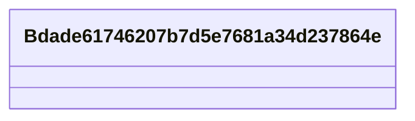

# Class: No class (entity type) name specified -- this class is noted as a superclass of another class in this graph but has not itself been defined. (__Bdade61746207b7d5e7681a34d237864e)


_No class (type) description specified_


URI: [_:Bdade61746207b7d5e7681a34d237864e](_:Bdade61746207b7d5e7681a34d237864e)





<!-- no inheritance hierarchy -->


## Slots

| Name | Cardinality and Range | Description | Inheritance | Occurrences |
| ---  | --- | --- | --- | --- |


## LinkML Source

<!-- TODO: investigate https://stackoverflow.com/questions/37606292/how-to-create-tabbed-code-blocks-in-mkdocs-or-sphinx -->

### Direct

<details>

```yaml
name: __Bdade61746207b7d5e7681a34d237864e
conforms_to: No schema conformance document specified
description: No class (type) description specified
title: No class (entity type) name specified -- this class is noted as a superclass
  of another class in this graph but has not itself been defined.
from_schema: sawgraph-kg
rank: 1000
class_uri: _:Bdade61746207b7d5e7681a34d237864e

```
</details>

### Induced

<details>

```yaml
name: __Bdade61746207b7d5e7681a34d237864e
conforms_to: No schema conformance document specified
description: No class (type) description specified
title: No class (entity type) name specified -- this class is noted as a superclass
  of another class in this graph but has not itself been defined.
from_schema: sawgraph-kg
rank: 1000
class_uri: _:Bdade61746207b7d5e7681a34d237864e

```
</details>