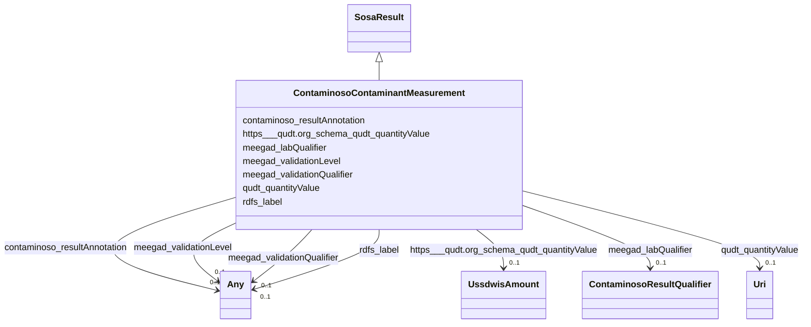

# Class: TODO -- what's a good name for this class (type)? (contaminoso_ContaminantMeasurement)


_TODO -- tell the world what this class (type) describes._


URI: [contaminoso:ContaminantMeasurement](http://sawgraph.spatialai.org/v1/contaminoso#ContaminantMeasurement)





## Inheritance
* [SosaResult](../classes/SosaResult.md)
    * **ContaminosoContaminantMeasurement**


## Slots

| Name | Cardinality and Range | Description | Inheritance |
| ---  | --- | --- | --- |
| [meegad_validationQualifier](../slots/meegad_validationQualifier.md) | 0..1 <br/> [Any](../classes/Any.md)&nbsp;or&nbsp;<br />[ContaminosoResultQualifier](../classes/ContaminosoResultQualifier.md)&nbsp;or&nbsp;<br />[xsd:anyURI](http://www.w3.org/2001/XMLSchema#anyURI) | TODO -- tell the world what this slot (predicate) describes | direct |
| [meegad_labQualifier](../slots/meegad_labQualifier.md) | 0..1 <br/> [ContaminosoResultQualifier](../classes/ContaminosoResultQualifier.md) | TODO -- tell the world what this slot (predicate) describes | direct |
| [contaminoso_resultAnnotation](../slots/contaminoso_resultAnnotation.md) | 0..1 <br/> [Any](../classes/Any.md)&nbsp;or&nbsp;<br />[ContaminosoResultQualifier](../classes/ContaminosoResultQualifier.md)&nbsp;or&nbsp;<br />[xsd:anyURI](http://www.w3.org/2001/XMLSchema#anyURI) | TODO -- tell the world what this slot (predicate) describes | direct |
| [meegad_validationLevel](../slots/meegad_validationLevel.md) | 0..1 <br/> [Any](../classes/Any.md)&nbsp;or&nbsp;<br />[ContaminosoResultQualifier](../classes/ContaminosoResultQualifier.md)&nbsp;or&nbsp;<br />[xsd:anyURI](http://www.w3.org/2001/XMLSchema#anyURI) | TODO -- tell the world what this slot (predicate) describes | direct |
| [https___qudt.org_schema_qudt_quantityValue](../slots/https___qudt.org_schema_qudt_quantityValue.md) | 0..1 <br/> [UssdwisAmount](../classes/UssdwisAmount.md) | TODO -- tell the world what this slot (predicate) describes | direct |
| [qudt_quantityValue](../slots/qudt_quantityValue.md) | 0..1 <br/> [xsd:anyURI](http://www.w3.org/2001/XMLSchema#anyURI) | TODO -- tell the world what this slot (predicate) describes | direct |
| [rdfs_label](../slots/rdfs_label.md) | 0..1 <br/> [Any](../classes/Any.md)&nbsp;or&nbsp;<br />[xsd:string](http://www.w3.org/2001/XMLSchema#string)&nbsp;or&nbsp;<br />[xsd:anyURI](http://www.w3.org/2001/XMLSchema#anyURI) | TODO -- tell the world what this slot (predicate) describes | direct |


## Usages

| used by | used in | type | used |
| ---  | --- | --- | --- |
| [ContaminosoContaminantObservation](../classes/ContaminosoContaminantObservation.md) | [sosa_hasResult](../slots/sosa_hasResult.md) | any_of[range] | [ContaminosoContaminantMeasurement](../classes/ContaminosoContaminantMeasurement.md) |


## TODOs

* TODO -- Todos for this class go here
* or you can delete the todos
* if you think the class is perfect.

## Identifier and Mapping Information


### Schema Source


* from schema: sawgraph-kg


## Mappings

| Mapping Type | Mapped Value |
| ---  | ---  |
| self | contaminoso:ContaminantMeasurement |
| native | sawgraph-kg/:ContaminosoContaminantMeasurement |


## LinkML Source

<!-- TODO: investigate https://stackoverflow.com/questions/37606292/how-to-create-tabbed-code-blocks-in-mkdocs-or-sphinx -->

### Direct

<details>
```yaml
name: contaminoso_ContaminantMeasurement
description: TODO -- tell the world what this class (type) describes.
title: TODO -- what's a good name for this class (type)?
todos:
- TODO -- Todos for this class go here
- or you can delete the todos
- if you think the class is perfect.
notes:
- Class with 143064 occurences.
from_schema: sawgraph-kg
is_a: sosa_Result
slots:
- meegad_validationQualifier
- meegad_labQualifier
- contaminoso_resultAnnotation
- meegad_validationLevel
- https___qudt.org_schema_qudt_quantityValue
- qudt_quantityValue
- rdfs_label
class_uri: contaminoso:ContaminantMeasurement

```
</details>

### Induced

<details>
```yaml
name: contaminoso_ContaminantMeasurement
description: TODO -- tell the world what this class (type) describes.
title: TODO -- what's a good name for this class (type)?
todos:
- TODO -- Todos for this class go here
- or you can delete the todos
- if you think the class is perfect.
notes:
- Class with 143064 occurences.
from_schema: sawgraph-kg
is_a: sosa_Result
attributes:
  meegad_validationQualifier:
    name: meegad_validationQualifier
    description: TODO -- tell the world what this slot (predicate) describes.
    title: TODO -- tell the world what this slot (predicate) describes.
    todos:
    - TODO -- Todos for this slot go here
    - or you can delete the todos
    - if you think the class is perfect.
    comments:
    - 60592 occurrences with subject type contaminoso_ContaminantMeasurement and object
      type contaminoso_ResultQualifier.
    - 17314 occurrences with subject type contaminoso_AggregateContaminantMeasurement
      and object type contaminoso_ResultQualifier.
    - 45 occurrences with subject type contaminoso_ContaminantMeasurement and object
      type uri.
    - 8 occurrences with subject type contaminoso_AggregateContaminantMeasurement
      and object type uri.
    examples:
    - value: http://sawgraph.spatialai.org/v1/me-egad-data#result.WG17410824.AAWH.20230125.1763231
        meegad:validationQualifier meegad:concentrationQualifier.J
    - value: http://sawgraph.spatialai.org/v1/me-egad-data#result.WG17410824.AAWH.20230125.DEP18018
        meegad:validationQualifier meegad:concentrationQualifier.J
    - value: http://sawgraph.spatialai.org/v1/me-egad-data#result.320623561.TA.20200701.335671
        meegad:validationQualifier meegad:concentrationQualifier.M
    - value: http://sawgraph.spatialai.org/v1/me-egad-data#result.320623562.TA.20200701.DEP18010
        meegad:validationQualifier meegad:concentrationQualifier.M
    from_schema: sawgraph-kg
    rank: 1000
    slot_uri: meegad:validationQualifier
    alias: meegad_validationQualifier
    owner: contaminoso_ContaminantMeasurement
    domain_of:
    - contaminoso_AggregateContaminantMeasurement
    - contaminoso_ContaminantMeasurement
    subproperty_of: contaminoso_resultAnnotation
    range: Any
    any_of:
    - range: contaminoso_ResultQualifier
    - range: uri
  meegad_labQualifier:
    name: meegad_labQualifier
    description: TODO -- tell the world what this slot (predicate) describes.
    title: TODO -- tell the world what this slot (predicate) describes.
    todos:
    - TODO -- Todos for this slot go here
    - or you can delete the todos
    - if you think the class is perfect.
    comments:
    - 40705 occurrences with subject type contaminoso_ContaminantMeasurement and object
      type contaminoso_ResultQualifier.
    - 13237 occurrences with subject type contaminoso_AggregateContaminantMeasurement
      and object type contaminoso_ResultQualifier.
    examples:
    - value: http://sawgraph.spatialai.org/v1/me-egad-data#result.WG17410824.AAWH.20230125.1763231
        meegad:labQualifier meegad:concentrationQualifier.J
    - value: http://sawgraph.spatialai.org/v1/me-egad-data#result.WG17410824.AAWH.20230125.DEP18018
        meegad:labQualifier meegad:concentrationQualifier.J
    from_schema: sawgraph-kg
    rank: 1000
    slot_uri: meegad:labQualifier
    alias: meegad_labQualifier
    owner: contaminoso_ContaminantMeasurement
    domain_of:
    - contaminoso_AggregateContaminantMeasurement
    - contaminoso_ContaminantMeasurement
    subproperty_of: contaminoso_resultAnnotation
    range: contaminoso_ResultQualifier
  contaminoso_resultAnnotation:
    name: contaminoso_resultAnnotation
    description: TODO -- tell the world what this slot (predicate) describes.
    title: TODO -- tell the world what this slot (predicate) describes.
    todos:
    - TODO -- Todos for this slot go here
    - or you can delete the todos
    - if you think the class is perfect.
    comments:
    - 180161 occurrences with subject type contaminoso_ContaminantMeasurement and
      object type contaminoso_ResultQualifier.
    - 44340 occurrences with subject type contaminoso_AggregateContaminantMeasurement
      and object type contaminoso_ResultQualifier.
    - 535 occurrences with subject type contaminoso_ContaminantMeasurement and object
      type uri.
    - 72 occurrences with subject type contaminoso_AggregateContaminantMeasurement
      and object type uri.
    - 283759 occurrences with subject type contaminoso_ResultQualifier and object
      type contaminoso_ResultQualifier.
    examples:
    - value: http://sawgraph.spatialai.org/v1/me-egad-data#result.WG17410824.AAWH.20230125.1763231
        contaminoso:resultAnnotation meegad:validationLevel.DEP
    - value: http://sawgraph.spatialai.org/v1/me-egad-data#result.WG17410824.AAWH.20230125.DEP18018
        contaminoso:resultAnnotation meegad:validationLevel.DEP
    - value: http://sawgraph.spatialai.org/v1/me-egad-data#result.170094201.VAL.20170725.108427538
        contaminoso:resultAnnotation meegad:validationLevel.TierII-EPA-NE-REGION-1-GUIDELINES
    - value: http://sawgraph.spatialai.org/v1/me-egad-data#result.170098413.VAL.20170802.DEP18016
        contaminoso:resultAnnotation meegad:validationLevel.TierII-EPA-NE-REGION-1-GUIDELINES
    - value: http://sawgraph.spatialai.org/v1/me-egad-data#mdl.WG17410824.AAWH.20230125.DEP18018
        contaminoso:resultAnnotation http://sawgraph.spatialai.org/v1/me-egad-data#rl.WG17410824.AAWH.20230125.DEP18018
    from_schema: sawgraph-kg
    rank: 1000
    slot_uri: contaminoso:resultAnnotation
    alias: contaminoso_resultAnnotation
    owner: contaminoso_ContaminantMeasurement
    domain_of:
    - contaminoso_AggregateContaminantMeasurement
    - contaminoso_ContaminantMeasurement
    - contaminoso_ResultQualifier
    range: Any
    any_of:
    - range: contaminoso_ResultQualifier
    - range: uri
  meegad_validationLevel:
    name: meegad_validationLevel
    description: TODO -- tell the world what this slot (predicate) describes.
    title: TODO -- tell the world what this slot (predicate) describes.
    todos:
    - TODO -- Todos for this slot go here
    - or you can delete the todos
    - if you think the class is perfect.
    comments:
    - 113547 occurrences with subject type contaminoso_ContaminantMeasurement and
      object type contaminoso_ResultQualifier.
    - 26147 occurrences with subject type contaminoso_AggregateContaminantMeasurement
      and object type contaminoso_ResultQualifier.
    - 490 occurrences with subject type contaminoso_ContaminantMeasurement and object
      type uri.
    - 64 occurrences with subject type contaminoso_AggregateContaminantMeasurement
      and object type uri.
    examples:
    - value: http://sawgraph.spatialai.org/v1/me-egad-data#result.WG17410824.AAWH.20230125.1763231
        meegad:validationLevel meegad:validationLevel.DEP
    - value: http://sawgraph.spatialai.org/v1/me-egad-data#result.WG17410824.AAWH.20230125.DEP18018
        meegad:validationLevel meegad:validationLevel.DEP
    - value: http://sawgraph.spatialai.org/v1/me-egad-data#result.170094201.VAL.20170725.108427538
        meegad:validationLevel meegad:validationLevel.TierII-EPA-NE-REGION-1-GUIDELINES
    - value: http://sawgraph.spatialai.org/v1/me-egad-data#result.170098413.VAL.20170802.DEP18016
        meegad:validationLevel meegad:validationLevel.TierII-EPA-NE-REGION-1-GUIDELINES
    from_schema: sawgraph-kg
    rank: 1000
    slot_uri: meegad:validationLevel
    alias: meegad_validationLevel
    owner: contaminoso_ContaminantMeasurement
    domain_of:
    - contaminoso_AggregateContaminantMeasurement
    - contaminoso_ContaminantMeasurement
    subproperty_of: contaminoso_resultAnnotation
    range: Any
    any_of:
    - range: contaminoso_ResultQualifier
    - range: uri
  https___qudt.org_schema_qudt_quantityValue:
    name: https___qudt.org_schema_qudt_quantityValue
    description: TODO -- tell the world what this slot (predicate) describes.
    title: TODO -- tell the world what this slot (predicate) describes.
    todos:
    - TODO -- Todos for this slot go here
    - or you can delete the todos
    - if you think the class is perfect.
    comments:
    - 21 occurrences with subject type contaminoso_ContaminantMeasurement and object
      type ussdwis_Amount.
    examples:
    - value: http://sawgraph.spatialai.org/v1/us-sdwis-data#d.PWS-PFASConcentration.ME0309196.03162022.PFOA-PFOS-PFHxS-PFNA-PFHpA-PFDA
        https://qudt.org/schema/qudt/quantityValue http://sawgraph.spatialai.org/v1/us-sdwis-data#d.Amount.ME0309196.Sample-03162022.Chemical-PFOA-PFOS-PFHxS-PFNA-PFHpA-PFDA
    from_schema: sawgraph-kg
    rank: 1000
    slot_uri: https://qudt.org/schema/qudt/quantityValue
    alias: https___qudt.org_schema_qudt_quantityValue
    owner: contaminoso_ContaminantMeasurement
    domain_of:
    - contaminoso_ContaminantMeasurement
    range: ussdwis_Amount
  qudt_quantityValue:
    name: qudt_quantityValue
    description: TODO -- tell the world what this slot (predicate) describes.
    title: TODO -- tell the world what this slot (predicate) describes.
    todos:
    - TODO -- Todos for this slot go here
    - or you can delete the todos
    - if you think the class is perfect.
    comments:
    - 115882 occurrences with subject type contaminoso_ContaminantMeasurement and
      object type uri.
    - 26293 occurrences with subject type contaminoso_AggregateContaminantMeasurement
      and object type uri.
    examples:
    - value: http://sawgraph.spatialai.org/v1/me-egad-data#result.1028303.ELL.20190405.45298906
        qudt:quantityValue http://sawgraph.spatialai.org/v1/me-egad-data#quantityValue.1028303.ELL.20190405.45298906
    - value: http://sawgraph.spatialai.org/v1/me-egad-data#result.1028303.ELL.20190405.DEP18010
        qudt:quantityValue http://sawgraph.spatialai.org/v1/me-egad-data#quantityValue.1028303.ELL.20190405.DEP18010
    from_schema: sawgraph-kg
    rank: 1000
    slot_uri: qudt:quantityValue
    alias: qudt_quantityValue
    owner: contaminoso_ContaminantMeasurement
    domain_of:
    - contaminoso_AggregateContaminantMeasurement
    - contaminoso_ContaminantMeasurement
    range: uri
  rdfs_label:
    name: rdfs_label
    description: TODO -- tell the world what this slot (predicate) describes.
    title: TODO -- tell the world what this slot (predicate) describes.
    todos:
    - TODO -- Todos for this slot go here
    - or you can delete the todos
    - if you think the class is perfect.
    comments:
    - 66 occurrences with subject type contaminoso_ResultQualifier and object type
      string.
    - 33 occurrences with subject type ilisgs_WellPurpose and object type string.
    - 109 occurrences with subject type meegad_EGAD-SamplePointType and object type
      string.
    - 94 occurrences with subject type contaminoso_Substance and object type string.
    - 12 occurrences with subject type contaminoso_ObservationAnnotation and object
      type string.
    - 160 occurrences with subject type contaminoso_SampleAnnotation and object type
      string.
    - 97 occurrences with subject type contaminoso_MaterialType and object type string.
    - 1249 occurrences with subject type meegad_EGAD-AnalysisMethod and object type
      string.
    - 3 occurrences with subject type http___qudt.org_vocab_unitUnit and object type
      string.
    - 300 occurrences with subject type prov_Organization and object type string.
    - 115887 occurrences with subject type contaminoso_ContaminantMeasurement and
      object type string.
    - 26294 occurrences with subject type contaminoso_AggregateContaminantMeasurement
      and object type string.
    - 23031 occurrences with subject type contaminoso_MaterialSample and object type
      string.
    - 8324 occurrences with subject type contaminoso_Point and object type string.
    - 171069 occurrences with subject type contaminoso_Feature and object type string.
    - 957 occurrences with subject type meegad_EGAD-Site and object type string.
    - 62 occurrences with subject type meegad_EGAD-SiteType and object type string.
    - 142181 occurrences with subject type contaminoso_ContaminantObservation and
      object type string.
    examples:
    - value: http://sawgraph.spatialai.org/me-egad#concentrationQualifier.* rdfs:label
        QC RESULTS NOT WITHIN CONTROL LIMITS
    - value: http://sawgraph.spatialai.org/v1/il-isgs-data#d.ISGS-WellPurpose.CROP
        rdfs:label Outcrop
    - value: meegad:featureType.AST rdfs:label ABOVEGROUND STORAGE TANK
    - value: meegad:parameter.10-2_FTS_A rdfs:label 10:2 FLUOROTELOMER SULFONIC ACID
    - value: meegad:resultType.TRG rdfs:label TARGET/REGULAR RESULT
    - value: meegad:sampleLocation.AF rdfs:label AFTER FILTERS
    - value: meegad:sampleMaterialType.AS rdfs:label ASH (BOTTOM & FLY)
    - value: meegad:testMethod.CALCULATED rdfs:label CALCULATED
    - value: meegad:unit.MG-KG rdfs:label MILLIGRAMS PER KILOGRAM
    - value: http://sawgraph.spatialai.org/v1/me-egad-data#organization.lab.AA rdfs:label
        ALPHA ANALYTICAL LAB - WESTBOROUGH, MA
    - value: http://sawgraph.spatialai.org/v1/me-egad-data#result.1028303.ELL.20190405.45298906
        rdfs:label EGAD PFAS measurements for sample 722
    - value: http://sawgraph.spatialai.org/v1/me-egad-data#result.1028303.ELL.20190405.DEP18010
        rdfs:label EGAD PFAS measurements for sample 722
    - value: http://sawgraph.spatialai.org/v1/me-egad-data#sample.1028303.ELL.20190405
        rdfs:label EGAD sample 722
    - value: http://sawgraph.spatialai.org/v1/me-egad-data#samplePoint.100410 rdfs:label
        EGAD sample point 100410
    - value: http://sawgraph.spatialai.org/v1/me-egad-data#sampledFeature.100410 rdfs:label
        EGAD sampled festure associated with sample point 100410
    - value: http://sawgraph.spatialai.org/v1/me-egad-data#site.100843 rdfs:label
        EGAD site 100843
    - value: meegad:siteType.AGRICCHEM rdfs:label AGRICULTURAL CHEMICAL USE
    - value: http://sawgraph.spatialai.org/v1/me-egad-data#observation.1028303.ELL.20190405.45298906
        rdfs:label EGAD PFAS observation for sample 722
    from_schema: sawgraph-kg
    rank: 1000
    slot_uri: rdfs:label
    alias: rdfs_label
    owner: contaminoso_ContaminantMeasurement
    domain_of:
    - contaminoso_AggregateContaminantMeasurement
    - contaminoso_ContaminantMeasurement
    - contaminoso_ContaminantObservation
    - contaminoso_Feature
    - contaminoso_MaterialSample
    - contaminoso_MaterialType
    - contaminoso_ObservationAnnotation
    - contaminoso_Point
    - contaminoso_ResultQualifier
    - contaminoso_SampleAnnotation
    - contaminoso_Substance
    - http___qudt.org_vocab_unitUnit
    - ilisgs_WellPurpose
    - meegad_EGAD-AnalysisMethod
    - meegad_EGAD-SamplePointType
    - meegad_EGAD-Site
    - meegad_EGAD-SiteType
    - prov_Organization
    range: Any
    any_of:
    - range: string
    - range: uri
class_uri: contaminoso:ContaminantMeasurement

```
</details>