# Class: TODO -- what's a good name for this class (type)? (contaminoso_ContaminantObservation)


_No type description provided_


URI: [contaminoso:ContaminantObservation](http://sawgraph.spatialai.org/v1/contaminoso#ContaminantObservation)

```mermaid
 classDiagram
    class ContaminosoContaminantObservation
    click ContaminosoContaminantObservation href "../ContaminosoContaminantObservation"
      SosaObservation <|-- ContaminosoContaminantObservation
        click SosaObservation href "../SosaObservation"
      
      ContaminosoContaminantObservation : contaminoso_analysisDate
        
          
    
    
    ContaminosoContaminantObservation --> "0..1" Date : contaminoso_analysisDate
    click Date href "../Date"

        
      ContaminosoContaminantObservation : contaminoso_analysisMethod
        
          
    
    
    ContaminosoContaminantObservation --> "0..1" MeegadEGAD-AnalysisMethod : contaminoso_analysisMethod
    click MeegadEGAD-AnalysisMethod href "../MeegadEGAD-AnalysisMethod"

        
      ContaminosoContaminantObservation : contaminoso_analyzedBy
        
          
    
    
    ContaminosoContaminantObservation --> "0..1" ProvOrganization : contaminoso_analyzedBy
    click ProvOrganization href "../ProvOrganization"

        
      ContaminosoContaminantObservation : contaminoso_analyzedSample
        
          
    
    
    ContaminosoContaminantObservation --> "0..1" Any : contaminoso_analyzedSample
    click Any href "../Any"

        
      ContaminosoContaminantObservation : contaminoso_fromSampledFeature
        
          
    
    
    ContaminosoContaminantObservation --> "0..1" ContaminosoFeature : contaminoso_fromSampledFeature
    click ContaminosoFeature href "../ContaminosoFeature"

        
      ContaminosoContaminantObservation : contaminoso_hasAggregationPeriod
        
          
    
    
    ContaminosoContaminantObservation --> "0..1" Uri : contaminoso_hasAggregationPeriod
    click Uri href "../Uri"

        
      ContaminosoContaminantObservation : contaminoso_hasFeatureOfInterest
        
          
    
    
    ContaminosoContaminantObservation --> "0..1" ContaminosoFeature : contaminoso_hasFeatureOfInterest
    click ContaminosoFeature href "../ContaminosoFeature"

        
      ContaminosoContaminantObservation : contaminoso_hasResult
        
          
    
    
    ContaminosoContaminantObservation --> "0..1" ContaminosoAggregateContaminantMeasurement : contaminoso_hasResult
    click ContaminosoAggregateContaminantMeasurement href "../ContaminosoAggregateContaminantMeasurement"

        
      ContaminosoContaminantObservation : contaminoso_hasTemporalCoverage
        
          
    
    
    ContaminosoContaminantObservation --> "0..1" Uri : contaminoso_hasTemporalCoverage
    click Uri href "../Uri"

        
      ContaminosoContaminantObservation : contaminoso_observationAnnotation
        
          
    
    
    ContaminosoContaminantObservation --> "0..1" ContaminosoObservationAnnotation : contaminoso_observationAnnotation
    click ContaminosoObservationAnnotation href "../ContaminosoObservationAnnotation"

        
      ContaminosoContaminantObservation : contaminoso_observedAtSamplePoint
        
          
    
    
    ContaminosoContaminantObservation --> "0..1" ContaminosoPoint : contaminoso_observedAtSamplePoint
    click ContaminosoPoint href "../ContaminosoPoint"

        
      ContaminosoContaminantObservation : contaminoso_ofSubstance
        
          
    
    
    ContaminosoContaminantObservation --> "0..1" Any : contaminoso_ofSubstance
    click Any href "../Any"

        
      ContaminosoContaminantObservation : contaminoso_sampledFeature
        
          
    
    
    ContaminosoContaminantObservation --> "0..1" Any : contaminoso_sampledFeature
    click Any href "../Any"

        
      ContaminosoContaminantObservation : contaminoso_sampledTime
        
          
    
    
    ContaminosoContaminantObservation --> "0..1" Date : contaminoso_sampledTime
    click Date href "../Date"

        
      ContaminosoContaminantObservation : contaminoso_sampleTime
        
          
    
    
    ContaminosoContaminantObservation --> "0..1" Date : contaminoso_sampleTime
    click Date href "../Date"

        
      ContaminosoContaminantObservation : http___sawgraph.spatialai.org_v1_us_epa_ghg#GHG_Subpart
        
          
    
    
    ContaminosoContaminantObservation --> "0..1" String : http___sawgraph.spatialai.org_v1_us_epa_ghg#GHG_Subpart
    click String href "../String"

        
      ContaminosoContaminantObservation : meegad_analyzedSample
        
          
    
    
    ContaminosoContaminantObservation --> "0..1" ContaminosoMaterialSample : meegad_analyzedSample
    click ContaminosoMaterialSample href "../ContaminosoMaterialSample"

        
      ContaminosoContaminantObservation : meegad_resultType
        
          
    
    
    ContaminosoContaminantObservation --> "0..1" ContaminosoObservationAnnotation : meegad_resultType
    click ContaminosoObservationAnnotation href "../ContaminosoObservationAnnotation"

        
      ContaminosoContaminantObservation : rdfs_label
        
          
    
    
    ContaminosoContaminantObservation --> "0..1" Any : rdfs_label
    click Any href "../Any"

        
      ContaminosoContaminantObservation : sosa_hasFeatureOfInterest
        
          
    
    
    ContaminosoContaminantObservation --> "0..1" ContaminosoFeature : sosa_hasFeatureOfInterest
    click ContaminosoFeature href "../ContaminosoFeature"

        
      ContaminosoContaminantObservation : sosa_hasResult
        
          
    
    
    ContaminosoContaminantObservation --> "0..1" Any : sosa_hasResult
    click Any href "../Any"

        
      ContaminosoContaminantObservation : sosa_observedProperty
        
          
    
    
    ContaminosoContaminantObservation --> "0..1" Any : sosa_observedProperty
    click Any href "../Any"

        
      ContaminosoContaminantObservation : sosa_resultTime
        
          
    
    
    ContaminosoContaminantObservation --> "0..1" Date : sosa_resultTime
    click Date href "../Date"

        
      
```





## Inheritance
* [SosaObservation](../classes/SosaObservation.md)
    * **ContaminosoContaminantObservation**


## Slots

| Name | Cardinality and Range | Description | Inheritance |
| ---  | --- | --- | --- |
| [contaminoso_hasResult](../slots/contaminoso_hasResult.md) | 0..1 <br/> [ContaminosoAggregateContaminantMeasurement](../classes/ContaminosoAggregateContaminantMeasurement.md) | No slot description provided | direct |
| [contaminoso_analysisMethod](../slots/contaminoso_analysisMethod.md) | 0..1 <br/> [MeegadEGAD-AnalysisMethod](../classes/MeegadEGAD-AnalysisMethod.md) | No slot description provided | direct |
| [contaminoso_hasFeatureOfInterest](../slots/contaminoso_hasFeatureOfInterest.md) | 0..1 <br/> [ContaminosoFeature](../classes/ContaminosoFeature.md) | No slot description provided | direct |
| [contaminoso_analyzedBy](../slots/contaminoso_analyzedBy.md) | 0..1 <br/> [ProvOrganization](../classes/ProvOrganization.md) | No slot description provided | direct |
| [contaminoso_analysisDate](../slots/contaminoso_analysisDate.md) | 0..1 <br/> [xsd:date](http://www.w3.org/2001/XMLSchema#date) | No slot description provided | direct |
| [sosa_hasFeatureOfInterest](../slots/sosa_hasFeatureOfInterest.md) | 0..1 <br/> [ContaminosoFeature](../classes/ContaminosoFeature.md) | No slot description provided | direct |
| [meegad_analyzedSample](../slots/meegad_analyzedSample.md) | 0..1 <br/> [ContaminosoMaterialSample](../classes/ContaminosoMaterialSample.md) | No slot description provided | direct |
| [contaminoso_sampleTime](../slots/contaminoso_sampleTime.md) | 0..1 <br/> [xsd:date](http://www.w3.org/2001/XMLSchema#date) | No slot description provided | direct |
| [contaminoso_fromSampledFeature](../slots/contaminoso_fromSampledFeature.md) | 0..1 <br/> [ContaminosoFeature](../classes/ContaminosoFeature.md) | No slot description provided | direct |
| [contaminoso_analyzedSample](../slots/contaminoso_analyzedSample.md) | 0..1 <br/> [ContaminosoMaterialSample](../classes/ContaminosoMaterialSample.md)&nbsp;or&nbsp;<br />[xsd:anyURI](http://www.w3.org/2001/XMLSchema#anyURI) | No slot description provided | direct |
| [contaminoso_hasTemporalCoverage](../slots/contaminoso_hasTemporalCoverage.md) | 0..1 <br/> [xsd:anyURI](http://www.w3.org/2001/XMLSchema#anyURI) | No slot description provided | direct |
| [contaminoso_ofSubstance](../slots/contaminoso_ofSubstance.md) | 0..1 <br/> [ContaminosoSubstance](../classes/ContaminosoSubstance.md)&nbsp;or&nbsp;<br />[xsd:anyURI](http://www.w3.org/2001/XMLSchema#anyURI) | No slot description provided | direct |
| [sosa_hasResult](../slots/sosa_hasResult.md) | 0..1 <br/> [ContaminosoContaminantMeasurement](../classes/ContaminosoContaminantMeasurement.md)&nbsp;or&nbsp;<br />[ContaminosoAggregateContaminantMeasurement](../classes/ContaminosoAggregateContaminantMeasurement.md) | No slot description provided | direct |
| [sosa_resultTime](../slots/sosa_resultTime.md) | 0..1 <br/> [xsd:date](http://www.w3.org/2001/XMLSchema#date) | No slot description provided | direct |
| [contaminoso_hasAggregationPeriod](../slots/contaminoso_hasAggregationPeriod.md) | 0..1 <br/> [xsd:anyURI](http://www.w3.org/2001/XMLSchema#anyURI) | No slot description provided | direct |
| [rdfs_label](../slots/rdfs_label.md) | 0..1 <br/> [xsd:string](http://www.w3.org/2001/XMLSchema#string)&nbsp;or&nbsp;<br />[xsd:anyURI](http://www.w3.org/2001/XMLSchema#anyURI) | No slot description provided | direct |
| [contaminoso_observedAtSamplePoint](../slots/contaminoso_observedAtSamplePoint.md) | 0..1 <br/> [ContaminosoPoint](../classes/ContaminosoPoint.md) | No slot description provided | direct |
| [http___sawgraph.spatialai.org_v1_us_epa_ghg#GHG_Subpart](../slots/http___sawgraph.spatialai.org_v1_us_epa_ghg#GHG_Subpart.md) | 0..1 <br/> [xsd:string](http://www.w3.org/2001/XMLSchema#string) | No slot description provided | direct |
| [contaminoso_sampledFeature](../slots/contaminoso_sampledFeature.md) | 0..1 <br/> [ContaminosoFeature](../classes/ContaminosoFeature.md)&nbsp;or&nbsp;<br />[xsd:anyURI](http://www.w3.org/2001/XMLSchema#anyURI) | No slot description provided | direct |
| [meegad_resultType](../slots/meegad_resultType.md) | 0..1 <br/> [ContaminosoObservationAnnotation](../classes/ContaminosoObservationAnnotation.md) | No slot description provided | direct |
| [sosa_observedProperty](../slots/sosa_observedProperty.md) | 0..1 <br/> [ContaminosoSubstance](../classes/ContaminosoSubstance.md)&nbsp;or&nbsp;<br />[xsd:anyURI](http://www.w3.org/2001/XMLSchema#anyURI) | No slot description provided | direct |
| [contaminoso_observationAnnotation](../slots/contaminoso_observationAnnotation.md) | 0..1 <br/> [ContaminosoObservationAnnotation](../classes/ContaminosoObservationAnnotation.md) | No slot description provided | direct |
| [contaminoso_sampledTime](../slots/contaminoso_sampledTime.md) | 0..1 <br/> [xsd:date](http://www.w3.org/2001/XMLSchema#date) | No slot description provided | direct |


## Usages

| used by | used in | type | used |
| ---  | --- | --- | --- |
| [ContaminosoContaminantObservation](../classes/ContaminosoContaminantObservation.md) | [contaminoso_sampledFeature](../slots/contaminoso_sampledFeature.md) | domain | [ContaminosoContaminantObservation](../classes/ContaminosoContaminantObservation.md) |


## TODOs

* TODO -- Todos for this class go here
* or you can delete the todos
* if you think the class is perfect.

## Identifier and Mapping Information


### Schema Source


* from schema: sawgraph-kg


## Mappings

| Mapping Type | Mapped Value |
| ---  | ---  |
| self | contaminoso:ContaminantObservation |
| native | sawgraph-kg/:ContaminosoContaminantObservation |


## LinkML Source

<!-- TODO: investigate https://stackoverflow.com/questions/37606292/how-to-create-tabbed-code-blocks-in-mkdocs-or-sphinx -->

### Direct

<details>
```yaml
name: contaminoso_ContaminantObservation
description: No type description provided
title: TODO -- what's a good name for this class (type)?
todos:
- TODO -- Todos for this class go here
- or you can delete the todos
- if you think the class is perfect.
notes:
- Class with 143064 occurences.
from_schema: sawgraph-kg
rank: 1000
is_a: sosa_Observation
slots:
- contaminoso_hasResult
- contaminoso_analysisMethod
- contaminoso_hasFeatureOfInterest
- contaminoso_analyzedBy
- contaminoso_analysisDate
- sosa_hasFeatureOfInterest
- meegad_analyzedSample
- contaminoso_sampleTime
- contaminoso_fromSampledFeature
- contaminoso_analyzedSample
- contaminoso_hasTemporalCoverage
- contaminoso_ofSubstance
- sosa_hasResult
- sosa_resultTime
- contaminoso_hasAggregationPeriod
- rdfs_label
- contaminoso_observedAtSamplePoint
- http___sawgraph.spatialai.org_v1_us-epa-ghg#GHG-Subpart
- contaminoso_sampledFeature
- meegad_resultType
- sosa_observedProperty
- contaminoso_observationAnnotation
- contaminoso_sampledTime
class_uri: contaminoso:ContaminantObservation

```
</details>

### Induced

<details>
```yaml
name: contaminoso_ContaminantObservation
description: No type description provided
title: TODO -- what's a good name for this class (type)?
todos:
- TODO -- Todos for this class go here
- or you can delete the todos
- if you think the class is perfect.
notes:
- Class with 143064 occurences.
from_schema: sawgraph-kg
rank: 1000
is_a: sosa_Observation
attributes:
  contaminoso_hasResult:
    name: contaminoso_hasResult
    description: No slot description provided
    title: No slot description provided
    todos:
    - TODO -- Todos for this slot go here
    - or you can delete the todos
    - if you think the class is perfect.
    comments:
    - 733 occurrences with subject type contaminoso_ContaminantObservation and object
      type contaminoso_AggregateContaminantMeasurement.
    examples:
    - value: http://sawgraph.spatialai.org/v1/us-epa-ghg#d.ReleaseObservation.GHGFacility-1010811.Year-2012.Chemical-Perfluorocyclopropane
        contaminoso:hasResult http://sawgraph.spatialai.org/v1/us-epa-ghg#d.ContaminantMeasurement.GHGFacility-1010811.Year-2012.Chemical-Perfluorocyclopropane.Chemical-Perfluorocyclopropane
    from_schema: sawgraph-kg
    rank: 1000
    slot_uri: contaminoso:hasResult
    alias: contaminoso_hasResult
    owner: contaminoso_ContaminantObservation
    domain_of:
    - contaminoso_ContaminantObservation
    range: contaminoso_AggregateContaminantMeasurement
  contaminoso_analysisMethod:
    name: contaminoso_analysisMethod
    description: No slot description provided
    title: No slot description provided
    todos:
    - TODO -- Todos for this slot go here
    - or you can delete the todos
    - if you think the class is perfect.
    comments:
    - 142429 occurrences with subject type contaminoso_ContaminantObservation and
      object type meegad_EGAD-AnalysisMethod.
    examples:
    - value: http://sawgraph.spatialai.org/v1/me-egad-data#observation.WG17410824.AAWH.20230125.DEP18018
        contaminoso:analysisMethod meegad:testMethod.E537M
    from_schema: sawgraph-kg
    rank: 1000
    slot_uri: contaminoso:analysisMethod
    alias: contaminoso_analysisMethod
    owner: contaminoso_ContaminantObservation
    domain_of:
    - contaminoso_ContaminantObservation
    range: meegad_EGAD-AnalysisMethod
  contaminoso_hasFeatureOfInterest:
    name: contaminoso_hasFeatureOfInterest
    description: No slot description provided
    title: No slot description provided
    todos:
    - TODO -- Todos for this slot go here
    - or you can delete the todos
    - if you think the class is perfect.
    comments:
    - 733 occurrences with subject type contaminoso_ContaminantObservation and object
      type contaminoso_Feature.
    examples:
    - value: http://sawgraph.spatialai.org/v1/us-epa-ghg#d.ReleaseObservation.GHGFacility-1010811.Year-2012.Chemical-Perfluorocyclopropane
        contaminoso:hasFeatureOfInterest usfrsdata:d.FRS-Facility.110010724216
    from_schema: sawgraph-kg
    rank: 1000
    slot_uri: contaminoso:hasFeatureOfInterest
    alias: contaminoso_hasFeatureOfInterest
    owner: contaminoso_ContaminantObservation
    domain_of:
    - contaminoso_ContaminantObservation
    range: contaminoso_Feature
  contaminoso_analyzedBy:
    name: contaminoso_analyzedBy
    description: No slot description provided
    title: No slot description provided
    todos:
    - TODO -- Todos for this slot go here
    - or you can delete the todos
    - if you think the class is perfect.
    comments:
    - 142175 occurrences with subject type contaminoso_ContaminantObservation and
      object type prov_Organization.
    examples:
    - value: http://sawgraph.spatialai.org/v1/me-egad-data#observation.WG17410824.AAWH.20230125.DEP18018
        contaminoso:analyzedBy http://sawgraph.spatialai.org/v1/me-egad-data#organization.lab.AAWH
    from_schema: sawgraph-kg
    rank: 1000
    slot_uri: contaminoso:analyzedBy
    alias: contaminoso_analyzedBy
    owner: contaminoso_ContaminantObservation
    domain_of:
    - contaminoso_ContaminantObservation
    range: prov_Organization
  contaminoso_analysisDate:
    name: contaminoso_analysisDate
    description: No slot description provided
    title: No slot description provided
    todos:
    - TODO -- Todos for this slot go here
    - or you can delete the todos
    - if you think the class is perfect.
    comments:
    - 142853 occurrences with subject type contaminoso_ContaminantObservation and
      object type date.
    examples:
    - value: http://sawgraph.spatialai.org/v1/me-egad-data#observation.1028303.ELL.20190405.45298906
        contaminoso:analysisDate 2019-04-12
    from_schema: sawgraph-kg
    rank: 1000
    slot_uri: contaminoso:analysisDate
    alias: contaminoso_analysisDate
    owner: contaminoso_ContaminantObservation
    domain_of:
    - contaminoso_ContaminantObservation
    subproperty_of: sosa_resultTime
    range: date
  sosa_hasFeatureOfInterest:
    name: sosa_hasFeatureOfInterest
    description: No slot description provided
    title: No slot description provided
    todos:
    - TODO -- Todos for this slot go here
    - or you can delete the todos
    - if you think the class is perfect.
    comments:
    - 156 occurrences with subject type contaminoso_ContaminantObservation and object
      type contaminoso_Feature.
    examples:
    - value: http://sawgraph.spatialai.org/v1/us-sdwis-data#d.PWS-Observation.ME0400899.10282021.PFOA-PFOS-PFHxS-PFNA-PFHpA-PFDA
        sosa:hasFeatureOfInterest http://sawgraph.spatialai.org/v1/us-sdwis-data#d.PublicWaterSystem.ME0400899
    from_schema: sawgraph-kg
    rank: 1000
    slot_uri: sosa:hasFeatureOfInterest
    alias: sosa_hasFeatureOfInterest
    owner: contaminoso_ContaminantObservation
    domain_of:
    - contaminoso_ContaminantObservation
    range: contaminoso_Feature
  meegad_analyzedSample:
    name: meegad_analyzedSample
    description: No slot description provided
    title: No slot description provided
    todos:
    - TODO -- Todos for this slot go here
    - or you can delete the todos
    - if you think the class is perfect.
    comments:
    - 142175 occurrences with subject type contaminoso_ContaminantObservation and
      object type contaminoso_MaterialSample.
    examples:
    - value: http://sawgraph.spatialai.org/v1/me-egad-data#observation.WG17410824.AAWH.20230125.DEP18018
        meegad:analyzedSample http://sawgraph.spatialai.org/v1/me-egad-data#sample.WG17410824.AAWH.20230125
    from_schema: sawgraph-kg
    rank: 1000
    slot_uri: meegad:analyzedSample
    alias: meegad_analyzedSample
    owner: contaminoso_ContaminantObservation
    domain_of:
    - contaminoso_ContaminantObservation
    range: contaminoso_MaterialSample
  contaminoso_sampleTime:
    name: contaminoso_sampleTime
    description: No slot description provided
    title: No slot description provided
    todos:
    - TODO -- Todos for this slot go here
    - or you can delete the todos
    - if you think the class is perfect.
    comments:
    - 156 occurrences with subject type contaminoso_ContaminantObservation and object
      type date.
    examples:
    - value: http://sawgraph.spatialai.org/v1/us-sdwis-data#d.PWS-Observation.ME0000002.06132022.PFOA-PFOS-PFHxS-PFNA-PFHpA-PFDA
        contaminoso:sampleTime 2022-06-13
    from_schema: sawgraph-kg
    rank: 1000
    slot_uri: contaminoso:sampleTime
    alias: contaminoso_sampleTime
    owner: contaminoso_ContaminantObservation
    domain_of:
    - contaminoso_ContaminantObservation
    range: date
  contaminoso_fromSampledFeature:
    name: contaminoso_fromSampledFeature
    description: No slot description provided
    title: No slot description provided
    todos:
    - TODO -- Todos for this slot go here
    - or you can delete the todos
    - if you think the class is perfect.
    comments:
    - 142261 occurrences with subject type contaminoso_ContaminantObservation and
      object type contaminoso_Feature.
    examples:
    - value: http://sawgraph.spatialai.org/v1/me-egad-data#observation.WG17410824.AAWH.20230125.DEP18018
        contaminoso:fromSampledFeature http://sawgraph.spatialai.org/v1/me-egad-data#sampledFeature.142996
    from_schema: sawgraph-kg
    rank: 1000
    slot_uri: contaminoso:fromSampledFeature
    alias: contaminoso_fromSampledFeature
    owner: contaminoso_ContaminantObservation
    domain_of:
    - contaminoso_ContaminantObservation
    range: contaminoso_Feature
  contaminoso_analyzedSample:
    name: contaminoso_analyzedSample
    description: No slot description provided
    title: No slot description provided
    todos:
    - TODO -- Todos for this slot go here
    - or you can delete the todos
    - if you think the class is perfect.
    comments:
    - 142331 occurrences with subject type contaminoso_ContaminantObservation and
      object type contaminoso_MaterialSample.
    examples:
    - value: http://sawgraph.spatialai.org/v1/us-sdwis-data#d.PWS-Observation.ME0400899.10282021.PFOA-PFOS-PFHxS-PFNA-PFHpA-PFDA
        contaminoso:analyzedSample http://sawgraph.spatialai.org/v1/us-sdwis-data#d.PWS-Sample.ME0400899.10282021
    from_schema: sawgraph-kg
    rank: 1000
    domain: contaminoso_SampleContaminantObservation
    slot_uri: contaminoso:analyzedSample
    alias: contaminoso_analyzedSample
    owner: contaminoso_ContaminantObservation
    domain_of:
    - contaminoso_ContaminantObservation
    range: Any
    any_of:
    - range: contaminoso_MaterialSample
    - range: uri
  contaminoso_hasTemporalCoverage:
    name: contaminoso_hasTemporalCoverage
    description: No slot description provided
    title: No slot description provided
    todos:
    - TODO -- Todos for this slot go here
    - or you can delete the todos
    - if you think the class is perfect.
    comments:
    - 733 occurrences with subject type contaminoso_ContaminantObservation and object
      type uri.
    examples:
    - value: http://sawgraph.spatialai.org/v1/us-epa-ghg#d.ReleaseObservation.GHGFacility-1006665.Year-2011.Chemical-2_2_3_3_4-PENTAFLUORO-4-_TRIFLUOROMETHYL_-OXETANE
        contaminoso:hasTemporalCoverage usfrsdata:d.TimeInterval.Year-2011
    from_schema: sawgraph-kg
    rank: 1000
    domain: contaminoso_ReleaseContaminantObservation
    slot_uri: contaminoso:hasTemporalCoverage
    alias: contaminoso_hasTemporalCoverage
    owner: contaminoso_ContaminantObservation
    domain_of:
    - contaminoso_ContaminantObservation
    subproperty_of: contaminoso_hasAggregationPeriod
    range: uri
  contaminoso_ofSubstance:
    name: contaminoso_ofSubstance
    description: No slot description provided
    title: No slot description provided
    todos:
    - TODO -- Todos for this slot go here
    - or you can delete the todos
    - if you think the class is perfect.
    comments:
    - 143027 occurrences with subject type contaminoso_ContaminantObservation and
      object type contaminoso_Substance.
    - 37 occurrences with subject type contaminoso_ContaminantObservation and object
      type uri.
    examples:
    - value: http://sawgraph.spatialai.org/v1/us-sdwis-data#d.PWS-Observation.ME0400899.10282021.PFOA-PFOS-PFHxS-PFNA-PFHpA-PFDA
        contaminoso:ofSubstance http://sawgraph.spatialai.org/v1/us-sdwis-data#d.PWS-PFAS.PFOA-PFOS-PFHxS-PFNA-PFHpA-PFDA
    - value: http://sawgraph.spatialai.org/v1/me-egad-data#observation.4101220941.TAI.20221208.DEP18029
        contaminoso:ofSubstance meegad:parameter.SUM_PFOA_A_L-PFOA_A_BR
    from_schema: sawgraph-kg
    rank: 1000
    slot_uri: contaminoso:ofSubstance
    alias: contaminoso_ofSubstance
    owner: contaminoso_ContaminantObservation
    domain_of:
    - contaminoso_ContaminantObservation
    subproperty_of: sosa_observedProperty
    range: Any
    any_of:
    - range: contaminoso_Substance
    - range: uri
  sosa_hasResult:
    name: sosa_hasResult
    description: No slot description provided
    title: No slot description provided
    todos:
    - TODO -- Todos for this slot go here
    - or you can delete the todos
    - if you think the class is perfect.
    comments:
    - 116038 occurrences with subject type contaminoso_ContaminantObservation and
      object type contaminoso_ContaminantMeasurement.
    - 26293 occurrences with subject type contaminoso_ContaminantObservation and object
      type contaminoso_AggregateContaminantMeasurement.
    examples:
    - value: http://sawgraph.spatialai.org/v1/us-sdwis-data#d.PWS-Observation.ME0400899.10282021.PFOA-PFOS-PFHxS-PFNA-PFHpA-PFDA
        sosa:hasResult http://sawgraph.spatialai.org/v1/us-sdwis-data#d.PWS-PFASConcentration.ME0400899.10282021.PFOA-PFOS-PFHxS-PFNA-PFHpA-PFDA
    - value: http://sawgraph.spatialai.org/v1/me-egad-data#observation.WG17410824.AAWH.20230125.DEP18018
        sosa:hasResult http://sawgraph.spatialai.org/v1/me-egad-data#result.WG17410824.AAWH.20230125.DEP18018
    from_schema: sawgraph-kg
    rank: 1000
    slot_uri: sosa:hasResult
    alias: sosa_hasResult
    owner: contaminoso_ContaminantObservation
    domain_of:
    - contaminoso_ContaminantObservation
    range: Any
    any_of:
    - range: contaminoso_ContaminantMeasurement
    - range: contaminoso_AggregateContaminantMeasurement
  sosa_resultTime:
    name: sosa_resultTime
    description: No slot description provided
    title: No slot description provided
    todos:
    - TODO -- Todos for this slot go here
    - or you can delete the todos
    - if you think the class is perfect.
    comments:
    - 142853 occurrences with subject type contaminoso_ContaminantObservation and
      object type date.
    examples:
    - value: http://sawgraph.spatialai.org/v1/me-egad-data#observation.1028303.ELL.20190405.45298906
        sosa:resultTime 2019-04-12
    from_schema: sawgraph-kg
    rank: 1000
    slot_uri: sosa:resultTime
    alias: sosa_resultTime
    owner: contaminoso_ContaminantObservation
    domain_of:
    - contaminoso_ContaminantObservation
    range: date
  contaminoso_hasAggregationPeriod:
    name: contaminoso_hasAggregationPeriod
    description: No slot description provided
    title: No slot description provided
    todos:
    - TODO -- Todos for this slot go here
    - or you can delete the todos
    - if you think the class is perfect.
    comments:
    - 733 occurrences with subject type contaminoso_ContaminantObservation and object
      type uri.
    examples:
    - value: http://sawgraph.spatialai.org/v1/us-epa-ghg#d.ReleaseObservation.GHGFacility-1006665.Year-2011.Chemical-2_2_3_3_4-PENTAFLUORO-4-_TRIFLUOROMETHYL_-OXETANE
        contaminoso:hasAggregationPeriod usfrsdata:d.TimeInterval.Year-2011
    from_schema: sawgraph-kg
    rank: 1000
    domain: contaminoso_ReleaseContaminantObservation
    slot_uri: contaminoso:hasAggregationPeriod
    alias: contaminoso_hasAggregationPeriod
    owner: contaminoso_ContaminantObservation
    domain_of:
    - contaminoso_ContaminantObservation
    subproperty_of: contaminoso_hasTemporalCoverage
    range: uri
  rdfs_label:
    name: rdfs_label
    description: No slot description provided
    title: No slot description provided
    todos:
    - TODO -- Todos for this slot go here
    - or you can delete the todos
    - if you think the class is perfect.
    comments:
    - 66 occurrences with subject type contaminoso_ResultQualifier and object type
      string.
    - 33 occurrences with subject type ilisgs_WellPurpose and object type string.
    - 109 occurrences with subject type meegad_EGAD-SamplePointType and object type
      string.
    - 94 occurrences with subject type contaminoso_Substance and object type string.
    - 12 occurrences with subject type contaminoso_ObservationAnnotation and object
      type string.
    - 160 occurrences with subject type contaminoso_SampleAnnotation and object type
      string.
    - 97 occurrences with subject type contaminoso_MaterialType and object type string.
    - 1249 occurrences with subject type meegad_EGAD-AnalysisMethod and object type
      string.
    - 3 occurrences with subject type http___qudt.org_vocab_unitUnit and object type
      string.
    - 300 occurrences with subject type prov_Organization and object type string.
    - 115887 occurrences with subject type contaminoso_ContaminantMeasurement and
      object type string.
    - 26294 occurrences with subject type contaminoso_AggregateContaminantMeasurement
      and object type string.
    - 23031 occurrences with subject type contaminoso_MaterialSample and object type
      string.
    - 8324 occurrences with subject type contaminoso_Point and object type string.
    - 171069 occurrences with subject type contaminoso_Feature and object type string.
    - 957 occurrences with subject type meegad_EGAD-Site and object type string.
    - 62 occurrences with subject type meegad_EGAD-SiteType and object type string.
    - 142181 occurrences with subject type contaminoso_ContaminantObservation and
      object type string.
    examples:
    - value: http://sawgraph.spatialai.org/me-egad#concentrationQualifier.* rdfs:label
        QC RESULTS NOT WITHIN CONTROL LIMITS
    - value: http://sawgraph.spatialai.org/v1/il-isgs-data#d.ISGS-WellPurpose.CROP
        rdfs:label Outcrop
    - value: meegad:featureType.AST rdfs:label ABOVEGROUND STORAGE TANK
    - value: meegad:parameter.10-2_FTS_A rdfs:label 10:2 FLUOROTELOMER SULFONIC ACID
    - value: meegad:resultType.TRG rdfs:label TARGET/REGULAR RESULT
    - value: meegad:sampleLocation.AF rdfs:label AFTER FILTERS
    - value: meegad:sampleMaterialType.AS rdfs:label ASH (BOTTOM & FLY)
    - value: meegad:testMethod.CALCULATED rdfs:label CALCULATED
    - value: meegad:unit.MG-KG rdfs:label MILLIGRAMS PER KILOGRAM
    - value: http://sawgraph.spatialai.org/v1/me-egad-data#organization.lab.AA rdfs:label
        ALPHA ANALYTICAL LAB - WESTBOROUGH, MA
    - value: http://sawgraph.spatialai.org/v1/me-egad-data#result.1028303.ELL.20190405.45298906
        rdfs:label EGAD PFAS measurements for sample 722
    - value: http://sawgraph.spatialai.org/v1/me-egad-data#result.1028303.ELL.20190405.DEP18010
        rdfs:label EGAD PFAS measurements for sample 722
    - value: http://sawgraph.spatialai.org/v1/me-egad-data#sample.1028303.ELL.20190405
        rdfs:label EGAD sample 722
    - value: http://sawgraph.spatialai.org/v1/me-egad-data#samplePoint.100410 rdfs:label
        EGAD sample point 100410
    - value: http://sawgraph.spatialai.org/v1/me-egad-data#sampledFeature.100410 rdfs:label
        EGAD sampled festure associated with sample point 100410
    - value: http://sawgraph.spatialai.org/v1/me-egad-data#site.100843 rdfs:label
        EGAD site 100843
    - value: meegad:siteType.AGRICCHEM rdfs:label AGRICULTURAL CHEMICAL USE
    - value: http://sawgraph.spatialai.org/v1/me-egad-data#observation.1028303.ELL.20190405.45298906
        rdfs:label EGAD PFAS observation for sample 722
    from_schema: sawgraph-kg
    rank: 1000
    slot_uri: rdfs:label
    alias: rdfs_label
    owner: contaminoso_ContaminantObservation
    domain_of:
    - contaminoso_AggregateContaminantMeasurement
    - contaminoso_ContaminantMeasurement
    - contaminoso_ContaminantObservation
    - contaminoso_Feature
    - contaminoso_MaterialSample
    - contaminoso_MaterialType
    - contaminoso_ObservationAnnotation
    - contaminoso_Point
    - contaminoso_ResultQualifier
    - contaminoso_SampleAnnotation
    - contaminoso_Substance
    - http___qudt.org_vocab_unitUnit
    - ilisgs_WellPurpose
    - meegad_EGAD-AnalysisMethod
    - meegad_EGAD-SamplePointType
    - meegad_EGAD-Site
    - meegad_EGAD-SiteType
    - prov_Organization
    range: Any
    any_of:
    - range: string
    - range: uri
  contaminoso_observedAtSamplePoint:
    name: contaminoso_observedAtSamplePoint
    description: No slot description provided
    title: No slot description provided
    todos:
    - TODO -- Todos for this slot go here
    - or you can delete the todos
    - if you think the class is perfect.
    comments:
    - 142261 occurrences with subject type contaminoso_ContaminantObservation and
      object type contaminoso_Point.
    examples:
    - value: http://sawgraph.spatialai.org/v1/me-egad-data#observation.WG17410824.AAWH.20230125.DEP18018
        contaminoso:observedAtSamplePoint http://sawgraph.spatialai.org/v1/me-egad-data#samplePoint.142996
    from_schema: sawgraph-kg
    rank: 1000
    slot_uri: contaminoso:observedAtSamplePoint
    alias: contaminoso_observedAtSamplePoint
    owner: contaminoso_ContaminantObservation
    domain_of:
    - contaminoso_ContaminantObservation
    range: contaminoso_Point
  http___sawgraph.spatialai.org_v1_us-epa-ghg#GHG-Subpart:
    name: http___sawgraph.spatialai.org_v1_us-epa-ghg#GHG-Subpart
    description: No slot description provided
    title: No slot description provided
    todos:
    - TODO -- Todos for this slot go here
    - or you can delete the todos
    - if you think the class is perfect.
    comments:
    - 733 occurrences with subject type contaminoso_ContaminantObservation and object
      type string.
    examples:
    - value: 'http://sawgraph.spatialai.org/v1/us-epa-ghg#d.ReleaseObservation.GHGFacility-1006665.Year-2011.Chemical-2_2_3_3_4-PENTAFLUORO-4-_TRIFLUOROMETHYL_-OXETANE
        http://sawgraph.spatialai.org/v1/us-epa-ghg#GHG-Subpart L: Fluorinated GHG
        Production'
    from_schema: sawgraph-kg
    rank: 1000
    slot_uri: http://sawgraph.spatialai.org/v1/us-epa-ghg#GHG-Subpart
    alias: http___sawgraph.spatialai.org_v1_us_epa_ghg#GHG_Subpart
    owner: contaminoso_ContaminantObservation
    domain_of:
    - contaminoso_ContaminantObservation
    range: string
  contaminoso_sampledFeature:
    name: contaminoso_sampledFeature
    description: No slot description provided
    title: No slot description provided
    todos:
    - TODO -- Todos for this slot go here
    - or you can delete the todos
    - if you think the class is perfect.
    comments:
    - 156 occurrences with subject type contaminoso_ContaminantObservation and object
      type contaminoso_Feature.
    examples:
    - value: http://sawgraph.spatialai.org/v1/us-sdwis-data#d.PWS-Observation.ME0400899.10282021.PFOA-PFOS-PFHxS-PFNA-PFHpA-PFDA
        contaminoso:sampledFeature http://sawgraph.spatialai.org/v1/us-sdwis-data#d.PublicWaterSystem.ME0400899
    from_schema: sawgraph-kg
    rank: 1000
    domain: contaminoso_ContaminantObservation
    slot_uri: contaminoso:sampledFeature
    alias: contaminoso_sampledFeature
    owner: contaminoso_ContaminantObservation
    domain_of:
    - contaminoso_ContaminantObservation
    subproperty_of: sosa_hasFeatureOfInterest
    range: Any
    any_of:
    - range: contaminoso_Feature
    - range: uri
  meegad_resultType:
    name: meegad_resultType
    description: No slot description provided
    title: No slot description provided
    todos:
    - TODO -- Todos for this slot go here
    - or you can delete the todos
    - if you think the class is perfect.
    comments:
    - 142175 occurrences with subject type contaminoso_ContaminantObservation and
      object type contaminoso_ObservationAnnotation.
    examples:
    - value: http://sawgraph.spatialai.org/v1/me-egad-data#observation.WG17410824.AAWH.20230125.DEP18018
        meegad:resultType meegad:resultType.TRG
    from_schema: sawgraph-kg
    rank: 1000
    slot_uri: meegad:resultType
    alias: meegad_resultType
    owner: contaminoso_ContaminantObservation
    domain_of:
    - contaminoso_ContaminantObservation
    subproperty_of: contaminoso_observationAnnotation
    range: contaminoso_ObservationAnnotation
  sosa_observedProperty:
    name: sosa_observedProperty
    description: No slot description provided
    title: No slot description provided
    todos:
    - TODO -- Todos for this slot go here
    - or you can delete the todos
    - if you think the class is perfect.
    comments:
    - 143027 occurrences with subject type contaminoso_ContaminantObservation and
      object type contaminoso_Substance.
    - 37 occurrences with subject type contaminoso_ContaminantObservation and object
      type uri.
    examples:
    - value: http://sawgraph.spatialai.org/v1/us-sdwis-data#d.PWS-Observation.ME0400899.10282021.PFOA-PFOS-PFHxS-PFNA-PFHpA-PFDA
        sosa:observedProperty http://sawgraph.spatialai.org/v1/us-sdwis-data#d.PWS-PFAS.PFOA-PFOS-PFHxS-PFNA-PFHpA-PFDA
    - value: http://sawgraph.spatialai.org/v1/me-egad-data#observation.4101220941.TAI.20221208.DEP18029
        sosa:observedProperty meegad:parameter.SUM_PFOA_A_L-PFOA_A_BR
    from_schema: sawgraph-kg
    rank: 1000
    slot_uri: sosa:observedProperty
    alias: sosa_observedProperty
    owner: contaminoso_ContaminantObservation
    domain_of:
    - contaminoso_ContaminantObservation
    range: Any
    any_of:
    - range: contaminoso_Substance
    - range: uri
  contaminoso_observationAnnotation:
    name: contaminoso_observationAnnotation
    description: No slot description provided
    title: No slot description provided
    todos:
    - TODO -- Todos for this slot go here
    - or you can delete the todos
    - if you think the class is perfect.
    comments:
    - 142175 occurrences with subject type contaminoso_ContaminantObservation and
      object type contaminoso_ObservationAnnotation.
    examples:
    - value: http://sawgraph.spatialai.org/v1/me-egad-data#observation.WG17410824.AAWH.20230125.DEP18018
        contaminoso:observationAnnotation meegad:resultType.TRG
    from_schema: sawgraph-kg
    rank: 1000
    slot_uri: contaminoso:observationAnnotation
    alias: contaminoso_observationAnnotation
    owner: contaminoso_ContaminantObservation
    domain_of:
    - contaminoso_ContaminantObservation
    range: contaminoso_ObservationAnnotation
  contaminoso_sampledTime:
    name: contaminoso_sampledTime
    description: No slot description provided
    title: No slot description provided
    todos:
    - TODO -- Todos for this slot go here
    - or you can delete the todos
    - if you think the class is perfect.
    comments:
    - 142175 occurrences with subject type contaminoso_ContaminantObservation and
      object type date.
    examples:
    - value: http://sawgraph.spatialai.org/v1/me-egad-data#observation.1028303.ELL.20190405.45298906
        contaminoso:sampledTime 2019-04-05
    from_schema: sawgraph-kg
    rank: 1000
    slot_uri: contaminoso:sampledTime
    alias: contaminoso_sampledTime
    owner: contaminoso_ContaminantObservation
    domain_of:
    - contaminoso_ContaminantObservation
    range: date
class_uri: contaminoso:ContaminantObservation

```
</details>