# Class: TODO -- what's a good name for this class (type)? (contaminoso_Feature)


_TODO -- tell the world what this class (type) describes._


URI: [contaminoso:Feature](http://sawgraph.spatialai.org/v1/contaminoso#Feature)

```mermaid
 classDiagram
    class ContaminosoFeature
    click ContaminosoFeature href "../ContaminosoFeature"
      GeoSpatialObject <|-- ContaminosoFeature
        click GeoSpatialObject href "../GeoSpatialObject"
      
      ContaminosoFeature : geo_defaultGeometry
        
          
    
    
    ContaminosoFeature --> "0..1" GeoGeometry : geo_defaultGeometry
    click GeoGeometry href "../GeoGeometry"

        
      ContaminosoFeature : geo_hasDefaultGeometry
        
          
    
    
    ContaminosoFeature --> "0..1" GeoGeometry : geo_hasDefaultGeometry
    click GeoGeometry href "../GeoGeometry"

        
      ContaminosoFeature : geo_hasGeometry
        
          
    
    
    ContaminosoFeature --> "0..1" Any : geo_hasGeometry
    click Any href "../Any"

        
      ContaminosoFeature : geo_hasSerialization
        
          
    
    
    ContaminosoFeature --> "0..1" GeoWktLiteral : geo_hasSerialization
    click GeoWktLiteral href "../GeoWktLiteral"

        
      ContaminosoFeature : http___stko_kwg.geog.ucsb.edu_lod_ontology_sfWithin
        
          
    
    
    ContaminosoFeature --> "0..1" Any : http___stko_kwg.geog.ucsb.edu_lod_ontology_sfWithin
    click Any href "../Any"

        
      ContaminosoFeature : http___stko_kwg.geog.ucsb.edu_lod_ontology_spatialRelation
        
          
    
    
    ContaminosoFeature --> "0..1" Any : http___stko_kwg.geog.ucsb.edu_lod_ontology_spatialRelation
    click Any href "../Any"

        
      ContaminosoFeature : ilisgs_hasISWSId
        
          
    
    
    ContaminosoFeature --> "0..1" String : ilisgs_hasISWSId
    click String href "../String"

        
      ContaminosoFeature : ilisgs_hasOwner
        
          
    
    
    ContaminosoFeature --> "0..1" String : ilisgs_hasOwner
    click String href "../String"

        
      ContaminosoFeature : ilisgs_wellDepth
        
          
    
    
    ContaminosoFeature --> "0..1" IlisgsWellDepthInFt : ilisgs_wellDepth
    click IlisgsWellDepthInFt href "../IlisgsWellDepthInFt"

        
      ContaminosoFeature : ilisgs_wellPurpose
        
          
    
    
    ContaminosoFeature --> "0..1" IlisgsWellPurpose : ilisgs_wellPurpose
    click IlisgsWellPurpose href "../IlisgsWellPurpose"

        
      ContaminosoFeature : ilisgs_wellYield
        
          
    
    
    ContaminosoFeature --> "0..1" IlisgsWellYield : ilisgs_wellYield
    click IlisgsWellYield href "../IlisgsWellYield"

        
      ContaminosoFeature : meegad_sampledFeatureType
        
          
    
    
    ContaminosoFeature --> "0..1" MeegadEGAD-SamplePointType : meegad_sampledFeatureType
    click MeegadEGAD-SamplePointType href "../MeegadEGAD-SamplePointType"

        
      ContaminosoFeature : rdfs_label
        
          
    
    
    ContaminosoFeature --> "0..1" Any : rdfs_label
    click Any href "../Any"

        
      ContaminosoFeature : usfrs_hasGHGId
        
          
    
    
    ContaminosoFeature --> "0..1" String : usfrs_hasGHGId
    click String href "../String"

        
      ContaminosoFeature : ussdwis_deactivationDate
        
          
    
    
    ContaminosoFeature --> "0..1" Date : ussdwis_deactivationDate
    click Date href "../Date"

        
      ContaminosoFeature : ussdwis_firstReport
        
          
    
    
    ContaminosoFeature --> "0..1" Date : ussdwis_firstReport
    click Date href "../Date"

        
      ContaminosoFeature : ussdwis_hasActivity
        
          
    
    
    ContaminosoFeature --> "0..1" String : ussdwis_hasActivity
    click String href "../String"

        
      ContaminosoFeature : ussdwis_hasName
        
          
    
    
    ContaminosoFeature --> "0..1" String : ussdwis_hasName
    click String href "../String"

        
      ContaminosoFeature : ussdwis_hasOwnership
        
          
    
    
    ContaminosoFeature --> "0..1" String : ussdwis_hasOwnership
    click String href "../String"

        
      ContaminosoFeature : ussdwis_hasPWSID
        
          
    
    
    ContaminosoFeature --> "0..1" String : ussdwis_hasPWSID
    click String href "../String"

        
      ContaminosoFeature : ussdwis_inCombinedSystem
        
          
    
    
    ContaminosoFeature --> "0..1" ContaminosoFeature : ussdwis_inCombinedSystem
    click ContaminosoFeature href "../ContaminosoFeature"

        
      ContaminosoFeature : ussdwis_lastReport
        
          
    
    
    ContaminosoFeature --> "0..1" Date : ussdwis_lastReport
    click Date href "../Date"

        
      ContaminosoFeature : ussdwis_populationServed
        
          
    
    
    ContaminosoFeature --> "0..1" Integer : ussdwis_populationServed
    click Integer href "../Integer"

        
      ContaminosoFeature : ussdwis_primarySource
        
          
    
    
    ContaminosoFeature --> "0..1" String : ussdwis_primarySource
    click String href "../String"

        
      ContaminosoFeature : ussdwis_pwsName
        
          
    
    
    ContaminosoFeature --> "0..1" String : ussdwis_pwsName
    click String href "../String"

        
      ContaminosoFeature : ussdwis_serviceConnections
        
          
    
    
    ContaminosoFeature --> "0..1" Integer : ussdwis_serviceConnections
    click Integer href "../Integer"

        
      ContaminosoFeature : ussdwis_sizeCategory
        
          
    
    
    ContaminosoFeature --> "0..1" String : ussdwis_sizeCategory
    click String href "../String"

        
      
```





## Inheritance
* [GeoSpatialObject](../classes/GeoSpatialObject.md)
    * **ContaminosoFeature**


## Slots

| Name | Cardinality and Range | Description | Inheritance |
| ---  | --- | --- | --- |
| [usfrs_hasGHGId](../slots/usfrs_hasGHGId.md) | 0..1 <br/> [xsd:string](http://www.w3.org/2001/XMLSchema#string) | TODO -- tell the world what this slot (predicate) describes | direct |
| [meegad_sampledFeatureType](../slots/meegad_sampledFeatureType.md) | 0..1 <br/> [MeegadEGAD-SamplePointType](../classes/MeegadEGAD-SamplePointType.md) | TODO -- tell the world what this slot (predicate) describes | direct |
| [http___stko_kwg.geog.ucsb.edu_lod_ontology_spatialRelation](../slots/http___stko_kwg.geog.ucsb.edu_lod_ontology_spatialRelation.md) | 0..1 <br/> [Any](../classes/Any.md)&nbsp;or&nbsp;<br />[ContaminosoFeature](../classes/ContaminosoFeature.md)&nbsp;or&nbsp;<br />[HttpStko-kwg.geog.ucsb.eduLodOntologyS2CellLevel13](../classes/HttpStko-kwg.geog.ucsb.eduLodOntologyS2CellLevel13.md)&nbsp;or&nbsp;<br />[MeegadEGAD-Site](../classes/MeegadEGAD-Site.md)&nbsp;or&nbsp;<br />[ContaminosoPoint](../classes/ContaminosoPoint.md)&nbsp;or&nbsp;<br />[xsd:anyURI](http://www.w3.org/2001/XMLSchema#anyURI) | TODO -- tell the world what this slot (predicate) describes | direct |
| [ussdwis_inCombinedSystem](../slots/ussdwis_inCombinedSystem.md) | 0..1 <br/> [ContaminosoFeature](../classes/ContaminosoFeature.md) | TODO -- tell the world what this slot (predicate) describes | direct |
| [ussdwis_lastReport](../slots/ussdwis_lastReport.md) | 0..1 <br/> [xsd:date](http://www.w3.org/2001/XMLSchema#date) | TODO -- tell the world what this slot (predicate) describes | direct |
| [geo_hasGeometry](../slots/geo_hasGeometry.md) | 0..1 <br/> [Any](../classes/Any.md)&nbsp;or&nbsp;<br />[GeoSpatialObject](../classes/GeoSpatialObject.md)&nbsp;or&nbsp;<br />[GeoGeometry](../classes/GeoGeometry.md)&nbsp;or&nbsp;<br />[xsd:anyURI](http://www.w3.org/2001/XMLSchema#anyURI) | TODO -- tell the world what this slot (predicate) describes | direct |
| [ilisgs_wellPurpose](../slots/ilisgs_wellPurpose.md) | 0..1 <br/> [IlisgsWellPurpose](../classes/IlisgsWellPurpose.md) | TODO -- tell the world what this slot (predicate) describes | direct |
| [ussdwis_pwsName](../slots/ussdwis_pwsName.md) | 0..1 <br/> [xsd:string](http://www.w3.org/2001/XMLSchema#string) | TODO -- tell the world what this slot (predicate) describes | direct |
| [ussdwis_hasPWSID](../slots/ussdwis_hasPWSID.md) | 0..1 <br/> [xsd:string](http://www.w3.org/2001/XMLSchema#string) | TODO -- tell the world what this slot (predicate) describes | direct |
| [ussdwis_firstReport](../slots/ussdwis_firstReport.md) | 0..1 <br/> [xsd:date](http://www.w3.org/2001/XMLSchema#date) | TODO -- tell the world what this slot (predicate) describes | direct |
| [ussdwis_hasOwnership](../slots/ussdwis_hasOwnership.md) | 0..1 <br/> [xsd:string](http://www.w3.org/2001/XMLSchema#string) | TODO -- tell the world what this slot (predicate) describes | direct |
| [ussdwis_sizeCategory](../slots/ussdwis_sizeCategory.md) | 0..1 <br/> [xsd:string](http://www.w3.org/2001/XMLSchema#string) | TODO -- tell the world what this slot (predicate) describes | direct |
| [rdfs_label](../slots/rdfs_label.md) | 0..1 <br/> [Any](../classes/Any.md)&nbsp;or&nbsp;<br />[xsd:string](http://www.w3.org/2001/XMLSchema#string)&nbsp;or&nbsp;<br />[xsd:anyURI](http://www.w3.org/2001/XMLSchema#anyURI) | TODO -- tell the world what this slot (predicate) describes | direct |
| [ussdwis_primarySource](../slots/ussdwis_primarySource.md) | 0..1 <br/> [xsd:string](http://www.w3.org/2001/XMLSchema#string) | TODO -- tell the world what this slot (predicate) describes | direct |
| [geo_hasDefaultGeometry](../slots/geo_hasDefaultGeometry.md) | 0..1 <br/> [GeoGeometry](../classes/GeoGeometry.md) | TODO -- tell the world what this slot (predicate) describes | direct |
| [ilisgs_hasOwner](../slots/ilisgs_hasOwner.md) | 0..1 <br/> [xsd:string](http://www.w3.org/2001/XMLSchema#string) | TODO -- tell the world what this slot (predicate) describes | direct |
| [ilisgs_wellDepth](../slots/ilisgs_wellDepth.md) | 0..1 <br/> [IlisgsWellDepthInFt](../classes/IlisgsWellDepthInFt.md) | TODO -- tell the world what this slot (predicate) describes | direct |
| [ilisgs_wellYield](../slots/ilisgs_wellYield.md) | 0..1 <br/> [IlisgsWellYield](../classes/IlisgsWellYield.md) | TODO -- tell the world what this slot (predicate) describes | direct |
| [ussdwis_populationServed](../slots/ussdwis_populationServed.md) | 0..1 <br/> [xsd:integer](http://www.w3.org/2001/XMLSchema#integer) | TODO -- tell the world what this slot (predicate) describes | direct |
| [ussdwis_hasActivity](../slots/ussdwis_hasActivity.md) | 0..1 <br/> [xsd:string](http://www.w3.org/2001/XMLSchema#string) | TODO -- tell the world what this slot (predicate) describes | direct |
| [geo_defaultGeometry](../slots/geo_defaultGeometry.md) | 0..1 <br/> [GeoGeometry](../classes/GeoGeometry.md) | TODO -- tell the world what this slot (predicate) describes | direct |
| [ilisgs_hasISWSId](../slots/ilisgs_hasISWSId.md) | 0..1 <br/> [xsd:string](http://www.w3.org/2001/XMLSchema#string) | TODO -- tell the world what this slot (predicate) describes | direct |
| [ussdwis_hasName](../slots/ussdwis_hasName.md) | 0..1 <br/> [xsd:string](http://www.w3.org/2001/XMLSchema#string) | TODO -- tell the world what this slot (predicate) describes | direct |
| [ussdwis_deactivationDate](../slots/ussdwis_deactivationDate.md) | 0..1 <br/> [xsd:date](http://www.w3.org/2001/XMLSchema#date) | TODO -- tell the world what this slot (predicate) describes | direct |
| [ussdwis_serviceConnections](../slots/ussdwis_serviceConnections.md) | 0..1 <br/> [xsd:integer](http://www.w3.org/2001/XMLSchema#integer) | TODO -- tell the world what this slot (predicate) describes | direct |
| [http___stko_kwg.geog.ucsb.edu_lod_ontology_sfWithin](../slots/http___stko_kwg.geog.ucsb.edu_lod_ontology_sfWithin.md) | 0..1 <br/> [Any](../classes/Any.md)&nbsp;or&nbsp;<br />[xsd:anyURI](http://www.w3.org/2001/XMLSchema#anyURI)&nbsp;or&nbsp;<br />[HttpStko-kwg.geog.ucsb.eduLodOntologyS2CellLevel13](../classes/HttpStko-kwg.geog.ucsb.eduLodOntologyS2CellLevel13.md) | TODO -- tell the world what this slot (predicate) describes | direct |
| [geo_hasSerialization](../slots/geo_hasSerialization.md) | 0..1 <br/> [GeoWktLiteral](../classes/GeoWktLiteral.md) | TODO -- tell the world what this slot (predicate) describes | [GeoSpatialObject](../classes/GeoSpatialObject.md) |


## Usages

| used by | used in | type | used |
| ---  | --- | --- | --- |
| [ContaminosoContaminantObservation](../classes/ContaminosoContaminantObservation.md) | [contaminoso_hasFeatureOfInterest](../slots/contaminoso_hasFeatureOfInterest.md) | range | [ContaminosoFeature](../classes/ContaminosoFeature.md) |
| [ContaminosoContaminantObservation](../classes/ContaminosoContaminantObservation.md) | [sosa_hasFeatureOfInterest](../slots/sosa_hasFeatureOfInterest.md) | range | [ContaminosoFeature](../classes/ContaminosoFeature.md) |
| [ContaminosoContaminantObservation](../classes/ContaminosoContaminantObservation.md) | [contaminoso_fromSampledFeature](../slots/contaminoso_fromSampledFeature.md) | range | [ContaminosoFeature](../classes/ContaminosoFeature.md) |
| [ContaminosoContaminantObservation](../classes/ContaminosoContaminantObservation.md) | [contaminoso_sampledFeature](../slots/contaminoso_sampledFeature.md) | any_of[range] | [ContaminosoFeature](../classes/ContaminosoFeature.md) |
| [ContaminosoFeature](../classes/ContaminosoFeature.md) | [http___stko_kwg.geog.ucsb.edu_lod_ontology_spatialRelation](../slots/http___stko_kwg.geog.ucsb.edu_lod_ontology_spatialRelation.md) | any_of[range] | [ContaminosoFeature](../classes/ContaminosoFeature.md) |
| [ContaminosoFeature](../classes/ContaminosoFeature.md) | [ussdwis_inCombinedSystem](../slots/ussdwis_inCombinedSystem.md) | range | [ContaminosoFeature](../classes/ContaminosoFeature.md) |
| [ContaminosoPoint](../classes/ContaminosoPoint.md) | [http___stko_kwg.geog.ucsb.edu_lod_ontology_spatialRelation](../slots/http___stko_kwg.geog.ucsb.edu_lod_ontology_spatialRelation.md) | any_of[range] | [ContaminosoFeature](../classes/ContaminosoFeature.md) |
| [ContaminosoPoint](../classes/ContaminosoPoint.md) | [contaminoso_pointFromFeature](../slots/contaminoso_pointFromFeature.md) | range | [ContaminosoFeature](../classes/ContaminosoFeature.md) |
| [HttpStko-kwg.geog.ucsb.eduLodOntologyS2CellLevel13](../classes/HttpStko-kwg.geog.ucsb.eduLodOntologyS2CellLevel13.md) | [http___stko_kwg.geog.ucsb.edu_lod_ontology_spatialRelation](../slots/http___stko_kwg.geog.ucsb.edu_lod_ontology_spatialRelation.md) | any_of[range] | [ContaminosoFeature](../classes/ContaminosoFeature.md) |
| [HttpStko-kwg.geog.ucsb.eduLodOntologyS2CellLevel13](../classes/HttpStko-kwg.geog.ucsb.eduLodOntologyS2CellLevel13.md) | [http___stko_kwg.geog.ucsb.edu_lod_ontology_sfContains](../slots/http___stko_kwg.geog.ucsb.edu_lod_ontology_sfContains.md) | any_of[range] | [ContaminosoFeature](../classes/ContaminosoFeature.md) |
| [MeegadEGAD-Site](../classes/MeegadEGAD-Site.md) | [http___stko_kwg.geog.ucsb.edu_lod_ontology_spatialRelation](../slots/http___stko_kwg.geog.ucsb.edu_lod_ontology_spatialRelation.md) | any_of[range] | [ContaminosoFeature](../classes/ContaminosoFeature.md) |


## TODOs

* TODO -- Todos for this class go here
* or you can delete the todos
* if you think the class is perfect.

## Identifier and Mapping Information


### Schema Source


* from schema: sawgraph-kg


## Mappings

| Mapping Type | Mapped Value |
| ---  | ---  |
| self | contaminoso:Feature |
| native | sawgraph-kg/:ContaminosoFeature |


## LinkML Source

<!-- TODO: investigate https://stackoverflow.com/questions/37606292/how-to-create-tabbed-code-blocks-in-mkdocs-or-sphinx -->

### Direct

<details>
```yaml
name: contaminoso_Feature
description: TODO -- tell the world what this class (type) describes.
title: TODO -- what's a good name for this class (type)?
todos:
- TODO -- Todos for this class go here
- or you can delete the todos
- if you think the class is perfect.
notes:
- Class with 568821 occurences.
from_schema: sawgraph-kg
is_a: geo_SpatialObject
slots:
- usfrs_hasGHGId
- meegad_sampledFeatureType
- http___stko-kwg.geog.ucsb.edu_lod_ontology_spatialRelation
- ussdwis_inCombinedSystem
- ussdwis_lastReport
- geo_hasGeometry
- ilisgs_wellPurpose
- ussdwis_pwsName
- ussdwis_hasPWSID
- ussdwis_firstReport
- ussdwis_hasOwnership
- ussdwis_sizeCategory
- rdfs_label
- ussdwis_primarySource
- geo_hasDefaultGeometry
- ilisgs_hasOwner
- ilisgs_wellDepth
- ilisgs_wellYield
- ussdwis_populationServed
- ussdwis_hasActivity
- geo_defaultGeometry
- ilisgs_hasISWSId
- ussdwis_hasName
- ussdwis_deactivationDate
- ussdwis_serviceConnections
- http___stko-kwg.geog.ucsb.edu_lod_ontology_sfWithin
class_uri: contaminoso:Feature

```
</details>

### Induced

<details>
```yaml
name: contaminoso_Feature
description: TODO -- tell the world what this class (type) describes.
title: TODO -- what's a good name for this class (type)?
todos:
- TODO -- Todos for this class go here
- or you can delete the todos
- if you think the class is perfect.
notes:
- Class with 568821 occurences.
from_schema: sawgraph-kg
is_a: geo_SpatialObject
attributes:
  usfrs_hasGHGId:
    name: usfrs_hasGHGId
    description: TODO -- tell the world what this slot (predicate) describes.
    title: TODO -- tell the world what this slot (predicate) describes.
    todos:
    - TODO -- Todos for this slot go here
    - or you can delete the todos
    - if you think the class is perfect.
    comments:
    - 8 occurrences with subject type contaminoso_Feature and object type string.
    examples:
    - value: usfrsdata:d.FRS-Facility.110000314375 usfrs:hasGHGId 1009581
    from_schema: sawgraph-kg
    rank: 1000
    slot_uri: usfrs:hasGHGId
    alias: usfrs_hasGHGId
    owner: contaminoso_Feature
    domain_of:
    - contaminoso_Feature
    range: string
  meegad_sampledFeatureType:
    name: meegad_sampledFeatureType
    description: TODO -- tell the world what this slot (predicate) describes.
    title: TODO -- tell the world what this slot (predicate) describes.
    todos:
    - TODO -- Todos for this slot go here
    - or you can delete the todos
    - if you think the class is perfect.
    comments:
    - 8040 occurrences with subject type contaminoso_Feature and object type meegad_EGAD-SamplePointType.
    examples:
    - value: http://sawgraph.spatialai.org/v1/me-egad-data#sampledFeature.99544 meegad:sampledFeatureType
        meegad:featureType.PWSW
    from_schema: sawgraph-kg
    rank: 1000
    slot_uri: meegad:sampledFeatureType
    alias: meegad_sampledFeatureType
    owner: contaminoso_Feature
    domain_of:
    - contaminoso_Feature
    range: meegad_EGAD-SamplePointType
  http___stko-kwg.geog.ucsb.edu_lod_ontology_spatialRelation:
    name: http___stko-kwg.geog.ucsb.edu_lod_ontology_spatialRelation
    description: TODO -- tell the world what this slot (predicate) describes.
    title: TODO -- tell the world what this slot (predicate) describes.
    todos:
    - TODO -- Todos for this slot go here
    - or you can delete the todos
    - if you think the class is perfect.
    comments:
    - 4502 occurrences with subject type contaminoso_Point and object type http___stko-kwg.geog.ucsb.edu_lod_ontology_S2Cell_Level13.
    - 4509 occurrences with subject type contaminoso_Point and object type uri.
    - 883 occurrences with subject type meegad_EGAD-Site and object type http___stko-kwg.geog.ucsb.edu_lod_ontology_S2Cell_Level13.
    - 883 occurrences with subject type meegad_EGAD-Site and object type uri.
    - 166097 occurrences with subject type contaminoso_Feature and object type uri.
    - 83049 occurrences with subject type contaminoso_Feature and object type http___stko-kwg.geog.ucsb.edu_lod_ontology_S2Cell_Level13.
    - 166097 occurrences with untyped subjects and object type http://sawgraph.spatialai.org/v1/contaminoso#Feature.
    - 83049 occurrences with subject type http___stko-kwg.geog.ucsb.edu_lod_ontology_S2Cell_Level13
      and object type contaminoso_Feature.
    - 4502 occurrences with subject type http___stko-kwg.geog.ucsb.edu_lod_ontology_S2Cell_Level13
      and object type contaminoso_Point.
    - 883 occurrences with subject type http___stko-kwg.geog.ucsb.edu_lod_ontology_S2Cell_Level13
      and object type meegad_EGAD-Site.
    - 4509 occurrences with untyped subjects and object type http://sawgraph.spatialai.org/v1/contaminoso#Point.
    - 883 occurrences with untyped subjects and object type http://sawgraph.spatialai.org/v1/me-egad#EGAD-Site.
    examples:
    - value: http://sawgraph.spatialai.org/v1/me-egad-data#samplePoint.99544 http://stko-kwg.geog.ucsb.edu/lod/ontology/spatialRelation
        http://stko-kwg.geog.ucsb.edu/lod/resource/s2.level13.5525962011738898432
    - value: http://sawgraph.spatialai.org/v1/me-egad-data#samplePoint.100410 http://stko-kwg.geog.ucsb.edu/lod/ontology/spatialRelation
        https://datacommons.org/browser/geoId/2302778255
    - value: http://sawgraph.spatialai.org/v1/me-egad-data#site.99425 http://stko-kwg.geog.ucsb.edu/lod/ontology/spatialRelation
        http://stko-kwg.geog.ucsb.edu/lod/resource/s2.level13.5526457204288258048
    - value: http://sawgraph.spatialai.org/v1/me-egad-data#site.100843 http://stko-kwg.geog.ucsb.edu/lod/ontology/spatialRelation
        https://datacommons.org/browser/geoId/2301902795
    - value: http://sawgraph.spatialai.org/v1/me-mgs-data#d.MGS-Well.1 http://stko-kwg.geog.ucsb.edu/lod/ontology/spatialRelation
        http://stko-kwg.geog.ucsb.edu/lod/resource/s2.level13.12758972776866381824
    - value: http://sawgraph.spatialai.org/v1/me-mgs-data#d.MGS-Well.99999 http://stko-kwg.geog.ucsb.edu/lod/ontology/spatialRelation
        http://stko-kwg.geog.ucsb.edu/lod/resource/s2.level13.5526564922068041728
    - value: https://datacommons.org/browser/geoId/2303187985 http://stko-kwg.geog.ucsb.edu/lod/ontology/spatialRelation
        http://sawgraph.spatialai.org/v1/me-mgs-data#d.MGS-Well.99481
    - value: http://stko-kwg.geog.ucsb.edu/lod/resource/s2.level13.9935713923632201728
        http://stko-kwg.geog.ucsb.edu/lod/ontology/spatialRelation http://sawgraph.spatialai.org/v1/me-mgs-data#d.MGS-Well.109845
    - value: http://stko-kwg.geog.ucsb.edu/lod/resource/s2.level13.9935713992351678464
        http://stko-kwg.geog.ucsb.edu/lod/ontology/spatialRelation http://sawgraph.spatialai.org/v1/me-egad-data#samplePoint.140133
    - value: http://stko-kwg.geog.ucsb.edu/lod/resource/s2.level13.9935713923632201728
        http://stko-kwg.geog.ucsb.edu/lod/ontology/spatialRelation http://sawgraph.spatialai.org/v1/me-egad-data#site.79458
    - value: https://datacommons.org/browser/geoId/2303187985 http://stko-kwg.geog.ucsb.edu/lod/ontology/spatialRelation
        http://sawgraph.spatialai.org/v1/me-egad-data#samplePoint.150408
    - value: https://datacommons.org/browser/geoId/2303187985 http://stko-kwg.geog.ucsb.edu/lod/ontology/spatialRelation
        http://sawgraph.spatialai.org/v1/me-egad-data#site.47474
    from_schema: sawgraph-kg
    rank: 1000
    slot_uri: http://stko-kwg.geog.ucsb.edu/lod/ontology/spatialRelation
    alias: http___stko_kwg.geog.ucsb.edu_lod_ontology_spatialRelation
    owner: contaminoso_Feature
    domain_of:
    - contaminoso_Feature
    - contaminoso_Point
    - http___stko-kwg.geog.ucsb.edu_lod_ontology_S2Cell_Level13
    - meegad_EGAD-Site
    range: Any
    any_of:
    - range: contaminoso_Feature
    - range: http___stko-kwg.geog.ucsb.edu_lod_ontology_S2Cell_Level13
    - range: meegad_EGAD-Site
    - range: contaminoso_Point
    - range: uri
  ussdwis_inCombinedSystem:
    name: ussdwis_inCombinedSystem
    description: TODO -- tell the world what this slot (predicate) describes.
    title: TODO -- tell the world what this slot (predicate) describes.
    todos:
    - TODO -- Todos for this slot go here
    - or you can delete the todos
    - if you think the class is perfect.
    comments:
    - 590 occurrences with subject type contaminoso_Feature and object type contaminoso_Feature.
    examples:
    - value: ussdwis:d.PublicWaterSystem.IL2035300 ussdwis:inCombinedSystem ussdwis:d.CombinedDistributionSystem.9999
    from_schema: sawgraph-kg
    rank: 1000
    slot_uri: ussdwis:inCombinedSystem
    alias: ussdwis_inCombinedSystem
    owner: contaminoso_Feature
    domain_of:
    - contaminoso_Feature
    range: contaminoso_Feature
  ussdwis_lastReport:
    name: ussdwis_lastReport
    description: TODO -- tell the world what this slot (predicate) describes.
    title: TODO -- tell the world what this slot (predicate) describes.
    todos:
    - TODO -- Todos for this slot go here
    - or you can delete the todos
    - if you think the class is perfect.
    comments:
    - 33530 occurrences with subject type contaminoso_Feature and object type date.
    examples:
    - value: ussdwis:d.PublicWaterSystem.IL0000018 ussdwis:lastReport 1996-03-23
    from_schema: sawgraph-kg
    rank: 1000
    slot_uri: ussdwis:lastReport
    alias: ussdwis_lastReport
    owner: contaminoso_Feature
    domain_of:
    - contaminoso_Feature
    range: date
  geo_hasGeometry:
    name: geo_hasGeometry
    description: TODO -- tell the world what this slot (predicate) describes.
    title: TODO -- tell the world what this slot (predicate) describes.
    todos:
    - TODO -- Todos for this slot go here
    - or you can delete the todos
    - if you think the class is perfect.
    comments:
    - 4511 occurrences with subject type contaminoso_Point and object type geo_Geometry.
    - 841 occurrences with subject type meegad_EGAD-Site and object type geo_SpatialObject.
    - 884 occurrences with subject type meegad_EGAD-Site and object type geo_Geometry.
    - 2994 occurrences with subject type contaminoso_Feature and object type geo_Geometry.
    - 80056 occurrences with subject type contaminoso_Feature and object type geo_SpatialObject.
    - 379496 occurrences with subject type contaminoso_Feature and object type uri.
    - 24794 occurrences with untyped subjects and object type http://www.opengis.net/ont/geosparql#SpatialObject.
    examples:
    - value: http://sawgraph.spatialai.org/v1/me-egad-data#samplePoint.99544 geo:hasGeometry
        http://sawgraph.spatialai.org/v1/me-egad-data#samplePoint.geometry.99544
    - value: http://sawgraph.spatialai.org/v1/me-egad-data#site.99425 geo:hasGeometry
        http://sawgraph.spatialai.org/v1/me-egad-data#egad.site.geometry.99425
    - value: http://sawgraph.spatialai.org/v1/me-egad-data#site.99425 geo:hasGeometry
        http://sawgraph.spatialai.org/v1/me-egad-data#site.geometry.99425
    - value: http://sawgraph.spatialai.org/v1/me-mgs-data#d.MGS-Well.105674 geo:hasGeometry
        http://sawgraph.spatialai.org/v1/me-mgs-data#d.MGS-Well-Geometry.105674
    - value: http://sawgraph.spatialai.org/v1/me-mgs-data#d.MGS-Well.99999 geo:hasGeometry
        http://sawgraph.spatialai.org/v1/me-mgs-data#d.MGS-Well-Geometry.99999
    - value: http://sawgraph.spatialai.org/v1/il-isgs-data#d.ISGS-Well.120010000300
        geo:hasGeometry http://sawgraph.spatialai.org/v1/il-isgs-data#d.ISGS-Well.geometry.120010000300
    - value: http://sawgraph.spatialai.org/v1/me-egad-data#site.99901 geo:hasGeometry
        http://sawgraph.spatialai.org/v1/me-egad-data#egad.site.geometry.99901
    from_schema: sawgraph-kg
    rank: 1000
    slot_uri: geo:hasGeometry
    alias: geo_hasGeometry
    owner: contaminoso_Feature
    domain_of:
    - contaminoso_Feature
    - contaminoso_Point
    - meegad_EGAD-Site
    range: Any
    any_of:
    - range: geo_SpatialObject
    - range: geo_Geometry
    - range: uri
  ilisgs_wellPurpose:
    name: ilisgs_wellPurpose
    description: TODO -- tell the world what this slot (predicate) describes.
    title: TODO -- tell the world what this slot (predicate) describes.
    todos:
    - TODO -- Todos for this slot go here
    - or you can delete the todos
    - if you think the class is perfect.
    comments:
    - 379496 occurrences with subject type contaminoso_Feature and object type ilisgs_WellPurpose.
    examples:
    - value: http://sawgraph.spatialai.org/v1/il-isgs-data#d.ISGS-Well.480650003900
        ilisgs:wellPurpose http://sawgraph.spatialai.org/v1/il-isgs-data#d.ISGS-WellPurpose.MINER
    from_schema: sawgraph-kg
    rank: 1000
    slot_uri: ilisgs:wellPurpose
    alias: ilisgs_wellPurpose
    owner: contaminoso_Feature
    domain_of:
    - contaminoso_Feature
    range: ilisgs_WellPurpose
  ussdwis_pwsName:
    name: ussdwis_pwsName
    description: TODO -- tell the world what this slot (predicate) describes.
    title: TODO -- tell the world what this slot (predicate) describes.
    todos:
    - TODO -- Todos for this slot go here
    - or you can delete the todos
    - if you think the class is perfect.
    comments:
    - 33394 occurrences with subject type contaminoso_Feature and object type string.
    examples:
    - value: ussdwis:d.PublicWaterSystem.IL0000018 ussdwis:pwsName DEAN FOODS CO
    from_schema: sawgraph-kg
    rank: 1000
    slot_uri: ussdwis:pwsName
    alias: ussdwis_pwsName
    owner: contaminoso_Feature
    domain_of:
    - contaminoso_Feature
    range: string
  ussdwis_hasPWSID:
    name: ussdwis_hasPWSID
    description: TODO -- tell the world what this slot (predicate) describes.
    title: TODO -- tell the world what this slot (predicate) describes.
    todos:
    - TODO -- Todos for this slot go here
    - or you can delete the todos
    - if you think the class is perfect.
    comments:
    - 156 occurrences with subject type contaminoso_Feature and object type string.
    examples:
    - value: http://sawgraph.spatialai.org/v1/us-sdwis-data#d.PublicWaterSystem.ME0000002
        ussdwis:hasPWSID ME0000002
    from_schema: sawgraph-kg
    rank: 1000
    slot_uri: ussdwis:hasPWSID
    alias: ussdwis_hasPWSID
    owner: contaminoso_Feature
    domain_of:
    - contaminoso_Feature
    range: string
  ussdwis_firstReport:
    name: ussdwis_firstReport
    description: TODO -- tell the world what this slot (predicate) describes.
    title: TODO -- tell the world what this slot (predicate) describes.
    todos:
    - TODO -- Todos for this slot go here
    - or you can delete the todos
    - if you think the class is perfect.
    comments:
    - 33561 occurrences with subject type contaminoso_Feature and object type date.
    examples:
    - value: ussdwis:d.PublicWaterSystem.IL0000018 ussdwis:firstReport 1981-02-13
    from_schema: sawgraph-kg
    rank: 1000
    slot_uri: ussdwis:firstReport
    alias: ussdwis_firstReport
    owner: contaminoso_Feature
    domain_of:
    - contaminoso_Feature
    range: date
  ussdwis_hasOwnership:
    name: ussdwis_hasOwnership
    description: TODO -- tell the world what this slot (predicate) describes.
    title: TODO -- tell the world what this slot (predicate) describes.
    todos:
    - TODO -- Todos for this slot go here
    - or you can delete the todos
    - if you think the class is perfect.
    comments:
    - 19616 occurrences with subject type contaminoso_Feature and object type string.
    examples:
    - value: ussdwis:d.PublicWaterSystem.IL0000380 ussdwis:hasOwnership Private
    from_schema: sawgraph-kg
    rank: 1000
    slot_uri: ussdwis:hasOwnership
    alias: ussdwis_hasOwnership
    owner: contaminoso_Feature
    domain_of:
    - contaminoso_Feature
    range: string
  ussdwis_sizeCategory:
    name: ussdwis_sizeCategory
    description: TODO -- tell the world what this slot (predicate) describes.
    title: TODO -- tell the world what this slot (predicate) describes.
    todos:
    - TODO -- Todos for this slot go here
    - or you can delete the todos
    - if you think the class is perfect.
    comments:
    - 156 occurrences with subject type contaminoso_Feature and object type string.
    examples:
    - value: http://sawgraph.spatialai.org/v1/us-sdwis-data#d.PublicWaterSystem.ME0000002
        ussdwis:sizeCategory Very Small
    from_schema: sawgraph-kg
    rank: 1000
    slot_uri: ussdwis:sizeCategory
    alias: ussdwis_sizeCategory
    owner: contaminoso_Feature
    domain_of:
    - contaminoso_Feature
    range: string
  rdfs_label:
    name: rdfs_label
    description: TODO -- tell the world what this slot (predicate) describes.
    title: TODO -- tell the world what this slot (predicate) describes.
    todos:
    - TODO -- Todos for this slot go here
    - or you can delete the todos
    - if you think the class is perfect.
    comments:
    - 66 occurrences with subject type contaminoso_ResultQualifier and object type
      string.
    - 33 occurrences with subject type ilisgs_WellPurpose and object type string.
    - 109 occurrences with subject type meegad_EGAD-SamplePointType and object type
      string.
    - 94 occurrences with subject type contaminoso_Substance and object type string.
    - 12 occurrences with subject type contaminoso_ObservationAnnotation and object
      type string.
    - 160 occurrences with subject type contaminoso_SampleAnnotation and object type
      string.
    - 97 occurrences with subject type contaminoso_MaterialType and object type string.
    - 1249 occurrences with subject type meegad_EGAD-AnalysisMethod and object type
      string.
    - 3 occurrences with subject type http___qudt.org_vocab_unitUnit and object type
      string.
    - 300 occurrences with subject type prov_Organization and object type string.
    - 115887 occurrences with subject type contaminoso_ContaminantMeasurement and
      object type string.
    - 26294 occurrences with subject type contaminoso_AggregateContaminantMeasurement
      and object type string.
    - 23031 occurrences with subject type contaminoso_MaterialSample and object type
      string.
    - 8324 occurrences with subject type contaminoso_Point and object type string.
    - 171069 occurrences with subject type contaminoso_Feature and object type string.
    - 957 occurrences with subject type meegad_EGAD-Site and object type string.
    - 62 occurrences with subject type meegad_EGAD-SiteType and object type string.
    - 142181 occurrences with subject type contaminoso_ContaminantObservation and
      object type string.
    examples:
    - value: http://sawgraph.spatialai.org/me-egad#concentrationQualifier.* rdfs:label
        QC RESULTS NOT WITHIN CONTROL LIMITS
    - value: http://sawgraph.spatialai.org/v1/il-isgs-data#d.ISGS-WellPurpose.CROP
        rdfs:label Outcrop
    - value: meegad:featureType.AST rdfs:label ABOVEGROUND STORAGE TANK
    - value: meegad:parameter.10-2_FTS_A rdfs:label 10:2 FLUOROTELOMER SULFONIC ACID
    - value: meegad:resultType.TRG rdfs:label TARGET/REGULAR RESULT
    - value: meegad:sampleLocation.AF rdfs:label AFTER FILTERS
    - value: meegad:sampleMaterialType.AS rdfs:label ASH (BOTTOM & FLY)
    - value: meegad:testMethod.CALCULATED rdfs:label CALCULATED
    - value: meegad:unit.MG-KG rdfs:label MILLIGRAMS PER KILOGRAM
    - value: http://sawgraph.spatialai.org/v1/me-egad-data#organization.lab.AA rdfs:label
        ALPHA ANALYTICAL LAB - WESTBOROUGH, MA
    - value: http://sawgraph.spatialai.org/v1/me-egad-data#result.1028303.ELL.20190405.45298906
        rdfs:label EGAD PFAS measurements for sample 722
    - value: http://sawgraph.spatialai.org/v1/me-egad-data#result.1028303.ELL.20190405.DEP18010
        rdfs:label EGAD PFAS measurements for sample 722
    - value: http://sawgraph.spatialai.org/v1/me-egad-data#sample.1028303.ELL.20190405
        rdfs:label EGAD sample 722
    - value: http://sawgraph.spatialai.org/v1/me-egad-data#samplePoint.100410 rdfs:label
        EGAD sample point 100410
    - value: http://sawgraph.spatialai.org/v1/me-egad-data#sampledFeature.100410 rdfs:label
        EGAD sampled festure associated with sample point 100410
    - value: http://sawgraph.spatialai.org/v1/me-egad-data#site.100843 rdfs:label
        EGAD site 100843
    - value: meegad:siteType.AGRICCHEM rdfs:label AGRICULTURAL CHEMICAL USE
    - value: http://sawgraph.spatialai.org/v1/me-egad-data#observation.1028303.ELL.20190405.45298906
        rdfs:label EGAD PFAS observation for sample 722
    from_schema: sawgraph-kg
    rank: 1000
    slot_uri: rdfs:label
    alias: rdfs_label
    owner: contaminoso_Feature
    domain_of:
    - contaminoso_AggregateContaminantMeasurement
    - contaminoso_ContaminantMeasurement
    - contaminoso_ContaminantObservation
    - contaminoso_Feature
    - contaminoso_MaterialSample
    - contaminoso_MaterialType
    - contaminoso_ObservationAnnotation
    - contaminoso_Point
    - contaminoso_ResultQualifier
    - contaminoso_SampleAnnotation
    - contaminoso_Substance
    - http___qudt.org_vocab_unitUnit
    - ilisgs_WellPurpose
    - meegad_EGAD-AnalysisMethod
    - meegad_EGAD-SamplePointType
    - meegad_EGAD-Site
    - meegad_EGAD-SiteType
    - prov_Organization
    range: Any
    any_of:
    - range: string
    - range: uri
  ussdwis_primarySource:
    name: ussdwis_primarySource
    description: TODO -- tell the world what this slot (predicate) describes.
    title: TODO -- tell the world what this slot (predicate) describes.
    todos:
    - TODO -- Todos for this slot go here
    - or you can delete the todos
    - if you think the class is perfect.
    comments:
    - 33303 occurrences with subject type contaminoso_Feature and object type string.
    examples:
    - value: ussdwis:d.PublicWaterSystem.IL0000018 ussdwis:primarySource Ground water
    from_schema: sawgraph-kg
    rank: 1000
    slot_uri: ussdwis:primarySource
    alias: ussdwis_primarySource
    owner: contaminoso_Feature
    domain_of:
    - contaminoso_Feature
    range: string
  geo_hasDefaultGeometry:
    name: geo_hasDefaultGeometry
    description: TODO -- tell the world what this slot (predicate) describes.
    title: TODO -- tell the world what this slot (predicate) describes.
    todos:
    - TODO -- Todos for this slot go here
    - or you can delete the todos
    - if you think the class is perfect.
    comments:
    - 4511 occurrences with subject type contaminoso_Point and object type geo_Geometry.
    - 884 occurrences with subject type meegad_EGAD-Site and object type geo_Geometry.
    - 999 occurrences with subject type contaminoso_Feature and object type geo_Geometry.
    examples:
    - value: http://sawgraph.spatialai.org/v1/me-egad-data#samplePoint.99544 geo:hasDefaultGeometry
        http://sawgraph.spatialai.org/v1/me-egad-data#samplePoint.geometry.99544
    - value: http://sawgraph.spatialai.org/v1/me-egad-data#site.99425 geo:hasDefaultGeometry
        http://sawgraph.spatialai.org/v1/me-egad-data#site.geometry.99425
    - value: http://sawgraph.spatialai.org/v1/me-mgs-data#d.MGS-Well.101783 geo:hasDefaultGeometry
        http://sawgraph.spatialai.org/v1/me-mgs-data#d.MGS-Well-Geometry.101783
    from_schema: sawgraph-kg
    rank: 1000
    slot_uri: geo:hasDefaultGeometry
    alias: geo_hasDefaultGeometry
    owner: contaminoso_Feature
    domain_of:
    - contaminoso_Feature
    - contaminoso_Point
    - meegad_EGAD-Site
    subproperty_of: geo_hasGeometry
    range: geo_Geometry
  ilisgs_hasOwner:
    name: ilisgs_hasOwner
    description: TODO -- tell the world what this slot (predicate) describes.
    title: TODO -- tell the world what this slot (predicate) describes.
    todos:
    - TODO -- Todos for this slot go here
    - or you can delete the todos
    - if you think the class is perfect.
    comments:
    - 377323 occurrences with subject type contaminoso_Feature and object type string.
    examples:
    - value: http://sawgraph.spatialai.org/v1/il-isgs-data#d.ISGS-Well.120010000300
        ilisgs:hasOwner Totsch, Jacob Jr.
    from_schema: sawgraph-kg
    rank: 1000
    slot_uri: ilisgs:hasOwner
    alias: ilisgs_hasOwner
    owner: contaminoso_Feature
    domain_of:
    - contaminoso_Feature
    range: string
  ilisgs_wellDepth:
    name: ilisgs_wellDepth
    description: TODO -- tell the world what this slot (predicate) describes.
    title: TODO -- tell the world what this slot (predicate) describes.
    todos:
    - TODO -- Todos for this slot go here
    - or you can delete the todos
    - if you think the class is perfect.
    comments:
    - 376687 occurrences with subject type contaminoso_Feature and object type ilisgs_WellDepthInFt.
    examples:
    - value: http://sawgraph.spatialai.org/v1/il-isgs-data#d.ISGS-Well.480650003900
        ilisgs:wellDepth http://sawgraph.spatialai.org/v1/il-isgs-data#d.ISGS-Well.Depth.480650003900
    from_schema: sawgraph-kg
    rank: 1000
    slot_uri: ilisgs:wellDepth
    alias: ilisgs_wellDepth
    owner: contaminoso_Feature
    domain_of:
    - contaminoso_Feature
    range: ilisgs_WellDepthInFt
  ilisgs_wellYield:
    name: ilisgs_wellYield
    description: TODO -- tell the world what this slot (predicate) describes.
    title: TODO -- tell the world what this slot (predicate) describes.
    todos:
    - TODO -- Todos for this slot go here
    - or you can delete the todos
    - if you think the class is perfect.
    comments:
    - 265368 occurrences with subject type contaminoso_Feature and object type ilisgs_WellYield.
    examples:
    - value: http://sawgraph.spatialai.org/v1/il-isgs-data#d.ISGS-Well.480590043000
        ilisgs:wellYield http://sawgraph.spatialai.org/v1/il-isgs-data#d.ISGS-Well.Yield.480590043000
    from_schema: sawgraph-kg
    rank: 1000
    slot_uri: ilisgs:wellYield
    alias: ilisgs_wellYield
    owner: contaminoso_Feature
    domain_of:
    - contaminoso_Feature
    range: ilisgs_WellYield
  ussdwis_populationServed:
    name: ussdwis_populationServed
    description: TODO -- tell the world what this slot (predicate) describes.
    title: TODO -- tell the world what this slot (predicate) describes.
    todos:
    - TODO -- Todos for this slot go here
    - or you can delete the todos
    - if you think the class is perfect.
    comments:
    - 33717 occurrences with subject type contaminoso_Feature and object type integer.
    examples:
    - value: http://sawgraph.spatialai.org/v1/us-sdwis-data#d.PublicWaterSystem.ME0000002
        ussdwis:populationServed 275
    from_schema: sawgraph-kg
    rank: 1000
    slot_uri: ussdwis:populationServed
    alias: ussdwis_populationServed
    owner: contaminoso_Feature
    domain_of:
    - contaminoso_Feature
    range: integer
  ussdwis_hasActivity:
    name: ussdwis_hasActivity
    description: TODO -- tell the world what this slot (predicate) describes.
    title: TODO -- tell the world what this slot (predicate) describes.
    todos:
    - TODO -- Todos for this slot go here
    - or you can delete the todos
    - if you think the class is perfect.
    comments:
    - 33561 occurrences with subject type contaminoso_Feature and object type string.
    examples:
    - value: ussdwis:d.PublicWaterSystem.IL0000018 ussdwis:hasActivity Inactive
    from_schema: sawgraph-kg
    rank: 1000
    slot_uri: ussdwis:hasActivity
    alias: ussdwis_hasActivity
    owner: contaminoso_Feature
    domain_of:
    - contaminoso_Feature
    range: string
  geo_defaultGeometry:
    name: geo_defaultGeometry
    description: TODO -- tell the world what this slot (predicate) describes.
    title: TODO -- tell the world what this slot (predicate) describes.
    todos:
    - TODO -- Todos for this slot go here
    - or you can delete the todos
    - if you think the class is perfect.
    comments:
    - 999 occurrences with subject type contaminoso_Feature and object type geo_Geometry.
    examples:
    - value: http://sawgraph.spatialai.org/v1/me-mgs-data#d.MGS-Well.101783 geo:defaultGeometry
        http://sawgraph.spatialai.org/v1/me-mgs-data#d.MGS-Well-Geometry.101783
    from_schema: sawgraph-kg
    rank: 1000
    slot_uri: geo:defaultGeometry
    alias: geo_defaultGeometry
    owner: contaminoso_Feature
    domain_of:
    - contaminoso_Feature
    subproperty_of: geo_hasGeometry
    range: geo_Geometry
  ilisgs_hasISWSId:
    name: ilisgs_hasISWSId
    description: TODO -- tell the world what this slot (predicate) describes.
    title: TODO -- tell the world what this slot (predicate) describes.
    todos:
    - TODO -- Todos for this slot go here
    - or you can delete the todos
    - if you think the class is perfect.
    comments:
    - 152051 occurrences with subject type contaminoso_Feature and object type string.
    examples:
    - value: http://sawgraph.spatialai.org/v1/il-isgs-data#d.ISGS-Well.120010004500
        ilisgs:hasISWSId 408601.0
    from_schema: sawgraph-kg
    rank: 1000
    slot_uri: ilisgs:hasISWSId
    alias: ilisgs_hasISWSId
    owner: contaminoso_Feature
    domain_of:
    - contaminoso_Feature
    range: string
  ussdwis_hasName:
    name: ussdwis_hasName
    description: TODO -- tell the world what this slot (predicate) describes.
    title: TODO -- tell the world what this slot (predicate) describes.
    todos:
    - TODO -- Todos for this slot go here
    - or you can delete the todos
    - if you think the class is perfect.
    comments:
    - 156 occurrences with subject type contaminoso_Feature and object type string.
    examples:
    - value: http://sawgraph.spatialai.org/v1/us-sdwis-data#d.PublicWaterSystem.ME0000002
        ussdwis:hasName ACTON ELEMENTARY SCHOOL
    from_schema: sawgraph-kg
    rank: 1000
    slot_uri: ussdwis:hasName
    alias: ussdwis_hasName
    owner: contaminoso_Feature
    domain_of:
    - contaminoso_Feature
    range: string
  ussdwis_deactivationDate:
    name: ussdwis_deactivationDate
    description: TODO -- tell the world what this slot (predicate) describes.
    title: TODO -- tell the world what this slot (predicate) describes.
    todos:
    - TODO -- Todos for this slot go here
    - or you can delete the todos
    - if you think the class is perfect.
    comments:
    - 26536 occurrences with subject type contaminoso_Feature and object type date.
    examples:
    - value: ussdwis:d.PublicWaterSystem.IL0000018 ussdwis:deactivationDate 1980-08-01
    from_schema: sawgraph-kg
    rank: 1000
    slot_uri: ussdwis:deactivationDate
    alias: ussdwis_deactivationDate
    owner: contaminoso_Feature
    domain_of:
    - contaminoso_Feature
    range: date
  ussdwis_serviceConnections:
    name: ussdwis_serviceConnections
    description: TODO -- tell the world what this slot (predicate) describes.
    title: TODO -- tell the world what this slot (predicate) describes.
    todos:
    - TODO -- Todos for this slot go here
    - or you can delete the todos
    - if you think the class is perfect.
    comments:
    - 33561 occurrences with subject type contaminoso_Feature and object type integer.
    examples:
    - value: ussdwis:d.PublicWaterSystem.IL0000018 ussdwis:serviceConnections 0
    from_schema: sawgraph-kg
    rank: 1000
    slot_uri: ussdwis:serviceConnections
    alias: ussdwis_serviceConnections
    owner: contaminoso_Feature
    domain_of:
    - contaminoso_Feature
    range: integer
  http___stko-kwg.geog.ucsb.edu_lod_ontology_sfWithin:
    name: http___stko-kwg.geog.ucsb.edu_lod_ontology_sfWithin
    description: TODO -- tell the world what this slot (predicate) describes.
    title: TODO -- tell the world what this slot (predicate) describes.
    todos:
    - TODO -- Todos for this slot go here
    - or you can delete the todos
    - if you think the class is perfect.
    comments:
    - 4502 occurrences with subject type contaminoso_Point and object type http___stko-kwg.geog.ucsb.edu_lod_ontology_S2Cell_Level13.
    - 4509 occurrences with subject type contaminoso_Point and object type uri.
    - 883 occurrences with subject type meegad_EGAD-Site and object type http___stko-kwg.geog.ucsb.edu_lod_ontology_S2Cell_Level13.
    - 883 occurrences with subject type meegad_EGAD-Site and object type uri.
    - 166097 occurrences with subject type contaminoso_Feature and object type uri.
    - 83049 occurrences with subject type contaminoso_Feature and object type http___stko-kwg.geog.ucsb.edu_lod_ontology_S2Cell_Level13.
    examples:
    - value: http://sawgraph.spatialai.org/v1/me-egad-data#samplePoint.99544 http://stko-kwg.geog.ucsb.edu/lod/ontology/sfWithin
        http://stko-kwg.geog.ucsb.edu/lod/resource/s2.level13.5525962011738898432
    - value: http://sawgraph.spatialai.org/v1/me-egad-data#samplePoint.100410 http://stko-kwg.geog.ucsb.edu/lod/ontology/sfWithin
        https://datacommons.org/browser/geoId/2302778255
    - value: http://sawgraph.spatialai.org/v1/me-egad-data#site.99425 http://stko-kwg.geog.ucsb.edu/lod/ontology/sfWithin
        http://stko-kwg.geog.ucsb.edu/lod/resource/s2.level13.5526457204288258048
    - value: http://sawgraph.spatialai.org/v1/me-egad-data#site.100843 http://stko-kwg.geog.ucsb.edu/lod/ontology/sfWithin
        https://datacommons.org/browser/geoId/2301902795
    - value: http://sawgraph.spatialai.org/v1/me-mgs-data#d.MGS-Well.1 http://stko-kwg.geog.ucsb.edu/lod/ontology/sfWithin
        http://stko-kwg.geog.ucsb.edu/lod/resource/s2.level13.12758972776866381824
    - value: http://sawgraph.spatialai.org/v1/me-mgs-data#d.MGS-Well.99999 http://stko-kwg.geog.ucsb.edu/lod/ontology/sfWithin
        http://stko-kwg.geog.ucsb.edu/lod/resource/s2.level13.5526564922068041728
    from_schema: sawgraph-kg
    rank: 1000
    slot_uri: http://stko-kwg.geog.ucsb.edu/lod/ontology/sfWithin
    alias: http___stko_kwg.geog.ucsb.edu_lod_ontology_sfWithin
    owner: contaminoso_Feature
    domain_of:
    - contaminoso_Feature
    - contaminoso_Point
    - meegad_EGAD-Site
    subproperty_of: http___stko-kwg.geog.ucsb.edu_lod_ontology_spatialRelation
    range: Any
    any_of:
    - range: uri
    - range: http___stko-kwg.geog.ucsb.edu_lod_ontology_S2Cell_Level13
  geo_hasSerialization:
    name: geo_hasSerialization
    description: TODO -- tell the world what this slot (predicate) describes.
    title: TODO -- tell the world what this slot (predicate) describes.
    todos:
    - TODO -- Todos for this slot go here
    - or you can delete the todos
    - if you think the class is perfect.
    comments:
    - 379496 occurrences with untyped subjects and object type http://www.opengis.net/ont/geosparql#wktLiteral.
    - 105691 occurrences with subject type geo_SpatialObject and object type geo_wktLiteral.
    - 8389 occurrences with subject type geo_Geometry and object type geo_wktLiteral.
    examples:
    - value: http://sawgraph.spatialai.org/v1/il-isgs-data#d.ISGS-Well.geometry.120010000300
        geo:hasSerialization POINT(-90.91358699999999 40.079858)
    - value: http://sawgraph.spatialai.org/v1/me-egad-data#egad.site.geometry.100145
        geo:hasSerialization POINT (-68.07989292 46.73707407)
    - value: http://sawgraph.spatialai.org/v1/me-egad-data#samplePoint.geometry.100410
        geo:hasSerialization POINT (-69.2930289 44.5876092)
    from_schema: sawgraph-kg
    rank: 1000
    slot_uri: geo:hasSerialization
    alias: geo_hasSerialization
    owner: contaminoso_Feature
    domain_of:
    - geo_Geometry
    - geo_SpatialObject
    range: geo_wktLiteral
class_uri: contaminoso:Feature

```
</details>