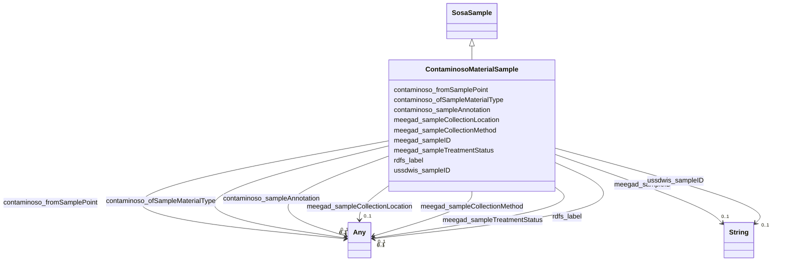

# Class: TODO -- what's a good name for this class (type)? (contaminoso_MaterialSample)


_TODO -- tell the world what this class (type) describes._


URI: [contaminoso:MaterialSample](http://sawgraph.spatialai.org/v1/contaminoso#MaterialSample)





## Inheritance
* [SosaSample](../classes/SosaSample.md)
    * **ContaminosoMaterialSample**


## Slots

| Name | Cardinality and Range | Description | Inheritance |
| ---  | --- | --- | --- |
| [meegad_sampleCollectionMethod](../slots/meegad_sampleCollectionMethod.md) | 0..1 <br/> [Any](../classes/Any.md)&nbsp;or&nbsp;<br />[ContaminosoSampleAnnotation](../classes/ContaminosoSampleAnnotation.md)&nbsp;or&nbsp;<br />[xsd:anyURI](http://www.w3.org/2001/XMLSchema#anyURI) | TODO -- tell the world what this slot (predicate) describes | direct |
| [contaminoso_ofSampleMaterialType](../slots/contaminoso_ofSampleMaterialType.md) | 0..1 <br/> [Any](../classes/Any.md)&nbsp;or&nbsp;<br />[ContaminosoMaterialType](../classes/ContaminosoMaterialType.md)&nbsp;or&nbsp;<br />[xsd:anyURI](http://www.w3.org/2001/XMLSchema#anyURI) | TODO -- tell the world what this slot (predicate) describes | direct |
| [meegad_sampleID](../slots/meegad_sampleID.md) | 0..1 <br/> [xsd:string](http://www.w3.org/2001/XMLSchema#string) | Sample identifier in the EGAD dataset from the state of Maine | direct |
| [contaminoso_sampleAnnotation](../slots/contaminoso_sampleAnnotation.md) | 0..1 <br/> [Any](../classes/Any.md)&nbsp;or&nbsp;<br />[ContaminosoSampleAnnotation](../classes/ContaminosoSampleAnnotation.md)&nbsp;or&nbsp;<br />[xsd:anyURI](http://www.w3.org/2001/XMLSchema#anyURI) | TODO -- tell the world what this slot (predicate) describes | direct |
| [meegad_sampleTreatmentStatus](../slots/meegad_sampleTreatmentStatus.md) | 0..1 <br/> [Any](../classes/Any.md)&nbsp;or&nbsp;<br />[ContaminosoSampleAnnotation](../classes/ContaminosoSampleAnnotation.md)&nbsp;or&nbsp;<br />[xsd:anyURI](http://www.w3.org/2001/XMLSchema#anyURI) | TODO -- tell the world what this slot (predicate) describes | direct |
| [ussdwis_sampleID](../slots/ussdwis_sampleID.md) | 0..1 <br/> [xsd:string](http://www.w3.org/2001/XMLSchema#string) | TODO -- tell the world what this slot (predicate) describes | direct |
| [contaminoso_fromSamplePoint](../slots/contaminoso_fromSamplePoint.md) | 0..1 <br/> [Any](../classes/Any.md)&nbsp;or&nbsp;<br />[ContaminosoPoint](../classes/ContaminosoPoint.md)&nbsp;or&nbsp;<br />[xsd:anyURI](http://www.w3.org/2001/XMLSchema#anyURI) | TODO -- tell the world what this slot (predicate) describes | direct |
| [meegad_sampleCollectionLocation](../slots/meegad_sampleCollectionLocation.md) | 0..1 <br/> [Any](../classes/Any.md)&nbsp;or&nbsp;<br />[ContaminosoSampleAnnotation](../classes/ContaminosoSampleAnnotation.md)&nbsp;or&nbsp;<br />[xsd:anyURI](http://www.w3.org/2001/XMLSchema#anyURI) | TODO -- tell the world what this slot (predicate) describes | direct |
| [rdfs_label](../slots/rdfs_label.md) | 0..1 <br/> [Any](../classes/Any.md)&nbsp;or&nbsp;<br />[xsd:string](http://www.w3.org/2001/XMLSchema#string)&nbsp;or&nbsp;<br />[xsd:anyURI](http://www.w3.org/2001/XMLSchema#anyURI) | TODO -- tell the world what this slot (predicate) describes | direct |


## Usages

| used by | used in | type | used |
| ---  | --- | --- | --- |
| [ContaminosoContaminantObservation](../classes/ContaminosoContaminantObservation.md) | [meegad_analyzedSample](../slots/meegad_analyzedSample.md) | range | [ContaminosoMaterialSample](../classes/ContaminosoMaterialSample.md) |
| [ContaminosoContaminantObservation](../classes/ContaminosoContaminantObservation.md) | [contaminoso_analyzedSample](../slots/contaminoso_analyzedSample.md) | any_of[range] | [ContaminosoMaterialSample](../classes/ContaminosoMaterialSample.md) |
| [ContaminosoMaterialSample](../classes/ContaminosoMaterialSample.md) | [contaminoso_ofSampleMaterialType](../slots/contaminoso_ofSampleMaterialType.md) | domain | [ContaminosoMaterialSample](../classes/ContaminosoMaterialSample.md) |


## TODOs

* TODO -- Todos for this class go here
* or you can delete the todos
* if you think the class is perfect.

## Identifier and Mapping Information


### Schema Source


* from schema: sawgraph-kg


## Mappings

| Mapping Type | Mapped Value |
| ---  | ---  |
| self | contaminoso:MaterialSample |
| native | sawgraph-kg/:ContaminosoMaterialSample |


## LinkML Source

<!-- TODO: investigate https://stackoverflow.com/questions/37606292/how-to-create-tabbed-code-blocks-in-mkdocs-or-sphinx -->

### Direct

<details>
```yaml
name: contaminoso_MaterialSample
description: TODO -- tell the world what this class (type) describes.
title: TODO -- what's a good name for this class (type)?
todos:
- TODO -- Todos for this class go here
- or you can delete the todos
- if you think the class is perfect.
notes:
- Class with 23180 occurences.
from_schema: sawgraph-kg
is_a: sosa_Sample
slots:
- meegad_sampleCollectionMethod
- contaminoso_ofSampleMaterialType
- meegad_sampleID
- contaminoso_sampleAnnotation
- meegad_sampleTreatmentStatus
- ussdwis_sampleID
- contaminoso_fromSamplePoint
- meegad_sampleCollectionLocation
- rdfs_label
class_uri: contaminoso:MaterialSample

```
</details>

### Induced

<details>
```yaml
name: contaminoso_MaterialSample
description: TODO -- tell the world what this class (type) describes.
title: TODO -- what's a good name for this class (type)?
todos:
- TODO -- Todos for this class go here
- or you can delete the todos
- if you think the class is perfect.
notes:
- Class with 23180 occurences.
from_schema: sawgraph-kg
is_a: sosa_Sample
attributes:
  meegad_sampleCollectionMethod:
    name: meegad_sampleCollectionMethod
    description: TODO -- tell the world what this slot (predicate) describes.
    title: TODO -- tell the world what this slot (predicate) describes.
    todos:
    - TODO -- Todos for this slot go here
    - or you can delete the todos
    - if you think the class is perfect.
    comments:
    - 22824 occurrences with subject type contaminoso_MaterialSample and object type
      contaminoso_SampleAnnotation.
    - 216 occurrences with subject type contaminoso_MaterialSample and object type
      uri.
    examples:
    - value: http://sawgraph.spatialai.org/v1/me-egad-data#sample.WG17641464.AAWH.20230328
        meegad:sampleCollectionMethod meegad:samplingMethod.GS
    - value: http://sawgraph.spatialai.org/v1/me-egad-data#sample.21K040706.CAL.20211104
        meegad:sampleCollectionMethod meegad:samplingMethod.NA
    from_schema: sawgraph-kg
    rank: 1000
    slot_uri: meegad:sampleCollectionMethod
    alias: meegad_sampleCollectionMethod
    owner: contaminoso_MaterialSample
    domain_of:
    - contaminoso_MaterialSample
    subproperty_of: contaminoso_sampleAnnotation
    range: Any
    any_of:
    - range: contaminoso_SampleAnnotation
    - range: uri
  contaminoso_ofSampleMaterialType:
    name: contaminoso_ofSampleMaterialType
    description: TODO -- tell the world what this slot (predicate) describes.
    title: TODO -- tell the world what this slot (predicate) describes.
    todos:
    - TODO -- Todos for this slot go here
    - or you can delete the todos
    - if you think the class is perfect.
    comments:
    - 23025 occurrences with subject type contaminoso_MaterialSample and object type
      contaminoso_MaterialType.
    examples:
    - value: http://sawgraph.spatialai.org/v1/me-egad-data#sample.WG17641464.AAWH.20230328
        contaminoso:ofSampleMaterialType meegad:sampleMaterialType.GW
    from_schema: sawgraph-kg
    rank: 1000
    domain: contaminoso_MaterialSample
    slot_uri: contaminoso:ofSampleMaterialType
    alias: contaminoso_ofSampleMaterialType
    owner: contaminoso_MaterialSample
    domain_of:
    - contaminoso_MaterialSample
    range: Any
    any_of:
    - range: contaminoso_MaterialType
    - range: uri
  meegad_sampleID:
    name: meegad_sampleID
    description: Sample identifier in the EGAD dataset from the state of Maine.
    title: TODO -- tell the world what this slot (predicate) describes.
    todos:
    - TODO -- Todos for this slot go here
    - or you can delete the todos
    - if you think the class is perfect.
    comments:
    - 23031 occurrences with subject type contaminoso_MaterialSample and object type
      string.
    examples:
    - value: http://sawgraph.spatialai.org/v1/me-egad-data#sample.1028303.ELL.20190405
        meegad:sampleID 722
    from_schema: sawgraph-kg
    rank: 1000
    slot_uri: meegad:sampleID
    alias: meegad_sampleID
    owner: contaminoso_MaterialSample
    domain_of:
    - contaminoso_MaterialSample
    range: string
  contaminoso_sampleAnnotation:
    name: contaminoso_sampleAnnotation
    description: TODO -- tell the world what this slot (predicate) describes.
    title: TODO -- tell the world what this slot (predicate) describes.
    todos:
    - TODO -- Todos for this slot go here
    - or you can delete the todos
    - if you think the class is perfect.
    comments:
    - 55252 occurrences with subject type contaminoso_MaterialSample and object type
      contaminoso_SampleAnnotation.
    - 9263 occurrences with subject type contaminoso_MaterialSample and object type
      uri.
    examples:
    - value: http://sawgraph.spatialai.org/v1/me-egad-data#sample.WG17641464.AAWH.20230328
        contaminoso:sampleAnnotation meegad:treatmentStatus.N
    - value: http://sawgraph.spatialai.org/v1/me-egad-data#sample.1028303.ELL.20190405
        contaminoso:sampleAnnotation meegad:sampleLocation.NA
    from_schema: sawgraph-kg
    rank: 1000
    slot_uri: contaminoso:sampleAnnotation
    alias: contaminoso_sampleAnnotation
    owner: contaminoso_MaterialSample
    domain_of:
    - contaminoso_MaterialSample
    range: Any
    any_of:
    - range: contaminoso_SampleAnnotation
    - range: uri
  meegad_sampleTreatmentStatus:
    name: meegad_sampleTreatmentStatus
    description: TODO -- tell the world what this slot (predicate) describes.
    title: TODO -- tell the world what this slot (predicate) describes.
    todos:
    - TODO -- Todos for this slot go here
    - or you can delete the todos
    - if you think the class is perfect.
    comments:
    - 1693 occurrences with subject type contaminoso_MaterialSample and object type
      uri.
    - 16736 occurrences with subject type contaminoso_MaterialSample and object type
      contaminoso_SampleAnnotation.
    examples:
    - value: http://sawgraph.spatialai.org/v1/me-egad-data#sample.1028303.ELL.20190405
        meegad:sampleTreatmentStatus meegad:treatmentStatus.NA
    - value: http://sawgraph.spatialai.org/v1/me-egad-data#sample.WG17641464.AAWH.20230328
        meegad:sampleTreatmentStatus meegad:treatmentStatus.N
    from_schema: sawgraph-kg
    rank: 1000
    slot_uri: meegad:sampleTreatmentStatus
    alias: meegad_sampleTreatmentStatus
    owner: contaminoso_MaterialSample
    domain_of:
    - contaminoso_MaterialSample
    subproperty_of: contaminoso_sampleAnnotation
    range: Any
    any_of:
    - range: contaminoso_SampleAnnotation
    - range: uri
  ussdwis_sampleID:
    name: ussdwis_sampleID
    description: TODO -- tell the world what this slot (predicate) describes.
    title: TODO -- tell the world what this slot (predicate) describes.
    todos:
    - TODO -- Todos for this slot go here
    - or you can delete the todos
    - if you think the class is perfect.
    comments:
    - 156 occurrences with subject type contaminoso_MaterialSample and object type
      string.
    examples:
    - value: http://sawgraph.spatialai.org/v1/us-sdwis-data#d.PWS-Sample.ME0000002.06132022
        ussdwis:sampleID 06132022
    from_schema: sawgraph-kg
    rank: 1000
    slot_uri: ussdwis:sampleID
    alias: ussdwis_sampleID
    owner: contaminoso_MaterialSample
    domain_of:
    - contaminoso_MaterialSample
    range: string
  contaminoso_fromSamplePoint:
    name: contaminoso_fromSamplePoint
    description: TODO -- tell the world what this slot (predicate) describes.
    title: TODO -- tell the world what this slot (predicate) describes.
    todos:
    - TODO -- Todos for this slot go here
    - or you can delete the todos
    - if you think the class is perfect.
    comments:
    - 18128 occurrences with subject type contaminoso_MaterialSample and object type
      contaminoso_Point.
    examples:
    - value: http://sawgraph.spatialai.org/v1/us-sdwis-data#d.PWS-Sample.ME0400899.10282021
        contaminoso:fromSamplePoint http://sawgraph.spatialai.org/v1/us-sdwis-data#d.PWS-SamplePoint.ME0400899.10282021
    from_schema: sawgraph-kg
    rank: 1000
    slot_uri: contaminoso:fromSamplePoint
    alias: contaminoso_fromSamplePoint
    owner: contaminoso_MaterialSample
    domain_of:
    - contaminoso_MaterialSample
    range: Any
    any_of:
    - range: contaminoso_Point
    - range: uri
  meegad_sampleCollectionLocation:
    name: meegad_sampleCollectionLocation
    description: TODO -- tell the world what this slot (predicate) describes.
    title: TODO -- tell the world what this slot (predicate) describes.
    todos:
    - TODO -- Todos for this slot go here
    - or you can delete the todos
    - if you think the class is perfect.
    comments:
    - 7354 occurrences with subject type contaminoso_MaterialSample and object type
      uri.
    - 15692 occurrences with subject type contaminoso_MaterialSample and object type
      contaminoso_SampleAnnotation.
    examples:
    - value: http://sawgraph.spatialai.org/v1/me-egad-data#sample.1028303.ELL.20190405
        meegad:sampleCollectionLocation meegad:sampleLocation.NA
    - value: http://sawgraph.spatialai.org/v1/me-egad-data#sample.WG17641464.AAWH.20230328
        meegad:sampleCollectionLocation meegad:sampleLocation.BE
    from_schema: sawgraph-kg
    rank: 1000
    slot_uri: meegad:sampleCollectionLocation
    alias: meegad_sampleCollectionLocation
    owner: contaminoso_MaterialSample
    domain_of:
    - contaminoso_MaterialSample
    subproperty_of: contaminoso_sampleAnnotation
    range: Any
    any_of:
    - range: contaminoso_SampleAnnotation
    - range: uri
  rdfs_label:
    name: rdfs_label
    description: TODO -- tell the world what this slot (predicate) describes.
    title: TODO -- tell the world what this slot (predicate) describes.
    todos:
    - TODO -- Todos for this slot go here
    - or you can delete the todos
    - if you think the class is perfect.
    comments:
    - 66 occurrences with subject type contaminoso_ResultQualifier and object type
      string.
    - 33 occurrences with subject type ilisgs_WellPurpose and object type string.
    - 109 occurrences with subject type meegad_EGAD-SamplePointType and object type
      string.
    - 94 occurrences with subject type contaminoso_Substance and object type string.
    - 12 occurrences with subject type contaminoso_ObservationAnnotation and object
      type string.
    - 160 occurrences with subject type contaminoso_SampleAnnotation and object type
      string.
    - 97 occurrences with subject type contaminoso_MaterialType and object type string.
    - 1249 occurrences with subject type meegad_EGAD-AnalysisMethod and object type
      string.
    - 3 occurrences with subject type http___qudt.org_vocab_unitUnit and object type
      string.
    - 300 occurrences with subject type prov_Organization and object type string.
    - 115887 occurrences with subject type contaminoso_ContaminantMeasurement and
      object type string.
    - 26294 occurrences with subject type contaminoso_AggregateContaminantMeasurement
      and object type string.
    - 23031 occurrences with subject type contaminoso_MaterialSample and object type
      string.
    - 8324 occurrences with subject type contaminoso_Point and object type string.
    - 171069 occurrences with subject type contaminoso_Feature and object type string.
    - 957 occurrences with subject type meegad_EGAD-Site and object type string.
    - 62 occurrences with subject type meegad_EGAD-SiteType and object type string.
    - 142181 occurrences with subject type contaminoso_ContaminantObservation and
      object type string.
    examples:
    - value: http://sawgraph.spatialai.org/me-egad#concentrationQualifier.* rdfs:label
        QC RESULTS NOT WITHIN CONTROL LIMITS
    - value: http://sawgraph.spatialai.org/v1/il-isgs-data#d.ISGS-WellPurpose.CROP
        rdfs:label Outcrop
    - value: meegad:featureType.AST rdfs:label ABOVEGROUND STORAGE TANK
    - value: meegad:parameter.10-2_FTS_A rdfs:label 10:2 FLUOROTELOMER SULFONIC ACID
    - value: meegad:resultType.TRG rdfs:label TARGET/REGULAR RESULT
    - value: meegad:sampleLocation.AF rdfs:label AFTER FILTERS
    - value: meegad:sampleMaterialType.AS rdfs:label ASH (BOTTOM & FLY)
    - value: meegad:testMethod.CALCULATED rdfs:label CALCULATED
    - value: meegad:unit.MG-KG rdfs:label MILLIGRAMS PER KILOGRAM
    - value: http://sawgraph.spatialai.org/v1/me-egad-data#organization.lab.AA rdfs:label
        ALPHA ANALYTICAL LAB - WESTBOROUGH, MA
    - value: http://sawgraph.spatialai.org/v1/me-egad-data#result.1028303.ELL.20190405.45298906
        rdfs:label EGAD PFAS measurements for sample 722
    - value: http://sawgraph.spatialai.org/v1/me-egad-data#result.1028303.ELL.20190405.DEP18010
        rdfs:label EGAD PFAS measurements for sample 722
    - value: http://sawgraph.spatialai.org/v1/me-egad-data#sample.1028303.ELL.20190405
        rdfs:label EGAD sample 722
    - value: http://sawgraph.spatialai.org/v1/me-egad-data#samplePoint.100410 rdfs:label
        EGAD sample point 100410
    - value: http://sawgraph.spatialai.org/v1/me-egad-data#sampledFeature.100410 rdfs:label
        EGAD sampled festure associated with sample point 100410
    - value: http://sawgraph.spatialai.org/v1/me-egad-data#site.100843 rdfs:label
        EGAD site 100843
    - value: meegad:siteType.AGRICCHEM rdfs:label AGRICULTURAL CHEMICAL USE
    - value: http://sawgraph.spatialai.org/v1/me-egad-data#observation.1028303.ELL.20190405.45298906
        rdfs:label EGAD PFAS observation for sample 722
    from_schema: sawgraph-kg
    rank: 1000
    slot_uri: rdfs:label
    alias: rdfs_label
    owner: contaminoso_MaterialSample
    domain_of:
    - contaminoso_AggregateContaminantMeasurement
    - contaminoso_ContaminantMeasurement
    - contaminoso_ContaminantObservation
    - contaminoso_Feature
    - contaminoso_MaterialSample
    - contaminoso_MaterialType
    - contaminoso_ObservationAnnotation
    - contaminoso_Point
    - contaminoso_ResultQualifier
    - contaminoso_SampleAnnotation
    - contaminoso_Substance
    - http___qudt.org_vocab_unitUnit
    - ilisgs_WellPurpose
    - meegad_EGAD-AnalysisMethod
    - meegad_EGAD-SamplePointType
    - meegad_EGAD-Site
    - meegad_EGAD-SiteType
    - prov_Organization
    range: Any
    any_of:
    - range: string
    - range: uri
class_uri: contaminoso:MaterialSample

```
</details>