# Class: TODO -- what's a good name for this class (type)? (contaminoso_Point)


_No type description provided_


URI: [contaminoso:Point](http://sawgraph.spatialai.org/v1/contaminoso#Point)

```mermaid
 classDiagram
    class ContaminosoPoint
    click ContaminosoPoint href "../ContaminosoPoint"
      GeoSpatialObject <|-- ContaminosoPoint
        click GeoSpatialObject href "../GeoSpatialObject"
      
      ContaminosoPoint : contaminoso_pointFromFeature
        
          
    
    
    ContaminosoPoint --> "0..1" ContaminosoFeature : contaminoso_pointFromFeature
    click ContaminosoFeature href "../ContaminosoFeature"

        
      ContaminosoPoint : geo_hasDefaultGeometry
        
          
    
    
    ContaminosoPoint --> "0..1" GeoGeometry : geo_hasDefaultGeometry
    click GeoGeometry href "../GeoGeometry"

        
      ContaminosoPoint : geo_hasGeometry
        
          
    
    
    ContaminosoPoint --> "0..1" Any : geo_hasGeometry
    click Any href "../Any"

        
      ContaminosoPoint : geo_hasSerialization
        
          
    
    
    ContaminosoPoint --> "0..1" GeoWktLiteral : geo_hasSerialization
    click GeoWktLiteral href "../GeoWktLiteral"

        
      ContaminosoPoint : http___stko_kwg.geog.ucsb.edu_lod_ontology_sfWithin
        
          
    
    
    ContaminosoPoint --> "0..1" Any : http___stko_kwg.geog.ucsb.edu_lod_ontology_sfWithin
    click Any href "../Any"

        
      ContaminosoPoint : http___stko_kwg.geog.ucsb.edu_lod_ontology_spatialRelation
        
          
    
    
    ContaminosoPoint --> "0..1" Any : http___stko_kwg.geog.ucsb.edu_lod_ontology_spatialRelation
    click Any href "../Any"

        
      ContaminosoPoint : meegad_associatedSite
        
          
    
    
    ContaminosoPoint --> "0..1" MeegadEGAD-Site : meegad_associatedSite
    click MeegadEGAD-Site href "../MeegadEGAD-Site"

        
      ContaminosoPoint : meegad_samplePointNumber
        
          
    
    
    ContaminosoPoint --> "0..1" Integer : meegad_samplePointNumber
    click Integer href "../Integer"

        
      ContaminosoPoint : meegad_samplePointType
        
          
    
    
    ContaminosoPoint --> "0..1" MeegadEGAD-SamplePointType : meegad_samplePointType
    click MeegadEGAD-SamplePointType href "../MeegadEGAD-SamplePointType"

        
      ContaminosoPoint : meegad_samplePointWebName
        
          
    
    
    ContaminosoPoint --> "0..1" String : meegad_samplePointWebName
    click String href "../String"

        
      ContaminosoPoint : rdfs_label
        
          
    
    
    ContaminosoPoint --> "0..1" Any : rdfs_label
    click Any href "../Any"

        
      ContaminosoPoint : ussdwis_SamplePointID
        
          
    
    
    ContaminosoPoint --> "0..1" String : ussdwis_SamplePointID
    click String href "../String"

        
      
```





## Inheritance
* [GeoSpatialObject](../classes/GeoSpatialObject.md)
    * **ContaminosoPoint**


## Slots

| Name | Cardinality and Range | Description | Inheritance |
| ---  | --- | --- | --- |
| [ussdwis_SamplePointID](../slots/ussdwis_SamplePointID.md) | 0..1 <br/> [xsd:string](http://www.w3.org/2001/XMLSchema#string) | No slot description provided | direct |
| [meegad_samplePointNumber](../slots/meegad_samplePointNumber.md) | 0..1 <br/> [xsd:integer](http://www.w3.org/2001/XMLSchema#integer) | Sample point number in the EGAD dataset from the state of Maine | direct |
| [meegad_samplePointType](../slots/meegad_samplePointType.md) | 0..1 <br/> [MeegadEGAD-SamplePointType](../classes/MeegadEGAD-SamplePointType.md) | No slot description provided | direct |
| [meegad_associatedSite](../slots/meegad_associatedSite.md) | 0..1 <br/> [MeegadEGAD-Site](../classes/MeegadEGAD-Site.md) | No slot description provided | direct |
| [http___stko_kwg.geog.ucsb.edu_lod_ontology_spatialRelation](../slots/http___stko_kwg.geog.ucsb.edu_lod_ontology_spatialRelation.md) | 0..1 <br/> [ContaminosoFeature](../classes/ContaminosoFeature.md)&nbsp;or&nbsp;<br />[HttpStko-kwg.geog.ucsb.eduLodOntologyS2CellLevel13](../classes/HttpStko-kwg.geog.ucsb.eduLodOntologyS2CellLevel13.md)&nbsp;or&nbsp;<br />[MeegadEGAD-Site](../classes/MeegadEGAD-Site.md)&nbsp;or&nbsp;<br />[ContaminosoPoint](../classes/ContaminosoPoint.md)&nbsp;or&nbsp;<br />[xsd:anyURI](http://www.w3.org/2001/XMLSchema#anyURI) | No slot description provided | direct |
| [meegad_samplePointWebName](../slots/meegad_samplePointWebName.md) | 0..1 <br/> [xsd:string](http://www.w3.org/2001/XMLSchema#string) | Sample point web name in the EGAD dataset from the state of Maine | direct |
| [contaminoso_pointFromFeature](../slots/contaminoso_pointFromFeature.md) | 0..1 <br/> [ContaminosoFeature](../classes/ContaminosoFeature.md) | No slot description provided | direct |
| [geo_hasGeometry](../slots/geo_hasGeometry.md) | 0..1 <br/> [GeoSpatialObject](../classes/GeoSpatialObject.md)&nbsp;or&nbsp;<br />[GeoGeometry](../classes/GeoGeometry.md)&nbsp;or&nbsp;<br />[xsd:anyURI](http://www.w3.org/2001/XMLSchema#anyURI) | No slot description provided | direct |
| [http___stko_kwg.geog.ucsb.edu_lod_ontology_sfWithin](../slots/http___stko_kwg.geog.ucsb.edu_lod_ontology_sfWithin.md) | 0..1 <br/> [xsd:anyURI](http://www.w3.org/2001/XMLSchema#anyURI)&nbsp;or&nbsp;<br />[HttpStko-kwg.geog.ucsb.eduLodOntologyS2CellLevel13](../classes/HttpStko-kwg.geog.ucsb.eduLodOntologyS2CellLevel13.md) | No slot description provided | direct |
| [rdfs_label](../slots/rdfs_label.md) | 0..1 <br/> [xsd:string](http://www.w3.org/2001/XMLSchema#string)&nbsp;or&nbsp;<br />[xsd:anyURI](http://www.w3.org/2001/XMLSchema#anyURI) | No slot description provided | direct |
| [geo_hasDefaultGeometry](../slots/geo_hasDefaultGeometry.md) | 0..1 <br/> [GeoGeometry](../classes/GeoGeometry.md) | No slot description provided | direct |
| [geo_hasSerialization](../slots/geo_hasSerialization.md) | 0..1 <br/> [GeoWktLiteral](../classes/GeoWktLiteral.md) | No slot description provided | [GeoSpatialObject](../classes/GeoSpatialObject.md) |


## Usages

| used by | used in | type | used |
| ---  | --- | --- | --- |
| [ContaminosoContaminantObservation](../classes/ContaminosoContaminantObservation.md) | [contaminoso_observedAtSamplePoint](../slots/contaminoso_observedAtSamplePoint.md) | range | [ContaminosoPoint](../classes/ContaminosoPoint.md) |
| [ContaminosoFeature](../classes/ContaminosoFeature.md) | [http___stko_kwg.geog.ucsb.edu_lod_ontology_spatialRelation](../slots/http___stko_kwg.geog.ucsb.edu_lod_ontology_spatialRelation.md) | any_of[range] | [ContaminosoPoint](../classes/ContaminosoPoint.md) |
| [ContaminosoMaterialSample](../classes/ContaminosoMaterialSample.md) | [contaminoso_fromSamplePoint](../slots/contaminoso_fromSamplePoint.md) | any_of[range] | [ContaminosoPoint](../classes/ContaminosoPoint.md) |
| [ContaminosoPoint](../classes/ContaminosoPoint.md) | [http___stko_kwg.geog.ucsb.edu_lod_ontology_spatialRelation](../slots/http___stko_kwg.geog.ucsb.edu_lod_ontology_spatialRelation.md) | any_of[range] | [ContaminosoPoint](../classes/ContaminosoPoint.md) |
| [HttpStko-kwg.geog.ucsb.eduLodOntologyS2CellLevel13](../classes/HttpStko-kwg.geog.ucsb.eduLodOntologyS2CellLevel13.md) | [http___stko_kwg.geog.ucsb.edu_lod_ontology_spatialRelation](../slots/http___stko_kwg.geog.ucsb.edu_lod_ontology_spatialRelation.md) | any_of[range] | [ContaminosoPoint](../classes/ContaminosoPoint.md) |
| [HttpStko-kwg.geog.ucsb.eduLodOntologyS2CellLevel13](../classes/HttpStko-kwg.geog.ucsb.eduLodOntologyS2CellLevel13.md) | [http___stko_kwg.geog.ucsb.edu_lod_ontology_sfContains](../slots/http___stko_kwg.geog.ucsb.edu_lod_ontology_sfContains.md) | any_of[range] | [ContaminosoPoint](../classes/ContaminosoPoint.md) |
| [MeegadEGAD-Site](../classes/MeegadEGAD-Site.md) | [http___stko_kwg.geog.ucsb.edu_lod_ontology_spatialRelation](../slots/http___stko_kwg.geog.ucsb.edu_lod_ontology_spatialRelation.md) | any_of[range] | [ContaminosoPoint](../classes/ContaminosoPoint.md) |


## TODOs

* TODO -- Todos for this class go here
* or you can delete the todos
* if you think the class is perfect.

## Identifier and Mapping Information


### Schema Source


* from schema: sawgraph-kg


## Mappings

| Mapping Type | Mapped Value |
| ---  | ---  |
| self | contaminoso:Point |
| native | sawgraph-kg/:ContaminosoPoint |


## LinkML Source

<!-- TODO: investigate https://stackoverflow.com/questions/37606292/how-to-create-tabbed-code-blocks-in-mkdocs-or-sphinx -->

### Direct

<details>
```yaml
name: contaminoso_Point
description: No type description provided
title: TODO -- what's a good name for this class (type)?
todos:
- TODO -- Todos for this class go here
- or you can delete the todos
- if you think the class is perfect.
notes:
- Class with 8480 occurences.
from_schema: sawgraph-kg
rank: 1000
is_a: geo_SpatialObject
slots:
- ussdwis_SamplePointID
- meegad_samplePointNumber
- meegad_samplePointType
- meegad_associatedSite
- http___stko-kwg.geog.ucsb.edu_lod_ontology_spatialRelation
- meegad_samplePointWebName
- contaminoso_pointFromFeature
- geo_hasGeometry
- http___stko-kwg.geog.ucsb.edu_lod_ontology_sfWithin
- rdfs_label
- geo_hasDefaultGeometry
class_uri: contaminoso:Point

```
</details>

### Induced

<details>
```yaml
name: contaminoso_Point
description: No type description provided
title: TODO -- what's a good name for this class (type)?
todos:
- TODO -- Todos for this class go here
- or you can delete the todos
- if you think the class is perfect.
notes:
- Class with 8480 occurences.
from_schema: sawgraph-kg
rank: 1000
is_a: geo_SpatialObject
attributes:
  ussdwis_SamplePointID:
    name: ussdwis_SamplePointID
    description: No slot description provided
    title: No slot description provided
    todos:
    - TODO -- Todos for this slot go here
    - or you can delete the todos
    - if you think the class is perfect.
    comments:
    - 156 occurrences with subject type contaminoso_Point and object type string.
    examples:
    - value: http://sawgraph.spatialai.org/v1/us-sdwis-data#d.PWS-SamplePoint.ME0000002.06132022
        ussdwis:SamplePointID 06132022
    from_schema: sawgraph-kg
    rank: 1000
    slot_uri: ussdwis:SamplePointID
    alias: ussdwis_SamplePointID
    owner: contaminoso_Point
    domain_of:
    - contaminoso_Point
    range: string
  meegad_samplePointNumber:
    name: meegad_samplePointNumber
    description: Sample point number in the EGAD dataset from the state of Maine.
    title: No slot description provided
    todos:
    - TODO -- Todos for this slot go here
    - or you can delete the todos
    - if you think the class is perfect.
    comments:
    - 8040 occurrences with subject type contaminoso_Point and object type integer.
    examples:
    - value: http://sawgraph.spatialai.org/v1/me-egad-data#samplePoint.100410 meegad:samplePointNumber
        100410
    from_schema: sawgraph-kg
    rank: 1000
    slot_uri: meegad:samplePointNumber
    alias: meegad_samplePointNumber
    owner: contaminoso_Point
    domain_of:
    - contaminoso_Point
    range: integer
  meegad_samplePointType:
    name: meegad_samplePointType
    description: No slot description provided
    title: No slot description provided
    todos:
    - TODO -- Todos for this slot go here
    - or you can delete the todos
    - if you think the class is perfect.
    comments:
    - 8324 occurrences with subject type contaminoso_Point and object type meegad_EGAD-SamplePointType.
    examples:
    - value: http://sawgraph.spatialai.org/v1/me-egad-data#samplePoint.84366 meegad:samplePointType
        meegad:featureType.PUWSW
    from_schema: sawgraph-kg
    rank: 1000
    slot_uri: meegad:samplePointType
    alias: meegad_samplePointType
    owner: contaminoso_Point
    domain_of:
    - contaminoso_Point
    range: meegad_EGAD-SamplePointType
  meegad_associatedSite:
    name: meegad_associatedSite
    description: No slot description provided
    title: No slot description provided
    todos:
    - TODO -- Todos for this slot go here
    - or you can delete the todos
    - if you think the class is perfect.
    comments:
    - 8405 occurrences with subject type contaminoso_Point and object type meegad_EGAD-Site.
    examples:
    - value: http://sawgraph.spatialai.org/v1/me-egad-data#samplePoint.84366 meegad:associatedSite
        http://sawgraph.spatialai.org/v1/me-egad-data#site.84803
    from_schema: sawgraph-kg
    rank: 1000
    slot_uri: meegad:associatedSite
    alias: meegad_associatedSite
    owner: contaminoso_Point
    domain_of:
    - contaminoso_Point
    range: meegad_EGAD-Site
  http___stko-kwg.geog.ucsb.edu_lod_ontology_spatialRelation:
    name: http___stko-kwg.geog.ucsb.edu_lod_ontology_spatialRelation
    description: No slot description provided
    title: No slot description provided
    todos:
    - TODO -- Todos for this slot go here
    - or you can delete the todos
    - if you think the class is perfect.
    comments:
    - 4502 occurrences with subject type contaminoso_Point and object type http___stko-kwg.geog.ucsb.edu_lod_ontology_S2Cell_Level13.
    - 4509 occurrences with subject type contaminoso_Point and object type uri.
    - 883 occurrences with subject type meegad_EGAD-Site and object type http___stko-kwg.geog.ucsb.edu_lod_ontology_S2Cell_Level13.
    - 883 occurrences with subject type meegad_EGAD-Site and object type uri.
    - 166097 occurrences with subject type contaminoso_Feature and object type uri.
    - 83049 occurrences with subject type contaminoso_Feature and object type http___stko-kwg.geog.ucsb.edu_lod_ontology_S2Cell_Level13.
    - 166097 occurrences with untyped subjects and object type http://sawgraph.spatialai.org/v1/contaminoso#Feature.
    - 83049 occurrences with subject type http___stko-kwg.geog.ucsb.edu_lod_ontology_S2Cell_Level13
      and object type contaminoso_Feature.
    - 4502 occurrences with subject type http___stko-kwg.geog.ucsb.edu_lod_ontology_S2Cell_Level13
      and object type contaminoso_Point.
    - 883 occurrences with subject type http___stko-kwg.geog.ucsb.edu_lod_ontology_S2Cell_Level13
      and object type meegad_EGAD-Site.
    - 4509 occurrences with untyped subjects and object type http://sawgraph.spatialai.org/v1/contaminoso#Point.
    - 883 occurrences with untyped subjects and object type http://sawgraph.spatialai.org/v1/me-egad#EGAD-Site.
    examples:
    - value: http://sawgraph.spatialai.org/v1/me-egad-data#samplePoint.99544 http://stko-kwg.geog.ucsb.edu/lod/ontology/spatialRelation
        http://stko-kwg.geog.ucsb.edu/lod/resource/s2.level13.5525962011738898432
    - value: http://sawgraph.spatialai.org/v1/me-egad-data#samplePoint.100410 http://stko-kwg.geog.ucsb.edu/lod/ontology/spatialRelation
        https://datacommons.org/browser/geoId/2302778255
    - value: http://sawgraph.spatialai.org/v1/me-egad-data#site.99425 http://stko-kwg.geog.ucsb.edu/lod/ontology/spatialRelation
        http://stko-kwg.geog.ucsb.edu/lod/resource/s2.level13.5526457204288258048
    - value: http://sawgraph.spatialai.org/v1/me-egad-data#site.100843 http://stko-kwg.geog.ucsb.edu/lod/ontology/spatialRelation
        https://datacommons.org/browser/geoId/2301902795
    - value: http://sawgraph.spatialai.org/v1/me-mgs-data#d.MGS-Well.1 http://stko-kwg.geog.ucsb.edu/lod/ontology/spatialRelation
        http://stko-kwg.geog.ucsb.edu/lod/resource/s2.level13.12758972776866381824
    - value: http://sawgraph.spatialai.org/v1/me-mgs-data#d.MGS-Well.99999 http://stko-kwg.geog.ucsb.edu/lod/ontology/spatialRelation
        http://stko-kwg.geog.ucsb.edu/lod/resource/s2.level13.5526564922068041728
    - value: https://datacommons.org/browser/geoId/2303187985 http://stko-kwg.geog.ucsb.edu/lod/ontology/spatialRelation
        http://sawgraph.spatialai.org/v1/me-mgs-data#d.MGS-Well.99481
    - value: http://stko-kwg.geog.ucsb.edu/lod/resource/s2.level13.9935713923632201728
        http://stko-kwg.geog.ucsb.edu/lod/ontology/spatialRelation http://sawgraph.spatialai.org/v1/me-mgs-data#d.MGS-Well.109845
    - value: http://stko-kwg.geog.ucsb.edu/lod/resource/s2.level13.9935713992351678464
        http://stko-kwg.geog.ucsb.edu/lod/ontology/spatialRelation http://sawgraph.spatialai.org/v1/me-egad-data#samplePoint.140133
    - value: http://stko-kwg.geog.ucsb.edu/lod/resource/s2.level13.9935713923632201728
        http://stko-kwg.geog.ucsb.edu/lod/ontology/spatialRelation http://sawgraph.spatialai.org/v1/me-egad-data#site.79458
    - value: https://datacommons.org/browser/geoId/2303187985 http://stko-kwg.geog.ucsb.edu/lod/ontology/spatialRelation
        http://sawgraph.spatialai.org/v1/me-egad-data#samplePoint.150408
    - value: https://datacommons.org/browser/geoId/2303187985 http://stko-kwg.geog.ucsb.edu/lod/ontology/spatialRelation
        http://sawgraph.spatialai.org/v1/me-egad-data#site.47474
    from_schema: sawgraph-kg
    rank: 1000
    slot_uri: http://stko-kwg.geog.ucsb.edu/lod/ontology/spatialRelation
    alias: http___stko_kwg.geog.ucsb.edu_lod_ontology_spatialRelation
    owner: contaminoso_Point
    domain_of:
    - contaminoso_Feature
    - contaminoso_Point
    - http___stko-kwg.geog.ucsb.edu_lod_ontology_S2Cell_Level13
    - meegad_EGAD-Site
    range: Any
    any_of:
    - range: contaminoso_Feature
    - range: http___stko-kwg.geog.ucsb.edu_lod_ontology_S2Cell_Level13
    - range: meegad_EGAD-Site
    - range: contaminoso_Point
    - range: uri
  meegad_samplePointWebName:
    name: meegad_samplePointWebName
    description: Sample point web name in the EGAD dataset from the state of Maine.
    title: No slot description provided
    todos:
    - TODO -- Todos for this slot go here
    - or you can delete the todos
    - if you think the class is perfect.
    comments:
    - 8040 occurrences with subject type contaminoso_Point and object type string.
    examples:
    - value: http://sawgraph.spatialai.org/v1/me-egad-data#samplePoint.100410 meegad:samplePointWebName
        B-5
    from_schema: sawgraph-kg
    rank: 1000
    slot_uri: meegad:samplePointWebName
    alias: meegad_samplePointWebName
    owner: contaminoso_Point
    domain_of:
    - contaminoso_Point
    range: string
  contaminoso_pointFromFeature:
    name: contaminoso_pointFromFeature
    description: No slot description provided
    title: No slot description provided
    todos:
    - TODO -- Todos for this slot go here
    - or you can delete the todos
    - if you think the class is perfect.
    comments:
    - 8040 occurrences with subject type contaminoso_Point and object type contaminoso_Feature.
    examples:
    - value: http://sawgraph.spatialai.org/v1/me-egad-data#samplePoint.84366 contaminoso:pointFromFeature
        http://sawgraph.spatialai.org/v1/me-egad-data#sampledFeature.84366
    from_schema: sawgraph-kg
    rank: 1000
    slot_uri: contaminoso:pointFromFeature
    alias: contaminoso_pointFromFeature
    owner: contaminoso_Point
    domain_of:
    - contaminoso_Point
    range: contaminoso_Feature
  geo_hasGeometry:
    name: geo_hasGeometry
    description: No slot description provided
    title: No slot description provided
    todos:
    - TODO -- Todos for this slot go here
    - or you can delete the todos
    - if you think the class is perfect.
    comments:
    - 4511 occurrences with subject type contaminoso_Point and object type geo_Geometry.
    - 841 occurrences with subject type meegad_EGAD-Site and object type geo_SpatialObject.
    - 884 occurrences with subject type meegad_EGAD-Site and object type geo_Geometry.
    - 2994 occurrences with subject type contaminoso_Feature and object type geo_Geometry.
    - 80056 occurrences with subject type contaminoso_Feature and object type geo_SpatialObject.
    - 379496 occurrences with subject type contaminoso_Feature and object type uri.
    - 24794 occurrences with untyped subjects and object type http://www.opengis.net/ont/geosparql#SpatialObject.
    examples:
    - value: http://sawgraph.spatialai.org/v1/me-egad-data#samplePoint.99544 geo:hasGeometry
        http://sawgraph.spatialai.org/v1/me-egad-data#samplePoint.geometry.99544
    - value: http://sawgraph.spatialai.org/v1/me-egad-data#site.99425 geo:hasGeometry
        http://sawgraph.spatialai.org/v1/me-egad-data#egad.site.geometry.99425
    - value: http://sawgraph.spatialai.org/v1/me-egad-data#site.99425 geo:hasGeometry
        http://sawgraph.spatialai.org/v1/me-egad-data#site.geometry.99425
    - value: http://sawgraph.spatialai.org/v1/me-mgs-data#d.MGS-Well.105674 geo:hasGeometry
        http://sawgraph.spatialai.org/v1/me-mgs-data#d.MGS-Well-Geometry.105674
    - value: http://sawgraph.spatialai.org/v1/me-mgs-data#d.MGS-Well.99999 geo:hasGeometry
        http://sawgraph.spatialai.org/v1/me-mgs-data#d.MGS-Well-Geometry.99999
    - value: http://sawgraph.spatialai.org/v1/il-isgs-data#d.ISGS-Well.120010000300
        geo:hasGeometry http://sawgraph.spatialai.org/v1/il-isgs-data#d.ISGS-Well.geometry.120010000300
    - value: http://sawgraph.spatialai.org/v1/me-egad-data#site.99901 geo:hasGeometry
        http://sawgraph.spatialai.org/v1/me-egad-data#egad.site.geometry.99901
    from_schema: sawgraph-kg
    rank: 1000
    slot_uri: geo:hasGeometry
    alias: geo_hasGeometry
    owner: contaminoso_Point
    domain_of:
    - contaminoso_Feature
    - contaminoso_Point
    - meegad_EGAD-Site
    range: Any
    any_of:
    - range: geo_SpatialObject
    - range: geo_Geometry
    - range: uri
  http___stko-kwg.geog.ucsb.edu_lod_ontology_sfWithin:
    name: http___stko-kwg.geog.ucsb.edu_lod_ontology_sfWithin
    description: No slot description provided
    title: No slot description provided
    todos:
    - TODO -- Todos for this slot go here
    - or you can delete the todos
    - if you think the class is perfect.
    comments:
    - 4502 occurrences with subject type contaminoso_Point and object type http___stko-kwg.geog.ucsb.edu_lod_ontology_S2Cell_Level13.
    - 4509 occurrences with subject type contaminoso_Point and object type uri.
    - 883 occurrences with subject type meegad_EGAD-Site and object type http___stko-kwg.geog.ucsb.edu_lod_ontology_S2Cell_Level13.
    - 883 occurrences with subject type meegad_EGAD-Site and object type uri.
    - 166097 occurrences with subject type contaminoso_Feature and object type uri.
    - 83049 occurrences with subject type contaminoso_Feature and object type http___stko-kwg.geog.ucsb.edu_lod_ontology_S2Cell_Level13.
    examples:
    - value: http://sawgraph.spatialai.org/v1/me-egad-data#samplePoint.99544 http://stko-kwg.geog.ucsb.edu/lod/ontology/sfWithin
        http://stko-kwg.geog.ucsb.edu/lod/resource/s2.level13.5525962011738898432
    - value: http://sawgraph.spatialai.org/v1/me-egad-data#samplePoint.100410 http://stko-kwg.geog.ucsb.edu/lod/ontology/sfWithin
        https://datacommons.org/browser/geoId/2302778255
    - value: http://sawgraph.spatialai.org/v1/me-egad-data#site.99425 http://stko-kwg.geog.ucsb.edu/lod/ontology/sfWithin
        http://stko-kwg.geog.ucsb.edu/lod/resource/s2.level13.5526457204288258048
    - value: http://sawgraph.spatialai.org/v1/me-egad-data#site.100843 http://stko-kwg.geog.ucsb.edu/lod/ontology/sfWithin
        https://datacommons.org/browser/geoId/2301902795
    - value: http://sawgraph.spatialai.org/v1/me-mgs-data#d.MGS-Well.1 http://stko-kwg.geog.ucsb.edu/lod/ontology/sfWithin
        http://stko-kwg.geog.ucsb.edu/lod/resource/s2.level13.12758972776866381824
    - value: http://sawgraph.spatialai.org/v1/me-mgs-data#d.MGS-Well.99999 http://stko-kwg.geog.ucsb.edu/lod/ontology/sfWithin
        http://stko-kwg.geog.ucsb.edu/lod/resource/s2.level13.5526564922068041728
    from_schema: sawgraph-kg
    rank: 1000
    slot_uri: http://stko-kwg.geog.ucsb.edu/lod/ontology/sfWithin
    alias: http___stko_kwg.geog.ucsb.edu_lod_ontology_sfWithin
    owner: contaminoso_Point
    domain_of:
    - contaminoso_Feature
    - contaminoso_Point
    - meegad_EGAD-Site
    subproperty_of: http___stko-kwg.geog.ucsb.edu_lod_ontology_spatialRelation
    range: Any
    any_of:
    - range: uri
    - range: http___stko-kwg.geog.ucsb.edu_lod_ontology_S2Cell_Level13
  rdfs_label:
    name: rdfs_label
    description: No slot description provided
    title: No slot description provided
    todos:
    - TODO -- Todos for this slot go here
    - or you can delete the todos
    - if you think the class is perfect.
    comments:
    - 66 occurrences with subject type contaminoso_ResultQualifier and object type
      string.
    - 33 occurrences with subject type ilisgs_WellPurpose and object type string.
    - 109 occurrences with subject type meegad_EGAD-SamplePointType and object type
      string.
    - 94 occurrences with subject type contaminoso_Substance and object type string.
    - 12 occurrences with subject type contaminoso_ObservationAnnotation and object
      type string.
    - 160 occurrences with subject type contaminoso_SampleAnnotation and object type
      string.
    - 97 occurrences with subject type contaminoso_MaterialType and object type string.
    - 1249 occurrences with subject type meegad_EGAD-AnalysisMethod and object type
      string.
    - 3 occurrences with subject type http___qudt.org_vocab_unitUnit and object type
      string.
    - 300 occurrences with subject type prov_Organization and object type string.
    - 115887 occurrences with subject type contaminoso_ContaminantMeasurement and
      object type string.
    - 26294 occurrences with subject type contaminoso_AggregateContaminantMeasurement
      and object type string.
    - 23031 occurrences with subject type contaminoso_MaterialSample and object type
      string.
    - 8324 occurrences with subject type contaminoso_Point and object type string.
    - 171069 occurrences with subject type contaminoso_Feature and object type string.
    - 957 occurrences with subject type meegad_EGAD-Site and object type string.
    - 62 occurrences with subject type meegad_EGAD-SiteType and object type string.
    - 142181 occurrences with subject type contaminoso_ContaminantObservation and
      object type string.
    examples:
    - value: http://sawgraph.spatialai.org/me-egad#concentrationQualifier.* rdfs:label
        QC RESULTS NOT WITHIN CONTROL LIMITS
    - value: http://sawgraph.spatialai.org/v1/il-isgs-data#d.ISGS-WellPurpose.CROP
        rdfs:label Outcrop
    - value: meegad:featureType.AST rdfs:label ABOVEGROUND STORAGE TANK
    - value: meegad:parameter.10-2_FTS_A rdfs:label 10:2 FLUOROTELOMER SULFONIC ACID
    - value: meegad:resultType.TRG rdfs:label TARGET/REGULAR RESULT
    - value: meegad:sampleLocation.AF rdfs:label AFTER FILTERS
    - value: meegad:sampleMaterialType.AS rdfs:label ASH (BOTTOM & FLY)
    - value: meegad:testMethod.CALCULATED rdfs:label CALCULATED
    - value: meegad:unit.MG-KG rdfs:label MILLIGRAMS PER KILOGRAM
    - value: http://sawgraph.spatialai.org/v1/me-egad-data#organization.lab.AA rdfs:label
        ALPHA ANALYTICAL LAB - WESTBOROUGH, MA
    - value: http://sawgraph.spatialai.org/v1/me-egad-data#result.1028303.ELL.20190405.45298906
        rdfs:label EGAD PFAS measurements for sample 722
    - value: http://sawgraph.spatialai.org/v1/me-egad-data#result.1028303.ELL.20190405.DEP18010
        rdfs:label EGAD PFAS measurements for sample 722
    - value: http://sawgraph.spatialai.org/v1/me-egad-data#sample.1028303.ELL.20190405
        rdfs:label EGAD sample 722
    - value: http://sawgraph.spatialai.org/v1/me-egad-data#samplePoint.100410 rdfs:label
        EGAD sample point 100410
    - value: http://sawgraph.spatialai.org/v1/me-egad-data#sampledFeature.100410 rdfs:label
        EGAD sampled festure associated with sample point 100410
    - value: http://sawgraph.spatialai.org/v1/me-egad-data#site.100843 rdfs:label
        EGAD site 100843
    - value: meegad:siteType.AGRICCHEM rdfs:label AGRICULTURAL CHEMICAL USE
    - value: http://sawgraph.spatialai.org/v1/me-egad-data#observation.1028303.ELL.20190405.45298906
        rdfs:label EGAD PFAS observation for sample 722
    from_schema: sawgraph-kg
    rank: 1000
    slot_uri: rdfs:label
    alias: rdfs_label
    owner: contaminoso_Point
    domain_of:
    - contaminoso_AggregateContaminantMeasurement
    - contaminoso_ContaminantMeasurement
    - contaminoso_ContaminantObservation
    - contaminoso_Feature
    - contaminoso_MaterialSample
    - contaminoso_MaterialType
    - contaminoso_ObservationAnnotation
    - contaminoso_Point
    - contaminoso_ResultQualifier
    - contaminoso_SampleAnnotation
    - contaminoso_Substance
    - http___qudt.org_vocab_unitUnit
    - ilisgs_WellPurpose
    - meegad_EGAD-AnalysisMethod
    - meegad_EGAD-SamplePointType
    - meegad_EGAD-Site
    - meegad_EGAD-SiteType
    - prov_Organization
    range: Any
    any_of:
    - range: string
    - range: uri
  geo_hasDefaultGeometry:
    name: geo_hasDefaultGeometry
    description: No slot description provided
    title: No slot description provided
    todos:
    - TODO -- Todos for this slot go here
    - or you can delete the todos
    - if you think the class is perfect.
    comments:
    - 4511 occurrences with subject type contaminoso_Point and object type geo_Geometry.
    - 884 occurrences with subject type meegad_EGAD-Site and object type geo_Geometry.
    - 999 occurrences with subject type contaminoso_Feature and object type geo_Geometry.
    examples:
    - value: http://sawgraph.spatialai.org/v1/me-egad-data#samplePoint.99544 geo:hasDefaultGeometry
        http://sawgraph.spatialai.org/v1/me-egad-data#samplePoint.geometry.99544
    - value: http://sawgraph.spatialai.org/v1/me-egad-data#site.99425 geo:hasDefaultGeometry
        http://sawgraph.spatialai.org/v1/me-egad-data#site.geometry.99425
    - value: http://sawgraph.spatialai.org/v1/me-mgs-data#d.MGS-Well.101783 geo:hasDefaultGeometry
        http://sawgraph.spatialai.org/v1/me-mgs-data#d.MGS-Well-Geometry.101783
    from_schema: sawgraph-kg
    rank: 1000
    slot_uri: geo:hasDefaultGeometry
    alias: geo_hasDefaultGeometry
    owner: contaminoso_Point
    domain_of:
    - contaminoso_Feature
    - contaminoso_Point
    - meegad_EGAD-Site
    subproperty_of: geo_hasGeometry
    range: geo_Geometry
  geo_hasSerialization:
    name: geo_hasSerialization
    description: No slot description provided
    title: No slot description provided
    todos:
    - TODO -- Todos for this slot go here
    - or you can delete the todos
    - if you think the class is perfect.
    comments:
    - 379496 occurrences with untyped subjects and object type http://www.opengis.net/ont/geosparql#wktLiteral.
    - 105691 occurrences with subject type geo_SpatialObject and object type geo_wktLiteral.
    - 8389 occurrences with subject type geo_Geometry and object type geo_wktLiteral.
    examples:
    - value: http://sawgraph.spatialai.org/v1/il-isgs-data#d.ISGS-Well.geometry.120010000300
        geo:hasSerialization POINT(-90.91358699999999 40.079858)
    - value: http://sawgraph.spatialai.org/v1/me-egad-data#egad.site.geometry.100145
        geo:hasSerialization POINT (-68.07989292 46.73707407)
    - value: http://sawgraph.spatialai.org/v1/me-egad-data#samplePoint.geometry.100410
        geo:hasSerialization POINT (-69.2930289 44.5876092)
    from_schema: sawgraph-kg
    rank: 1000
    slot_uri: geo:hasSerialization
    alias: geo_hasSerialization
    owner: contaminoso_Point
    domain_of:
    - geo_Geometry
    - geo_SpatialObject
    range: geo_wktLiteral
class_uri: contaminoso:Point

```
</details>