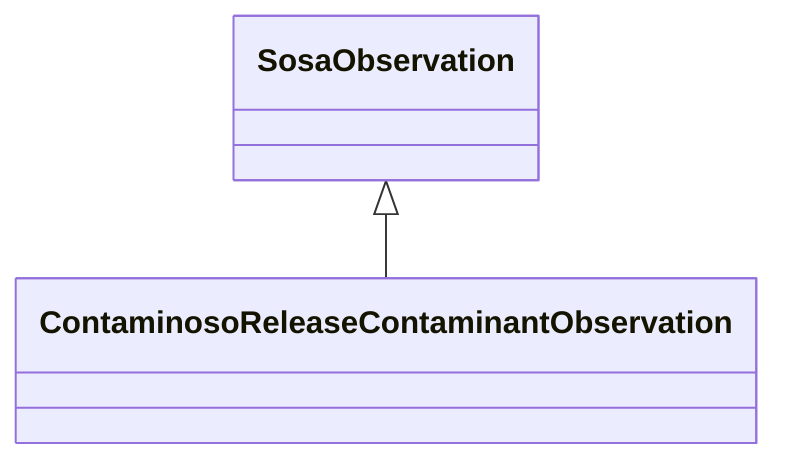

# Class: TODO -- what's a good name for this class (type)? (contaminoso_ReleaseContaminantObservation)


_No type description provided_


URI: [contaminoso:ReleaseContaminantObservation](http://sawgraph.spatialai.org/v1/contaminoso#ReleaseContaminantObservation)





## Inheritance
* [SosaObservation](../classes/SosaObservation.md)
    * **ContaminosoReleaseContaminantObservation**


## Slots

| Name | Cardinality and Range | Description | Inheritance |
| ---  | --- | --- | --- |


## Usages

| used by | used in | type | used |
| ---  | --- | --- | --- |
| [ContaminosoContaminantObservation](../classes/ContaminosoContaminantObservation.md) | [contaminoso_hasTemporalCoverage](../slots/contaminoso_hasTemporalCoverage.md) | domain | [ContaminosoReleaseContaminantObservation](../classes/ContaminosoReleaseContaminantObservation.md) |
| [ContaminosoContaminantObservation](../classes/ContaminosoContaminantObservation.md) | [contaminoso_hasAggregationPeriod](../slots/contaminoso_hasAggregationPeriod.md) | domain | [ContaminosoReleaseContaminantObservation](../classes/ContaminosoReleaseContaminantObservation.md) |


## TODOs

* TODO -- Todos for this class go here
* or you can delete the todos
* if you think the class is perfect.

## Identifier and Mapping Information


### Schema Source


* from schema: sawgraph-kg


## Mappings

| Mapping Type | Mapped Value |
| ---  | ---  |
| self | contaminoso:ReleaseContaminantObservation |
| native | sawgraph-kg/:ContaminosoReleaseContaminantObservation |


## LinkML Source

<!-- TODO: investigate https://stackoverflow.com/questions/37606292/how-to-create-tabbed-code-blocks-in-mkdocs-or-sphinx -->

### Direct

<details>
```yaml
name: contaminoso_ReleaseContaminantObservation
description: No type description provided
title: TODO -- what's a good name for this class (type)?
todos:
- TODO -- Todos for this class go here
- or you can delete the todos
- if you think the class is perfect.
notes:
- Class with 733 occurences.
from_schema: sawgraph-kg
rank: 1000
is_a: sosa_Observation
class_uri: contaminoso:ReleaseContaminantObservation

```
</details>

### Induced

<details>
```yaml
name: contaminoso_ReleaseContaminantObservation
description: No type description provided
title: TODO -- what's a good name for this class (type)?
todos:
- TODO -- Todos for this class go here
- or you can delete the todos
- if you think the class is perfect.
notes:
- Class with 733 occurences.
from_schema: sawgraph-kg
rank: 1000
is_a: sosa_Observation
class_uri: contaminoso:ReleaseContaminantObservation

```
</details>