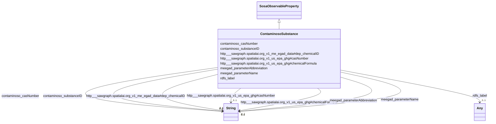

# Class: TODO -- what's a good name for this class (type)? (contaminoso_Substance)


_TODO -- tell the world what this class (type) describes._


URI: [contaminoso:Substance](http://sawgraph.spatialai.org/v1/contaminoso#Substance)





## Inheritance
* [SosaObservableProperty](../classes/SosaObservableProperty.md)
    * **ContaminosoSubstance**


## Slots

| Name | Cardinality and Range | Description | Inheritance |
| ---  | --- | --- | --- |
| [http___sawgraph.spatialai.org_v1_us_epa_ghg#chemicalFormula](../slots/http___sawgraph.spatialai.org_v1_us_epa_ghg#chemicalFormula.md) | 0..1 <br/> [xsd:string](http://www.w3.org/2001/XMLSchema#string) | TODO -- tell the world what this slot (predicate) describes | direct |
| [http___sawgraph.spatialai.org_v1_me_egad_data#dep_chemicalID](../slots/http___sawgraph.spatialai.org_v1_me_egad_data#dep_chemicalID.md) | 0..1 <br/> [xsd:string](http://www.w3.org/2001/XMLSchema#string) | TODO -- tell the world what this slot (predicate) describes | direct |
| [rdfs_label](../slots/rdfs_label.md) | 0..1 <br/> [Any](../classes/Any.md)&nbsp;or&nbsp;<br />[xsd:string](http://www.w3.org/2001/XMLSchema#string)&nbsp;or&nbsp;<br />[xsd:anyURI](http://www.w3.org/2001/XMLSchema#anyURI) | TODO -- tell the world what this slot (predicate) describes | direct |
| [contaminoso_substanceID](../slots/contaminoso_substanceID.md) | 0..1 <br/> [xsd:string](http://www.w3.org/2001/XMLSchema#string) | TODO -- tell the world what this slot (predicate) describes | direct |
| [meegad_parameterName](../slots/meegad_parameterName.md) | 0..1 <br/> [xsd:string](http://www.w3.org/2001/XMLSchema#string) | Name of the PFAS parameter (single chemical or aggregate set of chemicals) me... | direct |
| [http___sawgraph.spatialai.org_v1_us_epa_ghg#casNumber](../slots/http___sawgraph.spatialai.org_v1_us_epa_ghg#casNumber.md) | 0..1 <br/> [xsd:string](http://www.w3.org/2001/XMLSchema#string) | TODO -- tell the world what this slot (predicate) describes | direct |
| [meegad_parameterAbbreviation](../slots/meegad_parameterAbbreviation.md) | 0..1 <br/> [xsd:string](http://www.w3.org/2001/XMLSchema#string) | Abbreviation of the PFAS parameter (single chemical or aggregate set of chemi... | direct |
| [contaminoso_casNumber](../slots/contaminoso_casNumber.md) | 0..1 <br/> [xsd:string](http://www.w3.org/2001/XMLSchema#string) | TODO -- tell the world what this slot (predicate) describes | direct |


## Usages

| used by | used in | type | used |
| ---  | --- | --- | --- |
| [ContaminosoContaminantObservation](../classes/ContaminosoContaminantObservation.md) | [contaminoso_ofSubstance](../slots/contaminoso_ofSubstance.md) | any_of[range] | [ContaminosoSubstance](../classes/ContaminosoSubstance.md) |
| [ContaminosoContaminantObservation](../classes/ContaminosoContaminantObservation.md) | [sosa_observedProperty](../slots/sosa_observedProperty.md) | any_of[range] | [ContaminosoSubstance](../classes/ContaminosoSubstance.md) |


## TODOs

* TODO -- Todos for this class go here
* or you can delete the todos
* if you think the class is perfect.

## Identifier and Mapping Information


### Schema Source


* from schema: sawgraph-kg


## Mappings

| Mapping Type | Mapped Value |
| ---  | ---  |
| self | contaminoso:Substance |
| native | sawgraph-kg/:ContaminosoSubstance |


## LinkML Source

<!-- TODO: investigate https://stackoverflow.com/questions/37606292/how-to-create-tabbed-code-blocks-in-mkdocs-or-sphinx -->

### Direct

<details>
```yaml
name: contaminoso_Substance
description: TODO -- tell the world what this class (type) describes.
title: TODO -- what's a good name for this class (type)?
todos:
- TODO -- Todos for this class go here
- or you can delete the todos
- if you think the class is perfect.
notes:
- Class with 169 occurences.
from_schema: sawgraph-kg
is_a: sosa_ObservableProperty
slots:
- http___sawgraph.spatialai.org_v1_us-epa-ghg#chemicalFormula
- http___sawgraph.spatialai.org_v1_me-egad-data#dep_chemicalID
- rdfs_label
- contaminoso_substanceID
- meegad_parameterName
- http___sawgraph.spatialai.org_v1_us-epa-ghg#casNumber
- meegad_parameterAbbreviation
- contaminoso_casNumber
class_uri: contaminoso:Substance

```
</details>

### Induced

<details>
```yaml
name: contaminoso_Substance
description: TODO -- tell the world what this class (type) describes.
title: TODO -- what's a good name for this class (type)?
todos:
- TODO -- Todos for this class go here
- or you can delete the todos
- if you think the class is perfect.
notes:
- Class with 169 occurences.
from_schema: sawgraph-kg
is_a: sosa_ObservableProperty
attributes:
  http___sawgraph.spatialai.org_v1_us-epa-ghg#chemicalFormula:
    name: http___sawgraph.spatialai.org_v1_us-epa-ghg#chemicalFormula
    description: TODO -- tell the world what this slot (predicate) describes.
    title: TODO -- tell the world what this slot (predicate) describes.
    todos:
    - TODO -- Todos for this slot go here
    - or you can delete the todos
    - if you think the class is perfect.
    comments:
    - 56 occurrences with subject type contaminoso_Substance and object type string.
    examples:
    - value: http://sawgraph.spatialai.org/v1/us-epa-ghg#d.Chemical.1_1_1_3_3_3-HEXAFLUOROPROPANE
        http://sawgraph.spatialai.org/v1/us-epa-ghg#chemicalFormula C4HF9
    from_schema: sawgraph-kg
    rank: 1000
    slot_uri: http://sawgraph.spatialai.org/v1/us-epa-ghg#chemicalFormula
    alias: http___sawgraph.spatialai.org_v1_us_epa_ghg#chemicalFormula
    owner: contaminoso_Substance
    domain_of:
    - contaminoso_Substance
    range: string
  http___sawgraph.spatialai.org_v1_me-egad-data#dep_chemicalID:
    name: http___sawgraph.spatialai.org_v1_me-egad-data#dep_chemicalID
    description: TODO -- tell the world what this slot (predicate) describes.
    title: TODO -- tell the world what this slot (predicate) describes.
    todos:
    - TODO -- Todos for this slot go here
    - or you can delete the todos
    - if you think the class is perfect.
    comments:
    - 4 occurrences with subject type contaminoso_Substance and object type string.
    - 3 occurrences with untyped subjects and object type string.
    examples:
    - value: meegad:parameter.SUM_OF_5_PFAS http://sawgraph.spatialai.org/v1/me-egad-data#dep_chemicalID
        DEP18016
    - value: meegad:parameter.SUM_PFHXS_A_L-PFHXS_A_BR http://sawgraph.spatialai.org/v1/me-egad-data#dep_chemicalID
        DEP18031
    from_schema: sawgraph-kg
    rank: 1000
    slot_uri: http://sawgraph.spatialai.org/v1/me-egad-data#dep_chemicalID
    alias: http___sawgraph.spatialai.org_v1_me_egad_data#dep_chemicalID
    owner: contaminoso_Substance
    domain_of:
    - contaminoso_Substance
    range: string
  rdfs_label:
    name: rdfs_label
    description: TODO -- tell the world what this slot (predicate) describes.
    title: TODO -- tell the world what this slot (predicate) describes.
    todos:
    - TODO -- Todos for this slot go here
    - or you can delete the todos
    - if you think the class is perfect.
    comments:
    - 66 occurrences with subject type contaminoso_ResultQualifier and object type
      string.
    - 33 occurrences with subject type ilisgs_WellPurpose and object type string.
    - 109 occurrences with subject type meegad_EGAD-SamplePointType and object type
      string.
    - 94 occurrences with subject type contaminoso_Substance and object type string.
    - 12 occurrences with subject type contaminoso_ObservationAnnotation and object
      type string.
    - 160 occurrences with subject type contaminoso_SampleAnnotation and object type
      string.
    - 97 occurrences with subject type contaminoso_MaterialType and object type string.
    - 1249 occurrences with subject type meegad_EGAD-AnalysisMethod and object type
      string.
    - 3 occurrences with subject type http___qudt.org_vocab_unitUnit and object type
      string.
    - 300 occurrences with subject type prov_Organization and object type string.
    - 115887 occurrences with subject type contaminoso_ContaminantMeasurement and
      object type string.
    - 26294 occurrences with subject type contaminoso_AggregateContaminantMeasurement
      and object type string.
    - 23031 occurrences with subject type contaminoso_MaterialSample and object type
      string.
    - 8324 occurrences with subject type contaminoso_Point and object type string.
    - 171069 occurrences with subject type contaminoso_Feature and object type string.
    - 957 occurrences with subject type meegad_EGAD-Site and object type string.
    - 62 occurrences with subject type meegad_EGAD-SiteType and object type string.
    - 142181 occurrences with subject type contaminoso_ContaminantObservation and
      object type string.
    examples:
    - value: http://sawgraph.spatialai.org/me-egad#concentrationQualifier.* rdfs:label
        QC RESULTS NOT WITHIN CONTROL LIMITS
    - value: http://sawgraph.spatialai.org/v1/il-isgs-data#d.ISGS-WellPurpose.CROP
        rdfs:label Outcrop
    - value: meegad:featureType.AST rdfs:label ABOVEGROUND STORAGE TANK
    - value: meegad:parameter.10-2_FTS_A rdfs:label 10:2 FLUOROTELOMER SULFONIC ACID
    - value: meegad:resultType.TRG rdfs:label TARGET/REGULAR RESULT
    - value: meegad:sampleLocation.AF rdfs:label AFTER FILTERS
    - value: meegad:sampleMaterialType.AS rdfs:label ASH (BOTTOM & FLY)
    - value: meegad:testMethod.CALCULATED rdfs:label CALCULATED
    - value: meegad:unit.MG-KG rdfs:label MILLIGRAMS PER KILOGRAM
    - value: http://sawgraph.spatialai.org/v1/me-egad-data#organization.lab.AA rdfs:label
        ALPHA ANALYTICAL LAB - WESTBOROUGH, MA
    - value: http://sawgraph.spatialai.org/v1/me-egad-data#result.1028303.ELL.20190405.45298906
        rdfs:label EGAD PFAS measurements for sample 722
    - value: http://sawgraph.spatialai.org/v1/me-egad-data#result.1028303.ELL.20190405.DEP18010
        rdfs:label EGAD PFAS measurements for sample 722
    - value: http://sawgraph.spatialai.org/v1/me-egad-data#sample.1028303.ELL.20190405
        rdfs:label EGAD sample 722
    - value: http://sawgraph.spatialai.org/v1/me-egad-data#samplePoint.100410 rdfs:label
        EGAD sample point 100410
    - value: http://sawgraph.spatialai.org/v1/me-egad-data#sampledFeature.100410 rdfs:label
        EGAD sampled festure associated with sample point 100410
    - value: http://sawgraph.spatialai.org/v1/me-egad-data#site.100843 rdfs:label
        EGAD site 100843
    - value: meegad:siteType.AGRICCHEM rdfs:label AGRICULTURAL CHEMICAL USE
    - value: http://sawgraph.spatialai.org/v1/me-egad-data#observation.1028303.ELL.20190405.45298906
        rdfs:label EGAD PFAS observation for sample 722
    from_schema: sawgraph-kg
    rank: 1000
    slot_uri: rdfs:label
    alias: rdfs_label
    owner: contaminoso_Substance
    domain_of:
    - contaminoso_AggregateContaminantMeasurement
    - contaminoso_ContaminantMeasurement
    - contaminoso_ContaminantObservation
    - contaminoso_Feature
    - contaminoso_MaterialSample
    - contaminoso_MaterialType
    - contaminoso_ObservationAnnotation
    - contaminoso_Point
    - contaminoso_ResultQualifier
    - contaminoso_SampleAnnotation
    - contaminoso_Substance
    - http___qudt.org_vocab_unitUnit
    - ilisgs_WellPurpose
    - meegad_EGAD-AnalysisMethod
    - meegad_EGAD-SamplePointType
    - meegad_EGAD-Site
    - meegad_EGAD-SiteType
    - prov_Organization
    range: Any
    any_of:
    - range: string
    - range: uri
  contaminoso_substanceID:
    name: contaminoso_substanceID
    description: TODO -- tell the world what this slot (predicate) describes.
    title: TODO -- tell the world what this slot (predicate) describes.
    todos:
    - TODO -- Todos for this slot go here
    - or you can delete the todos
    - if you think the class is perfect.
    comments:
    - 75 occurrences with subject type contaminoso_Substance and object type string.
    examples:
    - value: meegad:parameter.10-2_FTS_A contaminoso:substanceID 120226600
    from_schema: sawgraph-kg
    rank: 1000
    slot_uri: contaminoso:substanceID
    alias: contaminoso_substanceID
    owner: contaminoso_Substance
    domain_of:
    - contaminoso_Substance
    range: string
  meegad_parameterName:
    name: meegad_parameterName
    description: Name of the PFAS parameter (single chemical or aggregate set of chemicals)
      measured in the EGAD dataset from the state of Maine.
    title: TODO -- tell the world what this slot (predicate) describes.
    todos:
    - TODO -- Todos for this slot go here
    - or you can delete the todos
    - if you think the class is perfect.
    comments:
    - 93 occurrences with subject type contaminoso_Substance and object type string.
    examples:
    - value: meegad:parameter.10-2_FTS_A meegad:parameterName 10:2 FLUOROTELOMER SULFONIC
        ACID
    from_schema: sawgraph-kg
    rank: 1000
    slot_uri: meegad:parameterName
    alias: meegad_parameterName
    owner: contaminoso_Substance
    domain_of:
    - contaminoso_Substance
    range: string
  http___sawgraph.spatialai.org_v1_us-epa-ghg#casNumber:
    name: http___sawgraph.spatialai.org_v1_us-epa-ghg#casNumber
    description: TODO -- tell the world what this slot (predicate) describes.
    title: TODO -- tell the world what this slot (predicate) describes.
    todos:
    - TODO -- Todos for this slot go here
    - or you can delete the todos
    - if you think the class is perfect.
    comments:
    - 76 occurrences with subject type contaminoso_Substance and object type string.
    examples:
    - value: http://sawgraph.spatialai.org/v1/us-epa-ghg#d.Chemical.1_1_1_3_3_3-HEXAFLUOROPROPANE
        http://sawgraph.spatialai.org/v1/us-epa-ghg#casNumber 382-24-1
    from_schema: sawgraph-kg
    rank: 1000
    slot_uri: http://sawgraph.spatialai.org/v1/us-epa-ghg#casNumber
    alias: http___sawgraph.spatialai.org_v1_us_epa_ghg#casNumber
    owner: contaminoso_Substance
    domain_of:
    - contaminoso_Substance
    range: string
  meegad_parameterAbbreviation:
    name: meegad_parameterAbbreviation
    description: Abbreviation of the PFAS parameter (single chemical or aggregate
      set of chemicals) measured in the EGAD dataset from the state of Maine.
    title: TODO -- tell the world what this slot (predicate) describes.
    todos:
    - TODO -- Todos for this slot go here
    - or you can delete the todos
    - if you think the class is perfect.
    comments:
    - 93 occurrences with subject type contaminoso_Substance and object type string.
    examples:
    - value: meegad:parameter.10-2_FTS_A meegad:parameterAbbreviation 10:2 FTS_A
    from_schema: sawgraph-kg
    rank: 1000
    slot_uri: meegad:parameterAbbreviation
    alias: meegad_parameterAbbreviation
    owner: contaminoso_Substance
    domain_of:
    - contaminoso_Substance
    range: string
  contaminoso_casNumber:
    name: contaminoso_casNumber
    description: TODO -- tell the world what this slot (predicate) describes.
    title: TODO -- tell the world what this slot (predicate) describes.
    todos:
    - TODO -- Todos for this slot go here
    - or you can delete the todos
    - if you think the class is perfect.
    comments:
    - 75 occurrences with subject type contaminoso_Substance and object type string.
    examples:
    - value: meegad:parameter.10-2_FTS_A contaminoso:casNumber 120226600
    from_schema: sawgraph-kg
    rank: 1000
    slot_uri: contaminoso:casNumber
    alias: contaminoso_casNumber
    owner: contaminoso_Substance
    domain_of:
    - contaminoso_Substance
    subproperty_of: contaminoso_substanceID
    range: string
class_uri: contaminoso:Substance

```
</details>