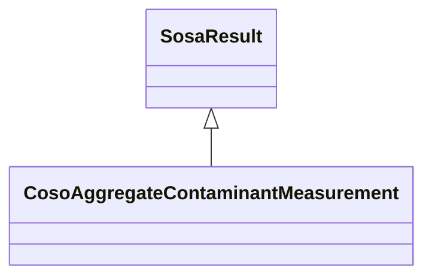

# Class: Aggregate Contaminant Measurement (coso_AggregateContaminantMeasurement)


_The result of an observation about contaminant(s) that is an aggregate measurement. This can be a spatial, temporal or contaminant aggregate._


URI: [coso:AggregateContaminantMeasurement](http://w3id.org/coso/v1/contaminoso#AggregateContaminantMeasurement)





## Inheritance
* [SosaResult](../classes/SosaResult.md)
    * **CosoAggregateContaminantMeasurement**


## Slots

| Name | Cardinality and Range | Description | Inheritance | Occurrences |
| ---  | --- | --- | --- | --- |


## LinkML Source

<!-- TODO: investigate https://stackoverflow.com/questions/37606292/how-to-create-tabbed-code-blocks-in-mkdocs-or-sphinx -->

### Direct

<details>

```yaml
name: coso_AggregateContaminantMeasurement
description: The result of an observation about contaminant(s) that is an aggregate
  measurement. This can be a spatial, temporal or contaminant aggregate.
title: Aggregate Contaminant Measurement
from_schema: okns:sawgraph-kg
rank: 1000
is_a: sosa_Result
class_uri: coso:AggregateContaminantMeasurement

```
</details>

### Induced

<details>

```yaml
name: coso_AggregateContaminantMeasurement
description: The result of an observation about contaminant(s) that is an aggregate
  measurement. This can be a spatial, temporal or contaminant aggregate.
title: Aggregate Contaminant Measurement
from_schema: okns:sawgraph-kg
rank: 1000
is_a: sosa_Result
class_uri: coso:AggregateContaminantMeasurement

```
</details>