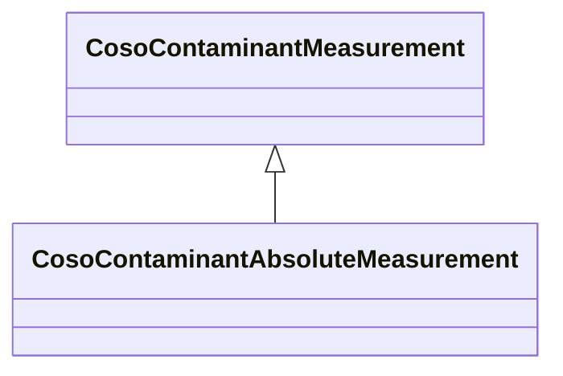

# Class: Contaminant Absolute Measurement (coso_ContaminantAbsoluteMeasurement)


_No class (type) description specified_


URI: [coso:ContaminantAbsoluteMeasurement](http://w3id.org/coso/v1/contaminoso#ContaminantAbsoluteMeasurement)





## Inheritance
* [CosoContaminantMeasurement](../classes/CosoContaminantMeasurement.md)
    * **CosoContaminantAbsoluteMeasurement**


## Slots

| Name | Cardinality and Range | Description | Inheritance | Occurrences |
| ---  | --- | --- | --- | --- |


## LinkML Source

<!-- TODO: investigate https://stackoverflow.com/questions/37606292/how-to-create-tabbed-code-blocks-in-mkdocs-or-sphinx -->

### Direct

<details>

```yaml
name: coso_ContaminantAbsoluteMeasurement
conforms_to: No schema conformance document specified
description: No class (type) description specified
title: Contaminant Absolute Measurement
from_schema: sawgraph-kg
rank: 1000
is_a: coso_ContaminantMeasurement
class_uri: coso:ContaminantAbsoluteMeasurement

```
</details>

### Induced

<details>

```yaml
name: coso_ContaminantAbsoluteMeasurement
conforms_to: No schema conformance document specified
description: No class (type) description specified
title: Contaminant Absolute Measurement
from_schema: sawgraph-kg
rank: 1000
is_a: coso_ContaminantMeasurement
class_uri: coso:ContaminantAbsoluteMeasurement

```
</details>