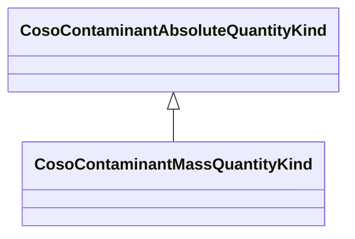

# Class: Contaminant Quantity Kind (coso_ContaminantMassQuantityKind)


_No class (type) description specified_


URI: [coso:ContaminantMassQuantityKind](http://w3id.org/coso/v1/contaminoso#ContaminantMassQuantityKind)





## Inheritance
* [CosoContaminationProperty](../classes/CosoContaminationProperty.md)
    * [CosoContaminantAbsoluteQuantityKind](../classes/CosoContaminantAbsoluteQuantityKind.md)
        * **CosoContaminantMassQuantityKind**


## Slots

| Name | Cardinality and Range | Description | Inheritance | Occurrences |
| ---  | --- | --- | --- | --- |


## LinkML Source

<!-- TODO: investigate https://stackoverflow.com/questions/37606292/how-to-create-tabbed-code-blocks-in-mkdocs-or-sphinx -->

### Direct

<details>

```yaml
name: coso_ContaminantMassQuantityKind
conforms_to: No schema conformance document specified
description: No class (type) description specified
title: Contaminant Quantity Kind
from_schema: sawgraph-kg
rank: 1000
is_a: coso_ContaminantAbsoluteQuantityKind
class_uri: coso:ContaminantMassQuantityKind

```
</details>

### Induced

<details>

```yaml
name: coso_ContaminantMassQuantityKind
conforms_to: No schema conformance document specified
description: No class (type) description specified
title: Contaminant Quantity Kind
from_schema: sawgraph-kg
rank: 1000
is_a: coso_ContaminantAbsoluteQuantityKind
class_uri: coso:ContaminantMassQuantityKind

```
</details>