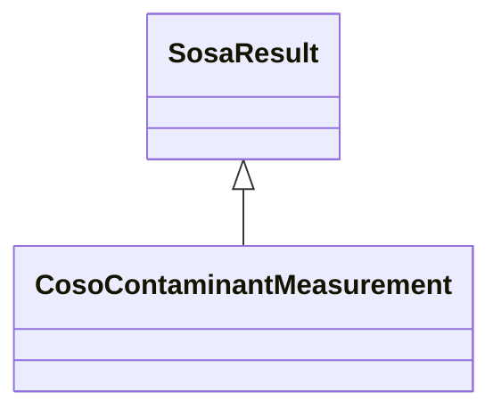

# Class: Contaminant Measurement (coso_ContaminantMeasurement)


_The result of an observation about a contaminant or contaminants._


URI: [coso:ContaminantMeasurement](http://w3id.org/coso/v1/contaminoso#ContaminantMeasurement)





## Inheritance
* [SosaResult](../classes/SosaResult.md)
    * **CosoContaminantMeasurement**


## Slots

| Name | Cardinality and Range | Description | Inheritance | Occurrences |
| ---  | --- | --- | --- | --- |


## Usages

| used by | used in | type | used |
| ---  | --- | --- | --- |
| [HttpW3id.orgSawgraphV1Me-egad#EGAD-PFAS-Observation](../classes/HttpW3id.orgSawgraphV1Me-egad#EGAD-PFAS-Observation.md) | [coso_hasResult](../slots/coso_hasResult.md) | any_of[range] | [CosoContaminantMeasurement](../classes/CosoContaminantMeasurement.md) |
| [HttpW3id.orgSawgraphV1Us-wqp#Observation](../classes/HttpW3id.orgSawgraphV1Us-wqp#Observation.md) | [coso_hasResult](../slots/coso_hasResult.md) | any_of[range] | [CosoContaminantMeasurement](../classes/CosoContaminantMeasurement.md) |
| [MeEgadEGAD-PFAS-Observation](../classes/MeEgadEGAD-PFAS-Observation.md) | [coso_hasResult](../slots/coso_hasResult.md) | any_of[range] | [CosoContaminantMeasurement](../classes/CosoContaminantMeasurement.md) |


## LinkML Source

<!-- TODO: investigate https://stackoverflow.com/questions/37606292/how-to-create-tabbed-code-blocks-in-mkdocs-or-sphinx -->

### Direct

<details>

```yaml
name: coso_ContaminantMeasurement
description: The result of an observation about a contaminant or contaminants.
title: Contaminant Measurement
from_schema: okns:sawgraph-kg
rank: 1000
is_a: sosa_Result
class_uri: coso:ContaminantMeasurement

```
</details>

### Induced

<details>

```yaml
name: coso_ContaminantMeasurement
description: The result of an observation about a contaminant or contaminants.
title: Contaminant Measurement
from_schema: okns:sawgraph-kg
rank: 1000
is_a: sosa_Result
class_uri: coso:ContaminantMeasurement

```
</details>