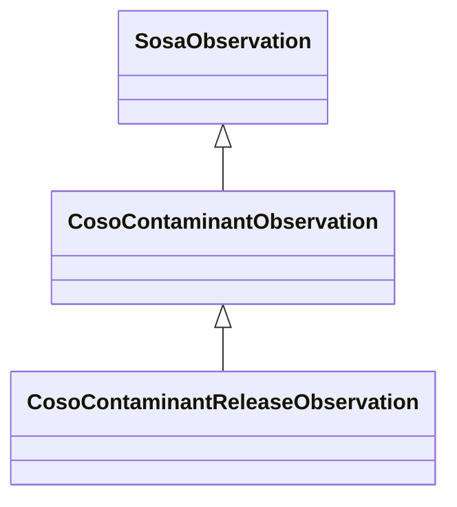

# Class: Contaminant Observation (coso_ContaminantObservation)


_No class (type) description specified_


URI: [coso:ContaminantObservation](http://w3id.org/coso/v1/contaminoso#ContaminantObservation)





## Inheritance
* [SosaObservation](../classes/SosaObservation.md)
    * **CosoContaminantObservation**
        * [CosoContaminantReleaseObservation](../classes/CosoContaminantReleaseObservation.md)


## Slots

| Name | Cardinality and Range | Description | Inheritance | Occurrences |
| ---  | --- | --- | --- | --- |


## Usages

| used by | used in | type | used |
| ---  | --- | --- | --- |
| [MeEgadEGAD-PFAS-Observation](../classes/MeEgadEGAD-PFAS-Observation.md) | [coso_hasResult](../slots/coso_hasResult.md) | domain | [CosoContaminantObservation](../classes/CosoContaminantObservation.md) |
| [MeEgadEGAD-PFAS-Observation](../classes/MeEgadEGAD-PFAS-Observation.md) | [coso_observedTime](../slots/coso_observedTime.md) | domain | [CosoContaminantObservation](../classes/CosoContaminantObservation.md) |
| [MeEgadEGAD-PFAS-Observation](../classes/MeEgadEGAD-PFAS-Observation.md) | [coso_ofSubstance](../slots/coso_ofSubstance.md) | domain | [CosoContaminantObservation](../classes/CosoContaminantObservation.md) |


## LinkML Source

<!-- TODO: investigate https://stackoverflow.com/questions/37606292/how-to-create-tabbed-code-blocks-in-mkdocs-or-sphinx -->

### Direct

<details>

```yaml
name: coso_ContaminantObservation
conforms_to: No schema conformance document specified
description: No class (type) description specified
title: Contaminant Observation
from_schema: sawgraph-kg
rank: 1000
is_a: sosa_Observation
class_uri: coso:ContaminantObservation

```
</details>

### Induced

<details>

```yaml
name: coso_ContaminantObservation
conforms_to: No schema conformance document specified
description: No class (type) description specified
title: Contaminant Observation
from_schema: sawgraph-kg
rank: 1000
is_a: sosa_Observation
class_uri: coso:ContaminantObservation

```
</details>