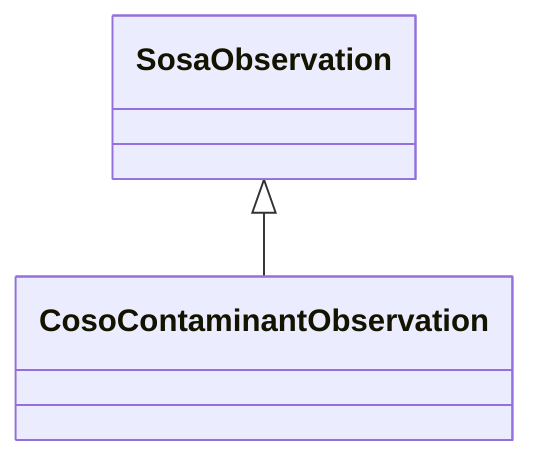

# Class: Contaminant Observation (coso_ContaminantObservation)


_An observation of a contaminant._


URI: [coso:ContaminantObservation](http://w3id.org/coso/v1/contaminoso#ContaminantObservation)





## Inheritance
* [SosaObservation](../classes/SosaObservation.md)
    * **CosoContaminantObservation**


## Slots

| Name | Cardinality and Range | Description | Inheritance | Occurrences |
| ---  | --- | --- | --- | --- |


## LinkML Source

<!-- TODO: investigate https://stackoverflow.com/questions/37606292/how-to-create-tabbed-code-blocks-in-mkdocs-or-sphinx -->

### Direct

<details>

```yaml
name: coso_ContaminantObservation
description: An observation of a contaminant.
title: Contaminant Observation
from_schema: okns:sawgraph-kg
rank: 1000
is_a: sosa_Observation
class_uri: coso:ContaminantObservation

```
</details>

### Induced

<details>

```yaml
name: coso_ContaminantObservation
description: An observation of a contaminant.
title: Contaminant Observation
from_schema: okns:sawgraph-kg
rank: 1000
is_a: sosa_Observation
class_uri: coso:ContaminantObservation

```
</details>