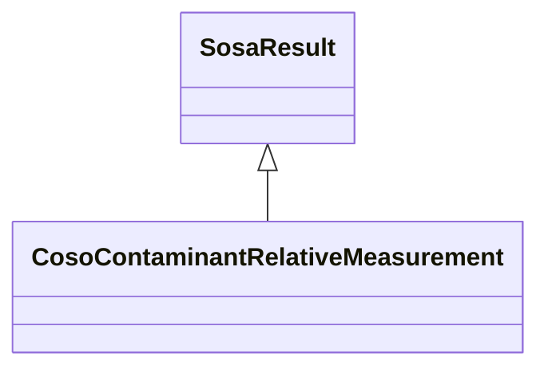

# Class: Contaminant Relative Measurement (coso_ContaminantRelativeMeasurement)


_The result of an observation about a contaminant that is a relative measurement._


URI: [coso:ContaminantRelativeMeasurement](http://w3id.org/coso/v1/contaminoso#ContaminantRelativeMeasurement)





## Inheritance
* [SosaResult](../classes/SosaResult.md)
    * **CosoContaminantRelativeMeasurement**


## Slots

| Name | Cardinality and Range | Description | Inheritance | Occurrences |
| ---  | --- | --- | --- | --- |


## LinkML Source

<!-- TODO: investigate https://stackoverflow.com/questions/37606292/how-to-create-tabbed-code-blocks-in-mkdocs-or-sphinx -->

### Direct

<details>

```yaml
name: coso_ContaminantRelativeMeasurement
description: The result of an observation about a contaminant that is a relative measurement.
title: Contaminant Relative Measurement
from_schema: okns:sawgraph-kg
rank: 1000
is_a: sosa_Result
class_uri: coso:ContaminantRelativeMeasurement

```
</details>

### Induced

<details>

```yaml
name: coso_ContaminantRelativeMeasurement
description: The result of an observation about a contaminant that is a relative measurement.
title: Contaminant Relative Measurement
from_schema: okns:sawgraph-kg
rank: 1000
is_a: sosa_Result
class_uri: coso:ContaminantRelativeMeasurement

```
</details>