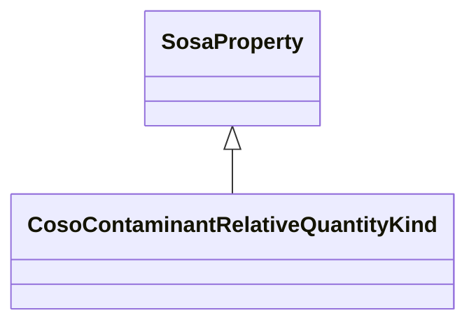

# Class: Contaminant Relative Quantity Kind (coso_ContaminantRelativeQuantityKind)


_A type of contaminant quantity that is a relative amount, such as a concentration._


URI: [coso:ContaminantRelativeQuantityKind](http://w3id.org/coso/v1/contaminoso#ContaminantRelativeQuantityKind)





## Inheritance
* [OwlThing](../classes/OwlThing.md)
    * [SosaProperty](../classes/SosaProperty.md)
        * **CosoContaminantRelativeQuantityKind**


## Slots

| Name | Cardinality and Range | Description | Inheritance | Occurrences |
| ---  | --- | --- | --- | --- |


## LinkML Source

<!-- TODO: investigate https://stackoverflow.com/questions/37606292/how-to-create-tabbed-code-blocks-in-mkdocs-or-sphinx -->

### Direct

<details>

```yaml
name: coso_ContaminantRelativeQuantityKind
description: A type of contaminant quantity that is a relative amount, such as a concentration.
title: Contaminant Relative Quantity Kind
from_schema: okns:sawgraph-kg
rank: 1000
is_a: sosa_Property
class_uri: coso:ContaminantRelativeQuantityKind

```
</details>

### Induced

<details>

```yaml
name: coso_ContaminantRelativeQuantityKind
description: A type of contaminant quantity that is a relative amount, such as a concentration.
title: Contaminant Relative Quantity Kind
from_schema: okns:sawgraph-kg
rank: 1000
is_a: sosa_Property
class_uri: coso:ContaminantRelativeQuantityKind

```
</details>