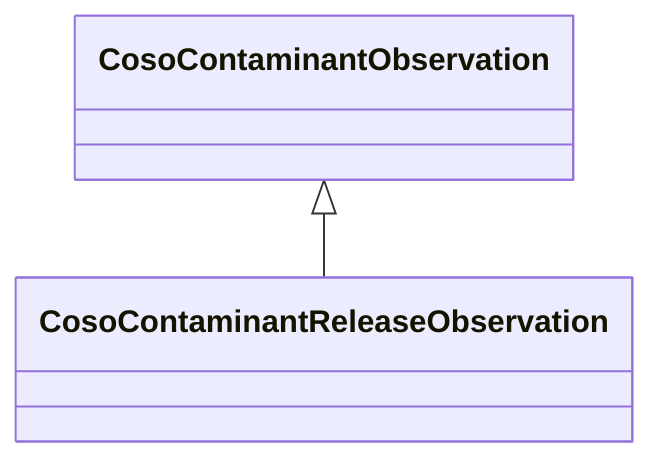

# Class: Contaminant Release Observation (coso_ContaminantReleaseObservation)


_No class (type) description specified_


URI: [coso:ContaminantReleaseObservation](http://w3id.org/coso/v1/contaminoso#ContaminantReleaseObservation)





## Inheritance
* [SosaObservation](../classes/SosaObservation.md)
    * [CosoContaminantObservation](../classes/CosoContaminantObservation.md)
        * **CosoContaminantReleaseObservation**


## Slots

| Name | Cardinality and Range | Description | Inheritance | Occurrences |
| ---  | --- | --- | --- | --- |


## LinkML Source

<!-- TODO: investigate https://stackoverflow.com/questions/37606292/how-to-create-tabbed-code-blocks-in-mkdocs-or-sphinx -->

### Direct

<details>

```yaml
name: coso_ContaminantReleaseObservation
conforms_to: No schema conformance document specified
description: No class (type) description specified
title: Contaminant Release Observation
from_schema: sawgraph-kg
rank: 1000
is_a: coso_ContaminantObservation
class_uri: coso:ContaminantReleaseObservation

```
</details>

### Induced

<details>

```yaml
name: coso_ContaminantReleaseObservation
conforms_to: No schema conformance document specified
description: No class (type) description specified
title: Contaminant Release Observation
from_schema: sawgraph-kg
rank: 1000
is_a: coso_ContaminantObservation
class_uri: coso:ContaminantReleaseObservation

```
</details>