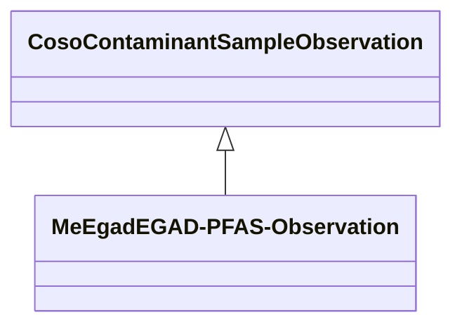

# Class: No class (entity type) name specified -- this class is noted as a superclass of another class in this graph but has not itself been defined. (coso_ContaminantSampleObservation)


_No class (type) description specified_


URI: [coso:ContaminantSampleObservation](http://w3id.org/coso/v1/contaminoso#ContaminantSampleObservation)





## Inheritance
* **CosoContaminantSampleObservation**
    * [MeEgadEGAD-PFAS-Observation](../classes/MeEgadEGAD-PFAS-Observation.md)


## Slots

| Name | Cardinality and Range | Description | Inheritance | Occurrences |
| ---  | --- | --- | --- | --- |


## Usages

| used by | used in | type | used |
| ---  | --- | --- | --- |
| [MeEgadEGAD-PFAS-Observation](../classes/MeEgadEGAD-PFAS-Observation.md) | [coso_observedAtSamplePoint](../slots/coso_observedAtSamplePoint.md) | domain | [CosoContaminantSampleObservation](../classes/CosoContaminantSampleObservation.md) |
| [MeEgadEGAD-PFAS-Observation](../classes/MeEgadEGAD-PFAS-Observation.md) | [coso_analyzedSample](../slots/coso_analyzedSample.md) | domain | [CosoContaminantSampleObservation](../classes/CosoContaminantSampleObservation.md) |


## LinkML Source

<!-- TODO: investigate https://stackoverflow.com/questions/37606292/how-to-create-tabbed-code-blocks-in-mkdocs-or-sphinx -->

### Direct

<details>

```yaml
name: coso_ContaminantSampleObservation
conforms_to: No schema conformance document specified
description: No class (type) description specified
title: No class (entity type) name specified -- this class is noted as a superclass
  of another class in this graph but has not itself been defined.
from_schema: sawgraph-kg
rank: 1000
class_uri: coso:ContaminantSampleObservation

```
</details>

### Induced

<details>

```yaml
name: coso_ContaminantSampleObservation
conforms_to: No schema conformance document specified
description: No class (type) description specified
title: No class (entity type) name specified -- this class is noted as a superclass
  of another class in this graph but has not itself been defined.
from_schema: sawgraph-kg
rank: 1000
class_uri: coso:ContaminantSampleObservation

```
</details>