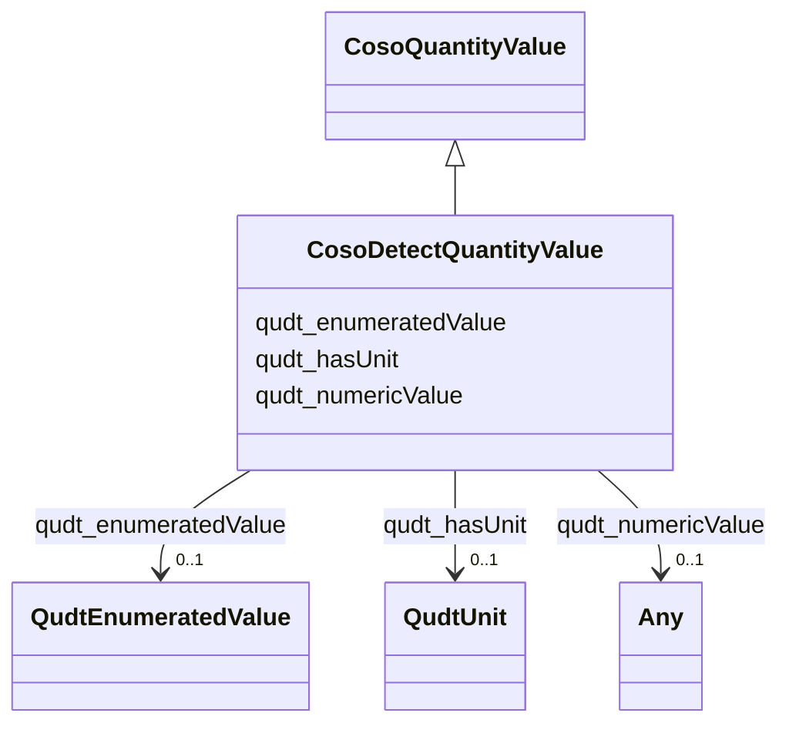

# Class: Detect Quantity Value (coso_DetectQuantityValue)


_No class (type) description specified_


This class occurs 142177 times.


URI: [coso:DetectQuantityValue](http://w3id.org/coso/v1/contaminoso#DetectQuantityValue)





## Inheritance
* [CosoQuantityValue](../classes/CosoQuantityValue.md)
    * **CosoDetectQuantityValue**


## Slots

| Name | Cardinality and Range | Description | Inheritance | Occurrences |
| ---  | --- | --- | --- | --- |
| [qudt_enumeratedValue](../slots/qudt_enumeratedValue.md) | 0..1 <br/> [QudtEnumeratedValue](../classes/QudtEnumeratedValue.md) | No slot (predicate) description specified <br/>  | direct | 416 |
| [qudt_numericValue](../slots/qudt_numericValue.md) | 0..1 <br/> [xsd:decimal](http://www.w3.org/2001/XMLSchema#decimal)&nbsp;or&nbsp;<br />[xsd:double](http://www.w3.org/2001/XMLSchema#double)&nbsp;or&nbsp;<br />[QudtNumericUnion](../classes/QudtNumericUnion.md) | No slot (predicate) description specified <br/>  | direct | 142629 |
| [qudt_hasUnit](../slots/qudt_hasUnit.md) | 0..1 <br/> [QudtUnit](../classes/QudtUnit.md) | This property relates a system of units with a unit of measure that is either... <br/>  | direct | 142557 |


## Usages

| used by | used in | type | used |
| ---  | --- | --- | --- |
| [MeEgadEGAD-AggregatePFAS-Concentration](../classes/MeEgadEGAD-AggregatePFAS-Concentration.md) | [qudt_quantityValue](../slots/qudt_quantityValue.md) | any_of[range] | [CosoDetectQuantityValue](../classes/CosoDetectQuantityValue.md) |
| [MeEgadEGAD-SinglePFAS-Concentration](../classes/MeEgadEGAD-SinglePFAS-Concentration.md) | [qudt_quantityValue](../slots/qudt_quantityValue.md) | any_of[range] | [CosoDetectQuantityValue](../classes/CosoDetectQuantityValue.md) |


## LinkML Source

<!-- TODO: investigate https://stackoverflow.com/questions/37606292/how-to-create-tabbed-code-blocks-in-mkdocs-or-sphinx -->

### Direct

<details>

```yaml
name: coso_DetectQuantityValue
conforms_to: No schema conformance document specified
annotations:
  count:
    tag: count
    value: 142177
description: No class (type) description specified
title: Detect Quantity Value
from_schema: sawgraph-kg
rank: 1000
is_a: coso_QuantityValue
slots:
- qudt_enumeratedValue
- qudt_numericValue
- qudt_hasUnit
slot_usage:
  qudt_enumeratedValue:
    name: qudt_enumeratedValue
    annotations:
      qudt_EnumeratedValue:
        tag: qudt_EnumeratedValue
        value: 416
  qudt_hasUnit:
    name: qudt_hasUnit
    annotations:
      qudt_Unit:
        tag: qudt_Unit
        value: 142557
  qudt_numericValue:
    name: qudt_numericValue
    annotations:
      decimal:
        tag: decimal
        value: 142502
      double:
        tag: double
        value: 127
class_uri: coso:DetectQuantityValue

```
</details>

### Induced

<details>

```yaml
name: coso_DetectQuantityValue
conforms_to: No schema conformance document specified
annotations:
  count:
    tag: count
    value: 142177
description: No class (type) description specified
title: Detect Quantity Value
from_schema: sawgraph-kg
rank: 1000
is_a: coso_QuantityValue
slot_usage:
  qudt_enumeratedValue:
    name: qudt_enumeratedValue
    annotations:
      qudt_EnumeratedValue:
        tag: qudt_EnumeratedValue
        value: 416
  qudt_hasUnit:
    name: qudt_hasUnit
    annotations:
      qudt_Unit:
        tag: qudt_Unit
        value: 142557
  qudt_numericValue:
    name: qudt_numericValue
    annotations:
      decimal:
        tag: decimal
        value: 142502
      double:
        tag: double
        value: 127
attributes:
  qudt_enumeratedValue:
    name: qudt_enumeratedValue
    annotations:
      qudt_EnumeratedValue:
        tag: qudt_EnumeratedValue
        value: 416
    description: No slot (predicate) description specified
    title: No slot (predicate) name specified
    examples:
    - object:
        example_object: coso:non-detect
        example_object_type: qudt_EnumeratedValue
        example_predicate: qudt:enumeratedValue
        example_subject: me_egad_data:quantityValue.101365P.NA.20130507.1763231
        example_subject_type: coso_NonDetectQuantityValue
    - object:
        example_object: coso:non-detect
        example_object_type: qudt_EnumeratedValue
        example_predicate: qudt:enumeratedValue
        example_subject: me_egad_data:quantityValue.1095743.ELL.20190627.2706903
        example_subject_type: coso_DetectQuantityValue
    from_schema: sawgraph-kg
    rank: 1000
    slot_uri: qudt:enumeratedValue
    alias: qudt_enumeratedValue
    owner: coso_DetectQuantityValue
    domain_of:
    - coso_DetectQuantityValue
    - coso_NonDetectQuantityValue
    range: qudt_EnumeratedValue
  qudt_numericValue:
    name: qudt_numericValue
    annotations:
      decimal:
        tag: decimal
        value: 142502
      double:
        tag: double
        value: 127
    description: No slot (predicate) description specified
    title: numeric value
    examples:
    - object:
        example_object: '0.0'
        example_object_type: decimal
        example_predicate: qudt:numericValue
        example_subject: me_egad_data:mdl.0.0.NG/L
        example_subject_type: None
    - object:
        example_object: '1.18e-06'
        example_object_type: double
        example_predicate: qudt:numericValue
        example_subject: me_egad_data:mdl.1.18e-06.MG/L
        example_subject_type: None
    - object:
        example_object: '14.0'
        example_object_type: decimal
        example_predicate: qudt:numericValue
        example_subject: me_egad_data:quantityValue.1028303.ELL.20190405.45298906
        example_subject_type: coso_DetectQuantityValue
    - object:
        example_object: '16000.0'
        example_object_type: decimal
        example_predicate: qudt:numericValue
        example_subject: me_egad_data:quantityValue.1095743.ELL.20190627.2706903
        example_subject_type: coso_NonDetectQuantityValue
    - object:
        example_object: '2.8e-05'
        example_object_type: double
        example_predicate: qudt:numericValue
        example_subject: me_egad_data:quantityValue.L195312201.AAWH.20191107.375735
        example_subject_type: coso_DetectQuantityValue
    from_schema: sawgraph-kg
    source: http://qudt.org/2.1/schema/qudt
    rank: 1000
    slot_uri: qudt:numericValue
    alias: qudt_numericValue
    owner: coso_DetectQuantityValue
    domain_of:
    - coso_DetectQuantityValue
    - coso_NonDetectQuantityValue
    range: Any
    any_of:
    - range: decimal
    - range: double
    - range: qudt_NumericUnion
  qudt_hasUnit:
    name: qudt_hasUnit
    annotations:
      qudt_Unit:
        tag: qudt_Unit
        value: 142557
    description: This property relates a system of units with a unit of measure that
      is either a) defined by the system, or b) accepted for use by the system and
      is convertible to a unit of equivalent dimension that is defined by the system.
      Systems of units may distinguish between base and derived units. Base units
      are the units which measure the base quantities for the corresponding system
      of quantities. The base units are used to define units for all other quantities
      as products of powers of the base units. Such units are called derived units
      for the system.
    title: has unit
    examples:
    - object:
        example_object: http://qudt.org/vocab/unit/NanoGM-PER-L
        example_object_type: qudt_Unit
        example_predicate: qudt:hasUnit
        example_subject: me_egad_data:mdl.0.0.NG/L
        example_subject_type: None
    - object:
        example_object: coso:NanoGM-PER-GM
        example_object_type: qudt_Unit
        example_predicate: qudt:hasUnit
        example_subject: me_egad_data:quantityValue.1028303.ELL.20190405.45298906
        example_subject_type: coso_DetectQuantityValue
    - object:
        example_object: http://qudt.org/vocab/unit/NanoGM-PER-L
        example_object_type: qudt_Unit
        example_predicate: qudt:hasUnit
        example_subject: me_egad_data:quantityValue.1095743.ELL.20190627.2706903
        example_subject_type: coso_NonDetectQuantityValue
    from_schema: sawgraph-kg
    source: http://qudt.org/2.1/schema/qudt
    rank: 1000
    slot_uri: qudt:hasUnit
    alias: qudt_hasUnit
    owner: coso_DetectQuantityValue
    domain_of:
    - coso_DetectQuantityValue
    - coso_NonDetectQuantityValue
    range: qudt_Unit
class_uri: coso:DetectQuantityValue

```
</details>