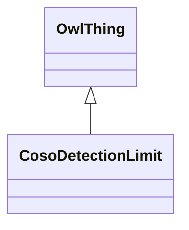

# Class: Detection Limit (coso_DetectionLimit)


_The lowest concentration of a substance that can be reliably detected as present with a reasonable degree of confidence._


URI: [coso:DetectionLimit](http://w3id.org/coso/v1/contaminoso#DetectionLimit)





## Inheritance
* [OwlThing](../classes/OwlThing.md)
    * **CosoDetectionLimit**


## Slots

| Name | Cardinality and Range | Description | Inheritance | Occurrences |
| ---  | --- | --- | --- | --- |


## Usages

| used by | used in | type | used |
| ---  | --- | --- | --- |
| [HttpW3id.orgSawgraphV1Me-egad#EGAD-AggregatePFAS-Concentration](../classes/HttpW3id.orgSawgraphV1Me-egad#EGAD-AggregatePFAS-Concentration.md) | [http___w3id.org_sawgraph_v1_me_egad#methodDetectionLimit](../slots/http___w3id.org_sawgraph_v1_me_egad#methodDetectionLimit.md) | any_of[range] | [CosoDetectionLimit](../classes/CosoDetectionLimit.md) |
| [HttpW3id.orgSawgraphV1Me-egad#EGAD-SinglePFAS-Concentration](../classes/HttpW3id.orgSawgraphV1Me-egad#EGAD-SinglePFAS-Concentration.md) | [http___w3id.org_sawgraph_v1_me_egad#methodDetectionLimit](../slots/http___w3id.org_sawgraph_v1_me_egad#methodDetectionLimit.md) | any_of[range] | [CosoDetectionLimit](../classes/CosoDetectionLimit.md) |
| [MeEgadEGAD-AggregatePFAS-Concentration](../classes/MeEgadEGAD-AggregatePFAS-Concentration.md) | [me_egad_methodDetectionLimit](../slots/me_egad_methodDetectionLimit.md) | any_of[range] | [CosoDetectionLimit](../classes/CosoDetectionLimit.md) |
| [MeEgadEGAD-SinglePFAS-Concentration](../classes/MeEgadEGAD-SinglePFAS-Concentration.md) | [me_egad_methodDetectionLimit](../slots/me_egad_methodDetectionLimit.md) | any_of[range] | [CosoDetectionLimit](../classes/CosoDetectionLimit.md) |


## LinkML Source

<!-- TODO: investigate https://stackoverflow.com/questions/37606292/how-to-create-tabbed-code-blocks-in-mkdocs-or-sphinx -->

### Direct

<details>

```yaml
name: coso_DetectionLimit
description: The lowest concentration of a substance that can be reliably detected
  as present with a reasonable degree of confidence.
title: Detection Limit
from_schema: okns:sawgraph-kg
rank: 1000
is_a: owl_Thing
class_uri: coso:DetectionLimit

```
</details>

### Induced

<details>

```yaml
name: coso_DetectionLimit
description: The lowest concentration of a substance that can be reliably detected
  as present with a reasonable degree of confidence.
title: Detection Limit
from_schema: okns:sawgraph-kg
rank: 1000
is_a: owl_Thing
class_uri: coso:DetectionLimit

```
</details>