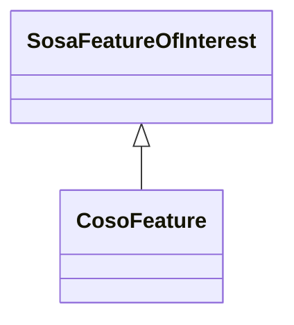

# Class: Feature (coso_Feature)


_The discrete spatial phenomenon that is the target of the observation._


URI: [coso:Feature](http://w3id.org/coso/v1/contaminoso#Feature)





## Inheritance
* [SosaFeatureOfInterest](../classes/SosaFeatureOfInterest.md)
    * **CosoFeature**


## Slots

| Name | Cardinality and Range | Description | Inheritance | Occurrences |
| ---  | --- | --- | --- | --- |


## Usages

| used by | used in | type | used |
| ---  | --- | --- | --- |
| [CosoAnimalBloodSample](../classes/CosoAnimalBloodSample.md) | [coso_isSampleOf](../slots/coso_isSampleOf.md) | any_of[range] | [CosoFeature](../classes/CosoFeature.md) |
| [CosoAnimalMaterialSample](../classes/CosoAnimalMaterialSample.md) | [coso_isSampleOf](../slots/coso_isSampleOf.md) | any_of[range] | [CosoFeature](../classes/CosoFeature.md) |
| [CosoAnimalMilkSample](../classes/CosoAnimalMilkSample.md) | [coso_isSampleOf](../slots/coso_isSampleOf.md) | any_of[range] | [CosoFeature](../classes/CosoFeature.md) |
| [CosoAnimalOrganSample](../classes/CosoAnimalOrganSample.md) | [coso_isSampleOf](../slots/coso_isSampleOf.md) | any_of[range] | [CosoFeature](../classes/CosoFeature.md) |
| [CosoAnimalTissueSample](../classes/CosoAnimalTissueSample.md) | [coso_isSampleOf](../slots/coso_isSampleOf.md) | any_of[range] | [CosoFeature](../classes/CosoFeature.md) |
| [CosoPlantMaterialSample](../classes/CosoPlantMaterialSample.md) | [coso_isSampleOf](../slots/coso_isSampleOf.md) | any_of[range] | [CosoFeature](../classes/CosoFeature.md) |
| [HttpW3id.orgSawgraphV1Me-egad#EGAD-PFAS-Observation](../classes/HttpW3id.orgSawgraphV1Me-egad#EGAD-PFAS-Observation.md) | [coso_hasFeatureOfInterest](../slots/coso_hasFeatureOfInterest.md) | any_of[range] | [CosoFeature](../classes/CosoFeature.md) |
| [HttpW3id.orgSawgraphV1Me-egad#EGAD-Sample](../classes/HttpW3id.orgSawgraphV1Me-egad#EGAD-Sample.md) | [coso_isSampleOf](../slots/coso_isSampleOf.md) | any_of[range] | [CosoFeature](../classes/CosoFeature.md) |
| [HttpW3id.orgSawgraphV1Me-egad#EGAD-SamplePoint](../classes/HttpW3id.orgSawgraphV1Me-egad#EGAD-SamplePoint.md) | [coso_pointFromFeature](../slots/coso_pointFromFeature.md) | any_of[range] | [CosoFeature](../classes/CosoFeature.md) |
| [HttpW3id.orgSawgraphV1Me-egad-data#DefEGADBeefBloodSample](../classes/HttpW3id.orgSawgraphV1Me-egad-data#DefEGADBeefBloodSample.md) | [coso_isSampleOf](../slots/coso_isSampleOf.md) | any_of[range] | [CosoFeature](../classes/CosoFeature.md) |
| [HttpW3id.orgSawgraphV1Me-egad-data#DefEGADDrinkingWaterSample](../classes/HttpW3id.orgSawgraphV1Me-egad-data#DefEGADDrinkingWaterSample.md) | [coso_isSampleOf](../slots/coso_isSampleOf.md) | any_of[range] | [CosoFeature](../classes/CosoFeature.md) |
| [HttpW3id.orgSawgraphV1Me-egad-data#DefEGADGroundWaterSample](../classes/HttpW3id.orgSawgraphV1Me-egad-data#DefEGADGroundWaterSample.md) | [coso_isSampleOf](../slots/coso_isSampleOf.md) | any_of[range] | [CosoFeature](../classes/CosoFeature.md) |
| [HttpW3id.orgSawgraphV1Me-egad-data#DefEGADPorkBloodSample](../classes/HttpW3id.orgSawgraphV1Me-egad-data#DefEGADPorkBloodSample.md) | [coso_isSampleOf](../slots/coso_isSampleOf.md) | any_of[range] | [CosoFeature](../classes/CosoFeature.md) |
| [HttpW3id.orgSawgraphV1Me-egad-data#DefEGADSoilSample](../classes/HttpW3id.orgSawgraphV1Me-egad-data#DefEGADSoilSample.md) | [coso_isSampleOf](../slots/coso_isSampleOf.md) | any_of[range] | [CosoFeature](../classes/CosoFeature.md) |
| [HttpW3id.orgSawgraphV1Me-egad-data#DefEGADSurfaceWaterSample](../classes/HttpW3id.orgSawgraphV1Me-egad-data#DefEGADSurfaceWaterSample.md) | [coso_isSampleOf](../slots/coso_isSampleOf.md) | any_of[range] | [CosoFeature](../classes/CosoFeature.md) |
| [HttpW3id.orgSawgraphV1Us-wqp#Observation](../classes/HttpW3id.orgSawgraphV1Us-wqp#Observation.md) | [coso_hasFeatureOfInterest](../slots/coso_hasFeatureOfInterest.md) | any_of[range] | [CosoFeature](../classes/CosoFeature.md) |
| [HttpW3id.orgSawgraphV1Us-wqp#Site](../classes/HttpW3id.orgSawgraphV1Us-wqp#Site.md) | [coso_pointFromFeature](../slots/coso_pointFromFeature.md) | any_of[range] | [CosoFeature](../classes/CosoFeature.md) |
| [MeEgadEGAD-PFAS-Observation](../classes/MeEgadEGAD-PFAS-Observation.md) | [coso_hasFeatureOfInterest](../slots/coso_hasFeatureOfInterest.md) | any_of[range] | [CosoFeature](../classes/CosoFeature.md) |
| [MeEgadEGAD-SamplePoint](../classes/MeEgadEGAD-SamplePoint.md) | [coso_pointFromFeature](../slots/coso_pointFromFeature.md) | any_of[range] | [CosoFeature](../classes/CosoFeature.md) |


## LinkML Source

<!-- TODO: investigate https://stackoverflow.com/questions/37606292/how-to-create-tabbed-code-blocks-in-mkdocs-or-sphinx -->

### Direct

<details>

```yaml
name: coso_Feature
description: The discrete spatial phenomenon that is the target of the observation.
title: Feature
from_schema: okns:sawgraph-kg
rank: 1000
is_a: sosa_FeatureOfInterest
class_uri: coso:Feature

```
</details>

### Induced

<details>

```yaml
name: coso_Feature
description: The discrete spatial phenomenon that is the target of the observation.
title: Feature
from_schema: okns:sawgraph-kg
rank: 1000
is_a: sosa_FeatureOfInterest
class_uri: coso:Feature

```
</details>