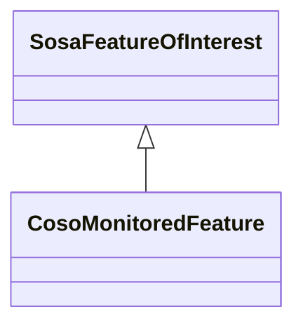

# Class: Monitored Feature (coso_MonitoredFeature)


_The discrete spatial phenomenon that is the target of a release observation due to environmental monitoring._


URI: [coso:MonitoredFeature](http://w3id.org/coso/v1/contaminoso#MonitoredFeature)





## Inheritance
* [SosaFeatureOfInterest](../classes/SosaFeatureOfInterest.md)
    * **CosoMonitoredFeature**


## Slots

| Name | Cardinality and Range | Description | Inheritance | Occurrences |
| ---  | --- | --- | --- | --- |


## LinkML Source

<!-- TODO: investigate https://stackoverflow.com/questions/37606292/how-to-create-tabbed-code-blocks-in-mkdocs-or-sphinx -->

### Direct

<details>

```yaml
name: coso_MonitoredFeature
description: The discrete spatial phenomenon that is the target of a release observation
  due to environmental monitoring.
title: Monitored Feature
from_schema: okns:sawgraph-kg
rank: 1000
is_a: sosa_FeatureOfInterest
class_uri: coso:MonitoredFeature

```
</details>

### Induced

<details>

```yaml
name: coso_MonitoredFeature
description: The discrete spatial phenomenon that is the target of a release observation
  due to environmental monitoring.
title: Monitored Feature
from_schema: okns:sawgraph-kg
rank: 1000
is_a: sosa_FeatureOfInterest
class_uri: coso:MonitoredFeature

```
</details>