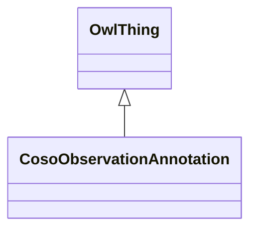

# Class: Observation Annotation (coso_ObservationAnnotation)


_Metadata that qualifies an observation_


URI: [coso:ObservationAnnotation](http://w3id.org/coso/v1/contaminoso#ObservationAnnotation)





## Inheritance
* [OwlThing](../classes/OwlThing.md)
    * **CosoObservationAnnotation**


## Slots

| Name | Cardinality and Range | Description | Inheritance | Occurrences |
| ---  | --- | --- | --- | --- |


## Usages

| used by | used in | type | used |
| ---  | --- | --- | --- |
| [HttpW3id.orgSawgraphV1Me-egad#EGAD-PFAS-Observation](../classes/HttpW3id.orgSawgraphV1Me-egad#EGAD-PFAS-Observation.md) | [http___w3id.org_sawgraph_v1_me_egad#resultType](../slots/http___w3id.org_sawgraph_v1_me_egad#resultType.md) | any_of[range] | [CosoObservationAnnotation](../classes/CosoObservationAnnotation.md) |
| [HttpW3id.orgSawgraphV1Me-egad#EGAD-PFAS-Observation](../classes/HttpW3id.orgSawgraphV1Me-egad#EGAD-PFAS-Observation.md) | [coso_observationAnnotation](../slots/coso_observationAnnotation.md) | any_of[range] | [CosoObservationAnnotation](../classes/CosoObservationAnnotation.md) |
| [MeEgadEGAD-PFAS-Observation](../classes/MeEgadEGAD-PFAS-Observation.md) | [me_egad_resultType](../slots/me_egad_resultType.md) | any_of[range] | [CosoObservationAnnotation](../classes/CosoObservationAnnotation.md) |
| [MeEgadEGAD-PFAS-Observation](../classes/MeEgadEGAD-PFAS-Observation.md) | [coso_observationAnnotation](../slots/coso_observationAnnotation.md) | any_of[range] | [CosoObservationAnnotation](../classes/CosoObservationAnnotation.md) |


## LinkML Source

<!-- TODO: investigate https://stackoverflow.com/questions/37606292/how-to-create-tabbed-code-blocks-in-mkdocs-or-sphinx -->

### Direct

<details>

```yaml
name: coso_ObservationAnnotation
description: Metadata that qualifies an observation
title: Observation Annotation
from_schema: okns:sawgraph-kg
rank: 1000
is_a: owl_Thing
class_uri: coso:ObservationAnnotation

```
</details>

### Induced

<details>

```yaml
name: coso_ObservationAnnotation
description: Metadata that qualifies an observation
title: Observation Annotation
from_schema: okns:sawgraph-kg
rank: 1000
is_a: owl_Thing
class_uri: coso:ObservationAnnotation

```
</details>