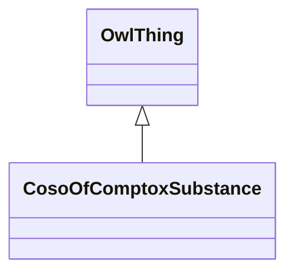

# Class: of Comptox Substance (coso_ofComptoxSubstance)


_A relation between an entity and a chemical substance as identified by Comptox_


URI: [coso:ofComptoxSubstance](http://w3id.org/coso/v1/contaminoso#ofComptoxSubstance)





## Inheritance
* [OwlThing](../classes/OwlThing.md)
    * **CosoOfComptoxSubstance**


## Slots

| Name | Cardinality and Range | Description | Inheritance | Occurrences |
| ---  | --- | --- | --- | --- |


## LinkML Source

<!-- TODO: investigate https://stackoverflow.com/questions/37606292/how-to-create-tabbed-code-blocks-in-mkdocs-or-sphinx -->

### Direct

<details>

```yaml
name: coso_ofComptoxSubstance
description: A relation between an entity and a chemical substance as identified by
  Comptox
title: of Comptox Substance
from_schema: okns:sawgraph-kg
rank: 1000
is_a: owl_Thing
class_uri: coso:ofComptoxSubstance

```
</details>

### Induced

<details>

```yaml
name: coso_ofComptoxSubstance
description: A relation between an entity and a chemical substance as identified by
  Comptox
title: of Comptox Substance
from_schema: okns:sawgraph-kg
rank: 1000
is_a: owl_Thing
class_uri: coso:ofComptoxSubstance

```
</details>