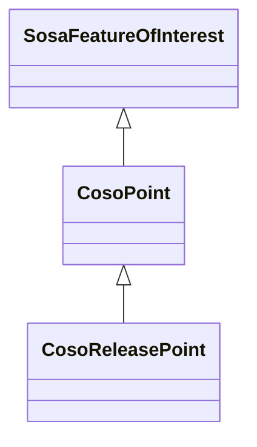

# Class: Point (coso_Point)


_No class (type) description specified_


URI: [coso:Point](http://w3id.org/coso/v1/contaminoso#Point)





## Inheritance
* [SosaFeatureOfInterest](../classes/SosaFeatureOfInterest.md)
    * **CosoPoint**
        * [CosoReleasePoint](../classes/CosoReleasePoint.md)


## Slots

| Name | Cardinality and Range | Description | Inheritance | Occurrences |
| ---  | --- | --- | --- | --- |


## Usages

| used by | used in | type | used |
| ---  | --- | --- | --- |
| [MeEgadEGAD-SamplePoint](../classes/MeEgadEGAD-SamplePoint.md) | [coso_pointFromFeature](../slots/coso_pointFromFeature.md) | domain | [CosoPoint](../classes/CosoPoint.md) |


## LinkML Source

<!-- TODO: investigate https://stackoverflow.com/questions/37606292/how-to-create-tabbed-code-blocks-in-mkdocs-or-sphinx -->

### Direct

<details>

```yaml
name: coso_Point
conforms_to: No schema conformance document specified
description: No class (type) description specified
title: Point
from_schema: sawgraph-kg
rank: 1000
is_a: sosa_FeatureOfInterest
class_uri: coso:Point

```
</details>

### Induced

<details>

```yaml
name: coso_Point
conforms_to: No schema conformance document specified
description: No class (type) description specified
title: Point
from_schema: sawgraph-kg
rank: 1000
is_a: sosa_FeatureOfInterest
class_uri: coso:Point

```
</details>