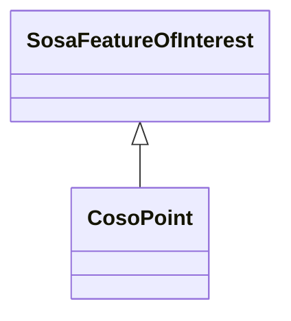

# Class: Point (coso_Point)


_The point location at which an observation occurred._


URI: [coso:Point](http://w3id.org/coso/v1/contaminoso#Point)





## Inheritance
* [SosaFeatureOfInterest](../classes/SosaFeatureOfInterest.md)
    * **CosoPoint**


## Slots

| Name | Cardinality and Range | Description | Inheritance | Occurrences |
| ---  | --- | --- | --- | --- |


## Usages

| used by | used in | type | used |
| ---  | --- | --- | --- |
| [CosoAnimalBloodSample](../classes/CosoAnimalBloodSample.md) | [coso_fromSamplePoint](../slots/coso_fromSamplePoint.md) | any_of[range] | [CosoPoint](../classes/CosoPoint.md) |
| [CosoAnimalMaterialSample](../classes/CosoAnimalMaterialSample.md) | [coso_fromSamplePoint](../slots/coso_fromSamplePoint.md) | any_of[range] | [CosoPoint](../classes/CosoPoint.md) |
| [CosoAnimalMilkSample](../classes/CosoAnimalMilkSample.md) | [coso_fromSamplePoint](../slots/coso_fromSamplePoint.md) | any_of[range] | [CosoPoint](../classes/CosoPoint.md) |
| [CosoAnimalOrganSample](../classes/CosoAnimalOrganSample.md) | [coso_fromSamplePoint](../slots/coso_fromSamplePoint.md) | any_of[range] | [CosoPoint](../classes/CosoPoint.md) |
| [CosoAnimalTissueSample](../classes/CosoAnimalTissueSample.md) | [coso_fromSamplePoint](../slots/coso_fromSamplePoint.md) | any_of[range] | [CosoPoint](../classes/CosoPoint.md) |
| [CosoPlantMaterialSample](../classes/CosoPlantMaterialSample.md) | [coso_fromSamplePoint](../slots/coso_fromSamplePoint.md) | any_of[range] | [CosoPoint](../classes/CosoPoint.md) |
| [HttpW3id.orgSawgraphV1Me-egad#EGAD-PFAS-Observation](../classes/HttpW3id.orgSawgraphV1Me-egad#EGAD-PFAS-Observation.md) | [coso_observedAtSamplePoint](../slots/coso_observedAtSamplePoint.md) | any_of[range] | [CosoPoint](../classes/CosoPoint.md) |
| [HttpW3id.orgSawgraphV1Me-egad#EGAD-PFAS-Observation](../classes/HttpW3id.orgSawgraphV1Me-egad#EGAD-PFAS-Observation.md) | [coso_observedAtPoint](../slots/coso_observedAtPoint.md) | any_of[range] | [CosoPoint](../classes/CosoPoint.md) |
| [HttpW3id.orgSawgraphV1Me-egad#EGAD-Sample](../classes/HttpW3id.orgSawgraphV1Me-egad#EGAD-Sample.md) | [coso_fromSamplePoint](../slots/coso_fromSamplePoint.md) | any_of[range] | [CosoPoint](../classes/CosoPoint.md) |
| [HttpW3id.orgSawgraphV1Me-egad-data#DefEGADBeefBloodSample](../classes/HttpW3id.orgSawgraphV1Me-egad-data#DefEGADBeefBloodSample.md) | [coso_fromSamplePoint](../slots/coso_fromSamplePoint.md) | any_of[range] | [CosoPoint](../classes/CosoPoint.md) |
| [HttpW3id.orgSawgraphV1Me-egad-data#DefEGADDrinkingWaterSample](../classes/HttpW3id.orgSawgraphV1Me-egad-data#DefEGADDrinkingWaterSample.md) | [coso_fromSamplePoint](../slots/coso_fromSamplePoint.md) | any_of[range] | [CosoPoint](../classes/CosoPoint.md) |
| [HttpW3id.orgSawgraphV1Me-egad-data#DefEGADGroundWaterSample](../classes/HttpW3id.orgSawgraphV1Me-egad-data#DefEGADGroundWaterSample.md) | [coso_fromSamplePoint](../slots/coso_fromSamplePoint.md) | any_of[range] | [CosoPoint](../classes/CosoPoint.md) |
| [HttpW3id.orgSawgraphV1Me-egad-data#DefEGADPorkBloodSample](../classes/HttpW3id.orgSawgraphV1Me-egad-data#DefEGADPorkBloodSample.md) | [coso_fromSamplePoint](../slots/coso_fromSamplePoint.md) | any_of[range] | [CosoPoint](../classes/CosoPoint.md) |
| [HttpW3id.orgSawgraphV1Me-egad-data#DefEGADSoilSample](../classes/HttpW3id.orgSawgraphV1Me-egad-data#DefEGADSoilSample.md) | [coso_fromSamplePoint](../slots/coso_fromSamplePoint.md) | any_of[range] | [CosoPoint](../classes/CosoPoint.md) |
| [HttpW3id.orgSawgraphV1Me-egad-data#DefEGADSurfaceWaterSample](../classes/HttpW3id.orgSawgraphV1Me-egad-data#DefEGADSurfaceWaterSample.md) | [coso_fromSamplePoint](../slots/coso_fromSamplePoint.md) | any_of[range] | [CosoPoint](../classes/CosoPoint.md) |
| [HttpW3id.orgSawgraphV1Us-wqp#Observation](../classes/HttpW3id.orgSawgraphV1Us-wqp#Observation.md) | [coso_observedAtSamplePoint](../slots/coso_observedAtSamplePoint.md) | any_of[range] | [CosoPoint](../classes/CosoPoint.md) |
| [HttpW3id.orgSawgraphV1Us-wqp#Sample](../classes/HttpW3id.orgSawgraphV1Us-wqp#Sample.md) | [coso_fromSamplePoint](../slots/coso_fromSamplePoint.md) | any_of[range] | [CosoPoint](../classes/CosoPoint.md) |
| [MeEgadEGAD-PFAS-Observation](../classes/MeEgadEGAD-PFAS-Observation.md) | [coso_observedAtSamplePoint](../slots/coso_observedAtSamplePoint.md) | any_of[range] | [CosoPoint](../classes/CosoPoint.md) |
| [MeEgadEGAD-PFAS-Observation](../classes/MeEgadEGAD-PFAS-Observation.md) | [coso_observedAtPoint](../slots/coso_observedAtPoint.md) | any_of[range] | [CosoPoint](../classes/CosoPoint.md) |
| [MeEgadEGAD-Sample](../classes/MeEgadEGAD-Sample.md) | [coso_fromSamplePoint](../slots/coso_fromSamplePoint.md) | any_of[range] | [CosoPoint](../classes/CosoPoint.md) |


## LinkML Source

<!-- TODO: investigate https://stackoverflow.com/questions/37606292/how-to-create-tabbed-code-blocks-in-mkdocs-or-sphinx -->

### Direct

<details>

```yaml
name: coso_Point
description: The point location at which an observation occurred.
title: Point
from_schema: okns:sawgraph-kg
rank: 1000
is_a: sosa_FeatureOfInterest
class_uri: coso:Point

```
</details>

### Induced

<details>

```yaml
name: coso_Point
description: The point location at which an observation occurred.
title: Point
from_schema: okns:sawgraph-kg
rank: 1000
is_a: sosa_FeatureOfInterest
class_uri: coso:Point

```
</details>