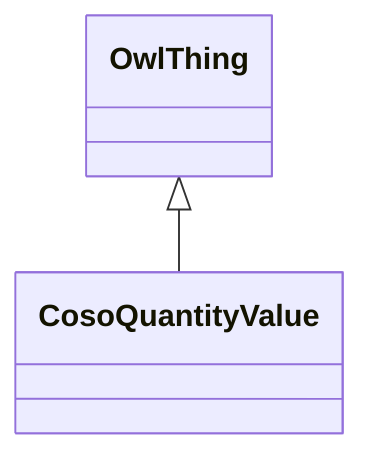

# Class: Quantity Value (coso_QuantityValue)


_A Quantity Value expresses the magnitude and kind of a quantity as a product of a numerical value or enumerated value and a unit of measure._


URI: [coso:QuantityValue](http://w3id.org/coso/v1/contaminoso#QuantityValue)





## Inheritance
* [OwlThing](../classes/OwlThing.md)
    * **CosoQuantityValue**


## Slots

| Name | Cardinality and Range | Description | Inheritance | Occurrences |
| ---  | --- | --- | --- | --- |


## LinkML Source

<!-- TODO: investigate https://stackoverflow.com/questions/37606292/how-to-create-tabbed-code-blocks-in-mkdocs-or-sphinx -->

### Direct

<details>

```yaml
name: coso_QuantityValue
description: A Quantity Value expresses the magnitude and kind of a quantity as a
  product of a numerical value or enumerated value and a unit of measure.
title: Quantity Value
from_schema: okns:sawgraph-kg
rank: 1000
is_a: owl_Thing
class_uri: coso:QuantityValue

```
</details>

### Induced

<details>

```yaml
name: coso_QuantityValue
description: A Quantity Value expresses the magnitude and kind of a quantity as a
  product of a numerical value or enumerated value and a unit of measure.
title: Quantity Value
from_schema: okns:sawgraph-kg
rank: 1000
is_a: owl_Thing
class_uri: coso:QuantityValue

```
</details>