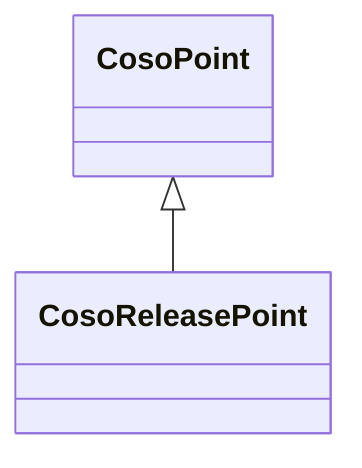

# Class: Release Point (coso_ReleasePoint)


_No class (type) description specified_


URI: [coso:ReleasePoint](http://w3id.org/coso/v1/contaminoso#ReleasePoint)





## Inheritance
* [SosaFeatureOfInterest](../classes/SosaFeatureOfInterest.md)
    * [CosoPoint](../classes/CosoPoint.md)
        * **CosoReleasePoint**


## Slots

| Name | Cardinality and Range | Description | Inheritance | Occurrences |
| ---  | --- | --- | --- | --- |


## LinkML Source

<!-- TODO: investigate https://stackoverflow.com/questions/37606292/how-to-create-tabbed-code-blocks-in-mkdocs-or-sphinx -->

### Direct

<details>

```yaml
name: coso_ReleasePoint
conforms_to: No schema conformance document specified
description: No class (type) description specified
title: Release Point
from_schema: sawgraph-kg
rank: 1000
is_a: coso_Point
class_uri: coso:ReleasePoint

```
</details>

### Induced

<details>

```yaml
name: coso_ReleasePoint
conforms_to: No schema conformance document specified
description: No class (type) description specified
title: Release Point
from_schema: sawgraph-kg
rank: 1000
is_a: coso_Point
class_uri: coso:ReleasePoint

```
</details>