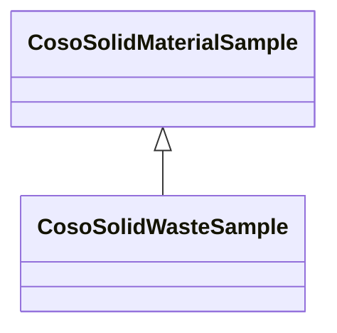

# Class: Solid Waste Sample (coso_SolidWasteSample)


URI: [coso:SolidWasteSample](http://w3id.org/coso/v1/contaminoso#SolidWasteSample)





## Inheritance
* [OwlThing](../classes/OwlThing.md)
    * [SosaSample](../classes/SosaSample.md)
        * [CosoMaterialSample](../classes/CosoMaterialSample.md)
            * [CosoSolidMaterialSample](../classes/CosoSolidMaterialSample.md)
                * **CosoSolidWasteSample**


## Slots

| Name | Cardinality and Range | Description | Inheritance | Occurrences |
| ---  | --- | --- | --- | --- |


## LinkML Source

<!-- TODO: investigate https://stackoverflow.com/questions/37606292/how-to-create-tabbed-code-blocks-in-mkdocs-or-sphinx -->

### Direct

<details>

```yaml
name: coso_SolidWasteSample
title: Solid Waste Sample
from_schema: okns:sawgraph-kg
rank: 1000
is_a: coso_SolidMaterialSample
class_uri: coso:SolidWasteSample

```
</details>

### Induced

<details>

```yaml
name: coso_SolidWasteSample
title: Solid Waste Sample
from_schema: okns:sawgraph-kg
rank: 1000
is_a: coso_SolidMaterialSample
class_uri: coso:SolidWasteSample

```
</details>