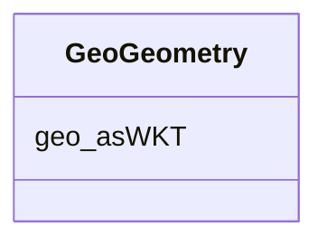

# Class: No class (type) name specified (geo_Geometry)


_No class (type) description specified_


This class occurs 6236 times.


URI: [geo:Geometry](http://www.opengis.net/ont/geosparql#Geometry)





<!-- no inheritance hierarchy -->


## Slots

| Name | Cardinality and Range | Description | Inheritance | Occurrences |
| ---  | --- | --- | --- | --- |
| [geo_asWKT](../slots/geo_asWKT.md) | 0..1 <br/> [GeoWktLiteral](../types/GeoWktLiteral.md) | No slot (predicate) description specified <br/>  | direct |  |


## Usages

| used by | used in | type | used |
| ---  | --- | --- | --- |
| [MeEgadEGAD-PFAS-Site](../classes/MeEgadEGAD-PFAS-Site.md) | [geo_hasGeometry](../slots/geo_hasGeometry.md) | any_of[range] | [GeoGeometry](../classes/GeoGeometry.md) |
| [MeEgadEGAD-PFAS-Site](../classes/MeEgadEGAD-PFAS-Site.md) | [geo_hasDefaultGeometry](../slots/geo_hasDefaultGeometry.md) | any_of[range] | [GeoGeometry](../classes/GeoGeometry.md) |
| [MeEgadEGAD-SamplePoint](../classes/MeEgadEGAD-SamplePoint.md) | [geo_hasGeometry](../slots/geo_hasGeometry.md) | any_of[range] | [GeoGeometry](../classes/GeoGeometry.md) |
| [MeEgadEGAD-SamplePoint](../classes/MeEgadEGAD-SamplePoint.md) | [geo_hasDefaultGeometry](../slots/geo_hasDefaultGeometry.md) | any_of[range] | [GeoGeometry](../classes/GeoGeometry.md) |
| [MeEgadEGAD-Site](../classes/MeEgadEGAD-Site.md) | [geo_hasGeometry](../slots/geo_hasGeometry.md) | any_of[range] | [GeoGeometry](../classes/GeoGeometry.md) |
| [MeEgadEGAD-Site](../classes/MeEgadEGAD-Site.md) | [geo_hasDefaultGeometry](../slots/geo_hasDefaultGeometry.md) | any_of[range] | [GeoGeometry](../classes/GeoGeometry.md) |


## LinkML Source

<!-- TODO: investigate https://stackoverflow.com/questions/37606292/how-to-create-tabbed-code-blocks-in-mkdocs-or-sphinx -->

### Direct

<details>

```yaml
name: geo_Geometry
conforms_to: No schema conformance document specified
annotations:
  count:
    tag: count
    value: 6236
description: No class (type) description specified
title: No class (type) name specified
from_schema: sawgraph-kg
rank: 1000
slots:
- geo_asWKT
class_uri: geo:Geometry

```
</details>

### Induced

<details>

```yaml
name: geo_Geometry
conforms_to: No schema conformance document specified
annotations:
  count:
    tag: count
    value: 6236
description: No class (type) description specified
title: No class (type) name specified
from_schema: sawgraph-kg
rank: 1000
attributes:
  geo_asWKT:
    name: geo_asWKT
    annotations:
      count:
        tag: count
        value: 6236
    description: No slot (predicate) description specified
    examples:
    - object:
        example_object: POINT (-68.83827616 44.79828519)
        example_object_type: geo_wktLiteral
        example_predicate: geo:asWKT
        example_subject: me_egad_data:egad.site.geometry.100843
        example_subject_type: sf_#Point
    from_schema: sawgraph-kg
    rank: 1000
    slot_uri: geo:asWKT
    alias: geo_asWKT
    owner: geo_Geometry
    domain_of:
    - geo_Geometry
    - sf_#Point
    range: geo_wktLiteral
class_uri: geo:Geometry

```
</details>