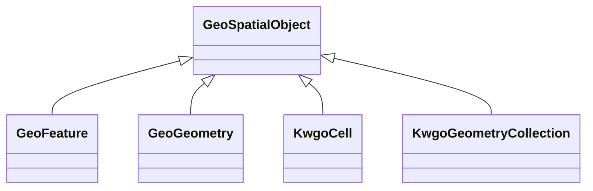

# Class: No class (entity type) name specified -- this class is noted as a superclass of another class in this graph but has not itself been defined. (geo_SpatialObject)


_Anything spatial (being or having a shape, position or an extent)._


This class occurs 8 times.


URI: [geo:SpatialObject](http://www.opengis.net/ont/geosparql#SpatialObject)





## Inheritance
* **GeoSpatialObject**
    * [GeoFeature](../classes/GeoFeature.md)
    * [GeoGeometry](../classes/GeoGeometry.md)
    * [KwgoCell](../classes/KwgoCell.md)
    * [KwgoGeometryCollection](../classes/KwgoGeometryCollection.md)


## Slots

| Name | Cardinality and Range | Description | Inheritance | Occurrences |
| ---  | --- | --- | --- | --- |


## Usages

| used by | used in | type | used |
| ---  | --- | --- | --- |
| [CosoAnimalBloodSample](../classes/CosoAnimalBloodSample.md) | [coso_isSampleOf](../slots/coso_isSampleOf.md) | any_of[range] | [GeoSpatialObject](../classes/GeoSpatialObject.md) |
| [CosoAnimalBloodSample](../classes/CosoAnimalBloodSample.md) | [coso_fromSamplePoint](../slots/coso_fromSamplePoint.md) | any_of[range] | [GeoSpatialObject](../classes/GeoSpatialObject.md) |
| [CosoAnimalMaterialSample](../classes/CosoAnimalMaterialSample.md) | [coso_isSampleOf](../slots/coso_isSampleOf.md) | any_of[range] | [GeoSpatialObject](../classes/GeoSpatialObject.md) |
| [CosoAnimalMaterialSample](../classes/CosoAnimalMaterialSample.md) | [coso_fromSamplePoint](../slots/coso_fromSamplePoint.md) | any_of[range] | [GeoSpatialObject](../classes/GeoSpatialObject.md) |
| [CosoAnimalMilkSample](../classes/CosoAnimalMilkSample.md) | [coso_isSampleOf](../slots/coso_isSampleOf.md) | any_of[range] | [GeoSpatialObject](../classes/GeoSpatialObject.md) |
| [CosoAnimalMilkSample](../classes/CosoAnimalMilkSample.md) | [coso_fromSamplePoint](../slots/coso_fromSamplePoint.md) | any_of[range] | [GeoSpatialObject](../classes/GeoSpatialObject.md) |
| [CosoAnimalOrganSample](../classes/CosoAnimalOrganSample.md) | [coso_isSampleOf](../slots/coso_isSampleOf.md) | any_of[range] | [GeoSpatialObject](../classes/GeoSpatialObject.md) |
| [CosoAnimalOrganSample](../classes/CosoAnimalOrganSample.md) | [coso_fromSamplePoint](../slots/coso_fromSamplePoint.md) | any_of[range] | [GeoSpatialObject](../classes/GeoSpatialObject.md) |
| [CosoAnimalTissueSample](../classes/CosoAnimalTissueSample.md) | [coso_isSampleOf](../slots/coso_isSampleOf.md) | any_of[range] | [GeoSpatialObject](../classes/GeoSpatialObject.md) |
| [CosoAnimalTissueSample](../classes/CosoAnimalTissueSample.md) | [coso_fromSamplePoint](../slots/coso_fromSamplePoint.md) | any_of[range] | [GeoSpatialObject](../classes/GeoSpatialObject.md) |
| [CosoPlantMaterialSample](../classes/CosoPlantMaterialSample.md) | [coso_isSampleOf](../slots/coso_isSampleOf.md) | any_of[range] | [GeoSpatialObject](../classes/GeoSpatialObject.md) |
| [CosoPlantMaterialSample](../classes/CosoPlantMaterialSample.md) | [coso_fromSamplePoint](../slots/coso_fromSamplePoint.md) | any_of[range] | [GeoSpatialObject](../classes/GeoSpatialObject.md) |
| [HttpW3id.orgSawgraphV1Me-egad#EGAD-PFAS-Observation](../classes/HttpW3id.orgSawgraphV1Me-egad#EGAD-PFAS-Observation.md) | [coso_observedAtSamplePoint](../slots/coso_observedAtSamplePoint.md) | any_of[range] | [GeoSpatialObject](../classes/GeoSpatialObject.md) |
| [HttpW3id.orgSawgraphV1Me-egad#EGAD-PFAS-Observation](../classes/HttpW3id.orgSawgraphV1Me-egad#EGAD-PFAS-Observation.md) | [coso_observedAtPoint](../slots/coso_observedAtPoint.md) | any_of[range] | [GeoSpatialObject](../classes/GeoSpatialObject.md) |
| [HttpW3id.orgSawgraphV1Me-egad#EGAD-PFAS-Observation](../classes/HttpW3id.orgSawgraphV1Me-egad#EGAD-PFAS-Observation.md) | [coso_hasFeatureOfInterest](../slots/coso_hasFeatureOfInterest.md) | any_of[range] | [GeoSpatialObject](../classes/GeoSpatialObject.md) |
| [HttpW3id.orgSawgraphV1Me-egad#EGAD-PFAS-Site](../classes/HttpW3id.orgSawgraphV1Me-egad#EGAD-PFAS-Site.md) | [spatial_spatiallyRelatedTo](../slots/spatial_spatiallyRelatedTo.md) | any_of[range] | [GeoSpatialObject](../classes/GeoSpatialObject.md) |
| [HttpW3id.orgSawgraphV1Me-egad#EGAD-PFAS-Site](../classes/HttpW3id.orgSawgraphV1Me-egad#EGAD-PFAS-Site.md) | [spatial_connectedTo](../slots/spatial_connectedTo.md) | any_of[range] | [GeoSpatialObject](../classes/GeoSpatialObject.md) |
| [HttpW3id.orgSawgraphV1Me-egad#EGAD-Sample](../classes/HttpW3id.orgSawgraphV1Me-egad#EGAD-Sample.md) | [coso_isSampleOf](../slots/coso_isSampleOf.md) | any_of[range] | [GeoSpatialObject](../classes/GeoSpatialObject.md) |
| [HttpW3id.orgSawgraphV1Me-egad#EGAD-Sample](../classes/HttpW3id.orgSawgraphV1Me-egad#EGAD-Sample.md) | [coso_fromSamplePoint](../slots/coso_fromSamplePoint.md) | any_of[range] | [GeoSpatialObject](../classes/GeoSpatialObject.md) |
| [HttpW3id.orgSawgraphV1Me-egad#EGAD-SamplePoint](../classes/HttpW3id.orgSawgraphV1Me-egad#EGAD-SamplePoint.md) | [coso_pointFromFeature](../slots/coso_pointFromFeature.md) | any_of[range] | [GeoSpatialObject](../classes/GeoSpatialObject.md) |
| [HttpW3id.orgSawgraphV1Me-egad#EGAD-SamplePoint](../classes/HttpW3id.orgSawgraphV1Me-egad#EGAD-SamplePoint.md) | [spatial_spatiallyRelatedTo](../slots/spatial_spatiallyRelatedTo.md) | any_of[range] | [GeoSpatialObject](../classes/GeoSpatialObject.md) |
| [HttpW3id.orgSawgraphV1Me-egad#EGAD-SamplePoint](../classes/HttpW3id.orgSawgraphV1Me-egad#EGAD-SamplePoint.md) | [spatial_connectedTo](../slots/spatial_connectedTo.md) | any_of[range] | [GeoSpatialObject](../classes/GeoSpatialObject.md) |
| [HttpW3id.orgSawgraphV1Me-egad-data#DefEGADBeefBloodSample](../classes/HttpW3id.orgSawgraphV1Me-egad-data#DefEGADBeefBloodSample.md) | [coso_isSampleOf](../slots/coso_isSampleOf.md) | any_of[range] | [GeoSpatialObject](../classes/GeoSpatialObject.md) |
| [HttpW3id.orgSawgraphV1Me-egad-data#DefEGADBeefBloodSample](../classes/HttpW3id.orgSawgraphV1Me-egad-data#DefEGADBeefBloodSample.md) | [coso_fromSamplePoint](../slots/coso_fromSamplePoint.md) | any_of[range] | [GeoSpatialObject](../classes/GeoSpatialObject.md) |
| [HttpW3id.orgSawgraphV1Me-egad-data#DefEGADDrinkingWaterSample](../classes/HttpW3id.orgSawgraphV1Me-egad-data#DefEGADDrinkingWaterSample.md) | [coso_isSampleOf](../slots/coso_isSampleOf.md) | any_of[range] | [GeoSpatialObject](../classes/GeoSpatialObject.md) |
| [HttpW3id.orgSawgraphV1Me-egad-data#DefEGADDrinkingWaterSample](../classes/HttpW3id.orgSawgraphV1Me-egad-data#DefEGADDrinkingWaterSample.md) | [coso_fromSamplePoint](../slots/coso_fromSamplePoint.md) | any_of[range] | [GeoSpatialObject](../classes/GeoSpatialObject.md) |
| [HttpW3id.orgSawgraphV1Me-egad-data#DefEGADGroundWaterSample](../classes/HttpW3id.orgSawgraphV1Me-egad-data#DefEGADGroundWaterSample.md) | [coso_isSampleOf](../slots/coso_isSampleOf.md) | any_of[range] | [GeoSpatialObject](../classes/GeoSpatialObject.md) |
| [HttpW3id.orgSawgraphV1Me-egad-data#DefEGADGroundWaterSample](../classes/HttpW3id.orgSawgraphV1Me-egad-data#DefEGADGroundWaterSample.md) | [coso_fromSamplePoint](../slots/coso_fromSamplePoint.md) | any_of[range] | [GeoSpatialObject](../classes/GeoSpatialObject.md) |
| [HttpW3id.orgSawgraphV1Me-egad-data#DefEGADPorkBloodSample](../classes/HttpW3id.orgSawgraphV1Me-egad-data#DefEGADPorkBloodSample.md) | [coso_isSampleOf](../slots/coso_isSampleOf.md) | any_of[range] | [GeoSpatialObject](../classes/GeoSpatialObject.md) |
| [HttpW3id.orgSawgraphV1Me-egad-data#DefEGADPorkBloodSample](../classes/HttpW3id.orgSawgraphV1Me-egad-data#DefEGADPorkBloodSample.md) | [coso_fromSamplePoint](../slots/coso_fromSamplePoint.md) | any_of[range] | [GeoSpatialObject](../classes/GeoSpatialObject.md) |
| [HttpW3id.orgSawgraphV1Me-egad-data#DefEGADSoilSample](../classes/HttpW3id.orgSawgraphV1Me-egad-data#DefEGADSoilSample.md) | [coso_isSampleOf](../slots/coso_isSampleOf.md) | any_of[range] | [GeoSpatialObject](../classes/GeoSpatialObject.md) |
| [HttpW3id.orgSawgraphV1Me-egad-data#DefEGADSoilSample](../classes/HttpW3id.orgSawgraphV1Me-egad-data#DefEGADSoilSample.md) | [coso_fromSamplePoint](../slots/coso_fromSamplePoint.md) | any_of[range] | [GeoSpatialObject](../classes/GeoSpatialObject.md) |
| [HttpW3id.orgSawgraphV1Me-egad-data#DefEGADSurfaceWaterSample](../classes/HttpW3id.orgSawgraphV1Me-egad-data#DefEGADSurfaceWaterSample.md) | [coso_isSampleOf](../slots/coso_isSampleOf.md) | any_of[range] | [GeoSpatialObject](../classes/GeoSpatialObject.md) |
| [HttpW3id.orgSawgraphV1Me-egad-data#DefEGADSurfaceWaterSample](../classes/HttpW3id.orgSawgraphV1Me-egad-data#DefEGADSurfaceWaterSample.md) | [coso_fromSamplePoint](../slots/coso_fromSamplePoint.md) | any_of[range] | [GeoSpatialObject](../classes/GeoSpatialObject.md) |
| [HttpW3id.orgSawgraphV1Us-wqp#Observation](../classes/HttpW3id.orgSawgraphV1Us-wqp#Observation.md) | [coso_observedAtSamplePoint](../slots/coso_observedAtSamplePoint.md) | any_of[range] | [GeoSpatialObject](../classes/GeoSpatialObject.md) |
| [HttpW3id.orgSawgraphV1Us-wqp#Observation](../classes/HttpW3id.orgSawgraphV1Us-wqp#Observation.md) | [coso_hasFeatureOfInterest](../slots/coso_hasFeatureOfInterest.md) | any_of[range] | [GeoSpatialObject](../classes/GeoSpatialObject.md) |
| [HttpW3id.orgSawgraphV1Us-wqp#Sample](../classes/HttpW3id.orgSawgraphV1Us-wqp#Sample.md) | [coso_fromSamplePoint](../slots/coso_fromSamplePoint.md) | any_of[range] | [GeoSpatialObject](../classes/GeoSpatialObject.md) |
| [HttpW3id.orgSawgraphV1Us-wqp#Site](../classes/HttpW3id.orgSawgraphV1Us-wqp#Site.md) | [coso_pointFromFeature](../slots/coso_pointFromFeature.md) | any_of[range] | [GeoSpatialObject](../classes/GeoSpatialObject.md) |
| [KwgoS2CellLevel13](../classes/KwgoS2CellLevel13.md) | [spatial_spatiallyRelatedTo](../slots/spatial_spatiallyRelatedTo.md) | any_of[range] | [GeoSpatialObject](../classes/GeoSpatialObject.md) |
| [KwgoS2CellLevel13](../classes/KwgoS2CellLevel13.md) | [spatial_connectedTo](../slots/spatial_connectedTo.md) | any_of[range] | [GeoSpatialObject](../classes/GeoSpatialObject.md) |
| [MeEgadEGAD-PFAS-Observation](../classes/MeEgadEGAD-PFAS-Observation.md) | [coso_observedAtSamplePoint](../slots/coso_observedAtSamplePoint.md) | any_of[range] | [GeoSpatialObject](../classes/GeoSpatialObject.md) |
| [MeEgadEGAD-PFAS-Observation](../classes/MeEgadEGAD-PFAS-Observation.md) | [coso_observedAtPoint](../slots/coso_observedAtPoint.md) | any_of[range] | [GeoSpatialObject](../classes/GeoSpatialObject.md) |
| [MeEgadEGAD-PFAS-Observation](../classes/MeEgadEGAD-PFAS-Observation.md) | [coso_hasFeatureOfInterest](../slots/coso_hasFeatureOfInterest.md) | any_of[range] | [GeoSpatialObject](../classes/GeoSpatialObject.md) |
| [MeEgadEGAD-PFAS-Site](../classes/MeEgadEGAD-PFAS-Site.md) | [spatial_spatiallyRelatedTo](../slots/spatial_spatiallyRelatedTo.md) | any_of[range] | [GeoSpatialObject](../classes/GeoSpatialObject.md) |
| [MeEgadEGAD-PFAS-Site](../classes/MeEgadEGAD-PFAS-Site.md) | [spatial_connectedTo](../slots/spatial_connectedTo.md) | any_of[range] | [GeoSpatialObject](../classes/GeoSpatialObject.md) |
| [MeEgadEGAD-Sample](../classes/MeEgadEGAD-Sample.md) | [coso_fromSamplePoint](../slots/coso_fromSamplePoint.md) | any_of[range] | [GeoSpatialObject](../classes/GeoSpatialObject.md) |
| [MeEgadEGAD-SamplePoint](../classes/MeEgadEGAD-SamplePoint.md) | [coso_pointFromFeature](../slots/coso_pointFromFeature.md) | any_of[range] | [GeoSpatialObject](../classes/GeoSpatialObject.md) |
| [MeEgadEGAD-SamplePoint](../classes/MeEgadEGAD-SamplePoint.md) | [spatial_spatiallyRelatedTo](../slots/spatial_spatiallyRelatedTo.md) | any_of[range] | [GeoSpatialObject](../classes/GeoSpatialObject.md) |
| [MeEgadEGAD-SamplePoint](../classes/MeEgadEGAD-SamplePoint.md) | [spatial_connectedTo](../slots/spatial_connectedTo.md) | any_of[range] | [GeoSpatialObject](../classes/GeoSpatialObject.md) |


## Comments

* source: http://www.opengis.net/spec/geosparql/1.0/req/core/spatial-object-class
* source: http://www.opengis.net/ont/geosparql#
* source: http://www.opengis.net/spec/geosparql/1.1/req/core/spatial-object-class
* description: Anything spatial (being or having a shape, position or an extent).


## LinkML Source

<!-- TODO: investigate https://stackoverflow.com/questions/37606292/how-to-create-tabbed-code-blocks-in-mkdocs-or-sphinx -->

### Direct

<details>

```yaml
name: geo_SpatialObject
description: Anything spatial (being or having a shape, position or an extent).
title: No class (entity type) name specified -- this class is noted as a superclass
  of another class in this graph but has not itself been defined.
notes:
- Subclasses of this class are expected to be used for instance data.
comments:
- 'source: http://www.opengis.net/spec/geosparql/1.0/req/core/spatial-object-class'
- 'source: http://www.opengis.net/ont/geosparql#'
- 'source: http://www.opengis.net/spec/geosparql/1.1/req/core/spatial-object-class'
- 'description: Anything spatial (being or having a shape, position or an extent).'
from_schema: okns:geo
source: http://www.opengis.net/ont/geosparql#
class_uri: geo:SpatialObject

```
</details>

### Induced

<details>

```yaml
name: geo_SpatialObject
description: Anything spatial (being or having a shape, position or an extent).
title: No class (entity type) name specified -- this class is noted as a superclass
  of another class in this graph but has not itself been defined.
notes:
- Subclasses of this class are expected to be used for instance data.
comments:
- 'source: http://www.opengis.net/spec/geosparql/1.0/req/core/spatial-object-class'
- 'source: http://www.opengis.net/ont/geosparql#'
- 'source: http://www.opengis.net/spec/geosparql/1.1/req/core/spatial-object-class'
- 'description: Anything spatial (being or having a shape, position or an extent).'
from_schema: okns:geo
source: http://www.opengis.net/ont/geosparql#
class_uri: geo:SpatialObject

```
</details>