# Class: TODO -- this class is noted as a superclass of another class in this graph but has not itself been defined. (geo_SpatialObject)


_No type description provided_


URI: [geo:SpatialObject](http://www.opengis.net/ont/geosparql#SpatialObject)

```mermaid
 classDiagram
    class GeoSpatialObject
    click GeoSpatialObject href "../GeoSpatialObject"
      GeoSpatialObject <|-- ContaminosoFeature
        click ContaminosoFeature href "../ContaminosoFeature"
      GeoSpatialObject <|-- ContaminosoPoint
        click ContaminosoPoint href "../ContaminosoPoint"
      GeoSpatialObject <|-- ContaminosoReleaseFeature
        click ContaminosoReleaseFeature href "../ContaminosoReleaseFeature"
      GeoSpatialObject <|-- ContaminosoReleasePoint
        click ContaminosoReleasePoint href "../ContaminosoReleasePoint"
      GeoSpatialObject <|-- ContaminosoSamplePoint
        click ContaminosoSamplePoint href "../ContaminosoSamplePoint"
      GeoSpatialObject <|-- ContaminosoSampledFeaure
        click ContaminosoSampledFeaure href "../ContaminosoSampledFeaure"
      GeoSpatialObject <|-- GeoFeature
        click GeoFeature href "../GeoFeature"
      GeoSpatialObject <|-- GeoGeometry
        click GeoGeometry href "../GeoGeometry"
      GeoSpatialObject <|-- IlisgsISGS-Well
        click IlisgsISGS-Well href "../IlisgsISGS-Well"
      GeoSpatialObject <|-- MeegadEGAD-SamplePoint
        click MeegadEGAD-SamplePoint href "../MeegadEGAD-SamplePoint"
      GeoSpatialObject <|-- MemgsMGS-Well
        click MemgsMGS-Well href "../MemgsMGS-Well"
      GeoSpatialObject <|-- UsfrsFRS-Facility
        click UsfrsFRS-Facility href "../UsfrsFRS-Facility"
      GeoSpatialObject <|-- UssdwisCombinedDistributionSystem
        click UssdwisCombinedDistributionSystem href "../UssdwisCombinedDistributionSystem"
      GeoSpatialObject <|-- UssdwisPWS-SamplePoint
        click UssdwisPWS-SamplePoint href "../UssdwisPWS-SamplePoint"
      GeoSpatialObject <|-- UssdwisPublicWaterSystem
        click UssdwisPublicWaterSystem href "../UssdwisPublicWaterSystem"
      GeoSpatialObject <|-- UssdwisPublicWaterSystem-CWS
        click UssdwisPublicWaterSystem-CWS href "../UssdwisPublicWaterSystem-CWS"
      GeoSpatialObject <|-- UssdwisPublicWaterSystem-GW
        click UssdwisPublicWaterSystem-GW href "../UssdwisPublicWaterSystem-GW"
      GeoSpatialObject <|-- UssdwisPublicWaterSystem-NTNCWS
        click UssdwisPublicWaterSystem-NTNCWS href "../UssdwisPublicWaterSystem-NTNCWS"
      GeoSpatialObject <|-- UssdwisPublicWaterSystem-SW
        click UssdwisPublicWaterSystem-SW href "../UssdwisPublicWaterSystem-SW"
      GeoSpatialObject <|-- UssdwisPublicWaterSystem-TNCWS
        click UssdwisPublicWaterSystem-TNCWS href "../UssdwisPublicWaterSystem-TNCWS"
      
      GeoSpatialObject : geo_hasSerialization
        
          
    
    
    GeoSpatialObject --> "0..1" GeoWktLiteral : geo_hasSerialization
    click GeoWktLiteral href "../GeoWktLiteral"

        
      
```





## Inheritance
* **GeoSpatialObject**
    * [ContaminosoFeature](../classes/ContaminosoFeature.md)
    * [ContaminosoPoint](../classes/ContaminosoPoint.md)
    * [ContaminosoReleaseFeature](../classes/ContaminosoReleaseFeature.md)
    * [ContaminosoReleasePoint](../classes/ContaminosoReleasePoint.md)
    * [ContaminosoSamplePoint](../classes/ContaminosoSamplePoint.md)
    * [ContaminosoSampledFeaure](../classes/ContaminosoSampledFeaure.md)
    * [GeoFeature](../classes/GeoFeature.md)
    * [GeoGeometry](../classes/GeoGeometry.md)
    * [IlisgsISGS-Well](../classes/IlisgsISGS-Well.md)
    * [MeegadEGAD-SamplePoint](../classes/MeegadEGAD-SamplePoint.md)
    * [MemgsMGS-Well](../classes/MemgsMGS-Well.md)
    * [UsfrsFRS-Facility](../classes/UsfrsFRS-Facility.md)
    * [UssdwisCombinedDistributionSystem](../classes/UssdwisCombinedDistributionSystem.md)
    * [UssdwisPWS-SamplePoint](../classes/UssdwisPWS-SamplePoint.md)
    * [UssdwisPublicWaterSystem](../classes/UssdwisPublicWaterSystem.md)
    * [UssdwisPublicWaterSystem-CWS](../classes/UssdwisPublicWaterSystem-CWS.md)
    * [UssdwisPublicWaterSystem-GW](../classes/UssdwisPublicWaterSystem-GW.md)
    * [UssdwisPublicWaterSystem-NTNCWS](../classes/UssdwisPublicWaterSystem-NTNCWS.md)
    * [UssdwisPublicWaterSystem-SW](../classes/UssdwisPublicWaterSystem-SW.md)
    * [UssdwisPublicWaterSystem-TNCWS](../classes/UssdwisPublicWaterSystem-TNCWS.md)


## Slots

| Name | Cardinality and Range | Description | Inheritance |
| ---  | --- | --- | --- |
| [geo_hasSerialization](../slots/geo_hasSerialization.md) | 0..1 <br/> [GeoWktLiteral](../classes/GeoWktLiteral.md) | No slot description provided | direct |


## Usages

| used by | used in | type | used |
| ---  | --- | --- | --- |
| [ContaminosoFeature](../classes/ContaminosoFeature.md) | [geo_hasGeometry](../slots/geo_hasGeometry.md) | any_of[range] | [GeoSpatialObject](../classes/GeoSpatialObject.md) |
| [ContaminosoPoint](../classes/ContaminosoPoint.md) | [geo_hasGeometry](../slots/geo_hasGeometry.md) | any_of[range] | [GeoSpatialObject](../classes/GeoSpatialObject.md) |
| [MeegadEGAD-Site](../classes/MeegadEGAD-Site.md) | [geo_hasGeometry](../slots/geo_hasGeometry.md) | any_of[range] | [GeoSpatialObject](../classes/GeoSpatialObject.md) |


## TODOs

* TODO -- Todos for this class go here
* or you can delete the todos
* if you think the class is perfect.

## Identifier and Mapping Information


### Schema Source


* from schema: sawgraph-kg


## Mappings

| Mapping Type | Mapped Value |
| ---  | ---  |
| self | geo:SpatialObject |
| native | sawgraph-kg/:GeoSpatialObject |


## LinkML Source

<!-- TODO: investigate https://stackoverflow.com/questions/37606292/how-to-create-tabbed-code-blocks-in-mkdocs-or-sphinx -->

### Direct

<details>
```yaml
name: geo_SpatialObject
description: No type description provided
title: TODO -- this class is noted as a superclass of another class in this graph
  but has not itself been defined.
todos:
- TODO -- Todos for this class go here
- or you can delete the todos
- if you think the class is perfect.
notes:
- Class with 691381 occurences.
from_schema: sawgraph-kg
rank: 1000
slots:
- geo_hasSerialization
class_uri: geo:SpatialObject

```
</details>

### Induced

<details>
```yaml
name: geo_SpatialObject
description: No type description provided
title: TODO -- this class is noted as a superclass of another class in this graph
  but has not itself been defined.
todos:
- TODO -- Todos for this class go here
- or you can delete the todos
- if you think the class is perfect.
notes:
- Class with 691381 occurences.
from_schema: sawgraph-kg
rank: 1000
attributes:
  geo_hasSerialization:
    name: geo_hasSerialization
    description: No slot description provided
    title: No slot description provided
    todos:
    - TODO -- Todos for this slot go here
    - or you can delete the todos
    - if you think the class is perfect.
    comments:
    - 379496 occurrences with untyped subjects and object type http://www.opengis.net/ont/geosparql#wktLiteral.
    - 105691 occurrences with subject type geo_SpatialObject and object type geo_wktLiteral.
    - 8389 occurrences with subject type geo_Geometry and object type geo_wktLiteral.
    examples:
    - value: http://sawgraph.spatialai.org/v1/il-isgs-data#d.ISGS-Well.geometry.120010000300
        geo:hasSerialization POINT(-90.91358699999999 40.079858)
    - value: http://sawgraph.spatialai.org/v1/me-egad-data#egad.site.geometry.100145
        geo:hasSerialization POINT (-68.07989292 46.73707407)
    - value: http://sawgraph.spatialai.org/v1/me-egad-data#samplePoint.geometry.100410
        geo:hasSerialization POINT (-69.2930289 44.5876092)
    from_schema: sawgraph-kg
    rank: 1000
    slot_uri: geo:hasSerialization
    alias: geo_hasSerialization
    owner: geo_SpatialObject
    domain_of:
    - geo_Geometry
    - geo_SpatialObject
    range: geo_wktLiteral
class_uri: geo:SpatialObject

```
</details>