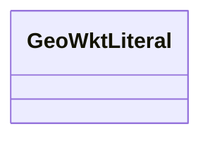

# Class: TODO -- what's a good name for this class (type)? (geo_wktLiteral)


_TODO -- tell the world what this class (type) describes._


URI: [geo:wktLiteral](http://www.opengis.net/ont/geosparql#wktLiteral)





<!-- no inheritance hierarchy -->


## Slots

| Name | Cardinality and Range | Description | Inheritance |
| ---  | --- | --- | --- |


## Usages

| used by | used in | type | used |
| ---  | --- | --- | --- |
| [ContaminosoFeature](../classes/ContaminosoFeature.md) | [geo_hasSerialization](../slots/geo_hasSerialization.md) | range | [GeoWktLiteral](../classes/GeoWktLiteral.md) |
| [ContaminosoPoint](../classes/ContaminosoPoint.md) | [geo_hasSerialization](../slots/geo_hasSerialization.md) | range | [GeoWktLiteral](../classes/GeoWktLiteral.md) |
| [ContaminosoReleaseFeature](../classes/ContaminosoReleaseFeature.md) | [geo_hasSerialization](../slots/geo_hasSerialization.md) | range | [GeoWktLiteral](../classes/GeoWktLiteral.md) |
| [ContaminosoReleasePoint](../classes/ContaminosoReleasePoint.md) | [geo_hasSerialization](../slots/geo_hasSerialization.md) | range | [GeoWktLiteral](../classes/GeoWktLiteral.md) |
| [ContaminosoSamplePoint](../classes/ContaminosoSamplePoint.md) | [geo_hasSerialization](../slots/geo_hasSerialization.md) | range | [GeoWktLiteral](../classes/GeoWktLiteral.md) |
| [ContaminosoSampledFeaure](../classes/ContaminosoSampledFeaure.md) | [geo_hasSerialization](../slots/geo_hasSerialization.md) | range | [GeoWktLiteral](../classes/GeoWktLiteral.md) |
| [GeoFeature](../classes/GeoFeature.md) | [geo_hasSerialization](../slots/geo_hasSerialization.md) | range | [GeoWktLiteral](../classes/GeoWktLiteral.md) |
| [GeoGeometry](../classes/GeoGeometry.md) | [geo_hasSerialization](../slots/geo_hasSerialization.md) | range | [GeoWktLiteral](../classes/GeoWktLiteral.md) |
| [GeoGeometry](../classes/GeoGeometry.md) | [geo_asWKT](../slots/geo_asWKT.md) | range | [GeoWktLiteral](../classes/GeoWktLiteral.md) |
| [GeoSpatialObject](../classes/GeoSpatialObject.md) | [geo_hasSerialization](../slots/geo_hasSerialization.md) | range | [GeoWktLiteral](../classes/GeoWktLiteral.md) |
| [IlisgsISGS-Well](../classes/IlisgsISGS-Well.md) | [geo_hasSerialization](../slots/geo_hasSerialization.md) | range | [GeoWktLiteral](../classes/GeoWktLiteral.md) |
| [MeegadEGAD-SamplePoint](../classes/MeegadEGAD-SamplePoint.md) | [geo_hasSerialization](../slots/geo_hasSerialization.md) | range | [GeoWktLiteral](../classes/GeoWktLiteral.md) |
| [MemgsMGS-Well](../classes/MemgsMGS-Well.md) | [geo_hasSerialization](../slots/geo_hasSerialization.md) | range | [GeoWktLiteral](../classes/GeoWktLiteral.md) |
| [UsfrsFRS-Facility](../classes/UsfrsFRS-Facility.md) | [geo_hasSerialization](../slots/geo_hasSerialization.md) | range | [GeoWktLiteral](../classes/GeoWktLiteral.md) |
| [UssdwisCombinedDistributionSystem](../classes/UssdwisCombinedDistributionSystem.md) | [geo_hasSerialization](../slots/geo_hasSerialization.md) | range | [GeoWktLiteral](../classes/GeoWktLiteral.md) |
| [UssdwisPWS-SamplePoint](../classes/UssdwisPWS-SamplePoint.md) | [geo_hasSerialization](../slots/geo_hasSerialization.md) | range | [GeoWktLiteral](../classes/GeoWktLiteral.md) |
| [UssdwisPublicWaterSystem](../classes/UssdwisPublicWaterSystem.md) | [geo_hasSerialization](../slots/geo_hasSerialization.md) | range | [GeoWktLiteral](../classes/GeoWktLiteral.md) |
| [UssdwisPublicWaterSystem-CWS](../classes/UssdwisPublicWaterSystem-CWS.md) | [geo_hasSerialization](../slots/geo_hasSerialization.md) | range | [GeoWktLiteral](../classes/GeoWktLiteral.md) |
| [UssdwisPublicWaterSystem-GW](../classes/UssdwisPublicWaterSystem-GW.md) | [geo_hasSerialization](../slots/geo_hasSerialization.md) | range | [GeoWktLiteral](../classes/GeoWktLiteral.md) |
| [UssdwisPublicWaterSystem-NTNCWS](../classes/UssdwisPublicWaterSystem-NTNCWS.md) | [geo_hasSerialization](../slots/geo_hasSerialization.md) | range | [GeoWktLiteral](../classes/GeoWktLiteral.md) |
| [UssdwisPublicWaterSystem-SW](../classes/UssdwisPublicWaterSystem-SW.md) | [geo_hasSerialization](../slots/geo_hasSerialization.md) | range | [GeoWktLiteral](../classes/GeoWktLiteral.md) |
| [UssdwisPublicWaterSystem-TNCWS](../classes/UssdwisPublicWaterSystem-TNCWS.md) | [geo_hasSerialization](../slots/geo_hasSerialization.md) | range | [GeoWktLiteral](../classes/GeoWktLiteral.md) |


## TODOs

* TODO -- Todos for this class go here
* or you can delete the todos
* if you think the class is perfect.

## Identifier and Mapping Information


### Schema Source


* from schema: sawgraph-kg


## Mappings

| Mapping Type | Mapped Value |
| ---  | ---  |
| self | geo:wktLiteral |
| native | sawgraph-kg/:GeoWktLiteral |


## LinkML Source

<!-- TODO: investigate https://stackoverflow.com/questions/37606292/how-to-create-tabbed-code-blocks-in-mkdocs-or-sphinx -->

### Direct

<details>
```yaml
name: geo_wktLiteral
description: TODO -- tell the world what this class (type) describes.
title: TODO -- what's a good name for this class (type)?
todos:
- TODO -- Todos for this class go here
- or you can delete the todos
- if you think the class is perfect.
notes:
- Class with 0 occurences.
from_schema: sawgraph-kg
class_uri: geo:wktLiteral

```
</details>

### Induced

<details>
```yaml
name: geo_wktLiteral
description: TODO -- tell the world what this class (type) describes.
title: TODO -- what's a good name for this class (type)?
todos:
- TODO -- Todos for this class go here
- or you can delete the todos
- if you think the class is perfect.
notes:
- Class with 0 occurences.
from_schema: sawgraph-kg
class_uri: geo:wktLiteral

```
</details>