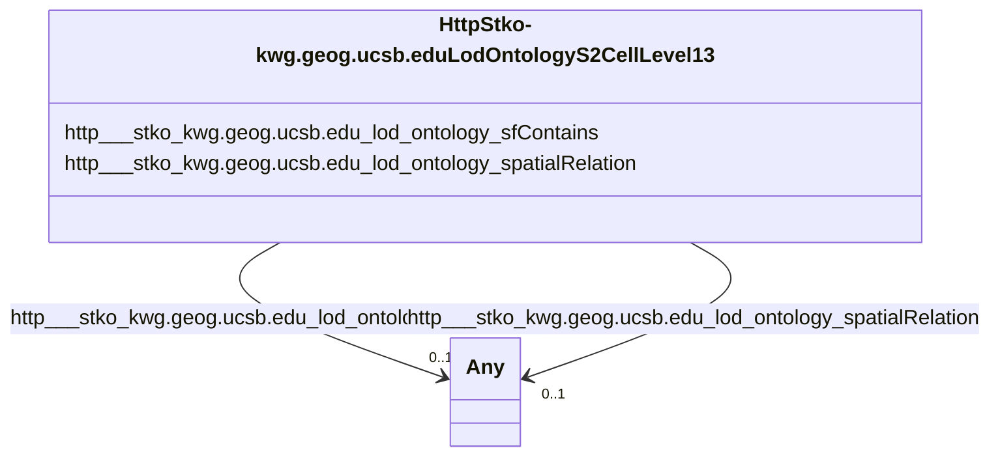

# Class: TODO -- what's a good name for this class (type)? (http___stko-kwg.geog.ucsb.edu_lod_ontology_S2Cell_Level13)


_No type description provided_


URI: [http://stko-kwg.geog.ucsb.edu/lod/ontology/S2Cell_Level13](http://stko-kwg.geog.ucsb.edu/lod/ontology/S2Cell_Level13)





<!-- no inheritance hierarchy -->


## Slots

| Name | Cardinality and Range | Description | Inheritance |
| ---  | --- | --- | --- |
| [http___stko_kwg.geog.ucsb.edu_lod_ontology_spatialRelation](../slots/http___stko_kwg.geog.ucsb.edu_lod_ontology_spatialRelation.md) | 0..1 <br/> [ContaminosoFeature](../classes/ContaminosoFeature.md)&nbsp;or&nbsp;<br />[HttpStko-kwg.geog.ucsb.eduLodOntologyS2CellLevel13](../classes/HttpStko-kwg.geog.ucsb.eduLodOntologyS2CellLevel13.md)&nbsp;or&nbsp;<br />[MeegadEGAD-Site](../classes/MeegadEGAD-Site.md)&nbsp;or&nbsp;<br />[ContaminosoPoint](../classes/ContaminosoPoint.md)&nbsp;or&nbsp;<br />[xsd:anyURI](http://www.w3.org/2001/XMLSchema#anyURI) | No slot description provided | direct |
| [http___stko_kwg.geog.ucsb.edu_lod_ontology_sfContains](../slots/http___stko_kwg.geog.ucsb.edu_lod_ontology_sfContains.md) | 0..1 <br/> [ContaminosoFeature](../classes/ContaminosoFeature.md)&nbsp;or&nbsp;<br />[MeegadEGAD-Site](../classes/MeegadEGAD-Site.md)&nbsp;or&nbsp;<br />[ContaminosoPoint](../classes/ContaminosoPoint.md) | No slot description provided | direct |


## Usages

| used by | used in | type | used |
| ---  | --- | --- | --- |
| [ContaminosoFeature](../classes/ContaminosoFeature.md) | [http___stko_kwg.geog.ucsb.edu_lod_ontology_spatialRelation](../slots/http___stko_kwg.geog.ucsb.edu_lod_ontology_spatialRelation.md) | any_of[range] | [HttpStko-kwg.geog.ucsb.eduLodOntologyS2CellLevel13](../classes/HttpStko-kwg.geog.ucsb.eduLodOntologyS2CellLevel13.md) |
| [ContaminosoFeature](../classes/ContaminosoFeature.md) | [http___stko_kwg.geog.ucsb.edu_lod_ontology_sfWithin](../slots/http___stko_kwg.geog.ucsb.edu_lod_ontology_sfWithin.md) | any_of[range] | [HttpStko-kwg.geog.ucsb.eduLodOntologyS2CellLevel13](../classes/HttpStko-kwg.geog.ucsb.eduLodOntologyS2CellLevel13.md) |
| [ContaminosoPoint](../classes/ContaminosoPoint.md) | [http___stko_kwg.geog.ucsb.edu_lod_ontology_spatialRelation](../slots/http___stko_kwg.geog.ucsb.edu_lod_ontology_spatialRelation.md) | any_of[range] | [HttpStko-kwg.geog.ucsb.eduLodOntologyS2CellLevel13](../classes/HttpStko-kwg.geog.ucsb.eduLodOntologyS2CellLevel13.md) |
| [ContaminosoPoint](../classes/ContaminosoPoint.md) | [http___stko_kwg.geog.ucsb.edu_lod_ontology_sfWithin](../slots/http___stko_kwg.geog.ucsb.edu_lod_ontology_sfWithin.md) | any_of[range] | [HttpStko-kwg.geog.ucsb.eduLodOntologyS2CellLevel13](../classes/HttpStko-kwg.geog.ucsb.eduLodOntologyS2CellLevel13.md) |
| [HttpStko-kwg.geog.ucsb.eduLodOntologyS2CellLevel13](../classes/HttpStko-kwg.geog.ucsb.eduLodOntologyS2CellLevel13.md) | [http___stko_kwg.geog.ucsb.edu_lod_ontology_spatialRelation](../slots/http___stko_kwg.geog.ucsb.edu_lod_ontology_spatialRelation.md) | any_of[range] | [HttpStko-kwg.geog.ucsb.eduLodOntologyS2CellLevel13](../classes/HttpStko-kwg.geog.ucsb.eduLodOntologyS2CellLevel13.md) |
| [MeegadEGAD-Site](../classes/MeegadEGAD-Site.md) | [http___stko_kwg.geog.ucsb.edu_lod_ontology_spatialRelation](../slots/http___stko_kwg.geog.ucsb.edu_lod_ontology_spatialRelation.md) | any_of[range] | [HttpStko-kwg.geog.ucsb.eduLodOntologyS2CellLevel13](../classes/HttpStko-kwg.geog.ucsb.eduLodOntologyS2CellLevel13.md) |
| [MeegadEGAD-Site](../classes/MeegadEGAD-Site.md) | [http___stko_kwg.geog.ucsb.edu_lod_ontology_sfWithin](../slots/http___stko_kwg.geog.ucsb.edu_lod_ontology_sfWithin.md) | any_of[range] | [HttpStko-kwg.geog.ucsb.eduLodOntologyS2CellLevel13](../classes/HttpStko-kwg.geog.ucsb.eduLodOntologyS2CellLevel13.md) |


## TODOs

* TODO -- Todos for this class go here
* or you can delete the todos
* if you think the class is perfect.

## Identifier and Mapping Information


### Schema Source


* from schema: sawgraph-kg


## Mappings

| Mapping Type | Mapped Value |
| ---  | ---  |
| self | http://stko-kwg.geog.ucsb.edu/lod/ontology/S2Cell_Level13 |
| native | sawgraph-kg/:HttpStko-kwg.geog.ucsb.eduLodOntologyS2CellLevel13 |


## LinkML Source

<!-- TODO: investigate https://stackoverflow.com/questions/37606292/how-to-create-tabbed-code-blocks-in-mkdocs-or-sphinx -->

### Direct

<details>
```yaml
name: http___stko-kwg.geog.ucsb.edu_lod_ontology_S2Cell_Level13
description: No type description provided
title: TODO -- what's a good name for this class (type)?
todos:
- TODO -- Todos for this class go here
- or you can delete the todos
- if you think the class is perfect.
notes:
- Class with 86332 occurences.
from_schema: sawgraph-kg
rank: 1000
slots:
- http___stko-kwg.geog.ucsb.edu_lod_ontology_spatialRelation
- http___stko-kwg.geog.ucsb.edu_lod_ontology_sfContains
class_uri: http://stko-kwg.geog.ucsb.edu/lod/ontology/S2Cell_Level13

```
</details>

### Induced

<details>
```yaml
name: http___stko-kwg.geog.ucsb.edu_lod_ontology_S2Cell_Level13
description: No type description provided
title: TODO -- what's a good name for this class (type)?
todos:
- TODO -- Todos for this class go here
- or you can delete the todos
- if you think the class is perfect.
notes:
- Class with 86332 occurences.
from_schema: sawgraph-kg
rank: 1000
attributes:
  http___stko-kwg.geog.ucsb.edu_lod_ontology_spatialRelation:
    name: http___stko-kwg.geog.ucsb.edu_lod_ontology_spatialRelation
    description: No slot description provided
    title: No slot description provided
    todos:
    - TODO -- Todos for this slot go here
    - or you can delete the todos
    - if you think the class is perfect.
    comments:
    - 4502 occurrences with subject type contaminoso_Point and object type http___stko-kwg.geog.ucsb.edu_lod_ontology_S2Cell_Level13.
    - 4509 occurrences with subject type contaminoso_Point and object type uri.
    - 883 occurrences with subject type meegad_EGAD-Site and object type http___stko-kwg.geog.ucsb.edu_lod_ontology_S2Cell_Level13.
    - 883 occurrences with subject type meegad_EGAD-Site and object type uri.
    - 166097 occurrences with subject type contaminoso_Feature and object type uri.
    - 83049 occurrences with subject type contaminoso_Feature and object type http___stko-kwg.geog.ucsb.edu_lod_ontology_S2Cell_Level13.
    - 166097 occurrences with untyped subjects and object type http://sawgraph.spatialai.org/v1/contaminoso#Feature.
    - 83049 occurrences with subject type http___stko-kwg.geog.ucsb.edu_lod_ontology_S2Cell_Level13
      and object type contaminoso_Feature.
    - 4502 occurrences with subject type http___stko-kwg.geog.ucsb.edu_lod_ontology_S2Cell_Level13
      and object type contaminoso_Point.
    - 883 occurrences with subject type http___stko-kwg.geog.ucsb.edu_lod_ontology_S2Cell_Level13
      and object type meegad_EGAD-Site.
    - 4509 occurrences with untyped subjects and object type http://sawgraph.spatialai.org/v1/contaminoso#Point.
    - 883 occurrences with untyped subjects and object type http://sawgraph.spatialai.org/v1/me-egad#EGAD-Site.
    examples:
    - value: http://sawgraph.spatialai.org/v1/me-egad-data#samplePoint.99544 http://stko-kwg.geog.ucsb.edu/lod/ontology/spatialRelation
        http://stko-kwg.geog.ucsb.edu/lod/resource/s2.level13.5525962011738898432
    - value: http://sawgraph.spatialai.org/v1/me-egad-data#samplePoint.100410 http://stko-kwg.geog.ucsb.edu/lod/ontology/spatialRelation
        https://datacommons.org/browser/geoId/2302778255
    - value: http://sawgraph.spatialai.org/v1/me-egad-data#site.99425 http://stko-kwg.geog.ucsb.edu/lod/ontology/spatialRelation
        http://stko-kwg.geog.ucsb.edu/lod/resource/s2.level13.5526457204288258048
    - value: http://sawgraph.spatialai.org/v1/me-egad-data#site.100843 http://stko-kwg.geog.ucsb.edu/lod/ontology/spatialRelation
        https://datacommons.org/browser/geoId/2301902795
    - value: http://sawgraph.spatialai.org/v1/me-mgs-data#d.MGS-Well.1 http://stko-kwg.geog.ucsb.edu/lod/ontology/spatialRelation
        http://stko-kwg.geog.ucsb.edu/lod/resource/s2.level13.12758972776866381824
    - value: http://sawgraph.spatialai.org/v1/me-mgs-data#d.MGS-Well.99999 http://stko-kwg.geog.ucsb.edu/lod/ontology/spatialRelation
        http://stko-kwg.geog.ucsb.edu/lod/resource/s2.level13.5526564922068041728
    - value: https://datacommons.org/browser/geoId/2303187985 http://stko-kwg.geog.ucsb.edu/lod/ontology/spatialRelation
        http://sawgraph.spatialai.org/v1/me-mgs-data#d.MGS-Well.99481
    - value: http://stko-kwg.geog.ucsb.edu/lod/resource/s2.level13.9935713923632201728
        http://stko-kwg.geog.ucsb.edu/lod/ontology/spatialRelation http://sawgraph.spatialai.org/v1/me-mgs-data#d.MGS-Well.109845
    - value: http://stko-kwg.geog.ucsb.edu/lod/resource/s2.level13.9935713992351678464
        http://stko-kwg.geog.ucsb.edu/lod/ontology/spatialRelation http://sawgraph.spatialai.org/v1/me-egad-data#samplePoint.140133
    - value: http://stko-kwg.geog.ucsb.edu/lod/resource/s2.level13.9935713923632201728
        http://stko-kwg.geog.ucsb.edu/lod/ontology/spatialRelation http://sawgraph.spatialai.org/v1/me-egad-data#site.79458
    - value: https://datacommons.org/browser/geoId/2303187985 http://stko-kwg.geog.ucsb.edu/lod/ontology/spatialRelation
        http://sawgraph.spatialai.org/v1/me-egad-data#samplePoint.150408
    - value: https://datacommons.org/browser/geoId/2303187985 http://stko-kwg.geog.ucsb.edu/lod/ontology/spatialRelation
        http://sawgraph.spatialai.org/v1/me-egad-data#site.47474
    from_schema: sawgraph-kg
    rank: 1000
    slot_uri: http://stko-kwg.geog.ucsb.edu/lod/ontology/spatialRelation
    alias: http___stko_kwg.geog.ucsb.edu_lod_ontology_spatialRelation
    owner: http___stko-kwg.geog.ucsb.edu_lod_ontology_S2Cell_Level13
    domain_of:
    - contaminoso_Feature
    - contaminoso_Point
    - http___stko-kwg.geog.ucsb.edu_lod_ontology_S2Cell_Level13
    - meegad_EGAD-Site
    range: Any
    any_of:
    - range: contaminoso_Feature
    - range: http___stko-kwg.geog.ucsb.edu_lod_ontology_S2Cell_Level13
    - range: meegad_EGAD-Site
    - range: contaminoso_Point
    - range: uri
  http___stko-kwg.geog.ucsb.edu_lod_ontology_sfContains:
    name: http___stko-kwg.geog.ucsb.edu_lod_ontology_sfContains
    description: No slot description provided
    title: No slot description provided
    todos:
    - TODO -- Todos for this slot go here
    - or you can delete the todos
    - if you think the class is perfect.
    comments:
    - 166097 occurrences with untyped subjects and object type http://sawgraph.spatialai.org/v1/contaminoso#Feature.
    - 83049 occurrences with subject type http___stko-kwg.geog.ucsb.edu_lod_ontology_S2Cell_Level13
      and object type contaminoso_Feature.
    - 4502 occurrences with subject type http___stko-kwg.geog.ucsb.edu_lod_ontology_S2Cell_Level13
      and object type contaminoso_Point.
    - 883 occurrences with subject type http___stko-kwg.geog.ucsb.edu_lod_ontology_S2Cell_Level13
      and object type meegad_EGAD-Site.
    - 4509 occurrences with untyped subjects and object type http://sawgraph.spatialai.org/v1/contaminoso#Point.
    - 883 occurrences with untyped subjects and object type http://sawgraph.spatialai.org/v1/me-egad#EGAD-Site.
    examples:
    - value: https://datacommons.org/browser/geoId/2303187985 http://stko-kwg.geog.ucsb.edu/lod/ontology/sfContains
        http://sawgraph.spatialai.org/v1/me-mgs-data#d.MGS-Well.99481
    - value: http://stko-kwg.geog.ucsb.edu/lod/resource/s2.level13.9935713923632201728
        http://stko-kwg.geog.ucsb.edu/lod/ontology/sfContains http://sawgraph.spatialai.org/v1/me-mgs-data#d.MGS-Well.109845
    - value: http://stko-kwg.geog.ucsb.edu/lod/resource/s2.level13.9935713992351678464
        http://stko-kwg.geog.ucsb.edu/lod/ontology/sfContains http://sawgraph.spatialai.org/v1/me-egad-data#samplePoint.140133
    - value: http://stko-kwg.geog.ucsb.edu/lod/resource/s2.level13.9935713923632201728
        http://stko-kwg.geog.ucsb.edu/lod/ontology/sfContains http://sawgraph.spatialai.org/v1/me-egad-data#site.79458
    - value: https://datacommons.org/browser/geoId/2303187985 http://stko-kwg.geog.ucsb.edu/lod/ontology/sfContains
        http://sawgraph.spatialai.org/v1/me-egad-data#samplePoint.150408
    - value: https://datacommons.org/browser/geoId/2303187985 http://stko-kwg.geog.ucsb.edu/lod/ontology/sfContains
        http://sawgraph.spatialai.org/v1/me-egad-data#site.47474
    from_schema: sawgraph-kg
    rank: 1000
    slot_uri: http://stko-kwg.geog.ucsb.edu/lod/ontology/sfContains
    alias: http___stko_kwg.geog.ucsb.edu_lod_ontology_sfContains
    owner: http___stko-kwg.geog.ucsb.edu_lod_ontology_S2Cell_Level13
    domain_of:
    - http___stko-kwg.geog.ucsb.edu_lod_ontology_S2Cell_Level13
    subproperty_of: http___stko-kwg.geog.ucsb.edu_lod_ontology_spatialRelation
    range: Any
    any_of:
    - range: contaminoso_Feature
    - range: meegad_EGAD-Site
    - range: contaminoso_Point
class_uri: http://stko-kwg.geog.ucsb.edu/lod/ontology/S2Cell_Level13

```
</details>