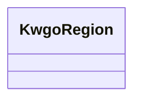

# Class: Region (kwgo_Region)


_A geographic entity created by the selection of characteristics that are relevant to an area of interest. It can have geometries including point, polyline and polygon._


This class occurs 546 times.


URI: [kwgo:Region](http://stko-kwg.geog.ucsb.edu/lod/ontology/Region)





<!-- no inheritance hierarchy -->


## Slots

| Name | Cardinality and Range | Description | Inheritance | Occurrences |
| ---  | --- | --- | --- | --- |


## Usages

| used by | used in | type | used |
| ---  | --- | --- | --- |
| [HttpW3id.orgSawgraphV1Me-egad#EGAD-PFAS-Site](../classes/HttpW3id.orgSawgraphV1Me-egad#EGAD-PFAS-Site.md) | [spatial_spatiallyRelatedTo](../slots/spatial_spatiallyRelatedTo.md) | any_of[range] | [KwgoRegion](../classes/KwgoRegion.md) |
| [HttpW3id.orgSawgraphV1Me-egad#EGAD-PFAS-Site](../classes/HttpW3id.orgSawgraphV1Me-egad#EGAD-PFAS-Site.md) | [spatial_connectedTo](../slots/spatial_connectedTo.md) | any_of[range] | [KwgoRegion](../classes/KwgoRegion.md) |
| [HttpW3id.orgSawgraphV1Me-egad#EGAD-SamplePoint](../classes/HttpW3id.orgSawgraphV1Me-egad#EGAD-SamplePoint.md) | [spatial_spatiallyRelatedTo](../slots/spatial_spatiallyRelatedTo.md) | any_of[range] | [KwgoRegion](../classes/KwgoRegion.md) |
| [HttpW3id.orgSawgraphV1Me-egad#EGAD-SamplePoint](../classes/HttpW3id.orgSawgraphV1Me-egad#EGAD-SamplePoint.md) | [spatial_connectedTo](../slots/spatial_connectedTo.md) | any_of[range] | [KwgoRegion](../classes/KwgoRegion.md) |
| [KwgoS2CellLevel13](../classes/KwgoS2CellLevel13.md) | [spatial_spatiallyRelatedTo](../slots/spatial_spatiallyRelatedTo.md) | any_of[range] | [KwgoRegion](../classes/KwgoRegion.md) |
| [KwgoS2CellLevel13](../classes/KwgoS2CellLevel13.md) | [spatial_connectedTo](../slots/spatial_connectedTo.md) | any_of[range] | [KwgoRegion](../classes/KwgoRegion.md) |
| [MeEgadEGAD-PFAS-Site](../classes/MeEgadEGAD-PFAS-Site.md) | [spatial_spatiallyRelatedTo](../slots/spatial_spatiallyRelatedTo.md) | any_of[range] | [KwgoRegion](../classes/KwgoRegion.md) |
| [MeEgadEGAD-PFAS-Site](../classes/MeEgadEGAD-PFAS-Site.md) | [spatial_connectedTo](../slots/spatial_connectedTo.md) | any_of[range] | [KwgoRegion](../classes/KwgoRegion.md) |
| [MeEgadEGAD-SamplePoint](../classes/MeEgadEGAD-SamplePoint.md) | [spatial_spatiallyRelatedTo](../slots/spatial_spatiallyRelatedTo.md) | any_of[range] | [KwgoRegion](../classes/KwgoRegion.md) |
| [MeEgadEGAD-SamplePoint](../classes/MeEgadEGAD-SamplePoint.md) | [spatial_connectedTo](../slots/spatial_connectedTo.md) | any_of[range] | [KwgoRegion](../classes/KwgoRegion.md) |


## LinkML Source

<!-- TODO: investigate https://stackoverflow.com/questions/37606292/how-to-create-tabbed-code-blocks-in-mkdocs-or-sphinx -->

### Direct

<details>

```yaml
name: kwgo_Region
description: A geographic entity created by the selection of characteristics that
  are relevant to an area of interest. It can have geometries including point, polyline
  and polygon.
title: Region
from_schema: okns:kwg
class_uri: kwgo:Region

```
</details>

### Induced

<details>

```yaml
name: kwgo_Region
description: A geographic entity created by the selection of characteristics that
  are relevant to an area of interest. It can have geometries including point, polyline
  and polygon.
title: Region
from_schema: okns:kwg
class_uri: kwgo:Region

```
</details>