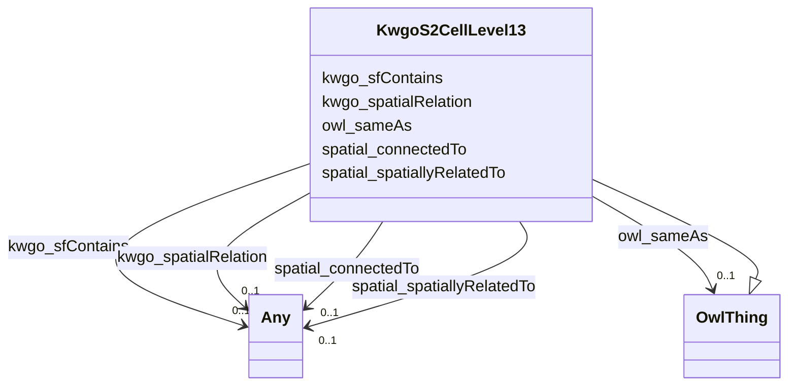

# Class: KwgoS2CellLevel13


This class occurs 86344 times.


URI: [kwgo:S2Cell_Level13](http://stko-kwg.geog.ucsb.edu/lod/ontology/S2Cell_Level13)





## Inheritance
* [OwlThing](../classes/OwlThing.md)
    * **KwgoS2CellLevel13**


## Slots

| Name | Cardinality and Range | Description | Inheritance | Occurrences |
| ---  | --- | --- | --- | --- |
| [kwgo_spatialRelation](../slots/kwgo_spatialRelation.md) | 0..1 <br/> [Any](../classes/Any.md) | KWG's general spatial relation <br/>  | direct | 10886 |
| [spatial_spatiallyRelatedTo](../slots/spatial_spatiallyRelatedTo.md) | 0..1 <br/> [KwgoS2CellLevel13](../classes/KwgoS2CellLevel13.md)&nbsp;or&nbsp;<br />[KwgoAdministrativeRegion](../classes/KwgoAdministrativeRegion.md)&nbsp;or&nbsp;<br />[OwlThing](../classes/OwlThing.md)&nbsp;or&nbsp;<br />[MeEgadEGAD-SamplePoint](../classes/MeEgadEGAD-SamplePoint.md)&nbsp;or&nbsp;<br />[KwgoAdministrativeRegion3](../classes/KwgoAdministrativeRegion3.md)&nbsp;or&nbsp;<br />[HttpW3id.orgSawgraphV1Me-egad#EGAD-SamplePoint](../classes/HttpW3id.orgSawgraphV1Me-egad#EGAD-SamplePoint.md)&nbsp;or&nbsp;<br />[MeEgadEGAD-PFAS-Site](../classes/MeEgadEGAD-PFAS-Site.md)&nbsp;or&nbsp;<br />[HttpW3id.orgSawgraphV1Me-egad#EGAD-PFAS-Site](../classes/HttpW3id.orgSawgraphV1Me-egad#EGAD-PFAS-Site.md)&nbsp;or&nbsp;<br />[GeoSpatialObject](../classes/GeoSpatialObject.md)&nbsp;or&nbsp;<br />[KwgoRegion](../classes/KwgoRegion.md) |  <br/>  | direct | 10886 |
| [owl_sameAs](../slots/owl_sameAs.md) | 0..1 <br/> [OwlThing](../classes/OwlThing.md) | The property that determines that two given individuals are equal <br/>  | direct | 86344 |
| [kwgo_sfContains](../slots/kwgo_sfContains.md) | 0..1 <br/> [Any](../classes/Any.md) | KWG's spatial contains relation <br/>  | direct | 10886 |
| [spatial_connectedTo](../slots/spatial_connectedTo.md) | 0..1 <br/> [KwgoS2CellLevel13](../classes/KwgoS2CellLevel13.md)&nbsp;or&nbsp;<br />[KwgoAdministrativeRegion](../classes/KwgoAdministrativeRegion.md)&nbsp;or&nbsp;<br />[OwlThing](../classes/OwlThing.md)&nbsp;or&nbsp;<br />[MeEgadEGAD-SamplePoint](../classes/MeEgadEGAD-SamplePoint.md)&nbsp;or&nbsp;<br />[KwgoAdministrativeRegion3](../classes/KwgoAdministrativeRegion3.md)&nbsp;or&nbsp;<br />[HttpW3id.orgSawgraphV1Me-egad#EGAD-SamplePoint](../classes/HttpW3id.orgSawgraphV1Me-egad#EGAD-SamplePoint.md)&nbsp;or&nbsp;<br />[MeEgadEGAD-PFAS-Site](../classes/MeEgadEGAD-PFAS-Site.md)&nbsp;or&nbsp;<br />[HttpW3id.orgSawgraphV1Me-egad#EGAD-PFAS-Site](../classes/HttpW3id.orgSawgraphV1Me-egad#EGAD-PFAS-Site.md)&nbsp;or&nbsp;<br />[GeoSpatialObject](../classes/GeoSpatialObject.md)&nbsp;or&nbsp;<br />[KwgoRegion](../classes/KwgoRegion.md) |  <br/>  | direct | 10886 |


## Usages

| used by | used in | type | used |
| ---  | --- | --- | --- |
| [HttpW3id.orgSawgraphV1Me-egad#EGAD-PFAS-Site](../classes/HttpW3id.orgSawgraphV1Me-egad#EGAD-PFAS-Site.md) | [spatial_spatiallyRelatedTo](../slots/spatial_spatiallyRelatedTo.md) | any_of[range] | [KwgoS2CellLevel13](../classes/KwgoS2CellLevel13.md) |
| [HttpW3id.orgSawgraphV1Me-egad#EGAD-PFAS-Site](../classes/HttpW3id.orgSawgraphV1Me-egad#EGAD-PFAS-Site.md) | [spatial_connectedTo](../slots/spatial_connectedTo.md) | any_of[range] | [KwgoS2CellLevel13](../classes/KwgoS2CellLevel13.md) |
| [HttpW3id.orgSawgraphV1Me-egad#EGAD-SamplePoint](../classes/HttpW3id.orgSawgraphV1Me-egad#EGAD-SamplePoint.md) | [spatial_spatiallyRelatedTo](../slots/spatial_spatiallyRelatedTo.md) | any_of[range] | [KwgoS2CellLevel13](../classes/KwgoS2CellLevel13.md) |
| [HttpW3id.orgSawgraphV1Me-egad#EGAD-SamplePoint](../classes/HttpW3id.orgSawgraphV1Me-egad#EGAD-SamplePoint.md) | [spatial_connectedTo](../slots/spatial_connectedTo.md) | any_of[range] | [KwgoS2CellLevel13](../classes/KwgoS2CellLevel13.md) |
| [KwgoS2CellLevel13](../classes/KwgoS2CellLevel13.md) | [spatial_spatiallyRelatedTo](../slots/spatial_spatiallyRelatedTo.md) | any_of[range] | [KwgoS2CellLevel13](../classes/KwgoS2CellLevel13.md) |
| [KwgoS2CellLevel13](../classes/KwgoS2CellLevel13.md) | [spatial_connectedTo](../slots/spatial_connectedTo.md) | any_of[range] | [KwgoS2CellLevel13](../classes/KwgoS2CellLevel13.md) |
| [MeEgadEGAD-PFAS-Site](../classes/MeEgadEGAD-PFAS-Site.md) | [spatial_spatiallyRelatedTo](../slots/spatial_spatiallyRelatedTo.md) | any_of[range] | [KwgoS2CellLevel13](../classes/KwgoS2CellLevel13.md) |
| [MeEgadEGAD-PFAS-Site](../classes/MeEgadEGAD-PFAS-Site.md) | [spatial_connectedTo](../slots/spatial_connectedTo.md) | any_of[range] | [KwgoS2CellLevel13](../classes/KwgoS2CellLevel13.md) |
| [MeEgadEGAD-SamplePoint](../classes/MeEgadEGAD-SamplePoint.md) | [spatial_spatiallyRelatedTo](../slots/spatial_spatiallyRelatedTo.md) | any_of[range] | [KwgoS2CellLevel13](../classes/KwgoS2CellLevel13.md) |
| [MeEgadEGAD-SamplePoint](../classes/MeEgadEGAD-SamplePoint.md) | [spatial_connectedTo](../slots/spatial_connectedTo.md) | any_of[range] | [KwgoS2CellLevel13](../classes/KwgoS2CellLevel13.md) |


## LinkML Source

<!-- TODO: investigate https://stackoverflow.com/questions/37606292/how-to-create-tabbed-code-blocks-in-mkdocs-or-sphinx -->

### Direct

<details>

```yaml
name: kwgo_S2Cell_Level13
from_schema: okns:sawgraph-kg
rank: 1000
is_a: owl_Thing
slots:
- kwgo_spatialRelation
- spatial_spatiallyRelatedTo
- owl_sameAs
- kwgo_sfContains
- spatial_connectedTo
class_uri: kwgo:S2Cell_Level13

```
</details>

### Induced

<details>

```yaml
name: kwgo_S2Cell_Level13
from_schema: okns:sawgraph-kg
rank: 1000
is_a: owl_Thing
attributes:
  kwgo_spatialRelation:
    name: kwgo_spatialRelation
    description: KWG's general spatial relation
    title: spatial relation
    notes:
    - No occurrences of this slot in the graph.
    from_schema: okns:kwg
    slot_uri: kwgo:spatialRelation
    alias: kwgo_spatialRelation
    owner: kwgo_S2Cell_Level13
    domain_of:
    - http___w3id.org_sawgraph_v1_me-egad#EGAD-PFAS-Site
    - http___w3id.org_sawgraph_v1_me-egad#EGAD-SamplePoint
    - kwgo_S2Cell_Level13
    - me_egad_EGAD-PFAS-Site
    - me_egad_EGAD-SamplePoint
    range: Any
  spatial_spatiallyRelatedTo:
    name: spatial_spatiallyRelatedTo
    title: topological connection (spatial contact) (sawgraph)
    from_schema: okns:sawgraph-kg
    exact_mappings:
    - http://stko-kwg.geog.ucsb.edu/lod/ontology/spatialRelation
    rank: 1000
    slot_uri: spatial:spatiallyRelatedTo
    alias: spatial_spatiallyRelatedTo
    owner: kwgo_S2Cell_Level13
    domain_of:
    - http___w3id.org_sawgraph_v1_me-egad#EGAD-PFAS-Site
    - http___w3id.org_sawgraph_v1_me-egad#EGAD-SamplePoint
    - kwgo_S2Cell_Level13
    - me_egad_EGAD-PFAS-Site
    - me_egad_EGAD-SamplePoint
    subproperty_of: kwgo_spatialRelation
    union_of:
    - owl_Thing
    - geo_SpatialObject
    range: Any
    any_of:
    - range: kwgo_S2Cell_Level13
    - range: kwgo_AdministrativeRegion
    - range: owl_Thing
    - range: me_egad_EGAD-SamplePoint
    - range: kwgo_AdministrativeRegion_3
    - range: http___w3id.org_sawgraph_v1_me-egad#EGAD-SamplePoint
    - range: me_egad_EGAD-PFAS-Site
    - range: http___w3id.org_sawgraph_v1_me-egad#EGAD-PFAS-Site
    - range: geo_SpatialObject
    - range: kwgo_Region
  owl_sameAs:
    name: owl_sameAs
    description: The property that determines that two given individuals are equal.
    title: sameAs
    notes:
    - No occurrences of this slot in the graph.
    from_schema: okns:owl-rdf-rdfs
    source: http://www.w3.org/2002/07/owl#
    domain: owl_Thing
    slot_uri: owl:sameAs
    alias: owl_sameAs
    owner: kwgo_S2Cell_Level13
    domain_of:
    - __B00af777bec4da87c5aebb51d94b2d478
    - __B036a3008450d6ce37e35cf5a98355a60
    - __B085dcda89ed6aae0d3b229e767f0a1ca
    - __B0d427a711311f1499a234aa8af2c66d1
    - __B215b3a432e1c482d3680398a554edbbf
    - __B27231c83f17c76e178e0c9f5e10acc55
    - __B37977f50d3140da51a9630b8a57396a1
    - __B3cc7b3721547b07a4068dc98b6444b8b
    - __B423a0e253807f20386fc3ccbbd7e0378
    - __B44bec873efc8b96cad5f525429c64e0a
    - __B4fd286b2a5a12e342d61412628b6e4c2
    - __B53622dee107de372b2d0566f64ab6e3a
    - __B5e93e815b548435105d9273d424fa0e8
    - __B611b8dff312692e7f32a69834c787a60
    - __B623b56ef58fd82dd088819e22d655c08
    - __B75dbc5841338872cea35dced609fcd77
    - __B75e45ed04b2b903b9029968cada06faa
    - __B7728f65369357f97de36b133c9d1d5e0
    - __B8aa8791a0418cd594c8b56ad21351f72
    - __Ba6d85f816540f9fec5b71ba42fc2cca6
    - __Ba76635ffb4afc02e78b9ef49973d089f
    - __Bb0125be5bc4dc7be7e8452e7d22445f6
    - __Bb71af62f2f3e5e5b5e0fe81f24eca409
    - __Bbefc37cbdd03cae92dadef76b34dbf16
    - __Bbf63deb85414ddecd89e46bce27e7f0a
    - __Be047d68edc8eb3ce96d7edbad5217bfc
    - __Be497d3b0c2656040c05e303873a2d541
    - __Beb7217b5b32080b9606028314249e33b
    - __Beb77c26f8c395403edc359fd5f6dfb28
    - __Bf04685c17c0e71ae3c98e08c75cbdfcc
    - __Bf584e1bfd1c74de0eb37e7b926538b83
    - coso_AnimalBloodSample
    - coso_AnimalMaterialSample
    - coso_AnimalMilkSample
    - coso_AnimalOrganSample
    - coso_AnimalTissueSample
    - coso_ContaminantConcentrationQuantityKind
    - coso_ContaminantVolumeQuantityKind
    - coso_ContaminationProperty
    - coso_DetectQuantityValue
    - coso_NonDetectQuantityValue
    - coso_PlantMaterialSample
    - coso_SubstanceCollection
    - coso_WaterSample
    - http___w3id.org_comptox_CompTox_ChemicalEntity
    - http___w3id.org_sawgraph_v1_me-egad#EGAD-AggregatePFAS-Concentration
    - http___w3id.org_sawgraph_v1_me-egad#EGAD-AnalysisMethod
    - http___w3id.org_sawgraph_v1_me-egad#EGAD-ConcentrationQualifier
    - http___w3id.org_sawgraph_v1_me-egad#EGAD-MethodDetectionLimit
    - http___w3id.org_sawgraph_v1_me-egad#EGAD-PFAS-Observation
    - http___w3id.org_sawgraph_v1_me-egad#EGAD-PFAS-ParameterName
    - http___w3id.org_sawgraph_v1_me-egad#EGAD-PFAS-Site
    - http___w3id.org_sawgraph_v1_me-egad#EGAD-ReportingLimit
    - http___w3id.org_sawgraph_v1_me-egad#EGAD-ResultType
    - http___w3id.org_sawgraph_v1_me-egad#EGAD-Sample
    - http___w3id.org_sawgraph_v1_me-egad#EGAD-SampleCollectionMethod
    - http___w3id.org_sawgraph_v1_me-egad#EGAD-SampleDetailedLocation
    - http___w3id.org_sawgraph_v1_me-egad#EGAD-SampleMaterialType
    - http___w3id.org_sawgraph_v1_me-egad#EGAD-SampleMaterialTypeQualifier
    - http___w3id.org_sawgraph_v1_me-egad#EGAD-SamplePoint
    - http___w3id.org_sawgraph_v1_me-egad#EGAD-SamplePointType
    - http___w3id.org_sawgraph_v1_me-egad#EGAD-SampleTreatmentStatus
    - http___w3id.org_sawgraph_v1_me-egad#EGAD-SampledFeature
    - http___w3id.org_sawgraph_v1_me-egad#EGAD-SinglePFAS-Concentration
    - http___w3id.org_sawgraph_v1_me-egad#EGAD-SiteType
    - http___w3id.org_sawgraph_v1_me-egad#EGAD-ValidationLevel
    - http___w3id.org_sawgraph_v1_me-egad-data#DefEGADBeefBloodSample
    - http___w3id.org_sawgraph_v1_me-egad-data#DefEGADDrinkingWaterSample
    - http___w3id.org_sawgraph_v1_me-egad-data#DefEGADGroundWaterSample
    - http___w3id.org_sawgraph_v1_me-egad-data#DefEGADPorkBloodSample
    - http___w3id.org_sawgraph_v1_me-egad-data#DefEGADSoilSample
    - http___w3id.org_sawgraph_v1_me-egad-data#DefEGADSurfaceWaterSample
    - kwgo_S2Cell_Level13
    - me_egad_EGAD-AggregatePFAS-Concentration
    - me_egad_EGAD-AnalysisMethod
    - me_egad_EGAD-ConcentrationQualifier
    - me_egad_EGAD-MethodDetectionLimit
    - me_egad_EGAD-PFAS-Observation
    - me_egad_EGAD-PFAS-ParameterName
    - me_egad_EGAD-PFAS-Site
    - me_egad_EGAD-ReportingLimit
    - me_egad_EGAD-ResultType
    - me_egad_EGAD-Sample
    - me_egad_EGAD-SampleCollectionMethod
    - me_egad_EGAD-SampleDetailedLocation
    - me_egad_EGAD-SampleMaterialType
    - me_egad_EGAD-SampleMaterialTypeQualifier
    - me_egad_EGAD-SamplePoint
    - me_egad_EGAD-SamplePointType
    - me_egad_EGAD-SampleTreatmentStatus
    - me_egad_EGAD-SampledFeature
    - me_egad_EGAD-SinglePFAS-Concentration
    - me_egad_EGAD-SiteType
    - me_egad_EGAD-ValidationLevel
    - obo_FOODON_00001093
    - obo_FOODON_00002165
    - obo_FOODON_00002477
    - obo_FOODON_00003042
    - obo_FOODON_00003083
    - obo_FOODON_00003425
    - obo_FOODON_00003572
    - obo_FOODON_00004172
    - obo_FOODON_00004436
    - obo_FOODON_00004460
    - obo_FOODON_02010012
    - obo_FOODON_02010015
    - obo_FOODON_02010032
    - obo_FOODON_02010042
    - obo_FOODON_02010045
    - obo_FOODON_02010107
    - obo_FOODON_02020840
    - obo_FOODON_02020892
    - obo_FOODON_02021651
    - obo_FOODON_02021803
    - obo_FOODON_02021805
    - obo_FOODON_03301761
    - obo_FOODON_03411057
    - obo_FOODON_03411183
    - obo_FOODON_03411236
    - obo_FOODON_03411324
    - obo_FOODON_03411325
    - obo_FOODON_03411328
    - obo_FOODON_03411457
    - obo_FOODON_03411566
    - obo_FOODON_03411583
    - obo_FOODON_03411669
    - obo_FOODON_03413358
    - obo_FOODON_03413378
    - obo_FOODON_03420116
    - obo_FOODON_03420147
    - obo_FOODON_03420150
    - obo_FOODON_03420181
    - obo_FOODON_03420194
    - obo_NCBITaxon_147949
    - obo_NCBITaxon_27706
    - obo_NCBITaxon_381124
    - obo_NCBITaxon_8010
    - obo_NCBITaxon_8038
    - obo_NCBITaxon_8182
    - stad_QualityKind
    - stad_StatisticalQuantityKind
    range: owl_Thing
  kwgo_sfContains:
    name: kwgo_sfContains
    description: KWG's spatial contains relation
    title: contains (simple feature)
    notes:
    - No occurrences of this slot in the graph.
    from_schema: okns:kwg
    slot_uri: kwgo:sfContains
    alias: kwgo_sfContains
    owner: kwgo_S2Cell_Level13
    domain_of:
    - kwgo_S2Cell_Level13
    subproperty_of: kwgo_spatialRelation
    range: Any
  spatial_connectedTo:
    name: spatial_connectedTo
    title: topological connection (spatial contact) (sawgraph)
    from_schema: okns:sawgraph-kg
    rank: 1000
    slot_uri: spatial:connectedTo
    alias: spatial_connectedTo
    owner: kwgo_S2Cell_Level13
    domain_of:
    - http___w3id.org_sawgraph_v1_me-egad#EGAD-PFAS-Site
    - http___w3id.org_sawgraph_v1_me-egad#EGAD-SamplePoint
    - kwgo_S2Cell_Level13
    - me_egad_EGAD-PFAS-Site
    - me_egad_EGAD-SamplePoint
    subproperty_of: kwgo_spatialRelation
    union_of:
    - owl_Thing
    - geo_SpatialObject
    range: Any
    any_of:
    - range: kwgo_S2Cell_Level13
    - range: kwgo_AdministrativeRegion
    - range: owl_Thing
    - range: me_egad_EGAD-SamplePoint
    - range: kwgo_AdministrativeRegion_3
    - range: http___w3id.org_sawgraph_v1_me-egad#EGAD-SamplePoint
    - range: me_egad_EGAD-PFAS-Site
    - range: http___w3id.org_sawgraph_v1_me-egad#EGAD-PFAS-Site
    - range: geo_SpatialObject
    - range: kwgo_Region
class_uri: kwgo:S2Cell_Level13

```
</details>