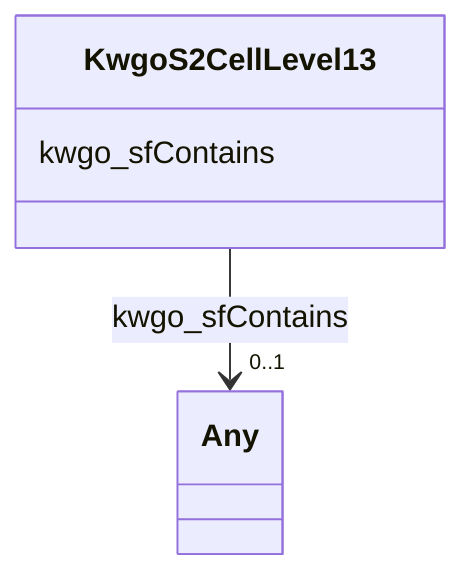

# Class: No class (type) name specified (kwgo_S2Cell_Level13)


_No class (type) description specified_


This class occurs 86332 times.


URI: [kwgo:S2Cell_Level13](http://stko-kwg.geog.ucsb.edu/lod/ontology/S2Cell_Level13)





<!-- no inheritance hierarchy -->


## Slots

| Name | Cardinality and Range | Description | Inheritance | Occurrences |
| ---  | --- | --- | --- | --- |
| [kwgo_sfContains](../slots/kwgo_sfContains.md) | 0..1 <br/> [MeEgadEGAD-PFAS-Site](../classes/MeEgadEGAD-PFAS-Site.md)&nbsp;or&nbsp;<br />[MeEgadEGAD-SamplePoint](../classes/MeEgadEGAD-SamplePoint.md)&nbsp;or&nbsp;<br />[MeEgadEGAD-Site](../classes/MeEgadEGAD-Site.md) | No slot (predicate) description specified <br/>  | direct | 6225 |


## Usages

| used by | used in | type | used |
| ---  | --- | --- | --- |
| [MeEgadEGAD-PFAS-Site](../classes/MeEgadEGAD-PFAS-Site.md) | [kwgo_sfWithin](../slots/kwgo_sfWithin.md) | any_of[range] | [KwgoS2CellLevel13](../classes/KwgoS2CellLevel13.md) |
| [MeEgadEGAD-SamplePoint](../classes/MeEgadEGAD-SamplePoint.md) | [kwgo_sfWithin](../slots/kwgo_sfWithin.md) | any_of[range] | [KwgoS2CellLevel13](../classes/KwgoS2CellLevel13.md) |
| [MeEgadEGAD-Site](../classes/MeEgadEGAD-Site.md) | [kwgo_sfWithin](../slots/kwgo_sfWithin.md) | any_of[range] | [KwgoS2CellLevel13](../classes/KwgoS2CellLevel13.md) |


## LinkML Source

<!-- TODO: investigate https://stackoverflow.com/questions/37606292/how-to-create-tabbed-code-blocks-in-mkdocs-or-sphinx -->

### Direct

<details>

```yaml
name: kwgo_S2Cell_Level13
conforms_to: No schema conformance document specified
annotations:
  count:
    tag: count
    value: 86332
description: No class (type) description specified
title: No class (type) name specified
from_schema: sawgraph-kg
rank: 1000
slots:
- kwgo_sfContains
slot_usage:
  kwgo_sfContains:
    name: kwgo_sfContains
    annotations:
      me_egad_EGAD-PFAS-Site:
        tag: me_egad_EGAD-PFAS-Site
        value: 883
      me_egad_EGAD-SamplePoint:
        tag: me_egad_EGAD-SamplePoint
        value: 4502
      me_egad_EGAD-Site:
        tag: me_egad_EGAD-Site
        value: 840
class_uri: kwgo:S2Cell_Level13

```
</details>

### Induced

<details>

```yaml
name: kwgo_S2Cell_Level13
conforms_to: No schema conformance document specified
annotations:
  count:
    tag: count
    value: 86332
description: No class (type) description specified
title: No class (type) name specified
from_schema: sawgraph-kg
rank: 1000
slot_usage:
  kwgo_sfContains:
    name: kwgo_sfContains
    annotations:
      me_egad_EGAD-PFAS-Site:
        tag: me_egad_EGAD-PFAS-Site
        value: 883
      me_egad_EGAD-SamplePoint:
        tag: me_egad_EGAD-SamplePoint
        value: 4502
      me_egad_EGAD-Site:
        tag: me_egad_EGAD-Site
        value: 840
attributes:
  kwgo_sfContains:
    name: kwgo_sfContains
    annotations:
      me_egad_EGAD-PFAS-Site:
        tag: me_egad_EGAD-PFAS-Site
        value: 883
      me_egad_EGAD-SamplePoint:
        tag: me_egad_EGAD-SamplePoint
        value: 4502
      me_egad_EGAD-Site:
        tag: me_egad_EGAD-Site
        value: 840
    description: No slot (predicate) description specified
    examples:
    - object:
        example_object: me_egad_data:samplePoint.148241
        example_object_type: me_egad_EGAD-SamplePoint
        example_predicate: kwgo:sfContains
        example_subject: kwgr:s2.level13.5522341972783661056
        example_subject_type: kwgo_S2Cell_Level13
    - object:
        example_object: me_egad_data:site.32387
        example_object_type: me_egad_EGAD-PFAS-Site
        example_predicate: kwgo:sfContains
        example_subject: kwgr:s2.level13.5522342797417381888
        example_subject_type: kwgo_S2Cell_Level13
    - object:
        example_object: me_egad_data:site.32386
        example_object_type: me_egad_EGAD-Site
        example_predicate: kwgo:sfContains
        example_subject: kwgr:s2.level13.5522349016530026496
        example_subject_type: kwgo_S2Cell_Level13
    - object:
        example_object: me_egad_data:samplePoint.136911
        example_object_type: me_egad_EGAD-SamplePoint
        example_predicate: kwgo:sfContains
        example_subject: kwgr:s2.level13.9801268321847345152
        example_subject_type: None
    - object:
        example_object: me_egad_data:site.47292
        example_object_type: me_egad_EGAD-PFAS-Site
        example_predicate: kwgo:sfContains
        example_subject: kwgr:s2.level13.9935758178975219712
        example_subject_type: None
    - object:
        example_object: me_egad_data:site.47292
        example_object_type: me_egad_EGAD-Site
        example_predicate: kwgo:sfContains
        example_subject: kwgr:s2.level13.9935758178975219712
        example_subject_type: None
    from_schema: sawgraph-kg
    rank: 1000
    slot_uri: kwgo:sfContains
    alias: kwgo_sfContains
    owner: kwgo_S2Cell_Level13
    domain_of:
    - kwgo_S2Cell_Level13
    range: Any
    any_of:
    - range: me_egad_EGAD-PFAS-Site
    - range: me_egad_EGAD-SamplePoint
    - range: me_egad_EGAD-Site
class_uri: kwgo:S2Cell_Level13

```
</details>